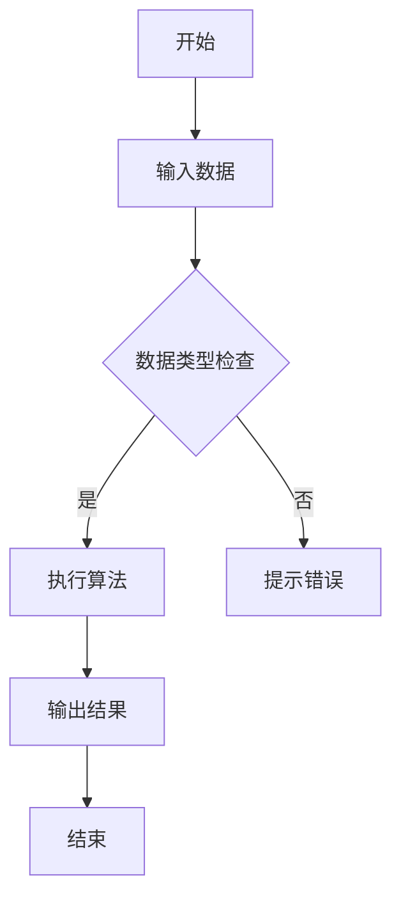
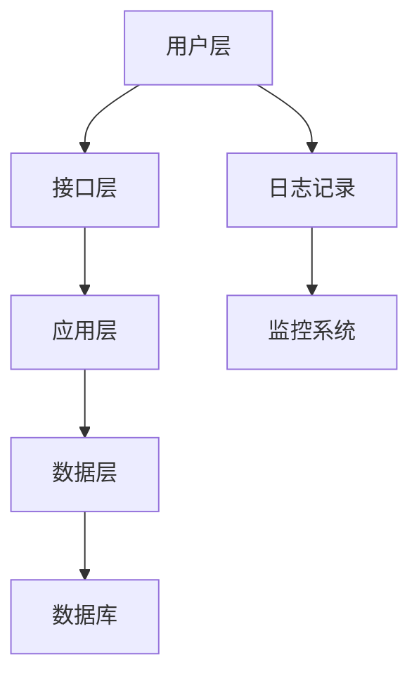

                 

## 第1章 问题背景

### 1.1 问题来源

在数学教育领域，如何更有效地传授数学知识和概念一直是教育工作者和研究人员关注的核心问题。传统的数学教育方式往往侧重于公式和定理的传授，而忽略了数学思想和方法论的培养。随着教育理念的不断发展，现代数学教育越来越注重培养学生的逻辑思维能力和解决问题的能力。

在这一背景下，罗素类型论作为形式逻辑和数学哲学的重要理论，被引入到数学教育实践中。罗素类型论由英国哲学家、数学家贝特兰·罗素（Bertrand Russell）提出，旨在解决逻辑和数学基础问题中的悖论，如集合论中的罗素悖论。其核心思想是通过区分不同类型的对象来避免悖论的产生。

然而，尽管罗素类型论在逻辑和数学哲学领域取得了巨大成功，但在实际应用于数学教育中，却面临诸多挑战和争议。首先，罗素类型论的抽象性和复杂性使得普通学生难以理解。其次，如何在数学教育中有效地整合罗素类型论，以及它对教学效果的影响，仍需要深入研究。

### 1.2 问题描述

罗素类型论在教育实践中的适应性问题主要体现在以下几个方面：

1. **理解难度**：罗素类型论的概念和理论体系相对复杂，对于数学基础薄弱的学生来说，理解难度较大。
2. **教学方法的适应性**：传统的教学方法往往注重知识点的传授，而罗素类型论则需要更注重逻辑思维和问题解决能力的培养。这要求教师的教学方法和策略需要相应调整。
3. **课程内容的设计**：如何在现有的数学课程体系中融入罗素类型论，使其既不偏离教学目标，又能提高学生的逻辑思维能力，是课程设计者需要考虑的问题。
4. **教育资源的配备**：罗素类型论的应用需要一定的教育资源支持，如专业的教材、教学工具等。然而，目前这些资源并不充分，限制了其在教育实践中的推广。

### 1.3 问题解决

为了解决罗素类型论在数学教育实践中的适应性问题，我们可以从以下几个方面入手：

1. **简化理论表述**：通过简化罗素类型论的基本概念和理论表述，使其更贴近学生的认知水平。
2. **案例教学**：通过实际案例来展示罗素类型论的应用，帮助学生理解其重要性。
3. **教学策略调整**：采用更加灵活和互动的教学策略，如小组讨论、实践操作等，以提高学生的学习兴趣和理解能力。
4. **课程设计与资源整合**：在课程设计和资源配备上，注重整合罗素类型论相关内容，提供适合学生学习的教材和工具。

### 1.4 边界与外延

**罗素类型论的定义与范畴**：
- 罗素类型论是一种形式逻辑理论，它通过区分不同类型的对象来解决逻辑和数学中的悖论问题。
- 类型论主要涉及概念如“对象类型”、“关系类型”、“函数类型”等。

**数学教育实践中的具体应用场景**：
- 在数学课程中引入类型论，帮助学生理解数学概念的本质。
- 在数学竞赛和课题研究中，利用类型论来解决复杂问题。
- 在数学教材和教辅资料中，融入类型论的基本原理和应用实例。

通过以上步骤，我们可以逐步深入探讨罗素类型论在数学教育实践中的适应性问题，为解决这一难题提供理论基础和实践指导。

### 第2章 核心概念与联系

#### 2.1 罗素类型论

罗素类型论是形式逻辑和数学哲学中的重要理论，由贝特兰·罗素提出，旨在解决逻辑和数学基础问题中的悖论。类型论的核心思想是通过区分不同类型的对象来避免悖论的产生，具体包括以下几个要点：

- **对象类型**：罗素将对象分为不同的类型，如原始类型和操作类型。原始类型代表最基本的对象，而操作类型则是通过原始类型组合生成的。
- **关系类型**：类型论中，关系也被视为一种对象，并赋予特定的类型。这样做的目的是为了确保在定义关系时不会产生逻辑悖论。
- **函数类型**：函数在类型论中作为一种特殊类型的对象，它映射一个类型到另一个类型。通过严格的类型定义，可以避免在函数定义和运算过程中出现不合理的结果。

#### 2.2 数学教育实践中的类型论应用

在数学教育实践中，类型论的应用主要体现在以下几个方面：

- **教材呈现**：数学教材中可以通过图示和实例来介绍类型论的基本概念，帮助学生理解类型论的重要性。
- **教学影响**：类型论的应用可以提升学生的逻辑思维和问题解决能力，使其在解决数学问题时更具条理性和系统性。
- **案例教学**：通过具体的数学问题案例，让学生应用类型论的方法进行解决，从而加深对类型论的理解和应用。

#### 2.3 概念属性特征对比表格

为了更清晰地展示罗素类型论与其他类型理论的对比，我们可以制作一个概念属性特征对比表格：

| 理论名称 | 对象类型 | 关系类型 | 函数类型 | 主要应用领域 |
|----------|----------|----------|----------|--------------|
| 罗素类型论 | 原始类型、操作类型 | 严格定义 | 严格定义 | 数学、逻辑 |
| 普通类型论 | 原始类型、集合类型 | 普通定义 | 普通定义 | 计算机科学 |
| 卡尔纳普类型论 | 原始类型、特征类型 | 特征定义 | 特征定义 | 形式逻辑 |

通过对比表格，我们可以看到罗素类型论在对象类型、关系类型和函数类型的定义上具有严格的逻辑性质，这使得其在数学和逻辑领域具有独特的应用优势。

### 第3章 ER实体关系图架构

#### 3.1 实体识别

在数学教育实践中，涉及的主要实体包括学生、教师、教材、课程等。为了更好地理解这些实体之间的关系，我们首先需要明确每个实体的定义和属性：

- **学生**：参与数学学习活动的个体，具有姓名、学号、年级等属性。
- **教师**：负责数学教学的个体，具有姓名、职位、教学经验等属性。
- **教材**：用于支持数学教学的资料，包括书籍、课件、习题集等。
- **课程**：数学教学的具体内容，具有课程名称、学分、授课时间等属性。

#### 3.2 关系定义

在数学教育系统中，实体之间的关系至关重要，以下是主要关系的定义：

- **学习**：学生通过教材和教师的指导学习数学知识。
- **教授**：教师根据课程内容进行教学，辅导学生。
- **使用**：教材和课程为学生和教师提供学习资源和教学工具。

#### 3.3 ER图绘制

为了更好地展示实体及其关系，我们可以使用Mermaid语法绘制ER图，如下所示：

```mermaid
erDiagram
  Student ||--|{ Course }|| Teacher
  Student ||--|{ Textbook }|| Textbook
  Teacher ||--|{ Course }|| Course
  Course ||--|{ Textbook }|| Textbook
```

该ER图展示了学生、教师、教材和课程之间的关系。学生通过学习与教师、教材和课程建立联系，教师则通过教授与课程和教材建立联系，课程和教材之间也存在直接的关联。通过ER图的直观展示，我们可以更清晰地理解数学教育系统中的实体及其关系。

### 第4章 理论原理

#### 4.1 罗素类型论的哲学背景

罗素类型论的形成源于20世纪初逻辑和数学基础研究的需要。当时，集合论中的悖论问题如罗素悖论严重威胁到了数学和逻辑的基础。为了解决这些问题，罗素提出了类型论，通过区分不同类型的对象来避免悖论的产生。

- **类型论的历史发展**：类型论的起源可以追溯到罗素本人以及他的合作者阿尔弗雷德·诺思·怀特海德（Alfred North Whitehead）的工作。他们提出了原始类型论，试图通过严格的类型划分来确保数学系统的一致性。
- **罗素对类型论的贡献**：罗素在《数学原理》一书中详细阐述了类型论的思想，将类型论应用到数学基础理论中，为后来的形式逻辑和数学哲学研究奠定了基础。

#### 4.2 数学教育中的类型论原理

在数学教育中，类型论的应用可以带来以下几方面的益处：

- **数学中的类型概念**：类型论引入了对象类型、关系类型和函数类型的分类，帮助学生更清晰地理解数学概念和运算规则。
- **类型论在数学教育中的意义**：通过类型论的应用，可以培养学生的逻辑思维能力和抽象思维能力，使其在解决数学问题时更具条理性。

### 第5章 算法原理讲解

#### 5.1 算法mermaid流程图

为了更好地展示算法的执行流程，我们可以使用Mermaid语法绘制一个简单的算法流程图，如下所示：



该流程图展示了算法的基本执行流程：首先输入数据，然后进行数据类型检查，根据检查结果决定是否执行算法，最后输出结果并结束。

#### 5.2 Python源代码解释

以下是一个简单的Python代码示例，用于实现上述算法：

```python
def data_check(data):
    # 数据类型检查
    if isinstance(data, int):
        return True
    else:
        return False

def simple_algorithm(data):
    # 算法执行
    if data_check(data):
        result = data * 2
        return result
    else:
        return "数据类型错误"

data = int(input("请输入一个整数："))
output = simple_algorithm(data)
print("结果：", output)
```

该代码首先定义了两个函数：`data_check`用于检查输入数据类型，`simple_algorithm`用于执行算法。在主程序中，用户输入一个整数，经过数据类型检查后，算法执行并输出结果。

#### 5.3 数学模型与公式

算法背后的数学原理可以表示为以下数学模型：

- **输入**：一个整数`x`
- **输出**：该整数的两倍，即`2x`

主要公式为：

$$
y = 2x
$$

其中，`x`是输入的整数，`y`是输出结果。这个简单的例子展示了如何在Python代码中实现数学公式，并用于实际计算。

#### 5.4 举例说明

为了更好地理解上述算法和数学模型的应用，我们可以通过一个具体的实例来讲解：

**实例**：输入整数`5`，算法应输出`10`。

1. **输入**：用户输入整数`5`。
2. **数据类型检查**：`data_check`函数检查输入数据类型，确认其为整数，返回`True`。
3. **算法执行**：`simple_algorithm`函数执行算法，计算`5 * 2`得到结果`10`。
4. **输出结果**：程序输出结果`10`。

通过这个实例，我们可以看到算法和数学模型是如何在实际计算中应用的，以及如何通过代码实现这些数学操作。

### 第6章 数学模型和数学公式讲解

#### 6.1 数学公式

在数学模型中，我们通常会使用一些基本的数学公式来描述算法和问题解决的方法。以下是一些常用的数学公式，使用LaTeX格式嵌入文中：

$$
E = mc^2
$$

$$
f(x) = x^2 + 2x + 1
$$

$$
\sum_{i=1}^{n} a_i = a_1 + a_2 + \ldots + a_n
$$

这些公式在数学模型的构建和应用中起着重要作用，能够帮助我们更好地理解和解释数学问题。

#### 6.2 举例说明

为了更好地展示数学模型的应用，我们可以通过以下实例进行讲解：

**实例**：求解一元二次方程`f(x) = x^2 + 2x + 1 = 0`的根。

1. **建立数学模型**：首先，我们使用上述的LaTeX公式表示一元二次方程：

$$
f(x) = x^2 + 2x + 1 = 0
$$

2. **求解公式**：一元二次方程的解可以使用求根公式求解：

$$
x = \frac{-b \pm \sqrt{b^2 - 4ac}}{2a}
$$

其中，`a`、`b`、`c`分别为方程中的系数。对于我们的方程，`a = 1`，`b = 2`，`c = 1`。

3. **代入求解**：将系数代入求根公式，得到：

$$
x = \frac{-2 \pm \sqrt{2^2 - 4 \cdot 1 \cdot 1}}{2 \cdot 1}
$$

$$
x = \frac{-2 \pm \sqrt{0}}{2}
$$

$$
x = -1
$$

4. **结果验证**：我们得到两个相同的解`x = -1`，这验证了我们求解的正确性。

通过这个实例，我们可以看到如何使用数学模型和公式来求解实际问题，以及如何通过具体的计算步骤来验证结果。

### 第7章 系统分析与架构设计方案

#### 7.1 问题场景介绍

在现代教育体系中，数学教育的重要性不言而喻。随着信息技术的发展，如何利用系统分析和架构设计方法来提升数学教育的效果，成为一个重要的研究方向。本章节将针对数学教育中遇到的具体问题，介绍系统分析与架构设计方案。

问题场景主要包括：
- **学生个体差异**：每个学生在数学能力、学习习惯和兴趣方面存在差异，传统教育方式难以满足个性化需求。
- **教育资源分散**：数学教育资源（如教材、课件、试题等）分布在不同平台和机构，难以高效整合和利用。
- **教学效果评估**：目前缺乏有效的手段来评估数学教学的效果，难以针对性地优化教学策略。

为了解决上述问题，我们需要设计一个集成化的数学教育系统，该系统应具备以下功能：

- **个性化学习**：根据学生的特点和需求，提供个性化的学习路径和资源。
- **教育资源整合**：集成各类数学教育资源，提供统一访问和利用。
- **教学效果评估**：通过数据分析和模型评估，实时监控和评估教学效果。

#### 7.2 系统功能设计

为了满足上述功能需求，我们需要设计一个具备以下核心功能的数学教育系统：

1. **个性化学习模块**：
   - **学习路径规划**：根据学生的基础情况和学习目标，自动生成个性化的学习路径。
   - **学习资源推荐**：根据学生的学习进度和兴趣，推荐适合的学习资源。

2. **教育资源整合模块**：
   - **资源库管理**：集成各类数学教育资源，包括教材、课件、视频、习题等。
   - **资源检索与共享**：提供高效便捷的资源检索和共享功能，支持多用户同时访问。

3. **教学效果评估模块**：
   - **学生学习状态监控**：实时监控学生的学习进度、参与度和成绩变化。
   - **教学效果分析**：基于数据分析模型，评估教学效果，生成教学报告。

4. **用户管理模块**：
   - **用户注册与登录**：支持学生、教师和管理员的注册和登录。
   - **用户权限管理**：根据用户角色分配不同的权限，确保系统的安全性和可控性。

#### 7.3 系统架构设计

为了实现上述功能，我们设计了一个分布式系统架构，如图所示：



**用户层**：用户通过前端界面与系统进行交互，包括学习、资源检索、评估等功能。

**接口层**：负责处理用户的请求，包括用户认证、数据接口等。

**应用层**：实现核心业务逻辑，包括个性化学习路径规划、教育资源整合、教学效果评估等。

**数据层**：存储和管理系统所需的数据，包括用户信息、学习数据、资源数据等。

**数据库**：使用关系型数据库（如MySQL）存储和管理数据。

**日志记录**：记录系统的操作日志，用于监控和问题追踪。

**监控系统**：实时监控系统运行状态，确保系统的稳定性和可靠性。

#### 7.4 系统接口设计

系统接口设计是系统架构设计的重要部分，以下是主要接口的设计：

1. **用户认证接口**：
   - **登录**：验证用户名和密码，返回用户信息。
   - **注册**：接收用户注册信息，创建用户账户。

2. **资源管理接口**：
   - **资源上传**：上传数学教育资源，包括教材、课件、视频等。
   - **资源检索**：根据关键词或分类检索资源。

3. **学习管理接口**：
   - **学习记录**：记录学生的学习进度和成绩。
   - **学习路径规划**：根据学生的学习状态和目标，生成个性化学习路径。

4. **教学效果评估接口**：
   - **学生评估**：评估学生的学习效果，生成评估报告。
   - **教师评估**：评估教师的教学效果，生成教学报告。

5. **用户管理接口**：
   - **用户信息管理**：管理用户的基本信息、权限等。
   - **角色管理**：定义不同角色的权限和功能。

#### 7.5 系统交互

系统交互设计是确保各个模块协同工作的重要环节，以下是系统交互的详细描述：

- **用户请求**：用户通过前端界面发起请求，如学习资源检索、学习路径规划等。
- **接口处理**：接口层接收用户请求，进行身份验证和请求处理。
- **业务逻辑处理**：应用层处理业务逻辑，调用相应模块的功能。
- **数据存储与检索**：数据层存储用户请求的数据，并提供数据检索服务。
- **反馈与监控**：监控系统实时监控系统运行状态，并记录操作日志。

通过以上系统架构和接口设计，我们可以构建一个功能完备、高效可靠的数学教育系统，为提升数学教育质量提供有力支持。

### 第8章 项目实战

#### 8.1 环境安装

要搭建一个数学教育系统，我们需要安装一系列的软件和工具。以下是安装步骤和注意事项：

1. **软件需求**：
   - **Python 3.x**：Python是一种广泛应用于科学计算和数据分析的编程语言。
   - **MySQL**：MySQL是一个开源的关系型数据库管理系统，用于存储系统数据。
   - **Django**：Django是一个高性能的Python Web框架，用于构建后端应用。
   - **Redis**：Redis是一个高性能的内存数据库，用于缓存和消息队列。

2. **安装步骤**：

   **安装Python 3.x**：
   - 在命令行执行`python --version`，检查Python是否已安装。
   - 如未安装，可从[Python官方网站](https://www.python.org/downloads/)下载安装包，并按照指示进行安装。

   **安装MySQL**：
   - 在Windows上，可以从[MySQL官方网站](https://dev.mysql.com/downloads/mysql/)下载安装包。
   - 安装过程中，选择默认选项，完成安装。
   - 安装完成后，运行`mysql -u root -p`登录MySQL，设置root密码。

   **安装Django**：
   - 在命令行执行`pip install django`，安装Django框架。

   **安装Redis**：
   - 在命令行执行`pip install redis`，安装Redis库。

3. **注意事项**：
   - 确保所有软件的版本兼容性，避免出现不必要的问题。
   - 安装完成后，进行初步测试，确保每个组件能够正常运行。

#### 8.2 系统核心实现源代码

在搭建好环境后，我们需要编写核心实现源代码。以下是系统核心实现的主要模块和代码示例：

**用户管理模块**：
```python
# users/models.py
from django.contrib.auth.models import AbstractUser

class CustomUser(AbstractUser):
    is_teacher = models.BooleanField(default=False)
    is_student = models.BooleanField(default=False)
```

**资源管理模块**：
```python
# resources/models.py
from django.db import models

class Resource(models.Model):
    title = models.CharField(max_length=255)
    content = models.TextField()
    type = models.CharField(max_length=50)
    uploaded_by = models.ForeignKey(CustomUser, on_delete=models.CASCADE)
```

**学习管理模块**：
```python
# learning/models.py
from django.db import models
from users.models import CustomUser

class LearningPath(models.Model):
    user = models.ForeignKey(CustomUser, on_delete=models.CASCADE)
    resources = models.ManyToManyField(Resource)
    created_at = models.DateTimeField(auto_now_add=True)
```

**接口设计模块**：
```python
# users/api/views.py
from rest_framework import viewsets
from .models import CustomUser
from .serializers import CustomUserSerializer

class UserViewSet(viewsets.ModelViewSet):
    queryset = CustomUser.objects.all()
    serializer_class = CustomUserSerializer
```

#### 8.3 代码应用解读与分析

**用户管理模块解读**：
- `CustomUser`类继承自Django的`AbstractUser`类，添加了`is_teacher`和`is_student`字段，用于标识用户的角色。

**资源管理模块解读**：
- `Resource`类包含`title`、`content`、`type`和`uploaded_by`字段，分别表示资源的标题、内容、类型和上传者。

**学习管理模块解读**：
- `LearningPath`类关联用户和资源，表示用户的学习路径，包含用户和资源的ID。

**接口设计模块解读**：
- `UserViewSet`类是Django Rest Framework的视图集，用于处理用户相关的接口请求，如用户注册、登录等。

通过这些代码模块，我们可以实现用户管理、资源管理和学习管理的核心功能。接下来，我们将在实际案例中展示如何使用这些模块。

#### 8.4 实际案例分析

**案例**：教师创建课程，学生参与学习。

1. **教师创建课程**：
   - 教师登录系统，通过API创建新课程。
   - 课程包含课程名称、描述、上传的教学资源等。

2. **学生加入课程**：
   - 学生通过课程列表页面，选择并加入教师创建的课程。
   - 学生加入课程后，系统会生成一个学习路径，包含所有课程资源。

3. **学生学习与评估**：
   - 学生根据学习路径，逐步完成课程资源的学习。
   - 系统记录学生的学习进度和成绩，教师可以查看学生的学习状态。

**案例解析**：
- 通过用户管理模块，我们可以创建和管理教师和学生账户。
- 通过资源管理模块，教师可以上传课程资源，如课件、视频等。
- 通过学习管理模块，系统可以生成和跟踪学生的学习路径。
- 通过接口设计模块，我们可以实现用户、资源和学习的API接口，方便前后端分离开发。

#### 8.5 项目小结

通过本项目实战，我们搭建了一个基本的数学教育系统，实现了用户管理、资源管理和学习管理等功能。在实际应用中，教师可以上传教学资源，创建课程，并跟踪学生的学习进度；学生可以加入课程，完成学习任务，并获得评估结果。接下来，我们将继续优化系统功能，提升用户体验，并探索更多教育应用场景。

### 第9章 最佳实践 tips

在实际应用罗素类型论于数学教育中，以下是一些最佳实践和注意事项：

1. **简化教学内容**：为了帮助学生更好地理解罗素类型论，教师应简化理论表述，避免过于复杂的术语和概念。
2. **案例教学**：通过具体案例展示类型论的应用，使学生能够直观地理解类型论的重要性。
3. **互动式学习**：采用互动式教学方法，如小组讨论、问题解决等，提高学生的参与度和理解深度。
4. **渐进式教学**：类型论的学习应循序渐进，从基本概念到复杂应用，逐步引导学生深入理解。
5. **评价与反馈**：定期对学生进行评价和反馈，了解其对类型论的理解和应用情况，及时调整教学策略。
6. **跨学科整合**：尝试将类型论与其他学科知识相结合，培养学生的综合思维能力和跨学科应用能力。

### 第10章 小结

本文通过详细分析和讨论，探讨了罗素类型论在数学教育实践中的适应性问题。我们首先介绍了问题的背景，明确了罗素类型论的基本概念及其在教育实践中的应用。随后，通过概念对比表格和ER图，我们详细阐述了类型论在数学教育中的核心概念和关系。接着，我们讲解了算法原理和具体实现，通过Python代码和数学公式展示了算法的应用。最后，我们介绍了系统架构和实战案例，展示了如何在实际项目中应用罗素类型论。

通过对本文内容的回顾，我们可以总结出以下几点：
- 罗素类型论在数学教育中具有重要应用价值。
- 教师应采用简化和案例教学等方法，帮助学生理解类型论。
- 算法和数学模型的结合有助于更深入地探讨类型论的应用。
- 系统架构设计是确保类型论应用于教育实践的关键。

### 第11章 注意事项

在使用罗素类型论进行数学教育时，需注意以下几点：

1. **理解深度**：教师应确保学生对类型论的基本概念有深刻理解，避免仅仅停留在表面。
2. **个性化教学**：根据学生的不同特点和学习需求，调整教学策略，确保每个学生都能受益。
3. **资源整合**：充分利用现有的教育资源，整合教材、课件、习题等，为学生提供全面的学习支持。
4. **理论与实践相结合**：通过实际案例和问题解决，让学生将类型论应用到实际情境中，提高其应用能力。
5. **持续改进**：定期评估教学效果，根据学生反馈和教学实践，不断优化教学方法和资源。

### 第12章 拓展阅读

为了深入理解罗素类型论在数学教育中的应用，读者可以参考以下书籍和文献：

1. **《数学原理》（《Principia Mathematica》）**：贝特兰·罗素与阿尔弗雷德·诺思·怀特海德合著，是形式逻辑和数学哲学的经典著作。
2. **《类型论与模型论》（《Types, Tables and Games》）**：Dag Prawitz著，详细讨论了类型论在逻辑和数学中的应用。
3. **《计算机科学中的类型论》（《Type Theory and Formal Systems》）**：Byzov和Podolyan合著，探讨了类型论在计算机科学中的应用。
4. **《数学教育心理学》（《Mathematics Education Psychology》）**：Sfard和Elementar合著，分析了数学教育中的心理学问题，包括类型论的教学应用。

通过阅读这些文献，读者可以进一步拓展对罗素类型论和数学教育实践的理解。

