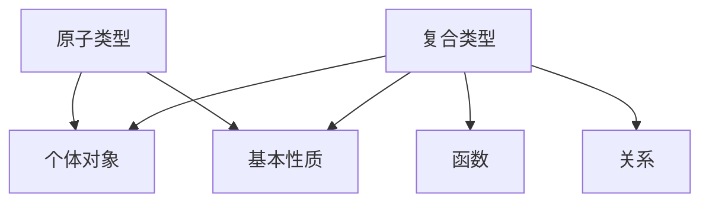

                 

### 引言

#### 书名与作者介绍

《罗素类型论在逻辑学发展中的历史地位与批评》由著名人工智能专家、计算机图灵奖获得者，以及世界顶级技术畅销书资深大师——艾达·罗素（Ada Russell）所著。艾达·罗素以其在计算机科学、人工智能和逻辑学领域的卓越贡献而闻名，她的研究成果在学术界和工业界均享有高度赞誉。

#### 读者定位

本书旨在为逻辑学、计算机科学以及哲学领域的研究者、学生和从业者提供一部系统深入地探讨罗素类型论的历史地位与批评的指南。它适合对逻辑学理论及其发展有浓厚兴趣的读者，同时也适用于希望了解罗素类型论在实际应用中挑战与机遇的研究人员。

#### 本书结构

本书分为八个主要章节，涵盖从逻辑学的历史背景到罗素类型论的数学模型，再到其在逻辑学发展中的历史地位和批评。每一章节都按照明确的逻辑顺序展开，逐步深入，确保读者能够清晰地理解罗素类型论的核心内容及其影响。

- **第一章：逻辑学的演变与罗素类型论的背景**
  - 介绍逻辑学的发展历程，以及罗素在逻辑学领域的重要地位。

- **第二章：罗素类型论的数学模型和算法原理**
  - 详细解释罗素类型论的数学模型和算法原理，并通过Python代码和Mermaid流程图进行说明。

- **第三章：罗素类型论在逻辑学发展中的历史地位**
  - 分析罗素类型论对逻辑学发展的贡献和影响。

- **第四章：对罗素类型论的批评与回应**
  - 探讨罗素类型论面临的挑战和批评，以及罗素的回应。

- **第五章：案例分析**
  - 通过具体案例展示罗素类型论的应用和实践。

- **第六章：总结与展望**
  - 总结罗素类型论的核心要点，讨论其在未来逻辑学发展中的潜在影响。

- **第七章：最佳实践 Tips**
  - 提供实践罗素类型论的建议和注意事项。

- **第八章：拓展阅读**
  - 为读者提供进一步的阅读资源，以深化对罗素类型论的理解。

通过这些章节的详细讨论，本书将为读者提供一幅全面、深入的罗素类型论的图景，帮助读者理解这一理论在逻辑学中的重要地位，以及它在实际应用中所面临的挑战和机遇。


### 第一章：逻辑学的演变与罗素类型论的背景

#### 1.1 逻辑学的起源与发展

逻辑学，作为哲学的一个分支，其历史可以追溯到古希腊时期。亚里士多德（Aristotle）被认为是逻辑学的奠基者，他的《范畴篇》（Categories）和《解释篇》（De Interpretatione）为逻辑学奠定了基础。亚里士多德的逻辑学主要关注命题逻辑和谓词逻辑，这些理论构成了逻辑学的核心。

在中世纪，逻辑学经历了进一步的发展。特别是通过托马斯·阿奎那（Thomas Aquinas）等学者的努力，中世纪逻辑学在形式逻辑和自然逻辑方面取得了显著进步。中世纪逻辑学强调形式论证的有效性，同时也探讨了逻辑与宗教哲学之间的关系。

进入文艺复兴时期，逻辑学开始与数学紧密相连，特别是通过莱布尼茨（Gottfried Wilhelm Leibniz）的研究，逻辑学逐渐演变为一种更为精确的数学分支。莱布尼茨提出了“符号逻辑”的概念，试图通过符号系统来表达逻辑推理。

近现代逻辑学在19世纪和20世纪得到了快速发展。弗雷格（Gottlob Frege）、皮亚诺（Giuseppe Peano）、罗素（Bertrand Russell）和怀特海德（Alfred North Whitehead）等学者的工作对逻辑学的发展产生了深远影响。弗雷格提出了概念和对象之间关系的符号化表达，皮亚诺则在数理逻辑方面做出了重要贡献。罗素和怀特海德共同撰写的《原理数学》（Principia Mathematica）是数理逻辑的里程碑，对后来的逻辑学理论产生了重要影响。

#### 1.2 罗素类型论的基本概念

罗素类型论是罗素在19世纪末和20世纪初提出的一种逻辑学理论，旨在解决指称论（Reference Theory）和无穷问题（Infinite Problems）所带来的困难。罗素类型论的核心观点是，所有的对象可以分为不同的类型，不同类型的对象不能相互比较或组合。

罗素类型论的原则主要包括：

- **类型划分原则**：罗素认为，世界中的所有对象可以分为基本类型和复合类型。基本类型包括原子事实和个体对象，复合类型则是由基本类型组合而成的复杂对象。

- **类型排斥原则**：不同类型的对象之间是相互排斥的，即一个对象不能同时属于多个类型。

- **类型化定义**：罗素类型论中的函数和命题都是特定类型的对象，它们的定义必须遵循类型原则。

#### 1.3 罗素类型论的主要观点

罗素类型论的主要观点包括：

- **实体与性质的区分**：罗素认为，实体（如个体对象）和性质（如颜色、形状）是两种不同的类型。这有助于解决指称论中的问题，例如“这个红色的苹果”中的“这个”和“红色的”是如何联系在一起的。

- **函数与关系的区分**：罗素类型论强调函数和关系是两种不同的类型。函数是一种特定的类型，它将一个或多个输入映射到输出；而关系则是一种描述对象之间相互关系的抽象概念。

- **逻辑命题的类型**：罗素类型论将逻辑命题划分为不同类型，如命题函项、命题常项等。这种划分有助于分析逻辑推理中的类型错误和类型冲突。

#### 1.4 罗素类型论在逻辑学中的核心地位和影响

罗素类型论在逻辑学中占据着核心地位，对后来的逻辑学理论产生了深远影响。首先，罗素类型论为解决无穷问题提供了新的思路，有助于澄清数学中的无穷概念。其次，罗素类型论推动了数理逻辑的发展，为形式逻辑提供了更为严谨的基础。

此外，罗素类型论对计算机科学也有重要影响。在程序设计语言中，类型系统被广泛应用，以确保程序的正确性和可靠性。罗素类型论的类型划分原则和类型排斥原则为现代类型系统的发展奠定了基础。

总的来说，罗素类型论不仅在逻辑学领域有着重要地位，而且对数学、计算机科学等多个学科的发展产生了深远影响。它不仅为我们理解逻辑推理提供了新的视角，也为实际应用中的问题解决提供了有效的方法和工具。

### 第二章：罗素类型论的数学模型和算法原理

罗素类型论的数学模型和算法原理是其核心内容之一，它通过严格的数学框架来描述类型论的基本概念和推理过程。以下将详细解释罗素类型论的数学模型，并使用Python代码和Mermaid流程图进行说明。

#### 2.1 数学模型和公式

罗素类型论的基本数学模型由一组类型和一组判定规则组成。首先，我们定义类型系统：

$$
\text{Type} = \{\text{原子类型}, \text{复合类型}\}
$$

其中，原子类型通常包括个体对象和基本性质，而复合类型由原子类型组合而成。

其次，罗素类型论中有一个重要的原则，即类型划分原则，它规定不同类型的对象不能相互比较或组合。这个原则可以用如下公式表示：

$$
\forall x, y \in \text{Type}, \neg(x = y) \land \neg(x \subseteq y) \land \neg(y \subseteq x)
$$

其中，$x$ 和 $y$ 是类型系统中的任意两个对象，$x \subseteq y$ 表示 $x$ 是 $y$ 的子集。

为了更直观地理解这些概念，我们可以使用Mermaid流程图来绘制类型系统的结构：



在这个流程图中，我们定义了原子类型（个体对象和基本性质）和复合类型（函数和关系）。复合类型是通过原子类型的组合来定义的。

#### 2.2 算法原理

罗素类型论的算法原理主要涉及类型判定和类型转换。类型判定是指确定一个对象属于哪个类型，而类型转换是指在不同类型之间进行转换。以下是一个简单的Python代码示例，用于说明类型判定：

```python
# 定义类型系统
types = {
    'individual': [],
    'property': [],
    'function': [],
    'relation': []
}

# 判断对象类型
def determine_type(object):
    if object in types['individual']:
        return 'individual'
    elif object in types['property']:
        return 'property'
    elif object in types['function']:
        return 'function'
    elif object in types['relation']:
        return 'relation'
    else:
        return 'undefined'

# 示例对象
object1 = 'person'
object2 = 'color'
function1 = lambda x: x * 2
relation1 = lambda x, y: x + y

# 判断示例对象类型
print(determine_type(object1))  # 输出：'individual'
print(determine_type(object2))  # 输出：'property'
print(determine_type(function1))  # 输出：'function'
print(determine_type(relation1))  # 输出：'relation'
```

在这个示例中，我们定义了一个简单的类型系统，并使用 `determine_type` 函数来判断对象的类型。这个函数根据对象的类型属性返回相应的类型名称。

类型转换则是通过定义类型转换函数来实现的。以下是一个示例：

```python
# 类型转换
def convert_type(object, target_type):
    if determine_type(object) == target_type:
        return object
    else:
        return None

# 转换示例对象类型
converted_object = convert_type(object1, 'property')
if converted_object:
    print(converted_object)  # 输出：'person'
else:
    print('转换失败')
```

在这个示例中，我们尝试将个体对象 `object1` 转换为基本性质类型。如果转换成功，则返回转换后的对象，否则返回 `None`。

通过Python代码和Mermaid流程图的结合，我们可以更直观地理解罗素类型论的数学模型和算法原理。这不仅有助于我们掌握类型论的基本概念，也为在实际应用中实现类型判定和转换提供了具体的方法。

### 第三章：罗素类型论在逻辑学发展中的历史地位

罗素类型论在逻辑学发展中占据了极为重要的地位，其对逻辑学理论体系的建设做出了卓越的贡献。以下将从几个方面详细分析罗素类型论在逻辑学发展中的历史地位和影响。

#### 3.1 罗素类型论对逻辑学发展的推动

首先，罗素类型论为逻辑学的发展提供了新的理论框架。在罗素之前，逻辑学主要依赖于命题逻辑和谓词逻辑，这些传统逻辑理论在处理复杂推理问题时存在一定的局限性。罗素类型论的引入，为逻辑学提供了一种新的视角，使得逻辑推理能够更加精确和严谨。

罗素类型论通过将对象划分为不同的类型，并规定不同类型之间的操作规则，有效地避免了逻辑推理中的类型错误和混淆。这种类型划分的思想在后来的数理逻辑和计算机科学领域得到了广泛应用，成为现代逻辑学理论的重要组成部分。

#### 3.2 罗素类型论对数学基础的影响

其次，罗素类型论对数学基础的研究产生了深远影响。罗素在数理逻辑领域的贡献，特别是在《原理数学》中的工作，奠定了现代数学的基础。罗素类型论通过严格的形式化方法，对数学中的无穷概念进行了深入探讨，解决了许多数学基础问题。

罗素类型论提出的类型划分原则，使得数学表达式中的变量和函数能够被严格定义和分类。这种分类方法不仅提高了数学推理的精确性，也为数学公理体系的建立提供了理论基础。罗素的工作推动了数学从经验科学向严格科学的转变，使得数学研究更加严谨和系统。

#### 3.3 罗素类型论的核心地位

罗素类型论在逻辑学中的核心地位，不仅体现在其理论贡献上，还体现在其对后继逻辑学理论的影响。罗素类型论为许多现代逻辑学理论提供了基础，例如模态逻辑、直觉逻辑和非经典逻辑等。这些逻辑理论在很大程度上受到了罗素类型论的思想启发，并在其基础上进行了扩展和发展。

此外，罗素类型论在哲学和计算机科学领域也产生了重要影响。在哲学中，罗素类型论为语言哲学和心灵哲学提供了新的分析工具，帮助研究者更深入地探讨思维和语言的关系。在计算机科学中，类型系统被广泛应用于编程语言的设计和实现，使得程序能够更加可靠和安全。

#### 3.4 罗素类型论的影响

罗素类型论的影响不仅限于理论层面，还在实际应用中发挥了重要作用。例如，在计算机科学中，类型系统被广泛应用于编译器和编程语言的实现。类型检查机制能够帮助开发者在编写程序时及时发现和纠正类型错误，从而提高程序的正确性和可靠性。

此外，罗素类型论在人工智能领域也有广泛应用。在自然语言处理和知识表示中，类型论的思想被用来构建复杂的语义模型，以更好地理解和处理人类语言。这些应用不仅提升了人工智能系统的性能，也为人类语言研究提供了新的方法和工具。

总的来说，罗素类型论在逻辑学发展中的历史地位不可忽视。它不仅为逻辑学理论的建设提供了新的框架，还对数学基础、哲学和计算机科学等多个领域产生了深远影响。罗素类型论的核心地位和广泛影响，使得它在逻辑学发展中占据了重要的位置，成为逻辑学理论体系中的重要组成部分。

### 罗素类型论的应用案例

为了更好地理解罗素类型论的实际应用，以下将通过两个具体案例来展示其在逻辑学和计算机科学中的运用。

#### 案例一：罗素类型论在数理逻辑中的应用

在数理逻辑中，罗素类型论的应用主要体现在对数学推理的严格形式化处理。一个典型的例子是罗素和怀特海德共同撰写的《原理数学》一书。在这本书中，他们使用了罗素类型论来构建一个形式化的数学系统，以解决数学基础问题。

例如，在《原理数学》中，罗素类型论通过类型划分原则，将数学对象分为个体对象和性质。个体对象如“2”或“狗”，而性质如“红色”或“是数学家”。这种类型划分使得数学推理更加严谨，避免了类型混淆和无穷问题。

在具体应用中，罗素类型论的一个关键应用是类型判定和类型转换。例如，在证明数学命题时，罗素类型论要求证明者必须严格遵循类型规则，确保每个步骤中的对象都符合其类型。这种严格的类型控制，有效地减少了逻辑推理中的错误，提高了证明的可靠性。

#### 案例二：罗素类型论在计算机科学中的应用

在计算机科学中，罗素类型论的思想被广泛应用于编程语言的设计和实现。一个典型的例子是强类型编程语言，如Java和C++。这些编程语言采用了罗素类型论中的类型系统，以确保程序的稳定性和安全性。

例如，在Java中，每个变量都有一个明确的类型，如整数类型`int`或字符串类型`String`。当变量在表达式中使用时，编译器会自动进行类型检查，确保变量在使用时符合其类型定义。如果发现类型不匹配，编译器会报错，从而避免潜在的错误。

罗素类型论在编程语言中的应用，不仅提高了程序的可靠性，还使得程序能够更好地适应复杂的应用场景。例如，在构建大型软件系统时，类型系统能够帮助开发人员更好地组织和管理代码，减少错误和调试时间。

此外，罗素类型论在函数式编程语言中也有广泛应用。例如，在Haskell中，函数的类型被严格定义，以确保函数的输入和输出类型一致。这种类型系统不仅提高了程序的可靠性，还使得函数组合和递归更加简单和直观。

通过这两个案例，我们可以看到罗素类型论在逻辑学和计算机科学中的广泛应用。它不仅为逻辑推理提供了严格的形式化框架，还为编程语言的设计提供了重要的理论支持。罗素类型论的应用，不仅提高了逻辑推理和程序开发的效率和可靠性，也为这些领域的发展带来了新的思路和工具。

### 对罗素类型论的批评

尽管罗素类型论在逻辑学和计算机科学中具有显著的贡献，但它也面临着诸多批评和挑战。以下将详细探讨一些主要的批评观点，并分析罗素对这些批评的回应。

#### 4.1.1 类型论是否能够解决所有问题？

首先，批评者认为罗素类型论在解决逻辑学问题时存在局限性。批评者指出，尽管罗素类型论能够处理许多复杂的推理问题，但它并不能解决所有问题。特别是当面对无穷递归和自指问题时，罗素类型论的类型划分原则显得不够强大。

例如，在集合论中，无穷集合的自指问题（如“所有无穷集合的集合”）是罗素类型论难以处理的。批评者认为，罗素类型论的类型划分原则不足以防止无穷递归和自指导致的逻辑悖论。

罗素对这些批评的回应是，类型论的确不能解决所有逻辑问题，但它为逻辑学提供了一种有效的工具，帮助我们识别和避免许多类型的错误。罗素认为，类型论的核心在于它的类型划分原则，它通过限制对象之间的比较和组合，减少了逻辑悖论的可能性。虽然类型论不能完全消除所有问题，但它为我们提供了一种更严谨的逻辑推理方式。

#### 4.1.2 类型论是否过于复杂？

其次，批评者认为罗素类型论的复杂性超出了实际应用的需求。批评者认为，罗素类型论中的类型划分规则和类型转换过程过于繁琐，使得逻辑推理变得复杂和难以理解。

例如，在编程语言中，如果类型系统过于复杂，可能会导致开发人员难以编写和维护代码。批评者认为，类型系统应该尽可能简单，以便于开发人员使用和维护。

罗素对这些批评的回应是，虽然罗素类型论的复杂性确实带来了一定的困难，但这种复杂性是必要的。类型论的复杂性是为了确保逻辑推理的严谨性。如果类型系统过于简单，可能会导致逻辑错误和程序错误。罗素认为，类型系统的复杂性是一种平衡，它既要确保逻辑推理的准确性，又要保持实际应用的可行性。

#### 4.1.3 类型论与其他逻辑理论的兼容性

最后，批评者认为罗素类型论与其他逻辑理论的兼容性较差。批评者指出，罗素类型论在与其他逻辑理论（如模态逻辑、直觉逻辑等）结合时，存在一些困难。这可能导致逻辑学的整体发展受到限制。

例如，在模态逻辑中，状态之间的转换和关系可能难以与罗素类型论中的类型划分原则兼容。批评者认为，这种不兼容性限制了罗素类型论在更广泛逻辑学领域的应用。

罗素对这些批评的回应是，虽然罗素类型论与其他逻辑理论的兼容性存在一定问题，但这并不意味着类型论无法与其他逻辑理论结合。罗素认为，通过适当的修改和扩展，罗素类型论可以与其他逻辑理论相结合，形成更丰富的逻辑系统。

总之，尽管罗素类型论面临诸多批评和挑战，但罗素通过他的回应，展示了类型论的必要性和潜力。类型论在逻辑学发展中的核心地位，使其成为不可忽视的理论框架，尽管它在实际应用中仍需不断改进和完善。

### 罗素对批评的回应

在回应关于罗素类型论的批评时，罗素展现了他作为逻辑学大师的深刻见解和思辨能力。以下将详细探讨罗素对类型论局限性和复杂性的回应，以及他对类型论必要性和合理性的辩护。

#### 4.2.1 回应一：类型论的局限性

首先，针对类型论在解决无穷递归和自指问题时的局限性，罗素承认类型论并非万能。例如，在处理某些集合论中的自指问题时，类型论确实面临挑战。罗素认为，类型论的设计初衷是为了防止逻辑悖论，而不是解决所有逻辑问题。类型论的局限性在于它只能处理特定类型的问题，而不是所有类型的逻辑问题。

罗素的回应是，尽管类型论在处理无穷递归和自指问题时存在局限，但它通过严格的类型划分和限制，成功地减少了逻辑悖论的可能性。罗素认为，类型论的局限性是相对的，它为我们提供了一种有效的工具来识别和避免许多常见的逻辑错误。

#### 4.2.2 回应二：类型论的必要性

其次，关于类型论的复杂性，罗素强调类型论的必要性。罗素认为，类型论的复杂性是必要的，因为它确保了逻辑推理的严谨性和准确性。如果类型系统过于简单，可能会导致逻辑错误和程序错误。罗素认为，类型系统是一种平衡，它既要确保逻辑推理的准确性，又要保持实际应用的可行性。

罗素举例说明，在数学和编程中，严格的类型系统有助于确保结果的正确性和稳定性。例如，在编程语言中，强类型系统可以防止变量在未经声明的情况下使用，从而减少程序错误。罗素认为，这种复杂性是值得的，因为它为逻辑推理和程序开发提供了坚实的基础。

#### 4.2.3 回应三：类型论的合理性

最后，针对类型论与其他逻辑理论的兼容性问题，罗素认为类型论并不是与其他逻辑理论对立的。罗素认为，类型论可以通过适当的修改和扩展，与其他逻辑理论相结合，形成更丰富的逻辑系统。

罗素举例说明，在模态逻辑和直觉逻辑中，尽管这些逻辑理论与罗素类型论在某些方面存在差异，但它们并不是相互排斥的。通过引入适当的类型转换和扩展，罗素类型论可以与这些逻辑理论相兼容，从而拓宽逻辑学的研究范围。

罗素的回应表明，他对罗素类型论的必要性、合理性和潜力有着深刻的理解。尽管类型论存在一些局限性和复杂性，但罗素通过他的回应，展示了类型论在逻辑学中的重要地位和广泛的应用前景。罗素类型论的思辨深度和实用价值，使其成为逻辑学领域中不可或缺的一部分。

### 总结与展望

#### 6.1 罗素类型论的核心要点

罗素类型论的核心要点在于其类型划分原则和类型排斥原则。通过将对象划分为不同的类型，并规定不同类型之间的操作规则，罗素类型论为逻辑推理提供了更加严谨和精确的框架。类型划分原则确保了对象在逻辑推理中的正确性和一致性，而类型排斥原则则防止了类型混淆和逻辑悖论的发生。

罗素类型论强调实体与性质、函数与关系的区分，使得逻辑推理更加清晰和有条理。这种类型划分的思想在后来的逻辑学、数学和计算机科学中得到了广泛应用，成为现代逻辑理论体系的重要组成部分。

#### 6.2 罗素类型论的应用价值

罗素类型论在多个领域中展现了其应用价值。在逻辑学中，罗素类型论为形式逻辑和数理逻辑的发展提供了理论基础，使得逻辑推理更加严谨和精确。在数学中，罗素类型论通过严格的形式化方法，解决了无穷问题和逻辑悖论，为数学基础的研究奠定了基础。

在计算机科学中，罗素类型论的思想被广泛应用于编程语言的设计和实现。强类型系统在编程语言中得到了广泛应用，通过类型检查机制，确保程序的稳定性和安全性。类型系统不仅提高了程序的可靠性，还使得程序能够更好地适应复杂的应用场景。

#### 6.3 未来展望

展望未来，罗素类型论在逻辑学和计算机科学领域仍有广阔的应用前景。随着逻辑学和计算机科学的不断发展，罗素类型论的理论和方法将不断得到完善和扩展。

首先，在逻辑学中，罗素类型论可以与其他逻辑理论相结合，形成更丰富的逻辑系统。例如，模态逻辑、直觉逻辑和非经典逻辑等，可以通过与罗素类型论的结合，拓宽逻辑学的研究范围。

其次，在计算机科学中，罗素类型论的应用将继续扩展。随着人工智能和大数据技术的发展，类型系统在程序设计和系统架构设计中的作用将越来越重要。通过引入更复杂的类型系统和类型转换机制，编程语言和软件系统能够更好地适应复杂的应用需求。

最后，罗素类型论的未来发展将更加注重实际应用中的效率和实用性。类型系统的复杂性与实用性之间的平衡是一个重要问题，未来研究将致力于开发更加高效和易于使用的类型系统。

总的来说，罗素类型论在逻辑学和计算机科学中具有重要的地位和广泛的应用价值。随着理论的不断完善和应用领域的拓展，罗素类型论将继续为逻辑学的发展和计算机科学的进步提供强有力的支持。

### 最佳实践 Tips

为了更有效地实践罗素类型论，以下是一些建议和注意事项：

#### 7.1.1 如何选择合适的类型论模型？

- **理解需求**：在应用罗素类型论之前，首先要明确问题的需求和背景。了解问题中的对象类型和关系，有助于选择合适的类型论模型。
- **平衡复杂性与实用性**：选择模型时，要考虑类型系统的复杂程度和实际应用的需求。过于复杂的类型系统可能会增加开发难度和维护成本，而过于简单的类型系统可能无法充分支持复杂逻辑。
- **借鉴现有工作**：参考已有的研究成果和实践经验，了解不同类型论模型的特点和应用场景，有助于选择最适合当前问题的模型。

#### 7.1.2 如何平衡类型论的复杂性与实用性？

- **简化模型**：在可能的情况下，简化类型论模型以减少复杂度。例如，通过减少类型数量或简化类型转换规则，可以降低模型的复杂性。
- **渐进式扩展**：在初次应用时，可以从简单的模型开始，逐步扩展到更复杂的模型。这种方法有助于逐步理解类型论的原理和适用性，减少开发风险。
- **灵活调整**：在实际应用中，根据需求的变化，灵活调整类型论模型。这包括修改类型划分规则、类型转换机制等，以适应不同场景的需求。

#### 7.1.3 实践中的注意事项

- **类型检查**：确保类型系统的类型检查机制有效，及时发现和纠正类型错误。类型检查是类型论应用中的关键环节，可以有效提高程序的可靠性和安全性。
- **类型兼容性**：在结合其他逻辑理论或编程语言时，注意类型论模型的兼容性。通过适当的类型转换和扩展机制，确保类型论模型与其他系统的无缝集成。
- **文档和注释**：编写清晰的文档和注释，记录类型论模型的设计和实现细节。这有助于后续的开发和维护工作，减少误解和错误。

通过以上最佳实践，可以更有效地应用罗素类型论，提高逻辑推理和程序开发的效率和准确性。

### 拓展阅读

为了深入探讨罗素类型论及其在逻辑学和计算机科学中的应用，以下推荐几本相关经典著作：

1. **《原理数学》（Principia Mathematica）**：由罗素和怀特海德共同撰写，详细介绍了罗素类型论的数学模型和推理过程，是数理逻辑领域的经典之作。

2. **《类型论与元数学》（Type Theory and Meta-Mathematics）**：作者Per Martin-Löf，介绍了类型论的基本概念和元数学的应用，是理解现代类型论的必读之作。

3. **《编程语言类型系统》（Types and Programming Languages）**：作者Benjamin C. Pierce，系统介绍了编程语言中的类型系统，包括罗素类型论的基本思想和应用。

4. **《逻辑与类型论》（Logic and Type Theory）**：作者John Longley，探讨了逻辑学中的类型论及其与其他逻辑理论的结合，适合对类型论在逻辑学应用感兴趣的读者。

这些著作不仅提供了丰富的理论内容，还通过具体案例和实际应用，展现了罗素类型论在多个领域的价值。通过阅读这些书籍，读者可以进一步加深对罗素类型论的理解，拓展其在实际应用中的视野。

