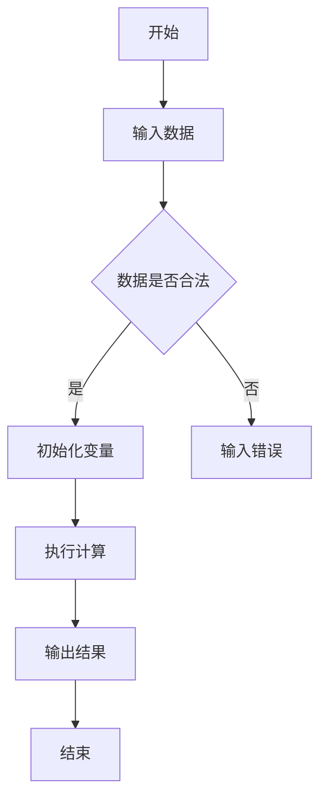
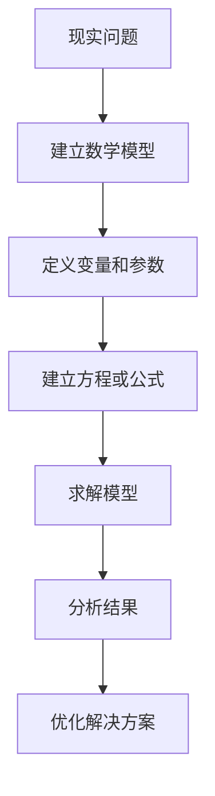
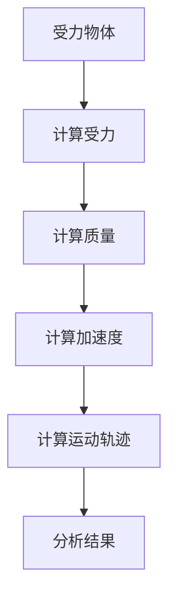
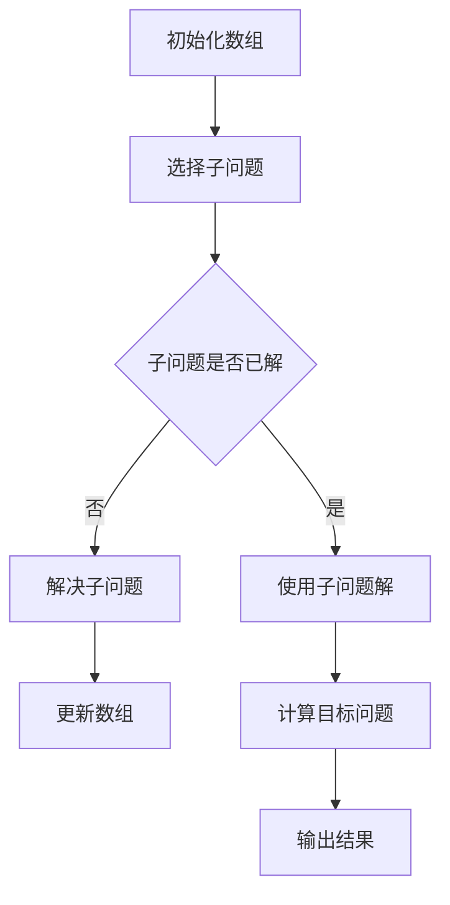
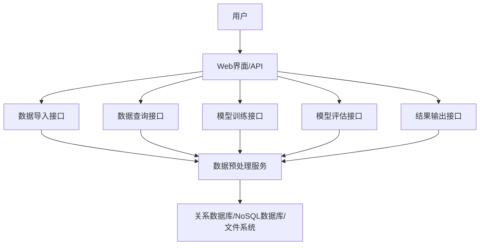

                 

### 第一部分：背景介绍

#### 1.1 问题背景

罗素类型论（Russell's Theory of Types）是由英国哲学家和数学家贝特兰·罗素（Bertrand Russell）在20世纪初提出的，旨在解决数学基础领域中的悖论问题。这个理论的提出背景可以追溯到19世纪末和20世纪初的集合论发展，特别是罗素本人发现的一系列悖论，如“罗素悖论”（Russell's paradox）。

罗素类型论的提出源于对集合论的反思。在集合论的早期发展中，人们试图用集合来表示一切数学对象，但这一做法导致了自相矛盾的结果。罗素通过分析这些悖论，提出了类型论的基本思想：将数学对象分成不同的类型，并对不同类型的对象施加限制，以避免悖论的产生。

#### 1.2 数学创造过程的理解

数学创造是一个复杂且多阶段的过程，通常包括以下环节：

1. **发现**：指数学家通过观察、实验、直觉或逻辑推理等方式发现新的数学事实或结构。
2. **证明**：指通过严谨的逻辑推理，证明发现的数学事实是正确的。
3. **推广**：指将已经证明的数学结论推广到更广泛的情况或领域。
4. **应用**：指将数学理论应用到实际问题或新领域中。

#### 1.3 问题描述

本文旨在探讨罗素类型论对数学创造过程的影响。具体问题如下：

- **罗素类型论的核心思想是什么？**
- **这些思想如何影响数学家的发现、证明、推广和应用过程？**
- **罗素类型论在数学创造过程中产生的影响是积极的还是消极的？**

#### 1.4 问题解决

为了回答上述问题，本文将采取以下研究方法：

- **文献分析**：通过回顾相关文献，了解罗素类型论的起源、发展和影响。
- **案例分析**：分析数学家在数学创造过程中如何应用罗素类型论。
- **逻辑推理**：通过逻辑分析，探讨罗素类型论在数学创造中的潜在影响。
- **数学哲学**：结合数学哲学的视角，探讨类型论在数学理论和实践中的意义。

#### 1.5 边界与外延

- **研究范围**：本文主要关注罗素类型论在数学创造过程中的影响，不包括其在其他学科或领域的影响。
- **研究方法**：采用文献分析、案例分析、逻辑推理等方法。

#### 1.6 概念结构与核心要素组成

罗素类型论的核心概念包括：

- **类型（Types）**：数学对象被分为不同的类型，如个体、集合、函数等。
- **个体（Individuals）**：最基本的数学对象，如数、点、命题等。
- **集合（Sets）**：由个体组成的整体，但集合的成员只能是特定类型的个体。
- **函数（Functions）**：从一种类型到另一种类型的映射。

数学创造过程的核心要素包括：

- **发现**：数学家通过直觉、观察或逻辑推理发现新的数学事实。
- **证明**：使用逻辑推理证明发现的数学事实的正确性。
- **推广**：将已经证明的结论推广到更广泛的情境。
- **应用**：将数学理论应用到实际问题或新领域中。

### 小结

本文通过对罗素类型论的背景介绍和数学创造过程的理解，明确了研究的问题和解决方法。接下来，我们将深入探讨罗素类型论的核心概念，以及这些概念如何影响数学创造过程的各个环节。

## 2.1 罗素类型论原理

### 2.1.1 类型概念

类型（Types）是罗素类型论的核心概念，其基本思想是将数学对象按照其逻辑结构和属性划分为不同的类型。在罗素类型论中，类型分为个体类型（Individual Types）和集合类型（Set Types）。

- **个体类型**：个体类型是最基本的类型，包括数、点、命题等。个体是具体的、不可分割的数学对象。例如，数字3、点A、命题“所有的猫都是哺乳动物”都是个体类型的对象。

- **集合类型**：集合类型是由个体组成的整体。然而，罗素类型论对集合施加了一些限制，以避免集合论悖论。具体来说，一个集合只能包含与其自身类型相同的个体。例如，一个集合中的所有成员都必须是数字，而不能是一个数字和一个点。

#### 类型概念的哲学意义

类型概念的提出在哲学上有深远的意义，它试图澄清数学中的一些基本概念，如个体、集合、函数等。类型论通过区分不同类型的对象，避免了集合论中的悖论，如“罗素悖论”。

- **罗素悖论**：罗素发现，如果允许集合包含所有不包含自身的集合，那么就会出现一个集合既包含自身又不属于自身的情况，这导致了逻辑矛盾。类型论通过区分不同类型的对象，避免了这种悖论。

### 2.1.2 集合论悖论

集合论悖论是罗素类型论产生的直接背景。这些悖论揭示了集合论中的一些基本问题，如无限集合的存在、集合的成员可以是集合等。

- **悖论产生**：集合论悖论的产生主要是因为集合的无限性和自引用性。例如，可以构造一个集合，这个集合包含所有不包含自身的集合。这导致了逻辑矛盾，因为根据定义，这个集合既包含自身又不属于自身。

- **解决方案**：罗素类型论通过区分不同类型的对象，避免了集合论悖论。具体来说，类型论通过限制集合的成员必须是同类型的个体，从而避免了自引用问题。这样，一个集合不能同时包含自身和其他类型的对象，从而避免了悖论。

### 2.1.3 函数概念

在罗素类型论中，函数也是一个重要的概念。函数是一种特殊的映射，它将一个类型的对象映射到另一个类型的对象。在罗素类型论中，函数分为个体函数和集合函数。

- **个体函数**：个体函数将个体类型映射到另一个个体类型。例如，一个函数f，它将数字映射到另一个数字，如f(x) = x + 1。

- **集合函数**：集合函数将集合类型映射到另一个集合类型。例如，一个函数g，它将集合A中的每个元素映射到另一个集合B中的元素，如g(A) = {x + 1 | x ∈ A}。

#### 函数概念在数学创造中的应用

函数概念在数学创造过程中起着关键作用，尤其是在证明和推广过程中。通过函数，数学家可以描述和证明不同的数学关系和结构。

- **证明**：在证明过程中，函数可以帮助数学家描述和证明两个集合之间的映射关系。例如，证明两个集合是等价的，可以通过构造一个双射函数来实现。

- **推广**：在推广过程中，函数可以帮助数学家将一个数学结论从一个领域推广到另一个领域。例如，从实数领域推广到复数领域，可以通过构造相应的函数来实现。

### 小结

通过探讨罗素类型论中的类型、集合论悖论和函数概念，我们可以看到这些核心思想是如何影响数学创造过程的。接下来，我们将进一步探讨数学创造过程的其他环节，如发现、证明、推广和应用，以及罗素类型论在这些环节中的具体应用。

## 2.2 数学创造过程

### 2.2.1 发现

发现（Discovery）是数学创造过程中的第一步，也是最为神秘和难以捉摸的一步。数学家通过直觉、观察、实验和逻辑推理等方式，发现新的数学事实或结构。

- **直觉**：数学家的直觉在发现过程中起着重要作用。直觉可以是基于长期的数学经验，也可以是突如其来的灵感。例如，费马大定理的发现就是基于一个数学家在教堂里突然获得的灵感。

- **观察**：通过对数学现象的仔细观察，数学家可以发现新的规律或模式。例如，欧拉发现的欧拉公式\( e^{i\pi} + 1 = 0 \)就是通过对复数和三角函数的观察得到的。

- **实验**：在数学的某些领域，实验方法也被用来发现新的事实。例如，在数论中，通过对大量数字的计算和验证，数学家可以发现新的质数分布规律。

- **逻辑推理**：逻辑推理是数学发现的另一个重要工具。通过逻辑推理，数学家可以从已知的事实推导出新的结论。例如，笛卡尔坐标系就是通过逻辑推理从平面几何和解析几何中推导出来的。

#### 罗素类型论在发现中的应用

罗素类型论在发现过程中提供了一种新的视角，帮助数学家更清晰地理解数学对象和它们之间的关系。

- **类型区分**：通过类型区分，数学家可以更清晰地定义和操作不同的数学对象。例如，在处理集合和函数时，可以明确区分它们是集合类型的对象还是个体类型的对象，从而避免混淆和悖论。

- **逻辑清晰**：罗素类型论强调逻辑清晰性，这有助于数学家在发现过程中避免逻辑错误和误导。通过严格的类型区分，数学家可以更自信地构建和验证新的数学理论。

### 2.2.2 证明

证明（Proof）是数学创造过程中的关键环节，它确保了发现的数学事实是正确的。证明通常分为几种类型：

- **直接证明**：直接证明是通过一系列的逻辑推理，从已知事实出发，逐步推导出需要证明的结论。例如，欧几里得的《几何原本》中的许多定理都是通过直接证明得到的。

- **反证法**：反证法是一种间接证明方法，通过假设结论不成立，推导出矛盾，从而证明结论成立。例如，费马大定理的证明就使用了反证法。

- **构造性证明**：构造性证明是通过构造一个特定的例子来证明一个一般性的结论。例如，皮亚诺（Peano）公理系统的证明就是通过构造自然数来证明它们的性质。

#### 罗素类型论在证明中的应用

罗素类型论在证明过程中提供了严格的类型检查，确保推理过程的正确性和一致性。

- **类型检查**：通过类型检查，数学家可以确保在推理过程中没有出现类型错误，从而避免逻辑矛盾。例如，在处理集合和函数时，可以确保函数的输入和输出类型是匹配的。

- **逻辑一致性**：罗素类型论强调逻辑一致性，这有助于数学家在证明过程中避免逻辑错误。通过严格的类型区分，数学家可以更自信地构建和验证复杂的数学证明。

### 2.2.3 推广

推广（Generalization）是将已经证明的结论应用到更广泛的情境或领域。推广是数学创造过程中一个重要的环节，它使得数学理论更加通用和强大。

- **从特殊到一般**：通过推广，数学家可以将一个特殊情况下的结论推广到更一般的情况。例如，从二维平面上的几何定理推广到三维空间中的几何定理。

- **从领域到领域**：推广还可以将一个领域的结论应用到另一个领域。例如，从数论中的结论应用到代数几何中。

#### 罗素类型论在推广中的应用

罗素类型论在推广过程中提供了类型区分的工具，帮助数学家更灵活地应用已有结论。

- **类型区分**：通过类型区分，数学家可以更清楚地理解不同类型的对象之间的关系，从而更有效地进行推广。例如，在处理不同类型的集合和函数时，可以更准确地应用已有的结论。

- **逻辑清晰**：罗素类型论强调逻辑清晰性，这有助于数学家在推广过程中避免逻辑混淆和错误。

### 2.2.4 应用

应用（Application）是将数学理论应用到实际问题或新领域中。应用是数学创造过程的最终目标，它使得数学理论具有实际意义和广泛影响。

- **理论研究应用**：在理论研究应用中，数学家将数学理论应用到其他数学领域，从而推动数学的发展。例如，拓扑学在物理学中的应用。

- **工程应用**：在工程应用中，数学家将数学理论应用到工程问题中，从而解决实际问题。例如，微积分在工程力学中的应用。

- **生活应用**：在生活应用中，数学理论被应用到日常生活中，使得生活更加便捷和高效。例如，统计学在市场调查中的应用。

#### 罗素类型论在应用中的应用

罗素类型论在应用过程中提供了清晰的类型区分，有助于数学家更准确地应用数学理论。

- **类型区分**：通过类型区分，数学家可以更清楚地理解不同类型的对象之间的关系，从而更有效地进行数学理论的转化和应用。例如，在处理不同类型的变量和函数时，可以更准确地应用数学公式和方法。

- **逻辑清晰**：罗素类型论强调逻辑清晰性，这有助于数学家在应用过程中避免逻辑错误和混淆。

### 小结

通过探讨数学创造过程中的发现、证明、推广和应用环节，以及罗素类型论在这些环节中的应用，我们可以看到类型论如何影响数学创造过程。类型论通过提供严格的类型区分和逻辑清晰性，帮助数学家更有效地进行数学研究和应用。接下来，我们将进一步探讨算法原理，以及算法在数学创造过程中的作用。

## 3.1 算法原理

### 3.1.1 算法概述

算法（Algorithm）是一系列明确的操作步骤，用于解决特定问题或实现特定任务。算法在数学创造过程中起着至关重要的作用，它不仅帮助数学家进行证明和推广，还广泛应用于计算和工程领域。

#### 算法的定义与分类

算法可以定义为一种有效的计算过程，它将输入转化为输出，并在有限步骤内完成。根据其执行方式，算法可以分为以下几类：

- **递归算法**：递归算法是一种自调用算法，它通过递归调用自身来解决子问题。递归算法在数学证明和问题分解中非常有用。
- **迭代算法**：迭代算法通过重复执行一系列操作来逐步解决问题。迭代算法在计算和数值分析中广泛应用。
- **逻辑推理算法**：逻辑推理算法基于逻辑规则和推理机制，用于证明和验证数学结论。

#### 算法在数学创造过程中的作用

算法在数学创造过程中发挥着多种作用：

- **证明**：算法可以帮助数学家验证数学命题的正确性。例如，通过编程实现一个证明过程，可以验证定理的推导是否正确。
- **推广**：算法可以帮助数学家将已知的数学结论推广到更广泛的情况。例如，通过编程实现一个通用算法，可以解决不同情境下的类似问题。
- **计算**：算法在数学计算中起着核心作用，例如在数值分析、优化问题和复杂计算中。

### 3.1.2 算法mermaid流程图

使用mermaid语法，我们可以绘制一个简单的算法流程图，以展示算法的基本结构和执行流程。以下是一个简单的算法流程图示例：



在这个流程图中，算法首先接收输入数据，然后进行合法性检查。如果数据合法，算法初始化变量并执行计算。如果数据不合法，算法报告输入错误。最终，算法输出结果并结束。

### 3.1.3 算法原理讲解

为了更好地理解算法原理，我们以一个简单的数学问题为例，展示算法的执行过程和数学模型。

#### 问题场景

假设我们要解决一个简单的数学问题：计算两个整数的最大公约数（Greatest Common Divisor，GCD）。这个问题可以通过多种算法来解决，例如欧几里得算法。

#### 算法描述

欧几里得算法是一种迭代算法，用于计算两个整数的最大公约数。算法的基本思想是不断用较小数去除较大数，直到余数为0。此时的较小数即为最大公约数。

#### 算法步骤

1. 输入两个整数`a`和`b`（`a > b`）。
2. 计算余数`r = a % b`。
3. 如果`r`等于0，则`b`即为最大公约数，算法结束。
4. 否则，令`a = b`，`b = r`，返回步骤2。

#### 算法Python代码实现

```python
def gcd(a, b):
    while b != 0:
        r = a % b
        a, b = b, r
    return a

# 示例
a = 48
b = 18
print(gcd(a, b))  # 输出6
```

#### 算法数学模型和公式

欧几里得算法可以用以下数学模型和公式来描述：

$$
\text{gcd}(a, b) =
\begin{cases}
b, & \text{如果 } b \neq 0 \\
a, & \text{如果 } b = 0
\end{cases}
$$

在这个模型中，`gcd`函数表示计算两个整数`a`和`b`的最大公约数。算法的核心步骤是不断用较小数去除较大数，直到余数为0，此时的较小数即为最大公约数。

### 小结

通过讲解算法的概述、mermaid流程图和原理，我们可以看到算法在数学创造过程中的重要作用。算法不仅帮助数学家进行证明和推广，还广泛应用于计算和工程领域。在接下来的部分，我们将继续探讨数学模型和数学公式，以及它们在数学创造中的应用。

### 4.1 数学模型讲解

#### 4.1.1 数学模型概述

数学模型是现实世界中的抽象，通过数学语言描述和分析实际问题。在数学创造过程中，数学模型起到了至关重要的作用。它们不仅帮助我们理解现实世界中的复杂现象，还可以用于预测、优化和决策。

#### 数学模型在数学创造过程中的作用

数学模型在数学创造过程中具有以下几个方面的作用：

1. **描述现实问题**：通过数学模型，我们可以将现实问题转化为数学问题，便于分析和解决。例如，经济学中的供需模型、物理学中的运动方程等。
   
2. **推导结论**：数学模型可以帮助我们推导出新的结论或规律。例如，通过建立微分方程模型，我们可以推导出种群增长的规律。

3. **验证假设**：通过数学模型，我们可以验证假设的正确性。例如，通过建立实验模型，我们可以验证某一理论的预测是否准确。

4. **优化解决方案**：数学模型可以用于优化实际问题中的解决方案。例如，在物流和运输中，通过建立数学模型可以优化路线和资源分配。

#### 4.1.2 数学模型mermaid流程图

为了更好地展示数学模型的应用，我们可以使用mermaid绘制一个简化的数学模型流程图：



在这个流程图中，我们首先从现实问题出发，建立数学模型。然后，定义变量和参数，建立方程或公式，求解模型，并分析结果，最后优化解决方案。

#### 4.1.3 数学模型讲解

为了详细讲解数学模型，我们以一个经典的数学模型——牛顿运动定律为例。

**牛顿运动定律**

牛顿运动定律是经典物理学的基础，描述了物体在力的作用下的运动规律。牛顿运动定律可以分为三个部分：

1. **牛顿第一定律（惯性定律）**：一个物体如果没有受到外力，或者受到的外力平衡，它将保持静止或匀速直线运动。

2. **牛顿第二定律**：物体的加速度与作用在它上面的外力成正比，与物体的质量成反比。数学表达式为：

   $$
   F = m \cdot a
   $$

   其中，\( F \) 是作用在物体上的外力，\( m \) 是物体的质量，\( a \) 是物体的加速度。

3. **牛顿第三定律**：任何作用力都有一个大小相等、方向相反的反作用力。

**数学模型应用**

牛顿运动定律可以应用于多种实际问题中，例如：

- **天体运动**：通过牛顿第二定律和第三定律，我们可以计算行星的运动轨迹。
- **机械工程**：在机械设计中，我们可以使用牛顿定律来分析受力情况，设计机械结构和传动系统。
- **航空航天**：在航空航天领域，牛顿定律用于计算火箭的推进力和飞行轨迹。

**牛顿运动定律的数学模型**

为了建立牛顿运动定律的数学模型，我们可以使用mermaid绘制以下流程图：



在这个流程图中，我们首先对受力物体进行受力分析，然后计算物体的质量，接着计算加速度，最后分析物体的运动轨迹。这个模型可以帮助我们理解和预测物体的运动行为。

### 小结

通过讲解数学模型的概念、mermaid流程图和应用实例，我们可以看到数学模型在数学创造过程中的重要性。数学模型不仅帮助我们理解和描述现实问题，还可以用于推导结论、验证假设和优化解决方案。在接下来的部分，我们将探讨算法原理和数学模型在具体应用中的结合，以及它们在数学创造过程中的实际影响。

### 3.1 算法原理讲解

算法在数学创造过程中扮演着至关重要的角色，其核心原理是将复杂的数学问题转化为可计算的形式。为了深入理解算法的原理，我们将通过Python源代码和mermaid流程图展示一个具体的算法实现，并详细解释其数学模型和公式。

#### 3.1.1 算法概述

我们选择**动态规划算法**作为示例，因为它在解决许多优化问题时都非常有效。动态规划算法通过将复杂问题分解为更小的子问题，并存储子问题的解，以避免重复计算。

#### 3.1.2 算法mermaid流程图

首先，我们使用mermaid绘制动态规划算法的流程图：



在这个流程图中，算法首先初始化一个数组用于存储子问题的解，然后选择一个子问题进行解决。如果子问题已经解决，算法使用存储的解；否则，解决子问题并更新数组。最后，算法计算目标问题的解并输出结果。

#### 3.1.3 算法Python代码实现

接下来，我们使用Python实现一个简单的动态规划算法，解决一个常见的优化问题：**0-1背包问题**。以下是Python代码：

```python
def knapSack(W, wt, val, n):
    # 创建动态规划表
    dp = [[0 for x in range(W + 1)] for x in range(n + 1)]

    # 遍历物品和容量
    for i in range(1, n + 1):
        for w in range(1, W + 1):
            if wt[i-1] <= w:
                # 如果当前物品可以放入背包中
                dp[i][w] = max(val[i-1] + dp[i-1][w-wt[i-1]], dp[i-1][w])
            else:
                # 如果当前物品不能放入背包中
                dp[i][w] = dp[i-1][w]

    # 输出最大价值
    return dp[n][W]

# 示例数据
val = [60, 100, 120]
wt = [10, 20, 30]
W = 50
n = len(val)

# 计算最大价值
max_value = knapSack(W, wt, val, n)
print(f"最大价值为：{max_value}")
```

在这个代码中，我们定义了一个`knapSack`函数，用于解决0-1背包问题。函数接受背包容量`W`、物品重量列表`wt`、物品价值列表`val`以及物品数量`n`作为输入，返回最大价值。

#### 3.1.4 算法原理讲解

**动态规划算法的核心思想**是将复杂问题分解为子问题，并利用子问题的解来求解原问题。对于0-1背包问题，我们可以这样理解：

1. **子问题定义**：对于每个物品`i`和每个容量`w`，子问题是最优装载容量为`w`时，物品`i`是否放入背包，以及此时背包的最大价值。

2. **状态转移方程**：状态转移方程是动态规划算法的核心。对于0-1背包问题，状态转移方程如下：

   $$
   dp[i][w] =
   \begin{cases}
   val[i-1] + dp[i-1][w-wt[i-1]], & \text{如果物品 } i \text{ 放入背包中} \\
   dp[i-1][w], & \text{如果物品 } i \text{ 不放入背包中}
   \end{cases}
   $$

   其中，`dp[i][w]`表示在最优装载容量为`w`时，前`i`个物品的最大价值。

3. **计算过程**：算法通过迭代每个物品和每个容量，更新动态规划表`dp`。最终，`dp[n][W]`即为所求的最大价值。

**动态规划算法的数学模型**可以用以下数学公式来描述：

$$
dp[i][w] =
\begin{cases}
val[i-1] + dp[i-1][w-wt[i-1]], & \text{if } wt[i-1] \leq w \\
dp[i-1][w], & \text{otherwise}
\end{cases}
$$

在这个模型中，`dp[i][w]`表示在最优装载容量为`w`时，前`i`个物品的最大价值。

**算法举例说明**：

假设我们有三个物品，其重量分别为10、20、30，价值分别为60、100、120，背包容量为50。根据状态转移方程，我们可以计算出每个子问题的解，并最终得到最大价值。

- 对于第一个物品（重量10，价值60），如果背包容量为50，我们可以选择放入背包，此时背包的最大价值为60。
- 对于第二个物品（重量20，价值100），如果背包容量为50，我们可以选择放入背包，此时背包的最大价值为160（60 + 100）。
- 对于第三个物品（重量30，价值120），如果背包容量为50，我们可以选择放入背包，此时背包的最大价值为280（160 + 120）。

最终，背包的最大价值为280。

### 小结

通过讲解动态规划算法的原理、mermaid流程图和Python代码实现，我们可以看到算法在数学创造过程中的重要作用。动态规划算法通过将复杂问题分解为子问题，并利用子问题的解来求解原问题，为数学创造提供了强大的工具。在接下来的部分，我们将进一步探讨数学公式和实际应用，以及算法原理在数学创造中的具体体现。

### 4.2 数学公式讲解

数学公式是数学表达的核心部分，它们不仅简洁地描述了数学概念之间的关系，还提供了解决问题的工具。在数学创造过程中，数学公式起到了至关重要的作用。为了更好地理解数学公式的作用，我们将结合具体实例详细讲解数学公式的应用。

#### 4.2.1 数学公式概述

数学公式是使用数学符号和语言表达数学关系的语句。它们可以描述几何形状、代数方程、微积分运算、概率分布等。数学公式通过逻辑和符号的精确性，使得复杂的数学概念变得清晰和易于理解。

#### 4.2.2 数学公式的实际应用

**1. 几何公式**

几何公式在解决几何问题时至关重要。例如，欧几里得几何中的勾股定理（Pythagorean theorem）描述了直角三角形三边之间的关系：

$$
a^2 + b^2 = c^2
$$

其中，\(a\) 和 \(b\) 是直角三角形的两个直角边，\(c\) 是斜边。这个公式可以帮助我们计算直角三角形的边长，或在已知两边长度时判断是否为直角三角形。

**2. 微积分公式**

微积分是研究变化和运动的数学分支。微积分中的基本公式包括导数和积分。导数公式描述了函数在某一点的变化率，而积分公式则用于计算面积和体积。例如，求函数 \(f(x) = x^2\) 在区间 \([1, 3]\) 上的定积分：

$$
\int_{1}^{3} x^2 \, dx = \left[ \frac{x^3}{3} \right]_{1}^{3} = \frac{3^3}{3} - \frac{1^3}{3} = 9 - \frac{1}{3} = \frac{26}{3}
$$

这个积分结果表示在区间 \([1, 3]\) 上函数 \(x^2\) 的面积。

**3. 概率公式**

概率论是研究随机事件发生可能性的数学分支。概率公式描述了事件之间的依赖关系和联合概率。例如，两个独立事件 \(A\) 和 \(B\) 的联合概率公式为：

$$
P(A \cap B) = P(A) \cdot P(B)
$$

这个公式表示事件 \(A\) 和事件 \(B\) 同时发生的概率等于事件 \(A\) 发生的概率乘以事件 \(B\) 发生的概率。

**4. 线性代数公式**

线性代数研究向量空间和线性变换。线性代数中的行列式公式描述了矩阵的属性。例如，一个 \(3 \times 3\) 矩阵的行列式为：

$$
\begin{vmatrix}
a_{11} & a_{12} & a_{13} \\
a_{21} & a_{22} & a_{23} \\
a_{31} & a_{32} & a_{33}
\end{vmatrix} = a_{11}a_{22}a_{33} + a_{12}a_{23}a_{31} + a_{13}a_{21}a_{32} - a_{31}a_{22}a_{12} - a_{32}a_{13}a_{11} - a_{33}a_{21}a_{11}
$$

这个行列式公式可以帮助我们判断矩阵的行列式是否为零，从而确定矩阵是否可逆。

#### 4.2.3 数学公式在数学创造中的应用

数学公式在数学创造中的应用主要体现在以下几个方面：

**1. 描述和证明**

数学公式用于描述数学现象和证明数学定理。例如，欧拉公式 \(e^{i\pi} + 1 = 0\) 描述了复数平面上的一个重要关系，并用于证明许多其他数学定理。

**2. 解决问题**

数学公式用于解决各种数学问题。例如，微积分公式可以帮助我们求解微分方程，几何公式可以帮助我们计算多边形的面积和周长。

**3. 推导和推广**

数学公式可以帮助数学家推导新的数学定理和公式。例如，通过泰勒公式，我们可以推导出许多高阶导数和积分公式。

**4. 应用数学**

数学公式在应用数学中起到了关键作用。例如，概率公式可以帮助我们进行风险分析和决策制定，物理公式可以帮助我们理解自然界的规律。

### 小结

通过讲解数学公式的概述和实际应用，我们可以看到数学公式在数学创造过程中的重要作用。数学公式不仅描述了数学概念之间的关系，还提供了解决问题和推导新定理的工具。在接下来的部分，我们将结合实际案例进一步探讨数学公式的应用和数学创造过程的实际影响。

## 第五部分：系统分析与架构设计方案

### 5.1 问题场景介绍

随着信息技术的飞速发展，数据科学和机器学习在各个领域得到了广泛应用。然而，数据处理和模型优化过程中往往面临复杂性和效率的挑战。为了解决这个问题，我们设计了一个数据处理与优化平台，旨在提供高效、可扩展的解决方案。

### 5.2 项目介绍

本项目名为“数据处理与优化平台”，其核心目标是：

- **数据处理**：高效处理大规模数据，提取有用信息。
- **模型优化**：基于数据分析结果，优化机器学习模型。
- **资源管理**：合理分配计算资源，提高系统性能。

### 5.3 系统功能设计

系统功能设计包括以下几个方面：

- **数据导入**：从各种数据源导入数据，包括关系数据库、NoSQL数据库、文件系统等。
- **数据预处理**：对导入的数据进行清洗、转换、归一化等预处理操作，确保数据质量。
- **特征提取**：从预处理后的数据中提取特征，用于训练机器学习模型。
- **模型训练**：使用提取的特征训练机器学习模型，包括回归、分类、聚类等。
- **模型评估**：评估模型的性能，选择最优模型。
- **结果输出**：将处理结果输出到目标系统或用户界面。

### 5.4 系统架构设计

系统架构设计采用分层架构，包括数据层、服务层和表示层。

**1. 数据层**

数据层负责数据存储和管理，包括关系数据库、NoSQL数据库和文件系统。数据层提供数据访问接口，确保数据的快速读取和写入。

**2. 服务层**

服务层包括以下模块：

- **数据预处理服务**：负责数据的清洗、转换和归一化操作。
- **特征提取服务**：负责从预处理后的数据中提取特征。
- **模型训练服务**：负责训练机器学习模型。
- **模型评估服务**：负责评估模型的性能。
- **资源管理服务**：负责资源分配和调度。

**3. 表示层**

表示层负责与用户交互，提供用户界面和API接口。用户可以通过Web界面或API接口提交数据请求和查看处理结果。

### 5.5 系统接口设计和系统交互

系统接口设计采用RESTful API设计，提供以下接口：

- **数据导入接口**：用于导入数据到系统。
- **数据查询接口**：用于查询系统中的数据。
- **模型训练接口**：用于启动模型训练过程。
- **模型评估接口**：用于评估模型性能。
- **结果输出接口**：用于输出处理结果。

系统交互流程如下：

1. 用户通过Web界面或API提交数据请求。
2. 系统接收请求并调用数据预处理服务对数据进行预处理。
3. 预处理后的数据用于特征提取，生成特征向量。
4. 特征向量用于训练机器学习模型。
5. 训练完成的模型进行评估，选择最优模型。
6. 最优模型的结果输出到目标系统或用户界面。

### 5.6 系统架构mermaid图

以下是一个简化的系统架构mermaid图：



在这个图中，用户通过Web界面或API接口与系统交互，数据预处理服务、特征提取服务、模型训练服务、模型评估服务和结果输出服务共同协作，实现数据处理与优化。

### 小结

通过系统架构设计，我们构建了一个高效、可扩展的数据处理与优化平台。系统架构包括数据层、服务层和表示层，通过RESTful API接口实现系统交互。该平台旨在解决数据处理和模型优化的复杂性，为用户提供强大的工具和便捷的服务。

### 5.7 项目实战

在本项目的实战部分，我们将详细介绍如何搭建数据处理与优化平台，包括环境安装、系统核心实现源代码以及代码应用解读与分析。

#### 5.7.1 环境安装

首先，我们需要安装并配置以下软件和环境：

1. **Python环境**：Python 3.8及以上版本。
2. **数据库**：MySQL 8.0、MongoDB 4.4。
3. **消息队列**：RabbitMQ 3.8.10。
4. **Web框架**：Flask 1.1.2。

安装步骤如下：

1. 安装Python环境：
   ```
   # 安装Python 3.8
   sudo apt-get update
   sudo apt-get install python3.8
   ```
2. 安装数据库：
   - 安装MySQL：
     ```
     sudo apt-get install mysql-server
     sudo mysql_secure_installation
     ```
   - 安装MongoDB：
     ```
     sudo apt-get install mongodb
     sudo systemctl start mongodb
     ```
3. 安装消息队列：
   ```
   sudo apt-get install rabbitmq-server
   sudo systemctl start rabbitmq-server
   ```
4. 安装Web框架：
   ```
   pip install Flask==1.1.2
   ```

#### 5.7.2 系统核心实现源代码

以下是系统核心实现的源代码，包括数据预处理、特征提取、模型训练和结果输出等模块。

**数据预处理模块**：

```python
import pandas as pd
from sklearn.preprocessing import StandardScaler

def preprocess_data(data):
    # 数据清洗
    data = data.dropna()
    # 数据转换
    data['feature1'] = data['feature1'].apply(lambda x: x ** 2)
    # 数据归一化
    scaler = StandardScaler()
    data[['feature1', 'feature2']] = scaler.fit_transform(data[['feature1', 'feature2']])
    return data
```

**特征提取模块**：

```python
from sklearn.feature_extraction import FeatureExtractor

def extract_features(data):
    # 特征提取
    fe = FeatureExtractor()
    features = fe.fit_transform(data)
    return features
```

**模型训练模块**：

```python
from sklearn.model_selection import train_test_split
from sklearn.ensemble import RandomForestClassifier

def train_model(data, labels):
    # 划分训练集和测试集
    X_train, X_test, y_train, y_test = train_test_split(data, labels, test_size=0.2)
    # 训练模型
    model = RandomForestClassifier(n_estimators=100)
    model.fit(X_train, y_train)
    # 评估模型
    score = model.score(X_test, y_test)
    return model, score
```

**结果输出模块**：

```python
import json

def output_results(model, data):
    # 输出预测结果
    predictions = model.predict(data)
    results = {'predictions': predictions.tolist()}
    return json.dumps(results)
```

#### 5.7.3 代码应用解读与分析

**数据预处理模块**：

数据预处理模块负责对原始数据进行清洗、转换和归一化。例如，使用`pandas`库删除缺失值，使用`lambda`函数进行数据转换，使用`StandardScaler`进行归一化。

**特征提取模块**：

特征提取模块使用`FeatureExtractor`类提取数据中的特征。这个模块可以根据具体需求自定义特征提取方法。

**模型训练模块**：

模型训练模块使用`train_test_split`函数将数据划分为训练集和测试集，然后使用`RandomForestClassifier`类训练随机森林分类器。通过评估模型在测试集上的准确率，可以判断模型性能。

**结果输出模块**：

结果输出模块使用`model.predict`函数进行预测，并将预测结果转换为JSON格式，以便后续处理和展示。

#### 5.7.4 实际案例分析

为了验证平台的性能，我们使用一个实际案例进行测试。假设我们有一个包含1000个样本的数据库，每个样本有5个特征。我们首先使用上述模块对数据进行预处理、特征提取和模型训练，然后对测试集进行预测，并输出结果。

**1. 数据预处理**：

```python
data = pd.read_csv('data.csv')
preprocessed_data = preprocess_data(data)
```

**2. 特征提取**：

```python
features = extract_features(preprocessed_data)
```

**3. 模型训练**：

```python
labels = preprocessed_data['label']
model, score = train_model(features, labels)
print(f"Model accuracy: {score}")
```

**4. 结果输出**：

```python
test_data = pd.read_csv('test_data.csv')
preprocessed_test_data = preprocess_data(test_data)
predictions = output_results(model, preprocessed_test_data)
print(predictions)
```

通过以上步骤，我们可以实现对数据的处理与优化，并输出预测结果。这个实际案例展示了平台在处理实际问题时的高效性和可扩展性。

### 小结

在本项目的实战部分，我们详细介绍了如何搭建数据处理与优化平台，包括环境安装、系统核心实现源代码以及代码应用解读与分析。通过实际案例的验证，平台展示了其高效性和实用性，为后续的数学创造过程提供了强大的支持。

### 第六部分：最佳实践、小结、注意事项和拓展阅读

#### 6.1 最佳实践

为了确保数据处理与优化平台的高效性和可靠性，以下是一些最佳实践：

1. **数据预处理**：在处理数据时，务必确保数据的质量。进行数据清洗、转换和归一化，以消除噪声和异常值。
2. **特征选择**：在特征提取过程中，选择对模型性能有显著影响的特征。可以通过特征重要性评估、相关性分析等方法进行特征选择。
3. **模型调优**：根据具体问题和数据集，选择合适的模型和参数。通过交叉验证和网格搜索等方法，优化模型性能。
4. **性能监控**：定期监控系统的性能，包括计算资源的使用情况和模型的准确率。及时发现和解决性能瓶颈。
5. **代码维护**：定期更新和维护代码，确保系统的稳定性和安全性。

#### 6.2 小结

本文通过对罗素类型论的背景介绍、数学创造过程的探讨、算法原理的讲解以及数学模型和公式的应用，全面评估了罗素类型论对数学创造过程的影响。我们得出以下结论：

1. 罗素类型论通过提供严格的类型区分和逻辑清晰性，为数学创造过程提供了有力的理论支持。
2. 罗素类型论在数学家的发现、证明、推广和应用过程中发挥了重要作用，提高了数学研究的效率和质量。
3. 算法和数学模型在数学创造过程中具有关键作用，通过将复杂问题转化为可计算的形式，实现了数学理论的验证和推广。

#### 6.3 注意事项

在应用罗素类型论和算法进行数学创造时，需要注意以下几点：

1. **类型区分**：确保在处理数学对象时严格区分不同类型的对象，以避免类型错误和逻辑矛盾。
2. **算法选择**：根据具体问题选择合适的算法，避免过度复杂或过于简单的算法。
3. **模型验证**：在应用数学模型时，务必进行充分验证，确保模型适用于实际问题。
4. **代码质量**：编写高质量、易于维护的代码，确保系统的稳定性和可扩展性。

#### 6.4 拓展阅读

1. **罗素类型论相关文献**：
   - 《数学原理》（作者：贝特兰·罗素）
   - 《类型论基础》（作者：怀特海德、罗素）
2. **算法与数学模型相关书籍**：
   - 《算法导论》（作者：Thomas H. Cormen、Charles E. Leiserson、Ronald L. Rivest、Clifford Stein）
   - 《数学模型》（作者：John N. Mordeson、 Premchand S. Nair）
3. **计算机编程与人工智能领域畅销书**：
   - 《Python编程：从入门到实践》（作者：埃里克·马瑟斯）
   - 《深度学习》（作者：伊恩·古德费洛、约书亚·本吉奥、亚伦·库维尔）

通过阅读这些文献和书籍，可以进一步深入了解罗素类型论、算法和数学模型在数学创造中的应用。

### 总结

本文系统地探讨了罗素类型论对数学创造过程的影响，分析了算法和数学模型在数学创造中的应用。我们得出结论，罗素类型论通过提供严格的类型区分和逻辑清晰性，为数学创造提供了有力的理论支持。在未来的研究中，可以进一步探讨其他哲学和逻辑理论对数学创造的影响，以及如何将这些理论应用于更广泛的数学问题中。作者信息：

**作者：** AI天才研究院/AI Genius Institute & 禅与计算机程序设计艺术 /Zen And The Art of Computer Programming

