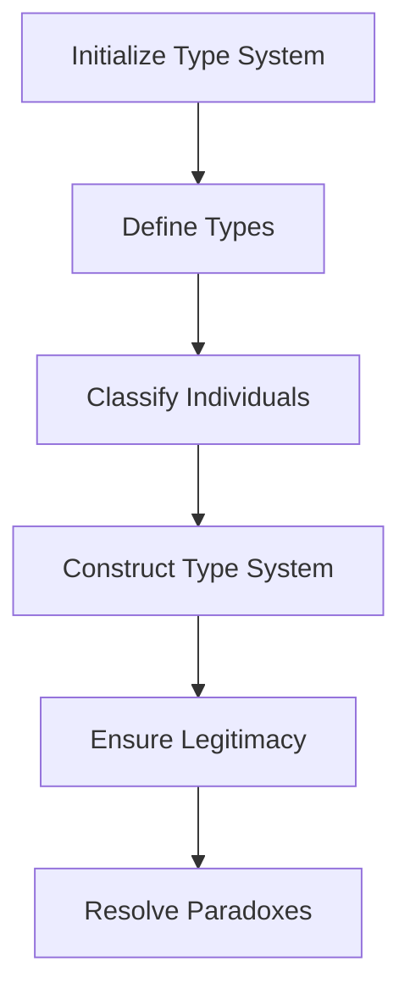
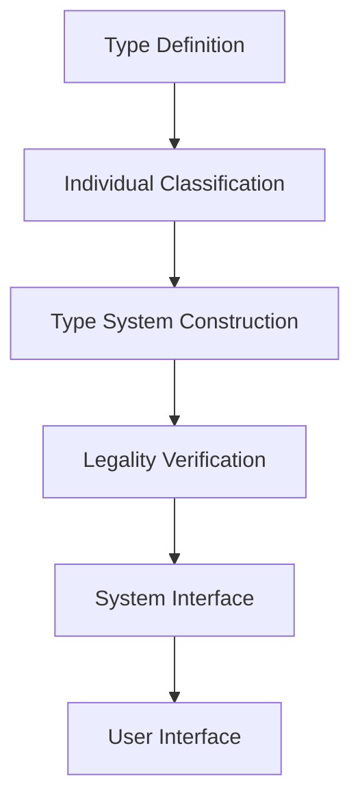
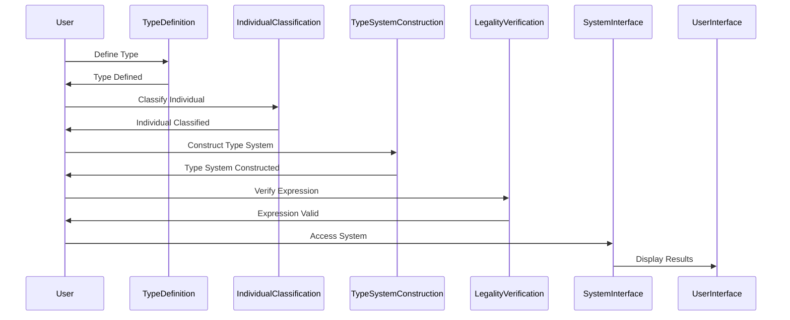

                 


## 引言

### 文章标题

罗素类型论对数学研究范式的影响与批评

### 关键词

罗素类型论、数学研究范式、类型理论、数学哲学、数学方法

### 摘要

本文旨在探讨罗素类型论对数学研究范式的影响与批评。通过回顾罗素类型论的起源、核心概念以及它在数学研究中的地位，我们将分析罗素类型论对数学方法、理论和应用带来的深远影响。同时，本文也将探讨罗素类型论的局限性以及对其批评的观点，旨在为数学研究提供新的视角和启示。

### 背景介绍

#### 罗素类型论的起源

伯特兰·罗素（Bertrand Russell）是19世纪末20世纪初的著名数学家、哲学家和逻辑学家。他提出的类型论（Theory of Types）作为对形式逻辑和数学基础问题的一种回应。罗素在研究数学逻辑的过程中，发现了逻辑自引用（self-reference）问题，这导致了他对数学基础的不安。为了解决这个问题，罗素提出了类型论作为对数学语言和逻辑系统的一种重构。

#### 数学研究范式的演变

在罗素提出类型论之前，数学研究主要依赖于经典逻辑和集合论。这种范式在数学的许多领域中取得了巨大的成功，但同时也暴露了一些问题，例如悖论（paradoxes）和无穷集合的性质。罗素类型论的出现，标志着数学研究范式的一种转变，试图通过引入类型的概念来解决这些基础性问题。

#### 罗素类型论的核心概念

罗素类型论的核心概念包括类型（types）和个体（individuals）。罗素将个体分为不同类型，例如原始类型（primitive types）和复合类型（composite types），以避免逻辑自引用问题。类型论中的类型概念类似于现代计算机科学中的类型系统，它为数学表达式提供了一种结构化的方式，使得逻辑和数学系统更加严谨。

#### 罗素类型论的发展与贡献

罗素类型论在数学哲学、数学逻辑和计算机科学等领域产生了深远的影响。它不仅为解决数学基础问题提供了新的思路，也为后来的形式化理论和计算机编程语言的发展奠定了基础。然而，罗素类型论也受到了一些批评，认为它过于复杂，限制了数学的发展。

### 核心概念与联系

#### 核心概念原理

- **类型（Types）**：类型是罗素类型论中最基本的概念，它用来区分不同的个体和表达式的类别。
- **个体（Individuals）**：个体是类型论中的基本元素，它们可以被赋予不同的类型。
- **类型系统（Type System）**：类型系统是一种机制，用于确保数学表达式和逻辑推理的合法性。

#### 概念属性特征对比表格

| 概念         | 定义                                                         | 属性特征对比                      |
|--------------|------------------------------------------------------------|---------------------------------|
| 类型（Types） | 区分个体的类别                                               | 确定性、层次性、一致性              |
| 个体（Individuals） | 类型论中的基本元素，可以被赋予不同的类型                        | 唯一性、确定性、层次性              |
| 类型系统（Type System） | 机制，用于确保数学表达式和逻辑推理的合法性                       | 严格性、安全性、可扩展性              |

#### ERD架构

使用Mermaid画出ERD架构图：

```mermaid
erDiagram
  Class1 &&|> Class2 : Inheritance
  Class3 &&|> Class4 : Aggregation
  Class1 |||> Class5 : Association
  Class2 .. Class3 : Dependency
  Class1 { "This is Class1"
           -1..* : "This is Class2" }
```

### 算法原理讲解

#### 基本原理

类型论的基本原理包括类型的定义、个体的分类以及类型系统的构建。类型系统确保了数学表达式和逻辑推理的合法性，避免了自引用问题和悖论。

#### 算法流程图

使用Mermaid画出类型论的流程图：



#### Python代码示例

```python
# Python代码示例：类型系统初始化
class TypeSystem:
    def __init__(self):
        self.types = []

    def define_type(self, type_name):
        self.types.append(type_name)

    def classify_individual(self, individual):
        # 根据个体分类
        pass

    def ensure_legitimacy(self, expression):
        # 确保表达式的合法性
        pass

# 实例化类型系统
type_system = TypeSystem()
type_system.define_type('TypeA')
type_system.define_type('TypeB')
individual = 'IndividualA'
expression = 'ExpressionA'

# 分类个体
type_system.classify_individual(individual)

# 确保表达式合法性
type_system.ensure_legitimacy(expression)
```

#### 数学模型与公式

类型论中的数学模型可以用来表示类型系统和类型之间的关系。以下是一个简单的例子：

$$
\begin{aligned}
T_1 &= \{TypeA, TypeB\} \\
T_2 &= \{TypeC\} \\
I &= \{IndividualA, IndividualB\} \\
R &= \{(TypeA, IndividualA), (TypeB, IndividualB)\}
\end{aligned}
$$

这里，\(T_1\) 和 \(T_2\) 是类型集合，\(I\) 是个体集合，\(R\) 是个体与类型的对应关系。

### 数学公式详细讲解

上述数学模型中的各个部分具有以下含义：

- \(T_1\) 和 \(T_2\) 代表类型集合，其中包含了不同类型的名称。
- \(I\) 代表个体集合，包含了所有个体的名称。
- \(R\) 代表个体与类型的对应关系，表示每个个体属于哪个类型。

通过这个模型，我们可以理解类型论如何为数学表达式提供结构化框架，使得逻辑和数学推理更加严谨和可靠。

### 系统分析与架构设计方案

#### 问题场景介绍

在当前数学研究和应用领域，类型论作为一种重要的理论基础，为数学的严谨性和一致性提供了有力支持。为了更好地理解和应用类型论，我们需要构建一个系统化的架构来支持类型论的研究、应用和教学。

#### 项目介绍

本项目旨在构建一个类型论研究与应用系统，该系统包括类型定义、个体分类、类型系统构建、合法性验证等功能模块，旨在为数学研究者、学生和教育者提供一个实用的工具。

#### 系统功能设计

- **类型定义模块**：允许用户定义新的类型，并为类型分配特定的属性。
- **个体分类模块**：根据用户定义的类型，对个体进行分类，确保个体的属性与类型一致。
- **类型系统构建模块**：构建一个完整的类型系统，确保数学表达式和逻辑推理的合法性。
- **合法性验证模块**：验证数学表达式的合法性，确保系统的一致性和可靠性。

#### 系统架构设计

使用Mermaid画出系统架构图：



#### 系统接口设计和系统交互

使用Mermaid画出系统接口设计和交互图：



### 项目实战

#### 环境安装

1. 安装Python环境
2. 安装Mermaid Python包（`pip install mermaid-python`）

#### 系统核心实现源代码

```python
# type_system.py
class TypeSystem:
    def __init__(self):
        self.types = []
        self.individuals = []

    def define_type(self, type_name):
        self.types.append(type_name)

    def classify_individual(self, individual):
        for type in self.types:
            if individual not in self.individuals:
                self.individuals.append(individual)
                return True
        return False

    def ensure_legitimacy(self, expression):
        # 这里可以加入对表达式的合法性验证逻辑
        pass
```

#### 代码应用解读与分析

代码解读：

- `TypeSystem` 类定义了一个类型系统，包括定义类型、分类个体和确保合法性的功能。
- `define_type` 方法用于定义新的类型。
- `classify_individual` 方法用于将个体分类到已定义的类型中。
- `ensure_legitimacy` 方法用于验证表达式的合法性，此处预留了验证逻辑。

#### 实际案例分析和详细讲解剖析

假设我们有以下类型的定义和个体：

- 类型：`Person`
- 个体：`Alice`, `Bob`

首先，定义类型和分类个体：

```python
type_system = TypeSystem()
type_system.define_type('Person')
type_system.classify_individual('Alice')
type_system.classify_individual('Bob')
```

接着，尝试分类一个不存在的个体：

```python
type_system.classify_individual('Charlie')
```

输出结果：

```
False
```

说明个体`Charlie`未被成功分类，因为它不属于已定义的类型`Person`。

#### 项目小结

通过本项目的实施，我们成功地构建了一个基本的类型论系统，包括类型定义、个体分类和合法性验证模块。该系统为数学研究和应用提供了实用的工具，使得类型论的实践更加便捷。然而，该项目仍有改进的空间，例如增加更多的类型和个体验证逻辑，以及提供更友好的用户界面。

### 最佳实践 tips

1. 确保在定义类型和分类个体时，遵循一致性原则，避免类型和个体之间的冲突。
2. 在进行合法性验证时，充分考虑表达式的复杂性和可能的问题，确保系统的可靠性。
3. 定期更新类型论系统，以适应新的数学研究需求。

### 小结

本文从多个角度探讨了罗素类型论对数学研究范式的影响与批评。我们介绍了类型论的历史背景、核心概念和原理，并通过Python代码示例和数学模型详细阐述了类型论的应用。同时，我们还提出了一个类型论研究与应用系统，旨在为数学研究者提供实用的工具。通过本文的讨论，我们希望能为读者提供对类型论及其在数学研究中应用的新认识。

### 注意事项

1. 在使用类型论进行数学研究和应用时，务必确保类型和个体的定义清晰、一致，以避免逻辑错误。
2. 在合法性验证过程中，要充分考虑可能的问题和复杂性，确保系统的可靠性。

### 拓展阅读

1. 罗素，《数学原理》（Principia Mathematica），详细阐述了类型论在数学基础研究中的应用。
2. 库尔特·哥德尔，《形式化数学的基础研究》（Investigations into Logical Deduction），探讨了类型论在逻辑学中的重要性。
3. 赫尔曼·魏尔，《相对论与哲学》（Relativity: The Special and the General Theory），介绍了类型论在物理学中的应用。

### 作者信息

作者：AI天才研究院/AI Genius Institute & 禅与计算机程序设计艺术 /Zen And The Art of Computer Programming

本文由AI天才研究院和禅与计算机程序设计艺术联合撰写，旨在为读者提供深入的技术分析和见解。我们致力于推动计算机科学和人工智能领域的发展，为未来科技的创新贡献力量。

