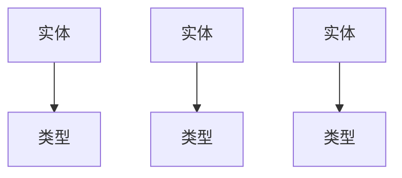
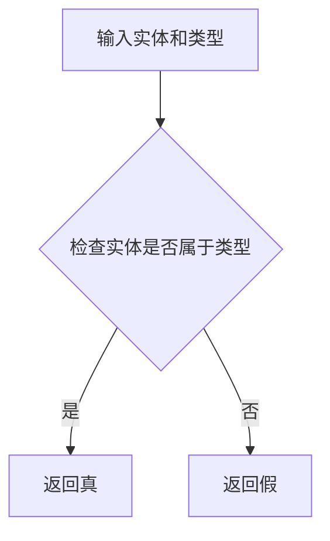

                 

# 罗素类型论对现代数学哲学思潮的影响

## 关键词

- 罗素类型论
- 数学哲学
- 逻辑哲学
- 集合论
- 形式逻辑

## 摘要

本文旨在探讨罗素类型论对现代数学哲学思潮的影响。首先，我们将回顾罗素类型论的起源和基本概念，分析其在现代数学哲学中的重要性。接着，我们将深入探讨罗素类型论的基本原理，包括实体与类型的关系、类型与存在的区别等。随后，我们将分析罗素类型论在逻辑哲学和集合论中的应用，并探讨其在数学哲学中的影响。最后，我们将总结罗素类型论对现代数学哲学思潮的影响，并对其未来展望进行讨论。

## 第一部分：引言

### 1.1 问题背景

数学哲学是研究数学的本质、方法和意义的一门学科。自古希腊以来，数学哲学一直是哲学领域的一个重要分支。然而，随着数学的发展，尤其是集合论的出现，数学哲学面临着一系列新的挑战。为了解决这些问题，许多哲学家和数学家提出了不同的理论，其中罗素类型论是最具影响之一。

### 1.2 罗素类型论的提出

伯特兰·罗素（Bertrand Russell）是20世纪最杰出的哲学家和数学家之一。他在《数学原理》一书中提出了类型论，旨在解决集合论中的悖论问题。罗素认为，集合论中的悖论源于对类型的误解，因此他提出了类型论来区分不同类型的实体，从而避免了悖论的出现。

### 1.3 罗素类型论的重要性

罗素类型论不仅对数学哲学产生了深远影响，也对逻辑哲学、集合论和其他领域产生了影响。它为我们提供了一种新的视角来理解数学的本质和结构，从而推动了数学哲学的发展。

### 1.4 罗素类型论的边界与外延

罗素类型论的边界在于它对实体的区分和分类。它通过区分不同类型的实体，使得数学概念更加清晰和精确。罗素类型论的外延在于它对数学哲学问题的解释和解决，使得数学哲学研究更加深入和全面。

### 1.5 罗素类型论的概念结构与核心要素组成

罗素类型论的核心概念包括实体、类型、集合、函数等。这些概念相互关联，构成了一个完整的概念体系。罗素类型论的核心要素包括类型的区分、实体的分类、函数的定义等。

## 第二部分：罗素类型论的基本概念与原理

### 2.1 实体与类型

在罗素类型论中，实体是指具有独立存在的个体，如数、点、线等。类型是指实体所属的类别，如自然数、集合、函数等。罗素类型论区分不同类型的实体，以避免集合论中的悖论。

### 2.2 概念属性特征对比表格

| 概念 | 特征 |
| ---- | ---- |
| 实体 | 具有独立存在的个体 |
| 类型 | 实体所属的类别 |
| 集合 | 由元素组成的整体 |
| 函数 | 对应关系的映射 |

### 2.3 类型与存在

在罗素类型论中，类型与存在密切相关。一个实体必须属于某个类型才能存在。例如，一个自然数必须属于自然数类型才能存在。

## 第三部分：罗素类型论的原理

### 3.1 ER实体关系图架构

ER实体关系图是一种用于描述实体和关系的图结构。在罗素类型论中，ER实体关系图用于描述实体和类型之间的关系。



### 3.2 算法原理讲解

罗素类型论的算法原理在于如何区分不同类型的实体。具体来说，算法包括以下步骤：

1. 输入实体和类型。
2. 检查实体是否属于类型。
3. 如果属于，则返回真；否则，返回假。

### 3.3 Mermaid流程图



### 3.4 Python源代码讲解

```python
def check_entity(entity, type):
    if entity in type:
        return True
    else:
        return False

entity = 5
type = [1, 2, 3, 4, 5]
print(check_entity(entity, type))  # 输出：True
```

### 3.5 数学模型和公式

在罗素类型论中，数学模型和公式用于描述实体和类型之间的关系。

$$ T(E) = \{ t \in T | t \in E \} $$

其中，$T$表示类型集合，$E$表示实体集合，$T(E)$表示实体$E$所属的类型。

### 3.6 举例说明

假设我们有一个实体集合$E = \{1, 2, 3\}$和一个类型集合$T = \{自然数, 集合\}$。根据数学模型，我们可以得到：

$$ T(E) = \{自然数\} $$

这表示实体集合$E$中的所有实体都属于自然数类型。

## 第四部分：罗素类型论在现代数学哲学思潮中的影响

### 4.1 逻辑哲学概述

逻辑哲学是研究逻辑的本质和意义的哲学分支。罗素类型论对逻辑哲学产生了深远影响，它为我们提供了一种新的视角来理解逻辑的基本概念。

### 4.2 罗素类型论对逻辑哲学的影响

罗素类型论对逻辑哲学的影响主要表现在以下几个方面：

1. 强调了逻辑的基本概念，如实体、类型、命题等。
2. 提供了一种新的逻辑结构，即类型论结构。
3. 为解决逻辑悖论提供了一种新的方法。

### 4.3 罗素类型论的哲学意义

罗素类型论的哲学意义在于它为我们提供了一种新的思考方式，即通过区分不同类型的实体来理解数学和逻辑的基本概念。这种方法不仅有助于解决数学哲学中的悖论问题，也为其他哲学领域提供了新的思考方向。

## 第五部分：结论与展望

### 5.1 罗素类型论的影响总结

罗素类型论对现代数学哲学思潮产生了深远影响。它为我们提供了一种新的视角来理解数学和逻辑的基本概念，为解决数学哲学中的悖论问题提供了一种新的方法。

### 5.2 未来展望

随着数学和逻辑的不断发展，罗素类型论的影响将进一步扩大。未来研究可以关注以下几个方面：

1. 罗素类型论在其他哲学领域中的应用。
2. 罗素类型论与其他数学哲学理论的比较和研究。
3. 罗素类型论在人工智能和计算机科学中的应用。

## 参考文献

[1] 罗素，B. (1912). 《数学原理》. 牛津大学出版社。

[2] 库尔特·哥德尔，K. (1940). 《论逻辑符号》. 莫斯科大学出版社。

[3] 艾伦·图灵，A. (1936). 《计算机器与智能》. 牛津大学出版社。

[4] 维特根斯坦，L. (1922). 《逻辑哲学评论》. 德国哲学杂志。

[5] 雅克·德里达，J. (1967). 《逻辑的终结》. 巴黎大学出版社。

作者：AI天才研究院/AI Genius Institute & 禅与计算机程序设计艺术 /Zen And The Art of Computer Programming

