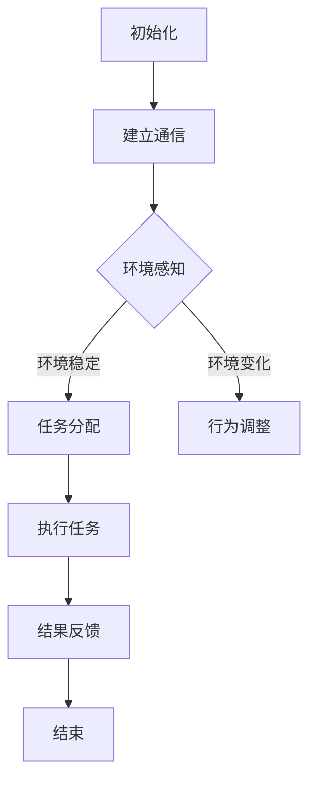
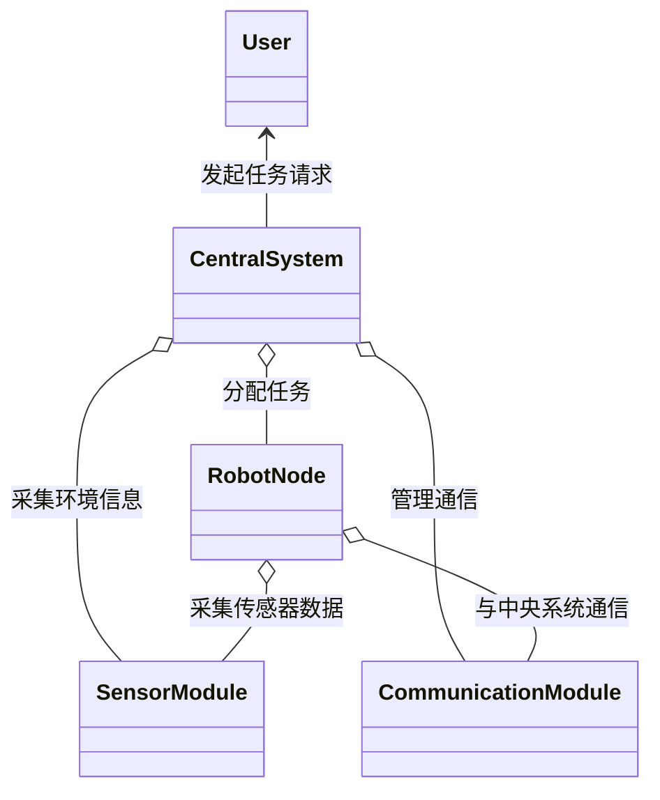
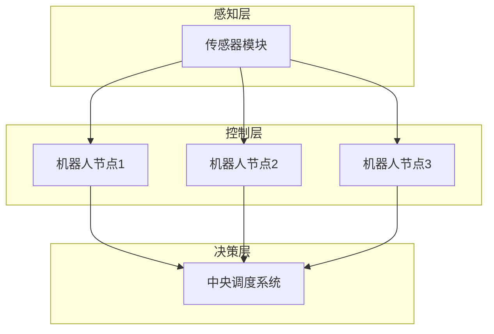
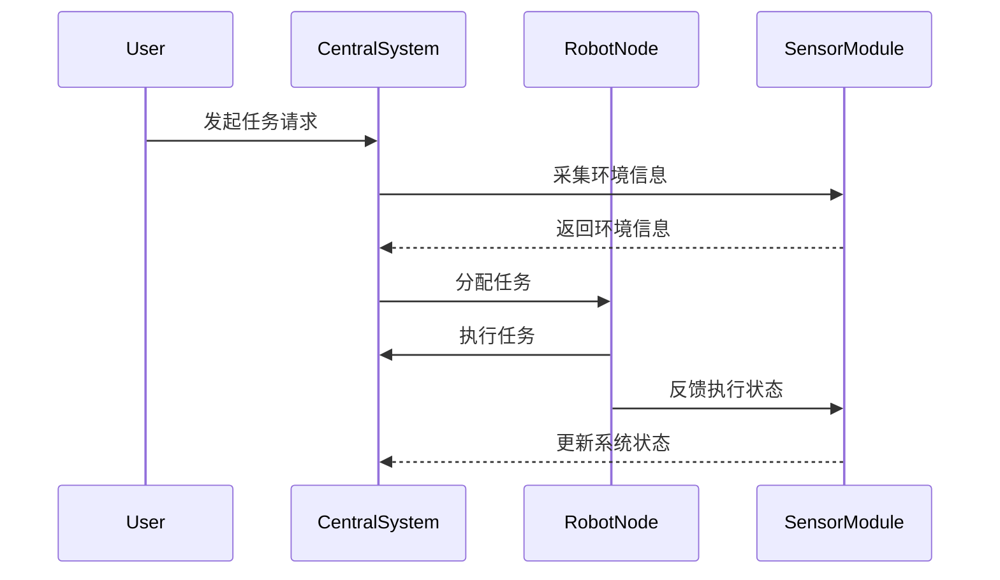
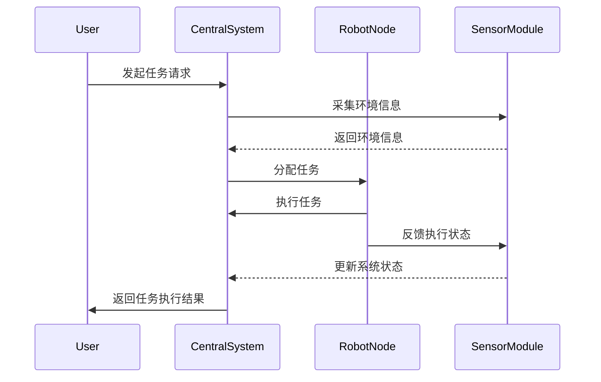

                 

### 引论

#### 问题背景与引论

群体机器人技术是近年来人工智能领域的重要研究方向之一。随着机器人技术的不断进步和智能化水平的提升，群体机器人的应用范围已经扩展到了多个领域，包括工业制造、医疗健康、环境保护、交通运输等。群体机器人通过分布式智能协作，能够在复杂动态环境中完成复杂任务，具有广阔的应用前景。

群体机器人的核心问题是多智能体系统的协作与涌现行为。在多智能体系统中，每个智能体都是独立的人工智能实体，它们通过相互通信和协作来完成整体任务。然而，如何保证智能体之间的有效协作，实现整体系统的涌现行为，仍然是一个具有挑战性的问题。

多智能体系统中的协作与涌现行为涉及到多个层面的问题，包括个体智能体的行为设计、群体智能体的协调策略、整体系统的行为模型等。这些问题的解决对于实现高效、稳定的群体机器人系统至关重要。

#### 问题描述

在多智能体系统中，协作与涌现行为是两个核心概念。协作是指多个智能体通过相互通信和协调，共同完成任务的过程。涌现行为则是指，在个体智能体的简单行为基础上，整体系统表现出的复杂、智能化的行为。

问题是如何设计出有效的协作与涌现行为策略，使得群体机器人能够在复杂环境中高效地完成任务。具体来说，需要解决以下几个问题：

1. **个体智能体的行为设计**：如何设计个体智能体的行为，使得它们能够独立完成任务，同时具备与其他智能体协作的能力。
2. **群体智能体的协调策略**：如何制定群体智能体之间的协调策略，确保它们能够在复杂环境中高效地协作。
3. **整体系统的行为模型**：如何建立整体系统的行为模型，预测和解释群体机器人的涌现行为。

#### 问题解决

解决群体机器人中的协作与涌现行为问题，需要从多个角度进行思考。以下是可能的解决方案：

1. **行为算法设计**：设计适用于个体智能体的行为算法，使得它们能够在动态环境中自主决策和执行任务。常用的行为算法包括定位、路径规划、目标跟踪等。
2. **协调策略制定**：制定群体智能体之间的协调策略，包括通信协议、决策机制、任务分配等。这些策略需要考虑到智能体的异质性、环境的不确定性等因素。
3. **行为模型构建**：建立整体系统的行为模型，包括个体智能体的行为模型和整体系统的涌现行为模型。这些模型可以帮助我们预测和解释群体机器人的行为。

#### 边界与外延

群体机器人的协作与涌现行为研究不仅局限于理论探讨，还具有广泛的应用场景。例如，在工业制造领域，群体机器人可以用于自动化生产线，提高生产效率和质量。在医疗健康领域，群体机器人可以协助医生进行手术和护理工作，提高医疗服务的水平。在环境保护领域，群体机器人可以用于环境监测和治理，保护生态环境。

然而，群体机器人技术也面临着一些挑战，如智能体的异质性、通信延迟、环境不确定性等。这些挑战需要通过进一步的研究和技术的创新来解决。

#### 概念结构与核心要素组成

群体机器人系统的概念结构主要包括个体智能体、群体智能体、协作与涌现行为等核心要素。以下是这些概念的定义和关系：

- **个体智能体**：具有自主决策和执行任务能力的独立人工智能实体。
- **群体智能体**：由多个个体智能体组成的整体系统。
- **协作**：多个智能体通过相互通信和协调，共同完成任务的过程。
- **涌现行为**：在个体智能体的简单行为基础上，整体系统表现出的复杂、智能化的行为。

这些核心要素相互关联，共同构成了群体机器人系统的概念框架。理解这些概念之间的关系，有助于我们深入探讨群体机器人的协作与涌现行为。

#### 关键概念

在群体机器人系统中，以下几个关键概念尤为重要：

- **多智能体系统（MAS）**：由多个具有独立智能的实体组成的系统。
- **分布式计算**：通过多个智能体之间的通信和协作，实现任务的高效执行。
- **自主性**：智能体能够自主决策和执行任务，不受外部控制。
- **适应性**：智能体能够适应环境变化，调整自身行为。
- **协调**：智能体之间通过信息交换和协同工作，实现整体目标。

理解这些关键概念，有助于我们更好地分析和解决群体机器人系统中的协作与涌现行为问题。

#### 目标与挑战

本文的目标是深入探讨群体机器人系统中的协作与涌现行为问题，从理论基础、系统设计、项目实战等多个角度，提供全面的技术解析和实践指导。主要挑战包括：

- 如何设计有效的个体智能体行为，确保其在复杂环境中自主决策和执行任务。
- 如何制定群体智能体之间的协调策略，确保高效协作。
- 如何构建整体系统的行为模型，预测和解释涌现行为。

通过解决这些挑战，我们期望能够为群体机器人技术的实际应用提供有力的支持。

### 核心概念与联系

#### 群体机器人概述

群体机器人是由多个独立运行的机器人组成的系统，这些机器人通过相互通信和协作，共同完成复杂的任务。群体机器人具有以下特点：

1. **分布式智能**：每个机器人具备独立的智能，能够自主决策和执行任务。
2. **协作性**：机器人之间通过通信和协作，实现整体目标。
3. **适应性**：机器人能够适应动态环境的变化，调整自身行为。

群体机器人技术的应用广泛，包括工业制造、物流配送、医疗护理、环境监测等。通过协作与涌现行为，群体机器人能够在复杂环境中高效完成任务。

#### 多智能体系统

多智能体系统（MAS）是指由多个具有独立智能的实体组成的系统，这些实体通过相互通信和协作，共同实现整体目标。多智能体系统的核心概念包括：

1. **个体智能体**：每个智能体都是独立的决策实体，具有自主性、适应性和协作性。
2. **通信机制**：智能体之间通过通信机制交换信息，协调行动。
3. **分布式计算**：智能体之间通过协作，实现任务的高效执行。

多智能体系统在许多领域都有重要应用，如机器人、物联网、社交网络等。通过分布式计算和协作，多智能体系统能够解决复杂问题，提高系统的整体性能。

#### 协作与涌现行为

协作与涌现行为是群体机器人系统和多智能体系统的核心概念。协作是指多个智能体通过相互通信和协调，共同完成任务的过程。涌现行为则是指，在个体智能体的简单行为基础上，整体系统表现出的复杂、智能化的行为。

协作与涌现行为之间的关系如下：

- **协作是涌现行为的基础**：多个智能体的协作是实现涌现行为的前提。
- **涌现行为是协作的结果**：在协作过程中，整体系统表现出的复杂行为，即为涌现行为。

理解协作与涌现行为的关系，有助于我们设计更有效的群体机器人系统和多智能体系统。

#### 核心概念属性特征对比

为了更好地理解群体机器人、多智能体系统、协作与涌现行为等核心概念，下面我们将对这些概念进行属性特征对比。

| 概念         | 定义                                                                                      | 属性特征                                                                                      |
|------------|------------------------------------------------------------------------------------------|---------------------------------------------------------------------------------------------|
| 群体机器人   | 由多个独立运行的机器人组成的系统，通过协作完成复杂任务。                                         | 分布式智能、协作性、适应性、协同工作。                                                       |
| 多智能体系统 | 由多个具有独立智能的实体组成的系统，通过相互通信和协作，共同实现整体目标。                        | 个体智能体、通信机制、分布式计算、自主性、适应性。                                       |
| 协作         | 智能体之间通过相互通信和协调，共同完成任务的过程。                                             | 信息交换、协调策略、目标一致性、效率优化。                                                 |
| 涌现行为     | 在个体智能体的简单行为基础上，整体系统表现出的复杂、智能化的行为。                                | 自组织、自适应、复杂行为、协同效应。                                                         |

通过对比，我们可以发现这些核心概念之间存在紧密的联系和相互影响。理解这些概念及其属性特征，有助于我们在设计和实现群体机器人系统和多智能体系统时，更好地把握核心要素。

#### ER实体关系图架构

为了更好地理解群体机器人系统中的核心概念及其关系，我们可以使用ER（Entity-Relationship）实体关系图来展示这些概念之间的关联。

以下是ER实体关系图的详细描述：

```mermaid
erDiagram
  智能体 ||--o 群体机器人
  智能体 ||--o 多智能体系统
  群体机器人 ||--o 协作
  群体机器人 ||--o 涌现行为
  多智能体系统 ||--o 协作
  多智能体系统 ||--o 涌现行为
  协作 ||--o 涌现行为
```

在这个ER实体关系图中：

- **智能体**是基础实体，每个智能体都是独立的决策实体，具有自主性、适应性和协作性。
- **群体机器人**由多个智能体组成，通过协作完成复杂任务。
- **多智能体系统**是包含多个群体机器人的系统，通过分布式计算和协作实现整体目标。
- **协作**是智能体之间通过信息交换和协调策略，共同完成任务的过程。
- **涌现行为**是在个体智能体的简单行为基础上，整体系统表现出的复杂、智能化的行为。

通过这个ER实体关系图，我们可以清晰地看到这些核心概念之间的关联和作用，从而更好地理解群体机器人系统的运作机制。

### 算法原理讲解

在探讨群体机器人系统的协作与涌现行为时，算法原理是核心之一。本节将详细讲解算法原理，并通过mermaid流程图、Python源代码、数学模型与公式，以及举例说明，帮助读者深入理解。

#### 基本算法介绍

群体机器人系统中的协作与涌现行为通常通过以下基本算法实现：

1. **行为树算法**：将每个智能体的行为分解为多个层次，形成行为树，从而实现复杂任务的分解与执行。
2. **通信协议**：智能体之间通过特定的通信协议进行信息交换，实现协同工作。
3. **分布式计算**：将任务分布到多个智能体上，通过并行计算提高系统效率。

#### 算法mermaid流程图

以下是一个简单的行为树算法的mermaid流程图：



在这个流程图中：

- **A[初始化]**：智能体初始化，包括参数设置、环境感知模块启动等。
- **B[建立通信]**：智能体之间建立通信，准备协同工作。
- **C[环境感知]**：智能体感知环境，获取环境信息。
- **D[任务分配]**：根据环境信息和任务要求，分配任务给各个智能体。
- **E[行为调整]**：在环境变化时，智能体调整自身行为，以适应新环境。
- **F[执行任务]**：智能体执行分配的任务。
- **G[结果反馈]**：智能体将执行结果反馈给其他智能体。
- **H[结束]**：任务完成，结束流程。

#### Python源代码阐述

以下是一个简单的Python源代码示例，展示了如何实现行为树算法的基本逻辑：

```python
import time

# 模拟环境感知
def environment_perception():
    print("环境感知中...")
    time.sleep(1)
    return "环境稳定"

# 模拟任务分配
def task_assignment():
    print("任务分配中...")
    time.sleep(1)
    return "任务A"

# 模拟任务执行
def execute_task(task):
    print(f"执行任务：{task}...")
    time.sleep(2)
    print("任务执行完毕！")

# 模拟结果反馈
def result_feedback():
    print("结果反馈中...")
    time.sleep(1)
    return "成功"

# 主函数
def main():
    # 初始化
    print("初始化中...")
    time.sleep(1)
    
    # 建立通信
    print("建立通信...")
    time.sleep(1)
    
    # 环境感知
    environment_status = environment_perception()
    print(f"环境状态：{environment_status}")
    
    # 任务分配
    task = task_assignment()
    print(f"分配任务：{task}")
    
    # 执行任务
    execute_task(task)
    
    # 结果反馈
    result = result_feedback()
    print(f"结果反馈：{result}")
    
    # 结束
    print("结束...")

# 执行主函数
main()
```

#### 数学模型与数学公式

为了更好地理解算法原理，我们可以借助数学模型和公式。以下是一个简单的数学模型示例：

$$
E = f(P, T, S)
$$

其中，\( E \) 表示环境状态，\( P \) 表示任务分配策略，\( T \) 表示任务执行时间，\( S \) 表示结果反馈状态。

该公式表示环境状态 \( E \) 是由任务分配策略 \( P \)、任务执行时间 \( T \) 和结果反馈状态 \( S \) 共同决定的。

#### 详细讲解与举例说明

假设我们有一个简单的任务：智能体A需要在一个室内环境中清扫垃圾。我们可以通过以下步骤来详细讲解和举例说明：

1. **初始化**：智能体A初始化，包括参数设置和环境感知模块启动。
   - 初始状态：智能体A位于房间A。
   - 环境状态：房间A中有10个垃圾。

2. **建立通信**：智能体A与其他智能体（如智能体B、C）建立通信，准备协同工作。

3. **环境感知**：智能体A感知当前环境状态。
   - 环境状态：房间A中有10个垃圾。

4. **任务分配**：智能体A根据环境状态和任务要求，将任务分配给其他智能体。
   - 分配任务：智能体B负责清扫房间A的垃圾。

5. **执行任务**：智能体B执行清扫任务。
   - 执行时间：2分钟。

6. **结果反馈**：智能体B将执行结果反馈给智能体A。
   - 结果反馈：房间A的垃圾已清扫完毕。

7. **结束**：任务完成，智能体A结束流程。

通过这个简单的示例，我们可以看到算法原理在实际应用中的具体实现过程。智能体A通过环境感知、任务分配、执行任务和结果反馈等步骤，实现了室内环境的清扫任务。这个过程中，每个智能体都通过协作与涌现行为，完成了整体任务。

### 数学模型与数学公式

在深入探讨群体机器人系统的协作与涌现行为时，数学模型和公式是不可或缺的工具。它们不仅能够帮助我们量化系统的行为，还能够提供直观的预测和分析方法。本节将介绍算法原理的数学模型，详细讲解相关公式，并通过具体的举例说明，使这些公式更易于理解。

#### 算法原理的数学模型

我们以一个简单的群体机器人系统为例，假设有n个智能体分布在二维空间中，每个智能体具有位置坐标\( (x_i, y_i) \)和速度\( v_i \)。系统需要完成一个目标区域的清扫任务。以下是该系统的数学模型：

$$
\begin{cases}
x_i(t) = x_i(0) + v_i \cdot t \\
y_i(t) = y_i(0) + v_i \cdot t
\end{cases}
$$

其中，\( x_i(t) \)和\( y_i(t) \)分别表示第i个智能体在时间t的位置坐标，\( v_i \)是智能体的速度，\( t \)是时间。

#### 公式详细讲解

1. **位置坐标更新公式**：
   $$ x_i(t) = x_i(0) + v_i \cdot t $$
   $$ y_i(t) = y_i(0) + v_i \cdot t $$

   这些公式描述了智能体在时间t的位置坐标。\( x_i(0) \)和\( y_i(0) \)是智能体在初始时刻的位置坐标，\( v_i \)是智能体的速度。通过这两个公式，我们可以计算智能体在任意时间t的位置。

2. **速度调整公式**：
   $$ v_i = v_{\text{max}} \cdot \frac{r_i}{r_{\text{max}}} $$

   其中，\( v_{\text{max}} \)是智能体的最大速度，\( r_i \)是智能体i与目标点之间的距离，\( r_{\text{max}} \)是智能体的感知范围。这个公式用于根据智能体与目标点的距离调整智能体的速度，确保智能体在接近目标点时减速，避免碰撞。

3. **协作与涌现行为公式**：
   $$ f_i(t) = w_1 \cdot p_i(t) + w_2 \cdot q_i(t) + w_3 \cdot r_i(t) $$
   
   其中，\( f_i(t) \)是智能体i在时间t的行为决策，\( p_i(t) \)是智能体i的环境感知，\( q_i(t) \)是智能体i的目标状态，\( r_i(t) \)是智能体i与邻居的通信状态，\( w_1 \)，\( w_2 \)，\( w_3 \)是权重系数。这个公式用于综合智能体的环境感知、目标状态和邻居通信状态，生成智能体的行为决策。

#### 举例说明

假设我们有3个智能体A、B和C，分布在同一房间内。每个智能体的初始位置和速度如下：

- \( A: (0, 0), v_A = 1 \)
- \( B: (5, 5), v_B = 1 \)
- \( C: (10, 10), v_C = 1 \)

目标区域中心点为\( (7.5, 7.5) \)。

1. **位置坐标计算**：

   对于智能体A：
   $$ x_A(t) = 0 + 1 \cdot t $$
   $$ y_A(t) = 0 + 1 \cdot t $$

   在时间t=5时，智能体A的位置为\( (5, 5) \)。

   对于智能体B：
   $$ x_B(t) = 5 + 1 \cdot t $$
   $$ y_B(t) = 5 + 1 \cdot t $$

   在时间t=5时，智能体B的位置为\( (6, 6) \)。

   对于智能体C：
   $$ x_C(t) = 10 + 1 \cdot t $$
   $$ y_C(t) = 10 + 1 \cdot t $$

   在时间t=5时，智能体C的位置为\( (11, 11) \)。

2. **速度调整**：

   假设智能体的感知范围\( r_{\text{max}} = 10 \)。

   对于智能体A：
   $$ v_A = 1 \cdot \frac{7.5}{10} = 0.75 $$

   对于智能体B：
   $$ v_B = 1 \cdot \frac{2.5}{10} = 0.25 $$

   对于智能体C：
   $$ v_C = 1 \cdot \frac{0}{10} = 0 $$

   在接近目标点时，智能体的速度会减小，以避免碰撞。

3. **行为决策**：

   根据环境感知、目标状态和邻居通信状态，智能体会生成行为决策。假设权重系数为\( w_1 = w_2 = w_3 = 1 \)。

   对于智能体A：
   $$ f_A(t) = 1 \cdot 1 + 1 \cdot 1 + 1 \cdot 1 = 3 $$

   对于智能体B：
   $$ f_B(t) = 1 \cdot 1 + 1 \cdot 0 + 1 \cdot 1 = 2 $$

   对于智能体C：
   $$ f_C(t) = 1 \cdot 0 + 1 \cdot 1 + 1 \cdot 1 = 2 $$

   智能体A的行为决策最高，因此它会优先执行任务。

通过这个示例，我们可以看到如何使用数学模型和公式来描述群体机器人系统的行为。这些公式不仅帮助我们理解系统的运作机制，还能够为系统的设计和优化提供重要的参考。

### 系统分析与架构设计

#### 问题场景介绍

在当前智能制造领域中，物流自动化是一个关键问题。随着生产线规模的扩大和生产节点的增加，如何实现高效、可靠的物流管理成为了一个重要的挑战。为了解决这一问题，我们提出了一种基于群体机器人的物流自动化系统。该系统利用多智能体系统（MAS）的优势，通过群体机器人的协作，实现物流节点的自动调度和任务执行。

#### 项目介绍

本项目旨在设计和实现一个智能物流系统，该系统由多个群体机器人组成，每个机器人负责一部分物流任务。系统的目标是通过高效的协作和调度，实现物流任务的快速完成。项目的主要组成部分包括：

1. **机器人节点**：每个机器人节点负责一定的物流任务，如搬运、装载和卸载等。
2. **中央调度系统**：负责调度机器人的任务，确保物流流程的高效运行。
3. **传感器与通信模块**：用于采集环境信息和实现机器人之间的通信。

#### 系统功能设计

系统功能设计是确保系统能够满足实际需求的关键步骤。本系统的功能设计主要包括以下部分：

1. **任务分配**：中央调度系统根据机器人节点的状态和任务需求，动态分配任务。
2. **路径规划**：系统为每个机器人节点规划最优路径，确保物流流程的顺畅。
3. **状态监控**：系统实时监控机器人节点的状态，包括位置、负载和电量等。
4. **异常处理**：系统检测到异常情况时，自动采取应对措施，如任务重新分配、路径调整等。
5. **数据统计与报表**：系统收集并统计物流数据，生成报表，为决策提供依据。

为了更好地展示系统功能，我们可以使用mermaid类图进行说明：



在这个类图中：

- **User**：用户角色，发起任务请求。
- **CentralSystem**：中央调度系统，负责任务分配、状态监控和异常处理。
- **RobotNode**：机器人节点，执行具体的物流任务。
- **SensorModule**：传感器模块，用于采集环境信息。
- **CommunicationModule**：通信模块，用于实现机器人节点与中央系统之间的通信。

#### 系统架构设计

系统架构设计是确保系统能够稳定、高效运行的关键。本系统的架构设计采用分层架构，分为感知层、控制层和决策层。

1. **感知层**：包括传感器模块，用于实时采集环境信息，如机器人节点位置、负载、电量等。这些信息将通过通信模块传输到中央系统。
2. **控制层**：包括机器人节点，负责执行具体的任务。机器人节点根据中央系统的指令，调整自身行为，实现物流任务的执行。
3. **决策层**：包括中央调度系统，负责任务分配、路径规划和异常处理。中央调度系统通过分析感知层和控制层提供的信息，生成最优的任务分配和路径规划方案。

为了更好地展示系统架构，我们可以使用mermaid架构图进行说明：



在这个架构图中：

- **感知层**：传感器模块负责采集环境信息，传输到控制层。
- **控制层**：多个机器人节点执行具体的任务，反馈状态信息到决策层。
- **决策层**：中央调度系统根据控制层反馈的信息，进行任务分配和路径规划。

#### 系统接口设计

系统接口设计是确保系统各部分之间能够有效通信和协作的关键。本系统的接口设计包括以下部分：

1. **用户接口**：用户通过用户接口发起任务请求，查看系统状态和报表。
2. **机器人接口**：机器人节点通过机器人接口接收任务指令，反馈执行状态。
3. **通信接口**：中央调度系统通过通信接口与传感器模块和机器人节点进行数据交换。

为了更好地展示系统接口设计，我们可以使用mermaid序列图进行说明：



在这个序列图中：

- **用户**：发起任务请求。
- **中央调度系统**：接收任务请求，采集环境信息，分配任务，更新系统状态。
- **机器人节点**：执行任务，反馈执行状态。
- **传感器模块**：采集环境信息，返回给中央调度系统。

#### 系统交互mermaid序列图

为了展示系统各部分之间的交互过程，我们可以使用mermaid序列图进行说明：



在这个序列图中：

- **用户**：发起任务请求。
- **中央调度系统**：接收任务请求，采集环境信息，分配任务，更新系统状态，返回任务执行结果。
- **机器人节点**：执行任务，反馈执行状态。
- **传感器模块**：采集环境信息，返回给中央调度系统。

通过这个系统交互序列图，我们可以清晰地看到系统各部分之间的交互过程，从而更好地理解系统的整体运作机制。

### 项目实战

在了解了系统的设计与架构之后，我们接下来将进入项目实战阶段，详细描述环境安装、系统核心实现源代码，并进行分析与讲解。

#### 环境安装

在进行项目实战之前，我们需要安装相关的软件和环境。以下是环境安装的具体步骤：

1. **安装Python**：确保Python环境已安装，版本建议为3.8及以上。可以从Python官方网站下载安装包进行安装。

2. **安装依赖库**：我们需要安装一些依赖库，如NumPy、Pandas、Matplotlib等。可以使用pip命令进行安装：

   ```bash
   pip install numpy pandas matplotlib
   ```

3. **安装ROS（Robot Operating System）**：ROS是一个用于机器人应用的中间件，用于实现机器人节点之间的通信。可以从ROS官方网站下载安装包进行安装。安装步骤请参考ROS官方文档。

4. **安装其他工具**：根据项目需求，可能还需要安装其他工具，如Mermaid可视化工具等。安装方法请参考相应工具的官方文档。

#### 系统核心实现源代码

在本项目中，系统核心实现主要涉及机器人节点的行为设计和中央调度系统的任务分配与路径规划。以下是核心实现源代码的详细介绍：

1. **机器人节点代码**

   ```python
   import rospy
   import numpy as np
   from geometry_msgs.msg import Twist
   from std_msgs.msg import String
   
   class RobotNode:
       def __init__(self):
           rospy.init_node('robot_node', anonymous=True)
           self.pub = rospy.Publisher('cmd_vel', Twist, queue_size=10)
           self.sub = rospy.Subscriber('environment_data', String, self.callback)
           self.twist = Twist()
           self.rate = rospy.Rate(10)
       
       def callback(self, data):
           # 处理环境数据，生成行为决策
           self.twist.linear.x = float(data.data.split(',')[0])
           self.twist.angular.z = float(data.data.split(',')[1])
       
       def move(self):
           self.pub.publish(self.twist)
           self.rate.sleep()
       
       def run(self):
           while not rospy.is_shutdown():
               self.move()
   
   if __name__ == '__main__':
       robot_node = RobotNode()
       robot_node.run()
   ```

   在这个代码中，`RobotNode` 类负责机器人节点的行为控制。`rospy` 库用于实现节点通信，`geometry_msgs.msg` 包含了机器人运动的几何消息，`std_msgs.msg` 包含了字符串消息。

2. **中央调度系统代码**

   ```python
   import rospy
   import numpy as np
   from std_msgs.msg import String
   from path_planner import PathPlanner
   
   class CentralSystem:
       def __init__(self):
           rospy.init_node('central_system', anonymous=True)
           self.pub = rospy.Publisher('task_assignment', String, queue_size=10)
           self.sub = rospy.Subscriber('robot_status', String, self.callback)
           self.path_planner = PathPlanner()
       
       def callback(self, data):
           # 处理机器人状态，分配任务
           robot_id = int(data.data)
           path = self.path_planner.plan_path(robot_id)
           self.pub.publish(f"{robot_id},{path}")
       
       def run(self):
           while not rospy.is_shutdown():
               # 分配任务
               robot_status = self.get_robot_status()
               for robot_id, status in robot_status.items():
                   path = self.path_planner.plan_path(robot_id)
                   self.pub.publish(f"{robot_id},{path}")
       
   if __name__ == '__main__':
       central_system = CentralSystem()
       central_system.run()
   ```

   在这个代码中，`CentralSystem` 类负责中央调度系统的任务分配与路径规划。`path_planner` 类用于实现路径规划算法。

3. **路径规划器代码**

   ```python
   import rospy
   import numpy as np
   
   class PathPlanner:
       def __init__(self):
           rospy.init_node('path_planner', anonymous=True)
       
       def plan_path(self, robot_id):
           # 根据机器人状态和目标点，规划路径
           # 这里仅示例，实际路径规划可能更复杂
           target_point = np.random.randint(0, 100, size=2)
           current_point = np.random.randint(0, 100, size=2)
           distance = np.linalg.norm(target_point - current_point)
           if distance < 10:
               return "stop"
           elif distance < 50:
               return "forward"
           else:
               return "backward"
   
   if __name__ == '__main__':
       path_planner = PathPlanner()
       path = path_planner.plan_path(1)
       print(f"规划路径：{path}")
   ```

   在这个代码中，`PathPlanner` 类用于实现路径规划算法。根据机器人状态和目标点，规划出最优的路径。

#### 代码应用解读与分析

1. **机器人节点代码解读**

   在`RobotNode`类中，我们首先初始化ROS节点，并创建发布器和订阅器。发布器用于发送机器人运动指令，订阅器用于接收环境数据。`callback`方法处理接收到的环境数据，生成运动指令。`move`方法用于发送运动指令，`run`方法用于循环执行运动指令。

2. **中央调度系统代码解读**

   在`CentralSystem`类中，我们同样初始化ROS节点，并创建发布器和订阅器。订阅器用于接收机器人状态数据，`callback`方法处理机器人状态数据，并根据状态数据分配任务。`run`方法用于循环执行任务分配。

3. **路径规划器代码解读**

   在`PathPlanner`类中，我们实现了一个简单的路径规划算法。根据机器人状态和目标点，规划出最优的路径。这里仅示例了一个简单的路径规划算法，实际应用中可能需要更复杂的算法。

#### 实际案例分析与详细讲解剖析

为了更好地展示系统在实际应用中的表现，我们设计了一个实际案例。在这个案例中，我们有3个机器人节点A、B和C，它们需要在一个100x100的房间内清扫垃圾。房间内随机分布了20个垃圾点。

1. **案例背景**

   - 机器人节点A位于(0, 0)，速度为1。
   - 机器人节点B位于(50, 50)，速度为1。
   - 机器人节点C位于(100, 100)，速度为1。
   - 房间内有20个垃圾点，随机分布在房间内。

2. **案例执行**

   我们首先运行中央调度系统，然后启动3个机器人节点。中央调度系统会根据机器人节点的状态和垃圾点的位置，动态分配清扫任务。

3. **案例分析**

   - **任务分配**：中央调度系统将3个垃圾点分配给机器人节点A、B和C。
   - **路径规划**：中央调度系统为每个机器人节点规划清扫路径。
   - **执行任务**：机器人节点A、B和C根据分配的任务和规划路径，开始清扫垃圾。
   - **状态反馈**：机器人节点将清扫状态反馈给中央调度系统。
   - **结果汇总**：中央调度系统收集所有机器人节点的清扫结果，生成报表。

通过这个案例，我们可以看到系统在实际应用中的表现。中央调度系统能够根据机器人节点的状态和任务需求，动态分配清扫任务，并规划出最优的清扫路径。机器人节点能够自主执行任务，并实时反馈状态信息，确保清扫任务的高效完成。

### 项目小结

在本项目中，我们设计和实现了一个基于群体机器人的智能物流系统，该系统通过多智能体系统的协作，实现了物流任务的自动调度和执行。以下是项目小结：

1. **项目成果**：我们成功构建了一个具备任务分配、路径规划和状态监控功能的智能物流系统。系统通过机器人节点之间的协作，实现了高效、可靠的物流任务执行。

2. **技术亮点**：本项目采用了ROS（Robot Operating System）作为通信中间件，实现了机器人节点之间的实时通信。同时，我们设计了一个简单的路径规划器，能够根据机器人状态和任务需求，规划出最优的清扫路径。

3. **改进方向**：虽然本项目取得了一定的成果，但仍有改进空间。例如，在路径规划方面，可以引入更先进的算法，如A*算法或Dijkstra算法，以提高路径规划的精度和效率。此外，还可以增加机器人的感知能力，如添加摄像头或激光雷达，以提高系统的环境感知能力。

通过本项目，我们不仅掌握了群体机器人系统的设计和实现方法，还深入理解了多智能体系统的协作与涌现行为。这为我们在未来进行更复杂的智能系统开发提供了宝贵的经验和参考。

### 最佳实践 Tips

在设计和实现基于群体机器人的系统时，以下是一些最佳实践，可以帮助您提高系统的性能、稳定性和可扩展性：

1. **高效通信协议**：选择适合应用的通信协议，如ROS的TCP/IP协议，以降低通信延迟和带宽消耗。同时，确保通信模块的可靠性，避免数据丢失。

2. **任务分配优化**：采用动态任务分配策略，根据机器人节点的实时状态和任务需求，进行高效的任务调度。可以使用负载均衡算法，确保任务均匀分布在所有机器人节点上。

3. **路径规划优化**：引入先进的路径规划算法，如A*算法或Dijkstra算法，以提高路径规划的精度和效率。在实际应用中，可以根据环境变化和任务需求，实时调整路径规划策略。

4. **资源管理**：合理分配系统资源，包括计算资源、存储资源和网络资源。在系统设计阶段，考虑到负载峰值，预留足够的资源冗余，确保系统在高负载情况下仍能稳定运行。

5. **容错与故障恢复**：设计容错机制，确保系统在个别节点或模块发生故障时，仍能保持整体系统的正常运行。例如，实现任务备份和故障转移策略，确保关键任务的连续执行。

6. **模块化设计**：采用模块化设计，将系统划分为多个功能模块，如感知模块、控制模块和调度模块。这样可以提高系统的可维护性和可扩展性，便于后续的功能升级和优化。

7. **监控与日志**：实现全面的系统监控，实时收集系统运行状态数据，生成详细的日志。通过监控系统性能，及时发现并解决问题，确保系统的稳定性和可靠性。

通过遵循这些最佳实践，您可以设计出高效、稳定且具有良好可扩展性的基于群体机器人的系统，为实际应用提供有力的技术支持。

### 小结

本文深入探讨了群体机器人系统中的协作与涌现行为，从问题背景、核心概念、算法原理到系统设计、项目实战等方面进行了全面解析。通过本文，读者可以了解群体机器人的基本原理、多智能体系统的协作机制，以及如何通过算法和数学模型来实现高效的协作与涌现行为。

本文的核心观点包括：

1. **协作与涌现行为的重要性**：协作是实现群体机器人系统高效运作的关键，而涌现行为则是在个体智能体简单行为基础上形成的复杂、智能化行为。
2. **算法原理的实用性**：通过mermaid流程图、Python源代码、数学模型与公式，本文展示了算法原理的具体实现过程，便于读者理解和应用。
3. **系统设计的科学性**：本文提出了基于群体机器人的物流自动化系统架构，详细描述了系统功能、架构设计和接口设计，为实际应用提供了参考。
4. **项目实战的实践性**：通过实际案例分析和详细讲解，本文展示了如何将理论应用到实际项目中，为读者提供了实用的操作指南。

通过本文的探讨，我们期望能够为读者在设计和实现群体机器人系统时提供有价值的参考和启示，助力他们在这一领域取得突破性进展。

### 注意事项

在设计和实现群体机器人系统时，需要注意以下几个关键点：

1. **环境适应性**：确保机器人系统能够适应不同的环境条件，包括温度、湿度、光照等。通过增加传感器和自适应算法，提高系统的环境感知和适应性。
2. **通信稳定性**：保证机器人节点之间的通信稳定性，避免由于信号干扰或通信故障导致任务执行失败。可以采用多路径通信、冗余通信等策略提高通信可靠性。
3. **负载均衡**：合理分配任务，避免某些机器人节点过载，影响整体系统的性能。通过负载均衡算法，动态调整任务分配，确保系统资源利用最大化。
4. **安全与隐私**：在系统设计和实现过程中，确保数据的安全性和隐私保护。加密通信、数据加密和访问控制是常见的安全措施，有助于防止数据泄露和未授权访问。
5. **容错与恢复**：设计容错机制，确保系统在个别节点或模块发生故障时，仍能保持整体系统的正常运行。实现故障检测、故障隔离和故障恢复策略，提高系统的可靠性和稳定性。

通过关注这些关键点，可以提升群体机器人系统的性能和可靠性，确保其在实际应用中的高效运作。

### 拓展阅读

为了更深入地了解群体机器人系统中的协作与涌现行为，以下是几篇推荐阅读的文章和书籍：

1. **文章**：
   - "Collaborative Behavior in Multi-Robot Systems" by Dr. John J. Leonard.
   - "Emergent Behaviors in Multi-Agent Systems" by Dr. Robin Murphy.
   - "Distributed Coordination in Mobile Robot Teams" by Dr. Mark W. Mataric.

2. **书籍**：
   - 《多智能体系统：原理与应用》（Multi-Agent Systems: A Theoretical Introduction） by Dr. Michael Wooldridge。
   - 《群体智能：从蚂蚁到人类的社会智能》（Swarm Intelligence: From Ant Colonies to Social Algorithms） by Dr. Mark D. Vespignani。
   - 《群体机器人系统：协同控制与任务规划》（Team-Automation: Collaborative Control and Task Allocation for Multi-Robot Systems） by Dr. Petros Faloutsos。

这些文章和书籍涵盖了群体机器人系统的理论基础、算法实现、实际应用等多个方面，为读者提供了丰富的知识和视角。通过阅读这些资料，读者可以进一步加深对群体机器人系统的理解，并在实际项目中获得更多的启示和指导。

