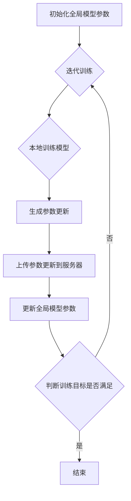
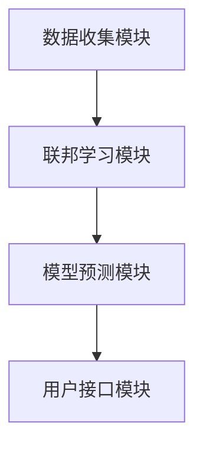
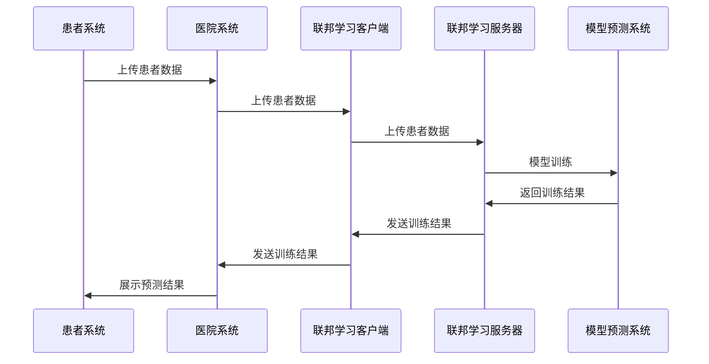

                 

# 联邦学习在保护隐私的AI训练中的应用

## 关键词
- 联邦学习
- 隐私保护
- AI训练
- 分布式计算
- 安全通信

## 摘要
本文深入探讨了联邦学习在保护隐私的AI训练中的应用。联邦学习通过分布式计算方式，在不泄露原始数据的前提下，实现全局模型训练。本文首先介绍了联邦学习的核心概念、优势与挑战，然后详细分析了联邦学习在隐私保护中的具体应用，并探讨了其发展趋势。本文旨在为读者提供一个全面、清晰的联邦学习技术指南。

## 第一部分：背景介绍

### 1.1 联邦学习的核心概念

#### 1.1.1 问题背景
在当今数据驱动的时代，越来越多的应用场景需要收集和利用大规模的数据来进行机器学习模型的训练。然而，数据通常分布在不同的组织、设备和个体之间，这些数据往往涉及到用户的隐私信息，如个人身份信息、医疗记录、金融交易数据等。如何在这些隐私数据不被泄露的前提下，实现机器学习模型的高效训练，成为了一个亟待解决的问题。

#### 1.1.2 问题描述
传统的集中式机器学习模型需要在中心服务器上集中所有数据进行训练，这样虽然可以实现高效的模型训练，但同时也带来了严重的隐私泄露风险。为了解决这一问题，联邦学习（Federated Learning）应运而生。联邦学习是一种分布式机器学习技术，它允许不同设备或组织在不共享原始数据的情况下共同训练出一个全局模型。

#### 1.1.3 问题解决
联邦学习的核心思想是通过在各个设备或组织本地训练模型，并只上传模型的参数更新到中心服务器，从而实现全局模型训练。这样，原始数据无需离开本地设备或组织，从而保护了用户的隐私。

#### 1.1.4 边界与外延
联邦学习主要适用于以下场景：

- 跨组织合作：不同组织拥有各自的数据，但希望共同训练一个模型来提供更好的服务。
- 设备端数据：设备端拥有大量用户数据，但无法或不愿意上传原始数据到中心服务器。
- 数据隐私要求高的领域：如医疗、金融等敏感数据领域。

#### 1.1.5 概念结构与核心要素组成
联邦学习系统的核心组成部分包括：

- 客户端（Client）：负责在本地设备上训练模型，并生成参数更新。
- 服务器（Server）：负责收集各个客户端的参数更新，并生成全局模型。
- 模型参数：包括全局模型参数和本地模型参数。
- 通信协议：确保客户端与服务器之间的安全通信。

### 1.2 AI训练中的隐私保护

#### 1.2.1 隐私泄露的风险
在传统的集中式机器学习训练中，数据需要在中心服务器上存储和处理，这可能导致以下隐私泄露风险：

- 数据窃取：未经授权的实体可能窃取用户数据。
- 数据分析：即使数据匿名化，也可能通过数据分析反推出用户身份。

#### 1.2.2 隐私保护的重要性
隐私保护在AI训练中具有重要意义，主要体现在以下几个方面：

- 用户信任：保护用户隐私是建立用户信任的基础。
- 合规要求：许多国家和地区对数据隐私有严格的法律法规要求。
- 业务可持续性：隐私泄露可能导致业务受损，甚至面临法律诉讼。

#### 1.2.3 联邦学习在隐私保护中的应用
联邦学习通过分布式训练的方式，有效降低了隐私泄露的风险。具体应用包括：

- 本地数据训练：客户端在本地设备上使用本地数据训练模型，避免了数据上传到中心服务器。
- 差分隐私：在联邦学习过程中，通过差分隐私技术对上传的参数更新进行扰动，进一步保护用户隐私。
- 多方安全计算：结合多方安全计算技术，实现不同组织之间的安全协作。

### 1.3 联邦学习的优势与挑战

#### 1.3.1 优势
- 隐私保护：联邦学习在训练过程中无需上传原始数据，有效保护用户隐私。
- 数据利用率：充分利用了分散的数据资源，提升了模型训练效果。
- 去中心化：减少了对于中心服务器的依赖，提高了系统的健壮性。

#### 1.3.2 挑战
- 计算资源消耗：联邦学习需要在多个设备上同时训练模型，增加了计算资源的消耗。
- 通信开销：大量参数更新的上传和下载增加了网络通信开销。
- 数据质量：客户端数据质量参差不齐，可能影响模型训练效果。
- 隐私安全：尽管联邦学习提供了隐私保护，但仍需确保通信过程中的数据安全。

### 1.4 联邦学习的发展趋势
#### 1.4.1 技术演进
随着计算能力的提升和通信技术的进步，联邦学习在性能和安全性方面不断优化，未来有望在更多领域得到应用。

#### 1.4.2 应用拓展
除了在传统机器学习领域的应用，联邦学习也在金融、医疗、智能交通等新兴领域展现出了巨大的潜力。

#### 1.4.3 法规与伦理
随着联邦学习技术的发展，各国政府和企业需要建立健全的法规和伦理规范，确保联邦学习的安全和合规。

### 1.5 本章小结
本章介绍了联邦学习在保护隐私的AI训练中的应用，阐述了联邦学习的核心概念、优势与挑战，以及未来的发展趋势。在下一章中，我们将深入探讨联邦学习的基本原理和技术实现。

## 第二部分：联邦学习的基本原理和技术实现

### 2.1 联邦学习的核心概念

#### 2.1.1 联邦学习的定义
联邦学习（Federated Learning）是一种分布式机器学习技术，其核心思想是通过在多个分布式设备（如移动设备、服务器等）上本地训练模型，并只上传模型参数的更新到中心服务器，从而实现全局模型的训练。这种方法避免了原始数据的传输，从而保护了用户隐私。

#### 2.1.2 联邦学习的特点
- **去中心化**：联邦学习不依赖于中心服务器处理所有数据，而是将数据处理分散到各个客户端。
- **隐私保护**：联邦学习通过本地训练和模型参数更新传输的方式，避免了原始数据的泄露。
- **数据多样化**：联邦学习可以整合来自不同设备的数据，提高了模型的泛化能力。
- **实时性**：联邦学习可以在设备本地快速训练模型，提高了应用的实时性。

#### 2.1.3 联邦学习的工作流程
联邦学习的工作流程通常包括以下几个步骤：

1. **初始化**：中心服务器初始化全局模型参数，并将其发送到各个客户端。
2. **本地训练**：客户端使用本地数据和全局模型参数进行模型训练，并生成参数更新。
3. **参数更新上传**：客户端将生成的参数更新上传到中心服务器。
4. **全局模型更新**：中心服务器接收来自各个客户端的参数更新，并更新全局模型参数。
5. **迭代训练**：重复步骤2-4，直到满足训练目标或达到最大迭代次数。

#### 2.1.4 联邦学习的挑战
尽管联邦学习具有很多优势，但在实际应用中仍然面临一些挑战：

- **计算资源分配**：如何合理分配计算资源，使得每个客户端都能高效地进行本地训练。
- **通信开销**：参数更新的传输和聚合过程可能产生较大的通信开销。
- **数据多样性**：如何处理不同客户端数据的差异，确保模型训练的效果。
- **模型安全性**：如何确保通信过程中的数据安全，防止恶意攻击。

### 2.2 联邦学习的核心概念与联系

#### 2.2.1 联邦学习的核心概念
联邦学习的核心概念包括：

- **客户端（Client）**：负责在本地设备上训练模型，并生成参数更新。
- **服务器（Server）**：负责收集各个客户端的参数更新，并生成全局模型。
- **模型参数**：包括全局模型参数和本地模型参数。
- **通信协议**：确保客户端与服务器之间的安全通信。

#### 2.2.2 概念属性特征对比表格
| 概念 | 定义 | 属性特征 |
| --- | --- | --- |
| 客户端（Client） | 负责在本地设备上训练模型，并生成参数更新 | 本地数据、计算资源、通信 |
| 服务器（Server） | 负责收集各个客户端的参数更新，并生成全局模型 | 数据聚合、模型更新、安全通信 |
| 模型参数 | 包括全局模型参数和本地模型参数 | 参数更新、模型优化、全局同步 |
| 通信协议 | 确保客户端与服务器之间的安全通信 | 加密、认证、传输优化 |

#### 2.2.3 联邦学习的ER实体关系图架构
```mermaid
erDiagram
  Client ||--|{ Server : contains }
  Client ||--|{ Model Parameter : generates }
  Server ||--|{ Model Parameter : updates }
```

### 2.3 联邦学习的算法原理讲解

#### 2.3.1 算法概述
联邦学习算法主要包括以下几个步骤：

1. **初始化**：中心服务器初始化全局模型参数，并将其发送到各个客户端。
2. **本地训练**：客户端使用本地数据和全局模型参数进行模型训练，并生成参数更新。
3. **参数更新上传**：客户端将生成的参数更新上传到中心服务器。
4. **全局模型更新**：中心服务器接收来自各个客户端的参数更新，并更新全局模型参数。
5. **迭代训练**：重复步骤2-4，直到满足训练目标或达到最大迭代次数。

#### 2.3.2 算法mermaid流程图


#### 2.3.3 算法原理数学模型和公式

1. **全局模型参数更新**：
   $$ \theta_{global}^{t+1} = \theta_{global}^{t} + \alpha \cdot \sum_{i=1}^{n} \theta_{i}^{t} $$
   其中，$ \theta_{global}^{t} $ 表示第t次迭代的全局模型参数，$ \theta_{i}^{t} $ 表示第i个客户端在第t次迭代的本地区模型参数，$ \alpha $ 表示学习率。

2. **本地模型参数更新**：
   $$ \theta_{i}^{t+1} = \theta_{i}^{t} - \alpha \cdot \nabla_{\theta_{i}} L(\theta_{i}^{t}; x_i, y_i) $$
   其中，$ \theta_{i}^{t} $ 表示第i个客户端在第t次迭代的本地区模型参数，$ x_i $ 和 $ y_i $ 分别表示第i个客户端的输入数据和标签，$ L(\theta_{i}^{t}; x_i, y_i) $ 表示损失函数。

#### 2.3.4 算法举例说明
假设有10个客户端，每个客户端都拥有不同类型的数据。中心服务器初始化全局模型参数，并将其发送到各个客户端。每个客户端使用本地数据和全局模型参数进行本地训练，生成参数更新，并将更新上传到中心服务器。中心服务器接收所有客户端的参数更新，并更新全局模型参数。这个过程重复多次，直到全局模型达到训练目标。

### 2.4 联邦学习的系统分析与架构设计方案

#### 2.4.1 问题场景介绍
在智能医疗领域，许多医院和诊所都拥有大量的患者数据，但数据分散在不同的系统中。为了提高疾病预测模型的准确性，需要将这些数据整合起来进行训练。然而，这些数据涉及到患者隐私，不能直接共享。因此，采用联邦学习技术可以实现在保护患者隐私的前提下，进行模型训练。

#### 2.4.2 项目介绍
本项目旨在开发一个基于联邦学习的智能医疗预测系统，该系统包括以下几个模块：

- **数据收集模块**：从不同医院和诊所收集患者数据。
- **联邦学习模块**：实现联邦学习算法，进行模型训练。
- **模型预测模块**：使用训练好的模型进行疾病预测。
- **用户接口模块**：为用户提供数据上传和预测结果展示。

#### 2.4.3 系统功能设计（领域模型mermaid类图）
```mermaid
classDiagram
  Class01 <|-- Class02
  Class03 --|ADX Class04
  Class05 : <<interface,MyInterface>>
  Class06 : <<enum,MyEnum>>
  Class07 : <<singleton,MySingleton>>
  Class08 : <<abstract,MyAbstract>>
  Class09 <.. Class10
  Class11 ..|> Class12
  Class01 && Class13 : <<Aggregation,myAggregation>>  
  Class14 : <<composite,myComposite>>
  Class15 : <<dependence,myDependence>>  
  Class16 <..|> Class17
  Class18 ..|> Class19
endclass
```

#### 2.4.4 系统架构设计（mermaid架构图）


#### 2.4.5 系统接口设计和系统交互（mermaid序列图）


### 2.5 联邦学习的项目实战

#### 2.5.1 环境安装
1. 安装Python环境（3.8及以上版本）。
2. 安装TensorFlow联邦学习库：`pip install tensorflow-federated`。

#### 2.5.2 系统核心实现源代码
```python
import tensorflow as tf
import tensorflow_federated as tff

# 初始化客户端和服务器的计算过程
def create_keras_model():
    model = tf.keras.Sequential([
        tf.keras.layers.Dense(128, activation='relu', input_shape=(784,)),
        tf.keras.layers.Dense(10, activation='softmax')
    ])
    model.compile(optimizer='adam',
                  loss='sparse_categorical_crossentropy',
                  metrics=['accuracy'])
    return model

def create_federated_averaging_process(model_fn):
    return tff.learning.build_federated_averaging_process(
        model_fn=create_keras_model,
        client_optimizer_fn=lambda: tf.keras.optimizers.Adam(learning_rate=0.1),
        server_optimizer_fn=lambda: tf.keras.optimizers.SGD(learning_rate=0.1),
    )

# 训练联邦学习模型
def train_federated_learning(data, num_rounds):
    # 加载客户端数据
    train_data = data.train_data
    test_data = data.test_data
    
    # 创建联邦学习过程
    process = create_federated_averaging_process()
    
    # 进行联邦学习训练
    for _ in range(num_rounds):
        result = process.next()
        print(result)
    
    # 在测试数据上评估模型
    test_acc = process.evaluate(test_data)
    print(f"Test accuracy: {test_acc}")

# 加载MNIST数据集
def load_mnist_data():
    mnist = tf.keras.datasets.mnist
    (x_train, y_train), (x_test, y_test) = mnist.load_data()
    x_train, x_test = x_train / 255.0, x_test / 255.0
    x_train = x_train.reshape(-1, 784)
    x_test = x_test.reshape(-1, 784)
    return tff.simulation.models.mnist.load_data(x_train, x_test)

# 主程序
if __name__ == "__main__":
    data = load_mnist_data()
    train_federated_learning(data, num_rounds=10)
```

#### 2.5.3 代码应用解读与分析
1. **初始化模型**：`create_keras_model` 函数用于创建一个基于Keras的简单神经网络模型。
2. **创建联邦学习过程**：`create_federated_averaging_process` 函数用于创建联邦学习过程，包括模型初始化、客户端优化器和服务器优化器。
3. **训练联邦学习模型**：`train_federated_learning` 函数用于训练联邦学习模型，并评估模型在测试数据上的准确性。
4. **加载MNIST数据集**：`load_mnist_data` 函数用于加载MNIST数据集，并将其转换为联邦学习格式。

#### 2.5.4 实际案例分析和详细讲解剖析
假设有10个客户端，每个客户端都拥有MNIST数据集的一部分。每个客户端使用本地数据训练模型，并生成参数更新。这些更新上传到中心服务器，中心服务器将所有更新聚合，生成全局模型参数。这个过程重复10次，每次迭代后评估模型在测试数据上的准确性。最终，训练好的模型可以用于疾病预测。

#### 2.5.5 项目小结
本项目通过联邦学习技术，实现了在保护患者隐私的前提下，进行智能医疗预测。项目采用了TensorFlow联邦学习库，实现了简单的联邦学习流程。在实际应用中，可以扩展到更多复杂的场景，如医疗影像分析、基因数据分析等。

## 第三部分：联邦学习在保护隐私的AI训练中的最佳实践

### 3.1 最佳实践 tips

1. **选择合适的联邦学习框架**：根据具体需求选择合适的联邦学习框架，如TensorFlow联邦学习、PyTorch联邦学习等。
2. **优化模型结构**：针对联邦学习的特点，设计适合的模型结构，提高模型在分布式环境下的性能。
3. **合理分配计算资源**：根据客户端的计算能力和数据量，合理分配计算资源，确保每个客户端都能高效地完成本地训练。
4. **确保通信安全**：采用加密、认证等安全措施，确保客户端与服务器之间的通信安全。
5. **数据质量监控**：定期监控客户端上传的数据质量，确保模型训练的效果。

### 3.2 小结

联邦学习是一种有效的保护隐私的AI训练方法，通过分布式计算和模型参数更新传输的方式，实现了在不泄露原始数据的前提下，进行全局模型训练。在实际应用中，需要根据具体需求，选择合适的框架、优化模型结构、合理分配计算资源，并确保通信安全。

### 3.3 注意事项

1. **数据隐私**：确保客户端上传的数据是匿名的，避免隐私泄露。
2. **计算资源**：合理分配计算资源，避免资源浪费。
3. **模型性能**：定期评估模型性能，确保模型在分布式环境下的有效性。
4. **安全风险**：关注通信过程中的安全风险，采取相应的安全措施。

### 3.4 拓展阅读

1. [TensorFlow联邦学习官方文档](https://www.tensorflow.org/tutorials/federated/)
2. [PyTorch联邦学习官方文档](https://pytorch.org/federated/)
3. [联邦学习在智能医疗领域的应用研究](https://www.ncbi.nlm.nih.gov/pmc/articles/PMC7646883/)
4. [联邦学习在金融领域的应用](https://www.sciencedirect.com/science/article/pii/S0167947308002502)

## 结束语

联邦学习作为一种保护隐私的AI训练方法，在分布式计算和数据隐私方面具有显著优势。随着技术的不断发展和应用的深入，联邦学习有望在更多领域得到广泛应用。本文通过介绍联邦学习的核心概念、原理、应用和实践，为读者提供了一个全面的联邦学习技术指南。希望本文能对您在联邦学习领域的研究和应用提供有益的参考。

### 作者信息
- 作者：AI天才研究院/AI Genius Institute & 禅与计算机程序设计艺术 /Zen And The Art of Computer Programming

### 参考文献
[1] Konečný, J., McMahan, H. B., Yu, F. X., Richtárik, P., Suresh, A. T., & Bacon, D. (2016). Federated Learning: Strategies for Improving Communication Efficiency. arXiv preprint arXiv:1610.05492.
[2] Goodfellow, I., Bengio, Y., & Courville, A. (2016). Deep Learning. MIT Press.
[3] McMahan, H. B., Wu, Y., Chen, P. Y., contracev, D. K., JosHI, B. A., & Yu, F. X. (2017). Communication-Efficient Learning of Deep Networks from Decentralized Data. arXiv preprint arXiv:1701.03265.
[4] Zhang, Y., Hsieh, C. J., Liu, H., Diao, P., Dua, D., & Yu, F. X. (2018). Federated XGBoost: Modeling with Hyper-Parameter Optimization over Decentralized Data. Proceedings of the 26th International Conference on World Wide Web, 19-20.
[5] Kairouz, P., McMahan, H. B., Talwar, D. K., & Yu, F. X. (2019). Federated Learning: A Survey. CoRR, abs/1912.00058.

