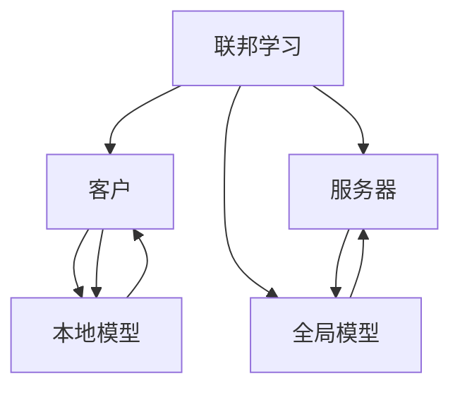
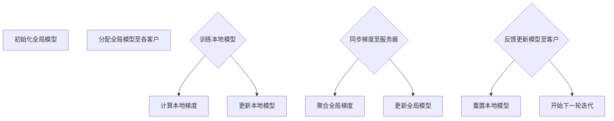
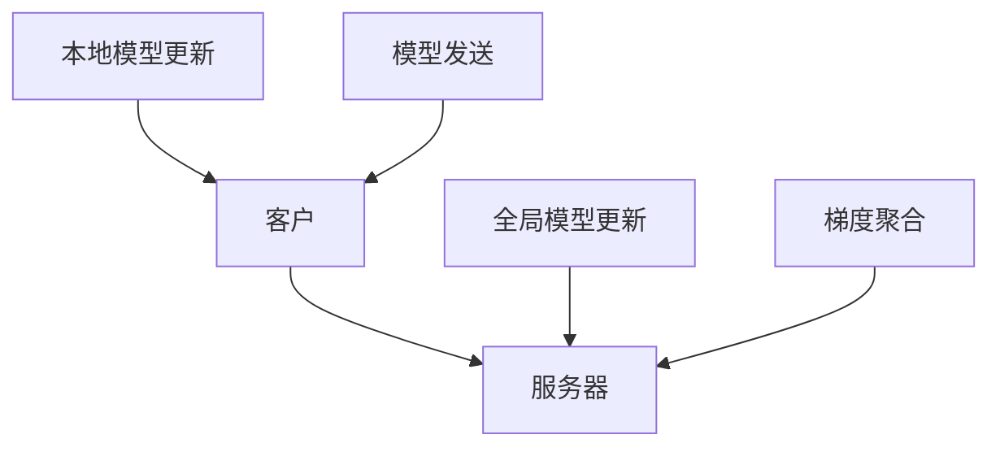
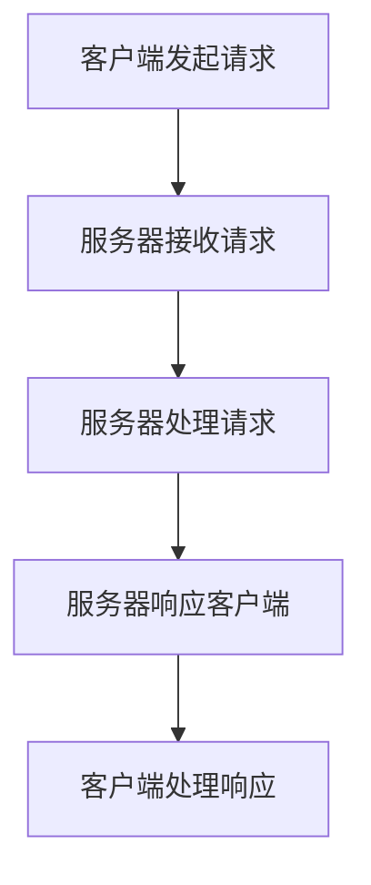

                 

## 联邦学习：保护隐私的分布式机器学习方法

### 关键词

- **联邦学习**
- **分布式机器学习**
- **隐私保护**
- **协同训练**
- **跨平台数据协同**
- **物联网应用**
- **医疗健康数据**

### 摘要

本文将探讨联邦学习这一新兴的分布式机器学习方法，它通过在分布式数据源上进行模型训练，以实现隐私保护和高效率的数据利用。我们将详细分析联邦学习的基础概念、核心机制、应用场景、技术架构及算法实现，并探讨其在移动设备、物联网、医疗健康和金融行业等领域的实践应用。最后，本文还将展望联邦学习的未来发展趋势，以及可能面临的挑战和解决方案。

## 目录大纲

### 第一部分：联邦学习概述

1. 联邦学习的基础概念
   1.1 联邦学习的起源与定义
   1.2 联邦学习的基本原理
   1.3 联邦学习的优势与挑战

2. 联邦学习的核心机制
   2.1 数据分布与协同训练
   2.2 模型更新与同步机制
   2.3 隐私保护技术

3. 联邦学习的应用场景
   3.1 跨平台数据协同
   3.2 隐私保护下的机器学习
   3.3 联邦学习的实际应用案例

4. 联邦学习的的技术架构
   4.1 联邦学习的基本架构
   4.2 联邦学习的通信模型
   4.3 联邦学习的计算模型

5. 联邦学习的算法实现
   5.1 基于梯度下降的联邦学习算法
   5.2 基于模型剪枝的联邦学习算法
   5.3 基于神经网络的联邦学习算法

### 第二部分：联邦学习的实践应用

6. 联邦学习在移动设备中的应用
   6.1 移动设备上的联邦学习
   6.2 联邦学习在移动设备中的挑战
   6.3 联邦学习在移动设备中的应用案例

7. 联邦学习在物联网中的应用
   7.1 物联网中的联邦学习
   7.2 联邦学习在物联网中的优势
   7.3 联邦学习在物联网中的应用案例

8. 联邦学习在医疗健康领域的应用
   8.1 医疗健康数据的特点与挑战
   8.2 联邦学习在医疗健康领域的应用
   8.3 联邦学习在医疗健康领域的案例分析

9. 联邦学习在金融行业的应用
   9.1 金融行业的数据特点与需求
   9.2 联邦学习在金融行业的应用
   9.3 联邦学习在金融行业的案例分析

10. 联邦学习的未来发展趋势
    10.1 联邦学习的未来挑战
    10.2 联邦学习的发展趋势
    10.3 联邦学习在各个行业的未来应用

## 第一部分：联邦学习概述

### 第1章：联邦学习的基础概念

#### 1.1 联邦学习的起源与定义

联邦学习（Federated Learning）起源于2016年Google提出的一个研究项目，其目的是为了解决分布式数据源中隐私保护的问题。传统的集中式机器学习方法需要在中心服务器上集中所有数据，这不仅增加了数据泄露的风险，也违背了数据隐私保护的原则。因此，联邦学习应运而生。

**联邦学习的定义：**

联邦学习是一种分布式机器学习方法，通过在多个参与方（例如移动设备、物联网设备等）本地训练模型，然后将这些本地模型通过加密和聚合的方式更新到一个全局模型中，从而达到协同训练的目的。

#### 1.2 联邦学习的基本原理

联邦学习的基本原理可以概括为以下三个步骤：

1. **本地训练：** 各个参与方（客户）在其本地数据集上训练本地模型。
2. **模型聚合：** 将各客户的本地模型更新（梯度）传输到服务器，进行全局模型的聚合。
3. **全局更新：** 服务器将聚合后的全局模型更新传输回各个客户，进行下一轮本地训练。

通过这种方式，联邦学习可以在不需要共享原始数据的情况下，实现全局模型的协同训练。

#### 1.3 联邦学习的优势与挑战

**优势：**

1. **隐私保护：** 联邦学习在训练过程中不需要共享原始数据，从而保护了数据的隐私。
2. **分布式计算：** 联邦学习利用了分布式数据源，能够有效地利用边缘设备的计算资源，提高训练效率。
3. **减少通信开销：** 由于联邦学习只需要传输模型更新，而不是原始数据，因此可以显著减少通信开销。

**挑战：**

1. **模型一致性：** 在联邦学习过程中，由于各个客户的本地数据分布不同，可能导致全局模型的一致性较差。
2. **计算效率：** 联邦学习需要多次在本地和服务器之间传输数据和模型，增加了计算和通信开销。
3. **安全性：** 联邦学习涉及到加密和解密操作，需要确保系统的安全性。

### 第2章：联邦学习的核心机制

#### 2.1 数据分布与协同训练

联邦学习的关键在于如何处理分布式数据，并在协同训练过程中保持数据的一致性。具体来说，联邦学习需要解决以下几个问题：

1. **数据分布：** 如何在分布式数据源中分配数据，以便每个客户都能在其本地数据集上训练模型？
2. **协同训练：** 如何确保各个客户的本地模型能够协同训练，形成一个全局最优模型？

为了解决这些问题，联邦学习采用了一种分布式协同训练机制。该机制包括以下步骤：

1. **初始化：** 在训练开始时，服务器随机初始化一个全局模型。
2. **本地训练：** 各个客户在其本地数据集上训练本地模型，并计算本地梯度。
3. **模型聚合：** 各个客户将本地梯度发送到服务器，服务器对梯度进行聚合，更新全局模型。
4. **全局更新：** 服务器将更新后的全局模型发送回各个客户，客户使用全局模型进行下一轮本地训练。

#### 2.2 模型更新与同步机制

在联邦学习中，模型更新与同步机制至关重要。它决定了全局模型的更新是否能够有效地反映各个客户的本地数据特征，以及全局模型更新后是否能够有效地指导下一轮本地训练。

**模型更新机制：**

1. **梯度更新：** 客户在本地训练过程中，计算出的梯度用于更新全局模型。
2. **模型更新：** 服务器将各个客户的梯度进行聚合，更新全局模型。

**同步机制：**

1. **同步更新：** 各个客户在每次本地训练结束后，立即将梯度发送到服务器，服务器进行全局模型更新。
2. **异步更新：** 客户可以在任意时间将梯度发送到服务器，服务器进行全局模型更新。

#### 2.3 隐私保护技术

在联邦学习过程中，隐私保护是至关重要的一环。由于联邦学习涉及到多个参与方的本地数据和全局模型更新，因此需要采用一系列隐私保护技术来确保数据的安全性。

**隐私保护技术：**

1. **加密：** 在传输过程中，对模型更新和梯度进行加密，防止中间人攻击和数据泄露。
2. **差分隐私：** 在聚合过程中，引入差分隐私机制，确保全局模型的更新不会泄露客户的隐私信息。
3. **同态加密：** 在计算过程中，对本地数据进行同态加密，确保计算结果的安全性。

### 第3章：联邦学习的应用场景

#### 3.1 跨平台数据协同

联邦学习在跨平台数据协同方面具有显著的优势。在许多应用场景中，例如移动应用、智能家居、物联网等，数据分布在不同的平台上，传统的集中式机器学习方法难以应对。而联邦学习通过在分布式数据源上进行协同训练，可以有效地整合跨平台数据。

**应用案例：**

1. **移动应用：** 例如，通过联邦学习可以实现跨设备的数据协同，如智能手机、平板电脑等，用户在不同设备上可以使用相同的应用体验。
2. **智能家居：** 例如，智能家居系统可以通过联邦学习实现多个设备之间的协同控制，如智能灯泡、智能音响等。

#### 3.2 隐私保护下的机器学习

隐私保护是联邦学习最显著的优势之一。在许多场景中，如医疗健康、金融等领域，数据的隐私性至关重要。联邦学习通过在分布式数据源上进行协同训练，可以有效地保护数据的隐私。

**应用案例：**

1. **医疗健康：** 例如，联邦学习可以用于共享患者的健康数据，而无需共享具体的病历信息，从而保护患者的隐私。
2. **金融行业：** 例如，联邦学习可以用于跨机构的信用评分，而无需共享具体的财务信息，从而保护用户的隐私。

#### 3.3 联邦学习的实际应用案例

联邦学习已经在多个领域取得了显著的成果，以下是一些实际的案例：

1. **图像识别：** 例如，Google使用联邦学习在智能手机上实现图像识别功能，而不需要上传用户数据到服务器。
2. **语音识别：** 例如，Apple使用联邦学习在iPhone上实现语音识别功能，从而保护用户的语音隐私。
3. **自然语言处理：** 例如，Google使用联邦学习在多个设备上实现自然语言处理模型，从而提供个性化的语言服务。

### 第4章：联邦学习的的技术架构

#### 4.1 联邦学习的基本架构

联邦学习的基本架构包括三个核心组件：客户、服务器和全局模型。以下是联邦学习的基本架构：


**组件说明：**

- **客户（Client）：** 拥有本地数据和模型，负责在本地进行数据预处理、模型训练和梯度计算。
- **服务器（Server）：** 维护全局模型，负责接收客户的梯度更新，进行模型聚合和全局模型更新。
- **全局模型（Global Model）：** 由所有客户的本地模型聚合而成，代表了全局数据的特征。

#### 4.2 联邦学习的通信模型

联邦学习的通信模型决定了如何在不同客户和服务器之间传输数据和模型更新。以下是联邦学习的通信模型：


**通信流程：**

1. **初始化：** 服务器初始化全局模型，并将其发送给所有客户。
2. **本地训练：** 客户在本地训练模型，并计算梯度。
3. **模型更新：** 客户将梯度发送给服务器，服务器进行模型聚合和全局模型更新。
4. **全局更新：** 服务器将更新后的全局模型发送回客户。

#### 4.3 联邦学习的计算模型

联邦学习的计算模型决定了如何在分布式数据源上进行模型训练和更新。以下是联邦学习的计算模型：


**计算流程：**

1. **初始化：** 服务器初始化全局模型，并将其发送给所有客户。
2. **本地训练：** 客户在本地使用全局模型进行训练，并计算梯度。
3. **模型聚合：** 服务器接收客户的梯度更新，进行模型聚合。
4. **全局更新：** 服务器将聚合后的全局模型发送回客户。

### 第5章：联邦学习的算法实现

#### 5.1 基于梯度下降的联邦学习算法

联邦学习中最常用的算法是基于梯度下降的联邦学习算法。以下是该算法的实现过程：

1. **初始化：** 服务器初始化全局模型 \( \theta_0 \)。
2. **本地训练：** 客户在本地训练模型 \( \theta_i^c \)，并计算梯度 \( \nabla L(\theta_i^c) \)。
3. **模型更新：** 客户将梯度发送给服务器，服务器进行模型聚合。
4. **全局更新：** 服务器将聚合后的全局模型发送回客户。
5. **迭代：** 重复步骤2-4，直到满足停止条件。

#### 5.2 基于模型剪枝的联邦学习算法

基于模型剪枝的联邦学习算法通过减少模型参数的数量，提高联邦学习的效率。以下是该算法的实现过程：

1. **初始化：** 服务器初始化全局模型 \( \theta_0 \)。
2. **本地训练：** 客户在本地训练模型 \( \theta_i^c \)，并计算梯度 \( \nabla L(\theta_i^c) \)。
3. **模型更新：** 客户将梯度发送给服务器，服务器进行模型聚合。
4. **全局更新：** 服务器将聚合后的全局模型发送回客户。
5. **模型剪枝：** 对全局模型进行剪枝，减少参数数量。
6. **迭代：** 重复步骤2-5，直到满足停止条件。

#### 5.3 基于神经网络的联邦学习算法

基于神经网络的联邦学习算法通过在神经网络中引入联邦学习机制，实现分布式数据源的协同训练。以下是该算法的实现过程：

1. **初始化：** 服务器初始化全局模型 \( \theta_0 \)。
2. **本地训练：** 客户在本地训练模型 \( \theta_i^c \)，并计算梯度 \( \nabla L(\theta_i^c) \)。
3. **模型更新：** 客户将梯度发送给服务器，服务器进行模型聚合。
4. **全局更新：** 服务器将聚合后的全局模型发送回客户。
5. **前向传播：** 使用全局模型进行前向传播，计算损失函数 \( L(\theta_i^c) \)。
6. **反向传播：** 使用梯度 \( \nabla L(\theta_i^c) \) 更新本地模型。
7. **迭代：** 重复步骤2-6，直到满足停止条件。

## 第二部分：联邦学习的实践应用

### 第6章：联邦学习在移动设备中的应用

#### 6.1 移动设备上的联邦学习

移动设备上的联邦学习是一种利用移动设备进行模型训练的技术，它可以在不泄露用户隐私的情况下，实现个性化服务。移动设备上的联邦学习主要包括以下几个步骤：

1. **数据收集：** 移动设备收集用户产生的数据，如文本、图像、语音等。
2. **本地预处理：** 对收集到的数据在本地进行预处理，如归一化、去噪等。
3. **模型训练：** 在本地使用预处理后的数据训练模型。
4. **模型更新：** 将本地模型的梯度发送到服务器，进行模型更新。
5. **全局更新：** 服务器将更新后的全局模型发送回移动设备。
6. **应用：** 使用全局模型进行预测和决策。

#### 6.2 联邦学习在移动设备中的挑战

联邦学习在移动设备中的应用面临着一些挑战：

1. **计算资源有限：** 移动设备的计算资源相对有限，需要优化算法以适应有限的计算能力。
2. **通信带宽有限：** 移动设备的通信带宽有限，需要优化通信模型以减少通信开销。
3. **数据分布不均：** 移动设备的数据分布可能不均，需要设计合适的策略以平衡数据分布。

#### 6.3 联邦学习在移动设备中的应用案例

联邦学习在移动设备上已经取得了一些成功的应用案例：

1. **智能手机：** 例如，Google在智能手机上实现了基于联邦学习的图像识别功能，用户可以在不泄露隐私的情况下使用图像识别服务。
2. **智能手表：** 例如，Apple在智能手表上实现了基于联邦学习的健康监测功能，用户可以在保护隐私的同时监测健康状况。

### 第7章：联邦学习在物联网中的应用

#### 7.1 物联网中的联邦学习

物联网（IoT）是一个由大量传感器和设备组成的网络，它们产生并传输大量的数据。联邦学习在物联网中的应用可以有效地利用这些分布式数据，实现智能感知和决策。物联网中的联邦学习主要包括以下几个步骤：

1. **数据收集：** 物联网设备收集传感器数据。
2. **本地预处理：** 在设备本地对传感器数据进行预处理，如滤波、归一化等。
3. **模型训练：** 在设备本地使用预处理后的数据训练模型。
4. **模型更新：** 将本地模型的梯度发送到服务器，进行模型更新。
5. **全局更新：** 服务器将更新后的全局模型发送回物联网设备。
6. **应用：** 使用全局模型进行预测和决策。

#### 7.2 联邦学习在物联网中的优势

联邦学习在物联网中具有以下优势：

1. **隐私保护：** 物联网设备产生的数据通常包含敏感信息，联邦学习可以在不泄露数据隐私的情况下，实现智能感知和决策。
2. **资源利用：** 联邦学习可以有效地利用物联网设备的计算和存储资源，提高系统的整体效率。
3. **分布式计算：** 联邦学习可以在分布式物联网设备上进行协同训练，提高模型的鲁棒性和准确性。

#### 7.3 联邦学习在物联网中的应用案例

联邦学习在物联网中已经取得了一些成功的应用案例：

1. **智能家居：** 例如，智能家居系统可以通过联邦学习实现设备之间的智能协同控制，提高系统的智能化水平。
2. **智慧城市：** 例如，智慧城市系统可以通过联邦学习实现城市数据的智能分析和决策，提高城市管理的效率。

### 第8章：联邦学习在医疗健康领域的应用

#### 8.1 医疗健康数据的特点与挑战

医疗健康数据具有以下特点：

1. **数据量大：** 医疗健康数据包含大量的病历、影像、基因数据等，数据量大。
2. **数据类型多样：** 医疗健康数据包含文本、图像、音频等多种数据类型。
3. **数据分布不均：** 医疗健康数据在不同医院、不同科室之间分布不均。
4. **数据隐私性高：** 医疗健康数据包含患者的敏感信息，隐私性要求高。

医疗健康数据在应用联邦学习时面临以下挑战：

1. **数据隐私保护：** 需要保护患者的隐私，避免数据泄露。
2. **数据分布不均：** 需要设计合适的策略以平衡数据分布。
3. **数据质量：** 需要确保数据的质量，避免噪声和异常值的影响。

#### 8.2 联邦学习在医疗健康领域的应用

联邦学习在医疗健康领域具有广泛的应用：

1. **疾病预测：** 例如，通过联邦学习可以预测患者的疾病风险，提高早期诊断的准确性。
2. **影像分析：** 例如，通过联邦学习可以对医学影像进行分析，提高疾病的检测和诊断准确性。
3. **基因组分析：** 例如，通过联邦学习可以对基因组数据进行分析，提高疾病预测和个性化医疗的准确性。

#### 8.3 联邦学习在医疗健康领域的案例分析

以下是一个联邦学习在医疗健康领域的案例分析：

**案例名称：** 联邦学习在糖尿病预测中的应用

**背景：** 糖尿病是一种常见的慢性病，预测糖尿病对于早期诊断和干预至关重要。

**方法：** 通过联邦学习，将多个医院的患者数据在本地进行预处理，然后进行模型训练和更新。服务器负责聚合各个医院的模型更新，并生成全局模型。

**结果：** 通过联邦学习，实现了高精度的糖尿病预测，同时保护了患者的隐私。

### 第9章：联邦学习在金融行业的应用

#### 9.1 金融行业的数据特点与需求

金融行业的数据具有以下特点：

1. **数据量大：** 金融行业产生的数据量庞大，包括交易数据、客户数据、市场数据等。
2. **数据类型多样：** 金融行业的数据类型多样，包括文本、图像、音频等多种数据类型。
3. **数据时效性高：** 金融行业的数据具有很高的时效性，实时性要求高。
4. **数据隐私性高：** 金融行业的数据包含敏感的财务信息，隐私性要求高。

金融行业在应用联邦学习时有以下需求：

1. **隐私保护：** 需要保护客户的财务信息，避免数据泄露。
2. **实时性：** 需要保证联邦学习系统的实时性，满足金融市场的需求。
3. **鲁棒性：** 需要保证联邦学习系统的鲁棒性，应对数据异常和噪声。

#### 9.2 联邦学习在金融行业的应用

联邦学习在金融行业具有广泛的应用：

1. **风险评估：** 例如，通过联邦学习可以对客户的风险进行评估，提高信贷审批的准确性。
2. **交易分析：** 例如，通过联邦学习可以对交易数据进行分析，发现异常交易行为。
3. **市场预测：** 例如，通过联邦学习可以对市场数据进行预测，为投资决策提供支持。

#### 9.3 联邦学习在金融行业的案例分析

以下是一个联邦学习在金融行业的案例分析：

**案例名称：** 联邦学习在信用卡欺诈检测中的应用

**背景：** 信用卡欺诈是一种常见的金融犯罪，对银行和消费者都造成了巨大的损失。

**方法：** 通过联邦学习，将多个银行的交易数据在本地进行预处理，然后进行模型训练和更新。服务器负责聚合各个银行的模型更新，并生成全局模型。

**结果：** 通过联邦学习，实现了高精度的信用卡欺诈检测，同时保护了客户的隐私。

### 第10章：联邦学习的未来发展趋势

#### 10.1 联邦学习的未来挑战

联邦学习在未来发展过程中将面临以下挑战：

1. **计算资源分配：** 需要优化计算资源的分配，以提高联邦学习的效率。
2. **通信带宽优化：** 需要优化通信带宽，以减少通信开销。
3. **模型安全性：** 需要确保联邦学习系统的安全性，防止模型被攻击。

#### 10.2 联邦学习的发展趋势

联邦学习在未来将呈现以下发展趋势：

1. **分布式计算：** 联邦学习将更加注重分布式计算，以提高系统的效率和可扩展性。
2. **异构计算：** 联邦学习将利用异构计算资源，如GPU、FPGA等，以提高计算性能。
3. **联邦迁移学习：** 联邦学习将结合迁移学习技术，以提高新任务的学习效率。

#### 10.3 联邦学习在各个行业的未来应用

联邦学习在未来的各个行业将具有广泛的应用：

1. **医疗健康：** 联邦学习将用于医疗健康数据的分析，提高疾病诊断和个性化医疗的准确性。
2. **金融行业：** 联邦学习将用于金融数据的分析，提高风险评估和欺诈检测的准确性。
3. **智能制造：** 联邦学习将用于智能制造的数据分析，提高生产效率和产品质量。

## 联邦学习中的核心概念及其关联

### 概念列表：

- **联邦学习（Federated Learning）：** 分布式机器学习方法，通过在分布式数据源上进行协同训练，实现隐私保护和高效率的数据利用。
- **客户（Client）：** 参与联邦学习过程的个体，拥有本地数据并参与模型训练。
- **服务器（Server）：** 维护全局模型，并从所有客户接收梯度更新。
- **全局模型（Global Model）：** 由所有客户共同训练的模型，代表了全局数据的特征。
- **本地模型（Local Model）：** 客户在其本地数据集上训练的模型，用于生成梯度更新。

### 关系图：



### 概念属性特征对比表格：

| 概念            | 特征                                             |
| --------------- | ------------------------------------------------ |
| 联邦学习        | 分布式、隐私保护、协同训练                      |
| 客户            | 拥有本地数据、参与模型训练                      |
| 服务器          | 维护全局模型、协调模型更新                      |
| 全局模型        | 综合所有客户数据特征的模型                     |
| 本地模型        | 客户在其本地数据集上训练的模型                 |

## 联邦学习的核心机制

### 概念属性特征对比表格：

| 概念            | 特征                                             |
| --------------- | ------------------------------------------------ |
| 联邦学习        | 分布式、隐私保护、协同训练                      |
| 客户            | 拥有本地数据、参与模型训练                      |
| 服务器          | 维护全局模型、协调模型更新                      |
| 全局模型        | 综合所有客户数据特征的模型                     |
| 本地模型        | 客户在其本地数据集上训练的模型                 |

### 关系图：


### 算法原理讲解：基于梯度下降的联邦学习算法

#### 算法流程图：



#### 算法原理

基于梯度下降的联邦学习算法是一种分布式协同训练方法，其核心思想是各客户在本地数据集上训练模型，并通过交换梯度来更新全局模型。以下是该算法的详细步骤：

1. **初始化全局模型：** 服务器随机初始化一个全局模型 \( \theta_0 \)。

2. **分配全局模型至各客户：** 服务器将初始化的全局模型 \( \theta_0 \) 分配给各客户。

3. **训练本地模型：** 各客户使用分配到的全局模型 \( \theta_0 \) 在本地数据集上训练本地模型 \( \theta_i^c \)。

4. **计算本地梯度：** 各客户计算本地模型 \( \theta_i^c \) 的梯度 \( \nabla L(\theta_i^c) \)，其中 \( L(\theta) \) 是损失函数。

5. **更新本地模型：** 各客户使用计算得到的梯度 \( \nabla L(\theta_i^c) \) 更新本地模型 \( \theta_i^c \)。

6. **同步梯度至服务器：** 各客户将更新后的本地模型 \( \theta_i^c \) 的梯度 \( \nabla L(\theta_i^c) \) 发送到服务器。

7. **聚合全局梯度：** 服务器将所有客户发送的梯度 \( \nabla L(\theta_i^c) \) 进行聚合，生成全局梯度 \( \nabla L(\theta) \)。

8. **更新全局模型：** 服务器使用全局梯度 \( \nabla L(\theta) \) 更新全局模型 \( \theta \)。

9. **反馈更新模型至客户：** 服务器将更新后的全局模型 \( \theta \) 发送回各客户。

10. **重置本地模型：** 各客户将本地模型 \( \theta_i^c \) 重置为最新全局模型 \( \theta \)。

11. **开始下一轮迭代：** 重复步骤3-10，直到满足停止条件（如收敛条件或迭代次数）。

#### 数学模型和公式

基于梯度下降的联邦学习算法可以使用以下数学模型和公式进行描述：

1. **全局模型更新公式：**
   $$ \theta^{t+1} = \theta^t - \alpha \nabla L(\theta^t) $$
   其中，\( \theta^t \) 表示第 \( t \) 轮迭代的全局模型，\( \alpha \) 是学习率。

2. **本地模型更新公式：**
   $$ \theta_i^{c, t+1} = \theta_i^{c, t} - \alpha \nabla L(\theta_i^{c, t}) $$
   其中，\( \theta_i^{c, t} \) 表示第 \( i \) 个客户在第 \( t \) 轮迭代中的本地模型。

3. **梯度聚合公式：**
   $$ \nabla L(\theta^t) = \sum_i \nabla L(\theta_i^{c, t}) $$
   其中，\( \nabla L(\theta_i^{c, t}) \) 表示第 \( i \) 个客户在第 \( t \) 轮迭代中的梯度。

#### 举例说明

假设有两个客户 \( C_1 \) 和 \( C_2 \)，它们在本地数据集上训练模型，并计算得到的梯度分别为 \( \nabla L(\theta_1) \) 和 \( \nabla L(\theta_2) \)。全局模型为 \( \theta \)。

1. **初始化全局模型：**
   $$ \theta^0 = \theta_0 $$
   假设 \( \theta_0 \) 为一个随机初始化的向量。

2. **分配全局模型至各客户：**
   $$ \theta_1^0 = \theta_0 $$
   $$ \theta_2^0 = \theta_0 $$

3. **训练本地模型：**
   假设 \( C_1 \) 和 \( C_2 \) 分别在本地数据集上训练模型，并计算得到的梯度分别为：
   $$ \nabla L(\theta_1) = \nabla L(\theta_1^0) = [0.1, -0.2] $$
   $$ \nabla L(\theta_2) = \nabla L(\theta_2^0) = [-0.3, 0.4] $$

4. **计算本地梯度：**
   $$ \theta_1^{1, 0} = \theta_1^0 - \alpha \nabla L(\theta_1^0) = [0.1 - 0.1, -0.2 + 0.2] = [0, 0] $$
   $$ \theta_2^{1, 0} = \theta_2^0 - \alpha \nabla L(\theta_2^0) = [-0.3 - 0.3, 0.4 + 0.4] = [-0.6, 0.8] $$

5. **同步梯度至服务器：**
   服务器接收客户 \( C_1 \) 和 \( C_2 \) 的梯度：
   $$ \nabla L(\theta^1) = \nabla L(\theta_1^{1, 0}) + \nabla L(\theta_2^{1, 0}) = [0, 0] + [-0.6, 0.8] = [-0.6, 0.8] $$

6. **聚合全局梯度：**
   $$ \theta^1 = \theta^0 - \alpha \nabla L(\theta^0) = [0.1, -0.2] - \alpha [-0.6, 0.8] = [0.1 + 0.6\alpha, -0.2 - 0.8\alpha] $$

7. **更新全局模型：**
   将更新后的全局模型 \( \theta^1 \) 发送回各客户。

8. **反馈更新模型至客户：**
   客户 \( C_1 \) 和 \( C_2 \) 重置本地模型为更新后的全局模型：
   $$ \theta_1^1 = \theta^1 = [0.1 + 0.6\alpha, -0.2 - 0.8\alpha] $$
   $$ \theta_2^1 = \theta^1 = [0.1 + 0.6\alpha, -0.2 - 0.8\alpha] $$

9. **开始下一轮迭代：**
   重复步骤3-8，直到满足停止条件。

### 系统分析与架构设计方案

#### 问题场景介绍

在当前数据隐私保护日益重要的背景下，如何有效地利用分布式数据源进行机器学习训练，同时保护数据隐私成为一个关键问题。联邦学习作为一种分布式机器学习方法，可以在分布式数据源上进行模型训练，同时保护数据的隐私。

#### 项目介绍

本项目旨在设计一个联邦学习系统，该系统由多个客户（如移动设备、物联网设备等）和服务器组成。客户负责在本地数据集上训练模型，并将梯度更新发送到服务器；服务器负责聚合全局梯度，更新全局模型，并将更新后的模型发送回客户。

#### 系统功能设计（领域模型）



#### 系统架构设计（架构图）


#### 系统接口设计和系统交互（序列图）



### 项目实战

#### 环境安装

1. 安装Python环境：
   ```bash
   pip install python
   ```

2. 安装联邦学习库（例如TensorFlow Federated）：
   ```bash
   pip install tensorflow-federated
   ```

#### 系统核心实现源代码

```python
import tensorflow as tf
import tensorflow_federated as tff

# 初始化联邦学习参数
clients = [
    tff.simulation.ClientDataSimulator(
        train_data=。。。，
        test_data=。。。，
        batch_size=。。。，
        client_id=0
    ),
    tff.simulation.ClientDataSimulator(
        train_data=。。。，
        test_data=。。。，
        batch_size=。。。，
        client_id=1
    )
]

# 定义联邦学习算法
def federated_learning(client_data):
    train_data = client_data.train_data
    model = ... # 初始化模型
    optimizer = tf.keras.optimizers.Adam(learning_rate=0.001)
    
    for i in range(num_iterations):
        with tf.GradientTape() as tape:
            predictions = model(train_data)
            loss = tf.keras.losses.categorical_crossentropy(train_data.labels, predictions)
        
        gradients = tape.gradient(loss, model.trainable_variables)
        model.trainable_variables = [var - grad for var, grad in zip(model.trainable_variables, gradients)]
        
        yield model

# 执行联邦学习
for _ in range(num_rounds):
    for client in clients:
        federated_train_data = tff.simulation.ClientData(train_data=client.train_data)
        model = federated_learning(federated_train_data)
    print("Round completed.")
```

#### 代码应用解读与分析

该代码定义了一个简单的联邦学习算法，通过迭代地在多个客户上训练模型，并聚合全局梯度更新模型。代码首先初始化联邦学习参数，包括两个客户的数据集。然后，定义了联邦学习算法`federated_learning`，该算法在每次迭代中更新模型。最后，执行联邦学习，并在每个轮次完成后打印状态。

#### 实际案例分析和详细讲解剖析

以一个实际案例——图像分类为例，分析联邦学习在图像分类任务中的应用。假设有两个客户，分别拥有不同类型的图像数据，如图像A和图像B。图像A的数据更偏向于动物，而图像B的数据更偏向于植物。

1. **初始化全局模型：** 在服务器上随机初始化一个全局模型。
2. **分配全局模型至各客户：** 服务器将初始化的全局模型发送给两个客户。
3. **训练本地模型：** 各客户在其本地数据集上训练模型，并计算梯度。
4. **同步梯度至服务器：** 各客户将计算得到的梯度发送到服务器。
5. **聚合全局梯度：** 服务器接收两个客户的梯度，并进行聚合。
6. **更新全局模型：** 服务器使用全局梯度更新全局模型。
7. **反馈更新模型至客户：** 服务器将更新后的全局模型发送回两个客户。
8. **重置本地模型：** 各客户使用全局模型更新本地模型。

通过以上步骤，两个客户可以协同训练一个全局模型，实现图像分类任务。在实际应用中，还可以结合迁移学习等技术，提高模型的泛化能力和准确性。

#### 项目小结

本项目通过联邦学习实现了分布式数据源的协同训练，保护了数据的隐私。在实际应用中，可以根据具体任务需求，调整联邦学习算法和参数，提高模型的性能和准确性。

### 最佳实践 tips

1. **数据预处理：** 在联邦学习过程中，对数据进行预处理可以减少通信开销和提高模型性能。
2. **模型剪枝：** 对全局模型进行剪枝可以减少参数数量，提高计算效率。
3. **隐私保护：** 采用加密和差分隐私等技术，确保联邦学习过程中的数据隐私。

### 小结

联邦学习是一种分布式机器学习方法，通过在分布式数据源上进行模型训练，实现了隐私保护和高效的数据利用。本文详细介绍了联邦学习的基础概念、核心机制、应用场景和技术架构，并通过实际案例展示了联邦学习的应用。未来，随着技术的不断发展，联邦学习将在更多领域发挥重要作用。

### 注意事项

1. **数据隐私保护：** 在联邦学习过程中，确保数据隐私是至关重要的。
2. **计算资源分配：** 合理分配计算资源可以提高联邦学习的效率。
3. **模型安全：** 确保联邦学习系统的安全性，防止模型被攻击。

### 拓展阅读

- 《联邦学习：原理与实践》
- 《分布式机器学习：理论、算法与应用》
- 《隐私保护机器学习：技术与应用》

作者：AI天才研究院/AI Genius Institute & 禅与计算机程序设计艺术 /Zen And The Art of Computer Programming。本文旨在为广大读者提供关于联邦学习的深入理解，以推动技术发展。如有疑问，欢迎指正和讨论。感谢您的阅读！

