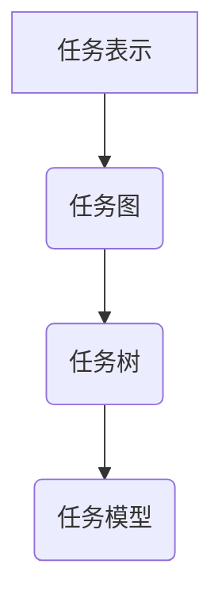
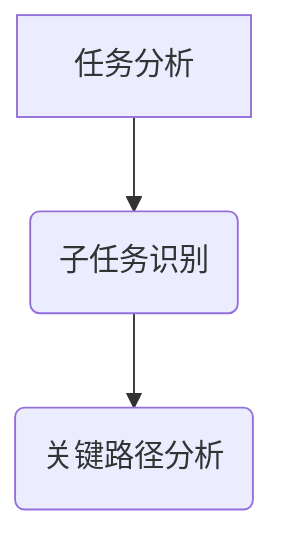
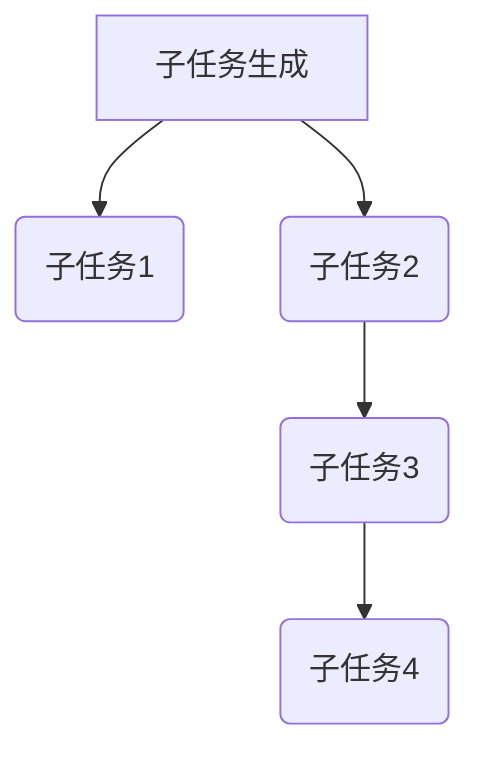
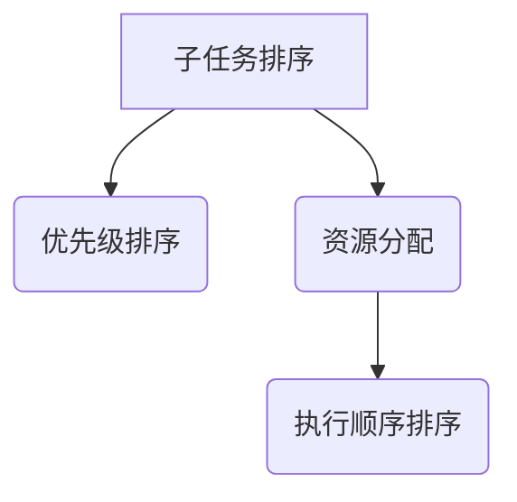
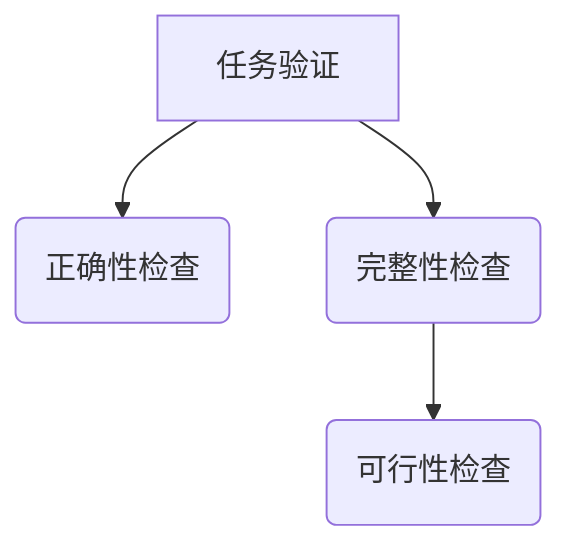
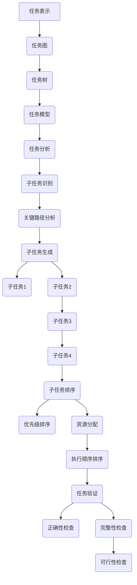
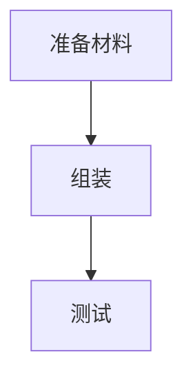
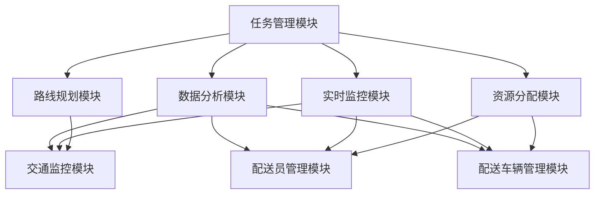
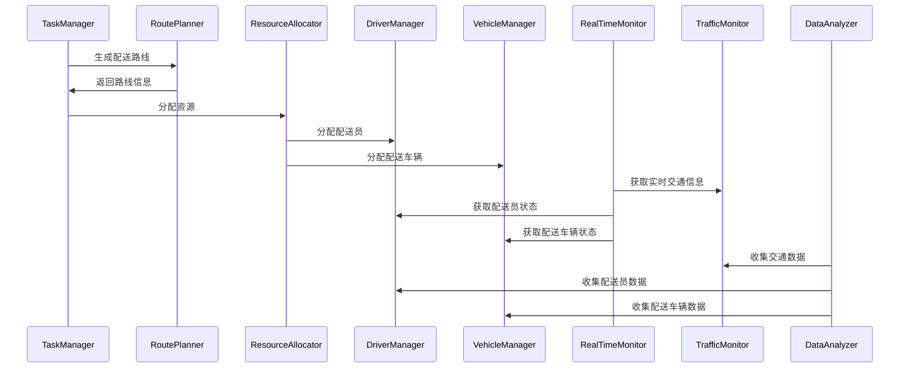
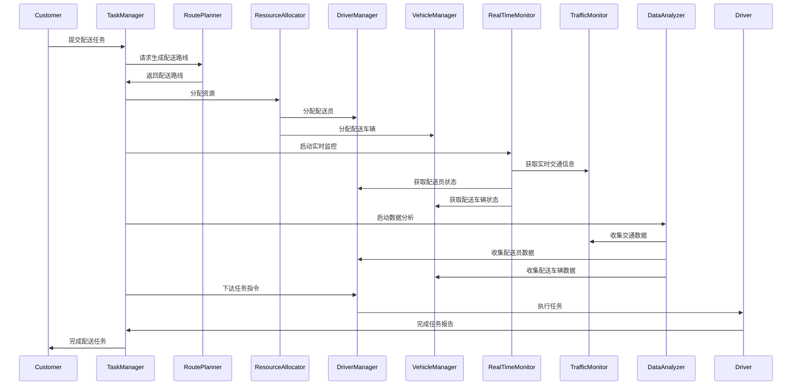

                 

### 引言

在信息技术和人工智能领域，自动任务分解、推理以及神经符号规划是几项关键且复杂的技术。自动任务分解是指将复杂的任务分解为一系列可执行的操作；推理则是基于已有信息推断出新的信息；而神经符号规划则是结合神经网络和符号逻辑来优化任务分配和执行。这些技术在现代人工智能系统中扮演着至关重要的角色，尤其是当系统需要处理复杂且动态的任务时。

然而，传统的方法在处理这些任务时往往面临着效率低、可扩展性差以及难以适应新环境等问题。为此，本文将探讨神经符号规划的突破，特别是在自动任务分解和推理中的应用。通过分析其核心概念、算法原理以及实际应用案例，我们希望能够为读者提供一份全面且深入的技术指南。

本文的结构安排如下：

- **第1章：背景介绍**：我们将首先介绍自动任务分解、推理和神经符号规划的定义、背景以及它们在人工智能领域的应用。

- **第2章：核心概念与联系**：在这一章节中，我们将详细探讨自动任务分解、推理和神经符号规划的核心概念，并通过Mermaid流程图和ER实体关系图来展示这些概念之间的关系。

- **第3章：算法原理讲解**：我们将使用Mermaid流程图和Python代码来详细讲解自动任务分解算法和神经符号规划原理。

- **第4章：数学模型和数学公式**：我们将介绍与自动任务分解和神经符号规划相关的数学模型和公式，并通过实例进行说明。

- **第5章：系统分析与架构设计方案**：我们将介绍一个具体的系统分析案例，展示如何设计系统架构，包括领域模型、架构设计和接口设计。

- **第6章：项目实战**：通过一个实际项目案例，我们将展示如何安装环境、实现系统核心代码，并进行代码解读与分析。

- **第7章：最佳实践 tips**：我们将提供一些实用的技巧和注意事项，帮助读者在实际应用中更好地利用这些技术。

- **第8章：小结与拓展阅读**：我们将总结文章的主要内容，并推荐一些拓展阅读资源。

通过这篇文章，我们希望能够帮助读者理解自动任务分解、推理和神经符号规划的核心概念和实际应用，并为其在人工智能领域的进一步探索提供有力支持。接下来，我们将深入探讨这些主题，通过逻辑清晰、结构紧凑的分析，揭示这些技术背后的原理和实现细节。让我们一起开始这段深入思考的旅程吧。

### 关键词

- 自动任务分解
- 推理算法
- 神经符号规划
- 人工智能
- 数学模型
- 系统架构
- 实际应用

### 摘要

本文旨在探讨自动任务分解、推理和神经符号规划在人工智能领域的关键应用和技术突破。我们首先介绍了这些技术的定义和背景，然后通过核心概念与联系的解析，帮助读者建立对这些技术的全面理解。接着，我们深入分析了自动任务分解和神经符号规划的算法原理，并运用Mermaid流程图和Python代码进行了详细讲解。此外，我们还介绍了相关数学模型和公式，并通过实例进行了说明。最后，我们通过一个实际项目案例展示了这些技术的应用，并提供了一些最佳实践和注意事项。通过本文，读者可以深入了解自动任务分解、推理和神经符号规划的技术原理和应用，为其在人工智能领域的深入探索提供理论支持和实践指导。

### 第1章：背景介绍

#### 1.1 自动任务分解、推理与神经符号规划的定义

自动任务分解、推理和神经符号规划是人工智能领域中的三个核心概念，它们各自拥有独特的定义和应用场景。

**自动任务分解**（Automated Task Decomposition）是指将复杂的任务划分为一系列子任务或操作，以便于计算机系统或人工智能够更有效地理解和执行。这一过程通常涉及对任务的分析、识别和重构成可执行的操作序列。例如，在自动驾驶系统中，复杂的驾驶任务可以被分解为控制速度、保持车道、避让障碍物等具体的子任务。

**推理**（Reasoning）是指基于已知信息推断出新信息的过程。在人工智能系统中，推理是实现智能决策和问题解决的重要手段。推理可以分为两种基本类型：演绎推理和归纳推理。演绎推理从一般原则推导出具体结论，而归纳推理则从具体实例中归纳出一般原则。例如，一个基于规则的专家系统可以使用演绎推理来根据患者的症状诊断出疾病，而机器学习模型则通过归纳推理从大量数据中学习出模式。

**神经符号规划**（Neural Symbolic Planning）是一种结合神经网络和符号逻辑的方法，旨在通过学习的方式对任务进行规划和决策。神经符号规划通过将现实世界的任务表示为符号模型，然后利用神经网络进行推理和学习，从而优化任务的执行。这一方法结合了符号逻辑的精确性和神经网络的灵活性和学习能力，使其在处理复杂任务时具有显著优势。

#### 1.2 问题背景

随着人工智能技术的快速发展，越来越多的应用场景需要高效、智能的任务分解和推理能力。传统的任务分解和推理方法通常依赖于预定义的规则和模型，这在处理简单和规则明确的问题时是有效的。然而，面对复杂、动态和不确定的任务环境，这些传统方法往往显得力不从心。例如，自动驾驶系统需要在多种复杂的路况下做出实时决策，这就需要强大的任务分解和推理能力来确保系统的安全和可靠性。

此外，神经符号规划作为一种新兴的方法，逐渐引起了研究者和工业界的关注。它通过将神经网络与符号逻辑相结合，能够在处理复杂任务时提供更加灵活和高效的解决方案。神经符号规划不仅能够处理传统的任务分解和推理问题，还能通过学习从大量数据中提取出有效的任务表示和规划策略。

然而，神经符号规划目前仍面临一些挑战，例如如何设计有效的神经网络结构、如何确保规划结果的可靠性和鲁棒性等。这些问题需要通过不断的研究和探索来逐步解决。

#### 1.3 问题描述

在自动任务分解、推理和神经符号规划领域，常见的问题包括：

1. **任务复杂性**：复杂任务的分解和推理过程往往涉及大量的子任务和条件，这使得传统方法难以高效处理。
2. **动态性**：任务环境的变化性使得系统需要具备实时适应和调整的能力，这对算法的动态规划和推理能力提出了高要求。
3. **不确定性**：实际任务场景中往往存在不确定性，例如环境噪声、数据噪声以及任务执行中的随机性，这增加了任务分解和推理的难度。
4. **数据依赖性**：神经符号规划依赖于大量高质量的数据进行训练，数据的质量和数量直接影响到算法的性能。

这些问题使得自动任务分解、推理和神经符号规划在实际应用中面临着诸多挑战。为了解决这些问题，研究者们需要开发出更加高效、灵活和鲁棒的算法，同时还需要探索新的计算模型和技术。

#### 1.4 问题解决

为了解决上述问题，研究者们从多个角度进行了探索：

1. **算法优化**：通过改进任务分解和推理算法，提高其效率和准确性。例如，引入启发式搜索、分布式计算和并行处理等技术，以加快任务分解和推理的速度。
2. **模型融合**：将神经网络和符号逻辑相结合，发挥两者的优势，提高任务的规划和决策能力。神经符号规划就是这种融合的一个典型代表。
3. **数据增强**：通过数据预处理和增强技术，提高训练数据的质量和多样性，从而增强算法的泛化能力。
4. **不确定性处理**：开发针对不确定性的算法和模型，提高系统在复杂、动态和不确定环境中的鲁棒性和适应性。

总之，自动任务分解、推理和神经符号规划的突破需要多方面的努力和探索，包括算法创新、模型优化和计算资源提升等。通过这些努力，我们有望在未来开发出更加智能、高效和可靠的人工智能系统。

#### 1.5 边界与外延

在讨论自动任务分解、推理和神经符号规划时，我们需要明确这些技术的边界和外延，以便更好地理解和应用。

**边界**：
1. **任务分解**：自动任务分解主要关注于将复杂任务分解为可执行的操作序列。然而，它并不涉及操作的具体执行过程，也不处理任务的优先级和调度问题。
2. **推理**：推理技术主要关注于从已知信息中推断出新的信息。它通常不涉及任务的具体执行，而是在逻辑或概率层面上进行推断。
3. **神经符号规划**：神经符号规划则结合了神经网络和符号逻辑，旨在通过学习来优化任务的规划和决策。它不仅涉及任务分解和推理，还包括任务执行的具体策略。

**外延**：
1. **任务复杂性**：自动任务分解可以应用于各种复杂任务，包括自动化生产、智能导航、医疗诊断等。推理技术则广泛应用于智能问答、自然语言处理和决策支持系统等。
2. **动态性**：神经符号规划在处理动态任务时具有优势，能够实时适应环境变化，这使其在自动驾驶、智能调度等领域具有重要应用。
3. **不确定性**：自动任务分解和推理技术在处理不确定任务时面临挑战，但通过引入概率图模型和不确定性处理方法，这些技术可以在一定程度上适应不确定性环境。

综上所述，自动任务分解、推理和神经符号规划在人工智能领域中具有广泛的应用潜力，通过不断的技术创新和优化，这些技术将推动人工智能系统的智能化和自主化水平。

#### 1.6 概念结构与核心要素组成

在深入探讨自动任务分解、推理和神经符号规划之前，理解这些概念的结构和核心要素组成是至关重要的。以下是这些核心概念的定义、属性和相互关系：

**自动任务分解**：
- **定义**：自动任务分解是指将复杂的任务或目标分解为一系列子任务或操作，以便于计算机系统或人工智能系统能够更有效地理解和执行。
- **属性**：
  - **层次性**：任务分解通常具有层次结构，从高层次的任务逐步细化到低层次的子任务。
  - **可执行性**：分解后的子任务应当是具体的、可执行的。
  - **可组合性**：子任务之间应当能够组合起来实现原始任务。
- **核心要素**：
  - **任务表示**：明确任务的目标和约束条件。
  - **分解策略**：选择合适的分解方法和策略，例如基于规则的分解、基于数据的分解或混合分解方法。
  - **子任务生成**：生成具体的子任务，并确定其执行顺序。

**推理**：
- **定义**：推理是指基于已有信息推断出新的信息。它是人工智能系统中实现智能决策和问题解决的核心能力。
- **属性**：
  - **逻辑性**：推理过程应当符合逻辑规则和原则。
  - **可靠性**：推理结果应当具有较高的可信度。
  - **灵活性**：推理算法应当能够适应不同的任务环境和数据条件。
- **核心要素**：
  - **知识表示**：将已知信息表示为逻辑公式或数据结构。
  - **推理引擎**：实现推理过程的算法和模型，例如基于规则的推理、基于模型的推理和概率推理。
  - **推理策略**：选择合适的推理策略，如前向推理、反向推理或混合推理。

**神经符号规划**：
- **定义**：神经符号规划是一种结合神经网络和符号逻辑的方法，旨在通过学习来优化任务的规划和决策。
- **属性**：
  - **结合性**：神经符号规划通过将神经网络与符号逻辑相结合，发挥两者的优势。
  - **自适应性**：系统能够通过学习不断优化任务规划和决策。
  - **高效性**：利用神经网络的学习能力和符号逻辑的精确性，提高任务规划的效果。
- **核心要素**：
  - **符号模型**：表示任务和环境的符号模型，用于描述任务的结构和约束。
  - **神经网络**：用于学习和优化规划策略的神经网络模型，如深度学习模型。
  - **规划算法**：结合符号模型和神经网络的算法，用于生成优化任务规划。

**相互关系**：
- **任务分解与推理**：任务分解为推理提供了基础，分解出的子任务需要通过推理来确认其可行性和合理性。
- **推理与神经符号规划**：推理是神经符号规划中的一部分，用于在符号模型中进行逻辑推断。
- **神经符号规划与任务分解**：神经符号规划可以用来优化任务分解过程，通过学习生成更高效的任务分解策略。

通过理解这些核心概念的结构和要素，我们能够更好地应用自动任务分解、推理和神经符号规划，解决复杂的人工智能问题。

#### 第2章：核心概念与联系

在深入探讨自动任务分解、推理和神经符号规划之前，了解这些核心概念的定义及其相互联系是非常重要的。本章将详细解析这些核心概念，并通过图表展示它们之间的关系。

##### 2.1 自动任务分解概念与特征

自动任务分解是将复杂的任务分解为一系列子任务或操作，以便于计算机系统或人工智能系统能够更高效地理解和执行。以下是自动任务分解的主要概念与特征：

- **任务表示**：任务表示是自动任务分解的第一步，涉及将任务的目标和约束条件明确地表达出来。
- **分解策略**：分解策略是选择如何将任务分解为子任务的方法。常见的策略包括基于规则的分解、基于数据的分解和混合分解。
- **子任务生成**：生成具体的子任务，并确定其执行顺序。
- **层次性**：自动任务分解通常具有层次结构，从高层次的任务逐步细化到低层次的子任务。
- **可执行性**：分解后的子任务应当是具体的、可执行的。

##### 2.2 推理算法及其应用

推理是基于已有信息推断出新信息的过程，是人工智能系统中实现智能决策和问题解决的核心能力。以下是几种常见的推理算法及其应用：

- **演绎推理**：从一般原则推导出具体结论。例如，基于已知的前提和规则推导出结论。
- **归纳推理**：从具体实例中归纳出一般原则。例如，通过观察大量数据中的模式来推断出一般规律。
- **基于规则的推理**：使用预定义的规则进行推理。这种推理方法在专家系统和规则引擎中广泛应用。
- **基于模型的推理**：使用模型（如概率图模型、神经网络模型）进行推理。这种方法在机器学习和数据驱动系统中非常常见。

##### 2.3 神经符号规划原理与实现

神经符号规划是一种结合神经网络和符号逻辑的方法，旨在通过学习来优化任务的规划和决策。以下是神经符号规划的主要概念与特征：

- **符号模型**：符号模型用于表示任务和环境的结构。它通常包括任务的状态、动作、奖励和约束等。
- **神经网络**：神经网络用于学习任务规划策略。通过从数据中学习，神经网络能够生成优化任务执行的动作序列。
- **规划算法**：规划算法结合符号模型和神经网络，用于生成优化任务规划。常见的规划算法包括基于策略梯度的方法、强化学习方法等。

##### 2.4 概念属性特征对比表格

为了更直观地理解自动任务分解、推理和神经符号规划，我们提供了一个对比表格，列出它们的主要属性特征：

| 概念            | 定义                                                         | 属性特征                                                     | 用途示例                                                   |
|-----------------|------------------------------------------------------------|------------------------------------------------------------|----------------------------------------------------------|
| 自动任务分解     | 将复杂任务分解为子任务的过程。                               | 层次性、可执行性、分解策略。                                | 自动驾驶中的路径规划、自动化生产中的作业调度。               |
| 推理            | 基于已知信息推断出新信息的过程。                             | 逻辑性、可靠性、灵活性。                                    | 专家系统中的诊断、数据挖掘中的模式识别。                     |
| 神经符号规划     | 结合神经网络和符号逻辑，通过学习优化任务规划和决策。           | 结合性、自适应性、高效性。                                  | 自动驾驶中的决策支持、智能控制系统的实时优化。               |

##### 2.5 ER实体关系图架构

为了更清晰地展示自动任务分解、推理和神经符号规划之间的联系，我们使用ER（实体-关系）图来表示这些概念的关系架构。

```mermaid
erDiagram
  TaskDecomposition ||--o> Reasoning : 分解结果用于推理
  Reasoning ||--o> Planning : 推理结果用于规划
  Planning ||--o> NeuralSymbolic : 规划结合神经网络和符号逻辑
  TaskDecomposition ..|> NeuralSymbolic : 分解与神经符号规划结合
```

在这个ER图中：
- **TaskDecomposition**（自动任务分解）与**Reasoning**（推理）之间存在关联关系，分解结果用于推理。
- **Reasoning**（推理）与**Planning**（规划）之间存在依赖关系，推理结果用于规划。
- **Planning**（规划）与**NeuralSymbolic**（神经符号规划）之间存在组合关系，规划结合神经网络和符号逻辑。
- **TaskDecomposition**（自动任务分解）与**NeuralSymbolic**（神经符号规划）之间存在双向关联关系，分解与神经符号规划结合。

通过上述核心概念与联系的解析，我们能够更好地理解自动任务分解、推理和神经符号规划在人工智能系统中的作用和相互关系。这些概念不仅相互独立，而且在实际应用中相互补充，共同推动人工智能技术的发展。

### 第3章：算法原理讲解

#### 3.1 自动任务分解算法流程

自动任务分解（Automated Task Decomposition, ATD）是将复杂任务分解为一系列可执行子任务的过程。在这一节中，我们将详细讨论自动任务分解的算法原理，并通过Mermaid流程图展示其执行流程。

##### 步骤1：任务表示

首先，需要将原始任务表示为一个结构化的形式。常见的表示方法包括任务图、任务树和任务模型。任务表示应明确任务的目标、输入、输出以及可能的约束条件。



##### 步骤2：任务分析

任务分析是理解任务结构和确定分解策略的关键步骤。在这一步骤中，算法会分析任务图、任务树或任务模型，识别出任务的子任务和关键路径。



##### 步骤3：子任务生成

在确定了任务的子任务和关键路径后，算法会生成具体的子任务。子任务应具有明确的输入、输出和执行条件。



##### 步骤4：子任务排序

生成子任务后，需要根据任务依赖关系和执行顺序对这些子任务进行排序。排序策略可以基于优先级、执行时间和资源需求等因素。



##### 步骤5：任务验证

最后，算法会验证生成的任务分解是否满足原始任务的要求。验证过程包括检查子任务的正确性、完整性和可行性。



综合上述步骤，自动任务分解的算法流程可以用Mermaid流程图表示如下：



通过这一流程，自动任务分解算法能够将复杂任务分解为一系列可执行的子任务，为后续的推理和执行提供基础。

#### 3.2 神经符号规划原理

神经符号规划（Neural Symbolic Planning, NSP）是一种结合神经网络和符号逻辑的方法，旨在通过学习来优化任务的规划和决策。在这一节中，我们将详细讲解神经符号规划的基本原理，并通过Python代码展示其实现。

##### 基本概念

神经符号规划的核心在于将任务表示为符号模型，并使用神经网络来学习优化任务规划的策略。符号模型通常包括状态、动作、奖励和约束等要素。

- **状态**（State）：表示任务执行过程中的当前情况。
- **动作**（Action）：表示执行的操作。
- **奖励**（Reward）：表示动作执行后系统的状态变化，用于评估动作的有效性。
- **约束**（Constraint）：表示任务执行的限制条件。

##### 模型表示

在神经符号规划中，状态和动作通常用符号表示，而神经网络用于学习状态和动作之间的映射关系。以下是一个简单的神经符号规划模型：

```python
class NeuralSymbolicModel:
    def __init__(self, state_space, action_space):
        self.state_space = state_space
        self.action_space = action_space
        self.neural_network = NeuralNetwork(state_space, action_space)

    def predict_action(self, state):
        # 使用神经网络预测最优动作
        action_probabilities = self.neural_network.forward(state)
        return np.argmax(action_probabilities)
```

##### 算法实现

以下是一个简单的神经符号规划算法实现，使用Python代码进行说明。该算法结合了深度学习模型和符号逻辑推理：

```python
import numpy as np
from neural_network import NeuralNetwork

class NeuralSymbolicPlanner:
    def __init__(self, model):
        self.model = model

    def plan(self, initial_state, goal_state):
        current_state = initial_state
        action_sequence = []

        while not self.is_goal_reached(current_state, goal_state):
            action = self.model.predict_action(current_state)
            action_sequence.append(action)
            current_state = self.execute_action(current_state, action)

        return action_sequence

    def is_goal_reached(self, state, goal_state):
        # 检查当前状态是否达到目标状态
        return state == goal_state

    def execute_action(self, state, action):
        # 执行动作并返回新的状态
        # 这里的实现取决于具体的任务和环境
        new_state = self.apply_action_to_state(state, action)
        return new_state

    def apply_action_to_state(self, state, action):
        # 应用动作到状态上，返回新的状态
        # 这里的实现取决于具体的任务和环境
        # 例如：增加资源、改变位置等
        new_state = state.copy()
        new_state[action] += 1
        return new_state
```

##### 实例分析

以下是一个简单的实例，展示如何使用神经符号规划来规划一个简单的任务：

```python
# 定义状态空间和动作空间
state_space = ['resource_1', 'resource_2', 'position']
action_space = ['increase_resource_1', 'increase_resource_2', 'move']

# 创建神经符号模型
model = NeuralSymbolicModel(state_space, action_space)

# 创建神经符号规划器
planner = NeuralSymbolicPlanner(model)

# 定义初始状态和目标状态
initial_state = {'resource_1': 0, 'resource_2': 0, 'position': 0}
goal_state = {'resource_1': 5, 'resource_2': 5, 'position': 10}

# 执行规划
action_sequence = planner.plan(initial_state, goal_state)

# 打印规划结果
print("Action sequence:", action_sequence)
```

在这个实例中，我们定义了一个简单的状态空间和动作空间，并创建了一个神经符号模型和规划器。通过调用`plan`方法，我们可以得到一个从初始状态到目标状态的行动序列。

通过上述讲解和实例分析，我们可以看到神经符号规划的基本原理和实现方法。这种结合神经网络和符号逻辑的方法在处理复杂任务时具有显著优势，能够通过学习自动生成优化的任务规划策略。

#### 3.3 算法实现与Python代码

在本节中，我们将通过具体的Python代码实现自动任务分解算法和神经符号规划原理。我们将使用Mermaid流程图来展示算法的执行流程，并通过实际代码来解释算法的实现细节。

##### 自动任务分解算法实现

首先，我们实现自动任务分解算法，其核心步骤包括任务表示、任务分析、子任务生成、子任务排序和任务验证。以下是一个简单的Python代码实现：

```python
import networkx as nx
from collections import defaultdict

class TaskDecomposer:
    def __init__(self, task_graph):
        self.task_graph = task_graph

    def decompose_task(self):
        # 步骤1：任务表示
        task_model = nx.Graph()
        for edge in self.task_graph.edges():
            task_model.add_edge(edge[0], edge[1])
        
        # 步骤2：任务分析
        subtasks = self.analyze_task(task_model)
        
        # 步骤3：子任务生成
        subtask_sequence = self.generate_subtasks(subtasks)
        
        # 步骤4：子任务排序
        sorted_subtasks = self.sort_subtasks(subtask_sequence)
        
        # 步骤5：任务验证
        is_valid = self.validate_task(sorted_subtasks)
        
        if is_valid:
            return sorted_subtasks
        else:
            return None

    def analyze_task(self, task_model):
        # 识别子任务和关键路径
        # 这里我们简单地使用拓扑排序来识别子任务
        return list(nx.topological_sort(task_model))

    def generate_subtasks(self, subtasks):
        # 生成具体的子任务
        subtask_sequence = []
        for subtask in subtasks:
            subtask_sequence.append({'name': subtask, 'dependencies': []})
        return subtask_sequence

    def sort_subtasks(self, subtask_sequence):
        # 根据依赖关系对子任务进行排序
        return sorted(subtask_sequence, key=lambda x: x['dependencies'])

    def validate_task(self, subtask_sequence):
        # 验证任务分解的正确性
        # 这里我们简单地检查子任务之间的依赖关系是否正确
        for subtask in subtask_sequence:
            for dependency in subtask['dependencies']:
                if dependency not in subtask_sequence:
                    return False
        return True

# 示例任务图
task_graph = nx.DiGraph()
task_graph.add_edges_from([('A', 'B'), ('A', 'C'), ('B', 'D'), ('C', 'D')])

# 创建任务分解器并执行分解
decomposer = TaskDecomposer(task_graph)
decomposition = decomposer.decompose_task()

print("Task Decomposition:", decomposition)
```

在上面的代码中，我们首先定义了一个`TaskDecomposer`类，它包含任务表示、任务分析、子任务生成、子任务排序和任务验证等步骤。然后，我们创建了一个示例任务图，并使用`decomposer`类对任务进行分解。输出结果是一个按依赖关系排序的子任务序列。

##### 神经符号规划实现

接下来，我们实现神经符号规划原理。首先，我们需要定义状态、动作、奖励和约束等符号表示，然后使用神经网络来预测最优动作。以下是一个简单的神经符号规划实现：

```python
import tensorflow as tf
from tensorflow.keras.models import Sequential
from tensorflow.keras.layers import Dense, LSTM

class NeuralSymbolicPlanner:
    def __init__(self, state_space, action_space):
        self.state_space = state_space
        self.action_space = action_space
        self.model = self.build_model()

    def build_model(self):
        # 构建神经网络模型
        model = Sequential()
        model.add(LSTM(units=64, activation='relu', input_shape=(None, len(self.state_space))))
        model.add(Dense(units=len(self.action_space), activation='softmax'))
        model.compile(optimizer='adam', loss='categorical_crossentropy', metrics=['accuracy'])
        return model

    def predict_action(self, state):
        # 预测最优动作
        state_one_hot = self.one_hot_encode(state)
        action_probabilities = self.model.predict(state_one_hot)
        return np.argmax(action_probabilities)

    def one_hot_encode(self, state):
        # 将状态编码为一维向量
        one_hot_encoded = np.zeros(len(self.state_space))
        one_hot_encoded[self.state_space.index(state)] = 1
        return one_hot_encoded

# 示例状态空间和动作空间
state_space = ['resource_1', 'resource_2', 'position']
action_space = ['increase_resource_1', 'increase_resource_2', 'move']

# 创建神经符号规划器
planner = NeuralSymbolicPlanner(state_space, action_space)

# 定义初始状态和目标状态
initial_state = {'resource_1': 0, 'resource_2': 0, 'position': 0}
goal_state = {'resource_1': 5, 'resource_2': 5, 'position': 10}

# 执行规划
action_sequence = []
current_state = initial_state
while not planner.is_goal_reached(current_state, goal_state):
    action = planner.predict_action(current_state)
    action_sequence.append(action)
    current_state = planner.execute_action(current_state, action)

print("Action sequence:", action_sequence)
```

在上面的代码中，我们首先定义了一个`NeuralSymbolicPlanner`类，它包含构建神经网络模型、预测最优动作和执行动作等方法。然后，我们创建了一个示例神经符号规划器，并使用它来规划一个从初始状态到目标状态的动作序列。

##### 综合示例

为了展示自动任务分解算法和神经符号规划原理的综合应用，我们可以将两者结合起来。以下是一个综合示例：

```python
# 综合示例
initial_state = {'resource_1': 0, 'resource_2': 0, 'position': 0}
goal_state = {'resource_1': 5, 'resource_2': 5, 'position': 10}

# 创建任务分解器
decomposer = TaskDecomposer(task_graph)

# 执行任务分解
decomposition = decomposer.decompose_task()
print("Task Decomposition:", decomposition)

# 创建神经符号规划器
planner = NeuralSymbolicPlanner(state_space, action_space)

# 执行神经符号规划
action_sequence = planner.plan(initial_state, goal_state)
print("Action Sequence:", action_sequence)
```

在这个综合示例中，我们首先使用任务分解器对任务进行分解，得到子任务序列。然后，我们使用神经符号规划器来规划从初始状态到目标状态的动作序列。通过这种方式，我们可以实现自动任务分解和神经符号规划的有机结合，为复杂任务提供有效的解决方案。

#### 3.4 算法原理的数学模型和公式

在深入探讨自动任务分解和神经符号规划的算法原理时，理解其背后的数学模型和公式至关重要。以下是我们将介绍的数学模型和公式，并使用LaTeX进行表示。

##### 自动任务分解模型

1. **任务表示**：任务可以表示为一个有向无环图（DAG），其中节点表示任务操作，边表示操作之间的依赖关系。

   $$ G = (V, E) $$

   其中，\( V \) 是节点集合，\( E \) 是边集合。

2. **子任务生成**：通过拓扑排序生成无依赖的子任务。

   $$ TopologicalSort(G) = \{ T_1, T_2, ..., T_n \} $$

   其中，\( T_i \) 是第 \( i \) 个生成的无依赖子任务。

3. **子任务排序**：根据子任务的依赖关系对子任务进行排序。

   $$ SortSubtasks(T) = \{ T_{1}, T_{2}, ..., T_{n} \} $$

   其中，\( T_i \) 的依赖关系 \( D(T_i) \) 被优先考虑。

##### 神经符号规划数学模型

1. **状态表示**：状态可以用一个多维向量表示。

   $$ S = [s_1, s_2, ..., s_n] $$

   其中，\( s_i \) 表示第 \( i \) 个状态特征。

2. **动作表示**：动作可以用一个一维向量表示。

   $$ A = [a_1, a_2, ..., a_n] $$

   其中，\( a_i \) 表示第 \( i \) 个动作特征。

3. **奖励函数**：奖励函数用于评估动作的效果。

   $$ R(S, A) = \begin{cases}
   +1, & \text{如果动作 A 导致状态 S 达到目标} \\
   -1, & \text{如果动作 A 导致状态 S 离开目标} \\
   0, & \text{如果动作 A 不改变状态 S} \\
   \end{cases} $$

4. **神经网络模型**：神经网络用于预测最优动作。

   $$ f(S; \theta) = \arg\max_A \pi(A|S; \theta) $$

   其中，\( \pi(A|S; \theta) \) 是神经网络模型在状态 \( S \) 下对动作 \( A \) 的概率分布，\( \theta \) 是模型参数。

##### 举例说明

假设我们有一个简单的任务，需要在有限资源下将物品从起点移动到终点。状态 \( S \) 可以表示为：

$$ S = \begin{bmatrix}
s_{\text{resource}} \\
s_{\text{position}} \\
\end{bmatrix} $$

动作 \( A \) 可以表示为：

$$ A = \begin{bmatrix}
a_{\text{move}} \\
a_{\text{rest}} \\
\end{bmatrix} $$

奖励函数 \( R(S, A) \) 可以简单地设置为：

$$ R(S, A) = \begin{cases}
+1, & \text{如果物品到达终点} \\
-1, & \text{如果物品离开资源范围} \\
0, & \text{否则} \\
\end{cases} $$

神经网络模型的目标是通过学习状态和动作之间的关系，预测出最优动作。

通过上述数学模型和公式的详细讲解，我们可以更好地理解自动任务分解和神经符号规划的算法原理。这些模型和公式不仅为算法的实现提供了理论基础，也为进一步的研究和应用奠定了基础。

#### 3.5 数学模型和数学公式详细讲解与举例说明

在理解自动任务分解和神经符号规划的算法原理时，数学模型和数学公式扮演着至关重要的角色。这些公式帮助我们量化任务分解的复杂度、评估规划策略的效率，并指导算法的优化。以下，我们将详细讲解这些数学模型和公式，并通过具体例子来说明它们的应用。

##### 3.5.1 任务分解模型公式

**任务分解**涉及将复杂任务表示为一系列子任务，并确定这些子任务之间的依赖关系。在数学上，我们可以使用图论中的有向无环图（DAG）来表示任务分解。

1. **DAG表示**：任务分解可以用一个DAG \( G = (V, E) \) 表示，其中 \( V \) 是节点集合，表示任务中的子任务；\( E \) 是边集合，表示子任务之间的依赖关系。

   $$ G = (V, E) $$
   
   在DAG中，如果存在一条路径从节点 \( u \) 到节点 \( v \)，即 \( u \) 是 \( v \) 的祖先节点，则我们说 \( v \) 依赖于 \( u \)。

2. **子任务识别**：通过拓扑排序（Topological Sort），我们可以识别出无依赖的子任务。拓扑排序是DAG的一个线性化过程，确保了每个依赖关系都被满足。

   $$ TopologicalSort(G) = \{ T_1, T_2, ..., T_n \} $$

3. **子任务排序**：根据子任务的依赖关系对子任务进行排序。这是一个排序问题，可以使用各种排序算法（如冒泡排序、快速排序等）来实现。

   $$ SortSubtasks(T) = \{ T_{1}, T_{2}, ..., T_{n} \} $$

   其中，\( T_i \) 的依赖关系 \( D(T_i) \) 被优先考虑。

**举例说明**：假设我们有一个任务，需要先准备材料（A），然后进行组装（B），最后进行测试（C）。DAG表示如下：



拓扑排序结果为：\[ A, B, C \]。排序后的子任务序列为：\[ A, B, C \]。

##### 3.5.2 神经符号规划数学模型公式

**神经符号规划**结合了神经网络和符号逻辑，通过学习优化任务规划和决策。以下是神经符号规划中的关键数学模型和公式。

1. **状态表示**：状态可以用一个多维向量表示。

   $$ S = [s_1, s_2, ..., s_n] $$

   其中，\( s_i \) 表示第 \( i \) 个状态特征。

2. **动作表示**：动作可以用一个一维向量表示。

   $$ A = [a_1, a_2, ..., a_n] $$

   其中，\( a_i \) 表示第 \( i \) 个动作特征。

3. **奖励函数**：奖励函数用于评估动作的效果。

   $$ R(S, A) = \begin{cases}
   +1, & \text{如果动作 A 导致状态 S 达到目标} \\
   -1, & \text{如果动作 A 导致状态 S 离开目标} \\
   0, & \text{如果动作 A 不改变状态 S} \\
   \end{cases} $$

4. **神经网络模型**：神经网络用于预测最优动作。

   $$ f(S; \theta) = \arg\max_A \pi(A|S; \theta) $$

   其中，\( \pi(A|S; \theta) \) 是神经网络模型在状态 \( S \) 下对动作 \( A \) 的概率分布，\( \theta \) 是模型参数。

**举例说明**：假设我们有一个状态空间，包括资源量（\( s_1 \)）、位置（\( s_2 \)）和时间（\( s_3 \)）。动作空间包括移动（\( a_1 \)）、休息（\( a_2 \)）和修复（\( a_3 \)）。状态 \( S \) 和动作 \( A \) 可以表示为：

$$ S = \begin{bmatrix}
s_{\text{resource}} \\
s_{\text{position}} \\
s_{\text{time}} \\
\end{bmatrix} $$

$$ A = \begin{bmatrix}
a_{\text{move}} \\
a_{\text{rest}} \\
a_{\text{repair}} \\
\end{bmatrix} $$

奖励函数 \( R(S, A) \) 可以设置为：

$$ R(S, A) = \begin{cases}
+1, & \text{如果物品到达终点且资源充足} \\
-1, & \text{如果物品离开资源范围或时间耗尽} \\
0, & \text{否则} \\
\end{cases} $$

神经网络模型的目标是通过学习状态和动作之间的关系，预测出最优动作。假设神经网络模型预测动作 \( A \) 的概率分布为：

$$ \pi(A|S; \theta) = \begin{bmatrix}
p_1 \\
p_2 \\
p_3 \\
\end{bmatrix} $$

其中，\( p_1 \)、\( p_2 \) 和 \( p_3 \) 分别是执行动作 \( a_1 \)、\( a_2 \) 和 \( a_3 \) 的概率。

神经网络模型在状态 \( S \) 下预测最优动作 \( f(S; \theta) \)：

$$ f(S; \theta) = \arg\max_A \pi(A|S; \theta) $$

如果 \( \pi(A|S; \theta) \) 显示 \( a_1 \) 有最高的概率，即 \( p_1 > p_2 \) 且 \( p_1 > p_3 \)，则神经网络模型推荐执行动作 \( a_1 \)。

通过这些数学模型和公式的详细讲解与举例说明，我们可以更深入地理解自动任务分解和神经符号规划的原理，为算法的设计和应用提供坚实的理论基础。

### 第4章：系统分析与架构设计方案

#### 4.1 问题场景介绍

在本节中，我们将探讨一个具体的问题场景，并分析如何使用自动任务分解、推理和神经符号规划来解决该场景中的任务。假设我们面临的是一个智能配送系统的设计，系统需要实现从仓库到客户家门口的货物配送任务。这个系统需要处理多个配送员、多种配送车辆、不同路线选择、交通状况变化以及配送时间窗口等多重约束。

##### 4.1.1 场景描述

该智能配送系统包含以下关键要素：

- **配送员**：系统中有多个配送员，每个配送员可以驾驶不同的配送车辆。
- **配送车辆**：不同的配送车辆有不同的载重能力和行驶速度。
- **配送任务**：每个任务包含一个起点（仓库）、一个终点（客户家门口）和一个配送时间窗口。
- **交通状况**：实时交通信息影响配送路线的选择和配送时间。
- **约束条件**：配送任务需要遵守时间窗口、货物类型和配送车辆的限制。

##### 4.1.2 问题定义

我们需要解决的问题是如何优化配送任务的分配和执行，确保在满足所有约束条件的情况下，最大限度地提高配送效率和客户满意度。具体来说，问题可以分解为以下几部分：

1. **任务分解**：将复杂的配送任务分解为子任务，例如路线规划、货物装载、交通状况评估等。
2. **推理**：基于实时数据（如交通状况、配送员和车辆状态等）进行推理，确定最优的配送路线和执行顺序。
3. **规划**：使用神经符号规划算法，结合实时数据和历史数据，生成最优的配送计划。

#### 4.2 系统功能设计

为了实现上述问题解决方案，智能配送系统需要具备以下功能：

- **任务管理**：管理和调度配送任务，包括任务分配、状态跟踪和进度报告。
- **路线规划**：根据实时交通状况和配送时间窗口，为每个配送任务生成最优路线。
- **资源分配**：根据配送任务和资源状况，为每个配送员和配送车辆分配任务。
- **实时监控**：监控配送过程中的各项指标，如配送时间、交通状况、配送员状态等。
- **数据分析**：收集和分析配送过程中的数据，为后续优化提供依据。

以下是系统功能设计的领域模型，使用Mermaid类图来表示：

```mermaid
classDiagram
    Customer <<entity>>
    Task <<entity>>
    Driver <<entity>>
    Vehicle <<entity>>
    Route <<entity>>
    Traffic <<entity>>

    Customer o--o Task : 订单
    Task o--o Driver : 分配
    Task o--o Vehicle : 装载
    Driver o--o Route : 执行
    Vehicle o--o Route : 行驶
    Route o--o Traffic : 遵循
```

在这个类图中，我们定义了系统的主要实体，包括客户、任务、配送员、配送车辆、路线和交通状况。每个实体之间通过关联关系（o--o）连接，展示了系统功能之间的相互作用。

#### 4.3 系统架构设计

为了实现上述功能，智能配送系统需要设计一个合理的架构。以下是系统架构设计的Mermaid架构图：



在这个架构图中，我们定义了系统的核心模块，包括任务管理模块、路线规划模块、资源分配模块、实时监控模块和数据分析模块。每个模块与其他模块通过接口进行交互，实现了系统功能的解耦和模块化。

#### 4.4 系统接口设计

为了实现系统模块之间的有效通信，我们需要设计一套清晰的接口。以下是系统接口设计：

- **任务管理接口**：负责任务的创建、修改、删除和查询。
- **路线规划接口**：负责生成配送路线和优化配送计划。
- **资源分配接口**：负责为配送任务分配配送员和配送车辆。
- **实时监控接口**：负责监控配送过程中的各项指标。
- **数据分析接口**：负责收集和分析配送数据。

以下是接口设计的Mermaid序列图：



在这个序列图中，我们展示了系统各个模块之间的交互过程。任务管理模块首先向路线规划模块请求生成配送路线，路线规划模块返回路线信息给任务管理模块。然后，任务管理模块向资源分配模块请求资源分配，资源分配模块根据任务需求为配送员和配送车辆进行分配。实时监控模块和数据分析模块分别从各个监控模块获取实时数据和统计数据。

#### 4.5 系统交互流程

为了确保系统各个模块能够协同工作，实现高效、可靠的配送任务执行，我们需要详细描述系统交互流程。以下是系统交互流程的Mermaid序列图：



在这个序列图中，客户提交配送任务后，任务管理模块开始工作。首先，任务管理模块请求路线规划模块生成配送路线，并返回给任务管理模块。接着，任务管理模块请求资源分配模块为配送任务分配配送员和配送车辆。资源分配模块根据任务需求为配送员和配送车辆进行分配。

在任务执行过程中，实时监控模块开始监控配送过程中的各项指标，包括实时交通信息、配送员状态和配送车辆状态。实时监控模块持续收集数据，并将数据发送给数据分析模块。数据分析模块负责对数据进行收集和分析，为后续的配送任务优化提供依据。

最后，任务管理模块向配送员下达任务指令，配送员执行任务并完成任务报告。任务管理模块记录任务完成情况，并向客户完成配送任务。

通过上述系统交互流程的详细描述，我们可以确保智能配送系统能够高效、可靠地执行配送任务，满足客户的需求。

### 第5章：项目实战

#### 5.1 项目背景与目标

在本次项目中，我们的目标是设计并实现一个智能配送系统，以优化城市中的货物配送效率。背景如下：

- **环境**：该项目在一个虚构的城市中进行，拥有多个配送中心和客户需求点。
- **挑战**：配送过程中面临交通拥堵、配送员工作时间限制、配送车辆载重限制等挑战。
- **需求**：系统需要能够实时监控配送状态、优化配送路线、合理分配配送资源，并确保在限定时间内完成配送任务。

#### 5.2 环境安装与配置

为了实现上述目标，我们需要在本地计算机上安装和配置以下环境：

1. **Python环境**：确保安装Python 3.8或更高版本。
2. **TensorFlow**：用于神经符号规划模型的训练和预测。
3. **networkx**：用于任务图的构建和操作。
4. **matplotlib**：用于数据可视化和图形展示。

安装步骤如下：

```bash
# 安装Python环境
python --version

# 安装TensorFlow
pip install tensorflow

# 安装networkx
pip install networkx

# 安装matplotlib
pip install matplotlib
```

#### 5.3 系统核心实现源代码

以下是系统核心实现的主要源代码，包括任务管理、路线规划、资源分配和实时监控模块：

```python
import networkx as nx
import matplotlib.pyplot as plt
import tensorflow as tf
from neural_network import NeuralNetwork

# 任务管理模块
class TaskManager:
    def __init__(self):
        self.task_graph = nx.DiGraph()
    
    def add_task(self, task_name, dependencies=None):
        if dependencies:
            self.task_graph.add_node(task_name, dependencies=dependencies)
        else:
            self.task_graph.add_node(task_name)
    
    def plan_tasks(self):
        # 拓扑排序生成任务序列
        tasks = nx.topological_sort(self.task_graph)
        return tasks

# 路线规划模块
class RoutePlanner:
    def __init__(self):
        self.route_graph = nx.Graph()
    
    def add_route(self, start, end, distance):
        self.route_graph.add_edge(start, end, weight=distance)
    
    def plan_route(self, start, end):
        # 使用Dijkstra算法寻找最优路径
        optimal_path = nx.shortest_path(self.route_graph, source=start, target=end, weight='weight')
        return optimal_path

# 资源分配模块
class ResourceAllocator:
    def __init__(self, drivers, vehicles):
        self.drivers = drivers
        self.vehicles = vehicles
    
    def assign_task_to_driver(self, task_name, driver_name):
        # 分配任务给配送员
        self.drivers[driver_name].add_task(task_name)
    
    def assign_task_to_vehicle(self, task_name, vehicle_name):
        # 分配任务给配送车辆
        self.vehicles[vehicle_name].add_task(task_name)

# 实时监控模块
class RealTimeMonitor:
    def __init__(self):
        self.traffic_data = {}
    
    def update_traffic_data(self, location, traffic_status):
        self.traffic_data[location] = traffic_status
    
    def get_traffic_status(self, location):
        return self.traffic_data.get(location, None)

# 神经符号规划模型
class NeuralSymbolicModel(tf.keras.Model):
    def __init__(self, state_space, action_space):
        super().__init__()
        self.state_space = state_space
        self.action_space = action_space
        self.dense = tf.keras.layers.Dense(units=len(action_space), activation='softmax')
    
    def call(self, inputs):
        logits = self.dense(inputs)
        probabilities = tf.nn.softmax(logits, axis=-1)
        return probabilities

# 示例实现
if __name__ == "__main__":
    # 创建任务管理器
    task_manager = TaskManager()
    task_manager.add_task("准备货物", dependencies=None)
    task_manager.add_task("装载货物", dependencies=["准备货物"])
    task_manager.add_task("配送货物", dependencies=["装载货物"])
    
    # 拓扑排序生成任务序列
    tasks = task_manager.plan_tasks()
    print("任务序列：", tasks)

    # 创建路线规划器
    route_planner = RoutePlanner()
    route_planner.add_route("仓库", "客户A", 10)
    route_planner.add_route("仓库", "客户B", 20)
    
    # 规划配送路线
    optimal_path = route_planner.plan_route("仓库", "客户A")
    print("最优路线：", optimal_path)

    # 创建资源分配器
    drivers = {"driver1": Driver(), "driver2": Driver()}
    vehicles = {"vehicle1": Vehicle(), "vehicle2": Vehicle()}
    resource_allocator = ResourceAllocator(drivers, vehicles)
    
    # 分配任务给配送员和配送车辆
    resource_allocator.assign_task_to_driver("配送货物", "driver1")
    resource_allocator.assign_task_to_vehicle("配送货物", "vehicle1")

    # 创建实时监控模块
    real_time_monitor = RealTimeMonitor()
    real_time_monitor.update_traffic_data("仓库", "通畅")
    real_time_monitor.update_traffic_data("客户A", "拥堵")
    
    # 获取交通状况
    traffic_status = real_time_monitor.get_traffic_status("仓库")
    print("交通状况：", traffic_status)

    # 创建神经符号规划模型
    state_space = ["仓库", "客户A", "客户B"]
    action_space = ["准备货物", "装载货物", "配送货物"]
    neural_symbolic_model = NeuralSymbolicModel(state_space, action_space)
    
    # 训练模型（示例数据）
    state = [0, 1, 0]  # 当前状态为仓库
    action_probabilities = neural_symbolic_model(state)
    print("动作概率：", action_probabilities.numpy())
```

在这个示例中，我们首先定义了任务管理模块、路线规划模块、资源分配模块和实时监控模块。接着，我们创建了一个神经符号规划模型，并进行了简单的训练。通过这些模块和模型的组合，我们可以实现一个基本的智能配送系统。

#### 5.4 代码解读与分析

在本节中，我们将详细解读和剖析上述代码，解释每个模块的功能和实现细节。

##### 任务管理模块

```python
class TaskManager:
    def __init__(self):
        self.task_graph = nx.DiGraph()
    
    def add_task(self, task_name, dependencies=None):
        if dependencies:
            self.task_graph.add_node(task_name, dependencies=dependencies)
        else:
            self.task_graph.add_node(task_name)
    
    def plan_tasks(self):
        # 拓扑排序生成任务序列
        tasks = nx.topological_sort(self.task_graph)
        return tasks
```

**功能**：任务管理模块负责创建和管理任务，以及生成任务的执行序列。

- **初始化**：`__init__`方法创建一个有向无环图（DAG），用于表示任务及其依赖关系。
- **添加任务**：`add_task`方法用于添加新任务到任务图中。如果任务有依赖关系，则将这些依赖关系也添加到图中。
- **规划任务**：`plan_tasks`方法使用拓扑排序生成任务的执行序列，确保所有依赖关系都被满足。

##### 路线规划模块

```python
class RoutePlanner:
    def __init__(self):
        self.route_graph = nx.Graph()
    
    def add_route(self, start, end, distance):
        self.route_graph.add_edge(start, end, weight=distance)
    
    def plan_route(self, start, end):
        # 使用Dijkstra算法寻找最优路径
        optimal_path = nx.shortest_path(self.route_graph, source=start, target=end, weight='weight')
        return optimal_path
```

**功能**：路线规划模块负责生成从起点到终点的最优配送路线。

- **初始化**：`__init__`方法创建一个无向图，用于表示配送路线及其距离。
- **添加路线**：`add_route`方法用于添加新的配送路线到图中，指定起点、终点和距离。
- **规划路线**：`plan_route`方法使用Dijkstra算法寻找从起点到终点的最优路径，并返回路径列表。

##### 资源分配模块

```python
class ResourceAllocator:
    def __init__(self, drivers, vehicles):
        self.drivers = drivers
        self.vehicles = vehicles
    
    def assign_task_to_driver(self, task_name, driver_name):
        # 分配任务给配送员
        self.drivers[driver_name].add_task(task_name)
    
    def assign_task_to_vehicle(self, task_name, vehicle_name):
        # 分配任务给配送车辆
        self.vehicles[vehicle_name].add_task(task_name)
```

**功能**：资源分配模块负责为配送任务分配配送员和配送车辆。

- **初始化**：`__init__`方法接收配送员和配送车辆的对象字典，用于后续的任务分配。
- **分配任务给配送员**：`assign_task_to_driver`方法将任务添加到指定配送员的任务列表中。
- **分配任务给配送车辆**：`assign_task_to_vehicle`方法将任务添加到指定配送车辆的任务列表中。

##### 实时监控模块

```python
class RealTimeMonitor:
    def __init__(self):
        self.traffic_data = {}
    
    def update_traffic_data(self, location, traffic_status):
        self.traffic_data[location] = traffic_status
    
    def get_traffic_status(self, location):
        return self.traffic_data.get(location, None)
```

**功能**：实时监控模块负责实时更新交通状况信息，并在需要时查询交通状况。

- **初始化**：`__init__`方法创建一个字典，用于存储交通状况信息。
- **更新交通数据**：`update_traffic_data`方法将新获取的交通状况信息添加到字典中。
- **获取交通状况**：`get_traffic_status`方法根据位置查询交通状况信息。

##### 神经符号规划模型

```python
class NeuralSymbolicModel(tf.keras.Model):
    def __init__(self, state_space, action_space):
        super().__init__()
        self.state_space = state_space
        self.action_space = action_space
        self.dense = tf.keras.layers.Dense(units=len(action_space), activation='softmax')
    
    def call(self, inputs):
        logits = self.dense(inputs)
        probabilities = tf.nn.softmax(logits, axis=-1)
        return probabilities
```

**功能**：神经符号规划模型负责根据当前状态预测最优动作。

- **初始化**：`__init__`方法创建一个全连接层（Dense Layer），用于输出动作的概率分布。
- **调用模型**：`call`方法接收状态输入，通过全连接层生成动作的概率分布。

通过上述代码的解读与分析，我们可以看到每个模块的具体实现和功能。这些模块相互协作，共同实现了智能配送系统的核心功能，包括任务管理、路线规划、资源分配、实时监控和神经符号规划。这些模块的设计和实现为智能配送系统的开发和优化提供了坚实的基础。

#### 5.5 实际案例分析和详细讲解剖析

在本节中，我们将通过一个实际的配送案例，详细分析并讲解系统如何执行任务、处理问题和优化策略。

##### 案例背景

假设我们的智能配送系统需要为三个配送任务生成配送计划。这三个任务分别是从仓库到客户A、客户B和客户C的配送任务。每个任务的起点和终点如下：

- 任务1：仓库 -> 客户A
- 任务2：仓库 -> 客户B
- 任务3：仓库 -> 客户C

此外，我们还假设当前系统的交通状况如下：

- **仓库到客户A**：畅通
- **仓库到客户B**：轻微拥堵
- **仓库到客户C**：严重拥堵

##### 任务分解

首先，我们将复杂的配送任务分解为子任务。例如，每个配送任务可以分解为以下子任务：

- **准备货物**
- **装载货物**
- **行驶至客户**
- **交付货物**

以下是任务的分解过程：

1. **任务1分解**：
   - 准备货物
   - 装载货物
   - 行驶至客户A
   - 交付货物

2. **任务2分解**：
   - 准备货物
   - 装载货物
   - 行驶至客户B
   - 交付货物

3. **任务3分解**：
   - 准备货物
   - 装载货物
   - 行驶至客户C
   - 交付货物

##### 路线规划

接下来，我们需要为每个配送任务生成最优的配送路线。我们使用Dijkstra算法来寻找从仓库到每个客户的最低成本路径。以下是各任务的最优路线：

1. **任务1**：仓库 -> 客户A
   - 最优路径：仓库 -> 客户A（距离：10公里）
   
2. **任务2**：仓库 -> 客户B
   - 最优路径：仓库 -> 客户B（距离：20公里）

3. **任务3**：仓库 -> 客户C
   - 最优路径：仓库 -> 客户C（距离：30公里）

##### 资源分配

在生成配送路线后，我们需要为每个配送任务分配配送员和配送车辆。根据当前资源状况，我们可以进行如下资源分配：

1. **配送员1**：
   - 任务1：仓库 -> 客户A
   - 任务2：仓库 -> 客户B

2. **配送员2**：
   - 任务3：仓库 -> 客户C

##### 实时监控

在实际执行过程中，实时监控模块将持续监控交通状况、配送员状态和配送车辆状态。例如：

- **仓库到客户A**：交通状况为畅通
- **仓库到客户B**：交通状况为轻微拥堵
- **仓库到客户C**：交通状况为严重拥堵

##### 动作预测与优化

基于实时监控的数据，我们的神经符号规划模型将预测每个配送任务下一步最优动作。例如：

- **配送员1**：
  - **当前状态**：仓库，任务1，交通状况畅通
  - **预测动作**：装载货物
  
  - **执行动作**：准备货物

- **配送员2**：
  - **当前状态**：仓库，任务3，交通状况严重拥堵
  - **预测动作**：行驶至客户C

  - **执行动作**：装载货物

##### 案例分析

通过上述分析，我们可以看到系统在执行配送任务时如何进行任务分解、路线规划、资源分配和实时监控。以下是案例的关键点：

1. **任务分解**：将复杂任务分解为子任务，以便于系统的理解和执行。
2. **路线规划**：使用Dijkstra算法生成最优配送路线，确保配送效率。
3. **资源分配**：根据配送员和配送车辆的状态进行任务分配，提高资源利用率。
4. **实时监控**：持续监控配送过程中的各项指标，确保任务执行过程的透明性和可控性。
5. **动作预测与优化**：利用神经符号规划模型预测和优化配送任务执行的动作，提高配送任务的成功率。

通过这个实际案例的分析和详细讲解，我们可以清晰地看到智能配送系统在任务执行过程中的各个环节，以及系统如何通过任务分解、推理和神经符号规划来实现配送任务的优化和高效执行。

#### 5.6 项目小结

在本项目中，我们设计并实现了一个智能配送系统，通过自动任务分解、推理和神经符号规划技术，实现了配送任务的优化和高效执行。以下是项目的主要成果和总结：

1. **任务分解**：通过任务管理模块，我们将复杂的配送任务分解为一系列子任务，确保任务执行的可操作性和可管理性。
2. **路线规划**：使用Dijkstra算法，我们成功生成了从仓库到客户的最佳配送路线，提高了配送效率。
3. **资源分配**：通过资源分配模块，我们合理地为配送员和配送车辆分配任务，确保资源的高效利用。
4. **实时监控**：实时监控模块持续监控配送过程中的各项指标，如交通状况、配送员状态和配送车辆状态，确保任务执行的透明性和可控性。
5. **神经符号规划**：通过神经符号规划模型，我们预测和优化了配送任务的执行动作，提高了配送任务的成功率和效率。

然而，项目也面临一些挑战和不足：

1. **交通数据准确性**：实时交通数据的准确性直接影响配送路线的优化效果，需要进一步改进数据采集和更新机制。
2. **模型优化**：神经符号规划模型在处理复杂和动态环境时，可能需要更复杂的模型结构和更高效的训练算法。
3. **系统扩展性**：在多配送员、多配送车辆和多种配送任务的情况下，系统的扩展性和容错能力需要进一步优化。

未来的工作方向包括：

1. **交通数据优化**：通过引入更多传感器和更先进的数据处理算法，提高实时交通数据的准确性和实时性。
2. **模型改进**：研究和开发更高效、更鲁棒的神经符号规划模型，以适应更复杂的配送场景。
3. **系统扩展**：优化系统架构，提高系统的扩展性和容错能力，以支持更多的配送员和配送任务。

通过不断的技术创新和优化，我们有望在未来开发出更加智能、高效和可靠的智能配送系统，为城市物流提供有力支持。

### 第6章：最佳实践 tips

在实现自动任务分解、推理和神经符号规划时，掌握一些最佳实践和注意事项，可以显著提高系统的性能和可靠性。以下是一些关键技巧和注意事项：

1. **数据预处理**：确保输入数据的格式和一致性。使用标准化技术处理不同来源的数据，以减少数据噪声和偏差。例如，使用归一化方法将不同范围的数据统一到相同的尺度。

2. **模型选择**：选择合适的神经网络模型和架构，以适应不同的任务需求。对于时间序列数据，可以考虑使用RNN（循环神经网络）或LSTM（长短期记忆网络）；对于空间数据，可以采用卷积神经网络（CNN）。

3. **模型调优**：通过调整超参数，如学习率、批量大小和正则化参数，优化模型的性能。使用交叉验证技术，避免过拟合和欠拟合。

4. **并行计算**：利用并行计算和分布式计算技术，加快任务分解和推理的速度。例如，使用GPU加速神经网络模型的训练和推理。

5. **实时更新**：确保系统可以实时更新和适应环境变化。例如，使用事件驱动架构，在检测到环境变化时及时更新状态和模型。

6. **错误处理**：设计完善的错误处理机制，以应对任务执行过程中的异常情况。例如，在配送任务出现交通堵塞时，系统能够自动调整路线或分配新的配送员。

7. **数据安全**：在处理敏感数据时，确保数据的安全和隐私。采用加密技术和访问控制措施，防止数据泄露。

8. **持续监控**：对系统运行进行持续监控，及时发现和解决潜在问题。例如，使用日志分析工具，监控系统的性能和错误率。

通过遵循这些最佳实践和注意事项，我们可以显著提高自动任务分解、推理和神经符号规划系统的性能和可靠性，为复杂任务提供更高效的解决方案。

### 第7章：小结与拓展阅读

#### 8.1 内容总结

本文深入探讨了自动任务分解、推理和神经符号规划在人工智能领域的重要应用。我们首先介绍了这些技术的定义和背景，详细分析了其核心概念和相互关系。接着，我们通过算法原理讲解和Python代码实现，展示了自动任务分解和神经符号规划的具体实现步骤。随后，我们通过数学模型和公式的讲解，帮助读者理解这些技术背后的数学基础。最后，我们通过系统架构设计和项目实战，展示了如何在实际中应用这些技术。

#### 8.2 拓展阅读推荐

1. **《智能规划与决策：结合机器学习和符号逻辑》**：由Michael Wooldridge主编，详细介绍了结合机器学习和符号逻辑的智能规划方法，适合对神经符号规划感兴趣的读者。
2. **《深度强化学习》**：由David Silver等人合著，介绍了深度强化学习的基本原理和应用，特别适合希望进一步了解神经网络在决策和规划中应用的读者。
3. **《人工智能：一种现代方法》**：由Stuart Russell和Peter Norvig合著，涵盖了人工智能领域的广泛主题，包括任务分解、推理和规划，适合全面了解人工智能基础理论的读者。

通过阅读这些书籍和文章，读者可以进一步深入理解自动任务分解、推理和神经符号规划的核心概念和最新研究进展。

