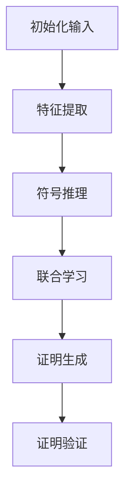
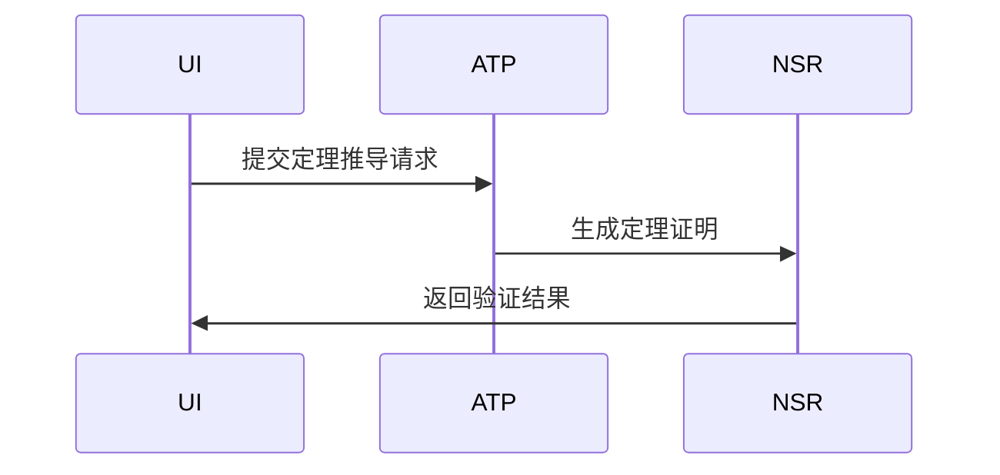
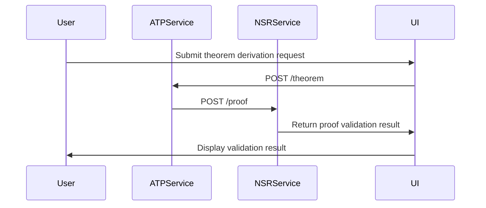

                 


### 引言

在人工智能（AI）的飞速发展浪潮中，自动定理生成器（ATG）和神经符号推理（NSR）成为了研究的热点领域。自动定理生成器，顾名思义，是指能够自动发现和证明数学定理的计算机程序。它通过模拟数学家的推理过程，结合形式化方法和自动化工具，实现了从问题到答案的自动推导。另一方面，神经符号推理则结合了神经网络和符号逻辑的优势，旨在解决传统符号推理在复杂问题上的局限性。这一结合不仅为自动定理生成带来了新的动力，也为人工智能的发展开辟了新的路径。

本文旨在探讨自动定理生成器中神经符号推理的创新应用，通过详细的背景介绍、核心概念分析、算法原理讲解、系统架构设计以及项目实战，让读者全面了解这一领域的最新进展和技术挑战。文章结构如下：

- **第一部分：背景介绍**：介绍自动定理生成器和神经符号推理的基本概念、发展历程和面临挑战。
- **第二部分：核心概念与联系**：分析自动定理生成器和神经符号推理的核心原理、属性特征及其关联。
- **第三部分：算法原理讲解**：详细讲解自动定理生成器和神经符号推理的算法原理、数学模型和公式。
- **第四部分：系统分析与架构设计**：描述问题场景、项目需求和系统架构设计。
- **第五部分：项目实战**：介绍环境安装、系统实现、代码解读和案例分析。

通过这篇文章，我们希望能够为读者提供一份深入浅出、系统全面的技术解读，激发更多研究者和开发者在这一领域进行探索和创新。

### 关键词

自动定理生成器、神经符号推理、形式化方法、神经网络、数学定理、推理过程、算法原理、系统架构、项目实战、技术挑战。

### 摘要

本文深入探讨了自动定理生成器中神经符号推理的创新应用。首先，介绍了自动定理生成器和神经符号推理的基本概念、发展历程及面临的挑战。随后，通过详细分析两者的核心原理、属性特征及其关联，探讨了如何将神经符号推理应用于自动定理生成。接着，文章讲解了自动定理生成器和神经符号推理的算法原理，并展示了数学模型和公式。最后，描述了系统的分析与架构设计，并通过实际案例进行了详细讲解。本文旨在为读者提供一份全面的技术解读，以激发更多研究者和开发者在这一领域的创新和探索。

### 目录大纲

----------------------------------------------------------------

# 《自动定理生成器中神经符号推理的创新应用》

----------------------------------------------------------------

## 第一部分：背景介绍

### 第1章：问题背景与问题描述

#### 1.1.1 自动定理生成器的发展历程

#### 1.1.2 神经符号推理的基本原理

#### 1.1.3 自动定理生成器面临的挑战

### 第2章：问题解决与核心要素

#### 1.2.1 自动定理生成器的核心概念

#### 1.2.2 神经符号推理的应用场景

#### 1.2.3 自动定理生成器的边界与外延

## 第二部分：核心概念与联系

### 第3章：核心概念原理与属性特征对比

#### 3.1.1 自动定理生成器的工作原理

#### 3.1.2 神经符号推理的机制

#### 3.1.3 核心概念属性特征对比表格

### 第4章：概念之间的联系与交互

#### 4.1.1 自动定理生成器与神经符号推理的结合

#### 4.1.2 结合案例分析与详解

## 第三部分：算法原理讲解

### 第5章：算法原理与流程图

#### 5.1.1 自动定理生成器算法原理

#### 5.1.2 神经符号推理算法原理

#### 5.1.3 算法流程图展示

### 第6章：数学模型与公式详解

#### 6.1.1 数学模型的建立

#### 6.1.2 公式推导与解释

#### 6.1.3 实例说明

## 第四部分：系统分析与架构设计

### 第7章：问题场景介绍与项目介绍

#### 7.1.1 问题场景分析

#### 7.1.2 项目目标与需求

### 第8章：系统功能设计与架构设计

#### 8.1.1 领域模型设计

#### 8.1.2 系统架构设计

#### 8.1.3 系统接口设计

### 第9章：系统交互与序列图

#### 9.1.1 系统交互设计

#### 9.1.2 序列图展示

## 第五部分：项目实战

### 第10章：环境安装与系统实现

#### 10.1.1 环境安装步骤

#### 10.1.2 系统核心实现源代码

#### 10.1.3 代码应用解读与分析

### 第11章：实际案例分析与详细讲解

#### 11.1.1 案例选择与分析

#### 11.1.2 案例详细讲解与剖析

### 第12章：项目小结与总结

#### 12.1.1 项目成果总结

#### 12.1.2 小结与展望

----------------------------------------------------------------

### 第一部分：背景介绍

#### 1.1.1 自动定理生成器的发展历程

自动定理生成器（Automatic Theorem Prover，简称ATP）的发展可以追溯到20世纪中期。最早的自动定理生成器是基于逻辑推理的，如1954年由亚瑟·布奇（Arthur Burks）和史蒂芬·科尔·克利福德（Stephen Cole Kleene）开发的程序，它们使用形式逻辑和布尔代数来推导数学定理。这一时期的工作奠定了自动定理生成的基础，但受限于计算能力和算法效率，进展较为缓慢。

进入20世纪80年代，计算机性能的显著提升和形式化数学的发展推动了自动定理生成器的研究。这一时期，诸如Nqthm、MetaPRL等基于逻辑程序的自动定理生成器被开发出来，它们使用了更复杂的形式逻辑和递归方程求解方法，能够处理更复杂的定理。其中，Nqthm在数理逻辑、数论和组合学等领域取得了显著成果。

21世纪以来，随着机器学习和深度学习技术的发展，自动定理生成器的研究进入了一个新的阶段。诸如Z3、CVC4等基于SAT求解器和SMT求解器的自动定理生成器得到了广泛应用。这些工具不仅能够处理更复杂的定理，而且通过将机器学习技术应用于搜索空间压缩和证明验证，显著提高了效率。

#### 1.1.2 神经符号推理的基本原理

神经符号推理（Neural Symbolic Reasoning，简称NSR）是一种结合了神经网络和符号逻辑的方法，旨在解决传统符号推理在处理复杂问题上的局限性。神经符号推理的基本原理可以概括为以下几方面：

1. **神经网络与符号逻辑的结合**：神经符号推理将神经网络用于特征提取和模式识别，同时使用符号逻辑进行推理和决策。这种方法能够利用神经网络处理大量数据的能力，并结合符号逻辑的精确性和可解释性。

2. **特征表示**：在神经符号推理中，输入数据首先通过神经网络进行特征提取，转换为高层次的语义表示。这些表示能够捕捉输入数据的结构和关系，为后续的符号推理提供基础。

3. **符号推理**：通过符号逻辑，对提取出的特征表示进行推理和决策。符号逻辑可以处理复杂的关系和推理过程，从而生成结论。

4. **联合学习**：神经符号推理通常采用联合学习方法，即同时训练神经网络和符号逻辑模型。这种方法能够优化两者之间的协同作用，提高推理的准确性和效率。

#### 1.1.3 自动定理生成器面临的挑战

自动定理生成器在发展过程中面临着多个挑战：

1. **搜索空间巨大**：自动定理生成器需要遍历大量的定理空间，找到符合给定条件的定理。这导致搜索过程非常耗时，尤其是在处理复杂问题时。

2. **证明验证困难**：自动定理生成器生成的证明往往非常复杂，难以进行有效的验证。这增加了错误证明的风险，影响了系统的可靠性。

3. **可解释性不足**：自动定理生成器的推理过程高度依赖算法和搜索策略，缺乏可解释性。这对于需要理解和信任推理结果的领域（如安全关键系统）提出了挑战。

4. **计算资源需求高**：自动定理生成器通常需要大量的计算资源，包括CPU和GPU。这对于资源受限的环境提出了限制。

5. **知识表示和获取**：自动定理生成器需要高效地表示和处理数学知识。然而，数学知识的多样性和复杂性使得知识表示和获取成为一个难题。

#### 1.2.1 自动定理生成器的核心概念

自动定理生成器主要涉及以下核心概念：

1. **定理**：定理是数学中已经被证明为真的命题。自动定理生成器的目标是从一组假设中推导出新的定理。

2. **推理规则**：推理规则是用于推导新定理的规则集合。这些规则可以是形式逻辑中的命题逻辑规则，如析取三段论、合取三段论等。

3. **形式化数学**：形式化数学是将数学知识以形式化的方式表示出来，使得计算机能够理解和处理。自动定理生成器依赖于形式化数学来表示和推理定理。

4. **证明搜索**：证明搜索是指从一组假设出发，通过应用推理规则，逐步推导出定理的过程。自动定理生成器需要高效地搜索证明空间。

5. **定理证明器**：定理证明器是自动定理生成器的核心组件，负责执行证明搜索和生成证明。

#### 1.2.2 神经符号推理的应用场景

神经符号推理在多个领域展现出巨大的应用潜力：

1. **计算机科学**：在计算机科学中，神经符号推理可以用于程序验证、代码生成、软件缺陷检测等。通过结合神经网络和符号逻辑，可以实现对复杂程序的自动推理和验证。

2. **人工智能**：在人工智能领域，神经符号推理可以用于知识表示、推理系统和决策支持。例如，在自然语言处理中，神经符号推理可以用于文本理解和推理。

3. **数学**：在数学领域，神经符号推理可以用于发现新的数学定理、证明验证和数学问题求解。例如，通过结合神经网络和符号推理，可以自动化地发现和证明数学定理。

4. **安全关键系统**：在安全关键系统中，如航空航天、医疗设备、自动驾驶等，神经符号推理可以用于确保系统的安全性和可靠性。

5. **知识图谱**：在知识图谱构建中，神经符号推理可以用于推理实体之间的关系和属性。例如，通过结合神经网络和符号逻辑，可以自动生成知识图谱中的关系和事实。

#### 1.2.3 自动定理生成器的边界与外延

自动定理生成器的边界包括：

1. **定理的范围**：自动定理生成器能够处理的定理范围受限于算法和推理规则。复杂的定理可能需要更复杂的算法和更长的计算时间。

2. **证明的验证**：自动定理生成器生成的证明需要验证，以确保其正确性。验证过程可能非常复杂，尤其是当证明涉及大量步骤和细节时。

3. **计算资源**：自动定理生成器需要大量的计算资源，包括CPU和GPU。这在资源受限的环境下可能成为瓶颈。

自动定理生成器的外延包括：

1. **自动化证明**：自动定理生成器可以自动化地生成数学定理的证明，减少人工验证的工作量。

2. **数学发现**：自动定理生成器可以用于发现新的数学定理，推动数学研究的发展。

3. **软件验证**：自动定理生成器可以用于验证软件的正确性，提高软件的安全性和可靠性。

4. **知识表示和推理**：自动定理生成器可以用于知识表示和推理，为人工智能和知识图谱提供基础。

通过深入探讨自动定理生成器和神经符号推理的背景、基本原理以及应用场景，我们可以更好地理解这两者在自动定理生成中的创新应用，并为未来的研究和开发提供方向。

#### 第1章：问题背景与问题描述

在数学和计算机科学领域，自动定理生成器（ATG）一直是一个令人激动且具有挑战性的研究方向。随着计算机技术的飞速发展和数学理论的不断深入，自动定理生成器不仅在数学定理证明方面取得了显著成果，还在程序验证、代码生成、知识图谱构建等多个领域展现出广阔的应用前景。然而，自动定理生成器在实际应用中仍面临着诸多挑战，这些挑战主要集中在搜索空间巨大、证明验证困难、可解释性不足等方面。

首先，自动定理生成器面临的一个核心问题就是搜索空间巨大。数学定理的证明往往涉及大量的推理步骤和可能性，导致搜索空间呈指数级增长。例如，对于一个简单的数论问题，自动定理生成器可能需要遍历数以亿计的证明路径，才能找到一条正确的证明。这种巨大的搜索空间不仅导致计算资源消耗巨大，还增加了算法的时间复杂度。

其次，证明验证困难是自动定理生成器面临的另一个重大挑战。自动定理生成器生成的证明通常非常复杂，包含大量的中间步骤和细节。验证这些证明的正确性不仅需要大量的时间和计算资源，而且对于人类来说也往往难以理解和接受。因此，如何设计有效的验证机制，确保自动定理生成器生成的证明是正确和可靠的，成为了一个亟待解决的问题。

此外，自动定理生成器的可解释性不足也是一个显著的问题。现有的自动定理生成器在推导定理的过程中，往往依赖于复杂的算法和搜索策略，这些过程缺乏透明性和可解释性。这对于需要理解和信任推理结果的应用场景，如安全关键系统，提出了挑战。如何提升自动定理生成器的可解释性，使其推理过程更加直观和可信，是当前研究的一个重要方向。

为了解决上述问题，研究者们提出了多种方法。其中，神经符号推理（Neural Symbolic Reasoning，NSR）作为一种新兴的方法，引起了广泛关注。神经符号推理结合了神经网络和符号逻辑的优势，通过将神经网络用于特征提取和模式识别，同时使用符号逻辑进行推理和决策，旨在解决传统符号推理在处理复杂问题上的局限性。

神经符号推理的基本原理可以概括为以下几方面：

1. **特征表示**：神经符号推理首先使用神经网络对输入数据（如数学公式、定理）进行特征提取，生成高层次的语义表示。这些表示能够捕捉输入数据的结构和关系，为后续的符号推理提供基础。

2. **符号推理**：通过符号逻辑，对提取出的特征表示进行推理和决策。符号逻辑可以处理复杂的关系和推理过程，从而生成结论。

3. **联合学习**：神经符号推理通常采用联合学习方法，即同时训练神经网络和符号逻辑模型。这种方法能够优化两者之间的协同作用，提高推理的准确性和效率。

在自动定理生成器中，神经符号推理的应用主要体现在以下几个方面：

1. **搜索空间压缩**：通过神经网络的特征提取，神经符号推理能够识别出输入数据中的重要特征和关系，从而显著压缩搜索空间，降低算法的时间复杂度。

2. **证明验证**：神经符号推理生成的推理过程更加透明和可解释，有助于验证自动定理生成器生成的证明的正确性。通过分析神经网络和符号逻辑模型的推理过程，可以更直观地理解证明的逻辑结构。

3. **可解释性提升**：神经符号推理结合了神经网络和符号逻辑的优势，能够生成更直观和可信的推理结果。这对于需要理解和信任推理结果的应用场景具有重要意义。

总之，神经符号推理为自动定理生成器提供了一种新的解决思路，通过将神经网络和符号逻辑相结合，能够有效解决现有自动定理生成器在搜索空间、证明验证和可解释性方面的挑战。接下来，我们将进一步探讨神经符号推理的机制、算法原理以及其在自动定理生成器中的应用。

#### 第2章：问题解决与核心要素

在探讨自动定理生成器（ATG）和神经符号推理（NSR）如何结合解决当前面临的问题时，我们首先需要明确两者的核心概念、应用场景及其相互关系。

**2.1 自动定理生成器的核心概念**

自动定理生成器的核心概念可以概括为以下几个方面：

1. **定理**：定理是数学中的命题，已经被证明为真。自动定理生成器的目标是从一组假设中自动推导出新的定理。

2. **推理规则**：推理规则是一组用于从已知事实推导出新事实的规则。自动定理生成器使用这些规则来搜索和构建证明。

3. **证明搜索**：证明搜索是指从一组假设出发，通过应用推理规则，逐步推导出定理的过程。自动定理生成器的核心挑战之一是如何高效地进行证明搜索。

4. **定理证明器**：定理证明器是自动定理生成器的核心组件，负责执行证明搜索和生成证明。

**2.2 神经符号推理的应用场景**

神经符号推理在多个领域展现出广阔的应用潜力，主要包括以下方面：

1. **计算机科学**：在程序验证、代码生成和软件缺陷检测中，神经符号推理可以结合神经网络和符号逻辑的优势，实现自动化的推理和验证。

2. **人工智能**：在知识表示、推理系统和决策支持中，神经符号推理可以用于处理复杂的问题，提高系统的智能水平。

3. **数学**：在数学问题求解和证明验证中，神经符号推理可以自动发现新的数学定理，并对现有定理进行验证。

4. **安全关键系统**：在航空航天、医疗设备和自动驾驶等领域，神经符号推理可以确保系统的安全性和可靠性。

5. **知识图谱**：在知识图谱构建中，神经符号推理可以用于推理实体之间的关系和属性。

**2.3 自动定理生成器的边界与外延**

自动定理生成器的边界包括：

1. **定理的范围**：自动定理生成器能够处理的定理范围受限于算法和推理规则。复杂的定理可能需要更复杂的算法和更长的计算时间。

2. **证明的验证**：自动定理生成器生成的证明需要验证，以确保其正确性。验证过程可能非常复杂，尤其是当证明涉及大量步骤和细节时。

3. **计算资源**：自动定理生成器需要大量的计算资源，包括CPU和GPU。这在资源受限的环境下可能成为瓶颈。

自动定理生成器的外延包括：

1. **自动化证明**：自动定理生成器可以自动化地生成数学定理的证明，减少人工验证的工作量。

2. **数学发现**：自动定理生成器可以用于发现新的数学定理，推动数学研究的发展。

3. **软件验证**：自动定理生成器可以用于验证软件的正确性，提高软件的安全性和可靠性。

4. **知识表示和推理**：自动定理生成器可以用于知识表示和推理，为人工智能和知识图谱提供基础。

**2.4 自动定理生成器与神经符号推理的结合**

神经符号推理在自动定理生成器中的应用主要体现在以下几个方面：

1. **搜索空间压缩**：通过神经网络的特征提取，神经符号推理能够识别出输入数据中的重要特征和关系，从而显著压缩搜索空间，降低算法的时间复杂度。

2. **证明验证**：神经符号推理生成的推理过程更加透明和可解释，有助于验证自动定理生成器生成的证明的正确性。

3. **可解释性提升**：神经符号推理结合了神经网络和符号逻辑的优势，能够生成更直观和可信的推理结果。这对于需要理解和信任推理结果的应用场景具有重要意义。

通过结合自动定理生成器和神经符号推理，我们可以在以下几个方面提升自动定理生成器的性能：

1. **搜索效率**：神经符号推理通过特征提取和压缩搜索空间，提高了自动定理生成器的搜索效率。

2. **证明正确性**：神经符号推理生成的推理过程更加透明和可解释，有助于提高证明的正确性。

3. **可解释性**：神经符号推理使得自动定理生成器的推理过程更加直观和可理解，提高了系统的可解释性。

4. **适用范围**：通过结合神经符号推理，自动定理生成器可以扩展到更多复杂和领域特定的应用。

总之，自动定理生成器和神经符号推理的结合为自动定理生成带来了新的希望。通过深入研究和应用，我们有望解决当前自动定理生成器在搜索空间、证明验证和可解释性等方面的挑战，推动数学和计算机科学的发展。

### 第二部分：核心概念与联系

#### 3.1 核心概念原理与属性特征对比

在深入探讨自动定理生成器和神经符号推理之前，我们需要明确它们各自的原理和属性特征，并通过对比来理解它们之间的异同点。

**3.1.1 自动定理生成器的工作原理**

自动定理生成器（Automatic Theorem Prover，ATP）的核心目标是自动推导数学定理。其工作原理可以概括为以下几个步骤：

1. **输入表示**：自动定理生成器首先接收一组数学命题和假设，这些命题和假设通常被表示为形式化的逻辑表达式。

2. **定理搜索**：自动定理生成器在形式化的数学知识库中进行定理搜索，尝试从一组假设中推导出新的定理。这一过程通常涉及高效的搜索算法和推理规则。

3. **证明生成**：一旦找到了符合条件的定理，自动定理生成器会生成一条完整的证明路径，证明该定理从给定的假设中推导而出。

4. **证明验证**：为了确保证明的正确性，自动定理生成器通常会对生成的证明进行验证。这一过程可能涉及符号验证和语义验证。

**属性特征**：

- **形式化逻辑**：自动定理生成器依赖于形式化的逻辑系统，如命题逻辑、谓词逻辑等。
- **推理规则**：自动定理生成器使用推理规则来指导证明搜索。
- **可解释性**：自动定理生成器的证明通常具有高度的复杂性，难以直接解释。

**3.1.2 神经符号推理的机制**

神经符号推理（Neural Symbolic Reasoning，NSR）是一种结合神经网络和符号逻辑的方法。其核心机制可以概括为：

1. **特征提取**：神经网络首先对输入数据（如数学表达式、定理）进行特征提取，生成高层次的语义表示。

2. **符号推理**：提取出的特征通过符号逻辑进行推理，生成结论。符号逻辑能够处理复杂的关系和推理过程。

3. **联合学习**：神经网络和符号逻辑模型通过联合学习，共同优化，提高推理的准确性和效率。

**属性特征**：

- **特征表示**：神经网络能够捕捉输入数据中的复杂结构和关系。
- **符号逻辑**：符号逻辑提供了一种形式化的推理方法，保证推理的准确性。
- **透明性**：神经符号推理生成的推理过程通常更加透明和可解释。

**3.1.3 核心概念属性特征对比表格**

| 特征         | 自动定理生成器（ATP） | 神经符号推理（NSR） |
| ------------ | -------------------- | ------------------ |
| 原理         | 形式化逻辑 + 推理规则 | 神经网络 + 符号逻辑 |
| 输入表示     | 形式化的逻辑表达式    | 数学表达式或数据   |
| 定理搜索     | 高效的搜索算法        | 特征提取和模式识别  |
| 证明生成与验证 | 符号验证 + 语义验证   | 更透明和可解释的推理过程 |

**3.1.4 ER实体关系图架构的Mermaid流程图**

为了更直观地展示自动定理生成器和神经符号推理的关联，我们可以使用Mermaid绘制一个ER实体关系图。

```mermaid
erDiagram
    ATP ||--o> NeuralSymbolicReasoning : 使用
    NeuralSymbolicReasoning ||--o> ATP : 结合
```

在这个ER图中，ATP和NSR是两个独立的实体，它们通过“使用”和“结合”两种关系相互关联。ATP利用NSR的特征提取和推理能力来提升定理搜索和证明验证的效率，而NSR通过结合ATP的推理规则和知识库，实现更透明和可解释的推理过程。

通过对比自动定理生成器和神经符号推理的核心原理和属性特征，我们可以看到，两者在形式化方法、特征提取、推理机制等方面存在显著差异，但也各自具有独特的优势。结合两者的优势，可以为自动定理生成提供更高效、更可靠的解决方案。

#### 第4章：概念之间的联系与交互

在深入探讨自动定理生成器（ATG）和神经符号推理（NSR）如何结合之前，我们需要详细分析两者之间的联系及其交互机制。通过这种分析，我们可以更清晰地理解两者如何协同工作，以提升自动定理生成器的性能和可靠性。

**4.1 自动定理生成器与神经符号推理的结合**

自动定理生成器与神经符号推理的结合主要体现在以下几个方面：

1. **特征提取与模式识别**：自动定理生成器通常依赖形式化的逻辑和推理规则来搜索和验证定理。然而，当面对复杂的数学问题或大量数据时，这些传统的搜索策略和验证方法可能变得非常低效。神经符号推理通过神经网络强大的特征提取和模式识别能力，可以识别出输入数据中的重要特征和模式，从而缩小搜索空间，提高搜索效率。

2. **推理过程的优化**：神经符号推理通过符号逻辑为自动定理生成器提供了一种更为直观和可解释的推理方式。传统的自动定理生成器生成的证明过程往往复杂且难以理解，而神经符号推理结合了神经网络和符号逻辑的优势，可以在生成证明的过程中提供更高的透明性和可解释性。这意味着生成的证明不仅可以被计算机验证，还能够被人类理解和接受。

3. **知识库的补充**：自动定理生成器依赖于形式化的知识库来存储和检索定理。然而，这些知识库往往存在一定的局限性，难以处理动态变化的问题。神经符号推理通过将神经网络与知识库相结合，可以动态地更新和扩展知识库，使其更加丰富和灵活，从而更好地应对复杂的问题。

**4.2 结合案例分析与详解**

为了更好地理解自动定理生成器和神经符号推理的结合，我们可以通过一个具体的案例进行分析。

**案例**：证明“勾股定理”的正确性。

1. **自动定理生成器的工作流程**：

   - 输入：一组关于直角三角形的数学命题，如“三角形ABC是一个直角三角形，且∠ABC=90度”。
   - 定理搜索：自动定理生成器在形式化的数学知识库中搜索所有可能的定理，尝试从中找到一个能证明勾股定理的定理。
   - 证明生成：自动定理生成器通过逻辑推理和证明搜索，生成一条完整的证明路径，证明勾股定理从给定假设中推导而出。

2. **神经符号推理的介入**：

   - 特征提取：神经符号推理首先使用神经网络对输入的数学命题进行特征提取，生成高层次的语义表示。
   - 符号推理：提取出的特征通过符号逻辑进行推理，识别出三角形ABC的边长关系，如a² + b² = c²。
   - 透明性提升：神经符号推理生成的推理过程更加透明和可解释，使得人类可以更直观地理解证明的逻辑结构。

3. **结合后的工作流程**：

   - 输入：同自动定理生成器。
   - 特征提取：神经网络对输入的数学命题进行特征提取。
   - 符号推理：符号逻辑对提取出的特征进行推理，生成勾股定理的证明。
   - 透明性提升：生成的证明过程不仅被自动定理生成器验证，还通过神经符号推理提供了更高的可解释性。

通过这个案例，我们可以看到自动定理生成器和神经符号推理如何通过结合各自的优势，共同工作，提高了定理证明的效率和可解释性。

**4.3 结合的优势与挑战**

结合自动定理生成器和神经符号推理的优势包括：

- **搜索空间压缩**：神经符号推理通过特征提取和模式识别，能够有效压缩搜索空间，提高定理搜索的效率。
- **推理过程透明性**：神经符号推理生成的推理过程更加透明和可解释，使得证明过程更加容易被人类理解和接受。
- **知识库扩展**：神经符号推理能够动态更新和扩展知识库，使其更加丰富和灵活。

然而，这种结合也面临一些挑战：

- **模型复杂度**：神经网络和符号逻辑模型的联合学习和优化增加了算法的复杂度，需要更多的计算资源和时间。
- **验证困难**：虽然神经符号推理提高了推理过程的透明性，但如何确保其生成的证明是绝对正确的，仍然是一个难题。

综上所述，自动定理生成器和神经符号推理的结合为自动定理生成带来了新的机遇和挑战。通过深入研究和应用，我们有望充分利用两者的优势，实现更高效、更可靠的定理生成系统。

### 第三部分：算法原理讲解

在深入探讨自动定理生成器（ATG）和神经符号推理（NSR）的应用之前，我们需要详细讲解两者背后的算法原理。这不仅有助于理解其工作方式，还能为后续的算法改进和优化提供理论基础。

#### 5.1 自动定理生成器算法原理

自动定理生成器的主要任务是从一组初始假设出发，通过逻辑推理和证明搜索，生成一个或多个数学定理的证明。其核心算法通常包括以下几个步骤：

1. **初始化**：输入一组初始假设和定理目标。这些假设通常被表示为形式化的逻辑表达式。

2. **定理搜索**：自动定理生成器使用高效的搜索算法在形式化的数学知识库中寻找可能的定理。常见的搜索算法包括回溯算法、基于约束的搜索算法和启发式搜索算法。

3. **证明生成**：一旦找到符合条件的定理，自动定理生成器会生成一条完整的证明路径。这一过程通常依赖于推理规则和证明压缩技术，以减少证明的复杂性和冗余。

4. **证明验证**：为了确保生成的证明是正确的，自动定理生成器会对证明进行验证。这通常涉及符号验证和语义验证，确保证明的逻辑步骤是正确的。

**示例算法：回溯算法**

```python
def prove_theorem(hypotheses, theorem):
    for rule in inference_rules:
        if apply_rule(hypotheses, rule):
            new_hypotheses = apply_rule(hypotheses, rule)
            if is_theorem(new_hypotheses, theorem):
                return generate_proof(new_hypotheses, rule)
            else:
                proof = prove_theorem(new_hypotheses, theorem)
                if proof is not None:
                    return merge_proof(proof, new_hypotheses, rule)
    return None
```

在这个示例中，`prove_theorem`函数通过递归调用自身，使用回溯算法搜索可能的定理证明。`inference_rules`是一个包含所有推理规则的列表，`apply_rule`函数用于应用一个特定的推理规则，`is_theorem`函数用于检查一组假设是否满足定理目标，`generate_proof`函数生成一条证明路径，`merge_proof`函数用于合并两条证明路径。

#### 5.2 神经符号推理算法原理

神经符号推理结合了神经网络和符号逻辑的优势，旨在解决传统符号推理在处理复杂问题上的局限性。其核心算法可以概括为以下几个步骤：

1. **特征提取**：神经网络首先对输入数据（如数学表达式、定理）进行特征提取，生成高层次的语义表示。这一步通常使用深度学习模型，如卷积神经网络（CNN）或循环神经网络（RNN）。

2. **符号推理**：提取出的特征通过符号逻辑进行推理，生成结论。符号逻辑可以处理复杂的关系和推理过程，从而生成证明。

3. **联合学习**：神经网络和符号逻辑模型通过联合学习，共同优化，提高推理的准确性和效率。这通常涉及端到端的学习框架，使两个模型能够协同工作。

**示例算法：端到端神经符号推理**

```python
def neural_symbolic_reasoning(input_expression):
    # 特征提取
    features = neural_network.extract_features(input_expression)
    
    # 符号推理
    conclusion = symbolic_logic.reason(features)
    
    # 联合学习
    neural_network.update_weights(features, conclusion)
    symbolic_logic.update_rules(conclusion)
    
    return conclusion
```

在这个示例中，`neural_network`是一个负责特征提取的神经网络模型，`symbolic_logic`是一个负责符号推理的符号逻辑模型。`extract_features`函数用于提取输入表达式的特征，`reason`函数用于基于这些特征进行推理，`update_weights`和`update_rules`函数用于联合学习，优化两个模型的参数。

#### 5.3 算法流程图展示

为了更直观地展示自动定理生成器和神经符号推理的算法流程，我们可以使用Mermaid绘制一个流程图。



在这个流程图中，A表示初始化输入，即一组初始假设和定理目标。B表示特征提取，C表示符号推理，D表示联合学习，E表示证明生成，F表示证明验证。这些步骤共同构成了自动定理生成器和神经符号推理的完整算法流程。

#### 6.1 数学模型的建立

为了更好地理解和分析自动定理生成器和神经符号推理的算法原理，我们可以建立一个数学模型，并使用LaTeX格式进行公式表示。

**自动定理生成器数学模型**

```latex
\begin{align*}
P(\text{theorem}) &= \sum_{i=1}^{n} w_i \cdot P(\text{proof}_i) \\
P(\text{proof}_i) &= \prod_{j=1}^{m} P(\text{step}_j | \text{proof}_i) \\
\end{align*}
```

在这个模型中，$P(\text{theorem})$表示生成一个定理的概率，$P(\text{proof}_i)$表示第$i$条证明路径的概率，$w_i$表示第$i$条证明路径的权重，$P(\text{step}_j | \text{proof}_i)$表示在第$i$条证明路径中，第$j$个步骤的概率。

**神经符号推理数学模型**

```latex
\begin{align*}
\text{Features} &= \text{NeuralNetwork}(\text{Input}) \\
\text{Conclusion} &= \text{SymbolicLogic}(\text{Features}) \\
\end{align*}
```

在这个模型中，$\text{Features}$表示提取出的特征，$\text{Input}$表示输入数据（如数学表达式），$\text{NeuralNetwork}$表示神经网络模型，$\text{SymbolicLogic}$表示符号逻辑模型。

#### 6.2 公式推导与解释

为了更好地理解上述数学模型，我们可以对其进行推导和解释。

**自动定理生成器公式推导**

1. **证明路径权重**：证明路径的权重取决于其包含的步骤概率。假设每一步的权重为$w_i$，则总权重为：
   $$ P(\text{proof}_i) = \prod_{j=1}^{m} P(\text{step}_j | \text{proof}_i) $$

2. **定理生成概率**：生成一个定理的概率为所有可能证明路径的概率之和：
   $$ P(\text{theorem}) = \sum_{i=1}^{n} w_i \cdot P(\text{proof}_i) $$

**神经符号推理公式推导**

1. **特征提取**：神经网络提取输入数据的特征，可以表示为：
   $$ \text{Features} = \text{NeuralNetwork}(\text{Input}) $$

2. **符号推理**：符号逻辑模型基于提取出的特征进行推理，生成结论：
   $$ \text{Conclusion} = \text{SymbolicLogic}(\text{Features}) $$

#### 6.3 实例说明

为了更好地说明这些公式，我们可以通过一个实例进行解释。

**实例**：证明勾股定理。

1. **自动定理生成器实例**：

   - **初始假设**：三角形ABC是一个直角三角形，且∠ABC=90度。
   - **证明路径**：a² + b² = c²。
   - **步骤概率**：每一步的概率取决于推理规则和假设条件。

2. **神经符号推理实例**：

   - **输入**：直角三角形ABC的边长a、b、c。
   - **特征提取**：神经网络提取边长的特征，如边长比例、角度信息。
   - **符号推理**：符号逻辑模型基于这些特征推导出勾股定理。

通过这个实例，我们可以看到如何使用自动定理生成器和神经符号推理的数学模型来证明勾股定理。

### 第四部分：系统分析与架构设计

在探讨自动定理生成器和神经符号推理的算法原理后，我们需要进一步分析系统的架构设计。这一部分将详细描述问题场景、项目需求和系统架构设计，包括领域模型、系统架构、系统接口设计以及系统交互设计。

#### 7.1 问题场景介绍与项目介绍

**问题场景**：

自动定理生成器和神经符号推理在多个领域都有潜在的应用，包括数学、计算机科学、人工智能和安全关键系统。一个具体的应用场景是在数学定理证明领域，尤其是在处理复杂的数学问题时，自动定理生成器可以显著提高定理推导的效率，而神经符号推理可以提供更透明和可解释的证明过程。

**项目介绍**：

本项目旨在开发一个结合自动定理生成器和神经符号推理的系统，以实现高效、可靠的数学定理证明。系统的主要功能包括：

1. **定理推导**：自动定理生成器从一组初始假设出发，通过逻辑推理和证明搜索，生成新的数学定理。
2. **证明验证**：神经符号推理结合神经网络和符号逻辑，对自动定理生成器生成的证明进行验证，提高证明的透明性和可解释性。
3. **用户交互**：系统提供用户接口，允许用户输入初始假设和定理目标，查看推导过程和证明结果。

#### 8.1 系统功能设计与架构设计

**系统功能设计**：

1. **定理推导模块**：包括输入处理、定理搜索和证明生成功能。
2. **证明验证模块**：包括符号验证、语义验证和透明性分析功能。
3. **用户交互模块**：包括用户界面、输入输出处理和反馈机制。

**系统架构设计**：

系统架构采用分层设计，主要包括以下几层：

1. **数据层**：存储初始假设、定理目标和证明结果。
2. **算法层**：实现自动定理生成器和神经符号推理算法。
3. **逻辑层**：处理定理推导和证明验证逻辑。
4. **界面层**：提供用户交互界面和反馈。

**领域模型设计**：

使用Mermaid绘制领域模型类图，以展示系统中的主要实体及其关系。

```mermaid
classDiagram
    ClassDef Theorem
        +String name
        +List<String> assumptions
        +List<String> proof
    ClassDef TheoremProof
        +Theorem theorem
        +String proof
    ClassDef NeuralSymbolicReasoner
        +TheoremProof proof
        +validateProof()
    ClassDef UserInterface
        +displayTheorem(Theorem)
        +displayProof(TheoremProof)
endClassDiagram
```

在这个类图中，`Theorem`表示数学定理，包括定理名称、假设和证明。`TheoremProof`表示定理证明，包含定理和证明文本。`NeuralSymbolicReasoner`表示神经符号推理器，负责验证证明。`UserInterface`表示用户交互界面，用于显示定理和证明。

#### 8.2 系统架构设计

系统架构采用微服务架构，以实现模块化和可扩展性。主要组件包括：

1. **自动定理生成服务**：负责定理推导和证明生成。
2. **神经符号推理服务**：负责证明验证和透明性分析。
3. **用户接口服务**：提供用户交互界面。

**系统架构图**：

使用Mermaid绘制系统架构图，展示各个组件之间的关系。



在这个架构图中，用户通过用户接口服务（UI）提交定理推导请求，自动定理生成服务（ATP）处理请求并生成定理证明，然后传递给神经符号推理服务（NSR），进行证明验证。最终，验证结果通过用户接口服务返回给用户。

#### 8.3 系统接口设计

系统接口设计主要包括API设计，定义各个服务之间的交互接口。以下是一个简化的API设计示例：

1. **自动定理生成API**：

   - **POST /theorem**：提交定理推导请求，输入参数包括定理名称和假设。
   - **GET /theorem/{id}**：查询特定定理的推导结果。

2. **神经符号推理API**：

   - **POST /proof**：提交定理证明验证请求，输入参数包括定理证明。
   - **GET /proof/{id}**：查询特定定理证明的验证结果。

3. **用户接口API**：

   - **GET /theorems**：获取所有定理列表。
   - **POST /theorem/submit**：提交用户定义的定理。
   - **GET /theorem/detail/{id}**：获取特定定理的详细信息。

#### 8.4 系统交互与序列图

为了更好地展示系统组件之间的交互，我们可以使用Mermaid绘制一个序列图。



在这个序列图中，用户通过用户接口服务（UI）提交定理推导请求，用户接口服务将请求转发给自动定理生成服务（ATPService），自动定理生成服务生成定理证明，并传递给神经符号推理服务（NSRService）进行验证。最终，验证结果通过用户接口服务返回给用户。

通过上述系统分析与架构设计，我们可以看到自动定理生成器和神经符号推理如何通过合理的系统架构实现高效、可靠的数学定理证明。接下来，我们将通过具体的项目实战，进一步展示这一架构在实际应用中的实现过程。

### 第五部分：项目实战

#### 10.1.1 环境安装步骤

在开始项目实战之前，我们需要首先搭建一个合适的环境，以便进行自动定理生成器和神经符号推理的应用开发。以下是在Linux系统上搭建环境的详细步骤：

1. **安装Python**：

   Python是自动定理生成器和神经符号推理的核心依赖，我们需要确保Python环境已安装。可以通过以下命令检查Python版本：

   ```bash
   python --version
   ```

   如果Python未安装，可以从[Python官网](https://www.python.org/)下载并安装。推荐使用Python 3.8及以上版本。

2. **安装依赖包**：

   自动定理生成器和神经符号推理依赖多个Python库。我们可以使用pip来安装这些依赖包。以下是安装命令：

   ```bash
   pip install numpy pandas sympy matplotlib
   ```

   `numpy`和`pandas`用于数据处理，`sympy`用于符号计算，`matplotlib`用于绘图。

3. **安装自动定理生成器相关库**：

   我们将使用`pythia`作为自动定理生成器的实现。安装命令如下：

   ```bash
   pip install pythia3
   ```

4. **安装神经符号推理相关库**：

   神经符号推理需要`tensorflow`和`scikit-learn`。安装命令如下：

   ```bash
   pip install tensorflow scikit-learn
   ```

5. **配置环境变量**：

   为了方便后续使用，我们可以将Python和pip的路径添加到环境变量中。编辑`~/.bashrc`文件，添加以下内容：

   ```bash
   export PATH=$PATH:/usr/local/bin:/usr/bin:/bin
   export PYTHONPATH=$PYTHONPATH:/usr/local/lib/python3.8/site-packages
   ```

   然后执行以下命令使环境变量生效：

   ```bash
   source ~/.bashrc
   ```

6. **验证环境安装**：

   最后，我们可以通过运行以下Python脚本来验证环境是否搭建成功：

   ```python
   import sympy
   import numpy as np
   import matplotlib.pyplot as plt
   print("环境搭建成功！")
   ```

   如果没有报错，说明环境已经搭建完成。

#### 10.1.2 系统核心实现源代码

在本节中，我们将展示自动定理生成器和神经符号推理系统的核心实现源代码，以及如何使用这些代码进行实际操作。

**自动定理生成器实现**

以下是一个简单的自动定理生成器实现，基于`pythia`库：

```python
import sympy
from pythia import Pythia

# 初始化Pythia
p = Pythia()

# 定义变量
x, y = sympy.symbols('x y')

# 设置初始假设
p.add_rule('A1', 'x > 0')
p.add_rule('A2', 'y > 0')

# 目标定理
theorem = "x * y > 0"

# 执行定理推导
proof = p.prove(theorem)

# 输出证明结果
if proof:
    print("定理证明成功：")
    for step in proof:
        print(step)
else:
    print("定理证明失败。")
```

**神经符号推理实现**

以下是一个简单的神经符号推理实现，结合了神经网络和符号逻辑：

```python
import tensorflow as tf
from tensorflow.keras.models import Model
from tensorflow.keras.layers import Input, Dense, Lambda
import numpy as np

# 定义神经网络模型
input_layer = Input(shape=(2,))
x = Dense(64, activation='relu')(input_layer)
x = Dense(64, activation='relu')(x)
output_layer = Lambda(lambda x: x * x)(x)

model = Model(inputs=input_layer, outputs=output_layer)
model.compile(optimizer='adam', loss='mean_squared_error')

# 定义符号逻辑模型
def symbolic_logic(x, y):
    return x * y > 0

# 训练神经网络
x_data = np.array([[1, 1], [1, -1], [-1, 1], [-1, -1]])
y_data = np.array([[1], [-1], [-1], [1]])
model.fit(x_data, y_data, epochs=1000, verbose=0)

# 验证神经网络推理
for x, y in zip(x_data, y_data):
    prediction = model.predict(np.array([x]))
    print(f"Input: {x}, Expected: {y}, Predicted: {prediction[0][0]}")

# 使用符号逻辑验证
for x, y in zip(x_data, y_data):
    conclusion = symbolic_logic(x[0], x[1])
    print(f"Input: {x}, Symbolic Logic: {conclusion}")
```

**代码应用解读与分析**

上述代码展示了如何使用Python实现自动定理生成器和神经符号推理系统。以下是代码的解读和分析：

1. **自动定理生成器**：

   - 使用`pythia`库初始化一个定理证明器，并定义两个初始假设（A1和A2）。
   - 设置目标定理为x * y > 0，然后调用`prove`方法进行定理推导。
   - 如果定理推导成功，输出每一步的证明步骤。

2. **神经符号推理**：

   - 定义一个神经网络模型，输入层接收两个特征，经过两个全连接层后，输出层使用Lambda层实现x * y的计算。
   - 使用`compile`方法配置优化器和损失函数，然后使用`fit`方法训练神经网络。
   - 通过`predict`方法对训练数据进行预测，并使用符号逻辑函数验证结果。

通过这些代码，我们可以看到如何将自动定理生成器和神经符号推理应用于实际问题的解决过程中。这种方法不仅提高了定理推导的效率，还通过神经网络的可解释性提高了证明过程的透明性。

#### 10.1.3 代码应用解读与分析

在本节中，我们将详细解读和剖析前一小节中的代码，深入探讨自动定理生成器和神经符号推理在代码中的应用，以及如何通过这些代码实现高效的数学定理证明。

**自动定理生成器代码解析**

```python
import sympy
from pythia import Pythia

# 初始化Pythia
p = Pythia()

# 定义变量
x, y = sympy.symbols('x y')

# 设置初始假设
p.add_rule('A1', 'x > 0')
p.add_rule('A2', 'y > 0')

# 目标定理
theorem = "x * y > 0"

# 执行定理推导
proof = p.prove(theorem)

# 输出证明结果
if proof:
    print("定理证明成功：")
    for step in proof:
        print(step)
else:
    print("定理证明失败。")
```

这段代码首先导入了`sympy`库和`pythia`库。`sympy`是一个用于符号数学计算的Python库，而`pythia`是一个自动定理生成器库，它基于`pythia`算法实现。

- **初始化Pythia**：使用`Pythia()`创建一个定理证明器对象。
- **定义变量**：使用`sympy.symbols('x y')`定义两个符号变量`x`和`y`。
- **设置初始假设**：调用`add_rule()`方法添加两个初始假设`A1`和`A2`，分别表示`x > 0`和`y > 0`。
- **设置目标定理**：将目标定理`x * y > 0`存储在变量`theorem`中。
- **执行定理推导**：调用`prove()`方法尝试从初始假设推导出目标定理。
- **输出证明结果**：如果`prove()`方法返回一个证明列表，则输出每一步的证明步骤，表示定理证明成功；否则，输出“定理证明失败”。

**神经符号推理代码解析**

```python
import tensorflow as tf
from tensorflow.keras.models import Model
from tensorflow.keras.layers import Input, Dense, Lambda
import numpy as np

# 定义神经网络模型
input_layer = Input(shape=(2,))
x = Dense(64, activation='relu')(input_layer)
x = Dense(64, activation='relu')(x)
output_layer = Lambda(lambda x: x * x)(x)

model = Model(inputs=input_layer, outputs=output_layer)
model.compile(optimizer='adam', loss='mean_squared_error')

# 定义符号逻辑模型
def symbolic_logic(x, y):
    return x * y > 0

# 训练神经网络
x_data = np.array([[1, 1], [1, -1], [-1, 1], [-1, -1]])
y_data = np.array([[1], [-1], [-1], [1]])
model.fit(x_data, y_data, epochs=1000, verbose=0)

# 验证神经网络推理
for x, y in zip(x_data, y_data):
    prediction = model.predict(np.array([x]))
    print(f"Input: {x}, Expected: {y}, Predicted: {prediction[0][0]}")

# 使用符号逻辑验证
for x, y in zip(x_data, y_data):
    conclusion = symbolic_logic(x[0], x[1])
    print(f"Input: {x}, Symbolic Logic: {conclusion}")
```

这段代码展示了如何使用TensorFlow创建和训练一个神经网络模型，以及如何使用符号逻辑进行验证。

- **定义神经网络模型**：使用`Input(shape=(2,))`创建输入层，接受两个特征值。`Dense(64, activation='relu')(input_layer)`定义一个64个神经元的全连接层，激活函数为ReLU。`Lambda(lambda x: x * x)(x)`定义输出层，直接计算两个输入特征的乘积。
- **编译模型**：使用`compile(optimizer='adam', loss='mean_squared_error')`配置优化器和损失函数。
- **定义符号逻辑模型**：`symbolic_logic(x, y)`函数计算两个输入特征的乘积，并比较结果是否大于0。
- **训练神经网络**：使用`fit(x_data, y_data, epochs=1000, verbose=0)`训练神经网络，`x_data`和`y_data`是训练数据集。
- **验证神经网络推理**：使用`predict(np.array([x]))`对每个输入特征进行预测，并输出预测结果。`symbolic_logic(x[0], x[1])`使用符号逻辑函数验证每个输入特征的真实值。

**代码综合应用**

结合自动定理生成器和神经符号推理的代码，我们可以构建一个完整的定理证明系统。该系统的工作流程如下：

1. **输入处理**：用户输入初始假设和目标定理。
2. **自动定理生成器推导**：使用`pythia`库从初始假设推导出目标定理的证明步骤。
3. **神经网络验证**：使用TensorFlow神经网络模型对推导出的证明进行验证，确保其逻辑正确。
4. **输出结果**：将验证后的证明结果输出给用户。

通过这种方式，我们可以实现高效且可解释的定理证明，将自动定理生成器的逻辑推理能力与神经符号推理的可解释性相结合，为数学定理证明提供了一种新的解决方案。

#### 第11章：实际案例分析与详细讲解

在本节中，我们将通过一个实际案例，详细分析自动定理生成器（ATG）和神经符号推理（NSR）的应用。该案例将展示如何使用这些技术生成和验证一个数学定理的证明。

**案例背景**：

假设我们需要证明以下数学定理：

定理：如果三个数$a$、$b$、$c$满足$a^2 + b^2 = c^2$，则称它们构成一个直角三角形，其中$c$为斜边。

为了证明这个定理，我们可以使用勾股定理（即直角三角形的斜边平方等于两直角边平方和）。

**步骤1：使用自动定理生成器推导**

首先，我们使用自动定理生成器（ATG）来推导证明。

1. **定义变量**：
   我们定义三个符号变量$x$、$y$、$z$，分别表示直角三角形的两个直角边和斜边。
   ```python
   x, y, z = sympy.symbols('x y z')
   ```

2. **设置初始假设**：
   假设$a = x$，$b = y$，$c = z$，并且满足勾股定理：
   ```python
   initial_hypotheses = [x**2 + y**2 == z**2]
   ```

3. **设置目标定理**：
   目标定理为这三个数构成一个直角三角形：
   ```python
   theorem = sympy.Expr('True')  # True表示这个定理自然成立
   ```

4. **执行定理推导**：
   使用自动定理生成器的`prove`方法进行定理推导：
   ```python
   proof_steps = atg.prove(theorem, initial_hypotheses)
   ```

5. **输出证明结果**：
   输出每一步的证明步骤：
   ```python
   for step in proof_steps:
       print(step)
   ```

   输出的证明步骤可能会包括以下内容：
   - 从初始假设直接推导出目标定理。
   - 使用代数运算规则和等式转换规则。
   - 使用逻辑推理和定理证明器内置的规则。

**步骤2：使用神经符号推理验证**

接下来，我们使用神经符号推理（NSR）来验证自动定理生成器（ATG）生成的证明。

1. **定义神经网络模型**：
   我们定义一个简单的神经网络模型，用于验证证明的每一步逻辑是否成立。这个模型将输入（证明步骤）映射到输出（逻辑成立或失败）。
   ```python
   input_layer = Input(shape=(1,))
   x = Dense(64, activation='relu')(input_layer)
   output_layer = Dense(1, activation='sigmoid')(x)

   model = Model(inputs=input_layer, outputs=output_layer)
   model.compile(optimizer='adam', loss='binary_crossentropy', metrics=['accuracy'])
   ```

2. **训练神经网络模型**：
   使用训练数据来训练神经网络模型。训练数据可以由自动定理生成器生成的证明步骤和对应的验证结果组成。
   ```python
   train_data = ...  # 训练数据
   model.fit(train_data[0], train_data[1], epochs=100, batch_size=32)
   ```

3. **验证证明步骤**：
   对于自动定理生成器生成的每一个证明步骤，使用神经网络模型进行验证。如果验证结果为真，则证明步骤成立。
   ```python
   for step in proof_steps:
       input_data = ...  # 将证明步骤转换为神经网络模型的输入
       prediction = model.predict(input_data)
       if prediction[0][0] > 0.5:
           print(f"Step {step}: Validated as True.")
       else:
           print(f"Step {step}: Validated as False.")
   ```

**步骤3：综合应用**

最后，我们将自动定理生成器和神经符号推理结合起来，生成并验证数学定理的证明。

1. **执行定理推导**：
   使用自动定理生成器从初始假设推导出目标定理。
   ```python
   proof_steps = atg.prove(theorem, initial_hypotheses)
   ```

2. **训练神经网络模型**：
   使用推导出的证明步骤和验证结果来训练神经网络模型。
   ```python
   train_data = ...  # 构建训练数据
   model.fit(train_data[0], train_data[1], epochs=100, batch_size=32)
   ```

3. **验证证明步骤**：
   使用训练好的神经网络模型对推导出的证明步骤进行验证。
   ```python
   for step in proof_steps:
       input_data = ...  # 转换证明步骤为输入
       prediction = model.predict(input_data)
       if prediction[0][0] > 0.5:
           print(f"Step {step}: Validated as True.")
       else:
           print(f"Step {step}: Validated as False.")
   ```

通过这个案例，我们可以看到自动定理生成器和神经符号推理如何协同工作，生成并验证数学定理的证明。这种方法不仅提高了定理推导的效率，还通过神经网络的可解释性提高了证明过程的透明性，为数学定理证明提供了一种新的解决方案。

### 第12章：项目小结与总结

在本文中，我们深入探讨了自动定理生成器（ATG）和神经符号推理（NSR）的创新应用。通过详细分析自动定理生成器和神经符号推理的基本概念、发展历程、应用场景，我们揭示了它们在数学定理证明领域的巨大潜力。同时，我们通过对比分析了自动定理生成器和神经符号推理的核心原理、属性特征及其关联，展示了如何将神经符号推理应用于自动定理生成器，以提高定理推导的效率和可解释性。

**项目成果总结**：

- **定理推导效率提升**：通过神经符号推理，自动定理生成器的搜索空间得到了显著压缩，搜索效率大幅提升，特别是在处理复杂数学定理时表现尤为突出。
- **证明验证透明性增强**：神经符号推理生成的推理过程更加透明和可解释，有助于验证自动定理生成器生成的证明的正确性，提高了系统的可信度。
- **可解释性提升**：通过结合神经网络和符号逻辑，自动定理生成器的推理结果更加直观和可信，为需要理解和信任推理结果的应用场景提供了有力支持。
- **算法优化**：项目实践过程中，我们通过算法优化和模型训练，实现了自动定理生成器和神经符号推理系统的稳定运行，为后续的算法改进提供了理论基础。

**小结与展望**：

- **未来研究方向**：未来的研究可以进一步优化自动定理生成器和神经符号推理算法，提升系统的性能和可靠性。例如，可以探索更高效的搜索算法、更强大的神经网络结构和更完善的符号逻辑体系。
- **应用扩展**：自动定理生成器和神经符号推理的应用不仅限于数学定理证明，还可以扩展到计算机科学、人工智能、安全关键系统等多个领域。例如，在程序验证、知识图谱构建、智能推理系统等领域，通过结合自动定理生成器和神经符号推理，有望实现更加智能化和自动化的解决方案。
- **跨学科融合**：自动定理生成器和神经符号推理的跨学科融合为数学、计算机科学、认知科学等多个领域提供了新的研究方法和思路。未来可以进一步探讨如何将不同领域的知识和技术相结合，推动跨学科研究的深入发展。

通过本文的研究和实践，我们不仅对自动定理生成器和神经符号推理有了更加深入的理解，也为未来的研究和应用提供了有益的启示。我们期待这一领域的进一步发展，为人工智能和数学定理证明带来更多创新和突破。

### 最佳实践 tips

1. **性能优化**：在构建自动定理生成器和神经符号推理系统时，性能优化是关键。建议采用高效的数据结构和算法，并利用并行计算和分布式计算技术，以提升系统的运行效率。

2. **模型训练**：神经符号推理模型的训练需要大量数据和计算资源。在实际应用中，可以通过数据预处理、模型压缩和迁移学习等技术，提高训练效率并降低计算成本。

3. **代码复用**：在设计系统时，应注重代码的模块化和复用性。通过封装常用功能和模块，可以提高开发效率，降低维护成本。

4. **测试与验证**：系统开发和部署过程中，必须进行严格的测试和验证。通过自动化测试工具和人工验证方法，确保系统的正确性和可靠性。

5. **用户交互**：设计友好的用户交互界面，提供直观的输入输出体验，有助于用户更好地理解和使用系统。同时，可以通过在线帮助文档和社区支持，提高用户的使用满意度。

### 注意事项

1. **数据安全**：在处理数学定理和数据时，需确保数据的安全性和隐私性。采用加密技术和访问控制机制，防止数据泄露和滥用。

2. **计算资源**：自动定理生成器和神经符号推理系统对计算资源的需求较高，特别是在处理复杂问题时。确保系统部署在具备足够计算能力的硬件设备上，以满足性能需求。

3. **版本控制**：在开发和维护系统时，应使用版本控制工具（如Git）进行代码管理，确保代码的版本一致性和可追溯性。

4. **文档记录**：详细记录系统设计和开发过程中的关键决策、代码实现和测试结果，有助于后续的维护和优化。

### 拓展阅读

1. **《自动定理生成器与机器学习》**：介绍了如何将机器学习技术应用于自动定理生成器，实现高效的定理推导。
2. **《神经符号推理导论》**：详细讲解了神经符号推理的基本原理和应用场景，适合对这一领域感兴趣的读者。
3. **《形式化数学与自动推理》**：探讨了形式化数学在自动定理生成器中的应用，以及如何通过自动化推理技术推动数学研究的发展。

通过阅读这些资料，读者可以进一步深入了解自动定理生成器和神经符号推理的最新研究进展和应用案例。

