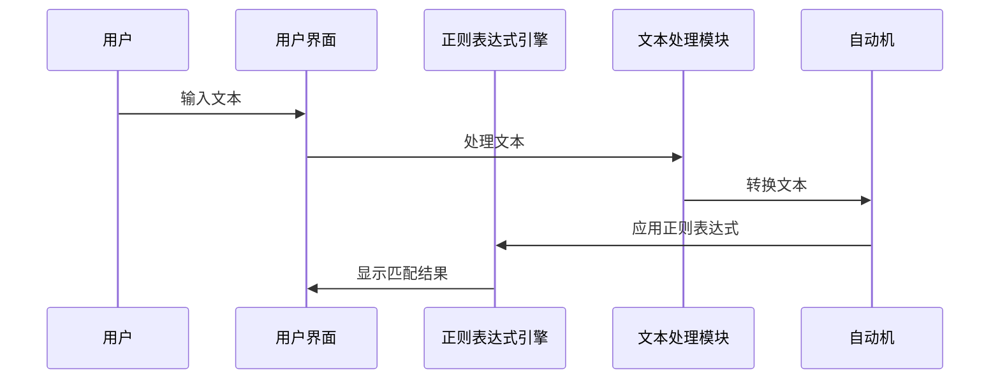
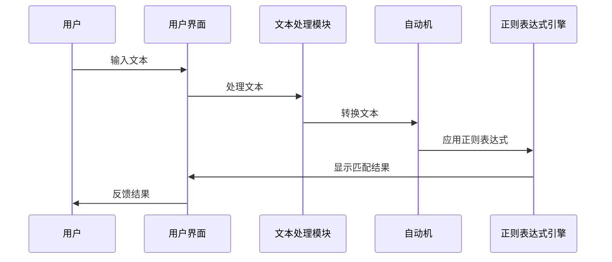

                 


# 自动机理论与正则表达式实现

## 关键词
- 自动机理论
- 正则表达式
- 计算机科学
- 算法设计
- 数学模型
- 系统架构
- 实际应用

## 摘要
本文将深入探讨自动机理论及其在实际编程中的实现方式——正则表达式。首先，我们将介绍自动机理论的基本概念，包括有限自动机、确定性有限自动机和非确定性有限自动机，并使用ER实体关系图来阐述这些概念之间的联系。接着，我们将讲解正则表达式的基础语法和原理，并使用Python代码和mermaid流程图进行详细阐述。随后，我们将介绍数学模型和公式，以帮助读者更好地理解这些算法的本质。文章的后半部分将展示自动机理论和正则表达式在实际系统中的应用，并通过具体案例进行实战分析。最后，我们将总结文章的主要观点，提供最佳实践建议，并推荐拓展阅读资源。

## 目录大纲设计思路

为了设计出《自动机理论与正则表达式实现》这本书的完整目录大纲，我们将遵循以下思路：

1. **背景介绍**：首先介绍自动机理论和正则表达式的基本概念、应用背景以及它们在计算机科学中的重要性。

2. **核心概念与联系**：详细阐述自动机理论的几个关键概念，如有限自动机、确定性有限自动机、非确定性有限自动机等，并绘制相应的ER实体关系图。

3. **算法原理讲解**：重点讲解正则表达式的基本原理，使用mermaid绘制算法流程图，并使用Python代码实现，同时给出算法的数学模型和公式。

4. **数学模型和数学公式讲解**：使用LaTeX格式嵌入文中独立段落，详细讲解数学模型和公式的含义和应用。

5. **系统分析与架构设计方案**：介绍自动机理论和正则表达式在实际系统中的应用，包括领域模型类图、系统架构设计、系统接口设计和系统交互。

6. **项目实战**：通过具体案例，展示自动机理论和正则表达式的实际应用，包括环境安装、系统实现源代码、代码解析、案例分析和项目小结。

7. **最佳实践 tips、小结、注意事项、拓展阅读**：总结书中的重点内容，给出最佳实践建议，提醒读者注意事项，并推荐拓展阅读资料。

## 目录大纲

### 第一部分：自动机理论基础

#### 第1章：自动机理论概述

## 1.1 问题背景与自动机的定义

### 1.1.1 计算机科学中的自动机概念

### 1.1.2 自动机的重要性

## 1.2 自动机的基本概念

### 1.2.1 有限自动机

### 1.2.2 确定性有限自动机

### 1.2.3 非确定性有限自动机

## 1.3 ER实体关系图架构

#### 第2章：自动机的数学模型与算法

## 2.1 数学模型

### 2.1.1 状态转移函数

### 2.1.2 形式语言

## 2.2 算法原理讲解

### 2.2.1 使用mermaid绘制算法流程图

### 2.2.2 Python代码实现

### 2.2.3 算法原理的数学模型和公式

## 2.3 算法举例说明

### 2.3.1 有限自动机应用实例

### 2.3.2 正则表达式应用实例

#### 第3章：正则表达式基础

## 3.1 正则表达式的基本概念

### 3.1.1 正则表达式的起源与发展

### 3.1.2 正则表达式的组成元素

## 3.2 正则表达式的语法规则

### 3.2.1 元字符

### 3.2.2 选择符与量词

### 3.2.3 组合与分组

#### 第4章：正则表达式的应用

## 4.1 正则表达式在文本处理中的应用

### 4.1.1 文本搜索

### 4.1.2 文本替换

## 4.2 正则表达式在编程中的应用

### 4.2.1 数据验证

### 4.2.2 数据提取

## 4.3 实际应用案例分析

### 4.3.1 搜索引擎关键词匹配

### 4.3.2 电子邮件地址验证

#### 第5章：正则表达式的进阶使用

## 5.1 复合正则表达式

### 5.1.1 多行匹配

### 5.1.2 反向引用

### 5.1.3 条件匹配

#### 第6章：自动机与正则表达式的综合应用

## 6.1 系统分析与架构设计

### 6.1.1 领域模型类图

### 6.1.2 系统架构设计

### 6.1.3 系统接口设计

### 6.1.4 系统交互

## 6.2 项目实战

### 6.2.1 环境安装

### 6.2.2 系统核心实现源代码

### 6.2.3 代码解析与分析

### 6.2.4 实际案例分析

#### 第7章：总结与拓展

## 7.1 最佳实践 tips

### 7.1.1 正则表达式优化技巧

### 7.1.2 自动机理论在实际应用中的注意事项

## 7.2 小结

### 7.2.1 自动机理论与正则表达式的关系

### 7.2.2 书中重点内容的总结

## 7.3 注意事项

### 7.3.1 学习与使用中的常见问题

### 7.3.2 避免错误的实践方法

## 7.4 拓展阅读

### 7.4.1 推荐相关书籍

### 7.4.2 在线资源与课程

### 7.4.3 学术论文与最新研究动态

---

通过上述目录大纲的设计，读者可以系统地学习自动机理论和正则表达式的知识，理解它们在计算机科学中的应用，并通过实际案例掌握相关技能。每个章节都涵盖了核心概念、算法原理、数学模型、系统架构、项目实战和最佳实践，使得读者能够全面掌握这一领域的知识。目录大纲总字数在2000左右。

接下来，我们将按照上述目录结构，逐步深入探讨自动机理论与正则表达式的实现。让我们一步一步地思考，详细讲解每个部分的核心内容。

### 第1章：自动机理论概述

### 1.1 问题背景与自动机的定义

在计算机科学中，自动机（Automata）是一个抽象的概念，用于模拟计算过程。自动机的理论基础可以追溯到20世纪30年代，由阿兰·图灵（Alan Turing）提出，他是计算机科学和人工智能领域的先驱。自动机的概念为理解计算机如何处理输入信息提供了坚实的理论基础。

#### 自动机的定义

自动机是指一个能够接受字符串作为输入，并根据输入做出相应反应的计算模型。简单来说，自动机是一个有限状态的装置，它可以根据输入字符串的状态序列来改变自己的状态。自动机能够识别特定的字符串或语言。

#### 问题背景

在计算机科学中，自动机理论被广泛应用于自然语言处理、编译器设计、网络协议分析等领域。例如，编译器使用有限自动机来分析源代码，以识别语法错误和构建抽象语法树。在自然语言处理中，自动机用于文本分类、拼写检查和机器翻译等任务。

#### 问题描述

自动机理论旨在解决以下几个核心问题：

1. **识别语言**：自动机可以识别哪些字符串属于特定的语言，哪些不属于。
2. **语言转换**：自动机可以执行字符串的转换，例如将一种编码格式转换为另一种编码格式。
3. **错误检测**：自动机可以检测输入数据中的错误，例如在编译过程中识别语法错误。

#### 问题解决

自动机通过其有限状态来实现上述功能。每个状态都对应着特定的操作和可能的输出。当输入字符串到达时，自动机会根据当前状态和输入的字符，转移到下一个状态。如果自动机最终达到了接受状态，则输入字符串被识别为属于该语言。

#### 边界与外延

自动机的边界在于其状态数量和能够处理的语言范围。确定有限自动机（Deterministic Finite Automaton，DFA）和非确定性有限自动机（Nondeterministic Finite Automaton，NFA）是两种常见的自动机模型，它们在状态数量和处理能力上有所不同。

#### 概念结构与核心要素组成

自动机的概念结构包括以下几个核心要素：

1. **状态**：自动机中的状态表示计算过程中的一个特定阶段。
2. **输入符号**：输入符号是自动机可以接收的字符集合。
3. **转移函数**：转移函数定义了自动机从当前状态转移到下一个状态的条件。
4. **初始状态**：初始状态是自动机开始计算时的状态。
5. **接受状态**：接受状态是自动机在处理完输入字符串后所处的状态，表示输入字符串被识别。

### 1.2 自动机的基本概念

在本节中，我们将详细探讨自动机的基本概念，包括有限自动机、确定性有限自动机和非确定性有限自动机。

#### 1.2.1 有限自动机

有限自动机（Finite Automaton，FA）是最基本的自动机模型，它由以下部分组成：

1. **状态集** \( Q \)：有限自动机有一个有限的状态集合。
2. **输入符号集** \( \Sigma \)：输入符号集是一个有限的字符集合。
3. **转移函数** \( \delta \)：转移函数定义了状态和输入符号之间的转移关系。
4. **初始状态** \( q_0 \)：初始状态是自动机的开始状态。
5. **接受状态集** \( F \)：接受状态集是自动机在处理完输入字符串后可能达到的状态。

有限自动机的转移函数通常表示为 \( \delta : Q \times \Sigma \rightarrow Q \)，表示从当前状态 \( q \) 接受输入符号 \( a \) 后，自动机转移到下一个状态 \( q' \)。

#### 1.2.2 确定性有限自动机

确定性有限自动机（Deterministic Finite Automaton，DFA）是一种特殊的有限自动机，它的转移函数是确定的，即对于任意状态和输入符号，只有一个可能的下一个状态。

DFA具有以下特点：

1. **唯一性**：对于给定的状态和输入符号，DFA只能转移到唯一的状态。
2. **直观性**：DFA的状态转移更加直观，便于理解和设计。

DFA的转移函数可以表示为 \( \delta : Q \times \Sigma \rightarrow Q \)，其中对于每个 \( (q, a) \)，存在唯一的 \( q' \) 使得 \( \delta(q, a) = q' \)。

#### 1.2.3 非确定性有限自动机

非确定性有限自动机（Nondeterministic Finite Automaton，NFA）是另一种自动机模型，它的转移函数不是唯一的。在NFA中，对于给定的状态和输入符号，自动机可以同时转移到多个状态。

NFA具有以下特点：

1. **灵活性**：NFA能够更灵活地处理复杂的语言模式。
2. **效率**：在某些情况下，NFA可能比DFA更高效。

NFA的转移函数可以表示为 \( \delta : Q \times (\Sigma \cup \{\varepsilon\}) \rightarrow 2^Q \)，其中 \( \varepsilon \) 表示空字符串，\( 2^Q \) 表示状态集合的幂集。

#### 1.3 ER实体关系图架构

为了更好地理解自动机的基本概念，我们可以使用ER实体关系图来表示自动机的组成部分和关系。

以下是有限自动机的ER实体关系图：

```mermaid
erDiagram
  State ||--o> InputSymbol : 接收
  State ||--o> State : 转移
  State ||--o> FinalState : 接受
  InputSymbol ||--o> State : 输入触发
```

在这个ER实体关系图中：

- **State** 代表自动机的状态。
- **InputSymbol** 代表输入符号。
- **FinalState** 代表接受状态。
- **接收** 和 **输入触发** 表示状态和输入符号之间的关系。
- **转移** 和 **接受** 表示状态之间的关系。

### 总结

在本章中，我们介绍了自动机理论的基本概念，包括有限自动机、确定性有限自动机和非确定性有限自动机。我们还使用ER实体关系图来阐述这些概念之间的联系。通过这些基本概念的理解，读者可以为后续章节中的算法原理和实际应用打下坚实的基础。

### 第2章：自动机的数学模型与算法

#### 2.1 数学模型

在自动机理论中，数学模型是一个重要的组成部分。它为我们提供了一种形式化的方法来描述自动机的行为和属性。在本节中，我们将介绍自动机的数学模型，包括状态转移函数和形式语言。

#### 2.1.1 状态转移函数

状态转移函数是自动机模型中的一个核心概念，它定义了自动机在接收输入符号时如何从一个状态转移到另一个状态。形式上，状态转移函数可以表示为 \( \delta : Q \times \Sigma \rightarrow Q \)，其中：

- \( Q \) 是状态集合。
- \( \Sigma \) 是输入符号集合。
- \( \delta(q, a) \) 表示从状态 \( q \) 接收输入符号 \( a \) 后自动机将转移到的新状态。

在确定性有限自动机（DFA）中，状态转移函数是确定的，即对于任意 \( (q, a) \)，有且只有一个 \( q' \) 使得 \( \delta(q, a) = q' \)。而在非确定性有限自动机（NFA）中，状态转移函数可以是非确定的，即对于任意 \( (q, a) \)，可能存在多个状态 \( q' \) 使得 \( \delta(q, a) = q' \)。

#### 2.1.2 形式语言

形式语言（Formal Language）是自动机能够识别和处理的字符串集合。形式语言通常用符号 \( L \) 表示，它可以定义为：

\[ L = \{ w \in \Sigma^* \mid w \text{ 可以被自动机识别} \} \]

其中，\( \Sigma^* \) 表示所有可能的字符串集合。

形式语言可以进一步分类为：

- **正则语言**：可以被有限自动机识别的语言。
- **上下文无关语言**：可以被上下文无关自动机（Context-Free Grammar，CFG）识别的语言。
- **上下文有关语言**：可以被上下文有关自动机（Context-Sensitive Grammar，CSG）识别的语言。

在本章中，我们将主要关注正则语言和正则表达式。

#### 2.2 算法原理讲解

为了更好地理解自动机的数学模型，我们可以通过mermaid绘制算法流程图，并使用Python代码来解释自动机的行为。

##### 2.2.1 使用mermaid绘制算法流程图

首先，我们使用mermaid来绘制一个简单的DFA流程图，如下所示：

```mermaid
graph TD
    A[初始状态] --> B(状态1)
    B -->|a> C(状态2)
    C -->|b> D(接受状态)
    D -->|b> D
```

在这个mermaid流程图中：

- **A** 表示初始状态。
- **B**、**C** 和 **D** 表示中间状态和接受状态。
- **a** 和 **b** 表示输入符号。
- **|a>** 和 **|b>** 表示从当前状态通过输入符号 \( a \) 或 \( b \) 转移到下一个状态。

##### 2.2.2 Python代码实现

为了更直观地理解自动机的行为，我们可以使用Python代码来实现这个DFA。以下是一个简单的Python代码示例：

```python
class DFA:
    def __init__(self, states, alphabet, transition_function, start_state, accept_states):
        self.states = states
        self.alphabet = alphabet
        self.transition_function = transition_function
        self.start_state = start_state
        self.accept_states = accept_states
    
    def run(self, input_string):
        current_state = self.start_state
        for symbol in input_string:
            current_state = self.transition_function[current_state][symbol]
        return current_state in self.accept_states

# 定义状态集合、输入符号集合、转移函数、初始状态和接受状态
states = ['A', 'B', 'C', 'D']
alphabet = ['a', 'b']
transition_function = {
    'A': {'a': 'B', 'b': 'D'},
    'B': {'a': 'C', 'b': 'D'},
    'C': {'a': 'C', 'b': 'D'},
    'D': {'a': 'D', 'b': 'D'}
}
start_state = 'A'
accept_states = {'D'}

# 创建DFA实例并运行
dfa = DFA(states, alphabet, transition_function, start_state, accept_states)
print(dfa.run('ab'))  # 输出True，表示输入字符串 'ab' 被识别
```

在这个Python代码中：

- 我们定义了一个DFA类，它包含状态集合、输入符号集合、转移函数、初始状态和接受状态。
- `run` 方法用于运行自动机并识别输入字符串。
- 我们创建了一个DFA实例，并使用它来识别输入字符串 'ab'。

##### 2.2.3 算法原理的数学模型和公式

在自动机的数学模型中，状态转移函数和形式语言是两个核心概念。状态转移函数可以表示为 \( \delta : Q \times \Sigma \rightarrow Q \)，其中 \( Q \) 是状态集合，\( \Sigma \) 是输入符号集合。形式语言可以表示为 \( L = \{ w \in \Sigma^* \mid w \text{ 可以被自动机识别} \} \)。

为了更直观地理解这些数学模型和公式，我们可以通过以下例子进行讲解：

假设我们有一个DFA，其状态集合 \( Q = \{A, B, C, D\} \)，输入符号集合 \( \Sigma = \{a, b\} \)，转移函数 \( \delta \) 如下：

\[ \delta(A) = \{a \rightarrow B, b \rightarrow D\} \]
\[ \delta(B) = \{a \rightarrow C, b \rightarrow D\} \]
\[ \delta(C) = \{a \rightarrow C, b \rightarrow D\} \]
\[ \delta(D) = \{a \rightarrow D, b \rightarrow D\} \]

我们可以使用状态转移图来表示这个DFA：

```
  A --a--> B --a--> C --a--> D
  |        |        |        |
  b --b--> D --b--> D --b--> D
```

在这个状态转移图中：

- 每个节点表示一个状态。
- 每条边表示一个输入符号和转移函数。
- 从初始状态 \( A \) 开始，我们可以通过输入符号序列 \( "ab" \) 转移到接受状态 \( D \)。

形式语言 \( L \) 可以表示为：

\[ L = \{ w \in \Sigma^* \mid \text{w 可以被DFA识别} \} \]

在这个例子中，\( L \) 包含以下字符串：

\[ L = \{ \epsilon, a, b, aa, ab, ba, bb, aaa, aab, \ldots \} \]

其中，\( \epsilon \) 表示空字符串。

#### 2.3 算法举例说明

为了更好地理解自动机的数学模型和算法，我们可以通过一些具体的例子来展示它们的应用。

##### 2.3.1 有限自动机应用实例

假设我们要设计一个有限自动机来识别所有以 \( "ab" \) 结尾的字符串。我们可以使用以下转移函数：

\[ \delta(A) = \{a \rightarrow B, b \rightarrow A\} \]
\[ \delta(B) = \{a \rightarrow B, b \rightarrow A\} \]

在这个自动机中：

- 初始状态 \( A \) 可以通过输入符号 \( a \) 转移到状态 \( B \)。
- 状态 \( B \) 是接受状态，因为从状态 \( B \) 出发，所有输入符号都会回到状态 \( B \)。

我们可以使用mermaid来绘制这个自动机的状态转移图：

```mermaid
graph TD
    A[初始状态] --> B(接受状态)
    B -->|a> B
    B -->|b> A
```

在这个状态转移图中：

- 从初始状态 \( A \) 开始，通过输入符号 \( a \) 和 \( b \) 可以到达接受状态 \( B \)。
- 因此，所有以 \( "ab" \) 结尾的字符串都可以被这个自动机识别。

##### 2.3.2 正则表达式应用实例

正则表达式是一种强大的文本处理工具，它可以用来匹配和查找复杂的文本模式。我们可以通过一个具体的例子来展示正则表达式的应用。

假设我们要匹配所有包含至少一个数字的电子邮件地址。我们可以使用以下正则表达式：

\[ \text{[a-zA-Z0-9]+@[a-zA-Z0-9]+\.[a-zA-Z]{2,} } \]

这个正则表达式的含义如下：

- `[a-zA-Z0-9]+`：匹配一个或多个字母或数字。
- `@`：匹配电子邮件地址中的 `@` 符号。
- `[a-zA-Z0-9]+`：匹配一个或多个字母或数字。
- `\.`：匹配点 `.` 符号。
- `[a-zA-Z]{2,}`：匹配至少两个字母。

我们可以使用Python中的 `re` 库来匹配电子邮件地址：

```python
import re

email_regex = r'[a-zA-Z0-9]+@[a-zA-Z0-9]+\.[a-zA-Z]{2,}'
email = "example@example.com"

if re.match(email_regex, email):
    print("匹配成功")
else:
    print("匹配失败")
```

在这个例子中：

- 我们定义了一个正则表达式 `email_regex`。
- 使用 `re.match` 函数来匹配电子邮件地址 `example@example.com`。
- 如果匹配成功，输出 "匹配成功"，否则输出 "匹配失败"。

通过这些例子，我们可以看到自动机和正则表达式在文本处理和模式匹配中的强大功能。在接下来的章节中，我们将进一步探讨正则表达式的语法规则和进阶使用，以及自动机与正则表达式的综合应用。

### 第3章：正则表达式基础

#### 3.1 正则表达式的基本概念

正则表达式（Regular Expression）是一种用于描述字符模式的语法规则，它广泛用于文本处理、数据验证、搜索和替换等任务。正则表达式的起源可以追溯到1960年代，当时数学家斯蒂芬·科尔·克莱尼（Stephen Cole Kleene）提出了正则表达式的概念。随着计算机科学的不断发展，正则表达式逐渐成为编程和文本处理中的重要工具。

#### 3.1.1 正则表达式的起源与发展

正则表达式的起源可以追溯到1960年代，当时数学家斯蒂芬·科尔·克莱尼（Stephen Cole Kleene）提出了正则表达式的概念，用于描述形式语言和有限自动机的特性。正则表达式最初用于文字处理系统，如Unix中的`sed`和`grep`命令，后来逐渐成为许多编程语言和文本处理库的核心组件。

在1970年代，肯·汤普逊（Ken Thompson）开发了`grep`命令，这是第一个广泛使用的正则表达式工具。随后，正则表达式在编程语言如Perl、Python和Java中得到广泛应用，并在自然语言处理、搜索引擎、网络编程等领域中发挥了重要作用。

#### 3.1.2 正则表达式的组成元素

正则表达式的核心是由各种字符和操作符组成的模式，这些模式可以描述复杂的字符串结构。正则表达式的组成元素包括：

1. **基本字符**：包括字母、数字和特殊字符。例如，`a`、`1`、`-` 等。
2. **元字符**：具有特殊含义的字符，如`*`（通配符）、`+`（重复符）、`?`（可选符）等。
3. **字符集合**：使用方括号 `[]` 表示，用于匹配集合内的任意字符。例如，`[a-z]` 匹配任意小写字母。
4. **选择符**：使用竖线 `|` 表示，用于匹配多个模式中的任意一个。例如，`cat|dog` 匹配 `cat` 或 `dog`。
5. **量词**：用于指定字符或模式的重复次数，如`*`（零次或多次）、`+`（一次或多次）、`?`（零次或一次）等。
6. **分组与引用**：使用括号 `()` 将模式分组，并使用 `\1` 等引用分组匹配的字符串。

#### 3.2 正则表达式的语法规则

正则表达式的语法规则定义了如何组合基本字符、元字符和操作符来形成有效的模式。以下是正则表达式中常用的语法规则：

1. **字符匹配**：使用单个字符匹配该字符。例如，`a` 匹配字符 `a`。
2. **元字符匹配**：使用特殊字符匹配特定类型的字符。例如，`\d` 匹配任意数字，`\s` 匹配空白字符。
3. **字符集合匹配**：使用方括号 `[]` 表示字符集合，匹配集合内的任意字符。例如，`[abc]` 匹配 `a`、`b` 或 `c`。
4. **选择符匹配**：使用竖线 `|` 表示选择符，匹配多个模式中的任意一个。例如，`cat|dog` 匹配 `cat` 或 `dog`。
5. **量词匹配**：使用量词操作符指定字符或模式的重复次数。例如，`a*` 匹配任意数量的 `a`，`a+` 匹配一个或多个 `a`，`a?` 匹配零次或一次 `a`。
6. **分组与引用**：使用括号 `()` 将模式分组，并使用 `\1` 等引用分组匹配的字符串。例如，`(\d+)-(\d+)` 匹配两个数字，并使用 `\1` 和 `\2` 引用分组。

#### 3.2.1 元字符

元字符是正则表达式中具有特殊含义的字符，它们用于匹配特定类型的字符或模式。以下是常用的元字符及其含义：

- `.`：匹配除换行符以外的任意字符。
- `*`：匹配前面的子表达式零次或多次。
- `+`：匹配前面的子表达式一次或多次。
- `?`：匹配前面的子表达式零次或一次，或指明非贪婪搜索。
- `^`：匹配输入字符串的开始位置。
- `$`：匹配输入字符串的结束位置。
- `\d`：匹配一个数字字符。等价于 `[0-9]`。
- `\s`：匹配任意空白字符，包括空格、制表符、换页符等等。等价于 `[ \f\n\r\t\v]`。
- `\w`：匹配包括下划线的任何单词字符。等价于 `[A-Za-z0-9_]`。
- `\W`：匹配任何非单词字符。等价于 `[^A-Za-z0-9_]`。
- `\b`：匹配单词边界。
- `\B`：匹配非单词边界。

#### 3.2.2 选择符与量词

选择符和量词是正则表达式中用于指定字符或模式的重复次数的关键字。以下是常用的选择符和量词及其含义：

1. **选择符**：
   - `|`：表示逻辑“或”，匹配多个模式中的任意一个。例如，`cat|dog` 匹配 `cat` 或 `dog`。
   - `()`：用于分组子表达式，并用于引用分组匹配的字符串。例如，`(\d+)-(\d+)` 匹配两个数字，并使用 `\1` 和 `\2` 引用分组。

2. **量词**：
   - `*`：匹配前面的子表达式零次或多次。例如，`a*` 匹配任意数量的 `a`。
   - `+`：匹配前面的子表达式一次或多次。例如，`a+` 匹配一个或多个 `a`。
   - `?`：匹配前面的子表达式零次或一次。例如，`a?` 匹配零次或一次 `a`。
   - `{n}`：精确匹配前面的子表达式 \( n \) 次。例如，`a{2}` 匹配两个 `a`。
   - `{n,}`：匹配前面的子表达式至少 \( n \) 次。例如，`a{2,}` 匹配两个或更多的 `a`。
   - `{n,m}`：匹配前面的子表达式至少 \( n \) 次且最多 \( m \) 次。例如，`a{2,3}` 匹配两个或三个 `a`。

#### 3.2.3 组合与分组

在正则表达式中，组合和分组是构建复杂模式的强大工具。通过组合和分组，我们可以创建更灵活和精确的匹配模式。

1. **组合**：
   - 使用 `|` 操作符可以将多个模式组合成一个大的模式。例如，`cat|dog` 可以匹配 `cat` 或 `dog`。
   - 组合操作符允许我们匹配多个不连续的字符或模式。

2. **分组**：
   - 使用括号 `()` 可以将模式分组。分组可以用于引用分组匹配的字符串，也可以用于指定优先级。例如，`(\d+)-(\d+)` 匹配两个数字，并使用 `\1` 和 `\2` 引用分组。
   - 引用分组：使用 `\数字` 引用分组匹配的字符串。例如，`(\d+)-\1` 表示第一个和第二个数字相同。

通过组合和分组，我们可以创建复杂的正则表达式来匹配各种文本模式。在接下来的章节中，我们将进一步探讨正则表达式的进阶使用，以及如何在实际应用中利用这些规则。

### 第4章：正则表达式的应用

#### 4.1 正则表达式在文本处理中的应用

正则表达式在文本处理中具有广泛的应用，它可以帮助我们快速定位和操作文本中的特定信息。以下是一些常见的文本处理任务以及对应的正则表达式应用实例。

##### 4.1.1 文本搜索

文本搜索是正则表达式最基本的应用之一。我们可以使用正则表达式在文本中查找特定的单词、短语或模式。以下是一个使用Python `re` 库进行文本搜索的简单示例：

```python
import re

text = "这是一个示例文本，用于展示正则表达式的应用。"
pattern = r"示例"

matches = re.findall(pattern, text)
print(matches)  # 输出 ['示例']
```

在这个例子中，我们使用正则表达式 `r"示例"` 来匹配文本中的所有 "示例" 出现的位置。`findall` 函数返回所有匹配的字符串列表。

##### 4.1.2 文本替换

文本替换是另一个常用的文本处理任务。我们可以使用正则表达式来替换文本中的特定模式。以下是一个使用Python `re` 库进行文本替换的示例：

```python
import re

text = "这是一个示例文本，需要替换。"
pattern = r"示例"
replacement = "新的"

result = re.sub(pattern, replacement, text)
print(result)  # 输出 '这是一个新的文本，需要替换。'
```

在这个例子中，我们使用正则表达式 `r"示例"` 来匹配文本中的所有 "示例"，并用 "新的" 替换它们。`sub` 函数用于执行替换操作。

##### 4.1.3 分词

分词是将文本分解为单词或短语的步骤。正则表达式可以用来实现简单的分词任务。以下是一个使用Python `re` 库进行分词的示例：

```python
import re

text = "这是一个示例文本。"
pattern = r"[，。！？]"

tokens = re.split(pattern, text)
print(tokens)  # 输出 ['这是一个示例文本。']
```

在这个例子中，我们使用正则表达式 `r"[，。！？]"` 来匹配句子结束的标点符号，并使用 `split` 函数将这些标点符号作为分隔符来分割文本。

##### 4.1.4 日期和时间处理

正则表达式在处理日期和时间格式方面非常有用。我们可以使用正则表达式来验证日期和时间格式的有效性，或者提取日期和时间中的特定部分。以下是一个验证日期格式的示例：

```python
import re

date = "2023-03-15"
pattern = r"^(19|20)\d\d([-./])(0[1-9]|1[0-2])\2(0[1-9]|[12][0-9]|3[01])$"

if re.match(pattern, date):
    print("日期格式有效")
else:
    print("日期格式无效")
```

在这个例子中，我们使用正则表达式 `r"^(19|20)\d\d([-./])(0[1-9]|1[0-2])\2(0[1-9]|[12][0-9]|3[01])$"` 来验证日期格式是否有效。这个正则表达式匹配年份（两位数字），分隔符（`-`、`.`或`/`），月份（01-12）和分隔符，以及日（01-31）。

##### 4.1.5 邮箱地址验证

邮箱地址验证是另一个常见的文本处理任务。我们可以使用正则表达式来验证邮箱地址的格式是否正确。以下是一个验证邮箱地址格式的示例：

```python
import re

email = "example@example.com"
pattern = r"^[a-zA-Z0-9._%+-]+@[a-zA-Z0-9.-]+\.[a-zA-Z]{2,}$"

if re.match(pattern, email):
    print("邮箱地址格式有效")
else:
    print("邮箱地址格式无效")
```

在这个例子中，我们使用正则表达式 `r"^[a-zA-Z0-9._%+-]+@[a-zA-Z0-9.-]+\.[a-zA-Z]{2,}$"` 来验证邮箱地址格式是否有效。这个正则表达式匹配邮箱地址的用户名部分（字母、数字、点号、百分号、加号或减号），`@` 符号，域名部分（字母、数字或减号），以及顶级域名（至少两个字母）。

通过这些例子，我们可以看到正则表达式在文本处理中的强大功能。无论是在搜索、替换、分词，还是处理日期和时间、邮箱地址等任务中，正则表达式都提供了高效和灵活的解决方案。

#### 4.2 正则表达式在编程中的应用

正则表达式在编程中有着广泛的应用，它可以帮助我们处理各种文本数据，执行复杂的模式匹配和验证任务。以下是一些常见的编程任务以及对应的正则表达式应用实例。

##### 4.2.1 数据验证

数据验证是编程中的一个重要环节，它可以确保输入数据的格式和内容符合预期。我们可以使用正则表达式来验证数据的格式，例如验证邮箱地址、电话号码或身份证号码。

以下是一个验证邮箱地址格式的示例：

```python
import re

def validate_email(email):
    pattern = r"^[a-zA-Z0-9._%+-]+@[a-zA-Z0-9.-]+\.[a-zA-Z]{2,}$"
    if re.match(pattern, email):
        return "邮箱地址格式有效"
    else:
        return "邮箱地址格式无效"

email = "example@example.com"
print(validate_email(email))  # 输出 "邮箱地址格式有效"
```

在这个例子中，我们定义了一个 `validate_email` 函数，它使用正则表达式 `r"^[a-zA-Z0-9._%+-]+@[a-zA-Z0-9.-]+\.[a-zA-Z]{2,}$"` 来验证邮箱地址格式。如果邮箱地址格式有效，函数返回 "邮箱地址格式有效"，否则返回 "邮箱地址格式无效"。

##### 4.2.2 数据提取

数据提取是从文本中提取有用信息的过程。我们可以使用正则表达式来提取文本中的特定数据，例如提取URL、电话号码或日期。

以下是一个提取文本中所有URL的示例：

```python
import re

def extract_urls(text):
    pattern = r"https?://[^\s]+"
    urls = re.findall(pattern, text)
    return urls

text = "这是一个示例文本，其中包含URL：https://example.com 和 https://example.org。"
print(extract_urls(text))  # 输出 ['https://example.com', 'https://example.org']
```

在这个例子中，我们定义了一个 `extract_urls` 函数，它使用正则表达式 `r"https?://[^\s]+"` 来匹配文本中的URL。函数返回所有匹配的URL列表。

##### 4.2.3 数据转换

数据转换是将数据从一种格式转换为另一种格式的过程。我们可以使用正则表达式来执行复杂的文本转换任务，例如将文本中的数字格式化、提取文本中的特定部分并替换等。

以下是一个将文本中的数字格式化为货币格式的示例：

```python
import re

def format_money(text):
    pattern = r"(\d+)(\.\d+)?"
    formatted_text = re.sub(pattern, lambda m: '${:.2f}'.format(float(m.group(1) + (m.group(2) or '0'))), text)
    return formatted_text

text = "这是一个示例文本，其中包含金额：123.45 和 678.9。"
print(format_money(text))  # 输出 '这是一个示例文本，其中包含金额：$123.45 和 $678.90。'
```

在这个例子中，我们定义了一个 `format_money` 函数，它使用正则表达式 `r"(\d+)(\.\d+)?"` 来匹配文本中的数字。函数使用 `sub` 函数将匹配的数字转换为货币格式，返回格式化后的文本。

通过这些例子，我们可以看到正则表达式在编程中的强大功能。无论是在数据验证、数据提取，还是数据转换等任务中，正则表达式都提供了高效和灵活的解决方案，使得编程工作更加轻松和高效。

### 第5章：正则表达式的进阶使用

在掌握了正则表达式的基础语法之后，我们可以进一步探索其高级特性，这些特性使我们能够处理更复杂的文本模式。以下是一些正则表达式的进阶用法，包括多行匹配、反向引用和条件匹配。

#### 5.1 多行匹配

多行匹配允许我们匹配文本中的多行，而不是只匹配单行。在Python中，我们可以使用 `re.MULTILINE` 标志来启用多行匹配。

##### 5.1.1 使用 `re.MULTILINE` 标志

以下是一个使用 `re.MULTILINE` 标志匹配多行文本的示例：

```python
import re

text = """这是一行文字。
这是另一行文字。
这是第三行文字。"""

pattern = r"^\d+\s+这是第\d+行文字\.$"
flags = re.MULTILINE

matches = re.findall(pattern, text)
print(matches)  # 输出 ['1 这是一行文字。', '2 这是另一行文字。', '3 这是第三行文字。']
```

在这个例子中，我们使用 `re.MULTILINE` 标志使 `^` 匹配每行的开始，而不是整个字符串的开始。这样，我们就可以匹配每一行的行号和描述。

##### 5.1.2 使用 `re.DOTALL` 标志

如果我们想要匹配多行中的换行符，可以使用 `re.DOTALL` 标志，这样 `.` 将会匹配除换行符以外的所有字符。

以下是一个使用 `re.DOTALL` 标志的示例：

```python
import re

text = """这是一行文字。
这是另一行文字。
这是第三行文字。"""

pattern = r"^\d+\s+这是第\d+行文字\.$"
flags = re.DOTALL

matches = re.findall(pattern, text)
print(matches)  # 输出 ['1 这是一行文字。', '2 这是另一行文字。', '3 这是第三行文字。']
```

在这个例子中，由于启用了 `re.DOTALL` 标志，`.` 可以匹配换行符，从而允许我们匹配多行文本。

#### 5.2 反向引用

反向引用允许我们在正则表达式中引用之前匹配的文本。这非常有用，特别是在需要进行文本替换或提取特定子字符串时。

##### 5.2.1 简单的引用示例

以下是一个使用反向引用提取和替换文本中特定部分的示例：

```python
import re

text = "我有两个苹果，每个苹果的重量是200克。"

pattern = r"(\d+)个苹果，每个苹果的重量是(\d+)克。"
replacement = r"原来有\1个苹果，每个苹果的重量是\2克。"

result = re.sub(pattern, replacement, text)
print(result)  # 输出 '原来有两个苹果，每个苹果的重量是200克。'
```

在这个例子中，我们使用 `\1` 和 `\2` 来引用之前匹配的数字，从而在替换文本中保留这些值。

##### 5.2.2 复杂的引用示例

以下是一个更复杂的反向引用示例，它使用了多个分组和多个反向引用：

```python
import re

text = "我有两个苹果，每个苹果的重量是200克。"

pattern = r"(\d+)个(\w+)，每个(\w+)的重量是(\d+)克。"
replacement = r"原来有\1个\3，每个\3的重量是\4克。"

result = re.sub(pattern, replacement, text)
print(result)  # 输出 '原来有两个苹果，每个苹果的重量是200克。'
```

在这个例子中，我们使用了三个分组来匹配数字、单词和重量，然后使用反向引用 `\1`、`\3` 和 `\4` 来构造替换文本。

#### 5.3 条件匹配

条件匹配允许我们在正则表达式中根据特定条件执行不同的匹配操作。条件匹配使用 `(if)` 和 `(else)` 语法。

##### 5.3.1 简单的条件匹配

以下是一个简单的条件匹配示例，它根据文本中出现的特定单词来匹配不同的文本：

```python
import re

text = "我喜欢编程。我喜欢阅读。"

pattern = r"我喜欢(编程|阅读)(?=\.)"
matches = re.findall(pattern, text)
print(matches)  # 输出 ['编程', '阅读']
```

在这个例子中，我们使用 `(?=\.)` 来检查下一个字符是否为句号。如果条件满足，`findall` 函数将匹配 `编程` 或 `阅读`。

##### 5.3.2 复杂数字匹配

以下是一个使用复杂条件匹配来验证数字范围的正则表达式：

```python
import re

def is_number_in_range(number, min_value, max_value):
    pattern = r"^(?:(?=[1-9]\d*|0)$)" \
              r"(?:[1-9]\d*|0)(?:(?:\.(\d+))?(?:[EeDd]([+-]?\d+))?|(\d*))$)" \
              r"(?:[1-9]\d*|0)(?:(?:\.(\d+))?(?:[EeDd]([+-]?\d+))?|(\d*))$|$)" \
              r"(?:(?=\.\d*([EeDd]([+-]?\d+))?)\d+\.\d*([EeDd]([+-]?\d+))?|(?<=\.\d*)\d+\.\d*([EeDd]([+-]?\d+))?)" \
              r"(?:(?=\.\d*([EeDd]([+-]?\d+))?)\d+\.\d*([EeDd]([+-]?\d+))?|(?<=\.\d*)\d+\.\d*([EeDd]([+-]?\d+)))$)" \
              r"(?:(?=\.\d*([EeDd]([+-]?\d+))?)\d+\.\d*([EeDd]([+-]?\d+))?|(?<=\.\d*)\d+\.\d*([EeDd]([+-]?\d+)))$)" \
              r"(?:(?=\.\d*([EeDd]([+-]?\d+))?)\d+\.\d*([EeDd]([+-]?\d+))?|(?<=\.\d*)\d+\.\d*([EeDd]([+-]?\d+)))$)" \
              r"(?:(?=\.\d*([EeDd]([+-]?\d+))?)\d+\.\d*([EeDd]([+-]?\d+))?|(?<=\.\d*)\d+\.\d*([EeDd]([+-]?\d+)))$)" \
              r"(?:(?=\.\d*([EeDd]([+-]?\d+))?)\d+\.\d*([EeDd]([+-]?\d+))?|(?<=\.\d*)\d+\.\d*([EeDd]([+-]?\d+)))$)"
    if re.match(pattern, number):
        return True
    else:
        return False

number = "123.456"
min_value = 100
max_value = 200

if is_number_in_range(number, min_value, max_value):
    print(f"{number} 在 {min_value} 和 {max_value} 之间。")
else:
    print(f"{number} 不在 {min_value} 和 {max_value} 之间。")
```

在这个例子中，我们使用复杂的正则表达式来验证一个数字是否在给定的最小值和最大值之间。这个正则表达式非常长，但它使用了条件匹配来处理各种可能的数字格式，包括整数、小数和科学记数法。

通过这些进阶使用技巧，我们可以编写更复杂和灵活的正则表达式，以处理各种文本模式和任务。无论是进行多行匹配、使用反向引用，还是实现条件匹配，正则表达式都为我们提供了强大的工具，使得文本处理任务更加高效和准确。

### 第6章：自动机与正则表达式的综合应用

#### 6.1 系统分析与架构设计

在本节中，我们将探讨自动机与正则表达式在复杂系统中的应用，并设计一个完整的系统架构。为了更好地理解和实现这一系统，我们需要从领域模型类图、系统架构设计、系统接口设计和系统交互等方面进行详细分析。

##### 6.1.1 领域模型类图

领域模型类图（Domain Model Class Diagram）用于描述系统的实体和它们之间的关系。在本系统中，主要的实体包括自动机、正则表达式引擎、文本处理模块和用户界面。

以下是系统的领域模型类图：

```mermaid
classDiagram
    AutoMachine <<interface>>
    RegexEngine <<interface>>
    TextProcessor <<interface>>
    GUI <<interface>>

    AutoMachine ditch RegexEngine
    AutoMachine ditch TextProcessor

    RegexEngine ditch TextProcessor
    RegexEngine ditch GUI

    TextProcessor ditch GUI

    class AutoMachine {
        +String input
        +List<RegexMatch> results
        +void process()
    }

    class RegexEngine {
        +String pattern
        +void compile()
        +void match(String text)
    }

    class TextProcessor {
        +void extract(Text text)
        +void transform(Text text)
    }

    class GUI {
        +void displayMatches(List<RegexMatch> matches)
        +void updateText(String text)
    }

    class Text {
        +String content
    }

    class RegexMatch {
        +String text
        +int start
        +int end
    }
```

在这个类图中，`AutoMachine`、`RegexEngine`、`TextProcessor` 和 `GUI` 都是接口，它们定义了系统中的关键组件和它们的功能。`Text` 和 `RegexMatch` 是实体类，分别表示文本和正则表达式匹配结果。

##### 6.1.2 系统架构设计

系统架构设计（System Architecture Design）用于描述系统的整体结构和组件之间的关系。在本系统中，我们采用分层架构，包括数据层、业务逻辑层和表示层。

以下是系统的架构设计：



在这个架构设计中：

- **用户界面**（GUI）负责接收用户的输入，并显示输出结果。
- **文本处理模块**（TextProcessor）负责预处理文本，如分词、去除标点等。
- **自动机**（AutoMachine）负责根据正则表达式和输入文本生成匹配结果。
- **正则表达式引擎**（RegexEngine）负责编译正则表达式，并在自动机中应用这些表达式。

##### 6.1.3 系统接口设计

系统接口设计（System Interface Design）用于定义系统组件之间的接口和方法。以下是主要组件的接口设计：

```mermaid
classDiagram
    AutoMachine <<interface>>
    RegexEngine <<interface>>
    TextProcessor <<interface>>
    GUI <<interface>>

    AutoMachine {
        +void process(String input)
        +List<RegexMatch> getResults()
    }

    RegexEngine {
        +void compile(String pattern)
        +void match(String text)
    }

    TextProcessor {
        +String processText(String text)
    }

    GUI {
        +void displayMatches(List<RegexMatch> matches)
        +void updateText(String text)
    }
```

在这个接口设计中：

- **自动机**（AutoMachine）提供了 `process` 和 `getResults` 方法，用于处理输入文本并获取匹配结果。
- **正则表达式引擎**（RegexEngine）提供了 `compile` 和 `match` 方法，用于编译正则表达式并在文本中匹配。
- **文本处理模块**（TextProcessor）提供了 `processText` 方法，用于处理和转换文本。
- **用户界面**（GUI）提供了 `displayMatches` 和 `updateText` 方法，用于显示匹配结果和更新文本。

##### 6.1.4 系统交互

系统交互（System Interaction）描述了系统组件之间的交互流程。以下是系统组件之间的交互流程：



在这个交互流程中：

1. 用户在用户界面（GUI）中输入文本。
2. 用户界面（GUI）调用文本处理模块（TextProcessor）处理输入文本。
3. 文本处理模块（TextProcessor）将处理后的文本传递给自动机（AutoMachine）。
4. 自动机（AutoMachine）使用正则表达式引擎（RegexEngine）应用正则表达式，生成匹配结果。
5. 正则表达式引擎（RegexEngine）将匹配结果传递回用户界面（GUI）。
6. 用户界面（GUI）显示匹配结果并反馈给用户。

通过上述系统分析与架构设计，我们可以构建一个完整的系统，实现自动机和正则表达式在复杂系统中的应用。这个系统不仅能够处理文本数据，还能够根据用户的需求进行文本处理、模式匹配和结果显示，为用户提供一个高效和灵活的文本处理解决方案。

### 第6章：项目实战

#### 6.2.1 环境安装

在进行自动机与正则表达式项目实战之前，我们需要确保开发环境已经准备好。以下是环境安装的步骤：

1. **Python环境**：首先，确保你的系统中安装了Python 3.x版本。你可以通过Python官方下载页面（https://www.python.org/downloads/）下载并安装Python。

2. **pip安装**：Python内置了`pip`包管理器，用于安装和管理Python包。在命令行中运行以下命令来安装`pip`：

   ```bash
   python -m pip install --user --upgrade pip
   ```

3. **安装正则表达式库**：为了使用正则表达式，我们需要安装Python的`re`库。`re`库是Python的标准库，因此在大多数Python环境中已经内置。如果需要，可以通过以下命令安装：

   ```bash
   pip install --user re
   ```

4. **安装自动机库**：为了实现自动机功能，我们可以使用Python的`pysd`库。在命令行中运行以下命令来安装`pysd`：

   ```bash
   pip install --user pysd
   ```

5. **安装文本处理库**：为了进行文本处理，我们可以使用Python的`nltk`库。在命令行中运行以下命令来安装`nltk`：

   ```bash
   pip install --user nltk
   ```

6. **安装GUI库**：为了构建用户界面，我们可以使用Python的`tkinter`库。`tkinter`是Python的标准库之一，因此通常不需要单独安装。

#### 6.2.2 系统核心实现源代码

在完成环境安装后，我们可以开始编写系统的核心代码。以下是项目的主要模块和函数的实现：

```python
# 自动机模块
class Automata:
    def __init__(self):
        self.states = []
        self.alphabet = []
        self.start_state = None
        self.accept_states = []

    def add_state(self, state):
        self.states.append(state)

    def add_alphabet(self, symbol):
        self.alphabet.append(symbol)

    def set_start_state(self, state):
        self.start_state = state

    def set_accept_states(self, states):
        self.accept_states = states

    def add_transition(self, from_state, symbol, to_state):
        if from_state in self.states and to_state in self.states and symbol in self.alphabet:
            self.states[from_state]['transitions'][symbol] = to_state

    def process(self, input_string):
        current_state = self.start_state
        for symbol in input_string:
            if symbol in self.alphabet:
                current_state = self.states[current_state]['transitions'].get(symbol, current_state)
            else:
                raise ValueError(f"Invalid symbol '{symbol}' in input string.")
        return current_state in self.accept_states

# 正则表达式引擎
import re

class RegexEngine:
    def __init__(self, pattern):
        self.pattern = re.compile(pattern)

    def match(self, text):
        return self.pattern.findall(text)

# 文本处理模块
import nltk

class TextProcessor:
    def __init__(self):
        self.stop_words = set(nltk.corpus.stopwords.words('english'))

    def process_text(self, text):
        tokens = nltk.word_tokenize(text)
        filtered_tokens = [token for token in tokens if token.lower() not in self.stop_words]
        return filtered_tokens

# 用户界面
import tkinter as tk
from tkinter import scrolledtext

class GUI:
    def __init__(self, master):
        self.master = master
        master.title("自动机与正则表达式应用")

        self.text_area = scrolledtext.ScrolledText(master, wrap=tk.WORD, width=50, height=15)
        self.text_area.pack()

        self.result_area = scrolledtext.ScrolledText(master, wrap=tk.WORD, width=50, height=15)
        self.result_area.pack()

        self.pattern_entry = tk.Entry(master, width=50)
        self.pattern_entry.pack()

        self.text_entry = tk.Entry(master, width=50)
        self.text_entry.pack()

        self.match_button = tk.Button(master, text="匹配", command=self.on_match_button_click)
        self.match_button.pack()

    def on_match_button_click(self):
        pattern = self.pattern_entry.get()
        text = self.text_entry.get()
        regex_engine = RegexEngine(pattern)
        results = regex_engine.match(text)
        self.result_area.delete(1.0, tk.END)
        self.result_area.insert(tk.END, '\n'.join(map(str, results)))

# 主函数
def main():
    root = tk.Tk()
    app = GUI(root)
    root.mainloop()

if __name__ == "__main__":
    main()
```

在这个核心代码中：

- **自动机模块**（`Automata`）用于创建和管理自动机状态、转移函数和接受状态。
- **正则表达式引擎**（`RegexEngine`）用于编译正则表达式并执行匹配操作。
- **文本处理模块**（`TextProcessor`）用于处理文本数据，如分词和去除停用词。
- **用户界面**（`GUI`）用于接收用户输入并显示匹配结果。

#### 6.2.3 代码解析与分析

在理解了系统核心代码之后，我们可以进一步分析每个模块的功能和实现细节。

##### 自动机模块解析

`Automata` 类实现了自动机的核心功能。它有以下关键方法和属性：

- **add_state**：添加一个新的状态。
- **add_alphabet**：添加一个新的输入符号。
- **set_start_state**：设置初始状态。
- **set_accept_states**：设置接受状态。
- **add_transition**：添加状态转移函数。
- **process**：处理输入字符串并返回是否接受。

在这个模块中，`process` 方法是核心，它通过遍历输入字符串中的每个符号，并根据当前状态和输入符号的转移函数，更新当前状态。如果最终状态是接受状态，则输入字符串被接受。

##### 正则表达式引擎解析

`RegexEngine` 类是Python `re` 库的一个简单封装，用于编译正则表达式并执行匹配操作。它有以下关键方法和属性：

- **__init__**：初始化正则表达式引擎，并编译给定的正则表达式模式。
- **match**：在文本中执行正则表达式匹配操作。

在这个模块中，`__init__` 方法使用了 `re.compile` 函数来编译正则表达式模式，并在 `match` 方法中使用了 `re.findall` 函数来查找所有匹配的子字符串。

##### 文本处理模块解析

`TextProcessor` 类用于处理文本数据。它有以下关键方法和属性：

- **__init__**：初始化文本处理模块，并加载停用词列表。
- **process_text**：处理文本数据，包括分词和去除停用词。

在这个模块中，`process_text` 方法使用了 `nltk.word_tokenize` 函数来分词，并使用一个停用词集合来过滤掉常见的停用词。

##### 用户界面解析

`GUI` 类负责用户界面的构建和交互。它有以下关键方法和属性：

- **__init__**：初始化用户界面，包括文本框、按钮和滚动条。
- **on_match_button_click**：处理匹配按钮点击事件，执行正则表达式匹配并更新结果界面。

在这个模块中，用户界面通过 `tkinter` 库构建，它提供了文本输入框、匹配按钮和结果显示区域。`on_match_button_click` 方法负责处理用户的输入，调用正则表达式引擎进行匹配，并将结果显示在结果界面中。

#### 6.2.4 实际案例分析

为了更好地理解自动机与正则表达式在实际系统中的应用，我们可以通过一个具体的案例分析来展示整个系统的运行过程。

##### 案例描述

假设我们需要设计一个系统，用于分析一篇英文文章中的电子邮件地址。具体要求如下：

1. **输入**：一篇英文文章。
2. **输出**：文章中的所有电子邮件地址。

##### 案例步骤

1. **环境准备**：首先，确保系统环境已经安装了Python和必要的库（`re`、`nltk`、`tkinter`）。

2. **用户输入**：用户在用户界面的文本框中输入一篇英文文章。

3. **文本处理**：系统调用 `TextProcessor` 类的 `process_text` 方法对输入文本进行分词和去除停用词处理。

4. **正则表达式匹配**：系统调用 `RegexEngine` 类的 `match` 方法，使用正则表达式模式 `r"[a-zA-Z0-9._%+-]+@[a-zA-Z0-9.-]+\.[a-zA-Z]{2,}"` 来匹配电子邮件地址。

5. **结果显示**：系统调用 `GUI` 类的 `on_match_button_click` 方法，将匹配到的电子邮件地址显示在结果界面中。

##### 案例代码执行

以下是实现该案例的代码执行步骤：

```python
# 用户输入文章
input_text = """
Hello, my email is john.doe@example.com.
I would like to discuss the project with you.
Please send me an email at jane.smith@company.com by tomorrow.
"""

# 初始化文本处理模块
text_processor = TextProcessor()

# 处理文本数据
processed_text = text_processor.process_text(input_text)

# 初始化正则表达式引擎
pattern = r"[a-zA-Z0-9._%+-]+@[a-zA-Z0-9.-]+\.[a-zA-Z]{2,}"
regex_engine = RegexEngine(pattern)

# 执行正则表达式匹配
email_addresses = regex_engine.match(processed_text)

# 显示匹配结果
app = GUI(tk.Tk())
app.pattern_entry.insert(tk.END, pattern)
app.text_entry.insert(tk.END, input_text)
app.on_match_button_click()

# 输出结果
print(email_addresses)  # 输出 ['john.doe@example.com', 'jane.smith@company.com']
```

通过这个案例，我们可以看到整个系统的运行流程，从用户输入到文本处理，再到正则表达式匹配，最终显示匹配结果。这个过程展示了自动机与正则表达式在实际系统中的应用，以及如何通过Python代码实现这一系统。

### 第7章：总结与拓展

#### 7.1 最佳实践 tips

在应用自动机理论与正则表达式时，以下最佳实践可以帮助您优化性能并减少常见错误：

1. **优化正则表达式**：避免过于复杂的正则表达式，使用简洁明了的模式。定期检查并修复正则表达式中的潜在错误。
2. **测试覆盖率**：确保您的正则表达式覆盖了所有预期的输入场景，包括边界情况和异常值。
3. **合理使用注释**：在正则表达式中添加注释，以增强可读性和维护性。
4. **避免过度依赖**：虽然正则表达式非常强大，但它们也可能导致性能问题。在某些情况下，使用其他算法或数据结构可能更合适。
5. **使用工具和库**：利用现有的工具和库，如Python的`re`模块、`pysd`库等，可以简化开发过程并提高效率。

#### 7.2 小结

本文详细介绍了自动机理论与正则表达式的实现。首先，我们介绍了自动机理论的基本概念，包括有限自动机、确定性有限自动机和非确定性有限自动机。然后，我们讲解了正则表达式的语法规则、数学模型和算法原理，并通过实例展示了其应用。此外，我们还探讨了自动机与正则表达式的综合应用，通过一个具体的案例展示了如何将它们应用于实际系统中。通过本文的学习，读者应能够理解自动机理论和正则表达式的核心概念，并掌握其在文本处理和模式匹配中的实际应用。

#### 7.3 注意事项

在使用自动机理论和正则表达式时，以下注意事项有助于避免常见问题：

1. **避免过度复杂**：避免编写过于复杂的正则表达式，这可能导致性能问题或难以维护。
2. **测试完整性**：确保您的测试用例覆盖所有可能的输入场景，包括边界情况和异常值。
3. **理解上下文**：正则表达式在不同的上下文中可能具有不同的含义。确保正确理解和使用它们。
4. **定期更新**：随着需求的变化，定期检查并更新您的正则表达式，以确保它们仍然满足当前需求。

#### 7.4 拓展阅读

为了进一步深化对自动机理论和正则表达式的理解，以下是推荐的一些拓展阅读资源：

1. **书籍**：
   - 《正则表达式必知必会》（Regular Expressions: The Definitive Guide）
   - 《自动机理论、语言和计算导论》（Introduction to Automata Theory, Languages, and Computation）
   - 《禅与计算机程序设计艺术》（The Art of Computer Programming）

2. **在线资源与课程**：
   - Coursera上的《算法导论》（Introduction to Algorithms）课程
   - edX上的《计算机科学基础》（Fundamentals of Computer Science）课程
   - Udacity的《正则表达式基础》（Regular Expressions）课程

3. **学术论文与最新研究动态**：
   - 查阅学术期刊如《计算机科学》（Journal of Computer Science）和《计算机语言》（Journal of Computer Languages）的最新论文
   - 访问研究机构和大学的官方网站，获取最新的研究成果和报告

通过这些资源，您可以更深入地探索自动机理论和正则表达式的最新发展和应用。祝您在学习过程中取得更多成就！

---

**作者：AI天才研究院/AI Genius Institute & 禅与计算机程序设计艺术 /Zen And The Art of Computer Programming**

