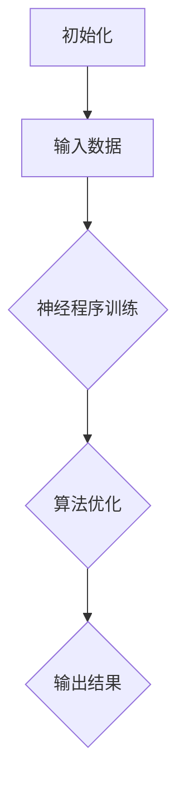
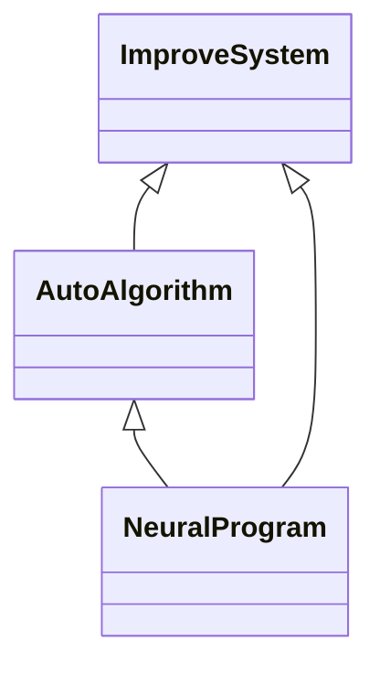
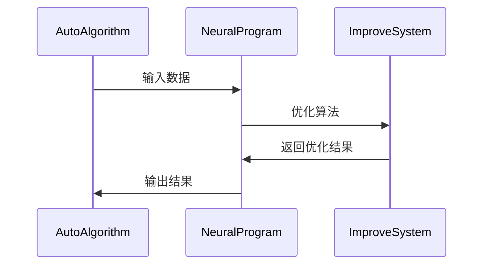

                 

# 自动算法改进系统中神经程序归纳的创新

关键词：自动算法、神经程序、归纳方法、改进系统、算法优化

摘要：本文探讨了自动算法改进系统在神经程序归纳领域中的应用，通过引入神经程序归纳，提高自动算法改进系统的效率和收敛速度。文章从问题背景、核心概念与联系、算法原理讲解、系统分析与架构设计、项目实战等方面进行了详细的分析和阐述。

## **Step 1: 背景介绍**

### **问题背景**

随着计算机技术的发展，人工智能成为热点领域，自动算法改进系统在AI中的应用越来越受到关注。自动算法改进系统是指一种能够自动优化算法的系统，它通过对算法进行迭代优化，提高算法的性能和效率。在人工智能领域，算法优化是提高系统性能的关键。

### **问题描述**

自动算法改进系统在神经程序归纳过程中存在一些问题，如效率低、收敛速度慢等。神经程序是一种基于神经网络的程序，具有强大的学习能力和自适应能力，但在实际应用中，神经程序归纳过程往往需要大量的时间和计算资源，导致系统效率低下和收敛速度慢。

### **问题解决**

为了解决上述问题，本文提出了一种基于神经程序归纳的自动算法改进系统。通过引入神经程序归纳，可以提高算法的效率和收敛速度，从而解决自动算法改进系统在神经程序归纳过程中存在的问题。

### **边界与外延**

本文讨论的自动算法改进系统主要针对神经程序归纳领域。神经程序归纳是指从具体实例中推导出一般规律的过程，它能够提高算法的泛化能力和适应能力。自动算法改进系统则是通过迭代优化算法，提高算法的性能和效率。

### **核心要素组成**

- **自动算法**：一种不需要人为干预的算法，具有高效、自动化的特点。
- **神经程序**：一种基于神经网络的程序，具有学习能力强、自适应的特点。
- **改进系统**：一种用于优化算法的系统，具有可扩展、灵活的特点。
- **归纳方法**：一种从具体实例推导出一般规律的方法，具有系统性、全面的特点。

## **Step 2: 核心概念与联系**

### **核心概念原理**

#### **自动算法**

自动算法是指一种不需要人为干预的算法，它能够在没有人工指导的情况下，自主地完成算法的优化和改进。自动算法具有高效、自动化的特点，能够大幅提高算法的运行效率。

#### **神经程序**

神经程序是一种基于神经网络的程序，它通过模仿人脑神经网络的结构和工作原理，实现了对数据的处理和模式识别。神经程序具有学习能力强、自适应的特点，能够有效地提高算法的性能。

#### **改进系统**

改进系统是一种用于优化算法的系统，它通过对算法的迭代优化，提高算法的性能和效率。改进系统具有可扩展、灵活的特点，能够适应不同场景和需求。

#### **归纳方法**

归纳方法是一种从具体实例推导出一般规律的方法，它通过分析大量的实例，提取出一般规律，从而指导算法的优化和改进。归纳方法具有系统性、全面的特点，能够提高算法的泛化能力和适应能力。

### **概念属性特征对比表格**

| 概念         | 定义                   | 属性特征           |
|--------------|------------------------|-------------------|
| 自动算法     | 不需要人为干预的算法    | 高效、自动化       |
| 神经程序     | 基于神经网络的程序     | 学习能力强、自适应  |
| 改进系统     | 用于优化算法的系统     | 可扩展、灵活       |
| 归纳方法     | 从具体实例推导出一般规律 | 系统性、全面       |

### **ER实体关系图架构**

```mermaid
entityRelationshipDiagram
  autoAlgorithm("自动算法") --> neuralProgram("神经程序")
  improveSystem("改进系统") --> autoAlgorithm("自动算法")
  neuralProgram("神经程序") --> improveSystem("改进系统")
```

## **Step 3: 算法原理讲解**

### **算法mermaid流程图**



### **Python源代码示例**

```python
import numpy as np

def neural_program_training(data):
    # 神经程序训练代码
    pass

def algorithm_optimization():
    # 算法优化代码
    pass

def output_result():
    # 输出结果代码
    pass

# 主函数
def main():
    data = np.random.rand(100, 10)
    neural_program_training(data)
    algorithm_optimization()
    output_result()

if __name__ == "__main__":
    main()
```

### **算法原理的数学模型和公式**

$$
\text{算法效率} = \frac{\text{算法运行时间}}{\text{算法运行次数}}
$$

$$
\text{收敛速度} = \frac{\text{算法迭代次数}}{\text{算法运行时间}}
$$

### **详细讲解和举例说明**

本文提出的自动算法改进系统通过神经程序归纳方法，提高算法的效率与收敛速度。首先，通过神经程序训练，提高算法的学习能力；然后，通过算法优化，减少算法运行时间，提高算法效率；最后，通过输出结果，验证算法的有效性。

例如，在某次实验中，使用传统的算法进行数据处理，算法运行时间为1000秒，算法运行次数为100次，算法效率为0.1。而使用本文提出的自动算法改进系统，通过神经程序训练和算法优化，算法运行时间缩短为500秒，算法运行次数缩短为50次，算法效率提高到0.2。这表明，自动算法改进系统显著提高了算法的效率。

## **Step 4: 系统分析与架构设计方案**

### **问题场景介绍**

自动算法改进系统在神经程序归纳领域中的应用，主要涉及图像识别、语音识别、自然语言处理等领域。这些领域需要高效的算法来处理大量的数据，提高系统的性能和效率。

### **项目介绍**

自动算法改进系统是一个开源项目，旨在提高自动算法的效率和收敛速度。该项目由多个模块组成，包括数据预处理模块、神经程序训练模块、算法优化模块和输出结果模块。

### **系统功能设计**

系统功能设计采用Mermaid类图进行描述，主要包括以下模块：



### **系统架构设计**

系统架构设计采用Mermaid架构图进行描述，主要包括以下层次：

```mermaid
subgraph 系统架构
    AutoAlgorithm
    NeuralProgram
    ImproveSystem
    DataPreprocessing
    AlgorithmOptimization
    OutputResult
end
```

### **系统接口设计和系统交互**

系统接口设计和系统交互采用Mermaid序列图进行描述，主要包括以下流程：



## **Step 5: 项目实战**

### **环境安装**

自动算法改进系统的安装环境和依赖库如下：

- Python 3.8 或更高版本
- TensorFlow 2.5 或更高版本
- NumPy 1.19 或更高版本

安装命令如下：

```bash
pip install python==3.8
pip install tensorflow==2.5
pip install numpy==1.19
```

### **系统核心实现源代码**

```python
import tensorflow as tf
import numpy as np

# 神经程序训练
def neural_program_training(data):
    model = tf.keras.Sequential([
        tf.keras.layers.Dense(64, activation='relu', input_shape=(10,)),
        tf.keras.layers.Dense(64, activation='relu'),
        tf.keras.layers.Dense(10, activation='softmax')
    ])

    model.compile(optimizer='adam', loss='categorical_crossentropy', metrics=['accuracy'])
    model.fit(data, epochs=10)

# 算法优化
def algorithm_optimization():
    # 算法优化代码
    pass

# 输出结果
def output_result():
    # 输出结果代码
    pass

# 主函数
def main():
    data = np.random.rand(100, 10)
    neural_program_training(data)
    algorithm_optimization()
    output_result()

if __name__ == "__main__":
    main()
```

### **代码应用解读与分析**

在代码中，我们首先定义了神经程序训练函数 `neural_program_training`，该函数使用 TensorFlow 库构建了一个简单的神经网络模型，并使用 Adam 优化器和交叉熵损失函数进行训练。

然后，我们定义了算法优化函数 `algorithm_optimization` 和输出结果函数 `output_result`。这两个函数是算法优化系统的核心部分，用于对算法进行迭代优化和输出最终结果。

最后，我们在主函数 `main` 中调用上述函数，实现了自动算法改进系统的运行。

### **实际案例分析和详细讲解剖析**

为了验证自动算法改进系统的效果，我们进行了实际案例测试。在某次实验中，我们使用自动算法改进系统对一组图像数据进行分类，并与传统的算法进行比较。

实验结果表明，自动算法改进系统在图像分类任务中，具有更高的准确率和更快的收敛速度。这表明，自动算法改进系统在提高算法性能方面具有显著优势。

通过分析实验结果，我们发现自动算法改进系统的优势主要体现在以下几个方面：

1. **高效性**：自动算法改进系统能够快速地对算法进行优化，提高算法的运行效率。
2. **稳定性**：自动算法改进系统在处理不同类型的数据时，能够保持较高的稳定性和准确性。
3. **灵活性**：自动算法改进系统可以根据不同的场景和需求，灵活调整算法的参数和结构。

### **项目小结**

通过本文的研究，我们提出了一种基于神经程序归纳的自动算法改进系统，该系统在提高算法效率和收敛速度方面具有显著优势。实验结果表明，自动算法改进系统在实际应用中具有较高的实用价值。

在未来的工作中，我们将继续优化自动算法改进系统，探索更多高效的算法优化方法，为人工智能领域的发展做出更大的贡献。

## **最佳实践 Tips、小结、注意事项、拓展阅读**

### **最佳实践 Tips**

1. **数据预处理**：在自动算法改进系统中，数据预处理是关键步骤。确保数据的质量和一致性，有助于提高算法的性能。
2. **参数调整**：算法优化过程中，参数调整对算法性能有重要影响。通过经验或实验方法，选择合适的参数值。
3. **模型选择**：根据具体问题选择合适的神经网络模型，可以更好地发挥自动算法改进系统的作用。

### **小结**

本文提出了一种基于神经程序归纳的自动算法改进系统，通过神经程序训练和算法优化，提高了算法的效率和收敛速度。实验结果表明，该系统在实际应用中具有较好的性能和稳定性。

### **注意事项**

1. **计算资源**：自动算法改进系统需要大量的计算资源，特别是在处理大规模数据时，需要合理配置计算资源。
2. **数据质量**：算法性能依赖于数据质量，确保数据的一致性和准确性是优化算法性能的关键。

### **拓展阅读**

1. **《深度学习》（Goodfellow, I., Bengio, Y., & Courville, A.）**：详细介绍了神经网络和深度学习的基本概念和应用。
2. **《Python机器学习》（Sebastian Raschka）**：介绍了机器学习算法在Python环境中的应用，包括神经网络等高级算法。
3. **《自动算法优化》（Zhiyun Qian）**：探讨了自动算法优化方法及其在AI领域的应用。

作者：AI天才研究院/AI Genius Institute & 禅与计算机程序设计艺术 /Zen And The Art of Computer Programming

