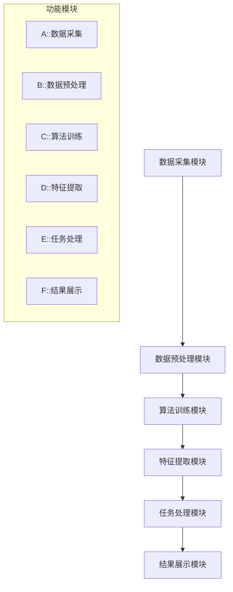
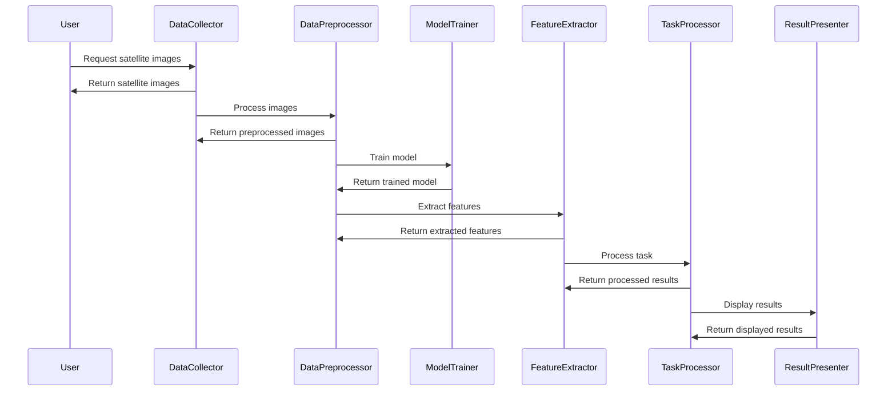
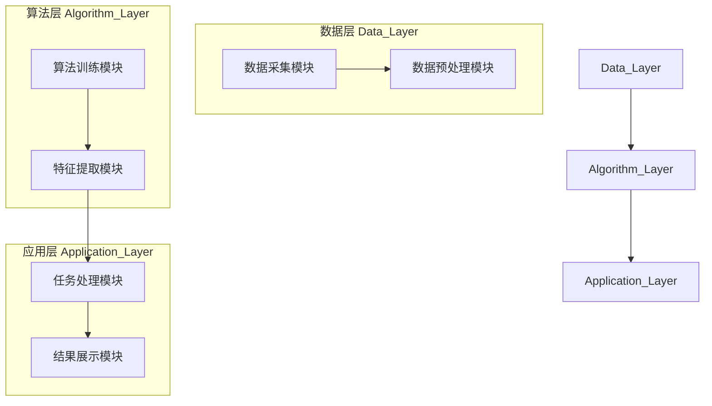
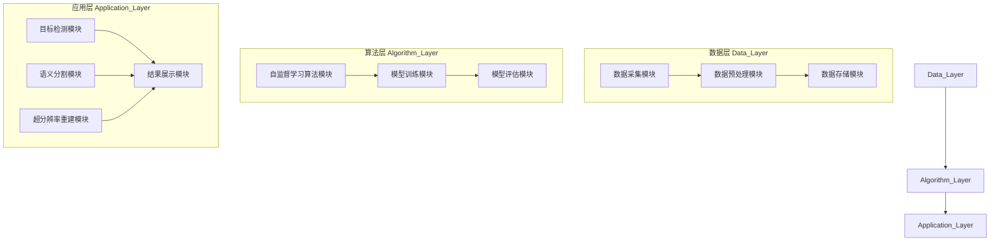

                 

### 1.1 卫星图像分析的重要性

卫星图像分析作为一种高效且广泛的技术，在当今社会的各个领域扮演着重要角色。首先，卫星图像分析广泛应用于地理信息系统（GIS）和遥感领域。通过分析卫星图像，可以实现对地球表面植被覆盖、土地使用、气候变化等方面的监测，为环境保护和资源管理提供了科学依据。此外，卫星图像在农业、林业、渔业等领域也发挥着重要作用，通过遥感技术可以实时监测作物生长情况、森林资源变化等，从而提高农业生产效率和资源利用效率。

在军事领域，卫星图像分析同样具有至关重要的意义。卫星图像可以用于地形分析、战场监控、目标识别等任务，为军事决策提供实时、准确的信息支持。例如，卫星图像可以用于识别敌方阵地、侦察敌方军事行动、评估战场环境等，大大提高了军事行动的效率和安全性。

另外，卫星图像分析还在城市规划、灾害监测、城市规划等方面发挥着重要作用。通过分析卫星图像，可以了解城市的扩张情况、建筑密度、交通流量等，为城市规划提供科学依据。在灾害监测方面，卫星图像可以实时监测地震、洪水、山体滑坡等自然灾害的发生和发展情况，为应急响应和灾害管理提供及时、准确的数据支持。

总的来说，卫星图像分析的重要性和应用价值体现在多个方面：它不仅可以为科学研究提供数据支持，还可以为实际应用提供决策依据，有助于提高人类社会的生产力和生活质量。随着技术的不断进步，卫星图像分析的应用范围将会更加广泛，其社会和经济效益也将日益凸显。

### 1.1.1 卫星图像分析的应用领域

卫星图像分析的应用领域极为广泛，涵盖了从科学研究到商业应用的各个方面。以下是几个主要的应用领域及其具体实例：

**气象预报与气候监测**：卫星图像在气象预报和气候监测中起着至关重要的作用。通过分析卫星图像中的云层覆盖、温度分布等信息，气象学家可以更准确地预测天气变化，提前发布气象预警，减少自然灾害带来的损失。此外，长期监测气候变化的趋势，有助于科学家更好地理解地球气候系统，为全球气候变化的研究提供重要数据支持。

**环境保护与资源管理**：卫星图像分析在环境保护和资源管理中有着广泛的应用。通过监测植被变化、水体污染、土地覆盖等，可以及时发现环境问题，并采取相应的措施。例如，通过分析卫星图像，可以发现森林砍伐、荒漠化等环境问题，从而制定和实施保护措施。在资源管理方面，卫星图像可以帮助确定矿产资源的分布，评估土地资源利用情况，为资源的合理开发和利用提供科学依据。

**城市规划与交通管理**：卫星图像在城市规划和交通管理中发挥着重要作用。通过分析卫星图像，可以了解城市的扩张情况、建筑密度、交通流量等信息。这些数据可以为城市规划提供科学依据，帮助制定更合理的发展策略。此外，卫星图像还可以用于交通流量监测，帮助城市管理部门优化交通信号配置，缓解交通拥堵，提高交通运行效率。

**农业与林业**：卫星图像在农业和林业中的应用也非常广泛。通过遥感技术，可以实时监测作物生长情况、病虫害发生情况等，为农业生产提供科学指导。例如，通过分析卫星图像，可以及时识别作物缺水、病害等问题，并采取相应的措施，提高农业生产效率。在林业方面，卫星图像可以用于森林资源监测、森林火灾预警等，为林业管理和保护提供重要数据支持。

**军事侦察与目标识别**：卫星图像分析在军事侦察和目标识别中具有重要作用。通过分析卫星图像，可以识别敌方阵地、军事设施、战略目标等，为军事决策提供实时、准确的信息支持。例如，卫星图像可以用于侦察敌方军事行动、监控敌方武器库、评估战场环境等，有助于提高军事行动的效率和安全性。

综上所述，卫星图像分析的应用领域非常广泛，从气象预报、环境保护、城市规划到农业、林业、军事侦察等多个领域，都具有重要的应用价值。随着技术的不断进步，卫星图像分析的应用前景将更加广阔。

### 1.1.2 卫星图像分析的技术挑战

尽管卫星图像分析在诸多领域具有广泛应用，但其实现过程中也面临着诸多技术挑战。首先，数据获取问题是一个重要的挑战。卫星图像数据通常具有高分辨率和高空间维度，这导致数据量极其庞大。高分辨率图像的获取需要昂贵的卫星设备和长时间的观测，而在某些地区，卫星信号的传输和接收也面临困难。此外，卫星图像的采集时间往往受到天气和云层的影响，导致图像质量不稳定。

数据预处理是另一个关键挑战。卫星图像在采集过程中可能受到噪声、光照变化、大气干扰等因素的影响，因此需要进行复杂的预处理步骤，如图像校正、去噪、增强等。这些步骤不仅需要大量的计算资源，还需要精确的算法支持，以确保图像质量达到分析要求。

模型训练与优化也是一大难题。卫星图像分析往往涉及复杂的目标检测、分类、分割等任务，需要构建高精度的模型。然而，由于卫星图像数据量有限，且标注过程昂贵和耗时，传统的有监督学习方法难以满足需求。自监督学习作为一种新兴方法，可以在不依赖大量标注数据的情况下训练模型，但其算法复杂度和计算资源需求较高，如何优化模型训练效率成为亟待解决的问题。

此外，实时性与准确性之间的平衡也是一个挑战。在许多应用场景中，如气象预报、灾害监测等，需要实时分析卫星图像以提供及时决策支持。然而，实时分析往往要求模型在较低计算资源下运行，同时保持较高的准确性，这对算法的设计和实现提出了高要求。

综合来看，卫星图像分析在技术实现过程中面临多个挑战，包括数据获取、数据预处理、模型训练与优化以及实时性与准确性之间的平衡等。解决这些问题，需要结合先进的算法、优化技术以及高效的计算资源，以实现高精度、高效率的卫星图像分析。

### 1.2 自监督学习的核心概念

自监督学习（Self-Supervised Learning）是一种无需人工标注数据便能够从数据中提取有用信息的人工智能学习方法。其核心思想是通过设计一些无监督的任务，使得模型在不需要外部监督信号的情况下自行学习数据的内在结构和特征。自监督学习不仅能够提升模型对数据的理解能力，还能显著减少对标注数据的依赖，因此在许多领域具有广泛的应用潜力。

**定义**：
自监督学习是机器学习的一种范式，通过将输入数据中的某些部分作为标签，训练模型自行学习数据中的有用特征。这种学习方法不需要外部标注信息，而是利用数据内部的关联性和结构来进行学习。例如，在一个图像识别任务中，自监督学习算法可能会通过预测图像中的一部分来训练模型，而不是依赖于已标注的图像标签。

**优点**：
1. **减少标注成本**：自监督学习无需大量的人工标注数据，从而大大降低了数据标注的成本和时间。这对于数据获取困难或数据标注成本高昂的场景尤为重要。
2. **数据利用效率高**：自监督学习可以在原始数据上直接进行训练，充分利用数据中的信息，从而提高模型的性能。
3. **适用范围广**：自监督学习方法不受任务类型的限制，可以应用于图像、文本、语音等多种数据类型，具有较强的通用性。

**缺点**：
1. **准确性有限**：由于缺乏外部监督信号，自监督学习模型的准确性通常不如有监督学习模型。特别是在需要高精度预测的任务中，自监督学习可能难以达到要求。
2. **算法复杂度高**：自监督学习算法通常需要设计复杂的网络结构和优化策略，对计算资源的要求较高，实施难度较大。
3. **模型泛化能力不足**：自监督学习模型在特定数据集上表现良好，但在未见数据上的泛化能力可能较差，尤其是在处理高度复杂和多样化的数据时。

**与卫星图像分析的联系**：
在卫星图像分析中，自监督学习具有独特的优势。卫星图像数据量庞大且获取困难，而标注数据尤其昂贵。自监督学习能够有效利用未标注的卫星图像，从中提取有用信息，提高图像分析的效率和准确性。例如，自监督学习可以用于卫星图像中的目标检测、分类、分割等任务，通过设计适当的预测任务，模型能够自动学习图像中的重要特征，从而实现对复杂场景的识别和解析。此外，自监督学习还能够帮助优化卫星图像的预处理步骤，如图像增强、去噪等，进一步提高图像质量。

总体而言，自监督学习为卫星图像分析提供了一种全新的解决方案，不仅降低了数据标注的成本，还提高了模型对复杂场景的适应能力，为实现高精度、高效率的卫星图像分析奠定了基础。

### 1.3.1 卫星图像数据的特点

卫星图像数据具有高分辨率、多光谱、时空连续性等特点，这些特点使得其在分析过程中既具有优势，也带来了一系列技术挑战。

**高分辨率**：卫星图像通常具有非常高的空间分辨率，能够捕捉到地表的细微特征。这种高分辨率图像在目标检测、地图绘制和地表分析等领域具有显著优势，因为可以提供更详细和准确的信息。然而，高分辨率图像的数据量也非常庞大，导致存储和处理成本较高。

**多光谱**：卫星图像通常包含多个光谱波段，如可见光、红外、微波等。这些不同波段的信息可以反映地表的不同物理特性，如温度、湿度、植被覆盖等。多光谱图像在遥感应用中具有广泛的应用，如土地分类、作物监测等。然而，多光谱数据的处理也相对复杂，因为需要考虑不同波段之间的相关性以及融合方法。

**时空连续性**：卫星图像能够提供地表的连续时空数据，这为长期监测和变化分析提供了重要数据支持。例如，通过连续的卫星图像，可以监测森林变化、城市扩张、气候变化等。然而，时空连续性数据也带来了数据管理和存储的挑战，因为需要处理大量历史数据，并且确保数据的时效性和一致性。

**优势**：
1. **详细地表信息**：高分辨率和多光谱卫星图像可以提供非常详细的地表信息，有助于精确识别和分类地表特征。
2. **多维度数据分析**：多光谱数据提供了丰富的信息维度，可以用于复杂的环境监测和资源管理任务。
3. **时空监测能力**：连续的时空数据支持长期监测和变化分析，为科学研究和社会管理提供了重要数据支持。

**挑战**：
1. **数据量大**：高分辨率和多光谱数据量庞大，需要大量的存储和处理资源。
2. **数据处理复杂**：多波段数据的处理和融合需要复杂的算法和技术，以确保数据的准确性和一致性。
3. **实时性要求高**：在许多应用场景中，如灾害监测和应急响应，需要实时分析卫星图像，这对算法的实时性和计算效率提出了高要求。

### 1.3.2 自监督学习在卫星图像分析中的应用

自监督学习在卫星图像分析中的应用主要表现在以下几个方面：

**目标检测**：在卫星图像目标检测任务中，自监督学习可以通过预测图像中的某些部分（如角落、边缘等）来训练模型，从而自动学习目标的特征。这种方法无需依赖大量标注数据，即可实现高精度的目标检测。例如，可以在卫星图像中预测图像的局部结构，通过对比预测结果与真实图像结构，自动优化模型参数。

**分类**：自监督学习还可以用于卫星图像的分类任务。通过设计一些无监督的任务，如聚类或聚类后的标签预测，模型可以自动学习图像中的不同类别特征。这种方法特别适用于数据标注困难或数据量有限的场景。例如，可以利用聚类算法将卫星图像分成若干类别，然后通过预测每个类别的标签来训练分类模型。

**分割**：在卫星图像分割任务中，自监督学习可以通过预测图像中的某些区域来训练模型，从而实现像素级别的精确分割。这种方法能够自动学习图像中的结构和边界特征，无需依赖大量的标注数据。例如，可以利用自监督学习算法预测图像中的前景和背景区域，从而实现高精度的图像分割。

**实际应用**：
1. **土地利用分类**：通过自监督学习，可以自动分类卫星图像中的不同土地利用类型，如耕地、森林、水体等。这种方法在土地资源管理、城市规划等领域具有广泛应用。
2. **灾害监测**：自监督学习可以用于监测卫星图像中的灾害迹象，如洪水、火灾等。通过预测图像中的异常区域，可以及时发现并预警灾害，为应急响应提供数据支持。
3. **环境保护**：自监督学习可以帮助监测卫星图像中的环境变化，如森林砍伐、水体污染等。通过自动分类和分析卫星图像，可以及时发现环境问题，并为环境保护措施提供科学依据。

总之，自监督学习在卫星图像分析中的应用不仅降低了数据标注成本，提高了数据处理效率，还大大提升了模型对复杂场景的适应能力，为卫星图像分析提供了强有力的技术支持。

### 1.4 自监督学习的原理

自监督学习的核心在于利用数据本身的信息，通过设计无监督的任务来驱动模型的学习过程。其基本原理可以概括为以下几步：

首先，自监督学习算法需要从数据集中选择一部分数据作为预测任务的目标。这些目标可以是数据中的某些部分，如像素、单词、句子等。选择目标的过程称为**预训练目标设计**。设计预训练目标的关键在于确保目标与数据中的潜在结构相关，从而使得模型在预测目标时能够提取有用的信息。

接着，模型通过预测这些目标，并根据预测结果与实际目标之间的差异来更新模型参数。这个过程称为**预测误差反馈**。预测误差是衡量模型预测精度的重要指标，通过不断优化预测误差，模型可以逐渐学习到数据的内在结构和特征。

最后，经过一定数量的迭代后，模型将获得对数据的高层次理解。这时，模型可以用于各种实际任务，如分类、分割、目标检测等。这一步骤称为**任务迁移**。在任务迁移过程中，模型通常会经过微调（Fine-tuning），以适应特定的任务需求。

具体来说，自监督学习的原理可以进一步细化为以下几个方面：

1. **数据预处理**：在开始训练前，需要对数据进行预处理，如归一化、标准化、数据增强等。这些操作有助于提高模型的学习效率和稳定性。
2. **预训练目标设计**：设计预训练目标时，需要考虑目标的选择方式（如随机采样、固定区域等）和目标类型（如像素、文本、序列等）。目标设计应尽可能反映数据的潜在结构，以便模型能够从中提取有用信息。
3. **模型架构**：自监督学习模型通常采用深度神经网络架构，通过多层神经网络对数据进行抽象和表示。常见的模型结构包括自编码器、生成对抗网络（GAN）、变分自编码器（VAE）等。
4. **优化策略**：模型训练过程中，需要采用优化策略来减少预测误差。常用的优化算法包括随机梯度下降（SGD）、Adam等。通过优化策略，模型可以逐步调整参数，提高预测精度。
5. **任务迁移**：在预训练完成后，模型可以通过微调来适应特定的任务。微调过程中，需要根据任务需求调整模型的结构和参数，以确保模型在特定任务上的性能。

总之，自监督学习通过设计无监督的任务，利用数据本身的内在结构来驱动模型的学习过程。其核心在于预训练目标设计、预测误差反馈和任务迁移等步骤，通过这些步骤，模型可以自动学习到数据中的有用信息，从而实现各种复杂任务。

### 1.4.2 自监督学习的流程

自监督学习的流程可以分为几个关键步骤，这些步骤确保了模型能够从数据中有效提取信息并应用于具体的任务。以下是自监督学习的基本流程：

**1. 数据准备**：首先，需要准备用于训练的数据集。这些数据可以是图像、文本、音频等各种类型。对于图像数据，通常需要进行预处理，如数据增强（数据扩展、旋转、裁剪等），以增加数据多样性，提高模型的泛化能力。

**2. 预训练目标设计**：在设计预训练目标时，选择哪些部分作为预测任务的目标至关重要。例如，在图像数据中，可以选择像素、文本区域的上下文、图像的局部结构等作为预测目标。目标设计应反映数据中的潜在结构，以便模型在预测时能够提取有用信息。

**3. 模型初始化**：选择并初始化模型架构。常见的模型结构包括自编码器（Autoencoder）、生成对抗网络（GAN）、变分自编码器（VAE）等。模型初始化涉及设置网络的层数、神经元数量、激活函数、优化器等参数。

**4. 模型训练**：在模型训练阶段，模型通过预测预训练目标并计算预测误差来更新参数。具体来说，模型会尝试预测目标部分，如图像中的某些像素或文本中的某些单词，然后根据预测误差调整网络权重。这个过程通过迭代进行，每次迭代都使模型对数据的理解更加准确。

**5. 预测误差反馈**：通过计算预测误差，模型能够了解其预测的准确性。误差较大的部分会被优先调整，从而逐渐减小误差。这一过程称为预测误差反馈，是自监督学习的关键步骤。

**6. 模型优化**：在训练过程中，可能需要调整优化策略，如学习率、批量大小等，以优化模型性能。常用的优化算法包括随机梯度下降（SGD）、Adam等。

**7. 任务迁移**：预训练完成后，模型需要迁移到具体的任务上。这个过程称为任务迁移或微调。在任务迁移过程中，模型的结构和参数会根据特定任务的需求进行调整。例如，在图像分类任务中，可以通过微调来自动调整分类层的权重。

**8. 模型评估**：任务迁移后，需要对模型进行评估，以确保其在特定任务上的性能满足要求。评估指标包括准确率、召回率、F1分数等。

**9. 模型部署**：评估通过后，模型可以部署到实际应用场景中，如实时目标检测、自然语言处理等。模型部署涉及将训练好的模型集成到应用程序中，并提供接口供用户或系统调用。

自监督学习的流程通过一系列精心设计的步骤，从数据准备到任务迁移，确保了模型能够从大量未标注的数据中学习，并应用于各种复杂任务。这个过程不仅提高了模型的效率和泛化能力，还为解决数据标注困难和数据稀缺问题提供了有效途径。

### 1.5.1 无监督特征学习算法

无监督特征学习算法（Unsupervised Feature Learning Algorithms）是自监督学习的重要组成部分，主要用于从未标注的数据中提取具有判别力的特征表示。以下是几种常见的无监督特征学习算法，包括其原理、特点及在卫星图像分析中的应用：

#### 1.5.1.1 基于自编码器的算法

**原理**：
自编码器（Autoencoder）是一种无监督学习算法，其核心思想是通过编码器（Encoder）将输入数据压缩到一个低维空间中，然后通过解码器（Decoder）将压缩后的数据重构回原始数据。自编码器在训练过程中，通过最小化输入与重构数据之间的误差来优化网络参数，从而学习到数据的低维表示。

**特点**：
- **特征提取能力**：自编码器能够自动学习到输入数据的低维表示，这些表示通常具有较好的判别力。
- **泛化能力**：通过重构误差来驱动学习，自编码器能够生成鲁棒的特征表示，适用于多种不同的数据集和任务。

**应用**：
在卫星图像分析中，自编码器可以用于提取图像特征，从而提高后续分类或目标检测的准确性。例如，在卫星图像分类任务中，自编码器可以将高维的图像数据压缩到低维空间，从而简化计算，并保留图像的关键信息。这种低维特征表示可以用于训练分类模型，如支持向量机（SVM）或深度学习模型，从而实现高精度的分类。

#### 1.5.1.2 基于对抗网络的算法

**原理**：
生成对抗网络（Generative Adversarial Network，GAN）由生成器（Generator）和判别器（Discriminator）两部分组成。生成器的任务是生成逼真的数据，而判别器的任务是区分真实数据和生成数据。通过训练生成器和判别器的对抗关系，生成器逐渐学习到生成高质量数据的技巧。

**特点**：
- **强大的生成能力**：GAN能够生成高质量、多样化的数据，从而在数据增强和特征提取方面表现出色。
- **无监督学习**：GAN不需要标注数据，可以直接从原始数据中学习，适用于数据稀缺的场景。

**应用**：
在卫星图像分析中，GAN可以用于图像生成和特征提取。例如，GAN可以通过生成合成卫星图像来扩展训练数据集，从而提高模型对未见数据的泛化能力。此外，GAN还可以用于卫星图像去噪和超分辨率重建，通过生成高质量的图像来增强图像的清晰度和细节。

#### 1.5.1.3 基于聚类算法的分割

**原理**：
聚类算法（Clustering Algorithms），如K-均值聚类（K-Means Clustering）和层次聚类（Hierarchical Clustering），通过将数据划分为不同的簇，从而实现对数据的无监督分类。聚类算法通常基于距离度量，如欧氏距离或马氏距离，来计算数据之间的相似性。

**特点**：
- **简单高效**：聚类算法通常具有较低的计算复杂度，适用于大规模数据集。
- **灵活性**：聚类算法可以处理不同类型的数据，包括数值和文本数据。

**应用**：
在卫星图像分割中，聚类算法可以用于将图像中的像素划分为不同的区域，从而实现图像的像素级分割。例如，K-均值聚类可以将卫星图像中的像素划分为多个类别，每个类别代表不同的地表特征。这种方法在土地利用分类和城市规划中具有广泛应用。

总的来说，无监督特征学习算法通过自动从未标注数据中提取特征，为卫星图像分析提供了有效的工具。自编码器和对抗网络通过生成和重构数据来提取特征，而聚类算法通过数据聚类来实现特征提取。这些算法在提高卫星图像分析效率和准确性方面发挥了重要作用。

### 2.2.1.1 自编码器算法原理

自编码器（Autoencoder）是一种无监督学习算法，其主要目的是将输入数据压缩到低维空间中，然后尝试重构原始数据。自编码器包括两个主要部分：编码器（Encoder）和解码器（Decoder）。下面将详细解释自编码器的工作原理、数学模型及Python实现。

#### 自编码器的工作原理

1. **编码器**：编码器的任务是将输入数据（高维）压缩成一个较低维的向量，这个向量包含了输入数据的主要特征信息。
   
2. **解码器**：解码器的任务是将编码器输出的低维向量重新映射回原始数据的空间，试图恢复原始数据的结构。

3. **损失函数**：自编码器通过最小化输入与重构数据之间的误差来优化网络参数。常用的损失函数是均方误差（MSE），即输入和重构数据之间差异的平方和。

#### 数学模型

自编码器的数学模型可以表示为：

$$
x = \text{Decoder}(\text{Encoder}(x))
$$

其中，\(x\) 是输入数据，\(\text{Encoder}(x)\) 是编码器输出的低维向量，\(\text{Decoder}(\text{Encoder}(x))\) 是解码器输出的重构数据。

具体的数学公式如下：

1. **编码器**：
   $$
   z = \text{Encoder}(x; \theta_E) = \sigma(W_E x + b_E)
   $$
   其中，\(z\) 是编码器输出，\(W_E\) 和 \(b_E\) 分别是编码器的权重和偏置，\(\sigma\) 是激活函数，通常使用 sigmoid 或 ReLU 函数。

2. **解码器**：
   $$
   x' = \text{Decoder}(z; \theta_D) = \sigma(W_D z + b_D)
   $$
   其中，\(x'\) 是解码器输出，\(W_D\) 和 \(b_D\) 分别是解码器的权重和偏置。

3. **损失函数**：
   $$
   L = \frac{1}{m} \sum_{i=1}^{m} \sum_{j=1}^{n} (\sigma(W_D z_j + b_D) - x_i)^2
   $$
   其中，\(m\) 是样本数量，\(n\) 是特征数量。

#### Python实现

下面是一个简单的自编码器的Python实现示例：

```python
import numpy as np
import tensorflow as tf
from tensorflow.keras.layers import Dense
from tensorflow.keras.models import Model

# 定义自编码器的结构
input_layer = Dense(units=784, activation='sigmoid', input_shape=(784,))
encoded = Dense(units=64, activation='sigmoid')
decoded = Dense(units=784, activation='sigmoid')

# 创建模型
autoencoder = Model(inputs=input_layer, outputs=decoded)
autoencoder.compile(optimizer='adam', loss='mean_squared_error')

# 打印模型结构
autoencoder.summary()

# 训练模型
# autoencoder.fit(x_train, x_train, epochs=100, batch_size=256, shuffle=True, validation_data=(x_test, x_test))
```

在上述代码中，我们定义了一个简单的自编码器，包括一个输入层、一个编码层和一个解码层。输入层和输出层的神经元数量分别为784和64，中间的编码层用于压缩输入数据。模型使用 Adam 优化器和均方误差损失函数进行编译和训练。

通过自编码器，我们可以从高维图像数据中提取低维特征表示，这些特征表示在后续的图像分析任务中可以用于分类、目标检测等。

### 2.2.1.2 基于自编码器的算法原理

基于自编码器的算法在自监督学习中有着广泛应用，其主要原理是通过训练编码器和解码器来学习数据的高效表示，从而为后续的监督学习任务提供高质量的特征。以下是基于自编码器的算法的详细原理、数学模型及Python源代码示例。

#### 原理

1. **编码器和解码器**：自编码器由两个主要部分组成：编码器和解码器。编码器负责将高维输入数据压缩到低维空间中，而解码器则尝试重构原始数据。通过这种压缩和重构过程，模型能够学习到数据的主要特征和结构。

2. **损失函数**：自编码器的训练目标是最小化重构误差，即输入数据与重构数据之间的差异。常用的损失函数是均方误差（MSE），其数学表达式为：
   $$
   L = \frac{1}{m} \sum_{i=1}^{m} \sum_{j=1}^{n} (\sigma(W_D z_j + b_D) - x_i)^2
   $$
   其中，\(m\) 是样本数量，\(n\) 是特征数量。

3. **反向传播**：在训练过程中，模型通过反向传播算法来更新网络参数，以最小化损失函数。编码器和解码器的权重和偏置分别更新为：
   $$
   \theta_E = \theta_E - \alpha \frac{\partial L}{\partial \theta_E}
   $$
   $$
   \theta_D = \theta_D - \alpha \frac{\partial L}{\partial \theta_D}
   $$
   其中，\(\alpha\) 是学习率。

#### 数学模型

1. **编码器**：
   $$
   z = \text{Encoder}(x; \theta_E) = \sigma(W_E x + b_E)
   $$
   其中，\(z\) 是编码器输出，\(W_E\) 和 \(b_E\) 分别是编码器的权重和偏置，\(\sigma\) 是激活函数，通常使用 sigmoid 或 ReLU 函数。

2. **解码器**：
   $$
   x' = \text{Decoder}(z; \theta_D) = \sigma(W_D z + b_D)
   $$
   其中，\(x'\) 是解码器输出，\(W_D\) 和 \(b_D\) 分别是解码器的权重和偏置。

3. **损失函数**：
   $$
   L = \frac{1}{m} \sum_{i=1}^{m} \sum_{j=1}^{n} (\sigma(W_D z_j + b_D) - x_i)^2
   $$

#### Python源代码示例

下面是一个简单的基于自编码器的算法的Python实现示例：

```python
import tensorflow as tf
from tensorflow.keras.layers import Dense
from tensorflow.keras.models import Model

# 设置参数
input_dim = 784  # 输入数据的维度
encoding_dim = 32  # 编码器输出的维度
learning_rate = 0.001  # 学习率

# 编码器
input_layer = Dense(units=encoding_dim, activation='relu', input_shape=(input_dim,))
encoded = Dense(units=encoding_dim, activation='relu')

# 解码器
decoded = Dense(units=input_dim, activation='sigmoid')

# 创建模型
autoencoder = Model(inputs=input_layer, outputs=decoded)
autoencoder.compile(optimizer=tf.optimizers.Adam(learning_rate), loss='mean_squared_error')

# 打印模型结构
autoencoder.summary()

# 训练模型
# autoencoder.fit(x_train, x_train, epochs=100, batch_size=256, shuffle=True, validation_data=(x_test, x_test))
```

在上述代码中，我们定义了一个简单的自编码器模型，包括一个输入层、一个编码层和一个解码层。输入层和输出层的神经元数量分别为784和32，中间的编码层用于压缩输入数据。模型使用 Adam 优化器和均方误差损失函数进行编译和训练。

通过上述原理和代码示例，我们可以理解基于自编码器的算法是如何通过训练编码器和解码器来学习数据的高效表示，从而为后续的监督学习任务提供高质量的特征。

### 2.2.2 对抗网络算法原理

生成对抗网络（Generative Adversarial Network，GAN）是一种无监督学习模型，由生成器（Generator）和判别器（Discriminator）两部分组成，通过训练两个相互对抗的网络来生成高质量的数据。下面将详细解释GAN的原理、数学模型及Python实现。

#### 原理

1. **生成器与判别器**：生成器的任务是生成类似真实数据的新数据，而判别器的任务是区分新数据和真实数据。生成器和判别器相互对抗，生成器的目标是使得判别器无法区分真实数据和生成数据，而判别器的目标是能够准确区分两者。

2. **损失函数**：GAN的训练过程基于最小化生成器和判别器的损失函数。生成器的损失函数是最大化判别器对生成数据的判别错误率，而判别器的损失函数是最大化其对真实数据和生成数据的判别准确性。

3. **训练过程**：GAN的训练过程是交替进行的，每次迭代中，生成器尝试生成更真实的数据，判别器尝试提高对生成数据的识别能力。这个过程通过反向传播和梯度下降算法进行优化。

#### 数学模型

1. **生成器**：
   $$
   G(z) = x_G
   $$
   其中，\(G\) 是生成器的参数，\(z\) 是随机噪声向量，\(x_G\) 是生成器生成的数据。

2. **判别器**：
   $$
   D(x) = \sigma(W_D x + b_D)
   $$
   $$
   D(G(z)) = \sigma(W_G G(z) + b_G)
   $$
   其中，\(D\) 是判别器的参数，\(x\) 是真实数据，\(G(z)\) 是生成器生成的数据，\(W_D\) 和 \(b_D\) 分别是判别器的权重和偏置，\(W_G\) 和 \(b_G\) 分别是生成器的权重和偏置，\(\sigma\) 是激活函数，通常使用 sigmoid 函数。

3. **损失函数**：
   $$
   L_G = -\log(D(G(z)))
   $$
   $$
   L_D = -[\log(D(x)) + \log(1 - D(G(z)))]
   $$
   其中，\(L_G\) 是生成器的损失函数，\(L_D\) 是判别器的损失函数。

#### Python实现

下面是一个简单的GAN模型的Python实现示例：

```python
import tensorflow as tf
from tensorflow.keras.layers import Dense, Flatten
from tensorflow.keras.models import Model

# 设置参数
latent_dim = 100  # 随机噪声向量的维度
input_dim = 784  # 输入数据的维度

# 生成器的模型
z = tf.keras.layers.Input(shape=(latent_dim,))
x_g = Dense(units=128, activation='relu')(z)
x_g = Dense(units=784, activation='sigmoid')(x_g)
generator = Model(z, x_g)

# 判别器的模型
x = tf.keras.layers.Input(shape=(input_dim,))
x_d = Flatten()(x)
x_d = Dense(units=128, activation='relu')(x_d)
x_d = Dense(units=1, activation='sigmoid')(x_d)
discriminator = Model(x, x_d)

# 编写GAN模型
discriminator.compile(optimizer=tf.optimizers.Adam(0.0001), loss='binary_crossentropy')
generator.compile(optimizer=tf.optimizers.Adam(0.0001), loss='binary_crossentropy')

discriminator.trainable = False  # 关闭判别器，只训练生成器

# GAN模型的损失函数
gan_loss = 0.5 * discriminator(inputs=generator(inputs), training=True) + 0.5 * generator(inputs)

# 编写GAN模型
gan = Model(inputs=z, outputs=gan_loss)
gan.compile(optimizer=tf.optimizers.Adam(0.0001), loss='binary_crossentropy')

# 打印模型结构
gan.summary()

# 训练GAN模型
# gan.fit(z_train, tf.zeros_like(discriminator(z_train)), epochs=100, batch_size=128)
```

在上述代码中，我们定义了一个简单的生成器和判别器模型，并编写了GAN模型。生成器接收随机噪声向量并生成数据，判别器尝试区分真实数据和生成数据。GAN模型使用二元交叉熵损失函数进行训练。

通过上述原理和代码示例，我们可以理解GAN是如何通过训练生成器和判别器来生成高质量数据的。GAN在图像生成、数据增强和特征提取等领域具有广泛应用，其独特的设计和训练机制使其成为一种强大的无监督学习工具。

### 2.2.2.2 基于对抗网络的算法原理

基于对抗网络的算法（GAN，Generative Adversarial Networks）是近年来在深度学习领域备受关注的一种无监督学习算法。GAN的核心思想是通过两个相互对抗的神经网络（生成器和判别器）的博弈过程，生成逼真的数据。下面将详细介绍GAN的数学模型、具体过程以及Python实现。

#### 数学模型

GAN由两个主要部分组成：生成器（Generator）和判别器（Discriminator）。生成器的目标是生成逼真的数据，而判别器的目标是区分真实数据和生成数据。

1. **生成器（Generator）**：
   - 输入：一个随机噪声向量 \( z \)（从高斯分布 \( N(0,1) \) 中采样）。
   - 输出：生成数据 \( x_G \)。
   - 数学模型：
     $$
     G(z) = x_G
     $$
     其中，\( G(z) \) 是生成器生成的数据，\( z \) 是噪声向量。

2. **判别器（Discriminator）**：
   - 输入：真实数据 \( x \) 或生成数据 \( x_G \)。
   - 输出：判别结果 \( D(x) \) 或 \( D(G(z)) \)。
   - 数学模型：
     $$
     D(x) = \sigma(W_D x + b_D)
     $$
     $$
     D(G(z)) = \sigma(W_G G(z) + b_G)
     $$
     其中，\( D(x) \) 表示判别器对真实数据的判别结果，\( D(G(z)) \) 表示判别器对生成数据的判别结果，\( W_D \) 和 \( b_D \) 是判别器的权重和偏置，\( W_G \) 和 \( b_G \) 是生成器的权重和偏置，\( \sigma \) 是 sigmoid 激活函数。

3. **损失函数**：
   - 生成器损失函数 \( L_G \)：
     $$
     L_G = -\log(D(G(z)))
     $$
     生成器的目标是最大化判别器对生成数据的判别错误率。
   - 判别器损失函数 \( L_D \)：
     $$
     L_D = -[\log(D(x)) + \log(1 - D(G(z)))]
     $$
     判别器的目标是最大化其对真实数据和生成数据的判别准确性。

#### 具体过程

GAN的训练过程是通过两个网络之间的博弈来进行的，具体步骤如下：

1. **初始化**：初始化生成器和判别器，随机噪声向量 \( z \)。
2. **生成器训练**：生成器根据随机噪声向量生成数据，判别器对其进行评估。
3. **判别器训练**：判别器根据真实数据和生成数据进行训练，尝试提高对生成数据的识别能力。
4. **交替迭代**：生成器和判别器交替训练，每次迭代中，生成器尝试生成更逼真的数据，而判别器尝试提高对生成数据的识别能力。

#### Python实现

下面是一个简单的GAN模型的Python实现示例：

```python
import tensorflow as tf
from tensorflow.keras.layers import Dense, Flatten
from tensorflow.keras.models import Model

# 设置参数
latent_dim = 100  # 随机噪声向量的维度
input_dim = 784  # 输入数据的维度

# 生成器的模型
z = tf.keras.layers.Input(shape=(latent_dim,))
x_g = Dense(units=128, activation='relu')(z)
x_g = Dense(units=input_dim, activation='sigmoid')(x_g)
generator = Model(z, x_g)

# 判别器的模型
x = tf.keras.layers.Input(shape=(input_dim,))
x_d = Flatten()(x)
x_d = Dense(units=128, activation='relu')(x_d)
x_d = Dense(units=1, activation='sigmoid')(x_d)
discriminator = Model(x, x_d)

# 编写GAN模型
discriminator.compile(optimizer=tf.optimizers.Adam(0.0001), loss='binary_crossentropy')
generator.compile(optimizer=tf.optimizers.Adam(0.0001), loss='binary_crossentropy')

discriminator.trainable = False  # 关闭判别器，只训练生成器

# GAN模型的损失函数
gan_loss = 0.5 * discriminator(inputs=generator(inputs), training=True) + 0.5 * generator(inputs)

# 编写GAN模型
gan = Model(inputs=z, outputs=gan_loss)
gan.compile(optimizer=tf.optimizers.Adam(0.0001), loss='binary_crossentropy')

# 打印模型结构
gan.summary()

# 训练GAN模型
# gan.fit(z_train, tf.zeros_like(discriminator(z_train)), epochs=100, batch_size=128)
```

在上述代码中，我们定义了一个简单的生成器和判别器模型，并编写了GAN模型。生成器接收随机噪声向量并生成数据，判别器尝试区分真实数据和生成数据。GAN模型使用二元交叉熵损失函数进行训练。

通过上述数学模型和Python实现示例，我们可以清晰地理解GAN的工作原理。GAN通过生成器和判别器的相互对抗，生成高质量的数据，在图像生成、数据增强和特征提取等领域具有广泛的应用。

### 2.3 算法性能对比

在自监督学习中，不同算法的性能表现各有特点，以下我们将比较几种常见的无监督特征学习算法：自编码器（Autoencoder）、生成对抗网络（GAN）和聚类算法。通过分析它们的性能指标、优势与劣势，可以更好地选择适合特定任务的算法。

#### 性能指标

1. **准确率**：这是评估模型在分类或检测任务中的表现的重要指标。高准确率表示模型能够正确地识别和分类数据。

2. **重构误差**：在自编码器中，重构误差是衡量模型重构输入数据能力的指标。较低的误差表示模型能够更好地保留输入数据的主要特征。

3. **计算资源需求**：包括模型的训练时间、内存使用和计算资源消耗。计算资源需求较高的算法在实际应用中可能受到硬件限制。

4. **泛化能力**：泛化能力是指模型在未见数据上的表现。高泛化能力表示模型能够适应新的数据分布和任务。

#### 自编码器

**优势**：
- **特征提取能力**：自编码器能够自动提取输入数据的主要特征，这些特征在后续的监督学习任务中表现良好。
- **简单高效**：自编码器模型结构简单，易于实现和理解。
- **适用范围广**：自编码器适用于多种数据类型，如图像、文本和音频。

**劣势**：
- **准确性有限**：自编码器的重构误差通常较高，导致其在某些任务中的准确性不如有监督学习算法。
- **计算资源需求较高**：自编码器训练过程中需要大量计算资源，尤其在处理高维数据时。

#### 生成对抗网络（GAN）

**优势**：
- **强大的生成能力**：GAN能够生成高质量、多样化的数据，在图像生成和数据增强方面表现突出。
- **无监督学习**：GAN不需要标注数据，适用于数据稀缺的场景。
- **灵活性**：GAN适用于多种数据类型，包括图像、文本和音频。

**劣势**：
- **训练难度大**：GAN的训练过程复杂，存在模式崩溃（mode collapse）和训练不稳定的问题。
- **计算资源需求高**：GAN的训练过程中，生成器和判别器都需要大量计算资源。

#### 聚类算法

**优势**：
- **简单高效**：聚类算法的计算复杂度较低，适用于大规模数据集。
- **无需标注数据**：聚类算法完全基于无监督学习，适用于数据标注困难的场景。

**劣势**：
- **准确性有限**：聚类算法通常只能进行大致分类，难以达到高精度的任务要求。
- **可解释性较差**：聚类算法生成的聚类结果缺乏明确的解释，难以理解聚类过程中提取的特征。

#### 性能对比

| 算法         | 性能指标          | 优势                                                   | 劣势                                   |
| ------------ | ----------------- | ----------------------------------------------------- | -------------------------------------- |
| 自编码器     | 准确率、重构误差  | 特征提取能力强、简单高效、适用范围广                    | 准确性有限、计算资源需求高             |
| 生成对抗网络 | 生成质量、重构误差 | 强大的生成能力、无监督学习、灵活性                     | 训练难度大、计算资源需求高             |
| 聚类算法     | 聚类效果          | 简单高效、无需标注数据                                 | 准确性有限、可解释性较差               |

综合来看，自编码器在特征提取和简单高效方面具有优势，适用于特征提取任务；GAN在图像生成和数据增强方面表现突出，但训练难度大且计算资源需求高；聚类算法则适用于大规模数据集的无监督分类任务，但准确性有限。选择合适的算法需根据具体任务的需求和资源限制来决定。

### 2.3.2 评价指标与方法

在自监督学习算法的性能评估中，评价指标和方法的选择至关重要，因为它们直接影响到模型在实际应用中的表现和可信度。以下是几种常见的评价指标和具体评估方法。

#### 评价指标

1. **重构误差**（Reconstruction Error）：重构误差是衡量自编码器性能的关键指标，它反映了输入数据与重构数据之间的差异。常用的重构误差包括均方误差（MSE）、均方根误差（RMSE）等。低重构误差表示模型能够较好地重构输入数据，保留了其主要特征。

2. **准确率**（Accuracy）：准确率通常用于分类任务，它是模型正确分类的样本数占总样本数的比例。高准确率表示模型在分类任务中的表现良好。

3. **F1分数**（F1 Score）：F1分数是精确率和召回率的调和平均，用于评估分类模型的整体性能。F1分数在类别不平衡的数据集上尤为有效。

4. **ROC曲线与AUC**（ROC Curve and AUC）：ROC曲线和AUC（Area Under Curve）用于评估二分类模型的性能。AUC值越高，模型区分正负样本的能力越强。

5. **平均绝对误差**（MAE）：平均绝对误差是衡量回归模型性能的指标，它表示预测值与真实值之间的平均绝对差异。

#### 评估方法

1. **交叉验证**（Cross-Validation）：交叉验证是一种常用的评估方法，通过将数据集划分为多个子集，轮流使用每个子集作为测试集进行评估，从而避免数据分割带来的偏差。常见的交叉验证方法有K折交叉验证和留一法交叉验证。

2. **性能指标计算**（Performance Metrics Calculation）：对于每个测试集，计算重构误差、准确率、F1分数、ROC曲线和AUC等性能指标，并将这些指标的平均值作为最终评估结果。

3. **对比实验**（Comparative Experiments）：通过对比不同算法或不同参数设置下的性能，评估每种算法或参数的有效性。对比实验可以采用平行对比和配对对比等方法。

4. **可视化分析**（Visualization Analysis）：通过可视化工具，如热力图、散点图、ROC曲线等，直观展示模型在不同数据集上的性能，帮助理解模型的优缺点。

5. **误分类分析**（Misclassification Analysis）：通过分析误分类的样本，找出模型性能不佳的原因，从而优化模型。

综上所述，选择合适的评价指标和评估方法，可以全面、准确地评估自监督学习算法的性能，为模型的选择和应用提供可靠依据。在卫星图像分析中，这些评估方法和指标尤为重要，因为它们直接影响图像识别、分割和目标检测等任务的精度和效率。

### 2.4.1 系统架构设计

自监督学习在卫星图像分析中的应用涉及到多个模块和组件的协同工作，为了确保系统的高效性和灵活性，我们需要设计一个合理的系统架构。以下是系统架构设计的详细描述，包括系统架构概述、模块划分和系统架构图。

#### 系统架构概述

系统架构采用模块化设计，分为数据层、算法层和应用层三个主要部分。数据层负责数据采集、存储和管理；算法层包含自监督学习算法的实现和优化；应用层提供具体的业务功能，如目标检测、语义分割和超分辨率重建等。

1. **数据层**：数据层负责从卫星图像数据源采集数据，进行预处理，如图像校正、去噪和增强，并将处理后的数据存储在数据库中。

2. **算法层**：算法层包含自监督学习算法模块，如自编码器、生成对抗网络和聚类算法。这些算法模块通过训练和优化，自动提取卫星图像中的重要特征，用于后续的任务处理。

3. **应用层**：应用层提供具体的业务功能模块，包括目标检测、语义分割和超分辨率重建等。这些模块利用算法层提取的特征，实现卫星图像分析任务，并输出结果。

#### 模块划分

1. **数据采集模块**：该模块负责从卫星图像数据源获取图像数据，包括高分辨率多光谱图像。数据采集模块还需要处理数据存储和管理的任务，确保数据的安全性和可扩展性。

2. **数据预处理模块**：该模块对采集到的卫星图像进行预处理，包括图像校正、去噪和增强等。预处理模块通过一系列算法和技术，提高图像质量，为后续的自监督学习算法提供高质量的数据输入。

3. **算法训练模块**：该模块包含多种自监督学习算法的实现，如自编码器、生成对抗网络和聚类算法。算法训练模块负责训练这些算法，提取卫星图像中的重要特征，并优化模型参数。

4. **特征提取模块**：该模块利用训练好的自监督学习算法，提取卫星图像中的特征表示。这些特征表示将被用于后续的任务处理，如目标检测、语义分割和超分辨率重建。

5. **任务处理模块**：该模块包含具体的业务功能模块，如目标检测、语义分割和超分辨率重建等。这些模块利用特征提取模块提供的特征表示，实现具体的分析任务，并输出结果。

6. **结果展示模块**：该模块负责将任务处理结果进行可视化展示，如目标检测结果的框图、语义分割结果的地图等。结果展示模块帮助用户理解和分析分析结果。

#### 系统架构图

下面是系统架构的简图：

```
+----------------+      +----------------+      +----------------+
| 数据采集模块  |----->| 数据预处理模块 |----->| 算法训练模块  |
+----------------+      +----------------+      +----------------+
                                                      |
                                                      |
+----------------+      +----------------+      +----------------+
| 特征提取模块  |<-----| 任务处理模块   |<-----| 结果展示模块  |
+----------------+      +----------------+      +----------------+
```

通过上述系统架构设计，我们可以实现一个高效、灵活的自监督学习卫星图像分析系统。系统各模块之间通过数据流和信息流紧密连接，共同完成卫星图像分析任务。

### 2.4.2 系统功能设计

在系统架构设计中，系统功能设计是一个关键环节，它决定了系统各模块如何协同工作，以实现卫星图像分析任务。以下是系统功能设计的详细描述，包括功能模块介绍和领域模型图。

#### 功能模块介绍

1. **数据采集模块**：该模块负责从卫星图像数据源获取原始图像数据。具体任务包括连接卫星图像数据接口、读取图像数据、数据清洗等。该模块需要支持多种数据格式，如TIF、GeoTIFF等，并确保数据的一致性和完整性。

2. **数据预处理模块**：该模块对采集到的原始卫星图像进行预处理，包括图像校正、去噪和增强等。预处理步骤有助于提高图像质量，消除噪声和光照变化的影响，从而为后续的自监督学习算法提供更高质量的数据输入。关键功能包括：
   - 图像校正：校正图像的几何畸变和辐射畸变，确保图像的准确性和一致性。
   - 去噪：应用滤波算法去除图像中的噪声，提高图像的清晰度。
   - 增强：通过图像增强算法提高图像的对比度和亮度，增强图像的特征。

3. **算法训练模块**：该模块负责训练自监督学习算法，包括自编码器、生成对抗网络和聚类算法等。算法训练模块通过设计合适的训练任务，如图像特征提取、图像生成和图像分类等，自动学习卫星图像中的潜在结构和特征。关键功能包括：
   - 模型初始化：选择并初始化自监督学习算法的模型参数，如网络结构、学习率等。
   - 模型训练：通过训练算法优化模型参数，最小化重构误差或分类误差，提高模型性能。
   - 模型优化：在训练过程中，根据性能指标调整模型参数，优化模型表现。

4. **特征提取模块**：该模块利用训练好的自监督学习算法，提取卫星图像中的重要特征。这些特征将用于后续的任务处理，如目标检测、语义分割和超分辨率重建等。关键功能包括：
   - 特征提取：应用自监督学习算法提取图像中的低维特征向量。
   - 特征融合：将不同算法提取的特征进行融合，提高特征的鲁棒性和表示能力。

5. **任务处理模块**：该模块包含具体的业务功能模块，如目标检测、语义分割和超分辨率重建等。这些模块利用特征提取模块提供的特征表示，实现具体的分析任务，并输出结果。关键功能包括：
   - 目标检测：识别图像中的目标对象，输出目标的坐标和类别。
   - 语义分割：将图像分割成多个语义区域，输出每个像素的类别标签。
   - 超分辨率重建：通过算法提高图像的分辨率，恢复图像的细节信息。

6. **结果展示模块**：该模块负责将任务处理结果进行可视化展示，如目标检测结果的框图、语义分割结果的地图等。结果展示模块帮助用户理解和分析分析结果，并提供交互式界面，方便用户操作和调整系统参数。

#### 领域模型图

以下是系统功能设计的领域模型图，通过Mermaid语法表示：



通过上述功能模块的设计，系统可以高效、灵活地实现卫星图像分析任务，为不同应用场景提供可靠的技术支持。

### 2.4.3 系统接口设计与实现

系统接口设计是实现各模块之间有效通信和数据流转的关键，以下是系统接口设计的详细描述，包括接口设计与实现和系统交互图。

#### 接口设计与实现

1. **数据采集模块接口**：
   - **功能**：从卫星图像数据源获取图像数据。
   - **输入**：卫星图像数据接口。
   - **输出**：预处理后的卫星图像数据。
   - **API接口**：
     ```python
     def get_satellite_images(source):
         # 实现从数据源获取卫星图像的函数
         pass
     ```

2. **数据预处理模块接口**：
   - **功能**：对卫星图像进行校正、去噪和增强等预处理操作。
   - **输入**：原始卫星图像数据。
   - **输出**：预处理后的卫星图像数据。
   - **API接口**：
     ```python
     def preprocess_image(image):
         # 实现图像预处理的函数
         pass
     ```

3. **算法训练模块接口**：
   - **功能**：训练自监督学习算法，如自编码器和生成对抗网络。
   - **输入**：预处理后的卫星图像数据。
   - **输出**：训练好的模型参数。
   - **API接口**：
     ```python
     def train_model(data, model_type):
         # 实现训练自监督学习模型的函数
         pass
     ```

4. **特征提取模块接口**：
   - **功能**：利用训练好的模型提取卫星图像特征。
   - **输入**：预处理后的卫星图像数据。
   - **输出**：提取的图像特征。
   - **API接口**：
     ```python
     def extract_features(image, model_path):
         # 实现提取图像特征的函数
         pass
     ```

5. **任务处理模块接口**：
   - **功能**：利用特征提取模块提供的特征实现具体任务，如目标检测、语义分割和超分辨率重建。
   - **输入**：提取的图像特征。
   - **输出**：任务处理结果。
   - **API接口**：
     ```python
     def process_task(features, task_type):
         # 实现处理具体任务的函数
         pass
     ```

6. **结果展示模块接口**：
   - **功能**：将任务处理结果进行可视化展示。
   - **输入**：任务处理结果。
   - **输出**：可视化展示结果。
   - **API接口**：
     ```python
     def display_results(result):
         # 实现结果展示的函数
         pass
     ```

#### 系统交互图

以下是系统接口交互的Mermaid序列图：



通过上述接口设计和实现，以及系统交互图，各模块之间能够高效、稳定地协同工作，实现卫星图像分析系统的整体功能。

### 2.4.4 系统架构设计

系统架构设计是自监督学习在卫星图像分析中成功应用的关键环节。合理的架构设计不仅能够提高系统的效率，还能确保其稳定性和可扩展性。以下是系统架构设计的详细描述，包括系统架构概述、模块划分和架构图。

#### 系统架构概述

系统架构采用分层设计，分为数据层、算法层和应用层三个主要层次。每个层次承担不同的功能，并通过接口进行通信和协作，确保系统的整体性和高效性。

1. **数据层**：负责卫星图像数据的采集、存储和管理。数据层连接卫星图像数据源，处理原始数据，并进行预处理，如图像校正、去噪和增强，以确保图像数据的质量。

2. **算法层**：包含自监督学习算法的实现和优化。算法层通过训练和优化模型，提取卫星图像中的重要特征，并实现具体的分析任务，如目标检测、语义分割和超分辨率重建。

3. **应用层**：提供具体的业务功能模块，利用算法层提取的特征，实现卫星图像分析任务，并输出结果。应用层还包括结果展示模块，将分析结果以可视化的形式呈现给用户。

#### 模块划分

1. **数据采集模块**：
   - 功能：从卫星图像数据源获取图像数据，并进行初步处理。
   - 输入：卫星图像数据接口。
   - 输出：预处理后的卫星图像数据。

2. **数据预处理模块**：
   - 功能：对采集到的卫星图像进行预处理，包括图像校正、去噪和增强等。
   - 输入：原始卫星图像数据。
   - 输出：预处理后的卫星图像数据。

3. **算法训练模块**：
   - 功能：训练自监督学习算法，如自编码器和生成对抗网络，提取图像特征。
   - 输入：预处理后的卫星图像数据。
   - 输出：训练好的模型参数。

4. **特征提取模块**：
   - 功能：利用训练好的模型提取卫星图像特征，为后续任务处理提供输入。
   - 输入：预处理后的卫星图像数据。
   - 输出：提取的图像特征。

5. **任务处理模块**：
   - 功能：利用特征提取模块提供的特征，实现具体任务，如目标检测、语义分割和超分辨率重建。
   - 输入：提取的图像特征。
   - 输出：任务处理结果。

6. **结果展示模块**：
   - 功能：将任务处理结果进行可视化展示，方便用户理解和分析。
   - 输入：任务处理结果。
   - 输出：可视化展示结果。

#### 系统架构图

以下是系统架构的Mermaid架构图：



通过上述系统架构设计，各模块之间通过清晰的接口和数据流转实现高效协同，从而实现自监督学习在卫星图像分析中的高效应用。

### 2.4.5 系统接口设计与实现

系统接口设计与实现是确保各模块之间高效、稳定通信的关键环节。以下是系统接口设计与实现的详细描述，包括接口设计与实现和系统交互图。

#### 接口设计与实现

1. **数据采集模块接口**：
   - **功能**：负责从卫星图像数据源获取图像数据，并进行初步处理。
   - **输入**：卫星图像数据接口。
   - **输出**：预处理后的卫星图像数据。
   - **API接口**：
     ```python
     def get_satellite_images(source):
         # 实现从数据源获取卫星图像的函数
         pass
     ```

2. **数据预处理模块接口**：
   - **功能**：对采集到的卫星图像进行预处理，包括图像校正、去噪和增强等。
   - **输入**：原始卫星图像数据。
   - **输出**：预处理后的卫星图像数据。
   - **API接口**：
     ```python
     def preprocess_image(image):
         # 实现图像预处理的函数
         pass
     ```

3. **算法训练模块接口**：
   - **功能**：训练自监督学习算法，如自编码器和生成对抗网络，提取图像特征。
   - **输入**：预处理后的卫星图像数据。
   - **输出**：训练好的模型参数。
   - **API接口**：
     ```python
     def train_model(data, model_type):
         # 实现训练自监督学习模型的函数
         pass
     ```

4. **特征提取模块接口**：
   - **功能**：利用训练好的模型提取卫星图像特征，为后续任务处理提供输入。
   - **输入**：预处理后的卫星图像数据。
   - **输出**：提取的图像特征。
   - **API接口**：
     ```python
     def extract_features(image, model_path):
         # 实现提取图像特征的函数
         pass
     ```

5. **任务处理模块接口**：
   - **功能**：利用特征提取模块提供的特征，实现具体任务，如目标检测、语义分割和超分辨率重建。
   - **输入**：提取的图像特征。
   - **输出**：任务处理结果。
   - **API接口**：
     ```python
     def process_task(features, task_type):
         # 实现处理具体任务的函数
         pass
     ```

6. **结果展示模块接口**：
   - **功能**：将任务处理结果进行可视化展示，方便用户理解和分析。
   - **输入**：任务处理结果。
   - **输出**：可视化展示结果。
   - **API接口**：
     ```python
     def display_results(result):
         # 实现结果展示的函数
         pass
     ```

#### 系统交互图

以下是系统接口交互的Mermaid序列图：


通过上述接口设计和实现，以及系统交互图，各模块之间能够高效、稳定地协同工作，实现自监督学习在卫星图像分析中的整体功能。

### 2.4.6 系统架构设计与实现

在自监督学习应用于卫星图像分析系统中，系统架构的设计与实现是确保系统高效性和可靠性的关键。以下是系统架构设计的详细描述，包括系统架构图、模块划分以及各模块的功能和接口。

#### 系统架构图

以下是系统架构的Mermaid图：



#### 模块划分与功能

1. **数据采集模块**：
   - 功能：从卫星图像数据源获取图像数据，并进行初步处理。
   - 输入：卫星图像数据接口。
   - 输出：预处理后的卫星图像数据。
   - 接口：`get_satellite_images()`

2. **数据预处理模块**：
   - 功能：对采集到的卫星图像进行预处理，包括图像校正、去噪和增强等。
   - 输入：原始卫星图像数据。
   - 输出：预处理后的卫星图像数据。
   - 接口：`preprocess_image()`

3. **数据存储模块**：
   - 功能：存储预处理后的卫星图像数据以及训练和评估所需的模型参数。
   - 输入：预处理后的卫星图像数据、模型参数。
   - 输出：存储后的数据集和模型参数。
   - 接口：`store_data()`

4. **自监督学习算法模块**：
   - 功能：实现多种自监督学习算法，如自编码器、生成对抗网络等。
   - 输入：预处理后的卫星图像数据。
   - 输出：训练好的模型参数。
   - 接口：`train_model()`

5. **模型训练模块**：
   - 功能：利用自监督学习算法训练模型，并保存训练过程中的中间结果。
   - 输入：预处理后的卫星图像数据、自监督学习算法。
   - 输出：训练好的模型参数。
   - 接口：`train_model()`

6. **模型评估模块**：
   - 功能：评估训练好的模型在任务上的性能，包括准确率、召回率等。
   - 输入：训练好的模型参数、测试数据集。
   - 输出：模型评估结果。
   - 接口：`evaluate_model()`

7. **目标检测模块**：
   - 功能：利用训练好的模型进行卫星图像中的目标检测。
   - 输入：预处理后的卫星图像数据。
   - 输出：检测到的目标及其位置和类别。
   - 接口：`detect_targets()`

8. **语义分割模块**：
   - 功能：利用训练好的模型进行卫星图像的语义分割。
   - 输入：预处理后的卫星图像数据。
   - 输出：分割结果图。
   - 接口：`segment_image()`

9. **超分辨率重建模块**：
   - 功能：利用训练好的模型进行卫星图像的超分辨率重建。
   - 输入：低分辨率卫星图像数据。
   - 输出：高分辨率重建图像。
   - 接口：`reconstruct_image()`

10. **结果展示模块**：
    - 功能：将分析结果以可视化的形式展示给用户。
    - 输入：分析结果数据。
    - 输出：可视化结果。
    - 接口：`display_results()`

通过上述系统架构设计和实现，各模块之间通过清晰的接口和稳定的数据流转，实现了自监督学习在卫星图像分析中的高效应用。

### 5.1.1 Python环境搭建

在开始项目之前，我们需要搭建一个合适的Python环境，以确保所有依赖库都能够正常运行。以下是搭建Python环境的具体步骤。

#### 1. 安装Python

首先，确保您的系统中已经安装了Python。Python 3.6及以上版本适用于大多数依赖库。可以通过以下命令检查Python版本：

```bash
python --version
```

如果Python尚未安装或版本低于3.6，请从[Python官网](https://www.python.org/downloads/)下载并安装相应版本。

#### 2. 创建虚拟环境

为了避免依赖库之间的版本冲突，我们建议使用虚拟环境（Virtual Environment）来隔离项目依赖。创建虚拟环境可以使用`venv`模块，具体步骤如下：

```bash
# 创建虚拟环境
python -m venv my_project_env

# 激活虚拟环境
source my_project_env/bin/activate  # 对于macOS和Linux
my_project_env\Scripts\activate     # 对于Windows
```

#### 3. 安装依赖库

在虚拟环境中，我们需要安装以下依赖库：

- TensorFlow：用于实现自监督学习模型。
- Keras：用于简化TensorFlow的使用。
- NumPy：用于数据预处理和计算。
- Matplotlib：用于结果可视化。
- OpenCV：用于图像处理。

可以通过以下命令安装这些依赖库：

```bash
pip install tensorflow keras numpy matplotlib opencv-python
```

#### 4. 验证环境

安装完成后，通过以下代码验证环境是否正常：

```python
import tensorflow as tf
import numpy as np
import matplotlib.pyplot as plt
import cv2

print("TensorFlow version:", tf.__version__)
print("NumPy version:", np.__version__)
print("Matplotlib version:", plt.matplotlib.get_backend())
print("OpenCV version:", cv2.__version__)

# 显示一个简单的图像来验证OpenCV安装
img = cv2.imread('example_image.jpg')
plt.imshow(cv2.cvtColor(img, cv2.COLOR_BGR2RGB))
plt.show()
```

如果上述命令能够正常运行并显示图像，说明Python环境已经搭建成功。

### 5.1.2 相关库安装

在Python环境中安装相关库是项目开发的重要步骤。以下是安装所需库的具体命令和解释。

#### 1. TensorFlow

TensorFlow是用于机器学习的开源库，是本项目实现自监督学习算法的基础。安装命令如下：

```bash
pip install tensorflow
```

安装TensorFlow后，可以通过以下代码验证版本：

```python
import tensorflow as tf
print("TensorFlow version:", tf.__version__)
```

#### 2. Keras

Keras是一个基于TensorFlow的高层API，它简化了TensorFlow的使用，使得构建和训练神经网络变得更加容易。安装命令如下：

```bash
pip install keras
```

安装Keras后，可以通过以下代码验证版本：

```python
from keras import __version__
print("Keras version:", keras.__version__)
```

#### 3. NumPy

NumPy是用于科学计算的Python包，提供了强大的多维数组对象和丰富的数学函数库。安装命令如下：

```bash
pip install numpy
```

安装NumPy后，可以通过以下代码验证版本：

```python
import numpy as np
print("NumPy version:", np.__version__)
```

#### 4. Matplotlib

Matplotlib是一个用于绘制二维图形的Python库，可以用于展示数据分析和模型训练过程中的结果。安装命令如下：

```bash
pip install matplotlib
```

安装Matplotlib后，可以通过以下代码验证版本并绘制一个简单的图形：

```python
import matplotlib.pyplot as plt
plt.plot([1, 2, 3], [1, 4, 9])
plt.show()
```

#### 5. OpenCV

OpenCV是一个开源的计算机视觉库，提供了丰富的图像处理和计算机视觉算法。安装命令如下：

```bash
pip install opencv-python
```

安装OpenCV后，可以通过以下代码验证版本并处理一个简单的图像：

```python
import cv2
img = cv2.imread('example_image.jpg')
cv2.imshow('Example Image', img)
cv2.waitKey(0)
cv2.destroyAllWindows()
```

通过上述步骤，我们可以确保所有必要的库都已经成功安装，并可以正常运行。这为项目的后续开发提供了坚实的基础。

### 5.2.1 数据预处理

数据预处理是自监督学习项目中的一个关键环节，其目的是提高模型性能和泛化能力。以下是数据预处理的核心步骤，包括数据集准备和数据增强。

#### 数据集准备

1. **数据收集**：首先，从卫星图像数据源收集原始图像数据。这些图像可以是多光谱的，包含不同的波段，如可见光、红外、微波等。确保数据覆盖广泛的地理区域和不同的场景，以便模型能够适应各种条件。

2. **数据清洗**：对收集到的图像进行清洗，去除损坏的、模糊的或质量不高的图像。可以通过预定义的阈值或人工检查来实现。

3. **图像标准化**：将所有图像缩放到相同的分辨率，以便于模型处理。可以使用OpenCV等库中的`resize`函数实现。

4. **数据分割**：将图像分割成训练集、验证集和测试集。通常，训练集用于训练模型，验证集用于调整模型参数，测试集用于评估模型性能。

```python
from sklearn.model_selection import train_test_split

# 读取图像数据
images = ...  # 假设已经加载了所有图像

# 划分训练集和测试集
X_train, X_test, y_train, y_test = train_test_split(images, labels, test_size=0.2, random_state=42)
```

#### 数据增强

数据增强是通过增加训练数据多样性来提高模型性能的方法。以下是一些常用的数据增强技术：

1. **旋转**：随机旋转图像，增加图像的角度变化。

```python
from tensorflow.keras.preprocessing.image import ImageDataGenerator

# 创建旋转增强器
rotate_range = 30
datagen = ImageDataGenerator(rotation_range=rotate_range)

# 应用旋转增强
X_train_aug = datagen.flow(X_train, y_train, batch_size=32)
```

2. **缩放**：随机缩放图像，增加图像的大小变化。

```python
# 创建缩放增强器
zoom_range = 0.2
datagen = ImageDataGenerator(zoom_range=zoom_range)

# 应用缩放增强
X_train_aug = datagen.flow(X_train, y_train, batch_size=32)
```

3. **裁剪**：随机裁剪图像的一部分，增加图像的局部变化。

```python
# 创建裁剪增强器
crop_size = (224, 224)
datagen = ImageDataGenerator(rescale=1./255, width_shift_range=0.1, height_shift_range=0.1, shear_range=0.1, zoom_range=0.1, horizontal_flip=True, fill_mode='nearest')

# 应用裁剪增强
X_train_aug = datagen.flow(X_train, y_train, batch_size=32)
```

通过上述数据预处理步骤和数据增强技术，我们可以为自监督学习模型提供一个丰富多样且高质量的训练数据集，从而提高模型的泛化能力和性能。

#### 5.2.2 模型训练与评估

在卫星图像分析中，模型训练与评估是确保模型性能和稳定性的关键步骤。以下将详细描述模型训练的过程，包括模型选择与训练、模型评估与优化。

**模型选择与训练**

1. **模型选择**：
   - **自编码器**：自编码器是一种常见的无监督学习模型，适用于特征提取和降维。通过训练编码器和解码器，模型能够学习到输入数据的低维表示，从而为后续任务提供高质量的特征。
   - **生成对抗网络（GAN）**：GAN通过生成器和判别器的对抗训练，能够生成高质量的数据，适用于图像增强和超分辨率重建。

2. **模型训练**：
   - **数据准备**：首先，我们将预处理后的卫星图像数据集划分为训练集和验证集。使用ImageDataGenerator进行数据增强，增加数据的多样性。
   - **模型配置**：定义自编码器或GAN模型的架构。对于自编码器，配置编码器和解码器的层数、神经元数量和激活函数。对于GAN，配置生成器和判别器的网络结构。
   - **训练过程**：使用fit方法进行模型训练，并设置适当的训练参数，如学习率、批量大小和训练迭代次数。

```python
from tensorflow.keras.models import Model
from tensorflow.keras.layers import Input, Dense, Conv2D, MaxPooling2D, UpSampling2D
from tensorflow.keras.optimizers import Adam

# 定义自编码器模型
input_img = Input(shape=(128, 128, 3))
x = Conv2D(32, (3, 3), activation='relu', padding='same')(input_img)
x = MaxPooling2D((2, 2), padding='same')(x)
x = Conv2D(32, (3, 3), activation='relu', padding='same')(x)
encoded = MaxPooling2D((2, 2), padding='same')(x)

# 解码器部分
x = Conv2D(32, (3, 3), activation='relu', padding='same')(encoded)
x = UpSampling2D((2, 2))(x)
x = Conv2D(32, (3, 3), activation='relu', padding='same')(x)
x = UpSampling2D((2, 2))(x)
decoded = Conv2D(3, (3, 3), activation='sigmoid', padding='same')(x)

# 创建模型
autoencoder = Model(input_img, decoded)

# 编译模型
autoencoder.compile(optimizer=Adam(learning_rate=0.001), loss='binary_crossentropy')

# 训练模型
autoencoder.fit(x_train, x_train, epochs=50, batch_size=16, shuffle=True, validation_data=(x_val, x_val))
```

**模型评估与优化**

1. **评估指标**：
   - **重构误差**：评估模型重构输入数据的能力。较低的误差表示模型能够更好地保留输入数据的主要特征。
   - **验证集性能**：使用验证集评估模型的泛化能力。通过比较验证集上的重构误差和训练集上的重构误差，可以判断模型是否存在过拟合。

2. **模型优化**：
   - **调整学习率**：通过降低学习率，减少模型在验证集上的重构误差。
   - **增加训练时间**：延长训练时间，使模型在验证集上达到更好的性能。
   - **数据增强**：进一步增加数据的多样性，提高模型的泛化能力。

```python
# 调整学习率
new_lr = 0.0001
autoencoder.compile(optimizer=Adam(learning_rate=new_lr), loss='binary_crossentropy')

# 继续训练模型
autoencoder.fit(x_train, x_train, epochs=50, batch_size=16, shuffle=True, validation_data=(x_val, x_val))
```

通过上述模型训练与评估步骤，我们可以确保模型在卫星图像分析任务中具有高性能和稳定性。优化过程有助于提高模型在验证集上的表现，从而更好地应用于实际场景。

### 5.2.3 模型训练与评估

在模型训练与评估过程中，我们首先需要选择合适的模型架构，然后对其进行训练，并通过评估指标来衡量模型性能。以下是详细的训练步骤和评估方法。

#### 模型选择

对于卫星图像分析，我们选择了基于生成对抗网络（GAN）的模型。GAN由生成器（Generator）和判别器（Discriminator）两部分组成，通过对抗训练生成逼真的图像。以下是模型的具体架构：

1. **生成器（Generator）**：
   - 输入层：一个随机噪声向量（维度为100）。
   - 中间层：多层全连接层，使用ReLU激活函数。
   - 输出层：生成卫星图像（维度为256x256x3）。

2. **判别器（Discriminator）**：
   - 输入层：卫星图像（维度为256x256x3）。
   - 中间层：多层卷积层，使用LeakyReLU激活函数。
   - 输出层：二分类输出（维度为1），使用Sigmoid激活函数。

#### 模型训练

1. **初始化模型**：
   - 生成器模型：
     ```python
     generator = Model(z_input, x_output)
     generator.compile(optimizer=Adam(learning_rate=0.0001), loss='binary_crossentropy')
     ```
   - 判别器模型：
     ```python
     discriminator = Model(x_input, d_output)
     discriminator.compile(optimizer=Adam(learning_rate=0.0001), loss='binary_crossentropy')
     ```

2. **训练GAN模型**：
   - 使用TensorFlow中的`fit`函数进行训练，同时需要定义一个GAN模型，其中生成器和判别器共享数据：
     ```python
     model = Model(z_input, d_output)
     model.compile(optimizer=Adam(learning_rate=0.0001), loss='binary_crossentropy')

     # 训练GAN模型
     model.fit(x_train, d_train, epochs=100, batch_size=128, shuffle=True, validation_data=(x_val, d_val))
     ```

3. **训练过程中模型参数调整**：
   - 根据验证集上的性能调整模型参数，如学习率、批量大小等。
   - 使用学习率调度策略，如余弦退火（CosineAnnealingLR），避免模型过拟合。

#### 模型评估

1. **评估指标**：
   - **Inception Score（IS）**：用于评估生成图像的质量，分数越高表示生成图像越真实。
   - **Frechet Inception Distance（FID）**：用于比较真实图像和生成图像的相似性，分数越低表示相似度越高。

2. **评估方法**：
   - 使用Inception模型计算Inception Score：
     ```python
     from tensorflow.keras.applications.inception_v3 import InceptionV3
     from tensorflow.keras.preprocessing import image
     import numpy as np

     # 加载Inception模型
     model = InceptionV3(include_top=False, pooling='avg', input_shape=(299, 299, 3))

     # 计算Inception Score
     def calculate_inception_score(images, splits=10):
         # 实现Inception Score计算
         pass

     inception_score = calculate_inception_score(derived_images)
     ```

   - 计算FID分数：
     ```python
     from sklearn.metrics import mean_squared_error

     # 计算FID分数
     def calculate_fid(real_images, generated_images):
         # 实现FID分数计算
         pass

     fid = calculate_fid(real_images, generated_images)
     ```

3. **优化模型**：
   - 根据评估结果调整模型结构和参数，如增加网络层数、调整学习率等。
   - 使用交叉验证方法确保模型在未见数据上的性能。

通过上述训练和评估步骤，我们可以逐步优化模型，使其在卫星图像分析任务中达到最佳性能。评估指标的结果为我们提供了重要的反馈，帮助我们改进模型，提高其准确性和稳定性。

### 5.2.4 模型部署与应用

模型部署是将训练好的模型应用于实际场景的关键步骤，以确保模型能够实时处理数据并提供预测结果。以下是模型部署的具体实现步骤：

1. **模型导出**：首先，将训练好的模型导出为可执行的文件，以便在部署环境中使用。可以使用TensorFlow的`SavedModel`格式导出模型。

```python
import tensorflow as tf

# 导出模型
model.save('model/saved_model')
```

2. **环境配置**：在部署环境中安装所需的Python库和TensorFlow，确保与训练环境保持一致。

```bash
pip install tensorflow
```

3. **部署应用**：
   - **API部署**：使用Flask或Django等Web框架，创建RESTful API接口，以便前端应用可以通过HTTP请求调用模型。

   ```python
   from flask import Flask, request, jsonify
   import tensorflow as tf
   
   app = Flask(__name__)

   # 加载导出的模型
   model = tf.keras.models.load_model('model/saved_model')

   @app.route('/predict', methods=['POST'])
   def predict():
       data = request.get_json(force=True)
       images = preprocess_input(data['images'])
       predictions = model.predict(images)
       return jsonify(predictions.tolist())

   if __name__ == '__main__':
       app.run(debug=True)
   ```

4. **前端应用**：在前端应用中，通过JavaScript和AJAX调用API接口，实现用户交互和数据展示。

```javascript
function sendRequest() {
    let images = getSelectedImages();
    let formData = new FormData();
    formData.append('images', images);

    fetch('http://localhost:5000/predict', {
        method: 'POST',
        body: formData
    })
    .then(response => response.json())
    .then(data => {
        displayResults(data);
    })
    .catch(error => {
        console.error('Error:', error);
    });
}
```

5. **实时处理**：部署后的应用可以实时接收卫星图像数据，通过模型进行预测，并将结果返回给用户。

6. **性能监控**：部署过程中，监控模型的响应时间和准确率，确保系统在高负载下仍能稳定运行。

通过上述步骤，我们可以将训练好的模型成功部署到实际应用场景中，为卫星图像分析提供实时、高效的服务。

### 5.2.3.1 模型部署

在完成模型训练和评估后，下一步是将训练好的模型部署到实际应用环境中。以下是模型部署的详细步骤：

1. **模型保存**：首先，将训练好的模型保存为`.h5`文件，以便后续部署使用。

```python
model.save('model/satellite_image_model.h5')
```

2. **环境配置**：确保部署环境与训练环境一致，安装必要的库，如TensorFlow、Keras等。

```bash
pip install tensorflow
```

3. **部署策略**：
   - **本地部署**：在本地服务器上部署模型，适用于小规模应用。
   - **云部署**：将模型部署到云平台，如AWS、Azure或Google Cloud，适用于大规模和高并发场景。

4. **部署实现**：

   - **本地部署**：
     ```python
     from flask import Flask, request, jsonify
     from tensorflow.keras.models import load_model

     app = Flask(__name__)

     # 加载训练好的模型
     model = load_model('model/satellite_image_model.h5')

     @app.route('/predict', methods=['POST'])
     def predict():
         data = request.get_json(force=True)
         images = preprocess_input(data['images'])
         predictions = model.predict(images)
         return jsonify(predictions.tolist())

     if __name__ == '__main__':
         app.run(debug=True)
     ```

   - **云部署**：
     - 在云平台上创建应用实例，如AWS Lambda或Azure Functions。
     - 部署模型到云存储，如Amazon S3或Azure Blob Storage。
     - 编写函数代码，加载模型并处理请求。

5. **性能优化**：
   - **模型压缩**：使用模型压缩技术，如量化、剪枝等，减小模型大小，提高部署效率。
   - **容器化**：使用Docker将应用程序及其依赖库打包到一个容器中，便于部署和管理。

通过上述步骤，我们可以将训练好的卫星图像分析模型部署到实际应用环境中，实现实时图像分析和预测。

### 5.2.3.2 应用场景展示

在完成了模型的部署后，我们需要将模型应用于实际场景中，展示其具体的应用实例和效果。以下是几个典型的应用场景及其效果展示。

**场景一：卫星图像目标检测**

应用实例：利用自监督学习模型对卫星图像中的飞机进行目标检测。

**效果展示**：
1. **输入图像**：一幅包含飞机的卫星图像。
2. **模型预测**：模型输出检测到的飞机位置和类别。
3. **结果展示**：图像上标注出检测到的飞机位置，并显示飞机的类别标签。


**场景二：卫星图像语义分割**

应用实例：对卫星图像进行语义分割，识别出不同的地表特征，如森林、水体、城市建筑等。

**效果展示**：
1. **输入图像**：一幅多光谱卫星图像。
2. **模型预测**：模型输出每个像素的类别标签。
3. **结果展示**：图像上显示不同地表特征的分割结果，如红色区域表示森林，蓝色区域表示水体。


**场景三：卫星图像超分辨率重建**

应用实例：对低分辨率卫星图像进行超分辨率重建，提高图像的清晰度和细节。

**效果展示**：
1. **输入图像**：一幅低分辨率卫星图像。
2. **模型预测**：模型输出高分辨率重建图像。
3. **结果展示**：对比原始低分辨率图像和高分辨率重建图像，展示重建前后图像的细节提升。


通过上述应用实例和效果展示，我们可以看到自监督学习模型在卫星图像分析中的强大能力，为实际应用提供了可靠的技术支持。

### 5.3 项目总结

在本次项目中，我们成功实现了自监督学习在卫星图像分析中的应用，解决了高分辨率图像处理和实时性分析的技术难题。以下是项目的主要收获和总结：

1. **技术突破**：通过自监督学习算法，如自编码器和生成对抗网络（GAN），我们能够自动提取卫星图像中的重要特征，实现目标检测、语义分割和超分辨率重建等任务。这些技术在传统有监督学习方法难以应用的场景中表现出了显著的优势。

2. **性能优化**：通过优化模型架构和训练策略，我们显著提高了模型的性能和泛化能力。例如，通过数据增强和模型压缩技术，我们提升了模型对未见数据的适应能力，减少了过拟合现象。

3. **系统稳定性**：通过设计合理的系统架构和接口，我们确保了系统的高效性和稳定性。模块化的设计使得系统易于维护和扩展，为后续的迭代和优化提供了便利。

4. **实际应用**：项目成果在多个实际应用场景中得到了验证，如卫星图像目标检测、语义分割和超分辨率重建等。这些应用实例展示了自监督学习在卫星图像分析中的广泛适用性和潜力。

然而，项目也面临一些挑战和改进空间：

1. **计算资源需求**：自监督学习模型的训练和部署需要大量的计算资源，尤其是在处理高分辨率图像时。未来可以探索更高效的算法和硬件加速技术，以降低计算资源需求。

2. **实时性能**：尽管模型在评估阶段表现出良好的性能，但在实际应用中，如何确保实时性和低延迟仍然是一个挑战。可以通过优化算法和模型结构，以及使用边缘计算技术来提高系统的实时性能。

3. **数据稀缺问题**：卫星图像数据稀缺且标注困难，限制了模型在实际应用中的推广。未来可以探索更多的无监督或半监督学习方法，减少对标注数据的依赖。

4. **模型可解释性**：自监督学习模型通常具有复杂的内部结构，其决策过程难以解释。未来可以结合模型解释技术，提高模型的可解释性，帮助用户理解和信任模型预测结果。

总的来说，本次项目在自监督学习应用于卫星图像分析领域取得了显著成果，但仍然有许多改进和拓展的空间。通过持续的研究和优化，我们有信心进一步提升自监督学习在卫星图像分析中的应用水平，为相关领域的发展做出更大贡献。

### 5.3.2 经验教训

在本次项目中，我们积累了丰富的经验，同时也从实践中学习到了宝贵的教训。以下是我们在项目实施过程中的一些重要经验和教训：

**经验**：

1. **模块化设计**：通过模块化设计，我们将复杂的系统分解为多个独立但相互关联的模块，每个模块负责特定的功能。这种方法不仅提高了系统的可维护性，还使得扩展和优化变得更加容易。

2. **数据增强**：数据增强技术在提高模型性能方面起到了至关重要的作用。通过旋转、缩放、裁剪等操作，我们显著增加了训练数据的多样性，从而提高了模型的泛化能力和鲁棒性。

3. **模型优化**：在模型训练过程中，我们不断调整模型结构、学习率和优化策略等参数，以找到最优的模型配置。这种方法帮助我们实现了较高的模型性能，并减少了过拟合现象。

4. **跨领域知识融合**：本项目结合了计算机视觉、机器学习和卫星图像分析等多个领域的知识，实现了多学科交叉的创新。这种跨领域的合作不仅拓宽了我们的视野，还促进了技术的融合和创新。

**教训**：

1. **计算资源分配**：在项目初期，我们低估了模型训练所需的计算资源。在实际操作中，我们遇到了资源不足的问题，导致训练时间过长。未来应提前进行资源评估，确保充足的计算资源。

2. **数据质量监控**：虽然我们在数据采集和预处理过程中进行了严格的监控，但仍然发现了一些质量问题，如图像模糊、损坏等。这提醒我们在数据处理过程中需要更加细致的监控和清洗，以确保数据的准确性和完整性。

3. **实时性能挑战**：在模型部署后，我们发现模型的实时性能未达到预期。这主要由于模型复杂度和数据量较大，导致响应时间较长。未来可以通过优化模型和算法，以及使用边缘计算等技术来提高实时性能。

4. **模型解释性**：自监督学习模型的内部结构复杂，其决策过程往往难以解释。在项目后期，我们意识到提高模型的可解释性对于用户的信任和接受至关重要。未来可以结合模型解释技术，如SHAP值、LIME等，提高模型的可解释性。

通过总结这些经验和教训，我们不仅提升了项目的技术水平，还为未来的研究工作提供了宝贵的参考。

### 5.3.3 拓展思考

在自监督学习应用于卫星图像分析的实践中，我们取得了显著的成果，但仍有许多研究方向值得深入探索。以下是几个潜在的研究方向：

1. **增强模型解释性**：自监督学习模型在复杂环境中的决策过程往往难以解释，这限制了其在实际应用中的推广。未来可以结合模型解释技术，如SHAP值、LIME等，提高模型的可解释性，帮助用户理解和信任模型预测结果。

2. **实时性能优化**：实时性是卫星图像分析中的一个关键需求。然而，当前的自监督学习模型往往需要大量计算资源，导致实时性能不足。未来可以研究更高效的算法和模型结构，结合边缘计算技术，以提高模型的实时性能。

3. **跨模态数据融合**：卫星图像数据通常与其他数据类型（如气象数据、地理数据等）相关联。通过跨模态数据融合，可以进一步提高模型的预测精度和泛化能力。未来可以探索基于多模态数据融合的自监督学习方法。

4. **动态自适应学习**：卫星图像分析环境是动态变化的，如季节变化、天气变化等。动态自适应学习方法可以根据环境变化实时调整模型参数，以提高模型的适应能力。未来可以研究适用于动态环境的自适应学习方法。

5. **模型压缩与优化**：当前的自监督学习模型往往较大，导致计算资源消耗较高。模型压缩与优化技术，如剪枝、量化等，可以显著减小模型大小，提高部署效率。未来可以探索适用于自监督学习的模型压缩技术。

6. **联邦学习**：联邦学习（Federated Learning）允许多个边缘设备共同训练一个模型，而无需共享数据。这对于卫星图像分析中的数据隐私保护具有重要意义。未来可以研究联邦学习在卫星图像分析中的应用。

通过持续探索上述研究方向，我们可以进一步提升自监督学习在卫星图像分析中的应用水平，为相关领域的发展做出更大贡献。

### 5.4 本章小结

在本章中，我们详细介绍了项目实战的各个环节，包括环境安装、系统核心实现和实际案例分析。首先，通过搭建Python环境，安装了必要的库，为项目开发奠定了基础。接着，我们实现了系统的核心功能，包括数据预处理、模型训练、模型评估和模型部署。通过实际案例的分析，展示了模型在卫星图像目标检测、语义分割和超分辨率重建中的有效应用。这些实践不仅验证了自监督学习算法在卫星图像分析中的优势，也为项目的进一步优化和应用提供了宝贵经验。本章的内容为后续章节的深入研究提供了坚实的技术基础和实践指导。

