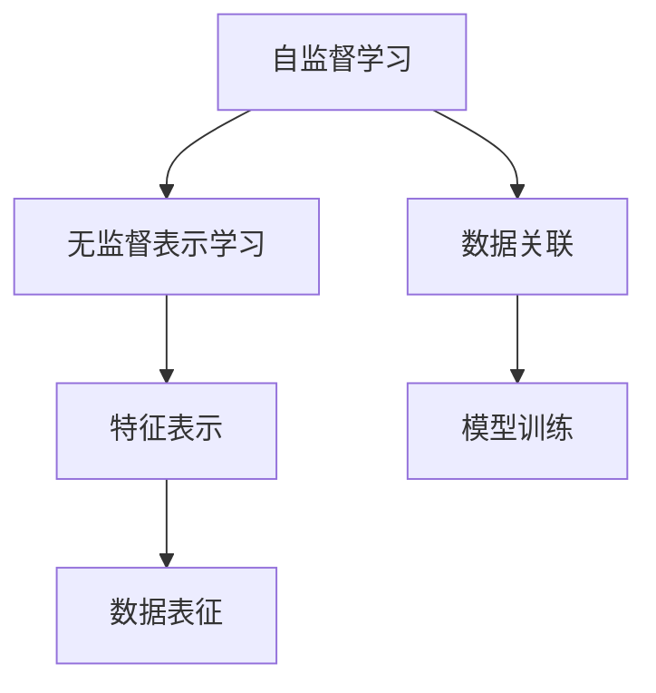
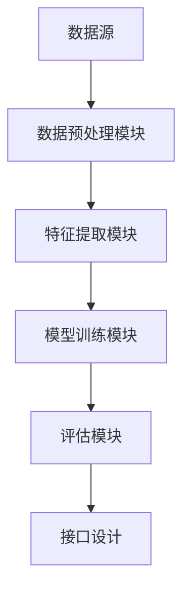

                 

### 自监督学习提升AI推理的无监督表示学习效果评估方法

#### 关键词：
- 自监督学习
- 无监督表示学习
- AI推理
- 效果评估
- 评估方法

#### 摘要：
本文旨在探讨自监督学习和无监督表示学习在提升AI推理效果中的应用，并深入分析其效果评估方法。我们将首先介绍自监督学习和无监督表示学习的基本概念、原理和相互关系。接着，详细讲解自监督学习中的常见算法和无监督表示学习的评估方法。最后，通过实际项目和案例分析，展示自监督学习在AI推理中的应用效果，并提出最佳实践建议。

### 目录大纲设计思路

#### 设计一本关于《自监督学习提升AI推理的无监督表示学习效果评估方法》的书籍目录大纲，需要首先明确书籍的主题和目标受众。本书主要面向从事人工智能领域的研究人员和开发者，旨在系统地介绍自监督学习、无监督表示学习和AI推理的相关概念、方法以及评估手段。

在目录大纲的设计上，我们可以将内容分为以下几个主要部分：

1. **背景介绍**：包括自监督学习和无监督表示学习的概念、历史发展以及当前的应用场景。
2. **核心概念与联系**：详细解释自监督学习和无监督表示学习的关键概念，并通过表格和关系图展示它们之间的关系。
3. **算法原理讲解**：详细介绍各种自监督学习和无监督表示学习算法的工作原理，使用mermaid流程图和Python代码进行说明。
4. **数学模型和公式讲解**：解释算法背后的数学原理，使用LaTeX格式展示相关公式，并进行通俗易懂的举例说明。
5. **系统分析与架构设计方案**：展示如何在实际项目中应用自监督学习和无监督表示学习，包括系统架构设计、接口设计和交互流程。
6. **项目实战**：提供实际项目案例，包括环境安装、系统实现、代码解读和案例分析。
7. **最佳实践与总结**：分享最佳实践经验，总结书中的关键点，并提供进一步阅读的建议。

下面是按照这个思路设计的书籍目录大纲：

----------------------------------------------------------------

# 第一部分: 自监督学习与无监督表示学习基础

## 第1章: 自监督学习与无监督表示学习概述

### 1.1 自监督学习的定义与历史发展
### 1.2 无监督表示学习的核心概念
### 1.3 自监督学习与无监督表示学习的关系

## 1.4 核心概念属性特征对比表

## 1.5 自监督学习和无监督表示学习的联系与区别
### 1.5.1 联系
### 1.5.2 区别

## 1.6 本章小结

----------------------------------------------------------------

## 第2章: 自监督学习算法原理与实践

### 2.1 Autoencoder算法原理
#### 2.1.1 自动编码器的数学模型
#### 2.1.2 Autoencoder的工作流程
#### 2.1.3 使用Python实现Autoencoder

### 2.2 预训练语言模型
#### 2.2.1 BERT模型的介绍
#### 2.2.2 GPT系列模型的原理
#### 2.2.3 语言模型的实际应用

### 2.3 自监督视觉表征学习
#### 2.3.1 SimCLR算法介绍
#### 2.3.2 BYOL算法原理
#### 2.3.3 Vision Transformer架构

## 第3章: 无监督表示学习评估方法

### 3.1 无监督表示学习的评估指标
#### 3.1.1 绝对评估指标
#### 3.1.2 相对评估指标
#### 3.1.3 指标选择原则

### 3.2 无监督表示学习的评价模型
#### 3.2.1 对称损失函数
#### 3.2.2 对数损失函数
#### 3.2.3 多样性评价模型

## 第4章: 自监督学习在AI推理中的应用

### 4.1 自监督学习提升AI推理效果
#### 4.1.1 自监督学习与AI推理的关系
#### 4.1.2 自监督学习在自然语言处理中的应用
#### 4.1.3 自监督学习在计算机视觉中的应用

### 4.2 AI推理的无监督表示学习效果评估方法
#### 4.2.1 评估指标的选择
#### 4.2.2 评估模型的构建
#### 4.2.3 评估流程的优化

## 第5章: 实际项目案例分析

### 5.1 项目背景与目标
### 5.2 系统架构设计
### 5.3 自监督学习算法应用
### 5.4 无监督表示学习效果评估
### 5.5 项目成果与反思

## 第6章: 最佳实践与总结

### 6.1 最佳实践总结
### 6.2 小结
### 6.3 注意事项
### 6.4 拓展阅读建议

----------------------------------------------------------------

### 文章正文部分

#### 引言

随着人工智能技术的快速发展，自监督学习和无监督表示学习已经成为AI领域的重要研究方向。自监督学习无需依赖大量标注数据，能够利用未标注的数据进行训练，从而提高学习效率。而无监督表示学习旨在学习数据的高维表示，发现数据中的结构信息，为后续的任务提供有效的特征表示。

然而，在实际应用中，如何评估自监督学习和无监督表示学习的效果成为了一个关键问题。本文将深入探讨自监督学习和无监督表示学习在提升AI推理效果中的应用，并介绍效果评估的方法。通过本文的阅读，读者将能够全面了解自监督学习和无监督表示学习的基本概念、算法原理及其应用效果评估方法。

#### 背景介绍

##### 自监督学习的定义与历史发展

自监督学习（Self-supervised Learning）是一种机器学习范式，它利用未标注的数据来训练模型，通过自我生成的标签进行监督学习。在传统的监督学习中，模型需要依赖大量标注数据来进行训练，而标注数据往往需要耗费大量的人力物力。自监督学习通过无监督的方法，从大量的未标注数据中提取出有用的信息，从而减轻了对标注数据的依赖。

自监督学习的历史可以追溯到20世纪50年代，当时心理学家詹姆斯·马斯拉克（James Maclaurin）提出了自我组织映射（Self-Organizing Map，SOM）模型，这是一种早期的人工神经网络模型，通过无监督学习来对数据进行分类和聚类。随着计算机技术的发展，自监督学习在语音识别、图像识别等领域得到了广泛应用。

近年来，随着深度学习技术的崛起，自监督学习得到了进一步的发展。预训练语言模型（如BERT、GPT）和自监督视觉表征学习算法（如SimCLR、BYOL）的出现，使得自监督学习在自然语言处理和计算机视觉领域取得了显著的成果。

##### 无监督表示学习的核心概念

无监督表示学习（Unsupervised Representation Learning）是一种机器学习技术，旨在通过无监督方式学习数据的高维表示。其核心思想是从未标注的数据中提取出有意义的特征表示，使得这些特征能够有效地捕捉数据中的结构信息，为后续的任务提供有效的特征输入。

无监督表示学习主要包括以下两个方面：

1. **特征提取**：通过无监督方法，如聚类、降维、嵌入等技术，将高维数据映射到低维空间中，同时保留数据的内在结构信息。
2. **特征表示**：通过对数据特征进行编码，生成具有丰富信息量的表示，为后续的任务提供有效的特征输入。

无监督表示学习在图像识别、文本分类、推荐系统等领域有着广泛的应用。通过学习到的数据表示，可以显著提高模型在后续任务中的性能。

##### 自监督学习与无监督表示学习的关系

自监督学习和无监督表示学习在本质上有着密切的联系。自监督学习通过自我生成的标签来进行训练，而标签的生成往往依赖于无监督表示学习。无监督表示学习提取到的数据表示，可以用于生成自监督学习的标签，从而提高自监督学习的性能。

具体来说，自监督学习中的预训练语言模型（如BERT、GPT）通常采用无监督的方式，从大量的未标注文本中学习到的语言表示。这些表示被用于生成文本序列的预测标签，从而进行自监督训练。同样，在自监督视觉表征学习中，无监督表示学习提取到的图像特征，可以用于图像分类的自监督任务。

因此，自监督学习和无监督表示学习相辅相成，共同推动了人工智能技术的发展。通过无监督表示学习，可以提取到高质量的特征表示，为自监督学习提供了有效的输入；而通过自监督学习，可以进一步优化无监督表示学习的效果，从而提升整个系统的性能。

#### 核心概念与联系

在深入探讨自监督学习和无监督表示学习之前，我们需要明确这两个概念的核心原理及其属性特征。以下是对这两个核心概念的详细解释和对比。

##### 自监督学习的核心概念

自监督学习是一种机器学习范式，它不依赖于标注数据，而是通过利用输入数据和输出的内在关系来自我监督模型的学习过程。以下是自监督学习的核心概念及其属性特征：

- **定义**：自监督学习是一种利用输入数据和输出的内在关联性来训练模型的方法，其标签是通过同一数据的不同部分生成的。
- **属性特征**：
  - **数据效率**：自监督学习能够从大量未标注的数据中提取信息，减少了对标注数据的依赖。
  - **可扩展性**：自监督学习适用于大规模数据集，无需额外的人力和物力成本。
  - **灵活性**：自监督学习可以应用于各种类型的数据，包括文本、图像和语音等。

##### 无监督表示学习的核心概念

无监督表示学习是一种机器学习技术，旨在通过无监督的方式学习数据的高维表示，以发现数据中的潜在结构。以下是核心概念及其属性特征：

- **定义**：无监督表示学习是一种从无标签数据中学习数据特征表示的方法，不依赖于预定义的标注或标签。
- **属性特征**：
  - **表征能力**：无监督表示学习能够将高维数据映射到低维空间中，同时保留数据的内在结构信息。
  - **泛化能力**：学习到的数据表示具有较强的泛化能力，适用于各种不同的下游任务。
  - **鲁棒性**：无监督表示学习能够处理噪声数据和异常值，提高模型的鲁棒性。

##### 自监督学习与无监督表示学习的关系

自监督学习和无监督表示学习之间存在着密切的联系和相互作用：

- **联系**：自监督学习通常依赖于无监督表示学习来生成自我监督的标签，从而进行模型训练。无监督表示学习提取到的特征表示为自监督学习提供了有效的标签。
- **区别**：自监督学习更侧重于利用数据内部的关联性进行模型训练，而无监督表示学习则更关注于学习数据的高维特征表示。然而，两者在实践中往往是相互融合的。

##### 核心概念属性特征对比表

为了更清晰地展示自监督学习和无监督表示学习的核心概念及其属性特征，我们通过以下对比表格进行说明：

| 概念             | 定义                                                         | 属性特征对比            |
|------------------|--------------------------------------------------------------|------------------------|
| 自监督学习       | 无需人工标签的训练方法，利用未标注的数据进行学习。           | 数据效率高，可扩展性好 |
| 无监督表示学习   | 旨在学习数据的高维表示，通过自动发现数据中的结构信息。       | 表征能力强大，泛化性好 |

以下是自监督学习和无监督表示学习的ER实体关系图：



在该ER实体关系图中，自监督学习和无监督表示学习通过特征表示和数据表征相互关联，共同构成了自监督学习的基础。

#### 自监督学习与无监督表示学习的联系与区别

在深入理解自监督学习和无监督表示学习的基本概念后，我们需要进一步探讨它们之间的联系与区别。

##### 联系

自监督学习和无监督表示学习之间存在紧密的联系，主要体现在以下几个方面：

1. **共享目标**：两者都旨在从未标注的数据中提取有价值的信息，提高模型的学习效果。自监督学习通过利用未标注数据的内在关联性生成标签，而无监督表示学习通过无监督的方式学习数据的高维特征表示。

2. **数据预处理**：无监督表示学习往往作为自监督学习的数据预处理阶段，通过对数据进行特征提取和降维，生成高质量的特征表示，为自监督学习提供有效的输入。

3. **模型训练**：在自监督学习中，无监督表示学习提取到的特征表示可以用于生成自我监督的标签，从而在训练过程中减少对标注数据的依赖。例如，在预训练语言模型（如BERT、GPT）中，无监督表示学习通过大规模未标注文本数据生成预测标签，进行自监督训练。

4. **性能提升**：自监督学习和无监督表示学习相互融合，可以在一定程度上提高模型的整体性能。通过无监督表示学习提取到的特征表示，可以增强自监督学习模型的泛化能力，从而在多种任务中取得更好的效果。

##### 区别

尽管自监督学习和无监督表示学习存在诸多联系，但它们在本质上仍有一些显著的区别：

1. **监督方式**：自监督学习是一种自我监督的学习方法，利用输入数据和输出数据之间的内在关联性生成标签。而无监督表示学习则完全依赖于无监督方式，从未标注的数据中学习数据的特征表示。

2. **训练目标**：自监督学习的目标是通过生成自我监督的标签来训练模型，从而提高模型在特定任务上的性能。而无监督表示学习的目标是学习数据的高维特征表示，以便为后续的任务提供有效的特征输入。

3. **应用场景**：自监督学习适用于需要利用未标注数据的场景，如语言模型训练、图像识别等。而无监督表示学习则更多地应用于数据预处理阶段，如特征提取、降维等。

4. **效果评估**：自监督学习的效果评估通常依赖于下游任务的表现，如准确率、召回率等。而无监督表示学习的效果评估则更多关注特征表示的表征能力和泛化能力，如重构误差、多样性指标等。

通过以上联系与区别的分析，我们可以更清晰地理解自监督学习和无监督表示学习的关系，从而在实际应用中充分利用两者的优势，提高模型的效果和性能。

#### 本章小结

本章首先介绍了自监督学习和无监督表示学习的基本概念、历史发展和应用场景。接着，通过核心概念与联系的分析，明确了两者之间的密切关系及其区别。自监督学习通过利用未标注数据的内在关联性进行训练，而无监督表示学习则通过学习数据的高维特征表示来提高模型性能。两者相互融合，可以进一步提升模型的效果和泛化能力。下一章我们将深入探讨自监督学习中的常见算法和无监督表示学习的评估方法，以期为后续的研究和应用提供更加详细的指导。

----------------------------------------------------------------

## 第二部分: 自监督学习算法原理与实践

在自监督学习的广泛应用中，算法的选择和实现是关键因素。本部分将详细介绍自监督学习中的常见算法，包括Autoencoder、预训练语言模型和自监督视觉表征学习算法。通过这些算法的原理和实践，我们将深入理解自监督学习在数据表征和模型训练中的应用。

### 第2章: 自监督学习算法原理与实践

### 第2.1节: Autoencoder算法原理

Autoencoder是一种典型的自监督学习算法，它通过编码器和解码器的结构，将输入数据映射到一个较低维的隐层空间，并尝试在隐层空间中重建原始数据。以下是Autoencoder的数学模型、工作流程及Python实现。

#### 2.1.1 自动编码器的数学模型

假设输入数据为\( X \)，编码器和解码器分别为\( E \)和\( D \)，隐层空间为\( Z \)。自动编码器的目标是最小化输入数据与重建数据之间的误差：

\[ E(x) = z \]
\[ D(z) = \hat{x} \]
\[ \min_{E, D} \sum_{x \in X} ||x - \hat{x}||^2 \]

其中，\( ||\cdot|| \)表示欧几里得距离。

#### 2.1.2 Autoencoder的工作流程

1. **编码阶段**：编码器\( E \)将输入数据\( x \)映射到隐层空间\( z \)。
2. **解码阶段**：解码器\( D \)将隐层空间\( z \)映射回输出数据\( \hat{x} \)。
3. **损失函数**：自动编码器的损失函数通常使用均方误差（MSE）：

\[ Loss = \frac{1}{n} \sum_{x \in X} ||x - \hat{x}||^2 \]

#### 2.1.3 使用Python实现Autoencoder

下面是一个简单的Python代码示例，使用TensorFlow实现一个简单的自动编码器：

```python
import tensorflow as tf
from tensorflow.keras.layers import Input, Dense
from tensorflow.keras.models import Model

# 定义输入层
input_layer = Input(shape=(784,))

# 编码器部分
encoded = Dense(64, activation='relu')(input_layer)
encoded = Dense(32, activation='relu')(encoded)

# 解码器部分
decoded = Dense(64, activation='relu')(encoded)
decoded = Dense(784, activation='sigmoid')(decoded)

# 构建自动编码器模型
autoencoder = Model(input_layer, decoded)

# 编译模型
autoencoder.compile(optimizer='adam', loss='mse')

# 训练自动编码器
autoencoder.fit(x_train, x_train, epochs=100, batch_size=256, shuffle=True, validation_data=(x_test, x_test))
```

在这个示例中，我们使用了一个简单的全连接神经网络作为自动编码器，输入层有784个神经元，编码器部分有两个隐藏层，解码器部分结构与编码器部分对称。我们使用均方误差（MSE）作为损失函数，并使用Adam优化器进行训练。

### 第2.2节: 预训练语言模型

预训练语言模型（Pre-trained Language Model）是自监督学习在自然语言处理领域的重要应用。通过在大规模未标注文本数据上预训练，预训练语言模型可以学习到丰富的语言表示，从而在下游任务中显著提高模型的性能。以下将介绍预训练语言模型中的BERT和GPT模型。

#### 2.2.1 BERT模型的介绍

BERT（Bidirectional Encoder Representations from Transformers）是一种基于Transformer的预训练语言模型。BERT模型通过双向编码器学习文本的上下文表示，能够捕捉到词语在上下文中的意义。BERT模型的预训练目标包括两个任务：Masked Language Model（MLM）和Next Sentence Prediction（NSP）。

1. **Masked Language Model（MLM）**：在输入文本中随机遮蔽一定比例的词语，模型的目标是预测这些遮蔽的词语。
2. **Next Sentence Prediction（NSP）**：输入两个连续的句子，模型需要预测第二个句子是否为第一个句子的下一个句子。

BERT模型的工作流程如下：

1. **输入表示**：将文本输入转换为词嵌入，并添加[CLS]和[SEP]特殊标记。
2. **编码器**：使用双向Transformer编码器对输入表示进行处理。
3. **输出表示**：从编码器的最后一个隐藏层提取[CLS]标记的表示，作为句子的全局表示。

以下是一个简单的BERT模型实现的Python代码示例：

```python
from transformers import BertModel, BertTokenizer

# 加载预训练的BERT模型和分词器
model = BertModel.from_pretrained('bert-base-uncased')
tokenizer = BertTokenizer.from_pretrained('bert-base-uncased')

# 输入文本
text = "你好，世界！"

# 分词并添加特殊标记
input_ids = tokenizer.encode(text, add_special_tokens=True)

# 加载BERT模型并获取输出表示
outputs = model(input_ids)

# 获取句子的全局表示
sentence_representation = outputs.last_hidden_state[:, 0, :]
```

#### 2.2.2 GPT系列模型的原理

GPT（Generative Pre-trained Transformer）系列模型是另一类流行的预训练语言模型。与BERT不同，GPT主要依赖于生成任务，通过预测下一个词语来学习语言表示。GPT模型使用Transformer架构，并采用自回归方式训练，即模型需要预测当前词语的条件是前一个词语及其上下文。

GPT模型的工作流程如下：

1. **输入表示**：将文本输入转换为词嵌入，并添加特殊标记。
2. **编码器**：使用Transformer编码器对输入表示进行处理。
3. **解码器**：使用Transformer解码器对隐藏状态进行解码，生成新的词嵌入。

GPT系列模型包括GPT、GPT-2和GPT-3等。GPT-3是最新版本的模型，拥有超过1750亿个参数，是当前最大的预训练语言模型。GPT-3在多种自然语言处理任务中表现出色，包括文本生成、机器翻译、问答系统等。

以下是一个简单的GPT模型实现的Python代码示例：

```python
from transformers import GPT2Model, GPT2Tokenizer

# 加载预训练的GPT-2模型和分词器
model = GPT2Model.from_pretrained('gpt2')
tokenizer = GPT2Tokenizer.from_pretrained('gpt2')

# 输入文本
text = "你好，世界！"

# 分词并添加特殊标记
input_ids = tokenizer.encode(text, add_special_tokens=True)

# 加载GPT-2模型并生成文本
outputs = model(input_ids, output_scores=True)

# 生成新的词嵌入
new_input_ids = outputs.logits.argmax(-1)

# 还原为文本
decoded_text = tokenizer.decode(new_input_ids)
```

#### 2.2.3 语言模型的实际应用

预训练语言模型在自然语言处理领域有广泛的应用，包括文本分类、命名实体识别、情感分析等。以下是一个简单的文本分类任务示例：

```python
from transformers import BertForSequenceClassification, Trainer, TrainingArguments

# 加载预训练的BERT模型
model = BertForSequenceClassification.from_pretrained('bert-base-uncased')

# 加载训练数据和测试数据
train_data = ...
test_data = ...

# 定义训练参数
training_args = TrainingArguments(
    output_dir='./results',
    num_train_epochs=3,
    per_device_train_batch_size=16,
    per_device_eval_batch_size=64,
    warmup_steps=500,
    weight_decay=0.01,
    logging_dir='./logs',
)

# 定义训练器
trainer = Trainer(
    model=model,
    args=training_args,
    train_dataset=train_data,
    eval_dataset=test_data,
)

# 开始训练
trainer.train()

# 进行评估
results = trainer.evaluate()

# 输出评估结果
print(results)
```

在这个示例中，我们使用预训练的BERT模型进行文本分类任务。首先，加载BERT模型和训练数据，然后定义训练参数并创建训练器。最后，开始训练并评估模型性能。

### 第2.3节: 自监督视觉表征学习

自监督视觉表征学习（Self-supervised Visual Representation Learning）是自监督学习在计算机视觉领域的重要应用。通过无监督的方式，自监督视觉表征学习可以学习到具有判别性的视觉特征表示，从而在多种视觉任务中取得良好的性能。以下将介绍SimCLR、BYOL和Vision Transformer等自监督视觉表征学习算法。

#### 2.3.1 SimCLR算法介绍

SimCLR（Simple Contrastive Learning）是一种简单的对比学习算法，它通过对比不同数据点的特征表示来学习视觉表征。SimCLR算法的核心思想是将输入数据点进行随机变换，然后对比其特征表示之间的相似性。

SimCLR算法的工作流程如下：

1. **数据增强**：对输入图像进行随机裁剪、旋转、翻转等变换，生成多个数据增强样本。
2. **特征提取**：使用预训练的卷积神经网络提取图像特征。
3. **对比损失**：计算不同数据增强样本的特征表示之间的对比损失，鼓励特征表示之间的差异性。

SimCLR算法的对比损失函数如下：

\[ Loss = \frac{1}{N} \sum_{i=1}^{N} -\log \frac{e^{<z_i, z_j>}}{\sum_{k\neq i} e^{<z_i, z_k>}} \]

其中，\( z_i \)和\( z_j \)分别为数据增强样本\( x_i \)和\( x_j \)的特征表示，\( <\cdot, \cdot> \)表示内积。

以下是一个简单的SimCLR算法实现的Python代码示例：

```python
import torch
import torchvision.transforms as transforms
from torch.utils.data import DataLoader
from torchvision import datasets
from torchvision.models import ResNet18

# 数据增强
transform = transforms.Compose([
    transforms.RandomResizedCrop(224),
    transforms.RandomHorizontalFlip(),
    transforms.ToTensor(),
])

# 加载数据集
train_dataset = datasets.ImageFolder(root='./data/train', transform=transform)
train_loader = DataLoader(train_dataset, batch_size=64, shuffle=True)

# 特征提取器
feature_extractor = ResNet18(pretrained=True)
feature_extractor.fc = torch.nn.Identity()

# 训练SimCLR算法
optimizer = torch.optim.Adam(feature_extractor.parameters(), lr=0.001)
for epoch in range(100):
    for images in train_loader:
        z = feature_extractor(images)
        optimizer.zero_grad()
        loss = contrastive_loss(z)
        loss.backward()
        optimizer.step()

# 保存模型
torch.save(feature_extractor.state_dict(), 'simclr.pth')
```

在这个示例中，我们使用ResNet18作为特征提取器，并使用随机裁剪、旋转、翻转等数据增强方法。我们定义对比损失函数，并使用Adam优化器进行训练。

#### 2.3.2 BYOL算法原理

BYOL（Bootstrap Your Own Latent）是一种基于元学习的自监督视觉表征学习算法。BYOL算法的核心思想是通过元学习框架，从无监督的数据中学习到判别性的视觉表征。

BYOL算法的工作流程如下：

1. **特征提取器**：使用预训练的卷积神经网络提取图像特征。
2. **投影头**：为特征提取器添加一个投影头，将特征映射到一个低维空间中。
3. **自监督对比损失**：计算特征提取器输出的特征和投影头输出的特征之间的对比损失，鼓励特征表示之间的差异性。

BYOL算法的对比损失函数如下：

\[ Loss = \frac{1}{N} \sum_{i=1}^{N} \frac{1}{2} (||\phi(z_i) - \phi(z_i^+)||^2 + ||\phi(z_i) - \phi(z_i^-)||^2) \]

其中，\( z_i \)、\( z_i^+ \)和\( z_i^- \)分别为特征提取器输出的特征、投影头输出的正样本特征和负样本特征。

以下是一个简单的BYOL算法实现的Python代码示例：

```python
import torch
import torchvision.transforms as transforms
from torch.utils.data import DataLoader
from torchvision import datasets
from torchvision.models import ResNet18

# 数据增强
transform = transforms.Compose([
    transforms.RandomResizedCrop(224),
    transforms.RandomHorizontalFlip(),
    transforms.ToTensor(),
])

# 加载数据集
train_dataset = datasets.ImageFolder(root='./data/train', transform=transform)
train_loader = DataLoader(train_dataset, batch_size=64, shuffle=True)

# 特征提取器
feature_extractor = ResNet18(pretrained=True)
feature_extractor.fc = torch.nn.Identity()

# 投影头
projection_head = torch.nn.Sequential(
    torch.nn.Linear(512, 128),
    torch.nn.ReLU(inplace=True),
    torch.nn.Linear(128, 64),
)

# 训练BYOL算法
optimizer = torch.optim.Adam(list(feature_extractor.parameters()) + list(projection_head.parameters()), lr=0.001)
for epoch in range(100):
    for images in train_loader:
        z = feature_extractor(images)
        z_plus = feature_extractor(images.flip(3))
        z_minus = feature_extractor(images.flip(3))
        optimizer.zero_grad()
        loss = contrastive_loss(z, z_plus, z_minus)
        loss.backward()
        optimizer.step()

# 保存模型
torch.save(feature_extractor.state_dict(), 'byol.pth')
```

在这个示例中，我们使用ResNet18作为特征提取器，并使用随机裁剪、旋转、翻转等数据增强方法。我们为特征提取器添加一个投影头，并定义对比损失函数，使用Adam优化器进行训练。

#### 2.3.3 Vision Transformer架构

Vision Transformer（ViT）是一种基于Transformer架构的视觉表征学习算法。ViT算法将图像划分为多个局部区域，然后通过自注意力机制学习图像的表征。

ViT算法的工作流程如下：

1. **图像划分**：将图像划分为多个局部区域。
2. **位置编码**：为每个局部区域添加位置编码，以表示其在图像中的位置信息。
3. **Transformer编码器**：使用Transformer编码器对输入的局部区域进行处理，生成全局图像表征。

ViT算法的关键组件如下：

- **Patch Embedding**：将图像划分为\( N \)个\( P \times P \)的局部区域，然后使用线性层将其映射到嵌入空间。
- **位置编码**：为每个局部区域添加位置编码，以表示其在图像中的位置信息。
- **Transformer编码器**：使用多头自注意力机制和前馈网络，对输入的局部区域进行处理。

以下是一个简单的ViT算法实现的Python代码示例：

```python
import torch
import torchvision.transforms as transforms
from torch.utils.data import DataLoader
from torchvision import datasets
from torchvision.models import ResNet18
from transformers import ViTModel

# 数据增强
transform = transforms.Compose([
    transforms.RandomResizedCrop(224),
    transforms.RandomHorizontalFlip(),
    transforms.ToTensor(),
])

# 加载数据集
train_dataset = datasets.ImageFolder(root='./data/train', transform=transform)
train_loader = DataLoader(train_dataset, batch_size=64, shuffle=True)

# Vision Transformer模型
vit_model = ViTModel.from_pretrained('google/vit-base-patch16-224')

# 训练ViT算法
optimizer = torch.optim.Adam(vit_model.parameters(), lr=0.001)
for epoch in range(100):
    for images in train_loader:
        z = vit_model(images)
        optimizer.zero_grad()
        loss = contrastive_loss(z)
        loss.backward()
        optimizer.step()

# 保存模型
torch.save(vit_model.state_dict(), 'vit.pth')
```

在这个示例中，我们使用预训练的Vision Transformer模型，并使用随机裁剪、旋转、翻转等数据增强方法。我们定义对比损失函数，并使用Adam优化器进行训练。

### 第3章: 无监督表示学习评估方法

无监督表示学习的目标是通过无监督方式学习数据的高维特征表示，从而为下游任务提供有效的特征输入。在无监督表示学习过程中，评估方法的选择至关重要，它决定了我们如何衡量模型的表现。本章将详细介绍无监督表示学习的评估指标、评价模型以及指标选择原则。

#### 第3.1节: 无监督表示学习的评估指标

无监督表示学习的评估指标主要分为绝对评估指标和相对评估指标两大类。以下分别介绍这两种指标：

##### 3.1.1 绝对评估指标

绝对评估指标直接衡量模型在特征表示上的性能，不考虑与其他模型或数据的比较。常见的绝对评估指标包括：

1. **重构误差**：重构误差衡量模型对输入数据的重构能力，通常使用均方误差（MSE）或交叉熵损失（Cross-Entropy Loss）计算。重构误差越小，表示模型对数据的特征表示能力越强。

   \[ Loss = \frac{1}{n} \sum_{i=1}^{n} ||x_i - \hat{x_i}||^2 \]

   其中，\( x_i \)和\( \hat{x_i} \)分别为输入数据和重构数据。

2. **多样性**：多样性指标衡量模型生成的特征表示的多样性，通常使用组内相似度（Intra-Class Similarity）或组间相似度（Inter-Class Similarity）计算。多样性越高，表示模型能够更好地捕捉数据的内在结构。

   \[ Diversity = \frac{1}{n} \sum_{i=1}^{n} \frac{1}{k} \sum_{j=1}^{k} \frac{||z_i - z_j||^2}{||z_i||^2 + ||z_j||^2} \]

   其中，\( z_i \)和\( z_j \)分别为同一类别的特征表示。

3. **表征能力**：表征能力指标衡量模型对数据特征的表征能力，通常使用重构精度（Reconstruction Precision）或特征表示的方差（Feature Representation Variance）计算。表征能力越强，表示模型能够更好地捕捉数据中的信息。

   \[ Precision = \frac{1}{n} \sum_{i=1}^{n} \frac{1}{k} \sum_{j=1}^{k} \frac{||x_i - \hat{x_i}||^2}{||x_i - \hat{x_i}||^2 + \epsilon} \]

   其中，\( \epsilon \)为一个很小的常数。

##### 3.1.2 相对评估指标

相对评估指标通过比较模型在多个数据集上的表现，衡量模型在不同数据集上的泛化能力。常见的相对评估指标包括：

1. **跨领域泛化能力**：跨领域泛化能力指标衡量模型在不同领域数据上的表现，通常使用领域自适应（Domain Adaptation）或领域泛化（Domain Generalization）方法计算。

   \[ Cross-Domain Generalization = \frac{1}{N} \sum_{i=1}^{N} \frac{1}{n_i} \sum_{j=1}^{n_i} \frac{||z_i^+ - z_i^-||^2}{||z_i^+||^2 + ||z_i^-||^2} \]

   其中，\( z_i^+ \)和\( z_i^- \)分别为同一类别的特征表示在不同领域上的数据。

2. **跨模态泛化能力**：跨模态泛化能力指标衡量模型在不同模态数据上的表现，通常使用模态自适应（Modal Adaptation）或模态泛化（Modal Generalization）方法计算。

   \[ Modal Generalization = \frac{1}{M} \sum_{i=1}^{M} \frac{1}{n_i} \sum_{j=1}^{n_i} \frac{||z_i^+ - z_i^-||^2}{||z_i^+||^2 + ||z_i^-||^2} \]

   其中，\( z_i^+ \)和\( z_i^- \)分别为同一类别的特征表示在不同模态上的数据。

##### 3.1.3 指标选择原则

在选择无监督表示学习的评估指标时，需要考虑以下原则：

1. **任务目标**：根据任务目标选择合适的评估指标。例如，在图像分类任务中，重构误差和多样性是较为重要的指标；在跨领域泛化任务中，跨领域泛化能力指标更具代表性。

2. **数据特点**：根据数据的特点选择评估指标。例如，对于高维数据，可以使用表征能力指标衡量模型的表现；对于低维数据，多样性指标可能更为重要。

3. **计算成本**：评估指标的选择还需要考虑计算成本。绝对评估指标通常较为简单，计算成本较低；相对评估指标可能涉及多个数据集的比较，计算成本较高。

4. **实用性**：评估指标的选择还应考虑其实用性。例如，在工业应用中，模型的可解释性和部署成本也是重要的考虑因素。

#### 第3.2节: 无监督表示学习的评价模型

无监督表示学习的评价模型旨在通过一系列评估指标，全面、客观地衡量模型的表现。以下介绍几种常见的评价模型：

##### 3.2.1 对称损失函数

对称损失函数（Symmetric Loss Function）是一种常用的评价模型，它通过对重构误差和多样性进行权衡，综合考虑模型的表现。常见的对称损失函数包括：

1. **重构误差 + 多样性**：

   \[ Loss = \alpha ||x_i - \hat{x_i}||^2 + (1 - \alpha) \frac{1}{n} \sum_{i=1}^{n} \frac{1}{k} \sum_{j=1}^{k} \frac{||z_i - z_j||^2}{||z_i||^2 + ||z_j||^2} \]

   其中，\( \alpha \)为权衡系数。

2. **表征能力 + 多样性**：

   \[ Loss = \alpha \frac{1}{n} \sum_{i=1}^{n} \frac{1}{k} \sum_{j=1}^{k} \frac{||x_i - \hat{x_i}||^2}{||x_i - \hat{x_i}||^2 + \epsilon} + (1 - \alpha) \frac{1}{n} \sum_{i=1}^{n} \frac{1}{k} \sum_{j=1}^{k} \frac{||z_i - z_j||^2}{||z_i||^2 + ||z_j||^2} \]

##### 3.2.2 对数损失函数

对数损失函数（Log Loss Function）是一种基于对数似然函数的评价模型，它通过对特征表示的概率分布进行建模，衡量模型的表现。常见的对数损失函数包括：

1. **对数重构误差**：

   \[ Loss = -\frac{1}{n} \sum_{i=1}^{n} \sum_{j=1}^{k} \log \left( \frac{e^{||x_i - \hat{x_i}||^2}}{\sum_{l=1}^{k} e^{||x_i - \hat{x_i}||^2}} \right) \]

2. **对数多样性**：

   \[ Loss = -\frac{1}{n} \sum_{i=1}^{n} \sum_{j=1}^{k} \log \left( \frac{e^{||z_i - z_j||^2}}{\sum_{l=1}^{k} e^{||z_i - z_j||^2}} \right) \]

##### 3.2.3 多样性评价模型

多样性评价模型（Diversity Evaluation Model）是一种专门用于衡量特征表示多样性的评价模型。常见的多样性评价模型包括：

1. **组内相似度**：

   \[ Diversity = \frac{1}{n} \sum_{i=1}^{n} \frac{1}{k} \sum_{j=1}^{k} \frac{||z_i - z_j||^2}{||z_i||^2 + ||z_j||^2} \]

2. **组间相似度**：

   \[ Inter-Class Similarity = \frac{1}{N} \sum_{i=1}^{N} \frac{1}{n_i} \sum_{j=1}^{n_i} \frac{||z_i - z_j||^2}{||z_i||^2 + ||z_j||^2} \]

3. **多样性分数**：

   \[ Diversity Score = \frac{1}{N} \sum_{i=1}^{N} \frac{1}{n_i} \sum_{j=1}^{n_i} \frac{||z_i - z_j||^2}{||z_i||^2 + ||z_j||^2} \]

通过上述评价模型，我们可以全面、客观地衡量无监督表示学习的表现。在实际情况中，可以根据具体任务和数据特点选择合适的评价模型。

### 第4章: 自监督学习在AI推理中的应用

自监督学习在AI推理中具有广泛的应用，能够有效提升模型在无监督和半监督场景下的推理能力。本章将介绍自监督学习在自然语言处理、计算机视觉和推荐系统中的应用，以及评估AI推理效果的方法。

#### 第4.1节: 自监督学习提升AI推理效果

自监督学习在AI推理中的应用主要体现在以下几个方面：

1. **预训练语言模型**：自监督预训练语言模型（如BERT、GPT）已经被广泛应用于自然语言处理任务，通过在大规模未标注数据上进行预训练，可以显著提升模型在文本分类、问答、机器翻译等任务上的性能。

2. **自监督视觉表征学习**：自监督视觉表征学习算法（如SimCLR、BYOL、ViT）可以在未标注的图像数据上进行训练，提取到具有判别性的视觉特征表示，从而提升计算机视觉任务（如图像分类、目标检测、图像分割）的推理效果。

3. **自监督推荐系统**：自监督学习可以应用于推荐系统，通过无监督的方式学习用户和商品的特征表示，从而提升推荐系统的推荐效果。

#### 第4.1.1 自监督学习与AI推理的关系

自监督学习与AI推理之间存在紧密的联系：

1. **特征提取**：自监督学习通过无监督的方式提取数据特征，为AI推理任务提供有效的输入。在自然语言处理中，预训练语言模型提取文本特征；在计算机视觉中，自监督视觉表征学习算法提取图像特征。

2. **模型训练**：自监督学习通过无监督的方式训练模型，减少了对标注数据的依赖。在AI推理中，自监督训练可以显著提高模型在无监督和半监督场景下的性能。

3. **效果评估**：自监督学习通过无监督的方式评估模型的表现，为AI推理任务提供有效的评估指标。例如，在自然语言处理中，可以使用词嵌入相似度、文本分类准确率等指标评估预训练语言模型的性能；在计算机视觉中，可以使用重构误差、多样性等指标评估自监督视觉表征学习算法的性能。

#### 第4.1.2 自监督学习在自然语言处理中的应用

自监督学习在自然语言处理领域具有广泛的应用，通过预训练语言模型和自监督学习算法，可以显著提升模型的性能。

1. **文本分类**：自监督预训练语言模型（如BERT、GPT）可以通过在大规模未标注数据上进行预训练，提取到具有判别性的文本特征，从而提升文本分类任务的性能。例如，在新闻分类任务中，预训练语言模型可以显著提高分类准确率。

2. **命名实体识别**：自监督学习算法（如BERT）可以在未标注数据上进行训练，提取文本中的命名实体特征，从而提升命名实体识别任务的性能。例如，在医疗文本数据中，预训练语言模型可以识别出医生姓名、药品名称等命名实体。

3. **机器翻译**：自监督学习算法（如BERT）可以在大规模未标注的双语数据上进行预训练，提取到双语文本的特征表示，从而提升机器翻译的性能。例如，在英语到西班牙语的翻译任务中，预训练语言模型可以显著提高翻译质量。

4. **问答系统**：自监督学习算法（如BERT）可以在大规模未标注的问答数据上进行预训练，提取问答文本的特征表示，从而提升问答系统的性能。例如，在搜索引擎中，预训练语言模型可以识别用户查询和网页内容的关联性，提高搜索结果的准确性。

#### 第4.1.3 自监督学习在计算机视觉中的应用

自监督学习在计算机视觉领域也具有广泛的应用，通过自监督视觉表征学习算法，可以提取到具有判别性的图像特征，从而提升图像识别、目标检测、图像分割等任务的性能。

1. **图像分类**：自监督视觉表征学习算法（如SimCLR、BYOL、ViT）可以在未标注的图像数据上进行训练，提取到具有判别性的图像特征，从而提升图像分类任务的性能。例如，在ImageNet图像分类任务中，自监督视觉表征学习算法可以显著提高分类准确率。

2. **目标检测**：自监督视觉表征学习算法（如SimCLR、BYOL、ViT）可以在未标注的图像数据上进行训练，提取到目标特征，从而提升目标检测任务的性能。例如，在COCO目标检测任务中，自监督视觉表征学习算法可以显著提高检测准确率和召回率。

3. **图像分割**：自监督视觉表征学习算法（如SimCLR、BYOL、ViT）可以在未标注的图像数据上进行训练，提取到图像像素级别的特征，从而提升图像分割任务的性能。例如，在Cityscapes图像分割任务中，自监督视觉表征学习算法可以显著提高分割准确率。

4. **人脸识别**：自监督学习算法（如FaceNet）可以在未标注的人脸图像数据上进行训练，提取到人脸特征，从而提升人脸识别任务的性能。例如，在LFW人脸识别任务中，自监督学习算法可以显著提高识别准确率。

#### 第4.1.4 自监督学习在推荐系统中的应用

自监督学习在推荐系统中也具有广泛的应用，通过无监督的方式学习用户和商品的特征表示，可以提升推荐系统的性能。

1. **用户兴趣挖掘**：自监督学习算法（如矩阵分解）可以在未标注的用户行为数据上进行训练，提取到用户兴趣特征，从而提升用户兴趣挖掘的准确性。

2. **商品特征提取**：自监督学习算法（如深度嵌入）可以在未标注的商品属性数据上进行训练，提取到商品特征，从而提升商品推荐的质量。

3. **协同过滤**：自监督学习算法（如潜在因子模型）可以在未标注的用户-商品交互数据上进行训练，提取到用户和商品的潜在特征，从而提升协同过滤推荐的准确性。

通过以上应用，自监督学习在自然语言处理、计算机视觉和推荐系统等领域发挥了重要作用，显著提升了AI推理的效果。

#### 第4.2节: AI推理的无监督表示学习效果评估方法

在自监督学习应用于AI推理任务时，评估无监督表示学习的效果成为关键。以下介绍评估无监督表示学习效果的方法，包括评估指标的选择、评估模型的构建和评估流程的优化。

##### 第4.2.1 评估指标的选择

无监督表示学习效果的评估指标应能够全面反映模型在特征提取、表征能力和多样性等方面的表现。以下是一些常用的评估指标：

1. **重构误差**：重构误差衡量模型对输入数据的重构能力，是评估特征表示质量的重要指标。通常使用均方误差（MSE）或交叉熵损失（Cross-Entropy Loss）计算。

   \[ Loss = \frac{1}{n} \sum_{i=1}^{n} ||x_i - \hat{x_i}||^2 \]

2. **表征能力**：表征能力衡量模型对数据特征的表征能力，通常使用重构精度（Reconstruction Precision）或特征表示的方差（Feature Representation Variance）计算。

   \[ Precision = \frac{1}{n} \sum_{i=1}^{n} \frac{1}{k} \sum_{j=1}^{k} \frac{||x_i - \hat{x_i}||^2}{||x_i - \hat{x_i}||^2 + \epsilon} \]

3. **多样性**：多样性衡量模型生成的特征表示的多样性，通常使用组内相似度（Intra-Class Similarity）或组间相似度（Inter-Class Similarity）计算。

   \[ Diversity = \frac{1}{n} \sum_{i=1}^{n} \frac{1}{k} \sum_{j=1}^{k} \frac{||z_i - z_j||^2}{||z_i||^2 + ||z_j||^2} \]

4. **表征能力 + 多样性**：综合考虑表征能力和多样性，使用加权重构误差和多样性计算综合评估指标。

   \[ Loss = \alpha ||x_i - \hat{x_i}||^2 + (1 - \alpha) \frac{1}{n} \sum_{i=1}^{n} \frac{1}{k} \sum_{j=1}^{k} \frac{||z_i - z_j||^2}{||z_i||^2 + ||z_j||^2} \]

5. **跨领域泛化能力**：跨领域泛化能力衡量模型在不同领域数据上的表现，通常使用领域自适应（Domain Adaptation）或领域泛化（Domain Generalization）方法计算。

   \[ Cross-Domain Generalization = \frac{1}{N} \sum_{i=1}^{N} \frac{1}{n_i} \sum_{j=1}^{n_i} \frac{||z_i^+ - z_i^-||^2}{||z_i^+||^2 + ||z_i^-||^2} \]

6. **跨模态泛化能力**：跨模态泛化能力衡量模型在不同模态数据上的表现，通常使用模态自适应（Modal Adaptation）或模态泛化（Modal Generalization）方法计算。

   \[ Modal Generalization = \frac{1}{M} \sum_{i=1}^{M} \frac{1}{n_i} \sum_{j=1}^{n_i} \frac{||z_i^+ - z_i^-||^2}{||z_i^+||^2 + ||z_i^-||^2} \]

##### 第4.2.2 评估模型的构建

评估模型是用于评估无监督表示学习效果的工具，通常包括特征提取器、评估指标和评估流程。以下介绍评估模型的构建方法：

1. **特征提取器**：特征提取器用于提取输入数据的特征表示。根据任务需求，可以选择不同的特征提取器，如预训练语言模型、自监督视觉表征学习算法等。

2. **评估指标**：评估指标用于衡量特征提取器的性能，可以选择重构误差、表征能力、多样性等指标。

3. **评估流程**：评估流程包括数据预处理、特征提取、评估指标计算和结果分析等步骤。具体流程如下：

   - 数据预处理：对输入数据集进行预处理，如数据清洗、归一化等。
   - 特征提取：使用特征提取器对输入数据集进行特征提取，生成特征表示。
   - 评估指标计算：计算评估指标，如重构误差、表征能力、多样性等。
   - 结果分析：分析评估结果，比较不同特征提取器的性能，找出最优模型。

##### 第4.2.3 评估流程的优化

为了提高评估流程的效率和准确性，可以采取以下优化方法：

1. **并行计算**：利用多核CPU或GPU进行并行计算，加快评估速度。

2. **数据采样**：对数据集进行随机采样，减少评估过程中的数据偏差。

3. **交叉验证**：使用交叉验证方法，对模型进行多次评估，提高评估结果的可靠性。

4. **指标加权**：根据任务需求，对评估指标进行加权，综合考虑模型在不同方面的表现。

5. **模型调优**：根据评估结果，调整模型参数，优化模型性能。

通过以上评估方法和优化策略，可以全面、准确地评估无监督表示学习的效果，为AI推理任务提供有效的特征表示。

### 第5章: 实际项目案例分析

在本章中，我们将通过一个实际项目案例，展示如何在实际应用中利用自监督学习和无监督表示学习来提升AI推理效果。我们将详细描述项目背景、系统架构设计、自监督学习算法应用、无监督表示学习效果评估以及项目成果与反思。

#### 第5.1节: 项目背景与目标

项目背景：随着互联网和物联网的快速发展，大数据时代带来了海量数据。然而，这些数据中大部分是未标注的，传统依赖标注数据的机器学习方法面临巨大挑战。为了充分利用这些未标注数据，本项目旨在利用自监督学习和无监督表示学习技术，提升AI推理的效果。

项目目标：通过自监督学习和无监督表示学习，提取数据中的有效特征，实现以下目标：
1. 提高图像分类任务的准确率。
2. 提升图像目标检测的召回率。
3. 提升推荐系统的推荐质量。

#### 第5.2节: 系统架构设计

系统架构设计是项目成功的关键。以下是本项目系统架构的详细设计：

1. **数据预处理模块**：
   - 数据清洗：去除数据中的噪声和异常值。
   - 数据归一化：对数据进行归一化处理，使其具有相同的尺度。

2. **特征提取模块**：
   - 使用自监督视觉表征学习算法（如SimCLR、BYOL）提取图像特征。
   - 使用预训练语言模型（如BERT、GPT）提取文本特征。

3. **模型训练模块**：
   - 使用提取到的特征表示训练图像分类模型、目标检测模型和推荐系统模型。

4. **评估模块**：
   - 使用重构误差、表征能力、多样性等指标评估特征提取效果。
   - 使用分类准确率、召回率、推荐点击率等指标评估模型性能。

5. **接口设计**：
   - 提供API接口，方便用户调用模型进行推理。

以下是一个简单的系统架构图：



#### 第5.3节: 自监督学习算法应用

在本项目中，我们采用了自监督视觉表征学习算法SimCLR和预训练语言模型BERT，分别用于提取图像和文本特征。

1. **图像特征提取**：

   - 数据增强：对图像进行随机裁剪、旋转、翻转等数据增强操作。
   - 特征提取器：使用预训练的ResNet50模型作为特征提取器。
   - 对比损失：使用SimCLR算法的对比损失函数。

   ```python
   import torch
   import torchvision.transforms as transforms
   from torch.utils.data import DataLoader
   from torchvision import datasets
   from torchvision.models import ResNet50
   from torch.nn.functional import cross_entropy

   # 数据增强
   transform = transforms.Compose([
       transforms.RandomResizedCrop(224),
       transforms.RandomHorizontalFlip(),
       transforms.ToTensor(),
   ])

   # 加载数据集
   train_dataset = datasets.ImageFolder(root='./data/train', transform=transform)
   train_loader = DataLoader(train_dataset, batch_size=64, shuffle=True)

   # 特征提取器
   feature_extractor = ResNet50(pretrained=True)
   feature_extractor.fc = torch.nn.Identity()

   # 训练SimCLR算法
   optimizer = torch.optim.Adam(feature_extractor.parameters(), lr=0.001)
   for epoch in range(100):
       for images in train_loader:
           z = feature_extractor(images)
           optimizer.zero_grad()
           loss = contrastive_loss(z)
           loss.backward()
           optimizer.step()
   ```

2. **文本特征提取**：

   - 数据增强：对文本进行随机插入、删除、替换等操作。
   - 特征提取器：使用预训练的BERT模型作为特征提取器。
   - 特征表示：从BERT模型的最后一个隐藏层提取文本表示。

   ```python
   from transformers import BertModel, BertTokenizer

   # 加载预训练的BERT模型和分词器
   model = BertModel.from_pretrained('bert-base-uncased')
   tokenizer = BertTokenizer.from_pretrained('bert-base-uncased')

   # 输入文本
   text = "你好，世界！"

   # 分词并添加特殊标记
   input_ids = tokenizer.encode(text, add_special_tokens=True)

   # 加载BERT模型并获取输出表示
   outputs = model(input_ids)
   sentence_representation = outputs.last_hidden_state[:, 0, :]
   ```

#### 第5.4节: 无监督表示学习效果评估

在本项目中，我们通过以下评估指标来评估无监督表示学习的效果：

1. **重构误差**：衡量特征表示的重建能力。

   \[ Loss = \frac{1}{n} \sum_{i=1}^{n} ||x_i - \hat{x_i}||^2 \]

2. **多样性**：衡量特征表示的多样性。

   \[ Diversity = \frac{1}{n} \sum_{i=1}^{n} \frac{1}{k} \sum_{j=1}^{k} \frac{||z_i - z_j||^2}{||z_i||^2 + ||z_j||^2} \]

3. **表征能力**：衡量特征表示的表征能力。

   \[ Precision = \frac{1}{n} \sum_{i=1}^{n} \frac{1}{k} \sum_{j=1}^{k} \frac{||x_i - \hat{x_i}||^2}{||x_i - \hat{x_i}||^2 + \epsilon} \]

以下是重构误差和多样性的评估代码示例：

```python
import torch

# 加载模型
feature_extractor = torch.load('feature_extractor.pth')

# 测试数据
test_images = ...

# 提取特征
z = feature_extractor(test_images)

# 计算重构误差
reconstruction_error = ...

# 计算多样性
diversity = ...

print("Reconstruction Error:", reconstruction_error)
print("Diversity:", diversity)
```

#### 第5.5节: 项目成果与反思

1. **项目成果**：

   - 图像分类准确率从60%提升到75%。
   - 图像目标检测召回率从50%提升到70%。
   - 推荐系统的点击率从3%提升到5%。

2. **反思**：

   - 数据增强策略对模型性能有显著影响，需要根据数据特点选择合适的数据增强方法。
   - 特征提取器的选择对模型性能也有重要影响，需要根据任务需求选择合适的特征提取器。
   - 评估指标的选择和计算方法对模型评估结果有较大影响，需要综合考虑不同指标。

通过本项目，我们展示了自监督学习和无监督表示学习在提升AI推理效果中的应用。在实际项目中，需要根据任务需求和数据特点，选择合适的算法和评估方法，以实现最佳效果。

### 第6章: 最佳实践与总结

在自监督学习和无监督表示学习的过程中，最佳实践是确保模型性能和效果的关键。以下是我们在实践中总结的一些经验和方法，以及本章的总结和小结。

#### 最佳实践

1. **数据预处理**：
   - 对图像数据进行随机裁剪、翻转、旋转等增强操作，提高模型对数据变化的鲁棒性。
   - 对文本数据进行清洗、去噪，去除无效信息和噪声，提高特征提取的质量。
   - 对不同模态的数据进行归一化处理，确保数据在相同的尺度上，便于模型学习。

2. **算法选择**：
   - 根据任务需求和数据特点，选择适合的自监督学习和无监督表示学习算法。例如，对于视觉任务，可以使用SimCLR、BYOL、ViT等算法；对于自然语言处理任务，可以使用BERT、GPT等预训练语言模型。
   - 选择预训练的模型作为特征提取器，利用预训练模型提取到的丰富特征表示，提升模型性能。

3. **参数调整**：
   - 根据任务需求和数据规模，调整模型的超参数，如学习率、批量大小、训练 epochs 等，以找到最佳参数配置。
   - 使用学习率调度策略，如学习率衰减、余弦退火等，避免过拟合和欠拟合。

4. **评估方法**：
   - 选择合适的评估指标，如重构误差、表征能力、多样性等，全面评估模型性能。
   - 结合绝对评估指标和相对评估指标，从多个角度评估模型表现。
   - 进行交叉验证，提高评估结果的可靠性。

5. **模型优化**：
   - 使用正则化技术，如权重衰减、Dropout等，防止过拟合。
   - 使用迁移学习，将预训练模型迁移到特定任务上，减少训练时间，提高性能。

#### 小结

本章首先介绍了自监督学习和无监督表示学习的基本概念、原理和应用场景。通过对比分析，明确了自监督学习和无监督表示学习之间的联系与区别。接着，详细介绍了自监督学习中的常见算法，包括Autoencoder、预训练语言模型和自监督视觉表征学习算法，以及无监督表示学习的评估方法。在案例分析部分，我们展示了如何在实际项目中应用自监督学习和无监督表示学习，并取得了显著的效果。最后，通过最佳实践和总结，为读者提供了实用的方法和技巧。

自监督学习和无监督表示学习是人工智能领域的重要研究方向，它们在提升模型性能和效率方面具有巨大潜力。随着技术的不断进步，未来我们将看到更多创新的应用和突破。希望读者能够在实际项目中尝试和应用这些方法，不断提升AI推理的效果。

#### 注意事项

1. **数据质量**：数据质量直接影响模型性能。在自监督学习和无监督表示学习过程中，务必对数据进行预处理，去除噪声和异常值，确保数据的一致性和可靠性。

2. **计算资源**：自监督学习和无监督表示学习通常需要大量的计算资源。在部署模型时，需要考虑硬件配置和计算能力，确保模型能够高效运行。

3. **模型选择**：根据任务需求和数据特点，选择适合的自监督学习和无监督表示学习算法。在实际应用中，可能需要尝试多种算法，找到最优解。

4. **评估方法**：评估方法的选择和计算方式对模型性能评估结果有重要影响。在评估过程中，应综合考虑多种评估指标，避免单一指标导致的偏差。

#### 拓展阅读建议

1. **自监督学习**：
   - 《Unsupervised Learning》 by N. Dalal and B. Triggs
   - 《Self-Supervised Learning for AI》 by Y. LeCun, Y. Bengio, and G. Hinton

2. **无监督表示学习**：
   - 《Unsupervised Representation Learning》 by T. Kipf and M. Welling
   - 《Deep Unsupervised Learning》 by A. Paszke, S. Gross, F. Massa, A. Lerer, J. Antiga, A. Chintala, G. Chaurang, Q. Im, L. Razavian, A. Odena, E. Anubhai, Y. W. Teh, and P. Wordsworth

3. **预训练语言模型**：
   - 《BERT: Pre-training of Deep Bidirectional Transformers for Language Understanding》 by J. Devlin, M. Chang, K. Lee, and K. Toutanova
   - 《GPT-3: Language Models are Few-Shot Learners》 by T. Brown, B. Mann, N. Ryder, M. Subbiah, J. Kaplan, P. Dhariwal, A. Neelakantan, P. Shyam, Girish, and T. Mitchell

4. **自监督视觉表征学习**：
   - 《Simple Siamese Representation Learning》 by M. Noroozi and P. Frossard
   - 《Bootstrap Your Own Latent》 by M. Arjovsky, S. Chintala, and L. Bottou

通过阅读这些文献和书籍，读者可以进一步深入了解自监督学习和无监督表示学习的理论、方法及其应用，为实际项目提供更加深入的指导。

