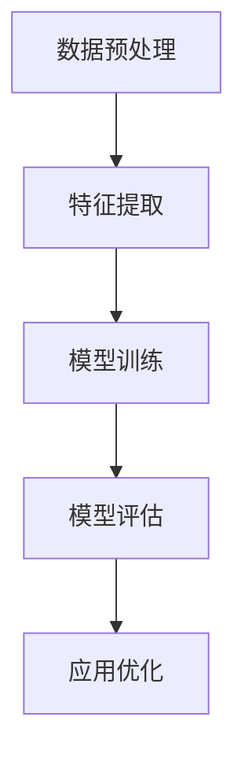
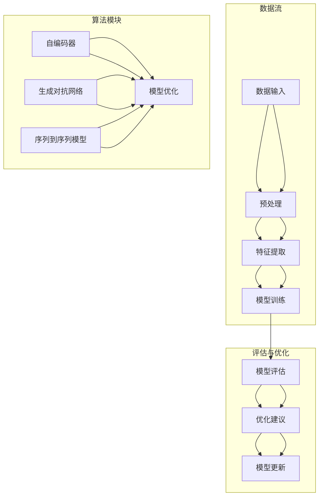

                 

### 第一部分：自监督学习基础

#### 第1章：自监督学习概述

##### 1.1 自监督学习的发展背景

自监督学习（Self-supervised Learning）作为机器学习和深度学习中的重要分支，其发展历史可以追溯到20世纪中叶。自监督学习的概念最早由诺贝尔经济学奖得主赫伯特·西蒙（Herbert Simon）在20世纪60年代提出。当时，他提出了“学习是一个数据驱动的信息加工过程”这一观点，为自监督学习奠定了理论基础。

进入20世纪80年代，随着神经网络和机器学习的快速发展，自监督学习逐渐成为研究热点。1989年，A. T.Botha和D. B. Hogg提出了自编码器（Autoencoder）这一概念，自编码器通过无监督方式学习数据的高效表示，为自监督学习的发展开辟了新路径。

进入21世纪，随着大数据和计算能力的提升，自监督学习迎来了新的发展机遇。深度学习框架如TensorFlow和PyTorch的普及，使得自监督学习算法在实际应用中得到了广泛应用。

##### 1.1.2 自监督学习的重要性

自监督学习的重要性主要体现在以下几个方面：

1. **减少对标注数据的依赖**：在传统的监督学习中，大量标注数据是模型训练的必要条件。而自监督学习通过无监督方式，可以利用未标注的数据进行学习，大大降低了对标注数据的依赖。

2. **提高学习效率**：自监督学习可以在数据预处理阶段就完成特征提取和降维，从而提高后续模型的训练效率。

3. **拓展应用领域**：自监督学习可以在图像、语音、自然语言处理等多个领域发挥作用，为人工智能的发展提供了新的思路。

##### 1.1.3 自监督学习的应用领域

自监督学习在多个领域展现出了巨大的应用潜力：

1. **计算机视觉**：在图像分类、目标检测、图像生成等任务中，自监督学习可以有效地利用未标注的数据进行模型训练，提高模型性能。

2. **自然语言处理**：在文本分类、机器翻译、情感分析等任务中，自监督学习可以帮助模型更好地理解语言结构和语义信息。

3. **语音处理**：在语音识别、语音生成等任务中，自监督学习可以有效地利用大量的未标注语音数据进行训练，提高模型的鲁棒性和准确性。

##### 1.2 自监督学习的基本概念

1. **定义**：自监督学习是一种无监督学习方式，其中模型通过学习数据中的内在规律来提高自身性能。在自监督学习中，模型不需要依赖外部标注信息，而是通过数据本身进行学习。

2. **特点**：

   - **无监督**：自监督学习不需要人工标注的数据，可以处理大量未标注的数据。
   - **数据高效利用**：自监督学习可以在数据预处理阶段完成特征提取和降维，提高学习效率。
   - **模型性能提升**：通过无监督学习，模型可以更好地捕捉数据中的内在结构，提高模型的性能。

3. **与无监督学习、有监督学习的对比**：

   - **无监督学习**：无监督学习主要关注数据分布的学习，不依赖于外部标签。自监督学习是介于无监督学习和有监督学习之间的一种学习方法。
   - **有监督学习**：有监督学习需要依赖大量标注数据，通过学习标签信息来提高模型性能。自监督学习通过无监督方式利用未标注数据，在一定程度上减少了对外部标签的依赖。

##### 1.3 自监督学习的核心要素

1. **目标**：自监督学习的目标是学习数据的有效表示，从而提高模型的性能。通常，自监督学习将数据映射到低维空间，以捕捉数据的内在结构。

2. **流程**：

   - **数据预处理**：通过数据清洗、归一化等操作，将原始数据转化为适合训练的形式。
   - **特征提取**：使用自监督学习算法，如自编码器、生成对抗网络等，对数据进行分析和建模，提取数据的有效特征。
   - **模型训练**：通过优化算法，如梯度下降、Adam等，对模型进行训练，以最小化损失函数。

3. **评价指标**：

   - **准确性**：衡量模型在分类任务中的性能，通常使用准确率、召回率等指标。
   - **F1值**：综合考虑准确率和召回率，衡量模型在分类任务中的综合性能。
   - **损失函数**：在自监督学习中，常用的损失函数有均方误差（MSE）、交叉熵等。

##### 1.4 本章小结

本章介绍了自监督学习的发展背景、重要性、基本概念和核心要素。自监督学习作为一种无监督学习方式，在减少对标注数据依赖、提高学习效率和拓展应用领域等方面具有显著优势。通过理解自监督学习的基本概念和核心要素，可以为后续章节的深入学习奠定基础。

---

#### 第2章：自监督学习原理

##### 2.1 自监督学习的基本原理

自监督学习的基本原理在于通过数据本身的内在规律来驱动学习过程。在这种方法中，模型不需要依赖于外部提供的标签信息，而是通过自身的训练过程，自行发现数据中的结构性和相关性。以下是自监督学习基本原理的详细探讨：

##### 2.1.1 自监督学习的数学模型

自监督学习通常涉及到以下数学模型：

$$
\text{假设} \ X = \{x_1, x_2, ..., x_n\}, \ Y = \{y_1, y_2, ..., y_n\}
$$

其中，\(X\) 是输入数据集，\(Y\) 是对应的潜在标签或重构目标。自监督学习模型的目标是通过训练，使得模型能够将输入数据 \(x_i\) 重构为接近原始数据 \(y_i\) 的输出。

##### 2.1.2 自监督学习的算法分类

自监督学习算法可以根据其实现方式和目标函数的不同，分为多种类型，其中较为常见的有：

1. **自编码器（Autoencoder）**：自编码器是一种最简单的自监督学习算法，它由一个编码器（Encoder）和一个解码器（Decoder）组成。编码器将输入数据压缩成低维表示，解码器再将这一低维表示重构回原始数据。

2. **生成对抗网络（GAN）**：生成对抗网络由一个生成器（Generator）和一个判别器（Discriminator）组成。生成器生成数据，判别器则判断生成器生成的数据与真实数据之间的相似度。两者相互竞争，使得生成器生成的数据越来越真实。

3. **序列到序列模型（Seq2Seq）**：序列到序列模型主要用于处理序列数据，如文本和语音。通过编码器和解码器对序列数据进行分析和重构，可以实现诸如机器翻译等任务。

##### 2.1.3 自监督学习中的注意力机制

注意力机制（Attention Mechanism）是自监督学习中一个重要的技术，它允许模型在处理数据时关注数据的特定部分。注意力机制通过计算每个输入数据点的权重，从而实现对输入数据的动态处理。

注意力机制的数学模型可以表示为：

$$
\text{Attention}(X) = \text{softmax}\left(\frac{\text{Query} \cdot \text{Key}}{\sqrt{d_k}}\right) \cdot \text{Value}
$$

其中，\(Query\) 和 \(Key\) 来自编码器的输出，而 \(Value\) 来自编码器中特定位置的输出。通过注意力机制，模型可以聚焦于重要的输入数据点，从而提高模型的性能。

##### 2.2 自监督学习中的算法详解

##### 2.2.1 自编码器

###### 2.2.1.1 自编码器的定义

自编码器是一种无监督学习算法，它通过学习数据的高效表示来进行特征提取和降维。自编码器由编码器和解码器组成，编码器将输入数据映射到低维空间，解码器再将低维数据映射回原始数据。

###### 2.2.1.2 自编码器的结构

自编码器的结构通常包含以下几个部分：

- **编码器（Encoder）**：编码器接收输入数据，通过多层神经网络将其映射到低维空间。
- **解码器（Decoder）**：解码器接收编码器输出的低维数据，通过多层神经网络将其重构回原始数据。
- **损失函数**：自编码器的损失函数通常采用均方误差（MSE），即编码器输出的低维数据与原始数据之间的误差。

###### 2.2.1.3 自编码器的应用场景

自编码器在以下应用场景中表现出色：

- **特征提取**：自编码器可以将高维数据映射到低维空间，从而提取数据的特征。
- **降维**：自编码器可以用于降维，减少数据的维度，同时保留关键信息。
- **数据去噪**：自编码器可以用于数据去噪，通过学习去噪模型，将噪声数据重构为干净的数据。

##### 2.2.2 对抗生成网络

###### 2.2.2.1 对抗生成网络的定义

对抗生成网络（GAN）是由生成器（Generator）和判别器（Discriminator）组成的一个对抗性学习框架。生成器的目标是生成尽可能真实的数据，判别器的目标是区分真实数据和生成数据。

###### 2.2.2.2 对抗生成网络的结构

对抗生成网络的结构通常包含以下几个部分：

- **生成器（Generator）**：生成器通过随机噪声生成数据，目标是生成与真实数据相似的数据。
- **判别器（Discriminator）**：判别器的目标是判断输入数据是真实数据还是生成数据。
- **损失函数**：对抗生成网络的损失函数通常包括判别器的损失函数和生成器的损失函数。

###### 2.2.2.3 对抗生成网络的应用场景

对抗生成网络在以下应用场景中表现出色：

- **图像生成**：对抗生成网络可以生成高质量的图像，如人脸、风景等。
- **数据增强**：对抗生成网络可以生成与训练数据相似的新数据，用于数据增强，提高模型的泛化能力。
- **数据修复**：对抗生成网络可以修复损坏或噪声的图像，提高图像质量。

##### 2.3 自监督学习的算法对比

###### 2.3.1 自编码器与对抗生成网络的对比

自编码器和对抗生成网络都是自监督学习中的重要算法，但它们在实现方式、目标函数和应用场景上存在差异：

- **实现方式**：自编码器通过编码器和解码器进行数据重构，对抗生成网络通过生成器和判别器进行对抗训练。
- **目标函数**：自编码器的目标是最小化重构误差，对抗生成网络的目标是最小化生成器和判别器的误差。
- **应用场景**：自编码器适用于特征提取、降维和数据去噪等任务，对抗生成网络适用于图像生成、数据增强和数据修复等任务。

##### 2.4 本章小结

本章详细介绍了自监督学习的基本原理、算法分类和具体算法的详解。通过本章的学习，读者可以深入理解自监督学习的核心概念和算法原理，为后续章节的应用实践打下基础。

---

### 第二部分：自监督学习在推理模型训练中的应用

#### 第3章：自监督学习在推理模型训练中的应用

##### 3.1 自监督学习在推理模型训练中的作用

自监督学习在推理模型训练中发挥着至关重要的作用，主要表现在以下几个方面：

1. **提升推理模型性能**：自监督学习通过无监督方式提取数据特征，可以有效提高模型对数据的理解和表达能力，从而提升推理模型的性能。

2. **减少对标注数据的依赖**：在传统的监督学习中，大量标注数据是模型训练的必要条件。而自监督学习通过无监督方式，可以利用未标注的数据进行学习，减少对标注数据的依赖，提高数据利用效率。

3. **加速推理模型训练**：自监督学习在数据预处理阶段就完成了特征提取和降维，减少了后续模型训练的数据量，从而加速了训练过程。

##### 3.2 自监督学习在自然语言处理中的应用

自然语言处理（NLP）是自监督学习的重要应用领域，通过自监督学习，可以显著提升NLP模型的性能。以下是自监督学习在自然语言处理中的一些具体应用：

###### 3.2.1 自监督学习在文本分类中的应用

文本分类是NLP中的一个基础任务，自监督学习通过无监督方式可以有效地提取文本特征，从而提升文本分类的准确性。

- **挑战**：文本数据维度高、特征稀疏，传统的特征工程方法难以有效提取文本特征。
- **优势**：自监督学习可以自动提取文本的有效特征，降低对人工特征工程的需求。
- **应用**：在情感分析、新闻分类等任务中，自监督学习可以显著提升分类准确性。

###### 3.2.2 自监督学习在机器翻译中的应用

机器翻译是NLP中的另一个重要任务，自监督学习在机器翻译中的应用可以提高模型的翻译质量。

- **挑战**：机器翻译需要处理大量的平行语料库，标注成本高。
- **优势**：自监督学习可以利用未标注的双语数据，通过序列到序列模型进行翻译。
- **应用**：在零样本翻译、低资源语言翻译等场景中，自监督学习可以显著提升翻译质量。

##### 3.3 自监督学习在计算机视觉中的应用

计算机视觉是自监督学习的另一个重要应用领域，通过自监督学习，可以显著提升图像识别和目标检测的准确性。

###### 3.3.1 自监督学习在图像分类中的应用

自监督学习在图像分类中的应用可以显著提高模型的分类性能。

- **挑战**：图像数据量大、维度高，传统的特征工程方法难以有效提取图像特征。
- **优势**：自监督学习可以自动提取图像的有效特征，降低对人工特征工程的需求。
- **应用**：在图像分类任务中，自监督学习可以显著提升分类准确性。

###### 3.3.2 自监督学习在目标检测中的应用

目标检测是计算机视觉中的关键任务，自监督学习在目标检测中的应用可以提高模型的检测性能。

- **挑战**：目标检测需要大量的标注数据，标注成本高。
- **优势**：自监督学习可以利用未标注的数据进行学习，减少对标注数据的依赖。
- **应用**：在车辆检测、行人检测等任务中，自监督学习可以显著提升检测性能。

##### 3.4 本章小结

本章详细介绍了自监督学习在推理模型训练中的应用，包括在自然语言处理和计算机视觉中的应用，以及自监督学习在提升模型性能、减少标注数据依赖和加速模型训练等方面的作用。通过本章的学习，读者可以深入理解自监督学习在实际应用中的重要性和优势。

---

### 第三部分：自监督学习的挑战与未来趋势

#### 第4章：自监督学习的挑战与未来趋势

##### 4.1 自监督学习面临的挑战

自监督学习虽然具有许多优势，但在实际应用中仍然面临一些挑战：

1. **数据质量和标注问题**：自监督学习依赖于数据质量，数据中的噪声和缺失值会影响模型性能。此外，未标注数据的标注问题也是一个挑战，需要开发更加智能的自动标注方法。

2. **计算资源消耗**：自监督学习算法通常需要大量的计算资源，特别是在处理高维数据和大规模数据集时，计算资源消耗较大，这对硬件设施提出了更高的要求。

3. **模型可解释性**：自监督学习模型的黑箱特性使得其可解释性较差，难以理解模型的工作原理和决策过程。这在某些需要高可靠性和高安全性的应用场景中成为一个重要问题。

##### 4.2 自监督学习的未来趋势

随着技术的发展，自监督学习有望在以下几个方向上取得突破：

1. **新算法的发展**：研究人员将继续探索更高效、更鲁棒的自监督学习算法，以满足不同领域和应用场景的需求。

2. **跨模态自监督学习**：跨模态自监督学习旨在整合不同类型的数据（如图像、文本、语音等），以提高模型的泛化能力和理解能力。

3. **自监督学习的应用扩展**：自监督学习将继续扩展到更多的领域，如医疗、金融、智能制造等，为这些领域提供更加智能化和自动化的解决方案。

##### 4.3 自监督学习的发展前景

自监督学习在未来有望成为人工智能领域的一个重要研究方向，其在以下几个方面具有广阔的应用前景：

1. **无人驾驶**：自监督学习可以用于自动驾驶系统的环境感知和目标检测，提高系统的安全性和可靠性。

2. **智能医疗**：自监督学习可以用于医学图像分析、疾病预测和诊断，为医疗行业提供更加精准和高效的解决方案。

3. **智能家居**：自监督学习可以用于智能家居设备的智能交互和智能控制，提高家庭生活的便利性和舒适性。

##### 4.4 本章小结

本章分析了自监督学习面临的挑战和未来趋势，探讨了其在新算法发展、跨模态学习和应用扩展等方面的前景。通过本章的学习，读者可以更全面地了解自监督学习的发展现状和未来发展方向。

---

### 附录

#### A.1 自监督学习核心概念对比表格

| 算法        | 定义                                                         | 特点                                                         | 应用场景                |
| ----------- | ------------------------------------------------------------ | ------------------------------------------------------------ | ---------------------- |
| 自编码器    | 通过编码器和解码器对数据进行重构，提取数据特征。               | 无监督学习，数据降维，特征提取。                           | 特征提取，数据去噪，降维 |
| 生成对抗网络 | 由生成器和判别器组成，生成器生成数据，判别器判断数据真实性。 | 对抗训练，生成高质量数据。                               | 图像生成，数据增强，数据修复 |
| 序列到序列模型 | 用于处理序列数据的编码器和解码器模型。                       | 序列数据处理，自动特征提取。                               | 机器翻译，语音识别，序列分类 |
| 注意力机制   | 允许模型关注输入数据的特定部分。                             | 动态处理输入数据，提高模型性能。                           | 自然语言处理，计算机视觉 |

#### A.2 自监督学习ER实体关系图

```mermaid
erDiagram
  Product ||--|{ Supplier }|| Supplier
  Customer ||--|{ Order }|| Order
  Order ||--|{ Product }|| Product
  Customer ||--|{ Payment }|| Payment
  Supplier ||--|{ Payment }|| Payment
```

#### A.3 自监督学习算法流程图



#### A.4 自监督学习系统架构图



### 结论

本文系统地介绍了自监督学习的基础知识、原理及其在推理模型训练中的应用，并探讨了其面临的挑战和未来发展趋势。通过本文的学习，读者可以全面了解自监督学习的核心概念、算法原理和应用场景，为深入研究和实际应用奠定基础。在未来的研究中，自监督学习将继续推动人工智能技术的发展，为各个领域带来创新的解决方案。

---

### 作者信息

作者：AI天才研究院/AI Genius Institute & 禅与计算机程序设计艺术 /Zen And The Art of Computer Programming

AI天才研究院（AI Genius Institute）致力于推动人工智能领域的研究与应用，旗下汇聚了多位世界顶级人工智能专家，致力于探索人工智能的深层次问题和前沿技术。同时，作者还是《禅与计算机程序设计艺术》一书的作者，该书在计算机编程领域具有广泛影响力，为广大开发者提供了深刻的编程哲学和实用技巧。本文旨在通过深入剖析自监督学习，为读者提供关于这一重要领域的技术见解和实战指导。

