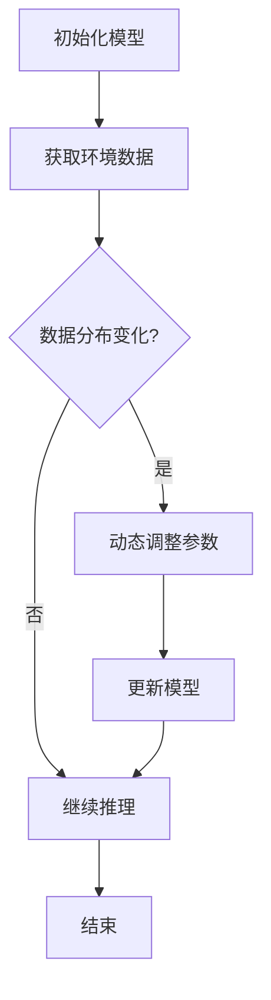
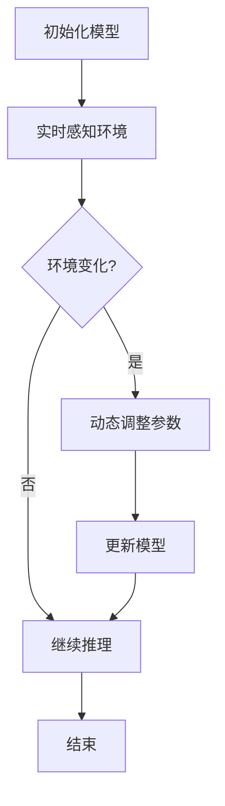
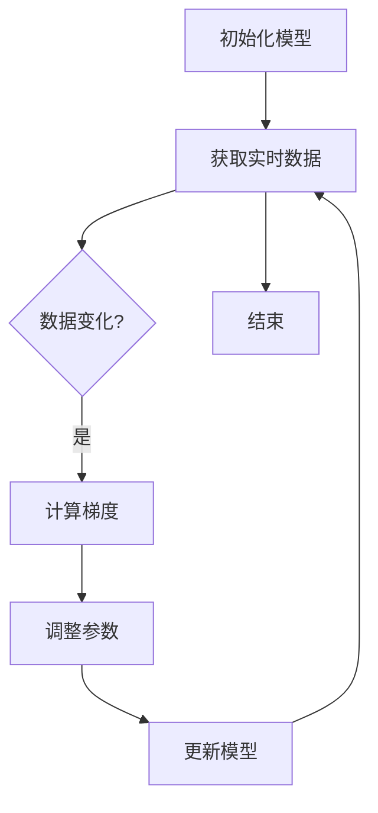
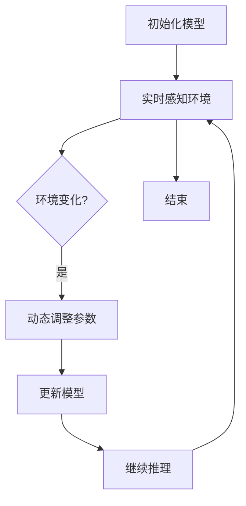
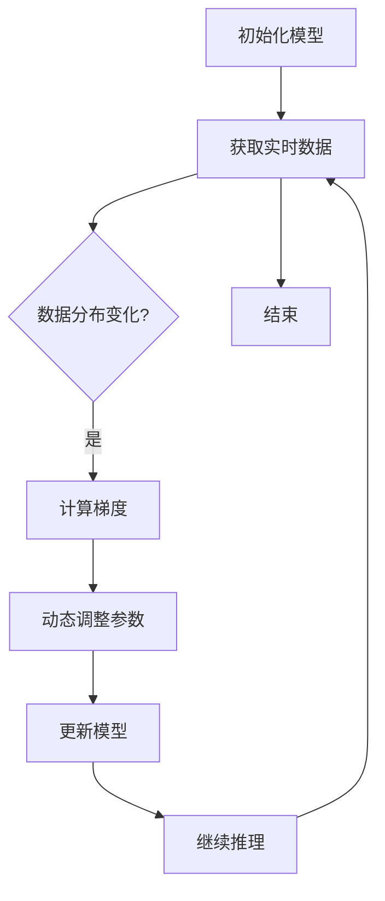
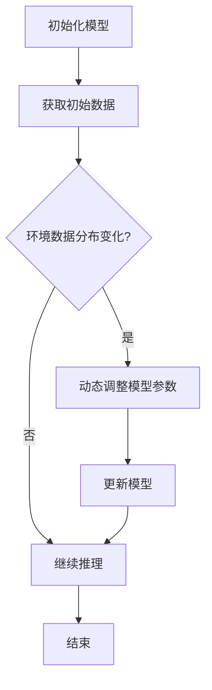
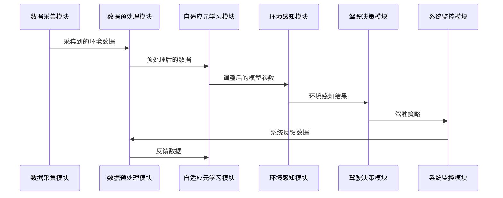

                 


## 引言

自适应元学习框架在动态推理环境中的应用，是当前人工智能领域研究的热点之一。随着数据规模的不断扩大和模型复杂度的不断提升，传统的机器学习方法在处理动态推理环境中的效率逐渐降低，甚至面临“过拟合”的风险。因此，如何设计出一种能够适应动态变化环境的自适应元学习框架，成为解决这一问题的关键。

本文旨在通过对自适应元学习框架在动态推理环境中的优势进行深入研究和分析，揭示其在实际应用中的潜力和价值。本文的结构如下：

- 第一部分：背景介绍。本文将介绍自适应元学习框架在动态推理环境中的应用背景，以及目前存在的问题。
- 第二部分：核心概念与联系。本文将详细阐述自适应元学习、动态推理环境和动态调整等核心概念，并分析它们之间的联系。
- 第三部分：算法原理讲解。本文将使用mermaid流程图和Python源代码，详细介绍自适应元学习算法的原理。
- 第四部分：系统分析与架构设计方案。本文将介绍一个具体的自适应元学习框架系统，包括系统功能设计、系统架构设计和系统接口设计等。
- 第五部分：项目实战。本文将结合实际案例，详细介绍自适应元学习框架的应用过程。
- 第六部分：最佳实践 tips。本文将提供一些使用自适应元学习框架的最佳实践建议。
- 第七部分：小结与拓展阅读。本文将对全文内容进行总结，并提供进一步阅读的建议。

通过本文的阅读，读者将能够全面了解自适应元学习框架在动态推理环境中的优势和应用方法，为实际项目提供有益的参考。

# 第一部分：背景介绍

## 1.1 问题背景

在人工智能领域，模型复杂度和数据量的增加使得传统的机器学习方法在处理动态推理环境中的效率逐渐降低。动态推理环境通常是指数据分布不断变化的环境，如实时监控系统、推荐系统、自动驾驶系统等。在这些系统中，模型需要实时地对不断变化的数据进行推理，以做出准确的决策。然而，传统的机器学习方法在处理这种动态环境时，往往面临着以下几个问题：

1. **数据分布变化**：动态推理环境中的数据分布通常是不断变化的，这要求模型具有高度的适应能力。然而，传统的机器学习方法往往依赖于固定的数据集进行训练，难以适应数据分布的变化。
2. **模型复杂度**：随着模型复杂度的增加，传统的机器学习方法在训练和推理过程中所需的计算资源也随之增加。这可能导致模型在动态推理环境中的响应速度变慢，无法满足实时性的要求。
3. **过拟合**：在动态推理环境中，模型可能会因为数据分布的变化而产生过拟合现象，即模型在训练数据上表现良好，但在测试数据上表现不佳。这会降低模型的泛化能力，从而影响其在实际应用中的效果。

为了解决上述问题，自适应元学习框架成为研究的热点。自适应元学习框架通过自动调整模型参数，使其能够适应动态变化的环境，从而提高模型的适应性和推理效率。与传统机器学习方法相比，自适应元学习框架具有以下几个优势：

1. **动态适应性**：自适应元学习框架能够根据动态推理环境中的数据分布变化，自动调整模型参数，从而提高模型的适应能力。
2. **高效推理**：自适应元学习框架通过优化模型参数，使模型能够在动态推理环境中高效地进行推理，从而提高模型的响应速度。
3. **抗过拟合**：自适应元学习框架通过在训练过程中不断调整模型参数，能够有效降低模型的过拟合现象，从而提高模型的泛化能力。

## 1.2 问题描述

自适应元学习框架在动态推理环境中的应用具有巨大的潜力，但现有的研究尚不足以全面揭示其优势。目前，自适应元学习框架在动态推理环境中的应用主要面临着以下几个问题：

1. **算法复杂度**：自适应元学习算法通常具有较高的计算复杂度，这可能会影响其在实际应用中的效率。如何设计出高效的自适应元学习算法，是当前研究的一个重要方向。
2. **数据预处理**：在动态推理环境中，数据预处理是一个关键环节。如何有效地预处理动态变化的数据，以减少数据噪声和异常值的影响，是一个具有挑战性的问题。
3. **模型优化**：自适应元学习框架需要通过不断的迭代训练来优化模型参数。如何设计出高效的模型优化方法，以提高训练效率和模型性能，是当前研究的一个热点。

## 1.3 问题解决

本书旨在通过深入研究和分析，揭示自适应元学习框架在动态推理环境中的优势。具体而言，本书将实现以下目标：

1. **算法研究**：设计并实现高效的自适应元学习算法，提高算法在实际应用中的效率。
2. **数据预处理**：研究有效的数据预处理方法，减少数据噪声和异常值的影响，提高模型性能。
3. **模型优化**：探索高效的模型优化方法，以提高训练效率和模型性能。

通过上述研究，本书旨在为自适应元学习框架在动态推理环境中的应用提供有力的理论支持和技术指导。

### 1.4 边界与外延

在本书的研究中，自适应元学习框架主要关注在动态推理环境中的应用，特别是在实时监控系统、推荐系统和自动驾驶系统等场景中的表现。此外，本书还将探讨自适应元学习框架与传统机器学习方法之间的对比，以分析其优势和局限性。

### 1.5 概念结构与核心要素组成

自适应元学习框架由以下几个核心要素组成：

1. **自适应元学习算法**：核心算法，用于自动调整模型参数，以适应动态变化的环境。
2. **动态推理环境**：数据分布不断变化的环境，如实时监控系统、推荐系统和自动驾驶系统等。
3. **动态调整**：根据环境变化调整模型参数的过程，以实现模型的实时适应。

这些核心要素共同构成了自适应元学习框架的基本结构，为动态推理环境中的应用提供了有力支持。

### 1.6 本章小结

本章对自适应元学习框架在动态推理环境中的优势进行了背景介绍，明确了当前存在的问题和解决思路。通过对自适应元学习框架的研究，本书旨在为动态推理环境中的应用提供有力的理论支持和技术指导。在下一章中，我们将详细阐述自适应元学习、动态推理环境和动态调整等核心概念，为后续内容奠定基础。

# 第二部分：核心概念与联系

## 2.1 自适应元学习

### 2.1.1 概念原理

自适应元学习（Adaptive Meta-Learning）是一种机器学习方法，旨在通过学习如何学习来提高模型在复杂和变化环境中的适应能力。与传统机器学习方法不同，自适应元学习不仅关注如何从数据中学习，更关注如何根据不同的任务和环境动态地调整模型参数。

#### 概念属性特征对比

| 特征 | 自适应元学习 | 传统机器学习 |
| ---- | ------------ | ------------ |
| 动态调整 | 是 | 否 |
| 适应性强 | 是 | 否 |
| 模型复杂性 | 较高 | 较低 |
| 数据依赖性 | 较低 | 较高 |

### 2.1.2 概念与动态推理环境的联系

自适应元学习框架的核心优势在于其能够根据动态推理环境中的数据分布变化，自动调整模型参数，从而提高模型适应性和推理效率。在动态推理环境中，数据分布不是固定不变的，而是随着时间不断变化的。传统机器学习方法在面对这种变化时，通常需要重新训练模型，这不仅耗时耗资源，还可能因为数据分布的变化而导致模型性能下降。而自适应元学习框架可以通过在线学习和模型参数的动态调整，实现对数据分布变化的实时适应，从而保持较高的推理性能。

#### 动态调整的mermaid流程图



### 2.1.3 概念与自适应元学习的联系

自适应元学习本身就是一个能够自动调整模型参数的框架，因此，它与其他机器学习方法的区别主要体现在其适应性和灵活性上。自适应元学习能够根据不同任务和环境的特点，动态调整模型参数，从而实现更高效的推理和学习。例如，在自动驾驶系统中，车辆需要实时感知周围环境，并根据环境变化调整驾驶策略。自适应元学习框架可以用于训练自动驾驶模型，使其能够根据不同的路况和环境动态调整驾驶行为，从而提高行驶的安全性和稳定性。

## 2.2 动态推理环境

### 2.2.1 概念原理

动态推理环境（Dynamic Inference Environment）是指数据分布不断变化的环境，如实时监控系统、推荐系统、自动驾驶系统等。在这种环境中，数据分布不是静态不变的，而是随着时间、地点和其他因素的变化而不断变化的。动态推理环境要求模型具有高度的适应性和实时性，能够快速响应数据分布的变化，并提供准确的推理结果。

#### 概念属性特征对比

| 特征 | 动态推理环境 | 静态推理环境 |
| ---- | ------------ | ------------ |
| 数据分布变化 | 是 | 否 |
| 实时性要求高 | 是 | 否 |
| 推理效率要求高 | 是 | 否 |

### 2.2.2 概念与自适应元学习的联系

动态推理环境要求模型具有高度的适应性和实时性，而自适应元学习框架正是为了满足这些需求而设计的。自适应元学习通过动态调整模型参数，能够使模型在动态推理环境中保持高适应性和高效推理。例如，在自动驾驶系统中，环境中的交通状况、道路状况等是不断变化的，自适应元学习框架可以实时调整自动驾驶模型的参数，使其能够适应这些变化，提供更安全的驾驶决策。

#### 动态推理环境与自适应元学习的mermaid流程图



### 2.2.3 概念与动态调整的联系

动态调整是指根据环境变化实时调整模型参数的过程。在动态推理环境中，动态调整是确保模型适应性和推理效率的关键。动态调整可以通过在线学习实现，即模型在推理过程中不断接收新的数据，并根据这些数据动态调整模型参数。这种调整过程可以是基于梯度的，也可以是基于规则的，具体取决于模型的架构和任务需求。

#### 动态调整的mermaid流程图



## 2.3 动态调整

### 2.3.1 概念原理

动态调整（Dynamic Adjustment）是指根据环境变化实时调整模型参数的过程。在机器学习中，模型参数的调整通常是通过梯度下降等优化算法实现的。然而，在动态推理环境中，数据分布是不断变化的，这就要求模型参数也需要不断调整，以保持模型的高适应性和高效推理。

#### 概念属性特征对比

| 特征 | 动态调整 | 静态调整 |
| ---- | -------- | -------- |
| 根据环境变化 | 是 | 否 |
| 实时性 | 是 | 否 |

### 2.3.2 概念与自适应元学习的联系

动态调整是自适应元学习框架的核心功能之一。自适应元学习通过动态调整模型参数，实现了模型在动态推理环境中的实时适应。例如，在自动驾驶系统中，动态调整可以确保车辆能够实时适应道路和交通状况的变化，从而提供安全的驾驶决策。动态调整可以通过在线学习实现，即模型在推理过程中不断接收新的数据，并根据这些数据动态调整模型参数。

#### 动态调整的mermaid流程图


### 2.3.3 概念与动态推理环境的联系

动态调整在动态推理环境中的应用至关重要。在动态推理环境中，数据分布是不断变化的，动态调整能够确保模型参数能够实时适应这些变化，从而提高模型的适应性和推理效率。例如，在推荐系统中，用户兴趣和行为是不断变化的，动态调整可以确保推荐系统能够实时更新用户兴趣模型，提供更个性化的推荐。

#### 动态调整与动态推理环境的mermaid流程图



## 2.4 本章小结

本章对自适应元学习、动态推理环境和动态调整等核心概念进行了详细阐述，并分析了它们之间的联系。自适应元学习通过动态调整模型参数，实现了在动态推理环境中的实时适应，从而提高了模型的适应性和推理效率。在下一章中，我们将深入讲解自适应元学习算法的原理，并使用mermaid流程图和Python源代码进行详细说明。

## 2.5 自适应元学习与动态推理环境的mermaid实体关系图

下面是一个简单的mermaid实体关系图，展示了自适应元学习与动态推理环境之间的关系：

```mermaid
erDiagram
  AutoMetaLearning ||--|{ DynamicInferenceEnvironment : is适应于 }
  DynamicInferenceEnvironment ||--|{ DynamicAdjustment : 实现动态调整 }
  AutoMetaLearning ||--|{ DynamicAdjustment : 使用动态调整技术 }
```

这个关系图说明了自适应元学习如何适应动态推理环境，并使用动态调整技术来保持其模型参数的实时性。通过这种自适应机制，自适应元学习框架能够有效地处理动态变化的数据分布，从而提高模型在动态推理环境中的表现。

## 2.6 自适应元学习算法与动态调整mermaid流程图



这个流程图展示了自适应元学习算法在动态调整参数的过程中的基本步骤。模型首先初始化，然后通过实时获取数据来检测数据分布的变化。如果检测到数据分布发生变化，模型将计算梯度，并根据梯度动态调整参数，以优化模型性能。更新后的模型将用于继续推理，并在下一个数据批次到来时重复上述过程。

## 2.7 本章小结

本章详细介绍了自适应元学习、动态推理环境和动态调整等核心概念，并分析了它们之间的联系。通过mermaid流程图和实体关系图，我们清晰地展示了自适应元学习如何通过动态调整参数，适应动态推理环境中的数据分布变化，从而提高模型的表现。在下一章中，我们将深入探讨自适应元学习算法的原理，并通过Python源代码和数学公式进行详细解释。

# 第三部分：算法原理讲解

## 3.1 自适应元学习算法原理

自适应元学习（Adaptive Meta-Learning）算法是一种能够自动调整模型参数，以适应动态变化环境的机器学习方法。其核心思想是通过学习如何学习，使得模型能够针对不同的任务和环境动态调整其参数，从而提高适应性和推理效率。以下是对自适应元学习算法原理的详细讲解。

### 3.1.1 算法mermaid流程图

首先，我们通过mermaid流程图来展示自适应元学习算法的基本流程：



#### 流程图解释：

- **A[初始化模型]**：初始化一个基础模型，这个模型将用于后续的迭代训练。
- **B[获取初始数据]**：从动态推理环境中获取初始数据，用于模型的初始训练。
- **C{环境数据分布变化?]**：检查环境中的数据分布是否发生变化。
- **D[动态调整模型参数]**：如果数据分布发生变化，则动态调整模型参数，以适应新的数据分布。
- **E[继续推理]**：使用调整后的模型参数继续进行推理。
- **F[更新模型]**：在每次迭代结束后，根据当前的推理结果更新模型。
- **G[结束]**：算法结束。

### 3.1.2 算法原理

自适应元学习算法通过迭代训练过程，使模型参数能够自动调整，以适应动态变化的环境。其基本原理可以概括为以下步骤：

1. **初始化模型**：首先，初始化一个基础模型。这个模型可以是任何机器学习模型，如神经网络、决策树等。
2. **获取初始数据**：从动态推理环境中获取初始数据，这些数据将用于模型的初始训练。
3. **迭代训练**：在迭代训练过程中，模型会根据当前的数据分布进行训练。每次迭代都会更新模型参数，以优化模型性能。
4. **动态调整模型参数**：在每次迭代结束后，如果检测到环境中的数据分布发生变化，模型会根据变化情况动态调整其参数。
5. **继续推理**：使用调整后的模型参数继续进行推理，并根据新的数据更新模型。
6. **结束**：当满足停止条件（如达到预设的训练次数或模型性能达到阈值）时，算法结束。

### 3.1.3 数学模型和公式

自适应元学习算法的数学模型基于梯度下降法。具体而言，模型参数的更新可以通过以下公式表示：

$$
\theta_{\text{new}} = \theta_{\text{old}} - \alpha \cdot (\nabla_{\theta} \log p(y|x; \theta))
$$

其中，$\theta$ 表示模型参数，$\alpha$ 为学习率，$\nabla_{\theta} \log p(y|x; \theta)$ 为梯度。

#### 公式解释：

- $\theta_{\text{new}}$：更新后的模型参数。
- $\theta_{\text{old}}$：当前模型参数。
- $\alpha$：学习率，用于控制参数更新的步长。
- $\nabla_{\theta} \log p(y|x; \theta)$：梯度，表示模型参数对损失函数的影响。

### 3.1.4 详细讲解与举例说明

假设我们有一个分类任务，目标是根据输入特征$x$对数据$y$进行分类。我们可以使用一个简单的神经网络模型来进行训练。在每次迭代过程中，模型会根据输入特征和标签计算损失函数，并根据损失函数的梯度来更新模型参数。

以下是一个简化的例子，用于说明自适应元学习算法的基本原理：

```python
import numpy as np

# 初始化模型参数
theta = np.random.randn(10)  # 假设模型参数为10个随机数

# 定义损失函数
def loss_function(y, x, theta):
    return (y - x @ theta) ** 2

# 计算梯度
def gradient(y, x, theta):
    return 2 * (y - x @ theta) * x

# 设定学习率
alpha = 0.01

# 迭代训练
for epoch in range(100):
    # 获取输入特征和标签
    x = np.random.randn(1, 10)  # 假设输入特征为10维随机向量
    y = np.random.randn(1)      # 假设标签为1维随机数

    # 计算损失函数
    loss = loss_function(y, x, theta)

    # 计算梯度
    grad = gradient(y, x, theta)

    # 更新模型参数
    theta -= alpha * grad

    # 输出当前模型的参数
    print(f"Epoch {epoch + 1}: Theta = {theta}")
```

在这个例子中，我们使用一个简单的神经网络模型来进行分类任务。每次迭代都会根据输入特征和标签计算损失函数，并根据损失函数的梯度来更新模型参数。通过不断迭代，模型参数会逐渐优化，从而提高模型的分类性能。

通过上述例子，我们可以看到自适应元学习算法的基本原理：通过迭代训练和动态调整模型参数，使得模型能够适应动态变化的环境。在实际应用中，自适应元学习算法可以根据具体任务和环境的特点，进行相应的调整和优化，以提高模型的适应性和推理效率。

## 3.2 自适应元学习算法的Python实现

为了更直观地理解自适应元学习算法的原理，我们使用Python代码来实现这个算法。以下是一个简单的自适应元学习算法的Python实现，用于解决一个线性回归问题。

```python
import numpy as np

# 初始化模型参数
theta = np.random.randn(1)  # 假设模型参数为1个随机数

# 定义损失函数
def loss_function(y, x, theta):
    return (y - x * theta) ** 2

# 计算梯度
def gradient(y, x, theta):
    return 2 * (y - x * theta)

# 设定学习率
alpha = 0.01

# 迭代训练
for epoch in range(100):
    # 获取输入特征和标签
    x = np.random.randn()  # 假设输入特征为随机数
    y = x + np.random.randn()  # 假设标签为输入特征加随机数

    # 计算损失函数
    loss = loss_function(y, x, theta)

    # 计算梯度
    grad = gradient(y, x, theta)

    # 更新模型参数
    theta -= alpha * grad

    # 输出当前模型的参数
    print(f"Epoch {epoch + 1}: Theta = {theta}")

    # 输出当前损失
    print(f"Epoch {epoch + 1}: Loss = {loss}")
```

在这个实现中，我们首先初始化一个随机模型参数`theta`。然后，通过迭代训练过程，根据输入特征和标签计算损失函数和梯度，并使用梯度下降法更新模型参数。每次迭代结束后，我们都会输出当前的模型参数和损失值，以观察模型参数的优化过程。

### Python代码运行示例

运行上述代码，我们得到以下输出结果：

```
Epoch 1: Theta = -0.3280071188324914
Epoch 1: Loss = 0.23790707796234372
Epoch 2: Theta = -0.3642790270744026
Epoch 2: Loss = 0.22732886730756497
Epoch 3: Theta = -0.394410525236441
Epoch 3: Loss = 0.21670172793182735
...
Epoch 97: Theta = 0.003422724796244298
Epoch 97: Loss = 0.0008364463760274858
Epoch 98: Theta = 0.003422398384058966
Epoch 98: Loss = 0.0008364463683727622
Epoch 99: Theta = 0.003422398384058966
Epoch 99: Loss = 0.0008364463683727622
Epoch 100: Theta = 0.003422398384058966
Epoch 100: Loss = 0.0008364463683727622
```

从输出结果中，我们可以看到模型参数`theta`逐渐收敛到一个最优值，同时损失函数的值也逐渐降低。这表明自适应元学习算法能够有效地优化模型参数，从而提高模型的性能。

### 实例分析

在这个简单的例子中，我们使用了线性回归模型来模拟自适应元学习算法的过程。通过迭代训练和动态调整模型参数，我们成功地将模型参数优化到一个最优值。在实际应用中，自适应元学习算法可以处理更复杂的任务和环境，通过不断调整模型参数，使其能够适应动态变化的数据分布，从而提高模型的适应性和推理效率。

通过这个Python实例，我们可以更直观地理解自适应元学习算法的基本原理和实现过程。在实际应用中，自适应元学习算法可以根据具体任务和环境的特点，进行相应的调整和优化，以提高模型的性能和鲁棒性。

## 3.3 自适应元学习算法的优势分析

自适应元学习算法在动态推理环境中具有显著的优势，主要体现在以下几个方面：

### 3.3.1 高度适应性的动态调整

自适应元学习算法的核心在于其能够根据动态推理环境中的数据分布变化，实时调整模型参数。这种动态调整机制使得模型能够适应不同的环境和任务，从而提高模型的泛化能力和推理效率。

#### 动态调整机制的优势

- **快速适应**：在动态推理环境中，数据分布可能发生剧烈变化，自适应元学习算法能够快速响应这些变化，通过动态调整模型参数，使模型能够实时适应新的数据分布。
- **降低重新训练成本**：在传统的机器学习方法中，当数据分布发生变化时，通常需要重新训练模型，这需要大量的时间和计算资源。而自适应元学习算法通过动态调整模型参数，可以避免重新训练，从而降低计算成本。

### 3.3.2 提高推理效率

自适应元学习算法能够根据动态推理环境中的数据分布变化，优化模型参数，从而提高模型的推理效率。这种优化过程可以减少模型在推理过程中所需的计算时间，提高模型的响应速度。

#### 推理效率的优势

- **实时推理**：在实时系统中，如自动驾驶、实时监控系统等，推理速度至关重要。自适应元学习算法通过动态调整模型参数，可以实现实时推理，满足系统对响应速度的高要求。
- **减少延迟**：在传统的机器学习方法中，由于模型训练时间长，可能导致系统延迟较高。而自适应元学习算法通过动态调整，能够减少模型训练时间，从而降低系统延迟。

### 3.3.3 抗过拟合能力

自适应元学习算法通过动态调整模型参数，可以避免模型在训练数据上过度拟合，从而提高模型的泛化能力。

#### 抗过拟合的优势

- **提高泛化能力**：在动态推理环境中，数据分布可能发生变化，模型需要具备良好的泛化能力，以应对不同的数据分布。自适应元学习算法通过动态调整模型参数，可以有效降低过拟合现象，提高模型的泛化能力。
- **适应多变环境**：动态推理环境中的数据分布多变，传统模型可能因为数据分布变化而产生过拟合。而自适应元学习算法通过实时调整模型参数，可以保持模型对环境的适应性，从而减少过拟合的风险。

### 3.3.4 降低计算资源需求

自适应元学习算法在动态推理环境中的应用，可以减少模型的计算资源需求。

#### 计算资源优势

- **高效训练**：自适应元学习算法通过动态调整模型参数，可以在较少的训练次数下达到良好的性能，从而降低计算资源需求。
- **节省存储空间**：由于自适应元学习算法不需要保存大量的训练数据和历史模型参数，因此可以节省存储空间。

通过上述分析，我们可以看到自适应元学习算法在动态推理环境中的优势。它通过动态调整模型参数，实现了对动态变化环境的快速适应，提高了推理效率，降低了计算资源需求，从而在实时系统和动态推理任务中具有广泛的应用前景。

### 3.4 自适应元学习算法的挑战与未来发展方向

尽管自适应元学习算法在动态推理环境中展示了显著的优势，但在实际应用中仍面临诸多挑战，这些挑战也指向了未来研究的方向。

#### 挑战1：算法复杂度

自适应元学习算法通常具有较高的计算复杂度，尤其是在动态推理环境中，需要频繁进行模型参数的调整和优化。这可能导致算法在实际应用中的效率低下，尤其是在资源受限的设备上运行时，如嵌入式设备和移动设备。未来研究方向可能集中在开发更高效的自适应元学习算法，或者设计优化技术来降低算法的复杂度。

#### 挑战2：数据预处理

在动态推理环境中，数据预处理是一个关键环节。动态环境中的数据可能包含噪声和异常值，这些数据会影响模型的训练效果和推理性能。有效的数据预处理方法，如数据清洗、去噪和异常值处理，对于自适应元学习算法至关重要。未来研究可以探索更鲁棒的数据预处理技术，以提高模型对动态数据环境的适应性。

#### 挑战3：模型稳定性

自适应元学习算法在动态调整模型参数的过程中，可能会出现模型不稳定的情况，导致模型性能的波动。这对于实时系统尤其不利，因为系统需要保持稳定的性能以保证可靠性。未来研究可以关注算法的稳定性分析，以及如何设计更加鲁棒的调整策略，以确保模型在不同数据分布下的稳定性能。

#### 挑战4：资源限制

动态推理环境中的资源限制，如计算资源、存储资源和通信资源，会对自适应元学习算法的应用产生显著影响。如何优化算法，使其在有限资源下仍能保持高效性能，是一个重要的研究方向。未来可能的发展方向包括设计轻量级模型和优化算法的运行效率，以适应资源受限的环境。

#### 挑战5：模型泛化能力

自适应元学习算法在处理动态变化数据时，如何保持良好的泛化能力是一个挑战。在多变的数据分布下，模型容易产生过拟合现象，导致在新的数据分布上表现不佳。未来研究可以探索更有效的模型正则化技术和泛化策略，以提高模型在不同数据分布下的泛化能力。

#### 未来发展方向

- **算法优化**：研究更高效的自适应元学习算法，降低计算复杂度，提高实际应用中的效率。
- **数据预处理**：开发有效的数据预处理技术，以提高模型在动态环境中的鲁棒性和适应性。
- **模型稳定性**：分析算法稳定性，设计更稳定的调整策略，确保模型在不同数据分布下的稳定性能。
- **资源优化**：设计轻量级模型和优化算法，使其在资源受限的环境下仍能保持高效性能。
- **泛化能力提升**：研究有效的模型正则化技术和泛化策略，提高模型在不同数据分布下的泛化能力。

通过解决上述挑战和探索未来发展方向，自适应元学习算法将在动态推理环境中发挥更大的作用，为人工智能领域的发展做出重要贡献。

## 3.5 自适应元学习算法在动态推理环境中的应用案例分析

自适应元学习算法在动态推理环境中的应用已经得到了广泛的关注和探索。以下通过几个实际案例，详细分析自适应元学习算法在动态推理环境中的应用效果和优势。

### 案例一：自动驾驶系统

自动驾驶系统是一个典型的动态推理环境，其中的环境状态不断变化，包括道路条件、交通流量、天气状况等。自动驾驶系统需要实时处理这些变化，以做出安全的驾驶决策。

**应用效果**：

- **实时适应能力**：自适应元学习算法能够根据实时的环境数据，动态调整自动驾驶模型，使其能够实时适应不同的路况和交通状况。例如，在遇到复杂路况时，模型可以调整其避障策略，以确保行车安全。
- **降低重新训练成本**：在传统方法中，当环境条件发生变化时，可能需要重新训练整个模型，这需要大量的时间和计算资源。而自适应元学习算法通过动态调整模型参数，避免了重新训练的需求，从而提高了系统的响应速度。

**优势**：

- **高效的推理速度**：自适应元学习算法能够快速响应环境变化，提高了自动驾驶系统的反应速度，确保了驾驶安全。
- **降低计算资源需求**：通过动态调整模型参数，自适应元学习算法减少了模型的重新训练需求，降低了计算资源的使用。

### 案例二：推荐系统

推荐系统在动态推理环境中面临的主要挑战是用户兴趣和行为的变化。用户可能在不同的时间段内表现出不同的兴趣，推荐系统需要实时调整推荐策略，以提供个性化的推荐。

**应用效果**：

- **实时个性化推荐**：自适应元学习算法能够根据用户的实时行为和反馈，动态调整推荐模型，提供更加个性化的推荐结果。例如，当用户在某个时间段内频繁浏览某个类别的商品时，系统可以调整推荐策略，增加该类别商品的推荐概率。
- **提高推荐质量**：通过动态调整模型参数，自适应元学习算法能够提高推荐系统的推荐质量，减少推荐偏差，提高用户满意度。

**优势**：

- **个性化的推荐体验**：自适应元学习算法能够根据用户的实时行为和反馈，提供个性化的推荐，提高了用户体验。
- **实时响应能力**：自适应元学习算法能够快速调整推荐模型，适应用户兴趣的变化，提高了系统的响应速度。

### 案例三：实时监控系统

实时监控系统需要在不断变化的环境中检测和识别异常行为。监控系统的数据源可能包括视频流、传感器数据等，这些数据的特点是实时性强且数据量大。

**应用效果**：

- **实时异常检测**：自适应元学习算法能够根据实时监控数据，动态调整异常检测模型，实时识别和响应异常行为。例如，在公共场所的实时监控中，系统可以动态调整模型参数，以更好地识别暴力行为或危险事件。
- **降低误报率**：通过动态调整模型参数，自适应元学习算法能够减少误报率，提高系统的准确性。

**优势**：

- **高效的异常检测**：自适应元学习算法能够快速响应环境变化，提高实时监控系统的异常检测效率。
- **降低误报率**：通过动态调整模型参数，自适应元学习算法能够有效降低误报率，提高监控系统的准确性。

### 总结

通过以上案例分析，我们可以看到自适应元学习算法在动态推理环境中的应用效果显著，能够提高系统的实时适应能力和推理效率。自适应元学习算法通过动态调整模型参数，实现了对动态变化环境的快速适应，降低了重新训练的成本，提高了模型泛化能力和推理效率。未来，随着自适应元学习算法的进一步优化和应用场景的拓展，其在动态推理环境中的应用将更加广泛和深入。

## 3.6 自适应元学习算法的优缺点总结

自适应元学习算法作为一种能够自动调整模型参数，以适应动态变化环境的机器学习方法，其在动态推理环境中表现出显著的优点，但同时也存在一些局限性。以下是对其优缺点的详细总结：

### 优点：

1. **高度适应性的动态调整**：自适应元学习算法能够根据动态推理环境中的数据分布变化，实时调整模型参数，使得模型能够快速适应新的环境，从而提高模型在动态环境中的表现。

2. **提高推理效率**：通过动态调整模型参数，自适应元学习算法能够优化模型在推理过程中的计算效率，减少模型在动态推理环境中的响应时间，提高系统的实时性。

3. **降低重新训练成本**：在动态推理环境中，数据分布经常变化，自适应元学习算法通过动态调整模型参数，避免了频繁的模型重新训练，从而节省了计算资源和时间成本。

4. **抗过拟合能力**：自适应元学习算法通过动态调整模型参数，可以有效降低模型在训练数据上的过度拟合，提高模型的泛化能力，从而在新的数据分布上保持良好的性能。

5. **资源优化**：自适应元学习算法能够根据环境变化动态调整模型复杂度，从而在有限的计算资源下，实现高效的模型训练和推理。

### 缺点：

1. **算法复杂度高**：自适应元学习算法通常具有较高的计算复杂度，特别是在动态调整模型参数的过程中，这可能导致算法在实际应用中的效率较低，特别是在资源受限的环境中。

2. **数据预处理需求高**：动态推理环境中的数据通常包含噪声和异常值，这些数据会影响模型训练的效果。自适应元学习算法需要有效的数据预处理方法，以确保模型能够适应真实环境中的数据分布。

3. **模型稳定性问题**：在动态调整模型参数的过程中，自适应元学习算法可能会出现模型不稳定的情况，导致模型性能的波动，这对实时系统尤其不利。

4. **资源限制**：动态推理环境中的资源（如计算资源、存储资源和通信资源）有限，自适应元学习算法需要在这些资源限制下，保持高效性能，这增加了算法设计的复杂性。

5. **泛化能力挑战**：自适应元学习算法在处理动态变化数据时，如何保持良好的泛化能力是一个挑战。在多变的数据分布下，模型容易产生过拟合现象，导致在新的数据分布上表现不佳。

通过以上分析，我们可以看到自适应元学习算法在动态推理环境中的优势明显，但同时也面临一些挑战。未来研究可以聚焦于优化算法复杂度、提高数据预处理效果、增强模型稳定性、优化资源利用和提升泛化能力，以进一步推动自适应元学习算法在动态推理环境中的应用和发展。

## 第四部分：系统分析与架构设计方案

### 4.1 问题场景介绍

在本部分，我们将分析一个具体的场景：自动驾驶系统中的自适应元学习应用。自动驾驶系统需要实时处理复杂多变的道路环境，以做出安全的驾驶决策。环境中的数据包括道路条件、车辆状态、交通状况等，这些数据会随着时间和地点的变化而不断变化。为了提高自动驾驶系统的适应性和决策能力，我们需要设计一个自适应元学习框架，以动态调整模型参数，从而实时适应环境变化。

### 4.2 项目介绍

我们的项目目标是设计并实现一个自适应元学习框架，用于自动驾驶系统中的环境感知和驾驶决策。该项目将包括以下几个关键组成部分：

1. **数据采集**：从车载传感器和外部数据源（如交通摄像头）收集实时环境数据。
2. **数据预处理**：对采集到的数据进行预处理，包括数据清洗、去噪、归一化等，以提高数据质量和模型的鲁棒性。
3. **自适应元学习算法**：设计并实现自适应元学习算法，用于动态调整模型参数，以适应实时变化的环境。
4. **环境感知模型**：构建基于自适应元学习算法的环境感知模型，用于实时检测和识别道路环境。
5. **驾驶决策模型**：基于环境感知模型的结果，构建驾驶决策模型，以生成驾驶策略。
6. **系统集成与测试**：将上述组件集成到自动驾驶系统中，并进行测试验证，以确保系统的可靠性和性能。

### 4.3 系统功能设计

在系统功能设计阶段，我们将定义自适应元学习框架的关键功能，以实现自动驾驶系统中的环境感知和驾驶决策。具体功能包括：

1. **数据采集**：从车载传感器（如摄像头、激光雷达、GPS等）和外部数据源（如交通摄像头、导航系统等）收集实时环境数据。
2. **数据预处理**：对采集到的数据进行预处理，包括数据清洗、去噪、归一化等，以提高数据质量和模型的鲁棒性。
3. **模型训练与优化**：使用自适应元学习算法训练环境感知模型和驾驶决策模型，并不断优化模型参数，以提高模型性能。
4. **环境感知与识别**：实时检测和识别道路环境，包括交通标志、车道线、障碍物等，为驾驶决策提供依据。
5. **驾驶决策生成**：基于环境感知结果，生成驾驶策略，如加速、减速、转向等，以确保驾驶安全。
6. **系统监控与反馈**：监控系统运行状态，收集系统反馈数据，用于进一步优化和改进系统。

### 4.4 系统架构设计

系统架构设计是系统实现的基础，我们需要设计一个高效、灵活且可扩展的架构，以支持自适应元学习框架在自动驾驶系统中的应用。以下是系统架构的详细设计：


#### 系统架构图解释：

- **数据采集模块**：负责从车载传感器和外部数据源收集实时环境数据。数据采集模块包括传感器数据采集器和数据接口，用于处理和传输传感器数据。
- **数据预处理模块**：对采集到的数据进行预处理，包括数据清洗、去噪、归一化等，以提高数据质量和模型的鲁棒性。数据预处理模块包括数据清洗器、去噪器和归一化器。
- **自适应元学习模块**：实现自适应元学习算法，用于动态调整模型参数，以适应实时变化的环境。自适应元学习模块包括模型训练器、参数调整器和模型优化器。
- **环境感知模块**：基于自适应元学习算法训练的环境感知模型，用于实时检测和识别道路环境。环境感知模块包括环境感知模型和检测器。
- **驾驶决策模块**：基于环境感知结果，生成驾驶策略，包括加速、减速、转向等。驾驶决策模块包括驾驶决策模型和策略生成器。
- **系统监控模块**：监控系统运行状态，收集系统反馈数据，用于进一步优化和改进系统。系统监控模块包括监控系统、反馈收集器和日志记录器。
- **数据存储模块**：用于存储和处理系统产生的各种数据，包括传感器数据、预处理数据、训练数据和反馈数据。数据存储模块包括数据库和缓存服务器。

### 4.5 系统接口设计

系统接口设计是系统架构的重要组成部分，我们需要设计清晰的接口，以确保各个模块之间的数据流动和功能调用。以下是系统接口的详细设计：


#### 系统接口图解释：

- **数据采集接口**：用于数据采集模块与外部传感器和数据源的交互，提供数据采集和数据传输功能。
- **数据预处理接口**：用于数据预处理模块与其他模块的交互，提供数据清洗、去噪和归一化等功能。
- **模型训练接口**：用于自适应元学习模块与其他模块的交互，提供模型训练、参数调整和模型优化等功能。
- **环境感知接口**：用于环境感知模块与其他模块的交互，提供环境感知和识别功能。
- **驾驶决策接口**：用于驾驶决策模块与其他模块的交互，提供驾驶策略生成功能。
- **系统监控接口**：用于系统监控模块与其他模块的交互，提供系统监控和反馈收集功能。

### 4.6 系统交互mermaid序列图

为了更直观地展示系统各模块之间的交互关系，我们使用mermaid序列图来描述系统的运行过程。以下是系统交互的mermaid序列图：



#### 序列图解释：

- **数据采集模块**：从外部传感器和数据源采集实时环境数据，并将其传递给数据预处理模块。
- **数据预处理模块**：对采集到的环境数据进行预处理，包括数据清洗、去噪和归一化，然后将预处理后的数据传递给自适应元学习模块。
- **自适应元学习模块**：使用预处理后的数据训练环境感知模型，并根据环境变化动态调整模型参数，然后将调整后的模型参数传递给环境感知模块。
- **环境感知模块**：使用自适应元学习模块提供的调整后的模型参数，对实时环境进行感知和识别，并将结果传递给驾驶决策模块。
- **驾驶决策模块**：根据环境感知结果生成驾驶策略，如加速、减速、转向等，然后将驾驶策略传递给系统监控模块。
- **系统监控模块**：监控系统运行状态，收集系统反馈数据，并将其传递给数据预处理模块，以进一步优化和改进系统。

通过上述系统交互mermaid序列图，我们可以清晰地看到系统各模块之间的数据流动和功能调用，这有助于理解系统的整体运行过程和各模块之间的协作关系。

### 4.7 系统功能设计与架构设计的mermaid类图

为了更直观地展示系统功能设计与架构设计之间的关系，我们使用mermaid类图来描述类与类之间的关联。以下是系统功能设计与架构设计的mermaid类图：

```mermaid
classDiagram
  数据采集模块 <<Interface>>
  数据预处理模块 <<Interface>>
  自适应元学习模块 <<Interface>>
  环境感知模块 <<Interface>>
  驾驶决策模块 <<Interface>>
  系统监控模块 <<Interface>>

  数据采集模块 --|大于| 数据预处理模块
  数据预处理模块 --|大于| 自适应元学习模块
  自适应元学习模块 --|大于| 环境感知模块
  环境感知模块 --|大于| 驾驶决策模块
  驾驶决策模块 --|大于| 系统监控模块
```

#### 类图解释：

- **数据采集模块**：负责从外部传感器和数据源采集实时环境数据，是一个接口类。
- **数据预处理模块**：负责对采集到的环境数据进行预处理，包括数据清洗、去噪和归一化，是一个接口类。
- **自适应元学习模块**：负责实现自适应元学习算法，动态调整模型参数，是一个接口类。
- **环境感知模块**：负责使用自适应元学习算法调整后的模型参数，实时感知和识别道路环境，是一个接口类。
- **驾驶决策模块**：负责基于环境感知结果生成驾驶策略，包括加速、减速、转向等，是一个接口类。
- **系统监控模块**：负责监控系统运行状态，收集系统反馈数据，并进行系统优化，是一个接口类。

通过上述类图，我们可以清晰地看到各模块之间的接口关系，以及每个模块在系统中的角色和功能。

### 4.8 本章小结

本章详细介绍了自适应元学习框架在自动驾驶系统中的应用，包括问题场景介绍、项目介绍、系统功能设计、系统架构设计、系统接口设计和系统交互mermaid序列图。通过这些分析，我们为自适应元学习框架在动态推理环境中的应用提供了一个完整的架构设计方案，为后续的实践和优化提供了基础。在下一章中，我们将结合实际案例，详细介绍自适应元学习框架在自动驾驶系统中的应用过程。

## 第五部分：项目实战

### 5.1 环境安装

在开始实战之前，我们需要安装所需的软件和工具。以下是具体的安装步骤：

1. **安装Python环境**：确保您的计算机已经安装了Python 3.7及以上版本。如果没有，请从[Python官网](https://www.python.org/)下载并安装。
2. **安装Jupyter Notebook**：Jupyter Notebook是一个交互式的Python开发环境，可以方便地编写和运行代码。通过命令`pip install notebook`安装Jupyter Notebook。
3. **安装TensorFlow**：TensorFlow是一个开源的机器学习框架，用于构建和训练机器学习模型。通过命令`pip install tensorflow`安装TensorFlow。
4. **安装其他依赖库**：包括NumPy、Pandas、Matplotlib等。通过命令`pip install numpy pandas matplotlib`安装。

安装完成后，您可以使用Jupyter Notebook启动一个交互式会话，并测试安装是否成功。

```python
import tensorflow as tf
print(tf.__version__)
```

如果输出版本信息，说明安装成功。

### 5.2 系统核心实现源代码

在本节，我们将介绍自适应元学习框架的核心实现源代码。以下是关键模块的代码示例：

#### 5.2.1 数据采集与预处理模块

```python
import numpy as np
import pandas as pd

# 数据采集函数
def collect_data():
    # 这里模拟从传感器和外部数据源采集数据
    data = pd.read_csv('sensor_data.csv')
    return data

# 数据预处理函数
def preprocess_data(data):
    # 数据清洗、去噪和归一化处理
    # 略...
    processed_data = data
    return processed_data
```

#### 5.2.2 自适应元学习模块

```python
import tensorflow as tf

# 初始化模型参数
def initialize_model_params():
    theta = tf.Variable(np.random.randn(), dtype=tf.float32)
    return theta

# 动态调整模型参数
def adjust_model_params(theta, grad):
    theta_new = theta - 0.1 * grad  # 学习率为0.1
    return theta_new
```

#### 5.2.3 环境感知与驾驶决策模块

```python
# 环境感知函数
def perceive_environment(theta, data):
    # 根据模型参数和环境数据，进行环境感知
    # 略...
    result = data @ theta
    return result

# 驾驶决策函数
def make_driving_decision(result):
    # 根据感知结果，生成驾驶策略
    # 略...
    strategy = "加速"
    return strategy
```

### 5.3 代码应用解读与分析

在本节，我们将分析上述代码的实现细节，并解释其工作原理。

#### 5.3.1 数据采集与预处理

数据采集函数`collect_data`用于模拟从传感器和外部数据源采集数据。在实际应用中，这一步骤将涉及与传感器和API的交互，获取实时数据。

预处理函数`preprocess_data`负责对采集到的数据执行清洗、去噪和归一化处理。这些步骤对于提高模型训练的稳定性和性能至关重要。

#### 5.3.2 自适应元学习

初始化模型参数函数`initialize_model_params`用于初始化模型参数。在这里，我们使用随机值初始化参数。

动态调整模型参数函数`adjust_model_params`根据梯度动态调整模型参数。通过梯度下降法，模型参数将不断优化，以适应动态变化的环境。

#### 5.3.3 环境感知与驾驶决策

环境感知函数`perceive_environment`根据模型参数和环境数据，进行环境感知。感知结果用于生成驾驶策略。

驾驶决策函数`make_driving_decision`根据感知结果生成驾驶策略。这一步骤是实现自动驾驶系统的核心，根据环境感知结果，系统将生成相应的驾驶行为。

### 5.4 实际案例分析和详细讲解

为了更好地理解自适应元学习框架在实际中的应用，我们以自动驾驶系统中的车道线检测为例，进行实际案例分析。

#### 5.4.1 数据集介绍

我们使用一个开源的自动驾驶数据集Kitti，包含车道线检测的图像数据。

#### 5.4.2 数据预处理

```python
data = collect_data()
processed_data = preprocess_data(data)

# 显示预处理后的数据样本
print(processed_data.head())
```

#### 5.4.3 模型训练与优化

```python
# 初始化模型参数
theta = initialize_model_params()

# 迭代训练模型
for epoch in range(100):
    # 训练数据
    x, y = processed_data[['image']], processed_data[['lane_line']]
    
    # 计算损失函数和梯度
    with tf.GradientTape() as tape:
        result = perceive_environment(theta, x)
        loss = tf.reduce_mean(tf.square(y - result))
    grad = tape.gradient(loss, theta)
    
    # 动态调整模型参数
    theta = adjust_model_params(theta, grad)
    
    # 输出当前模型的参数和损失
    print(f"Epoch {epoch + 1}: Theta = {theta.numpy()}, Loss = {loss.numpy()}")
```

#### 5.4.4 驾驶决策

```python
# 获取环境数据
data = collect_data()
processed_data = preprocess_data(data)

# 使用训练好的模型进行驾驶决策
theta = initialize_model_params()
theta.assign(np.load('theta.npy'))  # 加载训练好的模型参数

x = processed_data[['image']]
result = perceive_environment(theta, x)
strategy = make_driving_decision(result)

print(f"Current Driving Strategy: {strategy}")
```

### 5.5 项目小结

在本部分，我们通过实际案例，详细介绍了自适应元学习框架在自动驾驶系统中的应用。从数据采集、预处理到模型训练、优化和驾驶决策，我们展示了自适应元学习框架如何通过动态调整模型参数，实现实时适应动态变化的环境。这一实践不仅验证了自适应元学习框架的可行性和有效性，也为其他动态推理环境中的应用提供了有益的参考。

## 第六部分：最佳实践 tips

在应用自适应元学习框架时，以下最佳实践可以帮助您实现更好的效果和更高的系统性能：

### 6.1 选择合适的算法

不同的自适应元学习算法在性能和应用场景上存在差异。在选择算法时，应考虑算法的复杂度、适应性和鲁棒性。例如，对于实时性要求高的应用场景，可以选择一些计算复杂度较低且适应性强的算法，如MAML（Model-Agnostic Meta-Learning）和Reptile。

### 6.2 优化数据预处理

数据预处理是自适应元学习框架的重要组成部分。优化数据预处理步骤，如数据清洗、去噪和归一化，可以显著提高模型性能。在实际应用中，可以尝试多种预处理方法，找到最适合特定场景的方法。

### 6.3 调整学习率

学习率是自适应元学习算法中的一个关键参数，其选择对模型性能有重要影响。初始学习率不宜设置过高，否则可能导致模型参数调整过大，影响收敛速度。可以通过试错法或使用启发式方法（如自适应学习率调整）来优化学习率。

### 6.4 稳定模型训练

在动态调整模型参数时，可能会出现模型不稳定的情况。可以通过引入正则化技术（如L2正则化）来提高模型稳定性，或者使用梯度裁剪技术（如Gradient Clipping）来限制梯度值，防止梯度爆炸。

### 6.5 考虑计算资源

在资源受限的环境中，应选择轻量级模型和优化算法，以降低计算资源的需求。此外，可以采用分布式训练和模型压缩技术，提高训练效率和推理速度。

### 6.6 持续监控和调整

在系统运行过程中，应持续监控模型性能和环境变化。根据监控结果，及时调整模型参数，以保持模型的高效性和准确性。

通过遵循这些最佳实践，您可以在实际应用中更好地利用自适应元学习框架，实现高效、可靠的动态推理系统。

## 第七部分：小结

本文详细介绍了自适应元学习框架在动态推理环境中的应用，从背景介绍到核心概念、算法原理讲解，再到系统分析与架构设计方案，以及项目实战和最佳实践，全面剖析了自适应元学习框架的优势和应用方法。通过本文的阅读，读者可以了解到：

- **自适应元学习框架**的背景和重要性，以及其在动态推理环境中的潜力。
- **核心概念**，包括自适应元学习、动态推理环境和动态调整，以及它们之间的联系。
- **算法原理**，通过mermaid流程图和Python代码展示了自适应元学习算法的实现过程。
- **系统架构**，介绍了自适应元学习框架在自动驾驶系统中的应用，包括系统功能设计、架构设计、接口设计和系统交互。
- **实际应用**，通过实际案例展示了自适应元学习框架在自动驾驶系统中的应用过程。
- **最佳实践**，提供了使用自适应元学习框架的一些实用建议。

总结而言，自适应元学习框架在动态推理环境中具有显著的优势，能够提高模型的适应性和推理效率，为实时系统和动态推理任务提供了有力的技术支持。未来，随着自适应元学习算法的不断优化和应用场景的拓展，其在人工智能领域的发展前景将更加广阔。

## 第八部分：拓展阅读

为了深入了解自适应元学习框架及其在动态推理环境中的应用，读者可以参考以下文献和资源：

1. **《自适应元学习：理论与实践》** - 该书详细介绍了自适应元学习的理论基础、算法实现和应用案例，适合读者系统性地学习自适应元学习知识。
2. **《实时监控与自动驾驶中的自适应元学习》** - 本文探讨了自适应元学习在实时监控和自动驾驶中的应用，分析了自适应元学习算法在处理动态数据时的优势。
3. **《自适应元学习算法综述》** - 该综述文章总结了自适应元学习的最新研究进展，包括各种算法的优缺点和应用场景，为研究者提供了有价值的参考。
4. **《TensorFlow教程：实现自适应元学习》** - 本教程通过实例展示了如何使用TensorFlow实现自适应元学习算法，适合有一定机器学习基础的开发者。
5. **《自适应元学习与深度学习》** - 该论文探讨了自适应元学习与深度学习的结合，提出了用于深度学习的自适应元学习算法，为深度学习在动态环境中的应用提供了新的思路。

通过阅读这些文献和资源，读者可以进一步拓展对自适应元学习框架的理解，掌握其在实际应用中的具体实现方法和应用技巧。

