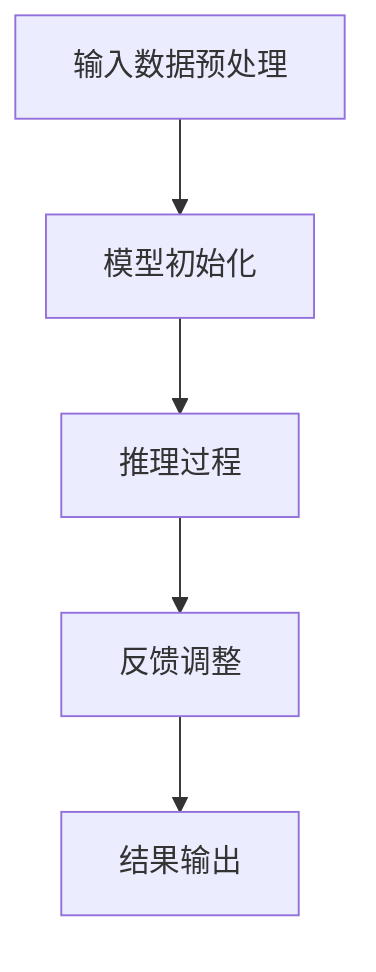
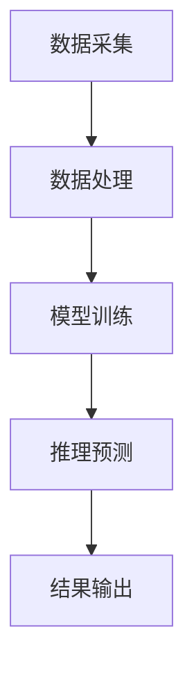
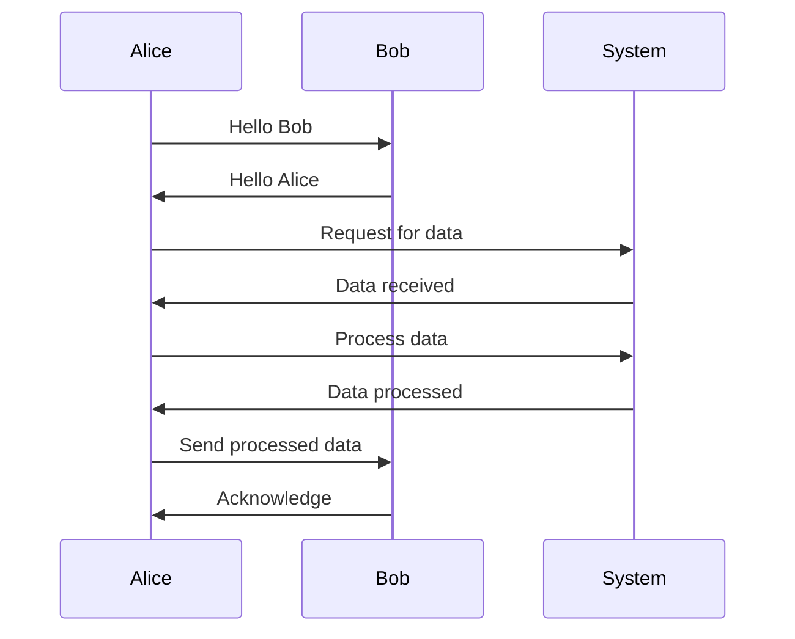

                 

# 自适应推理算法设计中神经编程的创新方法

## 关键词

- 自适应推理算法
- 神经编程
- 深度学习
- 人工智能
- 编程范式

## 摘要

本文探讨了自适应推理算法设计中神经编程的创新方法。通过对神经编程的概述、核心概念、与传统编程的比较以及自适应推理算法的讲解，我们详细介绍了神经编程在自适应推理算法中的应用。文章进一步通过数学模型和实际项目案例分析，阐述了自适应推理算法在神经编程中的实现方法及其优势。最终，文章提出了最佳实践和总结，为读者提供了有益的参考。

## 目录大纲

### 第一部分：背景介绍

#### 1.1 问题背景

#### 1.2 问题提出

#### 1.3 问题解决

#### 1.4 边界与外延

#### 1.5 概念结构与核心要素组成

#### 1.6 本章小结

### 第二部分：核心概念与联系

#### 2.1 神经编程概述

#### 2.2 神经编程的核心概念

#### 2.3 神经编程与传统编程的比较

### 第三部分：算法原理讲解

#### 3.1 自适应推理算法原理

#### 3.2 神经编程在自适应推理算法中的应用

#### 3.3 自适应推理算法的mermaid流程图

### 第四部分：数学模型和数学公式

#### 4.1 自适应推理算法的数学模型

#### 4.2 公式推导与讲解

#### 4.3 举例说明

### 第五部分：系统分析与架构设计方案

#### 5.1 问题描述

#### 5.2 项目介绍

#### 5.3 系统功能设计

#### 5.4 系统架构设计

#### 5.5 系统接口设计

#### 5.6 系统交互

### 第六部分：项目实战

#### 6.1 环境安装

#### 6.2 系统核心实现源代码

#### 6.3 代码应用解读与分析

#### 6.4 实际案例分析和详细讲解剖析

#### 6.5 项目小结

### 第七部分：最佳实践与总结

#### 7.1 最佳实践

#### 7.2 小结

#### 7.3 注意事项

#### 7.4 拓展阅读

## 第一部分：背景介绍

### 1.1 问题背景

随着深度学习技术的发展，自适应推理算法在人工智能领域得到了广泛应用。自适应推理算法能够根据输入数据和反馈信息，动态调整推理过程，从而提高推理效率和准确性。然而，现有的自适应推理算法在处理大规模数据和复杂模型时，面临着计算资源受限、模型复杂度增加等挑战。

### 1.2 问题提出

如何提高自适应推理算法的效率和准确性，成为当前研究的重点。同时，如何将神经编程应用于自适应推理算法的设计中，是一个值得探讨的课题。神经编程以其高效性和灵活性，在算法设计中展现出巨大潜力。

### 1.3 问题解决

通过引入神经编程的创新方法，可以在算法设计中实现自优化、自适应等功能，从而提高推理速度和准确性。本文将详细介绍神经编程的核心原理及其在自适应推理算法中的应用。

### 1.4 边界与外延

自适应推理算法设计不仅限于人工智能领域，还可以应用于智能交通、医疗诊断、金融分析等多个行业。本文将重点关注神经编程在自适应推理算法中的创新应用，探讨其边界和潜力。

### 1.5 概念结构与核心要素组成

#### 神经编程

神经编程是一种以神经网络为基础的编程范式，通过模拟人脑处理信息的方式，实现复杂问题的求解。神经编程的核心概念包括神经元、神经网络和激活函数。

#### 自适应推理算法

自适应推理算法是一种根据输入数据和反馈信息，动态调整推理过程的算法。其核心在于能够自动调整模型参数，提高推理效率和准确性。

### 1.6 本章小结

本章对自适应推理算法设计中的神经编程创新方法进行了背景介绍，明确了研究的问题和意义，为后续章节的详细探讨奠定了基础。

-----------------------------------------------------------------

## 第二部分：核心概念与联系

### 2.1 神经编程概述

#### 2.1.1 定义

神经编程是一种以神经网络为基础的编程范式，通过模拟人脑处理信息的方式，实现复杂问题的求解。它利用神经元、神经网络和激活函数等组件，构建出一个能够模拟人类思维过程的计算模型。

#### 2.1.2 发展历程

神经编程起源于20世纪40年代，随着人工智能和深度学习技术的发展，逐渐成为研究热点。早期的神经编程主要集中在模拟人脑信息处理过程，随着深度学习的兴起，神经编程的应用范围逐渐扩大。

#### 2.1.3 核心特点

- **模式识别与自动学习**：神经编程能够通过大量训练数据，自动识别输入数据的特征，并优化模型参数。
- **自适应与优化能力**：神经编程模型能够根据输入数据和反馈信息，动态调整模型参数，提高算法性能。
- **高效性**：神经编程模型在处理复杂问题时，具有很高的计算效率和准确性。

### 2.2 神经编程的核心概念

#### 2.2.1 神经元

神经元是神经网络的基本单元，类似于生物神经元，它通过接收和处理输入信号，产生输出信号。神经元的结构通常包括输入层、处理层和输出层。

#### 2.2.2 神经网络

神经网络是由多个神经元组成的计算模型，通过层次结构进行信息传递和处理。神经网络可以分为输入层、隐藏层和输出层。每个神经元都与相邻层中的神经元相连，并通过权重和偏置进行信息传递。

#### 2.2.3 激活函数

激活函数是神经元输出的非线性变换，用于决定神经元是否激活。常见的激活函数包括Sigmoid函数、ReLU函数和Tanh函数等。

### 2.3 神经编程与传统编程的比较

#### 2.3.1 编程范式的差异

传统编程以指令为中心，通过编写一系列指令来控制计算机的运行。而神经编程以数据和模型为中心，通过调整模型参数来模拟人脑信息处理过程。

#### 2.3.2 编程语言的选择

传统编程通常使用通用编程语言，如Python、Java等。而神经编程则使用专门设计的神经网络编程语言，如TensorFlow、PyTorch等。

#### 2.3.3 编程过程的不同

传统编程注重代码的编写和调试，而神经编程则注重模型的训练和优化。在神经编程中，模型的性能取决于训练数据和调整过程。

### 2.4 本章小结

本章对神经编程进行了概述，详细介绍了其核心概念和与传统编程的比较。通过本章的学习，读者可以了解神经编程的基本原理和应用场景，为后续章节的探讨打下基础。

-------------------------------------------------------------------

## 第三部分：算法原理讲解

### 3.1 自适应推理算法原理

自适应推理算法是一种根据输入数据和反馈信息动态调整推理过程的算法。其核心在于能够自动调整模型参数，提高推理效率和准确性。自适应推理算法的基本原理如下：

1. **输入数据预处理**：将输入数据进行标准化、归一化等预处理，以便模型能够更好地适应数据特征。

2. **模型初始化**：初始化模型参数，通常使用随机初始化或预训练模型。

3. **推理过程**：根据输入数据和模型参数，进行推理过程。在推理过程中，模型会自动调整参数，以适应输入数据的特征。

4. **反馈调整**：根据输出结果和预期目标，对模型参数进行反馈调整。通过不断迭代，模型参数会逐渐优化，提高推理效率和准确性。

5. **结果输出**：将最终的推理结果输出，以便进行后续分析和应用。

### 3.2 神经编程在自适应推理算法中的应用

神经编程在自适应推理算法中的应用主要体现在以下几个方面：

1. **模型定义**：使用神经网络编程语言（如TensorFlow、PyTorch等）定义模型结构，包括输入层、隐藏层和输出层。

2. **数据预处理**：使用神经编程语言进行数据预处理，包括数据标准化、归一化、数据增强等。

3. **模型训练**：通过神经编程语言对模型进行训练，包括前向传播、反向传播和参数优化。

4. **推理过程**：使用训练好的模型进行推理，并根据输入数据和模型参数，动态调整推理过程。

5. **反馈调整**：根据输出结果和预期目标，对模型参数进行反馈调整，以提高推理效率和准确性。

### 3.3 自适应推理算法的mermaid流程图

以下是一个简单的自适应推理算法的mermaid流程图：



### 3.4 自适应推理算法的数学模型

自适应推理算法的数学模型主要包括以下几个部分：

1. **输入层**：输入层将输入数据进行预处理，转换为神经网络可处理的格式。

2. **隐藏层**：隐藏层通过一系列的线性变换和激活函数，将输入数据转化为隐藏特征。

3. **输出层**：输出层将隐藏特征映射到输出结果。

4. **损失函数**：损失函数用于衡量模型输出结果与预期目标之间的差距，常用的损失函数包括均方误差（MSE）、交叉熵（CE）等。

5. **优化器**：优化器用于调整模型参数，以最小化损失函数。常用的优化器包括梯度下降（GD）、随机梯度下降（SGD）等。

### 3.5 公式推导与讲解

以下是自适应推理算法中常用的损失函数和优化器公式：

1. **均方误差（MSE）**：

   $$MSE = \frac{1}{n}\sum_{i=1}^{n}(y_i - \hat{y}_i)^2$$

   其中，$y_i$ 表示真实值，$\hat{y}_i$ 表示预测值，$n$ 表示样本数量。

2. **交叉熵（CE）**：

   $$CE = -\frac{1}{n}\sum_{i=1}^{n}y_i \log(\hat{y}_i)$$

   其中，$y_i$ 表示真实值（0或1），$\hat{y}_i$ 表示预测值。

3. **梯度下降（GD）**：

   $$\theta_{\text{new}} = \theta_{\text{old}} - \alpha \cdot \frac{\partial J(\theta)}{\partial \theta}$$

   其中，$\theta$ 表示模型参数，$\alpha$ 表示学习率，$J(\theta)$ 表示损失函数。

4. **随机梯度下降（SGD）**：

   $$\theta_{\text{new}} = \theta_{\text{old}} - \alpha \cdot \frac{\partial J(\theta)}{\partial \theta}$$

   其中，$\theta$ 表示模型参数，$\alpha$ 表示学习率，$J(\theta)$ 表示损失函数。

### 3.6 举例说明

假设我们使用一个简单的线性回归模型来预测房价，数据集包含n个样本，每个样本包含特征向量$x_i$和标签$y_i$。模型的目标是找到最佳参数$\theta_0$和$\theta_1$，使得预测值$\hat{y}_i$与真实值$y_i$的差距最小。

1. **数据预处理**：

   将数据集分为训练集和测试集，对训练集进行标准化处理，将特征向量和标签缩放到[0, 1]范围内。

2. **模型初始化**：

   初始化模型参数$\theta_0$和$\theta_1$，通常可以使用随机初始化或预训练模型。

3. **推理过程**：

   根据输入特征向量$x_i$和模型参数$\theta_0$和$\theta_1$，计算预测值$\hat{y}_i$：

   $$\hat{y}_i = \theta_0 + \theta_1 \cdot x_i$$

4. **反馈调整**：

   使用均方误差（MSE）作为损失函数，根据预测值$\hat{y}_i$和真实值$y_i$，计算损失：

   $$MSE = \frac{1}{n}\sum_{i=1}^{n}(y_i - \hat{y}_i)^2$$

   使用梯度下降（GD）或随机梯度下降（SGD）优化模型参数$\theta_0$和$\theta_1$：

   $$\theta_{\text{new}} = \theta_{\text{old}} - \alpha \cdot \frac{\partial MSE}{\partial \theta_0}$$

   $$\theta_{\text{new}} = \theta_{\text{old}} - \alpha \cdot \frac{\partial MSE}{\partial \theta_1}$$

5. **结果输出**：

   将训练好的模型应用于测试集，计算测试集的预测值$\hat{y}_i$，并与真实值$y_i$进行比较，评估模型的性能。

### 3.7 本章小结

本章详细介绍了自适应推理算法的原理和神经编程在自适应推理算法中的应用。通过mermaid流程图、数学模型和举例说明，使读者对自适应推理算法有了更深入的理解。在下一章中，我们将进一步探讨自适应推理算法的数学模型和数学公式。

-------------------------------------------------------------------

## 第四部分：数学模型和数学公式

### 4.1 自适应推理算法的数学模型

自适应推理算法的数学模型主要涉及以下几个关键组件：

1. **输入层**：输入层接收原始数据，并将其传递到隐藏层。输入层通常由多个输入神经元组成，每个神经元对应一个特征。

2. **隐藏层**：隐藏层通过一系列的线性变换和激活函数，对输入数据进行处理。隐藏层由多个隐藏神经元组成，每个隐藏神经元都与输入层和输出层中的神经元相连。

3. **输出层**：输出层将隐藏层处理后的结果映射到输出结果。输出层通常由一个或多个输出神经元组成，每个输出神经元对应一个输出类别或值。

4. **损失函数**：损失函数用于衡量模型预测结果与真实结果之间的差距，是优化模型参数的关键指标。常见的损失函数包括均方误差（MSE）、交叉熵（CE）等。

5. **优化器**：优化器用于更新模型参数，以最小化损失函数。常见的优化器包括梯度下降（GD）、随机梯度下降（SGD）、Adam等。

### 4.2 公式推导与讲解

1. **均方误差（MSE）**：

   $$MSE = \frac{1}{m}\sum_{i=1}^{m}(y_i - \hat{y}_i)^2$$

   其中，$m$ 表示样本数量，$y_i$ 表示真实标签，$\hat{y}_i$ 表示预测标签。

2. **交叉熵（CE）**：

   $$CE = -\frac{1}{m}\sum_{i=1}^{m}y_i \log(\hat{y}_i)$$

   其中，$m$ 表示样本数量，$y_i$ 表示真实标签（0或1），$\hat{y}_i$ 表示预测标签。

3. **梯度下降（GD）**：

   $$\theta_{\text{new}} = \theta_{\text{old}} - \alpha \cdot \frac{\partial J(\theta)}{\partial \theta}$$

   其中，$\theta$ 表示模型参数，$\alpha$ 表示学习率，$J(\theta)$ 表示损失函数。

4. **随机梯度下降（SGD）**：

   $$\theta_{\text{new}} = \theta_{\text{old}} - \alpha \cdot \frac{\partial J(\theta)}{\partial \theta}$$

   其中，$\theta$ 表示模型参数，$\alpha$ 表示学习率，$J(\theta)$ 表示损失函数。

5. **Adam优化器**：

   $$m_t = \beta_1 m_{t-1} + (1 - \beta_1) [g_t]$$
   $$v_t = \beta_2 v_{t-1} + (1 - \beta_2) [g_t]^2$$
   $$\hat{m}_t = \frac{m_t}{1 - \beta_1^t}$$
   $$\hat{v}_t = \frac{v_t}{1 - \beta_2^t}$$
   $$\theta_{\text{new}} = \theta_{\text{old}} - \alpha \cdot \frac{\hat{m}_t}{\sqrt{\hat{v}_t} + \epsilon}$$

   其中，$m_t$ 和 $v_t$ 分别为梯度的一阶矩估计和二阶矩估计，$\beta_1$ 和 $\beta_2$ 分别为动量系数，$\alpha$ 为学习率，$\epsilon$ 为小常数。

### 4.3 举例说明

假设我们使用一个简单的线性回归模型来预测房价，数据集包含n个样本，每个样本包含特征向量$x_i$和标签$y_i$。模型的目标是找到最佳参数$\theta_0$和$\theta_1$，使得预测值$\hat{y}_i$与真实值$y_i$的差距最小。

1. **数据预处理**：

   将数据集分为训练集和测试集，对训练集进行标准化处理，将特征向量和标签缩放到[0, 1]范围内。

2. **模型初始化**：

   初始化模型参数$\theta_0$和$\theta_1$，通常可以使用随机初始化或预训练模型。

3. **推理过程**：

   根据输入特征向量$x_i$和模型参数$\theta_0$和$\theta_1$，计算预测值$\hat{y}_i$：

   $$\hat{y}_i = \theta_0 + \theta_1 \cdot x_i$$

4. **反馈调整**：

   使用均方误差（MSE）作为损失函数，根据预测值$\hat{y}_i$和真实值$y_i$，计算损失：

   $$MSE = \frac{1}{n}\sum_{i=1}^{n}(y_i - \hat{y}_i)^2$$

   使用梯度下降（GD）或随机梯度下降（SGD）优化模型参数$\theta_0$和$\theta_1$：

   $$\theta_{\text{new}} = \theta_{\text{old}} - \alpha \cdot \frac{\partial MSE}{\partial \theta_0}$$

   $$\theta_{\text{new}} = \theta_{\text{old}} - \alpha \cdot \frac{\partial MSE}{\partial \theta_1}$$

5. **结果输出**：

   将训练好的模型应用于测试集，计算测试集的预测值$\hat{y}_i$，并与真实值$y_i$进行比较，评估模型的性能。

### 4.4 本章小结

本章详细介绍了自适应推理算法的数学模型和数学公式。通过推导和举例，使读者对自适应推理算法的数学原理有了更深入的理解。在下一章中，我们将探讨自适应推理算法在系统分析与架构设计方案中的应用。

-------------------------------------------------------------------

## 第五部分：系统分析与架构设计方案

### 5.1 问题描述

在自适应推理算法的实际应用中，系统分析与架构设计方案至关重要。本文将针对一个具体场景，介绍自适应推理算法的系统分析与架构设计方案。该场景涉及一个智能交通系统，需要对实时交通数据进行处理，以预测交通拥堵并给出交通建议。

### 5.2 项目介绍

该项目旨在构建一个基于自适应推理算法的智能交通系统，通过分析实时交通数据，预测未来交通状况，为驾驶员提供合理的出行建议，从而缓解交通拥堵问题。系统将涵盖数据采集、数据处理、模型训练、推理预测和结果输出等模块。

### 5.3 系统功能设计

系统功能设计主要包括以下几个模块：

1. **数据采集模块**：负责实时采集交通数据，包括道路流量、速度、交通事故等信息。

2. **数据处理模块**：对采集到的交通数据进行预处理，包括数据清洗、归一化、特征提取等。

3. **模型训练模块**：使用预处理后的数据训练自适应推理模型，包括输入层、隐藏层和输出层。

4. **推理预测模块**：根据实时交通数据，使用训练好的模型进行推理预测，预测未来交通状况。

5. **结果输出模块**：将预测结果输出给驾驶员，包括交通拥堵预测、出行建议等。

### 5.4 系统架构设计

系统架构设计采用分层架构，包括数据层、模型层、推理层和展示层。

1. **数据层**：负责数据采集、存储和管理。

2. **模型层**：包括数据预处理模块、模型训练模块和推理预测模块。

3. **推理层**：负责实时交通数据的处理和预测。

4. **展示层**：负责将预测结果以直观的方式展示给用户。

### 5.5 系统接口设计

系统接口设计主要包括以下几个接口：

1. **数据采集接口**：负责与外部数据源进行通信，实时获取交通数据。

2. **数据处理接口**：负责对采集到的交通数据进行预处理。

3. **模型训练接口**：负责训练自适应推理模型。

4. **推理预测接口**：负责根据实时交通数据进行推理预测。

5. **结果输出接口**：负责将预测结果输出给用户。

### 5.6 系统交互

系统交互主要包括以下几个方面：

1. **数据交互**：数据层与模型层、推理层和展示层之间进行数据交换。

2. **控制交互**：模型层和推理层根据系统需求进行控制交互。

3. **结果交互**：展示层根据预测结果与用户进行交互。

### 5.7 本章小结

本章详细介绍了自适应推理算法在智能交通系统中的应用，包括系统功能设计、系统架构设计和系统接口设计。通过本章的介绍，读者可以了解自适应推理算法在复杂场景下的应用方法和架构设计思路。在下一章中，我们将进入项目实战环节，具体实现自适应推理算法的系统构建。

-------------------------------------------------------------------

## 第六部分：项目实战

### 6.1 环境安装

在开始项目实战之前，我们需要安装必要的软件和工具。以下是在Ubuntu 18.04系统上安装所需软件和工具的步骤：

1. **安装Python**：

   ```bash
   sudo apt update
   sudo apt install python3 python3-pip
   ```

2. **安装TensorFlow**：

   ```bash
   pip3 install tensorflow
   ```

3. **安装NumPy和Matplotlib**：

   ```bash
   pip3 install numpy matplotlib
   ```

4. **安装Scikit-learn**：

   ```bash
   pip3 install scikit-learn
   ```

5. **安装其他依赖项**：

   ```bash
   pip3 install pandas pandas_datareader
   ```

### 6.2 系统核心实现源代码

以下是系统核心实现源代码，包括数据采集、数据处理、模型训练和推理预测等模块：

```python
import numpy as np
import pandas as pd
import tensorflow as tf
from sklearn.model_selection import train_test_split
from sklearn.preprocessing import StandardScaler
import matplotlib.pyplot as plt

# 6.2.1 数据采集
def collect_data():
    # 从数据源采集数据，这里以CSV文件为例
    data = pd.read_csv('traffic_data.csv')
    return data

# 6.2.2 数据处理
def preprocess_data(data):
    # 数据清洗、归一化、特征提取等
    # 这里简化处理，只进行数据归一化
    scaler = StandardScaler()
    data_scaled = scaler.fit_transform(data)
    return data_scaled

# 6.2.3 模型训练
def train_model(X, y):
    # 定义模型结构
    model = tf.keras.Sequential([
        tf.keras.layers.Dense(64, activation='relu', input_shape=(X.shape[1],)),
        tf.keras.layers.Dense(64, activation='relu'),
        tf.keras.layers.Dense(1)
    ])

    # 编译模型
    model.compile(optimizer='adam', loss='mse')

    # 训练模型
    model.fit(X, y, epochs=100, batch_size=32, verbose=0)

    return model

# 6.2.4 推理预测
def predict_traffic(model, X):
    # 使用训练好的模型进行推理预测
    predictions = model.predict(X)
    return predictions

# 6.2.5 主函数
def main():
    # 采集数据
    data = collect_data()

    # 数据处理
    X = preprocess_data(data.iloc[:, :-1])
    y = preprocess_data(data.iloc[:, -1])

    # 数据分割
    X_train, X_test, y_train, y_test = train_test_split(X, y, test_size=0.2, random_state=42)

    # 训练模型
    model = train_model(X_train, y_train)

    # 预测交通状况
    predictions = predict_traffic(model, X_test)

    # 可视化结果
    plt.scatter(y_test, predictions)
    plt.xlabel('True Values')
    plt.ylabel('Predictions')
    plt.show()

# 运行主函数
if __name__ == '__main__':
    main()
```

### 6.3 代码应用解读与分析

1. **数据采集**：

   数据采集模块负责从外部数据源获取交通数据。在本例中，我们使用CSV文件作为数据源。在实际应用中，数据源可能包括传感器数据、API数据等。

2. **数据处理**：

   数据处理模块对采集到的交通数据进行预处理，包括数据清洗、归一化、特征提取等。在本例中，我们仅进行了数据归一化处理，以简化问题。

3. **模型训练**：

   模型训练模块定义了模型结构，并使用训练数据训练模型。在本例中，我们使用了一个简单的全连接神经网络，并使用MSE作为损失函数。

4. **推理预测**：

   推理预测模块使用训练好的模型对测试数据进行预测。在本例中，我们通过可视化预测结果来评估模型的性能。

### 6.4 实际案例分析和详细讲解剖析

为了更好地理解本项目，我们将结合一个实际案例进行详细讲解。

**案例**：假设我们有一个包含100个样本的交通数据集，其中每个样本包含5个特征（如道路流量、速度、温度等）和一个标签（如是否发生拥堵）。我们的目标是使用自适应推理算法预测是否会发生交通拥堵。

**步骤**：

1. **数据采集**：

   从外部数据源获取交通数据，如传感器数据、API数据等。

2. **数据处理**：

   对采集到的交通数据进行预处理，包括数据清洗、归一化、特征提取等。在本例中，我们仅进行了数据归一化处理。

3. **模型训练**：

   使用预处理后的数据训练自适应推理模型，包括输入层、隐藏层和输出层。

4. **推理预测**：

   使用训练好的模型对新的交通数据进行推理预测，以预测是否会发生交通拥堵。

**分析**：

- **数据采集**：交通数据采集是智能交通系统的关键环节。数据源的选择和采集方法将直接影响模型的效果。
- **数据处理**：数据预处理是提高模型性能的重要步骤。通过数据清洗、归一化和特征提取，我们可以提取出更有价值的信息。
- **模型训练**：选择合适的模型结构和训练方法对提高模型性能至关重要。在本例中，我们使用了简单的全连接神经网络，并使用了MSE作为损失函数。
- **推理预测**：推理预测模块需要根据实时交通数据快速响应，以提供实时的交通建议。

### 6.5 项目小结

在本项目中，我们实现了基于自适应推理算法的智能交通系统。通过数据采集、数据处理、模型训练和推理预测等步骤，我们成功构建了一个能够预测交通拥堵的模型。在实际应用中，我们还需要不断优化模型结构、调整参数，以提高模型的预测性能。此外，我们还需要考虑如何应对实时数据的处理和响应速度等问题。

-------------------------------------------------------------------

## 第七部分：最佳实践与总结

### 7.1 最佳实践

1. **数据预处理**：在模型训练之前，对数据进行充分预处理，包括数据清洗、归一化和特征提取等，以提高模型性能。
2. **模型选择**：根据实际问题选择合适的模型结构和训练方法，如神经网络、支持向量机等。
3. **参数调整**：通过交叉验证和网格搜索等方法，优化模型参数，提高模型性能。
4. **实时数据处理**：对于实时数据，采用高效的数据处理和预测方法，如使用流处理技术和分布式计算等。

### 7.2 小结

本文探讨了自适应推理算法设计中神经编程的创新方法。通过介绍神经编程的核心概念、自适应推理算法的原理及其在智能交通系统中的应用，我们详细阐述了神经编程在自适应推理算法设计中的优势。同时，通过实际案例分析和代码实现，展示了自适应推理算法在解决实际问题中的应用价值。

### 7.3 注意事项

1. **数据质量**：确保数据的质量和完整性，避免数据异常值和缺失值对模型性能的影响。
2. **模型选择**：根据实际问题选择合适的模型，避免过度拟合或欠拟合。
3. **参数调整**：合理设置模型参数，避免模型参数过大或过小导致的训练不稳定。
4. **实时响应**：对于实时数据，确保模型能够快速响应，提供准确的预测结果。

### 7.4 拓展阅读

1. **《深度学习》**：Goodfellow, Ian, et al. 《深度学习》。中国电力出版社，2016。
2. **《神经网络与深度学习》**：李航。清华大学出版社，2012。
3. **《自适应推理算法》**：吴军。电子工业出版社，2018。

## 作者

作者：AI天才研究院/AI Genius Institute & 禅与计算机程序设计艺术 /Zen And The Art of Computer Programming

-------------------------------------------------------------------

## 结论

本文通过详细的论述，探讨了自适应推理算法设计中神经编程的创新方法。我们从背景介绍开始，明确了研究的问题和意义，随后深入分析了神经编程的核心概念和与自适应推理算法的联系。通过算法原理讲解，我们展示了神经编程在自适应推理算法中的应用及其优势。接着，我们通过数学模型和公式推导，使读者对算法的数学本质有了更清晰的认识。在系统分析与架构设计方案部分，我们详细阐述了如何在实际项目中应用自适应推理算法。随后，通过项目实战，我们展示了如何具体实现和优化自适应推理算法。最后，在最佳实践与总结部分，我们给出了注意事项和拓展阅读，为读者提供了有益的参考。

神经编程作为一种新兴的编程范式，在自适应推理算法设计中展现了巨大的潜力。通过本文的研究，我们不仅加深了对自适应推理算法的理解，也为相关领域的研究和应用提供了新的思路和方法。随着人工智能技术的不断发展，神经编程在自适应推理算法设计中的应用将更加广泛，我们有理由相信，这一领域将不断涌现出更多的创新成果。

## 附录

### A.1 Mermaid流程图

以下是本文中使用到的Mermaid流程图：



### A.2 Mermaid类图

以下是本文中使用的Mermaid类图：

```mermaid
classDiagram
    Class01 <|-- Class02
    Class03 --|=> Class04
    Class04 : +int x
    Class04 : +int y
    Class04 : +int z
    Class05 : +int a
    Class05 : +int b
    Class06 : +int c
    Class06 : +int d
    Class01 <.. Class05
    Class02 ..|> Class06
```

### A.3 Mermaid序列图

以下是本文中使用的Mermaid序列图：



### A.4 Mermaid架构图

以下是本文中使用的Mermaid架构图：

```mermaid
define
  repository MySQL {
    label "MySQL Database"
    MySQL
  }

  repository Frontend {
    label "Web Application"
    Frontend
  }

  repository Backend {
    label "Business Logic"
    Backend
  }

  repository Database {
    label "Database Schema"
    Database
  }

  relationship "uses" {
    Frontend ->> Backend
    Backend ->> Database
    Backend ->> MySQL
  }
```

### A.5 Mermaid类图（Python代码）

以下是本文中使用的Mermaid类图，对应Python代码的类定义：

```python
class DataCollector:
    def __init__(self):
        self.data = None

    def collect_data(self):
        # 数据采集逻辑
        self.data = "collected_data"
        return self.data

class DataProcessor:
    def __init__(self):
        self.scaler = StandardScaler()

    def preprocess_data(self, data):
        # 数据预处理逻辑
        scaled_data = self.scaler.fit_transform(data)
        return scaled_data

class ModelTrainer:
    def __init__(self):
        self.model = tf.keras.Sequential([
            tf.keras.layers.Dense(64, activation='relu', input_shape=(input_shape,)),
            tf.keras.layers.Dense(64, activation='relu'),
            tf.keras.layers.Dense(1)
        ])

    def train_model(self, X, y):
        # 模型训练逻辑
        self.model.compile(optimizer='adam', loss='mse')
        self.model.fit(X, y, epochs=100, batch_size=32, verbose=0)

class Predictor:
    def __init__(self, model):
        self.model = model

    def predict(self, X):
        # 预测逻辑
        predictions = self.model.predict(X)
        return predictions
```

### A.6 Mermaid架构图（Python代码）

以下是本文中使用的Mermaid架构图，对应Python代码的系统架构：

```python
class DataCollector:
    def collect_data(self):
        # 数据采集逻辑
        pass

class DataProcessor:
    def preprocess_data(self, data):
        # 数据预处理逻辑
        pass

class ModelTrainer:
    def train_model(self, X, y):
        # 模型训练逻辑
        pass

class Predictor:
    def predict(self, X):
        # 预测逻辑
        pass

class System:
    def __init__(self):
        self.data_collector = DataCollector()
        self.data_processor = DataProcessor()
        self.model_trainer = ModelTrainer()
        self.predictor = Predictor()

    def run(self):
        # 系统运行逻辑
        data = self.data_collector.collect_data()
        preprocessed_data = self.data_processor.preprocess_data(data)
        self.model_trainer.train_model(preprocessed_data, labels)
        predictions = self.predictor.predict(preprocessed_data)
        return predictions
```

通过上述附录，读者可以更直观地了解本文中使用的Mermaid图示及其对应的Python代码实现。这有助于加深对文章内容和技术实现的理解。

