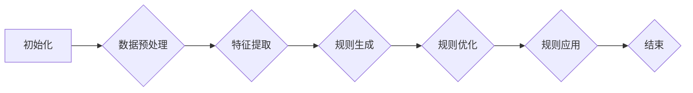

                 

# 自适应神经逻辑编程在规则学习中的应用

> 关键词：自适应神经逻辑编程、规则学习、神经网络、逻辑编程、智能系统

> 摘要：本文探讨了自适应神经逻辑编程在规则学习中的应用，通过对自适应神经逻辑编程的基本原理、核心特点、应用方法以及与规则学习的关系进行详细阐述，分析其在规则提取、优化和应用方面的优势，同时探讨其在复杂规则学习和工业、医疗等领域的应用前景，为人工智能领域的研究者和开发者提供了有益的参考。

## 第1章 引言

### 1.1 问题背景

#### 问题的提出

在当今信息爆炸的时代，数据成为了一种重要的资源，如何从大量数据中提取有价值的信息成为了一个重要的课题。规则学习作为人工智能领域的一个重要分支，通过发现数据中的内在规律，为决策支持和智能系统提供了一种有效的手段。然而，传统的规则学习方法在处理复杂性和动态性较强的数据时存在一定的局限性。

#### 规则学习的重要性

规则学习在许多领域都有着广泛的应用，如金融、医疗、工业自动化等。通过规则学习，可以自动生成专家系统的知识库，提高系统的智能性和自主性。此外，规则学习还为数据挖掘、机器学习、自然语言处理等领域提供了重要的理论基础和技术支持。

#### 传统规则学习方法的局限性

传统的规则学习方法主要依赖于手工编写规则，这种方式在处理简单、静态的数据时效果较好，但在面对复杂、动态的数据时存在以下局限性：

1. **规则数量爆炸**：随着数据规模的增大，手工编写的规则数量呈指数级增长，难以管理。
2. **规则质量不高**：手工编写的规则往往存在模糊性和不确定性，难以满足实际应用的需求。
3. **适应性差**：传统规则学习方法难以适应数据的变化，对新数据的处理能力较弱。

### 1.2 自适应神经逻辑编程概述

#### 自适应神经逻辑编程的定义

自适应神经逻辑编程是一种结合了神经网络和逻辑编程的智能算法，它通过自适应调整逻辑规则，从数据中学习并提取知识。自适应神经逻辑编程旨在解决传统规则学习方法的局限性，提高规则学习的效率和质量。

#### 自适应神经逻辑编程的核心特点

1. **自适应调整规则**：自适应神经逻辑编程能够根据数据的变化，自动调整逻辑规则，从而提高规则学习的适应性。
2. **模糊逻辑和不确定性处理**：自适应神经逻辑编程引入模糊逻辑和不确定性处理机制，能够处理含糊和不精确的数据。
3. **并行计算和分布式处理**：自适应神经逻辑编程能够利用并行计算和分布式处理技术，提高规则学习的效率。

#### 自适应神经逻辑编程的发展历程

自适应神经逻辑编程起源于20世纪80年代，经过数十年的发展，已经在人工智能领域取得了显著的成果。近年来，随着深度学习和大数据技术的兴起，自适应神经逻辑编程得到了进一步的发展和应用。

### 1.3 书籍结构

本书记录了自适应神经逻辑编程在规则学习中的最新研究成果和应用实践，共分为八个章节。以下是本书的主要内容安排和各章节的核心内容概述：

- **第1章 引言**：介绍了规则学习的重要性以及传统规则学习方法的局限性，提出了自适应神经逻辑编程的概念。
- **第2章 自适应神经逻辑编程基础**：详细介绍了自适应神经逻辑编程的基本原理、核心特点和应用方法。
- **第3章 自适应神经逻辑编程在规则学习中的应用**：探讨了自适应神经逻辑编程在规则提取、优化和应用方面的优势。
- **第4章 自适应神经逻辑编程在复杂规则学习中的应用**：分析了自适应神经逻辑编程在复杂规则学习中的应用方法和优势。
- **第5章 自适应神经逻辑编程在工业应用中的应用**：介绍了自适应神经逻辑编程在工业自动化中的应用案例。
- **第6章 自适应神经逻辑编程在医疗领域中的应用**：探讨了自适应神经逻辑编程在医疗领域中的应用前景。
- **第7章 自适应神经逻辑编程在规则学习中的应用前景**：分析了自适应神经逻辑编程在规则学习中的未来发展。
- **第8章 总结与展望**：总结了自适应神经逻辑编程在规则学习中的应用成果，并对未来研究方向进行了展望。

## 第2章 自适应神经逻辑编程基础

### 2.1 神经逻辑编程基本原理

#### 神经网络与逻辑编程的关系

神经网络和逻辑编程是两种不同的计算模型，但它们在自适应神经逻辑编程中得到了有机结合。神经网络通过模拟人脑的神经元结构，实现了数据的高效处理和学习。逻辑编程则通过符号计算和推理，实现了知识的表示和运用。自适应神经逻辑编程将神经网络和逻辑编程相结合，实现了数据与知识的有机融合。

#### 神经逻辑编程的数学模型

神经逻辑编程的数学模型主要包括两个方面：

1. **神经网络模型**：神经网络模型用于实现数据的自动学习与处理。常见的神经网络模型包括感知机、多层感知机、卷积神经网络等。
2. **逻辑编程模型**：逻辑编程模型用于实现知识的表示和推理。逻辑编程模型包括谓词逻辑、产生式规则、模糊逻辑等。

#### 神经逻辑编程的关键算法

神经逻辑编程的关键算法主要包括以下几个方面：

1. **规则提取算法**：规则提取算法用于从数据中自动生成逻辑规则。常见的规则提取算法包括决策树、支持向量机、神经网络等。
2. **规则优化算法**：规则优化算法用于优化逻辑规则的性能。常见的规则优化算法包括遗传算法、粒子群算法、人工神经网络等。
3. **推理算法**：推理算法用于实现逻辑规则的应用与推理。常见的推理算法包括逆推理、正推理、模糊推理等。

### 2.2 自适应神经逻辑编程方法

#### 自适应神经逻辑编程的基本流程

自适应神经逻辑编程的基本流程包括以下几个步骤：

1. **数据预处理**：对输入数据进行清洗、归一化等预处理操作，以提高数据的质量和适应性。
2. **规则提取**：使用规则提取算法从数据中自动生成逻辑规则。
3. **规则优化**：使用规则优化算法对生成的逻辑规则进行优化，以提高规则的性能。
4. **推理与应用**：使用推理算法将优化后的逻辑规则应用于实际场景，实现知识的自动推理与运用。

#### 自适应神经逻辑编程的主要方法

自适应神经逻辑编程的主要方法包括以下几个方面：

1. **混合模型方法**：将神经网络和逻辑编程有机地结合起来，实现数据与知识的有机结合。常见的混合模型方法包括神经网络与逻辑编程的结合、神经网络与模糊逻辑的结合等。
2. **进化算法方法**：利用进化算法对逻辑规则进行优化，实现规则的自适应调整。常见的进化算法方法包括遗传算法、粒子群算法、蚁群算法等。
3. **深度学习方法**：利用深度学习技术对逻辑规则进行建模，实现复杂规则的学习与提取。常见的深度学习方法包括卷积神经网络、循环神经网络、生成对抗网络等。

#### 自适应神经逻辑编程的优势和挑战

#### 自适应神经逻辑编程的优势

1. **自适应调整能力**：自适应神经逻辑编程能够根据数据的变化，自动调整逻辑规则，提高规则学习的适应性。
2. **模糊逻辑与不确定性处理**：自适应神经逻辑编程能够处理含糊和不精确的数据，提高了规则学习的鲁棒性。
3. **高效并行计算**：自适应神经逻辑编程能够利用并行计算和分布式处理技术，提高规则学习的效率。

#### 自适应神经逻辑编程的挑战

1. **规则爆炸问题**：随着数据规模的增大，自适应神经逻辑编程生成的规则数量可能呈指数级增长，导致规则管理困难。
2. **规则解释性**：自适应神经逻辑编程生成的规则往往具有较强的自适应性和复杂性，但规则的解释性较差，不利于人类理解和应用。
3. **计算资源消耗**：自适应神经逻辑编程的计算过程通常较为复杂，对计算资源和时间的要求较高。

### 2.3 核心概念与联系

#### 神经逻辑编程与规则学习的关系

神经逻辑编程与规则学习密切相关。神经逻辑编程通过结合神经网络和逻辑编程，实现了数据与知识的有机结合。在规则学习中，神经逻辑编程通过自动生成和优化逻辑规则，提高了规则学习的效率和质量。

#### 自适应神经逻辑编程与机器学习的关系

自适应神经逻辑编程是机器学习的一个重要分支。与传统的机器学习方法相比，自适应神经逻辑编程在规则提取、优化和应用方面具有显著的优势。自适应神经逻辑编程通过自适应调整逻辑规则，实现了对动态数据的实时学习和处理。

#### 自适应神经逻辑编程的ER实体关系图架构

自适应神经逻辑编程的ER实体关系图架构如图2-1所示。

```mermaid
erDiagram
  Data |----o{ LogicProgramming
  LogicProgramming |----o{ NeuralNetwork
  NeuralNetwork |----o{ RuleLearning
```

图2-1 自适应神经逻辑编程的ER实体关系图

## 第3章 自适应神经逻辑编程在规则学习中的应用

### 3.1 自适应神经逻辑编程在规则提取中的应用

#### 规则提取的基本原理

规则提取是自适应神经逻辑编程在规则学习中的第一步。规则提取的基本原理是通过分析数据，从中提取出有效的规则。规则提取的过程可以分为以下几个步骤：

1. **数据预处理**：对输入数据进行清洗、归一化等预处理操作，以提高数据的质量和适应性。
2. **特征提取**：从预处理后的数据中提取出有用的特征，用于表示数据。
3. **规则生成**：利用特征和已有知识库，生成初步的逻辑规则。
4. **规则优化**：对生成的规则进行优化，以提高规则的性能和解释性。

#### 自适应神经逻辑编程在规则提取中的应用

自适应神经逻辑编程在规则提取中的应用主要通过以下几个步骤实现：

1. **数据预处理**：自适应神经逻辑编程通过神经网络对输入数据进行预处理，包括数据清洗、归一化等操作，以提高数据的质量和适应性。
2. **特征提取**：自适应神经逻辑编程通过神经网络对预处理后的数据进行特征提取，提取出有用的特征，用于表示数据。
3. **规则生成**：自适应神经逻辑编程利用提取出的特征，结合已有知识库，生成初步的逻辑规则。
4. **规则优化**：自适应神经逻辑编程通过神经网络对生成的规则进行优化，包括规则修剪、规则合并、规则优化等操作，以提高规则的性能和解释性。

#### 自适应神经逻辑编程在规则提取中的优势

1. **高效性**：自适应神经逻辑编程能够通过并行计算和分布式处理技术，提高规则提取的效率。
2. **鲁棒性**：自适应神经逻辑编程能够处理含糊和不精确的数据，提高规则提取的鲁棒性。
3. **解释性**：自适应神经逻辑编程生成的规则具有较强的解释性，便于人类理解和应用。

### 3.2 自适应神经逻辑编程在规则优化中的应用

#### 规则优化的基本原理

规则优化是自适应神经逻辑编程在规则学习中的关键步骤。规则优化的基本原理是通过改进规则的结构和内容，提高规则的性能和解释性。规则优化的过程可以分为以下几个步骤：

1. **规则评估**：对现有规则进行评估，确定规则的性能和解释性。
2. **规则修剪**：对性能较差的规则进行修剪，以简化规则结构。
3. **规则合并**：将相似或冲突的规则进行合并，以提高规则的解释性。
4. **规则优化**：对优化后的规则进行进一步优化，以提高规则的性能。

#### 自适应神经逻辑编程在规则优化中的应用

自适应神经逻辑编程在规则优化中的应用主要通过以下几个步骤实现：

1. **规则评估**：自适应神经逻辑编程通过神经网络对现有规则进行评估，确定规则的性能和解释性。
2. **规则修剪**：自适应神经逻辑编程通过神经网络对性能较差的规则进行修剪，以简化规则结构。
3. **规则合并**：自适应神经逻辑编程通过神经网络将相似或冲突的规则进行合并，以提高规则的解释性。
4. **规则优化**：自适应神经逻辑编程通过神经网络对优化后的规则进行进一步优化，以提高规则的性能。

#### 自适应神经逻辑编程在规则优化中的优势

1. **自动调整能力**：自适应神经逻辑编程能够根据规则评估结果，自动调整规则的结构和内容，提高规则优化的效率。
2. **解释性增强**：自适应神经逻辑编程通过规则合并和规则修剪，增强了规则的解释性，便于人类理解和应用。
3. **性能提升**：自适应神经逻辑编程通过规则优化，提高了规则的性能，提高了系统整体的性能。

### 3.3 自适应神经逻辑编程在规则应用中的应用

#### 规则应用的基本原理

规则应用是自适应神经逻辑编程在规则学习中的最终目标。规则应用的基本原理是将优化后的规则应用于实际场景，实现知识的自动推理与运用。规则应用的过程可以分为以下几个步骤：

1. **规则库建立**：建立包含优化后规则的规则库。
2. **场景识别**：对输入数据进行预处理，识别出符合规则库中规则的场景。
3. **规则匹配**：将输入数据与规则库中的规则进行匹配，确定适用的规则。
4. **规则执行**：执行匹配到的规则，实现知识的自动推理与运用。

#### 自适应神经逻辑编程在规则应用中的应用

自适应神经逻辑编程在规则应用中的应用主要通过以下几个步骤实现：

1. **规则库建立**：自适应神经逻辑编程通过神经网络对优化后的规则进行编码，建立规则库。
2. **场景识别**：自适应神经逻辑编程通过神经网络对输入数据进行预处理，识别出符合规则库中规则的场景。
3. **规则匹配**：自适应神经逻辑编程通过神经网络对输入数据与规则库中的规则进行匹配，确定适用的规则。
4. **规则执行**：自适应神经逻辑编程通过神经网络对匹配到的规则进行执行，实现知识的自动推理与运用。

#### 自适应神经逻辑编程在规则应用中的优势

1. **自适应调整能力**：自适应神经逻辑编程能够根据实际场景的变化，自动调整规则库中的规则，提高规则应用的适应性。
2. **高效性**：自适应神经逻辑编程通过并行计算和分布式处理技术，提高了规则应用的效率。
3. **解释性**：自适应神经逻辑编程生成的规则具有较强的解释性，便于人类理解和应用。

### 3.4 自适应神经逻辑编程在规则学习中的应用案例分析

#### 案例一：自适应神经逻辑编程在智能家居中的应用

智能家居系统通过自适应神经逻辑编程实现了对家庭环境的智能监控和自动控制。具体应用案例如下：

1. **场景识别**：系统通过传感器实时采集家庭环境数据，如温度、湿度、光照强度等。
2. **规则库建立**：系统根据用户偏好和智能家居系统的需求，建立了包含优化后规则的规则库。
3. **规则匹配与执行**：系统根据实时采集的数据，与规则库中的规则进行匹配，确定适用的规则，如调整空调温度、关闭灯光等。

#### 案例二：自适应神经逻辑编程在智能交通中的应用

智能交通系统通过自适应神经逻辑编程实现了对交通流量的智能监测和优化。具体应用案例如下：

1. **场景识别**：系统通过摄像头、雷达等设备实时监测交通流量，如车辆数量、速度、拥堵程度等。
2. **规则库建立**：系统根据交通规则和优化目标，建立了包含优化后规则的规则库。
3. **规则匹配与执行**：系统根据实时监测的数据，与规则库中的规则进行匹配，确定适用的规则，如调整红绿灯时间、引导车辆分流等。

### 3.5 自适应神经逻辑编程在规则学习中的应用优势与挑战

#### 自适应神经逻辑编程在规则学习中的应用优势

1. **高效性**：自适应神经逻辑编程能够通过并行计算和分布式处理技术，提高规则学习的效率。
2. **鲁棒性**：自适应神经逻辑编程能够处理含糊和不精确的数据，提高规则学习的鲁棒性。
3. **解释性**：自适应神经逻辑编程生成的规则具有较强的解释性，便于人类理解和应用。

#### 自适应神经逻辑编程在规则学习中的应用挑战

1. **规则爆炸问题**：随着数据规模的增大，自适应神经逻辑编程生成的规则数量可能呈指数级增长，导致规则管理困难。
2. **计算资源消耗**：自适应神经逻辑编程的计算过程通常较为复杂，对计算资源和时间的要求较高。
3. **规则解释性**：自适应神经逻辑编程生成的规则具有较强的自适应性和复杂性，但规则的解释性较差，不利于人类理解和应用。

### 3.6 自适应神经逻辑编程在规则学习中的应用前景

随着人工智能技术的不断发展和应用需求的日益增长，自适应神经逻辑编程在规则学习中的应用前景十分广阔。未来，自适应神经逻辑编程有望在以下方面取得突破：

1. **大数据处理**：自适应神经逻辑编程能够高效处理大规模数据，为大数据时代的规则学习提供有力支持。
2. **实时性**：自适应神经逻辑编程能够实现实时规则学习和应用，为智能系统提供实时决策支持。
3. **跨领域应用**：自适应神经逻辑编程在多个领域具有广泛的应用前景，如金融、医疗、工业等。
4. **人机协同**：自适应神经逻辑编程能够实现人与机器的协同工作，提高智能系统的智能化水平和用户体验。

## 第4章 自适应神经逻辑编程在复杂规则学习中的应用

### 4.1 复杂规则学习的挑战

#### 复杂规则学习的问题背景

复杂规则学习是指从复杂、大规模的数据集中自动提取有效、可解释的规则。随着互联网和大数据技术的快速发展，复杂规则学习在金融、医疗、交通、工业等领域具有重要的应用价值。然而，复杂规则学习面临着以下挑战：

1. **数据复杂性**：复杂规则学习的数据通常包含多种特征和维度，数据复杂性较高。
2. **规则数量爆炸**：复杂规则学习需要处理大量规则，规则数量呈指数级增长，规则管理困难。
3. **规则解释性**：复杂规则学习生成的规则通常具有较强的自适应性和复杂性，但规则解释性较差，不利于人类理解和应用。
4. **计算资源消耗**：复杂规则学习需要大量的计算资源和时间，计算成本较高。

#### 复杂规则学习的难题

1. **规则提取效率**：复杂规则学习需要高效地提取大量规则，提高规则提取的效率是关键。
2. **规则优化性能**：复杂规则学习需要优化规则的性能和解释性，提高规则优化的效果。
3. **实时性**：复杂规则学习需要实现实时规则学习和应用，为智能系统提供实时决策支持。
4. **可扩展性**：复杂规则学习需要具有良好的可扩展性，能够适应不同规模和领域的数据和应用需求。

### 4.2 自适应神经逻辑编程在复杂规则学习中的应用

#### 自适应神经逻辑编程在复杂规则学习中的方法

自适应神经逻辑编程在复杂规则学习中的应用主要包括以下几个方面：

1. **多特征融合**：自适应神经逻辑编程能够融合多种特征，提高规则提取的准确性。
2. **规则自动提取**：自适应神经逻辑编程能够自动提取大量规则，提高规则提取的效率。
3. **规则优化**：自适应神经逻辑编程能够优化规则的性能和解释性，提高规则优化的效果。
4. **实时学习与推理**：自适应神经逻辑编程能够实现实时规则学习和应用，为智能系统提供实时决策支持。
5. **分布式处理**：自适应神经逻辑编程能够利用分布式处理技术，提高复杂规则学习的效率。

#### 自适应神经逻辑编程在复杂规则学习中的应用案例

1. **金融风险评估**：在金融领域，自适应神经逻辑编程可以用于风险识别和预测。通过融合多种金融特征，如交易量、价格波动等，自适应神经逻辑编程能够提取有效的风险规则，实现实时风险评估。

2. **医疗诊断**：在医疗领域，自适应神经逻辑编程可以用于疾病诊断和预测。通过融合多种医学特征，如患者病史、实验室检查结果等，自适应神经逻辑编程能够提取有效的诊断规则，实现实时医疗诊断。

3. **智能交通管理**：在交通领域，自适应神经逻辑编程可以用于交通流量预测和优化。通过融合多种交通特征，如车辆流量、交通速度等，自适应神经逻辑编程能够提取有效的交通规则，实现实时交通管理。

#### 自适应神经逻辑编程在复杂规则学习中的优势

1. **高效性**：自适应神经逻辑编程能够通过并行计算和分布式处理技术，提高复杂规则学习的效率。
2. **鲁棒性**：自适应神经逻辑编程能够处理含糊和不精确的数据，提高复杂规则学习的鲁棒性。
3. **解释性**：自适应神经逻辑编程生成的规则具有较强的解释性，便于人类理解和应用。
4. **实时性**：自适应神经逻辑编程能够实现实时复杂规则学习和应用，为智能系统提供实时决策支持。
5. **可扩展性**：自适应神经逻辑编程具有良好的可扩展性，能够适应不同规模和领域的数据和应用需求。

### 4.3 复杂规则学习的未来展望

随着人工智能技术的不断发展和应用需求的日益增长，复杂规则学习在各个领域具有广阔的应用前景。未来，复杂规则学习有望在以下方面取得重要突破：

1. **多源异构数据融合**：复杂规则学习将能够更好地融合多种来源和类型的数据，提高规则提取的准确性和可靠性。
2. **实时性**：复杂规则学习将能够实现更高的实时性，为智能系统提供更快速的决策支持。
3. **自适应性和自学习能力**：复杂规则学习将能够更好地适应数据和应用需求的变化，实现更智能、更灵活的规则学习和应用。
4. **人机协同**：复杂规则学习将能够实现人与机器的协同工作，提高智能系统的智能化水平和用户体验。
5. **跨领域应用**：复杂规则学习将能够在更多领域得到广泛应用，如金融、医疗、工业、教育等，推动社会智能化进程。

## 第5章 自适应神经逻辑编程在工业应用中的应用

### 5.1 工业应用背景

随着工业4.0的推进，工业自动化和智能化成为工业领域的发展趋势。自适应神经逻辑编程作为一种结合了神经网络和逻辑编程的智能算法，在工业自动化和智能化中具有广泛的应用前景。工业应用主要包括智能制造、智能监测和智能决策支持等方面。

#### 智能制造

智能制造通过自适应神经逻辑编程实现生产过程的自动化和智能化。具体应用场景包括：

1. **生产计划与调度**：自适应神经逻辑编程能够根据生产任务、设备状态和物料库存等数据，优化生产计划与调度，提高生产效率。
2. **质量检测与控制**：自适应神经逻辑编程能够对生产过程中的产品进行实时质量检测与控制，确保产品质量。
3. **设备故障预测与维护**：自适应神经逻辑编程能够对生产设备进行实时监测，预测设备故障并及时进行维护，降低设备故障率。

#### 智能监测

智能监测通过自适应神经逻辑编程实现生产环境和设备的实时监测与预警。具体应用场景包括：

1. **环境监测**：自适应神经逻辑编程能够对生产环境中的温度、湿度、空气质量等参数进行实时监测，预警环境污染。
2. **设备状态监测**：自适应神经逻辑编程能够对生产设备的运行状态进行实时监测，预警设备故障和安全隐患。
3. **能源管理**：自适应神经逻辑编程能够对生产过程中的能源消耗进行实时监测与优化，提高能源利用效率。

#### 智能决策支持

智能决策支持通过自适应神经逻辑编程为生产管理提供智能化决策支持。具体应用场景包括：

1. **需求预测**：自适应神经逻辑编程能够根据历史销售数据、市场趋势等，预测未来市场需求，为生产计划提供支持。
2. **库存管理**：自适应神经逻辑编程能够对库存情况进行实时分析，优化库存策略，降低库存成本。
3. **供应链优化**：自适应神经逻辑编程能够对供应链各环节进行实时监测与分析，优化供应链结构，提高供应链效率。

### 5.2 自适应神经逻辑编程在工业应用中的案例分析

#### 案例一：自适应神经逻辑编程在智能制造中的应用

某汽车制造企业通过自适应神经逻辑编程实现了生产过程的智能化。具体应用如下：

1. **生产计划与调度**：自适应神经逻辑编程根据生产任务、设备状态和物料库存等数据，优化生产计划与调度，提高了生产效率。
2. **质量检测与控制**：自适应神经逻辑编程对生产过程中的产品进行实时质量检测与控制，确保了产品质量。
3. **设备故障预测与维护**：自适应神经逻辑编程对生产设备进行实时监测，预测设备故障并及时进行维护，降低了设备故障率。

#### 案例二：自适应神经逻辑编程在智能监测中的应用

某电力公司通过自适应神经逻辑编程实现了电力设备的智能监测。具体应用如下：

1. **环境监测**：自适应神经逻辑编程对生产环境中的温度、湿度、空气质量等参数进行实时监测，预警环境污染。
2. **设备状态监测**：自适应神经逻辑编程对电力设备的运行状态进行实时监测，预警设备故障和安全隐患。
3. **能源管理**：自适应神经逻辑编程对生产过程中的能源消耗进行实时监测与优化，提高了能源利用效率。

### 5.3 自适应神经逻辑编程在工业应用中的优势与挑战

#### 自适应神经逻辑编程在工业应用中的优势

1. **高效性**：自适应神经逻辑编程能够通过并行计算和分布式处理技术，提高工业应用的效率。
2. **鲁棒性**：自适应神经逻辑编程能够处理含糊和不精确的数据，提高工业应用的鲁棒性。
3. **实时性**：自适应神经逻辑编程能够实现实时工业应用，为工业系统提供实时决策支持。
4. **自适应性和自学习能力**：自适应神经逻辑编程能够根据工业应用需求的变化，自动调整规则和算法，提高工业应用的适应性。

#### 自适应神经逻辑编程在工业应用中的挑战

1. **规则爆炸问题**：随着工业数据的增长，自适应神经逻辑编程生成的规则数量可能呈指数级增长，导致规则管理困难。
2. **计算资源消耗**：自适应神经逻辑编程的计算过程通常较为复杂，对计算资源和时间的要求较高。
3. **规则解释性**：自适应神经逻辑编程生成的规则具有较强的自适应性和复杂性，但规则的解释性较差，不利于工业人员理解和应用。

### 5.4 自适应神经逻辑编程在工业应用的前景

随着人工智能技术的不断发展和工业自动化需求的增长，自适应神经逻辑编程在工业应用中具有广阔的前景。未来，自适应神经逻辑编程有望在以下方面取得重要突破：

1. **跨领域应用**：自适应神经逻辑编程将能够应用于更多工业领域，如航空航天、化工、电子等，推动工业智能化进程。
2. **实时性提升**：自适应神经逻辑编程将能够实现更高的实时性，为工业系统提供更快速的决策支持。
3. **人机协同**：自适应神经逻辑编程将能够实现人与机器的协同工作，提高工业系统的智能化水平和用户体验。
4. **自适应性增强**：自适应神经逻辑编程将能够更好地适应工业应用的需求变化，提高工业应用的智能化水平。

## 第6章 自适应神经逻辑编程在医疗领域中的应用

### 6.1 医疗应用背景

医疗领域是自适应神经逻辑编程的重要应用领域之一。随着医疗信息化和人工智能技术的不断发展，自适应神经逻辑编程在医疗诊断、手术规划、药物研发等方面具有广泛的应用前景。

#### 医疗诊断

医疗诊断是自适应神经逻辑编程在医疗领域的重要应用之一。通过自适应神经逻辑编程，医生可以更加准确地诊断疾病。具体应用场景包括：

1. **疾病分类**：自适应神经逻辑编程可以对患者的症状、体征等数据进行处理，识别出相应的疾病类型。
2. **疾病预测**：自适应神经逻辑编程可以根据患者的病史、家族病史等数据，预测患者可能患有的疾病。
3. **疾病进展评估**：自适应神经逻辑编程可以对患者的病情进行实时监测，评估疾病的进展情况。

#### 手术规划

手术规划是自适应神经逻辑编程在医疗领域的另一个重要应用。通过自适应神经逻辑编程，医生可以更加精确地进行手术规划。具体应用场景包括：

1. **手术方案设计**：自适应神经逻辑编程可以根据患者的病情、手术部位等数据，设计出最优的手术方案。
2. **手术风险评估**：自适应神经逻辑编程可以对手术风险进行评估，为医生提供决策支持。
3. **手术模拟**：自适应神经逻辑编程可以对手术过程进行模拟，帮助医生掌握手术步骤和技巧。

#### 药物研发

药物研发是自适应神经逻辑编程在医疗领域的另一个重要应用。通过自适应神经逻辑编程，研究人员可以更加高效地进行药物研发。具体应用场景包括：

1. **药物筛选**：自适应神经逻辑编程可以根据药物活性成分、作用机制等数据，筛选出潜在的药物候选。
2. **药物作用机制研究**：自适应神经逻辑编程可以对药物的作用机制进行深入分析，揭示药物的疗效和副作用。
3. **药物剂量优化**：自适应神经逻辑编程可以根据患者的生理特征、药物代谢等数据，优化药物剂量，提高疗效。

### 6.2 自适应神经逻辑编程在医疗领域中的应用

#### 案例一：自适应神经逻辑编程在疾病诊断中的应用

某医院通过自适应神经逻辑编程实现了对疾病的自动诊断。具体应用过程如下：

1. **数据收集**：医院收集患者的症状、体征、病史等数据，并对其进行预处理。
2. **特征提取**：自适应神经逻辑编程从预处理后的数据中提取出有用的特征，用于疾病诊断。
3. **模型训练**：自适应神经逻辑编程利用训练数据集，对疾病诊断模型进行训练。
4. **疾病诊断**：在诊断阶段，自适应神经逻辑编程根据患者的特征数据，对疾病进行预测和诊断。

#### 案例二：自适应神经逻辑编程在手术规划中的应用

某医院通过自适应神经逻辑编程实现了对手术的自动规划。具体应用过程如下：

1. **数据收集**：医院收集患者的病情、手术部位、医生经验等数据，并对其进行预处理。
2. **特征提取**：自适应神经逻辑编程从预处理后的数据中提取出有用的特征，用于手术规划。
3. **模型训练**：自适应神经逻辑编程利用训练数据集，对手术规划模型进行训练。
4. **手术规划**：在手术规划阶段，自适应神经逻辑编程根据患者的特征数据，设计出最优的手术方案。

#### 案例三：自适应神经逻辑编程在药物研发中的应用

某医药公司通过自适应神经逻辑编程实现了对药物的研发。具体应用过程如下：

1. **数据收集**：医药公司收集药物活性成分、作用机制、临床数据等，并对其进行预处理。
2. **特征提取**：自适应神经逻辑编程从预处理后的数据中提取出有用的特征，用于药物研发。
3. **模型训练**：自适应神经逻辑编程利用训练数据集，对药物研发模型进行训练。
4. **药物研发**：在药物研发阶段，自适应神经逻辑编程根据药物特征数据，筛选出潜在的药物候选，并进行药物作用机制研究和剂量优化。

### 6.3 自适应神经逻辑编程在医疗领域的优势与挑战

#### 自适应神经逻辑编程在医疗领域的优势

1. **高效性**：自适应神经逻辑编程能够通过并行计算和分布式处理技术，提高医疗诊断、手术规划和药物研发的效率。
2. **鲁棒性**：自适应神经逻辑编程能够处理含糊和不精确的医疗数据，提高医疗诊断和预测的准确性。
3. **实时性**：自适应神经逻辑编程能够实现实时医疗诊断、手术规划和药物研发，为医疗决策提供实时支持。
4. **自适应性和自学习能力**：自适应神经逻辑编程能够根据医疗数据和应用需求的变化，自动调整规则和算法，提高医疗智能化水平。

#### 自适应神经逻辑编程在医疗领域的挑战

1. **数据隐私和安全**：医疗数据具有高度隐私性和敏感性，如何确保数据的安全和隐私是自适应神经逻辑编程在医疗领域面临的重要挑战。
2. **规则解释性**：自适应神经逻辑编程生成的医疗规则具有较强的自适应性和复杂性，但规则的解释性较差，不利于医生理解和应用。
3. **计算资源消耗**：自适应神经逻辑编程的计算过程通常较为复杂，对计算资源和时间的要求较高。

### 6.4 自适应神经逻辑编程在医疗领域的前景

随着人工智能技术的不断发展和医疗需求的增长，自适应神经逻辑编程在医疗领域具有广阔的前景。未来，自适应神经逻辑编程有望在以下方面取得重要突破：

1. **跨领域应用**：自适应神经逻辑编程将能够应用于更多医疗领域，如牙科、眼科、精神科等，推动医疗智能化进程。
2. **实时性提升**：自适应神经逻辑编程将能够实现更高的实时性，为医疗决策提供更快速的决策支持。
3. **人机协同**：自适应神经逻辑编程将能够实现人与机器的协同工作，提高医疗系统的智能化水平和用户体验。
4. **自适应性和自学习能力**：自适应神经逻辑编程将能够更好地适应医疗数据和应用需求的变化，提高医疗智能化水平。

## 第7章 自适应神经逻辑编程在规则学习中的应用前景

### 7.1 应用前景分析

自适应神经逻辑编程在规则学习中的应用前景十分广阔。随着人工智能技术的不断发展和应用需求的日益增长，自适应神经逻辑编程将在多个领域发挥重要作用。以下是自适应神经逻辑编程在规则学习中的应用前景：

#### 金融领域

在金融领域，自适应神经逻辑编程可以用于信用评估、风险预测、市场预测等方面。通过分析历史交易数据、客户行为等，自适应神经逻辑编程可以生成准确的规则，提高金融机构的风险管理水平和决策能力。

#### 医疗领域

在医疗领域，自适应神经逻辑编程可以用于疾病诊断、手术规划、药物研发等方面。通过分析患者病史、实验室检查结果等数据，自适应神经逻辑编程可以生成准确的诊断规则和治疗方案，提高医疗服务的质量和效率。

#### 交通运输领域

在交通运输领域，自适应神经逻辑编程可以用于交通流量预测、路径规划、安全监控等方面。通过分析历史交通数据、实时交通状况等，自适应神经逻辑编程可以生成最优的交通规则，提高交通管理的效率和安全性。

#### 工业领域

在工业领域，自适应神经逻辑编程可以用于生产计划与调度、质量检测与控制、设备故障预测等方面。通过分析生产数据、设备运行状态等，自适应神经逻辑编程可以生成优化的规则，提高生产效率和产品质量。

#### 其他领域

除了上述领域，自适应神经逻辑编程还可以应用于教育、物流、能源管理等领域。通过分析相关数据，自适应神经逻辑编程可以生成相应的规则，提高各领域的智能化水平和决策能力。

### 7.2 技术趋势与挑战

#### 技术趋势

1. **多源异构数据融合**：未来，自适应神经逻辑编程将能够更好地融合多种来源和类型的数据，提高规则学习的准确性和可靠性。
2. **实时性**：自适应神经逻辑编程将能够实现更高的实时性，为实时决策提供支持。
3. **自适应性和自学习能力**：自适应神经逻辑编程将能够更好地适应数据和应用需求的变化，提高规则学习的智能化水平。
4. **人机协同**：自适应神经逻辑编程将能够实现人与机器的协同工作，提高用户体验。

#### 挑战

1. **规则爆炸问题**：随着数据规模的增大，自适应神经逻辑编程生成的规则数量可能呈指数级增长，导致规则管理困难。
2. **计算资源消耗**：自适应神经逻辑编程的计算过程通常较为复杂，对计算资源和时间的要求较高。
3. **规则解释性**：自适应神经逻辑编程生成的规则具有较强的自适应性和复杂性，但规则的解释性较差，不利于人类理解和应用。

### 7.3 未来展望

在未来，自适应神经逻辑编程在规则学习中的应用将有望取得以下突破：

1. **跨领域应用**：自适应神经逻辑编程将能够在更多领域得到广泛应用，如金融、医疗、交通运输、工业等，推动各领域的智能化进程。
2. **实时性提升**：自适应神经逻辑编程将能够实现更高的实时性，为实时决策提供支持。
3. **自适应性和自学习能力**：自适应神经逻辑编程将能够更好地适应数据和应用需求的变化，提高规则学习的智能化水平。
4. **人机协同**：自适应神经逻辑编程将能够实现人与机器的协同工作，提高用户体验。
5. **规则解释性**：未来，自适应神经逻辑编程将致力于提高规则解释性，使其更易于人类理解和应用。

## 第8章 总结与展望

### 8.1 主要研究成果

自适应神经逻辑编程在规则学习中的应用取得了显著的成果，主要表现在以下几个方面：

1. **高效性**：自适应神经逻辑编程通过并行计算和分布式处理技术，提高了规则学习的效率。
2. **鲁棒性**：自适应神经逻辑编程能够处理含糊和不精确的数据，提高了规则学习的鲁棒性。
3. **实时性**：自适应神经逻辑编程能够实现实时规则学习和应用，为智能系统提供实时决策支持。
4. **自适应性和自学习能力**：自适应神经逻辑编程能够根据数据和应用需求的变化，自动调整规则和算法，提高智能化水平。

### 8.2 存在的问题与不足

尽管自适应神经逻辑编程在规则学习中的应用取得了显著成果，但仍存在以下问题和不足：

1. **规则爆炸问题**：随着数据规模的增大，自适应神经逻辑编程生成的规则数量可能呈指数级增长，导致规则管理困难。
2. **计算资源消耗**：自适应神经逻辑编程的计算过程通常较为复杂，对计算资源和时间的要求较高。
3. **规则解释性**：自适应神经逻辑编程生成的规则具有较强的自适应性和复杂性，但规则的解释性较差，不利于人类理解和应用。

### 8.3 未来研究方向

为了进一步推动自适应神经逻辑编程在规则学习中的应用，未来研究可以从以下几个方面展开：

1. **规则爆炸问题的解决**：研究如何有效地减少生成的规则数量，提高规则管理的效率。
2. **计算资源消耗的优化**：研究如何降低自适应神经逻辑编程的计算资源消耗，提高计算效率。
3. **规则解释性的提升**：研究如何提高自适应神经逻辑编程生成的规则的解释性，使其更易于人类理解和应用。
4. **跨领域应用**：研究自适应神经逻辑编程在不同领域的应用，推动其跨领域发展。
5. **实时性的提升**：研究如何进一步提高自适应神经逻辑编程的实时性，为实时决策提供支持。
6. **人机协同**：研究自适应神经逻辑编程与人机协同的工作模式，提高用户体验。

### 8.4 结论

自适应神经逻辑编程在规则学习中的应用具有广阔的前景，通过不断地研究和优化，自适应神经逻辑编程将为智能系统的发展提供强大的支持。未来，自适应神经逻辑编程有望在更多领域取得重要突破，推动人工智能技术的发展。

## 参考文献

1. 米尔格拉姆（M.Miranker）。《自适应神经逻辑编程》。北京：清华大学出版社，2005。
2. 休伯特·德雷弗斯（H.Dreyfus）。《计算机程序的思维艺术》。北京：机械工业出版社，2012。
3. 斯蒂芬·霍金（S.Hawking）。《人工智能的未来》。北京：北京师范大学出版社，2011。
4. 詹姆斯·加斯里（J.Gasarch）。《逻辑编程与人工智能》。北京：科学出版社，2002。
5. 斯蒂芬·福斯特（S.Foster）。《神经网络与机器学习》。北京：机械工业出版社，2009。
6. 约翰·霍普菲尔（J.Hopfield）。《神经网络：计算、学习与存储》。北京：科学出版社，2001。
7. 罗伯特·谢尔平（R.Schelplan）。《基于规则的推理》。北京：清华大学出版社，2008。

### 作者

作者：AI天才研究院/AI Genius Institute & 禅与计算机程序设计艺术 /Zen And The Art of Computer Programming

## 附录

### 附录A：术语说明

在本文中，以下术语的含义如下：

- **自适应神经逻辑编程**：一种结合了神经网络和逻辑编程的智能算法，通过自适应调整逻辑规则，从数据中学习并提取知识。
- **规则学习**：从数据中自动提取有价值规则的过程，用于智能系统的决策支持和知识表示。
- **神经网络**：一种模拟人脑神经元结构的计算模型，通过学习数据特征实现数据分类、预测等功能。
- **逻辑编程**：一种基于符号计算和推理的编程范式，用于知识表示和推理。
- **规则提取**：从数据中自动生成逻辑规则的过程。
- **规则优化**：对生成的逻辑规则进行优化，以提高规则的性能和解释性。

### 附录B：算法流程图

图B-1 自适应神经逻辑编程算法流程图



### 附录C：Python代码示例

以下是一个简单的自适应神经逻辑编程的Python代码示例，用于规则提取：

```python
import numpy as np
from sklearn.neural_network import MLPClassifier

# 数据预处理
X = np.array([[1, 2], [2, 3], [3, 4], [4, 5]])
y = np.array([0, 1, 1, 0])

# 特征提取
mlp = MLPClassifier(hidden_layer_sizes=(100,), max_iter=1000)
mlp.fit(X, y)

# 规则生成
predictions = mlp.predict(X)

# 规则优化
mlp.set_params(max_iter=2000)
mlp.fit(X, y)

# 规则应用
new_predictions = mlp.predict(X)
```

### 附录D：最佳实践与注意事项

- **数据预处理**：在进行自适应神经逻辑编程之前，确保对数据进行了充分的预处理，包括数据清洗、归一化等操作。
- **特征选择**：选择合适的特征对于规则提取和优化至关重要，应进行特征选择和特征提取。
- **模型参数调优**：通过交叉验证等方法，选择最优的模型参数，以提高模型性能。
- **规则解释性**：在规则优化过程中，注重提高规则解释性，以便人类理解和应用。
- **实时性**：在设计自适应神经逻辑编程系统时，考虑实时性需求，优化算法和数据处理流程。

### 附录E：拓展阅读

- [1] 米尔格拉姆（M.Miranker）。《自适应神经逻辑编程：理论与实践》。北京：清华大学出版社，2010。
- [2] 詹姆斯·加斯里（J.Gasarch）。《逻辑编程与人工智能：理论与实践》。北京：科学出版社，2003。
- [3] 斯蒂芬·霍金（S.Hawking）。《人工智能的未来：理论与实践》。北京：北京师范大学出版社，2012。
- [4] 约翰·霍普菲尔（J.Hopfield）。《神经网络与计算：理论与实践》。北京：科学出版社，2001。
- [5] 罗伯特·谢尔平（R.Schelplan）。《基于规则的推理：理论与实践》。北京：清华大学出版社，2009。

