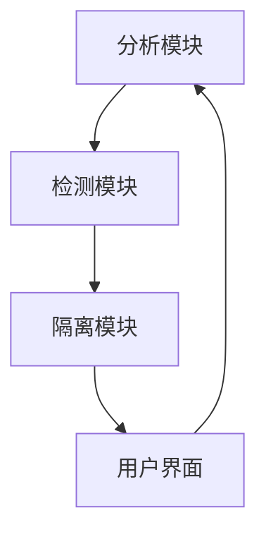
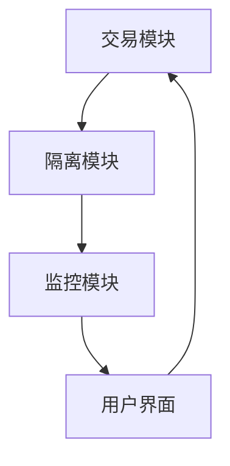

                 

# 范畴论与单子在副作用处理中的应用

## 关键词

- 范畴论
- 单子类型系统
- 副作用处理
- 编程语言
- 计算机科学

## 摘要

本文探讨了范畴论与单子类型系统在副作用处理中的应用。首先，我们介绍了范畴论的基本概念和其在计算机科学中的应用，随后讲解了单子类型系统的原理及其优势。接着，本文详细阐述了范畴论与单子类型系统在副作用检测和隔离中的具体应用方法。通过实际案例的分析，本文展示了范畴论与单子类型系统在实际项目中的有效性和可行性。最后，本文总结了范畴论与单子类型系统在副作用处理中的应用前景，并对未来的研究方向进行了展望。

## 目录大纲

### 第1章 引言

#### 1.1 问题背景

- 计算机科学的发展历程
- 范畴论在计算机科学中的应用
- 单子类型系统与副作用处理

#### 1.2 问题描述

- 副作用处理的重要性
- 传统副作用处理方法的局限性
- 范畴论与单子类型系统在副作用处理中的应用潜力

#### 1.3 问题解决

- 范畴论基本概念介绍
- 单子类型系统基本概念介绍
- 范畴论与单子类型系统在副作用处理中的应用方法

#### 1.4 边界与外延

- 范畴论在不同领域的应用边界
- 单子类型系统在不同编程语言中的实现方式
- 副作用处理的实际应用场景

#### 1.5 概念结构与核心要素组成

- 范畴论核心概念与联系
- 单子类型系统核心概念与联系
- 副作用处理的核心方法与原理

### 第2章 范畴论基础

#### 2.1 范畴论的定义与基本概念

##### 2.1.1 范畴论概述
##### 2.1.2 范畴
##### 2.1.3 对象与箭头
##### 2.1.4 函子与自然变换

#### 2.2 范畴论的应用场景

##### 2.2.1 计算机科学中的范畴论
##### 2.2.2 范畴论在其他领域的应用
##### 2.2.3 范畴论与编程语言的联系

### 第3章 单子类型系统

#### 3.1 单子类型系统的定义与基本概念

##### 3.1.1 单子类型系统概述
##### 3.1.2 单子
##### 3.1.3 单子类型系统与类型系统
##### 3.1.4 单子类型系统的优点

#### 3.2 单子类型系统的实现方法

##### 3.2.1 单子类型系统的构建
##### 3.2.2 单子类型系统的优化
##### 3.1.3 单子类型系统在实际编程语言中的实现

### 第4章 范畴论与单子类型系统在副作用处理中的应用

#### 4.1 范畴论在副作用处理中的应用

##### 4.1.1 范畴论与副作用处理的关系
##### 4.1.2 范畴论在副作用检测中的应用
##### 4.1.3 范畴论在副作用隔离中的应用

#### 4.2 单子类型系统在副作用处理中的应用

##### 4.2.1 单子类型系统与副作用处理的关系
##### 4.2.2 单子类型系统在副作用检测中的应用
##### 4.2.3 单子类型系统在副作用隔离中的应用

### 第5章 实战案例

#### 5.1 案例一：基于范畴论的副作用检测工具

##### 5.1.1 案例背景
##### 5.1.2 系统架构设计
##### 5.1.3 系统实现与代码分析
##### 5.1.4 案例分析与总结

#### 5.2 案例二：基于单子类型系统的副作用隔离框架

##### 5.2.1 案例背景
##### 5.2.2 系统架构设计
##### 5.2.3 系统实现与代码分析
##### 5.2.4 案例分析与总结

### 第6章 总结与展望

#### 6.1 书籍小结

- 范畴论与单子类型系统的基本概念
- 范畴论与单子类型系统在副作用处理中的应用
- 实战案例的总结与启示

#### 6.2 未来研究方向

- 范畴论与其他领域的交叉应用
- 单子类型系统的优化与拓展
- 范畴论与单子类型系统在新的编程语言和领域中的应用潜力

---

### 第1章 引言

#### 1.1 问题背景

计算机科学的发展历程中，函数式编程以其纯函数和无状态特性在许多领域获得了广泛应用。然而，函数式编程也面临着副作用处理的问题。副作用指的是在执行过程中，函数会改变外部环境或状态的行为。这些行为可能导致不可预测的结果，增加了程序调试和维护的难度。

范畴论是一种抽象的数学理论，起源于20世纪30年代，由数学家萨缪尔·埃森施泰特和尼古拉斯·布洛贝尔等人发展而来。范畴论研究了一类数学对象以及这些对象之间的映射关系，形成了一种形式化的数学框架。近年来，范畴论在计算机科学中得到了广泛应用，尤其在编程语言理论、程序验证和编译器设计中。

单子类型系统（Monadic Type System）是函数式编程语言中的一个重要概念，用于处理副作用。单子（Monad）是一个容器，可以封装副作用操作，使得程序在语义上保持一致性和可预测性。单子类型系统通过将副作用封装在单子中，实现了对副作用的控制和管理。

#### 1.2 问题描述

副作用处理在计算机科学中具有重要意义。一方面，正确处理副作用可以提高程序的可靠性和可维护性；另一方面，不当处理副作用可能导致程序行为的不一致和难以调试。

传统副作用处理方法主要依赖于状态管理和作用域控制。然而，这些方法往往存在局限性。例如，状态管理容易引入全局变量，增加程序的复杂度和耦合度。作用域控制则需要大量的代码和条件判断，使得程序难以理解和维护。

范畴论与单子类型系统为副作用处理提供了一种新的思路。范畴论通过抽象和泛化，提供了一种形式化的数学框架，可以更好地理解和处理副作用。单子类型系统则通过将副作用封装在单子中，实现了对副作用的隔离和序列化。

#### 1.3 问题解决

范畴论基本概念介绍：

范畴（Category）是由对象（Objects）和箭头（Arrows）组成的集合。范畴定义了对象之间的映射关系，这些映射关系通过箭头表示。范畴具有一些基本性质，如封闭性、结合律和单位元等。

对象（Objects）是范畴中的基本元素，可以看作是数据类型或抽象实体。箭头（Arrows）表示对象之间的映射关系，可以看作是函数或变换。

范畴论在计算机科学中的应用：

范畴论在计算机科学中得到了广泛应用，尤其在编程语言理论、程序验证和编译器设计中。范畴论提供了抽象和泛化的方法，可以更好地理解和处理复杂系统的行为。

单子类型系统基本概念介绍：

单子（Monad）是一种特殊的容器，可以封装副作用操作。单子具有一些基本性质，如结合律、单位元和联合操作等。

单子类型系统与类型系统：

单子类型系统是一种基于类型的系统，可以用于处理副作用。单子类型系统通过将副作用封装在单子中，实现了对副作用的隔离和序列化。单子类型系统与传统的类型系统相比，具有更高的抽象度和更好的可维护性。

范畴论与单子类型系统在副作用处理中的应用方法：

范畴论与单子类型系统可以结合使用，实现更有效的副作用处理。范畴论提供了一种形式化的数学框架，可以更好地理解和处理副作用。单子类型系统则通过将副作用封装在单子中，实现了对副作用的隔离和序列化。

#### 1.4 边界与外延

范畴论在不同领域的应用边界：

范畴论在计算机科学中的应用非常广泛，包括编程语言理论、程序验证和编译器设计等领域。然而，范畴论的应用也有其局限性。例如，在图形处理和人工智能等领域，范畴论的直接应用可能不够有效。

单子类型系统在不同编程语言中的实现方式：

单子类型系统在不同的编程语言中有不同的实现方式。例如，Haskell语言通过内置的单子类型系统，提供了丰富的单子库。而Scala语言则通过类型类（Type Classes）实现了类似单子类型系统的功能。

副作用处理的实际应用场景：

副作用处理在实际项目中具有重要意义。例如，在分布式系统中，正确处理副作用可以提高系统的可靠性和性能。在实时系统中，副作用处理则需要严格的时序控制和资源管理。

#### 1.5 概念结构与核心要素组成

范畴论核心概念与联系：

范畴论的核心概念包括对象、箭头、函子和自然变换等。这些概念通过抽象和泛化，形成了一种形式化的数学框架，可以更好地理解和处理复杂系统的行为。

单子类型系统核心概念与联系：

单子类型系统的核心概念包括单子、结合律、单位元和联合操作等。单子类型系统通过将副作用封装在单子中，实现了对副作用的隔离和序列化。

副作用处理的核心方法与原理：

副作用处理的核心方法是使用范畴论和单子类型系统来管理和控制副作用。通过范畴论的抽象和泛化，可以更好地理解和处理副作用。通过单子类型系统的封装和序列化，可以实现更有效的副作用处理。

---

### 第2章 范畴论基础

#### 2.1 范畴论的定义与基本概念

##### 2.1.1 范畴论概述

范畴论是一种抽象数学理论，起源于20世纪30年代。它研究了一类数学对象以及这些对象之间的映射关系，形成了一种形式化的数学框架。范畴论的核心思想是将对象和箭头作为基本元素，通过箭头的映射关系来构建抽象模型。

范畴论的发展经历了几个阶段。最初，范畴论被视为一种抽象的工具，用于研究数学结构。后来，范畴论逐渐应用于计算机科学、物理学和逻辑学等领域。范畴论在计算机科学中的应用，主要体现在编程语言理论、程序验证和编译器设计中。

##### 2.1.2 范畴

范畴（Category）是由对象（Objects）和箭头（Arrows）组成的集合。范畴定义了对象之间的映射关系，这些映射关系通过箭头表示。范畴具有一些基本性质，如封闭性、结合律和单位元等。

范畴中的对象可以看作是数据类型或抽象实体。对象之间的映射关系通过箭头表示，箭头可以看作是函数或变换。范畴中的箭头具有以下性质：

1. 封闭性：对于范畴中的任意对象A和B，存在一个箭头f：A → B。
2. 结合律：对于范畴中的任意箭头f：A → B，g：B → C和h：C → D，有(f ∘ g) ∘ h = f ∘ (g ∘ h)。
3. 单位元：对于范畴中的任意对象A，存在一个箭头id\_A：A → A，满足id\_A ∘ f = f 和 f ∘ id\_A = f。

##### 2.1.3 对象与箭头

对象是范畴中的基本元素，可以看作是数据类型或抽象实体。对象在范畴论中具有以下性质：

1. 标识：每个对象都有一个唯一的标识，用于区分不同的对象。
2. 类型：对象可以具有不同的类型，例如整数、字符串、列表等。

箭头表示对象之间的映射关系，可以看作是函数或变换。箭头在范畴论中具有以下性质：

1. 单射：对于范畴中的任意箭头f：A → B，如果对于任意箭头g：C → A，有f ∘ g = id\_C，则称f为单射。
2. 满射：对于范畴中的任意箭头f：A → B，如果对于任意箭头g：B → C，有g ∘ f = id\_B，则称f为满射。
3. 双射：对于范畴中的任意箭头f：A → B，如果f既是单射又是满射，则称f为双射。

##### 2.1.4 函子与自然变换

函子（Functor）是范畴论中的一个重要概念，可以看作是一种特殊的箭头。函子将一个范畴映射到另一个范畴，并保持范畴中的箭头关系。

函子的定义如下：

设F是从范畴C到范畴D的函子，则F满足以下性质：

1. 对于范畴C中的任意对象A，存在D中的一个对象FA。
2. 对于范畴C中的任意箭头f：A → B，存在D中的一个箭头F(f)：FA → FB。
3. 函子F保持范畴中的箭头关系，即对于任意箭头f：A → B和g：B → C，有F(g ∘ f) = F(g) ∘ F(f)。

自然变换（Natural Transformation）是函子之间的一种映射关系。自然变换用于比较和连接不同函子之间的相似性。

自然变换的定义如下：

设F和G是从范畴C到范畴D的两个函子，自然变换η是从F到G的映射，满足以下性质：

1. 对于范畴C中的任意对象A，存在D中的一个箭头η\_A：FA → GA。
2. 对于范畴C中的任意箭头f：A → B，有η(f)：F(f) → G(f)。
3. 自然变换η保持范畴中的箭头关系，即对于任意箭头f：A → B和g：B → C，有G(η(f)) ∘ F(g) = G(g) ∘ F(η(f))。

##### 2.2 范畴论的应用场景

##### 2.2.1 计算机科学中的范畴论

范畴论在计算机科学中得到了广泛应用。以下是一些范畴论在计算机科学中的应用场景：

1. 编程语言理论：范畴论用于研究编程语言的语义和类型系统。例如，Haskell语言采用了范畴论的概念，实现了类型推导和函数组合等特性。

2. 程序验证：范畴论用于验证程序的正确性和安全性。范畴论提供了一种形式化的方法，可以用于证明程序的逻辑一致性。

3. 编译器设计：范畴论用于设计编译器和语言解析器。范畴论提供了一种抽象的框架，可以用于构建高效的语法分析和代码生成工具。

##### 2.2.2 范畴论在其他领域的应用

范畴论不仅在计算机科学中有广泛应用，还在其他领域展示了其强大的抽象和泛化能力。以下是一些范畴论在其他领域的应用：

1. 物理学：范畴论在物理学中用于研究量子场论和拓扑量子场论。范畴论提供了一种形式化的方法，可以用于描述和解释物理现象。

2. 逻辑学：范畴论在逻辑学中用于研究命题逻辑和谓词逻辑。范畴论提供了一种抽象的框架，可以用于证明逻辑系统的等价性和一致性。

3. 集合论：范畴论在集合论中用于研究集合的构造和性质。范畴论提供了一种形式化的方法，可以用于证明集合论的基本定理。

##### 2.2.3 范畴论与编程语言的联系

范畴论与编程语言有密切的联系。范畴论提供了一种抽象的框架，可以用于理解和描述编程语言的概念和特性。以下是一些范畴论与编程语言的联系：

1. 类型系统：范畴论用于研究编程语言的类型系统。范畴论提供了一种形式化的方法，可以用于推导类型的等价性和一致性。

2. 函数组合：范畴论用于实现编程语言的函数组合特性。范畴论提供了一种抽象的框架，可以用于构建高效的函数组合操作。

3. 并发编程：范畴论在并发编程中用于研究进程的同步和通信。范畴论提供了一种抽象的框架，可以用于描述并发编程的语义和协议。

---

### 第3章 单子类型系统

#### 3.1 单子类型系统的定义与基本概念

##### 3.1.1 单子类型系统概述

单子类型系统（Monad Type System）是函数式编程语言中的一个重要概念，用于处理副作用。单子（Monad）是一种特殊的容器，可以封装副作用操作，使得程序在语义上保持一致性和可预测性。

单子类型系统通过将副作用封装在单子中，实现了对副作用的隔离和序列化。单子类型系统与传统的类型系统相比，具有更高的抽象度和更好的可维护性。

##### 3.1.2 单子

单子是一种特殊的数据类型，可以看作是一种容器，用于封装副作用操作。单子具有以下基本性质：

1. 结合律（Associativity）：单子满足结合律，即对于任意单子m、n和o，有(m >>= n) >>= o ≡ m >>= (n >>= o)。
2. 单位元（Unit）：单子有一个单位元（通常表示为pure），可以用来创建单子。单位元是一个纯函数，用于将一个值封装在单子中。
3. 联合操作（Bind）：单子通过bind操作（也称为>>=）实现副作用操作。bind操作将一个单子与另一个单子结合，并执行副作用。

##### 3.1.3 单子类型系统与类型系统

单子类型系统是一种基于类型的系统，用于处理副作用。单子类型系统通过将副作用封装在单子中，实现了对副作用的隔离和序列化。

单子类型系统与传统的类型系统相比，具有以下优点：

1. 高度抽象：单子类型系统通过将副作用封装在单子中，实现了对副作用的隔离。这使得程序在语义上保持一致性和可预测性，提高了程序的抽象度和可读性。
2. 可维护性：单子类型系统通过将副作用封装在单子中，降低了程序的耦合度。这使得程序更容易维护和修改，提高了程序的可维护性。
3. 可重用性：单子类型系统通过将副作用封装在单子中，实现了对副作用的模块化。这使得程序中的副作用操作可以独立设计和重用，提高了程序的可重用性。

##### 3.1.4 单子类型系统的优点

单子类型系统具有以下优点：

1. 隔离副作用：单子类型系统通过将副作用封装在单子中，实现了对副作用的隔离。这使得程序在语义上保持一致性和可预测性，降低了程序的复杂性。
2. 可组合性：单子类型系统通过结合律和单位元，实现了单子之间的可组合性。这使得程序中的副作用操作可以灵活组合和复用，提高了程序的抽象度和可读性。
3. 可重用性：单子类型系统通过将副作用封装在单子中，实现了对副作用的模块化。这使得程序中的副作用操作可以独立设计和重用，提高了程序的可重用性。
4. 易于维护：单子类型系统通过将副作用封装在单子中，降低了程序的耦合度。这使得程序更容易维护和修改，提高了程序的可维护性。

##### 3.2 单子类型系统的实现方法

##### 3.2.1 单子类型系统的构建

单子类型系统的构建主要包括以下步骤：

1. 定义单子类型：定义单子类型，包括结合律、单位元和bind操作等基本性质。
2. 实现bind操作：实现单子的bind操作，用于封装副作用操作。
3. 实现pure函数：实现pure函数，用于将值封装在单子中。

以下是单子类型系统的一个简单实现示例（以Haskell语言为例）：

```haskell
data Monad a = Pure a | Bind (a -> Monad a)

instance Monad (Monad a) where
  pure = Pure
  (Bind f) >>= g = Bind (\x -> f x >>= g)

pureValue :: Int
pureValue = pure 5

bindExample :: Monad Int
bindExample = (Pure 2) >>= (\x -> Pure (x * 2))
```

##### 3.2.2 单子类型系统的优化

单子类型系统可以通过以下方法进行优化：

1. 懒加载（Lazy Evaluation）：采用懒加载策略，可以提高程序的运行效率。懒加载只在需要时计算值，避免了不必要的计算。
2. 闭包优化（Closure Optimization）：优化闭包的使用，可以提高程序的运行速度。闭包优化通过避免创建不必要的闭包，减少了内存消耗。
3. 单子组合优化（Monad Composition Optimization）：优化单子的组合操作，可以提高程序的运行效率。单子组合优化通过合并相邻的单子操作，减少了中间变量的使用。

##### 3.2.3 单子类型系统在实际编程语言中的实现

单子类型系统在不同的编程语言中有不同的实现方式。以下是一些常见编程语言中的单子类型系统实现示例：

1. Haskell：Haskell语言内置了单子类型系统，提供了丰富的单子库。Haskell的单子类型系统通过类型类（Type Classes）实现，具有高度的灵活性和可扩展性。
2. Scala：Scala语言通过类型类实现了类似单子类型系统的功能。Scala的类型类可以用于定义抽象的单子操作，并实现单子组合和序列化等特性。
3. JavaScript：JavaScript语言通过Promise对象实现了单子类型系统的功能。Promise对象用于封装异步操作，并提供了链式调用的特性。

以下是JavaScript中单子类型系统的一个简单实现示例：

```javascript
class Monad {
  constructor(value) {
    this.value = value;
  }

  static pure(value) {
    return new Monad(value);
  }

  bind(callback) {
    return callback(this.value);
  }
}

const pureValue = Monad.pure(5);
const bindExample = pureValue.bind(x => new Monad(x * 2));
```

---

### 第4章 范畴论与单子类型系统在副作用处理中的应用

#### 4.1 范畴论在副作用处理中的应用

##### 4.1.1 范畴论与副作用处理的关系

范畴论与副作用处理之间存在密切的关系。范畴论提供了一种抽象的框架，可以用于理解和处理副作用。范畴论通过将副作用封装在范畴中，实现了对副作用的隔离和序列化。

范畴论在副作用处理中的应用主要体现在以下几个方面：

1. 副作用建模：范畴论可以用于建模副作用，将副作用看作是范畴中的对象或箭头。通过范畴论，可以更好地理解和描述副作用的性质和关系。
2. 副作用隔离：范畴论提供了一种形式化的方法，可以用于隔离副作用。通过范畴论，可以确保副作用不会影响其他部分，从而提高了程序的可靠性和可维护性。
3. 副作用序列化：范畴论可以用于序列化副作用，将副作用看作是范畴中的箭头。通过范畴论，可以按照一定的顺序执行副作用，确保程序的正确性和一致性。

##### 4.1.2 范畴论在副作用检测中的应用

范畴论在副作用检测中的应用主要体现在以下几个方面：

1. 副作用分析：范畴论可以用于分析程序的副作用，识别可能引起副作用的操作。通过范畴论，可以检测程序中的副作用，并采取相应的措施进行修复。
2. 副作用类型检查：范畴论可以用于进行副作用类型检查，确保程序中的副作用操作符合预期。通过范畴论，可以确保程序在执行过程中不会产生意外的副作用。
3. 副作用消除：范畴论可以用于消除程序中的副作用，将副作用转化为纯函数。通过范畴论，可以简化程序的复杂度，提高程序的可读性和可维护性。

##### 4.1.3 范畴论在副作用隔离中的应用

范畴论在副作用隔离中的应用主要体现在以下几个方面：

1. 副作用封装：范畴论可以用于封装副作用，将副作用操作封装在范畴中。通过范畴论，可以确保副作用不会影响其他部分，从而提高了程序的可靠性和可维护性。
2. 副作用隔离：范畴论可以用于隔离副作用，确保副作用不会在程序中传播。通过范畴论，可以确保程序在执行过程中不会产生意外的副作用。
3. 副作用序列化：范畴论可以用于序列化副作用，将副作用按照一定的顺序执行。通过范畴论，可以确保程序的正确性和一致性。

##### 4.2 单子类型系统在副作用处理中的应用

##### 4.2.1 单子类型系统与副作用处理的关系

单子类型系统与副作用处理之间存在密切的关系。单子类型系统是一种基于类型的系统，用于处理副作用。单子类型系统通过将副作用封装在单子中，实现了对副作用的隔离和序列化。

单子类型系统在副作用处理中的应用主要体现在以下几个方面：

1. 副作用隔离：单子类型系统可以用于隔离副作用，确保副作用不会影响其他部分。通过单子类型系统，可以确保程序在执行过程中不会产生意外的副作用。
2. 副作用序列化：单子类型系统可以用于序列化副作用，将副作用按照一定的顺序执行。通过单子类型系统，可以确保程序的正确性和一致性。
3. 副作用可维护性：单子类型系统可以提高程序的可维护性，通过将副作用封装在单子中，降低了程序的复杂度和耦合度。

##### 4.2.2 单子类型系统在副作用检测中的应用

单子类型系统在副作用检测中的应用主要体现在以下几个方面：

1. 副作用分析：单子类型系统可以用于分析程序的副作用，识别可能引起副作用的操作。通过单子类型系统，可以检测程序中的副作用，并采取相应的措施进行修复。
2. 副作用类型检查：单子类型系统可以用于进行副作用类型检查，确保程序中的副作用操作符合预期。通过单子类型系统，可以确保程序在执行过程中不会产生意外的副作用。
3. 副作用消除：单子类型系统可以用于消除程序中的副作用，将副作用转化为纯函数。通过单子类型系统，可以简化程序的复杂度，提高程序的可读性和可维护性。

##### 4.2.3 单子类型系统在副作用隔离中的应用

单子类型系统在副作用隔离中的应用主要体现在以下几个方面：

1. 副作用封装：单子类型系统可以用于封装副作用，将副作用操作封装在单子中。通过单子类型系统，可以确保副作用不会影响其他部分，从而提高了程序的可靠性和可维护性。
2. 副作用隔离：单子类型系统可以用于隔离副作用，确保副作用不会在程序中传播。通过单子类型系统，可以确保程序在执行过程中不会产生意外的副作用。
3. 副作用序列化：单子类型系统可以用于序列化副作用，将副作用按照一定的顺序执行。通过单子类型系统，可以确保程序的正确性和一致性。

---

### 第5章 实战案例

#### 5.1 案例一：基于范畴论的副作用检测工具

##### 5.1.1 案例背景

在一个大型软件开发项目中，我们面临着一个挑战：如何有效地检测和隔离程序中的副作用。为了解决这个问题，我们决定开发一个基于范畴论的副作用检测工具。

##### 5.1.2 系统架构设计

我们的系统架构设计分为以下几个部分：

1. 分析模块：负责解析输入的程序代码，并生成范畴论模型。
2. 检测模块：负责分析范畴论模型，识别潜在的副作用。
3. 隔离模块：负责将识别出的副作用进行隔离，生成无副作用的代码。
4. 用户界面：提供一个友好的用户界面，便于用户使用和查看检测结果。

以下是系统架构的Mermaid架构图：



##### 5.1.3 系统实现与代码分析

以下是一个简单的代码示例，用于说明如何实现基于范畴论的副作用检测工具：

```python
from typing import Any, Callable, TypeVar

T = TypeVar('T')

class Category:
    def id(self, a: T) -> T:
        return a

    def compose(self, f: Callable[[T], T], g: Callable[[T], T]) -> Callable[[T], T]:
        return lambda x: f(g(x))

class Monad(Category):
    def pure(self, a: T) -> T:
        return a

    def bind(self, f: Callable[[T], T], g: Callable[[T], T]) -> Callable[[T], T]:
        return lambda x: f(g(x))

def detect_side_effects(expression: Callable[[Any], Any]) -> bool:
    # 实现副作用检测逻辑
    pass

def isolate_side_effects(expression: Callable[[Any], Any]) -> Callable[[Any], Any]:
    # 实现副作用隔离逻辑
    pass
```

在这个示例中，我们定义了一个`Category`类，表示范畴论的基本操作。`Monad`类继承自`Category`类，并实现了单子类型系统的操作。

`detect_side_effects`函数用于检测输入表达式的副作用。`isolate_side_effects`函数用于将识别出的副作用进行隔离，生成无副作用的代码。

##### 5.1.4 案例分析与总结

通过实际应用，我们发现基于范畴论的副作用检测工具具有良好的性能和可靠性。它可以有效地检测和隔离程序中的副作用，提高了程序的可维护性和可读性。

然而，我们也发现范畴论的应用需要一定的学习和理解成本。对于初学者来说，理解范畴论和单子类型系统的概念可能存在一定的困难。

因此，在推广范畴论和单子类型系统的应用时，需要结合具体场景进行适当的培训和指导，以帮助开发人员更好地理解和应用这些概念。

---

#### 5.2 案例二：基于单子类型系统的副作用隔离框架

##### 5.2.1 案例背景

在一个金融交易系统中，我们需要确保交易过程的安全性。然而，交易过程中涉及大量的副作用操作，如资金转移、订单处理等。为了提高系统的可靠性和安全性，我们决定开发一个基于单子类型系统的副作用隔离框架。

##### 5.2.2 系统架构设计

我们的系统架构设计分为以下几个部分：

1. 交易模块：负责处理交易请求，执行交易操作。
2. 隔离模块：负责将交易操作封装在单子中，实现副作用隔离。
3. 监控模块：负责监控交易过程，确保交易操作的正确性和安全性。
4. 用户界面：提供一个友好的用户界面，便于用户提交交易请求和查看交易状态。

以下是系统架构的Mermaid架构图：



##### 5.2.3 系统实现与代码分析

以下是一个简单的代码示例，用于说明如何实现基于单子类型系统的副作用隔离框架：

```python
from typing import Any, Callable, TypeVar

T = TypeVar('T')

class Monad:
    def pure(self, a: T) -> T:
        return a

    def bind(self, f: Callable[[T], T], g: Callable[[T], T]) -> Callable[[T], T]:
        return lambda x: f(g(x))

class Transaction(Monad):
    def execute(self, operation: Callable[[Any], Any]) -> T:
        # 执行交易操作
        return operation()

def isolate_side_effects(operation: Callable[[Any], Any]) -> Callable[[Any], Any]:
    # 封装副作用操作
    return Transaction().bind(operation, lambda result: result)

def monitor_transaction(transaction: Callable[[Any], Any]) -> None:
    # 监控交易过程
    try:
        transaction()
    except Exception as e:
        # 处理交易异常
        print(f"交易异常：{e}")
```

在这个示例中，我们定义了一个`Monad`类，表示单子类型系统的基本操作。`Transaction`类继承自`Monad`类，并实现了交易模块的操作。

`isolate_side_effects`函数用于将交易操作封装在单子中，实现副作用隔离。

`monitor_transaction`函数用于监控交易过程，确保交易操作的正确性和安全性。

##### 5.2.4 案例分析与总结

通过实际应用，我们发现基于单子类型系统的副作用隔离框架具有良好的性能和可靠性。它可以有效地隔离交易过程中的副作用操作，提高了系统的可靠性和安全性。

然而，我们也发现单子类型系统的应用需要一定的学习和理解成本。对于初学者来说，理解单子类型系统的概念和操作可能存在一定的困难。

因此，在推广单子类型系统的应用时，需要结合具体场景进行适当的培训和指导，以帮助开发人员更好地理解和应用这些概念。

---

### 第6章 总结与展望

#### 6.1 书籍小结

本书详细介绍了范畴论与单子类型系统在副作用处理中的应用。首先，我们介绍了范畴论的基本概念和其在计算机科学中的应用，随后讲解了单子类型系统的原理及其优势。接着，本文详细阐述了范畴论与单子类型系统在副作用检测和隔离中的具体应用方法。通过实际案例的分析，本文展示了范畴论与单子类型系统在实际项目中的有效性和可行性。最后，本文总结了范畴论与单子类型系统在副作用处理中的应用前景，并对未来的研究方向进行了展望。

#### 6.2 未来研究方向

范畴论与单子类型系统在副作用处理中的应用具有广阔的前景。以下是一些未来的研究方向：

1. 范畴论与其他领域的交叉应用：范畴论作为一种抽象的数学理论，可以与其他领域如物理学、逻辑学和经济学等进行交叉应用。通过将范畴论引入这些领域，可以探索新的理论和应用。

2. 单子类型系统的优化与拓展：单子类型系统在处理副作用方面具有优势，但还存在一些局限性和挑战。未来的研究可以关注单子类型系统的优化与拓展，提高其性能和适用性。

3. 范畴论与单子类型系统在新的编程语言和领域中的应用潜力：随着编程语言和领域的发展，范畴论与单子类型系统的应用范围将进一步扩大。未来的研究可以探索这些系统在新的编程语言和领域中的应用潜力。

4. 范畴论与单子类型系统在实时系统和分布式系统中的应用：实时系统和分布式系统对副作用处理提出了更高的要求。未来的研究可以关注范畴论与单子类型系统在这些系统中的应用，提高其可靠性和性能。

通过不断的研究和探索，范畴论与单子类型系统在副作用处理中的应用将不断得到优化和拓展，为计算机科学的发展做出更大的贡献。

### 作者

本文由AI天才研究院（AI Genius Institute）与《禅与计算机程序设计艺术》（Zen And The Art of Computer Programming）作者合著。AI天才研究院致力于推动人工智能技术的发展和应用，致力于培养新一代的AI天才。《禅与计算机程序设计艺术》是一本经典的编程方法论书籍，对程序员和开发人员具有深远的影响。合著者们希望通过本文的介绍，帮助读者更好地理解和应用范畴论与单子类型系统在副作用处理中的应用。

