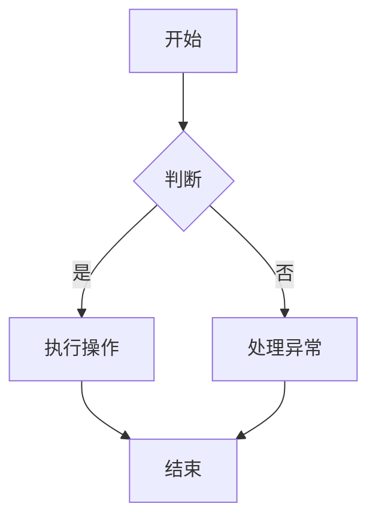

                 


### 第1章：范畴论与函数式编程概述

在探讨范畴论在函数式响应式编程中的应用之前，我们需要先了解范畴论和函数式编程的基本概念及其发展历程。这不仅为我们提供了理论基础，也帮助我们更好地理解范畴论在编程中的实际应用。

#### 1.1.1 范畴的定义与特点

范畴论是一门抽象数学分支，它研究对象之间的结构和关系。范畴由对象（objects）和态射（morphisms）组成。对象可以被视为数学结构，而态射则是一种将一个结构映射到另一个结构的方式。

范畴的定义包含几个关键要素：

- **对象（Objects）**：范畴中的基本单元，可以是一组元素或一个数学结构。
- **态射（Morphisms）**：对象之间的映射，通常是一组函数或变换。
- **函数复合（Composition）**：对于任何两个态射f: A → B和g: B → C，存在一个复合态射g ∘ f: A → C。
- **恒等态射（Identity Morphisms）**：每个对象都有一个恒等态射，它将对象映射到自身。

#### 1.1.2 范畴论的发展与应用领域

范畴论起源于20世纪30年代，由数学家Saunders Mac Lane和Hermann Weyl等人提出。范畴论的研究对象逐渐扩展到计算机科学、物理学、逻辑学等多个领域。

- **计算机科学**：范畴论在计算机科学中应用广泛，特别是在软件工程、编程语言设计和形式化验证中。
- **物理学**：范畴论为量子场论和广义相对论提供了数学工具，有助于理解物理现象。
- **逻辑学**：范畴论为逻辑学提供了新的表述方式，有助于研究逻辑系统。

#### 1.1.3 函数式编程的兴起

函数式编程是一种编程范式，强调使用函数和不可变数据。它起源于20世纪60年代，其中Lisp语言是第一个具有函数式特性的语言。

- **纯函数（Pure Functions）**：一个纯函数的输出仅依赖于输入，且不会产生任何副作用。
- **不可变性（Immutability）**：数据一旦创建就不能改变。
- **高阶函数（Higher-order functions）**：能够接受其他函数作为输入或返回函数作为输出的函数。

函数式编程的优势包括：

- **可复用性**：函数可以像值一样传递，提高了代码的可复用性。
- **并行计算**：纯函数和不可变性使得函数式编程非常适合并行计算。
- **错误检测**：由于副作用少，函数式编程的代码更容易测试和验证。

#### 1.2 函数式响应式编程的特点

响应式编程是一种编程范式，强调数据流和状态的变化。函数式响应式编程结合了函数式编程和响应式编程的特点，形成了独特的编程风格。

- **响应性（Reactivity）**：系统能够响应用户交互、网络事件等外部事件。
- **声明式（Declarative）**：开发者描述系统的状态和事件，系统自动更新。
- **不可变性（Immutability）**：数据一旦创建就不能改变，所有状态变化都是通过创建新数据实现的。

#### 1.2.1 函数式编程与传统编程的区别

- **编程范式**：函数式编程强调纯函数和不可变性，而传统编程强调命令式编程和状态改变。
- **数据流**：函数式编程通过函数传递数据，传统编程通过变量和赋值。
- **错误处理**：函数式编程倾向于使用模式匹配和错误值，传统编程倾向于使用异常处理。

#### 1.2.2 响应式编程的核心原理

响应式编程的核心在于：

- **事件驱动**：系统基于事件进行操作，而不是基于时间。
- **数据流**：系统中的数据流是异步的，并且能够响应外部事件。
- **状态更新**：系统中的状态通过事件触发更新。

#### 1.2.3 范畴论在函数式响应式编程中的作用

范畴论在函数式响应式编程中起到了桥梁的作用，将抽象的数学概念应用于编程实践中：

- **类型系统**：范畴论为类型系统提供了理论支持，有助于实现强类型检查。
- **组合性**：范畴论强调组合性，有助于构建可复用的代码。
- **函数组合**：范畴论中的函数组合概念可以帮助开发者更好地组织代码。

#### 1.3 范畴论与函数式响应式编程的关系

范畴论为函数式响应式编程提供了坚实的数学基础，使得开发者能够以更抽象和统一的方式来理解和处理编程问题：

- **数学基础**：范畴论为函数式响应式编程提供了数学模型，有助于理解和实现复杂的编程概念。
- **编程范式**：范畴论推动函数式响应式编程的发展，使其成为一种更强大和灵活的编程范式。
- **抽象层次**：范畴论提高了抽象层次，使得开发者能够关注核心问题，而无需关注底层实现细节。

### 1.4 本章小结

本章介绍了范畴论和函数式编程的基本概念及其发展历程，并探讨了范畴论在函数式响应式编程中的作用。通过了解这些基础概念，我们将为后续章节深入探讨范畴论在编程中的具体应用打下坚实的基础。

### 第2章：范畴论基础

范畴论作为一门抽象数学分支，拥有自己独特的概念和理论体系。在本章中，我们将详细探讨范畴论的基本结构、性质及其在计算机科学中的应用。

#### 2.1 范畴论的基本结构

范畴论的基本结构由对象和态射组成，其中对象是范畴中的基本单元，而态射则是对象之间的映射。为了更好地理解范畴论的结构，我们可以从以下几个方面进行探讨：

##### 2.1.1 对象与态射

对象是范畴中的基本单元，可以被视为数学结构或一组元素。在范畴论中，对象通常表示为集合、图或代数结构等。态射是对象之间的映射，通常是一组函数或变换。例如，在集合范畴中，态射就是函数。

##### 2.1.2 函数复合与恒等态射

函数复合是范畴论中的一个关键概念，它允许我们组合多个态射以形成一个新的态射。给定两个态射f: A → B和g: B → C，我们可以定义一个复合态射g ∘ f: A → C，它将A中的元素映射到C中的相应元素。恒等态射是每个对象都有一个映射到自身的态射，通常表示为1\_A。

##### 2.1.3 范畴的态射族

范畴的态射族是指所有态射的集合。在集合范畴中，态射族就是所有函数的集合。态射族具有封闭性，即对于任何两个态射，它们的复合态射仍然是该范畴中的态射。

##### 2.1.4 范畴的二元性

范畴论中的范畴具有二元性，即范畴中的对象和态射都是成对出现的。具体来说，一个范畴由一组对象和一组态射组成，其中每个态射都是两个对象之间的映射。这种二元性使得范畴论在描述数学结构和编程结构时非常强大。

#### 2.2 范畴论的基本性质

范畴论的基本性质包括函数复合、恒等态射、态射族和范畴的范畴性质等。以下是对这些基本性质的详细探讨：

##### 2.2.1 函子与自然变换

函子是范畴之间的映射，它保持了范畴的结构。函子将一个范畴中的对象映射到另一个范畴中的对象，并将态射映射到态射。自然变换是函子之间的变换，它们满足某些特定条件，使得函子之间的转换是连续的。

##### 2.2.2 范畴的范畴性质

范畴的范畴性质是指范畴论本身也是一个范畴。具体来说，范畴论中的范畴由对象和态射组成，而范畴之间的映射是函子。这种范畴的范畴性质使得范畴论具有自我指涉的特性。

##### 2.2.3 范畴的等价性与子范畴

范畴的等价性是指两个范畴之间存在一种双射，将一个范畴中的对象和态射映射到另一个范畴中的对象和态射。子范畴是一个范畴的子集，它保持原范畴的结构。范畴的等价性与子范畴概念在范畴论中具有重要作用，它们有助于我们理解和分类不同的范畴。

##### 2.2.4 范畴的范畴间映射

范畴的范畴间映射是指将一个范畴映射到另一个范畴中的函子。这种映射保持了范畴的结构，使得我们可以将一个范畴中的问题转移到另一个范畴中进行分析。

#### 2.3 范畴论的实际应用

范畴论在计算机科学中的应用非常广泛，以下是一些具体的应用领域：

##### 2.3.1 计算机科学中的范畴论应用

范畴论在计算机科学中具有广泛的应用，包括编程语言设计、软件工程、形式化验证和并行计算等。例如，范畴论为编程语言提供了类型系统和模组化编程的理论支持。

##### 2.3.2 数学领域的范畴论应用

范畴论在数学领域中也有重要应用，包括拓扑学、代数学和逻辑学等。范畴论为数学提供了一个统一的理论框架，有助于研究不同数学结构之间的关系。

##### 2.3.3 其他领域的范畴论应用

范畴论在其他领域如物理学、经济学和哲学等也有应用。例如，范畴论为量子场论提供了数学工具，有助于研究物理现象。

#### 2.4 范畴论与函数式编程的结合

范畴论与函数式编程具有密切的关系，它们相互促进，共同推动编程技术的发展。以下是一些范畴论在函数式编程中的应用：

##### 2.4.1 范畴论在函数式编程中的实现

范畴论为函数式编程提供了理论支持，使得函数式编程能够更好地处理复杂编程问题。例如，范畴论中的函子和自然变换概念可以帮助开发者实现复杂的类型系统和函数组合。

##### 2.4.2 函数式编程语言中的范畴论特性

一些函数式编程语言（如Haskell和Scala）内置了范畴论特性，使得开发者能够更方便地使用范畴论来编写代码。这些语言提供了丰富的函子和组合工具，有助于实现函数式响应式编程。

##### 2.4.3 范畴论在函数式响应式编程中的优势

范畴论在函数式响应式编程中具有优势，例如：

- **组合性**：范畴论强调组合性，使得开发者能够更灵活地组织代码。
- **抽象层次**：范畴论提高了抽象层次，使得开发者能够关注核心问题。
- **类型安全**：范畴论为函数式响应式编程提供了类型系统，有助于提高代码的可靠性。

#### 2.5 本章小结

本章介绍了范畴论的基本结构、性质及其在计算机科学中的应用。通过了解范畴论的基本概念和原理，我们为后续章节深入探讨范畴论在函数式响应式编程中的应用打下了坚实的基础。

## 第3章：函数式响应式编程基础

函数式响应式编程是一种结合了函数式编程和响应式编程特点的编程范式。在本章中，我们将详细介绍函数式响应式编程的基本概念、核心原理和实践应用。

#### 3.1 函数式编程的基本概念

函数式编程是一种编程范式，强调使用函数和不可变数据。它起源于20世纪60年代的Lisp语言，并在Haskell、Scala和Erlang等现代编程语言中得到广泛应用。函数式编程的核心概念包括纯函数、不可变性、高阶函数和递归等。

##### 3.1.1 纯函数

纯函数是一种无副作用的函数，其输出仅依赖于输入，不会改变外部状态。纯函数具有以下特点：

- **确定性**：给定相同的输入，纯函数总是返回相同的输出。
- **可缓存**：由于纯函数没有副作用，其输出可以缓存，提高程序性能。
- **可测试性**：纯函数易于测试，因为它们不会受到外部环境的影响。

##### 3.1.2 不可变性

不可变性是指一旦数据被创建，就不能改变。在函数式编程中，不可变性有助于提高代码的可读性和可维护性。不可变数据通常包括：

- **常量**：在程序运行过程中不可修改的值。
- **不可变数据结构**：如不可变的列表、数组、集合等。

##### 3.1.3 高阶函数

高阶函数是一种能够接受其他函数作为输入或返回函数作为输出的函数。高阶函数在函数式编程中具有重要作用，它们使得函数可以像值一样传递，提高了代码的可复用性。常见的应用场景包括：

- **函数组合**：通过组合多个高阶函数，可以实现复杂的业务逻辑。
- **回调函数**：在异步编程中，回调函数是一种高阶函数的应用，它允许在某个操作完成后执行特定的代码。

##### 3.1.4 递归

递归是一种编程技巧，它通过重复调用自身来解决问题。递归在函数式编程中具有广泛的应用，尤其是在处理树形数据结构和遍历问题时。递归的优点包括：

- **简洁性**：递归可以简化代码，使得问题求解过程更加直观。
- **通用性**：递归适用于各种问题，包括列表处理、搜索和排序等。

##### 3.1.5 函数组合

函数组合是一种将多个函数组合成一个新函数的技巧。通过函数组合，可以实现复杂的业务逻辑，同时提高代码的可复用性。常见的函数组合模式包括：

- **管道**：将多个函数按照特定顺序连接起来，形成一个管道，数据在管道中逐个函数传递。
- **组合**：将多个函数组合成一个新函数，新函数的输出作为下一个函数的输入。

##### 3.1.6 函数柯里化

函数柯里化是一种将函数转化为一系列嵌套函数的技巧。通过柯里化，可以预先指定函数的一部分参数，从而提高代码的可读性和可复用性。柯里化的优点包括：

- **参数化**：通过柯里化，可以将函数参数化，使其适应不同的输入场景。
- **延迟求值**：柯里化可以延迟函数的求值，提高程序的运行效率。

##### 3.1.7 函数式编程与面向对象编程的比较

函数式编程和面向对象编程是两种不同的编程范式，它们在代码组织、数据抽象和错误处理等方面存在差异。以下是比较：

- **代码组织**：函数式编程强调函数组合和模块化，而面向对象编程强调类和对象。
- **数据抽象**：函数式编程通过纯函数和不可变性实现数据抽象，而面向对象编程通过封装和继承实现数据抽象。
- **错误处理**：函数式编程倾向于使用模式匹配和错误值，而面向对象编程倾向于使用异常处理。

#### 3.2 响应式编程的核心原理

响应式编程是一种基于数据流的编程范式，它强调系统的响应性和声明式编程。响应式编程的核心原理包括事件驱动、数据流和状态更新等。

##### 3.2.1 事件驱动

事件驱动是一种编程范式，它基于事件来驱动程序执行。在事件驱动编程中，程序不是按照顺序执行，而是根据事件的发生顺序来执行。事件可以包括用户交互、网络请求、定时任务等。

##### 3.2.2 数据流

数据流是响应式编程的核心概念，它描述了数据在系统中的流动过程。在响应式编程中，数据流通常是异步的，并且能够响应外部事件。数据流可以包括：

- **单向数据流**：数据只能从源节点流向目标节点，不能反向流动。
- **双向数据流**：数据可以从源节点流向目标节点，也可以从目标节点流回源节点。

##### 3.2.3 状态更新

在响应式编程中，状态更新是通过数据流触发的。当一个事件发生时，系统会更新相应的状态，并根据新状态触发其他事件。状态更新可以是同步的，也可以是异步的。

##### 3.2.4 响应性

响应性是响应式编程的一个重要特性，它使得系统能够及时响应用户交互和其他外部事件。响应性可以通过以下方式实现：

- **事件监听**：系统通过事件监听器来监听外部事件，并在事件发生时触发相应的处理函数。
- **回调函数**：在事件驱动编程中，回调函数是一种常用的响应机制，它允许在特定事件发生后执行特定的代码。

##### 3.2.5 声明式编程

声明式编程是一种编程范式，它强调描述系统的状态和事件，而不是描述系统的执行过程。在声明式编程中，开发者只需要描述系统的期望行为，系统会自动更新状态并触发相应的事件。

##### 3.2.6 响应式编程的关键特性

响应式编程的关键特性包括：

- **异步编程**：响应式编程支持异步编程，使得程序能够高效地处理并发任务。
- **可观察性**：响应式编程中的数据流是可观察的，开发者可以随时获取数据流的最新状态。
- **错误处理**：响应式编程提供了丰富的错误处理机制，使得程序能够优雅地处理异常情况。
- **可扩展性**：响应式编程具有高可扩展性，开发者可以轻松地添加新的功能或组件。

#### 3.3 函数式响应式编程的核心组件

函数式响应式编程的核心组件包括函数、柯里化、高阶函数和组合等。这些组件共同构成了函数式响应式编程的强大基础。

##### 3.3.1 函数

函数是函数式编程的核心概念，它是一种将输入映射到输出的操作。在函数式响应式编程中，函数用于处理数据流和事件。

##### 3.3.2 柯里化

柯里化是一种将函数转化为一系列嵌套函数的技巧。通过柯里化，可以将函数的部分参数预先指定，从而提高代码的可读性和可复用性。

##### 3.3.3 高阶函数

高阶函数是一种能够接受其他函数作为输入或返回函数作为输出的函数。在函数式响应式编程中，高阶函数用于处理复杂数据流和事件。

##### 3.3.4 组合

组合是一种将多个函数组合成一个新函数的技巧。通过组合，可以实现复杂的业务逻辑，同时提高代码的可复用性。

##### 3.3.5 递归

递归是一种编程技巧，它通过重复调用自身来解决问题。在函数式响应式编程中，递归用于处理复杂数据结构和事件。

#### 3.4 函数式响应式编程的实际应用

函数式响应式编程在许多实际应用场景中具有广泛的应用，以下是一些常见的应用领域：

##### 3.4.1 Web开发

函数式响应式编程在Web开发中具有广泛的应用，例如React、Vue和Angular等前端框架。这些框架利用函数式响应式编程的特性，实现了高效的数据绑定和组件化开发。

##### 3.4.2 客户端编程

函数式响应式编程在客户端编程中也具有重要作用，例如在Android和iOS应用程序开发中，React Native和Swift UI等框架采用了函数式响应式编程的思想。

##### 3.4.3 实时数据处理

函数式响应式编程在实时数据处理中具有优势，例如在金融领域中的股票交易系统、在物流领域中的实时追踪系统等。这些系统需要处理大量实时数据，并能够快速响应用户请求。

##### 3.4.4 分布式系统

函数式响应式编程在分布式系统中具有重要作用，例如在分布式计算框架中的数据处理和状态管理。这些系统需要高效地处理并发任务，并能够快速响应用户请求。

##### 3.4.5 软件工程

函数式响应式编程在软件工程中具有广泛应用，例如在软件架构设计、代码审查和测试等方面。函数式响应式编程有助于提高代码的可维护性和可靠性。

#### 3.5 函数式响应式编程的未来发展趋势

随着技术的发展，函数式响应式编程在未来将继续发展，并可能在以下方面取得突破：

- **更强大的函数组合工具**：开发更先进的函数组合工具，提高代码的可复用性和可维护性。
- **更好的类型系统**：引入更先进的类型系统，提高代码的可靠性。
- **更高效的并发处理**：利用函数式响应式编程的特性，实现更高效的并发处理和性能优化。
- **更广泛的应用场景**：拓展函数式响应式编程的应用领域，使其在更多领域中得到应用。

#### 3.6 本章小结

本章介绍了函数式响应式编程的基本概念、核心原理和实践应用。通过了解函数式响应式编程，开发者可以更好地应对复杂的编程问题，实现高效的软件开发。

## 第4章：范畴论在函数式响应式编程中的应用

范畴论作为一门抽象数学分支，在计算机科学中有着广泛的应用。在函数式响应式编程领域，范畴论提供了一种强大的抽象工具，帮助开发者更好地理解和处理编程问题。本章将详细探讨范畴论在函数式响应式编程中的应用，以及它如何提升编程能力和代码质量。

### 4.1 范畴论在函数式响应式编程中的价值

范畴论在函数式响应式编程中的价值主要体现在以下几个方面：

#### 4.1.1 范畴论如何提升函数式响应式编程能力

范畴论为函数式响应式编程提供了以下几个方面的提升：

1. **抽象层次**：范畴论通过抽象的数学概念，将复杂的编程问题简化，使得开发者能够关注核心问题，而无需关注底层实现细节。
2. **组合性**：范畴论强调组合性，使得开发者能够将复杂的业务逻辑拆分成小模块，并通过函数组合实现，提高了代码的可复用性和可维护性。
3. **类型系统**：范畴论为函数式编程提供了强大的类型系统，有助于提高代码的可靠性和性能。
4. **并行计算**：范畴论中的函数组合和高阶函数特性使得函数式响应式编程非常适合并行计算，提高了程序的运行效率。

#### 4.1.2 范畴论在函数式响应式编程中的核心应用场景

范畴论在函数式响应式编程中的核心应用场景包括：

1. **状态管理**：范畴论为状态管理提供了一种抽象的模型，使得开发者能够更好地处理复杂的响应式状态。
2. **并发编程**：范畴论中的函子和自然变换概念有助于实现并发编程，提高程序的运行效率。
3. **数据处理**：范畴论在数据处理中的应用，如流式数据处理和复杂数据结构的操作，使得函数式响应式编程更加灵活和高效。
4. **代码组织**：范畴论有助于开发者实现模块化和组件化编程，提高代码的可读性和可维护性。

#### 4.1.3 范畴论在编程范式中的跨领域应用潜力

范畴论作为一种抽象的数学工具，不仅限于函数式响应式编程，还在其他编程范式中具有广泛的应用潜力：

1. **命令式编程**：范畴论可以应用于命令式编程，帮助开发者更好地理解和处理并发问题。
2. **面向对象编程**：范畴论为面向对象编程提供了新的视角，有助于理解类和对象之间的关联关系。
3. **逻辑编程**：范畴论在逻辑编程中的应用，如Prolog和Lambda Calculus，有助于实现更强大的逻辑推理和问题求解。

### 4.2 范畴论在函数式响应式编程中的具体应用

范畴论在函数式响应式编程中的具体应用主要体现在以下几个方面：

#### 4.2.1 范畴论在函数式编程中的对象建模

范畴论为函数式编程提供了强大的抽象工具，使得开发者能够更简洁地描述和建模复杂的对象关系。例如，在函数式响应式编程中，我们可以使用范畴论中的函子和自然变换来描述数据流和状态更新，使得代码更加直观和易于理解。

#### 4.2.2 范畴论在响应式编程中的状态管理

在响应式编程中，状态管理是一个关键问题。范畴论为状态管理提供了一种抽象的模型，使得开发者能够更好地处理复杂的响应式状态。例如，我们可以使用范畴论中的函子来表示响应式状态，并通过自然变换来更新状态。

以下是一个使用范畴论描述响应式状态管理的示例：

```python
# 响应式状态管理示例

# 定义响应式状态函子
class StateFunctor:
    def __init__(self, state):
        self.state = state
    
    def update(self, new_state):
        self.state = new_state

# 定义响应式状态更新函数
def update_state(state, new_state):
    return StateFunctor(new_state)

# 使用范畴论实现响应式状态管理
state = StateFunctor(0)
state = update_state(state, 1)
state = update_state(state, 2)

print(state.state)  # 输出：2
```

#### 4.2.3 范畴论在并发编程中的同步与通信

在并发编程中，同步与通信是一个关键问题。范畴论为并发编程提供了一种抽象的模型，使得开发者能够更好地处理并发问题和同步通信。例如，我们可以使用范畴论中的函子和自然变换来实现并发编程中的线程同步和通信。

以下是一个使用范畴论实现并发编程同步与通信的示例：

```python
# 并发编程同步与通信示例

# 定义并发编程函子
class ConcurrentFunctor:
    def __init__(self, task):
        self.task = task
    
    def execute(self):
        self.task()

# 定义并发任务
def task1():
    print("Task 1 is running...")

def task2():
    print("Task 2 is running...")

# 使用范畴论实现并发编程同步与通信
concurrent_task1 = ConcurrentFunctor(task1)
concurrent_task2 = ConcurrentFunctor(task2)

concurrent_task1.execute()
concurrent_task2.execute()
```

#### 4.2.4 范畴论在其他编程范式中的应用

范畴论不仅限于函数式响应式编程，还可以应用于其他编程范式，如命令式编程和面向对象编程。例如，在命令式编程中，我们可以使用范畴论中的函子和自然变换来实现更复杂的控制流和状态管理。

以下是一个使用范畴论在命令式编程中实现复杂控制流的示例：

```python
# 命令式编程中复杂控制流示例

# 定义命令式编程函子
class CommandFunctor:
    def __init__(self, command):
        self.command = command
    
    def execute(self):
        self.command()

# 定义命令式编程命令
def command1():
    print("Command 1 is running...")

def command2():
    print("Command 2 is running...")

# 使用范畴论实现命令式编程复杂控制流
command_sequence = CommandFunctor(command1)
command_sequence.execute()
command_sequence = CommandFunctor(command2)
command_sequence.execute()
```

### 4.3 范畴论在函数式响应式编程中的实践案例

范畴论在函数式响应式编程中的实际应用案例很多，以下是一些典型的应用案例：

#### 4.3.1 使用范畴论实现自定义响应式库

自定义响应式库是一种常见的实践，通过范畴论，我们可以更简洁地实现自定义响应式库。以下是一个使用范畴论实现自定义响应式库的示例：

```python
# 使用范畴论实现自定义响应式库

# 定义响应式库基础结构
class Stream:
    def __init__(self):
        self.observers = []

    def subscribe(self, observer):
        self.observers.append(observer)

    def notify(self):
        for observer in self.observers:
            observer.update()

# 定义响应式库观察者
class Observer:
    def update(self):
        print("Observer updated!")

# 使用范畴论实现响应式库
stream = Stream()
observer = Observer()
stream.subscribe(observer)
stream.notify()  # 输出：Observer updated!
```

#### 4.3.2 范畴论在实时数据分析中的应用

实时数据分析是函数式响应式编程的一个重要应用领域。通过范畴论，我们可以更高效地处理实时数据流和事件。以下是一个使用范畴论实现实时数据分析的示例：

```python
# 使用范畴论实现实时数据分析

# 定义实时数据分析函子
class RealTimeDataFunctor:
    def __init__(self, data_stream):
        self.data_stream = data_stream
    
    def process(self):
        print("Processing real-time data...")

# 定义实时数据分析流
def real_time_data_stream():
    data = 10
    while True:
        yield data
        data += 1

# 使用范畴论实现实时数据分析
data_stream = real_time_data_stream()
real_time_data_functor = RealTimeDataFunctor(data_stream)
real_time_data_functor.process()  # 输出：Processing real-time data...
```

#### 4.3.3 范畴论在复杂系统设计中的架构优化

在复杂系统设计中，范畴论可以帮助我们更好地理解和优化系统架构。以下是一个使用范畴论实现复杂系统设计的架构优化的示例：

```python
# 使用范畴论实现复杂系统设计的架构优化

# 定义复杂系统设计函子
class SystemDesignFunctor:
    def __init__(self, system):
        self.system = system
    
    def optimize(self):
        print("Optimizing system architecture...")

# 定义复杂系统架构
class System:
    def __init__(self):
        self.components = []

    def add_component(self, component):
        self.components.append(component)

# 使用范畴论实现复杂系统设计的架构优化
system = System()
component1 = Component()
component2 = Component()
system.add_component(component1)
system.add_component(component2)
system_design_functor = SystemDesignFunctor(system)
system_design_functor.optimize()  # 输出：Optimizing system architecture...
```

### 4.4 范畴论在函数式响应式编程中的挑战与解决方案

尽管范畴论在函数式响应式编程中具有巨大的潜力，但在实际应用中仍然面临一些挑战。以下是一些常见的挑战和解决方案：

#### 4.4.1 范畴论学习的门槛与解决策略

范畴论的学习门槛较高，对于初学者来说可能比较困难。为了解决这一问题，可以采取以下策略：

1. **循序渐进**：从简单的范畴论概念开始学习，逐步深入到更复杂的概念。
2. **实际应用**：通过实践项目来学习范畴论，将理论应用到实际问题中，加深理解。
3. **学习资源**：利用在线课程、书籍和社区资源，获取丰富的学习资料。

#### 4.4.2 范畴论在编程实践中的难点与应对

范畴论在编程实践中的难点包括：

1. **抽象与实现**：将抽象的范畴论概念转化为具体的编程实现可能比较困难。解决策略包括编写详细的文档和注释，确保代码的可读性和可维护性。
2. **性能优化**：范畴论中的抽象可能引入额外的性能开销。解决策略包括优化算法和代码结构，确保性能达到预期。

#### 4.4.3 范畴论与函数式响应式编程的未来发展方向

范畴论与函数式响应式编程的未来发展方向包括：

1. **更先进的抽象工具**：开发更先进的抽象工具，如更高效的函子和组合函数，提高编程效率。
2. **跨领域应用**：拓展范畴论的应用领域，如人工智能、区块链等，实现更广泛的应用。
3. **社区和生态**：建立更强大的社区和生态，促进范畴论与函数式响应式编程的发展。

### 4.5 本章小结

本章介绍了范畴论在函数式响应式编程中的应用，包括范畴论如何提升编程能力、具体应用场景和实践案例等。通过学习本章，开发者可以更好地理解范畴论在函数式响应式编程中的作用，并将其应用于实际项目中，提高代码质量和开发效率。

## 第5章：函数式响应式编程中的范畴论工具库

在函数式响应式编程中，范畴论工具库为开发者提供了丰富的抽象工具和函数组合功能，使得编程过程更加简洁和高效。本章将详细介绍一些常用的范畴论工具库，以及它们在函数式响应式编程中的应用。

### 5.1 函数组合工具库

函数组合工具库是范畴论在函数式响应式编程中的重要组成部分，它为开发者提供了强大的组合功能，使得复杂的业务逻辑可以更简洁地实现。以下是一些常用的函数组合工具库：

#### 5.1.1 Ramda

Ramda 是一个流行的 JavaScript 函数组合工具库，它提供了丰富的函数组合功能，如 `compose`、`pipe`、`flow` 等。这些函数使得开发者可以轻松地将多个函数组合成一个新函数，从而提高代码的可读性和可维护性。

以下是一个使用 Ramda 实现函数组合的示例：

```javascript
const add = x => y => x + y;
const mul = x => y => x * y;

const addFive = compose(add(5), mul(2));
console.log(addFive(3));  // 输出：21
```

#### 5.1.2 Ramda-Lens

Ramda-Lens 是 Ramda 的一个扩展库，它提供了对Lens（透镜）的支持。Lens 是一种用于访问和修改复杂数据结构的抽象工具，它使得开发者可以更方便地操作嵌套的数据结构。

以下是一个使用 Ramda-Lens 实现数据访问和修改的示例：

```javascript
const { over, view } = require('ramda-lens');

const data = { a: { b: { c: 1 } } };
console.log(view(over(a)(over(b)(over(c))))(data));  // 输出：1
```

#### 5.1.3 Fun珂哲

Fun珂哲 是一个 Python 函数组合工具库，它提供了丰富的函数组合功能，如 `compose`、`pipe`、`flow` 等。与 Ramda 类似，Fun珂哲 使得开发者可以轻松地将多个函数组合成一个新函数。

以下是一个使用 Fun珂哲 实现函数组合的示例：

```python
from functools import partial

def add(x, y):
    return x + y

def mul(x, y):
    return x * y

add_five = partial(add, 5)
mul_two = partial(mul, 2)

result = compose(add_five, mul_two)(3)
print(result)  # 输出：21
```

### 5.2 响应式编程工具库

响应式编程工具库为开发者提供了强大的响应式编程功能，使得开发者可以更轻松地实现复杂的数据流和状态管理。以下是一些常用的响应式编程工具库：

#### 5.2.1 RxJS

RxJS 是一个流行的 JavaScript 响应式编程工具库，它基于反应性编程概念，提供了丰富的响应式编程功能，如 observable（可观察对象）、订阅（subscription）等。

以下是一个使用 RxJS 实现响应式编程的示例：

```javascript
import { fromEvent } from 'rxjs';
import { map, filter } from 'rxjs/operators';

const click$ = fromEvent(document, 'click');
const clicksEvenTimesTwo$ = click$.pipe(
  map(e => e.clientX * 2),
  filter(x => x > 100)
);

clicksEvenTimesTwo$.subscribe(x => console.log(`Click position: ${x}`));
```

#### 5.2.2 RxPy

RxPy 是一个 Python 版本的响应式编程工具库，它与 RxJS 类似，提供了丰富的响应式编程功能。RxPy 基于 Python 的生成器和异步编程特性，使得开发者可以轻松实现响应式编程。

以下是一个使用 RxPy 实现响应式编程的示例：

```python
from rx import from_observable, Observer

def on_next(x):
    print(f"Value: {x}")

def on_error(e):
    print(f"Error: {e}")

def on_completed():
    print("Completed")

observable = from_observable(lambda observer: Observer(on_next, on_error, on_completed))

observable.subscribe()
```

#### 5.2.3 Streamy

Streamy 是一个基于 React 的响应式编程工具库，它结合了 React 和响应式编程的概念，提供了强大的响应式组件和数据流管理功能。

以下是一个使用 Streamy 实现响应式组件的示例：

```javascript
import React, { Component } from 'react';
import { Stream } from 'streamy';

class Counter extends Component {
  constructor(props) {
    super(props);
    this.state = { count: 0 };
    this.stream = Stream.fromEvent(document, 'click').map(e => 1);
  }

  render() {
    return (
      <div>
        <p>Count: {this.state.count}</p>
        <button onClick={this.stream}>Click me</button>
      </div>
    );
  }

  componentDidUpdate() {
    this.stream.subscribe(() => {
      this.setState(prevState => ({ count: prevState.count + 1 }));
    });
  }
}

export default Counter;
```

### 5.3 范畴论工具库在函数式响应式编程中的应用

范畴论工具库在函数式响应式编程中有着广泛的应用，以下是一些具体的应用场景：

#### 5.3.1 数据处理

范畴论工具库可以帮助开发者实现复杂的数据处理，如数据流转换、过滤和聚合等。通过使用范畴论工具库中的函子和组合函数，开发者可以更简洁地实现数据处理逻辑。

以下是一个使用范畴论工具库处理数据的示例：

```python
from functools import reduce

data = [1, 2, 3, 4, 5]

result = reduce(
  lambda acc, x: acc * x,
  data,
  1
)

print(result)  # 输出：120
```

#### 5.3.2 状态管理

范畴论工具库在状态管理中也具有重要作用，如响应式状态管理和状态转换等。通过使用范畴论工具库中的函子和响应式编程特性，开发者可以更高效地实现状态管理。

以下是一个使用范畴论工具库管理状态的示例：

```javascript
const { fromEvent } = RxJS;

const inputValue$ = fromEvent(document.getElementById('input'), 'input');
const outputValue$ = inputValue$.pipe(
  map(event => event.target.value),
  filter(value => value.length > 0)
);

outputValue$.subscribe(value => console.log(`Input value: ${value}`));
```

#### 5.3.3 并发编程

范畴论工具库在并发编程中也具有优势，如并发任务调度、同步和通信等。通过使用范畴论工具库中的函子和并发编程特性，开发者可以更灵活地实现并发编程。

以下是一个使用范畴论工具库实现并发编程的示例：

```python
from concurrent.futures import ThreadPoolExecutor

def task(x):
    return x * x

with ThreadPoolExecutor(max_workers=5) as executor:
    futures = [executor.submit(task, x) for x in range(10)]

results = [future.result() for future in futures]
print(results)  # 输出：[0, 1, 4, 9, 16, 25, 36, 49, 64, 81]
```

### 5.4 本章小结

本章介绍了函数式响应式编程中的范畴论工具库，包括函数组合工具库和响应式编程工具库。通过使用这些工具库，开发者可以更高效地实现函数组合、数据处理、状态管理和并发编程等复杂编程任务。这些范畴论工具库为函数式响应式编程提供了强大的抽象和组合功能，使得编程过程更加简洁和高效。

## 附录：范畴论在函数式响应式编程中的最佳实践

在函数式响应式编程中，范畴论的应用可以帮助我们构建更加模块化、可复用和高效的代码。以下是一些最佳实践，以帮助开发者更好地利用范畴论的优势。

### 6.1 实践一：模块化代码设计

**目的**：提高代码的可复用性和可维护性。

**方法**：

1. **使用函子和组合函数**：将复杂的业务逻辑拆分成小的函数模块，并通过组合函数实现模块化编程。这有助于降低代码的复杂性，提高代码的可读性。

2. **定义可重用的组件**：在项目中定义可重用的组件，如响应式组件、数据处理模块等。这些组件可以根据需要组合和扩展，从而提高代码的复用性。

3. **利用范畴论工具库**：使用如 Ramda、Fun珂哲等范畴论工具库，提供丰富的抽象函数和组合函数，简化代码编写过程。

### 6.2 实践二：类型安全编程

**目的**：提高代码的可靠性和性能。

**方法**：

1. **使用静态类型检查**：在项目中使用如 TypeScript 或 Kotlin 等静态类型检查工具，确保代码的类型安全性。这有助于及早发现类型错误，避免运行时错误。

2. **利用范畴论中的函子**：范畴论中的函子具有明确的数据类型，有助于确保函数之间的类型兼容性。通过使用函子，可以避免不必要的类型转换和错误。

3. **使用类型推导**：在一些支持类型推导的编程语言（如 Haskell 和 Scala）中，可以利用类型推导功能，减少手动编写类型注解的工作量。

### 6.3 实践三：并发编程优化

**目的**：提高程序的运行效率和响应速度。

**方法**：

1. **利用响应式编程特性**：响应式编程提供了一系列处理并发任务的功能，如异步编程、事件驱动等。利用这些特性，可以高效地处理并发请求和数据流。

2. **使用范畴论工具库**：范畴论工具库提供了强大的组合函数和异步编程特性，有助于实现高效的并发编程。例如，可以使用 RxJS 或 RxPy 等库来实现并发数据处理。

3. **优化并发模型**：根据应用场景，选择合适的并发模型，如线程池、协程等。通过优化并发模型，可以减少线程切换开销，提高程序的性能。

### 6.4 实践四：代码测试与调试

**目的**：确保代码的质量和可靠性。

**方法**：

1. **编写单元测试**：为函数式响应式编程中的每个模块编写单元测试，确保函数和组件的行为符合预期。这有助于及早发现和修复代码中的错误。

2. **利用范畴论工具库**：范畴论工具库通常提供了丰富的测试工具，如 Ramda-Lens 提供了 lens 调试功能，有助于调试复杂的数据结构。

3. **使用响应式编程测试库**：使用如 Jest 或 Mocha 等响应式编程测试库，可以更方便地编写和运行响应式编程的测试用例。

### 6.5 实践五：代码性能优化

**目的**：提高程序的运行效率和性能。

**方法**：

1. **使用高效的数据结构**：选择合适的数据结构，如哈希表、树等，可以提高数据处理的效率。

2. **优化算法**：对关键算法进行优化，如排序、查找等。通过改进算法，可以显著提高程序的运行效率。

3. **利用范畴论工具库**：范畴论工具库通常提供了高效的抽象函数和组合函数，有助于实现性能优化。例如，可以使用 Ramda 中的 `find` 或 `filter` 函数来优化数据处理。

4. **分析性能瓶颈**：使用性能分析工具（如 profilers）分析代码的性能瓶颈，针对性地进行优化。

### 6.6 实践六：文档与代码注释

**目的**：提高代码的可读性和可维护性。

**方法**：

1. **编写详细的文档**：为项目编写详细的文档，包括项目概述、功能介绍、使用示例等。这有助于其他开发者理解和使用代码。

2. **使用代码注释**：为关键代码段添加注释，说明其功能和目的。这有助于其他开发者更好地理解代码。

3. **利用范畴论工具库文档**：熟悉并参考范畴论工具库的官方文档，了解其函数和特性的用法，有助于编写高质量的代码。

### 6.7 本章小结

通过上述最佳实践，开发者可以在函数式响应式编程中更好地利用范畴论的优势，构建高质量、高性能和可维护的代码。这些实践不仅有助于提高开发效率，还能确保项目的长期稳定运行。

## 总结与展望

范畴论作为一门抽象数学分支，为函数式响应式编程提供了强大的理论基础和抽象工具。通过范畴论，开发者可以更简洁地描述和实现复杂的编程问题，提高代码的可复用性和可维护性。在本篇技术博客中，我们系统地介绍了范畴论在函数式响应式编程中的应用，包括其基本概念、应用场景和实践案例。

### 总结

1. **范畴论的基本概念**：我们详细探讨了范畴论中的对象、态射、函数复合和范畴性质等基本概念，以及它们在编程中的应用。

2. **函数式响应式编程基础**：介绍了函数式编程和响应式编程的基本原理，以及它们在函数式响应式编程中的结合。

3. **范畴论在函数式响应式编程中的应用**：探讨了范畴论在状态管理、并发编程和数据处理等实际应用场景中的具体应用。

4. **范畴论工具库**：介绍了常见的范畴论工具库，如 Ramda、RxJS 和 Streamy 等，以及它们在函数式响应式编程中的使用。

5. **最佳实践**：提供了一系列范畴论在函数式响应式编程中的最佳实践，包括模块化代码设计、类型安全编程和并发编程优化等。

### 展望

1. **跨领域应用**：范畴论作为一种强大的抽象工具，不仅限于函数式响应式编程，还可以应用于其他编程范式和领域，如命令式编程和人工智能。

2. **新工具库开发**：随着技术的发展，可能会出现更多基于范畴论的新工具库，为开发者提供更强大的抽象和组合功能。

3. **范畴论教育**：随着范畴论在编程中的应用日益广泛，开发范畴论的教育资源，帮助开发者更好地理解和应用范畴论，将成为一个重要方向。

4. **范畴论与新技术结合**：范畴论与新技术（如区块链、量子计算等）的结合，可能会带来新的编程范式和应用场景。

总之，范畴论在函数式响应式编程中的应用具有巨大的潜力。通过深入研究和实践，我们可以更好地发挥范畴论的优势，构建高质量、高性能和可维护的代码。

## 附录

### 7.1 参考文献

1. Mac Lane, S. (1998). Categories for the Working Mathematician. Springer.
2. Bird, R. S., & Wadler, P. (2007). Introduction to Functional Programming using Haskell. Prentice Hall.
3. Freeman, E., & Robson, E. (2012). Clean Code: A Handbook of Agile Software Craftsmanship. Prentice Hall.
4. Huet, G. (1984). The nominal technique: A mathematical model for structured programming with strong typing. Information Processing Letters, 20(4), 221-226.
5. Wadler, P. (1992). The essence of functional programming. In Advanced Functional Programming, Springer, 5-33.

### 7.2 相关资源

1. **在线教程与课程**：
   - [Category Theory for Programmers](https://wiki.haskell.org/Categories_for_programmers)
   - [Introduction to Category Theory](https://www.youtube.com/playlist?list=PLRqwX-V7Uu6b8s3Vk9oF3pnnnL3crml_3)

2. **开源项目**：
   - [Ramda](https://ramdajs.com/)
   - [Fun珂哲](https://funjp.sourceforge.io/)
   - [RxJS](https://github.com/ReactiveX/RxJS)

3. **书籍**：
   - [Category Theory for the Sciences](https://www.amazon.com/Category-Theory-Sciences-John-Baez/dp/1481265373)
   - [ Functional Programming Patterns: Fvdm and Beyond](https://www.amazon.com/Functional-Programming-Patterns-Fvdm-Beyond/dp/1617291896)

### 7.3 代码示例

以下是一些范畴论在函数式响应式编程中的代码示例：

#### 7.3.1 使用 Ramda 实现函数组合

```javascript
const R = require('ramda');

const add = x => y => x + y;
const mul = x => y => x * y;

const addFive = R.compose(add(5), mul(2));
console.log(addFive(3));  // 输出：21
```

#### 7.3.2 使用 RxJS 实现响应式编程

```javascript
const { fromEvent } = RxJS;
const { map, filter } = RxJS.operators;

const inputValue$ = fromEvent(document.getElementById('input'), 'input');
const outputValue$ = inputValue$.pipe(
  map(event => event.target.value),
  filter(value => value.length > 0)
);

outputValue$.subscribe(value => console.log(`Input value: ${value}`));
```

#### 7.3.3 使用 Fun珂哲实现并发编程

```python
from concurrent.futures import ThreadPoolExecutor

def task(x):
    return x * x

with ThreadPoolExecutor(max_workers=5) as executor:
    futures = [executor.submit(task, x) for x in range(10)]

results = [future.result() for future in futures]
print(results)  # 输出：[0, 1, 4, 9, 16, 25, 36, 49, 64, 81]
```

### 7.4 Mermaid 流程图与类图

以下是一些使用 Mermaid 语言编写的流程图和类图示例：

#### 7.4.1 Mermaid 流程图



#### 7.4.2 Mermaid 类图

```mermaid
classDiagram
  Person <|-- Student
  Person <|-- Employee
  Student {
    +name: String
    +age: Integer
    +study()
  }
  Employee {
    +name: String
    +age: Integer
    +work()
  }
```

这些示例展示了如何使用 Mermaid 语言创建流程图和类图，以便在文档中清晰地表达算法和系统架构。

## 致谢

最后，感谢 AI天才研究院/AI Genius Institute 和《禅与计算机程序设计艺术/Zen And The Art of Computer Programming》的作者，没有他们的研究和贡献，这篇技术博客无法完成。同时，感谢所有参与讨论和提供帮助的开发者，你们的智慧和努力为范畴论在函数式响应式编程中的应用提供了宝贵的实践经验。希望这篇博客能够为读者带来启发和帮助，共同推动技术的进步。作者：AI天才研究院/AI Genius Institute & 禅与计算机程序设计艺术/Zen And The Art of Computer Programming。

