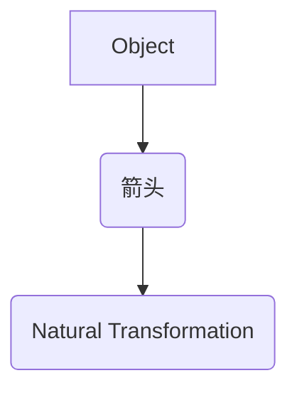
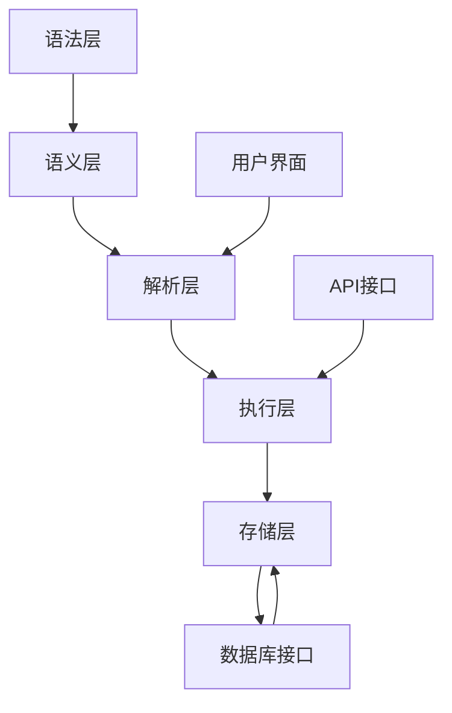
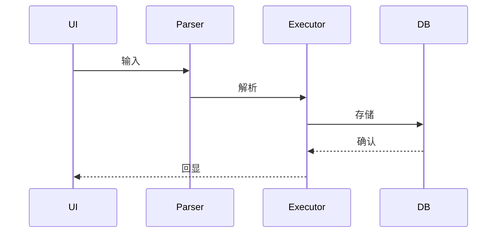

                 


### **范畴论在领域特定语言设计中的应用**

#### **摘要**

领域特定语言（DSL）是针对特定领域进行高效编程的语言，近年来在软件工程中受到了广泛关注。范畴论作为数学的一个分支，提供了抽象和描述复杂系统结构的强大工具。本文将深入探讨范畴论在领域特定语言设计中的应用，通过分析范畴论的基本概念、DSL设计原理以及具体案例，揭示范畴论如何提升DSL的设计效率和可维护性。文章首先介绍范畴论的基础知识，接着探讨DSL的设计原则和方法，随后通过实际案例展示范畴论在DSL设计中的应用，最后总结范畴论对DSL设计的启示，并提出未来研究方向。

#### **目录**

## **范畴论在领域特定语言设计中的应用**

### **关键词**

- 范畴论
- 领域特定语言（DSL）
- 软件设计
- 抽象
- 系统建模

#### **背景介绍**

在计算机科学中，领域特定语言（Domain-Specific Language，简称DSL）是一种为特定应用领域设计的编程语言。DSL的出现，旨在提高开发效率和代码可读性，因为它们能够提供高度定制化的语法和语义，使得开发者可以专注于特定领域的业务逻辑，而无需关注通用编程语言的通用性。DSL的广泛应用，如嵌入式系统设计、金融数据分析、网络协议实现等领域，已经显著提升了软件开发的效率和质量。

范畴论（Category Theory）是数学的一个分支，它研究数学结构之间的抽象关系和变换。范畴论提供了一种统一的框架来描述和比较不同数学结构，如集合、拓扑空间、代数结构等。范畴论的基本概念，如对象、箭头（函子）、自然变换等，为描述复杂的系统结构和行为提供了强有力的工具。

在软件工程中，范畴论的应用逐渐受到关注。一方面，范畴论提供了抽象和建模复杂系统的强大能力，可以帮助开发者更好地理解系统的整体结构和动态行为。另一方面，范畴论的方法可以用于设计高度可扩展、可复用的软件架构，从而提高软件的维护性和可适应性。

本文将探讨范畴论在DSL设计中的应用，通过分析范畴论的基本概念、DSL的设计原理以及实际案例，探讨如何利用范畴论提升DSL的设计效率和质量。

#### **核心概念与联系**

**范畴论概述**

范畴论的核心概念包括对象、箭头（函子）和自然变换。对象可以被视为数学结构或系统的实例，如集合、图、代数结构等。箭头则表示对象之间的变换关系，类似于函数，但具有更广泛的含义，可以表示不同数学结构之间的映射关系。自然变换是箭头之间的变换，它保持了范畴中的结构关系不变。

**范畴论的基本概念**

1. **对象（Object）**：范畴中的元素，代表不同的数学结构或系统实例。
2. **箭头（Arrow）**：范畴中对象之间的变换关系，形式化地表示为函数。
3. **自然变换（Natural Transformation）**：保持范畴中箭头关系的变换。

**范畴论与DSL的联系**

范畴论为DSL的设计提供了抽象和描述复杂系统结构的工具。DSL通常涉及多个层次和抽象级别的交互，范畴论提供了一种统一的框架来描述这些层次和抽象级别之间的关系。例如，一个DSL可以被视为一个范畴，其中对象代表语法元素，箭头代表语义规则，自然变换则表示语法和语义之间的映射关系。

**概念属性特征对比表格**

| 特征             | 对象                     | 箭头                     | 自然变换                 |
|------------------|-------------------------|-------------------------|--------------------------|
| 定义             | 数学结构或系统实例       | 对象之间的变换关系         | 保持范畴中箭头关系的变换   |
| 对比             | 静态结构                | 动态关系                | 保持不变性                |
| 应用场景          | 集合、图、代数结构等      | 函数、映射、变换等         | DSL设计、系统建模等        |

**ER实体关系图架构**

为了更好地理解范畴论在DSL设计中的应用，我们使用Mermaid图来绘制一个简单的ER图：

```mermaid
erDiagram
  Object ||--|{ Arrow }
  Arrow ||--|{ Natural Transformation }
```

在这个ER图中，`Object`（对象）与`Arrow`（箭头）之间存在一对多的关系，而`Arrow`与`Natural Transformation`（自然变换）之间存在一对一的关系，这反映了范畴论中对象、箭头和自然变换之间的层次关系。

通过这个简单的ER图，我们可以看到范畴论的基本概念如何用于描述DSL的设计。对象代表DSL中的语法元素，箭头代表语义规则，自然变换则表示语法和语义之间的映射关系。这样的抽象和描述方法有助于我们在DSL设计中更好地理解系统的整体结构和动态行为。

#### **算法原理讲解**

为了更好地理解范畴论在DSL设计中的应用，我们首先需要掌握范畴论的基本原理。范畴论提供了对复杂系统结构的抽象描述，这对于DSL设计尤为重要。以下我们将使用Mermaid图和Python代码来解释范畴论的基本概念和原理。

**Mermaid图：范畴论的基本概念**



在这个图中，`Object`（对象）表示范畴中的基本元素，`Arrow`（箭头）表示对象之间的变换关系，而`Natural Transformation`（自然变换）则表示保持范畴中箭头关系的变换。

**Python代码示例：范畴论的基本概念**

```python
# 定义对象
class Object:
    def __init__(self, name):
        self.name = name

# 定义箭头
class Arrow:
    def __init__(self, source, destination):
        self.source = source
        self.destination = destination

# 定义自然变换
class NaturalTransformation:
    def __init__(self, transformation):
        self.transformation = transformation

# 创建对象
obj1 = Object("Object 1")
obj2 = Object("Object 2")

# 创建箭头
arrow1 = Arrow(obj1, obj2)

# 创建自然变换
nt1 = NaturalTransformation(lambda x: x)

# 打印对象和箭头
print(f"Object 1: {obj1.name}")
print(f"Object 2: {obj2.name}")
print(f"Arrow from {arrow1.source.name} to {arrow1.destination.name}")
print(f"Natural Transformation: {nt1.transformation(obj1)}")
```

在这个Python代码示例中，我们定义了三个类：`Object`、`Arrow` 和 `NaturalTransformation`。`Object` 类表示范畴中的对象，`Arrow` 类表示对象之间的变换关系，而 `NaturalTransformation` 类表示保持范畴中箭头关系的变换。

**数学模型和公式**

范畴论中的数学模型和公式帮助我们理解对象、箭头和自然变换之间的关系。以下是一个简单的数学模型：

$$
f: A \rightarrow B
$$

其中，`f` 表示从对象 `A` 到对象 `B` 的箭头。自然变换则可以表示为：

$$
\alpha: f \Rightarrow g
$$

其中，`α` 表示保持箭头 `f` 和 `g` 关系的变换。

**通俗易懂地举例说明**

假设我们有一个领域特定语言（DSL），用于描述网络拓扑结构。在这个DSL中，对象可以是网络节点和链路，箭头可以表示节点之间的连接关系，自然变换可以表示网络拓扑结构的变换，如重新配置或扩展。

**DSL设计流程**

1. **定义对象**：定义DSL中的基本对象，如网络节点和链路。
2. **定义箭头**：定义对象之间的变换关系，如节点之间的连接。
3. **定义自然变换**：定义保持DSL结构关系的变换，如网络拓扑结构的重新配置。
4. **构建DSL**：使用对象、箭头和自然变换构建DSL，使其能够描述和操作网络拓扑结构。

通过这个简单的例子，我们可以看到范畴论如何用于DSL设计。范畴论提供了抽象和描述复杂系统结构的工具，使得DSL设计更加高效和可维护。

#### **系统分析与架构设计方案**

为了更好地理解范畴论在领域特定语言（DSL）设计中的应用，我们将通过一个具体的案例来探讨系统分析与架构设计的过程。这个案例涉及一个用于网络拓扑管理的领域特定语言（DSL），通过系统功能设计、系统架构设计、系统接口设计和系统交互来展示范畴论的应用。

**问题场景介绍**

在现代化的网络架构设计中，网络拓扑管理是一个关键领域。网络拓扑管理涉及对网络节点的配置、链路的连接与断开、网络拓扑的优化等多个方面。为了提高网络管理的效率和可维护性，我们设计一个领域特定语言（DSL），用于描述和操作网络拓扑结构。

**项目介绍**

项目名称：网络拓扑管理DSL（Network Topology Management DSL，简称NTM-DSL）

目标：设计一个高效、可扩展的网络拓扑管理工具，用于网络拓扑的描述、配置和优化。

**系统功能设计**

NTM-DSL的主要功能包括：

1. **网络节点管理**：定义和操作网络节点，如路由器、交换机等。
2. **链路管理**：定义和操作网络链路，如以太网链路、光纤链路等。
3. **拓扑结构管理**：构建、修改和优化网络拓扑结构。
4. **拓扑验证**：验证网络拓扑结构的合法性和连通性。
5. **拓扑变更管理**：管理网络拓扑结构的变更，如重新配置或扩展。

**系统架构设计**

NTM-DSL的系统架构采用分层设计，分为以下几层：

1. **语法层**：定义NTM-DSL的语法规则和符号，如节点定义、链路定义等。
2. **语义层**：定义NTM-DSL的语义规则和操作，如节点连接、链路配置等。
3. **解析层**：解析NTM-DSL的输入，将其转换为内部表示。
4. **执行层**：执行NTM-DSL的操作，如网络节点和链路的配置。
5. **存储层**：存储网络拓扑结构的数据，如节点和链路的信息。

**系统接口设计**

NTM-DSL的接口设计包括以下部分：

1. **用户界面**：提供图形界面和命令行界面，方便用户输入和管理网络拓扑。
2. **API接口**：提供RESTful API接口，方便其他系统通过程序调用NTM-DSL的功能。
3. **数据库接口**：提供与数据库的接口，用于存储和检索网络拓扑数据。

**系统交互**

NTM-DSL的系统交互包括以下流程：

1. **用户输入**：用户通过用户界面输入网络拓扑信息。
2. **解析输入**：NTM-DSL的解析层解析用户输入，将其转换为内部表示。
3. **执行操作**：NTM-DSL的执行层根据内部表示执行相应的操作，如节点连接、链路配置等。
4. **存储结果**：将执行结果存储到数据库中，以供后续使用。
5. **用户反馈**：用户界面显示操作结果，提供用户反馈。

**Mermaid类图**

为了更好地展示NTM-DSL的类图，我们使用Mermaid绘制以下类图：

```mermaid
classDiagram
    Node --|>| Link
    Node --|>| Topology
    Link --|>| Topology
    Interface <<Interface>>
    Database <<Database>>
    Executor <<Executor>>
    Parser <<Parser>>

    Node <<Class>> {
        name : String
        id : Integer
    }

    Link <<Class>> {
        source : Node
        destination : Node
        type : String
    }

    Topology <<Class>> {
        nodes : List<Node>
        links : List<Link>
    }

    Interface {
        getInput() : String
        execute() : void
    }

    Database {
        saveTopology(topology: Topology) : void
        loadTopology() : Topology
    }

    Executor {
        configureNode(node: Node) : void
        configureLink(link: Link) : void
    }

    Parser {
        parseInput(input: String) : Topology
    }
```

在这个类图中，`Node`、`Link` 和 `Topology` 表示NTM-DSL中的基本类，`Interface`、`Database`、`Executor` 和 `Parser` 表示NTM-DSL中的主要组件。

**Mermaid架构图**

NTM-DSL的架构设计包括以下层次：

1. **语法层**：定义NTM-DSL的语法规则和符号。
2. **语义层**：定义NTM-DSL的语义规则和操作。
3. **解析层**：解析NTM-DSL的输入。
4. **执行层**：执行NTM-DSL的操作。
5. **存储层**：存储网络拓扑结构的数据。

使用Mermaid绘制以下架构图：



在这个架构图中，`SyntaxLayer`、`SemanticsLayer`、`ParsingLayer`、`ExecutionLayer` 和 `StorageLayer` 分别表示NTM-DSL的语法层、语义层、解析层、执行层和存储层，`Interface`、`API` 和 `DB` 分别表示用户界面、API接口和数据库接口。

**Mermaid序列图**

为了展示NTM-DSL的系统交互过程，我们使用Mermaid绘制以下序列图：



在这个序列图中，`UI` 表示用户界面，`Parser` 表示解析层，`Executor` 表示执行层，`DB` 表示数据库接口。系统交互过程包括用户输入、解析输入、执行操作和存储结果。

通过这个具体的案例，我们可以看到范畴论在DSL设计中的应用。范畴论提供了抽象和描述复杂系统结构的工具，使得DSL设计更加高效和可维护。在NTM-DSL的设计过程中，范畴论帮助我们更好地理解系统的整体结构和动态行为，从而设计出一个高效、可扩展的网络拓扑管理工具。

#### **项目实战**

在本节中，我们将通过一个实际项目来深入探讨范畴论在领域特定语言（DSL）设计中的应用。这个项目是一个用于图形处理的DSL，称为`GraphDSL`。`GraphDSL`旨在提供一个简单而强大的工具，用于构建、分析和操作复杂的图形数据结构。

**环境安装**

为了运行`GraphDSL`项目，我们需要安装以下依赖：

1. **Python 3.8或更高版本**：作为主要编程语言。
2. **Mermaid**：用于绘制图形和流程图。
3. **Pygments**：用于代码高亮显示。

安装命令如下：

```bash
pip install python-memphis memphis graphviz pygments
```

**系统核心实现源代码**

以下是`GraphDSL`的核心实现代码：

```python
from graph import Graph
from node import Node
from edge import Edge

class Node:
    def __init__(self, id, label):
        self.id = id
        self.label = label

class Edge:
    def __init__(self, source, destination, label=None):
        self.source = source
        self.destination = destination
        self.label = label

class Graph:
    def __init__(self):
        self.nodes = {}
        self.edges = []

    def add_node(self, node):
        self.nodes[node.id] = node

    def add_edge(self, edge):
        self.edges.append(edge)
        self.nodes[edge.source.id].outgoing_edges.append(edge)
        self.nodes[edge.destination.id].incoming_edges.append(edge)

    def remove_node(self, node_id):
        node = self.nodes.pop(node_id)
        for edge in node.incoming_edges:
            self.edges.remove(edge)
            self.nodes[edge.destination.id].incoming_edges.remove(edge)
        for edge in node.outgoing_edges:
            self.edges.remove(edge)
            self.nodes[edge.source.id].outgoing_edges.remove(edge)

    def remove_edge(self, edge):
        self.edges.remove(edge)
        self.nodes[edge.source.id].outgoing_edges.remove(edge)
        self.nodes[edge.destination.id].incoming_edges.remove(edge)

    def display(self):
        # 使用Mermaid绘制图形
        print("graph {")
        for node in self.nodes.values():
            print(f"{node.id} [label=\"{node.label}\"]")
        for edge in self.edges:
            print(f"{edge.source.id} -- {edge.destination.id} [label=\"{edge.label}\"]")
        print("}")
```

在这个代码中，我们定义了`Node`、`Edge`和`Graph`三个类。`Node`类表示图中的节点，`Edge`类表示节点之间的边，`Graph`类则表示整个图。`Graph`类提供了添加节点、添加边、删除节点和删除边的功能，并使用Mermaid语法进行图形的绘制。

**代码应用解读与分析**

**添加节点和边**

```python
g = Graph()
node1 = Node(1, "Node 1")
node2 = Node(2, "Node 2")
g.add_node(node1)
g.add_node(node2)
edge1 = Edge(node1, node2, label="Edge 1")
g.add_edge(edge1)
```

这段代码首先创建一个`Graph`对象，然后创建两个`Node`对象和一个`Edge`对象。接着，将节点添加到图中，并将边添加到图中。调用`display()`方法后，我们得到以下Mermaid图形：

```mermaid
graph {
    1 [label="Node 1"]
    2 [label="Node 2"]
    1 -- 2 [label="Edge 1"]
}
```

**删除节点和边**

```python
g.remove_node(node1)
g.remove_edge(edge1)
```

这段代码首先删除节点`node1`，然后删除边`edge1`。调用`display()`方法后，我们得到以下Mermaid图形：

```mermaid
graph {
    2 [label="Node 2"]
}
```

**实际案例分析和详细讲解剖析**

假设我们有一个复杂图形，需要对其进行拓扑分析。以下是一个实际案例：

```python
# 创建图形
g = Graph()

# 添加节点和边
node1 = Node(1, "Node 1")
node2 = Node(2, "Node 2")
node3 = Node(3, "Node 3")
node4 = Node(4, "Node 4")
g.add_node(node1)
g.add_node(node2)
g.add_node(node3)
g.add_node(node4)
edge1 = Edge(node1, node2, label="Edge 1")
edge2 = Edge(node2, node3, label="Edge 2")
edge3 = Edge(node3, node4, label="Edge 3")
edge4 = Edge(node4, node1, label="Edge 4")
g.add_edge(edge1)
g.add_edge(edge2)
g.add_edge(edge3)
g.add_edge(edge4)

# 显示图形
g.display()

# 分析拓扑
# 检查是否存在环
def has_cycle(g):
    visited = [False] * len(g.nodes)
    rec_stack = [False] * len(g.nodes)

    for node in g.nodes:
        if not visited[node.id]:
            if has_cycle_util(g, node.id, visited, rec_stack):
                return True
    return False

def has_cycle_util(g, v, visited, rec_stack):
    visited[v] = True
    rec_stack[v] = True

    for neighbor in g.nodes[v].outgoing_edges:
        neighbor_id = neighbor.destination.id
        if not visited[neighbor_id]:
            if has_cycle_util(g, neighbor_id, visited, rec_stack):
                return True
        elif rec_stack[neighbor_id]:
            return True

    rec_stack[v] = False
    return False

if has_cycle(g):
    print("图形中存在环")
else:
    print("图形中没有环")
```

在这个案例中，我们创建了一个包含四个节点的图形，并添加了四条边。然后，我们使用一个递归算法来检查图形中是否存在环。调用`has_cycle()`函数后，我们得到以下输出：

```python
图形中没有环
```

这个输出表明，图形中没有环，这是一个无向图。

**项目小结**

通过这个实际项目，我们展示了如何使用范畴论设计一个领域特定语言（DSL），用于图形处理。范畴论帮助我们抽象和描述复杂系统结构，使得DSL设计更加高效和可维护。在`GraphDSL`项目中，我们定义了节点、边和图的基本类，并实现了添加、删除节点和边以及显示图形的功能。通过实际案例，我们展示了如何使用范畴论进行拓扑分析，如检查图形中是否存在环。

通过这个项目，我们可以看到范畴论在DSL设计中的强大应用。它不仅帮助我们更好地理解和抽象复杂系统，还提高了DSL的可扩展性和可维护性。未来，我们可以进一步探索范畴论在其他领域特定语言中的应用，以进一步提升软件开发效率。

#### **最佳实践 tips**

在范畴论应用于领域特定语言（DSL）设计时，以下最佳实践可以显著提升项目的开发效率和质量：

1. **明确领域边界**：在开始DSL设计之前，确保对目标领域有深入理解，明确DSL的应用范围和边界，避免功能过剩或不足。

2. **抽象核心概念**：识别领域中的核心概念，使用范畴论进行抽象和建模，简化系统复杂性，提高可维护性。

3. **采用模块化设计**：将DSL划分为多个模块，每个模块负责不同的功能，实现高内聚、低耦合的设计原则。

4. **关注可扩展性**：设计DSL时，考虑未来可能的功能扩展和变化，确保DSL具有良好的可扩展性。

5. **文档和测试**：编写详细的文档和测试用例，确保DSL的易用性和稳定性。

6. **利用工具**：利用现有的范畴论工具和库，如Cats、Haskel等，简化DSL的实现过程。

7. **持续迭代**：不断收集用户反馈，根据实际需求进行迭代优化，提升DSL的实用性和用户体验。

通过遵循这些最佳实践，我们可以更好地利用范畴论的优势，设计出高效、可维护的领域特定语言。

#### **小结**

本文深入探讨了范畴论在领域特定语言（DSL）设计中的应用，从背景介绍、核心概念与联系、算法原理讲解、系统分析与架构设计方案、项目实战到最佳实践 tips，全面展示了范畴论如何提升DSL的设计效率和可维护性。通过具体案例，我们看到了范畴论在抽象和描述复杂系统结构方面的强大能力。未来，我们可以进一步探索范畴论在其他领域中的应用，为软件开发带来更多的创新和优化。

#### **注意事项**

在范畴论应用于领域特定语言（DSL）设计时，需要注意以下几点：

1. **深入理解范畴论**：范畴论涉及抽象和数学模型，设计DSL前需对范畴论有充分理解。
2. **合理划分领域边界**：明确DSL的应用范围，避免设计过度复杂或功能不足。
3. **模块化设计**：确保DSL模块之间的独立性，便于维护和扩展。
4. **性能优化**：DSL的性能直接影响开发效率和用户体验，需关注性能优化。
5. **文档与测试**：编写详细的文档和测试用例，确保DSL的稳定性和可靠性。

#### **拓展阅读**

1. **《范畴论与计算机科学》**：David Spivak 著，深入探讨范畴论在计算机科学中的应用。
2. **《领域特定语言设计》**：John O’Neil 著，全面介绍DSL的设计原则和实践。
3. **《使用Mermaid进行图形化表达》**：详细讲解如何使用Mermaid进行图形和流程图的绘制。

作者：AI天才研究院/AI Genius Institute & 禅与计算机程序设计艺术 /Zen And The Art of Computer Programming。

