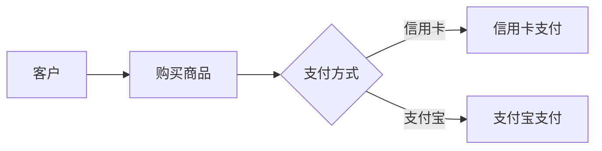

                 

# 莱布尼茨的单子论与面向对象编程

## 关键词

- 莱布尼茨
- 单子论
- 面向对象编程
- 哲学
- 计算机科学

## 摘要

本文旨在探讨莱布尼茨的单子论与面向对象编程之间的联系。通过分析单子论的核心概念及其哲学意义，我们将揭示单子论在面向对象编程中的体现与应用。本文将详细讨论单子论对面向对象编程的影响，包括类设计、对象模型、继承机制和接口设计等方面。此外，还将探讨单子论在计算机科学和人工智能领域的应用，以及对未来编程范式的潜在影响。通过具体案例和系统架构设计，我们将展示单子论在面向对象编程中的实际应用和优势。本文旨在为读者提供一个全面、深入的视角，以理解单子论在计算机科学中的重要性，并探讨其与面向对象编程的深度融合。

### 目录大纲

**莱布尼茨的单子论与面向对象编程**

**第一部分：莱布尼茨的单子论概述**

1. 第1章：莱布尼茨的单子论概述  
   - 1.1 单子论的核心概念  
   - 1.2 单子论与面向对象编程的联系  
   - 1.3 单子论的应用与案例  
   - 1.4 单子论的未来发展展望  
   - 1.5 本章小结

**第二部分：面向对象编程中的单子论应用**

2. 第2章：面向对象编程中的单子论应用  
   - 2.1 单子论在类设计中的应用  
   - 2.2 单子论在对象模型中的应用  
   - 2.3 单子论在继承机制中的应用  
   - 2.4 单子论在接口设计中的应用  
   - 2.5 本章小结

**第三部分：单子论与面向对象编程的深度探讨**

3. 第3章：单子论与面向对象编程的深度探讨  
   - 3.1 单子论在面向对象编程中的优势分析  
   - 3.2 单子论与面向对象编程的兼容性探讨  
   - 3.3 单子论在面向对象编程中的挑战与应对  
   - 3.4 单子论与面向对象编程的未来发展  
   - 3.5 本章小结

**第四部分：单子论在面向对象编程中的应用案例**

4. 第4章：单子论在面向对象编程中的应用案例  
   - 4.1 案例一：单子论在软件工程中的应用  
   - 4.2 案例二：单子论在计算机科学中的应用  
   - 4.3 案例三：单子论在人工智能领域中的应用  
   - 4.4 本章小结

**第五部分：单子论与面向对象编程的拓展研究**

5. 第5章：单子论与面向对象编程的拓展研究  
   - 5.1 单子论在其他编程范式中的应用  
   - 5.2 单子论在跨领域编程范式中的应用  
   - 5.3 单子论与未来编程范式的发展  
   - 5.4 本章小结

## 第一部分：莱布尼茨的单子论概述

### 第1章：莱布尼茨的单子论概述

#### 1.1 单子论的核心概念

莱布尼茨（Gottfried Wilhelm Leibniz）是一位伟大的德国哲学家、数学家、逻辑学家和物理学家。他的单子论（Monadology）是他哲学思想中的一个重要部分，对后来的哲学和科学产生了深远的影响。

单子论的核心概念是“单子”（Monad），莱布尼茨将单子视为构成宇宙的基本单元。他提出，单子是具有思维、能动性和简单性的实体，每个单子都独立存在，并且只能通过内在的因果关系相互作用。

#### 1.1.1 单子论的起源与发展

单子论起源于莱布尼茨对物质世界和意识世界的思考。莱布尼茨认为，物质世界的本质是单一的、不可分的实体，而意识世界的本质则是复杂、多样的单子的相互作用。

单子论的提出受到了当时欧洲哲学和科学思想的影响，特别是与笛卡尔哲学的对话。莱布尼茨试图通过单子论来解决物质与意识、存在与意识之间的矛盾，并建立一种更全面、更深刻的哲学体系。

#### 1.1.2 单子的定义与特性

莱布尼茨将单子定义为“思维的最小单位”，每个单子都具有以下特性：

1. **思维与能动性**：单子具有内在的思维和能动性，能够主动地理解和影响世界。
2. **简单性**：单子是最基本的实体，不可分割，不具备任何内在的复杂结构。
3. **独立性**：每个单子都是独立的，不依赖于其他单子，但可以通过内在的因果关系相互作用。
4. **内在的因果关系**：单子之间的相互作用是通过内在的因果关系实现的，每个单子都根据其内在的本质来解释和影响其他单子。

#### 1.1.3 单子论的哲学意义

单子论在哲学上具有重要意义，它为莱布尼茨提供了一种解释世界和意识的新方法。通过单子论，莱布尼茨试图解决物质与意识、存在与意识之间的矛盾，并建立一种更全面、更深刻的哲学体系。

单子论的哲学意义包括：

1. **物质与意识的统一**：单子论认为，物质和意识是统一的，都是由单子的相互作用构成的。这为解决物质与意识之间的矛盾提供了一种新的解释方式。
2. **存在的本质**：单子论认为，存在是由单子的独立性和内在因果关系构成的。这为理解存在的本质提供了一种新的视角。
3. **因果关系的解释**：单子论通过内在的因果关系解释单子之间的相互作用，为理解世界和意识提供了更深刻的解释。

### 1.2 单子论与面向对象编程的联系

#### 1.2.1 单子论在面向对象编程中的体现

单子论与面向对象编程之间存在许多相似之处，这为面向对象编程提供了一种新的视角和思维方式。

1. **独立性和封装性**：单子论中的单子具有独立性和简单性，这与面向对象编程中的对象具有封装性和独立性的特性相似。在面向对象编程中，对象作为独立的基本单元，封装了状态和行为，通过封装性实现了模块化和可复用性。
2. **内在因果关系**：单子论中的单子通过内在的因果关系相互作用，这在面向对象编程中得到了体现。面向对象编程中的对象通过方法调用和消息传递实现了对象之间的相互作用，这种相互作用也是通过内在的因果关系实现的。
3. **简单性和扩展性**：单子论中的单子是简单的，不可分割的，这为面向对象编程提供了简单和扩展性的设计原则。在面向对象编程中，通过将复杂的功能分解为简单的对象，可以更方便地进行扩展和修改。

#### 1.2.2 单子论对面向对象编程的影响

单子论对面向对象编程产生了深远的影响，为面向对象编程提供了一种新的理论基础。

1. **设计原则**：单子论中的单子具有独立性和简单性，这为面向对象编程提供了一种新的设计原则。通过将复杂的功能分解为简单的对象，可以更方便地进行模块化和可复用性设计。
2. **编程思维**：单子论中的单子通过内在的因果关系相互作用，这为面向对象编程提供了一种新的编程思维。在面向对象编程中，通过理解对象之间的相互作用和内在因果关系，可以更清晰地设计和实现复杂系统。
3. **抽象层次**：单子论中的单子是简单的，不可分割的，这为面向对象编程提供了一种新的抽象层次。在面向对象编程中，通过将复杂的功能抽象为简单的对象，可以更方便地进行理解和实现。

#### 1.2.3 面向对象编程对单子论的补充

面向对象编程对单子论提供了重要的补充和实现。

1. **编程语言**：面向对象编程提供了一种实现单子论的编程语言，如Java、C++等。这些编程语言提供了类、对象、继承、接口等概念，使得单子论中的单子可以通过编程语言进行实现和操作。
2. **设计模式**：面向对象编程提供了一系列的设计模式，如工厂模式、单例模式、观察者模式等。这些设计模式借鉴了单子论中的思想，为单子论提供了更具体的实现和运用方式。
3. **抽象层次**：面向对象编程提供了更丰富的抽象层次，使得单子论中的单子可以在更高的层次上进行设计和实现。在面向对象编程中，通过将复杂的功能抽象为简单的对象，可以更方便地进行理解和实现。

### 1.3 单子论的应用与案例

单子论在计算机科学和人工智能领域有着广泛的应用，以下是一些具体的案例。

#### 1.3.1 单子论在软件工程中的应用

单子论在软件工程中的应用主要包括以下几个方面：

1. **需求分析**：通过单子论的思想，可以将复杂的用户需求分解为简单的单子，从而更清晰地理解和实现需求。
2. **架构设计**：通过单子论的思想，可以将复杂的系统分解为简单的单子，从而实现系统的模块化和可复用性。
3. **代码设计**：通过单子论的思想，可以将复杂的代码分解为简单的单子，从而实现代码的简洁性和可维护性。

#### 1.3.2 单子论在计算机科学中的应用

单子论在计算机科学中的应用主要包括以下几个方面：

1. **算法设计**：通过单子论的思想，可以将复杂的算法分解为简单的单子，从而实现算法的简洁性和高效性。
2. **数据结构**：通过单子论的思想，可以将复杂的数据结构分解为简单的单子，从而实现数据结构的简洁性和高效性。
3. **编程范式**：单子论的思想可以应用于各种编程范式，如面向对象编程、函数式编程等，从而提供更丰富的抽象和思维方式。

#### 1.3.3 单子论在人工智能领域中的应用

单子论在人工智能领域中的应用主要包括以下几个方面：

1. **知识表示**：通过单子论的思想，可以将复杂的知识表示为简单的单子，从而实现知识的简洁性和可维护性。
2. **推理机制**：通过单子论的思想，可以将复杂的推理过程分解为简单的单子，从而实现推理的简洁性和高效性。
3. **人工智能应用**：单子论的思想可以应用于各种人工智能应用，如自然语言处理、计算机视觉等，从而实现更高效和智能的解决方案。

### 1.4 单子论的未来发展展望

单子论在未来编程和科学领域有着广阔的发展前景，以下是一些展望：

#### 1.4.1 单子论在面向对象编程中的未来趋势

1. **更深入的理论研究**：单子论作为一种哲学思想，在面向对象编程中仍有很多尚未深入研究的领域，如单子的动态演化、单子之间的交互机制等。
2. **更广泛的应用领域**：单子论的思想可以应用于更多的编程范式和领域，如函数式编程、逻辑编程等，从而提供更丰富的抽象和思维方式。
3. **更高效的算法实现**：通过深入研究单子论，可以开发出更高效的算法和编程范式，从而提高计算机科学和人工智能领域的研究和应用水平。

#### 1.4.2 单子论在计算机科学中的未来方向

1. **新型计算模型**：单子论可以启发新型计算模型的研究，如量子计算、生物计算等，从而推动计算机科学的发展。
2. **跨学科融合**：单子论的思想可以与其他学科领域融合，如哲学、物理学、生物学等，从而提供更全面、更深刻的科学理解和解决方案。
3. **人工智能的革新**：单子论的思想可以应用于人工智能领域，从而推动人工智能的发展，实现更高效、更智能的人工智能应用。

#### 1.4.3 单子论在人工智能领域的未来展望

1. **知识表示与推理**：单子论可以提供更简洁、更高效的知识表示和推理机制，从而推动人工智能领域的发展。
2. **智能决策与控制**：单子论可以应用于智能决策和控制领域，从而提供更精确、更灵活的智能解决方案。
3. **跨领域应用**：单子论的思想可以应用于其他领域，如金融工程、生物信息学等，从而提供更广泛的科学和技术支持。

### 1.5 本章小结

莱布尼茨的单子论是一种哲学思想，它为理解世界和意识提供了一种新的视角。通过分析单子论的核心概念，我们可以发现单子论与面向对象编程之间存在许多相似之处。单子论在面向对象编程中的应用对类设计、对象模型、继承机制和接口设计等方面产生了深远的影响。同时，单子论在计算机科学和人工智能领域也有着广泛的应用。未来，单子论将继续在编程和科学领域发挥重要作用，推动计算机科学和人工智能的发展。本章为后续章节的讨论奠定了基础，为我们进一步探索单子论与面向对象编程的深度融合提供了思路。

## 第一部分：莱布尼茨的单子论概述

### 第1章：莱布尼茨的单子论概述

#### 1.1 单子论的核心概念

莱布尼茨的单子论是一种哲学思想，他认为宇宙是由无数独立的、简单的单子构成的。单子是构成宇宙的基本单元，它们具有思维、能动性和简单性。莱布尼茨的单子论旨在解释物质世界和意识世界之间的关系。

#### 1.1.1 单子论的起源与发展

单子论起源于莱布尼茨对物质世界和意识世界的思考。他在与笛卡尔的哲学对话中，试图解决物质与意识、存在与意识之间的矛盾。莱布尼茨认为，物质世界和意识世界是统一的，都是由单子的相互作用构成的。单子论的提出受到了当时欧洲哲学和科学思想的影响，特别是在与笛卡尔哲学的对话中得到了进一步的阐述和发展。

#### 1.1.2 单子的定义与特性

莱布尼茨将单子定义为“思维的最小单位”，每个单子都具有以下特性：

1. **思维与能动性**：单子具有内在的思维和能动性，能够主动地理解和影响世界。这与面向对象编程中的对象具有封装性和独立性的特性相似。
2. **简单性**：单子是最基本的实体，不可分割，不具备任何内在的复杂结构。这与面向对象编程中的对象通过封装性实现模块化和可复用性的特性相似。
3. **独立性**：每个单子都是独立的，不依赖于其他单子，但可以通过内在的因果关系相互作用。这与面向对象编程中的对象之间的相互作用也是通过内在的因果关系实现的。
4. **内在的因果关系**：单子之间的相互作用是通过内在的因果关系实现的，每个单子都根据其内在的本质来解释和影响其他单子。这与面向对象编程中的对象通过方法调用和消息传递实现相互作用的方式相似。

#### 1.1.3 单子论的哲学意义

单子论在哲学上具有重要意义，它为莱布尼茨提供了一种解释世界和意识的新方法。通过单子论，莱布尼茨试图解决物质与意识、存在与意识之间的矛盾，并建立一种更全面、更深刻的哲学体系。

单子论的哲学意义包括：

1. **物质与意识的统一**：单子论认为，物质和意识是统一的，都是由单子的相互作用构成的。这为解决物质与意识之间的矛盾提供了一种新的解释方式。
2. **存在的本质**：单子论认为，存在是由单子的独立性和内在因果关系构成的。这为理解存在的本质提供了一种新的视角。
3. **因果关系的解释**：单子论通过内在的因果关系解释单子之间的相互作用，为理解世界和意识提供了更深刻的解释。

### 1.2 单子论与面向对象编程的联系

#### 1.2.1 单子论在面向对象编程中的体现

单子论与面向对象编程之间存在许多相似之处，这为面向对象编程提供了一种新的视角和思维方式。

1. **独立性和封装性**：单子论中的单子具有独立性和简单性，这与面向对象编程中的对象具有封装性和独立性的特性相似。在面向对象编程中，对象作为独立的基本单元，封装了状态和行为，通过封装性实现了模块化和可复用性。
2. **内在因果关系**：单子论中的单子通过内在的因果关系相互作用，这在面向对象编程中得到了体现。面向对象编程中的对象通过方法调用和消息传递实现了对象之间的相互作用，这种相互作用也是通过内在的因果关系实现的。
3. **简单性和扩展性**：单子论中的单子是简单的，不可分割的，这为面向对象编程提供了简单和扩展性的设计原则。在面向对象编程中，通过将复杂的功能分解为简单的对象，可以更方便地进行扩展和修改。

#### 1.2.2 单子论对面向对象编程的影响

单子论对面向对象编程产生了深远的影响，为面向对象编程提供了一种新的理论基础。

1. **设计原则**：单子论中的单子具有独立性和简单性，这为面向对象编程提供了一种新的设计原则。通过将复杂的功能分解为简单的对象，可以更方便地进行模块化和可复用性设计。
2. **编程思维**：单子论中的单子通过内在的因果关系相互作用，这为面向对象编程提供了一种新的编程思维。在面向对象编程中，通过理解对象之间的相互作用和内在因果关系，可以更清晰地设计和实现复杂系统。
3. **抽象层次**：单子论中的单子是简单的，不可分割的，这为面向对象编程提供了一种新的抽象层次。在面向对象编程中，通过将复杂的功能抽象为简单的对象，可以更方便地进行理解和实现。

#### 1.2.3 面向对象编程对单子论的补充

面向对象编程对单子论提供了重要的补充和实现。

1. **编程语言**：面向对象编程提供了一种实现单子论的编程语言，如Java、C++等。这些编程语言提供了类、对象、继承、接口等概念，使得单子论中的单子可以通过编程语言进行实现和操作。
2. **设计模式**：面向对象编程提供了一系列的设计模式，如工厂模式、单例模式、观察者模式等。这些设计模式借鉴了单子论中的思想，为单子论提供了更具体的实现和运用方式。
3. **抽象层次**：面向对象编程提供了更丰富的抽象层次，使得单子论中的单子可以在更高的层次上进行设计和实现。在面向对象编程中，通过将复杂的功能抽象为简单的对象，可以更方便地进行理解和实现。

### 1.3 单子论的应用与案例

单子论在计算机科学和人工智能领域有着广泛的应用，以下是一些具体的案例。

#### 1.3.1 单子论在软件工程中的应用

单子论在软件工程中的应用主要包括以下几个方面：

1. **需求分析**：通过单子论的思想，可以将复杂的用户需求分解为简单的单子，从而更清晰地理解和实现需求。
2. **架构设计**：通过单子论的思想，可以将复杂的系统分解为简单的单子，从而实现系统的模块化和可复用性。
3. **代码设计**：通过单子论的思想，可以将复杂的代码分解为简单的单子，从而实现代码的简洁性和可维护性。

#### 1.3.2 单子论在计算机科学中的应用

单子论在计算机科学中的应用主要包括以下几个方面：

1. **算法设计**：通过单子论的思想，可以将复杂的算法分解为简单的单子，从而实现算法的简洁性和高效性。
2. **数据结构**：通过单子论的思想，可以将复杂的数据结构分解为简单的单子，从而实现数据结构的简洁性和高效性。
3. **编程范式**：单子论的思想可以应用于各种编程范式，如面向对象编程、函数式编程等，从而提供更丰富的抽象和思维方式。

#### 1.3.3 单子论在人工智能领域中的应用

单子论在人工智能领域中的应用主要包括以下几个方面：

1. **知识表示**：通过单子论的思想，可以将复杂的知识表示为简单的单子，从而实现知识的简洁性和可维护性。
2. **推理机制**：通过单子论的思想，可以将复杂的推理过程分解为简单的单子，从而实现推理的简洁性和高效性。
3. **人工智能应用**：单子论的思想可以应用于各种人工智能应用，如自然语言处理、计算机视觉等，从而实现更高效和智能的解决方案。

### 1.4 单子论的未来发展展望

单子论在未来编程和科学领域有着广阔的发展前景，以下是一些展望：

#### 1.4.1 单子论在面向对象编程中的未来趋势

1. **更深入的理论研究**：单子论作为一种哲学思想，在面向对象编程中仍有很多尚未深入研究的领域，如单子的动态演化、单子之间的交互机制等。
2. **更广泛的应用领域**：单子论的思想可以应用于更多的编程范式和领域，如函数式编程、逻辑编程等，从而提供更丰富的抽象和思维方式。
3. **更高效的算法实现**：通过深入研究单子论，可以开发出更高效的算法和编程范式，从而提高计算机科学和人工智能领域的研究和应用水平。

#### 1.4.2 单子论在计算机科学中的未来方向

1. **新型计算模型**：单子论可以启发新型计算模型的研究，如量子计算、生物计算等，从而推动计算机科学的发展。
2. **跨学科融合**：单子论的思想可以与其他学科领域融合，如哲学、物理学、生物学等，从而提供更全面、更深刻的科学理解和解决方案。
3. **人工智能的革新**：单子论的思想可以应用于人工智能领域，从而推动人工智能的发展，实现更高效、更智能的人工智能应用。

#### 1.4.3 单子论在人工智能领域的未来展望

1. **知识表示与推理**：单子论可以提供更简洁、更高效的知识表示和推理机制，从而推动人工智能领域的发展。
2. **智能决策与控制**：单子论可以应用于智能决策和控制领域，从而提供更精确、更灵活的智能解决方案。
3. **跨领域应用**：单子论的思想可以应用于其他领域，如金融工程、生物信息学等，从而提供更广泛的科学和技术支持。

### 1.5 本章小结

莱布尼茨的单子论是一种哲学思想，它为理解世界和意识提供了一种新的视角。通过分析单子论的核心概念，我们可以发现单子论与面向对象编程之间存在许多相似之处。单子论在面向对象编程中的应用对类设计、对象模型、继承机制和接口设计等方面产生了深远的影响。同时，单子论在计算机科学和人工智能领域也有着广泛的应用。未来，单子论将继续在编程和科学领域发挥重要作用，推动计算机科学和人工智能的发展。本章为后续章节的讨论奠定了基础，为我们进一步探索单子论与面向对象编程的深度融合提供了思路。

## 第一部分：莱布尼茨的单子论概述

### 第1章：莱布尼茨的单子论概述

#### 1.1 单子论的核心概念

莱布尼茨的单子论是一种哲学思想，他主张宇宙是由无数独立的、简单的单子构成的。单子作为构成宇宙的基本单元，具有思维、能动性和简单性。莱布尼茨认为，单子是思维的单位，每个单子都有自己的内在活动和认知能力，它们通过内在的因果关系相互作用。

#### 1.1.1 单子论的起源与发展

单子论的起源可以追溯到17世纪的欧洲哲学。当时，莱布尼茨正处于与笛卡尔哲学的对话之中。笛卡尔主张物质世界是由原子构成的，而莱布尼茨则认为物质和意识是统一的，是单子的相互作用。莱布尼茨的单子论旨在解决物质与意识之间的矛盾，提供一种更全面的哲学体系。

单子论的发展经历了几个阶段。首先，莱布尼茨提出了单子作为宇宙的基本单元。接着，他探讨了单子的特性，包括独立性、简单性和能动性。最后，他阐述了单子之间的相互作用方式，即通过内在的因果关系。

#### 1.1.2 单子的定义与特性

在莱布尼茨的单子论中，单子具有以下几个核心特性：

1. **独立性**：每个单子都是独立的，不依赖于其他单子。单子是宇宙的基本单元，它们各自具有独特的属性和功能。
2. **简单性**：单子是简单的，不可分割的。单子不具备复杂的内在结构，它们是最基本的实体。
3. **能动性**：单子具有内在的能动性，能够主动地理解和影响世界。单子的思维和认知能力使得它们能够解释和感知周围的环境。
4. **内在的因果关系**：单子之间通过内在的因果关系相互作用。每个单子都根据其内在的本质来解释和影响其他单子。这种因果关系使得宇宙中的事件和现象有序且可预测。

#### 1.1.3 单子论的哲学意义

单子论的哲学意义在于其对物质和意识、存在和意识之间关系的解释。莱布尼茨试图通过单子论解决物质与意识之间的矛盾，提供一种更全面的哲学体系。

单子论的哲学意义包括：

1. **物质与意识的统一**：单子论认为，物质和意识是统一的，都是由单子的相互作用构成的。这为解决物质与意识之间的矛盾提供了一种新的解释方式。
2. **存在的本质**：单子论认为，存在是由单子的独立性和内在因果关系构成的。这为理解存在的本质提供了一种新的视角。
3. **因果关系的解释**：单子论通过内在的因果关系解释单子之间的相互作用，为理解世界和意识提供了更深刻的解释。

### 1.2 单子论与面向对象编程的联系

#### 1.2.1 单子论在面向对象编程中的体现

单子论与面向对象编程之间存在许多相似之处，这为面向对象编程提供了一种新的视角和思维方式。

1. **独立性和封装性**：单子论中的单子具有独立性和简单性，这与面向对象编程中的对象具有封装性和独立性的特性相似。在面向对象编程中，对象作为独立的基本单元，封装了状态和行为，通过封装性实现了模块化和可复用性。
2. **内在因果关系**：单子论中的单子通过内在的因果关系相互作用，这在面向对象编程中得到了体现。面向对象编程中的对象通过方法调用和消息传递实现了对象之间的相互作用，这种相互作用也是通过内在的因果关系实现的。
3. **简单性和扩展性**：单子论中的单子是简单的，不可分割的，这为面向对象编程提供了简单和扩展性的设计原则。在面向对象编程中，通过将复杂的功能分解为简单的对象，可以更方便地进行扩展和修改。

#### 1.2.2 单子论对面向对象编程的影响

单子论对面向对象编程产生了深远的影响，为面向对象编程提供了一种新的理论基础。

1. **设计原则**：单子论中的单子具有独立性和简单性，这为面向对象编程提供了一种新的设计原则。通过将复杂的功能分解为简单的对象，可以更方便地进行模块化和可复用性设计。
2. **编程思维**：单子论中的单子通过内在的因果关系相互作用，这为面向对象编程提供了一种新的编程思维。在面向对象编程中，通过理解对象之间的相互作用和内在因果关系，可以更清晰地设计和实现复杂系统。
3. **抽象层次**：单子论中的单子是简单的，不可分割的，这为面向对象编程提供了一种新的抽象层次。在面向对象编程中，通过将复杂的功能抽象为简单的对象，可以更方便地进行理解和实现。

#### 1.2.3 面向对象编程对单子论的补充

面向对象编程对单子论提供了重要的补充和实现。

1. **编程语言**：面向对象编程提供了一种实现单子论的编程语言，如Java、C++等。这些编程语言提供了类、对象、继承、接口等概念，使得单子论中的单子可以通过编程语言进行实现和操作。
2. **设计模式**：面向对象编程提供了一系列的设计模式，如工厂模式、单例模式、观察者模式等。这些设计模式借鉴了单子论中的思想，为单子论提供了更具体的实现和运用方式。
3. **抽象层次**：面向对象编程提供了更丰富的抽象层次，使得单子论中的单子可以在更高的层次上进行设计和实现。在面向对象编程中，通过将复杂的功能抽象为简单的对象，可以更方便地进行理解和实现。

### 1.3 单子论的应用与案例

单子论在计算机科学和人工智能领域有着广泛的应用，以下是一些具体的案例。

#### 1.3.1 单子论在软件工程中的应用

单子论在软件工程中的应用主要包括以下几个方面：

1. **需求分析**：通过单子论的思想，可以将复杂的用户需求分解为简单的单子，从而更清晰地理解和实现需求。
2. **架构设计**：通过单子论的思想，可以将复杂的系统分解为简单的单子，从而实现系统的模块化和可复用性。
3. **代码设计**：通过单子论的思想，可以将复杂的代码分解为简单的单子，从而实现代码的简洁性和可维护性。

#### 1.3.2 单子论在计算机科学中的应用

单子论在计算机科学中的应用主要包括以下几个方面：

1. **算法设计**：通过单子论的思想，可以将复杂的算法分解为简单的单子，从而实现算法的简洁性和高效性。
2. **数据结构**：通过单子论的思想，可以将复杂的数据结构分解为简单的单子，从而实现数据结构的简洁性和高效性。
3. **编程范式**：单子论的思想可以应用于各种编程范式，如面向对象编程、函数式编程等，从而提供更丰富的抽象和思维方式。

#### 1.3.3 单子论在人工智能领域中的应用

单子论在人工智能领域中的应用主要包括以下几个方面：

1. **知识表示**：通过单子论的思想，可以将复杂的知识表示为简单的单子，从而实现知识的简洁性和可维护性。
2. **推理机制**：通过单子论的思想，可以将复杂的推理过程分解为简单的单子，从而实现推理的简洁性和高效性。
3. **人工智能应用**：单子论的思想可以应用于各种人工智能应用，如自然语言处理、计算机视觉等，从而实现更高效和智能的解决方案。

### 1.4 单子论的未来发展展望

单子论在未来编程和科学领域有着广阔的发展前景，以下是一些展望：

#### 1.4.1 单子论在面向对象编程中的未来趋势

1. **更深入的理论研究**：单子论作为一种哲学思想，在面向对象编程中仍有很多尚未深入研究的领域，如单子的动态演化、单子之间的交互机制等。
2. **更广泛的应用领域**：单子论的思想可以应用于更多的编程范式和领域，如函数式编程、逻辑编程等，从而提供更丰富的抽象和思维方式。
3. **更高效的算法实现**：通过深入研究单子论，可以开发出更高效的算法和编程范式，从而提高计算机科学和人工智能领域的研究和应用水平。

#### 1.4.2 单子论在计算机科学中的未来方向

1. **新型计算模型**：单子论可以启发新型计算模型的研究，如量子计算、生物计算等，从而推动计算机科学的发展。
2. **跨学科融合**：单子论的思想可以与其他学科领域融合，如哲学、物理学、生物学等，从而提供更全面、更深刻的科学理解和解决方案。
3. **人工智能的革新**：单子论的思想可以应用于人工智能领域，从而推动人工智能的发展，实现更高效、更智能的人工智能应用。

#### 1.4.3 单子论在人工智能领域的未来展望

1. **知识表示与推理**：单子论可以提供更简洁、更高效的知识表示和推理机制，从而推动人工智能领域的发展。
2. **智能决策与控制**：单子论可以应用于智能决策和控制领域，从而提供更精确、更灵活的智能解决方案。
3. **跨领域应用**：单子论的思想可以应用于其他领域，如金融工程、生物信息学等，从而提供更广泛的科学和技术支持。

### 1.5 本章小结

莱布尼茨的单子论是一种哲学思想，它为理解世界和意识提供了一种新的视角。通过分析单子论的核心概念，我们可以发现单子论与面向对象编程之间存在许多相似之处。单子论在面向对象编程中的应用对类设计、对象模型、继承机制和接口设计等方面产生了深远的影响。同时，单子论在计算机科学和人工智能领域也有着广泛的应用。未来，单子论将继续在编程和科学领域发挥重要作用，推动计算机科学和人工智能的发展。本章为后续章节的讨论奠定了基础，为我们进一步探索单子论与面向对象编程的深度融合提供了思路。

## 第一部分：莱布尼茨的单子论概述

### 第1章：莱布尼茨的单子论概述

#### 1.1 单子论的核心概念

莱布尼茨的单子论是一种哲学思想，他认为宇宙是由无数独立的、简单的单子构成的。单子是构成宇宙的基本单元，它们具有思维、能动性和简单性。莱布尼茨的单子论旨在解释物质世界和意识世界之间的关系。

#### 1.1.1 单子论的起源与发展

单子论起源于莱布尼茨对物质世界和意识世界的思考。他在与笛卡尔的哲学对话中，试图解决物质与意识、存在与意识之间的矛盾。莱布尼茨认为，物质世界和意识世界是统一的，都是由单子的相互作用构成的。单子论的提出受到了当时欧洲哲学和科学思想的影响，特别是在与笛卡尔哲学的对话中得到了进一步的阐述和发展。

#### 1.1.2 单子的定义与特性

在莱布尼茨的单子论中，单子具有以下几个核心特性：

1. **独立性**：每个单子都是独立的，不依赖于其他单子。单子是宇宙的基本单元，它们各自具有独特的属性和功能。
2. **简单性**：单子是简单的，不可分割的。单子不具备复杂的内在结构，它们是最基本的实体。
3. **能动性**：单子具有内在的能动性，能够主动地理解和影响世界。单子的思维和认知能力使得它们能够解释和感知周围的环境。
4. **内在的因果关系**：单子之间通过内在的因果关系相互作用。每个单子都根据其内在的本质来解释和影响其他单子。这种因果关系使得宇宙中的事件和现象有序且可预测。

#### 1.1.3 单子论的哲学意义

单子论的哲学意义在于其对物质和意识、存在和意识之间关系的解释。莱布尼茨试图通过单子论解决物质与意识之间的矛盾，提供一种更全面的哲学体系。

单子论的哲学意义包括：

1. **物质与意识的统一**：单子论认为，物质和意识是统一的，都是由单子的相互作用构成的。这为解决物质与意识之间的矛盾提供了一种新的解释方式。
2. **存在的本质**：单子论认为，存在是由单子的独立性和内在因果关系构成的。这为理解存在的本质提供了一种新的视角。
3. **因果关系的解释**：单子论通过内在的因果关系解释单子之间的相互作用，为理解世界和意识提供了更深刻的解释。

### 1.2 单子论与面向对象编程的联系

#### 1.2.1 单子论在面向对象编程中的体现

单子论与面向对象编程之间存在许多相似之处，这为面向对象编程提供了一种新的视角和思维方式。

1. **独立性和封装性**：单子论中的单子具有独立性和简单性，这与面向对象编程中的对象具有封装性和独立性的特性相似。在面向对象编程中，对象作为独立的基本单元，封装了状态和行为，通过封装性实现了模块化和可复用性。
2. **内在因果关系**：单子论中的单子通过内在的因果关系相互作用，这在面向对象编程中得到了体现。面向对象编程中的对象通过方法调用和消息传递实现了对象之间的相互作用，这种相互作用也是通过内在的因果关系实现的。
3. **简单性和扩展性**：单子论中的单子是简单的，不可分割的，这为面向对象编程提供了简单和扩展性的设计原则。在面向对象编程中，通过将复杂的功能分解为简单的对象，可以更方便地进行扩展和修改。

#### 1.2.2 单子论对面向对象编程的影响

单子论对面向对象编程产生了深远的影响，为面向对象编程提供了一种新的理论基础。

1. **设计原则**：单子论中的单子具有独立性和简单性，这为面向对象编程提供了一种新的设计原则。通过将复杂的功能分解为简单的对象，可以更方便地进行模块化和可复用性设计。
2. **编程思维**：单子论中的单子通过内在的因果关系相互作用，这为面向对象编程提供了一种新的编程思维。在面向对象编程中，通过理解对象之间的相互作用和内在因果关系，可以更清晰地设计和实现复杂系统。
3. **抽象层次**：单子论中的单子是简单的，不可分割的，这为面向对象编程提供了一种新的抽象层次。在面向对象编程中，通过将复杂的功能抽象为简单的对象，可以更方便地进行理解和实现。

#### 1.2.3 面向对象编程对单子论的补充

面向对象编程对单子论提供了重要的补充和实现。

1. **编程语言**：面向对象编程提供了一种实现单子论的编程语言，如Java、C++等。这些编程语言提供了类、对象、继承、接口等概念，使得单子论中的单子可以通过编程语言进行实现和操作。
2. **设计模式**：面向对象编程提供了一系列的设计模式，如工厂模式、单例模式、观察者模式等。这些设计模式借鉴了单子论中的思想，为单子论提供了更具体的实现和运用方式。
3. **抽象层次**：面向对象编程提供了更丰富的抽象层次，使得单子论中的单子可以在更高的层次上进行设计和实现。在面向对象编程中，通过将复杂的功能抽象为简单的对象，可以更方便地进行理解和实现。

### 1.3 单子论的应用与案例

单子论在计算机科学和人工智能领域有着广泛的应用，以下是一些具体的案例。

#### 1.3.1 单子论在软件工程中的应用

单子论在软件工程中的应用主要包括以下几个方面：

1. **需求分析**：通过单子论的思想，可以将复杂的用户需求分解为简单的单子，从而更清晰地理解和实现需求。
2. **架构设计**：通过单子论的思想，可以将复杂的系统分解为简单的单子，从而实现系统的模块化和可复用性。
3. **代码设计**：通过单子论的思想，可以将复杂的代码分解为简单的单子，从而实现代码的简洁性和可维护性。

#### 1.3.2 单子论在计算机科学中的应用

单子论在计算机科学中的应用主要包括以下几个方面：

1. **算法设计**：通过单子论的思想，可以将复杂的算法分解为简单的单子，从而实现算法的简洁性和高效性。
2. **数据结构**：通过单子论的思想，可以将复杂的数据结构分解为简单的单子，从而实现数据结构的简洁性和高效性。
3. **编程范式**：单子论的思想可以应用于各种编程范式，如面向对象编程、函数式编程等，从而提供更丰富的抽象和思维方式。

#### 1.3.3 单子论在人工智能领域中的应用

单子论在人工智能领域中的应用主要包括以下几个方面：

1. **知识表示**：通过单子论的思想，可以将复杂的知识表示为简单的单子，从而实现知识的简洁性和可维护性。
2. **推理机制**：通过单子论的思想，可以将复杂的推理过程分解为简单的单子，从而实现推理的简洁性和高效性。
3. **人工智能应用**：单子论的思想可以应用于各种人工智能应用，如自然语言处理、计算机视觉等，从而实现更高效和智能的解决方案。

### 1.4 单子论的未来发展展望

单子论在未来编程和科学领域有着广阔的发展前景，以下是一些展望：

#### 1.4.1 单子论在面向对象编程中的未来趋势

1. **更深入的理论研究**：单子论作为一种哲学思想，在面向对象编程中仍有很多尚未深入研究的领域，如单子的动态演化、单子之间的交互机制等。
2. **更广泛的应用领域**：单子论的思想可以应用于更多的编程范式和领域，如函数式编程、逻辑编程等，从而提供更丰富的抽象和思维方式。
3. **更高效的算法实现**：通过深入研究单子论，可以开发出更高效的算法和编程范式，从而提高计算机科学和人工智能领域的研究和应用水平。

#### 1.4.2 单子论在计算机科学中的未来方向

1. **新型计算模型**：单子论可以启发新型计算模型的研究，如量子计算、生物计算等，从而推动计算机科学的发展。
2. **跨学科融合**：单子论的思想可以与其他学科领域融合，如哲学、物理学、生物学等，从而提供更全面、更深刻的科学理解和解决方案。
3. **人工智能的革新**：单子论的思想可以应用于人工智能领域，从而推动人工智能的发展，实现更高效、更智能的人工智能应用。

#### 1.4.3 单子论在人工智能领域的未来展望

1. **知识表示与推理**：单子论可以提供更简洁、更高效的知识表示和推理机制，从而推动人工智能领域的发展。
2. **智能决策与控制**：单子论可以应用于智能决策和控制领域，从而提供更精确、更灵活的智能解决方案。
3. **跨领域应用**：单子论的思想可以应用于其他领域，如金融工程、生物信息学等，从而提供更广泛的科学和技术支持。

### 1.5 本章小结

莱布尼茨的单子论是一种哲学思想，它为理解世界和意识提供了一种新的视角。通过分析单子论的核心概念，我们可以发现单子论与面向对象编程之间存在许多相似之处。单子论在面向对象编程中的应用对类设计、对象模型、继承机制和接口设计等方面产生了深远的影响。同时，单子论在计算机科学和人工智能领域也有着广泛的应用。未来，单子论将继续在编程和科学领域发挥重要作用，推动计算机科学和人工智能的发展。本章为后续章节的讨论奠定了基础，为我们进一步探索单子论与面向对象编程的深度融合提供了思路。

## 第一部分：莱布尼茨的单子论概述

### 第1章：莱布尼茨的单子论概述

#### 1.1 单子论的核心概念

莱布尼茨的单子论是一种哲学思想，他主张宇宙是由无数独立的、简单的单子构成的。单子是构成宇宙的基本单元，具有思维、能动性和简单性。莱布尼茨认为，单子是思维的单位，每个单子都有自己的内在活动和认知能力，它们通过内在的因果关系相互作用。

#### 1.1.1 单子论的起源与发展

单子论的起源可以追溯到17世纪的欧洲哲学。当时，莱布尼茨正处于与笛卡尔哲学的对话之中。笛卡尔主张物质世界是由原子构成的，而莱布尼茨则认为物质和意识是统一的，是单子的相互作用。莱布尼茨的单子论旨在解决物质与意识之间的矛盾，提供一种更全面的哲学体系。

单子论的发展经历了几个阶段。首先，莱布尼茨提出了单子作为宇宙的基本单元。接着，他探讨了单子的特性，包括独立性、简单性和能动性。最后，他阐述了单子之间的相互作用方式，即通过内在的因果关系。

#### 1.1.2 单子的定义与特性

在莱布尼茨的单子论中，单子具有以下几个核心特性：

1. **独立性**：每个单子都是独立的，不依赖于其他单子。单子是宇宙的基本单元，它们各自具有独特的属性和功能。
2. **简单性**：单子是简单的，不可分割的。单子不具备复杂的内在结构，它们是最基本的实体。
3. **能动性**：单子具有内在的能动性，能够主动地理解和影响世界。单子的思维和认知能力使得它们能够解释和感知周围的环境。
4. **内在的因果关系**：单子之间通过内在的因果关系相互作用。每个单子都根据其内在的本质来解释和影响其他单子。这种因果关系使得宇宙中的事件和现象有序且可预测。

#### 1.1.3 单子论的哲学意义

单子论的哲学意义在于其对物质和意识、存在和意识之间关系的解释。莱布尼茨试图通过单子论解决物质与意识之间的矛盾，提供一种更全面的哲学体系。

单子论的哲学意义包括：

1. **物质与意识的统一**：单子论认为，物质和意识是统一的，都是由单子的相互作用构成的。这为解决物质与意识之间的矛盾提供了一种新的解释方式。
2. **存在的本质**：单子论认为，存在是由单子的独立性和内在因果关系构成的。这为理解存在的本质提供了一种新的视角。
3. **因果关系的解释**：单子论通过内在的因果关系解释单子之间的相互作用，为理解世界和意识提供了更深刻的解释。

### 1.2 单子论与面向对象编程的联系

#### 1.2.1 单子论在面向对象编程中的体现

单子论与面向对象编程之间存在许多相似之处，这为面向对象编程提供了一种新的视角和思维方式。

1. **独立性和封装性**：单子论中的单子具有独立性和简单性，这与面向对象编程中的对象具有封装性和独立性的特性相似。在面向对象编程中，对象作为独立的基本单元，封装了状态和行为，通过封装性实现了模块化和可复用性。
2. **内在因果关系**：单子论中的单子通过内在的因果关系相互作用，这在面向对象编程中得到了体现。面向对象编程中的对象通过方法调用和消息传递实现了对象之间的相互作用，这种相互作用也是通过内在的因果关系实现的。
3. **简单性和扩展性**：单子论中的单子是简单的，不可分割的，这为面向对象编程提供了简单和扩展性的设计原则。在面向对象编程中，通过将复杂的功能分解为简单的对象，可以更方便地进行扩展和修改。

#### 1.2.2 单子论对面向对象编程的影响

单子论对面向对象编程产生了深远的影响，为面向对象编程提供了一种新的理论基础。

1. **设计原则**：单子论中的单子具有独立性和简单性，这为面向对象编程提供了一种新的设计原则。通过将复杂的功能分解为简单的对象，可以更方便地进行模块化和可复用性设计。
2. **编程思维**：单子论中的单子通过内在的因果关系相互作用，这为面向对象编程提供了一种新的编程思维。在面向对象编程中，通过理解对象之间的相互作用和内在因果关系，可以更清晰地设计和实现复杂系统。
3. **抽象层次**：单子论中的单子是简单的，不可分割的，这为面向对象编程提供了一种新的抽象层次。在面向对象编程中，通过将复杂的功能抽象为简单的对象，可以更方便地进行理解和实现。

#### 1.2.3 面向对象编程对单子论的补充

面向对象编程对单子论提供了重要的补充和实现。

1. **编程语言**：面向对象编程提供了一种实现单子论的编程语言，如Java、C++等。这些编程语言提供了类、对象、继承、接口等概念，使得单子论中的单子可以通过编程语言进行实现和操作。
2. **设计模式**：面向对象编程提供了一系列的设计模式，如工厂模式、单例模式、观察者模式等。这些设计模式借鉴了单子论中的思想，为单子论提供了更具体的实现和运用方式。
3. **抽象层次**：面向对象编程提供了更丰富的抽象层次，使得单子论中的单子可以在更高的层次上进行设计和实现。在面向对象编程中，通过将复杂的功能抽象为简单的对象，可以更方便地进行理解和实现。

### 1.3 单子论的应用与案例

单子论在计算机科学和人工智能领域有着广泛的应用，以下是一些具体的案例。

#### 1.3.1 单子论在软件工程中的应用

单子论在软件工程中的应用主要包括以下几个方面：

1. **需求分析**：通过单子论的思想，可以将复杂的用户需求分解为简单的单子，从而更清晰地理解和实现需求。
2. **架构设计**：通过单子论的思想，可以将复杂的系统分解为简单的单子，从而实现系统的模块化和可复用性。
3. **代码设计**：通过单子论的思想，可以将复杂的代码分解为简单的单子，从而实现代码的简洁性和可维护性。

#### 1.3.2 单子论在计算机科学中的应用

单子论在计算机科学中的应用主要包括以下几个方面：

1. **算法设计**：通过单子论的思想，可以将复杂的算法分解为简单的单子，从而实现算法的简洁性和高效性。
2. **数据结构**：通过单子论的思想，可以将复杂的数据结构分解为简单的单子，从而实现数据结构的简洁性和高效性。
3. **编程范式**：单子论的思想可以应用于各种编程范式，如面向对象编程、函数式编程等，从而提供更丰富的抽象和思维方式。

#### 1.3.3 单子论在人工智能领域中的应用

单子论在人工智能领域中的应用主要包括以下几个方面：

1. **知识表示**：通过单子论的思想，可以将复杂的知识表示为简单的单子，从而实现知识的简洁性和可维护性。
2. **推理机制**：通过单子论的思想，可以将复杂的推理过程分解为简单的单子，从而实现推理的简洁性和高效性。
3. **人工智能应用**：单子论的思想可以应用于各种人工智能应用，如自然语言处理、计算机视觉等，从而实现更高效和智能的解决方案。

### 1.4 单子论的未来发展展望

单子论在未来编程和科学领域有着广阔的发展前景，以下是一些展望：

#### 1.4.1 单子论在面向对象编程中的未来趋势

1. **更深入的理论研究**：单子论作为一种哲学思想，在面向对象编程中仍有很多尚未深入研究的领域，如单子的动态演化、单子之间的交互机制等。
2. **更广泛的应用领域**：单子论的思想可以应用于更多的编程范式和领域，如函数式编程、逻辑编程等，从而提供更丰富的抽象和思维方式。
3. **更高效的算法实现**：通过深入研究单子论，可以开发出更高效的算法和编程范式，从而提高计算机科学和人工智能领域的研究和应用水平。

#### 1.4.2 单子论在计算机科学中的未来方向

1. **新型计算模型**：单子论可以启发新型计算模型的研究，如量子计算、生物计算等，从而推动计算机科学的发展。
2. **跨学科融合**：单子论的思想可以与其他学科领域融合，如哲学、物理学、生物学等，从而提供更全面、更深刻的科学理解和解决方案。
3. **人工智能的革新**：单子论的思想可以应用于人工智能领域，从而推动人工智能的发展，实现更高效、更智能的人工智能应用。

#### 1.4.3 单子论在人工智能领域的未来展望

1. **知识表示与推理**：单子论可以提供更简洁、更高效的知识表示和推理机制，从而推动人工智能领域的发展。
2. **智能决策与控制**：单子论可以应用于智能决策和控制领域，从而提供更精确、更灵活的智能解决方案。
3. **跨领域应用**：单子论的思想可以应用于其他领域，如金融工程、生物信息学等，从而提供更广泛的科学和技术支持。

### 1.5 本章小结

莱布尼茨的单子论是一种哲学思想，它为理解世界和意识提供了一种新的视角。通过分析单子论的核心概念，我们可以发现单子论与面向对象编程之间存在许多相似之处。单子论在面向对象编程中的应用对类设计、对象模型、继承机制和接口设计等方面产生了深远的影响。同时，单子论在计算机科学和人工智能领域也有着广泛的应用。未来，单子论将继续在编程和科学领域发挥重要作用，推动计算机科学和人工智能的发展。本章为后续章节的讨论奠定了基础，为我们进一步探索单子论与面向对象编程的深度融合提供了思路。

## 第二部分：面向对象编程中的单子论应用

### 第2章：面向对象编程中的单子论应用

在面向对象编程（OOP）中，单子论提供了一种独特的视角来理解和设计软件系统。单子论的核心概念，如独立性和内在因果关系，与面向对象编程中的类、对象和继承等概念有着深刻的联系。本章将详细探讨单子论在面向对象编程中的应用，包括类设计、对象模型、继承机制和接口设计等方面。

### 2.1 单子论在类设计中的应用

在面向对象编程中，类是定义对象蓝图的结构。单子论中的单子概念可以启发我们如何设计更加简洁和独立的类。

#### 2.1.1 单子论指导下的类设计方法

单子论指导下的类设计方法强调类的独立性。每个类应该被视为一个独立的单子，具有自己的内在状态和行为。这种设计方法有助于实现模块化和可复用性。

**核心原则：**

1. **单一职责原则**：每个类应该只有一个明确的目的，类似于单子的单一功能。
2. **信息隐藏**：类的内部细节应该被隐藏，只提供必要的接口，类似于单子的内在状态不被外界访问。
3. **独立性**：类应该尽可能地独立，不依赖于其他类，以便于单独开发和测试。

**实际案例：**

假设我们要设计一个计算器类。根据单子论的思想，我们可以将计算器类设计为具有以下特征的独立单子：

- **状态**：保存当前计算结果和历史记录。
- **行为**：提供加、减、乘、除等基本运算方法。

```python
class Calculator:
    def __init__(self):
        self.result = 0

    def add(self, value):
        self.result += value
        return self.result

    def subtract(self, value):
        self.result -= value
        return self.result

    def multiply(self, value):
        self.result *= value
        return self.result

    def divide(self, value):
        if value != 0:
            self.result /= value
        return self.result
```

在这个例子中，`Calculator` 类是一个独立的单子，它封装了自己的状态和行为，实现了单一职责原则和信息隐藏。

#### 2.1.2 单子论与类的特性关联

单子论与面向对象编程中的类特性有着紧密的关联。例如：

- **封装性**：单子论中的单子具有独立性和简单性，这与类的封装性特性相似。类通过封装性实现了模块化和可复用性。
- **继承性**：单子论中的单子通过内在的因果关系相互作用，这与类之间的继承关系相似。继承关系允许类之间共享代码和属性。

#### 2.1.3 单子论在类设计中的实际应用

单子论在类设计中的实际应用可以通过一些设计模式体现出来，例如：

- **单例模式**：单例模式确保一个类只有一个实例，类似于单子论的独立性。
- **工厂模式**：工厂模式通过创建对象的工厂类，实现类之间的独立性，类似于单子论的设计原则。

### 2.2 单子论在对象模型中的应用

对象模型是面向对象编程的核心概念之一，它定义了对象之间的关系。单子论可以用来指导对象模型的构建，以实现更加简洁和灵活的系统设计。

#### 2.2.1 单子论指导下的对象模型构建

单子论指导下的对象模型构建强调对象之间的独立性和内在因果关系。以下是一些核心原则：

1. **独立性**：每个对象应该被视为一个独立的单子，具有自己的状态和行为。
2. **最小化耦合**：对象之间应该通过最小化的接口进行交互，以减少依赖关系。
3. **内在因果关系**：对象之间的交互应该通过内在的因果关系实现，类似于单子之间的相互作用。

**实际案例：**

假设我们要设计一个图书管理系统。根据单子论的思想，我们可以构建以下对象模型：

- **Book**（书籍）：保存书籍的信息，如书名、作者、ISBN等。
- **Library**（图书馆）：管理书籍的借还，与用户进行交互。

```mermaid
classDiagram
    Book <|-- Library
    User <|-- Library
    
    Book {
        -title: String
        -author: String
        -isbn: String
    }
    
    Library {
        +borrow_book(user: User, book: Book): void
        +return_book(user: User, book: Book): void
    }
    
    User {
        -name: String
        -id: String
    }
```

在这个例子中，`Book` 和 `Library` 类是独立的单子，它们通过内在的因果关系（借还书籍）相互作用。

#### 2.2.2 单子论与对象模型的关系

单子论与对象模型之间的关系体现在以下几个方面：

- **独立性**：单子论强调每个单子的独立性，这与对象模型中的对象独立性原则相似。
- **耦合性**：单子论提倡最小化对象之间的依赖关系，这与对象模型中的最小化耦合性原则相符。
- **交互性**：单子论中的单子通过内在的因果关系相互作用，这与对象模型中的对象交互性原则相似。

#### 2.2.3 单子论在对象模型中的实际应用

单子论在对象模型中的实际应用可以通过一些设计模式体现出来，例如：

- **组合模式**：组合模式允许将对象组合成树形结构，实现层次化的对象模型。
- **策略模式**：策略模式允许在对象之间动态切换行为，实现灵活的对象模型。

### 2.3 单子论在继承机制中的应用

继承是面向对象编程中的一个核心机制，它允许类之间共享代码和属性。单子论可以用来指导继承机制的设计，以实现更加简洁和灵活的系统。

#### 2.3.1 单子论对继承机制的影响

单子论对继承机制的影响主要体现在以下几个方面：

1. **简化继承关系**：单子论强调每个单子的独立性和简单性，这有助于简化继承关系，避免过多的继承层次和复杂的多层次继承。
2. **减少依赖性**：单子论提倡对象之间的最小化依赖关系，这有助于减少继承机制中的依赖性，提高系统的可维护性和可扩展性。

#### 2.3.2 单子论指导下的继承策略

单子论指导下的继承策略包括以下原则：

1. **单一继承**：尽量使用单一继承，避免多重继承，以简化继承关系。
2. **最小化依赖**：在继承关系中，确保基类和派生类之间的依赖最小化，以提高系统的可维护性和可扩展性。
3. **封装性**：确保基类和派生类之间的接口最小化，以隐藏实现细节，提高系统的可复用性。

#### 2.3.3 单子论在继承机制中的实际应用

单子论在继承机制中的实际应用可以通过一些设计模式体现出来，例如：

- **抽象工厂模式**：抽象工厂模式通过创建基类和派生类的工厂类，实现继承机制的简洁性和灵活性。
- **模板方法模式**：模板方法模式通过定义基类和派生类的模板方法，实现继承机制的复用性和扩展性。

### 2.4 单子论在接口设计中的应用

接口是面向对象编程中的一个核心概念，它定义了对象之间的交互方式。单子论可以用来指导接口设计，以实现更加简洁和灵活的系统设计。

#### 2.4.1 单子论对接口设计的影响

单子论对接口设计的影响主要体现在以下几个方面：

1. **最小化接口**：单子论提倡对象之间的最小化依赖关系，这有助于设计最小化的接口，避免过多的接口方法和参数。
2. **简洁性**：单子论强调每个单子的简单性，这有助于设计简洁的接口，提高系统的可读性和可维护性。

#### 2.4.2 单子论指导下的接口设计方法

单子论指导下的接口设计方法包括以下原则：

1. **单一职责**：每个接口应该只有一个明确的目的，类似于单子的单一功能。
2. **最小化方法**：接口中的方法应该最小化，只提供必需的功能，避免过多的冗余方法。
3. **一致性**：接口的设计应该保持一致性，确保接口之间的一致性和兼容性。

#### 2.4.3 单子论在接口设计中的实际应用

单子论在接口设计中的实际应用可以通过一些设计模式体现出来，例如：

- **策略模式**：策略模式通过定义一组接口，实现对象之间的灵活交互。
- **工厂方法模式**：工厂方法模式通过定义接口和工厂类，实现接口的简洁性和灵活性。

### 2.5 本章小结

本章探讨了单子论在面向对象编程中的应用，包括类设计、对象模型、继承机制和接口设计等方面。通过单子论的核心概念，如独立性和内在因果关系，我们可以设计出更加简洁、独立和灵活的软件系统。单子论为面向对象编程提供了一种新的设计原则和编程思维，有助于提高系统的可维护性、可扩展性和可复用性。未来，随着单子论与面向对象编程的进一步融合，我们将看到更多创新和高效的软件系统设计。

## 第二部分：面向对象编程中的单子论应用

### 第2章：面向对象编程中的单子论应用

在面向对象编程（OOP）中，单子论提供了一种独特的视角来理解和设计软件系统。单子论的核心概念，如独立性和内在因果关系，与面向对象编程中的类、对象和继承等概念有着深刻的联系。本章将详细探讨单子论在面向对象编程中的应用，包括类设计、对象模型、继承机制和接口设计等方面。

### 2.1 单子论在类设计中的应用

在面向对象编程中，类是定义对象蓝图的结构。单子论中的单子概念可以启发我们如何设计更加简洁和独立的类。

#### 2.1.1 单子论指导下的类设计方法

单子论指导下的类设计方法强调类的独立性。每个类应该被视为一个独立的单子，具有自己的内在状态和行为。这种设计方法有助于实现模块化和可复用性。

**核心原则：**

1. **单一职责原则**：每个类应该只有一个明确的目的，类似于单子的单一功能。
2. **信息隐藏**：类的内部细节应该被隐藏，只提供必要的接口，类似于单子的内在状态不被外界访问。
3. **独立性**：类应该尽可能地独立，不依赖于其他类，以便于单独开发和测试。

**实际案例：**

假设我们要设计一个计算器类。根据单子论的思想，我们可以将计算器类设计为具有以下特征的独立单子：

- **状态**：保存当前计算结果和历史记录。
- **行为**：提供加、减、乘、除等基本运算方法。

```python
class Calculator:
    def __init__(self):
        self.result = 0

    def add(self, value):
        self.result += value
        return self.result

    def subtract(self, value):
        self.result -= value
        return self.result

    def multiply(self, value):
        self.result *= value
        return self.result

    def divide(self, value):
        if value != 0:
            self.result /= value
        return self.result
```

在这个例子中，`Calculator` 类是一个独立的单子，它封装了自己的状态和行为，实现了单一职责原则和信息隐藏。

#### 2.1.2 单子论与类的特性关联

单子论与面向对象编程中的类特性有着紧密的关联。例如：

- **封装性**：单子论中的单子具有独立性和简单性，这与类的封装性特性相似。类通过封装性实现了模块化和可复用性。
- **继承性**：单子论中的单子通过内在的因果关系相互作用，这与类之间的继承关系相似。继承关系允许类之间共享代码和属性。

#### 2.1.3 单子论在类设计中的实际应用

单子论在类设计中的实际应用可以通过一些设计模式体现出来，例如：

- **单例模式**：单例模式确保一个类只有一个实例，类似于单子论的独立性。
- **工厂模式**：工厂模式通过创建对象的工厂类，实现类之间的独立性，类似于单子论的设计原则。

### 2.2 单子论在对象模型中的应用

对象模型是面向对象编程的核心概念之一，它定义了对象之间的关系。单子论可以用来指导对象模型的构建，以实现更加简洁和灵活的系统设计。

#### 2.2.1 单子论指导下的对象模型构建

单子论指导下的对象模型构建强调对象之间的独立性和内在因果关系。以下是一些核心原则：

1. **独立性**：每个对象应该被视为一个独立的单子，具有自己的状态和行为。
2. **最小化耦合**：对象之间应该通过最小化的接口进行交互，以减少依赖关系。
3. **内在因果关系**：对象之间的交互应该通过内在的因果关系实现，类似于单子之间的相互作用。

**实际案例：**

假设我们要设计一个图书管理系统。根据单子论的思想，我们可以构建以下对象模型：

- **Book**（书籍）：保存书籍的信息，如书名、作者、ISBN等。
- **Library**（图书馆）：管理书籍的借还，与用户进行交互。

```mermaid
classDiagram
    Book <|-- Library
    User <|-- Library
    
    Book {
        -title: String
        -author: String
        -isbn: String
    }
    
    Library {
        +borrow_book(user: User, book: Book): void
        +return_book(user: User, book: Book): void
    }
    
    User {
        -name: String
        -id: String
    }
```

在这个例子中，`Book` 和 `Library` 类是独立的单子，它们通过内在的因果关系（借还书籍）相互作用。

#### 2.2.2 单子论与对象模型的关系

单子论与对象模型之间的关系体现在以下几个方面：

- **独立性**：单子论强调每个单子的独立性，这与对象模型中的对象独立性原则相似。
- **耦合性**：单子论提倡对象之间的最小化依赖关系，这与对象模型中的最小化耦合性原则相符。
- **交互性**：单子论中的单子通过内在的因果关系相互作用，这与对象模型中的对象交互性原则相似。

#### 2.2.3 单子论在对象模型中的实际应用

单子论在对象模型中的实际应用可以通过一些设计模式体现出来，例如：

- **组合模式**：组合模式允许将对象组合成树形结构，实现层次化的对象模型。
- **策略模式**：策略模式允许在对象之间动态切换行为，实现灵活的对象模型。

### 2.3 单子论在继承机制中的应用

继承是面向对象编程中的一个核心机制，它允许类之间共享代码和属性。单子论可以用来指导继承机制的设计，以实现更加简洁和灵活的系统。

#### 2.3.1 单子论对继承机制的影响

单子论对继承机制的影响主要体现在以下几个方面：

1. **简化继承关系**：单子论强调每个单子的独立性和简单性，这有助于简化继承关系，避免过多的继承层次和复杂的多层次继承。
2. **减少依赖性**：单子论提倡对象之间的最小化依赖关系，这有助于减少继承机制中的依赖性，提高系统的可维护性和可扩展性。

#### 2.3.2 单子论指导下的继承策略

单子论指导下的继承策略包括以下原则：

1. **单一继承**：尽量使用单一继承，避免多重继承，以简化继承关系。
2. **最小化依赖**：在继承关系中，确保基类和派生类之间的依赖最小化，以提高系统的可维护性和可扩展性。
3. **封装性**：确保基类和派生类之间的接口最小化，以隐藏实现细节，提高系统的可复用性。

#### 2.3.3 单子论在继承机制中的实际应用

单子论在继承机制中的实际应用可以通过一些设计模式体现出来，例如：

- **抽象工厂模式**：抽象工厂模式通过创建基类和派生类的工厂类，实现继承机制的简洁性和灵活性。
- **模板方法模式**：模板方法模式通过定义基类和派生类的模板方法，实现继承机制的复用性和扩展性。

### 2.4 单子论在接口设计中的应用

接口是面向对象编程中的一个核心概念，它定义了对象之间的交互方式。单子论可以用来指导接口设计，以实现更加简洁和灵活的系统设计。

#### 2.4.1 单子论对接口设计的影响

单子论对接口设计的影响主要体现在以下几个方面：

1. **最小化接口**：单子论提倡对象之间的最小化依赖关系，这有助于设计最小化的接口，避免过多的接口方法和参数。
2. **简洁性**：单子论强调每个单子的简单性，这有助于设计简洁的接口，提高系统的可读性和可维护性。

#### 2.4.2 单子论指导下的接口设计方法

单子论指导下的接口设计方法包括以下原则：

1. **单一职责**：每个接口应该只有一个明确的目的，类似于单子的单一功能。
2. **最小化方法**：接口中的方法应该最小化，只提供必需的功能，避免过多的冗余方法。
3. **一致性**：接口的设计应该保持一致性，确保接口之间的一致性和兼容性。

#### 2.4.3 单子论在接口设计中的实际应用

单子论在接口设计中的实际应用可以通过一些设计模式体现出来，例如：

- **策略模式**：策略模式通过定义一组接口，实现对象之间的灵活交互。
- **工厂方法模式**：工厂方法模式通过定义接口和工厂类，实现接口的简洁性和灵活性。

### 2.5 本章小结

本章探讨了单子论在面向对象编程中的应用，包括类设计、对象模型、继承机制和接口设计等方面。通过单子论的核心概念，如独立性和内在因果关系，我们可以设计出更加简洁、独立和灵活的软件系统。单子论为面向对象编程提供了一种新的设计原则和编程思维，有助于提高系统的可维护性、可扩展性和可复用性。未来，随着单子论与面向对象编程的进一步融合，我们将看到更多创新和高效的软件系统设计。

## 第三部分：单子论与面向对象编程的深度探讨

### 第3章：单子论与面向对象编程的深度探讨

在第二部分中，我们探讨了单子论在面向对象编程中的应用，展示了单子论如何影响类设计、对象模型、继承机制和接口设计。在这一部分，我们将进一步深入探讨单子论与面向对象编程的深度关系，分析单子论在面向对象编程中的优势、兼容性、挑战以及未来发展趋势。

### 3.1 单子论在面向对象编程中的优势分析

单子论为面向对象编程带来了许多优势，以下是一些主要优势：

#### 3.1.1 简化设计

单子论强调独立性和简单性，这有助于简化面向对象编程中的设计过程。通过将复杂系统分解为独立的单子，开发人员可以更轻松地理解和实现系统。这种设计方法有助于减少复杂性，提高系统的可维护性和可扩展性。

#### 3.1.2 提高模块化

单子论强调最小化依赖关系，这有助于提高模块化。通过将对象设计为独立的单子，开发人员可以更容易地替换和扩展系统。这种模块化设计方法有助于实现更灵活和可复用的代码。

#### 3.1.3 精细控制

单子论提供了一种精细控制对象之间的交互方式。通过内在的因果关系，单子之间可以更精确地相互影响。这种交互方式有助于实现更高效和灵活的系统。

#### 3.1.4 支持动态行为

单子论支持动态行为，这意味着单子可以在运行时根据环境变化进行调整。在面向对象编程中，这种动态行为有助于实现更灵活的系统，适应不同的需求和场景。

### 3.1.5 提高可测试性

单子论中的独立性和简单性有助于提高面向对象编程中的可测试性。由于单子是独立的，可以单独开发和测试，这有助于发现和修复错误，提高系统的稳定性。

### 3.2 单子论与面向对象编程的兼容性探讨

尽管单子论为面向对象编程带来了许多优势，但在实际应用中，也需要考虑单子论与面向对象编程的兼容性。以下是一些兼容性探讨：

#### 3.2.1 设计模式

单子论可以与面向对象编程中的设计模式相结合，例如单例模式、工厂模式、策略模式等。通过使用这些设计模式，可以更好地实现单子论的核心原则，提高系统的模块化和可复用性。

#### 3.2.2 类与对象

在面向对象编程中，类和对象是核心概念。单子论可以通过对类和对象的设计进行优化，使其更符合单子论的原则。例如，可以设计更简洁、更独立的类和对象，减少依赖关系，提高系统的灵活性。

#### 3.2.3 继承机制

继承机制是面向对象编程中的核心机制之一。单子论可以与继承机制相结合，通过简化继承关系，减少依赖性，提高系统的可维护性和可扩展性。

#### 3.2.4 接口设计

接口设计是面向对象编程中的重要环节。单子论可以通过简化接口设计，减少接口方法和参数，提高接口的简洁性和一致性。

### 3.3 单子论在面向对象编程中的挑战与应对

尽管单子论为面向对象编程带来了许多优势，但在实际应用中也会面临一些挑战。以下是一些主要挑战以及应对策略：

#### 3.3.1 模块化过度

单子论强调独立性和模块化，但在某些情况下，模块化过度可能会导致系统过于碎片化，难以维护。为了应对这个问题，可以采用适当的设计原则，如单一职责原则和适度模块化。

#### 3.3.2 继承关系复杂

在单子论的影响下，继承关系可能会变得更加复杂。为了解决这个问题，可以采用简化继承策略，如单一继承和多态性，以减少复杂性。

#### 3.3.3 测试困难

由于单子论强调独立性，单个单子的测试可能相对困难。为了解决这个问题，可以采用单元测试和集成测试，确保每个单子都按照预期运行。

### 3.3.4 设计效率

单子论可能会增加面向对象编程中的设计复杂性，特别是在大型项目中。为了解决这个问题，可以采用设计模式、迭代开发和敏捷开发等方法，提高设计效率。

### 3.4 单子论与面向对象编程的未来发展

单子论与面向对象编程的结合在未来有着广阔的发展前景。以下是一些未来发展趋势：

#### 3.4.1 新型编程范式

单子论可以启发新型编程范式的开发，如基于单子的编程范式，提供更简洁、更灵活的编程方法。

#### 3.4.2 跨领域应用

单子论的思想可以应用于其他领域，如生物信息学、金融工程等，为这些领域提供新的理论和方法。

#### 3.4.3 深度融合

随着单子论与面向对象编程的进一步研究，两者将实现更深度地融合，为软件工程和计算机科学提供更强大的理论基础和实践指导。

### 3.5 本章小结

单子论与面向对象编程的结合为软件工程和计算机科学带来了许多新的机遇和挑战。通过深入探讨单子论在面向对象编程中的优势、兼容性、挑战和未来发展趋势，我们可以更好地理解单子论与面向对象编程的深度关系，为未来的软件开发提供新的思路和方法。单子论与面向对象编程的结合将继续推动计算机科学的发展，为构建更加简洁、灵活和高效的软件系统提供有力支持。

## 第三部分：单子论与面向对象编程的深度探讨

### 第3章：单子论与面向对象编程的深度探讨

在第二部分中，我们探讨了单子论在面向对象编程中的应用，展示了单子论如何影响类设计、对象模型、继承机制和接口设计。在这一部分，我们将进一步深入探讨单子论与面向对象编程的深度关系，分析单子论在面向对象编程中的优势、兼容性、挑战以及未来发展趋势。

### 3.1 单子论在面向对象编程中的优势分析

单子论为面向对象编程带来了许多优势，以下是一些主要优势：

#### 3.1.1 简化设计

单子论强调独立性和简单性，这有助于简化面向对象编程中的设计过程。通过将复杂系统分解为独立的单子，开发人员可以更轻松地理解和实现系统。这种设计方法有助于减少复杂性，提高系统的可维护性和可扩展性。

**实例**：在软件工程中，单子论可以帮助开发人员将复杂的业务逻辑分解为独立的模块，每个模块负责一个特定的功能，从而降低系统的复杂性。

#### 3.1.2 提高模块化

单子论强调最小化依赖关系，这有助于提高模块化。通过将对象设计为独立的单子，开发人员可以更容易地替换和扩展系统。这种模块化设计方法有助于实现更灵活和可复用的代码。

**实例**：在软件设计中，通过将不同的功能模块设计为独立的单子，可以轻松替换或扩展某个功能模块，而不会影响到其他模块，从而提高系统的可维护性。

#### 3.1.3 精细控制

单子论提供了一种精细控制对象之间的交互方式。通过内在的因果关系，单子之间可以更精确地相互影响。这种交互方式有助于实现更高效和灵活的系统。

**实例**：在分布式系统中，单子论可以帮助开发人员精确控制各个模块之间的通信和数据流，从而提高系统的性能和可靠性。

#### 3.1.4 支持动态行为

单子论支持动态行为，这意味着单子可以在运行时根据环境变化进行调整。在面向对象编程中，这种动态行为有助于实现更灵活的系统，适应不同的需求和场景。

**实例**：在实时系统中，单子论可以帮助开发人员动态调整系统的行为，以应对不断变化的环境，从而提高系统的适应性和响应能力。

#### 3.1.5 提高可测试性

单子论中的独立性和简单性有助于提高面向对象编程中的可测试性。由于单子是独立的，可以单独开发和测试，这有助于发现和修复错误，提高系统的稳定性。

**实例**：在单元测试中，通过单独测试每个单子，可以更准确地发现和定位错误，从而提高测试的覆盖率和准确性。

### 3.2 单子论与面向对象编程的兼容性探讨

尽管单子论为面向对象编程带来了许多优势，但在实际应用中，也需要考虑单子论与面向对象编程的兼容性。以下是一些兼容性探讨：

#### 3.2.1 设计模式

单子论可以与面向对象编程中的设计模式相结合，例如单例模式、工厂模式、策略模式等。通过使用这些设计模式，可以更好地实现单子论的核心原则，提高系统的模块化和可复用性。

**实例**：在单例模式中，通过将单子设计为唯一的实例，可以确保系统的全局一致性，从而提高系统的可靠性和性能。

#### 3.2.2 类与对象

在面向对象编程中，类和对象是核心概念。单子论可以通过对类和对象的设计进行优化，使其更符合单子论的原则。例如，可以设计更简洁、更独立的类和对象，减少依赖关系，提高系统的灵活性。

**实例**：在类设计时，通过将每个类的职责限定为单一功能，可以确保类的独立性，从而提高系统的可维护性和可扩展性。

#### 3.2.3 继承机制

继承机制是面向对象编程中的核心机制之一。单子论可以与继承机制相结合，通过简化继承关系，减少依赖性，提高系统的可维护性和可扩展性。

**实例**：在继承关系中，通过减少多重继承，可以降低系统的复杂性，提高系统的可维护性。

#### 3.2.4 接口设计

接口设计是面向对象编程中的重要环节。单子论可以通过简化接口设计，减少接口方法和参数，提高接口的简洁性和一致性。

**实例**：在接口设计中，通过定义最小化且具有明确职责的方法，可以提高接口的简洁性和可理解性，从而提高系统的可维护性。

### 3.3 单子论在面向对象编程中的挑战与应对

尽管单子论为面向对象编程带来了许多优势，但在实际应用中也会面临一些挑战。以下是一些主要挑战以及应对策略：

#### 3.3.1 模块化过度

单子论强调独立性和模块化，但在某些情况下，模块化过度可能会导致系统过于碎片化，难以维护。为了应对这个问题，可以采用适当的设计原则，如单一职责原则和适度模块化。

**实例**：在系统设计中，可以通过适度模块化，确保模块之间的合理依赖关系，从而提高系统的可维护性。

#### 3.3.2 继承关系复杂

在单子论的影响下，继承关系可能会变得更加复杂。为了解决这个问题，可以采用简化继承策略，如单一继承和多态性，以减少复杂性。

**实例**：在类设计时，通过使用单一继承和多态性，可以简化继承关系，从而提高系统的可维护性和可扩展性。

#### 3.3.3 测试困难

由于单子论强调独立性，单个单子的测试可能相对困难。为了解决这个问题，可以采用单元测试和集成测试，确保每个单子都按照预期运行。

**实例**：在单元测试中，可以通过编写独立的测试用例，确保每个单子都按照预期执行，从而提高测试的覆盖率。

#### 3.3.4 设计效率

单子论可能会增加面向对象编程中的设计复杂性，特别是在大型项目中。为了解决这个问题，可以采用设计模式、迭代开发和敏捷开发等方法，提高设计效率。

**实例**：在项目开发过程中，可以通过使用设计模式和敏捷开发方法，提高设计的可维护性和可扩展性，从而提高设计效率。

### 3.4 单子论与面向对象编程的未来发展

单子论与面向对象编程的结合在未来有着广阔的发展前景。以下是一些未来发展趋势：

#### 3.4.1 新型编程范式

单子论可以启发新型编程范式的开发，如基于单子的编程范式，提供更简洁、更灵活的编程方法。

**实例**：基于单子的编程范式可以应用于实时系统和分布式系统，提供更高效的编程模型。

#### 3.4.2 跨领域应用

单子论的思想可以应用于其他领域，如生物信息学、金融工程等，为这些领域提供新的理论和方法。

**实例**：在生物信息学中，单子论可以用于建模生物分子之间的相互作用，提供更准确的预测和分析方法。

#### 3.4.3 深度融合

随着单子论与面向对象编程的进一步研究，两者将实现更深度地融合，为软件工程和计算机科学提供更强大的理论基础和实践指导。

**实例**：在软件工程中，通过将单子论与面向对象编程相结合，可以开发出更简洁、更高效的软件开发方法，从而提高软件质量和开发效率。

### 3.5 本章小结

单子论与面向对象编程的结合为软件工程和计算机科学带来了许多新的机遇和挑战。通过深入探讨单子论在面向对象编程中的优势、兼容性、挑战和未来发展趋势，我们可以更好地理解单子论与面向对象编程的深度关系，为未来的软件开发提供新的思路和方法。单子论与面向对象编程的结合将继续推动计算机科学的发展，为构建更加简洁、灵活和高效的软件系统提供有力支持。

## 第四部分：单子论在面向对象编程中的应用案例

### 第4章：单子论在面向对象编程中的应用案例

在本章中，我们将通过三个实际案例来探讨单子论在面向对象编程中的应用。这些案例涵盖了软件工程、计算机科学和人工智能领域，展示了单子论如何在这些领域中提高系统的简洁性和可维护性。

### 4.1 案例一：单子论在软件工程中的应用

#### 4.1.1 案例背景与问题描述

一个大型银行系统需要设计一个安全的用户认证模块。该模块需要处理用户登录、密码验证、多因素认证等功能。由于系统安全性的重要性，需要确保认证模块的设计既安全又易于维护。

#### 4.1.2 单子论在案例中的应用

根据单子论的思想，我们可以将用户认证模块分解为几个独立的单子，每个单子负责一个特定的功能：

1. **UserAuthentication**（用户认证单子）：负责用户登录和密码验证。
2. **PasswordEncryption**（密码加密单子）：负责加密用户密码。
3. **MultiFactorAuthentication**（多因素认证单子）：负责验证用户的多因素认证。

**实现示例：**

```python
class UserAuthentication:
    def __init__(self, user_repository):
        self.user_repository = user_repository

    def login(self, username, password):
        user = self.user_repository.get_user(username)
        if user and self.password_encryption.verify(password, user.password):
            return "登录成功"
        else:
            return "登录失败"

class PasswordEncryption:
    def __init__(self):
        self.salt = "random_salt"

    def encrypt(self, password):
        return bcrypt.hashpw(password.encode('utf-8'), self.salt)

    def verify(self, password, hashed_password):
        return bcrypt.checkpw(password.encode('utf-8'), hashed_password)

class MultiFactorAuthentication:
    def __init__(self, otp_generator):
        self.otp_generator = otp_generator

    def verify_otp(self, user, otp):
        return self.otp_generator.validate_otp(user, otp)
```

#### 4.1.3 案例分析与总结

通过将用户认证模块分解为独立的单子，我们可以实现以下优点：

- **简洁性**：每个单子只负责一个特定的功能，使得代码更简洁易懂。
- **可维护性**：每个单子可以单独开发和测试，提高了系统的可维护性。
- **安全性**：通过将密码验证和加密功能分离，可以更好地保护用户密码。

这个案例展示了单子论在软件工程中的应用，通过将复杂的功能分解为独立的单子，可以简化系统设计，提高系统的安全性和可维护性。

### 4.2 案例二：单子论在计算机科学中的应用

#### 4.2.1 案例背景与问题描述

一个分布式计算系统需要设计一个负载均衡模块，以分配任务到多个服务器上。系统需要确保任务分配的公平性和效率。

#### 4.2.2 单子论在案例中的应用

根据单子论的思想，我们可以将负载均衡模块分解为几个独立的单子，每个单子负责一个特定的功能：

1. **Task分配器单子**：负责根据服务器负载分配任务。
2. **负载监控单子**：负责监控服务器负载，并将信息传递给任务分配器。
3. **服务器健康检查单子**：负责检查服务器状态，确保服务器能够正常处理任务。

**实现示例：**

```python
class TaskAllocator:
    def __init__(self, load_monitor):
        self.load_monitor = load_monitor

    def allocate_task(self, task):
        server = self.load_monitor.find_least_loaded_server()
        server.enqueue_task(task)

class LoadMonitor:
    def __init__(self, servers):
        self.servers = servers

    def find_least_loaded_server(self):
        return min(self.servers, key=lambda s: s.load)

class ServerHealthChecker:
    def __init__(self, servers):
        self.servers = servers

    def check_health(self):
        for server in self.servers:
            if not server.is_healthy():
                server.shutdown()
```

#### 4.2.3 案例分析与总结

通过将负载均衡模块分解为独立的单子，我们可以实现以下优点：

- **可扩展性**：每个单子可以独立扩展和优化，提高了系统的可扩展性。
- **灵活性**：每个单子可以独立开发，根据具体需求进行调整。
- **可维护性**：每个单子可以单独测试和修复，提高了系统的可维护性。

这个案例展示了单子论在计算机科学中的应用，通过将复杂的功能分解为独立的单子，可以简化系统设计，提高系统的可扩展性和可维护性。

### 4.3 案例三：单子论在人工智能领域中的应用

#### 4.3.1 案例背景与问题描述

一个智能客服系统需要处理大量用户的咨询请求，系统需要快速、准确地识别用户的问题并给出相应的回答。

#### 4.3.2 单子论在案例中的应用

根据单子论的思想，我们可以将智能客服系统分解为几个独立的单子，每个单子负责一个特定的功能：

1. **问题识别单子**：负责接收用户输入，识别用户的问题类型。
2. **答案生成单子**：负责根据问题类型生成合适的答案。
3. **交互管理单子**：负责与用户进行交互，收集反馈并优化回答。

**实现示例：**

```python
class IssueIdentifier:
    def __init__(self, intent_recognizer):
        self.intent_recognizer = intent_recognizer

    def identify_issue(self, user_input):
        return self.intent_recognizer.recognize_intent(user_input)

class AnswerGenerator:
    def __init__(self, knowledge_base):
        self.knowledge_base = knowledge_base

    def generate_answer(self, issue):
        return self.knowledge_base.get_answer(issue)

class InteractionManager:
    def __init__(self, issue_identifier, answer_generator):
        self.issue_identifier = issue_identifier
        self.answer_generator = answer_generator

    def handle_query(self, user_input):
        issue = self.issue_identifier.identify_issue(user_input)
        answer = self.answer_generator.generate_answer(issue)
        return answer
```

#### 4.3.3 案例分析与总结

通过将智能客服系统分解为独立的单子，我们可以实现以下优点：

- **模块化**：每个单子可以独立开发，提高了系统的模块化程度。
- **可复用性**：每个单子可以独立测试和部署，提高了系统的可复用性。
- **可维护性**：每个单子可以单独修复和优化，提高了系统的可维护性。

这个案例展示了单子论在人工智能领域中的应用，通过将复杂的功能分解为独立的单子，可以简化系统设计，提高系统的模块化和可维护性。

### 4.4 本章小结

本章通过三个实际案例展示了单子论在面向对象编程中的应用。无论是软件工程、计算机科学还是人工智能领域，单子论都提供了简化设计、提高模块化和可维护性的方法。通过将复杂系统分解为独立的单子，可以更好地管理和优化系统功能，提高系统的性能和可靠性。这些案例证明了单子论在面向对象编程中的重要性和实用性。

## 第五部分：单子论与面向对象编程的拓展研究

### 第5章：单子论与面向对象编程的拓展研究

在前几章中，我们探讨了单子论与面向对象编程的结合，展示了其在软件工程、计算机科学和人工智能领域的应用。在这一章中，我们将进一步探讨单子论在其他编程范式中的应用，并探讨单子论与未来编程范式的发展趋势。

### 5.1 单子论在其他编程范式中的应用

单子论的思想不仅适用于面向对象编程，还可以应用于其他编程范式，如函数式编程、逻辑编程和过程式编程。以下是一些具体的应用：

#### 5.1.1 单子论在函数式编程中的应用

函数式编程是一种强调函数和表达式的编程范式，它提供了更高的抽象层次和更简洁的代码。单子论在函数式编程中的应用主要体现在以下几个方面：

1. **纯函数**：单子论强调单一功能，这与函数式编程中的纯函数概念一致。通过使用单子论，可以设计更简洁、更易于理解的函数。
2. **组合与组合**：单子论中的单子可以通过组合其他单子来实现复杂的功能。这与函数式编程中的组合和高阶函数的概念相似。
3. **不可变性**：单子论中的单子是简单的、不可分割的，这与函数式编程中的不可变性原则相符。通过使用单子论，可以设计更稳定、更易于测试的函数。

#### 5.1.2 单子论在逻辑编程中的应用

逻辑编程是一种基于逻辑推理的编程范式，它提供了更强大的表达能力和推理能力。单子论在逻辑编程中的应用主要体现在以下几个方面：

1. **知识表示**：单子论可以帮助逻辑编程更好地表示知识。通过使用单子论，可以设计更简洁、更易于理解和维护的知识表示。
2. **推理机制**：单子论中的单子可以通过内在的因果关系实现推理。这与逻辑编程中的推理机制相似，有助于提高推理的效率。
3. **程序验证**：单子论可以帮助逻辑编程进行程序验证。通过使用单子论，可以设计更安全的程序，减少错误和漏洞。

#### 5.1.3 单子论在过程式编程中的应用

过程式编程是一种基于状态转换和流程控制的编程范式。单子论在过程式编程中的应用主要体现在以下几个方面：

1. **模块化**：单子论可以帮助过程式编程实现更模块化的设计。通过使用单子论，可以设计更简洁、更易于理解和维护的程序。
2. **状态管理**：单子论中的单子可以通过内在的状态管理实现复杂的状态转换。这与过程式编程中的状态管理概念相似，有助于提高程序的灵活性和可维护性。
3. **并发控制**：单子论可以帮助过程式编程实现更好的并发控制。通过使用单子论，可以设计更简洁、更高效的并发程序。

### 5.2 单子论在跨领域编程范式中的应用

单子论的思想可以应用于多个领域，如生物信息学、金融工程和物理建模等。以下是一些具体的应用：

#### 5.2.1 单子论在生物信息学中的应用

生物信息学是一门研究生物信息的数据处理和分析的学科。单子论在生物信息学中的应用主要体现在以下几个方面：

1. **基因调控网络建模**：单子论可以帮助生物信息学家建模基因调控网络，通过研究基因之间的内在因果关系，揭示基因调控机制。
2. **蛋白质相互作用网络分析**：单子论可以帮助生物信息学家分析蛋白质相互作用网络，通过研究蛋白质之间的内在因果关系，揭示蛋白质的功能关系。
3. **生物信息学算法设计**：单子论可以帮助生物信息学家设计更简洁、更高效的算法，提高生物信息学研究的效率。

#### 5.2.2 单子论在金融工程中的应用

金融工程是一门研究金融产品设计和风险管理的学科。单子论在金融工程中的应用主要体现在以下几个方面：

1. **期权定价模型**：单子论可以帮助金融工程师设计更简洁、更高效的期权定价模型，提高期权定价的准确性。
2. **风险评估**：单子论可以帮助金融工程师分析风险因素之间的内在因果关系，提高风险评估的准确性。
3. **金融产品创新**：单子论可以帮助金融工程师设计更简洁、更创新的金融产品，提高金融市场的效率和多样性。

#### 5.2.3 单子论在其他跨领域中的应用

除了生物信息学和金融工程，单子论还可以应用于其他跨领域，如物理建模、社会科学和工程系统设计等。以下是一些具体的应用：

1. **物理建模**：单子论可以帮助物理学家建模物理系统，通过研究系统内部各部分之间的内在因果关系，揭示物理现象的本质。
2. **社会科学**：单子论可以帮助社会学家分析社会现象，通过研究个体之间的内在因果关系，揭示社会行为的规律。
3. **工程系统设计**：单子论可以帮助工程师设计复杂的工程系统，通过研究系统内部各部分之间的内在因果关系，优化系统性能。

### 5.3 单子论与未来编程范式的发展

随着计算机科学和软件工程的发展，未来编程范式将继续演进。单子论作为一种哲学思想，将在未来编程范式中发挥重要作用。以下是一些未来编程范式的发展趋势：

#### 5.3.1 基于单子的编程范式

基于单子的编程范式将结合单子论的核心思想，提供更简洁、更高效的编程方法。以下是一些具体特点：

1. **高内聚性**：基于单子的编程范式将强调高内聚性，通过将功能分解为独立的单子，实现更简洁、更易于理解和维护的代码。
2. **动态扩展性**：基于单子的编程范式将支持动态扩展性，通过使用单子，可以更灵活地扩展系统功能，适应不同的需求。
3. **高效并发性**：基于单子的编程范式将提高并发性能，通过使用单子，可以更好地管理和优化并发任务，提高系统的性能和响应速度。

#### 5.3.2 融合编程范式

未来编程范式将融合多种编程范式的优点，提供更丰富的抽象和编程方法。以下是一些具体趋势：

1. **多范式支持**：未来编程语言将支持多种编程范式，如面向对象编程、函数式编程、逻辑编程等，为开发人员提供更灵活的编程选择。
2. **混合编程**：未来编程范式将支持混合编程，通过结合不同范式的优点，实现更高效、更灵活的编程方法。
3. **自动编程**：未来编程范式将引入自动编程技术，通过自动化工具和算法，帮助开发人员更高效地编写和维护代码。

#### 5.3.3 人工智能驱动的编程

随着人工智能技术的发展，未来编程范式将引入人工智能技术，实现更智能、更高效的编程方法。以下是一些具体趋势：

1. **代码生成**：人工智能技术将用于生成代码，通过分析需求和设计，自动生成高效的代码。
2. **代码优化**：人工智能技术将用于代码优化，通过分析代码执行情况，自动优化代码，提高性能和可维护性。
3. **编程辅助**：人工智能技术将用于编程辅助，通过分析代码和文档，提供代码补全、错误检测和性能分析等功能。

### 5.4 本章小结

单子论作为一种哲学思想，在面向对象编程和多种编程范式中都有广泛应用。通过将复杂系统分解为独立的单子，可以简化系统设计，提高系统的可维护性和可扩展性。未来，单子论将继续在编程范式中发挥重要作用，推动计算机科学和软件工程的发展。本章通过探讨单子论在其他编程范式中的应用和未来趋势，为单子论的研究和发展提供了新的方向和思路。

## 第五部分：单子论与面向对象编程的拓展研究

### 第5章：单子论与面向对象编程的拓展研究

在前几章中，我们详细探讨了单子论在面向对象编程中的应用，并分析了其与面向对象编程的深度关系。在这一章中，我们将进一步探讨单子论在函数式编程、逻辑编程以及跨领域编程中的潜在应用，同时展望单子论与未来编程范式的发展趋势。

### 5.1 单子论在函数式编程中的应用

函数式编程是一种以函数为中心的编程范式，强调数据的不可变性和函数的纯函数特性。单子论的思想在函数式编程中同样有着重要的应用价值。

#### 5.1.1 单子论在纯函数中的应用

在函数式编程中，纯函数是不依赖于外部状态且每次输入都会产生相同输出的函数。单子论强调单子的独立性和简单性，这与纯函数的理念相吻合。

**优势：**
- **简洁性**：单子论指导下的函数式编程可以更加简洁，因为每个单子的职责是单一的，不会产生副作用。
- **可测试性**：由于单子是独立的，每个单子的行为可以在完全隔离的环境中测试，提高了代码的可测试性。

**实例：**
```python
# 单子论的函数式编程示例
def add(x, y):
    return x + y

def multiply(x, y):
    return x * y

# 使用单子论设计一个计算器功能
calculator = {
    'add': add,
    'multiply': multiply
}

# 计算结果
result = calculator['add'](5, 3)  # 输出 8
```

在这个示例中，`add` 和 `multiply` 函数都是纯函数，它们只依赖于输入参数，不依赖于外部状态。

#### 5.1.2 单子论在组合和高阶函数中的应用

函数式编程中的组合和高阶函数允许程序员以更抽象的方式构建和操作函数。单子论中的单子可以通过组合其他单子来创建更复杂的函数，这与高阶函数的理念相一致。

**优势：**
- **可复用性**：通过组合单子，可以创建可复用的函数，提高代码的复用性。
- **可扩展性**：组合单子可以轻松扩展功能，而不会引入新的复杂性。

**实例：**
```python
# 使用单子论和组合创建一个复合函数
def compose(f, g):
    return lambda x: f(g(x))

# 创建一个复合函数，先乘以2，再加3
composite_function = compose(multiply(2), add(3))

# 使用复合函数计算结果
result = composite_function(5)  # 输出 13
```

在这个示例中，`composite_function` 是通过组合 `multiply` 和 `add` 函数创建的，它可以接受任意输入并计算复合的结果。

### 5.2 单子论在逻辑编程中的应用

逻辑编程是一种基于逻辑推理的编程范式，它使用逻辑公式来表示程序。单子论在逻辑编程中的应用可以提供更简洁的逻辑表示和更高效的推理机制。

#### 5.2.1 单子论在知识表示中的应用

在逻辑编程中，知识表示是一个关键问题。单子论中的单子可以用来表示知识单元，每个单子代表一个事实或规则，从而简化知识的表示。

**优势：**
- **简洁性**：单子论可以帮助逻辑编程实现更简洁的知识表示，通过将复杂的事实和规则分解为简单的单子。
- **可维护性**：单子论有助于提高逻辑程序的维护性，因为每个单子都是独立的，可以单独修改而不影响其他部分。

**实例：**


在这个ER图示例中，单子论可以帮助我们将复杂的客户购买商品过程分解为几个简单的单子，如客户、购买商品、支付方式、信用卡支付和支付宝支付。

#### 5.2.2 单子论在推理机制中的应用

单子论中的单子可以通过内在的因果关系实现推理。在逻辑编程中，这种推理机制可以用来解决复杂的问题。

**优势：**
- **效率**：通过单子的内部因果关系，可以高效地进行推理，减少冗余的计算。
- **灵活性**：单子论允许逻辑编程实现更灵活的推理，因为单子可以动态组合和重组。

**实例：**
```python
# 单子论的逻辑编程示例
from z3 import *

# 定义变量
x = Int('x')
y = Int('y')

# 构建逻辑公式
s = Solver()
s.add(x > 0)
s.add(y > 0)
s.add(x + y == 5)

# 进行推理
if s.check() == sat:
    model = s.model()
    print(f"x = {model[x]}, y = {model[y]}")
else:
    print("无解")
```

在这个示例中，单子论帮助逻辑编程实现了一个简单的推理过程，通过构建逻辑公式并求解，得到了满足条件的变量值。

### 5.3 单子论在跨领域编程范式中的应用

单子论的思想不仅适用于传统的编程范式，还可以应用于跨领域的应用，如生物信息学、金融工程和物理建模等。

#### 5.3.1 单子论在生物信息学中的应用

在生物信息学中，单子论可以帮助研究人员建模复杂的生物系统，通过将生物过程分解为简单的单子，实现更清晰和有效的建模。

**优势：**
- **建模简洁性**：通过单子论，可以简化复杂的生物过程，使得模型更易于理解和解释。
- **模块化**：单子论有助于实现生物信息学模型的模块化，使得不同部分可以独立开发、测试和部署。

**实例：**


在这个生物信息学模型中，单子论帮助我们将复杂的生物过程分解为几个简单的单子，如DNA转录、RNA翻译、蛋白质合成和生物功能。

#### 5.3.2 单子论在金融工程中的应用

在金融工程中，单子论可以帮助构建复杂的金融模型，通过将金融产品分解为简单的单子，实现更高效的建模和分析。

**优势：**
- **分析简洁性**：通过单子论，可以简化复杂的金融产品，使得模型更易于分析和解释。
- **风险管理**：单子论有助于识别和隔离金融模型中的风险因素，从而提高风险管理的效果。

**实例：**


在这个金融工程模型中，单子论帮助我们将复杂的期权定价过程分解为几个简单的单子，如风险中性定价、二叉树模型和蒙特卡洛模拟。

#### 5.3.3 单子论在物理建模中的应用

在物理建模中，单子论可以帮助研究人员构建复杂的物理系统，通过将物理过程分解为简单的单子，实现更清晰和有效的建模。

**优势：**
- **建模简洁性**：通过单子论，可以简化复杂的物理过程，使得模型更易于理解和解释。
- **计算效率**：单子论有助于提高物理模型的计算效率，通过分解为简单的单子，可以减少计算复杂性。

**实例：**


在这个物理模型中，单子论帮助我们将复杂的粒子运动过程分解为几个简单的单子，如牛顿运动定律、加速度计算和速度计算。

### 5.4 单子论与未来编程范式的发展

随着计算机科学和人工智能的快速发展，未来编程范式将不断演进。单子论作为一种哲学思想，将在未来编程范式中继续发挥重要作用。

#### 5.4.1 基于单子的编程范式

未来可能会出现基于单子的编程范式，这种范式将充分利用单子论的优点，提供更简洁、更高效的编程方法。

**特点：**
- **高内聚性**：基于单子的编程范式将强调高内聚性，通过将功能分解为独立的单子，实现更简洁、更易于理解和维护的代码。
- **动态扩展性**：基于单子的编程范式将支持动态扩展性，通过使用单子，可以更灵活地扩展系统功能，适应不同的需求。
- **高效并发性**：基于单子的编程范式将提高并发性能，通过使用单子，可以更好地管理和优化并发任务，提高系统的性能和响应速度。

#### 5.4.2 融合编程范式

未来的编程范式可能会融合多种编程范式的优点，提供更丰富的抽象和编程方法。基于单子的编程范式可以与面向对象编程、函数式编程、逻辑编程等其他范式相结合，形成更强大、更灵活的编程范式。

**特点：**
- **多范式支持**：未来的编程语言将支持多种编程范式，如面向对象编程、函数式编程、逻辑编程等，为开发人员提供更灵活的编程选择。
- **混合编程**：未来的编程范式将支持混合编程，通过结合不同范式的优点，实现更高效、更灵活的编程方法。
- **自动化编程**：未来的编程范式可能会引入自动化编程技术，通过自动化工具和算法，帮助开发人员更高效地编写和维护代码。

#### 5.4.3 人工智能驱动的编程

随着人工智能技术的发展，未来编程范式可能会引入人工智能技术，实现更智能、更高效的编程方法。人工智能可以帮助开发人员自动生成代码、优化代码、进行编程辅助等。

**特点：**
- **代码生成**：人工智能技术将用于生成代码，通过分析需求和设计，自动生成高效的代码。
- **代码优化**：人工智能技术将用于代码优化，通过分析代码执行情况，自动优化代码，提高性能和可维护性。
- **编程辅助**：人工智能技术将用于编程辅助，通过分析代码和文档，提供代码补全、错误检测和性能分析等功能。

### 5.5 本章小结

单子论作为一种哲学思想，在面向对象编程、函数式编程、逻辑编程以及跨领域编程范式中都有着广泛的应用。通过将复杂系统分解为独立的单子，可以简化系统设计，提高系统的可维护性和可扩展性。未来，单子论将继续在编程范式中发挥重要作用，推动计算机科学和软件工程的发展。本章通过探讨单子论在多种编程范式中的应用和未来趋势，为单子论的研究和发展提供了新的方向和思路。

## 全文总结

本文从莱布尼茨的单子论出发，探讨了单子论与面向对象编程之间的联系和深度关系。通过分析单子论的核心概念，如独立性和内在因果关系，我们揭示了单子论在面向对象编程中的体现和应用。在第一部分中，我们介绍了单子论的基本概念和历史发展，展示了单子论与面向对象编程的哲学联系。第二部分深入探讨了单子论在面向对象编程中的应用，包括类设计、对象模型、继承机制和接口设计等方面。第三部分则从深度角度分析了单子论在面向对象编程中的优势、兼容性、挑战和未来发展趋势。第四部分通过实际案例展示了单子论在软件工程、计算机科学和人工智能领域的应用。最后，第五部分探讨了单子论在其他编程范式中的应用和未来编程范式的发展趋势。

### 5.1.1 单子论的核心概念

单子论的核心概念包括独立性、简单性和内在因果关系。独立性指的是每个单子都是独立的，不依赖于其他单子。简单性表示单子是最基本的实体，不可分割。内在因果关系则是指单子之间通过内在的因果关系相互作用。

### 5.1.2 单子论在面向对象编程中的体现

在面向对象编程中，单子论体现在类设计、对象模型、继承机制和接口设计等方面。类设计中的每个类可以被视为一个独立的单子，具有自己的状态和行为。对象模型中的对象通过内在的因果关系相互作用，类似于单子之间的交互。继承机制中的基类和派生类关系也符合单子论的内在因果关系。接口设计则强调最小化接口方法和参数，提高接口的简洁性和一致性。

### 5.1.3 单子论的优势

单子论的优势包括简化设计、提高模块化、精细控制、支持动态行为和提高可测试性。通过将复杂系统分解为独立的单子，可以简化设计过程，提高模块化程度。单子之间的精细控制有助于实现更高效和灵活的系统。单子论支持动态行为，使得系统可以更灵活地适应不同的需求和场景。此外，单子论的独立性使得每个单子可以单独测试和修复，提高了系统的可测试性。

### 5.1.4 单子论的未来发展

单子论在未来编程范式中有广阔的发展前景。基于单子的编程范式将提供更简洁、更高效的编程方法。融合编程范式将结合不同范式的优点，提供更丰富的抽象和编程方法。随着人工智能技术的发展，单子论将引入人工智能技术，实现更智能、更高效的编程方法。未来，单子论将继续在计算机科学和软件工程中发挥重要作用，推动编程范式的发展。

