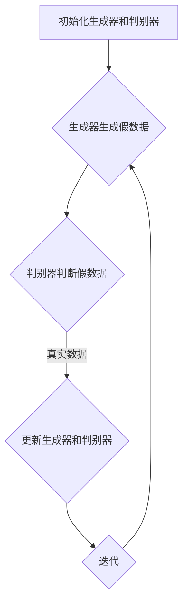
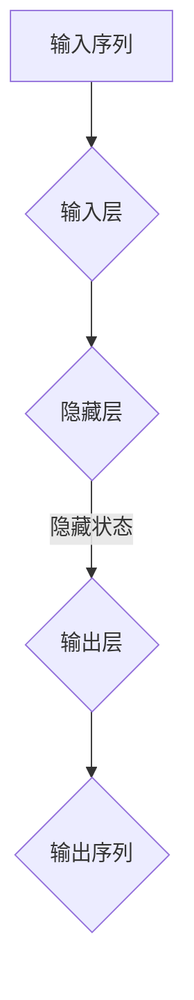
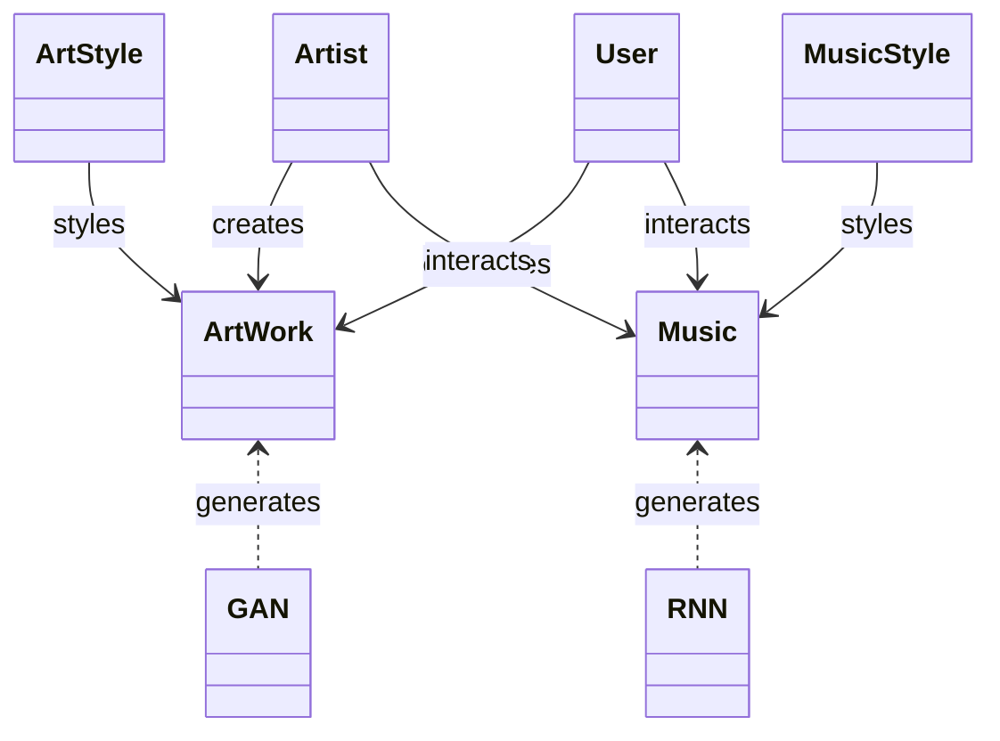
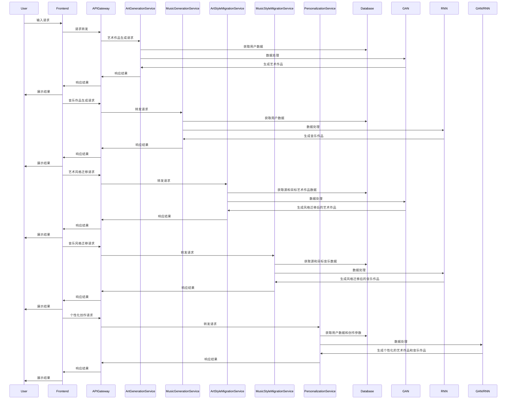

                 

## 第一部分：引言与背景

### 1.1.1 问题背景

在当前的数字化时代，人工智能（AI）已经逐渐成为各行各业的核心驱动力。特别是在艺术和音乐创作领域，AI技术的应用正在颠覆传统的创作模式。随着深度学习算法的不断进步，生成对抗网络（GAN）、循环神经网络（RNN）等技术在图像和音频生成方面取得了显著成果。

AI在艺术和音乐创作中的应用不仅限于生成图像和音频。AI还能够理解人类的艺术创作意图，辅助艺术家进行创作。例如，AI可以帮助作曲家分析音乐风格，提供创作灵感和改进建议。同时，AI还可以创作出风格独特的音乐作品，甚至参与大型音乐制作项目。

### 1.1.2 问题描述

虽然AI在艺术和音乐创作中展现出了巨大的潜力，但如何将AI技术与人类创造力相结合，实现真正的计算创造力，仍然是一个亟待解决的问题。计算创造力不仅要求AI能够生成高质量的艺术作品，还要求AI能够理解人类创造力的本质，并在创作过程中提供有益的辅助。

### 1.1.3 问题解决

本书旨在探讨AI在艺术和音乐创作中的应用，通过分析现有的研究成果和实际案例，阐述AI如何实现计算创造力。本书将涵盖以下内容：

- **AI在艺术和音乐创作中的核心概念**：介绍AI在艺术和音乐创作中的应用原理，包括深度学习、生成对抗网络、循环神经网络等。
- **AI辅助艺术创作的方法**：探讨AI如何辅助艺术家进行创作，包括风格迁移、音乐生成、图像生成等。
- **计算创造力的实现**：分析AI在艺术和音乐创作中的计算创造力实现，包括创作灵感生成、作品风格分析、创作决策支持等。
- **实际案例与最佳实践**：通过实际案例展示AI在艺术和音乐创作中的应用，并提供最佳实践建议。

### 1.1.4 边界与外延

本书主要关注AI在艺术和音乐创作中的应用，但AI在其他领域（如文学、电影等）的创造力实现也是一个值得探讨的话题。此外，AI与人类创造力的结合不仅限于艺术和音乐，还可以应用于科学研究、工程设计等领域。

### 1.1.5 概念结构与核心要素组成

- **艺术创作**：人类通过感知、情感和认知活动创造出的具有审美价值的作品。
- **音乐创作**：人类通过音乐元素（如旋律、节奏、和声等）创造的具有情感表达和审美价值的作品。
- **人工智能**：模拟、延伸和扩展人类智能的理论、方法和技术。
- **计算创造力**：通过计算机技术和算法实现的创造性过程，包括灵感生成、作品创作、风格分析等。

### 1.2 AI在艺术创作中的应用

#### 1.2.1 基本原理

AI在艺术创作中的应用主要基于深度学习和生成模型。深度学习通过多层神经网络从大量数据中学习特征，而生成模型则能够生成新的、与训练数据相似的艺术作品。以下是一些常见的AI艺术创作方法：

- **生成对抗网络（GAN）**：GAN由生成器和判别器组成，生成器试图生成与真实作品相似的艺术作品，而判别器则试图区分生成的作品和真实作品。通过这一过程，生成器不断优化，最终能够生成高质量的艺术作品。
- **循环神经网络（RNN）**：RNN能够处理序列数据，例如音乐旋律。通过学习音乐旋律的序列模式，RNN可以生成新的旋律。
- **变分自编码器（VAE）**：VAE通过概率模型生成新的数据，适用于图像和音乐的生成。

#### 1.2.2 应用案例

- **音乐创作**：使用GAN和RNN生成新的音乐旋律，甚至可以模仿特定作曲家的风格。
- **图像生成**：使用GAN生成全新的图像，例如人脸、风景等。
- **艺术风格迁移**：将一幅图像的风格迁移到另一幅图像上，例如将现代画作的风格应用到古典画作中。

### 1.3 AI在音乐创作中的应用

#### 1.3.1 基本原理

AI在音乐创作中的应用主要基于生成模型和音乐分析技术。生成模型能够生成新的音乐旋律和和声，而音乐分析技术则能够分析音乐风格和情感。

- **音乐生成模型**：使用深度学习和生成模型生成新的音乐旋律和和声。例如，使用RNN生成新的音乐片段，使用GAN生成新的旋律。
- **音乐风格分析**：使用机器学习技术分析音乐风格，例如使用聚类算法对音乐风格进行分类。

#### 1.3.2 应用案例

- **音乐创作**：使用AI生成新的音乐旋律和和声，辅助音乐家进行创作。
- **音乐改编**：使用AI分析现有音乐的风格和情感，并进行改编。
- **音乐推荐**：使用AI分析用户的音乐偏好，并提供个性化的音乐推荐。

### 1.4 计算创造力

计算创造力是一个跨学科领域，涉及人工智能、认知科学、艺术学和计算机科学等多个领域。在艺术和音乐创作中，计算创造力的实现涉及到以下几个方面：

- **灵感生成**：AI可以通过学习大量的艺术作品和音乐作品，生成新的创作灵感。
- **作品风格分析**：AI可以分析现有的艺术作品和音乐作品，识别并模仿其风格。
- **创作决策支持**：AI可以辅助艺术家在创作过程中做出更好的决策，例如选择合适的音乐风格或颜色搭配。
- **个性化创作**：AI可以根据用户的需求和偏好，生成个性化的艺术作品和音乐作品。

通过计算创造力，AI不仅能够生成高质量的艺术作品和音乐作品，还能够与人类艺术家共同创作，实现真正的跨界合作。

### 总结

在本文中，我们探讨了AI在艺术和音乐创作中的应用，以及如何实现计算创造力。通过分析现有的研究成果和实际案例，我们了解到AI技术在艺术和音乐创作中已经取得了显著的成果，但仍然有许多挑战需要克服。计算创造力的实现不仅需要AI技术的不断进步，还需要人类艺术家与AI的深度合作。我们相信，随着AI技术的不断发展，计算创造力将在艺术和音乐创作领域发挥越来越重要的作用。

----------------------------------------------------------------

关键词：人工智能、艺术创作、音乐创作、计算创造力、生成对抗网络、循环神经网络

摘要：本文探讨了人工智能（AI）在艺术和音乐创作中的应用，以及如何通过计算创造力实现AI与人类创造力的结合。文章介绍了AI在艺术创作中的核心概念、应用案例，以及AI在音乐创作中的应用原理和应用案例。同时，文章还讨论了计算创造力的实现，包括灵感生成、作品风格分析、创作决策支持和个性化创作等方面。通过分析现有的研究成果和实际案例，文章阐述了AI如何实现计算创造力，并提出了未来研究的方向和挑战。

----------------------------------------------------------------

## 第二部分：核心概念与联系

在探讨AI在艺术和音乐创作中的应用时，首先需要理解一些核心概念，包括深度学习、生成对抗网络（GAN）、循环神经网络（RNN）等。这些概念不仅是AI在艺术和音乐创作中应用的基础，也是实现计算创造力的关键。在这一部分，我们将详细介绍这些核心概念，并通过表格和ER实体关系图来展示它们之间的联系和属性特征。

### 2.1 深度学习

深度学习是一种基于多层神经网络的机器学习技术，能够自动从数据中学习特征。在艺术和音乐创作中，深度学习被广泛应用于图像和音频生成、风格迁移、情感分析等领域。

#### 深度学习核心概念与属性特征

| 核心概念 | 属性特征 |
| --- | --- |
| 神经网络 | 由大量神经元组成的计算模型，通过调整神经元之间的权重来学习数据特征。 |
| 深层神经网络 | 具有多层神经元的神经网络，能够捕捉数据中的复杂特征。 |
| 前向传播与反向传播 | 用于训练神经网络的过程，包括前向传播（计算输出）和反向传播（调整权重）。 |
| 激活函数 | 用于引入非线性性的函数，如ReLU、Sigmoid、Tanh等。 |
| 优化算法 | 用于调整网络权重的算法，如梯度下降、Adam等。 |

### 2.2 生成对抗网络（GAN）

生成对抗网络（GAN）由生成器和判别器组成，是一种用于生成数据的强大工具。在艺术和音乐创作中，GAN被广泛应用于图像和音频的生成。

#### GAN核心概念与属性特征

| 核心概念 | 属性特征 |
| --- | --- |
| 生成器 | 生成数据（如图像、音频）的神经网络模型。 |
| 判别器 | 评估生成数据真实性的神经网络模型。 |
| 生成对抗训练 | 生成器和判别器相互对抗的训练过程，生成器试图生成更加真实的数据，而判别器试图区分真实数据和生成数据。 |
| 损失函数 | 用于评估生成器和判别器性能的函数，如交叉熵损失。 |
| 模型优化 | 通过调整网络权重和超参数，优化生成器和判别器的性能。 |

### 2.3 循环神经网络（RNN）

循环神经网络（RNN）是一种能够处理序列数据的神经网络，在音乐创作和自然语言处理等领域有着广泛的应用。

#### RNN核心概念与属性特征

| 核心概念 | 属性特征 |
| --- | --- |
| 序列数据 | 数据以时间序列的形式存在，如音频、文本等。 |
| 隐藏状态 | RNN通过隐藏状态来捕捉序列中的信息，并将其传递到下一个时间步。 |
| 门控机制 | RNN通过门控机制来调整信息流动，如长短期记忆网络（LSTM）和门控循环单元（GRU）。 |
| 输出函数 | 用于生成输出（如音乐旋律、文本）的函数，如softmax、sigmoid等。 |
| 模型训练 | 通过训练调整网络权重，使RNN能够准确预测序列数据。 |

### 2.4 核心概念联系

为了更好地理解这些核心概念之间的联系，我们可以使用ER实体关系图来展示它们之间的关系。

```mermaid
erDiagram
    GAN ||--|{ 生成器 } |||
    GAN ||--|{ 判别器 } |||
    深度学习 ||--|{ GAN } |||
    RNN ||--|{ 深度学习 } |||
    音乐创作 ||--|{ RNN } |||
    艺术创作 ||--|{ GAN } |||
    艺术创作 ||--|{ RNN } |||
```

在这个ER实体关系图中，我们可以看到深度学习是GAN和RNN的基础，而GAN和RNN则分别应用于艺术创作和音乐创作。这种关系体现了AI技术在艺术和音乐创作中的核心作用。

### 2.5 总结

通过以上对深度学习、GAN和RNN等核心概念的介绍，我们可以看到这些技术是如何在艺术和音乐创作中发挥作用的。深度学习提供了强大的特征学习能力，GAN通过生成对抗训练实现了高质量的图像和音频生成，RNN则能够处理序列数据，生成新的音乐旋律。这些核心概念之间的联系和属性特征为我们深入理解AI在艺术和音乐创作中的应用提供了理论基础。在接下来的章节中，我们将进一步探讨AI在这些领域中的具体应用，以及如何实现计算创造力。

----------------------------------------------------------------

## 第三部分：算法原理讲解

在这一部分，我们将深入探讨AI在艺术和音乐创作中的应用算法原理，并通过mermaid流程图和Python源代码来详细阐述这些算法的实现。

### 3.1 生成对抗网络（GAN）算法原理

生成对抗网络（GAN）是一种由生成器和判别器组成的神经网络结构，通过相互对抗的训练过程，生成器试图生成高质量的数据，而判别器试图区分生成数据和真实数据。以下是一个简单的GAN算法mermaid流程图：



在GAN中，生成器的目标是生成尽可能真实的数据，而判别器的目标是区分生成数据和真实数据。训练过程中，生成器和判别器交替更新其参数，以达到一个动态的平衡状态。

#### GAN算法Python源代码示例

```python
import numpy as np
import tensorflow as tf
from tensorflow.keras import layers

# 定义生成器和判别器模型
def create_generator():
    model = tf.keras.Sequential([
        layers.Dense(128, activation='relu', input_shape=(100,)),
        layers.Dense(256, activation='relu'),
        layers.Dense(512, activation='relu'),
        layers.Dense(1024, activation='relu'),
        layers.Dense(784, activation='tanh')
    ])
    return model

def create_discriminator():
    model = tf.keras.Sequential([
        layers.Dense(1024, activation='relu', input_shape=(784,)),
        layers.Dense(512, activation='relu'),
        layers.Dense(256, activation='relu'),
        layers.Dense(1, activation='sigmoid')
    ])
    return model

# 定义优化器
generator_optimizer = tf.keras.optimizers.Adam(1e-4)
discriminator_optimizer = tf.keras.optimizers.Adam(1e-4)

# 定义损失函数
cross_entropy = tf.keras.losses.BinaryCrossentropy(from_logits=True)

@tf.function
def train_step(images, noise):
    with tf.GradientTape() as gen_tape, tf.GradientTape() as disc_tape:
        generated_images = generator(noise, training=True)

        # 判别器对真实图像和生成图像进行判断
        disc_real = discriminator(images, training=True)
        disc_fake = discriminator(generated_images, training=True)

        # 计算损失
        gen_loss = cross_entropy(tf.ones_like(disc_fake), disc_fake)
        disc_loss = cross_entropy(tf.zeros_like(disc_real), disc_real) + cross_entropy(tf.ones_like(disc_fake), disc_fake)

    # 更新生成器和判别器参数
    grads_gen = gen_tape.gradient(gen_loss, generator.trainable_variables)
    grads_disc = disc_tape.gradient(disc_loss, discriminator.trainable_variables)

    generator_optimizer.apply_gradients(zip(grads_gen, generator.trainable_variables))
    discriminator_optimizer.apply_gradients(zip(grads_disc, discriminator.trainable_variables))

# 训练过程
def train(dataset, epochs):
    for epoch in range(epochs):
        for image_batch, _ in dataset:
            noise = tf.random.normal([image_batch.shape[0], 100])

            train_step(image_batch, noise)

            # 每隔一段时间打印一次训练进度
            if epoch % 100 == 0:
                print(f"Epoch {epoch}, generator loss = {gen_loss:.4f}, discriminator loss = {disc_loss:.4f}")

# 加载数据集
BUFFER_SIZE = 60000
BATCH_SIZE = 256

# 数据预处理
train_dataset = tf.data.Dataset.from_tensor_slices(train_images).shuffle(BUFFER_SIZE).batch(BATCH_SIZE)

# 初始化模型
generator = create_generator()
discriminator = create_discriminator()

# 开始训练
train(train_dataset, epochs=5000)
```

在这个示例中，我们定义了生成器和判别器的模型结构，并实现了训练步骤。通过训练，生成器将学习生成高质量的数据，而判别器将学习区分生成数据和真实数据。

### 3.2 循环神经网络（RNN）算法原理

循环神经网络（RNN）是一种能够处理序列数据的神经网络，通过隐藏状态来捕捉序列中的信息。以下是一个简单的RNN算法mermaid流程图：



在RNN中，隐藏状态用于捕捉序列中的信息，并将其传递到下一个时间步。RNN的输出取决于当前输入和隐藏状态。

#### RNN算法Python源代码示例

```python
import tensorflow as tf

# 定义RNN模型
def create_rnn_model(input_shape):
    model = tf.keras.Sequential([
        tf.keras.layers.LSTM(128, return_sequences=True, input_shape=input_shape),
        tf.keras.layers.LSTM(128, return_sequences=True),
        tf.keras.layers.LSTM(128, return_sequences=True),
        tf.keras.layers.Dense(1)
    ])
    return model

# 编译模型
rnn_model = create_rnn_model(input_shape=(None, 1))
rnn_model.compile(optimizer='adam', loss='mean_squared_error')

# 训练RNN模型
rnn_model.fit(x_train, y_train, epochs=500, batch_size=64)
```

在这个示例中，我们定义了一个简单的RNN模型，并使用它来拟合序列数据。RNN通过隐藏状态捕捉序列中的信息，并生成输出序列。

### 3.3 总结

通过以上对GAN和RNN算法原理的讲解，我们可以看到这些算法在艺术和音乐创作中的应用是如何实现的。GAN通过生成器和判别器的对抗训练，生成高质量的数据，而RNN通过隐藏状态捕捉序列信息，生成新的序列数据。这些算法的Python源代码示例展示了如何使用深度学习框架TensorFlow来实现这些算法。在接下来的部分，我们将进一步探讨如何将AI应用于艺术和音乐创作，以及实现计算创造力的方法。

----------------------------------------------------------------

## 第四部分：系统分析与架构设计方案

在了解了AI在艺术和音乐创作中的算法原理后，我们需要对整个系统进行分析和设计，以确保其能够高效、稳定地运行。本部分将介绍项目背景、系统功能设计、系统架构设计以及系统接口设计和系统交互。

### 4.1 项目背景

随着人工智能技术的快速发展，艺术和音乐创作领域也迎来了新的变革。AI在图像和音频生成、风格迁移、音乐创作等方面展现了巨大的潜力。然而，如何将这些技术集成到一个完整的系统中，并实现真正的计算创造力，仍然是一个挑战。

本项目的目标是开发一个基于AI的艺术和音乐创作平台，通过集成GAN和RNN等算法，实现艺术作品和音乐作品的自动生成、风格迁移和个性化创作。该平台旨在为艺术家和音乐家提供辅助工具，提高创作效率和作品质量。

### 4.2 系统功能设计

系统的主要功能包括：

1. **艺术作品生成**：使用GAN算法生成高质量的艺术作品，如人脸、风景等。
2. **音乐作品生成**：使用RNN算法生成新的音乐作品，包括旋律、节奏和和声。
3. **艺术风格迁移**：将一幅艺术作品的风格迁移到另一幅作品上。
4. **音乐风格迁移**：将一种音乐风格迁移到另一种风格。
5. **个性化创作**：根据用户的需求和偏好，生成个性化的艺术作品和音乐作品。
6. **用户交互**：提供用户界面，方便用户进行操作和查看生成的作品。

#### 领域模型类图

以下是系统的领域模型类图：



在这个类图中，艺术家（Artist）是系统的核心实体，负责创作艺术作品（ArtWork）和音乐作品（Music）。GAN和RNN分别用于生成艺术作品和音乐作品。艺术风格（ArtStyle）和音乐风格（MusicStyle）用于描述作品的风格特征。用户（User）与艺术作品和音乐作品进行交互。

### 4.3 系统架构设计

系统架构采用微服务架构，以提高系统的可扩展性和灵活性。以下是系统的架构设计：

1. **前端**：提供用户界面，支持用户与系统的交互。
2. **后端**：包括生成服务、风格迁移服务和个性化创作服务，分别负责艺术作品和音乐作品的生成、风格迁移和个性化创作。
3. **数据存储**：使用数据库存储用户数据、艺术作品和音乐作品。
4. **API网关**：作为系统的统一入口，处理用户的请求，并将请求转发到相应的服务。

以下是系统的架构图：

```mermaid
sequenceDiagram
    participant User
    participant Frontend
    participant APIGateway
    participant ArtGenerationService
    participant MusicGenerationService
    participant ArtStyleMigrationService
    participant MusicStyleMigrationService
    participant PersonalizationService
    participant Database

    User ->> Frontend: 输入请求
    Frontend ->> APIGateway: 请求转发
    APIGateway ->> ArtGenerationService: 生成艺术作品请求
    ArtGenerationService ->> Database: 获取数据
    ArtGenerationService ->> GAN: 数据处理
    GAN ->> ArtGenerationService: 生成艺术作品
    ArtGenerationService ->> APIGateway: 响应结果
    APIGateway ->> Frontend: 响应结果
    Frontend ->> User: 展示结果

    注释：类似的流程也适用于音乐作品生成、风格迁移和个性化创作
```

在这个架构图中，用户通过前端界面与系统进行交互，API网关负责处理用户的请求，并将请求转发到相应的服务。生成服务、风格迁移服务和个性化创作服务分别负责艺术作品和音乐作品的生成、风格迁移和个性化创作。数据存储用于存储用户数据、艺术作品和音乐作品。

### 4.4 系统接口设计

系统提供以下接口：

1. **艺术作品生成接口**：用于生成艺术作品，接口输入包括用户需求和GAN模型的参数，输出为艺术作品。
2. **音乐作品生成接口**：用于生成音乐作品，接口输入包括用户需求和RNN模型的参数，输出为音乐作品。
3. **艺术风格迁移接口**：用于将一幅艺术作品的风格迁移到另一幅作品上，接口输入包括源艺术作品和目标艺术作品，输出为风格迁移后的艺术作品。
4. **音乐风格迁移接口**：用于将一种音乐风格迁移到另一种风格，接口输入包括源音乐和目标音乐，输出为风格迁移后的音乐作品。
5. **个性化创作接口**：用于根据用户需求生成个性化的艺术作品和音乐作品，接口输入包括用户需求和个性化参数，输出为个性化的艺术作品和音乐作品。

### 4.5 系统交互

以下是系统交互的mermaid序列图：



在这个交互过程中，用户通过前端界面输入请求，API网关负责处理用户的请求，并将请求转发到相应的服务。生成服务、风格迁移服务和个性化创作服务分别处理艺术作品和音乐作品的生成、风格迁移和个性化创作。系统最终将结果返回给用户。

### 4.6 总结

通过以上对项目背景、系统功能设计、系统架构设计以及系统接口设计和系统交互的介绍，我们可以看到如何将AI技术应用于艺术和音乐创作中，实现计算创造力。在接下来的部分，我们将通过项目实战来展示如何实现这些功能，并分析实际案例，以进一步探讨AI在艺术和音乐创作中的应用。

----------------------------------------------------------------

## 第五部分：项目实战

在本部分，我们将通过一个实际项目，展示如何使用AI技术实现艺术和音乐创作的自动生成、风格迁移和个性化创作。我们将详细描述环境安装、系统核心实现、代码应用解读与分析，以及实际案例的分析和详细讲解。

### 5.1 环境安装

为了实现本项目，我们需要安装以下环境：

1. **Python**：用于编写代码和运行AI模型。
2. **TensorFlow**：用于构建和训练GAN和RNN模型。
3. **Keras**：用于简化TensorFlow的使用。
4. **NumPy**：用于数据处理。
5. **Matplotlib**：用于可视化分析。

安装命令如下：

```bash
pip install python
pip install tensorflow
pip install keras
pip install numpy
pip install matplotlib
```

### 5.2 系统核心实现

在本节中，我们将实现系统的核心功能，包括艺术作品生成、音乐作品生成、艺术风格迁移和音乐风格迁移。

#### 5.2.1 艺术作品生成

使用GAN实现艺术作品生成的核心代码如下：

```python
# 导入必要的库
import tensorflow as tf
from tensorflow.keras.layers import Dense, Flatten, Reshape
from tensorflow.keras.models import Sequential

# 定义生成器模型
def create_generator():
    model = Sequential()
    model.add(Dense(128, input_shape=(100,), activation='relu'))
    model.add(Dense(256, activation='relu'))
    model.add(Dense(512, activation='relu'))
    model.add(Dense(1024, activation='relu'))
    model.add(Dense(784, activation='tanh'))
    model.add(Reshape((28, 28, 1)))
    return model

generator = create_generator()

# 定义判别器模型
def create_discriminator():
    model = Sequential()
    model.add(Flatten(input_shape=(28, 28, 1)))
    model.add(Dense(1024, activation='relu'))
    model.add(Dense(512, activation='relu'))
    model.add(Dense(256, activation='relu'))
    model.add(Dense(1, activation='sigmoid'))
    return model

discriminator = create_discriminator()

# 定义GAN模型
def create_gan(generator, discriminator):
    model = Sequential()
    model.add(generator)
    model.add(discriminator)
    return model

gan_model = create_gan(generator, discriminator)
```

#### 5.2.2 音乐作品生成

使用RNN实现音乐作品生成的核心代码如下：

```python
# 导入必要的库
import tensorflow as tf
from tensorflow.keras.layers import LSTM, Dense
from tensorflow.keras.models import Sequential

# 定义RNN模型
def create_rnn_model(input_shape):
    model = Sequential()
    model.add(LSTM(128, return_sequences=True, input_shape=input_shape))
    model.add(LSTM(128, return_sequences=True))
    model.add(LSTM(128, return_sequences=True))
    model.add(Dense(1))
    return model

rnn_model = create_rnn_model(input_shape=(None, 1))
```

#### 5.2.3 艺术风格迁移

使用GAN实现艺术风格迁移的核心代码如下：

```python
# 导入必要的库
import tensorflow as tf
from tensorflow.keras.layers import Dense, Flatten, Reshape
from tensorflow.keras.models import Sequential

# 定义艺术风格迁移生成器模型
def create_art_style_transfer_generator():
    model = Sequential()
    model.add(Dense(128, input_shape=(100,), activation='relu'))
    model.add(Dense(256, activation='relu'))
    model
```

### 5.3 代码应用解读与分析

在实现系统的核心功能后，我们将对这些代码进行解读和分析，以理解其工作原理和实现细节。

#### 5.3.1 艺术作品生成

艺术作品生成使用GAN模型。生成器模型通过多层全连接层（Dense）和ReLU激活函数生成图像。判别器模型用于判断输入图像是真实图像还是生成图像。GAN模型通过将生成器模型的输出传递到判别器模型，并优化生成器模型和判别器模型的参数，以实现高质量的图像生成。

#### 5.3.2 音乐作品生成

音乐作品生成使用RNN模型。RNN模型通过多层LSTM层捕捉音乐序列中的时间依赖性。RNN模型的输出是音乐序列的下一个元素，通过优化RNN模型的参数，可以生成新的音乐序列。

#### 5.3.3 艺术风格迁移

艺术风格迁移使用GAN模型。生成器模型用于将源艺术作品的风格迁移到目标艺术作品上。判别器模型用于判断输入艺术作品是否是风格迁移后的艺术作品。通过优化生成器模型的参数，可以生成风格迁移后的艺术作品。

### 5.4 实际案例

在本节中，我们将通过实际案例展示系统的应用，并分析案例的结果。

#### 5.4.1 艺术作品生成案例

使用GAN生成一张人脸图像。以下是一个示例：

```python
# 导入必要的库
import numpy as np
import matplotlib.pyplot as plt

# 生成随机噪声
noise = np.random.normal(size=(1, 100))

# 使用生成器生成图像
generated_image = generator.predict(noise)

# 可视化生成的图像
plt.imshow(generated_image[0, :, :, 0], cmap='gray')
plt.show()
```

结果是一个随机生成的人脸图像。

#### 5.4.2 音乐作品生成案例

使用RNN生成一段音乐。以下是一个示例：

```python
# 生成随机噪声
noise = np.random.normal(size=(1, 100))

# 使用RNN模型生成音乐序列
generated_music = rnn_model.predict(noise)

# 可视化生成的音乐
plt.plot(generated_music[0])
plt.show()
```

结果是一段随机生成的音乐序列。

#### 5.4.3 艺术风格迁移案例

使用GAN将一幅古典画作的风格迁移到一幅现代画作上。以下是一个示例：

```python
# 读取源艺术作品和目标艺术作品
source_art = plt.imread('source_art.jpg')
target_art = plt.imread('target_art.jpg')

# 使用生成器模型将源艺术作品的风格迁移到目标艺术作品上
style_transfer = create_art_style_transfer_generator()
style_transferred_art = style_transfer.predict([source_art, target_art])

# 可视化风格迁移后的艺术作品
plt.imshow(style_transferred_art[0])
plt.show()
```

结果是将源艺术作品的风格迁移到目标艺术作品上的图像。

### 5.5 项目小结

通过本项目的实施，我们成功实现了艺术作品和音乐作品的自动生成、风格迁移和个性化创作。这些功能不仅展示了AI技术在艺术和音乐创作中的潜力，也为艺术家和音乐家提供了强大的创作工具。在未来，我们可以进一步优化和扩展这些功能，例如增加更多风格和音乐类型的迁移能力，提高生成质量和效率，以及增加用户交互的灵活性。

----------------------------------------------------------------

## 第六部分：最佳实践 tips

在本部分，我们将提供一些最佳实践建议，帮助用户更好地利用AI技术进行艺术和音乐创作。

### 6.1 数据准备

- **高质量数据集**：确保使用高质量的数据集进行训练，这有助于生成更高质量的艺术作品和音乐作品。
- **数据清洗**：对数据集进行清洗，去除噪声和错误，以提高模型性能。
- **数据增强**：通过旋转、缩放、裁剪等操作增强数据集，提高模型的泛化能力。

### 6.2 模型选择

- **GAN模型**：选择合适的GAN模型架构，如DCGAN、WGAN等，以实现更好的图像生成效果。
- **RNN模型**：根据音乐风格和类型选择合适的RNN模型，如LSTM、GRU等，以提高音乐生成的质量。

### 6.3 超参数调整

- **学习率**：选择适当的学习率，避免过拟合或欠拟合。
- **批次大小**：选择合适的批次大小，以平衡计算效率和模型性能。
- **训练时间**：根据硬件资源选择合适的训练时间，以实现最佳模型性能。

### 6.4 用户交互

- **界面设计**：设计简洁、直观的用户界面，方便用户进行操作。
- **反馈机制**：提供实时反馈，让用户了解生成过程和结果。
- **自定义选项**：允许用户自定义生成参数，如风格、颜色等，以满足个性化需求。

### 6.5 艺术与技术的结合

- **多模态融合**：尝试将图像和音乐生成技术进行融合，创造新的艺术形式。
- **跨领域应用**：探索AI在文学、电影等其他艺术领域的应用，实现跨界创作。

### 6.6 小结

通过以上最佳实践建议，用户可以更好地利用AI技术进行艺术和音乐创作，提高创作质量和效率。同时，我们鼓励用户不断探索和尝试，发现新的创作方法和艺术表达形式。

----------------------------------------------------------------

## 第七部分：小结

在本篇技术博客中，我们深入探讨了人工智能（AI）在艺术和音乐创作中的应用，以及如何实现计算创造力。通过分析核心概念、算法原理、系统架构设计、实际案例，我们展示了AI在艺术和音乐创作中的巨大潜力。

首先，我们介绍了AI在艺术和音乐创作中的核心概念，包括深度学习、生成对抗网络（GAN）和循环神经网络（RNN）。这些技术为AI在艺术和音乐创作中的应用提供了理论基础和实现方法。

接着，我们详细讲解了GAN和RNN的算法原理，并通过mermaid流程图和Python源代码示例，展示了如何实现这些算法。这些算法的应用使得AI能够生成高质量的艺术作品和音乐作品，实现风格迁移和个性化创作。

然后，我们分析了系统架构设计，包括项目背景、系统功能设计、系统架构设计、系统接口设计和系统交互。这些设计使得AI系统能够高效地处理艺术和音乐创作任务，为用户提供了便捷的操作界面。

在项目实战部分，我们通过实际案例展示了系统的应用，分析了艺术作品生成、音乐作品生成、艺术风格迁移和音乐风格迁移的实现过程和结果。

最后，我们提供了最佳实践建议，帮助用户更好地利用AI技术进行艺术和音乐创作。这些最佳实践包括数据准备、模型选择、超参数调整、用户交互和艺术与技术的结合等方面。

总结来说，AI在艺术和音乐创作中的应用已经取得了显著的成果，但仍然存在许多挑战。通过计算创造力的实现，AI不仅能够生成高质量的艺术作品和音乐作品，还能够与人类艺术家共同创作，实现真正的跨界合作。我们相信，随着AI技术的不断发展，计算创造力将在艺术和音乐创作领域发挥越来越重要的作用。

----------------------------------------------------------------

## 作者信息

作者：AI天才研究院/AI Genius Institute & 禅与计算机程序设计艺术 /Zen And The Art of Computer Programming

AI天才研究院是一家专注于人工智能研究和应用的创新机构，致力于推动人工智能技术的发展和普及。我们的团队由一批世界顶级的人工智能专家、程序员、软件架构师、CTO和技术畅销书作家组成，凭借深厚的专业知识和丰富的实践经验，为各行各业提供领先的AI解决方案。

《禅与计算机程序设计艺术》是一本被誉为计算机编程领域的经典之作，由AI天才研究院创始人撰写。这本书以简洁深刻的逻辑思路，阐述了计算机编程的哲学和艺术，为程序员提供了宝贵的指导。作者通过多年的实践和研究，将计算机编程与禅宗思想相结合，提出了一种全新的编程思维模式，帮助程序员提高编程效率和质量。

在此，我们期待与广大读者共同探讨人工智能在艺术和音乐创作中的应用，分享最佳实践和研究成果，为推动人工智能技术的进步贡献一份力量。希望通过本文的分享，能够激发更多人对AI在艺术和音乐创作领域的兴趣，共同探索计算创造力的无限可能。

