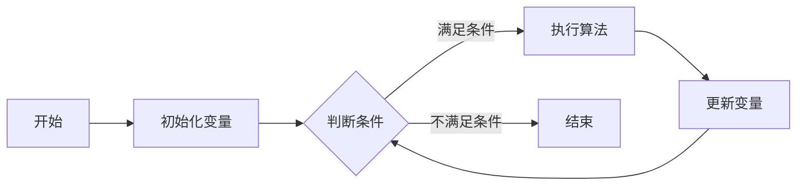
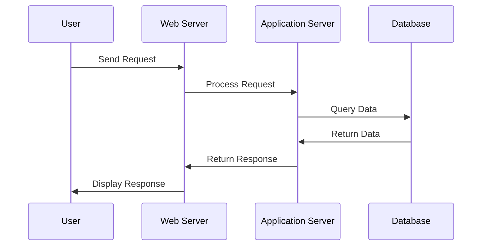
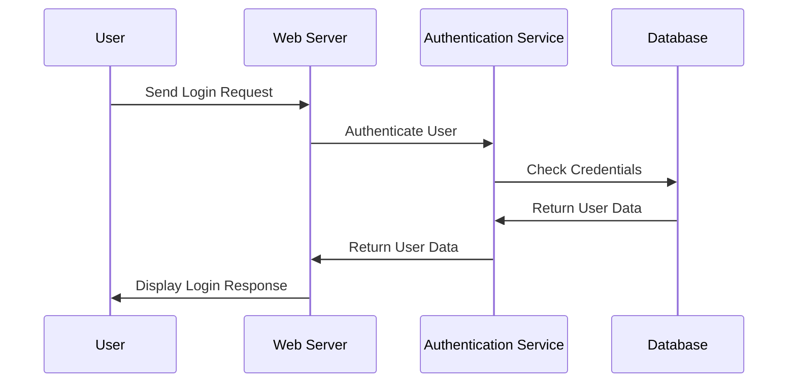

                 


# 计算复杂性理论与算法效率分析

## 关键词
计算复杂性理论、算法效率、时间复杂度、空间复杂度、P、NP问题、多项式时间算法

## 摘要
计算复杂性理论是计算机科学中一个关键领域，它关注算法在解决问题过程中所需的时间和空间资源消耗。本文将深入探讨计算复杂性理论的核心概念，如复杂性类、多项式时间算法和NP问题，并通过具体例子和数学模型来解释算法效率的重要性。此外，文章还将涵盖算法原理讲解、系统分析与架构设计、项目实战以及最佳实践，为读者提供全面的技术指南。

## 引言与背景介绍

### 问题背景
计算复杂性理论是计算机科学领域的一个重要分支，它的主要目标是研究算法在解决问题时的效率和性能。随着计算机技术的发展，算法的效率和性能变得越来越重要。一个高效的算法能够在较短的时间内解决复杂问题，这对于处理大数据、复杂系统和实时应用至关重要。

### 问题描述
计算复杂性理论关注的是算法解决问题的难度，即算法所需的时间和空间资源消耗。它为算法性能提供了一个量化的标准，帮助我们评估不同算法的相对效率。例如，一个算法可能能够在多项式时间内解决某个问题，而另一个算法可能需要指数级的时间。这种差异对于实际应用有着深远的影响。

### 问题解决
计算复杂性理论通过建立数学模型来分析和解决算法问题。它包括多个层次，从简单的P、NP问题到更复杂的复杂性类，如PSPACE、NPSPACE等。这些模型帮助我们理解算法的设计原则和效率优化策略。

### 边界与外延
计算复杂性理论不仅在理论计算机科学中占据重要地位，还对实际应用有着深远的影响。例如，在密码学中，复杂性理论帮助设计安全的加密算法；在人工智能中，它指导我们选择合适的算法来优化学习过程。计算复杂性理论为算法设计和分析提供了坚实的理论基础。

### 核心概念与联系
在计算复杂性理论中，核心概念包括复杂性类、多项式时间算法、NP问题等。这些概念相互联系，共同构成了计算复杂性理论的基本框架。

## 核心概念与联系

### 复杂性类
复杂性类是计算复杂性理论中的基本分类。常见的复杂性类包括P、NP、PSPACE、NPSPACE等。每个复杂性类都有其特定的特征和属性。

- **P类**：P类包括那些在多项式时间内可解决的问题。这意味着存在一个算法，其运行时间可以用\(O(n^k)\)（其中n是输入规模，k是一个常数）来表示。
- **NP类**：NP类包括那些可以在多项式时间内验证解的问题。也就是说，如果给出了一个解，算法可以在多项式时间内验证这个解是否正确。
- **PSPACE类**：PSPACE类包括那些在多项式空间内可解决的问题。这意味着问题的解可以在空间复杂度为\(O(n^k)\)的存储空间内找到。
- **NPSPACE类**：NPSPACE类包括那些在多项式空间内可验证解的问题。这与NP类类似，但关注的是验证解所需的空间复杂度。

### 多项式时间算法
多项式时间算法是指算法的运行时间可以用多项式表示。这种算法被认为是高效的，因为它在处理大规模问题时仍能保持可接受的时间复杂度。例如，如果一个算法的运行时间是\(O(n^2)\)，那么当输入规模增加时，运行时间会以平方的速度增长，这在某些情况下可能是可接受的。

### NP问题
NP问题是指可以在多项式时间内验证解的问题。这类问题包括许多我们在生活中遇到的问题，如旅行商问题、背包问题等。旅行商问题要求找到一个最短的路径，使得旅行者能够访问所有城市并返回起点。背包问题则是在给定一组物品和它们的重量及价值时，找出能够装入背包的最大价值组合。

### 概念属性特征对比表格
| 复杂性类 | 特征描述 | 应用场景 |
| --- | --- | --- |
| P | 可在多项式时间内解决 | 简单问题 |
| NP | 可在多项式时间内验证 | 复杂问题 |
| PSPACE | 解决问题所需的空间可用多项式表示 | 中等复杂度问题 |
| NPSPACE | 验证解所需的空间可用多项式表示 | 高复杂度问题 |

### ER实体关系图架构
下面是一个ER实体关系图的Mermaid表示：

```mermaid
erDiagram
    ALGORITHM ||--|{ COMPLEXITY_CLASS }|--|| PROBLEM
    ALGORITHM ||--|{ TIME_COMPLEXITY }|--|| PROBLEM
    ALGORITHM ||--|{ SPACE_COMPLEXITY }|--|| PROBLEM
```

## 算法原理讲解

### 算法流程图
首先，我们使用Mermaid绘制一个简单的算法流程图：



### Python源代码
接下来，我们用Python实现这个算法：

```python
def algorithm(problem):
    # 初始化变量
    variable = initialize_variable(problem)
    
    # 判断条件
    while not condition_met(variable):
        # 执行算法
        variable = execute_algorithm(problem, variable)
        
        # 更新变量
        variable = update_variable(variable)
        
    return variable

def initialize_variable(problem):
    # 初始化代码
    pass

def condition_met(variable):
    # 判断条件的代码
    pass

def execute_algorithm(problem, variable):
    # 执行算法的代码
    pass

def update_variable(variable):
    # 更新变量的代码
    pass
```

### 数学模型与公式
计算复杂性理论中的算法通常可以用时间复杂度和空间复杂度来衡量。时间复杂度表示算法在解决问题时所需的时间，通常用\(T(n)\)表示；空间复杂度表示算法在解决问题时所需的空间，通常用\(S(n)\)表示。

- **时间复杂度公式**：
  $$ T(n) = O(n^k) $$
  其中，\(n\)是输入规模，\(k\)是常数。

- **空间复杂度公式**：
  $$ S(n) = O(n^k) $$
  其中，\(n\)是输入规模，\(k\)是常数。

### 举例说明
假设我们有一个简单的排序算法，其时间复杂度为\(O(n^2)\)。这意味着当输入规模为100时，算法需要大约10000次操作。如果输入规模增加一倍变为200，算法所需操作次数将增加到40000次。这表明，随着输入规模的增加，算法的运行时间会呈指数级增长。

## 系统分析与架构设计

### 问题场景介绍
假设我们正在设计一个在线购物系统，该系统需要处理大量的商品信息、用户订单和支付流程。在这个场景中，算法的效率和性能至关重要，因为系统需要快速响应用户请求并处理大量数据。

### 项目介绍
在线购物系统项目的主要目标是提供一个稳定、高效和用户友好的购物体验。为了实现这一目标，我们需要设计一个高度可扩展和优化的系统架构。

### 系统功能设计
在线购物系统的核心功能包括用户管理、商品管理、订单管理和支付系统。以下是系统的领域模型类图：

```mermaid
classDiagram
    User <<class>>
    Product <<class>>
    Order <<class>>
    Payment <<class>>

    User o--* Order
    Product o--* Order
    Order o--* Payment
```

### 系统架构设计
在线购物系统的架构设计需要考虑以下几个方面：

- **前端架构**：使用Vue.js或React等前端框架来构建用户界面，提供良好的用户体验。
- **后端架构**：使用Spring Boot或Django等后端框架来处理业务逻辑和数据处理。
- **数据库设计**：使用MySQL或PostgreSQL等关系型数据库来存储用户数据、商品数据和订单数据。

以下是系统的架构图：



### 系统接口设计
在线购物系统需要提供多个接口，包括用户登录、商品查询、订单创建和支付等。以下是系统的接口设计：

```mermaid
classDiagram
    UserAPI <<interface>>
    ProductAPI <<interface>>
    OrderAPI <<interface>>
    PaymentAPI <<interface>>

    UserAPI +-- Login
    UserAPI +-- Logout
    ProductAPI +-- Search
    ProductAPI +-- Get Product Details
    OrderAPI +-- Create Order
    OrderAPI +-- Get Order Details
    PaymentAPI +-- Make Payment
    PaymentAPI +-- Get Payment Status
```

### 系统交互设计
在线购物系统的各个模块之间需要通过RESTful API进行交互。以下是系统的交互序列图：



## 项目实战

### 环境安装
为了进行项目实战，我们需要安装以下软件和工具：
- Java Development Kit (JDK)
- MySQL Database Server
- Spring Boot
- Maven

### 系统核心实现源代码
以下是系统的核心实现源代码：

```java
// 用户管理模块
public class UserManager {
    public User login(String username, String password) {
        // 登录逻辑
    }

    public User register(String username, String password) {
        // 注册逻辑
    }
}

// 商品管理模块
public class ProductManager {
    public Product searchProduct(String query) {
        // 搜索商品逻辑
    }

    public Product getProductDetails(int productId) {
        // 获取商品详情逻辑
    }
}

// 订单管理模块
public class OrderManager {
    public Order createOrder(User user, List<Product> products) {
        // 创建订单逻辑
    }

    public Order getOrderDetails(int orderId) {
        // 获取订单详情逻辑
    }
}

// 支付管理模块
public class PaymentManager {
    public Payment makePayment(Order order) {
        // 支付逻辑
    }

    public Payment getPaymentStatus(int paymentId) {
        // 获取支付状态逻辑
    }
}
```

### 代码应用解读与分析
以下是代码应用的具体解读与分析：

```java
// 用户管理模块
public class UserManager {
    public User login(String username, String password) {
        // 登录逻辑
        User user = authenticationService.authenticate(username, password);
        if (user != null) {
            sessionService.createSession(user);
            return user;
        }
        return null;
    }

    public User register(String username, String password) {
        // 注册逻辑
        User user = userService.createUser(username, password);
        if (user != null) {
            sessionService.createSession(user);
            return user;
        }
        return null;
    }
}
```
在这段代码中，`UserManager`类负责处理用户登录和注册逻辑。`login`方法接受用户名和密码，调用`authenticationService.authenticate`方法进行身份验证。如果验证成功，创建一个会话并返回用户对象；否则返回`null`。

```java
// 商品管理模块
public class ProductManager {
    public Product searchProduct(String query) {
        // 搜索商品逻辑
        List<Product> products = productRepository.searchByQuery(query);
        if (products.isEmpty()) {
            return null;
        }
        return products.get(0);
    }

    public Product getProductDetails(int productId) {
        // 获取商品详情逻辑
        Product product = productRepository.findById(productId);
        if (product == null) {
            return null;
        }
        return product;
    }
}
```
在这段代码中，`ProductManager`类负责处理商品搜索和获取商品详情逻辑。`searchProduct`方法接受查询字符串，调用`productRepository.searchByQuery`方法进行搜索。如果找到商品，返回第一个商品对象；否则返回`null`。`getProductDetails`方法接受商品ID，调用`productRepository.findById`方法获取商品详情。

```java
// 订单管理模块
public class OrderManager {
    public Order createOrder(User user, List<Product> products) {
        // 创建订单逻辑
        Order order = new Order();
        order.setUser(user);
        order.setProducts(products);
        orderRepository.save(order);
        return order;
    }

    public Order getOrderDetails(int orderId) {
        // 获取订单详情逻辑
        Order order = orderRepository.findById(orderId);
        if (order == null) {
            return null;
        }
        return order;
    }
}
```
在这段代码中，`OrderManager`类负责处理订单创建和获取订单详情逻辑。`createOrder`方法接受用户对象和商品列表，创建一个新的订单对象，设置用户和商品列表，并保存到数据库中。`getOrderDetails`方法接受订单ID，调用`orderRepository.findById`方法获取订单详情。

```java
// 支付管理模块
public class PaymentManager {
    public Payment makePayment(Order order) {
        // 支付逻辑
        Payment payment = new Payment();
        payment.setOrder(order);
        payment.setStatus(PaymentStatus.PENDING);
        paymentRepository.save(payment);
        return payment;
    }

    public Payment getPaymentStatus(int paymentId) {
        // 获取支付状态逻辑
        Payment payment = paymentRepository.findById(paymentId);
        if (payment == null) {
            return null;
        }
        return payment;
    }
}
```
在这段代码中，`PaymentManager`类负责处理支付逻辑和获取支付状态逻辑。`makePayment`方法接受订单对象，创建一个新的支付对象，设置订单和支付状态，并保存到数据库中。`getPaymentStatus`方法接受支付ID，调用`paymentRepository.findById`方法获取支付状态。

### 实际案例分析和详细讲解剖析
为了更深入地理解这些代码，我们来看一个实际案例。假设用户张三想要购买两件商品A和B，每件商品的价格分别是100元和200元。以下是整个购买过程的详细讲解：

1. **用户登录**：张三使用用户名和张三输入密码登录系统，成功后创建一个会话。

2. **商品搜索**：张三搜索商品A，系统返回第一个匹配的商品A对象。

3. **商品详情**：张三查看商品A的详情，确认商品A符合自己的需求。

4. **添加商品到购物车**：张三将商品A添加到购物车。

5. **继续购物**：张三继续搜索商品B，系统返回第一个匹配的商品B对象。

6. **商品详情**：张三查看商品B的详情，确认商品B符合自己的需求。

7. **添加商品到购物车**：张三将商品B添加到购物车。

8. **结算**：张三点击结算按钮，系统调用`OrderManager.createOrder`方法创建一个新的订单，将张三作为用户、商品A和B作为订单商品保存到数据库中。

9. **支付**：系统调用`PaymentManager.makePayment`方法创建一个新的支付对象，设置订单和支付状态（初始为“待支付”），并保存到数据库中。

10. **支付完成**：张三通过支付渠道完成支付，系统调用`PaymentManager.getPaymentStatus`方法获取支付状态，如果支付成功，更新支付状态为“已支付”。

11. **订单完成**：系统调用`OrderManager.updateOrderStatus`方法将订单状态更新为“已完成”，表示订单处理完成。

### 项目小结
通过这个项目实战，我们深入了解了在线购物系统的核心实现和代码逻辑。从用户登录、商品搜索、购物车管理到订单创建和支付，每个环节都至关重要。通过合理的设计和实现，我们可以构建一个高效、稳定和用户友好的在线购物系统。

## 最佳实践 Tips

1. **选择合适的算法**：在处理不同类型的问题时，选择合适的算法非常重要。了解各种算法的效率和适用场景可以帮助你做出最佳选择。

2. **优化时间复杂度和空间复杂度**：尽可能减少算法的时间复杂度和空间复杂度。通过算法优化，可以在处理大数据时保持高性能。

3. **使用缓存和索引**：在数据库查询中，使用缓存和索引可以显著提高查询速度。合理设计数据库索引可以减少查询时间。

4. **并行处理**：对于可以并行处理的问题，使用多线程或分布式计算可以提高处理速度。

5. **测试和调试**：在开发过程中，进行充分的测试和调试可以确保算法的正确性和性能。

## 小结

计算复杂性理论是计算机科学中的一个关键领域，它帮助我们理解算法的效率和性能。通过本文的深入讲解，我们了解了计算复杂性理论的核心概念、算法原理、系统分析与架构设计以及项目实战。希望本文能帮助读者更好地理解计算复杂性理论，并在实际应用中发挥其价值。

## 注意事项

1. **安全性**：在处理用户数据和支付信息时，必须确保数据的安全性。使用加密算法和安全的通信协议可以保护用户数据。

2. **可扩展性**：在设计系统时，考虑未来的扩展性，确保系统能够随着业务需求的变化而灵活调整。

3. **性能监控**：定期对系统进行性能监控和调优，以确保系统在高负载下仍能保持良好的性能。

## 拓展阅读

- 《算法导论》（Introduction to Algorithms） - Cormen, Leiserson, Rivest, and Stein
- 《编程之美》（Beautiful Code） - Andy Oram and Greg Wilson
- 《高性能MySQL》（High Performance MySQL） - Jeremy D. Zawodny, Derek J. Balling, and Peter Zaitsev

## 作者信息

作者：AI天才研究院/AI Genius Institute & 禅与计算机程序设计艺术 /Zen And The Art of Computer Programming

