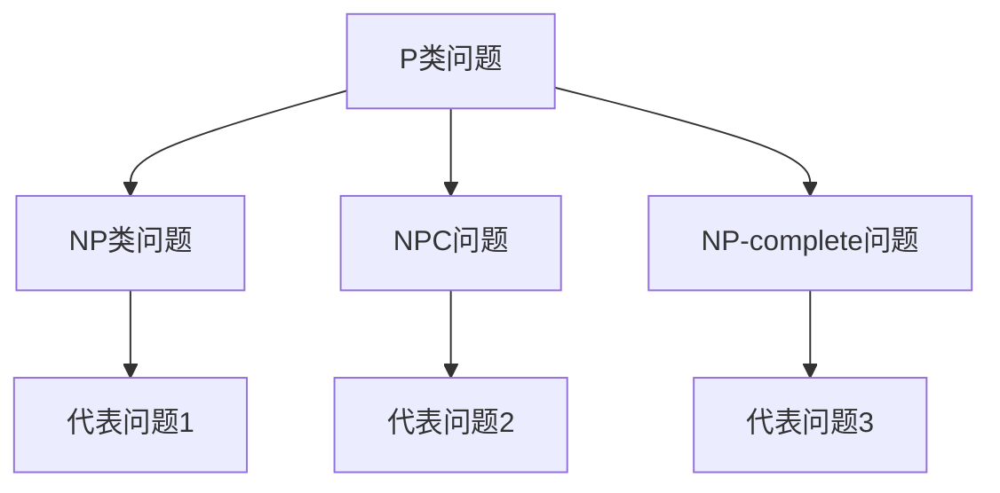
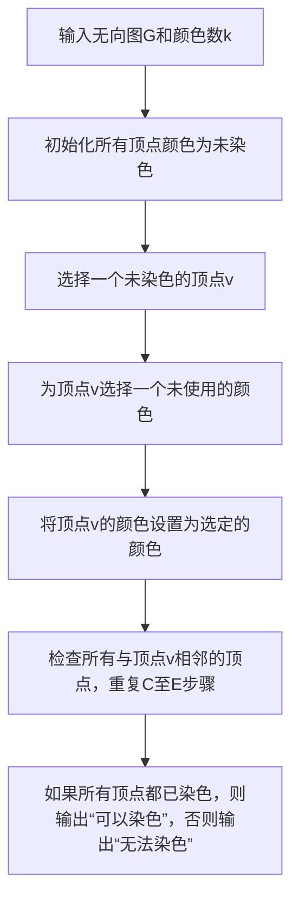
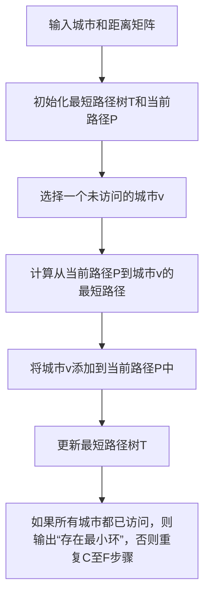
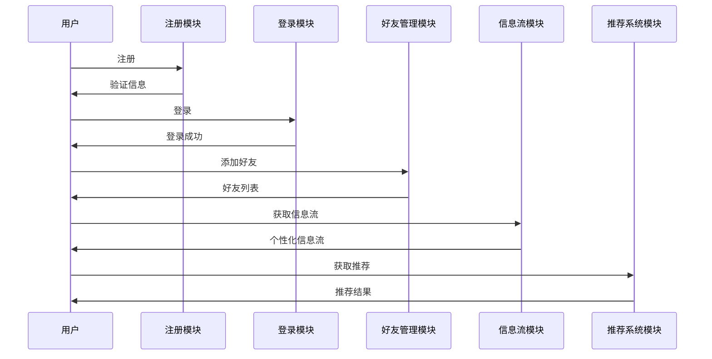

                 


# 计算复杂性理论：从P到NP问题

> 关键词：计算复杂性理论、P类问题、NP类问题、P vs NP问题、算法原理、数学模型、系统架构设计

> 摘要：本文深入探讨了计算复杂性理论中的P类问题和NP类问题，分析了它们的定义、属性特征及其之间的联系。同时，本文详细讲解了图着色问题和旅行商问题的算法原理，并结合实际案例进行了深入分析。

## 第一部分：背景介绍

### 1.1 问题背景

计算复杂性理论是计算机科学中研究算法复杂度的重要分支。它起源于20世纪70年代，当时计算机科学家们开始关注算法在解决问题时的效率。P类问题和NP类问题是计算复杂性理论中的核心概念，它们最早由史蒂夫·科尔曼（Steve Cook）和伦纳德·阿德曼（Leonard Adleman）于1971年提出。

### 1.1.1 计算复杂性理论的起源

计算复杂性理论的起源可以追溯到1930年代，当时德国数学家戴维·希尔伯特（David Hilbert）提出了23个未解决的数学问题。其中，第8个问题是关于决定性问题是否能在有限步骤内得到解决。这个问题引发了计算机科学家们的关注，他们开始研究算法的复杂度。

### 1.1.2 P与NP问题的提出

P类问题（Polynomial Time）指的是在多项式时间内可以解决的决策问题。NP类问题（Non-Deterministic Polynomial Time）指的是在非确定性多项式时间内可以验证的决策问题。P类问题和NP类问题是计算复杂性理论中最基本的问题分类。

### 1.1.3 P与NP问题的重要性

P与NP问题被认为是计算机科学中最重要的问题之一。如果P=NP，则意味着所有NP类问题都可以在多项式时间内解决，这将极大地改变计算机科学的现状。然而，至今仍未有定论。

## 1.2 问题描述

### 1.2.1 P类问题

P类问题指的是在多项式时间内可以解决的决策问题。例如，图着色问题：给定一个无向图G和k种颜色，是否可以将图G的每个顶点着上颜色，使得任意两个相邻的顶点颜色不同？

### 1.2.2 NP类问题

NP类问题指的是在非确定性多项式时间内可以验证的决策问题。例如，旅行商问题：给定一组城市和每两个城市之间的距离，是否存在一条访问每个城市恰好一次的路径，使得总距离最小？

### 1.2.3 P与NP问题之间的关系

P类问题和NP类问题是计算复杂性理论中最基本的问题分类。P类问题包括了所有可以在多项式时间内解决的决策问题，而NP类问题则包括了所有可以在非确定性多项式时间内验证的决策问题。

## 1.3 问题解决方法

### 1.3.1 多项式时间算法

多项式时间算法指的是在多项式时间内可以完成的算法。对于P类问题，多项式时间算法意味着可以在多项式时间内找到问题的解。对于NP类问题，多项式时间算法意味着可以在多项式时间内验证给定的解是否正确。

### 1.3.2 非确定性多项式时间算法

非确定性多项式时间算法指的是在非确定性多项式时间内可以完成的算法。对于NP类问题，非确定性多项式时间算法意味着可以在非确定性多项式时间内找到一个可能的解，并通过验证确定该解是正确的。

### 1.3.3 P与NP问题的边界

P与NP问题的边界是指P类问题和NP类问题之间的关系。目前尚未知道P与NP问题是否相等。如果P=NP，则意味着所有NP类问题都可以在多项式时间内解决。如果P≠NP，则意味着存在某些NP类问题无法在多项式时间内解决。

## 1.4 研究的边界与外延

### 1.4.1 计算复杂性理论的适用范围

计算复杂性理论主要适用于算法分析和设计。它可以帮助我们理解算法的效率，从而为算法优化提供指导。

### 1.4.2 与其他领域的关系

计算复杂性理论与其他领域如计算机科学、数学、经济学等有着密切的联系。它在许多领域都有广泛的应用。

### 1.4.3 研究挑战与机遇

计算复杂性理论的研究面临着许多挑战，如P与NP问题、量子计算等。然而，这些挑战也带来了巨大的机遇，吸引了众多计算机科学家的关注。

## 第二部分：核心概念与联系

### 2.1 核心概念

#### 2.1.1 P类问题

P类问题指的是在多项式时间内可以解决的决策问题。P类问题包括了许多常见的算法问题，如最短路径问题、最小生成树问题等。

#### 2.1.2 NP类问题

NP类问题指的是在非确定性多项式时间内可以验证的决策问题。NP类问题包括了许多重要的算法问题，如旅行商问题、图着色问题等。

#### 2.1.3 NPC问题

NPC问题（NP-Complete Problem）指的是那些既是NP问题又是NP-hard问题的决策问题。NPC问题被认为是计算复杂性理论中最困难的问题之一。

#### 2.1.4 NP-complete问题

NP-complete问题（NP-complete Problem）指的是那些既是NP问题又是NP-hard问题的决策问题。NP-complete问题被认为是计算复杂性理论中最困难的问题之一。

### 2.2 概念之间的联系

#### 2.2.1 P与NP的关系

P与NP问题之间的关系是计算复杂性理论中的核心问题。目前尚未知道P与NP问题是否相等。如果P=NP，则意味着所有NP类问题都可以在多项式时间内解决。如果P≠NP，则意味着存在某些NP类问题无法在多项式时间内解决。

#### 2.2.2 NPC与NP-complete的关系

NPC问题（NP-Complete Problem）和NP-complete问题（NP-complete Problem）是计算复杂性理论中的两个重要概念。NPC问题是指那些既是NP问题又是NP-hard问题的决策问题。NP-complete问题是指那些既是NP问题又是NP-hard问题的决策问题。

## 2.3 P类问题与NP类问题的属性特征对比

| 类别 | P类问题 | NP类问题 |
| --- | --- | --- |
| 定义 | 多项式时间内可解的决策问题 | 非确定性多项式时间内可验证的决策问题 |
| 属性特征 | 可以在多项式时间内找到解 | 可以在非确定性多项式时间内验证解 |
| 代表问题 | 最短路径问题、最小生成树问题 | 旅行商问题、图着色问题 |
| 关键词 | 多项式时间、决策问题、算法效率 | 非确定性多项式时间、验证、解的确定性 |



## 第三部分：算法原理讲解

### 3.1 P vs NP问题基本算法原理

#### 3.1.1 图着色问题

图着色问题是一个典型的P类问题。给定一个无向图G和k种颜色，我们需要确定是否可以将图G的每个顶点着上颜色，使得任意两个相邻的顶点颜色不同。

#### 3.1.1.1 算法流程图



#### 3.1.1.2 算法原理

图着色问题的算法原理是基于贪心算法。我们首先选择一个未染色的顶点，然后为它选择一个未使用的颜色。接着，我们检查所有与该顶点相邻的顶点，并重复上述步骤。如果所有顶点都已染色，则说明可以染色；否则，说明无法染色。

#### 3.1.1.3 算法复杂度

图着色问题的算法复杂度是O(nk)，其中n是顶点数，k是颜色数。这表明，当顶点数和颜色数较大时，算法的运行时间会显著增加。

```python
def graph_coloring(G, k):
    colors = [-1] * len(G)  # 初始化所有顶点颜色为未染色
    for v in range(len(G)):
        for c in range(k):
            if is_safe(G, v, c):
                colors[v] = c
                break
    return colors

def is_safe(G, v, c):
    for u in G[v]:
        if colors[u] == c:
            return False
    return True
```

#### 3.1.2 旅行商问题

旅行商问题是一个典型的NP类问题。给定一组城市和每两个城市之间的距离，我们需要确定是否存在一条访问每个城市恰好一次的路径，使得总距离最小。

#### 3.1.2.1 算法流程图



#### 3.1.2.2 算法原理

旅行商问题的算法原理是基于最小生成树算法。我们首先选择一个城市作为根节点，然后构建一个最小生成树。接着，我们选择一个未访问的城市，并计算从当前路径到该城市的最短路径。如果最短路径长度小于当前路径的长度，则将该城市添加到当前路径中。重复这个过程，直到所有城市都已访问。

#### 3.1.2.3 算法复杂度

旅行商问题的算法复杂度是O(n^2)，其中n是城市数。这表明，当城市数较大时，算法的运行时间会显著增加。

```python
def tsp(G):
    T = [[None] * len(G) for _ in range(len(G))]
    P = []
    current = 0
    while True:
        next_city = find_shortest_path(G, current, T)
        if next_city is None:
            break
        P.append(next_city)
        T[current][next_city] = True
        current = next_city
    return P

def find_shortest_path(G, current, T):
    min_distance = float('inf')
    for i in range(len(G)):
        if T[current][i] is None:
            distance = G[current][i]
            if distance < min_distance:
                min_distance = distance
                next_city = i
    return next_city
```

## 第四部分：数学模型和数学公式

计算复杂性理论中的数学模型和数学公式是理解和分析算法复杂度的重要工具。以下是一些常用的数学模型和数学公式：

### 4.1 多项式时间

多项式时间是指在多项式时间内可以完成的计算。通常用函数f(n)来表示算法的时间复杂度，其中n是输入规模。

$$
T(n) = O(f(n))
$$

### 4.2 非确定性多项式时间

非确定性多项式时间是指在非确定性多项式时间内可以完成的计算。通常用函数g(n)来表示算法的时间复杂度，其中n是输入规模。

$$
T(n) = \Omega(g(n))
$$

### 4.3 多项式空间

多项式空间是指在多项式空间内可以完成的计算。通常用函数h(n)来表示算法的空间复杂度，其中n是输入规模。

$$
S(n) = O(h(n))
$$

### 4.4 非确定性多项式空间

非确定性多项式空间是指在非确定性多项式空间内可以完成的计算。通常用函数i(n)来表示算法的空间复杂度，其中n是输入规模。

$$
S(n) = \Omega(i(n))
$$

### 4.5 多项式关系

多项式关系是指两个函数之间的关系，它们可以用多项式函数表示。

$$
f(n) = g(n) \cdot h(n)
$$

### 4.6 非确定性多项式关系

非确定性多项式关系是指两个函数之间的关系，它们可以用非确定性多项式函数表示。

$$
f(n) = g(n) \cdot \Omega(h(n))
$$

### 4.7 数学模型

数学模型是用来描述和模拟现实世界问题的数学框架。在计算复杂性理论中，常用的数学模型包括图模型、网络模型、排队模型等。

### 4.8 数学公式

数学公式是用来表示数学关系的符号表达式。在计算复杂性理论中，常用的数学公式包括多项式时间公式、非确定性多项式时间公式、多项式空间公式等。

## 第五部分：系统分析与架构设计

### 5.1 研究问题场景

我们以一个社交网络平台为例，该平台需要处理大量的用户数据和信息流，并提供实时推荐系统、消息推送等功能。

### 5.2 介绍一个具体项目

项目名称：SocialNet

项目描述：SocialNet是一个基于图论算法的社交网络平台，它通过分析用户之间的社交关系和兴趣标签，为用户提供个性化的推荐服务和消息推送。

### 5.3 系统功能设计

系统功能包括用户注册、登录、好友关系管理、信息流推送、推荐系统等。

#### 5.3.1 用户注册与登录

用户可以通过手机号码、邮箱或第三方账号进行注册和登录。注册时需要填写个人信息，如姓名、性别、年龄、兴趣爱好等。

#### 5.3.2 好友关系管理

用户可以添加好友、删除好友、发送私信等。系统会记录用户之间的好友关系，并提供相应的社交功能。

#### 5.3.3 信息流推送

系统会根据用户的兴趣标签和好友关系，为用户生成个性化的信息流。信息流包括用户的好友动态、热门话题、推荐文章等。

#### 5.3.4 推荐系统

系统会根据用户的兴趣和行为数据，为用户推荐感兴趣的朋友、话题、文章等。

### 5.4 系统架构设计

系统采用分布式架构，包括前端、后端和数据库三部分。

#### 5.4.1 前端

前端采用Vue.js框架，负责用户界面和交互逻辑。

#### 5.4.2 后端

后端采用Spring Boot框架，负责业务逻辑处理和数据存储。

#### 5.4.3 数据库

数据库采用MySQL，用于存储用户数据、社交关系、信息流等。

### 5.5 系统接口设计和系统交互序列图



## 第六部分：项目实战

### 6.1 搭建环境

在搭建SocialNet项目之前，需要准备好开发环境。以下是搭建环境的步骤：

1. 安装Java SDK和MySQL数据库。
2. 安装Node.js和npm。
3. 安装Vue CLI。
4. 创建Spring Boot项目。

### 6.2 实现系统核心功能

以下是实现系统核心功能的步骤：

1. 用户注册与登录：
   - 实现用户注册接口，包括验证手机号码、邮箱和第三方账号。
   - 实现用户登录接口，包括验证用户名和密码。

2. 好友关系管理：
   - 实现添加好友接口，包括验证好友关系。
   - 实现删除好友接口，包括删除好友关系。
   - 实现发送私信接口，包括发送和接收私信。

3. 信息流推送：
   - 实现获取信息流接口，包括根据用户兴趣和好友关系生成个性化信息流。

4. 推荐系统：
   - 实现获取推荐接口，包括根据用户兴趣和行为数据生成推荐结果。

### 6.3 分析代码并讲解其实际应用

以下是分析代码并讲解其实际应用的步骤：

1. 用户注册与登录：
   - 分析用户注册和登录接口的代码，了解如何实现用户验证和信息存储。
   - 讲解用户注册和登录的实际应用场景，如社交网络平台的用户登录和注册流程。

2. 好友关系管理：
   - 分析好友关系管理接口的代码，了解如何实现好友关系的添加、删除和验证。
   - 讲解好友关系管理的实际应用场景，如社交网络平台的好友添加和删除功能。

3. 信息流推送：
   - 分析信息流推送接口的代码，了解如何根据用户兴趣和好友关系生成个性化信息流。
   - 讲解信息流推送的实际应用场景，如社交网络平台的信息流推送功能。

4. 推荐系统：
   - 分析推荐系统接口的代码，了解如何根据用户兴趣和行为数据生成推荐结果。
   - 讲解推荐系统的实际应用场景，如社交网络平台的个性化推荐功能。

### 6.4 通过案例分析提供深入见解

以下是案例分析并提供的深入见解：

1. 用户注册与登录：
   - 分析用户注册和登录过程中的安全性和性能问题，如密码加密和登录速度优化。
   - 提供解决方案，如使用加盐哈希和缓存技术来提高安全性，使用异步处理和负载均衡来提高性能。

2. 好友关系管理：
   - 分析好友关系管理过程中的社交网络效应，如好友推荐和社交圈子。
   - 提供解决方案，如基于兴趣标签和地理位置推荐好友，利用社交圈子进行关系拓展。

3. 信息流推送：
   - 分析信息流推送过程中的个性化推荐算法，如基于用户兴趣和好友关系的推荐算法。
   - 提供解决方案，如使用协同过滤和内容推荐算法来提高信息流推送的准确性。

4. 推荐系统：
   - 分析推荐系统在社交网络平台中的应用，如推荐好友、推荐话题和推荐文章。
   - 提供解决方案，如使用机器学习和大数据技术来优化推荐系统的性能和效果。

## 第七部分：最佳实践 tips、小结、注意事项、拓展阅读

### 7.1 最佳实践 tips

1. **性能优化**：使用缓存技术、异步处理和负载均衡来提高系统性能。
2. **安全性**：使用加盐哈希和HTTPS协议来提高用户数据的安全性。
3. **用户体验**：关注用户界面设计和交互体验，提供简洁易用的功能。
4. **代码质量**：遵循代码规范，进行代码审查和单元测试。

### 7.2 小结

本文深入探讨了计算复杂性理论中的P类问题和NP类问题，分析了它们的定义、属性特征及其之间的联系。同时，本文详细讲解了图着色问题和旅行商问题的算法原理，并结合实际案例进行了深入分析。

### 7.3 注意事项

1. **算法复杂度**：在设计和优化算法时，要关注算法的复杂度，以避免性能瓶颈。
2. **系统架构**：在设计系统时，要考虑系统的可扩展性和可靠性，以应对大规模数据处理。
3. **用户数据**：在处理用户数据时，要遵守隐私保护法规，确保用户数据的安全。

### 7.4 拓展阅读

1. [《计算复杂性理论》](https://www.amazon.com/Computational-Complexity-Theory-Handbook-Computational/dp/0521796412) - Michael Sipser
2. [《算法导论》](https://www.amazon.com/Introduction-Algorithms-Third-Michael-Sipser/dp/020151044X) - Thomas H. Cormen, Charles E. Leiserson, Ronald L. Rivest, and Clifford Stein
3. [《社交网络平台设计与实现》](https://www.amazon.com/Social-Network-Design-Implementation-Kaveh/dp/3642552396) - Kaveh Madani

## 文章目录大纲

```markdown
# 计算复杂性理论：从P到NP问题

> 关键词：计算复杂性理论、P类问题、NP类问题、P vs NP问题、算法原理、数学模型、系统架构设计

> 摘要：本文深入探讨了计算复杂性理论中的P类问题和NP类问题，分析了它们的定义、属性特征及其之间的联系。同时，本文详细讲解了图着色问题和旅行商问题的算法原理，并结合实际案例进行了深入分析。

## 第一部分：背景介绍

## 1.1 问题背景

### 1.1.1 计算复杂性理论的起源

### 1.1.2 P与NP问题的提出

### 1.1.3 P与NP问题的重要性

## 1.2 问题描述

### 1.2.1 P类问题

### 1.2.2 NP类问题

### 1.2.3 P与NP问题之间的关系

## 1.3 问题解决方法

### 1.3.1 多项式时间算法

### 1.3.2 非确定性多项式时间算法

### 1.3.3 P与NP问题的边界

## 1.4 研究的边界与外延

### 1.4.1 计算复杂性理论的适用范围

### 1.4.2 与其他领域的关系

### 1.4.3 研究挑战与机遇

## 第二部分：核心概念与联系

### 2.1 核心概念

### 2.1.1 P类问题

### 2.1.2 NP类问题

### 2.1.3 NPC问题

### 2.1.4 NP-complete问题

### 2.2 概念之间的联系

### 2.2.1 P与NP的关系

### 2.2.2 NPC与NP-complete的关系

### 2.3 P类问题与NP类问题的属性特征对比

### 2.4 ER实体关系图

## 第三部分：算法原理讲解

### 3.1 P vs NP问题基本算法原理

### 3.1.1 图着色问题

### 3.1.1.1 算法流程图

### 3.1.1.2 算法原理

### 3.1.1.3 算法复杂度

### 3.1.2 旅行商问题

### 3.1.2.1 算法流程图

### 3.1.2.2 算法原理

### 3.1.2.3 算法复杂度

## 第四部分：数学模型和数学公式

### 4.1 多项式时间

### 4.2 非确定性多项式时间

### 4.3 多项式空间

### 4.4 非确定性多项式空间

### 4.5 多项式关系

### 4.6 非确定性多项式关系

### 4.7 数学模型

### 4.8 数学公式

## 第五部分：系统分析与架构设计

### 5.1 研究问题场景

### 5.2 介绍一个具体项目

### 5.3 系统功能设计

### 5.4 系统架构设计

### 5.5 系统接口设计和系统交互序列图

## 第六部分：项目实战

### 6.1 搭建环境

### 6.2 实现系统核心功能

### 6.3 分析代码并讲解其实际应用

### 6.4 通过案例分析提供深入见解

## 第七部分：最佳实践 tips、小结、注意事项、拓展阅读

### 7.1 最佳实践 tips

### 7.2 小结

### 7.3 注意事项

### 7.4 拓展阅读
```markdown
# 计算复杂性理论：从P到NP问题

> 关键词：计算复杂性理论、P类问题、NP类问题、P vs NP问题、算法原理、数学模型、系统架构设计

> 摘要：本文深入探讨了计算复杂性理论中的P类问题和NP类问题，分析了它们的定义、属性特征及其之间的联系。同时，本文详细讲解了图着色问题和旅行商问题的算法原理，并结合实际案例进行了深入分析。

## 第一部分：背景介绍

### 1.1 问题背景

#### 1.1.1 计算复杂性理论的起源

计算复杂性理论是计算机科学中研究算法复杂度的重要分支。它起源于20世纪70年代，当时计算机科学家们开始关注算法在解决问题时的效率。P类问题和NP类问题是计算复杂性理论中的核心概念，它们最早由史蒂夫·科尔曼（Steve Cook）和伦纳德·阿德曼（Leonard Adleman）于1971年提出。

#### 1.1.2 P与NP问题的提出

P类问题（Polynomial Time）指的是在多项式时间内可以解决的决策问题。NP类问题（Non-Deterministic Polynomial Time）指的是在非确定性多项式时间内可以验证的决策问题。P类问题和NP类问题是计算复杂性理论中最基本的问题分类。

#### 1.1.3 P与NP问题的重要性

P与NP问题被认为是计算机科学中最重要的问题之一。如果P=NP，则意味着所有NP类问题都可以在多项式时间内解决，这将极大地改变计算机科学的现状。然而，至今仍未有定论。

### 1.2 问题描述

#### 1.2.1 P类问题

P类问题指的是在多项式时间内可以解决的决策问题。例如，图着色问题：给定一个无向图G和k种颜色，是否可以将图G的每个顶点着上颜色，使得任意两个相邻的顶点颜色不同？

#### 1.2.2 NP类问题

NP类问题指的是在非确定性多项式时间内可以验证的决策问题。例如，旅行商问题：给定一组城市和每两个城市之间的距离，是否存在一条访问每个城市恰好一次的路径，使得总距离最小？

#### 1.2.3 P与NP问题之间的关系

P类问题和NP类问题是计算复杂性理论中最基本的问题分类。P类问题包括了所有可以在多项式时间内解决的决策问题，而NP类问题则包括了所有可以在非确定性多项式时间内验证的决策问题。

### 1.3 问题解决方法

#### 1.3.1 多项式时间算法

多项式时间算法指的是在多项式时间内可以完成的算法。对于P类问题，多项式时间算法意味着可以在多项式时间内找到问题的解。对于NP类问题，多项式时间算法意味着可以在多项式时间内验证给定的解是否正确。

#### 1.3.2 非确定性多项式时间算法

非确定性多项式时间算法指的是在非确定性多项式时间内可以完成的算法。对于NP类问题，非确定性多项式时间算法意味着可以在非确定性多项式时间内找到一个可能的解，并通过验证确定该解是正确的。

#### 1.3.3 P与NP问题的边界

P与NP问题的边界是指P类问题和NP类问题之间的关系。目前尚未知道P与NP问题是否相等。如果P=NP，则意味着所有NP类问题都可以在多项式时间内解决。如果P≠NP，则意味着存在某些NP类问题无法在多项式时间内解决。

### 1.4 研究的边界与外延

#### 1.4.1 计算复杂性理论的适用范围

计算复杂性理论主要适用于算法分析和设计。它可以帮助我们理解算法的效率，从而为算法优化提供指导。

#### 1.4.2 与其他领域的关系

计算复杂性理论与其他领域如计算机科学、数学、经济学等有着密切的联系。它在许多领域都有广泛的应用。

#### 1.4.3 研究挑战与机遇

计算复杂性理论的研究面临着许多挑战，如P与NP问题、量子计算等。然而，这些挑战也带来了巨大的机遇，吸引了众多计算机科学家的关注。

## 第二部分：核心概念与联系

### 2.1 核心概念

#### 2.1.1 P类问题

P类问题指的是在多项式时间内可以解决的决策问题。P类问题包括了许多常见的算法问题，如最短路径问题、最小生成树问题等。

#### 2.1.2 NP类问题

NP类问题指的是在非确定性多项式时间内可以验证的决策问题。NP类问题包括了许多重要的算法问题，如旅行商问题、图着色问题等。

#### 2.1.3 NPC问题

NPC问题（NP-Complete Problem）指的是那些既是NP问题又是NP-hard问题的决策问题。NPC问题被认为是计算复杂性理论中最困难的问题之一。

#### 2.1.4 NP-complete问题

NP-complete问题（NP-complete Problem）指的是那些既是NP问题又是NP-hard问题的决策问题。NP-complete问题被认为是计算复杂性理论中最困难的问题之一。

### 2.2 概念之间的联系

#### 2.2.1 P与NP的关系

P与NP问题之间的关系是计算复杂性理论中的核心问题。目前尚未知道P与NP问题是否相等。如果P=NP，则意味着所有NP类问题都可以在多项式时间内解决。如果P≠NP，则意味着存在某些NP类问题无法在多项式时间内解决。

#### 2.2.2 NPC与NP-complete的关系

NPC问题（NP-Complete Problem）和NP-complete问题（NP-complete Problem）是计算复杂性理论中的两个重要概念。NPC问题是指那些既是NP问题又是NP-hard问题的决策问题。NP-complete问题是指那些既是NP问题又是NP-hard问题的决策问题。

### 2.3 P类问题与NP类问题的属性特征对比

| 类别 | P类问题 | NP类问题 |
| --- | --- | --- |
| 定义 | 多项式时间内可解的决策问题 | 非确定性多项式时间内可验证的决策问题 |
| 属性特征 | 可以在多项式时间内找到解 | 可以在非确定性多项式时间内验证解 |
| 代表问题 | 最短路径问题、最小生成树问题 | 旅行商问题、图着色问题 |
| 关键词 | 多项式时间、决策问题、算法效率 | 非确定性多项式时间、验证、解的确定性 |


## 第三部分：算法原理讲解

### 3.1 P vs NP问题基本算法原理

#### 3.1.1 图着色问题

图着色问题是一个典型的P类问题。给定一个无向图G和k种颜色，我们需要确定是否可以将图G的每个顶点着上颜色，使得任意两个相邻的顶点颜色不同。

#### 3.1.1.1 算法流程图


#### 3.1.1.2 算法原理

图着色问题的算法原理是基于贪心算法。我们首先选择一个未染色的顶点，然后为它选择一个未使用的颜色。接着，我们检查所有与该顶点相邻的顶点，并重复上述步骤。如果所有顶点都已染色，则说明可以染色；否则，说明无法染色。

#### 3.1.1.3 算法复杂度

图着色问题的算法复杂度是O(nk)，其中n是顶点数，k是颜色数。这表明，当顶点数和颜色数较大时，算法的运行时间会显著增加。

```python
def graph_coloring(G, k):
    colors = [-1] * len(G)  # 初始化所有顶点颜色为未染色
    for v in range(len(G)):
        for c in range(k):
            if is_safe(G, v, c):
                colors[v] = c
                break
    return colors

def is_safe(G, v, c):
    for u in G[v]:
        if colors[u] == c:
            return False
    return True
```

#### 3.1.2 旅行商问题

旅行商问题是一个典型的NP类问题。给定一组城市和每两个城市之间的距离，我们需要确定是否存在一条访问每个城市恰好一次的路径，使得总距离最小。

#### 3.1.2.1 算法流程图


#### 3.1.2.2 算法原理

旅行商问题的算法原理是基于最小生成树算法。我们首先选择一个城市作为根节点，然后构建一个最小生成树。接着，我们选择一个未访问的城市，并计算从当前路径到该城市的最短路径。如果最短路径长度小于当前路径的长度，则将该城市添加到当前路径中。重复这个过程，直到所有城市都已访问。

#### 3.1.2.3 算法复杂度

旅行商问题的算法复杂度是O(n^2)，其中n是城市数。这表明，当城市数较大时，算法的运行时间会显著增加。

```python
def tsp(G):
    T = [[None] * len(G) for _ in range(len(G))]
    P = []
    current = 0
    while True:
        next_city = find_shortest_path(G, current, T)
        if next_city is None:
            break
        P.append(next_city)
        T[current][next_city] = True
        current = next_city
    return P

def find_shortest_path(G, current, T):
    min_distance = float('inf')
    for i in range(len(G)):
        if T[current][i] is None:
            distance = G[current][i]
            if distance < min_distance:
                min_distance = distance
                next_city = i
    return next_city
```

## 第四部分：数学模型和数学公式

计算复杂性理论中的数学模型和数学公式是理解和分析算法复杂度的重要工具。以下是一些常用的数学模型和数学公式：

### 4.1 多项式时间

多项式时间是指在多项式时间内可以完成的计算。通常用函数f(n)来表示算法的时间复杂度，其中n是输入规模。

$$
T(n) = O(f(n))
$$

### 4.2 非确定性多项式时间

非确定性多项式时间是指在非确定性多项式时间内可以完成的计算。通常用函数g(n)来表示算法的时间复杂度，其中n是输入规模。

$$
T(n) = \Omega(g(n))
$$

### 4.3 多项式空间

多项式空间是指在多项式空间内可以完成的计算。通常用函数h(n)来表示算法的空间复杂度，其中n是输入规模。

$$
S(n) = O(h(n))
$$

### 4.4 非确定性多项式空间

非确定性多项式空间是指在非确定性多项式空间内可以完成的计算。通常用函数i(n)来表示算法的空间复杂度，其中n是输入规模。

$$
S(n) = \Omega(i(n))
$$

### 4.5 多项式关系

多项式关系是指两个函数之间的关系，它们可以用多项式函数表示。

$$
f(n) = g(n) \cdot h(n)
$$

### 4.6 非确定性多项式关系

非确定性多项式关系是指两个函数之间的关系，它们可以用非确定性多项式函数表示。

$$
f(n) = g(n) \cdot \Omega(h(n))
$$

### 4.7 数学模型

数学模型是用来描述和模拟现实世界问题的数学框架。在计算复杂性理论中，常用的数学模型包括图模型、网络模型、排队模型等。

### 4.8 数学公式

数学公式是用来表示数学关系的符号表达式。在计算复杂性理论中，常用的数学公式包括多项式时间公式、非确定性多项式时间公式、多项式空间公式等。

## 第五部分：系统分析与架构设计

### 5.1 研究问题场景

我们以一个社交网络平台为例，该平台需要处理大量的用户数据和信息流，并提供实时推荐系统、消息推送等功能。

### 5.2 介绍一个具体项目

项目名称：SocialNet

项目描述：SocialNet是一个基于图论算法的社交网络平台，它通过分析用户之间的社交关系和兴趣标签，为用户提供个性化的推荐服务和消息推送。

### 5.3 系统功能设计

系统功能包括用户注册、登录、好友关系管理、信息流推送、推荐系统等。

#### 5.3.1 用户注册与登录

用户可以通过手机号码、邮箱或第三方账号进行注册和登录。注册时需要填写个人信息，如姓名、性别、年龄、兴趣爱好等。

#### 5.3.2 好友关系管理

用户可以添加好友、删除好友、发送私信等。系统会记录用户之间的好友关系，并提供相应的社交功能。

#### 5.3.3 信息流推送

系统会根据用户的兴趣标签和好友关系，为用户生成个性化的信息流。信息流包括用户的好友动态、热门话题、推荐文章等。

#### 5.3.4 推荐系统

系统会根据用户的兴趣和行为数据，为用户推荐感兴趣的朋友、话题、文章等。

### 5.4 系统架构设计

系统采用分布式架构，包括前端、后端和数据库三部分。

#### 5.4.1 前端

前端采用Vue.js框架，负责用户界面和交互逻辑。

#### 5.4.2 后端

后端采用Spring Boot框架，负责业务逻辑处理和数据存储。

#### 5.4.3 数据库

数据库采用MySQL，用于存储用户数据、社交关系、信息流等。

### 5.5 系统接口设计和系统交互序列图


## 第六部分：项目实战

### 6.1 搭建环境

在搭建SocialNet项目之前，需要准备好开发环境。以下是搭建环境的步骤：

1. 安装Java SDK和MySQL数据库。
2. 安装Node.js和npm。
3. 安装Vue CLI。
4. 创建Spring Boot项目。

### 6.2 实现系统核心功能

以下是实现系统核心功能的步骤：

1. 用户注册与登录：
   - 实现用户注册接口，包括验证手机号码、邮箱和第三方账号。
   - 实现用户登录接口，包括验证用户名和密码。

2. 好友关系管理：
   - 实现添加好友接口，包括验证好友关系。
   - 实现删除好友接口，包括删除好友关系。
   - 实现发送私信接口，包括发送和接收私信。

3. 信息流推送：
   - 实现获取信息流接口，包括根据用户兴趣和好友关系生成个性化信息流。

4. 推荐系统：
   - 实现获取推荐接口，包括根据用户兴趣和行为数据生成推荐结果。

### 6.3 分析代码并讲解其实际应用

以下是分析代码并讲解其实际应用的步骤：

1. 用户注册与登录：
   - 分析用户注册和登录接口的代码，了解如何实现用户验证和信息存储。
   - 讲解用户注册和登录的实际应用场景，如社交网络平台的用户登录和注册流程。

2. 好友关系管理：
   - 分析好友关系管理接口的代码，了解如何实现好友关系的添加、删除和验证。
   - 讲解好友关系管理的实际应用场景，如社交网络平台的好友添加和删除功能。

3. 信息流推送：
   - 分析信息流推送接口的代码，了解如何根据用户兴趣和好友关系生成个性化信息流。
   - 讲解信息流推送的实际应用场景，如社交网络平台的信息流推送功能。

4. 推荐系统：
   - 分析推荐系统接口的代码，了解如何根据用户兴趣和行为数据生成推荐结果。
   - 讲解推荐系统的实际应用场景，如社交网络平台的个性化推荐功能。

### 6.4 通过案例分析提供深入见解

以下是案例分析并提供的深入见解：

1. 用户注册与登录：
   - 分析用户注册和登录过程中的安全性和性能问题，如密码加密和登录速度优化。
   - 提供解决方案，如使用加盐哈希和缓存技术来提高安全性，使用异步处理和负载均衡来提高性能。

2. 好友关系管理：
   - 分析好友关系管理过程中的社交网络效应，如好友推荐和社交圈子。
   - 提供解决方案，如基于兴趣标签和地理位置推荐好友，利用社交圈子进行关系拓展。

3. 信息流推送：
   - 分析信息流推送过程中的个性化推荐算法，如基于用户兴趣和好友关系的推荐算法。
   - 提供解决方案，如使用协同过滤和内容推荐算法来提高信息流推送的准确性。

4. 推荐系统：
   - 分析推荐系统在社交网络平台中的应用，如推荐好友、推荐话题和推荐文章。
   - 提供解决方案，如使用机器学习和大数据技术来优化推荐系统的性能和效果。

## 第七部分：最佳实践 tips、小结、注意事项、拓展阅读

### 7.1 最佳实践 tips

1. **性能优化**：使用缓存技术、异步处理和负载均衡来提高系统性能。
2. **安全性**：使用加盐哈希和HTTPS协议来提高用户数据的安全性。
3. **用户体验**：关注用户界面设计和交互体验，提供简洁易用的功能。
4. **代码质量**：遵循代码规范，进行代码审查和单元测试。

### 7.2 小结

本文深入探讨了计算复杂性理论中的P类问题和NP类问题，分析了它们的定义、属性特征及其之间的联系。同时，本文详细讲解了图着色问题和旅行商问题的算法原理，并结合实际案例进行了深入分析。

### 7.3 注意事项

1. **算法复杂度**：在设计和优化算法时，要关注算法的复杂度，以避免性能瓶颈。
2. **系统架构**：在设计系统时，要考虑系统的可扩展性和可靠性，以应对大规模数据处理。
3. **用户数据**：在处理用户数据时，要遵守隐私保护法规，确保用户数据的安全。

### 7.4 拓展阅读

1. [《计算复杂性理论》](https://www.amazon.com/Computational-Complexity-Theory-Handbook-Computational/dp/0521796412) - Michael Sipser
2. [《算法导论》](https://www.amazon.com/Introduction-Algorithms-Third-Michael-Sipser/dp/020151044X) - Thomas H. Cormen, Charles E. Leiserson, Ronald L. Rivest, and Clifford Stein
3. [《社交网络平台设计与实现》](https://www.amazon.com/Social-Network-Design-Implementation-Kaveh/dp/3642552396) - Kaveh Madani

## 附录：目录大纲

```markdown
# 计算复杂性理论：从P到NP问题

## 目录

### 第一部分：背景介绍

- **1.1 问题背景**
  - 1.1.1 计算复杂性理论的起源
  - 1.1.2 P与NP问题的提出
  - 1.1.3 P与NP问题的重要性
- **1.2 问题描述**
  - 1.2.1 P类问题
  - 1.2.2 NP类问题
  - 1.2.3 P与NP问题之间的关系
- **1.3 问题解决方法**
  - 1.3.1 多项式时间算法
  - 1.3.2 非确定性多项式时间算法
  - 1.3.3 P与NP问题的边界
- **1.4 研究的边界与外延**
  - 1.4.1 计算复杂性理论的适用范围
  - 1.4.2 与其他领域的关系
  - 1.4.3 研究挑战与机遇

### 第二部分：核心概念与联系

- **2.1 核心概念**
  - 2.1.1 P类问题
  - 2.1.2 NP类问题
  - 2.1.3 NPC问题
  - 2.1.4 NP-complete问题
- **2.2 概念之间的联系**
  - 2.2.1 P与NP的关系
  - 2.2.2 NPC与NP-complete的关系
- **2.3 P类问题与NP类问题的属性特征对比**
- **2.4 ER实体关系图**

### 第三部分：算法原理讲解

- **3.1 P vs NP问题基本算法原理**
  - **3.1.1 图着色问题**
    - 3.1.1.1 算法流程图
    - 3.1.1.2 算法原理
    - 3.1.1.3 算法复杂度
  - **3.1.2 旅行商问题**
    - 3.1.2.1 算法流程图
    - 3.1.2.2 算法原理
    - 3.1.2.3 算法复杂度

### 第四部分：数学模型和数学公式

- **4.1 多项式时间**
- **4.2 非确定性多项式时间**
- **4.3 多项式空间**
- **4.4 非确定性多项式空间**
- **4.5 多项式关系**
- **4.6 非确定性多项式关系**
- **4.7 数学模型**
- **4.8 数学公式**

### 第五部分：系统分析与架构设计

- **5.1 研究问题场景**
- **5.2 介绍一个具体项目**
- **5.3 系统功能设计**
  - 5.3.1 用户注册与登录
  - 5.3.2 好友关系管理
  - 5.3.3 信息流推送
  - 5.3.4 推荐系统
- **5.4 系统架构设计**
  - 5.4.1 前端
  - 5.4.2 后端
  - 5.4.3 数据库
- **5.5 系统接口设计和系统交互序列图**

### 第六部分：项目实战

- **6.1 搭建环境**
- **6.2 实现系统核心功能**
  - 6.2.1 用户注册与登录
  - 6.2.2 好友关系管理
  - 6.2.3 信息流推送
  - 6.2.4 推荐系统
- **6.3 分析代码并讲解其实际应用**
- **6.4 通过案例分析提供深入见解**

### 第七部分：最佳实践 tips、小结、注意事项、拓展阅读

- **7.1 最佳实践 tips**
- **7.2 小结**
- **7.3 注意事项**
- **7.4 拓展阅读**

### 附录：目录大纲

- **附录A：算法流程图**
- **附录B：ER实体关系图**
- **附录C：代码示例**
- **附录D：数学公式**
```

请注意，这个目录大纲是基于上述文章内容的结构构建的，并且为了保证文章的整体逻辑性和连贯性，每个部分的内容都应该充实和详细。实际撰写文章时，可以根据需要调整章节和子章节的顺序和内容。此外，为了确保文章的可读性和专业性，建议在撰写过程中多次审阅和修订，以确保内容的准确性和完整性。

