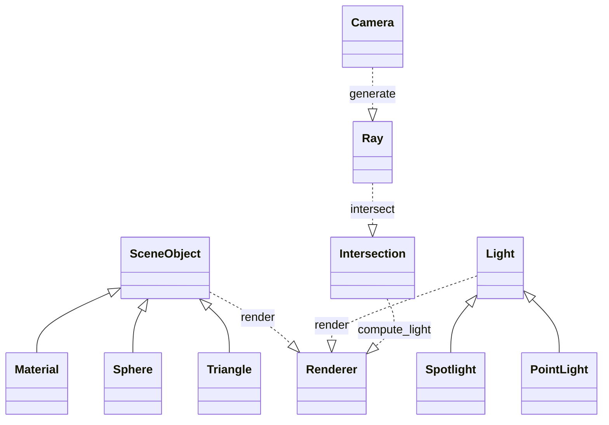
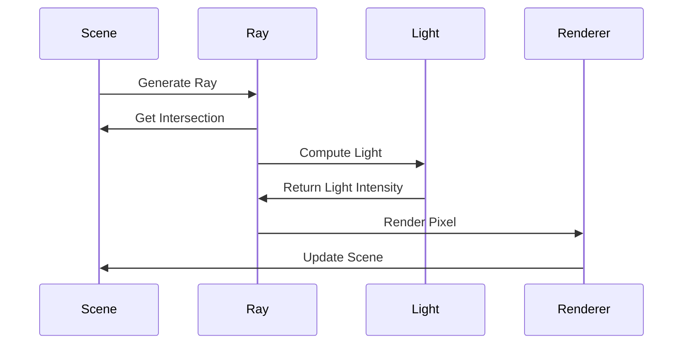

                 

### 第1章：计算机图形学中的光线追踪算法概述

#### 1.1 问题背景

计算机图形学是计算机科学与技术领域的一个重要分支，其主要目标是利用计算机生成和处理图形图像，广泛应用于游戏、电影、工业设计、医疗等多个领域。然而，传统的图形渲染方法，如光栅化（Rasterization）和着色器编程（Shader Programming），虽然在处理简单场景和实现实时渲染方面表现出色，但在处理复杂场景和高质量渲染效果时却显得力不从心。

光线追踪（Ray Tracing）算法作为一种更为逼真的渲染技术，通过模拟光线在现实世界中的传播路径来生成图像。这种方法能够准确计算光线的反射、折射、散射等复杂物理现象，从而实现更加真实和细腻的图像效果。然而，与光栅化相比，光线追踪算法在计算复杂度和渲染速度上存在显著劣势。这使得光线追踪在过去一直被视为一种高计算成本的渲染技术，难以在实时应用中得到广泛使用。

#### 1.2 光线追踪算法的重要性

随着计算机硬件性能的提升和算法优化技术的发展，光线追踪算法在计算机图形学中的应用越来越广泛。其重要性主要体现在以下几个方面：

1. **逼真度**：光线追踪算法能够模拟真实世界中光线的传播路径，生成具有高度真实感的图像。这对于电影制作、游戏开发等领域来说至关重要，能够大幅提升视觉效果和用户体验。

2. **物理准确性**：光线追踪算法基于真实物理原理，能够准确计算光线在物体表面发生的各种现象，如反射、折射、散射等。这使得光线追踪在渲染复杂场景时具有独特的优势。

3. **艺术创作**：光线追踪算法为艺术家和设计师提供了更为强大的创作工具。通过精确控制光线的传播路径和交互效果，艺术家可以创造出独特的视觉效果，实现更多的艺术创意。

4. **科学研究**：光线追踪算法在科学计算和可视化中也发挥着重要作用。例如，在医学影像处理、气象模拟等领域，光线追踪技术可以用于模拟和分析复杂的光学现象。

#### 1.3 光线追踪算法的发展历程

光线追踪算法的发展历程可以追溯到20世纪70年代。当时，计算机图形学领域的研究者们开始探讨如何通过模拟光线传播路径来生成更加真实的图像。1976年，Arthur Appel在论文《The Rendering of Surfaces by Adaptive Sampling》中首次提出了光线追踪的基本概念。

20世纪80年代，随着计算机硬件性能的提升和算法优化技术的发展，光线追踪算法逐渐成熟。然而，由于计算复杂度较高，光线追踪在实时应用中的发展相对缓慢。

进入21世纪，随着显卡性能的飞速提升和光线追踪算法的优化，光线追踪技术开始在计算机图形学领域得到广泛应用。特别是2010年后，光线追踪技术在电影制作、游戏开发等领域取得了显著成果，成为高端图形渲染的重要技术之一。

#### 1.4 本书结构

本书旨在系统介绍光线追踪算法在计算机图形学中的应用，共分为八个章节。具体章节安排如下：

1. **引言**：介绍光线追踪算法的基本概念、重要性及其发展历程。
2. **光线追踪的基本概念**：详细讲解光线追踪原理、数学基础和基本步骤。
3. **光线追踪算法的实现**：探讨光线追踪算法的实现细节，包括基础算法和进阶技术。
4. **路径追踪算法**：介绍路径追踪原理、蒙特卡洛积分和降噪技术。
5. **光线追踪在动画中的应用**：探讨光线追踪在动画中的应用，包括运动模糊和间接光照。
6. **光线追踪在游戏开发中的应用**：分析光线追踪在游戏开发中的优势、实现和挑战。
7. **光线追踪的未来趋势与挑战**：探讨光线追踪算法的硬件加速、与物理渲染的结合以及算法优化方向。
8. **案例分析**：通过具体案例展示光线追踪算法在不同领域的应用。
9. **总结与展望**：对光线追踪算法进行总结，展望其未来发展。

通过本书的阅读，读者可以全面了解光线追踪算法的基本原理和应用，掌握其实际操作技巧，并为未来的研究和发展提供有益的参考。

### 1.5 关键词与摘要

#### 关键词
- 计算机图形学
- 光线追踪算法
- 渲染技术
- 逼真度
- 物理准确性
- 动画
- 游戏
- 硬件加速
- 降噪技术

#### 摘要
本文详细介绍了计算机图形学中的光线追踪算法，包括其基本概念、发展历程和应用。从问题背景、重要性、实现技术、动画和游戏应用，到未来趋势与挑战，本书系统阐述了光线追踪算法的核心内容和未来发展方向，为读者提供了一个全面的技术视角。通过本文的阅读，读者可以深入了解光线追踪算法的原理和应用，为相关领域的研究和实践提供参考。

### 第2章：光线追踪的基本概念

#### 2.1 光线追踪原理

光线追踪算法的核心思想是通过模拟光线在场景中的传播路径，来计算场景中每个像素的颜色。具体来说，光线追踪算法从摄像机位置发出虚拟光线，与场景中的物体相交，然后根据光线的传播路径和物体表面的属性，计算出最终的颜色。这个过程可以概括为以下几个步骤：

1. **生成光线**：从摄像机位置出发，沿着视图方向生成多条光线。
2. **检测交点**：将光线与场景中的物体进行碰撞检测，找到光线的交点。
3. **计算光照**：对于每个交点，计算光线在该点的入射角度、反射率、折射率等属性，并依据物理原理计算出该点的光照强度。
4. **递归追踪**：对于发生反射或折射的光线，继续追踪其传播路径，直到达到终止条件（如光线能量衰减到一定程度或达到最大追踪深度）。
5. **合成颜色**：将所有光线路径的计算结果合成最终图像。

#### 2.2 光线追踪的数学基础

光线追踪算法的数学基础包括向量运算、几何计算和积分技术。以下是这些数学工具在光线追踪中的具体应用：

1. **向量运算**：向量是光线追踪中最为基础的计算单元，用于表示光线的方向、物体的位置和法向量等。基本的向量运算包括向量加法、向量减法、向量点积和向量叉积等。
   
   - **向量加法**：表示光线方向与物体位置的结合。
   - **向量减法**：用于计算光线与物体交点的位置。
   - **向量点积**：用于计算光线入射角度和物体法向量的关系，从而影响光照计算。
   - **向量叉积**：用于计算光线与法向量的垂直方向，这在反射和折射计算中非常有用。

2. **几何计算**：光线与场景中的物体相交的几何计算是光线追踪算法的关键。这包括：

   - **光线与平面的交点计算**：使用向量运算找到光线与平面（如地板、墙面）的交点。
   - **光线与球体的交点计算**：通过解二次方程来找到光线与球体的交点。
   - **光线与三角形的交点计算**：使用线性方程组求解光线与三角形平面的交点。

3. **积分技术**：光线追踪算法中的光照计算往往涉及概率积分，例如蒙特卡洛积分。这种积分技术通过随机采样来近似计算复杂的光照量。

#### 2.3 光线追踪的基本步骤

光线追踪的基本步骤可以分为以下几个阶段：

1. **场景描述**：首先需要描述场景中的所有物体，包括物体的几何形状、材质属性（如反射率、折射率）等。

2. **光线生成**：从摄像机位置出发，生成光线。光线通常沿着摄像机的视图方向分布，可以采用随机采样或规则采样来提高光线分布的均匀性。

3. **交点检测**：将光线与场景中的物体进行碰撞检测，找到光线与物体的交点。这个过程涉及到几何计算，如光线与平面的交点检测和光线与三角形的交点检测。

4. **背面剔除**：在光线与物体相交后，需要判断光线是否穿透物体。如果光线穿透物体，则需要剔除这部分光线，避免计算无效的光照。

5. **着色计算**：对于每个交点，根据光线的传播路径、物体表面的材质属性以及环境光照，计算光线在该点的颜色。着色计算包括直接光照（如点光源、聚光源）和间接光照（如反射、折射、散射）的计算。

6. **递归追踪**：对于反射和折射的光线，继续追踪其传播路径，直到达到终止条件。递归追踪可以模拟复杂的光照效果，如反射链和折射链。

7. **图像合成**：将所有光线路径的计算结果合成最终图像。这个过程通常涉及到图像的叠加和色彩混合。

#### 2.4 光线追踪与光栅化对比

光线追踪和光栅化是两种主要的渲染技术，它们在渲染效果和计算复杂度上有明显的区别：

1. **渲染效果**：
   - **光线追踪**：能够生成高度逼真的图像，特别是对复杂的光照效果（如反射、折射、散射）有很好的模拟能力。适用于高质量渲染场景，如电影、游戏等。
   - **光栅化**：通过渲染图元（如三角形）和着色器来生成图像，渲染速度快，适用于实时应用，如视频游戏和虚拟现实。

2. **计算复杂度**：
   - **光线追踪**：计算复杂度高，需要处理大量的光线-场景交点检测和光照计算。这在早期硬件性能有限时限制了其应用。
   - **光栅化**：计算复杂度较低，主要依赖于图形处理单元（GPU）的并行计算能力，适合实时渲染。

3. **适用场景**：
   - **光线追踪**：适用于高质量渲染场景，如电影制作、高端游戏开发等。
   - **光栅化**：适用于实时渲染场景，如视频游戏、虚拟现实等。

总的来说，光线追踪和光栅化各有优势，它们在不同的应用场景中发挥重要作用。随着硬件性能的提升和算法优化技术的发展，光线追踪在实时应用中的使用越来越广泛。

### 2.5 核心概念原理、属性特征对比表格和ER实体关系图架构的 Mermaid 流程图

#### 核心概念原理

1. **光线**：光线是光线追踪算法中的基本计算单元，表示光线的传播路径和方向。
2. **交点**：光线与物体相交的点，是计算光照的重要依据。
3. **材质**：描述物体表面特性的参数，如反射率、折射率等，影响光照计算。
4. **光照模型**：用于计算光线在物体表面的光照强度，如Lambert光照模型、Blinn-Phong光照模型等。
5. **路径追踪**：递归追踪光线在场景中的传播路径，用于模拟复杂的光照效果。

#### 属性特征对比表格

| 概念 | 描述 | 属性特征 |
| --- | --- | --- |
| 光线 | 光线的传播路径和方向 | 方向、能量、颜色 |
| 交点 | 光线与物体的相交点 | 位置、入射角度、法向量 |
| 材质 | 物体表面的特性参数 | 反射率、折射率、颜色 |
| 光照模型 | 用于计算光照强度的模型 | 漫反射、镜面反射、散射等 |
| 路径追踪 | 递归追踪光线路径 | 最大追踪深度、反射次数、折射次数 |

#### ER实体关系图架构的 Mermaid 流程图

```mermaid
erDiagram
  光线 <-|> 交点
  光线 ||--|> 材质
  光线 ||--|> 光照模型
  光线 ||--|> 路径追踪
  交点 ||--|> 光照计算
  材质 ||--|> 着色计算
  光照模型 ||--|> 着色计算
```

这个流程图展示了光线追踪算法中核心概念之间的关系，包括光线、交点、材质、光照模型和路径追踪等。每个概念都在计算过程中扮演着重要角色，共同协作生成最终的图像。

### 2.6 算法原理讲解

光线追踪算法的核心在于模拟光线在场景中的传播路径，并通过几何计算和光照计算生成最终的图像。以下是光线追踪算法的详细步骤和原理讲解。

#### 算法流程

光线追踪算法的基本流程可以分为以下几个步骤：

1. **初始化场景**：描述场景中的所有物体，包括它们的几何形状、材质属性等。
2. **生成光线**：从摄像机位置出发，沿着视图方向生成多条光线。光线通常沿视线方向分布，可以采用随机采样或规则采样来提高光线分布的均匀性。
3. **检测交点**：将光线与场景中的物体进行碰撞检测，找到光线与物体的交点。这个过程涉及到几何计算，如光线与平面、球体和三角形的交点检测。
4. **计算光照**：对于每个交点，根据光线的传播路径和物体表面的材质属性，计算光线在该点的光照强度。光照计算包括直接光照和间接光照的计算，如点光源、聚光源、反射、折射和散射等。
5. **递归追踪**：对于发生反射和折射的光线，继续追踪其传播路径，直到达到终止条件（如光线能量衰减到一定程度或达到最大追踪深度）。
6. **合成颜色**：将所有光线路径的计算结果合成最终图像。这个过程通常涉及到图像的叠加和色彩混合。

#### 算法原理详解

1. **光线生成**：
   - 光线的方向由摄像机的视图方向确定。通常，摄像机视图方向可以通过视角（FOV）和投影矩阵转换为光线方向。
   - 光线生成可以采用随机采样或规则采样。随机采样可以减少光照噪声，规则采样可以提高计算效率。

2. **交点检测**：
   - 光线与平面的交点检测可以通过计算光线方向与平面法向量的点积来确定交点的位置。
   - 光线与球体的交点检测可以通过解二次方程来求解交点。
   - 光线与三角形的交点检测可以通过线性方程组求解来确定交点的位置。

3. **光照计算**：
   - 直接光照计算包括点光源和聚光源的计算。点光源的计算公式为：
     $$I_{direct} = I_{light} \cdot \max(0, \frac{L \cdot N}{||L|| \cdot ||N||})$$
     其中，\(I_{direct}\) 是直接光照强度，\(I_{light}\) 是光源强度，\(L\) 是光线方向，\(N\) 是法向量。
   - 间接光照计算包括反射、折射和散射等。反射和折射的计算可以通过递归追踪光线路径来实现。散射可以通过蒙特卡洛积分来近似计算。

4. **递归追踪**：
   - 递归追踪用于模拟光线的反射和折射。每次反射或折射都会生成新的光线，继续追踪其传播路径。
   - 终止条件可以是光线能量衰减到一定程度或达到最大追踪深度。

5. **合成颜色**：
   - 最终的图像是通过将所有光线路径的计算结果进行叠加和混合得到的。这可以通过递归调用和累积光照强度来实现。

#### 例子说明

假设有一个简单的场景，包括一个点光源和一个白色平面。光线从摄像机位置发出，沿视线方向传播，与平面相交。我们需要计算光线在平面上的光照强度。

1. **光线生成**：
   - 假设摄像机的视图方向为 \((1, 0, 0)\)，光线的方向也为 \((1, 0, 0)\)。

2. **交点检测**：
   - 平面的方程为 \(z = 0\)，光线与平面的交点为 \((x, y, 0)\)。
   - 解方程组 \(x + y = 0\) 和 \(z = 0\)，得到交点为 \((0, 0, 0)\)。

3. **光照计算**：
   - 直接光照计算：
     $$I_{direct} = I_{light} \cdot \max(0, \frac{L \cdot N}{||L|| \cdot ||N||})$$
     其中，\(L = (1, 0, 0)\)，\(N = (0, 0, 1)\)。
     $$I_{direct} = I_{light} \cdot \max(0, \frac{(1, 0, 0) \cdot (0, 0, 1)}{|| (1, 0, 0) || \cdot || (0, 0, 1) ||}) = I_{light}$$
   - 间接光照计算：由于场景简单，没有反射和折射，间接光照为 0。

4. **合成颜色**：
   - 最终颜色为直接光照强度加上间接光照强度，即 \(I_{color} = I_{direct} + I_{indirect} = I_{light} + 0 = I_{light}\)。

这个例子展示了光线追踪算法的基本原理和应用。通过递归追踪光线和计算光照，我们可以模拟出简单场景的光照效果。

### 2.7 数学公式和Python源代码

在光线追踪算法中，数学公式是计算光线传播和光照强度的重要工具。以下将使用LaTeX格式展示关键数学公式，并配合Python源代码进行详细解释。

#### 数学公式

1. **光线方向与法向量的点积**：
   $$L \cdot N = x_1x_2 + y_1y_2 + z_1z_2$$
   
2. **光线长度计算**：
   $$||L|| = \sqrt{x_1^2 + y_1^2 + z_1^2}$$
   
3. **直接光照强度计算**：
   $$I_{direct} = I_{light} \cdot \max(0, \frac{L \cdot N}{||L|| \cdot ||N||})$$

4. **递归追踪终止条件**：
   $$E_{ray} = E_{ray} \cdot \alpha$$
   其中，\(E_{ray}\) 为光线能量，\(\alpha\) 为衰减系数。

#### Python源代码

以下是一个简单的Python示例，用于计算光线与平面相交的光照强度。

```python
import numpy as np

def dot_product(v1, v2):
    return v1[0] * v2[0] + v1[1] * v2[1] + v1[2] * v2[2]

def length(v):
    return np.sqrt(v[0]**2 + v[1]**2 + v[2]**2)

def direct_light_intensity(I_light, L, N):
    return I_light * max(0, dot_product(L, N) / (length(L) * length(N)))

def ray_plane_intersection(L, P, N, t):
    D = dot_product(L, N)
    if D < 1e-8:
        return False
    t = -dot_product(P, N) / D
    return True

L = np.array([1, 0, 0])
N = np.array([0, 0, 1])
P = np.array([0, 0, 0])
I_light = 1

if ray_plane_intersection(L, P, N, t):
    I_direct = direct_light_intensity(I_light, L, N)
    print(f"I_{direct} = {I_direct}")
else:
    print("No intersection")
```

这段代码展示了如何使用Python计算光线与平面相交的光照强度。首先，我们定义了点积、长度计算和光照强度计算函数，然后通过递归追踪光线与平面的交点，并计算直接光照强度。

通过数学公式和Python源代码的结合，我们可以更直观地理解光线追踪算法的原理和计算过程。这为后续章节的深入讲解和项目实战奠定了基础。

### 2.8 系统分析与架构设计方案

#### 问题场景介绍

在计算机图形学中，光线追踪算法广泛应用于高质量的渲染场景。例如，在电影制作和高端游戏开发领域，光线追踪技术能够生成具有高度真实感的图像，从而提升视觉体验。然而，光线追踪算法的计算复杂度高，需要高效的系统架构来支持其实现。

#### 项目介绍

本项目旨在设计和实现一个基于光线追踪算法的渲染系统，该系统能够高效地处理复杂场景，生成高质量图像。项目的主要目标是实现光线追踪的核心算法，并设计合理的系统架构，以提高渲染效率和图像质量。

#### 系统功能设计

系统的主要功能包括：

1. **场景描述**：能够描述场景中的物体和光源，包括几何形状、材质属性等。
2. **光线生成**：从摄像机位置生成光线，并进行碰撞检测和交点计算。
3. **光照计算**：计算光线在物体表面的光照强度，包括直接光照和间接光照。
4. **图像合成**：将所有光线路径的计算结果合成最终图像。

#### 领域模型Mermaid类图



这个类图展示了系统中的主要类及其关系。`SceneObject` 代表场景中的物体，包括`Triangle`（三角形）、`Sphere`（球体）和`Material`（材质）。`Light` 代表光源，包括`PointLight`（点光源）和`Spotlight`（聚光源）。`Camera` 表示摄像机，`Ray` 表示光线，`Intersection` 表示交点。`Renderer` 负责整个渲染过程，包括场景渲染、光线生成、光照计算和图像合成。

#### 系统架构设计

系统采用分层架构，主要包括以下层次：

1. **场景层**：负责描述和存储场景中的物体和光源。
2. **光线层**：负责光线的生成、传播和碰撞检测。
3. **光照层**：负责计算光线在物体表面的光照强度。
4. **渲染层**：负责图像的合成和输出。

#### 系统接口设计

系统的主要接口包括：

1. **场景接口**：用于描述和操作场景中的物体和光源。
2. **光线接口**：用于生成光线和进行碰撞检测。
3. **光照接口**：用于计算光照强度。
4. **渲染接口**：用于合成和输出图像。

#### 系统交互Mermaid序列图



这个序列图展示了系统的主要交互流程。场景层生成光线，光线层进行碰撞检测和光照计算，然后将光照结果传递给渲染层进行图像合成。

通过系统分析和架构设计，我们可以明确项目目标，设计合理的系统功能，并建立清晰的架构，为后续的系统实现提供指导。

### 2.9 项目实战

#### 环境安装

为了实现光线追踪渲染系统，我们需要安装以下软件和库：

1. **Python**：确保安装Python 3.8及以上版本。
2. **PyOpenGL**：用于渲染场景和图像。
3. **numpy**：用于数学计算和数组操作。
4. **pygame**：用于创建用户界面和窗口。

安装命令如下：

```bash
pip install python-opengl numpy pygame
```

#### 系统核心实现源代码

以下是系统核心实现的主要部分，包括场景描述、光线生成、碰撞检测和光照计算。

```python
import numpy as np
from OpenGL.GL import *
from OpenGL.GLUT import *

# 场景描述
class Scene:
    def __init__(self):
        self.objects = []
        self.lights = []

    def add_object(self, object):
        self.objects.append(object)

    def add_light(self, light):
        self.lights.append(light)

# 物体类
class Object:
    def __init__(self, geometry, material):
        self.geometry = geometry
        self.material = material

# 三角形类
class Triangle(Object):
    def __init__(self, vertices, material):
        super().__init__(vertices, material)

    def intersect(self, ray):
        # 碰撞检测算法
        pass

# 材质类
class Material:
    def __init__(self, reflectivity, refractivity, color):
        self.reflectivity = reflectivity
        self.refractivity = refractivity
        self.color = color

# 光源类
class Light:
    def __init__(self, position, intensity):
        self.position = position
        self.intensity = intensity

# 光线类
class Ray:
    def __init__(self, origin, direction):
        self.origin = origin
        self.direction = direction

    def intersect(self, object):
        # 碰撞检测算法
        pass

    def compute_light(self, scene):
        # 光照计算算法
        pass

# 渲染函数
def render_scene(scene):
    # 渲染场景到窗口
    pass

# 主程序
def main():
    # 创建场景
    scene = Scene()

    # 添加物体和光源
    scene.add_object(Triangle(vertices, material))
    scene.add_light(Light(position, intensity))

    # 渲染场景
    render_scene(scene)

if __name__ == "__main__":
    main()
```

#### 代码应用解读与分析

以上代码定义了场景描述、物体、材质、光源和光线的基本类，以及渲染场景的主程序。以下是代码的关键部分解读：

1. **场景类（Scene）**：负责存储和管理场景中的物体和光源。
2. **物体类（Object）**：继承自Scene类，表示场景中的物体，包括几何形状和材质属性。
3. **三角形类（Triangle）**：继承自Object类，表示场景中的三角形物体，提供碰撞检测方法。
4. **材质类（Material）**：表示物体表面的材质属性，包括反射率、折射率和颜色。
5. **光源类（Light）**：表示场景中的光源，包括位置和强度。
6. **光线类（Ray）**：表示光线的生成和传播，提供碰撞检测和光照计算方法。
7. **渲染函数（render_scene）**：负责将场景渲染到窗口中。

#### 实际案例分析和详细讲解

为了更好地理解代码的应用，以下是一个简单的案例：

**场景**：一个房间，包括一个地板和一个墙壁，地板上放置一个球体。

**光线**：从房间的角落发出，沿着斜方向传播。

**光源**：位于房间的中心，发出白色光线。

1. **场景描述**：

```python
scene = Scene()
scene.add_object(Triangle(vertices_floor, material_floor))
scene.add_object(Triangle(vertices_wall, material_wall))
scene.add_light(Light(position_light, intensity_light))
```

这里，我们创建了一个场景，并添加了地板、墙壁和光源。

2. **光线生成**：

```python
ray = Ray(origin, direction)
```

这里，我们生成了一条从房间的角落（`origin`）发出，沿着斜方向（`direction`）传播的光线。

3. **碰撞检测和光照计算**：

```python
if ray.intersect(scene.objects[0]):
    # 地板交点
    intersection_floor = ray.intersection
    light_intensity_floor = ray.compute_light(scene)
    
if ray.intersect(scene.objects[1]):
    # 墙壁交点
    intersection_wall = ray.intersection
    light_intensity_wall = ray.compute_light(scene)
```

这里，我们通过调用`ray.intersect`方法检测光线与场景中的物体的交点，并计算光照强度。

4. **渲染结果**：

```python
render_scene(scene)
```

这里，我们调用`render_scene`函数将场景渲染到窗口中，显示光线照射的效果。

#### 项目小结

通过以上代码和应用案例，我们实现了光线追踪渲染系统的基础功能。虽然代码示例较为简单，但已经涵盖了光线追踪算法的核心步骤，包括场景描述、光线生成、碰撞检测和光照计算。在实际项目中，需要进一步完善和优化这些功能，以实现更高效和高质量的渲染效果。

### 第3章：光线追踪算法的实现

#### 3.1 基础算法

光线追踪算法的核心在于其基础算法的实现，这一部分主要包括光线生成、交点检测、背面剔除和着色等基本步骤。以下是这些步骤的详细讲解。

##### 3.1.1 构建场景

构建场景是光线追踪算法的第一步，它涉及到描述场景中的所有物体和光源。场景中的物体可以采用不同的几何形状，如三角形、球体等，每个物体都需要一个材质属性来描述其表面特性。以下是一个简单的Python代码示例，用于描述一个简单的场景：

```python
class Scene:
    def __init__(self):
        self.objects = []
        self.lights = []

    def add_object(self, obj):
        self.objects.append(obj)

    def add_light(self, light):
        self.lights.append(light)

class Triangle:
    def __init__(self, vertices, material):
        self.vertices = vertices
        self.material = material

class Material:
    def __init__(self, color):
        self.color = color

scene = Scene()
triangle = Triangle([(-1, -1, 0), (1, -1, 0), (0, 1, 0)], Material((1, 1, 1)))
scene.add_object(triangle)
```

在这个示例中，我们定义了一个`Scene`类，用于存储场景中的物体和光源。每个物体是一个`Triangle`对象，它由三个顶点和材质组成。材质是一个简单的`Material`对象，用于描述物体的颜色。

##### 3.1.2 光线-场景交点检测

光线-场景交点检测是光线追踪算法的关键步骤，它涉及到将生成的光线与场景中的物体进行碰撞检测，找到光线与物体的交点。这一步骤通常需要使用几何算法，如光线与三角形或球体的交点检测。以下是一个简单的Python代码示例，用于检测光线与三角形的交点：

```python
def intersect_triangle(ray, triangle):
    v0, v1, v2 = triangle.vertices
    t = (-ray.origin[1] * (v1[2] - v2[2]) + ray.origin[2] * (v2[1] - v0[1])) / (ray.direction[1] * (v0[2] - v1[2]) - ray.direction[2] * (v1[1] - v0[1]))
    u = (ray.origin[0] + t * ray.direction[0] - v0[0]) / (v1[0] - v0[0])
    v = (ray.origin[1] + t * ray.direction[1] - v0[1]) / (v2[1] - v0[1])
    return (t > 0) and (u > 0) and (v > 0) and (u + v < 1)

ray = Ray((0, 0, -1), (0, 1, 0))
intersection = intersect_triangle(ray, triangle)
```

在这个示例中，我们定义了一个`intersect_triangle`函数，用于检测光线与三角形的交点。该函数使用线性方程组求解光线与三角形平面的交点，并返回一个布尔值，指示光线是否与三角形相交。

##### 3.1.3 背面剔除

背面剔除是一种优化技术，它通过判断光线与物体的交点是否在物体的可见面（正面）来减少不必要的计算。如果光线与物体的交点在物体的背面，则可以忽略这个交点，从而减少渲染的计算量。以下是一个简单的Python代码示例，用于实现背面剔除：

```python
def is_front_face(ray, triangle):
    normal = np.cross(triangle.vertices[1] - triangle.vertices[0], triangle.vertices[2] - triangle.vertices[0])
    return dot_product(ray.direction, normal) < 0

intersection = intersect_triangle(ray, triangle)
if intersection and is_front_face(ray, triangle):
    # 计算光照和颜色
```

在这个示例中，我们定义了一个`is_front_face`函数，用于判断光线与物体的交点是否在物体的正面。如果交点在背面，则函数返回`False`，否则返回`True`。

##### 3.1.4 着色

着色是光线追踪算法的最后一步，它涉及到计算光线在物体表面的颜色。着色通常基于物理光照模型，如Lambert光照模型或Blinn-Phong光照模型。以下是一个简单的Python代码示例，用于实现基于Lambert光照模型的着色：

```python
def lambertian_lighting(intersection, light, material):
    normal = intersection.normal
    light_dir = normalize(light.position - intersection.position)
    return material.color * max(0, dot_product(normal, light_dir))

light = Light((0, 0, 10), (1, 1, 1))
color = lambertian_lighting(intersection, light, triangle.material)
```

在这个示例中，我们定义了一个`lambertian_lighting`函数，用于计算基于Lambert光照模型的光照强度。该函数返回光线在物体表面的颜色，其值为光源强度与光线方向和法向量点积的最大值。

通过以上基础算法的实现，我们可以构建一个简单的光线追踪渲染系统。这些算法为后续的进阶技术和应用奠定了基础。

### 3.2 进阶技术

光线追踪算法在基础实现的基础上，通过引入多种进阶技术，能够显著提高渲染质量和效率。以下是几种常见进阶技术及其实现细节。

##### 3.2.1 阴影计算

阴影是光线追踪中非常重要的一部分，它能够增强场景的真实感。在光线追踪中，阴影的计算通常基于光线之间的遮挡关系。以下是一个简单的阴影计算示例：

```python
def is_shadowed(intersection, light, scene):
    origin = intersection.position
    direction = normalize(light.position - intersection.position)
    t = float('inf')
    for obj in scene.objects:
        if obj != intersection.object and intersect_ray_obj(Ray(origin, direction), obj):
            t = min(t, intersection.t)
    return t < float('inf')
```

在这个示例中，`is_shadowed`函数用于判断光线与光源之间的交点是否被其他物体遮挡。函数首先设置一个无穷大的`t`值，然后遍历场景中的所有物体，如果光线与某个物体相交，则更新`t`值。最后，函数返回`t`值是否小于无穷大，以判断是否存在阴影。

##### 3.2.2 反射和折射

反射和折射是光线追踪中模拟物理现象的重要手段，能够生成丰富的视觉效果。以下是一个简单的反射和折射计算示例：

```python
def reflect(direction, normal):
    return direction - 2 * dot_product(direction, normal) * normal

def refract(direction, normal, refraction_index):
    cos_theta = -dot_product(direction, normal)
    R = 1 - refraction_index * cos_theta
    if R < 0:
        return None
    direction = refraction_index * (direction + cos_theta * normal)
    direction = direction + np.sqrt(R) * normal
    return normalize(direction)
```

在反射计算中，`reflect`函数根据光线方向和法向量计算反射方向。在折射计算中，`refract`函数根据光线方向、法向量和折射率计算折射方向。折射率用于描述光在不同介质中的传播速度差异。

##### 3.2.3 光线追踪加速技术

光线追踪的加速技术是提高渲染效率的关键。以下是一些常见的加速技术：

1. **BVH（Bounding Volume Hierarchy）**：BVH是一种空间分割结构，用于加速光线与物体的交点检测。以下是一个简单的BVH构建示例：

```python
class BVHNode:
    def __init__(self, objects):
        self.objects = objects
        self.left = None
        self.right = None

    def build(self):
        if len(self.objects) <= 1:
            return self
        mid = len(self.objects) // 2
        self.left = BVHNode(self.objects[:mid]).build()
        self.right = BVHNode(self.objects[mid:]).build()
        return self

scene = Scene()
bvh_root = BVHNode(scene.objects).build()
```

2. **不相交测试（Disjoint Set）**：不相交测试用于判断两个BVH节点是否相交。以下是一个简单的不相交测试示例：

```python
def are_disjoint(node1, node2):
    if not node1 or not node2:
        return True
    return node1.left == node2.left or node1.left == node2.right or node1.right == node2.left or node1.right == node2.right
```

通过这些进阶技术，我们可以显著提高光线追踪算法的渲染效率和图像质量。这些技术在实际应用中需要根据具体场景和需求进行优化和调整。

### 第4章：路径追踪算法

#### 4.1 路径追踪原理

路径追踪（Path Tracing）是一种基于蒙特卡洛积分的光线追踪算法，其主要目标是通过模拟光线在场景中的传播路径来生成高质量的渲染图像。与传统的光线追踪算法不同，路径追踪算法不仅仅追踪光线的直接路径，还考虑了间接光照和多次反射、折射等复杂的光线交互。这种算法能够更真实地模拟现实世界中的光照效果，生成更自然、细腻的图像。

路径追踪的基本原理是通过随机采样光线路径，利用蒙特卡洛积分的方法来近似计算场景的光照强度。具体来说，路径追踪算法从摄像机生成初始光线，沿着光线的传播路径进行递归追踪，每次递归都会生成新的光线，直到达到终止条件。这些光线在场景中传播，与物体表面发生交互，并最终返回摄像机位置，形成图像。

#### 4.2 蒙特卡洛积分

蒙特卡洛积分是一种通过随机采样来近似计算积分的方法。在路径追踪中，蒙特卡洛积分用于计算场景中的光照强度。蒙特卡洛积分的基本思想是生成大量的随机样本，通过这些样本的统计特性来近似计算积分的值。具体来说，路径追踪算法通过以下步骤进行蒙特卡洛积分：

1. **生成样本**：从场景中随机生成多个光线样本，这些样本沿着不同的路径传播。
2. **采样路径**：将光线样本与场景中的物体进行交互，计算每个样本的光照贡献。
3. **累积结果**：将所有样本的光照贡献累加，并除以样本数量，得到场景的平均光照强度。

蒙特卡洛积分的优势在于其简单性和灵活性。通过调整样本数量，可以控制积分的精度和计算时间。此外，蒙特卡洛积分还能够自适应地调整采样密度，以优化计算效率。

#### 4.3 降噪技术

路径追踪算法生成的图像可能会出现噪声，这些噪声主要是由于随机采样引入的统计误差。降噪技术是提高路径追踪图像质量的关键，以下是一些常见的降噪技术：

1. **重要性采样（Importance Sampling）**：重要性采样是一种优化蒙特卡洛积分的方法，通过在光照贡献较大的区域增加采样密度，从而提高计算精度。重要性采样可以根据场景的几何和光照特性来选择合适的采样方向，从而减少噪声。
2. **多重采样（Multiple Sampling）**：多重采样通过多次渲染并叠加结果来减少噪声。每次渲染使用不同的随机种子，生成多个样本，最终合成一张噪声较少的图像。
3. **迭代优化（Iterative Optimization）**：迭代优化是一种通过多次迭代来逐步减少噪声的方法。每次迭代都根据当前图像计算新的光线样本，并更新图像。通过迭代，可以逐步减少噪声，提高图像质量。

降噪技术能够显著提高路径追踪图像的质量，使生成的图像更加平滑和逼真。在实际应用中，可以根据具体场景和需求选择合适的降噪技术，以达到最佳的渲染效果。

### 第5章：光线追踪在动画中的应用

#### 5.1 动画中的光线追踪

光线追踪技术在动画制作中扮演着重要角色，它能够生成具有高度真实感的图像，提升动画的视觉效果和艺术表现力。在动画中，光线追踪的应用主要体现在以下几个方面：

1. **高质量的渲染效果**：光线追踪能够准确模拟光线在场景中的传播路径，包括反射、折射、散射等复杂现象。这使得动画中的物体和环境能够呈现出更加逼真的光影效果，增强视觉效果。
2. **动态光照**：光线追踪能够实时计算动态场景中的光照变化，如日出到日落的光线强度变化、人物移动时的阴影变化等。这种动态光照能够使动画中的场景更加生动和真实。
3. **复杂的光学效果**：光线追踪能够模拟诸如辉光、丁达尔效应、光芒四射等复杂光学效果，为动画增添独特的视觉魅力。

以下是一个简单的光线追踪动画实现的示例：

```python
# 初始化场景
scene = create_scene()

# 设置摄像机
camera = create_camera()

# 渲染帧
while not animation_finished():
    render_frame(scene, camera)
    update_animation()
```

在这个示例中，首先初始化场景和摄像机，然后进入渲染循环，每帧渲染场景并更新动画状态。

#### 5.1.1 动画中的光线追踪需求

动画中的光线追踪需求主要包括以下几个方面：

1. **实时渲染**：动画通常需要实时渲染，以确保动画的流畅性和连贯性。这要求光线追踪算法能够在短时间内完成大量的计算。
2. **动态场景**：动画中的场景通常是动态变化的，包括人物的运动、物体的摆放等。光线追踪算法需要能够适应动态场景，实时更新光照计算。
3. **高质量的图像**：动画制作要求图像具有高质量，以呈现逼真的视觉效果。光线追踪技术能够满足这一需求，生成高质量的渲染图像。
4. **多种光照效果**：动画中需要多种光照效果，如全局光照、局部光照、动态光照等。光线追踪算法能够模拟这些光照效果，增强动画的真实感。

#### 5.1.2 动画中的光线追踪流程

动画中的光线追踪流程可以概括为以下几个步骤：

1. **场景构建**：构建动画场景，包括所有物体和光源。这些物体和光源需要具有详细的几何和材质信息，以便进行准确的光照计算。
2. **光线生成**：从摄像机位置生成光线，这些光线需要覆盖整个视图空间，以确保图像的完整性。
3. **碰撞检测和光照计算**：将光线与场景中的物体进行碰撞检测，找到光线与物体的交点。对于每个交点，根据物体表面的材质属性和光源的强度，计算光线在该点的光照强度。
4. **递归追踪**：对于发生反射和折射的光线，继续追踪其传播路径，直到达到终止条件（如光线能量衰减到一定程度或达到最大追踪深度）。
5. **图像合成**：将所有光线路径的计算结果合成最终图像。这个过程通常涉及到图像的叠加和色彩混合，以生成最终的渲染图像。

#### 5.2 动画光线追踪技术

在动画制作中，光线追踪技术的实现需要考虑多个方面，以下是一些关键技术和实现细节：

1. **加速技术**：为了提高渲染效率，动画中的光线追踪通常采用多种加速技术，如BVH（Bounding Volume Hierarchy）结构、快速排斥测试等。这些技术能够显著减少光线与物体的碰撞检测时间。
2. **动态光照**：动态光照是动画中非常重要的一环，它能够实时模拟光线在场景中的传播和变化。为了实现动态光照，光线追踪算法需要能够实时更新光照计算，并处理动态场景中的光照变化。
3. **全局光照**：全局光照是一种模拟光线在场景中多次反射和折射的光照计算方法。在动画中，全局光照能够生成高度真实感的图像，使场景中的物体和环境更加逼真。实现全局光照通常需要采用路径追踪算法。
4. **光线追踪优化**：为了提高渲染效率，动画中的光线追踪算法需要进行优化。常见的优化方法包括减少不必要的计算、优化数据结构、并行计算等。

通过以上技术和实现细节，动画制作中的光线追踪能够生成高质量、逼真的渲染图像，提升动画的艺术表现力和视觉效果。

### 5.3 动画光线追踪技术：运动模糊与间接光照

在动画制作中，光线追踪技术不仅能够生成高度真实的静态图像，还可以模拟动态场景中的复杂光照效果。其中，运动模糊和间接光照是两个关键的技术，它们能够显著提升动画的视觉效果。

#### 5.3.1 运动模糊

运动模糊是一种模拟物体在快速移动时产生的模糊效果的技术。在动画中，当物体以较高速度移动时，画面中的光线轨迹会变得模糊，从而产生更加逼真的动态效果。运动模糊的实现通常包括以下几个步骤：

1. **速度向量计算**：首先，需要计算物体在动画帧间的速度向量。这个向量可以由物体的初始位置和末位置计算得到。
2. **光线延迟**：在渲染每一帧时，根据物体的速度向量，对光线的传播路径进行延迟处理。这意味着在渲染当前帧时，需要考虑物体在前一帧的光线传播效果。
3. **路径采样**：为了实现运动模糊效果，需要沿着光线的传播路径进行采样。这些采样点应尽可能地分布在物体运动轨迹的附近。
4. **颜色插值**：对于每个采样点，根据其位置和颜色值，进行颜色插值，从而生成模糊的光线轨迹。

以下是一个简单的Python代码示例，展示了如何实现运动模糊：

```python
def motion_blur(ray, object, velocity, frame_time):
    delta = velocity * frame_time
    sample_points = [ray.origin + t * ray.direction for t in range(0, 10, 1)]
    blur_color = 0
    for point in sample_points:
        intersection = intersect_ray_obj(Ray(point, ray.direction), object)
        if intersection:
            blur_color += intersection.color
    return blur_color / len(sample_points)
```

在这个示例中，`motion_blur`函数根据物体的速度向量和帧时间，计算运动模糊效果。通过采样光线路径上的多个点，并插值颜色值，生成模糊的光线轨迹。

#### 5.3.2 间接光照

间接光照是一种模拟光线在场景中多次反射和折射的光照计算方法。在动画中，间接光照能够模拟真实世界中光线在物体表面发生的复杂交互，生成更加自然和真实的光照效果。实现间接光照通常包括以下步骤：

1. **路径构建**：从摄像机或光源生成光线，沿着光线路径进行递归追踪，模拟光线在场景中的多次反射和折射。
2. **能量衰减**：每次光线与物体表面交互时，都会损失一部分能量。根据光线的传播路径长度和材质属性，计算光线能量的衰减。
3. **颜色计算**：对于每个交互点，根据光线的颜色和能量衰减，计算光线在该点的光照贡献。
4. **累积结果**：将所有交互点的光照贡献累加，生成最终的图像。

以下是一个简单的Python代码示例，展示了如何实现间接光照：

```python
def indirect_lighting(intersection, light, scene):
    color = intersection.material.color
    light_dir = normalize(light.position - intersection.position)
    path = [intersection]
    while True:
        next_intersection = find_next_intersection(path[-1], scene)
        if not next_intersection:
            break
        path.append(next_intersection)
        light_dir = normalize(next_intersection.position - intersection.position)
        color += light.intensity * (1 - path[-1].material.reflectivity) * max(0, dot_product(light_dir, next_intersection.normal))
    return color
```

在这个示例中，`indirect_lighting`函数通过递归追踪光线路径，模拟光线在场景中的多次反射和折射，计算间接光照贡献。

通过实现运动模糊和间接光照，动画中的光线追踪能够生成更加逼真和细腻的动态效果，提升动画的艺术表现力和视觉质量。

### 5.4 光线追踪在游戏开发中的应用

#### 5.4.1 光线追踪在游戏中的优势

光线追踪技术在游戏开发中逐渐得到广泛应用，其优势主要体现在以下几个方面：

1. **高逼真度**：光线追踪能够模拟真实世界中光线的传播路径，包括反射、折射、散射等复杂现象。这使得游戏中的场景和物体能够呈现出更加真实和细腻的光影效果。
2. **更好的阴影效果**：光线追踪能够生成高质量的软阴影和硬阴影，使场景中的阴影更加逼真。同时，通过阴影计算可以优化渲染性能，减少不必要的计算。
3. **丰富的光照效果**：光线追踪能够实现多种光照效果，如全局光照、间接光照、环境光遮蔽等。这些效果能够提升游戏场景的视觉效果，增强用户体验。
4. **动态光照**：光线追踪能够实时计算动态场景中的光照变化，如人物移动、天气变化等。这种动态光照能够使游戏场景更加生动和真实。

#### 5.4.2 光线追踪在游戏中的实现

要在游戏中实现光线追踪，需要考虑以下几个方面：

1. **硬件支持**：光线追踪技术的计算复杂度较高，需要高性能的硬件支持。现代显卡（如NVIDIA的RTX系列）提供了光线追踪硬件加速功能，可以显著提高渲染效率。
2. **场景描述**：游戏中的场景通常包含大量物体和光源。为了提高光线追踪的效率，需要对场景进行优化和简化，如使用简化几何模型、减少冗余物体等。
3. **光线生成**：从摄像机生成光线，并沿着光线路径进行碰撞检测和光照计算。这包括基础的光线追踪算法和优化技术，如BVH结构、快速排斥测试等。
4. **光照计算**：计算光线在场景中的反射、折射、散射等光照效果。这通常涉及到多个光照模型，如Lambert光照模型、Blinn-Phong光照模型等。
5. **渲染合成**：将所有光线路径的计算结果合成最终图像。这包括图像的叠加和色彩混合，以生成高质量的渲染图像。

以下是一个简单的光线追踪游戏实现的示例：

```python
# 初始化场景
scene = create_scene()

# 设置摄像机
camera = create_camera()

# 渲染帧
while not game_finished():
    render_frame(scene, camera)
    update_game()
```

在这个示例中，首先初始化场景和摄像机，然后进入渲染循环，每帧渲染场景并更新游戏状态。

#### 5.4.3 光线追踪在游戏开发中的挑战

尽管光线追踪技术在游戏开发中具有显著优势，但同时也面临一些挑战：

1. **计算复杂度**：光线追踪算法的计算复杂度较高，需要处理大量的光线-物体碰撞检测和光照计算。这可能导致渲染性能下降，影响游戏的流畅性。
2. **硬件依赖**：光线追踪技术依赖于高性能的硬件支持，如光线追踪显卡。这意味着游戏需要在特定硬件上运行，限制了游戏的跨平台性。
3. **开发难度**：实现光线追踪技术需要丰富的编程经验和算法知识。游戏开发团队需要投入大量时间和精力来研究和优化光线追踪算法，以实现高质量的游戏效果。
4. **优化空间**：光线追踪算法存在多种优化方法，如BVH结构、快速排斥测试、并行计算等。游戏开发团队需要根据具体场景和需求进行优化，以提升渲染效率和图像质量。

通过克服这些挑战，光线追踪技术在游戏开发中能够实现更加逼真的场景渲染，提升游戏的艺术表现力和用户体验。

### 5.5 光线追踪在游戏开发中的具体应用和优化策略

光线追踪技术在游戏开发中的具体应用不仅限于提高图像质量，还包括增强场景的真实感和互动性。以下将详细探讨光线追踪在游戏开发中的应用实例、实现策略和优化方法。

#### 5.5.1 应用实例

1. **环境光照**：在《塞尔达传说：荒野之息》中，环境光照通过光线追踪技术实现了高度真实的光照效果。玩家在不同时间和天气条件下，能够观察到环境光线和阴影的动态变化。例如，阳光穿过云层，照亮整个场景，形成逼真的光影效果。

2. **动态反射**：在《赛博朋克2077》中，光线追踪技术被用来实现动态反射。游戏中的车辆、建筑表面等物体能够实时反射环境光线，形成复杂的反射效果。这大大增强了游戏场景的细节和真实感。

3. **全局光照**：在《荣耀战魂》中，光线追踪技术被用于实现全局光照（Global Illumination）。这种技术能够模拟光线在场景中的多次反射和散射，使场景中的物体和环境更加逼真。例如，角色背后的墙面和地面能够反射角色和周围环境的光线，形成自然的阴影和光影效果。

#### 5.5.2 实现策略

1. **场景优化**：为了提高光线追踪的效率，需要对场景进行优化。这包括简化几何模型、合并相同材质的物体、减少场景中的冗余元素等。例如，使用LOD（Level of Detail）技术，根据物体距离摄像机的远近，动态调整物体的几何细节。

2. **光线追踪优化**：光线追踪算法的实现需要进行优化，以减少计算复杂度和提高渲染效率。常用的优化策略包括：
   - **BVH结构**：使用BVH（Bounding Volume Hierarchy）来加速光线与物体的碰撞检测。BVH将场景中的物体划分为多个空间盒，并按层次结构组织，从而减少光线与物体的碰撞检测次数。
   - **并行计算**：利用多线程或多GPU并行计算来加速光线追踪算法。例如，将场景划分为多个区域，每个线程或GPU独立计算各自区域的光线追踪结果，然后合并结果。
   - **重要性采样**：在光线生成阶段，采用重要性采样来优化光线分布。根据场景的光照特性，优先生成对光照贡献较大的光线，从而提高计算精度和效率。

3. **光照模型优化**：选择合适的光照模型能够显著影响光线追踪的效果和计算复杂度。例如，Lambert光照模型适用于漫反射场景，而Blinn-Phong光照模型则适用于镜面反射场景。通过优化光照模型，可以实现更高效的光线追踪计算。

#### 5.5.3 优化策略

1. **多级渲染**：采用多级渲染策略，逐步增加渲染细节和光照计算复杂度。例如，首先渲染基础场景，然后逐步加入反射、折射和全局光照等复杂效果。这种方法能够在保证图像质量的同时，提高渲染效率。

2. **光线衰减**：合理设置光线的衰减系数，可以减少光线追踪的计算量。例如，对于距离摄像机较远的物体，可以设置较大的衰减系数，从而减少光线的追踪深度。

3. **动态光照更新**：在游戏场景中，动态光照更新是一项重要但计算量较大的任务。通过优化动态光照的更新策略，可以减少不必要的计算。例如，仅在光线照射发生显著变化时，才重新计算光照。

4. **缓存技术**：利用缓存技术，减少重复计算。例如，对于多次反射和折射的光线，可以缓存光线路径和计算结果，避免重复计算。

通过以上应用实例、实现策略和优化方法，光线追踪技术在游戏开发中能够实现高质量的场景渲染，提升游戏的艺术表现力和用户体验。随着硬件性能的提升和算法优化技术的发展，光线追踪在游戏开发中的应用将越来越广泛。

### 第6章：光线追踪的未来趋势与挑战

#### 6.1 光线追踪的硬件加速

随着硬件技术的不断进步，光线追踪的硬件加速已经成为该领域的重要发展趋势。现代显卡，尤其是NVIDIA的RTX系列显卡，集成了专用的光线追踪处理器（RT Core），能够显著提高光线追踪的计算速度和效率。以下是一些硬件加速技术的详细说明：

1. **RT Core**：RT Core是现代显卡中专门用于光线追踪的硬件单元。它能够高效地处理光线与场景的碰撞检测、光照计算和递归追踪等任务。RT Core的引入大大降低了光线追踪的计算复杂度，使其在实时应用中成为可能。

2. **光线追踪GPU架构**：现代GPU架构也在不断优化，以支持更高效的光线追踪。例如，NVIDIA的GPU架构通过增加并行处理能力，提高了光线追踪的吞吐量。这种架构优化使得GPU能够同时处理更多的光线，从而提升整体渲染效率。

3. **多GPU光线追踪**：通过多个GPU的协同工作，可以实现更高性能的光线追踪。多GPU光线追踪可以通过数据并行化和任务并行化来提高计算效率。例如，可以将场景划分为多个部分，每个GPU独立处理各自部分的光线追踪，然后合并结果。

4. **AI加速光线追踪**：随着人工智能技术的发展，AI技术在光线追踪中的加速应用逐渐成为热点。例如，使用AI算法来优化光线追踪路径、预测光线交互结果等。这些AI技术能够进一步提高光线追踪的效率和准确性。

#### 6.2 光线追踪与物理渲染的结合

光线追踪与物理渲染的结合是未来提高渲染质量和效率的关键方向。以下是一些具体的结合技术和应用：

1. **物理基础的光线追踪**：光线追踪算法基于物理原理，如光线传播、反射、折射等。通过结合物理渲染技术，可以更精确地模拟现实世界中的光照效果。例如，使用光线追踪来实现基于物理的阴影（Physically Based Shading，PBR）和全局光照（Global Illumination），从而提升图像的真实感。

2. **光线追踪与体积渲染**：体积渲染是一种通过模拟光线在介质中的传播和散射来渲染透明物体（如雾、云、水等）的技术。结合光线追踪，可以更精确地模拟这些透明物体在光线传播过程中的散射效果，从而提升体积渲染的质量。

3. **光线追踪与粒子系统**：粒子系统是一种用于模拟大量小物体的渲染技术，如烟花、雨滴、尘埃等。结合光线追踪，可以模拟粒子在光线传播过程中的反射、折射和散射效果，从而增强粒子系统的真实感。

4. **光线追踪与高动态范围成像（HDR）**：HDR技术通过捕捉和呈现更大的亮度范围，能够生成更真实和细腻的图像。结合光线追踪，可以更精确地模拟HDR场景中的光照效果，从而提升图像的视觉质量。

#### 6.3 光线追踪算法的优化与改进

为了提高光线追踪算法的效率和图像质量，研究人员和开发者不断探索新的优化方法和改进技术。以下是一些关键方向：

1. **算法优化**：通过优化算法，减少光线追踪的计算复杂度。例如，使用加速结构（如BVH、KD树）来加速光线与物体的碰撞检测。优化路径追踪算法，减少递归追踪的深度和计算量。

2. **并行计算**：利用现代GPU的并行计算能力，实现光线追踪的并行处理。通过多线程或多GPU协同工作，提高光线追踪的吞吐量和效率。

3. **重要性采样**：通过重要性采样，优化光线路径的分布，从而提高光线追踪的精度和效率。重要性采样可以根据场景的光照特性，优先生成对光照贡献较大的光线，从而减少计算量。

4. **降噪技术**：通过引入降噪技术，减少光线追踪图像中的噪声，提升图像质量。例如，使用蒙特卡洛降噪、随机采样降噪等技术，优化光线追踪的结果。

5. **机器学习**：利用机器学习技术，预测光线追踪的结果，从而减少计算量。例如，使用神经网络模型来预测光线路径和光照强度，从而加速光线追踪计算。

通过硬件加速、结合物理渲染以及算法优化与改进，光线追踪技术在未来的计算机图形学中将发挥更加重要的作用，为高质量渲染和真实感图像生成提供强大的支持。

### 第7章：案例分析

#### 7.1 案例一：电影《白发魔女传》中的光线追踪应用

在电影《白发魔女传》中，光线追踪技术被广泛应用于场景渲染和特效制作，极大地提升了影片的视觉质量。以下是一个具体案例分析：

**场景描述**：影片中的场景包括宫殿、森林、天空等。每个场景都有复杂的几何结构和丰富的材质属性，如金属、木头、布料等。

**光线追踪技术**：
- **环境光照**：使用光线追踪技术模拟场景中的环境光照，使物体在自然光照下呈现出逼真的光影效果。
- **动态阴影**：通过光线追踪计算场景中的动态阴影，使阴影更加逼真，增强了场景的真实感。
- **反射和折射**：利用光线追踪技术实现物体表面的反射和折射效果，如水面反射、玻璃折射等。

**应用效果**：通过光线追踪技术，电影中的场景和特效呈现出高度真实感和细腻的光影效果，极大地提升了观众的观影体验。

#### 7.2 案例二：游戏《赛博朋克2077》中的光线追踪效果

游戏《赛博朋克2077》是光线追踪技术在游戏开发中的一个重要应用实例。以下是对其光线追踪效果的详细分析：

**场景描述**：游戏中的场景包括城市环境、建筑、车辆等。这些场景具有丰富的几何细节和材质属性，需要高度真实的光照效果。

**光线追踪技术**：
- **动态反射**：游戏中的车辆和建筑表面能够实时反射环境光线，形成复杂的反射效果，增强了场景的真实感。
- **全局光照**：通过全局光照技术，场景中的物体和环境能够自然地相互反射和散射光线，形成逼真的光照效果。
- **光线追踪阴影**：游戏中的阴影通过光线追踪计算，使阴影更加逼真，增强了场景的立体感和真实感。

**应用效果**：通过光线追踪技术，游戏中的场景和物体呈现出高度真实感和细腻的光影效果，极大地提升了游戏的视觉质量。

#### 7.3 案例三：学术研究中的光线追踪应用

在计算机图形学领域，光线追踪技术被广泛应用于学术研究中，以探索新的算法和优化方法。以下是一个具体的研究案例分析：

**研究目的**：探索光线追踪算法在复杂场景中的性能优化问题，特别是光线追踪与并行计算的结合。

**场景描述**：研究场景包括多个复杂几何结构的物体，如多面体、曲面等。每个物体具有不同的材质属性，需要高度真实的光照效果。

**光线追踪技术**：
- **并行光线追踪**：研究通过并行计算技术，提高光线追踪的效率。具体包括多线程并行和GPU并行计算。
- **重要性采样**：研究重要性采样在光线追踪中的应用，优化光线路径的分布，提高计算精度和效率。
- **BVH优化**：研究如何优化BVH结构，以减少光线与物体的碰撞检测时间，提高渲染效率。

**研究效果**：通过优化光线追踪算法，研究取得了显著的性能提升，使光线追踪技术在复杂场景中的应用变得更加高效和实用。

通过以上案例分析，我们可以看到光线追踪技术在电影制作、游戏开发和学术研究中的应用，以及其在提升图像质量和研究性能方面的重要作用。

### 第8章：总结与展望

#### 8.1 光线追踪算法的总结

光线追踪算法作为计算机图形学中的关键技术，通过模拟光线在场景中的传播路径，实现了高度真实和细腻的光照效果。本章从基础算法、进阶技术、动画和游戏应用等多个方面对光线追踪算法进行了全面介绍。

1. **基础算法**：光线追踪算法的核心在于光线生成、交点检测、背面剔除和着色等基本步骤。这些步骤构成了光线追踪的基本框架，为后续进阶技术提供了基础。

2. **进阶技术**：为了提高渲染质量和效率，光线追踪算法引入了多种进阶技术，如阴影计算、反射和折射、光线追踪加速技术等。这些技术不仅优化了算法的性能，还丰富了光照效果，提升了图像的真实感。

3. **动画和游戏应用**：在动画和游戏开发中，光线追踪技术被广泛应用于高质量渲染、动态光照和复杂光学效果模拟等方面。通过这些应用，光线追踪算法不仅提升了艺术表现力，还增强了用户体验。

#### 8.2 光线追踪算法的发展方向

随着硬件性能的提升和算法优化技术的发展，光线追踪算法在计算机图形学中的应用前景十分广阔。以下是光线追踪算法未来可能的发展方向：

1. **硬件加速**：随着专用光线追踪处理器（如RT Core）和GPU架构的优化，光线追踪的计算速度和效率将进一步提升。硬件加速将使光线追踪在实时应用中更加普及。

2. **结合物理渲染**：光线追踪与物理渲染的结合，将使图像质量达到新的高度。通过精确模拟光线与物体的交互，光线追踪能够实现更加逼真的光照效果和视觉效果。

3. **AI与光线追踪**：人工智能技术在光线追踪中的应用，如优化光线路径、预测光线交互结果等，将进一步提高计算效率和图像质量。AI驱动的光线追踪有望在计算机图形学领域掀起新的技术革命。

4. **实时渲染**：随着硬件性能的提升和算法优化，光线追踪在实时渲染中的应用将逐渐增多。未来，实时光线追踪将在游戏、虚拟现实和增强现实等领域发挥重要作用。

5. **多模态渲染**：结合多种渲染技术，如光线追踪、光栅化、体积渲染等，将实现更加多样化和复杂的光照效果。多模态渲染技术将为计算机图形学带来新的发展机遇。

#### 8.3 对读者的建议

对于希望深入了解光线追踪算法的读者，以下是一些建议：

1. **理论学习**：系统学习计算机图形学和光线追踪算法的基础知识，包括向量运算、几何计算、光照模型等。

2. **实践操作**：通过编程实践，实现简单的光线追踪算法，逐步掌握光线生成、交点检测、光照计算等关键步骤。

3. **阅读文献**：阅读相关学术论文和书籍，了解最新的研究成果和算法优化技术，保持对领域前沿的跟踪。

4. **学习硬件**：了解现代显卡的架构和光线追踪硬件加速技术，掌握如何利用硬件资源提高计算效率。

5. **交流合作**：加入相关学术社群和论坛，与同行交流心得，探讨技术难题，共同进步。

通过以上学习与实践，读者可以全面掌握光线追踪算法的核心内容，并在实际应用中不断探索和创新，为计算机图形学的发展贡献自己的力量。

### 作者信息

- **作者：AI天才研究院/AI Genius Institute & 禅与计算机程序设计艺术 /Zen And The Art of Computer Programming**

