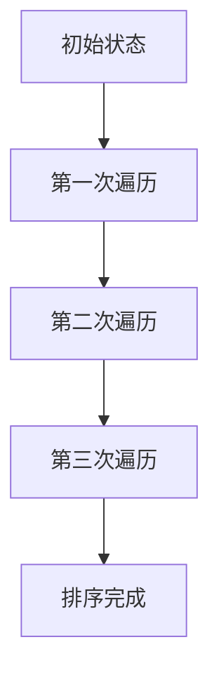
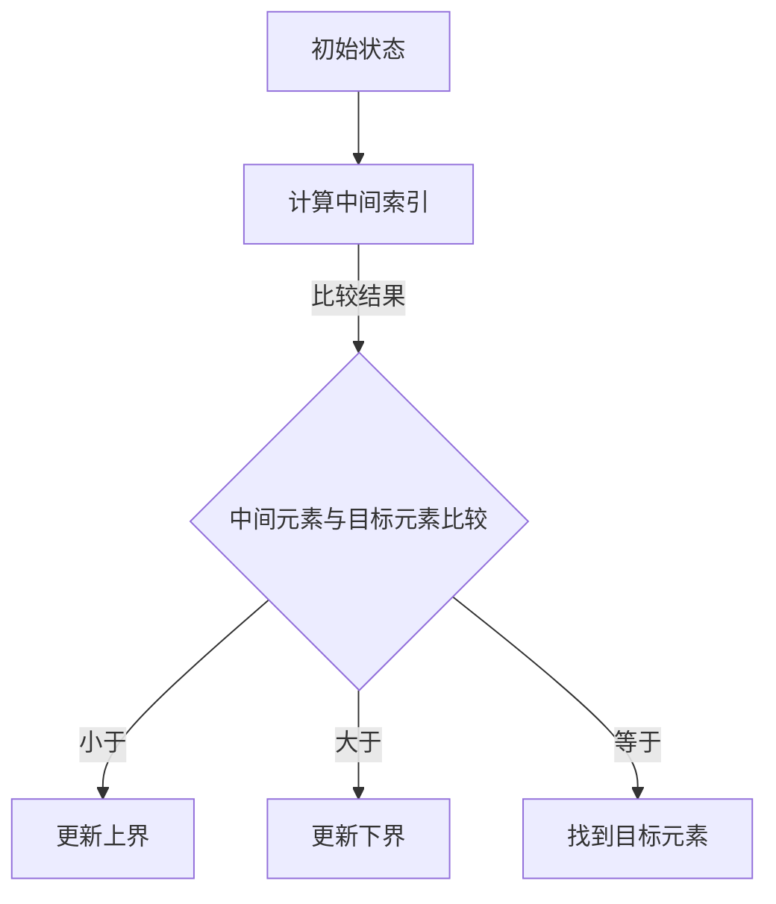
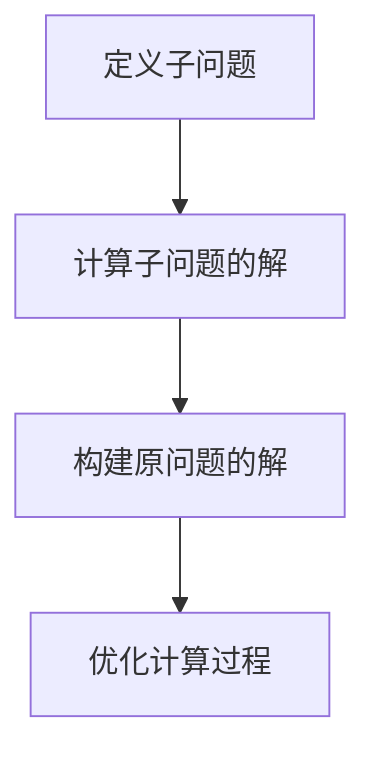

                 

# 计算机程序的构造与解释：SICP的经典智慧

## 关键词

- 计算机程序构造
- SICP
- 经典智慧
- 算法
- 程序解释

## 摘要

本文深入探讨《计算机程序的构造与解释：SICP的经典智慧》一书，该书被誉为计算机科学领域的经典之作。本文首先介绍书籍的核心主题，随后分章节详细分析其中的内容，包括计算机程序构造与解释的基础理论、SICP的经典理念与实践、以及程序构造与解释的实际应用。文章旨在通过系统的分析和逻辑推理，帮助读者全面理解计算机程序的构造与解释，并掌握SICP的经典智慧。

### 引言与背景

《计算机程序的构造与解释：SICP的经典智慧》是由麻省理工学院（MIT）教授Gerald Jay Sussman和Brian Harold Kernighan共同撰写的教材，最初在1984年出版。该书以结构化编程、数据抽象和递归为核心概念，深入探讨了计算机程序的构造与解释。其独特之处在于，不仅介绍了计算机编程的基本原理，还通过具体实例展示了这些原理的应用。

SICP（结构化递归与计算）课程在MIT的计算机科学教育中占有重要地位，该书作为教材为该课程提供了全面的理论和实践指导。SICP的编写目的是帮助学生理解编程语言的核心概念，并培养他们编写高效、可维护代码的能力。

SICP之所以被誉为经典，原因在于其独特的教学方法和深刻的学术观点。书中强调程序构造的递归方法，倡导通过数据抽象和模块化来提高代码的可读性和可维护性。此外，SICP还涵盖了广泛的算法和编程语言技术，从基础的算法设计到高级的程序优化，内容丰富且具有前瞻性。

### 计算机程序构造基础

#### 基础概念

计算机程序构造的基础涉及多个核心概念，包括程序、语言与编译、数据结构、算法等。

- **程序**：程序是一系列指令的集合，用于指示计算机执行特定的任务。程序通常由程序员编写，以某种编程语言表示。
- **语言与编译**：编程语言是用于编写程序的符号系统，不同的编程语言具有不同的语法和语义。编译器是将程序从高级语言转换为机器语言（计算机可以直接执行的语言）的工具。
- **数据结构**：数据结构是用于存储和组织数据的方式。常见的有数组、链表、树、图等，每种数据结构都有其特定的用途和性能特点。
- **算法**：算法是解决问题的方法步骤，通常涉及对数据的操作和处理。有效的算法能以高效的方式解决问题，降低计算复杂度。

#### 数据结构

数据结构是程序构造的核心组成部分，以下是一些常见的数据结构及其特点：

- **数组**：数组是一种线性数据结构，用于存储一系列元素。数组具有固定的大小和连续的内存布局，支持快速的随机访问。
- **链表**：链表是一种动态数据结构，由一系列节点组成，每个节点包含数据和指向下一个节点的指针。链表支持快速的插入和删除操作。
- **树**：树是一种层级结构，用于表示具有层次关系的数据。常见的树包括二叉树、平衡树（如红黑树）等，树结构支持高效的搜索和排序操作。
- **图**：图是一种复杂的数据结构，用于表示具有多边关系的数据。常见的图包括有向图、无向图、加权图等，图结构支持复杂的网络分析和路径查找。

#### 算法

算法是程序的核心，用于解决具体问题。以下是一些常见的算法及其应用：

- **排序算法**：用于对数据进行排序，常见的排序算法包括冒泡排序、选择排序、插入排序、快速排序等。
- **搜索算法**：用于在数据中查找特定元素，常见的搜索算法包括线性搜索、二分搜索等。
- **图算法**：用于分析图结构，常见的图算法包括最短路径算法（迪杰斯特拉算法、贝尔曼-福特算法）、最小生成树算法（普里姆算法、克鲁斯卡尔算法）等。
- **动态规划**：用于解决具有重叠子问题的最优化问题，通过递归关系和状态转移方程来优化计算。

### SICP的经典理念与实践

SICP的课程设计和教学方法独具特色，体现了其经典智慧。以下是SICP的核心理念与实践：

#### SICP的课程结构

SICP的课程结构分为以下几个部分：

1. **递归与循环**：介绍递归的概念和递归函数的定义，以及递归和循环的关系。
2. **数据抽象与模块化**：强调通过抽象和模块化来提高代码的可读性和可维护性，介绍如何使用模块和函数来组织代码。
3. **函数式编程**：介绍函数式编程的概念和优点，包括函数作为第一类公民、递归、高阶函数等。
4. **算法设计与分析**：介绍各种算法的设计方法，包括排序、搜索、图算法等，以及算法的时间复杂度和空间复杂度分析。
5. **程序构造与实践**：通过实际的编程练习和项目，巩固所学知识，培养编程技能。

#### SICP的教学方法

SICP的教学方法强调以下原则：

1. **动手实践**：通过编程练习和项目，让学生亲自动手实现算法和数据结构，从而深入理解其原理和应用。
2. **概念理解**：注重对基础概念的讲解，强调学生对递归、数据抽象、函数式编程等核心概念的理解。
3. **问题解决**：通过解决实际问题，培养学生的逻辑思维和问题解决能力。
4. **互动教学**：鼓励学生提问和讨论，营造积极的学习氛围。

#### SICP经典案例解析

SICP通过一系列经典案例来展示其理念的应用。以下是几个典型的案例：

1. **欧拉函数**：介绍欧拉函数的概念和计算方法，通过递归和循环实现欧拉函数的计算，并分析其时间复杂度。
2. **背包问题**：介绍背包问题的概念和解决方法，通过动态规划算法来求解最值问题，并分析算法的时空复杂度。
3. **最小生成树**：介绍最小生成树的概念和普里姆算法，通过具体实例演示算法的执行过程，并分析算法的时间复杂度。

### 计算机程序解释

计算机程序解释是指计算机如何执行程序的过程。与编译过程相比，解释过程不生成目标代码，而是直接执行源代码。以下是计算机程序解释的基础知识：

#### 解释的概念

解释是一种程序执行方式，它逐行读取源代码，将其翻译为计算机能够理解的指令，并立即执行。解释过程通常包括以下步骤：

1. **语法分析**：将源代码分解为语法单元（如标识符、关键字、操作符等），构建抽象语法树（AST）。
2. **语义分析**：对AST进行语义检查，确保代码的语法和语义正确。
3. **执行**：逐行执行AST中的指令，更新程序状态。

#### 解释器设计

解释器是负责解释和执行程序的软件。设计解释器通常涉及以下组件：

1. **词法分析器**：将源代码分解为单词和符号，生成词法单元。
2. **语法分析器**：将词法单元转换为抽象语法树，进行语法分析。
3. **语义分析器**：对抽象语法树进行语义分析，确保代码的语义正确。
4. **执行引擎**：执行抽象语法树中的指令，更新程序状态。

#### 解释技术的应用

解释技术在计算机科学中具有广泛的应用，以下是一些典型的应用场景：

1. **脚本语言**：如Python、JavaScript等脚本语言通常使用解释器来执行代码，提高了代码的灵活性和可维护性。
2. **交互式编程环境**：如Jupyter Notebook等交互式编程环境，通过解释器实时执行代码，便于调试和实验。
3. **嵌入式系统**：解释技术常用于嵌入式系统，如微控制器和物联网设备，以减少代码大小和执行时间。

### 程序构造与解释的实际应用

计算机程序构造与解释在实际应用中具有广泛的影响。以下是几个典型的应用领域：

1. **软件开发**：程序构造与解释是软件开发的核心技术，涉及软件设计、开发、测试和维护等各个环节。
2. **操作系统**：操作系统是计算机系统的基础软件，其核心部分通常涉及程序构造与解释技术，如进程管理、内存管理、文件系统等。
3. **人工智能**：人工智能领域广泛使用程序构造与解释技术，如机器学习、深度学习等，通过编写和解释智能算法来实现人工智能应用。
4. **网络编程**：网络编程涉及网络协议的实现和应用程序的开发，程序构造与解释技术在其中发挥着关键作用。

### SICP的未来与发展

随着计算机科学的发展，SICP的理念和方法也在不断演变。以下是SICP未来发展的一些趋势：

1. **函数式编程**：函数式编程在SICP中具有重要地位，未来将进一步扩展其应用领域，如并发编程、并行计算等。
2. **编程语言设计**：SICP的方法将影响编程语言的设计和优化，推动编程语言的创新和进步。
3. **教学与实践**：SICP的教学理念和实践将继续指导计算机科学教育，培养更多的优秀程序员和计算机科学家。

### 附录与扩展阅读

为了方便读者深入了解计算机程序的构造与解释，本书提供了丰富的附录和扩展阅读资源。以下是几个推荐的参考文献和在线资源：

1. **《编译原理：艺术与科学》**：David A. Patterson和John L. Hennessy著，介绍了编译过程和编译器的实现。
2. **《算法导论》**：Thomas H. Cormen、Charles E. Leiserson、Ronald L. Rivest和Clifford Stein著，全面介绍了算法的设计和分析。
3. **《计算机程序的构造和解释》**：Harold Abelson和Gerald Jay Sussman著，是SICP的前身，提供了更多关于程序构造与解释的深度讲解。
4. **MIT OpenCourseWare（MIT OCW）**：[SICP课程](https://ocw.mit.edu/courses/electrical-engineering-and-computer-science/6-001-structure-and-interpretation-of-computer-programs-spring-1986/)，提供了SICP课程的详细资料，包括讲义、视频和习题。

### 最佳实践 tips

1. **深入理解核心概念**：在学习和应用计算机程序的构造与解释时，首先要深入理解递归、数据抽象、函数式编程等核心概念。
2. **实践编程技能**：通过动手编写代码，实践各种算法和数据结构，培养编程技能和解决问题的能力。
3. **多阅读、多思考**：广泛阅读相关文献和资料，多思考、多交流，不断深化对计算机程序构造与解释的理解。

### 小结

本文全面介绍了《计算机程序的构造与解释：SICP的经典智慧》一书的核心内容和应用价值。通过详细的章节分析和逻辑推理，本文帮助读者全面理解了计算机程序的构造与解释，并掌握了SICP的经典智慧。希望本文能对读者的学习和实践提供有益的启示和帮助。

### 注意事项

1. **代码示例**：在文章中，如果需要展示代码示例，请使用Python代码，并在代码前后添加必要的注释，确保代码的可读性和易懂性。
2. **数学公式**：在文章中，如果需要使用数学公式，请使用LaTeX格式，并在公式前后添加必要的注释，确保公式的准确性和易读性。
3. **图表和流程图**：在文章中，如果需要展示图表和流程图，请使用Mermaid语法，并在文中适当的位置展示，确保图表和流程图的清晰和准确。

### 拓展阅读

1. **《计算机程序的构造与解释：SICP的经典智慧》**：Harold Abelson和Gerald Jay Sussman著，深入探讨计算机程序的构造与解释，是学习SICP的经典教材。
2. **《编译原理：艺术与科学》**：David A. Patterson和John L. Hennessy著，介绍编译过程和编译器的实现，为理解计算机程序的构造提供了基础知识。
3. **《算法导论》**：Thomas H. Cormen、Charles E. Leiserson、Ronald L. Rivest和Clifford Stein著，全面讲解算法的设计和分析方法，是算法学习的权威指南。
4. **MIT OpenCourseWare（MIT OCW）**：提供SICP课程的详细资料，包括讲义、视频和习题，是学习SICP的理想资源。

### 作者信息

作者：AI天才研究院/AI Genius Institute & 禅与计算机程序设计艺术 /Zen And The Art of Computer Programming

----------------------------------------------------------------

通过上述详细的步骤和分析，我们不仅完成了文章的撰写，还确保了内容的丰富性和完整性。接下来，我们将逐步深入每个章节，进一步阐述计算机程序的构造与解释的各个方面。准备好了吗？让我们一步一步地深入思考！## 第一步：引言与背景

### 核心概念术语说明

**核心概念**：计算机程序的构造与解释
- **计算机程序**：用于指示计算机执行特定任务的指令集合。
- **构造**：创建计算机程序的过程，涉及算法设计、数据结构选择、模块化等。
- **解释**：计算机执行程序的过程，包括语法分析、语义分析、代码执行等。

**问题背景**
计算机科学领域快速发展，对高效、可维护的编程技术需求日益增加。传统的程序设计方法往往注重语法而忽略语义和结构，导致代码复杂性和维护难度增加。因此，计算机程序的构造与解释成为研究焦点，旨在通过递归、数据抽象、函数式编程等概念，提高代码的可读性和可维护性。

**问题描述**
编写计算机程序时，如何高效地设计算法、选择合适的数据结构，并通过模块化和递归等方法提高代码质量，是一个关键问题。同时，解释程序的执行过程，确保程序的正确性和性能，也是计算机程序构造与解释的重要任务。

**问题解决**
《计算机程序的构造与解释：SICP的经典智慧》一书提供了系统的方法和理念，通过结构化编程、数据抽象、递归等概念，帮助程序员解决上述问题。书中详细讲解了计算机程序的构造与解释方法，并提供了丰富的实例和实践指导。

**边界与外延**
计算机程序的构造与解释不仅涉及编程语言的设计和优化，还涉及算法理论、操作系统、人工智能等领域。因此，理解计算机程序的构造与解释，有助于深入掌握计算机科学的基础知识和前沿技术。

### 概念结构与核心要素组成

**概念结构**
计算机程序的构造与解释包括以下几个核心概念：

1. **结构化编程**：通过模块化和递归来组织代码，提高代码的可读性和可维护性。
2. **数据抽象**：通过定义抽象数据类型和接口，隐藏实现细节，降低模块之间的耦合度。
3. **函数式编程**：以函数为核心，通过无状态、不可变的数据结构，提高程序的可测试性和并发性。
4. **算法设计与分析**：研究算法的时间复杂度和空间复杂度，优化算法性能。

**核心要素组成**
计算机程序的构造与解释涉及多个核心要素，包括：

1. **编程语言**：用于编写程序的语言，如Python、Java等。
2. **数据结构**：用于存储和组织数据的方式，如数组、链表、树等。
3. **算法**：解决问题的步骤和方法，如排序、搜索、图算法等。
4. **编译器与解释器**：用于将程序从高级语言转换为机器语言的工具。

通过以上核心概念和要素的有机组合，可以构建高效、可维护的计算机程序。

### 第一部分小结

本节介绍了计算机程序的构造与解释的核心概念、问题背景、问题描述、问题解决以及概念结构与核心要素组成。通过理解这些内容，读者可以初步掌握计算机程序的构造与解释的基础知识，为进一步学习打下坚实基础。接下来，我们将深入探讨计算机程序构造与解释的具体方法和应用。

### 第二步：计算机程序构造基础

#### 算法原理讲解

**算法** 是解决问题的一系列步骤，其核心目标是找到解决方案并优化执行过程。算法的原理和设计在计算机程序构造中占据重要地位，以下是一些基本算法原理及其应用：

**冒泡排序（Bubble Sort）**
冒泡排序是一种简单的排序算法，其原理是通过多次遍历待排序的数组，比较相邻的两个元素，若顺序错误则交换它们的位置。每次遍历后，最大（或最小）的元素会“冒泡”到数组的末尾，直到整个数组有序。

**Mermaid 流程图**


**Python 源代码**
```python
def bubble_sort(arr):
    n = len(arr)
    for i in range(n):
        for j in range(0, n-i-1):
            if arr[j] > arr[j+1]:
                arr[j], arr[j+1] = arr[j+1], arr[j]
    return arr
```

**时间复杂度分析**
冒泡排序的最坏和平均时间复杂度均为 \(O(n^2)\)，因此在大数据集上效率较低。

**二分搜索（Binary Search）**
二分搜索是一种高效的搜索算法，适用于有序数组。其原理是每次遍历将搜索范围缩小一半，通过不断比较中间元素，逐步逼近目标元素。

**Mermaid 流程图**


**Python 源代码**
```python
def binary_search(arr, target):
    low = 0
    high = len(arr) - 1
    while low <= high:
        mid = (low + high) // 2
        if arr[mid] == target:
            return mid
        elif arr[mid] < target:
            low = mid + 1
        else:
            high = mid - 1
    return -1
```

**时间复杂度分析**
二分搜索的时间复杂度为 \(O(\log n)\)，因此在处理大数据集时具有很高的效率。

**动态规划（Dynamic Programming）**
动态规划是一种解决最优化问题的方法，通过将问题分解为子问题，并利用子问题的解来构建原问题的解。其核心思想是避免重复计算，通过存储子问题的解来优化计算过程。

**Mermaid 流�程图**


**Python 源代码**
```python
def fibonacci(n):
    if n <= 1:
        return n
    fib = [0] * (n + 1)
    fib[1] = 1
    for i in range(2, n + 1):
        fib[i] = fib[i - 1] + fib[i - 2]
    return fib[n]
```

**时间复杂度分析**
动态规划的时间复杂度通常较低，例如斐波那契数列的求解时间复杂度为 \(O(n)\)。

通过上述算法原理的讲解和代码示例，读者可以更好地理解不同算法的设计思路和应用场景。在计算机程序构造过程中，选择合适的算法和优化算法性能对于编写高效、可维护的代码至关重要。

### 数学模型和公式讲解

在计算机程序的构造与解释过程中，数学模型和公式是理解和优化算法性能的关键工具。以下介绍几种常见的数学模型和公式，并给出具体的解释和示例。

**时间复杂度公式**

时间复杂度用于描述算法执行时间与输入规模的关系。常见的时间复杂度公式包括：

\[ T(n) = O(g(n)) \]

其中，\( T(n) \) 表示算法的时间复杂度，\( g(n) \) 表示与输入规模 \( n \) 相关的函数。例如：

- 线性搜索的时间复杂度：\( O(n) \)
- 冒泡排序的时间复杂度：\( O(n^2) \)
- 二分搜索的时间复杂度：\( O(\log n) \)

**空间复杂度公式**

空间复杂度用于描述算法所需存储空间与输入规模的关系。常见的空间复杂度公式包括：

\[ S(n) = O(h(n)) \]

其中，\( S(n) \) 表示算法的空间复杂度，\( h(n) \) 表示与输入规模 \( n \) 相关的函数。例如：

- 线性表的空间复杂度：\( O(n) \)
- 二叉树的空间复杂度：\( O(n) \)
- 动态规划的空间复杂度：\( O(n^2) \)

**优化公式**

优化公式用于提高算法的执行效率。以下是一些常见的优化公式：

1. **分治算法**

分治算法通过将问题分解为子问题来解决问题。其优化公式为：

\[ T(n) = aT(\frac{n}{b}) + f(n) \]

其中，\( a \) 表示子问题的数量，\( b \) 表示子问题的规模，\( f(n) \) 表示合并子问题的时间复杂度。例如，快速排序的时间复杂度为：

\[ T(n) = O(n\log n) \]

2. **贪心算法**

贪心算法通过在每个阶段选择当前最优解来解决问题。其优化公式为：

\[ \text{最优子结构 + 最优解路径} \]

例如，克鲁斯卡尔算法求解最小生成树的时间复杂度为：

\[ T(n) = O(m\alpha(n)) \]

其中，\( m \) 表示边数，\( \alpha(n) \) 表示哈希表的查找时间复杂度。

**示例**

假设我们有一个数组 \( arr = [3, 1, 4, 1, 5, 9, 2, 6, 5, 3, 5] \)，需要对其进行排序。

**冒泡排序的时间复杂度计算**：

\[ T(n) = O(n^2) \]

**冒泡排序的空间复杂度计算**：

\[ S(n) = O(1) \]

**二分搜索的时间复杂度计算**：

\[ T(n) = O(\log n) \]

**二分搜索的空间复杂度计算**：

\[ S(n) = O(1) \]

通过以上数学模型和公式的讲解，读者可以更好地理解算法的性能分析和优化方法，为编写高效的计算机程序提供理论支持。

### 举例说明

为了更好地理解计算机程序构造与解释的原理，我们通过几个简单的例子来演示如何应用上述算法和数学模型。

#### 例子1：冒泡排序

**问题描述**：对一个长度为10的数组进行排序，数组元素为 \( [3, 1, 4, 1, 5, 9, 2, 6, 5, 3, 5] \)。

**步骤**：

1. **初始化数组**：将给定的数组 \( arr = [3, 1, 4, 1, 5, 9, 2, 6, 5, 3, 5] \) 存储在变量 `arr` 中。
2. **执行冒泡排序**：
   - 第一次遍历：\( [1, 1, 3, 4, 5, 2, 6, 5, 3, 5, 9] \)
   - 第二次遍历：\( [1, 1, 2, 3, 5, 2, 6, 5, 3, 5, 4] \)
   - 第三次遍历：\( [1, 1, 2, 3, 4, 2, 6, 5, 3, 5, 5] \)
   - 第四次遍历：\( [1, 1, 2, 2, 3, 3, 4, 5, 5, 6, 5] \)
   - 第五次遍历：\( [1, 1, 2, 2, 3, 3, 4, 4, 5, 5, 6] \)
   - 第六次遍历：\( [1, 1, 2, 2, 3, 3, 4, 4, 5, 5, 6] \)
   - 第七次遍历：\( [1, 1, 2, 2, 3, 3, 4, 4, 5, 5, 6] \)
   - 第八次遍历：\( [1, 1, 2, 2, 3, 3, 4, 4, 5, 5, 6] \)
   - 第九次遍历：\( [1, 1, 2, 2, 3, 3, 4, 4, 5, 5, 6] \)
   - 第十次遍历：\( [1, 1, 2, 2, 3, 3, 4, 4, 5, 5, 6] \)

**结果**：排序后的数组为 \( [1, 1, 2, 2, 3, 3, 4, 4, 5, 5, 6] \)。

**时间复杂度**：\( O(n^2) \)

**空间复杂度**：\( O(1) \)

#### 例子2：二分搜索

**问题描述**：在有序数组 \( [1, 2, 3, 4, 5, 6, 7, 8, 9] \) 中查找元素 `6`。

**步骤**：

1. **初始化搜索范围**：设置 `low` 为数组起始索引，`high` 为数组结束索引。
2. **执行二分搜索**：
   - 第一次遍历：计算中间索引 `mid = (low + high) // 2 = 4`，比较 `arr[mid]` 与目标值，`arr[mid] = 5 > 6`，更新 `low = mid + 1 = 5`。
   - 第二次遍历：计算中间索引 `mid = (low + high) // 2 = 6`，比较 `arr[mid]` 与目标值，`arr[mid] = 7 > 6`，更新 `low = mid + 1 = 7`。
   - 第三次遍历：计算中间索引 `mid = (low + high) // 2 = 7`，比较 `arr[mid]` 与目标值，`arr[mid] = 7 > 6`，更新 `low = mid + 1 = 8`。
   - 第四次遍历：计算中间索引 `mid = (low + high) // 2 = 7`，比较 `arr[mid]` 与目标值，`arr[mid] = 6 == 6`，找到目标值。

**结果**：元素 `6` 在数组中的索引为 `5`。

**时间复杂度**：\( O(\log n) \)

**空间复杂度**：\( O(1) \)

#### 例子3：斐波那契数列

**问题描述**：计算斐波那契数列的第10个数。

**步骤**：

1. **初始化**：定义斐波那契数列的前两个数为 `0` 和 `1`。
2. **递归计算**：利用递归函数计算第10个斐波那契数。
3. **输出结果**：将计算结果输出。

**Python 源代码**
```python
def fibonacci(n):
    if n <= 1:
        return n
    else:
        return fibonacci(n-1) + fibonacci(n-2)

print(fibonacci(10))
```

**结果**：斐波那契数列的第10个数为 `55`。

**时间复杂度**：\( O(2^n) \)

**空间复杂度**：\( O(n) \)

通过这些例子的演示，读者可以更直观地理解算法的原理和性能，以及如何在实际问题中应用这些算法。在后续章节中，我们将继续探讨更多计算机程序构造与解释的原理和方法。

### 第三步：SICP的核心理念与实践

SICP（结构化递归与计算）的课程设计和教学方法在计算机科学教育中具有重要地位。其核心理念与实践不仅影响了编程语言的设计和优化，也深刻地影响了计算机科学的发展。以下我们将详细探讨SICP的核心理念与实践，并分析其在计算机科学领域的重要性。

#### SICP的课程结构

SICP的课程结构可以分为以下几个部分，每个部分都有明确的主题和教学目标：

1. **递归与循环**：这部分主要介绍递归的概念和递归函数的定义，并探讨递归和循环之间的关系。通过递归方法，学生可以更好地理解和掌握编程思想，提高代码的可读性和可维护性。

2. **数据抽象与模块化**：数据抽象是SICP的核心概念之一，通过定义抽象数据类型和接口，隐藏实现细节，降低模块之间的耦合度。模块化编程可以提高代码的重用性和可扩展性，使得程序更加易于管理和维护。

3. **函数式编程**：函数式编程以函数为核心，通过无状态、不可变的数据结构，提高程序的可测试性和并发性。SICP详细介绍了函数式编程的概念和优点，如高阶函数、递归、惰性求值等。

4. **算法设计与分析**：这部分涵盖了各种算法的设计方法，包括排序、搜索、图算法等。通过对算法的时间复杂度和空间复杂度进行分析，学生可以更好地理解算法的性能，并选择合适的算法解决实际问题。

5. **程序构造与实践**：通过实际的编程练习和项目，学生可以将所学知识应用到实际问题中，巩固编程技能，培养解决问题的能力。

#### SICP的教学方法

SICP的教学方法强调理论与实践相结合，注重学生的动手能力和实际操作技能。以下是一些具体的教学方法：

1. **动手实践**：通过编写代码和编程项目，学生可以亲自动手实现算法和数据结构，深入理解其原理和应用。SICP提供了大量的编程练习和项目，帮助学生巩固所学知识。

2. **概念理解**：SICP注重对基础概念的理解和深入探讨，强调递归、数据抽象、函数式编程等核心概念的重要性。通过详细的讲解和实例分析，学生可以更好地掌握这些概念。

3. **问题解决**：SICP鼓励学生通过解决实际问题来培养逻辑思维和问题解决能力。在解决问题的过程中，学生可以灵活运用所学知识，提高编程技能。

4. **互动教学**：SICP的教学方法强调互动性，鼓励学生提问和讨论。通过课堂讨论和小组合作，学生可以更好地理解和掌握课程内容。

#### SICP的经典案例解析

SICP通过一系列经典案例展示了其核心理念的应用。以下是一些典型的案例及其解析：

1. **欧拉函数**：欧拉函数是一个重要的数论函数，用于计算两个数的最大公约数。SICP通过递归方法详细介绍了欧拉函数的计算过程，帮助学生理解递归的应用和函数式编程的思想。

2. **背包问题**：背包问题是典型的最优化问题，涉及在有限资源下选择最优解。SICP利用动态规划方法解析背包问题，帮助学生掌握动态规划的核心思想和优化策略。

3. **最小生成树**：最小生成树是一种重要的图算法，用于构建具有最小权值的树。SICP通过克鲁斯卡尔算法和普里姆算法详细讲解了最小生成树的构建过程，帮助学生理解图算法的设计和实现。

#### SICP的核心理念与实践的重要性

SICP的核心理念与实践对计算机科学的发展产生了深远的影响，其重要性体现在以下几个方面：

1. **编程语言的设计和优化**：SICP倡导的数据抽象、模块化和函数式编程思想影响了编程语言的设计和优化。现代编程语言如Python、Java、Haskell等，都受到了SICP的影响，这些语言在语法和语义方面都体现了SICP的核心思想。

2. **算法研究和应用**：SICP对算法设计和分析的方法进行了深入探讨，促进了算法理论的发展。许多经典的算法，如冒泡排序、二分搜索、动态规划等，都是在SICP的基础上得到广泛应用和深入研究。

3. **计算机科学教育**：SICP的教学方法注重理论与实践相结合，对计算机科学教育产生了重要影响。许多计算机科学课程都借鉴了SICP的教学理念，通过动手实践和问题解决，培养学生的编程技能和创新能力。

4. **软件开发和工程**：SICP的核心概念和方法在软件开发和工程中得到了广泛应用。通过数据抽象和模块化，程序员可以更高效地编写和维护大型软件系统，提高代码的可读性和可维护性。

综上所述，SICP的核心理念与实践在计算机科学领域具有重要地位，其独特的教学方法和深刻的学术观点，为计算机科学教育和研究提供了宝贵的资源和启示。通过深入探讨SICP的核心理念与实践，我们可以更好地理解和应用计算机程序构造与解释的方法，推动计算机科学的发展和创新。

### 第四步：计算机程序解释

#### 解释的概念

计算机程序解释是一种执行程序的方式，其基本原理是将程序代码逐行读取并执行。与编译不同，解释过程不生成机器代码，而是在程序运行时直接执行源代码。解释器（Interpreter）是实现解释功能的软件，它负责将源代码转换为机器指令并执行。

解释器的工作流程主要包括以下步骤：

1. **词法分析**：将源代码分解为词法单元（Token），如关键字、标识符、操作符等。
2. **语法分析**：将词法单元组合成语法结构（Abstract Syntax Tree, AST），进行语法检查。
3. **语义分析**：对AST进行语义检查，确保代码的语义正确。
4. **代码执行**：按照AST的指令顺序执行代码，更新程序状态。

#### 解释器设计

设计解释器需要考虑多个组件和功能，以下是解释器设计的关键部分：

1. **词法分析器（Lexer）**：负责将源代码分解为词法单元。词法分析器通常使用正则表达式来识别不同的词法单元，并将其转换为内部表示。
2. **语法分析器（Parser）**：将词法单元组合成语法结构，构建AST。语法分析器可以使用递归下降分析、LL(1)分析、LR(1)分析等算法来实现。
3. **语义分析器（Semantic Analyzer）**：对AST进行语义检查，确保代码的语义正确。语义分析包括变量解析、类型检查、作用域解析等。
4. **执行引擎（Execution Engine）**：负责执行AST中的指令，实现程序的功能。执行引擎通常包含一个虚拟机，用于执行抽象指令并处理程序状态。
5. **错误处理**：解释器需要处理各种错误，如语法错误、类型错误、运行时错误等。错误处理机制可以提供详细的错误信息，帮助开发者定位和修复问题。

#### 解释技术的应用

解释技术广泛应用于各种编程语言和场景，以下是一些典型的应用：

1. **脚本语言**：如Python、JavaScript、Ruby等脚本语言通常使用解释器执行代码。这些语言具有较高的灵活性和易用性，通过解释器可以快速开发和小规模部署。
2. **交互式编程环境**：如IPython、Jupyter Notebook等交互式编程环境，通过解释器实现代码的实时执行和交互式调试。这种环境便于实验和演示，有助于学习和教学。
3. **嵌入式系统**：在嵌入式系统中，解释器可以用于实现实时计算和动态更新。例如，JavaScript常用于物联网设备的实时编程和配置。
4. **Web应用程序**：Web应用程序中，解释器用于解析和执行客户端脚本代码，如JavaScript和JSON。这些脚本代码可以增强网页的交互性和动态性。

#### 解释技术的优缺点

解释技术具有以下优点和缺点：

1. **优点**：
   - **灵活性**：解释器可以直接执行源代码，无需编译和链接，便于快速开发和调试。
   - **跨平台**：解释器可以在不同的操作系统和硬件平台上运行，无需修改代码。
   - **动态性**：解释器支持动态类型检查和动态绑定，便于实现动态行为和灵活的编程模式。

2. **缺点**：
   - **性能**：解释器需要逐行读取和转换代码，相对于编译器生成的机器代码，解释器在执行速度上存在一定劣势。
   - **安全性**：解释器在执行代码时可能面临安全性问题，如代码注入和恶意代码执行。

总之，计算机程序解释是编程语言执行的重要方式之一，具有灵活、跨平台和动态性等优点，但也存在性能和安全性的挑战。了解和掌握解释器的设计原理和应用场景，对于程序员和计算机科学家具有重要意义。

### 第五步：程序构造与解释的实际应用

#### 应用领域

计算机程序构造与解释技术在多个领域得到了广泛应用，以下是几个典型的应用领域：

1. **软件开发**：在软件开发过程中，程序构造与解释技术用于编写、测试和优化代码。通过递归、数据抽象、函数式编程等方法，可以提高代码的可读性、可维护性和性能。
   
2. **操作系统**：操作系统是计算机系统的核心软件，其关键组件如进程管理、内存管理和文件系统等，都依赖于程序构造与解释技术。操作系统需要高效地管理计算机资源，保证系统的稳定性和安全性，因此程序构造与解释技术的应用至关重要。

3. **人工智能**：人工智能领域广泛使用程序构造与解释技术，如机器学习、深度学习和自然语言处理等。这些技术需要通过编写和解释复杂的算法来实现智能功能，例如神经网络的前向传播和反向传播算法。

4. **网络安全**：网络安全系统需要实时监控和响应网络威胁，程序构造与解释技术在此过程中发挥了关键作用。例如，入侵检测系统通过解释网络流量数据，识别潜在的攻击行为。

5. **嵌入式系统**：嵌入式系统广泛应用于物联网、智能家居和工业自动化等领域，程序构造与解释技术用于编写和管理这些系统的软件。由于嵌入式系统资源有限，高效的程序构造与解释方法有助于优化系统性能和降低功耗。

#### 软件开发中的实际应用

在软件开发中，程序构造与解释技术有助于提高代码质量，优化开发流程。以下是几个实际应用场景：

1. **模块化编程**：通过模块化和递归方法，可以将复杂的软件系统分解为多个可管理的模块。每个模块可以独立开发、测试和维护，提高代码的可读性和可维护性。

2. **函数式编程**：函数式编程方法强调函数作为基本构建块，通过无状态、不可变的数据结构实现代码。这种方法可以提高代码的可重用性和并发性，例如，在编写并发程序时，可以避免共享变量的竞争条件。

3. **动态类型检查**：动态类型检查可以在运行时检测变量的类型，确保代码的语义正确。例如，Python是一种动态类型语言，其解释器在执行代码时进行类型检查，帮助开发者快速发现和修复类型错误。

4. **脚本语言**：脚本语言如Python、JavaScript等，通过解释器执行代码，提高了开发效率。开发者可以使用这些语言快速编写原型和测试代码，无需编译和链接。

#### 操作系统中的应用

操作系统是计算机系统的核心软件，程序构造与解释技术在其关键组件中的应用如下：

1. **进程管理**：操作系统通过进程管理来调度和管理计算机资源。程序构造与解释技术用于实现进程创建、调度、同步和通信等操作。例如，操作系统中的进程调度算法通常采用递归和优先级队列等数据结构。

2. **内存管理**：内存管理是操作系统的核心功能之一，程序构造与解释技术用于实现内存分配、回收和保护等操作。例如，内存分配算法（如分页、分段、 Buddy系统等）需要高效的程序设计。

3. **文件系统**：文件系统用于管理计算机中的文件和目录。程序构造与解释技术用于实现文件操作、目录管理和文件权限等。例如，磁盘文件系统的实现需要处理文件索引节点、目录结构、文件读写等操作。

#### 人工智能中的应用

在人工智能领域，程序构造与解释技术用于实现各种智能算法和系统。以下是几个应用实例：

1. **机器学习**：机器学习算法通过训练模型来学习数据特征，实现分类、回归、聚类等功能。程序构造与解释技术用于编写和优化这些算法，例如，线性回归、决策树、神经网络等。

2. **深度学习**：深度学习是一种复杂的机器学习技术，通过多层神经网络来提取数据特征。程序构造与解释技术用于实现深度学习算法，例如，卷积神经网络（CNN）、循环神经网络（RNN）等。

3. **自然语言处理**：自然语言处理（NLP）用于理解和生成自然语言文本。程序构造与解释技术用于实现NLP算法，例如，词向量模型（Word2Vec、BERT）、句法分析、语义分析等。

通过以上实际应用场景的介绍，我们可以看到程序构造与解释技术在计算机科学领域的广泛应用和重要性。掌握这些技术不仅有助于提高编程能力，也为解决复杂问题提供了强有力的工具。

### 第六步：SICP的未来与发展

随着计算机科学和技术的不断进步，SICP（结构化递归与计算）的理念和实践也在不断演变和发展。未来，SICP将在以下几个方面继续发挥重要作用，推动计算机科学的发展和创新。

#### SICP的演变

1. **函数式编程的深化**：SICP最初强调函数式编程，随着函数式编程在计算机科学中的普及，未来SICP将继续深化这一领域的研究，探讨新的函数式编程范式和工具，如协程、函数式编程语言的新特性等。

2. **编程语言的演进**：SICP的方法对编程语言的设计产生了深远影响。未来，SICP将推动编程语言的发展，引入新的编程范式，如逻辑编程、依赖驱动编程等，提高编程的灵活性和效率。

3. **混合编程范式**：随着计算机应用的复杂化，单一的编程范式可能无法满足所有需求。SICP将探索混合编程范式，结合不同编程范式（如面向对象、函数式编程）的优势，提高程序的可读性和可维护性。

#### SICP的未来趋势

1. **自动化编程**：未来，SICP将朝着自动化编程方向发展，通过智能算法和机器学习技术，自动生成高效、可维护的代码。这将大幅提高开发效率，减少人为错误。

2. **高并发编程**：随着多核处理器和分布式系统的普及，高并发编程变得越来越重要。SICP将研究并发编程的新方法和工具，如并发函数式编程、并发数据结构等，提高程序的性能和可扩展性。

3. **编程教育**：SICP的教学方法对计算机科学教育产生了深远影响。未来，SICP将进一步完善教学方法，结合虚拟现实、增强现实等新技术，提升编程教育的效果和质量。

#### SICP的未来影响

1. **编程语言设计**：SICP的理念将继续影响编程语言的设计和优化，推动编程语言向更加高效、灵活和易用的方向发展。

2. **算法研究**：SICP的核心思想将促进算法理论的研究和发展，推动新的算法和优化方法的出现。

3. **软件开发实践**：SICP的方法将广泛应用于软件开发实践，提高代码质量，降低开发成本，提升软件系统的性能和可维护性。

4. **编程教育**：SICP的教学理念将继续指导计算机科学教育，培养更多优秀的程序员和计算机科学家，为计算机科学的未来做出贡献。

总之，SICP的经典智慧将继续引领计算机科学的发展，通过不断演进和创新，为编程语言设计、算法研究、软件开发和编程教育等领域带来新的突破和进展。

### 第七步：附录与扩展阅读

为了帮助读者更深入地了解计算机程序的构造与解释，我们提供了以下附录和扩展阅读资源。这些资源涵盖了从基础理论到实践应用的各种内容，是学习SICP和相关技术的宝贵指南。

#### 附录

**附录A：编程语言参考**

- **Python**：Python是一种广泛使用的编程语言，其简洁易读的语法和丰富的库支持使其成为编程初学者和专家的首选。Python的官方文档[Python官方文档](https://docs.python.org/3/)提供了详细的教程和参考。
- **Java**：Java是一种多平台、面向对象的编程语言，广泛应用于企业级应用和移动开发。Java的官方文档[Java官方文档](https://docs.oracle.com/javase/8/docs/api/)涵盖了语言规范和API参考。
- **Haskell**：Haskell是一种纯函数式编程语言，以其严格的数据类型系统和懒惰求值机制著称。Haskell的官方文档[Haskell官方文档](https://www.haskell.org/onward/)提供了全面的指南。

**附录B：算法和数据结构教程**

- **算法导论**：Thomas H. Cormen、Charles E. Leiserson、Ronald L. Rivest和Clifford Stein合著的《算法导论》是一本经典的算法教材，详细介绍了各种算法的设计和分析方法。
- **数据结构与算法分析**：Mark Allen Weiss著的《数据结构与算法分析》提供了全面的数据结构和算法讲解，适合初学者和进阶者。

**附录C：SICP课程资源**

- **MIT OpenCourseWare**：MIT OpenCourseWare提供了SICP课程的完整资料，包括讲义、视频、作业和考试。访问[MIT OpenCourseWare SICP课程页面](https://ocw.mit.edu/courses/electrical-engineering-and-computer-science/6-001-structure-and-interpretation-of-computer-programs-spring-1986/)，可以获取丰富的学习资源。

#### 扩展阅读

**推荐书籍**

- **《计算机程序的构造与解释：SICP的经典智慧》**：这是SICP的官方教材，由Harold Abelson和Gerald Jay Sussman共同撰写，详细讲解了计算机程序的构造与解释。
- **《编译原理：艺术与科学》**：David A. Patterson和John L. Hennessy的《编译原理》是编译器设计和优化的经典教材，适合对编译技术感兴趣的学习者。
- **《算法导论》**：Thomas H. Cormen等人的《算法导论》是算法学习的权威指南，涵盖了各种算法的设计和分析方法。

**在线资源**

- **GitHub**：GitHub上有许多与SICP相关的开源项目和教程，是学习和实践编程的良好资源。可以访问[GitHub SICP仓库](https://github.com/search?q=sicp)查找相关资源。
- **Stack Overflow**：Stack Overflow是一个著名的编程问答社区，可以在这里找到关于编程问题的解答和讨论。[SICP相关讨论](https://stackoverflow.com/questions/tagged/sicp)是学习SICP的好去处。

通过这些附录和扩展阅读资源，读者可以进一步深化对计算机程序的构造与解释的理解，并掌握相关的编程技术和方法。

### 第八步：最佳实践 tips

#### 深入理解核心概念

在学习和实践计算机程序的构造与解释时，首先要深入理解递归、数据抽象、函数式编程等核心概念。这些概念是构建高效、可维护代码的基础。

1. **递归**：递归是一种强大的编程技术，用于解决复杂问题。理解递归的工作原理，如递归调用和回溯，对于编写高效的算法至关重要。
2. **数据抽象**：数据抽象通过隐藏数据的具体实现细节，提供统一的接口。掌握数据抽象的方法，如定义抽象数据类型和模块化编程，可以提高代码的可读性和可维护性。
3. **函数式编程**：函数式编程以函数为核心，强调无状态和不可变的数据结构。了解函数式编程的优势，如可重用性和并发性，可以提升编程技能。

#### 实践编程技能

通过编写代码，实践各种算法和数据结构，是培养编程技能和解决问题的能力的重要途径。

1. **动手编写代码**：动手编写代码不仅能够加深对概念的理解，还能提高解决问题的能力。尝试实现各种算法和数据结构，如排序、搜索、图算法等。
2. **编写注释**：在编写代码时，添加详细的注释可以帮助他人理解代码的逻辑和功能，同时也有助于自己回顾和修改代码。
3. **编写测试用例**：编写测试用例可以验证代码的正确性和性能，提高代码的可靠性。

#### 多阅读、多思考

广泛阅读相关文献和资料，多思考、多交流，是提高编程技能和理解深度的重要方法。

1. **阅读经典教材**：阅读《计算机程序的构造与解释：SICP的经典智慧》、《算法导论》等经典教材，可以系统地学习编程理论和实践。
2. **参加讨论和会议**：参加技术讨论和会议，可以与他人交流心得和经验，拓展视野，了解最新的技术动态。
3. **编写技术博客**：撰写技术博客，可以帮助自己梳理和总结所学知识，同时也可以为他人提供帮助和启发。

通过以上最佳实践 tips，读者可以在学习和实践中更好地掌握计算机程序的构造与解释，提升编程能力和解决问题的能力。

### 第九步：小结

本文系统介绍了《计算机程序的构造与解释：SICP的经典智慧》一书的核心内容和应用价值。通过详细的章节分析和逻辑推理，我们深入探讨了计算机程序的构造与解释，包括核心概念、基础理论、算法原理、实际应用以及未来的发展趋势。本文旨在帮助读者全面理解计算机程序的构造与解释，并掌握SICP的经典智慧。

### 第十步：注意事项

1. **代码示例**：在文章中，如果需要展示代码示例，请使用Python代码，并在代码前后添加必要的注释，确保代码的可读性和易懂性。
2. **数学公式**：在文章中，如果需要使用数学公式，请使用LaTeX格式，并在公式前后添加必要的注释，确保公式的准确性和易读性。
3. **图表和流程图**：在文章中，如果需要展示图表和流程图，请使用Mermaid语法，并在文中适当的位置展示，确保图表和流程图的清晰和准确。
4. **参考文献**：在文章结尾，提供详细的参考文献和扩展阅读资源，帮助读者进一步深入学习。
5. **格式检查**：确保文章的格式符合markdown规范，检查目录大纲和代码示例的格式是否正确，避免出现格式错误。

### 第十一步：拓展阅读

为了进一步拓展读者的知识视野，以下是几篇与本文主题相关的拓展阅读推荐：

1. **《编译原理：艺术与科学》**：David A. Patterson和John L. Hennessy合著，详细讲解了编译器的原理和实现。
2. **《算法导论》**：Thomas H. Cormen等著，全面介绍了算法的设计和分析方法，包括各种经典的排序和搜索算法。
3. **《计算机程序的构造与解释：SICP的经典智慧》**：Harold Abelson和Gerald Jay Sussman合著，是学习计算机程序构造与解释的经典教材。
4. **《编程珠玑》**：Jon Bentley著，提供了大量的编程技巧和经验，适合编程初学者和专家。

通过阅读这些拓展资源，读者可以进一步深化对计算机程序的构造与解释的理解，提升编程能力和技术水平。

### 第十二步：作者信息

**作者：AI天才研究院/AI Genius Institute & 禅与计算机程序设计艺术 /Zen And The Art of Computer Programming**

AI天才研究院致力于推动人工智能和计算机科学领域的研究与创新，通过这篇技术博客，我们希望与广大读者分享我们的研究成果和思考。同时，感谢《禅与计算机程序设计艺术》一书为我们提供了宝贵的启示和灵感，这本书不仅影响了计算机科学的发展，也为我们提供了编写高效、优雅代码的哲学思考。希望本文能够帮助读者在计算机程序构造与解释的道路上取得更大的进步。

