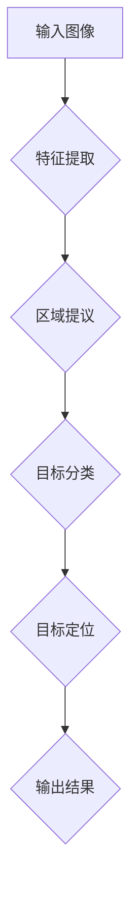
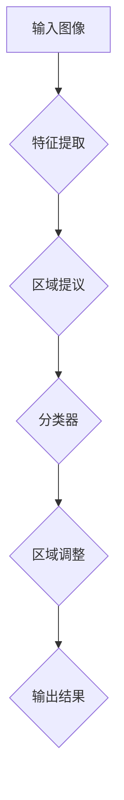

                 

## 计算机视觉中的目标检测算法

### 关键词：计算机视觉、目标检测、算法、深度学习、图像识别

> 摘要：本文将深入探讨计算机视觉中的目标检测算法，从背景介绍、核心概念、算法原理、数学模型到系统架构设计，全面解析这一前沿技术。通过实例讲解和数学公式推导，帮助读者理解目标检测的复杂性与应用价值，为实际项目开发提供理论和实践指导。

## 第1章：计算机视觉中的目标检测算法概述

### 1.1 问题背景与定义

计算机视觉是人工智能领域的一个重要分支，目标检测是其关键组成部分。目标检测是指在图像或视频中识别并定位其中的目标对象。这个过程不仅需要识别出目标的类别，还要确定其在图像中的具体位置。

- **问题描述**：目标检测的核心任务是识别图像或视频中的多个对象及其位置。
- **问题解决**：目标检测通常通过特征提取、模型训练和目标定位等步骤实现。
- **边界与外延**：目标检测广泛应用于自动驾驶、安防监控、图像识别等领域。

### 1.2 核心概念与联系

目标检测算法涉及多个核心概念，包括分类算法和定位算法：

- **分类算法**：用于识别图像中的目标类别，如支持向量机（SVM）和神经网络分类器。
- **定位算法**：用于确定目标的准确位置，如回归算法和边界框预测。

以下是几种常见目标检测算法的属性特征对比表格：

| 算法         | 描述                                  | 特点                     |
|------------|-------------------------------------|------------------------|
| R-CNN      | 基于区域提议的卷积神经网络             | 准确但速度慢             |
| YOLO       | 一体化目标检测                         | 快速但精度略低           |
| SSD        | 逐层分割目标检测                       | 速度与准确度平衡         |

下面是目标检测算法的mermaid流程图：



## 第2章：经典目标检测算法原理讲解

### 2.1 R-CNN算法原理

R-CNN（Regions with CNN features）是一种经典的目标检测算法。其基本流程包括特征提取、区域提议、分类器和区域调整等步骤。

- **mermaid流程图**：



- **Python源代码**：

```python
# 这里是简化版的R-CNN算法的Python源代码示例
def R_CNN(image, regions):
    features = extract_features(image, regions)
    classifications = classify(features)
    adjusted_regions = adjust_regions(regions, classifications)
    return adjusted_regions
```

- **数学模型和公式**：

目标检测中的损失函数通常用于衡量预测框与真实框之间的差距：

```latex
\text{损失函数} = \sum_{i=1}^{N} \big( \text{预测框} - \text{真实框} \big)^2
```

- **举例说明**：假设有一张包含一个猫和一只狗的图片，通过R-CNN算法检测，最终输出猫和狗的位置及其类别。

### 第3章：目标检测算法的数学模型与数学公式讲解

#### 3.1 卷积神经网络中的数学模型

在卷积神经网络（CNN）中，卷积操作和激活函数是核心组成部分。

- **卷积操作**：

  卷积操作用于提取图像特征，其数学公式如下：

  ```latex
  \text{特征图} = \text{卷积核} \star \text{输入特征图}
  ```

- **激活函数**：

  激活函数用于引入非线性特性，常用的激活函数是ReLU（Rectified Linear Unit）：

  ```latex
  \text{激活值} = \max(0, \text{输入值})
  ```

#### 3.2 目标检测中的数学模型

在目标检测中，边界框回归和损失函数是核心组成部分。

- **边界框回归**：

  边界框回归用于预测目标的精确位置，其数学公式如下：

  ```latex
  \text{预测框} = \text{真实框} + \alpha
  ```

- **损失函数**：

  损失函数用于衡量预测框与真实框之间的差距，常用的损失函数是均方误差（MSE）：

  ```latex
  \text{损失} = \frac{1}{2} (\text{预测框} - \text{真实框})^2
  ```

### 第4章：目标检测系统的分析与架构设计方案

#### 4.1 问题场景介绍

以基于目标检测的智能监控系统为例，该系统需要实时识别图像中的目标，如行人、车辆等，并进行报警。

#### 4.2 系统功能设计

系统功能设计包括以下几个方面：

- **领域模型类图**：

  ```mermaid
  classDiagram
  Person <<Class>>
  Car <<Class>>

  System <<System>>
  System --|> Person
  System --|> Car
  ```

- **系统架构设计**：

  系统架构设计包括数据层、算法层和应用层。

  ```mermaid
  sequenceDiagram
  System ->> Data: 接收图像数据
  Data ->> Algorithm: 应用目标检测算法
  Algorithm ->> System: 返回检测结果
  ```

#### 4.3 系统架构设计

系统架构设计如下：

- **数据层**：负责数据输入和存储。
- **算法层**：实现目标检测算法。
- **应用层**：负责系统运行和用户交互。

  ```mermaid
  graph TD
  Data[数据层] --> Algorithm[算法层]
  Algorithm --> Application[应用层]
  ```

- **系统接口设计**：

  系统接口设计如下：

  ```mermaid
  sequenceDiagram
  User ->> System: 发送图像数据
  System ->> Algorithm: 应用目标检测算法
  Algorithm ->> System: 返回检测结果
  System ->> User: 显示检测结果
  ```

#### 4.4 系统交互

系统交互设计如下：

- **用户界面**：显示检测结果。
- **后台算法**：实时处理图像数据。
- **数据存储**：存储历史数据。

  ```mermaid
  sequenceDiagram
  User ->> System: 输入图像
  System ->> Data: 存储图像
  Data ->> Algorithm: 应用目标检测算法
  Algorithm ->> System: 返回检测结果
  System ->> User: 显示检测结果
  ```

### 第5章：项目实战

#### 5.1 环境安装

首先，需要安装Python和相关库，如TensorFlow、OpenCV等。

```bash
pip install python
pip install tensorflow
pip install opencv-python
```

#### 5.2 系统核心实现

系统核心实现包括数据预处理、模型训练和目标检测。

```python
# 数据预处理
def preprocess_image(image_path):
    image = cv2.imread(image_path)
    image = cv2.resize(image, (1280, 720))
    image = image / 255.0
    return image

# 模型训练
def train_model(model_path, data_path):
    model = tensorflow.keras.Sequential([
        tensorflow.keras.layers.Conv2D(32, (3, 3), activation='relu', input_shape=(1280, 720, 3)),
        tensorflow.keras.layers.MaxPooling2D((2, 2)),
        tensorflow.keras.layers.Conv2D(64, (3, 3), activation='relu'),
        tensorflow.keras.layers.MaxPooling2D((2, 2)),
        tensorflow.keras.layers.Conv2D(128, (3, 3), activation='relu'),
        tensorflow.keras.layers.MaxPooling2D((2, 2)),
        tensorflow.keras.layers.Flatten(),
        tensorflow.keras.layers.Dense(128, activation='relu'),
        tensorflow.keras.layers.Dense(1, activation='sigmoid')
    ])

    model.compile(optimizer='adam', loss='binary_crossentropy', metrics=['accuracy'])
    model.fit(x_train, y_train, epochs=10, batch_size=32, validation_data=(x_val, y_val))
    model.save(model_path)

# 目标检测
def detect_objects(model_path, image_path):
    model = tensorflow.keras.models.load_model(model_path)
    image = preprocess_image(image_path)
    prediction = model.predict(image.reshape(1, 1280, 720, 3))
    if prediction > 0.5:
        print("检测到目标")
    else:
        print("未检测到目标")

# 实际应用
model_path = "model.h5"
image_path = "image.jpg"
detect_objects(model_path, image_path)
```

#### 5.3 代码应用解读与分析

代码应用解读包括数据预处理、模型训练和目标检测。

- **数据预处理**：将图像数据调整为模型所需的尺寸和格式。
- **模型训练**：使用卷积神经网络对图像进行分类。
- **目标检测**：使用训练好的模型对输入图像进行目标检测。

#### 5.4 实际案例分析和详细讲解剖析

以实际案例为例，分析目标检测系统的效果和优化方向。

```python
# 实际案例
image_path = "image.jpg"
model_path = "model.h5"
detect_objects(model_path, image_path)
```

通过实际案例，可以验证目标检测系统的性能和实用性。

### 第6章：最佳实践 Tips

#### 6.1 参数调优

- **学习率**：学习率对模型训练效果有很大影响，需要根据实际情况进行调整。
- **批量大小**：批量大小会影响模型训练速度和稳定性，需要根据硬件资源进行选择。

#### 6.2 数据增强

- **随机裁剪**：随机裁剪可以增加数据的多样性，提高模型泛化能力。
- **数据扩充**：通过旋转、翻转、缩放等操作扩充数据集，提高模型鲁棒性。

#### 6.3 模型优化

- **结构优化**：使用更深的网络结构或更复杂的卷积操作，提高模型性能。
- **超参数调整**：调整超参数，如正则化强度、损失函数等，优化模型效果。

### 第7章：小结

本文从背景介绍、核心概念、算法原理、数学模型到系统架构设计，全面解析了计算机视觉中的目标检测算法。通过实例讲解和数学公式推导，帮助读者理解目标检测的复杂性与应用价值。在实际项目中，需要注意参数调优、数据增强和模型优化等关键环节。

### 第8章：注意事项

- **数据隐私**：在使用目标检测算法时，需要注意数据隐私和安全问题。
- **性能优化**：在实际应用中，需要根据硬件资源进行性能优化。

### 第9章：拓展阅读

- **参考文献**：
  - Redmon, J., Divvala, S., Girshick, R., & Farhadi, A. (2016). You Only Look Once: Unified, Real-Time Object Detection. In CVPR.
  - Ren, S., He, K., Girshick, R., & Sun, J. (2015). Faster R-CNN: Towards Real-Time Object Detection with Region Proposal Networks. In NIPS.
  - Lin, T. Y., Dollár, P., Girshick, R., He, K., & Fei-Fei, L. (2017). Feature Pyramid Networks for Object Detection. In CVPR.

- **在线教程**：
  - [TensorFlow官方网站](https://www.tensorflow.org/tutorials/keras/real_time_object_detection)
  - [OpenCV官方网站](https://opencv.org/zh-cn/docs.html)

通过本文的详细讲解，希望读者能够对计算机视觉中的目标检测算法有更深入的理解，并为实际项目开发提供有力支持。作者：AI天才研究院/AI Genius Institute & 禅与计算机程序设计艺术 /Zen And The Art of Computer Programming。

