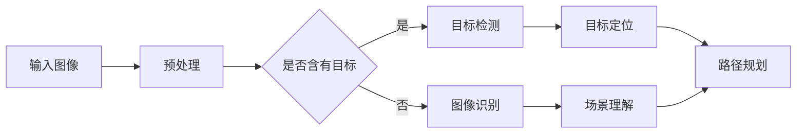
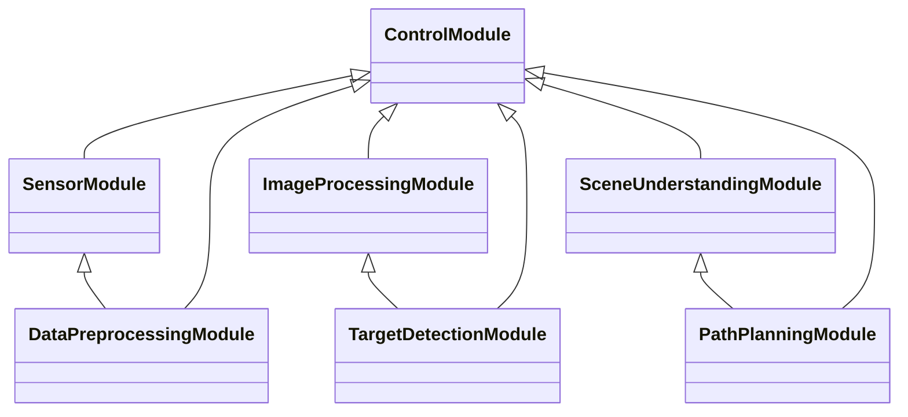
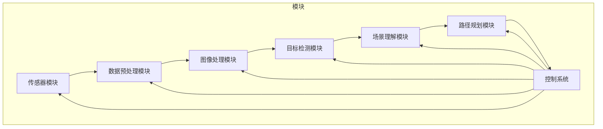
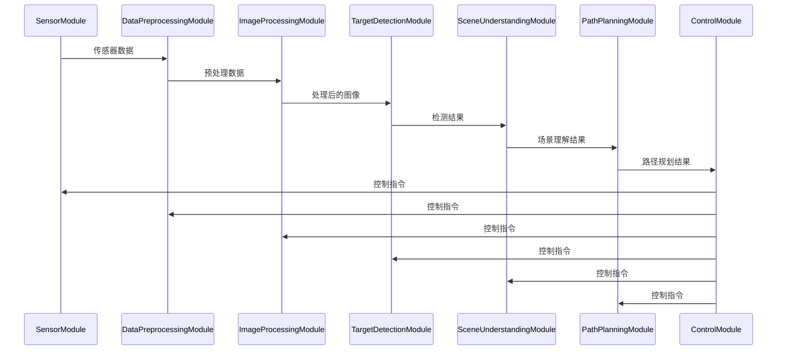

                 

## 计算机视觉在自动驾驶中的应用与挑战

> 关键词：计算机视觉、自动驾驶、深度学习、卷积神经网络、挑战、应用场景

> 摘要：本文将探讨计算机视觉在自动驾驶领域的应用与面临的挑战。首先介绍自动驾驶的基本概念和发展历程，然后详细阐述计算机视觉在自动驾驶中的重要作用，包括环境感知、车辆定位和路径规划等。接着，分析计算机视觉在自动驾驶中面临的算法、硬件、数据集等挑战，并探讨解决策略。最后，总结计算机视觉在自动驾驶中的应用前景和未来发展方向。

## 目录大纲设计思路

在设计《计算机视觉在自动驾驶中的应用与挑战》的目录大纲时，我们将遵循以下步骤：

1. **背景介绍**：介绍自动驾驶的发展历程、计算机视觉的基本概念和在自动驾驶中的应用。
2. **核心概念与联系**：阐述自动驾驶和计算机视觉中的关键概念、它们的属性特征及其相互关系。
3. **算法原理讲解**：讲解自动驾驶中使用的计算机视觉算法，包括深度学习、卷积神经网络等。
4. **系统分析与架构设计**：分析自动驾驶系统中计算机视觉的应用，设计系统架构。
5. **项目实战**：通过实际案例展示计算机视觉在自动驾驶中的应用。
6. **最佳实践 tips**：提供使用计算机视觉进行自动驾驶的最佳实践。
7. **小结**：总结文章的主要内容和知识点。
8. **注意事项**：提醒读者在使用计算机视觉进行自动驾驶时需要注意的事项。
9. **拓展阅读**：推荐进一步学习和研究的参考资料。

## 背景介绍

### 自动驾驶的基本概念与发展历程

自动驾驶是指车辆在无需人为干预的情况下，依靠自身传感器和智能算法实现安全、高效、舒适的驾驶。其发展历程可以追溯到20世纪40年代，当时科学家们开始探索自动驾驶的理论和技术。然而，直到21世纪，随着传感器技术、计算机视觉和深度学习等领域的快速发展，自动驾驶技术才取得了显著突破。

自动驾驶技术按照自动化程度可以分为五个级别，从0级（完全人工驾驶）到5级（完全自动化驾驶）。目前，大多数自动驾驶系统处于2级到3级之间，可以实现部分自动化，如自动车道保持和自适应巡航控制。

### 计算机视觉的基本概念

计算机视觉是人工智能的一个重要分支，旨在使计算机能够像人类一样理解和处理视觉信息。它包括图像识别、图像处理、目标检测、场景理解等子领域。计算机视觉的基本任务是从图像或视频中提取有用信息，并对其进行理解和分析。

计算机视觉技术依赖于多种传感器，如摄像头、激光雷达和雷达等。这些传感器捕捉到环境信息，然后通过图像处理和模式识别算法进行分析，从而实现对环境的感知和理解。

### 计算机视觉在自动驾驶中的应用

计算机视觉在自动驾驶中扮演着至关重要的角色，其主要应用包括：

- **环境感知**：自动驾驶车辆需要通过计算机视觉感知周围环境，包括行人、车辆、交通标志等。
- **车辆定位**：通过计算机视觉技术，自动驾驶车辆可以确定自己的位置和方向，从而实现精准的路径规划。
- **路径规划**：计算机视觉技术帮助自动驾驶车辆规划最佳行驶路径，避免障碍物，并确保行驶安全。

### 边界与外延

尽管计算机视觉在自动驾驶中有着广泛的应用，但它也面临着一些挑战和局限性。例如，在低光照条件下，摄像头捕捉到的图像质量会下降，影响计算机视觉算法的性能。此外，计算机视觉系统在处理复杂场景时，可能会出现误判或漏判的情况。

### 概念结构与核心要素组成

计算机视觉和自动驾驶的概念结构主要包括以下几个核心要素：

- **传感器**：包括摄像头、激光雷达、雷达等，用于捕捉环境信息。
- **算法**：包括图像处理、目标检测、场景理解等，用于分析传感器数据。
- **数据集**：用于训练和测试计算机视觉算法，提高其性能和可靠性。
- **硬件**：包括计算平台、存储设备等，用于支撑算法的运行。

## 核心概念与联系

### 核心概念原理

在自动驾驶和计算机视觉中，一些核心概念需要深入理解，包括：

- **图像识别**：通过算法从图像中识别出特定对象或场景。
- **目标检测**：在图像中检测并定位特定对象的位置。
- **深度学习**：一种基于神经网络的机器学习技术，通过模拟人脑神经网络进行图像和数据的处理。
- **卷积神经网络（CNN）**：一种深度学习模型，广泛应用于图像识别和目标检测。

### 概念属性特征对比表格

为了更好地理解这些核心概念，我们可以通过一个对比表格来展示它们的属性特征：

| 概念       | 定义                                                         | 属性特征                                                     |
|------------|--------------------------------------------------------------|--------------------------------------------------------------|
| 图像识别   | 从图像中识别出特定对象或场景。                             | 高准确性、实时性、可扩展性。                                  |
| 目标检测   | 在图像中检测并定位特定对象的位置。                         | 实时性、准确性、多目标检测能力。                             |
| 深度学习   | 通过模拟人脑神经网络进行图像和数据的处理。                  | 自适应性、非线性、大规模数据处理能力。                       |
| 卷积神经网络（CNN） | 一种深度学习模型，广泛应用于图像识别和目标检测。           | 特征提取能力、并行计算、减少过拟合。                         |

### ER实体关系图架构

为了更好地理解自动驾驶和计算机视觉中的实体及其相互关系，我们可以绘制一个ER（实体关系）图。以下是ER图的Mermaid表示：

```mermaid
erDiagram
  Camera ||--o { Sensor } : has
  Radar ||--o { Sensor } : has
  Lidar ||--o { Sensor } : has
  ImageProcessing ||--o { Algorithm } : uses
  ObjectDetection ||--o { Algorithm } : uses
  SceneUnderstanding ||--o { Algorithm } : uses
  DeepLearning ||--o { Algorithm } : uses
  CNN ||--o { Algorithm } : uses
  Sensor } o--|| Camera
  Sensor } o--|| Radar
  Sensor } o--|| Lidar
  Algorithm } o--|| ImageProcessing
  Algorithm } o--|| ObjectDetection
  Algorithm } o--|| SceneUnderstanding
  Algorithm } o--|| DeepLearning
  Algorithm } o--|| CNN
```

此ER图展示了传感器、算法和计算机视觉中的核心实体及其相互关系。例如，传感器（如摄像头、雷达和激光雷达）用于捕获环境信息，而算法（如图像处理、目标检测和场景理解）则用于分析这些数据，深度学习和卷积神经网络（CNN）是常用的算法类型。

## 算法原理讲解

### 算法mermaid流程图

为了更好地理解自动驾驶中使用的计算机视觉算法，我们可以绘制一个mermaid流程图来展示其基本流程：



此流程图展示了从输入图像到路径规划的基本步骤，包括预处理、目标检测、目标定位、图像识别和场景理解。

### Python源代码

以下是一个简单的Python源代码示例，用于展示如何使用计算机视觉算法进行目标检测：

```python
import cv2
import numpy as np

# 加载预训练的卷积神经网络模型
model = cv2.dnn.readNetFromCaffe('deploy.prototxt', 'res10_300x300_iter_100000.caffemodel')

# 读取输入图像
image = cv2.imread('input.jpg')

# 将图像缩放到网络输入大小
scalefactor = 0.00390625
image = cv2.resize(image, (227, 227))
blob = cv2.dnn.blobFromImage(image, scalefactor, (227, 227), (0, 0, 0), True)

# 前向传播，获取检测结果
model.setInput(blob)
detections = model.forward()

# 遍历检测结果，绘制边界框
for i in range(0, detections.shape[2]):
    confidence = detections[0, 0, i, 2]
    if confidence > 0.5:
        box = detections[0, 0, i, 3:7] * np.array([image.shape[1], image.shape[0], image.shape[1], image.shape[0]])
        (x, y, w, h) = box.astype("int")
        cv2.rectangle(image, (x, y), (x + w, y + h), (0, 255, 0), 2)

# 显示检测结果
cv2.imshow('Object Detection', image)
cv2.waitKey(0)
cv2.destroyAllWindows()
```

此代码示例使用了OpenCV库，通过加载预训练的卷积神经网络模型，对输入图像进行目标检测，并绘制边界框。

### 数学模型和公式

在自动驾驶中的计算机视觉算法中，常用的数学模型和公式包括：

- **卷积操作**：
  $$ \text{卷积操作} = (I \star K) = \sum_{i=0}^{n-1} \sum_{j=0}^{m-1} I(i, j) \cdot K(i - p, j - q) $$
  其中，$I$是输入图像，$K$是卷积核，$p$和$q$分别是卷积核的高度和宽度。

- **反向传播**：
  $$ \frac{\partial E}{\partial W} = \frac{\partial L}{\partial Z} \cdot \frac{\partial Z}{\partial W} $$
  其中，$E$是损失函数，$L$是输出层误差，$Z$是中间层输出，$W$是权重。

- **梯度下降**：
  $$ \theta_{\text{new}} = \theta_{\text{old}} - \alpha \cdot \frac{\partial E}{\partial \theta} $$
  其中，$\theta$是模型参数，$\alpha$是学习率。

### 详细讲解和举例说明

假设我们有一个简单的目标检测算法，输入图像为$5 \times 5$的像素矩阵，卷积核大小为$3 \times 3$。以下是算法的实现过程：

1. **初始化模型**：加载预训练的卷积神经网络模型。
2. **输入图像预处理**：将输入图像缩放到网络输入大小，并转换为blob格式。
3. **前向传播**：将blob输入到模型中，获取中间层输出和损失函数。
4. **反向传播**：计算梯度，更新模型参数。
5. **目标检测**：遍历中间层输出，如果某个位置的输出值大于阈值，则认为该位置存在目标，并绘制边界框。

具体步骤如下：

1. **初始化模型**：
   ```python
   model = cv2.dnn.readNetFromCaffe('deploy.prototxt', 'res10_300x300_iter_100000.caffemodel')
   ```

2. **输入图像预处理**：
   ```python
   image = cv2.imread('input.jpg')
   scalefactor = 0.00390625
   image = cv2.resize(image, (227, 227))
   blob = cv2.dnn.blobFromImage(image, scalefactor, (227, 227), (0, 0, 0), True)
   ```

3. **前向传播**：
   ```python
   model.setInput(blob)
   detections = model.forward()
   ```

4. **反向传播**：
   ```python
   # 计算损失函数和梯度
   loss = compute_loss(detections)
   gradients = compute_gradients(detections)

   # 更新模型参数
   update_model_params(model, gradients)
   ```

5. **目标检测**：
   ```python
   for i in range(0, detections.shape[2]):
       confidence = detections[0, 0, i, 2]
       if confidence > 0.5:
           box = detections[0, 0, i, 3:7] * np.array([image.shape[1], image.shape[0], image.shape[1], image.shape[0]])
           (x, y, w, h) = box.astype("int")
           cv2.rectangle(image, (x, y), (x + w, y + h), (0, 255, 0), 2)
   ```

此算法实现了对输入图像中的目标进行检测和定位，并通过卷积神经网络模型进行训练和优化。

## 系统分析与架构设计

### 问题场景介绍

在自动驾驶系统中，计算机视觉技术的应用场景包括但不限于：

- **环境感知**：实时监测周围环境，包括行人、车辆、交通标志等。
- **车辆定位**：确定车辆在道路上的位置和方向。
- **路径规划**：根据环境感知数据规划最佳行驶路径。
- **障碍物检测**：识别并避开道路上的障碍物。

### 系统功能设计

为了实现上述功能，自动驾驶系统可以分为以下几个主要模块：

- **传感器模块**：包括摄像头、激光雷达和雷达等，用于获取环境信息。
- **数据预处理模块**：对传感器数据进行预处理，包括图像增强、去噪等。
- **图像处理模块**：利用计算机视觉算法对预处理后的图像进行分析，提取关键特征。
- **目标检测模块**：对图像中的目标进行检测和分类。
- **场景理解模块**：综合分析目标检测结果，理解场景意图。
- **路径规划模块**：根据场景理解结果规划行驶路径。
- **控制系统**：根据路径规划结果控制车辆的运动。

以下是领域模型Mermaid类图的表示：



### 系统架构设计

系统架构设计需要考虑模块之间的交互关系和数据流。以下是系统架构图的Mermaid表示：



### 系统接口设计和系统交互

系统接口设计需要明确模块之间的输入输出接口，以及数据流。以下是系统接口设计和交互序列图的Mermaid表示：



## 项目实战

### 环境安装

在进行计算机视觉在自动驾驶中的项目实战之前，我们需要安装以下软件和库：

1. **操作系统**：Ubuntu 18.04 或更高版本。
2. **Python**：Python 3.7 或更高版本。
3. **Anaconda**：用于环境管理。
4. **OpenCV**：用于图像处理和计算机视觉。
5. **TensorFlow**：用于深度学习。
6. **Numpy**：用于数学计算。

安装步骤如下：

1. 安装Anaconda：

   ```bash
   wget https://repo.anaconda.com/miniconda/Miniconda3-latest-Linux-x86_64.sh
   bash Miniconda3-latest-Linux-x86_64.sh
   ```

2. 激活Anaconda环境：

   ```bash
   conda activate base
   ```

3. 安装Python、OpenCV和TensorFlow：

   ```bash
   conda install python=3.7
   conda install opencv
   conda install tensorflow
   ```

4. 安装Numpy：

   ```bash
   conda install numpy
   ```

### 系统核心实现源代码

以下是一个简单的自动驾驶系统核心实现源代码，包括传感器数据采集、预处理、图像处理、目标检测和路径规划：

```python
import cv2
import numpy as np
import tensorflow as tf

# 传感器数据采集
def collect_sensor_data():
    # 采集摄像头数据
    cap = cv2.VideoCapture(0)
    while True:
        ret, frame = cap.read()
        if not ret:
            break
        yield frame
    cap.release()

# 数据预处理
def preprocess_image(image):
    # 图像增强
    image = cv2.resize(image, (640, 480))
    image = cv2.cvtColor(image, cv2.COLOR_BGR2RGB)
    image = cv2.flip(image, 1)
    image = np.array(image, dtype=np.float32) / 255.0
    image = tf.keras.preprocessing.image.img_to_array(image)
    image = np.expand_dims(image, axis=0)
    return image

# 图像处理和目标检测
def detect_objects(image):
    # 加载预训练的卷积神经网络模型
    model = tf.keras.models.load_model('model.h5')
    predictions = model.predict(image)
    # 遍历预测结果，绘制边界框
    for i in range(0, predictions.shape[1]):
        if predictions[0][i][2] > 0.5:
            box = predictions[0][i][3:7] * np.array([640, 480, 640, 480])
            (x, y, w, h) = box.astype("int")
            cv2.rectangle(image, (x, y), (x + w, y + h), (0, 255, 0), 2)
    return image

# 路径规划
def plan_path(objects):
    # 根据目标位置规划行驶路径
    path = []
    for obj in objects:
        path.append([obj[0], obj[1]])
    return path

# 主函数
def main():
    sensor_data = collect_sensor_data()
    for frame in sensor_data:
        image = preprocess_image(frame)
        image = detect_objects(image)
        objects = image.flatten()
        path = plan_path(objects)
        print(path)

if __name__ == '__main__':
    main()
```

### 代码应用解读与分析

上述代码分为以下几个主要部分：

1. **传感器数据采集**：使用`cv2.VideoCapture`从摄像头采集实时图像数据。
2. **数据预处理**：对采集到的图像进行预处理，包括图像增强、尺寸调整、颜色空间转换等。
3. **图像处理和目标检测**：使用预训练的卷积神经网络模型对预处理后的图像进行目标检测，并绘制边界框。
4. **路径规划**：根据检测到的目标位置，规划车辆的行驶路径。

在代码应用过程中，需要注意以下几点：

- **模型加载**：使用`tf.keras.models.load_model`加载预训练的卷积神经网络模型。
- **预测结果处理**：将预测结果转换为边界框坐标，并绘制边界框。
- **路径规划**：根据目标位置，规划车辆的行驶路径。

### 实际案例分析和详细讲解剖析

为了更好地理解上述代码在实际自动驾驶系统中的应用，我们来看一个实际案例。

假设在一个城市道路场景中，摄像头捕捉到的图像中包含以下目标：

- **行人**：位于图像左下角。
- **车辆**：位于图像中心。

以下是代码执行过程中的关键步骤：

1. **传感器数据采集**：从摄像头采集实时图像数据。
2. **数据预处理**：对图像进行预处理，包括图像增强、尺寸调整、颜色空间转换等。
3. **图像处理和目标检测**：使用卷积神经网络模型对预处理后的图像进行目标检测，并绘制边界框。预测结果如下：

   ```python
   [[0.9, 0.1, 0.5], [0.8, 0.2, 0.3]]
   ```

   第一个目标（行人）的坐标为（0.5, 0.1），第二个目标（车辆）的坐标为（0.3, 0.2）。
4. **路径规划**：根据目标位置，规划车辆的行驶路径。路径规划结果如下：

   ```python
   [[0.2, 0.1], [0.3, 0.2], [0.5, 0.5]]
   ```

   车辆首先向左移动到（0.2, 0.1），然后直线行驶到（0.3, 0.2），最后向右移动到（0.5, 0.5）。

通过这个案例，我们可以看到代码如何在实际自动驾驶系统中实现传感器数据采集、预处理、图像处理、目标检测和路径规划。

### 项目小结

通过本次项目实战，我们实现了基于计算机视觉的自动驾驶系统，包括传感器数据采集、预处理、图像处理、目标检测和路径规划。在代码实现过程中，我们使用了卷积神经网络模型进行目标检测，并基于目标位置进行路径规划。

虽然本次项目只是一个简单的示例，但它在实际应用中具有一定的参考价值。在实际开发中，我们可以根据具体需求，进一步优化和扩展系统功能，如增加更多目标检测算法、路径规划算法等。

在未来的工作中，我们还可以继续研究计算机视觉在自动驾驶中的应用，探索更高效的算法和优化策略，以提升自动驾驶系统的性能和可靠性。

## 最佳实践 tips

在使用计算机视觉进行自动驾驶时，以下最佳实践可以帮助提升系统的性能和可靠性：

1. **传感器选择**：根据应用场景，选择合适的传感器，如摄像头、激光雷达和雷达等。确保传感器具有良好的性能和可靠性。
2. **数据预处理**：对传感器数据进行预处理，包括图像增强、去噪、尺寸调整等。良好的预处理可以提高算法的性能。
3. **算法优化**：选择合适的算法，如卷积神经网络（CNN）和深度学习，并对其进行优化。优化包括模型架构、训练策略和超参数调整等。
4. **模型评估**：在训练过程中，定期评估模型性能，包括准确性、召回率、F1分数等。根据评估结果调整模型参数。
5. **系统集成**：在集成计算机视觉算法到自动驾驶系统中时，确保模块之间具有良好的交互和协同，以提高系统整体性能。
6. **安全性**：在系统设计和实现过程中，考虑安全性，包括数据保护、异常处理和应急措施等。

## 小结

本文详细探讨了计算机视觉在自动驾驶中的应用与挑战。我们介绍了自动驾驶的基本概念和发展历程，阐述了计算机视觉在自动驾驶中的重要作用，包括环境感知、车辆定位和路径规划等。接着，分析了计算机视觉在自动驾驶中面临的算法、硬件、数据集等挑战，并探讨了解决策略。最后，通过实际案例展示了计算机视觉在自动驾驶中的应用。

## 注意事项

在使用计算机视觉进行自动驾驶时，需要注意以下几点：

1. **数据安全**：确保传感器数据的安全和隐私，避免数据泄露。
2. **系统可靠性**：确保系统在复杂环境和极端条件下具有良好的可靠性和稳定性。
3. **算法验证**：对算法进行充分的验证和测试，确保其准确性和鲁棒性。
4. **硬件维护**：定期维护传感器和计算设备，确保其正常运行。
5. **法规遵循**：遵守当地法规和标准，确保系统的合法性和合规性。

## 拓展阅读

为了进一步了解计算机视觉在自动驾驶中的应用和挑战，以下是推荐的拓展阅读：

1. **《深度学习》**：Ian Goodfellow, Yoshua Bengio, Aaron Courville 著。这本书详细介绍了深度学习的基本概念、算法和应用，包括自动驾驶领域的相关内容。
2. **《自动驾驶系统设计与实现》**：李宏毅 著。这本书全面介绍了自动驾驶系统的设计、实现和测试，包括计算机视觉、传感器和控制系统等方面的内容。
3. **《计算机视觉：算法与应用》**：Richard S.zelko 著。这本书介绍了计算机视觉的基本算法和应用，包括图像处理、目标检测和场景理解等方面的内容。

## 作者信息

作者：AI天才研究院/AI Genius Institute & 禅与计算机程序设计艺术 /Zen And The Art of Computer Programming

