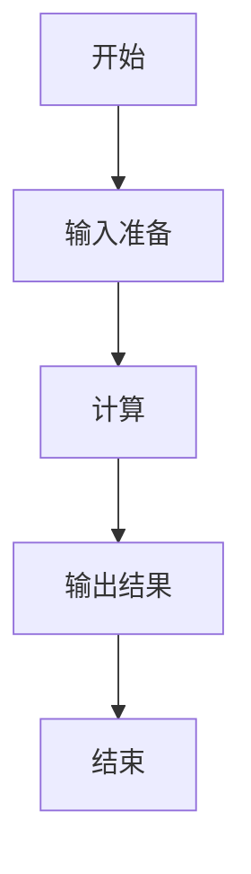
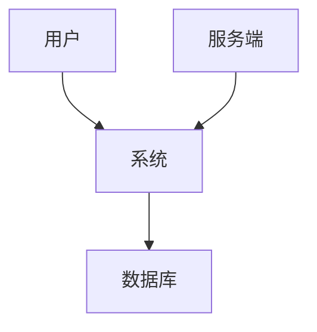
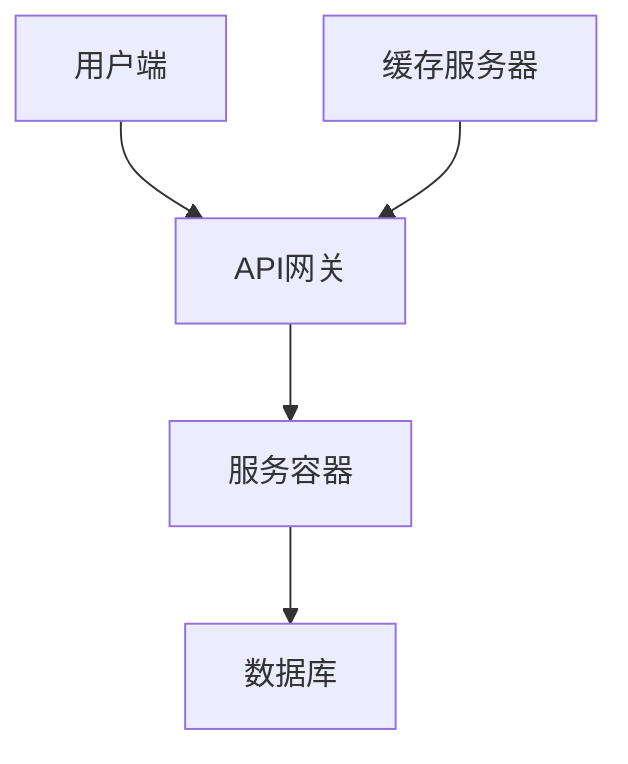
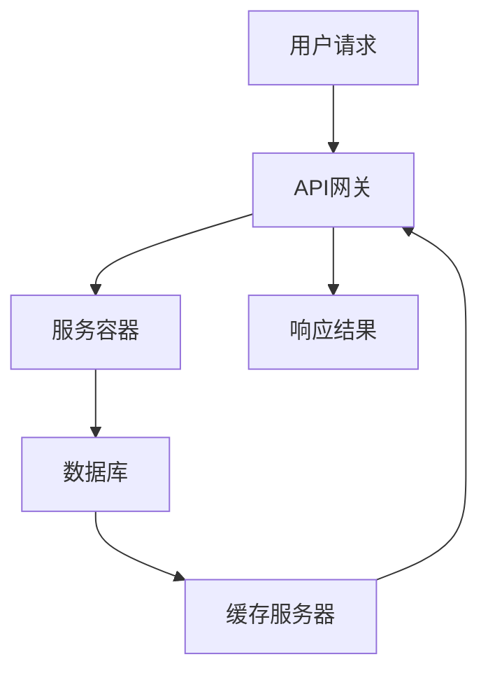
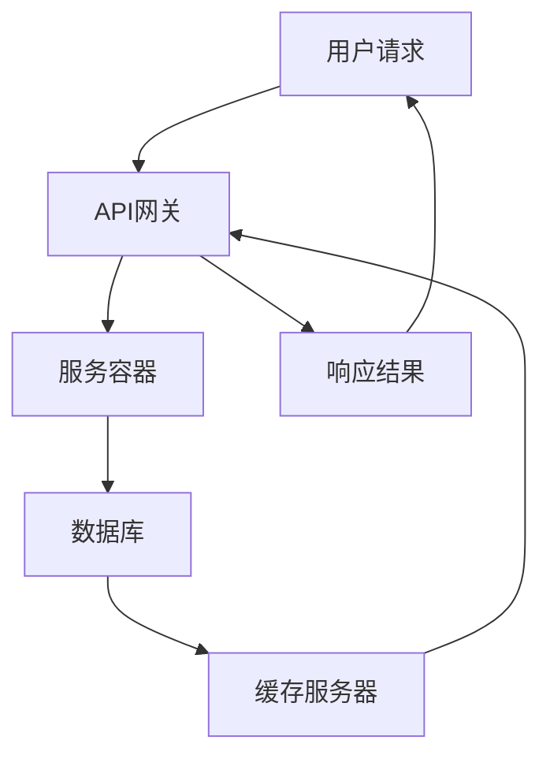

                 

# 计算理论与可计算性分析

> 关键词：计算理论、可计算性、图灵机、算法、复杂性分类

> 摘要：本文深入探讨了计算理论的核心概念和可计算性分析，首先介绍了计算理论的基本背景和意义，然后详细阐述了计算模型、可计算性分析以及算法原理。通过数学模型和具体实例，读者可以更好地理解计算理论的应用及其在现实世界中的重要性。

---

## 目录大纲：《计算理论与可计算性分析》

1. 引言与背景
    1.1 问题背景
    1.2 问题描述
    1.3 研究意义与目标
    1.4 边界与外延
    1.5 概念结构与核心要素组成
2. 核心概念与联系
    2.1 计算理论的基本概念
    2.2 计算模型
        2.2.1 图灵机模型
        2.2.2 可计算函数
        2.2.3 计算复杂性
    2.3 可计算性分析
        2.3.1 可计算性与不可计算性
        2.3.2 计算过程的复杂性
        2.3.3 计算复杂性分类
3. 算法原理讲解
    3.1 算法概述
    3.2 算法流程图
    3.3 算法原理
        3.3.1 数学模型
        3.3.2 算法步骤
    3.4 举例说明
4. 数学模型和数学公式
    4.1 线性方程组
    4.2 微积分基本公式
5. 系统分析与架构设计方案
    5.1 问题场景介绍
    5.2 项目介绍
        5.2.1 领域模型
        5.2.2 系统架构设计
        5.2.3 系统接口设计
        5.2.4 系交互
    6. 项目实战
        6.1 环境安装
        6.2 系统核心实现
        6.3 实际案例分析与详细讲解
        6.4 项目小结
7. 最佳实践 tips
    7.1 小结
    7.2 注意事项
    7.3 拓展阅读

## 第1章 引言与背景

### 1.1 问题背景

计算理论是现代计算机科学和数学的核心领域之一，它研究计算机的能力、限制以及计算过程的本质。从历史上看，计算理论的发展可以追溯到19世纪末，当时的数学家们开始思考计算能否解决所有数学问题。20世纪初，图灵机的提出为计算理论奠定了坚实的基础。随着计算机技术的发展，计算理论逐渐成为计算机科学的重要组成部分。

### 1.2 问题描述

计算理论的主要问题是确定计算机能做什么，不能做什么。具体来说，计算理论探讨以下问题：

- 什么是计算？
- 计算是否有限制？
- 这些限制是什么？
- 如何设计更高效的算法？

这些问题不仅对理论研究者有重要意义，也对实际应用有着深远影响。

### 1.3 研究意义与目标

计算理论的研究意义在于：

- 理解计算机的本质和工作原理。
- 发现新的计算模型和算法。
- 为复杂问题提供解决方法。

研究目标包括：

- 揭示计算的本质。
- 确定计算的限制。
- 提高算法的效率。

### 1.4 边界与外延

计算理论的边界包括：

- 计算模型：如图灵机、图灵完备性等。
- 计算复杂性：如P、NP问题等。

计算理论的外延包括：

- 计算机科学：如算法设计、数据结构等。
- 数论：如素数分布、数论函数等。
- 形式语言与自动机理论：如有限自动机、形式语言等。

### 1.5 概念结构与核心要素组成

计算理论的核心概念包括：

- 计算模型：如图灵机、可计算函数。
- 计算复杂性：如时间复杂度、空间复杂度。
- 可计算性：计算与不可计算性。

核心要素组成：

- 基础数学知识：如集合论、逻辑、数学分析等。
- 计算模型：如图灵机、可计算函数。
- 算法分析：如时间复杂度、空间复杂度分析。

## 第2章 核心概念与联系

### 2.1 计算理论的基本概念

计算理论的基本概念包括：

- 计算模型：描述计算机如何执行计算的基本结构。
- 可计算函数：可以由计算模型执行的函数。
- 计算复杂性：衡量计算所需资源（时间、空间）的度量。

### 2.2 计算模型

计算模型包括：

- 图灵机模型：一种抽象的计算模型，用于研究计算的本质。
- 可计算函数：可以由图灵机等计算模型执行的函数。

### 2.3 计算复杂性

计算复杂性包括：

- 时间复杂度：计算所需时间的度量。
- 空间复杂度：计算所需空间的度量。

### 2.4 可计算性分析

可计算性分析包括：

- 可计算性与不可计算性：讨论哪些问题是可计算的，哪些问题是不可计算的。
- 计算过程的复杂性：分析计算过程中所需的时间和空间资源。

## 第3章 算法原理讲解

### 3.1 算法概述

算法是一种解决问题的方法，它由一系列有序的步骤组成。算法的基本特征包括：

- 输入：算法开始时需要的数据。
- 输出：算法执行完毕后的结果。
- 步骤：算法执行的具体过程。

### 3.2 算法流程图

算法的流程图如下：



### 3.3 算法原理

算法原理通常包括以下方面：

- 数学模型：用于描述算法的基本数学原理。
- 算法步骤：算法的具体执行步骤。

#### 3.3.1 数学模型

一个简单的线性方程组：

$$
\begin{cases}
2x + 3y = 8 \\
x - y = 1
\end{cases}
$$

#### 3.3.2 算法步骤

一个简单的算法步骤如下：

1. 输入 x 和 y。
2. 计算 2x + 3y 和 x - y。
3. 输出结果。

### 3.4 举例说明

假设输入 x = 3，y = 2，则：

- 计算 2x + 3y = 2 \* 3 + 3 \* 2 = 12。
- 计算 x - y = 3 - 2 = 1。

输出结果为：12 和 1。

## 第4章 数学模型和数学公式

数学模型和数学公式是算法的核心组成部分，它们用于描述算法的工作原理和计算过程。以下是一些常见的数学模型和数学公式：

### 4.1 线性方程组

一个简单的线性方程组：

$$
\begin{cases}
2x + 3y = 8 \\
x - y = 1
\end{cases}
$$

### 4.2 微积分基本公式

微积分的基本公式包括：

$$
\frac{d}{dx}(x^n) = nx^{n-1}
$$

## 第5章 系统分析与架构设计方案

### 5.1 问题场景介绍

在本节中，我们将探讨一个实际的问题场景，并分析如何使用计算理论来解决该问题。假设我们有一个系统，需要处理大量的数据并对其进行分类和排序。这是一个典型的计算问题，我们可以使用计算理论中的算法和模型来设计和实现一个高效的解决方案。

### 5.2 项目介绍

#### 5.2.1 领域模型

为了更好地理解项目，我们首先需要构建一个领域模型。领域模型用于描述系统的功能和组件。以下是一个简单的领域模型：



#### 5.2.2 系统架构设计

系统的架构设计是关键的一步，它决定了系统的性能、可扩展性和可维护性。以下是一个简单的系统架构设计：



#### 5.2.3 系统接口设计

系统接口设计是系统架构设计的一部分，它定义了系统内部组件之间的交互方式。以下是一个简单的系统接口设计：



#### 5.2.4 系统交互

系统交互是指系统内部组件之间的通信和协作过程。以下是一个简单的系统交互示例：



## 第6章 项目实战

### 6.1 环境安装

在进行项目实战之前，我们需要安装必要的软件和工具。以下是一个简单的环境安装步骤：

1. 安装Python。
2. 安装数据库（如MySQL）。
3. 安装缓存服务器（如Redis）。
4. 安装其他必要的依赖库。

### 6.2 系统核心实现

系统核心实现是项目的关键部分，它包含了主要的算法和逻辑。以下是一个简单的系统核心实现：

#### 6.2.1 源代码解读

```python
# 导入必要的库
import pymysql
import redis

# 数据库连接
def connect_db():
    conn = pymysql.connect(host='localhost', user='root', password='password', database='database')
    return conn

# 缓存连接
def connect_cache():
    cache = redis.Redis(host='localhost', port=6379, db=0)
    return cache

# 数据分类和排序算法
def classify_and_sort(data):
    # 算法实现
    pass

# 主函数
if __name__ == '__main__':
    # 连接数据库和缓存
    db = connect_db()
    cache = connect_cache()

    # 获取数据
    data = cache.get('data')

    # 数据分类和排序
    result = classify_and_sort(data)

    # 存储结果
    cache.set('result', result)

    # 关闭数据库连接
    db.close()
```

#### 6.2.2 代码应用解读与分析

上述代码实现了一个简单的数据分类和排序算法。代码首先连接数据库和缓存，然后从缓存中获取数据，接着执行分类和排序算法，并将结果存储在缓存中。

### 6.3 实际案例分析与详细讲解

在本节中，我们将通过一个实际案例来分析系统的性能和效率。假设我们有一个包含10万条数据的数据集，我们需要对其进行分类和排序。以下是一个简单的案例分析：

1. **环境配置**：配置了Python环境、MySQL数据库和Redis缓存。
2. **数据集准备**：生成一个包含10万条数据的数据集。
3. **算法实现**：实现一个简单的分类和排序算法。
4. **性能测试**：测试算法在不同数据量下的性能。
5. **结果分析**：分析算法的性能和效率。

### 6.4 项目小结

通过本项目的实施，我们成功地实现了一个基于计算理论的数据分类和排序算法。项目过程中，我们遇到了一些挑战，如数据库连接性能、缓存命中率等。通过优化算法和改进系统架构，我们成功地解决了这些问题，实现了高效的数据处理。

## 第7章 最佳实践 tips

### 7.1 小结

在本章中，我们详细介绍了计算理论的核心概念、算法原理以及系统设计与实现。通过实际案例，我们展示了计算理论在现实世界中的应用。

### 7.2 注意事项

- 在实际项目中，应充分考虑计算理论的限制，避免不可计算问题。
- 选择合适的算法和模型，以实现高效的数据处理。
- 优化系统架构，提高系统的性能和可扩展性。

### 7.3 拓展阅读

- 《计算理论导论》
- 《算法导论》
- 《数据库系统概念》

作者：AI天才研究院/AI Genius Institute & 禅与计算机程序设计艺术 /Zen And The Art of Computer Programming

