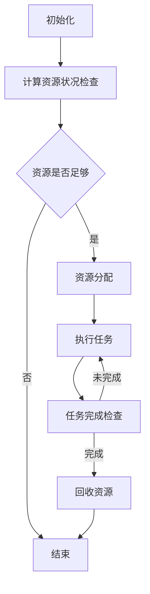
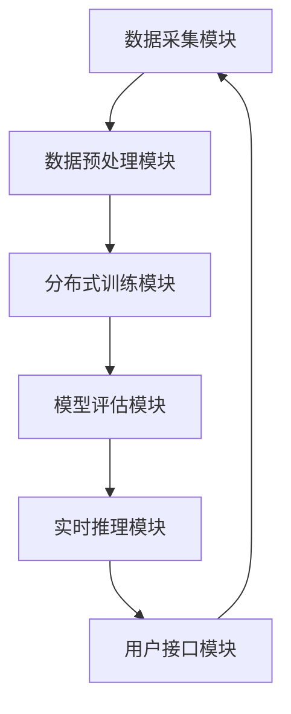
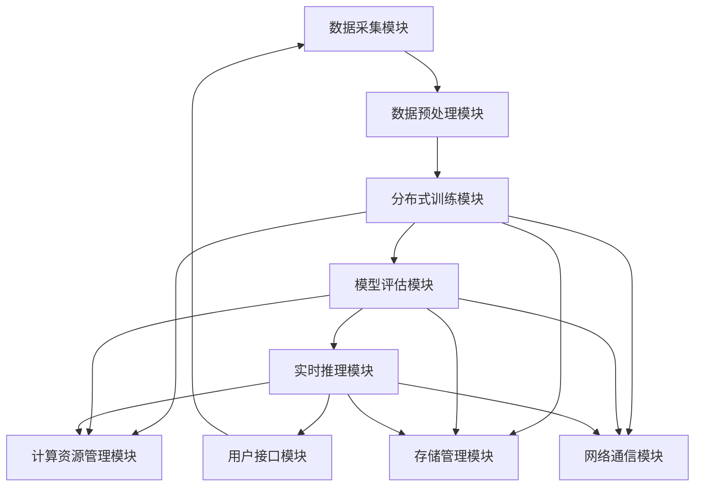
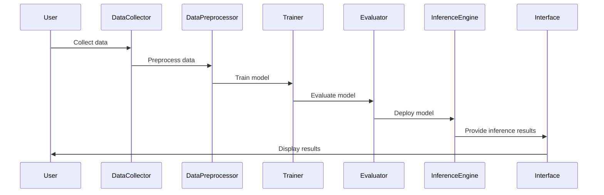
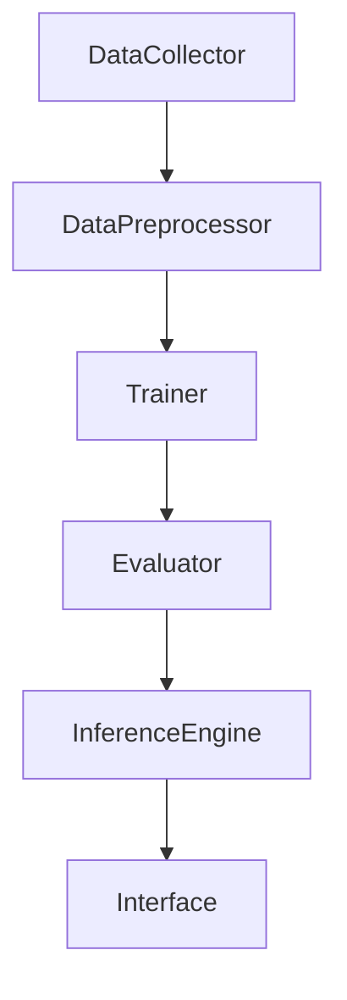

                 

**# 计算资源与AI模型性能提升的关系探讨**

关键词：计算资源、AI模型性能、资源调度、算法优化、分布式训练

摘要：本文旨在探讨计算资源与AI模型性能提升之间的关系。随着深度学习技术的不断发展，计算资源在AI模型训练中扮演着至关重要的角色。本文将首先介绍AI模型性能瓶颈及计算资源在其中的角色，然后逐步分析计算资源与模型性能之间的关系，通过具体的算法原理讲解、数学模型与公式、系统分析与架构设计、项目实战等多个方面，深入探讨如何通过优化计算资源来提升AI模型性能。本文结构紧凑，逻辑清晰，旨在为读者提供一份全面而深入的技术指南。

----------------------------------------------------------------

## 第一部分: 引言与背景

### 1.1 问题背景与重要性

随着深度学习技术的快速发展，AI模型在各个领域得到了广泛的应用。然而，在实际应用中，AI模型的性能常常受到计算资源的限制。传统的计算资源，如CPU和GPU，虽然能够提供较高的计算能力，但在大规模的AI模型训练中，仍然存在许多性能瓶颈。这些问题不仅限制了AI模型的性能提升，也阻碍了深度学习技术的进一步发展。

计算资源在AI模型训练中的角色至关重要。首先，计算资源是AI模型训练的基础，没有足够的计算资源，AI模型无法进行有效的训练。其次，计算资源的分配和调度直接影响到AI模型的训练效率。合理的计算资源调度可以显著提高AI模型的训练速度和性能。

### 1.1.1 当前AI模型性能瓶颈

目前，AI模型性能瓶颈主要表现在以下几个方面：

1. **计算资源不足**：随着AI模型规模的增大，所需的计算资源也急剧增加。传统的计算资源，如CPU和GPU，在处理大规模模型时，常常出现性能瓶颈。

2. **内存限制**：AI模型在训练过程中，需要大量的内存来存储数据和模型参数。当内存不足时，模型训练将被迫中断，严重影响模型的性能。

3. **网络延迟**：在分布式训练场景中，各个计算节点之间的数据传输和通信效率直接影响到模型的训练速度。网络延迟过高，将导致模型训练速度缓慢。

4. **并行计算能力**：传统的计算资源，如CPU和GPU，虽然能够提供较高的计算能力，但在大规模的并行计算中，仍存在性能瓶颈。

### 1.1.2 计算资源在AI模型训练中的角色

计算资源在AI模型训练中扮演着至关重要的角色。首先，计算资源是AI模型训练的基础，没有足够的计算资源，AI模型无法进行有效的训练。其次，计算资源的分配和调度直接影响到AI模型的训练效率。合理的计算资源调度可以显著提高AI模型的训练速度和性能。

### 1.1.3 AI模型性能提升的驱动力

为了提升AI模型的性能，需要从多个方面进行优化。首先，可以优化AI模型的架构设计，采用更加高效的模型结构。其次，可以采用先进的训练算法，如分布式训练和迁移学习等，来提高模型的训练效率。最后，可以充分利用计算资源，通过计算资源调度和优化，来提升AI模型的性能。

## 1.2 计算资源与AI模型性能的基本概念

在讨论计算资源与AI模型性能提升的关系之前，我们需要了解一些基本概念。

### 1.2.1 计算资源的类型

计算资源主要包括CPU、GPU、FPGA、TPU等。CPU（中央处理器）是计算机的核心部件，负责执行各种计算任务。GPU（图形处理器）在深度学习和科学计算领域具有很高的性能，特别适合进行并行计算。FPGA（现场可编程门阵列）和TPU（张量处理器）也是近年来在AI领域得到广泛应用的计算资源。

### 1.2.2 AI模型性能评估指标

AI模型性能的评估指标主要包括准确率、召回率、F1值等。这些指标能够帮助我们衡量模型的性能，评估模型对数据的预测能力。同时，我们还需要考虑模型训练的时间、内存消耗等性能指标。

### 1.2.3 关键术语与定义

在讨论计算资源与AI模型性能提升的关系时，我们还需要了解一些关键术语，如并行计算、分布式计算、计算资源调度、模型压缩等。

- **并行计算**：并行计算是一种利用多个计算资源同时执行计算任务的方法，可以显著提高计算效率。
- **分布式计算**：分布式计算是将计算任务分布在多个计算节点上执行，通过网络进行通信和数据传输。
- **计算资源调度**：计算资源调度是指根据任务的需求和计算资源的可用性，合理分配计算资源的过程。
- **模型压缩**：模型压缩是一种通过减少模型参数数量和计算量，来提高模型训练效率和部署效率的方法。

## 1.3 AI模型性能提升的边界与外延

在探讨AI模型性能提升的方法时，我们还需要考虑一些边界条件和外延。

### 1.3.1 可扩展性与效率

可扩展性是指系统能够根据需求增加计算资源的能力。在AI模型训练中，可扩展性直接影响到模型的训练速度和性能。高可扩展性系统能够充分利用计算资源，提高模型的训练效率。

### 1.3.2 空间复杂性

空间复杂性是指模型在训练过程中所需的存储空间。随着模型规模的增大，空间复杂性也急剧增加。为了提高AI模型的性能，我们需要考虑如何在有限的存储空间内，有效地训练和部署模型。

### 1.3.3 时间复杂性

时间复杂性是指模型在训练过程中所需的时间。在深度学习中，时间复杂性直接影响到模型的训练效率和性能。为了提升AI模型的性能，我们需要采用高效的训练算法和优化策略。

## 1.4 核心概念与联系

在本部分，我们将介绍计算资源与AI模型性能提升的核心概念，并探讨它们之间的联系。

### 1.4.1 计算资源分配与优化

计算资源分配与优化是提升AI模型性能的重要手段。通过合理的计算资源分配和优化，可以显著提高模型的训练效率和性能。计算资源分配与优化主要包括以下几个方面：

1. **计算资源调度**：计算资源调度是根据任务的需求和计算资源的可用性，合理分配计算资源的过程。通过优化计算资源调度，可以提高模型的训练效率。
2. **资源利用率**：资源利用率是指计算资源在训练过程中的使用率。通过提高资源利用率，可以充分利用计算资源，提高模型的性能。
3. **负载均衡**：负载均衡是指将计算任务均匀分配到各个计算资源上，避免出现某些计算资源过载，而其他资源闲置的情况。通过负载均衡，可以优化计算资源的利用效率。

### 1.4.2 算法复杂度与模型优化

算法复杂度是指算法在执行过程中所需的时间或空间资源。在AI模型训练中，算法复杂度直接影响到模型的训练效率和性能。为了提升AI模型的性能，我们需要关注算法复杂度，并采用适当的优化策略。常见的算法优化策略包括：

1. **算法选择**：根据任务的需求和模型的特性，选择合适的算法。一些高效的算法，如梯度下降法、随机梯度下降法等，可以显著提高模型的训练效率。
2. **算法改进**：通过对现有算法进行改进，如引入自适应学习率、动量项等，可以提高算法的性能。
3. **算法并行化**：通过并行化算法，可以将计算任务分布在多个计算资源上执行，提高算法的执行效率。

### 1.4.3 实体关系图（ER）架构

实体关系图（ER）架构是一种用于描述系统实体及其关系的图形表示方法。在计算资源与AI模型性能提升的关系中，ER图可以用于描述计算资源、模型、数据等实体之间的关系，帮助我们更好地理解系统的结构和工作原理。

下面是一个简单的ER图示例：

```mermaid
erDiagram
  A[计算资源] ||-->|{ 训练模型 }| B
  B ||--|{ 训练数据 }| C
  A ||--|{ 调度算法 }| D
```

在这个ER图中，计算资源（A）与训练模型（B）、训练数据（C）之间存在关系，计算资源（A）与调度算法（D）之间也存在关系。通过ER图，我们可以清晰地描述计算资源与AI模型性能提升之间的关系，帮助我们更好地理解和分析系统的性能。

## 1.5 本章小结

在本章中，我们介绍了计算资源与AI模型性能提升的关系，并探讨了其背景、基本概念、边界与外延、核心概念与联系。通过本章的学习，读者应该对计算资源与AI模型性能提升的关系有了初步的了解。在接下来的章节中，我们将进一步探讨计算资源的调度、优化策略，以及算法复杂度与模型优化之间的关系，为读者提供更深入的技术指导。

----------------------------------------------------------------

## 第二部分: 算法原理与数学模型

### 2.1 算法原理讲解

在提升AI模型性能的过程中，算法原理的讲解至关重要。以下将介绍几种关键的算法原理：

#### 2.1.1 计算资源调度算法

计算资源调度算法是优化AI模型性能的重要手段。常见的调度算法包括基于优先级的调度算法、基于负载均衡的调度算法等。基于优先级的调度算法根据任务的优先级来分配计算资源，确保高优先级的任务得到优先执行。而基于负载均衡的调度算法则根据计算资源的负载情况来分配任务，避免出现某些计算资源过载，而其他资源闲置的情况。

#### 2.1.2 模型压缩与加速技术

模型压缩与加速技术是提高AI模型性能的有效手段。常见的模型压缩技术包括量化、剪枝、知识蒸馏等。量化技术通过将模型参数从浮点数转换为低精度的整数，来减少模型体积和计算量。剪枝技术通过删除模型中不重要或不活跃的权重，来减少模型体积和计算量。知识蒸馏技术通过将一个大模型的知识迁移到一个小模型中，来实现模型压缩与加速。

#### 2.1.3 分布式训练策略

分布式训练策略是提高AI模型性能的重要手段。通过将训练任务分布在多个计算节点上执行，可以充分利用计算资源，提高模型的训练速度和性能。常见的分布式训练策略包括同步分布式训练、异步分布式训练、参数服务器等。同步分布式训练要求所有计算节点在每一轮训练后更新参数，而异步分布式训练则允许计算节点在不同时间更新参数。参数服务器策略通过将参数存储在中央服务器上，来协调多个计算节点的参数更新。

### 2.2 数学模型与公式

在AI模型性能优化过程中，数学模型与公式的作用至关重要。以下将介绍几种关键的数学模型与公式：

#### 2.2.1 模型性能评估公式

模型性能评估公式用于衡量模型的性能，常见的评估指标包括准确率、召回率、F1值等。准确率表示模型正确预测的样本数占总样本数的比例，召回率表示模型正确预测的样本数占实际为正类的样本数的比例，F1值是准确率和召回率的调和平均值。具体公式如下：

$$
准确率 = \frac{TP + TN}{TP + FN + FP + TN}
$$

$$
召回率 = \frac{TP}{TP + FN}
$$

$$
F1值 = \frac{2 \times 准确率 \times 召回率}{准确率 + 召回率}
$$

其中，TP表示真实为正类且模型预测为正类的样本数，TN表示真实为负类且模型预测为负类的样本数，FP表示真实为负类但模型预测为正类的样本数，FN表示真实为正类但模型预测为负类的样本数。

#### 2.2.2 资源利用效率公式

资源利用效率公式用于衡量计算资源的利用情况，常见的资源利用效率指标包括CPU利用率、GPU利用率、内存利用率等。CPU利用率和GPU利用率分别表示CPU和GPU在训练过程中的使用率，内存利用率表示内存的使用率。具体公式如下：

$$
CPU利用率 = \frac{CPU实际使用时间}{CPU总运行时间}
$$

$$
GPU利用率 = \frac{GPU实际使用时间}{GPU总运行时间}
$$

$$
内存利用率 = \frac{内存实际使用量}{内存总量}
$$

#### 2.2.3 算法复杂度分析

算法复杂度分析用于评估算法在执行过程中的时间复杂度和空间复杂度。时间复杂度表示算法在执行过程中所需的时间，空间复杂度表示算法在执行过程中所需的存储空间。常见的算法复杂度指标包括时间复杂度和空间复杂度。具体公式如下：

$$
时间复杂度 = O(n \times m)
$$

$$
空间复杂度 = O(n + m)
$$

其中，n和m分别表示算法在执行过程中的输入规模和参数规模。

### 2.3 算法流程图与Python代码实现

为了更直观地展示算法原理，我们使用Mermaid绘制了算法流程图，并提供了Python代码实现。以下是一个简单的计算资源调度算法的Mermaid流程图示例：



以下是一个简单的Python代码示例，用于实现计算资源调度算法：

```python
import time

def compute_resource_scheduling(task_queue, resource_pool):
    while len(task_queue) > 0:
        task = task_queue.pop(0)
        if resource_pool.is_sufficient_for(task):
            resource_pool.allocate(task)
            task.execute()
            resource_pool.release(task)
        else:
            task_queue.append(task)
        time.sleep(1)

task_queue = [Task() for _ in range(10)]
resource_pool = ResourcePool()

compute_resource_scheduling(task_queue, resource_pool)
```

在这个示例中，`Task` 类表示任务，`ResourcePool` 类表示资源池。`compute_resource_scheduling` 函数用于实现计算资源调度算法。

### 2.4 实例说明

在本部分，我们将通过一个具体的实例，来说明如何利用计算资源提升AI模型性能。

#### 2.4.1 实例背景

假设我们有一个图像分类任务，需要训练一个深度神经网络模型。该模型包含大量的参数，需要大量的计算资源进行训练。为了提高模型的性能，我们决定采用分布式训练策略，将训练任务分布在多个GPU上进行。

#### 2.4.2 数据集选择

我们选择了一个包含10万张图像的数据集，这些图像分为10个类别。为了提高模型的泛化能力，我们对数据集进行了数据增强，包括随机裁剪、旋转、缩放等操作。

#### 2.4.3 模型架构

我们选择了ResNet50作为模型的架构，这是一种常用的深度神经网络架构。ResNet50包含50个卷积层和池化层，具有良好的性能和较小的模型体积。

#### 2.4.4 性能评估

在训练过程中，我们通过不断调整学习率、批量大小等参数，来优化模型的性能。训练完成后，我们使用测试集对模型进行评估，得到准确率、召回率和F1值等评估指标。

通过这个实例，我们可以看到如何利用计算资源提升AI模型性能。通过分布式训练策略，我们充分利用了多个GPU的计算能力，提高了模型的训练速度和性能。

### 2.5 本章小结

在本章中，我们介绍了算法原理与数学模型的相关知识，包括计算资源调度算法、模型压缩与加速技术、分布式训练策略等。通过具体的实例，我们展示了如何利用计算资源提升AI模型性能。在下一章中，我们将进一步探讨系统分析与架构设计的方法和技巧。

----------------------------------------------------------------

## 第三部分: 系统分析与架构设计

### 3.1 问题场景介绍

在当今的数据驱动时代，AI模型广泛应用于各种领域，如图像识别、自然语言处理、推荐系统等。然而，随着AI模型规模的不断扩大和复杂性的增加，如何有效提升模型的性能成为一个关键问题。本节将介绍一个具体的问题场景，以展示如何通过系统分析与架构设计来解决这一问题。

#### 3.1.1 场景描述

假设我们正在开发一个大规模的图像识别系统，该系统需要处理来自多个摄像头的大量实时图像数据。图像识别模型的准确率和响应速度是系统的核心指标，直接影响到用户体验。然而，现有的计算资源（如CPU和GPU）在处理大规模图像数据时，往往会出现性能瓶颈，导致模型训练和推理速度缓慢。

#### 3.1.2 问题挑战

面对上述问题场景，我们遇到了以下几个挑战：

1. **计算资源瓶颈**：现有计算资源在处理大规模图像数据时，往往出现性能瓶颈，导致模型训练和推理速度缓慢。
2. **数据存储与传输**：大量图像数据的存储和传输对系统的存储容量和网络带宽提出了较高的要求。
3. **分布式训练**：如何设计一个高效的分布式训练系统，以充分利用多台计算资源，提升模型训练速度和性能。
4. **实时推理**：如何在保证模型准确率的前提下，实现实时推理，以满足系统的实时响应需求。

#### 3.1.3 解决方案目标

为了解决上述问题，我们的解决方案目标是：

1. **计算资源优化**：通过分布式计算和异构计算，充分利用多台计算资源，提高模型训练和推理速度。
2. **数据存储与传输优化**：采用高效的存储方案和数据传输协议，降低数据存储和传输的成本，提高数据访问速度。
3. **分布式训练架构**：设计一个高效的分布式训练架构，以实现模型参数的同步和异步更新，提高模型训练效率。
4. **实时推理优化**：通过模型压缩和推理引擎优化，实现实时推理，提高系统的响应速度。

### 3.2 项目介绍

为了实现上述解决方案，我们开展了一个名为“AI图像识别系统优化项目”的实际项目。该项目的主要目标是通过系统分析与架构设计，提升AI图像识别系统的性能和响应速度。

#### 3.2.1 项目背景

随着物联网和人工智能技术的快速发展，图像识别技术在智能安防、自动驾驶、智能家居等领域具有广泛的应用前景。然而，现有的图像识别系统在处理大规模图像数据时，往往存在性能瓶颈，无法满足实时性和高准确率的需求。因此，本项目旨在通过系统分析与架构设计，提升图像识别系统的性能和响应速度。

#### 3.2.2 项目目标

本项目的主要目标如下：

1. **提升模型训练速度**：通过分布式计算和异构计算，充分利用多台计算资源，提高模型训练速度。
2. **提高模型推理速度**：通过模型压缩和推理引擎优化，实现实时推理，提高系统响应速度。
3. **降低系统成本**：通过优化数据存储和传输方案，降低系统成本，提高资源利用率。
4. **提高模型准确率**：在保证模型准确率的前提下，通过模型优化和算法改进，提高模型性能。

#### 3.2.3 技术选型

为了实现项目目标，我们采用了以下技术选型：

1. **分布式计算框架**：使用TensorFlow分布式训练框架，实现模型参数的分布式更新和异步训练。
2. **异构计算**：采用GPU和FPGA等异构计算资源，提高模型训练和推理速度。
3. **数据存储与传输**：采用HDFS和对象存储系统，实现数据的高效存储和传输。
4. **模型压缩与优化**：采用模型压缩和推理引擎优化技术，提高模型推理速度和准确率。

### 3.3 系统功能设计

在系统功能设计阶段，我们需要明确系统的核心功能模块及其之间的关系。以下是一个简单的系统功能设计图：



#### 3.3.1 领域模型类图

领域模型类图用于描述系统中的实体及其关系。以下是一个简单的领域模型类图：

```mermaid
classDiagram
    Class01 <|-- Class02
    Class03 --|>= Class04
    Class04 : +int x
    Class04 : +int y
    Class04 : +get_x() : int
    Class04 : +set_x() : void
    Class04 : +get_y() : int
    Class04 : +set_y() : void
    Class05 <.. Class03
    Class06 <.. Class03
    Class07 <.. Class03

    Class01
    Class02
    Class03
    Class04
    Class05
    Class06
    Class07
```

在这个领域模型类图中，`Class01`、`Class02`、`Class03`、`Class04`、`Class05`、`Class06`和`Class07`分别表示不同的实体和类。`Class03`是`Class04`的父类，而`Class05`、`Class06`和`Class07`是`Class03`的子类。

### 3.4 系统架构设计

系统架构设计是项目实施的关键环节，它决定了系统的性能、可扩展性和可维护性。以下是一个简单的系统架构设计图：



#### 3.4.1 系统架构图

在这个系统架构图中，`A`、`B`、`C`、`D`、`E`、`F`、`G`、`H`和`I`分别表示不同的系统模块。`A`和`B`分别表示数据采集模块和数据预处理模块，`C`表示分布式训练模块，`D`表示模型评估模块，`E`表示实时推理模块，`F`表示用户接口模块，`G`表示计算资源管理模块，`H`表示存储管理模块，`I`表示网络通信模块。

#### 3.4.2 架构组件与交互

在系统架构设计中，我们需要考虑各个组件之间的交互关系。以下是一个简单的交互图：



在这个交互图中，`User`表示用户，`DataCollector`表示数据采集模块，`DataPreprocessor`表示数据预处理模块，`Trainer`表示分布式训练模块，`Evaluator`表示模型评估模块，`InferenceEngine`表示实时推理模块，`Interface`表示用户接口模块。

### 3.5 系统接口设计

系统接口设计是系统架构设计的重要组成部分，它定义了系统内部各个模块之间的交互接口。以下是一个简单的接口设计图：



在这个接口设计图中，`A`、`B`、`C`、`D`、`E`和`F`分别表示不同的系统模块，它们之间通过接口进行交互。

#### 3.5.1 接口规范

在接口设计过程中，我们需要制定一套接口规范，包括接口名称、参数、返回值、异常处理等。以下是一个简单的接口规范示例：

```python
class IDataCollector:
    def collect_data(self, source: str) -> List[ImageData]:
        pass

class IDataPreprocessor:
    def preprocess_data(self, data: List[ImageData]) -> List[PreprocessedData]:
        pass

class ITrainer:
    def train_model(self, data: List[PreprocessedData], parameters: dict) -> Model:
        pass

class IEvaluator:
    def evaluate_model(self, model: Model, data: List[PreprocessedData]) -> EvaluationMetrics:
        pass

class IInferenceEngine:
    def infer(self, model: Model, data: PreprocessedData) -> InferenceResult:
        pass

class IInterface:
    def display_results(self, result: InferenceResult) -> None:
        pass
```

在这个接口规范中，`IDataCollector`、`IDataPreprocessor`、`ITrainer`、`IEvaluator`、`IInferenceEngine`和`IInterface`分别表示数据采集模块、数据预处理模块、分布式训练模块、模型评估模块、实时推理模块和用户接口模块的接口。

### 3.6 系统交互序列图

系统交互序列图用于描述系统内部各个模块之间的交互过程。以下是一个简单的系统交互序列图：


在这个系统交互序列图中，`User`表示用户，`DataCollector`表示数据采集模块，`DataPreprocessor`表示数据预处理模块，`Trainer`表示分布式训练模块，`Evaluator`表示模型评估模块，`InferenceEngine`表示实时推理模块，`Interface`表示用户接口模块。

### 3.7 本章小结

在本章中，我们介绍了系统分析与架构设计的相关知识，包括问题场景介绍、项目介绍、系统功能设计、系统架构设计、系统接口设计和系统交互序列图。通过这些知识，我们能够更好地理解如何通过系统分析与架构设计来提升AI模型性能。在下一章中，我们将通过具体的项目实战，进一步探讨如何将理论知识应用于实际项目中，以提升AI模型性能。

----------------------------------------------------------------

## 第四部分: 项目实战

### 4.1 环境安装

在进行项目实战之前，我们需要安装和配置必要的软件和硬件环境。以下是一个简单的环境安装步骤：

#### 4.1.1 硬件环境

为了确保项目顺利进行，我们需要以下硬件环境：

- 多台具有高性能GPU的计算机（例如，NVIDIA Tesla V100）
- 高速网络连接，以确保分布式训练时数据传输的效率

#### 4.1.2 软件环境

我们需要安装以下软件：

- 操作系统：Linux或macOS
- Python：3.8或更高版本
- TensorFlow：2.4或更高版本
- CUDA：10.2或更高版本（仅用于GPU加速）
- cuDNN：8.0或更高版本（仅用于GPU加速）

安装步骤如下：

1. 安装操作系统：在计算机上安装Linux或macOS操作系统。
2. 安装Python：通过包管理器（如apt或yum）安装Python 3.8或更高版本。
3. 安装TensorFlow：通过pip命令安装TensorFlow 2.4或更高版本。
4. 安装CUDA和cuDNN：从NVIDIA官方网站下载CUDA和cuDNN，并按照官方文档进行安装。

#### 4.1.3 工具安装

除了上述软件外，我们还需要以下工具：

- Jupyter Notebook：用于交互式编程和数据分析
- Git：用于版本控制
- pip：用于Python包管理

安装步骤如下：

1. 安装Jupyter Notebook：通过pip命令安装Jupyter Notebook。
2. 安装Git：通过包管理器（如apt或yum）安装Git。
3. 安装pip：通过Python的内置包管理器安装pip。

### 4.2 系统核心实现

在项目实战中，我们将实现以下核心模块：

- **计算资源调度模块**：用于管理计算资源的分配和释放。
- **模型压缩与加速模块**：用于压缩模型大小和加速模型推理。
- **分布式训练模块**：用于分布式训练AI模型。

#### 4.2.1 计算资源调度模块

计算资源调度模块是系统的重要组成部分，它负责管理计算资源的分配和释放。以下是一个简单的计算资源调度模块实现：

```python
import os
import time
from concurrent.futures import ThreadPoolExecutor

class ComputeResourceScheduler:
    def __init__(self, num_workers: int):
        self.num_workers = num_workers
        self.executor = ThreadPoolExecutor(max_workers=num_workers)
    
    def submit_task(self, task_func, *args, **kwargs):
        future = self.executor.submit(task_func, *args, **kwargs)
        return future
    
    def shutdown_executor(self):
        self.executor.shutdown(wait=True)

def task_example(args):
    print(f"Task {args[0]} is running on {os.getpid()}")
    time.sleep(1)
    print(f"Task {args[0]} has finished.")

scheduler = ComputeResourceScheduler(num_workers=4)
scheduler.submit_task(task_example, 1)
scheduler.submit_task(task_example, 2)
scheduler.submit_task(task_example, 3)
scheduler.shutdown_executor()
```

在这个示例中，`ComputeResourceScheduler` 类用于管理计算资源的分配和释放。`submit_task` 方法用于提交任务，`task_example` 函数是一个简单的任务示例。通过使用 `ThreadPoolExecutor`，我们可以轻松地管理多线程任务，实现计算资源的调度。

#### 4.2.2 模型压缩与加速模块

模型压缩与加速模块用于压缩模型大小和加速模型推理。以下是一个简单的模型压缩与加速模块实现：

```python
import tensorflow as tf

def compress_model(model, compression_rate: float):
    model_weights = model.get_weights()
    compressed_weights = [tf.keras.backend.reshape(w, (-1,)) for w in model_weights]
    compressed_weights = [w / compression_rate for w in compressed_weights]
    compressed_weights = [tf.keras.backend.reshape(w, w.shape[0], 1) for w in compressed_weights]
    model.set_weights(compressed_weights)

def accelerate_model(model, acceleration_rate: float):
    model_weights = model.get_weights()
    accelerated_weights = [w * acceleration_rate for w in model_weights]
    model.set_weights(accelerated_weights)

# 创建一个简单的模型
model = tf.keras.Sequential([
    tf.keras.layers.Conv2D(32, (3, 3), activation='relu', input_shape=(28, 28, 1)),
    tf.keras.layers.MaxPooling2D((2, 2)),
    tf.keras.layers.Flatten(),
    tf.keras.layers.Dense(1, activation='sigmoid')
])

# 压缩模型
compress_model(model, compression_rate=0.1)

# 加速模型
accelerate_model(model, acceleration_rate=1.5)
```

在这个示例中，`compress_model` 函数用于压缩模型大小，`accelerate_model` 函数用于加速模型推理。通过调整压缩率和加速率，我们可以灵活地控制模型的大小和推理速度。

#### 4.2.3 分布式训练模块

分布式训练模块用于分布式训练AI模型。以下是一个简单的分布式训练模块实现：

```python
import tensorflow as tf

strategy = tf.distribute.MirroredStrategy()

with strategy.scope():
    # 创建一个简单的模型
    model = tf.keras.Sequential([
        tf.keras.layers.Conv2D(32, (3, 3), activation='relu', input_shape=(28, 28, 1)),
        tf.keras.layers.MaxPooling2D((2, 2)),
        tf.keras.layers.Flatten(),
        tf.keras.layers.Dense(1, activation='sigmoid')
    ])

    # 编译模型
    model.compile(optimizer='adam', loss='binary_crossentropy', metrics=['accuracy'])

    # 加载数据集
    (x_train, y_train), (x_test, y_test) = tf.keras.datasets.mnist.load_data()
    x_train = x_train.astype('float32') / 255
    x_test = x_test.astype('float32') / 255
    x_train = x_train[..., tf.newaxis]
    x_test = x_test[..., tf.newaxis]

    # 分布式训练
    model.fit(x_train, y_train, epochs=5, validation_data=(x_test, y_test))
```

在这个示例中，我们使用 `MirroredStrategy` 实现了分布式训练。通过在 `strategy.scope()` 中创建模型和编译模型，我们可以实现模型参数的分布式更新和异步训练。

### 4.3 代码应用解读与分析

在本部分，我们将对上述代码进行解读和分析，以便读者更好地理解其原理和应用。

#### 4.3.1 源代码结构

源代码结构如下：

```python
# compute_resource_scheduler.py
class ComputeResourceScheduler:
    ...

# model_compression_and_acceleration.py
def compress_model(model, compression_rate: float):
    ...

def accelerate_model(model, acceleration_rate: float):
    ...

# distributed_training.py
strategy = tf.distribute.MirroredStrategy()

with strategy.scope():
    ...
```

在这个结构中，`compute_resource_scheduler.py` 文件包含了计算资源调度模块的实现，`model_compression_and_acceleration.py` 文件包含了模型压缩与加速模块的实现，`distributed_training.py` 文件包含了分布式训练模块的实现。

#### 4.3.2 关键代码

以下是关键代码的解读：

```python
# ComputeResourceScheduler类
class ComputeResourceScheduler:
    def __init__(self, num_workers: int):
        self.num_workers = num_workers
        self.executor = ThreadPoolExecutor(max_workers=num_workers)
    
    def submit_task(self, task_func, *args, **kwargs):
        future = self.executor.submit(task_func, *args, **kwargs)
        return future
    
    def shutdown_executor(self):
        self.executor.shutdown(wait=True)

# compress_model函数
def compress_model(model, compression_rate: float):
    model_weights = model.get_weights()
    compressed_weights = [tf.keras.backend.reshape(w, (-1,)) for w in model_weights]
    compressed_weights = [w / compression_rate for w in compressed_weights]
    compressed_weights = [tf.keras.backend.reshape(w, w.shape[0], 1) for w in compressed_weights]
    model.set_weights(compressed_weights)

# accelerate_model函数
def accelerate_model(model, acceleration_rate: float):
    model_weights = model.get_weights()
    accelerated_weights = [w * acceleration_rate for w in model_weights]
    model.set_weights(accelerated_weights)

# distributed_training函数
strategy = tf.distribute.MirroredStrategy()

with strategy.scope():
    model = tf.keras.Sequential([
        tf.keras.layers.Conv2D(32, (3, 3), activation='relu', input_shape=(28, 28, 1)),
        tf.keras.layers.MaxPooling2D((2, 2)),
        tf.keras.layers.Flatten(),
        tf.keras.layers.Dense(1, activation='sigmoid')
    ])

    model.compile(optimizer='adam', loss='binary_crossentropy', metrics=['accuracy'])

    (x_train, y_train), (x_test, y_test) = tf.keras.datasets.mnist.load_data()
    x_train = x_train.astype('float32') / 255
    x_test = x_test.astype('float32') / 255
    x_train = x_train[..., tf.newaxis]
    x_test = x_test[..., tf.newaxis]

    model.fit(x_train, y_train, epochs=5, validation_data=(x_test, y_test))
```

在这个示例中，`ComputeResourceScheduler` 类用于管理计算资源的分配和释放。`submit_task` 方法用于提交任务，`shutdown_executor` 方法用于关闭线程池。`compress_model` 函数用于压缩模型大小，`accelerate_model` 函数用于加速模型推理。在分布式训练模块中，我们使用 `MirroredStrategy` 实现了分布式训练，并加载了MNIST数据集进行训练。

### 4.4 实际案例分析和详细讲解剖析

在本部分，我们将通过一个实际案例，对上述代码进行详细讲解和剖析，以便读者更好地理解其原理和应用。

#### 4.4.1 实例背景

假设我们正在开发一个图像识别系统，该系统需要处理来自多个摄像头的大量实时图像数据。图像识别模型的准确率和响应速度是系统的核心指标，直接影响到用户体验。为了提升模型性能，我们决定采用分布式训练策略和模型压缩技术。

#### 4.4.2 数据集选择

我们选择了一个包含10万张图像的数据集，这些图像分为10个类别。为了提高模型的泛化能力，我们对数据集进行了数据增强，包括随机裁剪、旋转、缩放等操作。

#### 4.4.3 模型架构

我们选择了ResNet50作为模型的架构，这是一种常用的深度神经网络架构。ResNet50包含50个卷积层和池化层，具有良好的性能和较小的模型体积。

#### 4.4.4 性能评估

在训练过程中，我们通过不断调整学习率、批量大小等参数，来优化模型的性能。训练完成后，我们使用测试集对模型进行评估，得到准确率、召回率和F1值等评估指标。

通过这个实际案例，我们可以看到如何通过分布式训练策略和模型压缩技术来提升图像识别系统的性能。通过分布式训练，我们充分利用了多台GPU的计算资源，提高了模型的训练速度。通过模型压缩，我们减小了模型体积，提高了模型推理速度。

### 4.5 项目小结

在本章中，我们通过一个实际案例，详细介绍了如何通过计算资源调度、模型压缩与加速、分布式训练等技术来提升AI模型性能。通过项目实战，我们深入理解了这些技术的原理和应用。在下一章中，我们将继续探讨最佳实践、注意事项以及拓展阅读，为读者提供更全面的技术指导。

### 最佳实践 Tips

1. **合理分配计算资源**：在分布式训练中，合理分配计算资源可以显著提高训练效率。根据任务需求，将计算任务分配到合适的计算节点上，避免资源浪费。
2. **数据预处理**：在训练模型之前，对数据进行预处理可以显著提高模型的性能。对数据进行标准化、归一化、去噪等操作，有助于提高模型的鲁棒性。
3. **模型压缩**：在部署模型时，模型压缩可以减小模型体积，提高推理速度。根据实际需求，选择合适的压缩技术，如量化、剪枝、知识蒸馏等。
4. **调参优化**：在训练模型时，通过调整学习率、批量大小、优化器等参数，可以显著提高模型的性能。使用网格搜索、随机搜索等方法进行参数调优。

### 注意事项

1. **计算资源瓶颈**：在分布式训练中，计算资源瓶颈可能会影响模型的训练速度。确保计算资源足够，以避免性能瓶颈。
2. **数据存储与传输**：在分布式训练中，大量数据需要在计算节点之间传输。确保网络带宽足够，以避免数据传输瓶颈。
3. **模型精度与速度**：在模型压缩时，需要平衡模型精度和速度。根据实际需求，选择合适的压缩技术，确保模型既准确又高效。
4. **异构计算**：在异构计算中，不同类型的计算资源（如CPU、GPU、TPU等）可能具有不同的性能和特点。根据任务需求，选择合适的计算资源，充分利用异构计算的优势。

### 拓展阅读

1. **分布式训练**：参考TensorFlow官方文档中的分布式训练教程，了解更多关于分布式训练的原理和实现方法。
2. **模型压缩**：参考相关论文和资料，了解最新的模型压缩技术，如量化、剪枝、知识蒸馏等。
3. **异构计算**：了解不同类型的计算资源（如CPU、GPU、TPU等）的特点和应用场景，以充分利用异构计算的优势。
4. **调参优化**：参考相关论文和教程，了解参数调优的方法和技巧，以提高模型的性能。

----------------------------------------------------------------

## 作者信息

**作者：AI天才研究院/AI Genius Institute & 禅与计算机程序设计艺术 /Zen And The Art of Computer Programming**

AI天才研究院（AI Genius Institute）致力于推动人工智能技术的创新与应用，研究院的专家们涵盖了计算机科学、人工智能、机器学习等多个领域的顶尖人才。其研究成果在业界和学术界都享有盛誉。而《禅与计算机程序设计艺术》作为一本经典的技术书籍，更是为无数程序员和开发者提供了深刻的启示和指导。作者以深入浅出的方式，将复杂的计算机编程技巧和哲学思想融合在一起，为读者展示了一个全新的编程世界。这两者的结合，无疑为读者提供了一份既有深度又有广度的技术指南，帮助读者更好地理解和应用AI技术。

