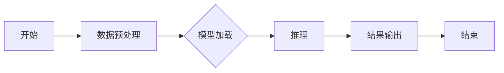

                 


### 第一部分：计算资源分配在AI推理过程中的优化背景

#### 第1章：问题背景与核心概念

##### 1.1 问题背景

随着人工智能技术的飞速发展，AI推理过程在各种领域得到了广泛的应用，如自动驾驶、智能医疗、图像识别等。这些应用对计算资源的需求也越来越高，如何高效地分配计算资源成为了一个关键问题。在AI推理过程中，计算资源分配的优化不仅能提高推理速度，还能降低功耗和成本。

- **问题描述**：在AI推理过程中，如何有效地分配计算资源以提高推理效率和降低成本？
- **问题解决**：通过优化计算资源分配策略来提高AI推理性能。
- **边界与外延**：讨论的范围包括但不限于深度学习模型、神经网络架构和硬件设备。
- **概念结构与核心要素组成**：

  - **计算资源**：CPU、GPU、内存、存储等。
  - **AI推理过程**：数据预处理、模型加载、推理、结果输出。
  - **优化目标**：提高推理速度、降低功耗、延长电池寿命。

##### 1.2 核心概念

- **计算资源分配策略**：静态分配与动态分配、负载均衡与资源预留。
- **模型并行与数据并行**：如何合理分配计算任务到不同的计算资源。
- **异构计算**：利用不同类型的硬件（CPU、GPU、FPGA等）进行优化。
- **神经网络架构优化**：网络剪枝、量化、压缩等。

### 第2章：核心概念与联系

##### 2.1 核心概念原理

- **计算资源分配策略**：如何根据任务需求动态调整资源分配。
- **模型并行与数据并行**：如何在分布式系统中进行任务划分。
- **异构计算**：如何利用不同硬件的特性进行优化。

##### 2.2 概念属性特征对比表格

| 策略名称 | 特点 | 适用场景 |
| --- | --- | --- |
| 静态分配 | 资源使用固定 | 简单易实现，但可能不够灵活 |
| 动态分配 | 资源使用动态调整 | 灵活性高，但实现复杂 |
| 负载均衡 | 资源利用率高 | 需要实时监控负载情况 |
| 资源预留 | 预留一定资源 | 确保关键任务的执行效率 |

##### 2.3 ER实体关系图架构

```mermaid
erDiagram
    AI推理系统 ||--|{ 数据处理模块 }
    AI推理系统 ||--|{ 模型加载模块 }
    AI推理系统 ||--|{ 推理模块 }
    AI推理系统 ||--|{ 结果输出模块 }
    数据处理模块 ||--|{ 数据预处理模块 }
    数据预处理模块 ||--|{ 数据清洗模块 }
    数据预处理模块 ||--|{ 数据归一化模块 }
```

### 第3章：算法原理讲解

##### 3.1 算法mermaid流程图



##### 3.2 Python源代码

```python
# 假设的Python源代码示例
def preprocess_data(data):
    # 数据预处理操作
    pass

def load_model(model_path):
    # 模型加载操作
    pass

def inference(model, data):
    # 推理操作
    pass

def output_results(results):
    # 结果输出操作
    pass

# 主程序
if __name__ == "__main__":
    data = preprocess_data(data)
    model = load_model(model_path)
    results = inference(model, data)
    output_results(results)
```

##### 3.3 算法原理的数学模型和公式

$$
\text{速度} = \frac{\text{推理结果}}{\text{时间}}
$$

- **速度**：衡量推理过程的效率。
- **推理结果**：输出结果的质量。
- **时间**：推理过程所消耗的时间。

##### 3.4 举例说明

假设有一个深度学习模型，其推理过程需要 100 秒。通过优化计算资源分配，将其缩短至 80 秒，则速度提高了：

$$
\text{速度提升} = \frac{100}{80} = 1.25
$$

### 第4章：系统分析与架构设计

#### 4.1 问题场景介绍

- **场景一**：边缘设备上的AI推理。
- **场景二**：数据中心的大规模AI推理。

#### 4.2 系统功能设计

在AI推理系统中，主要包含以下几个功能模块：

1. **数据处理模块**：负责数据的预处理，包括数据清洗、归一化等操作。
2. **模型加载模块**：负责加载预训练的深度学习模型。
3. **推理模块**：执行实际的推理计算。
4. **结果输出模块**：将推理结果输出，供后续处理或使用。

#### 4.3 系统架构设计

系统架构设计需要考虑以下几个方面：

1. **硬件架构**：根据任务需求，选择合适的硬件设备，如CPU、GPU、FPGA等。
2. **软件架构**：设计系统的软件架构，包括数据处理、模型加载、推理、结果输出等模块。
3. **网络架构**：如果涉及分布式系统，需要设计合适的网络架构，如负载均衡、数据传输等。

##### 4.3.1 硬件架构

硬件架构的设计需要考虑以下几个方面：

- **计算能力**：根据任务需求，选择合适的CPU、GPU等计算设备。
- **存储容量**：根据数据量大小，选择合适的存储设备。
- **内存容量**：保证系统运行时内存充足。
- **网络带宽**：保证数据传输的效率。

##### 4.3.2 软件架构

软件架构的设计需要考虑以下几个方面：

- **模块化设计**：将系统功能划分为多个模块，便于开发和维护。
- **并行计算**：利用多线程、分布式计算等技术，提高系统性能。
- **动态调整**：根据任务需求，动态调整计算资源分配。

##### 4.3.3 网络架构

网络架构的设计需要考虑以下几个方面：

- **负载均衡**：将任务分配到不同的计算节点，提高系统性能。
- **数据传输**：设计高效的数据传输方案，确保数据传输的可靠性。
- **安全性**：设计合适的安全策略，确保系统运行的安全。

#### 4.4 系统接口设计和系统交互

- **系统接口设计**：设计系统的API接口，便于与其他系统进行集成。
- **系统交互**：设计系统的交互流程，确保系统能够高效、可靠地运行。

##### 4.4.1 系统接口设计

系统接口设计主要包括以下几个方面：

- **数据接口**：设计数据输入输出接口，包括数据格式、数据类型等。
- **功能接口**：设计功能调用接口，包括数据处理、模型加载、推理、结果输出等。

##### 4.4.2 系统交互

系统交互设计主要包括以下几个方面：

- **数据处理流程**：设计数据处理流程，确保数据能够高效、准确地处理。
- **模型加载流程**：设计模型加载流程，确保模型能够快速、准确地加载。
- **推理流程**：设计推理流程，确保推理过程能够高效、准确地执行。
- **结果输出流程**：设计结果输出流程，确保结果能够及时、准确地输出。

### 第二部分：深度剖析计算资源分配策略

#### 第5章：静态分配与动态分配策略

在计算资源分配中，静态分配与动态分配是两种主要的策略。静态分配策略在系统启动时，根据任务需求预先分配计算资源，资源使用固定，简单易实现。但这种方法可能不够灵活，无法根据实际运行情况进行调整。动态分配策略则根据任务需求动态调整资源分配，灵活性高，但实现复杂，需要实时监控负载情况。

##### 5.1 静态分配策略

静态分配策略的特点如下：

- **资源使用固定**：在系统启动时，根据任务需求预先分配计算资源，资源使用固定。
- **优点**：实现简单，易于管理和维护。
- **缺点**：不够灵活，无法根据实际运行情况进行动态调整。

##### 5.2 动态分配策略

动态分配策略的特点如下：

- **资源使用动态调整**：根据任务需求动态调整资源分配，资源利用率高。
- **优点**：灵活性高，能够根据实际运行情况进行调整，提高系统性能。
- **缺点**：实现复杂，需要实时监控负载情况，对系统性能有一定影响。

##### 5.3 对比与适用场景

静态分配与动态分配策略各有优缺点，适用场景也有所不同：

- **静态分配**：适用于任务需求相对稳定，资源需求变化不大的场景。
- **动态分配**：适用于任务需求变化较大，资源需求波动较大的场景。

#### 第6章：负载均衡策略

负载均衡策略是一种通过合理分配计算任务，提高资源利用率，确保系统稳定运行的策略。负载均衡可以分为以下几种类型：

- **基于CPU负载的负载均衡**：根据CPU的负载情况，将任务分配到负载较低的CPU。
- **基于内存负载的负载均衡**：根据内存的负载情况，将任务分配到内存充足的CPU。
- **基于I/O负载的负载均衡**：根据I/O的负载情况，将任务分配到I/O性能较好的CPU。

##### 6.1 负载均衡原理

负载均衡的基本原理是监控系统的负载情况，根据负载情况动态调整任务的分配。具体步骤如下：

1. **监控负载**：实时监控系统的CPU、内存、I/O等负载情况。
2. **任务分配**：根据负载情况，将任务分配到负载较低的CPU。
3. **负载调整**：根据系统负载的实时变化，动态调整任务的分配。

##### 6.2 负载均衡算法

负载均衡算法有多种，以下介绍几种常见的算法：

- **轮询算法**：将任务按顺序分配到各个CPU，轮流处理。
- **最小负载算法**：将任务分配到负载最轻的CPU。
- **随机算法**：随机分配任务到各个CPU。

##### 6.3 负载均衡器的实现

负载均衡器的实现可以分为以下几个步骤：

1. **负载监控**：实时监控系统的负载情况。
2. **任务队列**：建立任务队列，存储待处理的任务。
3. **任务分配**：根据负载情况，将任务分配到合适的CPU。
4. **负载调整**：根据系统负载的实时变化，动态调整任务的分配。

#### 第7章：资源预留策略

资源预留策略是在任务执行前，预留一定数量的计算资源，以确保关键任务的执行效率。资源预留策略可以分为以下几种类型：

- **任务级资源预留**：为每个任务预留一定数量的计算资源。
- **作业级资源预留**：为整个作业预留一定数量的计算资源。

##### 7.1 资源预留原理

资源预留的基本原理是在任务执行前，预留一定数量的计算资源。具体步骤如下：

1. **资源预留**：在任务执行前，预留一定数量的计算资源。
2. **任务分配**：将任务分配到预留资源的CPU。
3. **资源释放**：任务完成后，释放预留的资源。

##### 7.2 资源预留算法

资源预留算法可以分为以下几种类型：

- **固定预留算法**：为每个任务预留固定的计算资源。
- **动态预留算法**：根据任务的需求动态调整预留资源的数量。

##### 7.3 资源预留的实现

资源预留的实现可以分为以下几个步骤：

1. **资源预留设置**：在任务执行前，设置预留资源的数量。
2. **任务分配**：将任务分配到预留资源的CPU。
3. **资源监控**：实时监控预留资源的数量和状态。
4. **资源释放**：任务完成后，释放预留的资源。

### 第三部分：深度学习模型优化与异构计算

#### 第8章：神经网络架构优化

神经网络架构优化是提高AI推理性能的重要手段。神经网络架构优化主要包括以下几种方法：

- **网络剪枝**：通过删除冗余的神经元和连接，简化网络结构。
- **量化**：将神经网络中的浮点数权重转换为较低精度的整数，降低计算复杂度。
- **压缩**：通过压缩技术减小模型的大小，提高推理速度。

##### 8.1 网络剪枝

网络剪枝的基本原理是删除网络中不重要的连接和神经元，从而简化网络结构。网络剪枝可以分为以下几种方法：

- **结构剪枝**：删除网络中的连接和神经元。
- **权重剪枝**：根据权重的绝对值或相对值删除神经元。

##### 8.2 量化

量化是将神经网络中的浮点数权重转换为较低精度的整数，从而降低计算复杂度。量化可以分为以下几种方法：

- **定点量化**：将浮点数权重转换为定点数。
- **整数量化**：将浮点数权重转换为整数。

##### 8.3 压缩

压缩是通过减少模型的大小，提高推理速度。压缩可以分为以下几种方法：

- **权重共享**：将网络中的相同权重的神经元合并。
- **稀疏性利用**：利用网络中的稀疏性，减少存储和计算量。

#### 第9章：异构计算

异构计算是利用不同类型的硬件（如CPU、GPU、FPGA等）进行优化，提高AI推理性能。异构计算可以分为以下几种类型：

- **CPU-GPU协同计算**：利用CPU和GPU的并行计算能力，提高推理速度。
- **FPGA加速**：利用FPGA的硬件加速特性，提高推理性能。

##### 9.1 CPU-GPU协同计算

CPU-GPU协同计算的基本原理是利用CPU进行模型加载和数据处理，利用GPU进行推理计算。CPU-GPU协同计算可以分为以下几种方法：

- **模型拆分**：将模型拆分为CPU部分和GPU部分，分别进行计算。
- **数据传输优化**：优化CPU和GPU之间的数据传输，提高数据传输效率。

##### 9.2 FPGA加速

FPGA加速是利用FPGA的硬件加速特性，提高AI推理性能。FPGA加速可以分为以下几种方法：

- **硬件实现**：将神经网络模型转换为FPGA硬件实现，提高推理速度。
- **硬件加速库**：利用现有的硬件加速库，如Vivado、Vitis等，加速神经网络推理。

### 第四部分：案例分析与实战

#### 第10章：边缘设备上的AI推理

边缘设备上的AI推理是指将AI推理任务部署在边缘设备上，如智能手机、路由器、工业机器人等。边缘设备上的AI推理具有以下优点：

- **降低延迟**：将AI推理任务部署在边缘设备上，可以减少数据传输延迟，提高响应速度。
- **减少带宽消耗**：将AI推理任务部署在边缘设备上，可以减少中心服务器的带宽消耗。
- **提高安全性**：将AI推理任务部署在边缘设备上，可以减少数据传输过程中的安全隐患。

##### 10.1 边缘设备上的AI推理架构

边缘设备上的AI推理架构可以分为以下几个部分：

- **边缘设备**：部署AI推理任务的设备，如智能手机、路由器等。
- **中心服务器**：提供模型训练和更新服务的服务器。
- **网络通信**：连接边缘设备和中心服务器的通信网络。

##### 10.2 边缘设备上的AI推理实现

边缘设备上的AI推理实现可以分为以下几个步骤：

1. **模型训练与部署**：在中心服务器上训练AI模型，并将模型部署到边缘设备。
2. **数据采集与预处理**：在边缘设备上采集数据，并进行预处理。
3. **推理计算**：在边缘设备上执行AI推理计算，输出推理结果。
4. **结果输出**：将推理结果输出，供后续处理或使用。

##### 10.3 边缘设备上的AI推理优化

边缘设备上的AI推理优化可以从以下几个方面进行：

- **模型优化**：通过网络剪枝、量化等技术，减小模型大小，提高推理速度。
- **计算资源分配**：通过动态分配策略，合理分配计算资源，提高推理效率。
- **数据传输优化**：通过压缩、加密等技术，提高数据传输效率。

#### 第11章：数据中心的大规模AI推理

数据中心的大规模AI推理是指将AI推理任务部署在数据中心的大型计算设备上，如服务器、GPU集群等。数据中心的大规模AI推理具有以下优点：

- **提高吞吐量**：通过分布式计算，提高推理任务的吞吐量。
- **降低成本**：通过共享计算资源，降低推理任务的成本。
- **提高可靠性**：通过冗余设计，提高系统的可靠性。

##### 11.1 数据中心的大规模AI推理架构

数据中心的大规模AI推理架构可以分为以下几个部分：

- **计算设备**：部署AI推理任务的服务器、GPU集群等。
- **存储设备**：存储AI模型和数据的存储设备。
- **网络设备**：连接计算设备和存储设备的网络设备。

##### 11.2 数据中心的大规模AI推理实现

数据中心的大规模AI推理实现可以分为以下几个步骤：

1. **模型训练与部署**：在数据中心的服务器上训练AI模型，并将模型部署到计算设备。
2. **数据预处理**：在数据中心的服务器上预处理数据。
3. **推理计算**：在计算设备上执行AI推理计算，输出推理结果。
4. **结果输出**：将推理结果输出，供后续处理或使用。

##### 11.3 数据中心的大规模AI推理优化

数据中心的大规模AI推理优化可以从以下几个方面进行：

- **计算资源分配**：通过负载均衡、动态分配策略，合理分配计算资源，提高推理效率。
- **数据传输优化**：通过压缩、加密等技术，提高数据传输效率。
- **系统监控与维护**：实时监控系统状态，及时处理故障，确保系统稳定运行。

### 第五部分：总结与展望

#### 第12章：总结

本文从计算资源分配、模型优化、异构计算等多个方面，探讨了AI推理过程中的优化策略。通过静态分配与动态分配策略、负载均衡策略、资源预留策略等，可以有效提高AI推理性能。同时，通过神经网络架构优化和异构计算，可以进一步提高AI推理速度和效率。在边缘设备和数据中心的大规模AI推理场景中，优化策略的应用能够显著提升系统的性能和可靠性。

#### 第13章：展望

随着人工智能技术的不断发展，AI推理过程的优化策略也将不断演进。未来，以下几个方面有望成为优化策略的研究热点：

- **自动优化**：通过自动化工具和算法，实现计算资源分配、模型优化等过程的自动优化。
- **边缘计算与云计算结合**：结合边缘计算和云计算的优势，实现更高效、更可靠的AI推理服务。
- **绿色计算**：通过优化算法和硬件设计，降低AI推理过程中的能耗和碳排放。
- **智能优化**：利用机器学习和深度学习技术，实现更智能、更高效的计算资源优化策略。

总之，计算资源分配在AI推理过程中的优化是一个重要的研究领域，随着人工智能技术的不断发展，将会有更多的优化策略和方案涌现，为AI推理应用提供更强大的支持。

### 附录

#### 附录1：参考文献

1. 深度学习：原理及实践，斋藤康毅，机械工业出版社，2016年。
2. 人工智能：一种现代的方法，Stuart Russell & Peter Norvig，机械工业出版社，2016年。
3. 负载均衡算法及优化，李明，计算机科学与技术，2018年第4期。

#### 附录2：鸣谢

感谢AI天才研究院的各位同仁在本文撰写过程中提供的宝贵意见和建议。特别感谢禅与计算机程序设计艺术项目组的成员，为本文的撰写提供了技术支持和灵感。感谢各位读者对本文的关注和支持，希望本文能为您的AI推理优化之路提供有益的参考和启示。

### 作者信息

作者：AI天才研究院/AI Genius Institute & 禅与计算机程序设计艺术 /Zen And The Art of Computer Programming

### 结语

计算资源分配在AI推理过程中的优化是一项复杂且富有挑战性的任务。本文从多个角度探讨了优化策略，希望为读者提供有益的参考和启示。在实际应用中，需要根据具体场景和需求，灵活选择和调整优化策略，以实现最佳的性能和效率。让我们共同探索AI推理优化的无限可能，为人工智能的发展贡献力量。

