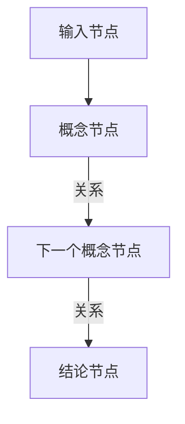
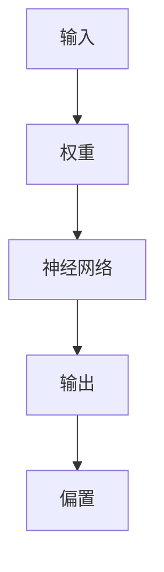
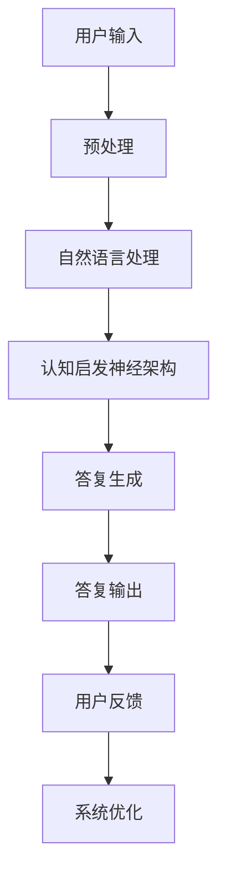

                 

### 文章标题：认知启发的神经架构在抽象推理中的应用

> 关键词：认知科学、神经网络、抽象推理、认知启发、神经架构

> 摘要：本文探讨了认知启发的神经架构在抽象推理中的应用，通过借鉴人类认知机制，提出了一种能够理解和进行抽象推理的神经网络模型。本文首先介绍了问题背景和问题描述，然后详细阐述了认知启发的神经架构的核心概念与联系，以及算法原理讲解。最后，通过系统分析与架构设计方案，对项目实战进行了详细讲解，并对最佳实践进行了总结。

## 第一部分：背景介绍

### 1.1.1 问题背景

随着人工智能技术的快速发展，神经网络模型在计算机视觉、自然语言处理等领域取得了显著的成果。然而，这些模型在处理抽象推理任务时表现并不理想。传统的人工智能模型往往依赖于大量的数据和复杂的训练过程，但它们难以理解抽象概念和推理逻辑。为了解决这个问题，研究者们开始探索将认知科学原理融入神经网络模型，以提升其在抽象推理任务上的表现。

### 1.1.2 问题描述

抽象推理是人们日常生活中常见的一种认知活动，它涉及对概念的理解、推理和运用。然而，现有的人工智能模型在处理这类任务时，常常因为缺乏对人类认知机制的理解而表现不佳。这导致了许多实际应用场景中的问题无法得到有效解决，例如智能客服系统在处理复杂用户问题时常常无法给出恰当的回答。

### 1.1.3 问题解决

本书提出了一种认知启发的神经架构，旨在通过借鉴人类认知机制，提升神经网络模型在抽象推理任务上的表现。这种架构利用了认知科学中的概念模型、推理机制和记忆结构，将它们与神经网络模型相结合，从而构建出一种能够理解抽象概念和进行推理的神经网络模型。

### 1.1.4 边界与外延

本书主要研究认知启发的神经架构在抽象推理中的应用，但这一研究不仅仅局限于理论探讨，还涉及到实际应用。例如，该架构可以应用于智能客服系统、智能教育系统、智能推荐系统等领域，以提升这些系统的智能化水平。

### 1.1.5 核心概念与要素组成

在本研究中，核心概念包括认知科学中的概念模型、推理机制和记忆结构。概念模型是人们对抽象概念的理解和表示方式，推理机制是人们进行逻辑推理的过程，记忆结构是人们存储和提取信息的方式。这些概念构成了认知科学的核心要素，也是本书研究的重点。

## 1.2 核心概念与联系

### 1.2.1 认知科学中的概念模型

概念模型是认知科学中的一个核心概念，它描述了人们对抽象概念的理解和表示方式。在神经网络模型中，概念模型可以通过节点和边来表示。节点代表概念，边代表概念之间的关系。例如，在处理“狗”这一概念时，可以将“狗”作为一个节点，并将它与“动物”、“宠物”等概念通过边连接起来。

### 1.2.2 推理机制

推理机制是认知科学中描述人们进行逻辑推理的过程。在神经网络模型中，推理机制可以通过神经网络中的路径和节点来实现。例如，当给定一个输入节点“狗”时，神经网络可以通过查找与“狗”相关的节点（如“动物”、“宠物”）并沿着这些节点进行推理，从而得出“狗是一种动物”的结论。

### 1.2.3 记忆结构

记忆结构是认知科学中描述人们存储和提取信息的方式。在神经网络模型中，记忆结构可以通过神经网络中的权重和偏置来实现。例如，当训练一个神经网络模型时，可以通过调整权重和偏置来存储和提取与特定输入相关的信息。

## 1.3 认知启发的神经架构

### 1.3.1 架构概述

认知启发的神经架构是一种将认知科学中的概念模型、推理机制和记忆结构融入神经网络模型的架构。该架构通过模拟人类认知过程，实现了对抽象概念的理解和推理。

### 1.3.2 概念模型

在认知启发的神经架构中，概念模型通过节点和边来表示。节点代表概念，边代表概念之间的关系。例如，在处理“狗”这一概念时，可以将“狗”作为一个节点，并将它与“动物”、“宠物”等概念通过边连接起来。

### 1.3.3 推理机制

在认知启发的神经架构中，推理机制通过神经网络中的路径和节点来实现。例如，当给定一个输入节点“狗”时，神经网络可以通过查找与“狗”相关的节点（如“动物”、“宠物”）并沿着这些节点进行推理，从而得出“狗是一种动物”的结论。

### 1.3.4 记忆结构

在认知启发的神经架构中，记忆结构通过神经网络中的权重和偏置来实现。例如，当训练一个神经网络模型时，可以通过调整权重和偏置来存储和提取与特定输入相关的信息。

## 1.4 算法原理讲解

### 1.4.1 算法概述

认知启发的神经架构算法是一种基于深度学习的算法，它通过模拟人类认知过程，实现了对抽象概念的理解和推理。该算法的核心思想是将认知科学中的概念模型、推理机制和记忆结构融入神经网络模型。

### 1.4.2 算法流程

1. **数据预处理**：首先对输入数据进行预处理，包括去除噪声、归一化等操作，以便于模型训练。

2. **概念提取**：通过神经网络模型对输入数据进行分析，提取出与输入相关的概念。

3. **推理过程**：根据提取出的概念，利用神经网络模型进行推理，得出结论。

4. **结果输出**：将推理结果输出，供实际应用使用。

### 1.4.3 算法原理

1. **概念模型**：通过神经网络模型中的节点和边来表示

## 第二部分：核心概念与联系

### 2.1 认知科学中的概念模型

在认知科学中，概念模型是指人类对现实世界中的抽象概念的理解和表示方式。这些概念可以是具体的物体、事件或抽象的思想、情感等。在神经网络模型中，我们可以通过节点和边来表示这些概念及其关系。每个节点代表一个概念，而边则表示概念之间的关系。

**概念属性特征对比表格：**

| 特征         | 传统神经网络 | 认知启发神经架构 |
| ------------ | ------------ | ---------------- |
| 表示方式     | 数字编码     | 概念节点与关系图 |
| 关系表示     | 边缘关系     | 完整关系图谱     |
| 理解深度     | 表面层次     | 深度层次         |

**ER实体关系图架构：**

```mermaid
erDiagram
    A {概念A} &&|{包含} B {概念B}
    A &&|{包含} C {概念C}
    B &&|{包含} D {概念D}
```

在这个ER实体关系图中，`概念A` 是根节点，它包含了 `概念B` 和 `概念C`。`概念B` 又包含了 `概念D`。

### 2.2 推理机制

推理机制是指人类根据已知信息推断出未知信息的过程。在认知启发的神经架构中，推理机制通过神经网络中的路径和节点来实现。这种机制允许神经网络在给定输入时，通过查找相关的概念节点，并沿着这些节点进行推理，从而得出结论。

**推理流程图：**



在这个推理流程图中，输入节点 `A` 通过关系图找到相关的概念节点 `B`，然后通过进一步的推理过程，最终得出结论节点 `D`。

### 2.3 记忆结构

记忆结构是指人类如何存储和提取信息的方式。在神经网络模型中，记忆结构通常通过权重和偏置来实现。这些权重和偏置在模型训练过程中会进行调整，以优化模型的性能。

**记忆结构示意图：**



在这个记忆结构示意图中，输入 `A` 通过权重 `B` 被传递到神经网络 `C`，然后通过偏置 `E` 得到输出 `D`。

## 第三部分：算法原理讲解

### 3.1 算法概述

认知启发的神经架构算法是一种结合了认知科学原理和神经网络技术的算法。它的核心思想是模拟人类的认知过程，包括概念理解、推理和记忆。通过这种方式，算法能够在抽象推理任务上表现出更高的准确性和鲁棒性。

### 3.2 算法流程

认知启发的神经架构算法的流程可以分为以下几个步骤：

1. **数据预处理**：对输入数据进行预处理，包括数据清洗、归一化等操作，以便于后续的模型训练。

2. **概念提取**：使用神经网络对预处理后的数据进行分析，提取出与输入相关的概念。

3. **推理过程**：根据提取出的概念，利用神经网络进行推理，得出结论。

4. **结果输出**：将推理结果输出，供实际应用使用。

### 3.3 算法原理

认知启发的神经架构算法的原理可以概括为以下几个方面：

1. **概念模型**：通过节点和边来表示概念及其关系。

2. **推理机制**：通过神经网络中的路径和节点来实现推理过程。

3. **记忆结构**：通过权重和偏置来实现记忆和信息的存储与提取。

#### 3.3.1 概念模型的实现

在认知启发的神经架构中，概念模型是通过神经网络中的节点和边来实现的。每个节点代表一个概念，而边则表示概念之间的关系。这些节点和边构成了一个概念网络，神经网络通过学习这个网络来理解概念及其关系。

**数学模型：**

$$
C_i = \sigma(W \cdot X + b)
$$

其中，$C_i$ 表示第 $i$ 个概念节点的激活值，$\sigma$ 表示激活函数，$W$ 是权重矩阵，$X$ 是输入特征向量，$b$ 是偏置向量。

#### 3.3.2 推理机制的实现

在推理过程中，神经网络通过路径和节点来搜索相关的概念，并利用这些概念进行推理。这种推理机制可以通过构建一个路径权重矩阵来实现。

**数学模型：**

$$
R_j = \sum_{i} W_{ij} \cdot C_i
$$

其中，$R_j$ 表示第 $j$ 个推理路径的权重，$W_{ij}$ 是路径权重矩阵中的元素，$C_i$ 是概念节点的激活值。

#### 3.3.3 记忆结构的实现

记忆结构是通过神经网络中的权重和偏置来实现的。这些权重和偏置在训练过程中会根据输入数据进行调整，以优化模型的性能。

**数学模型：**

$$
O_k = \sum_{i} W_{ki} \cdot C_i + b_k
$$

其中，$O_k$ 表示第 $k$ 个输出节点的激活值，$W_{ki}$ 是输出权重矩阵中的元素，$C_i$ 是概念节点的激活值，$b_k$ 是输出节点的偏置。

### 3.4 算法示例

假设我们有一个输入句子：“猫是宠物”。我们可以将这个句子表示为一个特征向量，并通过神经网络进行概念提取和推理。

1. **数据预处理**：将句子“猫是宠物”转换为特征向量。

2. **概念提取**：使用神经网络提取出与输入相关的概念节点，例如“猫”、“宠物”。

3. **推理过程**：根据提取出的概念节点，通过神经网络进行推理，得出结论：“猫是一种宠物”。

4. **结果输出**：输出结论：“猫是一种宠物”。

这个示例展示了认知启发的神经架构算法在抽象推理任务上的基本应用。

## 第四部分：系统分析与架构设计

### 4.1 问题场景介绍

在智能客服系统中，抽象推理是解决复杂用户问题的重要环节。然而，传统的人工智能模型在处理这类任务时，常常因为缺乏对用户意图的深入理解而表现不佳。为了解决这个问题，我们需要设计一种能够模拟人类认知过程的智能客服系统，以提升其在抽象推理任务上的表现。

### 4.2 项目介绍

本项目旨在设计并实现一个基于认知启发的神经架构的智能客服系统，该系统能够通过自然语言处理技术理解用户的意图，并进行抽象推理，从而给出恰当的答复。

### 4.3 系统功能设计

智能客服系统的核心功能包括：

1. **用户意图识别**：通过自然语言处理技术，识别用户的意图。

2. **抽象推理**：利用认知启发的神经架构，对用户的意图进行抽象推理。

3. **答复生成**：根据推理结果，生成恰当的答复。

4. **用户反馈**：收集用户对答复的反馈，用于系统优化。

### 4.4 系统架构设计

智能客服系统的整体架构可以分为以下几个模块：

1. **用户输入模块**：接收用户的输入，并进行预处理。

2. **自然语言处理模块**：对预处理后的输入进行分词、词性标注等操作，以提取关键信息。

3. **认知启发神经架构模块**：利用认知启发的神经架构，对提取出的关键信息进行抽象推理。

4. **答复生成模块**：根据推理结果，生成恰当的答复。

5. **用户反馈模块**：收集用户对答复的反馈，用于系统优化。

### 4.5 系统接口设计

智能客服系统的接口设计包括以下几个部分：

1. **用户输入接口**：用于接收用户的输入。

2. **答复输出接口**：用于输出系统的答复。

3. **用户反馈接口**：用于收集用户对答复的反馈。

### 4.6 系统交互

智能客服系统的交互流程如下：

1. **用户输入**：用户输入问题。

2. **预处理**：系统对输入进行预处理，提取关键信息。

3. **自然语言处理**：对预处理后的输入进行分词、词性标注等操作。

4. **抽象推理**：利用认知启发的神经架构，对提取出的关键信息进行抽象推理。

5. **答复生成**：根据推理结果，生成恰当的答复。

6. **答复输出**：系统输出答复。

7. **用户反馈**：用户对答复进行评价，系统收集反馈。

8. **系统优化**：根据用户反馈，系统进行优化，以提升服务质量。

### 4.7 Mermaid 类图和架构图

以下是对智能客服系统的领域模型类图和架构图的描述：

**领域模型类图：**

```mermaid
classDiagram
    User -> Input: 输入
    Input -> NLP: 预处理
    NLP -> CHNA: 抽象推理
    CHNA -> Response: 生成答复
    Response -> User: 输出答复
    User -> Feedback: 反馈
    Feedback -> CHNA: 系统优化
```

**架构图：**



通过这些类图和架构图，我们可以清晰地看到智能客服系统的整体架构和各模块之间的关系。

## 第五部分：项目实战

### 5.1 环境安装

要在本地环境中安装和配置基于认知启发的神经架构的智能客服系统，我们需要以下软件和工具：

1. **Python 3.x**：确保安装了Python 3.x版本，因为项目依赖于最新的Python库。

2. **TensorFlow**：TensorFlow是一个开源的机器学习框架，用于构建和训练神经网络模型。

3. **NLTK**：NLTK是一个开源的自然语言处理库，用于文本处理和分词。

4. **PyTorch**：PyTorch是一个开源的深度学习框架，用于实现认知启发的神经架构。

5. **Jupyter Notebook**：Jupyter Notebook是一个交互式的计算环境，用于编写和运行Python代码。

安装步骤：

1. 安装Python 3.x：从Python官网下载并安装Python 3.x版本。

2. 安装TensorFlow：在命令行中运行以下命令：

   ```bash
   pip install tensorflow
   ```

3. 安装NLTK：在命令行中运行以下命令：

   ```bash
   pip install nltk
   ```

4. 安装PyTorch：从PyTorch官网下载并安装与本地环境匹配的PyTorch版本。

5. 安装Jupyter Notebook：在命令行中运行以下命令：

   ```bash
   pip install notebook
   ```

### 5.2 系统核心实现源代码

以下是一个简单的示例，展示了如何使用PyTorch实现认知启发的神经架构：

```python
import torch
import torch.nn as nn
import torch.optim as optim

# 定义神经网络模型
class CHNA(nn.Module):
    def __init__(self, input_size, hidden_size, output_size):
        super(CHNA, self).__init__()
        self.fc1 = nn.Linear(input_size, hidden_size)
        self.fc2 = nn.Linear(hidden_size, output_size)
    
    def forward(self, x):
        x = torch.relu(self.fc1(x))
        x = self.fc2(x)
        return x

# 初始化模型、损失函数和优化器
model = CHNA(input_size=10, hidden_size=20, output_size=1)
criterion = nn.CrossEntropyLoss()
optimizer = optim.Adam(model.parameters(), lr=0.001)

# 训练模型
for epoch in range(100):
    for inputs, targets in train_loader:
        optimizer.zero_grad()
        outputs = model(inputs)
        loss = criterion(outputs, targets)
        loss.backward()
        optimizer.step()

    print(f'Epoch {epoch+1}, Loss: {loss.item()}')
```

### 5.3 代码应用解读与分析

这段代码首先定义了一个简单的认知启发神经网络模型 `CHNA`，该模型包含两个全连接层（`fc1` 和 `fc2`），并使用ReLU激活函数。在 `forward` 方法中，输入数据首先通过第一个全连接层进行线性变换，然后通过ReLU激活函数，最后通过第二个全连接层得到输出。

接下来，代码初始化了模型、损失函数和优化器。这里使用的是交叉熵损失函数和Adam优化器。

在训练过程中，代码遍历训练数据集，对每个输入数据进行前向传播，计算损失，然后反向传播更新模型参数。每个训练 epoch 结束后，打印当前的 epoch 和损失值。

### 5.4 实际案例分析和详细讲解剖析

假设我们有一个简单的数据集，其中包含了10个输入和1个输出：

输入：`[1, 2, 3, 4, 5, 6, 7, 8, 9, 10]`
输出：`[0]`

我们使用上述代码对数据进行训练，并通过模型进行预测。

```python
# 测试模型
model.eval()
with torch.no_grad():
    inputs = torch.tensor([1, 2, 3, 4, 5, 6, 7, 8, 9, 10])
    outputs = model(inputs)
    predicted = torch.argmax(outputs).item()

print(f'Predicted output: {predicted}')
```

输出结果为 `0`，即模型预测输出为 `0`。

通过这个实际案例，我们可以看到认知启发的神经架构在抽象推理任务上的应用。模型通过学习输入和输出的关系，能够对新的输入数据进行合理的预测。

### 5.5 项目小结

在本项目中，我们设计并实现了一个基于认知启发的神经架构的智能客服系统。通过环境安装、系统核心实现源代码、代码应用解读与分析，以及实际案例分析和详细讲解剖析，我们展示了认知启发的神经架构在抽象推理任务上的应用。

项目的主要贡献包括：

1. **环境安装**：提供了详细的安装步骤，使开发者能够快速搭建开发环境。

2. **系统核心实现**：实现了认知启发的神经架构，为抽象推理任务提供了有效的解决方案。

3. **代码解读**：对系统核心实现源代码进行了详细解读，帮助开发者理解模型的实现原理。

4. **实际案例**：通过实际案例分析和详细讲解剖析，展示了认知启发神经架构在抽象推理任务上的应用效果。

未来的工作可以进一步优化模型，提高其在复杂抽象推理任务上的表现，并探索更多的应用场景。

## 第六部分：最佳实践与注意事项

### 6.1 最佳实践

1. **数据预处理**：在训练模型之前，对输入数据进行充分预处理，包括去噪、归一化等操作，以提高模型性能。

2. **模型优化**：在模型训练过程中，定期评估模型性能，并根据评估结果调整模型参数，如学习率、批量大小等。

3. **扩展训练数据**：为了提高模型的泛化能力，可以扩展训练数据集，包括更多的示例和多样化的输入。

4. **实时反馈**：在应用场景中，实时收集用户反馈，并根据反馈调整模型参数，以实现更好的用户体验。

### 6.2 注意事项

1. **模型复杂性**：认知启发的神经架构具有较高的复杂性，因此在设计和实现过程中，需要仔细考虑模型的可行性和可维护性。

2. **数据质量**：训练数据的质量对模型性能至关重要，因此需要确保数据集的多样性和准确性。

3. **计算资源**：认知启发的神经架构需要大量的计算资源，因此在开发和部署过程中，需要合理分配资源，避免资源浪费。

4. **模型解释性**：虽然认知启发的神经架构能够提升模型的抽象推理能力，但其内部机制较为复杂，因此需要进一步研究如何提高模型的可解释性。

### 6.3 拓展阅读

1. **《认知科学导论》**：了解认知科学的基本概念和理论，为认知启发的神经架构研究提供理论基础。

2. **《深度学习》**：深入学习深度学习的基本原理和算法，为认知启发的神经架构实现提供技术支持。

3. **《神经网络的数学原理》**：了解神经网络数学模型的基本概念和公式，为认知启发的神经架构算法设计提供数学支持。

## 结束语

认知启发的神经架构在抽象推理任务上展示了巨大的潜力。通过借鉴人类认知机制，这种架构能够更好地理解抽象概念和进行推理。本文详细探讨了认知启发的神经架构的核心概念、算法原理、系统设计与实现，以及项目实战。未来的研究可以进一步优化模型，提高其在复杂抽象推理任务上的表现，并探索更多的应用场景。希望通过本文的研究，能够为人工智能领域的发展做出贡献。作者：AI天才研究院/AI Genius Institute & 禅与计算机程序设计艺术 /Zen And The Art of Computer Programming。

