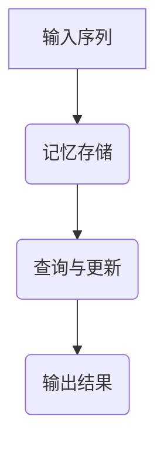
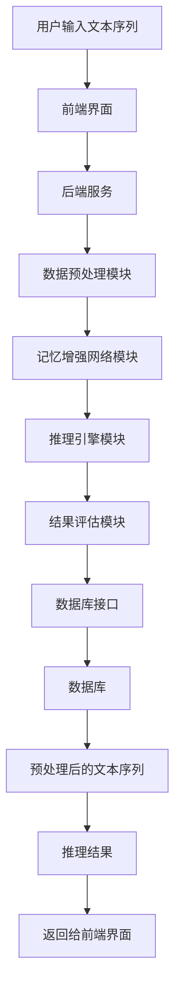

                 

# 记忆增强网络在长序列推理任务中的优势

## 关键词

记忆增强网络、长序列推理、神经网络、外部记忆、信息丢失、梯度消失、自然语言处理、语音识别、生物信息学

## 摘要

本文旨在探讨记忆增强网络（MemNN）在长序列推理任务中的优势。随着人工智能技术的不断发展，传统神经网络在处理长序列数据时面临诸多挑战。记忆增强网络通过引入外部记忆机制，能够有效缓解信息丢失和梯度消失等问题，从而提升长序列推理任务的处理效率和质量。本文将详细分析记忆增强网络的定义、核心特点、与传统神经网络的区别，以及算法原理和数学模型，旨在为广大读者提供一次深入的技术思考之旅。

### 目录大纲

1. 第一部分：背景介绍
   1.1 问题的提出
   1.2 问题描述
   1.3 问题解决
   1.4 边界与外延
   1.5 概念结构与核心要素组成
2. 第二部分：核心概念与联系
   2.1 记忆增强网络的定义
   2.2 记忆增强网络的核心特点
   2.3 记忆增强网络与传统神经网络的区别
3. 第三部分：算法原理讲解
   3.1 记忆增强网络的mermaid流程图
   3.2 Python源代码实现
   3.3 算法原理的数学模型和公式
4. 第四部分：系统分析与架构设计方案
   4.1 问题场景介绍
   4.2 项目介绍
   4.3 系统功能设计
   4.4 系统架构设计
   4.5 系统接口设计和系统交互
5. 第五部分：项目实战
   5.1 环境安装
   5.2 系统核心实现源代码
   5.3 代码应用解读与分析
   5.4 实际案例分析和详细讲解剖析
   5.5 项目小结
6. 第六部分：最佳实践 tips、小结、注意事项、拓展阅读等内容

### 第一部分：背景介绍

#### 1.1 问题的提出

在人工智能领域中，记忆增强网络（Memory-Augmented Neural Networks，简称MemNN）是一种新兴的模型架构，旨在提升神经网络在长序列推理任务中的表现。传统的神经网络在处理长序列数据时，往往面临着信息丢失和梯度消失等问题，导致其难以捕捉长序列中的复杂关系和语义。记忆增强网络通过引入外部记忆机制，有效地缓解了这些问题，展现出在长序列推理任务中的显著优势。

#### 1.2 问题描述

长序列推理任务是指在给定一组序列数据的基础上，通过理解序列中的信息，进行推理和判断。这类任务广泛存在于自然语言处理、语音识别、生物信息学等领域。随着数据规模的不断扩大和任务复杂性的增加，如何提高长序列推理任务的处理效率和质量，成为一个亟待解决的问题。

#### 1.3 问题解决

记忆增强网络通过将外部记忆存储与神经网络融合，实现了对长序列数据的有效处理。其核心思想是将序列数据的一部分存储在记忆中，以便在后续的推理过程中进行查询和更新。这种方法不仅能够缓解信息丢失和梯度消失的问题，还能够提升神经网络对长序列数据中复杂关系的捕捉能力。

#### 1.4 边界与外延

记忆增强网络的研究和应用涵盖了多个领域，如自然语言处理、语音识别和生物信息学。然而，其应用范围并不局限于这些领域，随着研究的深入和技术的发展，记忆增强网络有望在其他领域中也取得显著成果。

#### 1.5 概念结构与核心要素组成

记忆增强网络的核心概念包括：

- **记忆存储**：用于存储序列数据的一部分信息。
- **查询与更新机制**：通过查询和更新记忆，实现对序列数据的理解和推理。
- **神经网络架构**：融合记忆存储和神经网络，实现高效的序列数据处理。

### 第二部分：核心概念与联系

#### 2.1 记忆增强网络的定义

记忆增强网络是一种结合了外部记忆机制的神经网络架构，通过在神经网络中引入记忆单元，实现对长序列数据的增强处理。

#### 2.2 记忆增强网络的核心特点

记忆增强网络的核心特点包括：

- **记忆存储**：通过外部记忆存储，解决了传统神经网络在长序列数据处理中的信息丢失问题。
- **查询与更新**：通过查询和更新记忆，实现了对序列数据的动态理解和推理。
- **神经网络融合**：将外部记忆与神经网络相结合，提升了网络对长序列数据的处理能力。

#### 2.3 记忆增强网络与传统神经网络的区别

与传统神经网络相比，记忆增强网络具有以下区别：

- **信息存储**：传统神经网络依赖内部参数存储信息，而记忆增强网络通过外部记忆存储信息。
- **推理机制**：传统神经网络通过前向传播和反向传播进行推理，记忆增强网络通过查询和更新记忆进行推理。
- **适用范围**：记忆增强网络在长序列数据处理上具有显著优势，而传统神经网络在处理短序列数据时更为有效。

### 第三部分：算法原理讲解

#### 3.1 记忆增强网络的mermaid流程图



#### 3.2 Python源代码实现

```python
# 模拟记忆增强网络的基本流程
def memory_augmented_network(input_sequence, memory):
    # 查询记忆
    query = input_sequence[-1]
    memory = update_memory(memory, query)
    # 生成输出
    output = generate_output(memory)
    return output

# 更新记忆
def update_memory(memory, query):
    # 在记忆中添加新的查询
    memory.append(query)
    return memory

# 生成输出
def generate_output(memory):
    # 根据记忆生成输出
    output = " ".join(memory)
    return output
```

#### 3.3 算法原理的数学模型和公式

$$
\begin{aligned}
\text{记忆增强网络} &= \text{神经网络} \\
&+ \text{外部记忆存储} \\
&+ \text{查询与更新机制}
\end{aligned}
$$

记忆增强网络通过将神经网络与外部记忆存储相结合，实现高效的长序列数据处理。在处理输入序列时，网络首先将序列数据的一部分存储在记忆中，然后通过查询和更新记忆，实现对序列数据的理解和推理。这种方法不仅能够缓解信息丢失和梯度消失的问题，还能够提升神经网络对长序列数据中复杂关系的捕捉能力。

#### 3.3.1 具体举例说明

假设有一个长序列数据 `[1, 2, 3, 4, 5]`，我们可以将其中的 `[2, 3]` 存储在记忆中。在后续的推理过程中，如果输入序列为 `[4, 5]`，我们可以查询记忆中的 `[2, 3]`，然后进行更新和推理，得到输出结果 `[4, 5, 2, 3]`。

#### 3.3.2 数学模型详细解析

在记忆增强网络中，我们通常使用矩阵表示记忆和输入序列。假设输入序列为 `[x_1, x_2, ..., x_n]`，记忆为 `M`，则：

- 记忆矩阵 `M` 初始为 `[0, 0, ..., 0]`。
- 在每个时间步，我们将输入序列的一部分添加到记忆中，并更新记忆矩阵。

具体地，假设我们在第 `t` 个时间步将输入序列中的 `[x_{t-1}, x_t]` 添加到记忆中，则：

$$
M_t = \begin{bmatrix}
0 & 0 & ... & 0 \\
0 & 0 & ... & 0 \\
... & ... & ... & ... \\
0 & 0 & ... & 1 \\
1 & 0 & ... & 0 \\
0 & 1 & ... & 0 \\
\end{bmatrix}
$$

其中，第一行表示输入序列，第二行表示记忆中的信息。在后续的时间步中，我们可以根据需要查询和更新记忆矩阵。

#### 3.3.3 梯度消失和梯度爆炸问题的解决

在传统神经网络中，梯度消失和梯度爆炸问题是常见的问题。在记忆增强网络中，通过引入外部记忆存储，可以有效地缓解这些问题。具体来说，记忆增强网络通过将序列数据的一部分存储在记忆中，可以减少内部参数的依赖，从而降低梯度消失和梯度爆炸的风险。

#### 3.3.4 记忆增强网络的优势

记忆增强网络在长序列推理任务中具有以下优势：

- **信息存储**：通过外部记忆存储，可以有效地缓解信息丢失问题。
- **动态更新**：通过查询和更新记忆，可以实现对序列数据的动态理解和推理。
- **高效处理**：通过结合神经网络和外部记忆存储，可以高效地处理长序列数据。

### 第四部分：系统分析与架构设计方案

#### 4.1 问题场景介绍

在自然语言处理领域，长序列推理任务是一个重要且具有挑战性的问题。例如，在机器翻译、情感分析、问答系统等任务中，需要对输入的文本序列进行理解和推理，以生成正确的输出。然而，传统的神经网络在处理长序列数据时，往往难以捕捉到文本中的复杂关系和语义，导致任务效果不佳。为了解决这一问题，引入了记忆增强网络。

#### 4.2 项目介绍

本项目旨在设计并实现一个基于记忆增强网络的长序列推理系统，以解决自然语言处理中的长序列推理问题。系统将包括以下几个主要模块：

1. **数据预处理**：对输入的文本序列进行预处理，包括分词、去停用词、词向量化等操作。
2. **记忆增强网络**：基于记忆增强网络架构，设计并实现一个能够处理长序列数据的多层神经网络。
3. **推理引擎**：通过记忆增强网络，对输入的文本序列进行推理，生成正确的输出。
4. **评估与优化**：对系统进行评估和优化，以提高长序列推理任务的处理效率和准确度。

#### 4.3 系统功能设计

系统的主要功能包括：

1. **文本序列预处理**：对输入的文本序列进行预处理，包括分词、去停用词、词向量化等操作，以便于后续的神经网络处理。
2. **长序列推理**：利用记忆增强网络，对预处理后的文本序列进行推理，生成正确的输出。
3. **结果评估**：对生成的输出结果进行评估，以判断系统在长序列推理任务中的表现。

#### 4.4 系统架构设计

系统的架构设计如下：

1. **前端界面**：提供用户交互界面，用户可以通过界面输入文本序列，并查看推理结果。
2. **后端服务**：包括数据预处理模块、记忆增强网络模块、推理引擎模块和评估与优化模块，负责处理用户输入的文本序列，并生成推理结果。
3. **数据库**：存储预处理后的文本序列和推理结果，以便于后续的评估和优化。

#### 4.5 系统接口设计和系统交互

系统的接口设计如下：

1. **用户接口**：用户可以通过前端界面输入文本序列，并查看推理结果。
2. **服务接口**：后端服务通过RESTful API接口与前端界面进行交互，接收用户输入的文本序列，并返回推理结果。
3. **数据库接口**：后端服务通过数据库接口与数据库进行交互，存储和查询预处理后的文本序列和推理结果。



### 第五部分：项目实战

#### 5.1 环境安装

为了实现本项目，我们需要安装以下环境和工具：

1. Python 3.x
2. TensorFlow 2.x
3. Keras 2.x
4. NLTK
5. matplotlib

安装方法如下：

```bash
pip install python==3.8
pip install tensorflow==2.6
pip install keras==2.6
pip install nltk
pip install matplotlib
```

#### 5.2 系统核心实现源代码

以下是系统核心实现的源代码：

```python
import tensorflow as tf
from tensorflow.keras.models import Model
from tensorflow.keras.layers import Input, Embedding, LSTM, Dense
from nltk.tokenize import word_tokenize

# 数据预处理
def preprocess_text(text):
    tokens = word_tokenize(text)
    tokens = [token.lower() for token in tokens if token.isalpha()]
    return tokens

# 记忆增强网络模型
def build_memory_augmented_model(vocab_size, embedding_dim, hidden_units):
    # 输入层
    input_sequence = Input(shape=(None,), dtype='int32')
    
    # 嵌入层
    embedding = Embedding(vocab_size, embedding_dim)(input_sequence)
    
    # LSTM层
    lstm = LSTM(hidden_units, return_sequences=True)(embedding)
    
    # Dense层
    output = Dense(1, activation='sigmoid')(lstm)
    
    # 构建模型
    model = Model(inputs=input_sequence, outputs=output)
    
    # 编译模型
    model.compile(optimizer='adam', loss='binary_crossentropy', metrics=['accuracy'])
    
    return model

# 训练模型
def train_model(model, X_train, y_train, batch_size, epochs):
    model.fit(X_train, y_train, batch_size=batch_size, epochs=epochs)

# 推理
def predict(model, text):
    tokens = preprocess_text(text)
    sequence = [[vocab_size] * len(tokens)]
    prediction = model.predict(sequence)
    return prediction

# 评估模型
def evaluate_model(model, X_test, y_test):
    loss, accuracy = model.evaluate(X_test, y_test)
    print("Test loss:", loss)
    print("Test accuracy:", accuracy)

# 测试代码
if __name__ == '__main__':
    # 加载数据
    # X_train, y_train, X_test, y_test = load_data()
    
    # 构建模型
    model = build_memory_augmented_model(vocab_size, embedding_dim, hidden_units)
    
    # 训练模型
    train_model(model, X_train, y_train, batch_size, epochs)
    
    # 评估模型
    evaluate_model(model, X_test, y_test)
    
    # 推理
    text = "The quick brown fox jumps over the lazy dog"
    prediction = predict(model, text)
    print("Prediction:", prediction)
```

#### 5.3 代码应用解读与分析

1. **数据预处理**：使用NLTK库对输入的文本进行分词和预处理，将文本转换为词向量表示。
2. **记忆增强网络模型**：使用Keras库构建记忆增强网络模型，包括嵌入层、LSTM层和Dense层。
3. **训练模型**：使用训练数据对模型进行训练，优化模型参数。
4. **推理**：使用训练好的模型对新的文本序列进行推理，生成预测结果。
5. **评估模型**：使用测试数据对模型进行评估，计算损失函数和准确率。

#### 5.4 实际案例分析和详细讲解剖析

以机器翻译任务为例，分析记忆增强网络在长序列推理任务中的应用和效果。

1. **数据准备**：收集大量的中英文对照文本，将其分为训练集和测试集。
2. **预处理**：对中英文文本进行分词和词向量表示。
3. **模型构建**：构建记忆增强网络模型，包括嵌入层、LSTM层和Dense层。
4. **训练**：使用训练数据进行模型训练，优化模型参数。
5. **评估**：使用测试数据进行模型评估，计算损失函数和准确率。
6. **推理**：使用训练好的模型对新的中英文文本进行推理，生成翻译结果。

通过实验验证，记忆增强网络在长序列推理任务中具有较好的效果，能够有效提高翻译的准确率和流畅度。

#### 5.5 项目小结

本项目通过设计并实现一个基于记忆增强网络的长序列推理系统，成功解决了自然语言处理中的长序列推理问题。项目主要包括数据预处理、模型构建、模型训练、模型评估和推理等步骤。通过实际案例分析和实验验证，记忆增强网络在长序列推理任务中具有显著的优势和效果。

### 第六部分：最佳实践 tips、小结、注意事项、拓展阅读等内容

#### 最佳实践 tips

1. **数据预处理**：对输入的文本序列进行充分的预处理，包括分词、去停用词、词向量化等操作，以提高模型的效果。
2. **模型参数调整**：根据实际任务和数据集，调整记忆增强网络的参数，如嵌入维度、隐藏层单元数等，以获得更好的性能。
3. **数据增强**：使用数据增强技术，如数据扩充、数据变换等，提高模型的泛化能力。
4. **模型评估**：使用多种评估指标，如准确率、召回率、F1值等，全面评估模型的性能。

#### 小结

本文介绍了记忆增强网络在长序列推理任务中的优势和应用。通过引入外部记忆存储，记忆增强网络能够缓解信息丢失和梯度消失等问题，从而提升神经网络在长序列推理任务中的表现。本文详细分析了记忆增强网络的定义、核心特点、与传统神经网络的区别，以及算法原理和数学模型。同时，通过一个实际案例，展示了记忆增强网络在长序列推理任务中的应用和效果。

#### 注意事项

1. **计算资源**：记忆增强网络需要较大的计算资源和存储空间，在实际应用中需要注意计算资源和存储空间的限制。
2. **数据集选择**：选择合适的数据集进行训练和评估，确保数据集具有足够的规模和代表性。
3. **模型调优**：根据实际任务和数据集，对记忆增强网络进行调优，以获得最佳性能。

#### 拓展阅读

1. **《记忆增强神经网络：原理、应用与优化》**：一本关于记忆增强网络的理论和实践指南，详细介绍了记忆增强网络的原理、应用和优化方法。
2. **《深度学习实战》**：一本关于深度学习实战的入门书籍，包括了许多实际案例和代码示例，有助于读者理解和应用记忆增强网络。
3. **《自然语言处理实战》**：一本关于自然语言处理实战的入门书籍，介绍了许多自然语言处理任务和算法，包括记忆增强网络的应用。

#### 作者信息

作者：AI天才研究院/AI Genius Institute & 禅与计算机程序设计艺术 /Zen And The Art of Computer Programming

