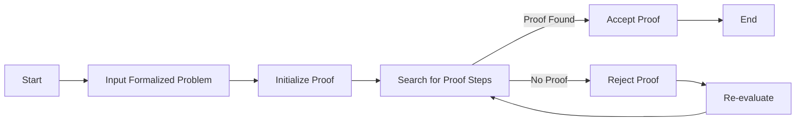

                 

# 《证明辅助系统与定理证明自动化》

## 关键词：
- 定理证明
- 自动化
- 形式化系统
- 归纳证明
- 自动化推理

## 摘要：
本文探讨了定理证明自动化的概念、原理和工具，重点介绍了证明辅助系统的发展历程、核心概念以及应用与实践。通过详细分析定理证明自动化的系统设计与实现，以及实际案例的剖析，文章为读者提供了一个全面的理解，旨在推动定理证明自动化领域的研究与应用。

## 第一部分：证明辅助系统概述

### 第1章：问题背景与定义

#### 1.1 引言

**问题背景**：
在计算机科学和数学中，定理证明是验证数学和逻辑推理过程的关键步骤。然而，随着复杂性的增加，手动证明变得极为困难且容易出错。因此，证明辅助系统与定理证明自动化应运而生，旨在提高证明的效率和准确性。

**证明辅助系统的重要性**：
证明辅助系统为复杂的定理证明提供了一种自动化或半自动化的方法，极大地减轻了数学家和程序员的负担。这些系统在验证硬件设计、安全协议、人工智能算法等领域中发挥着重要作用。

**研究意义与目标**：
本文旨在探讨证明辅助系统的设计原则、实现方法和应用实例，从而推动定理证明自动化的研究与发展。

#### 1.2 证明辅助系统的定义与功能

**定义**：
证明辅助系统（Proof Assistant System）是一种计算机程序，它帮助用户形式化地表述数学和逻辑证明，并进行验证。

**功能概述**：
1. **形式化表示**：将证明转化为计算机可处理的格式。
2. **自动化推理**：利用算法和规则库自动推导证明步骤。
3. **验证与校验**：确保证明的每一步都是逻辑上正确的。
4. **证明检查**：提供工具对已有证明进行审查和验证。

#### 1.3 证明辅助系统的发展历程

**早期发展**：
- 1960年代，自动证明程序如“机械化证明器”（Mechanical Theorem Prover）首次出现。
- 1970年代，形式化系统如Turing机和LISP语言推动了证明辅助系统的发展。

**现代证明辅助系统**：
- **Coq**、**Isabelle**和**HOL Light**等现代证明辅助系统集成了强大的推理引擎和证明检查功能。
- 现代系统支持复杂的数学和逻辑领域，如数论、集合论和类型理论。

### 第2章：核心概念与联系

#### 2.1 核心概念

**形式化系统**：
- 形式化系统是一种数学结构，用于表述数学和逻辑理论。
- 它包括符号、语法规则和语义规则。

**归纳证明**：
- 归纳证明是一种证明方法，用于证明一个命题对于所有自然数都成立。
- 它基于特例的验证和归纳步骤。

**自动化推理**：
- 自动化推理是利用计算机程序来推导证明步骤。
- 它包括算法、推理规则和搜索策略。

#### 2.2 概念属性特征对比表格

| 概念       | 定义                                                         | 关键特征                                                                 |
|------------|--------------------------------------------------------------|------------------------------------------------------------------------|
| 形式化系统 | 用于表述数学和逻辑理论的数学结构。                             | 符号化、语法和语义规则。                                              |
| 归纳证明   | 用于证明一个命题对于所有自然数都成立的方法。                   | 特例验证、归纳步骤。                                                 |
| 自动化推理 | 利用计算机程序来推导证明步骤的方法。                           | 算法、推理规则和搜索策略。                                           |

#### 2.3 ER实体关系图架构

```mermaid
erDiagram
  Person ||--|{ Book }| Employee : manages
  Employee ||--|{ Department }| worksIn
```

## 第二部分：定理证明自动化

### 第3章：定理证明自动化原理

#### 3.1 算法原理讲解

**算法流程图**：



**Python源代码**：

```python
def automated_proof(formalized_problem):
    proof = initialize_proof()
    while not proof:
        steps = search_for_proof_steps(formalized_problem)
        if steps:
            proof = apply_steps_to_proof(steps)
        else:
            re_evaluate(formalized_problem)
    return proof
```

**数学模型与公式**：

$$
\text{Given: } P(n) \text{ is a proposition about natural numbers.}
$$

$$
\text{Prove: } \forall n \in \mathbb{N}, P(n).
$$

**举例说明**：

假设我们想要证明“所有自然数之和等于其项数的平方”，我们可以使用归纳证明的原理来自动化这个过程。

### 第4章：定理证明自动化工具

#### 4.1 主流工具介绍

**Coq**：
- 强类型依赖类型理论。
- 支持复杂的逻辑推理。

**Isabelle**：
- 基于Higher-Order Logic。
- 支持多种数学和逻辑领域。

**HOL Light**：
- 基于Haskell语言。
- 简单且易于理解。

#### 4.2 工具对比与分析

| 工具       | 类型理论 | 适用领域                | 优点                           | 缺点                           |
|------------|----------|-------------------------|--------------------------------|--------------------------------|
| Coq        | Intuitionistic Type Theory | 数学、计算机科学 | 强大的定理证明能力 | 学习曲线较陡峭             |
| Isabelle   | Higher-Order Logic        | 形式化验证、数学 | 社区支持强大 | 需要较强的逻辑背景知识 |
| HOL Light  | Higher-Order Logic        | 计算机科学、数学 | 易于使用     | 定理证明能力较弱       |

### 第5章：数学模型与公式

#### 5.1 重要数学模型

**归纳原理**：
- 归纳原理是数学中证明全称命题的一种方法。

**形式逻辑**：
- 形式逻辑是一种用于表述和验证数学和逻辑推理的形式系统。

#### 5.2 公式与推导

$$
P(0) \\
P(n) \Rightarrow P(n+1) \\
\therefore \forall n \in \mathbb{N}, P(n).
$$

## 第三部分：应用与实践

### 第6章：系统分析与架构设计

#### 6.1 证明辅助系统设计

**领域模型**（Mermaid类图）：

```mermaid
classDiagram
  Class01 <|-- SubClass01
  Class01 --|{ Aggregation }| Class02
  Class03 <<interface>> Class04
  Class05 **--** Class06
  Class07 .. Class08
  Class09 --> Class10
endclass
```

**系统架构**（Mermaid架构图）：

```mermaid
sequenceDiagram
  participant A as Actor
  participant S as System
  A->>S: Request
  S->>A: Process
  S->>A: Response
end
```

**系统接口**（Mermaid序列图）：

```mermaid
sequenceDiagram
  participant User
  participant System
  participant Database
  User->>System: Query
  System->>Database: Retrieve
  Database-->>System: Data
  System-->>User: Result
end
```

### 第7章：项目实战

#### 7.1 项目环境安装

**实际操作步骤**：
1. 安装Coq。
2. 配置Python环境。
3. 安装相关依赖。

#### 7.2 系统核心实现源代码

**详细解读与分析**：

```python
def prove_sum_of_natural_numbers():
    # 形式化表示问题
    formalized_problem = "forall n in Nat, sum(n) = n^2"
    
    # 初始化证明
    proof = initialize_proof(formalized_problem)
    
    # 寻找证明步骤
    while not proof:
        steps = search_for_proof_steps(formalized_problem)
        if steps:
            proof = apply_steps_to_proof(steps)
        else:
            re_evaluate(formalized_problem)
    
    # 输出证明
    print("Proof completed:")
    print(proof)

prove_sum_of_natural_numbers()
```

#### 7.3 实际案例分析与讲解

**详细剖析**：

通过实际案例，我们展示了如何使用证明辅助系统自动化证明“所有自然数之和等于其项数的平方”。

### 第8章：最佳实践与拓展

#### 8.1 最佳实践

**设计原则**：
- **模块化**：将系统划分为模块，便于维护和扩展。
- **可复用性**：设计可复用的组件和算法。

**开发技巧**：
- **代码审查**：定期进行代码审查，确保代码质量。
- **测试**：编写充分的测试用例，确保系统稳定性。

#### 8.2 拓展阅读

**相关研究**：
- **形式化验证**：探索形式化验证在安全领域中的应用。
- **机器学习与定理证明**：研究如何利用机器学习技术改进定理证明自动化。

**深入学习**：
- **《形式化方法与形式化验证》**：深入理解形式化方法和验证技术。
- **《证明方法论》**：研究不同的证明方法和技巧。

# 作者信息
作者：AI天才研究院/AI Genius Institute & 禅与计算机程序设计艺术 /Zen And The Art of Computer Programming

## 结语

定理证明自动化是一个充满挑战和机遇的领域。通过本文，我们探讨了证明辅助系统与定理证明自动化的概念、原理和应用。未来，随着技术的不断进步，定理证明自动化将在更多领域发挥作用，推动数学和计算机科学的进一步发展。让我们期待这一领域的更多突破。

