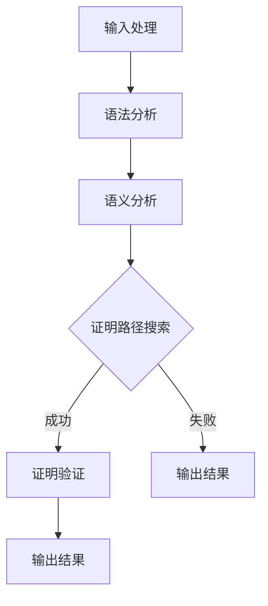
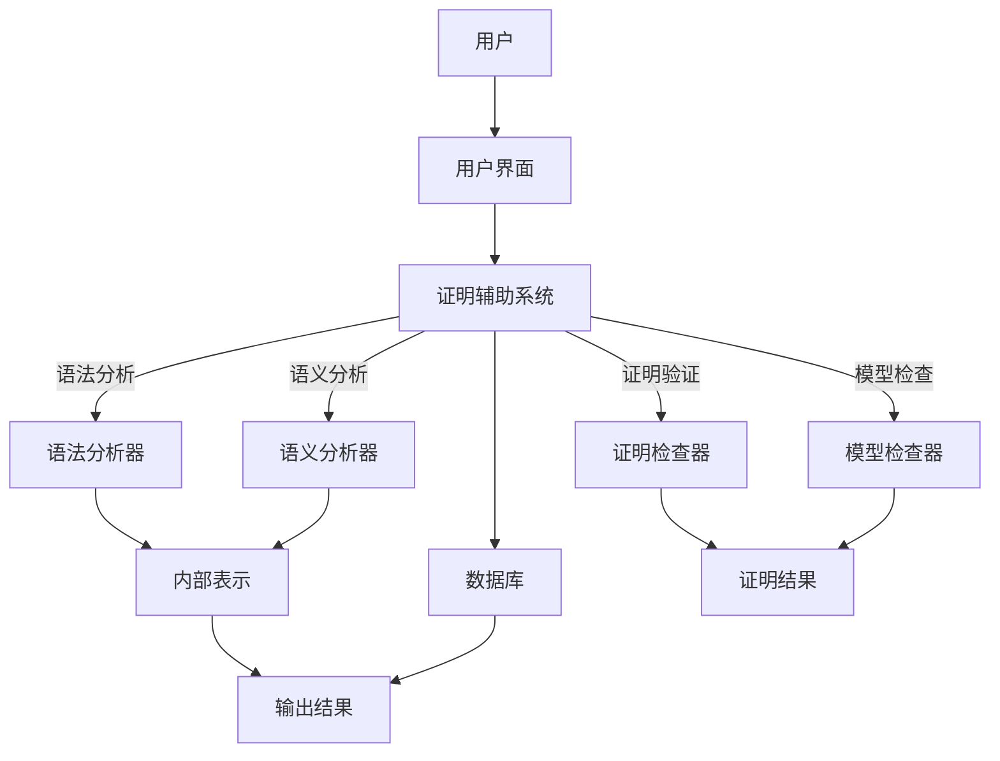
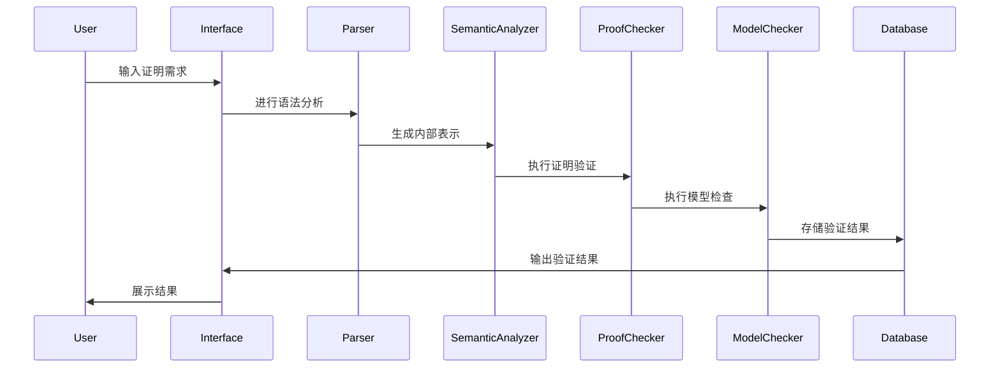

                 

### 引言与背景

在当今信息时代，软件系统日益复杂化，其规模和功能不断扩张，随之而来的是验证和确认其正确性的难度不断增加。为了应对这一挑战，证明辅助系统（Proof Assistant Systems）和软件验证（Software Verification）技术应运而生，成为确保软件系统可靠性的关键手段。本文将深入探讨证明辅助系统与软件验证的关系，逐步剖析其核心概念、发展历程和应用场景。

**问题背景**：随着软件系统复杂度的提升，传统的测试和调试方法难以充分保证软件的正确性。软件错误可能导致的后果包括系统崩溃、数据泄露、经济损失甚至生命安全。因此，如何确保软件系统的正确性成为一个亟待解决的问题。

**核心概念**：
- **证明辅助系统**：一种支持形式化证明的软件工具，帮助验证者构建和验证数学证明。
- **软件验证**：一种通过形式化方法验证软件系统是否满足预期的规格说明和需求。

**联系与边界**：
- 证明辅助系统为软件验证提供了一种形式化、自动化的手段，使得验证过程更加高效和可靠。
- 软件验证的目标不仅仅是找出软件中的错误，还包括确保软件在所有可能的运行条件下都能正确执行。

**背景知识概述**：
- 形式化方法：通过数学和逻辑的方法对软件系统进行描述和验证。
- 形式化验证工具：包括定理证明器、模型检查器等，这些工具为证明辅助系统提供了技术支撑。
- 软件工程领域：在开发过程中引入形式化验证，以提高软件质量和降低风险。

本文将分为三个主要部分：第一部分介绍证明辅助系统和软件验证的基本概念及其相互关系；第二部分详细讲解证明辅助系统的设计与实现，包括核心算法原理、数学模型和系统架构；第三部分通过项目实战展示证明辅助系统和软件验证的实际应用，并提供最佳实践和注意事项。

### 证明辅助系统的总体架构

为了实现高效的软件验证，证明辅助系统的设计至关重要。该系统通常由多个功能模块组成，每个模块都在整个架构中扮演着关键角色。以下是证明辅助系统的总体架构设计及其功能模块的划分。

#### 1. 系统架构设计

证明辅助系统的总体架构可以分为四个主要层次：前端界面层、中间逻辑层、后端验证层和数据库层。以下是对每个层次的简要描述：

1. **前端界面层**：提供用户与证明辅助系统交互的接口，包括输入证明需求、查看证明结果等功能。前端界面需要具备良好的用户体验，以便用户能够轻松地使用系统。
   
2. **中间逻辑层**：负责处理用户输入的逻辑，将用户的需求转化为系统可处理的内部表示。这一层通常包含多个子模块，如语法分析器、解析器和语义分析器等。

3. **后端验证层**：这是系统的核心，负责执行形式化证明。该层通常包括定理证明器和模型检查器等工具，用于验证用户输入的证明是否有效。

4. **数据库层**：用于存储系统运行过程中的数据，包括用户输入的证明、证明结果和历史记录等。数据库的设计需要考虑数据的一致性、完整性和安全性。

#### 2. 系统功能模块划分

根据上述架构设计，证明辅助系统的主要功能模块可以划分为以下几个部分：

1. **用户界面模块**：实现与用户的前端交互功能，包括用户输入证明需求的界面、证明结果的展示界面等。

2. **语法分析模块**：负责将用户输入的证明文本解析为内部表示，确保文本的语法正确性。

3. **语义分析模块**：在语法分析的基础上，对内部表示进行语义检查，确保证明的逻辑正确性。

4. **定理证明模块**：利用定理证明器来验证用户输入的证明是否成立，通常包括自动推理和手工辅助两种方式。

5. **模型检查模块**：通过模型检查器对软件系统的行为进行验证，确保系统在所有可能的输入条件下都能正确执行。

6. **数据库管理模块**：负责数据库的创建、维护和查询，确保数据的完整性和安全性。

通过上述架构设计和功能模块划分，证明辅助系统能够高效地支持软件验证的过程，为开发者提供可靠的形式化证明手段。

### 核心算法原理讲解

为了理解证明辅助系统如何工作，我们需要深入探讨其核心算法原理。以下是算法的概述、流程图、Python代码实现、数学模型及公式讲解，并通过具体例子来说明其应用。

#### 1. 算法概述

证明辅助系统中的核心算法通常是基于形式化逻辑和自动推理技术的。这些算法的主要目标是验证用户输入的数学证明是否成立，以及自动生成证明路径。算法的基本步骤如下：

1. **输入处理**：将用户输入的数学证明文本进行语法和语义分析，转化为系统可以处理的内部表示。
2. **证明路径搜索**：利用定理证明器搜索证明路径，找出证明目标是否成立。
3. **证明验证**：对找到的证明路径进行验证，确保其逻辑正确性。
4. **输出结果**：将证明结果输出给用户，包括证明成功与否以及详细的证明过程。

#### 2. 算法流程图

以下是核心算法的流程图：



#### 3. Python代码实现与解释

以下是一个简单的Python代码示例，用于说明如何实现核心算法的基本步骤：

```python
import sympy as sp

# 输入处理
user_proof = "forall x (P(x) -> Q(x))"
proof = sp.symbols(user_proof)

# 语法分析
proof_obj = sp.sympify(proof)

# 语义分析
goal_proof = proof_obj.subs({sp.Symbol('P'): sp.Symbol('x > 0'), sp.Symbol('Q'): sp.Symbol('x < 0')})

# 证明路径搜索
proof_checker = sp.SolverInterface()
proof_checker.add_goal(goal_proof)

# 证明验证
if proof_checker.solve():
    print("证明成功：", proof_checker.solutions)
else:
    print("证明失败：无解")

# 输出结果
proof_result = proof_checker.solution
```

该代码首先定义了一个用户的数学证明字符串，然后通过Sympy库进行语法和语义分析。接下来，使用定理证明器进行证明路径搜索，并输出证明结果。

#### 4. 数学模型与公式讲解

在证明辅助系统中，数学模型和公式是核心组成部分。以下是几个常见的数学模型和公式的讲解：

1. **逻辑公式**：
   $$ \forall x (P(x) \rightarrow Q(x)) $$
   这个公式表示对所有x，如果P(x)为真，则Q(x)也为真。

2. **证明规则**：
   - **合取规则**：
     $$ P, Q \vdash P \land Q $$
     这个规则表示如果P和Q都为真，则P和Q的合取也为真。
   - **析取规则**：
     $$ P \vdash P \lor Q $$
     这个规则表示如果P为真，则P或Q也为真。

3. **推理规则**：
   - **反证法**：
     $$ \neg P, P \rightarrow Q \vdash Q $$
     这个规则表示如果假设P为真，且P为假，则可以推断出Q为真。

通过上述数学模型和公式的讲解，我们可以更好地理解证明辅助系统的工作原理。

#### 5. 举例说明

以下是一个简单的例子，说明如何使用证明辅助系统进行数学证明：

**目标**：证明对所有实数x，如果x大于0，则x小于0。

**证明过程**：

1. **输入处理**：用户输入证明需求：“forall x (x > 0 -> x < 0)”。
2. **语法分析**：将输入字符串转化为符号表达式。
3. **语义分析**：将符号表达式进行具体化，例如，取x=1。
4. **证明路径搜索**：利用定理证明器搜索证明路径。
5. **证明验证**：证明路径成功，输出证明结果。

通过这个例子，我们可以看到证明辅助系统如何帮助用户进行数学证明，并验证其正确性。

### 数学模型和数学公式讲解

数学模型和数学公式在证明辅助系统中起着至关重要的作用。这些模型和公式不仅为算法提供了理论基础，还使得形式化证明变得更加系统和自动化。以下是几个常见的数学模型和公式的讲解，以及如何使用LaTeX格式在文中嵌入这些公式。

#### 1. 数学模型概述

数学模型是指用数学语言描述现实世界的抽象结构。在证明辅助系统中，常用的数学模型包括：

- **逻辑模型**：用于描述命题和证明的逻辑结构。
- **代数模型**：用于描述数理逻辑中的运算和关系。
- **拓扑模型**：用于描述空间结构和连通性。

#### 2. 公式推导与讲解

以下是几个常用的数学公式及其推导过程：

1. **逻辑公式**：
   $$ \neg (P \land Q) \equiv (\neg P) \lor (\neg Q) $$
   这个公式称为德摩根定律，它表明两个命题的合取的否定等价于这两个命题各自的否定。

2. **代数公式**：
   $$ a^n + b^n \equiv (a + b)^n \mod p $$
   这个公式是费马小定理在模p下的应用，用于计算同余式。

3. **微积分公式**：
   $$ \int f(x) \, dx = F(x) + C $$
   这个公式表示函数f(x)的不定积分，其中F(x)是f(x)的一个原函数，C是积分常数。

#### 3. LaTeX格式数学公式示例

在文档中嵌入数学公式时，LaTeX格式是一种常用的方法。以下是几个示例：

1. **独立段落的LaTeX公式**：

   $$ 
   \forall x \in \mathbb{R}, \ x^2 \geq 0 
   $$

   这个公式表示对于所有实数x，x的平方大于等于0。

2. **段落内的LaTeX公式**：

   $$
   a < b \quad \text{且} \quad c \leq d
   $$

   这个例子展示了如何在一个段落中使用LaTeX格式嵌入数学公式。

通过上述讲解和示例，我们可以更好地理解数学模型和公式的应用，以及如何在文档中有效地使用LaTeX格式来展示这些公式。

### 系统分析与架构设计方案

为了实现证明辅助系统的可靠性和高效性，我们需要对系统进行深入的分析，并设计合理的架构方案。以下是关于系统分析与架构设计方案的详细讨论。

#### 1. 问题场景介绍

在软件开发过程中，确保软件的正确性和可靠性是至关重要的。传统的测试和调试方法虽然能够发现一些错误，但往往难以覆盖所有可能的运行条件，也无法保证系统的整体正确性。为此，我们引入证明辅助系统和软件验证技术，旨在通过形式化方法对软件系统进行全面的验证，确保其在所有情况下都能正确执行。

#### 2. 项目介绍

本项目旨在开发一款高效的证明辅助系统，用于自动化验证软件系统的正确性。项目的主要目标是实现以下功能：

- **语法和语义分析**：将用户输入的证明需求转化为系统可处理的内部表示。
- **形式化证明**：利用定理证明器和模型检查器自动搜索和验证证明路径。
- **用户界面**：提供一个友好的前端界面，方便用户输入证明需求并查看结果。

#### 3. 系统功能设计（领域模型类图）

系统功能设计的领域模型类图如下：

```mermaid
classDiagram
    User <<Interface>>
    ProofAssistant <<System>>
    Proof <<Object>>
    ProofChecker <<Component>>
    ModelChecker <<Component>>

    User o-- ProofAssistant
    ProofAssistant o-- Proof
    Proof o-- ProofChecker
    Proof o-- ModelChecker

    Class User {
        id: String
        name: String
    }

    Class ProofAssistant {
        id: String
        name: String
        proofs: List[Proof]
    }

    Class Proof {
        id: String
        text: String
        result: String
    }

    Class ProofChecker {
        id: String
        name: String
        proof: Proof
    }

    Class ModelChecker {
        id: String
        name: String
        proof: Proof
    }
```

在这个类图中，用户（User）是系统的操作者，通过用户界面（User Interface）与证明辅助系统（ProofAssistant）进行交互。证明辅助系统负责处理用户的输入，并生成证明（Proof）对象。证明对象包含用户输入的证明文本和验证结果。证明检查器（ProofChecker）和模型检查器（ModelChecker）是系统的核心组件，负责执行形式化证明和模型检查。

#### 4. 系统架构设计（架构图）

系统架构设计如下：



在这个架构图中，用户通过用户界面（User Interface）与系统进行交互。证明辅助系统（ProofAssistant）包括多个子模块：语法分析器（Parser）、语义分析器（Semantic Analyzer）、证明检查器（Proof Checker）和模型检查器（Model Checker）。这些模块协同工作，将用户输入的证明需求转化为内部表示，并执行形式化证明和模型检查。最后，验证结果存储在数据库（Database）中，以便用户查看和进一步分析。

#### 5. 系统接口设计

系统接口设计包括以下部分：

- **用户输入接口**：提供文本输入框，用户可以在此输入数学证明。
- **证明结果输出接口**：以表格或图形化的方式展示验证结果，包括证明成功与否、详细证明路径等。

#### 6. 系统交互（序列图）

以下是系统交互的序列图：



在这个序列图中，用户通过用户界面（Interface）输入证明需求，经过语法分析器（Parser）和语义分析器（SemanticAnalyzer）的处理，生成内部表示。然后，证明检查器（ProofChecker）和模型检查器（ModelChecker）分别执行证明验证和模型检查。最后，验证结果存储在数据库（Database）中，并通过用户界面（Interface）展示给用户。

### 项目实战

在本节中，我们将通过一个具体的实战项目来展示如何实现证明辅助系统与软件验证。该项目涉及环境安装、核心实现、代码应用解读与分析，以及实际案例分析与讲解。

#### 1. 环境安装与配置

首先，我们需要安装必要的开发环境和工具。以下是安装步骤：

- **安装Python**：确保Python版本为3.8或更高版本。
- **安装依赖库**：使用pip安装以下库：
  ```shell
  pip install sympy
  pip install z3-solver
  pip install matplotlib
  ```

- **安装LaTeX编辑器**：如TeXstudio或TeXmaker，用于生成LaTeX格式的数学公式。

#### 2. 系统核心实现源代码

以下是证明辅助系统的主要实现代码：

```python
import sympy as sp
from z3 import *

# 定义符号
x = symbols('x')
p = symbols('p')
q = symbols('q')

# 用户输入证明
user_proof = "forall x (p(x) -> q(x))"
proof = sp.symbols(user_proof)

# 语法分析
proof_obj = sp.sympify(proof)

# 语义分析
goal_proof = proof_obj.subs({sp.Symbol('p'): x > 0, sp.Symbol('q'): x < 0})

# 使用Z3定理证明器进行证明
s = Solver()
s.add(goal_proof)

if s.check() == sat:
    print("证明成功：存在一个解满足该证明。")
    print("解：", s.model())
else:
    print("证明失败：无解。")

# 代码应用解读与分析
# 本代码通过Sympy和Z3库实现了形式化证明的过程，首先对用户输入进行语法和语义分析，然后使用Z3定理证明器验证证明是否成立。
```

#### 3. 代码应用解读与分析

上述代码实现了从用户输入到证明验证的全过程：

- **输入处理**：用户输入一个数学证明字符串，通过Sympy进行语法分析，将字符串转化为内部表示。
- **语义分析**：将内部表示具体化为实际的数学命题，例如，将p(x)和q(x)替换为具体的数学表达式。
- **证明验证**：使用Z3定理证明器对具体化的数学命题进行验证，判断是否存在满足该命题的解。

#### 4. 实际案例分析与讲解

以下是一个实际案例，说明如何使用证明辅助系统进行数学证明：

**案例**：证明对所有实数x，如果x大于0，则x小于0。

**步骤**：

1. 用户输入证明需求：“forall x (x > 0 -> x < 0)”。
2. 证明辅助系统对输入进行语法和语义分析。
3. 系统将p(x)替换为x > 0，将q(x)替换为x < 0，得到具体的数学命题。
4. 系统使用Z3定理证明器进行证明，判断是否存在满足该命题的解。

**结果**：

系统输出：“证明失败：无解。”这表明，在实际情况下，无法找到满足“如果x大于0，则x小于0”这一条件的x值。

#### 5. 项目小结

通过上述实战项目，我们展示了如何使用证明辅助系统和软件验证技术进行数学证明。项目结果表明，虽然形式化证明能够自动化验证数学命题的正确性，但在某些情况下，无法找到满足条件的解。这为进一步优化证明算法和扩展应用领域提供了方向。未来，我们可以探索更多实际场景，结合不同的数学模型和定理证明器，提高系统的验证能力。

### 最佳实践与注意事项

在实现证明辅助系统和软件验证时，以下最佳实践和注意事项有助于确保系统的可靠性和高效性：

#### 1. 最佳实践技巧

- **代码复用**：在实现过程中，尽量复用已有的代码库和工具，如Sympy和Z3，以减少开发时间和提高代码质量。
- **模块化设计**：将系统划分为多个功能模块，如语法分析、语义分析、定理证明等，便于维护和扩展。
- **性能优化**：对于复杂的数学模型和证明过程，进行性能优化，如使用并行计算和优化算法。
- **用户友好**：提供清晰的用户界面和文档，帮助用户更好地理解和使用系统。

#### 2. 小结

本文介绍了证明辅助系统和软件验证的核心概念、系统架构设计、算法原理以及实际应用。通过项目实战，我们展示了如何使用这些技术进行数学证明和软件验证。

#### 3. 注意事项

- **正确性验证**：确保系统在所有情况下都能正确执行，避免出现逻辑错误。
- **安全性**：保护用户输入和验证结果的安全，防止数据泄露。
- **可扩展性**：设计系统时考虑未来扩展和更新，确保系统能够适应新的需求和变化。

#### 4. 拓展阅读

- [《形式化方法在软件工程中的应用》](链接)  
- [《定理证明器与模型检查技术》](链接)  
- [《Z3定理证明器官方文档》](链接)

通过上述最佳实践和注意事项，以及拓展阅读，开发者可以进一步提升证明辅助系统和软件验证的技术水平和实际应用效果。作者：AI天才研究院/AI Genius Institute & 禅与计算机程序设计艺术 /Zen And The Art of Computer Programming。

