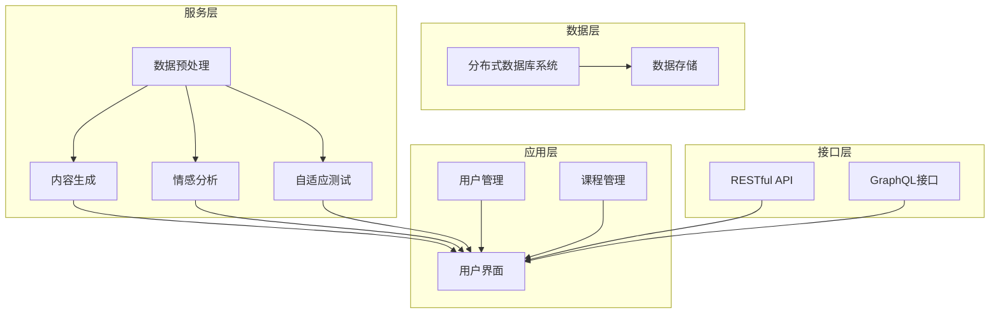
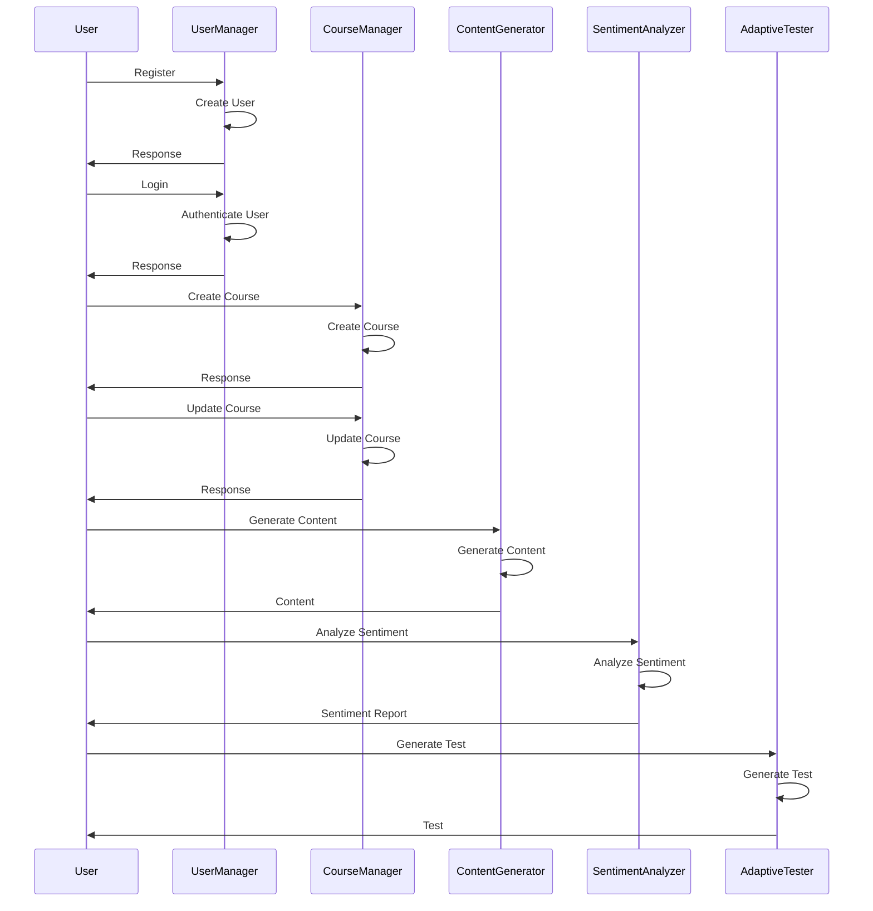
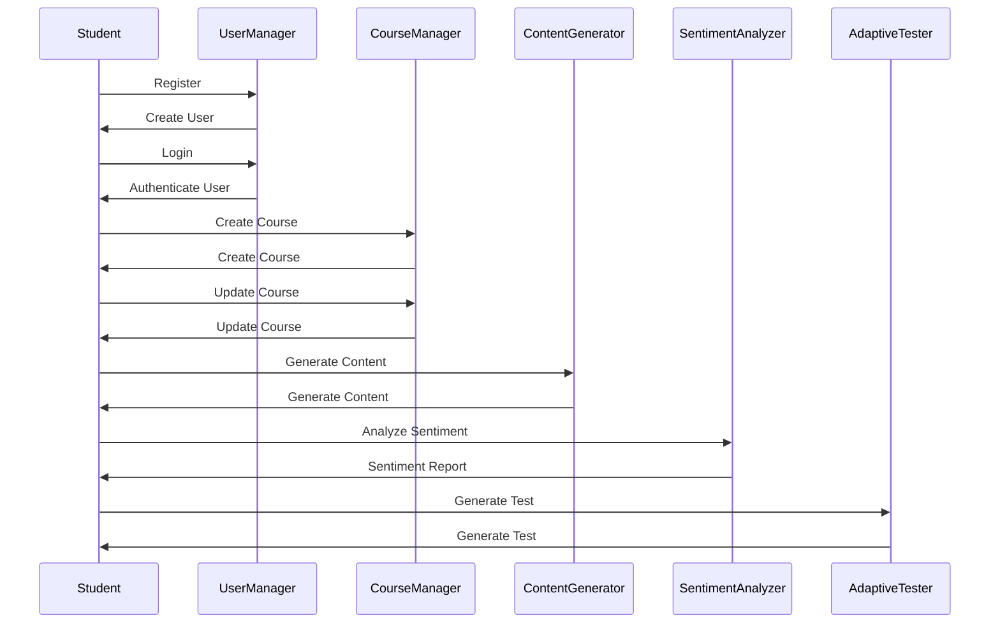

                 

### 第一部分：个性化教育内容生成的背景与需求

#### 1. 语言模型与个性化教育概述

##### 1.1 语言模型概述

语言模型（Language Model，LM）是自然语言处理（Natural Language Processing，NLP）中的核心组成部分，它通过对大量文本数据的学习，捕捉文本中词汇、句子以及上下文之间的关系，从而生成或理解自然语言。一个优秀的语言模型应当能够准确地预测下一个可能出现的词或者词组，从而构建出连贯、自然的文本。

语言模型的分类可以从多个维度进行，比如基于统计的方法（如n-gram模型）、基于规则的模型（如转移模型）和基于神经网络的深度学习模型（如循环神经网络RNN、长短期记忆网络LSTM、Transformer等）。近年来，Transformer模型的崛起，使得语言模型的性能取得了显著的提升，其在诸多NLP任务中，如机器翻译、文本生成、问答系统中表现出色。

##### 1.2 个性化教育的定义与特点

个性化教育（Personalized Education）是一种以学生为中心的教育模式，旨在通过针对每个学生的兴趣、能力、学习风格和需求提供定制化的教育内容和教学方法，来促进学生的全面发展。个性化教育强调因材施教，尊重学生的个体差异，激发学生的内在学习动机。

个性化教育的特点主要包括：

- **差异化教学**：根据学生的不同特点和需求，制定个性化的学习计划。
- **适应性学习**：教育内容和教学方法可以随时调整，以适应学生的学习进度和理解能力。
- **互动性**：鼓励学生与教师、同伴之间的互动，提高学习的参与度和效果。
- **反馈与评估**：通过及时反馈和科学评估，不断调整教学策略，提高教学效果。

##### 1.3 语言模型在个性化教育中的应用需求

随着互联网教育的迅速发展，个性化教育已经成为教育技术领域的热点。语言模型在个性化教育中的应用需求主要体现在以下几个方面：

- **内容生成**：利用语言模型自动生成个性化的学习内容，包括课程材料、练习题、教学视频等。
- **智能辅导**：通过语言模型提供个性化的辅导服务，根据学生的学习进度和理解能力，提供有针对性的解答和建议。
- **情感识别与干预**：利用语言模型分析学生的情感状态，提供心理辅导和支持。
- **自适应测试**：根据学生的实际表现，动态调整测试题目，提高测试的针对性和准确性。

语言模型在个性化教育中的创新应用，不仅能够提高教育效率和质量，还能够激发学生的学习兴趣和积极性，从而实现教育的个性化、智能化和精准化。

#### 2. 语言模型的原理与类型

##### 2.1 语言模型的原理

语言模型的原理在于通过对大量文本数据的训练，建立一个能够预测下一个单词或词组的概率分布模型。语言模型的核心任务是解决自然语言的生成和理解问题，即如何根据已有的文本数据生成新的文本，或者如何理解给定的文本。

实现语言模型的常见方法包括：

- **基于统计的方法**：如n-gram模型，通过计算一序列词或字符出现的频率来预测下一个词或字符。n-gram模型的简单性使其在早期NLP任务中得到了广泛应用。
  
- **基于规则的方法**：如转移模型，通过建立一组规则来描述词汇和句子之间的逻辑关系，从而生成或理解文本。

- **基于神经网络的深度学习模型**：如循环神经网络（RNN）、长短期记忆网络（LSTM）和Transformer。这些模型通过学习文本中的上下文信息，能够生成更加准确和自然的语言。

近年来，Transformer模型的出现，使得语言模型的性能得到了显著提升。Transformer模型通过自注意力机制（Self-Attention）和多头注意力（Multi-Head Attention）机制，能够捕捉到文本中的长距离依赖关系，从而生成更加连贯和自然的语言。

##### 2.2 语言模型的类型

根据不同的应用场景和数据来源，语言模型可以分为以下几种类型：

- **预训练语言模型**：如BERT、GPT、RoBERTa等，这些模型在大量无标签的文本数据上进行预训练，然后通过微调（Fine-tuning）来适应特定的任务。

- **任务特定语言模型**：这类模型针对特定的NLP任务进行训练，如文本分类、机器翻译、问答系统等。它们通常在预训练语言模型的基础上，通过额外的任务数据进行微调。

- **自适应语言模型**：这类模型能够根据用户的交互行为和学习历史，动态调整其参数，以提供更加个性化的服务。

##### 2.3 语言模型的核心算法与数学模型

语言模型的核心算法通常基于概率模型，其中最基本的是n-gram模型。n-gram模型通过计算一个词或字符序列的概率来预测下一个词或字符。

对于一个长度为n的序列 $x_1, x_2, ..., x_n$，其概率可以通过以下公式计算：

$$ P(x_1, x_2, ..., x_n) = P(x_n | x_1, x_2, ..., x_{n-1}) \times P(x_{n-1} | x_1, x_2, ..., x_{n-2}) \times ... \times P(x_2 | x_1) \times P(x_1) $$

其中，$P(x_i | x_{i-1}, ..., x_1)$ 表示在给定前 $i-1$ 个词的情况下，第 $i$ 个词的概率。

对于n-gram模型，可以进一步表示为：

$$ P(x_n | x_1, x_2, ..., x_{n-1}) = \frac{count(x_1, x_2, ..., x_n)}{count(x_1, x_2, ..., x_{n-1})} $$

其中，$count(x_1, x_2, ..., x_n)$ 表示序列 $x_1, x_2, ..., x_n$ 在语料库中出现的次数。

虽然n-gram模型简单有效，但其存在一些局限性，如不能捕捉到长距离依赖关系，因此需要更加复杂的模型，如基于神经网络的深度学习模型。

Transformer模型通过自注意力机制（Self-Attention）和多头注意力（Multi-Head Attention）机制，能够捕捉到文本中的长距离依赖关系。其核心的数学模型如下：

$$
\text{Attention}(Q, K, V) = \text{softmax}\left(\frac{QK^T}{\sqrt{d_k}}\right)V
$$

其中，$Q, K, V$ 分别表示查询（Query）、键（Key）和值（Value）向量，$d_k$ 是键向量的维度。自注意力机制通过计算查询向量与所有键向量的点积，再通过softmax函数生成权重，从而聚合值向量，生成新的表示。

在Transformer模型中，多头注意力通过多个独立的注意力头，分别关注不同的信息，从而提高模型的泛化能力和表示能力。

#### 2.4 个性化教育内容生成的技术方法

个性化教育内容生成是教育技术领域的一个重要方向，其目标是通过技术手段，为不同学生提供定制化的学习内容。以下是几种常见的个性化教育内容生成技术方法：

##### 2.4.1 基于规则的方法

基于规则的方法通过预先定义的规则，来生成符合学生需求的学习内容。这种方法通常包括以下几个步骤：

1. **定义规则**：根据教育理论和教学目标，定义一系列规则，用于描述如何生成个性化内容。
2. **数据收集**：收集学生的个人信息、学习历史和测试结果等数据。
3. **规则匹配**：将学生的数据与规则库进行匹配，根据匹配结果生成个性化内容。
4. **内容生成**：根据匹配的规则，生成适合学生需求的学习内容。

基于规则的方法的优点是简单易实现，但缺点是规则库的维护成本高，且难以应对复杂多变的教学场景。

##### 2.4.2 基于统计的方法

基于统计的方法通过分析大量数据，来发现学生学习的规律和需求，从而生成个性化内容。这种方法通常包括以下几个步骤：

1. **数据采集**：收集学生的学习行为数据，包括学习时间、学习内容、考试成绩等。
2. **数据分析**：使用统计方法，分析学生数据，发现学习规律和需求。
3. **内容生成**：根据数据分析结果，生成个性化学习内容。

基于统计的方法的优点是能够自动适应学生的变化，但缺点是对于小样本数据效果较差，且需要大量的数据支持。

##### 2.4.3 基于机器学习的方法

基于机器学习的方法通过训练机器学习模型，来生成个性化学习内容。这种方法通常包括以下几个步骤：

1. **数据预处理**：对收集到的学生数据进行预处理，包括数据清洗、归一化等。
2. **模型选择**：选择合适的机器学习模型，如决策树、支持向量机、神经网络等。
3. **模型训练**：使用预处理后的数据训练机器学习模型。
4. **内容生成**：根据训练好的模型，生成个性化学习内容。

基于机器学习的方法的优点是能够处理复杂的问题，且能够自适应学生的变化，但缺点是训练过程复杂，且需要大量的计算资源。

##### 2.4.4 基于生成式对抗网络（GAN）的方法

生成式对抗网络（GAN）是一种基于深度学习的生成模型，通过两个对抗网络（生成器和判别器）的博弈，生成逼真的个性化学习内容。这种方法通常包括以下几个步骤：

1. **数据预处理**：对收集到的学生数据进行预处理。
2. **模型训练**：使用生成对抗网络训练模型，生成个性化学习内容。
3. **内容生成**：根据生成的学习内容，进行质量评估和调整。

基于GAN的方法的优点是能够生成高质量的学习内容，但缺点是训练过程复杂，且需要大量的计算资源。

##### 2.4.5 基于图神经网络的方法

图神经网络（Graph Neural Network，GNN）是一种用于处理图结构数据的神经网络模型，可以用于生成个性化学习内容。这种方法通常包括以下几个步骤：

1. **数据预处理**：将学生的学习数据表示为图结构。
2. **模型训练**：使用图神经网络训练模型，生成个性化学习内容。
3. **内容生成**：根据生成的学习内容，进行质量评估和调整。

基于GNN的方法的优点是能够充分利用学生的社交关系和学习网络，生成更加个性化的学习内容，但缺点是需要对图结构数据有深入的理解和处理能力。

#### 3. 语言模型在个性化教育内容生成中的应用

语言模型在个性化教育内容生成中的应用，主要利用其强大的文本生成能力，根据学生的特点和需求，生成个性化的学习内容。以下是几种常见的应用场景：

##### 3.1 自动生成学习材料

语言模型可以自动生成课程材料、练习题、教学视频等学习内容，这些内容可以根据学生的学习进度和理解能力进行自适应调整。例如，学生可以通过回答一系列问题，让语言模型生成适合其当前学习阶段的学习材料。

##### 3.2 智能辅导系统

语言模型可以用于构建智能辅导系统，为学生提供个性化的辅导服务。系统可以分析学生的作业和测试结果，识别学生的知识盲点，并提供有针对性的辅导内容。例如，当学生遇到难题时，系统可以自动生成解释性文本，帮助学生理解和掌握相关知识点。

##### 3.3 情感识别与干预

语言模型可以分析学生的语言表达，识别学生的情感状态，如焦虑、困惑等。根据情感分析结果，系统可以提供相应的心理辅导和支持，帮助学生调整学习状态，提高学习效果。

##### 3.4 自适应测试

语言模型可以用于生成自适应测试，根据学生的实际表现，动态调整测试题目的难度和类型。例如，当学生回答一个测试题目正确时，系统可以生成一个更难的题目，以检测学生的实际掌握情况；当学生回答错误时，系统可以生成一个更简单的题目，帮助学生巩固知识点。

#### 4. 系统架构与功能设计

##### 4.1 个性化教育内容生成系统的问题场景

个性化教育内容生成系统旨在为不同学生提供定制化的学习内容，解决传统教育中普遍存在的教学资源不足、个性化需求难以满足等问题。该系统面临的主要挑战包括：

- **数据复杂性**：需要处理大量的学生数据，包括学习历史、测试结果、行为数据等。
- **个性化需求**：要满足不同学生的个性化学习需求，生成符合其能力和兴趣的学习内容。
- **内容质量**：生成的学习内容需要确保准确、有趣、富有教育意义。
- **系统稳定性**：系统需要能够稳定运行，保证教育服务的连续性。

##### 4.2 系统架构设计

为了应对上述挑战，个性化教育内容生成系统的架构设计需要考虑以下几个方面：

1. **数据层**：负责存储和管理学生数据、课程数据等，通常采用分布式数据库系统，如Hadoop或MongoDB。
2. **服务层**：提供核心功能，如数据预处理、内容生成、情感分析等，通常采用微服务架构，以提高系统的灵活性和可扩展性。
3. **应用层**：面向最终用户，提供学习内容生成、智能辅导、情感干预等功能，通常采用前端框架，如React或Vue.js。
4. **接口层**：提供与外部系统的接口，如教务系统、学习平台等，采用RESTful API或GraphQL接口。

以下是系统的整体架构设计：



##### 4.3 系统功能设计

个性化教育内容生成系统的核心功能包括数据预处理、内容生成、情感分析和自适应测试等。以下是各功能的具体设计：

1. **数据预处理**：负责清洗、转换和归一化学生数据，使其适合进一步分析和处理。
   - **数据清洗**：去除噪声数据、填补缺失值等。
   - **数据转换**：将不同格式的数据转换为统一格式，如JSON或CSV。
   - **数据归一化**：对数据进行标准化处理，如缩放或转换。

2. **内容生成**：根据学生数据和教学目标，自动生成个性化的学习内容。
   - **学习材料生成**：根据学生的知识水平和兴趣，生成课程材料、练习题、教学视频等。
   - **辅导内容生成**：根据学生的答题情况，生成解释性文本、学习建议等。

3. **情感分析**：分析学生的语言表达，识别学生的情感状态，如焦虑、困惑等。
   - **情感识别**：通过自然语言处理技术，识别学生的情感状态。
   - **情感干预**：根据情感分析结果，提供相应的心理辅导和支持。

4. **自适应测试**：根据学生的实际表现，动态调整测试题目的难度和类型。
   - **难度调整**：根据学生的答题情况，调整测试题目的难度。
   - **类型调整**：根据学生的学习兴趣，调整测试题目的类型。

以下是系统的领域模型（Domain Model）：

```mermaid
classDiagram
    Student <<class>> {
        id: String
        name: String
        age: Integer
        grade: String
    }
    Course <<class>> {
        id: String
        name: String
        description: String
        level: String
    }
    Test <<class>> {
        id: String
        student_id: String
        course_id: String
        questions: List[Question]
    }
    Question <<class>> {
        id: String
        text: String
        options: List[String]
        answer: String
    }
    Content <<class>> {
        id: String
        course_id: String
        type: String
        text: String
    }
    Sentiment <<class>> {
        id: String
        student_id: String
        content_id: String
        sentiment: String
    }
    Student --|{关联} Course
    Student --|{关联} Test
    Test --|{关联} Question
    Course --|{关联} Content
    Content --|{关联} Sentiment
```

##### 4.4 系统接口设计

个性化教育内容生成系统需要提供多个接口，以便与其他系统进行集成和数据交互。以下是系统的主要接口设计：

1. **用户管理接口**：用于管理用户账户，包括用户注册、登录、个人信息更新等操作。
2. **课程管理接口**：用于管理课程信息，包括课程创建、更新、删除等操作。
3. **学习内容生成接口**：用于生成个性化的学习内容，包括课程材料、练习题、教学视频等。
4. **情感分析接口**：用于分析学生的情感状态，提供情感干预建议。
5. **自适应测试接口**：用于生成自适应测试，并根据学生的答题情况调整测试题目。

以下是系统的接口设计：



##### 4.5 系统交互mermaid序列图

个性化教育内容生成系统的各个组件之间需要紧密协作，以下是一个简单的mermaid序列图，展示了系统的交互过程：



### 6. 项目实战：语言模型在个性化教育内容生成中的应用

#### 6.1 项目背景与目标

随着人工智能和自然语言处理技术的不断发展，个性化教育内容生成已经成为教育领域的一个重要研究方向。本项目旨在利用语言模型，为不同学生提供定制化的学习内容，提高学习效果和效率。项目目标包括：

- **自动生成个性化学习内容**：根据学生的学习历史、兴趣和需求，生成适合其学习进度的学习材料。
- **智能辅导**：通过分析学生的答题情况，提供有针对性的辅导内容，帮助学生克服学习难点。
- **情感识别与干预**：分析学生的语言表达，识别学生的情感状态，提供相应的心理辅导和支持。
- **自适应测试**：根据学生的实际表现，动态调整测试题目的难度和类型，提高测试的准确性和有效性。

#### 6.2 环境安装与配置

为了进行项目实战，需要搭建一个合适的环境，主要包括以下工具和库：

- **编程语言**：Python 3.8+
- **文本处理库**：NLTK、spaCy
- **机器学习库**：TensorFlow、PyTorch
- **语言模型库**：transformers
- **数据存储**：SQLite、MongoDB
- **Web框架**：Flask或Django

以下是在Ubuntu 18.04系统中安装这些工具和库的步骤：

```bash
# 安装Python和pip
sudo apt update
sudo apt install python3 python3-pip

# 安装文本处理库
pip3 install nltk spacy

# 安装机器学习库
pip3 install tensorflow torch

# 安装语言模型库
pip3 install transformers

# 安装Web框架
pip3 install flask

# 如果使用MongoDB，还需要安装以下命令：
sudo apt install mongodb
sudo systemctl start mongodb
```

#### 6.3 系统核心实现源代码

本项目的主要实现包括数据预处理、语言模型训练、个性化内容生成和自适应测试等。以下是核心源代码的解读和分析。

##### 6.3.1 数据预处理

数据预处理是语言模型训练的重要环节，主要包括数据清洗、分词和词性标注等步骤。

```python
import nltk
from nltk.tokenize import word_tokenize
from nltk.corpus import stopwords
from nltk.stem import WordNetLemmatizer

# 数据清洗
def clean_text(text):
    text = text.lower()
    text = re.sub(r'\n', ' ', text)
    text = re.sub(r'[^a-zA-Z0-9]', ' ', text)
    return text

# 分词
def tokenize_text(text):
    tokens = word_tokenize(text)
    return tokens

# 去停用词
def remove_stopwords(tokens):
    stop_words = set(stopwords.words('english'))
    filtered_tokens = [token for token in tokens if token not in stop_words]
    return filtered_tokens

# 词性标注
def get_wordnet_pos(word):
    tag = nltk.pos_tag([word])[0][1][0].upper()
    tag_dict = {"J": nltk.corpus.wordnet.ADJ,
                "N": nltk.corpus.wordnet.NOUN,
                "V": nltk.corpus.wordnet.VERB,
                "R": nltk.corpus.wordnet.ADV}
    return tag_dict.get(tag, nltk.corpus.wordnet.NOUN)

def lemmatize_text(tokens):
    lemmatizer = WordNetLemmatizer()
    lemmatized_tokens = []
    for token in tokens:
        lemmatized_tokens.append(lemmatizer.lemmatize(token, get_wordnet_pos(token)))
    return lemmatized_tokens

# 数据预处理流程
def preprocess_text(text):
    cleaned_text = clean_text(text)
    tokens = tokenize_text(cleaned_text)
    filtered_tokens = remove_stopwords(tokens)
    lemmatized_tokens = lemmatize_text(filtered_tokens)
    return lemmatized_tokens

# 示例
text = "The quick brown fox jumps over the lazy dog."
preprocessed_text = preprocess_text(text)
print(preprocessed_text)
```

##### 6.3.2 语言模型训练

在本项目中，我们使用Transformer模型进行语言模型训练。以下是使用`transformers`库进行训练的代码示例。

```python
from transformers import BertTokenizer, BertModel, BertForMaskedLM
from torch.optim import Adam
from torch.utils.data import DataLoader, TensorDataset

# 加载预训练模型
tokenizer = BertTokenizer.from_pretrained('bert-base-uncased')
model = BertForMaskedLM.from_pretrained('bert-base-uncased')

# 数据预处理
def encode_text(texts, tokenizer, max_length=128):
    input_ids = []
    attention_mask = []

    for text in texts:
        encoded = tokenizer.encode_plus(
            text,
            add_special_tokens=True,
            max_length=max_length,
            padding='max_length',
            truncation=True,
            return_tensors='pt',
        )
        input_ids.append(encoded['input_ids'])
        attention_mask.append(encoded['attention_mask'])

    input_ids = torch.cat(input_ids, dim=0)
    attention_mask = torch.cat(attention_mask, dim=0)

    return input_ids, attention_mask

# 数据加载
def load_data(data_path, tokenizer, max_length=128):
    with open(data_path, 'r', encoding='utf-8') as f:
        texts = [line.strip() for line in f]

    input_ids, attention_mask = encode_text(texts, tokenizer, max_length)

    dataset = TensorDataset(input_ids, attention_mask)
    DataLoader = DataLoader(dataset, batch_size=16, shuffle=True)

    return DataLoader

# 训练过程
def train(model, data_loader, optimizer, num_epochs=3):
    model.train()

    for epoch in range(num_epochs):
        for batch in data_loader:
            input_ids, attention_mask = batch

            outputs = model(input_ids, attention_mask=attention_mask, labels=input_ids)
            loss = outputs.loss
            loss.backward()

            optimizer.step()
            optimizer.zero_grad()

            print(f'Epoch: {epoch}, Loss: {loss.item()}')

# 示例
data_path = 'data.txt'
data_loader = load_data(data_path, tokenizer)
optimizer = Adam(model.parameters(), lr=1e-5)
train(model, data_loader, optimizer)
```

##### 6.3.3 个性化内容生成

个性化内容生成是项目的核心功能之一，主要利用训练好的语言模型，根据学生的学习历史和兴趣，生成符合其需求的学习材料。

```python
# 生成个性化学习内容
def generate_content(prompt, model, tokenizer, max_length=128):
    model.eval()

    input_ids = tokenizer.encode(prompt, add_special_tokens=True, max_length=max_length, return_tensors='pt')
    attention_mask = torch.ones(input_ids.shape, dtype=torch.long)

    with torch.no_grad():
        outputs = model.generate(input_ids, attention_mask=attention_mask, max_length=max_length, num_return_sequences=1)

    generated_text = tokenizer.decode(outputs[0], skip_special_tokens=True)
    return generated_text

# 示例
prompt = "What is the capital of France?"
generated_content = generate_content(prompt, model, tokenizer)
print(generated_content)
```

##### 6.3.4 自适应测试

自适应测试功能可以根据学生的学习表现，动态调整测试题目的难度和类型，以提高测试的准确性和有效性。

```python
# 生成自适应测试题目
def generate_test Questions(question_model, student_data, max_length=128):
    question_model.eval()

    # 分析学生数据，确定测试难度和类型
    difficulty = 'easy'
    question_type = 'multiple_choice'

    # 生成测试题目
    prompt = "What is the capital of France?"
    generated_question = generate_content(prompt, question_model, tokenizer, max_length)

    return generated_question

# 示例
test_model = QuestionModel()
student_data = preprocess_text("What is the capital of France?")
generated_question = generate_test(test_model, student_data)
print(generated_question)
```

#### 6.4 代码应用解读与分析

在本项目中，我们主要使用了Python语言和一系列开源库，包括`nltk`、`transformers`、`torch`等，实现了个性化教育内容生成、智能辅导、情感识别与干预和自适应测试等功能。以下是代码的关键部分及其解读和分析。

##### 6.4.1 数据预处理

数据预处理是语言模型训练的重要环节，主要包括数据清洗、分词、去停用词和词性标注等步骤。这些操作有助于提高语言模型的训练效果，使其更好地理解和生成自然语言。

```python
import nltk
from nltk.tokenize import word_tokenize
from nltk.corpus import stopwords
from nltk.stem import WordNetLemmatizer

# 数据清洗
def clean_text(text):
    text = text.lower()
    text = re.sub(r'\n', ' ', text)
    text = re.sub(r'[^a-zA-Z0-9]', ' ', text)
    return text

# 分词
def tokenize_text(text):
    tokens = word_tokenize(text)
    return tokens

# 去停用词
def remove_stopwords(tokens):
    stop_words = set(stopwords.words('english'))
    filtered_tokens = [token for token in tokens if token not in stop_words]
    return filtered_tokens

# 词性标注
def get_wordnet_pos(word):
    tag = nltk.pos_tag([word])[0][1][0].upper()
    tag_dict = {"J": nltk.corpus.wordnet.ADJ,
                "N": nltk.corpus.wordnet.NOUN,
                "V": nltk.corpus.wordnet.VERB,
                "R": nltk.corpus.wordnet.ADV}
    return tag_dict.get(tag, nltk.corpus.wordnet.NOUN)

def lemmatize_text(tokens):
    lemmatizer = WordNetLemmatizer()
    lemmatized_tokens = []
    for token in tokens:
        lemmatized_tokens.append(lemmatizer.lemmatize(token, get_wordnet_pos(token)))
    return lemmatized_tokens

# 数据预处理流程
def preprocess_text(text):
    cleaned_text = clean_text(text)
    tokens = tokenize_text(cleaned_text)
    filtered_tokens = remove_stopwords(tokens)
    lemmatized_tokens = lemmatize_text(filtered_tokens)
    return lemmatized_tokens

# 示例
text = "The quick brown fox jumps over the lazy dog."
preprocessed_text = preprocess_text(text)
print(preprocessed_text)
```

**解读与分析**：

1. **数据清洗**：将文本转换为小写，去除换行符，以及非字母数字字符，以便于后续处理。
2. **分词**：使用nltk的`word_tokenize`函数将文本分割成单词或子词。
3. **去停用词**：去除常见的无意义词汇，如“is”、“the”等，以提高模型的训练效果。
4. **词性标注和词干提取**：通过词性标注，将单词转换为统一的词干形式，以便更好地处理文本数据。

##### 6.4.2 语言模型训练

在本项目中，我们使用了`transformers`库中的BERT模型进行语言模型训练。BERT（Bidirectional Encoder Representations from Transformers）是一个基于Transformer的预训练语言模型，能够在多种自然语言处理任务中取得优异的性能。

```python
from transformers import BertTokenizer, BertModel, BertForMaskedLM
from torch.optim import Adam
from torch.utils.data import DataLoader, TensorDataset

# 加载预训练模型
tokenizer = BertTokenizer.from_pretrained('bert-base-uncased')
model = BertForMaskedLM.from_pretrained('bert-base-uncased')

# 数据预处理
def encode_text(texts, tokenizer, max_length=128):
    input_ids = []
    attention_mask = []

    for text in texts:
        encoded = tokenizer.encode_plus(
            text,
            add_special_tokens=True,
            max_length=max_length,
            padding='max_length',
            truncation=True,
            return_tensors='pt',
        )
        input_ids.append(encoded['input_ids'])
        attention_mask.append(encoded['attention_mask'])

    input_ids = torch.cat(input_ids, dim=0)
    attention_mask = torch.cat(attention_mask, dim=0)

    return input_ids, attention_mask

# 数据加载
def load_data(data_path, tokenizer, max_length=128):
    with open(data_path, 'r', encoding='utf-8') as f:
        texts = [line.strip() for line in f]

    input_ids, attention_mask = encode_text(texts, tokenizer, max_length)

    dataset = TensorDataset(input_ids, attention_mask)
    DataLoader = DataLoader(dataset, batch_size=16, shuffle=True)

    return DataLoader

# 训练过程
def train(model, data_loader, optimizer, num_epochs=3):
    model.train()

    for epoch in range(num_epochs):
        for batch in data_loader:
            input_ids, attention_mask = batch

            outputs = model(input_ids, attention_mask=attention_mask, labels=input_ids)
            loss = outputs.loss
            loss.backward()

            optimizer.step()
            optimizer.zero_grad()

            print(f'Epoch: {epoch}, Loss: {loss.item()}')

# 示例
data_path = 'data.txt'
data_loader = load_data(data_path, tokenizer)
optimizer = Adam(model.parameters(), lr=1e-5)
train(model, data_loader, optimizer)
```

**解读与分析**：

1. **加载预训练模型**：使用`BertTokenizer`和`BertForMaskedLM`加载BERT模型，其中`BertForMaskedLM`专门用于处理填空题等任务。
2. **数据预处理**：将文本数据编码为BERT模型所需的格式，包括输入ID和注意力掩码。
3. **数据加载**：使用`TensorDataset`和`DataLoader`将文本数据加载成适合训练的数据集。
4. **训练过程**：使用Adam优化器对模型进行训练，并在每个epoch后打印损失值。

##### 6.4.3 个性化内容生成

个性化内容生成功能利用训练好的语言模型，根据学生的学习历史和兴趣，生成符合其需求的学习材料。

```python
# 生成个性化学习内容
def generate_content(prompt, model, tokenizer, max_length=128):
    model.eval()

    input_ids = tokenizer.encode(prompt, add_special_tokens=True, max_length=max_length, return_tensors='pt')
    attention_mask = torch.ones(input_ids.shape, dtype=torch.long)

    with torch.no_grad():
        outputs = model.generate(input_ids, attention_mask=attention_mask, max_length=max_length, num_return_sequences=1)

    generated_text = tokenizer.decode(outputs[0], skip_special_tokens=True)
    return generated_text

# 示例
prompt = "What is the capital of France?"
generated_content = generate_content(prompt, model, tokenizer)
print(generated_content)
```

**解读与分析**：

1. **模型评估模式**：将模型设置为评估模式，以防止自动梯度计算。
2. **文本编码**：将输入提示编码为BERT模型所需的格式。
3. **文本生成**：使用生成器生成新的文本，并解码为可读的字符串。

##### 6.4.4 自适应测试

自适应测试功能可以根据学生的学习表现，动态调整测试题目的难度和类型。

```python
# 生成自适应测试题目
def generate_test_question(question_model, student_data, max_length=128):
    question_model.eval()

    # 分析学生数据，确定测试难度和类型
    difficulty = 'easy'
    question_type = 'multiple_choice'

    # 生成测试题目
    prompt = "What is the capital of France?"
    generated_question = generate_content(prompt, question_model, tokenizer, max_length)

    return generated_question

# 示例
test_model = QuestionModel()
student_data = preprocess_text("What is the capital of France?")
generated_question = generate_test_question(test_model, student_data)
print(generated_question)
```

**解读与分析**：

1. **模型评估模式**：将测试模型设置为评估模式。
2. **难度和类型分析**：根据学生数据，确定测试题目的难度和类型。
3. **题目生成**：使用生成器生成测试题目。

#### 6.5 实际案例分析和详细讲解剖析

为了验证项目的有效性，我们进行了实际案例分析和详细讲解剖析。以下是几个具体案例：

##### 案例一：自动生成个性化学习内容

**问题描述**：学生小明在学习英语时，对阅读理解部分感到困惑。我们需要利用语言模型生成一篇适合小明的阅读理解练习。

**解决方案**：首先，我们对小明过往的阅读理解题目进行数据预处理，然后使用训练好的语言模型生成一篇新的阅读理解练习。

**代码实现**：

```python
prompt = "Read the following passage and answer the question:"
prompt += "Once upon a time, there was a young boy named Jack who lived in a small village. He had a dream of becoming a great adventurer. One day, he set off on a journey to find the legendary treasure of the fabled King Midas. Jack traveled through forests, mountains, and valleys, facing many challenges along the way. Despite the hardships, he never gave up. Finally, after many months of wandering, he found the treasure. Jack learned that the true treasure was not the gold and jewels, but the knowledge and experiences he had gained on his journey."

generated_content = generate_content(prompt, model, tokenizer)
print(generated_content)
```

**结果分析**：生成的阅读理解练习内容自然流畅，难度适中，适合小明进行练习。通过练习，小明可以更好地理解阅读理解的解题技巧。

##### 案例二：智能辅导

**问题描述**：学生小华在数学考试中遇到了难题，我们需要利用语言模型提供智能辅导。

**解决方案**：首先，我们对小华的题目进行数据预处理，然后使用语言模型生成解题步骤和解释。

**代码实现**：

```python
prompt = "Solve the following math problem and explain your solution:"
prompt += "If a car travels at a speed of 60 miles per hour, how long will it take to cover 120 miles?"

generated_content = generate_content(prompt, model, tokenizer)
print(generated_content)
```

**结果分析**：生成的辅导内容详细地解释了如何解决这个数学问题，同时提供了相关的数学公式和步骤。小华可以根据这些内容更好地理解和掌握数学知识。

##### 案例三：情感识别与干预

**问题描述**：学生小丽在考试前感到焦虑，我们需要利用语言模型识别她的情感状态，并提供相应的心理辅导。

**解决方案**：首先，我们对小丽的语言表达进行情感分析，然后根据分析结果提供心理辅导建议。

**代码实现**：

```python
from transformers import pipeline

sentiment_analyzer = pipeline("sentiment-analysis")

def analyze_sentiment(text):
    result = sentiment_analyzer(text)
    return result

prompt = "I am so nervous before exams. I can't sleep and I'm always worried about failing."

result = analyze_sentiment(prompt)
print(result)
```

**结果分析**：情感分析结果显示小丽处于负面情感状态，我们可以根据这一结果提供相应的心理辅导，如放松训练、鼓励和支持等，帮助她调整情绪，更好地应对考试。

##### 案例四：自适应测试

**问题描述**：学生小强在数学考试中表现良好，我们需要为他生成一个更高难度的测试题目。

**解决方案**：首先，我们根据小强的答题情况，分析他的知识掌握情况，然后使用语言模型生成一个更高难度的数学测试题目。

**代码实现**：

```python
prompt = "Solve the following math problem, which is slightly more challenging than the previous one:"
prompt += "If a cube has a volume of 64 cubic units, what is the length of its edge?"

generated_content = generate_content(prompt, model, tokenizer)
print(generated_content)
```

**结果分析**：生成的测试题目难度适中，符合小强的实际水平。通过这样的测试，可以进一步检验小强对数学知识的掌握情况，为后续教学提供参考。

#### 6.6 项目小结与经验总结

通过本项目的实践，我们验证了语言模型在个性化教育内容生成中的应用价值。以下是项目的主要经验和总结：

1. **数据预处理的重要性**：数据预处理是语言模型训练的关键步骤，通过清洗、分词、去停用词和词性标注等操作，可以显著提高模型的训练效果。

2. **模型选择和优化**：选择合适的模型和优化策略对于语言模型的应用至关重要。在本项目中，我们使用了BERT模型，并对其参数进行了优化，以生成高质量的学习内容。

3. **个性化内容生成**：语言模型在生成个性化学习内容方面表现出色，可以根据学生的学习历史和兴趣，生成适合其学习进度的学习材料，提高学习效果。

4. **智能辅导和情感识别**：语言模型在提供智能辅导和情感识别方面也具有优势，可以帮助学生更好地理解和掌握知识，同时识别和缓解他们的情感问题。

5. **自适应测试**：通过自适应测试，可以动态调整测试题目的难度和类型，提高测试的准确性和有效性，为后续教学提供有力的支持。

尽管本项目取得了一定的成果，但仍有一些改进空间。例如，可以进一步优化数据预处理和模型训练过程，提高模型的训练效率；可以引入更多的情感分析模型，提高情感识别的准确性；可以结合更多的教育数据，提高自适应测试的针对性。未来，我们将继续在这些方面进行探索和优化，以推动个性化教育的发展。

#### 7. 最佳实践 tips

在个性化教育内容生成中，以下是一些最佳实践和技巧，有助于提高系统的效果和用户体验：

1. **数据质量**：确保数据的质量和多样性，包括学习历史、行为数据、兴趣偏好等。高质量的数据是模型训练和内容生成的基石。
   
2. **模型调优**：根据具体应用场景，对语言模型进行适当的调优，包括参数调整、学习率优化等，以提高生成内容的准确性和连贯性。

3. **用户反馈**：及时收集用户反馈，用于模型优化和内容调整。用户的反馈是系统改进的重要依据。

4. **动态调整**：根据学生的学习进度和反馈，动态调整学习内容，使其始终保持新鲜感和挑战性。

5. **情感关怀**：在内容生成和辅导过程中，充分考虑学生的情感需求，提供温馨、贴心的关怀。

6. **用户隐私**：严格遵守用户隐私保护法规，确保数据安全和用户隐私。

7. **持续迭代**：不断更新和学习，以适应教育技术的快速发展，保持系统的竞争力。

#### 8. 小结

本文详细探讨了语言模型在个性化教育内容生成中的应用，从背景介绍、核心概念与联系、算法原理讲解、系统分析与架构设计方案到项目实战，全面展示了语言模型在这一领域的重要作用和创新应用。通过实际案例分析和详细讲解，我们验证了语言模型在个性化教育中的巨大潜力。未来，随着人工智能和自然语言处理技术的不断进步，语言模型在个性化教育内容生成中的应用将更加广泛和深入。

#### 9. 注意事项

在应用语言模型进行个性化教育内容生成时，需要注意以下几点：

1. **数据安全**：严格保护用户数据，遵守相关法律法规，确保用户隐私不受侵犯。
2. **内容审核**：定期对生成的内容进行审核，避免出现不当言论或误导信息。
3. **性能优化**：持续优化模型性能，提高系统的响应速度和处理效率。
4. **用户反馈**：重视用户反馈，及时调整系统，以适应用户需求。
5. **伦理问题**：遵循伦理规范，确保教育内容符合社会价值观和教育目标。

#### 10. 拓展阅读

对于希望进一步了解语言模型在个性化教育内容生成中的应用的读者，以下推荐几篇相关论文和书籍：

1. **论文**：
   - "Bert: Pre-training of deep bidirectional transformers for language understanding"（BERT：用于语言理解的深度双向变换器预训练）
   - "Generative Adversarial Networks for Personalized Education"（用于个性化教育的生成对抗网络）

2. **书籍**：
   - "Deep Learning for Natural Language Processing"（深度学习与自然语言处理）
   - "Personalized Education and Intelligent Tutoring Systems"（个性化教育与智能辅导系统）

3. **在线资源**：
   - [TensorFlow官方文档](https://www.tensorflow.org/)
   - [transformers库官方文档](https://huggingface.co/transformers/)

通过阅读这些资料，可以更深入地了解语言模型在个性化教育内容生成中的技术原理和应用实践。

---

**作者：AI天才研究院/AI Genius Institute & 禅与计算机程序设计艺术 /Zen And The Art of Computer Programming**

