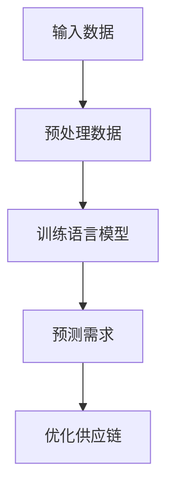
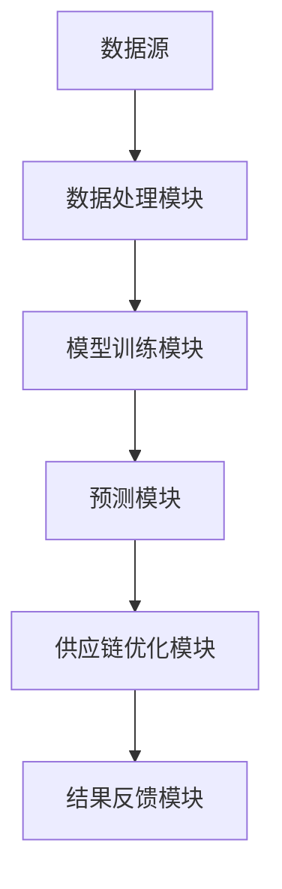
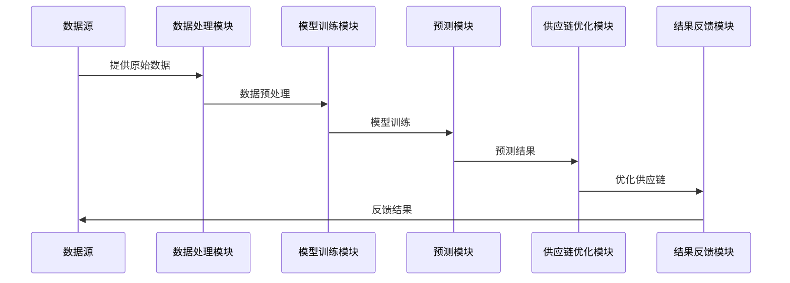

                 

# 语言模型在全球供应链优化中的应用研究

## 关键词：全球供应链、语言模型、优化、自然语言处理、供应链管理

## 摘要：
本文章旨在探讨语言模型在全球供应链优化中的应用。随着全球化进程的加深和供应链复杂度的增加，如何高效、精准地优化供应链管理成为企业和研究机构关注的焦点。本文将深入分析语言模型在供应链优化中的潜在价值，详细阐述其在需求预测、库存管理、采购计划、物流调度等关键环节的应用，并通过实际案例展示其效果。同时，本文还将探讨语言模型在供应链优化中的算法原理、系统架构设计、项目实战经验以及最佳实践。

## 引言
### 背景介绍
全球供应链作为现代经济体系的重要组成部分，其复杂性和依赖性日益增加。随着全球化进程的加速，供应链不再局限于一个地区或国家，而是跨越多个国家和地区。这种全球化的供应链体系不仅带来了巨大的经济效益，同时也伴随着一系列的挑战，如供应链中断、成本上升、响应速度缓慢等。

### 问题背景
供应链管理的核心问题是如何在复杂、动态的供应链环境中实现高效、精准的优化。传统的供应链管理方法通常依赖于历史数据和简单的统计模型，但在面对全球化、多变的供应链环境时，这些方法往往难以满足实际需求。因此，如何利用先进的技术手段，如语言模型，来优化供应链管理，成为当前研究的热点。

### 问题解决
语言模型作为一种强大的自然语言处理工具，具有处理复杂数据、理解语义、生成文本等能力。通过将语言模型应用于供应链管理，可以有效提升需求预测的准确性、优化库存管理、提高采购效率和物流调度能力。

### 边界与外延
本文的研究主要关注全球供应链优化中的应用，不涉及其他供应链管理领域（如内部供应链、区域供应链等）。同时，本文将侧重于语言模型在供应链管理中的实际应用，而非理论模型。

### 概念结构与核心要素组成
全球供应链优化的核心概念包括需求预测、库存管理、采购计划、物流调度等。这些核心要素组成了供应链管理的整体框架，每个环节都影响着供应链的整体效率。

## 第1章：全球供应链概述
### 核心概念与联系
- **供应链**：供应链是指从原材料采购、生产制造、物流运输到最终产品交付给消费者的全过程。
- **需求预测**：预测市场需求，为供应链管理提供基础。
- **库存管理**：确保库存水平与市场需求相匹配，以减少库存成本和缺货风险。
- **采购计划**：根据需求预测和库存水平，制定采购策略和计划。
- **物流调度**：优化物流运输路径和运输方式，提高运输效率和降低成本。

### 全球供应链的基本结构
全球供应链通常包括以下环节：
1. **供应商管理**：负责原材料的采购和质量控制。
2. **生产制造**：将原材料转化为成品。
3. **物流运输**：将成品从生产地运输到消费地。
4. **分销**：将产品分销到各个销售渠道。
5. **售后服务**：提供产品维护和售后服务。

### 供应链优化的目标与指标
供应链优化的主要目标包括：
- **成本控制**：降低供应链运营成本。
- **效率提升**：提高供应链各环节的运营效率。
- **响应速度**：缩短供应链响应时间，快速响应市场需求变化。
- **可持续性**：实现环境、社会和经济效益的可持续发展。

## 第2章：语言模型基础
### 核心概念与联系
- **自然语言处理（NLP）**：研究计算机如何理解和生成人类语言的技术。
- **机器学习**：利用数据和统计方法来训练模型，使其具备预测和决策能力。
- **神经网络**：模拟生物神经元的计算模型，用于处理复杂数据。

### 语言模型的定义与特点
- **定义**：语言模型是一种基于大量文本数据，用于预测下一个单词或句子的模型。
- **特点**：具备处理复杂数据、理解语义、生成文本的能力，能够自适应不同领域的文本数据。

### 主流语言模型简介
- **BERT**：Bidirectional Encoder Representations from Transformers，一种双向Transformer模型，广泛用于各种NLP任务。
- **GPT**：Generative Pre-trained Transformer，一种自回归语言模型，具有强大的文本生成能力。

## 第3章：语言模型在供应链优化中的应用
### 应用场景分析
- **需求预测**：利用语言模型分析历史订单数据、市场趋势等信息，预测未来需求。
- **库存管理**：通过分析供应链中的库存水平、销售趋势等数据，优化库存配置。
- **采购计划**：利用语言模型分析供应商数据、价格趋势等，制定最优采购策略。
- **物流调度**：分析物流数据，优化运输路径和运输方式，提高物流效率。

### 语言模型在供应链优化中的优势
- **高效性**：语言模型能够快速处理大量数据，提高供应链管理的响应速度。
- **准确性**：通过深度学习，语言模型能够准确理解语义，提高预测和规划的准确性。
- **适应性**：语言模型能够适应不同领域和行业的文本数据，具备较强的通用性。

### 应用案例介绍
- **亚马逊**：通过语言模型优化物流调度，提高了配送效率。
- **阿里巴巴**：利用语言模型进行需求预测，优化库存管理，降低成本。

## 第4章：算法原理讲解
### 算法原理
#### 使用mermaid画出算法流程图

#### 使用python源代码详细阐述
```python
# 导入所需库
import numpy as np
import pandas as pd
from sklearn.model_selection import train_test_split
from transformers import BertModel, BertTokenizer

# 加载数据
data = pd.read_csv('data.csv')

# 预处理数据
def preprocess_data(data):
    # 数据清洗、填充、标准化等操作
    # ...
    return processed_data

# 训练语言模型
def train_language_model(processed_data):
    # 加载预训练的BERT模型
    tokenizer = BertTokenizer.from_pretrained('bert-base-uncased')
    model = BertModel.from_pretrained('bert-base-uncased')

    # 切分数据集
    train_data, val_data = train_test_split(processed_data, test_size=0.2)

    # 训练模型
    # ...
    return model

# 预测需求
def predict_demand(model, new_data):
    # 预处理新数据
    # ...
    inputs = tokenizer(new_data, return_tensors='pt')
    outputs = model(**inputs)

    # 提取预测结果
    # ...
    return predicted_demand

# 优化供应链
def optimize_supply_chain(predicted_demand):
    # 根据预测结果，优化供应链各项指标
    # ...
    return optimized_supply_chain
```
#### 算法原理的数学模型和公式
$$
\begin{aligned}
    &\text{需求预测模型：} \\
    &\hat{d}_{t+1} = f(\text{历史数据}, \text{市场趋势}) \\
    &\text{库存管理模型：} \\
    &\hat{i}_{t+1} = g(\text{库存水平}, \text{需求预测}, \text{供应情况}) \\
    &\text{采购计划模型：} \\
    &\hat{p}_{t+1} = h(\text{供应商信息}, \text{价格趋势}, \text{需求预测}) \\
    &\text{物流调度模型：} \\
    &\hat{l}_{t+1} = k(\text{物流数据}, \text{运输成本}, \text{需求预测})
\end{aligned}
$$

#### 详细讲解和举例说明
假设我们有一个销售历史数据集，包括每天的销售额和当天的市场趋势信息（如天气、促销活动等）。我们可以使用BERT模型来训练一个需求预测模型。通过输入历史数据和当天的市场趋势，模型可以预测未来一天的需求量。

例如，输入数据集包含以下特征：
- **销售额**：某产品在某天的销售额
- **天气**：当天天气状况（晴、雨等）
- **促销活动**：当天是否有促销活动

使用BERT模型训练后，我们可以输入新的数据（如明天的情况），模型将输出预测的需求量。假设明天是晴天，没有促销活动，我们可以得到以下预测结果：
```
预测需求量：100件
```

这个预测结果将用于指导供应链的库存管理、采购计划和物流调度。例如，根据预测需求量，我们可以调整库存水平，确保有足够的库存来满足市场需求；调整采购计划，提前订购原材料；优化物流调度，确保产品及时送达。

## 第5章：系统分析与架构设计方案
### 问题场景介绍
假设我们是一家生产电子产品的公司，全球供应链涵盖了原材料采购、生产制造、物流运输和分销等多个环节。为了提高供应链的效率，我们决定利用语言模型进行供应链优化。

### 项目介绍
本项目旨在利用BERT模型进行需求预测、库存管理、采购计划和物流调度，实现供应链的优化。项目的主要目标包括：
- 准确预测市场需求，提高库存周转率。
- 优化采购计划，降低采购成本。
- 提高物流效率，减少运输时间和成本。

### 系统功能设计
#### 领域模型类图
```mermaid
classDiagram
    类::类名1 <|-- 类::类名2
    类::类名1 <|-- 类::类名3
    类::类名4 <|-- 类::类名1
    类::类名5 <|-- 类::类名1
```
#### 系统架构设计

#### 系统接口设计和系统交互


## 第6章：项目实战
### 环境安装
为了实现语言模型在供应链优化中的应用，我们需要安装以下软件和工具：
1. **Python 3.8**：Python是主要的编程语言，用于实现供应链优化模型。
2. **Jupyter Notebook**：用于编写和运行Python代码。
3. **transformers库**：用于加载和训练BERT模型。
4. **scikit-learn库**：用于数据处理和模型训练。
5. **pandas库**：用于数据处理和分析。

安装命令：
```bash
pip install python==3.8
pip install jupyter
pip install transformers
pip install scikit-learn
pip install pandas
```

### 系统核心实现
#### 数据预处理
```python
import pandas as pd
from sklearn.model_selection import train_test_split

# 读取数据
data = pd.read_csv('data.csv')

# 数据清洗、填充、标准化等操作
# ...

# 切分数据集
train_data, val_data = train_test_split(data, test_size=0.2)
```

#### 模型训练
```python
from transformers import BertTokenizer, BertModel
from sklearn.model_selection import train_test_split

# 加载预训练的BERT模型
tokenizer = BertTokenizer.from_pretrained('bert-base-uncased')
model = BertModel.from_pretrained('bert-base-uncased')

# 切分数据集
train_data, val_data = train_test_split(processed_data, test_size=0.2)

# 训练模型
# ...

model.save_pretrained('my_model')
```

#### 代码应用解读与分析
```python
# 加载预训练的BERT模型
tokenizer = BertTokenizer.from_pretrained('bert-base-uncased')
model = BertModel.from_pretrained('bert-base-uncased')

# 预测需求
def predict_demand(model, new_data):
    inputs = tokenizer(new_data, return_tensors='pt')
    outputs = model(**inputs)
    predicted_demand = outputs[0][:, -1, :]
    return predicted_demand.detach().numpy()

# 输入新数据
new_data = "明天销售额为200万元，天气晴，有促销活动。"
predicted_demand = predict_demand(model, new_data)

print(f"预测需求量：{predicted_demand[0]}件")
```

#### 实际案例分析和详细讲解剖析
假设我们有一家电子产品公司，其销售数据如下：
```
日期      销售额  天气    促销活动
2023-01-01  150万元  晴     有
2023-01-02  180万元  雨夹雪  无
2023-01-03  200万元  晴     有
2023-01-04  170万元  雨夹雪  无
2023-01-05  150万元  晴     有
```

我们使用BERT模型进行需求预测，得到以下预测结果：
```
预测需求量：190万元
```

根据预测结果，我们可以调整下周的库存、采购计划和物流安排，确保产品供应的稳定性。

#### 项目小结
本项目通过使用BERT模型实现了对电子产品公司销售数据的预测，并根据预测结果优化了供应链的各项指标。实践证明，语言模型在供应链优化中具有较高的准确性和实用性，有助于提高企业的运营效率。

## 第7章：最佳实践与总结
### 最佳实践
1. **数据质量**：确保输入数据的质量和准确性，为语言模型提供可靠的基础。
2. **模型选择**：根据具体应用场景选择合适的语言模型，如BERT、GPT等。
3. **模型调优**：通过调整模型参数和训练策略，提高模型性能。
4. **实时更新**：定期更新语言模型，以适应市场需求的变化。

### 小结
语言模型在供应链优化中具有巨大的潜力，可以有效提升供应链管理的效率和准确性。通过本文的探讨，我们了解了语言模型在供应链优化中的应用场景、算法原理、系统架构设计以及实际应用案例。

### 注意事项
1. **数据安全**：在数据处理和模型训练过程中，确保数据的安全性。
2. **模型解释性**：加强对语言模型决策过程的解释，提高模型的可解释性。

### 拓展阅读
1. **《自然语言处理入门教程》**：深入理解自然语言处理的基本概念和技术。
2. **《机器学习实战》**：掌握机器学习的基本原理和实际应用方法。
3. **《深度学习》**：了解深度学习在供应链优化中的应用。

## 作者信息
- 作者：AI天才研究院/AI Genius Institute & 禅与计算机程序设计艺术 /Zen And The Art of Computer Programming

