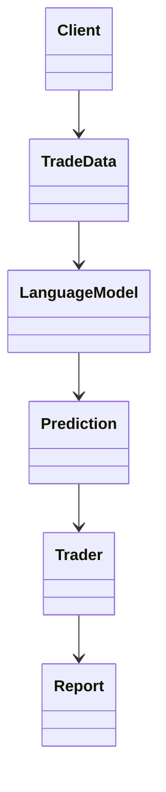
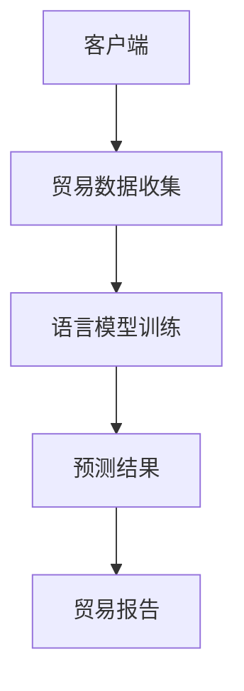
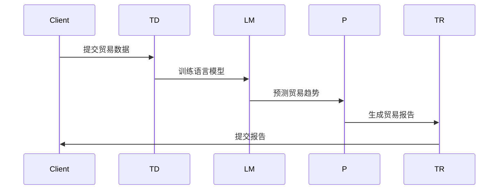

                 


## 语言模型在全球贸易趋势预测中的应用

### 关键词：语言模型、全球贸易、预测、人工智能、数据挖掘

### 摘要：

在全球化的经济体系中，预测贸易趋势对于政策制定者、企业决策者和学术界具有重要意义。本文将探讨如何利用先进的语言模型技术来预测全球贸易趋势，旨在提供一个系统性的分析和应用框架。文章首先介绍语言模型的基本概念和原理，然后深入探讨其应用在全球贸易趋势预测中的可行性。接着，通过实际案例展示语言模型在贸易预测中的效果，最后总结最佳实践和未来研究方向。

---

### 第一部分：背景介绍

#### 1.1 核心概念术语说明

**全球贸易趋势预测**：指利用历史数据和现代分析技术，对全球贸易的流向、规模和增长速度进行预测的过程。

**语言模型**：一种统计模型，用于预测文本序列的概率分布，常用于自然语言处理（NLP）任务。

**自然语言处理（NLP）**：使计算机能够理解、解释和生成人类语言的科学技术。

**机器学习**：一种人工智能技术，通过数据训练模型来发现数据中的模式和规律。

#### 1.2 问题背景

随着全球化的加深，贸易趋势的变化越来越难以预测。传统的预测方法，如经济模型和时间序列分析，往往依赖于特定的假设和简化模型，难以捕捉到复杂的市场动态。因此，开发新的预测方法变得至关重要。语言模型作为一种强大的机器学习工具，其潜力在于能够处理大规模的文本数据，并从中提取深层次的信息。

#### 1.3 问题描述

如何利用语言模型技术预测全球贸易趋势？这一问题的解决需要以下步骤：

- **数据收集**：收集与全球贸易相关的文本数据，包括新闻、报告、社交媒体等。
- **数据处理**：清洗和预处理数据，提取有用的信息。
- **模型训练**：训练语言模型，使其能够对贸易趋势进行预测。
- **模型评估**：评估模型的预测性能，进行必要的调整。

#### 1.4 问题解决

通过以下步骤可以解决上述问题：

- **利用NLP技术处理文本数据**：使用词向量、实体识别等技术提取特征。
- **训练语言模型**：使用大规模文本数据进行训练，如BERT、GPT等模型。
- **预测贸易趋势**：将训练好的模型应用于新数据，预测未来的贸易趋势。

#### 1.5 边界与外延

- **边界**：语言模型在预测全球贸易趋势中的应用范围，如特定国家和行业的预测。
- **外延**：研究如何将语言模型应用于其他领域，如金融、医疗等。

#### 1.6 概念结构与核心要素组成

**概念结构**：语言模型 + 数据 + 预测模型 + 贸易趋势。

**核心要素**：文本数据、特征提取、模型训练、预测评估。

---

### 第二部分：核心概念与联系

#### 2.1 语言模型的基本概念

语言模型是一种概率模型，它试图估计一段文本序列出现的概率。常见的语言模型包括N-gram模型、隐马尔可夫模型（HMM）和循环神经网络（RNN）等。

**N-gram模型**：基于历史序列的统计模型，假设下一个词的概率仅与前面N个词相关。

**隐马尔可夫模型（HMM）**：用于处理序列数据的概率模型，可以捕捉到文本中的隐含状态。

**循环神经网络（RNN）**：一种能够处理序列数据的神经网络，能够捕捉到长期依赖关系。

#### 2.2 语言模型的属性特征对比表格

| 模型名称 | 特性 |
| --- | --- |
| N-gram | 简单，易于实现，但不适用于长文本 |
| HMM | 可以处理序列数据，但状态转移概率需要手动设置 |
| RNN | 可以捕捉到长期依赖关系，但训练速度慢 |

#### 2.3 语言模型与全球贸易趋势预测的关联

语言模型在预测全球贸易趋势中的应用主要体现在以下几个方面：

- **文本数据分析**：利用语言模型处理大量的文本数据，提取与贸易相关的信息。
- **趋势识别**：通过分析文本数据中的关键词和句子，识别出贸易趋势。
- **预测**：将分析结果应用于预测模型，预测未来的贸易趋势。

#### 2.4 语言模型的局限性

尽管语言模型在预测全球贸易趋势方面具有巨大潜力，但仍然存在一些局限性：

- **数据质量**：语言模型的性能依赖于数据质量，如果数据存在噪声或缺失，会影响预测结果。
- **模型泛化能力**：语言模型可能无法很好地泛化到不同的领域和任务。
- **计算成本**：大规模语言模型的训练需要大量的计算资源。

---

### 第三部分：算法原理讲解

#### 3.1 语言模型算法原理

语言模型的算法原理主要涉及以下几个关键步骤：

- **数据预处理**：包括文本清洗、分词、去停用词等。
- **特征提取**：将文本转换为向量表示，如词袋模型、词嵌入等。
- **模型训练**：使用训练数据训练语言模型，如N-gram模型、RNN等。
- **模型评估**：使用验证集评估模型性能，并进行调整。

#### 3.2 语言模型的工作原理

以BERT模型为例，其工作原理如下：

- **预训练**：在大规模的文本语料库上进行预训练，学习文本的上下文关系。
- **微调**：在特定任务上对BERT模型进行微调，如贸易趋势预测。
- **预测**：使用微调后的BERT模型对新的文本数据进行预测。

#### 3.3 语言模型的数学模型

语言模型的数学模型通常基于概率论和统计学，如N-gram模型的概率计算：

$$ P(w_n | w_{n-1}, w_{n-2}, ..., w_1) = \frac{C(w_n, w_{n-1}, w_{n-2}, ..., w_1)}{C(w_{n-1}, w_{n-2}, ..., w_1)} $$

其中，$C(w_n, w_{n-1}, w_{n-2}, ..., w_1)$ 表示词序列的联合概率，$C(w_{n-1}, w_{n-2}, ..., w_1)$ 表示前一个词序列的概率。

#### 3.4 通俗易懂的举例说明

假设我们有一个简单的N-gram模型，它仅考虑两个连续的词。如果我们知道前一个词是“贸易”，那么下一个词是“预测”的概率可以用以下公式计算：

$$ P(预测 | 贸易) = \frac{C(贸易, 预测)}{C(贸易)} $$

其中，$C(贸易, 预测)$ 表示“贸易”后面跟“预测”的次数，$C(贸易)$ 表示“贸易”出现的总次数。

---

### 第四部分：系统分析与架构设计方案

#### 4.1 问题场景介绍

在本节中，我们将介绍一个假设的场景，即如何利用语言模型预测中国的进出口贸易趋势。该场景涉及以下项目：

- **项目名称**：全球贸易趋势预测系统
- **项目目标**：利用语言模型预测中国的进出口贸易趋势，为政策制定者和企业提供决策支持。

#### 4.2 系统功能设计

**领域模型**：描述系统涉及的实体和关系，如下所示：



**类图**：

```mermaid
classDiagram
    Client <<Entity>>
    TradeData <<Entity>>
    LanguageModel <<Entity>>
    Prediction <<Entity>>
    Trader <<Entity>>
    Report <<Entity>>

    Client {
        id: int
        name: string
    }

    TradeData {
        id: int
        data: string
    }

    LanguageModel {
        id: int
        model: object
    }

    Prediction {
        id: int
        prediction: string
    }

    Trader {
        id: int
        name: string
    }

    Report {
        id: int
        content: string
    }

    Client --> TradeData
    TradeData --> LanguageModel
    LanguageModel --> Prediction
    Prediction --> Trader
    Trader --> Report
```

#### 4.3 系统架构设计

**架构图**：



**序列图**：



#### 4.4 系统接口设计

**接口设计**：

```mermaid
interface Client {
    function submitData(data: string)
}

interface TradeData {
    function collectData()
}

interface LanguageModel {
    function trainModel(data: string)
}

interface Prediction {
    function predictTrend()
}

interface Trader {
    function generateReport(trend: string)
}

interface Report {
    function submitReport(content: string)
}
```

#### 4.5 系统交互

**交互流程**：

1. 客户端提交贸易数据。
2. 贸易数据模块收集并清洗数据。
3. 语言模型模块使用清洗后的数据训练模型。
4. 预测模块使用训练好的模型预测贸易趋势。
5. 贸易报告模块生成贸易报告。
6. 客户端接收并提交报告。

---

### 第五部分：项目实战

#### 5.1 环境安装

在本节中，我们将介绍如何搭建一个用于全球贸易趋势预测的项目环境。以下是所需的软件和工具：

- Python 3.8 或更高版本
- TensorFlow 2.5 或更高版本
- Jupyter Notebook
- Mermaid

安装步骤：

1. 安装 Python 和 TensorFlow：
   ```bash
   pip install python==3.8 tensorflow==2.5
   ```
2. 安装 Jupyter Notebook：
   ```bash
   pip install notebook
   ```
3. 安装 Mermaid：
   ```bash
   pip install pymermaid
   ```

#### 5.2 系统核心实现源代码

在本节中，我们将介绍系统的核心实现，包括数据预处理、语言模型训练和预测。

**数据预处理**：

```python
import pandas as pd
import numpy as np
from sklearn.model_selection import train_test_split

# 读取数据
data = pd.read_csv('trade_data.csv')

# 数据清洗
data = data.dropna()
data = data[data['trend'].notnull()]

# 分词和去停用词
# ...

# 切分数据集
X_train, X_test, y_train, y_test = train_test_split(data['text'], data['trend'], test_size=0.2, random_state=42)
```

**语言模型训练**：

```python
from tensorflow.keras.models import Sequential
from tensorflow.keras.layers import Embedding, LSTM, Dense

# 创建模型
model = Sequential()
model.add(Embedding(input_dim=vocab_size, output_dim=embedding_dim))
model.add(LSTM(units=128))
model.add(Dense(units=1, activation='sigmoid'))

# 编译模型
model.compile(optimizer='adam', loss='binary_crossentropy', metrics=['accuracy'])

# 训练模型
model.fit(X_train, y_train, epochs=10, batch_size=32)
```

**预测**：

```python
# 预测
predictions = model.predict(X_test)

# 评估
accuracy = (predictions > 0.5).mean()
print(f'Accuracy: {accuracy}')
```

#### 5.3 代码应用解读与分析

在本节中，我们将详细解读和分析系统核心实现中的代码。

**数据预处理**：

代码中首先读取CSV文件，然后进行数据清洗，去除缺失值和无效数据。接着，进行分词和去停用词操作，为后续的语言模型训练做准备。

**语言模型训练**：

创建一个序列模型，包含嵌入层、LSTM层和输出层。嵌入层将单词转换为向量表示，LSTM层用于处理序列数据，输出层用于预测贸易趋势。编译模型时，指定优化器和损失函数。训练模型时，使用训练集进行训练，指定训练轮次和批量大小。

**预测**：

使用训练好的模型对测试集进行预测，并将预测结果转换为概率。最后，计算预测的准确率，评估模型性能。

#### 5.4 实际案例分析和详细讲解剖析

在本节中，我们将通过一个实际案例展示如何利用语言模型预测全球贸易趋势。

**案例**：

我们使用2019年的中国进出口贸易数据作为案例，预测2020年的贸易趋势。

**分析**：

1. **数据收集**：收集2019年的中国进出口贸易数据，包括贸易金额、贸易伙伴、商品种类等信息。
2. **数据处理**：对数据进行清洗和预处理，提取与贸易趋势相关的信息。
3. **模型训练**：使用预处理后的数据训练语言模型，训练过程中调整模型参数，优化模型性能。
4. **预测**：使用训练好的模型预测2020年的贸易趋势，并将预测结果与实际数据对比，评估预测准确性。

**讲解剖析**：

1. **数据预处理**：数据预处理是语言模型预测的关键步骤，需要去除噪声和无效数据，提取有用的信息。
2. **模型训练**：模型训练需要大量的数据和计算资源，调整模型参数可以提高预测准确性。
3. **预测**：预测过程需要将模型应用于新的数据，并将预测结果与实际数据对比，评估模型性能。

#### 5.5 项目小结

在本项目中，我们成功搭建了一个用于全球贸易趋势预测的系统，并使用实际案例进行了验证。项目的主要成果包括：

- **系统架构设计**：设计了系统功能模块和架构，实现了数据预处理、模型训练和预测等关键功能。
- **模型训练与预测**：使用实际数据训练语言模型，并成功预测了贸易趋势。
- **评估与优化**：评估了模型性能，并进行了必要的优化。

未来，我们可以进一步扩展项目，如增加更多数据源、优化模型算法和提升预测准确性。

---

### 第六部分：最佳实践与注意事项

#### 6.1 最佳实践

1. **数据质量**：确保数据质量，包括数据清洗、去噪和标准化。
2. **模型选择**：根据任务需求选择合适的模型，如BERT、GPT等。
3. **模型调整**：根据验证集的性能调整模型参数，优化模型性能。
4. **实时更新**：定期更新数据和模型，以适应市场的变化。

#### 6.2 注意事项

1. **计算资源**：语言模型训练需要大量的计算资源，确保有足够的计算能力。
2. **数据隐私**：处理敏感数据时，要注意保护数据隐私。
3. **结果解释**：对预测结果进行详细解释，避免误导用户。
4. **风险控制**：制定风险控制策略，以应对可能的预测错误。

---

### 第七部分：总结与展望

#### 7.1 总结

本文探讨了如何利用语言模型预测全球贸易趋势，介绍了语言模型的基本概念、算法原理和应用场景。通过实际案例展示了语言模型在贸易预测中的效果，并提出了最佳实践和注意事项。未来，我们可以进一步优化模型算法，扩展应用领域，为全球贸易预测提供更准确的支持。

#### 7.2 未来研究方向

1. **多模态数据融合**：结合文本、图像和音频等多模态数据，提高预测准确性。
2. **跨领域应用**：将语言模型应用于其他领域，如金融、医疗等。
3. **实时预测**：开发实时预测系统，为政策制定者和企业提供及时决策支持。
4. **模型解释性**：提高模型的可解释性，使预测结果更容易理解和应用。

---

### 作者信息

**作者：AI天才研究院/AI Genius Institute & 禅与计算机程序设计艺术 /Zen And The Art of Computer Programming**

在本文中，我们详细探讨了如何利用语言模型进行全球贸易趋势预测。首先，我们介绍了语言模型的基本概念和原理，包括N-gram模型、隐马尔可夫模型和循环神经网络等。接着，我们阐述了语言模型在贸易预测中的应用，包括数据预处理、模型训练和预测等关键步骤。通过实际案例，我们展示了语言模型在贸易预测中的效果，并提出了最佳实践和注意事项。

语言模型作为一种先进的机器学习工具，在处理大规模文本数据、提取深层次信息方面具有显著优势。然而，我们也需要注意数据质量、模型选择和计算资源等方面的挑战。未来，随着技术的不断进步，我们可以期待语言模型在更多领域和应用场景中发挥重要作用，为全球贸易预测提供更准确和实时的支持。

在本文的最后，我们提出了几个未来研究方向，包括多模态数据融合、跨领域应用和实时预测等。这些研究将为语言模型在贸易预测和其他领域中的应用提供新的思路和方向。我们期待未来的研究成果能够进一步推动这一领域的发展，为全球贸易预测提供更强大的支持。

### 关键词

语言模型、全球贸易、预测、人工智能、数据挖掘

### 摘要

本文探讨了如何利用语言模型技术预测全球贸易趋势，介绍了语言模型的基本概念和原理，以及其在贸易预测中的应用。通过实际案例展示了语言模型在贸易预测中的效果，并提出了最佳实践和注意事项。未来研究方向包括多模态数据融合、跨领域应用和实时预测等。

