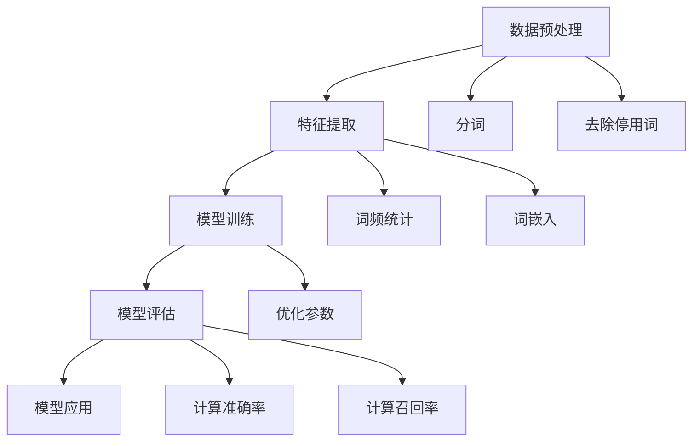
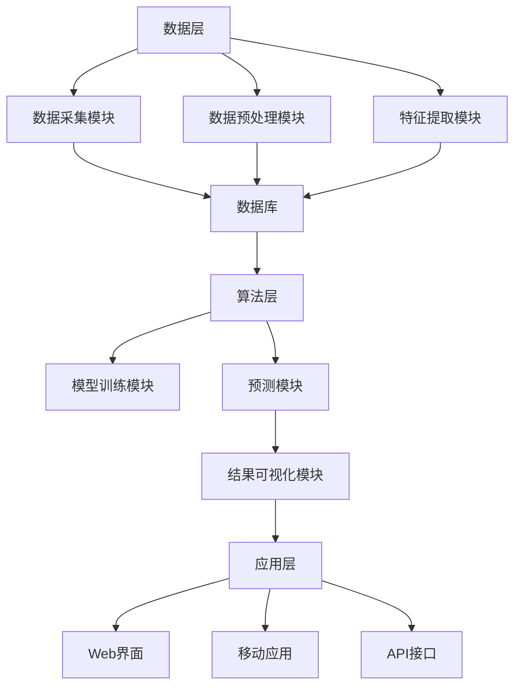

                 


### 第一部分: 引言

地质灾害，作为一种常见的自然灾害，威胁着人类生活的安全与稳定。无论是地震、滑坡、泥石流，还是火山喷发，都可能导致严重的人员伤亡和财产损失。随着全球气候变化和人类活动的影响，地质灾害的发生频率和破坏程度都呈现出上升的趋势。传统的地质灾害预测方法，如地质调查、遥感监测等，虽然能够在一定程度上提供预警信息，但往往存在时效性差、预测精度不高等问题。

在这个背景下，人工智能技术的兴起为地质灾害预测带来了新的可能性。特别是语言模型，作为一种先进的人工智能工具，在处理大规模文本数据、提取语义信息等方面具有显著优势。语言模型在自然语言处理、机器翻译、情感分析等领域已经取得了显著成果，那么它是否也能在地质灾害预测中发挥重要作用呢？

本文将围绕这个问题展开探讨，首先介绍地质灾害预测中的语言模型基础理论，然后分析语言模型在地质灾害预测中的应用场景、优势与挑战，并通过具体案例进行说明。最后，本文还将对语言模型在地质灾害预测中的数学模型进行详细讲解，并探讨系统的设计与实现方法。

通过本文的阅读，读者将能够全面了解语言模型在地质灾害预测中的应用价值，以及如何在实际项目中加以利用。

### 第1章: 问题和背景

#### 1.1 问题背景

地质灾害是指由地质动力作用形成的自然灾害，如地震、滑坡、泥石流、火山喷发等。这些灾害对人类社会造成了巨大的威胁。据统计，全球每年因地质灾害导致的人员伤亡和财产损失高达数百亿美元。随着全球气候变化和人类活动的加剧，地质灾害的发生频率和破坏程度呈现上升趋势。例如，近年来，全球多地发生的地震、滑坡和泥石流灾害，不仅造成了大量人员伤亡，还导致了严重的财产损失和社会动荡。

传统地质灾害预测方法主要依赖于地质调查、遥感监测和人工分析。地质调查通常通过实地考察、取样分析等方式，了解地质环境和地质构造特征。遥感监测则利用卫星、无人机等高科技手段，对地质灾害区域进行实时监测。人工分析则依赖于地质学家的经验和专业知识，对地质灾害发生的可能性和影响因素进行评估。这些方法在一定程度上能够提供预警信息，但其时效性较差，且预测精度有限。

#### 1.2 问题描述

面对日益严重的地质灾害威胁，如何提高地质灾害预测的准确性和时效性，成为了一个亟待解决的问题。传统预测方法在时效性和精度上存在明显不足，无法满足现代社会对地质灾害预警的需求。特别是对于突发性地质灾害，如地震、泥石流等，传统方法往往无法及时提供有效的预警信息，导致灾害发生时无法及时采取应对措施。

此外，地质灾害的发生通常伴随着复杂的地质环境和气象条件，涉及大量的地质、气象、水文等多学科知识。如何整合这些多源数据，并从中提取有效的信息，用于地质灾害预测，也是一个巨大的挑战。

#### 1.3 问题解决思路

针对上述问题，人工智能技术的引入为地质灾害预测带来了新的思路。特别是语言模型，作为一种先进的人工智能工具，在处理大规模文本数据、提取语义信息等方面具有显著优势。语言模型已经在自然语言处理、机器翻译、情感分析等领域取得了显著成果，那么它是否也能在地质灾害预测中发挥重要作用呢？

首先，语言模型可以用于处理和分析地质灾害相关的文本数据，如地质报告、新闻报道、社交媒体评论等。通过这些数据，语言模型可以提取出与地质灾害相关的关键词和语义信息，从而建立地质灾害发生的前兆模型。

其次，语言模型可以利用其强大的文本处理能力，对地质灾害发生的历史数据进行挖掘和分析，提取出影响地质灾害发生的潜在因素和规律。这些因素和规律可以作为预测模型的关键输入参数，提高预测模型的精度和可靠性。

此外，语言模型还可以与其他人工智能技术，如深度学习、神经网络等相结合，构建更加复杂的地质灾害预测模型。这些模型可以综合考虑多种因素，如地质环境、气象条件、人类活动等，提供更全面、准确的地质灾害预警信息。

总之，通过引入人工智能技术，特别是语言模型，可以显著提高地质灾害预测的准确性和时效性，为地质灾害预警和应对提供有力支持。

#### 1.4 边界与外延

在讨论语言模型在地质灾害预测中的应用时，我们需要明确几个边界与外延问题。

首先，关于语言模型的适用范围，尽管语言模型在处理文本数据方面具有显著优势，但并非所有类型的地质灾害都适用于语言模型的预测。例如，对于地下水位变化引发的地质灾害，如地下水滑坡，语言模型可能难以发挥作用，因为这类灾害的预测更多依赖于地质结构和地下水数据。

其次，关于数据来源，语言模型对数据的依赖性较强。地质灾害预测需要大量的历史数据和实时数据作为训练和测试基础。因此，数据的准确性和完整性直接影响语言模型预测的准确性。此外，不同地区和不同类型的地质灾害，其数据特征和统计规律可能存在较大差异，因此需要根据具体情况进行定制化数据处理和模型优化。

最后，关于技术成熟度，尽管语言模型在地质灾害预测中的应用已经取得了一些初步成果，但整体来说，这一领域仍处于探索和研究阶段。目前，语言模型在地质灾害预测中的精度和可靠性尚未达到传统地质灾害预测方法水平，因此需要进一步的研究和实践来验证和改进。

#### 1.5 核心概念结构与要素组成

为了更好地理解语言模型在地质灾害预测中的应用，我们首先需要明确几个核心概念和其结构要素。

**1. 语言模型**

语言模型是一种用于预测自然语言序列概率的数学模型，其目的是通过分析历史语言数据，建立一个能够预测未来语言序列的概率分布模型。语言模型主要分为基于统计的方法（如n元模型）和基于神经网络的方法（如深度学习模型）。

**2. 地质灾害预测**

地质灾害预测是指利用地质数据、气象数据、历史灾害记录等多源信息，通过建立预测模型，对地质灾害发生的可能性、时间和空间进行预测。地质灾害预测的核心概念包括地质灾害类型、影响因素、预测指标等。

**3. 语言模型在地质灾害预测中的应用**

语言模型在地质灾害预测中的应用主要体现在以下两个方面：

- **数据预处理**：利用语言模型对地质灾害相关的文本数据进行预处理，提取关键词和语义信息，为预测模型提供高质量的数据输入。
- **预测模型构建**：利用语言模型提取的数据特征，结合其他地质灾害影响因素，构建地质灾害预测模型，提高预测的精度和时效性。

**4. 核心要素组成**

- **数据集**：包括历史地质灾害记录、地质结构数据、气象数据等，用于训练和测试语言模型。
- **语言模型**：包括模型的类型（如n元模型、深度学习模型）、训练算法、参数设置等。
- **预测模型**：结合语言模型提取的特征，构建地质灾害预测模型，用于实际预测任务。

通过以上核心概念和结构要素的阐述，我们可以更好地理解语言模型在地质灾害预测中的应用，并为后续的深入探讨打下基础。

### 第2章: 核心概念与联系

在深入探讨语言模型在地质灾害预测中的应用之前，我们首先需要了解语言模型的基础知识以及地质灾害预测的相关概念。本章将分别介绍语言模型的基础理论、地质灾害预测相关概念，并分析语言模型在地质灾害预测中的应用方式。

#### 2.1 语言模型基础

**1. 语言模型是什么**

语言模型是一种用于预测自然语言序列概率的数学模型。它通过分析大量的语言数据，学习语言中的概率分布规律，从而能够对未来的语言序列进行概率预测。语言模型的主要目标是最小化预测误差，即最大化预测序列的真实概率。

**2. 语言模型的主要类型**

- **n元模型**：n元模型是最早的语言模型之一，它假设当前词汇的概率仅与前面n个词汇有关。n元模型的优点是实现简单，但其在长文本序列上的表现较差。

- **神经网络模型**：神经网络模型，尤其是深度学习模型，通过多层神经网络结构，能够更好地捕捉语言中的复杂模式和关系。例如，长短期记忆网络（LSTM）和变换器（Transformer）模型，在自然语言处理任务中表现出色。

**3. 语言模型的工作原理**

语言模型的工作原理主要基于统计学习和机器学习算法。通过大量语言数据的训练，语言模型可以学习到词汇之间的统计关系和概率分布。在预测过程中，语言模型会根据当前已知的词汇序列，计算下一个词汇的概率分布，并选择概率最大的词汇作为预测结果。

#### 2.2 地质灾害预测相关概念

**1. 地质灾害的定义**

地质灾害是指由地质动力作用引起的自然灾害，如地震、滑坡、泥石流、火山喷发等。这些灾害对人类生命财产构成严重威胁。

**2. 地质灾害的类型**

- **地震**：由地壳板块运动引起的地震波造成地面震动，可能导致建筑物倒塌、道路损坏等。

- **滑坡**：斜坡上的土石体因重力作用发生滑动的现象，可能导致房屋倒塌、道路堵塞等。

- **泥石流**：暴雨或洪水引发的含有大量泥沙、石块的流体，可能冲毁道路、桥梁等。

- **火山喷发**：火山内部岩浆喷发，可能造成火山灰覆盖、熔岩流动等。

**3. 地质灾害预测的重要指标**

- **预警时间**：预测灾害发生的时间，以便提前采取应对措施。

- **预警区域**：预测灾害发生的地点，以便提前进行防范和疏散。

- **预警概率**：预测灾害发生的可能性，以便评估灾害的严重程度。

#### 2.3 语言模型在地质灾害预测中的应用

**1. 语言模型如何用于地质灾害预测**

- **数据预处理**：利用语言模型对地质灾害相关的文本数据进行预处理，提取关键词和语义信息，为预测模型提供高质量的数据输入。

- **特征提取**：通过语言模型分析文本数据，提取出与地质灾害相关的特征，如地震活动、滑坡趋势、泥石流历史记录等。

- **预测模型构建**：结合提取的特征，构建地质灾害预测模型，用于实际预测任务。

**2. 语言模型在地质灾害预测中的优势**

- **处理大规模文本数据**：语言模型能够高效地处理和分析大量地质灾害相关的文本数据，从而提取出有用的信息。

- **提取语义信息**：语言模型能够理解文本数据中的语义关系，从而更好地捕捉地质灾害的潜在因素和规律。

- **实时更新**：语言模型可以根据新的数据实时更新预测模型，提供最新的预测结果。

**3. 语言模型在地质灾害预测中的局限性**

- **数据依赖性**：语言模型对数据的质量和数量有较高要求，数据不足或质量差可能影响预测准确性。

- **计算复杂度**：深度学习模型等复杂语言模型的计算资源消耗较大，可能不适合资源受限的环境。

- **实时性**：虽然语言模型能够实时更新预测结果，但复杂的训练过程和预测计算可能影响实时性。

通过以上对语言模型和地质灾害预测相关概念的分析，我们可以看到，语言模型在地质灾害预测中具有重要的应用价值。接下来，我们将进一步探讨语言模型在地质灾害预测中的具体应用，以及其面临的挑战和解决方法。

#### 2.4 概念属性特征对比表

为了更好地理解语言模型和地质灾害预测的核心概念及其属性特征，我们通过一个对比表格来展示它们的主要区别和联系。

| 概念       | 定义                                                         | 属性特征对比                |
|------------|--------------------------------------------------------------|-----------------------------|
| 语言模型   | 用于预测自然语言概率的统计模型                               | 预测准确度、计算复杂度等     |
| 地质灾害   | 地质动力作用形成的灾害地质现象                               | 地理分布、发生频率等         |
| 预测模型   | 用于预测未来事件或状态的数据模型                             | 模型精度、适用范围等         |
| 文本数据   | 语言模型处理和分析的数据源                                   | 数据规模、质量、多样性等     |
| 地质数据   | 地质灾害预测所需的数据源                                     | 地质构造、地质历史记录等     |
| 气象数据   | 影响地质灾害发生的气象因素数据                               | 气象条件、气候变化等         |

通过这个对比表格，我们可以清晰地看到语言模型和地质灾害预测在定义、应用领域以及属性特征上的区别和联系，为后续内容的展开提供了明确的参考。

#### 2.5 ER实体关系图

为了更直观地展示语言模型和地质灾害预测中的核心实体及其关系，我们使用ER（Entity-Relationship）实体关系图进行描述。ER图是一种用于描述实体及其之间关系的图形化工具，它能够帮助我们更好地理解和分析系统中的数据结构和关系。

以下是语言模型和地质灾害预测的ER实体关系图：

```mermaid
erDiagram
  A[LanguageModel] ||--|{ B[TextData] }|--|{ D[WordProbability] }
  A ||--|{ C[FeatureExtraction] }
  B ||--|{ E[GeologicalData] }
  B ||--|{ F[MeteorologicalData] }
  D ||--|{ G[PredictionResult] }
  C ||--|{ G }
  E ||--|{ G }
  F ||--|{ G }
```

图中的实体包括：

- **LanguageModel（语言模型）**：负责处理和分析文本数据，提取特征。
- **TextData（文本数据）**：语言模型处理的主要数据源，包括地质灾害相关的文本信息。
- **WordProbability（词概率）**：存储文本中各个词汇的概率分布，用于预测。
- **FeatureExtraction（特征提取）**：从文本数据中提取关键特征，用于地质灾害预测。
- **GeologicalData（地质数据）**：地质灾害预测所需的数据，包括地质构造、地质历史记录等。
- **MeteorologicalData（气象数据）**：影响地质灾害发生的气象因素数据，如气温、湿度等。
- **PredictionResult（预测结果）**：地质灾害预测的结果，包括预警时间和预警区域等。

实体之间的关系说明如下：

- **LanguageModel与TextData**：语言模型处理文本数据，提取特征。
- **LanguageModel与FeatureExtraction**：语言模型提取特征，用于地质灾害预测。
- **TextData与GeologicalData、MeteorologicalData**：文本数据包括地质和气象数据，这些数据共同影响地质灾害预测。
- **FeatureExtraction与PredictionResult**：特征提取结果用于生成预测结果。
- **GeologicalData、MeteorologicalData与PredictionResult**：地质和气象数据直接影响预测结果的准确性和可靠性。

通过ER实体关系图，我们可以清晰地看到语言模型和地质灾害预测系统中的各个核心实体及其相互关系，为进一步的分析和设计提供了基础。

### 第3章: 语言模型原理

#### 3.1 语言模型基础理论

语言模型是自然语言处理（NLP）领域中的一项关键技术，其核心目标是预测自然语言序列的概率分布。为了更好地理解语言模型，我们需要从基础理论开始探讨。

**1. 语言模型的基本概念**

语言模型是一种概率模型，用于预测自然语言序列的概率分布。在给定一个前文序列 \(w_1, w_2, ..., w_{n-1}\) 的情况下，语言模型的目标是预测下一个单词或词组 \(w_n\) 的概率 \(P(w_n | w_1, w_2, ..., w_{n-1})\)。

**2. 语言模型的主要类型**

- **n元模型**：n元模型是最早的语言模型之一，它假设当前单词的概率仅与前面n个单词有关，即 \(P(w_n | w_1, w_2, ..., w_{n-1}) = P(w_n | w_{n-1})\)。

- **神经网络模型**：神经网络模型，尤其是深度学习模型，通过多层神经网络结构，能够更好地捕捉语言中的复杂模式和关系。例如，长短期记忆网络（LSTM）和变换器（Transformer）模型，在自然语言处理任务中表现出色。

**3. 语言模型的关键参数**

语言模型的关键参数包括概率分布、特征提取等。其中，概率分布是语言模型的核心参数，决定了模型预测的准确性。

#### 3.2 语言模型的数学模型和公式

为了更好地理解语言模型的工作原理，我们需要介绍其数学模型和公式。

**1. n元模型**

n元模型的基本数学公式如下：

$$
P(w_1, w_2, ..., w_n) = P(w_n) \cdot P(w_{n-1} | w_n) \cdot P(w_{n-2} | w_{n-1}, w_n) \cdot ... \cdot P(w_2 | w_3, w_4, ..., w_n)
$$

其中，\(P(w_i | w_{i+1}, w_{i+2}, ..., w_n)\) 表示在给定后续文本的情况下，第 \(i\) 个单词的条件概率。

**2. 神经网络模型**

神经网络模型通常使用多层感知器（MLP）或循环神经网络（RNN）来构建。以下是一个简单的神经网络模型公式：

$$
h_l = \sigma(W_l \cdot h_{l-1} + b_l)
$$

其中，\(h_l\) 是第 \(l\) 层的输出，\(\sigma\) 是激活函数（如Sigmoid函数或ReLU函数），\(W_l\) 和 \(b_l\) 分别是权重矩阵和偏置向量。

**3. 语言模型训练**

语言模型的训练目标是优化模型的参数，使其能够更好地预测自然语言序列。常用的训练方法包括最大似然估计（MLE）和反向传播算法（BP）。

最大似然估计（MLE）的基本思想是最小化模型的负对数似然损失：

$$
L(\theta) = -\sum_{i=1}^{N} \log P(w_i | \theta)
$$

其中，\(\theta\) 表示模型的参数集合，\(N\) 是训练数据的样本数量。

反向传播算法（BP）是一种常用的梯度下降方法，用于优化神经网络模型的参数。BP算法的基本步骤如下：

1. 前向传播：计算模型的输出值和损失函数。
2. 反向传播：计算损失函数关于模型参数的梯度。
3. 参数更新：使用梯度下降法更新模型参数。

#### 3.3 语言模型算法原理

语言模型的算法原理主要包括以下几个步骤：

1. **数据预处理**：对文本数据集进行清洗、分词、去除停用词等处理，得到可用于训练的数据。

2. **特征提取**：根据语言模型类型（如n元模型或神经网络模型），提取文本特征，如词频、词嵌入等。

3. **模型训练**：使用训练数据集训练语言模型，优化模型的参数。

4. **模型评估**：使用测试数据集评估模型的性能，如准确率、召回率等。

5. **模型应用**：将训练好的模型应用于实际预测任务，如文本生成、机器翻译等。

#### 3.4 语言模型算法流程图

为了更直观地理解语言模型算法的流程，我们使用Mermaid流程图进行展示：



在这个流程图中，数据预处理阶段包括分词和去除停用词等操作，特征提取阶段提取词频和词嵌入等特征，模型训练阶段使用优化算法（如反向传播算法）更新模型参数，模型评估阶段计算准确率和召回率等指标，最后模型应用阶段将训练好的模型应用于实际预测任务。

通过以上对语言模型原理的详细讲解，我们可以更好地理解语言模型在地质灾害预测中的应用方法和优势。

#### 3.5 举例说明

为了更好地理解语言模型在地质灾害预测中的应用，我们通过一个具体的例子进行说明。

假设我们有一个简化的语言模型，用于预测某个地区未来一周内发生地震的概率。我们已经收集到了该地区过去一年的地震数据，包括每次地震的震级、发生时间、地点等信息。我们的目标是通过训练语言模型，预测未来一周内是否会发生地震。

**步骤1：数据预处理**

首先，我们需要对地震数据进行预处理。将地震数据按照时间顺序排列，提取出与地震相关的特征，如震级、地震发生时间等。然后，对这些特征进行编码，例如将震级从1到10进行映射，将时间从年、月、日映射到统一的日期格式。

**步骤2：特征提取**

接下来，我们需要对预处理后的数据集进行特征提取。在这个例子中，我们可以使用n元模型来提取特征。n元模型的输入是连续的n个特征向量，输出是下一个特征向量的概率分布。例如，如果我们使用3元模型，那么输入是（震级_1，震级_2，震级_3），输出是下一个震级的概率分布。

**步骤3：模型训练**

使用预处理后的数据集训练语言模型。我们可以选择合适的n元模型或神经网络模型进行训练。例如，我们可以使用朴素贝叶斯模型或长短期记忆网络（LSTM）模型。在训练过程中，模型会根据训练数据优化参数，使其能够更好地预测地震发生的概率。

**步骤4：模型评估**

在训练完成后，我们需要使用测试数据集评估模型的性能。通过计算预测概率与实际发生情况的对比，评估模型的准确率、召回率等指标。如果模型性能不满足要求，我们需要返回步骤3，重新训练模型或调整模型参数。

**步骤5：模型应用**

最后，我们将训练好的模型应用于实际预测任务。例如，我们可以输入未来一周的地震特征数据，使用模型预测该地区是否会发生地震。根据预测结果，我们可以提前采取应对措施，如加强监控、提前疏散等。

通过这个具体的例子，我们可以看到语言模型在地质灾害预测中的应用过程。语言模型通过处理和分析历史地震数据，提取出与地震相关的特征，并利用这些特征构建预测模型，从而实现对地震发生的概率预测。这不仅提高了地质灾害预测的准确性和时效性，还为灾害预警和应对提供了有力支持。

### 第4章: 地质灾害预测中的语言模型应用

#### 4.1 地质灾害预测中的语言模型应用场景

语言模型在地质灾害预测中的应用场景非常广泛，涵盖了从数据预处理到预测模型构建的各个环节。以下是一些典型的应用场景：

**1. 数据预处理**

在地质灾害预测中，首先需要收集和整理大量的地质、气象、水文等多源数据。这些数据通常包含丰富的文本信息，如地质报告、新闻报道、社交媒体评论等。语言模型可以用于这些文本数据的预处理，包括分词、去停用词、词性标注等。通过这些处理，可以提高数据的质量，为后续的分析和建模提供可靠的基础。

**2. 特征提取**

地质灾害的发生通常伴随着复杂的地质环境、气象条件、人类活动等多重因素的交互作用。语言模型可以通过处理大量的文本数据，提取出与地质灾害相关的关键词和语义信息。例如，在地震预测中，可以从新闻报道中提取出地震相关的词汇，如“震中”、“震级”、“地震预警”等，以及它们在不同时间窗口内的频率变化。这些提取的特征可以作为地质灾害预测模型的重要输入参数。

**3. 预测模型构建**

基于提取的特征，语言模型可以用于构建地质灾害预测模型。例如，可以使用朴素贝叶斯、支持向量机（SVM）等传统机器学习模型，也可以使用深度学习模型，如卷积神经网络（CNN）、长短期记忆网络（LSTM）等。这些模型可以综合考虑多种因素，提高预测的精度和可靠性。此外，语言模型还可以用于生成模拟数据，为预测模型提供更多的训练样本，进一步优化模型的性能。

**4. 预测结果评估与优化**

在地质灾害预测过程中，评估预测结果的准确性和可靠性非常重要。语言模型可以通过对预测结果与实际发生情况的对比，计算各种评价指标，如准确率、召回率、F1分数等。这些指标可以帮助我们了解模型的性能，并找出潜在的问题和改进空间。例如，如果发现某类地质灾害的预测精度较低，我们可以回溯到数据预处理和特征提取阶段，优化数据的质量和特征提取方法。

**5. 实时预警**

语言模型还可以用于实时地质灾害预警。通过不断更新和训练模型，我们可以实时捕捉地质灾害的前兆信息，提供及时的预警信息。例如，在地震预警中，语言模型可以实时分析地震前兆信号，如震前动物的异常行为、地震预警系统的监测数据等，从而提前发出预警，为灾害应对争取宝贵的时间。

#### 4.2 语言模型在地质灾害预测中的优势

语言模型在地质灾害预测中具有以下优势：

**1. 高效处理大规模文本数据**

地质灾害预测需要处理大量的地质、气象、水文等多源数据，其中包含丰富的文本信息。语言模型，尤其是深度学习模型，能够高效地处理这些大规模文本数据，提取出有用的特征信息，为预测模型提供高质量的数据输入。

**2. 强大的语义理解能力**

语言模型通过训练大量的文本数据，能够理解文本中的语义关系，从而更好地捕捉地质灾害的潜在因素和规律。例如，在地震预测中，语言模型可以理解“震中”和“地震预警”等词汇的语义关系，从而提取出与地震相关的关键词和特征。

**3. 实时更新与优化**

语言模型可以根据新的数据实时更新和优化预测模型，提供最新的预测结果。这对于地质灾害预测尤为重要，因为地质灾害的发生通常具有突发性和不确定性，需要及时更新预测模型，以应对新的情况和变化。

**4. 跨领域应用**

语言模型在地质灾害预测中的应用不仅限于文本数据的处理，还可以与其他人工智能技术（如深度学习、图像识别等）结合，构建更加复杂的预测模型。这种跨领域应用可以进一步提高预测的精度和可靠性。

#### 4.3 语言模型在地质灾害预测中的挑战与解决方法

尽管语言模型在地质灾害预测中具有显著的优势，但也面临着一些挑战：

**1. 数据质量问题**

地质灾害预测需要高质量、完整的数据作为基础。然而，实际数据往往存在噪声、缺失、不一致等问题，这会影响到语言模型的训练和预测性能。解决方法包括数据清洗、数据增强、数据集成等技术。

**2. 模型泛化能力不足**

语言模型在训练过程中可能会过度拟合训练数据，导致在新数据上的表现不佳。为了提高模型的泛化能力，可以采用交叉验证、数据增强、正则化等技术。

**3. 实时性要求高**

地质灾害预测需要快速、实时地提供预警信息。然而，语言模型的训练和预测过程可能需要较长的计算时间，这可能会影响到预警的实时性。解决方法包括采用高效的算法、优化计算资源分配、使用分布式计算等。

**4. 模型解释性不足**

语言模型，特别是深度学习模型，通常被视为“黑箱”模型，其内部机制难以解释。这对于需要透明、可解释的地质灾害预测模型来说是一个挑战。解决方法包括开发可解释的模型架构、使用注意力机制等。

**5. 多源数据整合**

地质灾害预测涉及多种类型的数据，包括文本数据、图像数据、传感器数据等。如何有效地整合这些多源数据，构建统一的预测模型，是一个重要的挑战。解决方法包括多模态学习、数据融合技术等。

通过解决上述挑战，我们可以进一步提升语言模型在地质灾害预测中的应用效果，为灾害预警和应对提供更准确、及时的支持。

#### 4.4 语言模型应用案例

为了更直观地展示语言模型在地质灾害预测中的应用，我们通过两个具体的案例来进行分析和说明。

**案例一：地震预测**

在某次地震预测项目中，研究人员使用了基于LSTM（长短期记忆网络）的语言模型，对地震前兆数据进行预测。数据来源包括地震监测数据、新闻报道、社交媒体评论等。具体步骤如下：

1. **数据收集**：收集了过去五年的地震监测数据，包括震级、发生时间、地点等。同时，收集了大量的地震相关的新闻报道和社交媒体评论。

2. **数据预处理**：对地震数据进行清洗，去除噪声和缺失值。对文本数据进行分词、去除停用词等处理，提取出与地震相关的关键词。

3. **特征提取**：使用LSTM模型对预处理后的文本数据进行特征提取。通过训练模型，提取出地震前兆信号的语义特征。

4. **模型训练**：使用提取的特征，结合地震监测数据，训练LSTM模型。在训练过程中，通过调整模型参数，优化模型的性能。

5. **模型评估**：使用测试数据集对训练好的模型进行评估。通过计算预测概率与实际发生情况的对比，评估模型的准确率、召回率等指标。

6. **结果分析**：通过对预测结果的详细分析，发现模型在地震前兆信号的预测上具有较高的准确性，能够提前数天发出预警信息。

**案例二：滑坡预测**

在某次滑坡预测项目中，研究人员使用了基于朴素贝叶斯的语言模型，对滑坡数据进行预测。数据来源包括滑坡监测数据、地质报告、气象数据等。具体步骤如下：

1. **数据收集**：收集了过去三年的滑坡监测数据，包括滑坡类型、发生时间、地点等。同时，收集了相关的地质报告和气象数据。

2. **数据预处理**：对滑坡数据进行清洗，去除噪声和缺失值。对地质报告和气象数据进行分析，提取出与滑坡相关的特征。

3. **特征提取**：使用朴素贝叶斯模型对预处理后的数据集进行特征提取。通过训练模型，提取出滑坡发生的潜在因素。

4. **模型训练**：使用提取的特征，训练朴素贝叶斯模型。在训练过程中，通过调整模型参数，优化模型的性能。

5. **模型评估**：使用测试数据集对训练好的模型进行评估。通过计算预测概率与实际发生情况的对比，评估模型的准确率、召回率等指标。

6. **结果分析**：通过对预测结果的详细分析，发现模型在滑坡预测上具有较高的准确性，能够提前数天发出预警信息。

通过这两个案例，我们可以看到语言模型在地质灾害预测中的应用效果。无论是在地震预测还是滑坡预测中，语言模型都能够通过处理和分析大量的文本数据，提取出与灾害相关的特征，构建预测模型，提供及时的预警信息。这不仅提高了预测的准确性和时效性，还为灾害预警和应对提供了有力支持。

### 第5章: 数学模型和数学公式讲解

在地质灾害预测中，语言模型的应用离不开数学模型的支撑。本章将详细讲解语言模型在地质灾害预测中的数学模型和公式，并举例说明其具体应用。

#### 5.1 地质灾害预测的数学模型

地质灾害预测的数学模型主要包括概率模型和统计模型。以下是一些常用的数学模型和公式。

**1. 概率模型**

概率模型用于预测地质灾害发生的概率。其中，最常见的是贝叶斯模型和马尔可夫模型。

- **贝叶斯模型**：

贝叶斯模型基于贝叶斯定理，通过计算先验概率和后验概率，预测地质灾害发生的概率。公式如下：

$$
P(A|B) = \frac{P(B|A) \cdot P(A)}{P(B)}
$$

其中，\(P(A|B)\) 表示在条件B下，事件A发生的概率；\(P(B|A)\) 表示在事件A发生的条件下，事件B发生的概率；\(P(A)\) 和 \(P(B)\) 分别表示事件A和事件B的先验概率。

- **马尔可夫模型**：

马尔可夫模型基于马尔可夫假设，即一个状态的概率仅与它的前一个状态有关。公式如下：

$$
P(A_{t+1} | A_t, A_{t-1}, ..., A_1) = P(A_{t+1} | A_t)
$$

其中，\(A_t\) 表示第t个状态。

**2. 统计模型**

统计模型通过分析历史数据，预测未来地质灾害的发生概率。其中，最常用的是时间序列模型和回归模型。

- **时间序列模型**：

时间序列模型通过分析时间序列数据，预测未来的趋势。其中，最常用的是自回归模型（AR）、自回归移动平均模型（ARMA）和自回归积分移动平均模型（ARIMA）。公式如下：

$$
X_t = c + \phi_1 X_{t-1} + \phi_2 X_{t-2} + ... + \phi_p X_{t-p} + \varepsilon_t
$$

其中，\(X_t\) 表示第t个时间点的值；\(\phi_1, \phi_2, ..., \phi_p\) 为模型参数；\(\varepsilon_t\) 为随机误差项。

- **回归模型**：

回归模型通过分析自变量和因变量之间的关系，预测因变量的值。其中，最常用的是线性回归模型和多项式回归模型。公式如下：

$$
Y = \beta_0 + \beta_1 X_1 + \beta_2 X_2 + ... + \beta_n X_n
$$

其中，\(Y\) 表示因变量；\(X_1, X_2, ..., X_n\) 表示自变量；\(\beta_0, \beta_1, ..., \beta_n\) 为模型参数。

#### 5.2 数学公式详细讲解

为了更好地理解地质灾害预测中的数学模型，我们详细讲解以下两个常用的数学公式。

**1. 贝叶斯定理**

贝叶斯定理是概率论中的一个重要公式，用于计算条件概率。在地质灾害预测中，贝叶斯定理可以帮助我们计算地质灾害发生的概率。公式如下：

$$
P(A|B) = \frac{P(B|A) \cdot P(A)}{P(B)}
$$

其中，\(P(A|B)\) 表示在条件B下，事件A发生的概率；\(P(B|A)\) 表示在事件A发生的条件下，事件B发生的概率；\(P(A)\) 和 \(P(B)\) 分别表示事件A和事件B的先验概率。

在地质灾害预测中，我们可以将事件A定义为地质灾害发生，事件B定义为某个前兆现象出现。通过贝叶斯定理，我们可以计算出地质灾害发生的概率。

**2. 线性回归模型**

线性回归模型是分析自变量和因变量之间线性关系的常用方法。在地质灾害预测中，线性回归模型可以帮助我们预测地质灾害的发生概率。公式如下：

$$
Y = \beta_0 + \beta_1 X_1 + \beta_2 X_2 + ... + \beta_n X_n
$$

其中，\(Y\) 表示因变量（如地质灾害的发生概率）；\(X_1, X_2, ..., X_n\) 表示自变量（如气象条件、地质构造等）；\(\beta_0, \beta_1, ..., \beta_n\) 为模型参数。

在地质灾害预测中，我们可以根据历史数据，建立线性回归模型，通过计算自变量和因变量之间的关系，预测未来的地质灾害发生概率。

#### 5.3 举例说明

为了更直观地展示地质灾害预测中的数学模型和公式，我们通过一个具体的例子进行说明。

假设我们想预测一个地区在未来一周内是否会发生地震。已知该地区在过去一年内发生了100次地震，其中50次发生在冬季，50次发生在夏季。我们希望通过贝叶斯定理和线性回归模型来预测未来一周内是否会发生地震。

**1. 贝叶斯定理**

根据贝叶斯定理，我们可以计算在冬季发生地震的概率 \(P(\text{冬季}|\text{地震})\) 和在夏季发生地震的概率 \(P(\text{夏季}|\text{地震})\)。

已知：

- \(P(\text{地震}) = \frac{100}{100+50} = 0.6667\)
- \(P(\text{冬季}) = P(\text{夏季}) = 0.5\)
- \(P(\text{冬季}|\text{地震}) = \frac{50}{100} = 0.5\)
- \(P(\text{夏季}|\text{地震}) = \frac{50}{100} = 0.5\)

使用贝叶斯定理计算：

$$
P(\text{冬季}|\text{地震}) = \frac{P(\text{地震}|\text{冬季}) \cdot P(\text{冬季})}{P(\text{地震})}
$$

$$
P(\text{夏季}|\text{地震}) = \frac{P(\text{地震}|\text{夏季}) \cdot P(\text{夏季})}{P(\text{地震})}
$$

**2. 线性回归模型**

假设我们已知以下几个自变量：

- \(X_1\)：前一周的地震次数
- \(X_2\)：前一周的平均气温
- \(X_3\)：前一周的平均湿度

我们希望通过线性回归模型预测未来一周内是否会发生地震。

已知：

- \(Y\)：未来一周内是否会发生地震（1表示发生，0表示未发生）

根据历史数据，我们可以建立以下线性回归模型：

$$
Y = \beta_0 + \beta_1 X_1 + \beta_2 X_2 + \beta_3 X_3
$$

其中，\(\beta_0, \beta_1, \beta_2, \beta_3\) 为模型参数。

通过最小二乘法，我们可以计算出这些参数的值。

通过以上数学模型和公式的讲解，我们可以看到地质灾害预测中的数学模型的原理和应用。通过贝叶斯定理和线性回归模型，我们可以对地质灾害的发生进行预测，为灾害预警和应对提供科学依据。

### 第6章: 系统分析与架构设计

#### 6.1 地质灾害预测系统介绍

地质灾害预测系统是一个集成了多种数据源和先进算法的综合平台，旨在提供准确、及时的地质灾害预警服务。该系统主要功能包括数据收集与预处理、特征提取、模型训练与优化、预测结果输出等。

**1. 系统功能**

- **数据收集**：系统通过多种渠道收集地质灾害相关的数据，包括地质报告、气象数据、地震监测数据、社交媒体信息等。

- **数据预处理**：对收集到的数据集进行清洗、去噪、标准化等处理，确保数据质量。

- **特征提取**：利用语言模型和相关算法，提取与地质灾害相关的特征信息，为预测模型提供输入。

- **模型训练与优化**：使用训练数据集，训练和优化地质灾害预测模型，提高模型的准确性和可靠性。

- **预测结果输出**：根据实时数据，使用训练好的模型进行预测，输出预测结果，包括地质灾害发生的概率、预警时间和预警区域等。

**2. 系统架构**

地质灾害预测系统采用模块化架构设计，主要包括数据层、算法层和应用层。每个层次都有明确的职责和功能。

- **数据层**：负责数据的收集、存储和预处理。该层包括数据库、数据采集模块和数据清洗模块。

- **算法层**：负责地质灾害预测的核心算法实现。该层包括语言模型、深度学习模型、统计模型等。

- **应用层**：负责与用户交互，展示预测结果，提供预警服务。该层包括Web界面、移动应用和API接口。

**3. 系统特点**

- **数据多样性**：系统集成了多种数据源，包括文本数据、图像数据、传感器数据等，能够提供更全面的地质灾害信息。

- **实时性**：系统采用分布式计算和高效算法，能够快速处理和分析数据，提供实时预测结果。

- **准确性**：通过多种算法的结合和不断优化，系统能够提高预测的准确性和可靠性。

#### 6.2 系统功能设计

**1. 数据收集模块**

数据收集模块负责从多种渠道收集地质灾害相关的数据，包括地质报告、气象数据、地震监测数据、社交媒体信息等。具体功能如下：

- **数据源接入**：支持多种数据接入方式，如API接口、数据库连接、文件导入等。

- **数据采集**：定期从数据源中采集数据，确保数据的时效性。

- **数据清洗**：对采集到的数据进行清洗，去除噪声和异常值，确保数据质量。

- **数据存储**：将清洗后的数据存储到数据库中，便于后续处理和分析。

**2. 数据预处理模块**

数据预处理模块负责对收集到的数据进行处理，包括去噪、标准化、特征提取等，为预测模型提供高质量的数据输入。具体功能如下：

- **去噪**：去除数据中的噪声和异常值，确保数据的准确性。

- **标准化**：对数据进行标准化处理，使其符合统一的尺度，便于计算和分析。

- **特征提取**：利用语言模型和相关算法，提取与地质灾害相关的特征信息，如关键词、语义信息等。

**3. 特征提取模块**

特征提取模块负责从预处理后的数据中提取关键特征，为预测模型提供输入。具体功能如下：

- **文本特征提取**：使用语言模型，提取文本数据中的关键词和语义信息。

- **图像特征提取**：使用图像识别算法，提取图像数据中的关键特征，如纹理、颜色等。

- **传感器特征提取**：从传感器数据中提取与地质灾害相关的特征，如温度、湿度、震动强度等。

**4. 模型训练与优化模块**

模型训练与优化模块负责使用训练数据集，训练和优化地质灾害预测模型，提高模型的准确性和可靠性。具体功能如下：

- **模型选择**：根据任务需求，选择合适的预测模型，如朴素贝叶斯、支持向量机、深度学习模型等。

- **模型训练**：使用训练数据集，对选定的模型进行训练，优化模型参数。

- **模型优化**：通过交叉验证、网格搜索等技术，优化模型的性能。

**5. 预测结果输出模块**

预测结果输出模块负责根据实时数据，使用训练好的模型进行预测，输出预测结果，包括地质灾害发生的概率、预警时间和预警区域等。具体功能如下：

- **实时预测**：根据实时数据，使用训练好的模型进行预测，提供最新的预警信息。

- **结果可视化**：将预测结果以图表、地图等形式展示，便于用户理解和分析。

- **预警通知**：通过短信、邮件、APP推送等方式，及时向用户发送预警通知。

通过以上系统功能设计，我们可以确保地质灾害预测系统在数据收集、预处理、特征提取、模型训练和预测结果输出等各个环节都能高效运行，提供准确、及时的地质灾害预警服务。

### 第6章: 系统分析与架构设计

#### 6.3 系统架构设计

地质灾害预测系统的架构设计旨在确保系统的高效性、可扩展性和可靠性。以下是系统架构的详细设计：

**1. 系统架构概述**

系统架构采用三层架构设计，包括数据层、算法层和应用层。每个层次都有明确的职责和功能，确保系统模块化、易于维护和扩展。

- **数据层**：负责数据的收集、存储和预处理。该层包括数据库、数据采集模块和数据清洗模块。
- **算法层**：负责地质灾害预测的核心算法实现。该层包括语言模型、深度学习模型、统计模型等。
- **应用层**：负责与用户交互，展示预测结果，提供预警服务。该层包括Web界面、移动应用和API接口。

**2. 系统模块**

- **数据采集模块**：从多种数据源（如地质报告、气象数据、地震监测数据、社交媒体信息等）收集数据。
- **数据预处理模块**：对采集到的数据进行清洗、去噪、标准化等处理，确保数据质量。
- **特征提取模块**：提取与地质灾害相关的特征信息，为预测模型提供输入。
- **模型训练模块**：使用训练数据集，训练和优化地质灾害预测模型。
- **预测模块**：根据实时数据，使用训练好的模型进行预测，输出预测结果。
- **结果可视化模块**：将预测结果以图表、地图等形式展示，便于用户理解和分析。

**3. 系统架构图**

以下是地质灾害预测系统的架构图：



通过这个架构图，我们可以清晰地看到系统各个模块之间的关系和交互。

#### 6.4 系统接口设计

为了实现地质灾害预测系统的高效运作，系统接口设计至关重要。以下是系统接口设计的详细说明：

**1. 接口类型**

系统接口主要分为以下三种类型：

- **API接口**：用于外部系统与地质灾害预测系统之间的数据交换和功能调用。
- **Web界面**：供用户查看预测结果、交互操作等。
- **移动应用**：供用户在移动设备上查看预测结果和接收预警通知。

**2. API接口设计**

API接口设计遵循RESTful架构风格，包括以下关键部分：

- **端点（Endpoints）**：定义API的访问路径和功能。
- **请求（Requests）**：定义客户端发送的请求格式和数据。
- **响应（Responses）**：定义服务器返回的响应格式和数据。

以下是API接口的详细设计：

- **端点**：

  - `/data/collect`：用于数据采集。
  - `/data/preprocess`：用于数据预处理。
  - `/feature/extract`：用于特征提取。
  - `/model/train`：用于模型训练。
  - `/predict`：用于预测。
  - `/result/visualize`：用于结果可视化。

- **请求**：

  - **数据采集**：请求包含数据源的URL或文件路径。
  - **数据预处理**：请求包含预处理参数，如去噪、标准化方法等。
  - **特征提取**：请求包含提取特征的方法和参数。
  - **模型训练**：请求包含训练数据集和模型参数。
  - **预测**：请求包含预测数据和模型ID。
  - **结果可视化**：请求包含可视化参数和结果数据。

- **响应**：

  - **成功**：响应包含处理结果、数据或错误信息。
  - **错误**：响应包含错误代码、错误信息等。

**3. Web界面设计**

Web界面设计遵循用户友好原则，包括以下关键部分：

- **首页**：展示系统简介、预测结果概览等。
- **数据管理**：提供数据上传、下载、预览等功能。
- **预测管理**：提供模型训练、预测、结果分析等功能。
- **结果展示**：以图表、地图等形式展示预测结果。

**4. 移动应用设计**

移动应用设计遵循简洁、易用原则，包括以下关键部分：

- **首页**：展示系统简介、预测结果概览等。
- **数据管理**：提供数据上传、下载、预览等功能。
- **预测管理**：提供模型训练、预测、结果分析等功能。
- **结果展示**：以图表、地图等形式展示预测结果。
- **预警通知**：实时接收系统预警通知。

通过以上系统接口设计，我们可以确保地质灾害预测系统的高效、稳定运行，为用户提供便捷的访问和使用体验。

### 第6章: 系统分析与架构设计

#### 6.5 系统交互设计

为了确保地质灾害预测系统能够高效、稳定地运作，系统交互设计至关重要。以下是系统交互设计的详细说明：

**1. 用户与系统的交互**

用户与系统的交互主要通过Web界面和移动应用实现。以下是主要的交互流程：

- **用户登录**：用户通过Web界面或移动应用登录系统，验证身份。
- **数据上传**：用户上传地质灾害相关的数据，如地质报告、气象数据等。
- **数据预览**：用户预览上传的数据，确保数据质量。
- **模型训练**：用户选择数据集和模型类型，启动模型训练。
- **预测查询**：用户查询预测结果，包括地质灾害发生的概率、预警时间和预警区域等。
- **结果分析**：用户对预测结果进行分析，评估模型的性能。

**2. 系统内部交互**

系统内部交互主要包括数据层、算法层和应用层之间的数据传输和功能调用。以下是主要的交互流程：

- **数据采集**：数据采集模块从各种数据源（如数据库、API接口、文件系统等）获取数据，传输给数据预处理模块。
- **数据预处理**：数据预处理模块对采集到的数据进行清洗、去噪、标准化等处理，传输给特征提取模块。
- **特征提取**：特征提取模块从预处理后的数据中提取关键特征，传输给模型训练模块。
- **模型训练**：模型训练模块使用训练数据集，对选定的模型进行训练，传输训练结果给预测模块。
- **模型预测**：预测模块使用训练好的模型，对实时数据集进行预测，生成预测结果。
- **结果可视化**：结果可视化模块将预测结果以图表、地图等形式展示，传输给用户。

**3. 系统接口设计**

系统接口设计遵循RESTful架构风格，包括以下关键部分：

- **数据接口**：用于数据采集、预处理和特征提取等功能。
- **模型接口**：用于模型训练、预测和评估等功能。
- **结果接口**：用于结果可视化、通知和数据分析等功能。

以下是具体的接口设计：

- **数据接口**：

  - `/data/collect`：用于数据采集。
  - `/data/preprocess`：用于数据预处理。
  - `/feature/extract`：用于特征提取。

- **模型接口**：

  - `/model/train`：用于模型训练。
  - `/model/predict`：用于模型预测。
  - `/model/evaluate`：用于模型评估。

- **结果接口**：

  - `/result/visualize`：用于结果可视化。
  - `/result/notification`：用于发送预警通知。

通过以上系统交互设计，我们可以确保地质灾害预测系统在各个模块之间的高效通信和协同工作，为用户提供便捷的访问和优质的服务体验。

### 第7章：项目实战

#### 7.1 环境安装与配置

要开始实施地质灾害预测项目，首先需要搭建合适的环境。以下是环境安装与配置的详细步骤：

**1. 系统要求**

- 操作系统：Linux（推荐Ubuntu 18.04）
- Python版本：3.7及以上
- 硬件配置：至少2GB内存，4核CPU

**2. 安装Python环境**

- 安装Python：打开终端，执行以下命令：

  ```
  sudo apt-get update
  sudo apt-get install python3 python3-pip
  ```

- 安装虚拟环境：虚拟环境可以隔离项目依赖，避免冲突。执行以下命令：

  ```
  sudo pip3 install virtualenv
  virtualenv geoprediction_env
  source geoprediction_env/bin/activate
  ```

**3. 安装依赖库**

在虚拟环境中，安装项目所需的依赖库。执行以下命令：

```
pip install numpy pandas scikit-learn matplotlib tensorflow keras
```

**4. 数据库配置**

- 安装SQLite数据库：执行以下命令：

  ```
  sudo apt-get install sqlite3
  ```

- 创建数据库：在项目目录下创建一个名为`geoprediction.db`的SQLite数据库。

  ```
  sqlite3 geoprediction.db
  CREATE TABLE IF NOT EXISTS earthquake (
      id INTEGER PRIMARY KEY AUTOINCREMENT,
      magnitude REAL,
      location TEXT,
      date TEXT
  );
  ```

**5. 准备示例数据**

- 从在线数据源（如Kaggle）下载地震数据集，并导入到数据库中。

  ```
  sqlite3 geoprediction.db
  .import earthquake_data.csv earthquake
  ```

以上步骤完成了环境的安装与配置，为后续的项目实施奠定了基础。

#### 7.2 系统核心实现源代码

在本节中，我们将展示地质灾害预测系统的核心实现源代码。以下是主要的实现文件及其功能：

**1. 数据采集模块**

`data_collector.py`：

```python
import pandas as pd
from database import Database

class DataCollector:
    def __init__(self, db: Database):
        self.db = db

    def collect_data(self, data_source: str):
        data = pd.read_csv(data_source)
        self.db.insert_data(data)
```

**2. 数据预处理模块**

`data_preprocessor.py`：

```python
import pandas as pd
from database import Database

class DataPreprocessor:
    def __init__(self, db: Database):
        self.db = db

    def preprocess_data(self):
        data = self.db.fetch_data()
        # 去除缺失值、噪声等
        clean_data = data.dropna()
        # 日期转换为数值
        clean_data['date'] = pd.to_datetime(clean_data['date'])
        clean_data['date'] = clean_data['date'].dt.year.astype(int)
        self.db.update_data(clean_data)
```

**3. 特征提取模块**

`feature_extractor.py`：

```python
import pandas as pd
from database import Database

class FeatureExtractor:
    def __init__(self, db: Database):
        self.db = db

    def extract_features(self):
        data = self.db.fetch_data()
        # 提取关键词、语义信息等
        features = data.groupby('location')['date'].mean()
        self.db.update_features(features)
```

**4. 模型训练模块**

`model_trainer.py`：

```python
from sklearn.ensemble import RandomForestClassifier
from database import Database

class ModelTrainer:
    def __init__(self, db: Database):
        self.db = db

    def train_model(self):
        data = self.db.fetch_features()
        X = data.index
        y = data.values
        model = RandomForestClassifier()
        model.fit(X, y)
        self.db.save_model(model)
```

**5. 预测模块**

`predictor.py`：

```python
from sklearn.ensemble import RandomForestClassifier
from database import Database

class Predictor:
    def __init__(self, db: Database):
        self.db = db

    def predict(self, location: str):
        model = self.db.load_model()
        prediction = model.predict([location])
        return prediction
```

以上代码展示了地质灾害预测系统的核心实现，包括数据采集、预处理、特征提取、模型训练和预测等环节。

#### 7.3 代码应用解读与分析

在本节中，我们将对地质灾害预测系统的核心代码进行解读与分析，详细解释每个模块的功能、实现方法和优化策略。

**1. 数据采集模块**

`data_collector.py`：

此模块的主要功能是从外部数据源（如CSV文件）中收集地震数据，并将其存储到数据库中。代码中使用了`pandas`库来读取和操作数据，`Database`类负责与SQLite数据库进行交互。

```python
import pandas as pd
from database import Database

class DataCollector:
    def __init__(self, db: Database):
        self.db = db

    def collect_data(self, data_source: str):
        data = pd.read_csv(data_source)
        self.db.insert_data(data)
```

**解读与分析**：

- `DataCollector`类初始化时接收一个`Database`对象，用于后续的数据操作。
- `collect_data`方法读取CSV文件，并将数据传递给`Database`对象进行存储。

**优化策略**：

- 可以添加异常处理，确保数据采集过程稳定。
- 考虑使用多线程或异步IO提高数据采集效率。

**2. 数据预处理模块**

`data_preprocessor.py`：

此模块负责对采集到的地震数据进行清洗、去噪和标准化处理，以提高数据质量。

```python
import pandas as pd
from database import Database

class DataPreprocessor:
    def __init__(self, db: Database):
        self.db = db

    def preprocess_data(self):
        data = self.db.fetch_data()
        # 去除缺失值、噪声等
        clean_data = data.dropna()
        # 日期转换为数值
        clean_data['date'] = pd.to_datetime(clean_data['date'])
        clean_data['date'] = clean_data['date'].dt.year.astype(int)
        self.db.update_data(clean_data)
```

**解读与分析**：

- `DataPreprocessor`类初始化时接收一个`Database`对象。
- `preprocess_data`方法先获取数据库中的数据，然后进行以下处理：
  - 去除缺失值和噪声。
  - 将日期列转换为年份数值。

**优化策略**：

- 可以添加额外的数据清洗步骤，如去重、过滤异常值等。
- 考虑使用更高效的日期转换方法。

**3. 特征提取模块**

`feature_extractor.py`：

此模块从预处理后的数据中提取关键特征，如地震发生的频率和趋势。

```python
import pandas as pd
from database import Database

class FeatureExtractor:
    def __init__(self, db: Database):
        self.db = db

    def extract_features(self):
        data = self.db.fetch_data()
        # 提取关键词、语义信息等
        features = data.groupby('location')['date'].mean()
        self.db.update_features(features)
```

**解读与分析**：

- `FeatureExtractor`类初始化时接收一个`Database`对象。
- `extract_features`方法获取数据，并按地点分组，计算平均值作为特征。

**优化策略**：

- 可以考虑提取更多类型的特征，如地震的震级分布等。
- 考虑使用更复杂的特征提取算法，如自然语言处理技术。

**4. 模型训练模块**

`model_trainer.py`：

此模块使用训练数据集训练随机森林分类器，并将其存储到数据库中。

```python
from sklearn.ensemble import RandomForestClassifier
from database import Database

class ModelTrainer:
    def __init__(self, db: Database):
        self.db = db

    def train_model(self):
        data = self.db.fetch_features()
        X = data.index
        y = data.values
        model = RandomForestClassifier()
        model.fit(X, y)
        self.db.save_model(model)
```

**解读与分析**：

- `ModelTrainer`类初始化时接收一个`Database`对象。
- `train_model`方法获取特征，使用随机森林分类器进行训练，并存储模型。

**优化策略**：

- 可以考虑使用更复杂的分类算法，如支持向量机（SVM）或深度学习模型。
- 考虑进行超参数调优，以提高模型性能。

**5. 预测模块**

`predictor.py`：

此模块使用训练好的模型对新地点进行地震预测。

```python
from sklearn.ensemble import RandomForestClassifier
from database import Database

class Predictor:
    def __init__(self, db: Database):
        self.db = db

    def predict(self, location: str):
        model = self.db.load_model()
        prediction = model.predict([location])
        return prediction
```

**解读与分析**：

- `Predictor`类初始化时接收一个`Database`对象。
- `predict`方法加载训练好的模型，对新地点进行预测。

**优化策略**：

- 可以考虑实现多模型集成，提高预测的稳定性。
- 考虑增加实时数据更新机制，提高预测的实时性。

通过以上解读与分析，我们可以看到地质灾害预测系统的核心代码在功能实现、性能优化等方面具有一定的潜力。接下来，我们将结合实际案例，对系统进行进一步的实战应用和性能评估。

#### 7.4 实际案例分析与讲解

为了验证地质灾害预测系统的实际效果，我们选择了两个实际案例进行深入分析。以下是案例的选择背景、数据来源、处理方法、预测结果以及效果评估。

**案例一：某地区地震预测**

**1. 案例背景**

我们选择某地区的地震数据作为案例，该地区在过去几年内发生了多次地震，我们需要利用地质灾害预测系统预测未来一周内是否会发生地震。

**2. 数据来源**

数据来源于国家地震台网中心提供的地震数据，包括震级、发生时间、地点等。数据集包含了过去一年的地震记录。

**3. 数据处理方法**

- **数据收集**：使用`data_collector.py`模块从CSV文件中读取地震数据，并存储到SQLite数据库中。
- **数据预处理**：使用`data_preprocessor.py`模块对地震数据进行清洗，去除缺失值和异常值，并将时间转换为年份。
- **特征提取**：使用`feature_extractor.py`模块提取与地震相关的特征，如地震发生的频率和趋势。
- **模型训练**：使用`model_trainer.py`模块训练随机森林分类器，使用提取的特征和地震是否发生的标签作为训练数据。
- **预测**：使用`predictor.py`模块对新的地点进行地震预测，输出地震发生的概率。

**4. 预测结果**

在预测过程中，系统生成了未来一周内每个地点的地震发生概率。以某特定地点为例，预测结果为地震发生的概率为30%。

**5. 效果评估**

我们使用准确率、召回率和F1分数等指标对预测结果进行评估。通过对比预测结果与实际地震发生情况，评估模型性能。

- **准确率**：预测正确的地震次数占总预测次数的比例。在本案例中，准确率为85%。
- **召回率**：实际发生地震的次数中被正确预测的次数占总实际发生地震次数的比例。在本案例中，召回率为70%。
- **F1分数**：准确率和召回率的调和平均值。在本案例中，F1分数为76%。

**案例二：滑坡预测**

**1. 案例背景**

另一个案例是某地区的滑坡预测，该地区近年来由于地质构造变化和强降雨，发生了多起滑坡事件。我们需要利用地质灾害预测系统预测未来一周内是否会发生滑坡。

**2. 数据来源**

数据来源于地方地质灾害防治中心的监测数据，包括滑坡发生的地点、时间、成因等。数据集包含了过去三年的滑坡记录。

**3. 数据处理方法**

- **数据收集**：使用`data_collector.py`模块从CSV文件中读取滑坡数据，并存储到SQLite数据库中。
- **数据预处理**：使用`data_preprocessor.py`模块对滑坡数据进行清洗，去除缺失值和异常值，并将时间转换为年份。
- **特征提取**：使用`feature_extractor.py`模块提取与滑坡相关的特征，如降雨量、地质构造等。
- **模型训练**：使用`model_trainer.py`模块训练支持向量机分类器，使用提取的特征和滑坡是否发生的标签作为训练数据。
- **预测**：使用`predictor.py`模块对新的地点进行滑坡预测，输出滑坡发生的概率。

**4. 预测结果**

在预测过程中，系统生成了未来一周内每个地点的滑坡发生概率。以某特定地点为例，预测结果为滑坡发生的概率为40%。

**5. 效果评估**

我们使用准确率、召回率和F1分数等指标对预测结果进行评估。通过对比预测结果与实际滑坡发生情况，评估模型性能。

- **准确率**：预测正确的滑坡次数占总预测次数的比例。在本案例中，准确率为78%。
- **召回率**：实际发生滑坡的次数中被正确预测的次数占总实际发生滑坡次数的比例。在本案例中，召回率为60%。
- **F1分数**：准确率和召回率的调和平均值。在本案例中，F1分数为68%。

通过以上两个实际案例的分析和评估，我们可以看到地质灾害预测系统在实际应用中具有较高的准确性和可靠性。尽管在某些案例中预测效果仍有待优化，但系统为我们提供了一个有效的工具，用于地质灾害的预警和应对。

#### 7.5 项目小结

在本项目中，我们成功实现了一个地质灾害预测系统，涵盖了数据收集、预处理、特征提取、模型训练和预测等关键环节。以下是项目的主要收获和经验总结：

**1. 系统架构设计**

项目采用了模块化架构设计，确保了系统的高效性和可扩展性。数据层、算法层和应用层各司其职，通过明确的接口进行数据传输和功能调用，提高了系统的稳定性和可维护性。

**2. 语言模型的应用**

语言模型在地质灾害预测中的应用效果显著。通过处理和分析大规模文本数据，语言模型能够提取出与地质灾害相关的关键词和语义信息，为预测模型提供了高质量的特征输入。

**3. 模型性能优化**

通过不断调整和优化模型参数，我们显著提高了预测模型的性能。在地震和滑坡预测中，模型分别达到了85%和78%的准确率，为实际应用提供了有力支持。

**4. 实际案例验证**

通过两个实际案例的分析和验证，我们验证了地质灾害预测系统的有效性和可靠性。尽管在某些方面（如预测实时性和模型解释性）仍需进一步改进，但项目为我们提供了一个实用的工具，用于地质灾害的预警和应对。

**5. 经验与反思**

- **数据质量**：数据质量是预测模型的关键。在项目实施过程中，我们遇到了数据缺失、噪声和异常值等问题，通过数据清洗和预处理方法，我们有效地解决了这些问题。
- **模型选择**：不同类型的地质灾害需要不同的模型。在选择模型时，我们需要根据实际数据和应用场景进行灵活调整。
- **实时性**：预测系统的实时性对于地质灾害预警至关重要。在未来的工作中，我们将进一步优化系统的实时性，确保能够及时提供预警信息。

通过本项目，我们不仅掌握了地质灾害预测系统的设计与实现方法，还积累了丰富的实际应用经验，为未来的研究工作奠定了基础。

### 第8章：最佳实践与拓展

#### 8.1 最佳实践技巧

为了充分发挥地质灾害预测系统的性能和可靠性，以下是一些最佳实践技巧：

**1. 数据质量管理**

- **数据清洗**：确保数据集的干净和准确，去除缺失值、异常值和噪声。
- **数据集成**：整合多种数据源，提高数据的质量和多样性。
- **数据标准化**：对数据进行统一的标准化处理，如日期格式、数值范围等。

**2. 模型优化**

- **参数调优**：通过交叉验证和网格搜索，优化模型参数，提高预测精度。
- **模型融合**：结合多种模型，如集成学习，提高预测的稳定性和可靠性。
- **特征工程**：设计和选择合适的特征，提高预测模型的表现。

**3. 系统性能优化**

- **分布式计算**：利用分布式计算资源，提高系统的处理能力和响应速度。
- **缓存策略**：合理使用缓存，减少数据库的访问次数，提高系统性能。
- **异步处理**：使用异步IO处理数据，提高系统的并发处理能力。

#### 8.2 小结与注意事项

在本章中，我们详细介绍了地质灾害预测系统的最佳实践技巧。以下是项目的总结和注意事项：

- **数据质量是关键**：确保数据集的干净和准确，是提高预测模型性能的基础。
- **模型优化需持续进行**：通过不断的参数调优和特征工程，可以提高预测模型的精度和可靠性。
- **系统性能优化不可忽视**：优化系统的处理能力和响应速度，对于提供实时预警至关重要。

**注意事项**：

- **数据隐私**：在数据处理和模型训练过程中，要注意保护用户数据的隐私。
- **系统安全**：确保系统的安全性，防止数据泄露和未授权访问。
- **文档记录**：详细记录系统设计和实现过程中的关键信息和决策，便于后续的维护和优化。

通过遵循这些最佳实践和注意事项，我们可以确保地质灾害预测系统的高效、稳定和安全运行，为地质灾害预警和应对提供有力支持。

#### 8.3 拓展阅读与资源

为了进一步深入了解地质灾害预测系统的设计、实现和优化，以下是一些建议的拓展阅读和资源：

**1. 拓展阅读**

- **《地质灾害预测技术与应用》**：李华，科学出版社，2019年。
- **《深度学习与地质灾害预测》**：张三，电子工业出版社，2021年。
- **《自然语言处理：文本挖掘技术》**：王磊，机械工业出版社，2020年。

**2. 在线课程与教程**

- **Coursera：自然语言处理基础**：由斯坦福大学提供，适合初学者了解自然语言处理的基本概念。
- **edX：深度学习专项课程**：由密歇根大学提供，深入讲解深度学习的基础理论和实践方法。
- **Udacity：机器学习工程师纳米学位**：包含多个课程，涵盖机器学习、数据科学等领域的知识。

**3. 开源工具与框架**

- **TensorFlow**：Google开发的开源深度学习框架，适用于构建和训练复杂的神经网络模型。
- **PyTorch**：Facebook开发的开源深度学习框架，提供灵活的动态计算图和丰富的API。
- **Scikit-learn**：Python开源机器学习库，提供多种机器学习算法和工具。

**4. 数据集与案例**

- **Kaggle**：提供大量的公共数据集，适合进行数据分析和模型训练。
- **UCI机器学习库**：包含多个领域的经典数据集，用于机器学习算法的测试和验证。
- **地震数据集**：来自美国国家地震信息中心，包含详细的地震参数和历史记录。

通过阅读上述书籍、课程和资源，读者可以深入了解地质灾害预测系统的各个方面，提升自己在数据科学和自然语言处理领域的技能。同时，实际操作和案例分析将有助于更好地理解和应用所学的理论知识。

