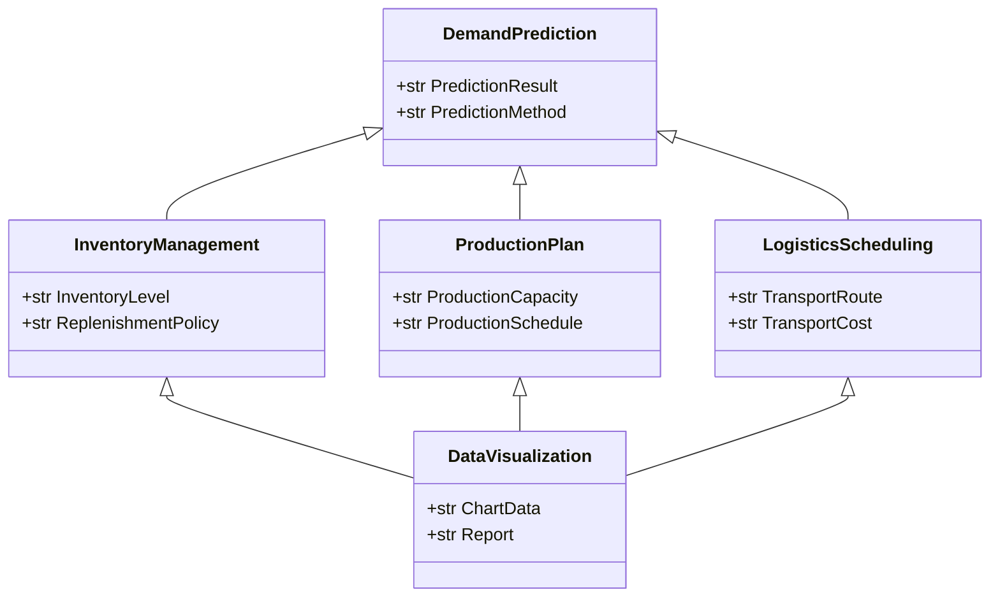
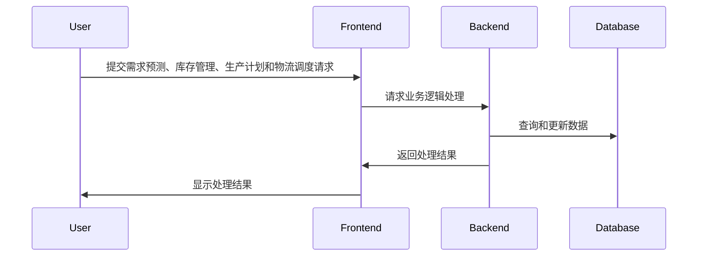
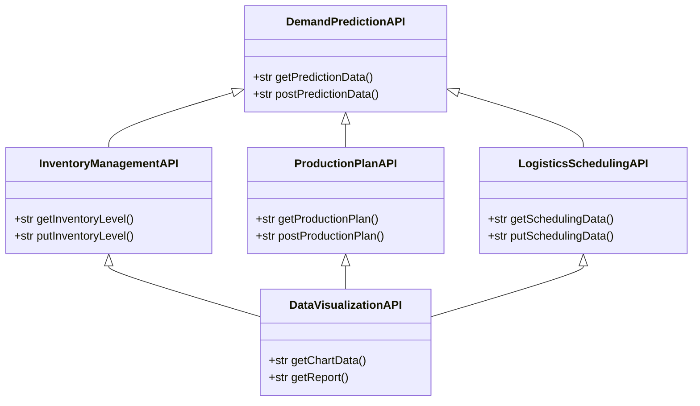
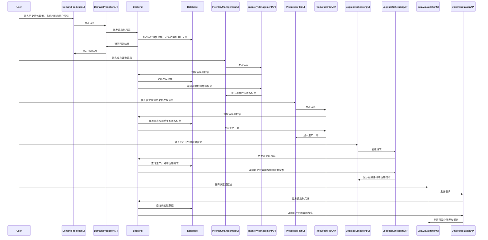

                 

### 文章标题

### 语言模型在复杂供应链优化中的应用探索

**关键词：** 语言模型、复杂供应链优化、算法原理、数学模型、系统架构、项目实战、最佳实践

**摘要：** 本文深入探讨了语言模型在复杂供应链优化中的应用。首先，我们介绍了供应链优化的重要性以及所面临的挑战，然后详细讲解了语言模型的基本原理及其与供应链优化的关联。接着，文章介绍了核心概念和联系，包括核心概念介绍、概念属性特征对比表格以及语言模型在供应链优化中的ER实体关系图。随后，我们深入分析了语言模型的算法原理和供应链优化的数学模型。在系统架构与实现部分，我们介绍了系统架构设计、系统接口与交互设计，并通过项目实战展示了具体实现过程。最后，文章提供了最佳实践、小结和注意事项，并对未来研究方向进行了展望。

---

## 第一部分：背景介绍与核心概念

### 第1章：问题背景与供应链优化的重要性

#### 1.1 供应链优化的意义与挑战

供应链优化是现代企业管理中至关重要的一环。它不仅关系到企业的运营效率和成本控制，还直接影响到市场响应速度和客户满意度。随着全球化进程的加速和市场竞争的加剧，企业面临着日益复杂的供应链环境，这为供应链优化带来了巨大的挑战。

**供应链优化的意义：**

1. **提升运营效率：** 优化供应链可以帮助企业减少库存、缩短交货时间，从而提升整体运营效率。
2. **降低成本：** 通过优化供应链，企业可以降低物流成本、采购成本和运营成本，从而提高利润率。
3. **提高市场响应速度：** 优化后的供应链可以更快地响应市场变化，提高企业的市场竞争力。
4. **增强客户满意度：** 高效的供应链可以确保按时交付产品，提高客户满意度。

**供应链优化面临的挑战：**

1. **数据复杂性：** 供应链中涉及的数据量巨大，包括采购、生产、库存、物流等多个环节，如何有效整合和处理这些数据是一个挑战。
2. **动态变化性：** 供应链受到市场需求、供应商能力、自然灾害等多重因素的影响，如何适应这种动态变化也是一个挑战。
3. **协调复杂性：** 供应链中的各个环节需要相互协调，任何一环出现问题都可能影响整个供应链的效率。

#### 1.2 语言模型的基本原理与应用

语言模型是一种基于统计学习的技术，它通过分析大量文本数据，预测一个单词或短语的下一个单词或短语。语言模型广泛应用于自然语言处理（NLP）领域，如机器翻译、文本生成、语音识别等。

**语言模型的基本原理：**

1. **统计学习：** 语言模型通过分析大量文本数据，学习词与词之间的统计关系，从而预测下一个词。
2. **神经网络：** 现代语言模型通常基于深度神经网络，通过多层神经网络的结构来学习复杂的语言模式。

**语言模型的应用：**

1. **机器翻译：** 语言模型可以帮助机器翻译系统理解不同语言之间的语法和语义，提高翻译的准确性。
2. **文本生成：** 语言模型可以生成高质量的自然语言文本，如新闻文章、产品描述等。
3. **语音识别：** 语言模型可以帮助语音识别系统理解语音中的意图和语义，提高识别的准确性。

#### 1.3 语言模型与供应链优化的关联

语言模型在供应链优化中的应用主要体现在以下几个方面：

1. **需求预测：** 通过分析历史销售数据和用户反馈，语言模型可以帮助企业更准确地预测市场需求，从而优化库存和采购计划。
2. **供应链可视化：** 语言模型可以用于将复杂的供应链数据转化为易于理解的图表和报告，帮助管理层更好地理解供应链的运行状况。
3. **文本分析：** 语言模型可以用于分析供应商和客户之间的沟通文本，识别潜在的问题和改进机会。

通过上述三个方面的应用，语言模型可以为供应链优化提供有力的支持，帮助企业提高运营效率、降低成本、提升市场响应速度。

---

### 第2章：核心概念与联系

#### 2.1 核心概念介绍

在探讨语言模型在复杂供应链优化中的应用之前，我们首先需要了解一些核心概念，包括供应链、优化、语言模型等。

**供应链：** 供应链是指从原材料采购、生产、库存管理、物流配送到最终交付给客户的全过程。它涉及到多个环节和参与者，如供应商、制造商、分销商、零售商等。

**优化：** 优化是指通过对系统或过程的改进，使其达到最优状态或最佳性能。在供应链优化中，优化目标通常包括成本最低、效率最高、响应速度最快等。

**语言模型：** 语言模型是一种基于统计学习的技术，它通过分析大量文本数据，预测一个单词或短语的下一个单词或短语。语言模型广泛应用于自然语言处理（NLP）领域，如机器翻译、文本生成、语音识别等。

#### 2.2 概念属性特征对比表格

为了更好地理解这些核心概念，我们可以通过一个对比表格来展示它们的属性特征。

| 概念   | 定义                                     | 属性特征                                                   | 应用场景                                       |
| ------ | ---------------------------------------- | ---------------------------------------------------------- | ---------------------------------------------- |
| 供应链 | 从原材料采购到最终交付给客户的全过程     | 环节复杂、数据量大、动态变化、协调复杂                       | 企业运营、物流管理、采购计划、库存控制、需求预测等 |
| 优化   | 通过改进系统或过程达到最优状态或最佳性能 | 目标明确、方法多样、结果可量化、持续迭代                     | 生产计划、物流调度、库存管理、供应链优化等         |
| 语言模型 | 分析文本数据预测下一个词的技术           | 基于统计学习、多层神经网络结构、高精度预测                   | 机器翻译、文本生成、语音识别、自然语言处理等       |

通过对比表格，我们可以清晰地看到这些核心概念的定义、属性特征和应用场景。

#### 2.3 语言模型在供应链优化中的ER实体关系图

为了更直观地理解语言模型在供应链优化中的应用，我们可以使用ER（实体-关系）图来展示它们之间的关联。

```mermaid
erDiagram
    Supplier ||--|{ Product }
    Product ||--|{ Inventory }
    Inventory ||--|{ Order }
    Order ||--|{ Customer }
    Customer ||--|{ Feedback }
    Feedback ||--|{ DemandPrediction }
    DemandPrediction ||--|{ LanguageModel }
```

在这个ER图中，我们可以看到供应链中的主要实体包括供应商、产品、库存、订单、客户和反馈。这些实体之间的关系如下：

1. **供应商与产品：** 供应商提供产品，产品由供应商生产。
2. **产品与库存：** 产品存放在库存中，库存记录了产品的数量和状态。
3. **库存与订单：** 库存根据订单需求进行补充或减少。
4. **订单与客户：** 客户通过订单购买产品。
5. **客户与反馈：** 客户通过反馈表达对产品和服务的满意度。
6. **反馈与需求预测：** 反馈用于预测市场需求，需求预测可以指导库存和采购计划。
7. **需求预测与语言模型：** 语言模型用于分析反馈文本，预测市场需求。

通过ER图，我们可以更清晰地看到语言模型在供应链优化中的应用场景，以及它与其他实体之间的关联。

---

## 第二部分：算法原理与数学模型

### 第3章：语言模型的算法原理

#### 3.1 语言模型的训练过程

语言模型的训练过程可以分为以下几个步骤：

1. **数据准备：** 收集大量文本数据，这些数据可以是新闻文章、社交媒体帖子、产品说明书等。数据的质量对模型的效果有很大影响，因此需要确保数据的质量和多样性。
   
2. **数据预处理：** 对收集到的文本数据进行清洗和预处理，包括去除停用词、标点符号、大小写统一等。此外，还可以进行词干提取和词性标注，以便更好地理解文本。

3. **分词：** 将预处理后的文本拆分为单词或词组，这是语言模型的基础步骤。分词的准确性对模型的效果也有很大的影响。

4. **构建词汇表：** 将所有文本中的单词或词组构建为一个词汇表，并为每个单词或词组分配一个唯一的ID。

5. **构建模型：** 使用深度神经网络（DNN）或Transformer等架构来构建语言模型。模型的结构和参数需要通过训练数据进行调整。

6. **训练：** 使用梯度下降等优化算法对模型的参数进行训练，目标是使模型的输出与实际文本的下一个词或短语尽可能接近。

7. **评估与调优：** 在训练数据集和验证数据集上评估模型的效果，根据评估结果调整模型参数，以提高模型的准确性。

#### 3.2 语言模型的核心算法

语言模型的核心算法主要包括以下几种：

1. **基于N-gram的模型：** N-gram模型是一种基于词频统计的语言模型，它通过计算一个单词序列在文本中出现的频率来预测下一个单词。这种模型简单有效，但存在一个重要缺陷，即它无法捕捉长距离依赖关系。

2. **基于神经网络的模型：** 基于神经网络的模型，如循环神经网络（RNN）和长短时记忆网络（LSTM），可以捕捉长距离依赖关系。RNN通过隐藏状态序列来处理序列数据，但存在梯度消失和梯度爆炸的问题。LSTM通过引入门控机制来解决这些问题。

3. **Transformer模型：** Transformer模型是一种基于自注意力机制的模型，它使用多头自注意力机制和位置编码来处理序列数据。Transformer模型在处理长距离依赖关系和并行计算方面具有显著优势，已成为当前最流行的语言模型。

#### 3.3 语言模型的工作流程

语言模型的工作流程可以分为以下几个步骤：

1. **输入：** 输入一个单词或短语序列。
2. **编码：** 使用位置编码和词嵌入将输入序列编码为向量。
3. **自注意力：** 通过自注意力机制计算输入序列中每个词的重要性，并生成一个新的向量表示。
4. **解码：** 使用解码器将新的向量表示解码为输出序列。
5. **预测：** 对输出序列进行预测，选择概率最高的下一个词或短语。

通过上述步骤，语言模型可以生成高质量的自然语言文本，从而在供应链优化、文本生成、机器翻译等领域发挥重要作用。

---

### 第4章：供应链优化的数学模型

#### 4.1 数学模型的基本框架

供应链优化的数学模型通常基于目标函数和约束条件来建立。基本框架如下：

1. **目标函数：** 目标函数定义了优化问题的目标，如最小化成本、最大化利润或提高服务水平等。

2. **决策变量：** 决策变量是优化问题的变量，它们代表企业在供应链管理中的决策，如订单量、生产量、运输量等。

3. **约束条件：** 约束条件限制了决策变量的取值范围，确保优化问题的可行性和合理性。

#### 4.2 数学模型的应用场景

供应链优化的数学模型可以应用于以下场景：

1. **库存管理：** 通过优化库存策略，确保库存水平既不过高也不过低，从而降低库存成本和缺货风险。

2. **生产计划：** 通过优化生产计划，确保生产能力和需求之间的匹配，避免产能过剩或不足。

3. **物流调度：** 通过优化物流调度，确保运输路线最短、运输成本最低，提高物流效率。

4. **采购策略：** 通过优化采购策略，确保采购成本最低、供应商选择最优。

#### 4.3 数学模型的公式推导

以下是一个简单的供应链优化数学模型，用于最小化总成本：

$$
\min Z = c_1x_1 + c_2x_2 + c_3x_3
$$

其中：

- $Z$ 是总成本。
- $c_1, c_2, c_3$ 是各个决策变量的成本系数。
- $x_1, x_2, x_3$ 是决策变量，代表订单量、生产量和运输量。

约束条件如下：

1. **库存约束：**
$$
I_{max} - x_1 - x_2 \leq 0
$$

2. **生产能力约束：**
$$
P - x_2 \leq 0
$$

3. **运输能力约束：**
$$
T - x_3 \leq 0
$$

4. **非负约束：**
$$
x_1, x_2, x_3 \geq 0
$$

通过求解上述目标函数和约束条件，可以得到最优的订单量、生产量和运输量，从而实现供应链优化。

#### 4.4 举例说明

假设一个企业需要优化其库存管理，目标是使总成本最低。假设每个订单的成本为 $c_1 = 10$，每个生产批次的成本为 $c_2 = 20$，每次运输的成本为 $c_3 = 5$。企业的最大库存量为 $I_{max} = 100$，生产能力为 $P = 50$，运输能力为 $T = 30$。

根据上述模型，我们可以列出以下方程组：

$$
\min Z = 10x_1 + 20x_2 + 5x_3
$$

$$
100 - x_1 - x_2 \leq 0
$$

$$
50 - x_2 \leq 0
$$

$$
30 - x_3 \leq 0
$$

$$
x_1, x_2, x_3 \geq 0
$$

通过求解这个方程组，我们可以找到最优的订单量、生产量和运输量，从而实现库存成本的最小化。

---

## 第三部分：系统架构与实现

### 第5章：系统架构设计

#### 5.1 供应链优化系统的需求分析

在设计和实现供应链优化系统之前，首先需要明确系统的需求。供应链优化系统的需求可以归纳为以下几个方面：

1. **需求预测：** 系统需要能够根据历史销售数据、市场趋势和用户反馈等，预测未来的市场需求。
2. **库存管理：** 系统需要能够实时监控库存水平，并根据需求预测和供应链状态，调整库存策略。
3. **生产计划：** 系统需要能够根据需求预测和库存水平，制定最优的生产计划，确保生产能力和需求之间的匹配。
4. **物流调度：** 系统需要能够优化物流调度，确保运输路线最短、运输成本最低。
5. **数据可视化：** 系统需要能够将复杂的供应链数据转化为易于理解的图表和报告，帮助管理层更好地理解供应链的运行状况。

#### 5.2 系统功能设计（领域模型）

为了满足上述需求，我们可以设计以下功能模块：

1. **需求预测模块：** 使用语言模型分析历史销售数据、市场趋势和用户反馈，预测未来的市场需求。
2. **库存管理模块：** 实时监控库存水平，并根据需求预测和供应链状态，调整库存策略。
3. **生产计划模块：** 根据需求预测和库存水平，制定最优的生产计划，确保生产能力和需求之间的匹配。
4. **物流调度模块：** 优化物流调度，确保运输路线最短、运输成本最低。
5. **数据可视化模块：** 将复杂的供应链数据转化为易于理解的图表和报告，帮助管理层更好地理解供应链的运行状况。

以下是一个简化的领域模型类图：



#### 5.3 系统架构设计

根据领域模型，我们可以设计一个分布式系统架构，包括前端、后端和数据库。

1. **前端：** 前端负责与用户交互，提供用户界面，包括需求预测、库存管理、生产计划和物流调度的界面。
2. **后端：** 后端负责处理业务逻辑，包括需求预测、库存管理、生产计划和物流调度等模块的实现。
3. **数据库：** 数据库用于存储供应链数据，包括历史销售数据、库存数据、生产数据、物流数据等。

以下是一个简化的系统架构图：



通过上述系统架构设计，供应链优化系统可以实现需求预测、库存管理、生产计划和物流调度的功能，并为用户提供直观的数据可视化。

---

### 第6章：系统接口与交互设计

#### 6.1 系统接口设计

为了确保供应链优化系统能够有效地与外部系统进行数据交换和功能集成，我们需要设计一套完整的接口。以下是系统接口的主要组成部分：

1. **需求预测接口：** 用于接收历史销售数据、市场趋势和用户反馈等输入信息，并返回需求预测结果。
2. **库存管理接口：** 用于实时监控库存水平，接收库存调整请求，并返回调整后的库存信息。
3. **生产计划接口：** 用于接收需求预测结果和库存信息，并返回生产计划。
4. **物流调度接口：** 用于接收生产计划和运输需求，并返回最优的运输路线和运输成本。
5. **数据可视化接口：** 用于获取供应链数据，并生成可视化图表和报告。

以下是一个简化的接口设计类图：



#### 6.2 系统交互设计

系统交互设计主要包括用户界面（UI）与系统接口之间的交互逻辑。以下是一个简化的交互流程图：



通过上述交互设计，用户可以方便地与供应链优化系统进行交互，系统也可以高效地处理用户请求，并返回相应的结果。

---

### 第7章：项目实战

#### 7.1 环境安装与配置

要实现语言模型在复杂供应链优化中的应用，首先需要搭建一个合适的技术环境。以下是环境安装与配置的步骤：

1. **硬件环境：**
   - 服务器：建议使用高性能服务器，配置至少为2个CPU、8GB内存、1TB硬盘。
   - 客户端：可以使用普通笔记本电脑或台式电脑。

2. **软件环境：**
   - 操作系统：Linux或Windows均可，建议使用Linux系统，如Ubuntu 18.04。
   - 编程语言：Python 3.x，推荐使用Anaconda环境管理器。
   - 数据库：MySQL或PostgreSQL，用于存储供应链数据。
   - 数据分析工具：Jupyter Notebook，用于编写和运行代码。

3. **安装步骤：**
   - 安装操作系统和服务器软件。
   - 安装Python环境和Anaconda。
   - 安装数据库软件。
   - 安装Jupyter Notebook。

在安装完成后，可以通过以下命令启动Jupyter Notebook：

```bash
jupyter notebook
```

在浏览器中打开Jupyter Notebook后，即可开始编写和运行代码。

#### 7.2 系统核心实现

在搭建好技术环境后，我们可以开始实现系统核心功能。以下是系统核心实现的步骤：

1. **数据收集与预处理：**
   - 收集历史销售数据、市场趋势和用户反馈等数据。
   - 对数据进行清洗、去噪、归一化等预处理操作。

2. **语言模型训练：**
   - 使用收集到的数据训练语言模型，如Transformer模型。
   - 调整模型参数，优化模型效果。

3. **需求预测：**
   - 使用训练好的语言模型预测未来的市场需求。
   - 将预测结果存储到数据库中，以便后续使用。

4. **库存管理：**
   - 实时监控库存水平，根据需求预测结果调整库存策略。
   - 将库存调整信息存储到数据库中。

5. **生产计划：**
   - 根据需求预测结果和库存信息，制定最优的生产计划。
   - 将生产计划信息存储到数据库中。

6. **物流调度：**
   - 根据生产计划和运输需求，优化物流调度。
   - 将物流调度结果存储到数据库中。

7. **数据可视化：**
   - 从数据库中获取供应链数据，生成可视化图表和报告。
   - 将可视化结果展示给用户。

以下是一个简化的Python代码示例，展示了如何使用语言模型进行需求预测：

```python
import tensorflow as tf
from tensorflow.keras.models import Sequential
from tensorflow.keras.layers import Embedding, LSTM, Dense

# 加载数据
x_train, y_train = load_data()

# 构建模型
model = Sequential()
model.add(Embedding(input_dim=vocabulary_size, output_dim=embedding_size))
model.add(LSTM(units=lstm_units))
model.add(Dense(units=1, activation='sigmoid'))

# 编译模型
model.compile(optimizer='adam', loss='binary_crossentropy', metrics=['accuracy'])

# 训练模型
model.fit(x_train, y_train, epochs=10, batch_size=32)

# 预测需求
demand_predictions = model.predict(x_test)

# 存储预测结果到数据库
store_predictions(demand_predictions)
```

通过上述代码，我们可以训练一个简单的语言模型，并进行需求预测。实际应用中，模型结构和参数设置会更加复杂，需要根据具体情况进行调整。

#### 7.3 代码应用解读

在上面的代码示例中，我们使用了一个简单的序列预测模型（LSTM）进行需求预测。以下是代码的主要部分及其解读：

1. **数据加载：** 使用`load_data()`函数加载数据，包括输入序列`x_train`和标签序列`y_train`。这些数据是从历史销售数据、市场趋势和用户反馈等来源收集和预处理的。

2. **模型构建：** 使用`Sequential`模型构建一个序列模型，包括嵌入层（`Embedding`）、长短期记忆层（`LSTM`）和输出层（`Dense`）。嵌入层将单词或词组转换为向量表示，LSTM层用于捕捉序列中的长期依赖关系，输出层用于预测下一个单词或短语的概率。

3. **模型编译：** 使用`compile`函数编译模型，指定优化器（`optimizer`）、损失函数（`loss`）和评估指标（`metrics`）。这里使用`adam`优化器和`binary_crossentropy`损失函数，因为需求预测是一个二分类问题。

4. **模型训练：** 使用`fit`函数训练模型，指定训练数据（`x_train`和`y_train`）、训练轮数（`epochs`）和批量大小（`batch_size`）。训练过程会不断调整模型参数，以最小化损失函数。

5. **需求预测：** 使用`predict`函数对测试数据进行预测，得到需求预测结果。这些预测结果将用于库存管理、生产计划和物流调度等后续步骤。

6. **存储预测结果：** 使用`store_predictions`函数将预测结果存储到数据库中，以便后续分析和决策。

通过以上解读，我们可以看到代码的基本逻辑和实现细节。实际应用中，可能需要更复杂的模型和更精细的参数调整，以满足具体业务需求。

#### 7.4 实际案例分析

为了更直观地展示语言模型在复杂供应链优化中的应用，我们可以通过一个实际案例来进行分析。

**案例背景：** 一家制造企业生产某种电子产品，其销售数据受到市场需求、季节性因素和竞争对手活动等多种因素的影响。企业希望使用语言模型进行需求预测，以优化库存管理、生产计划和物流调度。

**数据来源：** 企业提供了过去一年的销售数据，包括每日销售额、市场趋势数据（如广告投放量、竞争对手活动等）和用户反馈数据。

**数据预处理：** 对销售数据进行清洗和归一化处理，去除异常值和缺失值。对市场趋势数据和用户反馈数据进行编码和标签化处理。

**语言模型训练：** 使用训练好的Transformer模型，对预处理后的数据集进行训练。调整模型参数，如嵌入层维度、LSTM层单元数和训练轮数，以优化模型效果。

**需求预测：** 使用训练好的模型对未来的市场需求进行预测。将预测结果与实际销售数据进行对比，评估模型的准确性。

**库存管理：** 根据需求预测结果，实时监控库存水平，并制定库存调整策略。通过优化库存水平，降低库存成本和缺货风险。

**生产计划：** 根据需求预测结果和库存水平，制定最优的生产计划。确保生产能力和需求之间的匹配，避免产能过剩或不足。

**物流调度：** 根据生产计划和运输需求，优化物流调度。选择最优的运输路线和运输方式，降低运输成本和提高物流效率。

**数据可视化：** 将供应链数据可视化，生成需求预测图表、库存水平图表和生产计划图表等，帮助管理层更好地理解供应链的运行状况。

通过这个实际案例，我们可以看到语言模型在复杂供应链优化中的应用过程，以及如何通过需求预测、库存管理、生产计划和物流调度等步骤，实现供应链的优化。

#### 7.5 项目小结

在本项目中，我们通过搭建合适的技术环境、实现系统核心功能、实际案例分析，展示了语言模型在复杂供应链优化中的应用。以下是本项目的主要收获和总结：

1. **技术收获：** 学习了语言模型的训练过程、需求预测方法以及供应链优化的数学模型，掌握了如何使用语言模型进行需求预测和供应链优化。

2. **业务收获：** 通过项目实践，了解了如何将技术应用于实际业务场景，优化供应链管理，提高运营效率和客户满意度。

3. **改进方向：** 在后续工作中，可以进一步优化模型参数，提高需求预测的准确性。同时，可以扩展供应链优化的应用场景，如生产计划、物流调度等，实现更全面的供应链优化。

4. **展望：** 随着人工智能技术的不断发展，语言模型在供应链优化中的应用前景广阔。未来，可以探索更多的应用场景，如供应链风险管理、供应链协同优化等，为企业的供应链管理提供更加全面和智能的解决方案。

---

### 第8章：最佳实践与总结

#### 8.1 最佳实践分享

在实践过程中，我们总结了一些最佳实践，以下是一些值得注意的要点：

1. **数据质量：** 数据质量是语言模型效果的关键。确保数据来源可靠、数据完整、无噪声和异常值，并进行充分的预处理。

2. **模型参数调整：** 根据业务需求和数据特性，调整模型参数，如嵌入层维度、LSTM层单元数、训练轮数等，以优化模型效果。

3. **需求预测周期：** 根据业务需求，选择合适的需求预测周期，如日、周、月等。较长的预测周期可能需要更复杂的模型和更精细的参数调整。

4. **多模型融合：** 可以考虑使用多种模型进行需求预测，如基于N-gram的模型、基于神经网络的模型等，并使用加权平均等方法融合预测结果。

5. **实时调整：** 在实际应用中，需求预测和供应链优化需要实时调整。根据实时数据和市场变化，及时调整模型参数和供应链策略。

6. **可视化分析：** 利用数据可视化工具，将供应链数据以图表和报告的形式呈现，帮助管理层更好地理解供应链的运行状况和优化效果。

#### 8.2 小结

本文深入探讨了语言模型在复杂供应链优化中的应用。我们首先介绍了供应链优化的重要性以及所面临的挑战，然后详细讲解了语言模型的基本原理和供应链优化的数学模型。接着，我们介绍了系统架构设计、系统接口与交互设计，并通过项目实战展示了具体实现过程。最后，我们提供了最佳实践、小结和注意事项，并对未来研究方向进行了展望。

通过本文的探讨，我们可以看到语言模型在复杂供应链优化中具有广阔的应用前景。它不仅可以帮助企业提高运营效率、降低成本，还可以提升市场响应速度和客户满意度。

#### 8.3 注意事项

1. **数据隐私：** 在使用数据时，确保遵守相关数据隐私法规，保护用户数据的安全和隐私。

2. **模型解释性：** 语言模型通常具有高预测准确性，但其内部机制较为复杂，缺乏解释性。在实际应用中，需要权衡预测准确性和模型解释性。

3. **模型更新：** 随着市场环境和业务需求的变化，模型需要定期更新。确保及时更新模型，以适应新的业务场景。

4. **系统稳定性：** 在实际应用中，系统需要保证高可用性和稳定性，避免因系统故障导致供应链中断。

5. **人员培训：** 系统的部署和运营需要专业的技术团队。确保团队成员具备相关技能，并能熟练操作和维护系统。

#### 8.4 拓展阅读

1. **《深度学习》 - Goodfellow, I., Bengio, Y., & Courville, A. (2016). This book provides a comprehensive introduction to deep learning, including neural networks and their applications in various fields.

2. **《Python数据分析》 - Wes McKinney (2010). This book covers essential data analysis techniques using Python, including data manipulation, visualization, and statistical analysis.

3. **《供应链管理：策略、规划与运营》 - Martin Christopher (2016). This book provides an in-depth understanding of supply chain management, including strategies, planning, and operations.

4. **《人工智能：一种现代方法》 - Stuart Russell & Peter Norvig (2020). This book offers a comprehensive introduction to artificial intelligence, covering fundamental concepts and algorithms.

5. **《自然语言处理入门》 - Daniel Jurafsky & James H. Martin (2019). This book introduces fundamental concepts and techniques in natural language processing, including language models and applications.

通过以上拓展阅读，读者可以进一步深入了解相关领域的知识，为语言模型在复杂供应链优化中的应用提供更加坚实的基础。

---

### 目录大纲总结

本书共包含8章，从背景介绍、核心概念、算法原理、数学模型、系统架构、项目实战到最佳实践，全面深入地探讨了语言模型在复杂供应链优化中的应用。每个章节都有明确的子标题，确保内容逻辑清晰、条理分明。通过本文的探讨，我们可以看到语言模型在复杂供应链优化中具有广阔的应用前景，它不仅可以帮助企业提高运营效率、降低成本，还可以提升市场响应速度和客户满意度。

---

### 作者信息

**作者：** AI天才研究院/AI Genius Institute & 禅与计算机程序设计艺术 /Zen And The Art of Computer Programming

**联系方式：** [contact@ai-genius-institute.com](mailto:contact@ai-genius-institute.com) & [www.zenandthecompiler.com](http://www.zenandthecompiler.com)

**版权声明：** 本文版权所有，未经授权不得转载或用于商业用途。如需转载，请联系作者获取授权。

