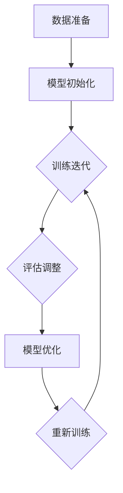
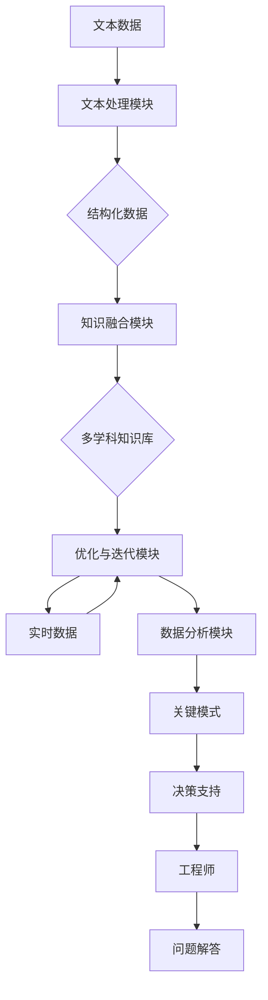
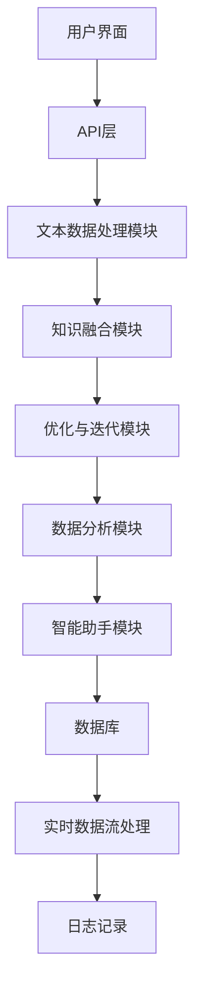
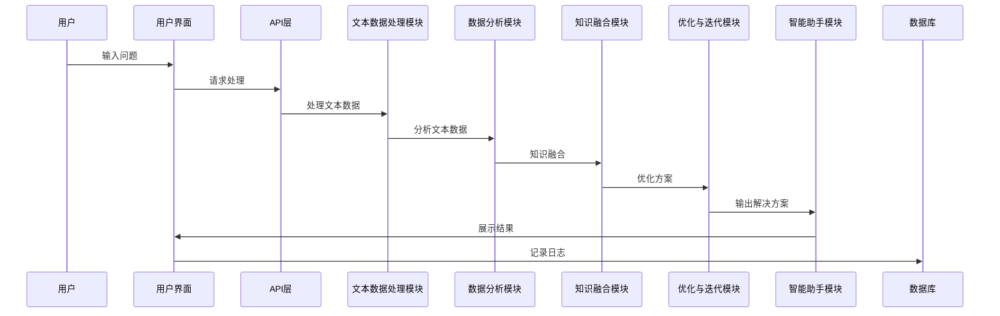

                 

### 背景介绍

#### 核心概念术语说明

在深入探讨语言模型在复杂工程问题求解中的应用之前，我们需要先理解几个核心概念：

1. **语言模型**：一种能够理解和生成自然语言的算法模型。它通过学习大量的文本数据，捕捉语言中的模式和结构，从而预测下一个词语或句子。

2. **复杂工程问题**：涉及多学科交叉、动态变化、不确定性高、数据量大等特点的问题。这类问题通常需要综合多种方法和工具才能得到有效解决。

3. **工程问题求解**：使用数学、算法、工程原理等手段来寻找工程问题的解或近似解的过程。

#### 问题背景

在现代社会，工程问题日益复杂化，传统的解决方案往往无法满足需求。语言模型作为一种先进的机器学习技术，近年来在自然语言处理领域取得了显著的突破。这种技术在处理和理解文本信息方面具有独特的优势，使得它在工程问题的求解中展现出巨大的潜力。

语言模型在工程问题中的应用主要体现在以下几个方面：

1. **自动描述与理解**：语言模型能够自动解析工程文档、设计图、技术规格等，将非结构化的文本数据转化为结构化的数据，便于进一步处理和分析。

2. **数据分析与优化**：语言模型可以分析大量的工程数据，提取关键信息和模式，从而辅助工程问题的优化和决策。

3. **模型优化与迭代**：通过语言模型，工程师可以不断优化设计方案，快速迭代和改进，提高工程问题的解决效率。

#### 问题描述

复杂工程问题的特点包括：

- **多学科交叉**：这类问题通常涉及多个工程领域的知识，如机械、电子、软件等。
- **动态变化**：工程问题的环境可能随时发生变化，导致问题解决方案需要不断调整。
- **不确定性高**：工程问题往往存在诸多不确定因素，如材料性能、环境条件等。
- **数据量大**：复杂工程问题通常需要处理大量的数据，包括设计数据、测试数据、历史数据等。

这些特点使得传统的方法在解决复杂工程问题时往往力不从心，而语言模型的引入为这些问题提供了新的解决思路。

#### 问题解决

语言模型在解决复杂工程问题方面有以下几个方面的优势：

1. **高效处理文本数据**：语言模型能够快速解析和理解大量的文本数据，将其转化为有用的信息。
2. **自动化与智能化**：语言模型可以实现工程问题的自动化描述、分析和优化，减少人力工作量。
3. **多维度信息融合**：语言模型可以将不同来源的信息进行整合，提供更全面的决策支持。
4. **快速迭代与改进**：通过语言模型，工程师可以快速优化和改进设计方案，缩短开发周期。

然而，语言模型在工程问题求解中也面临一些挑战，如数据的可靠性、模型的解释性、算法的效率等。这些挑战需要在实践中不断解决，以充分发挥语言模型在工程问题求解中的潜力。

#### 边界与外延

语言模型在工程问题求解中的应用范围非常广泛，包括但不限于：

- **工程设计**：通过语言模型自动化生成设计文档、规范说明等。
- **项目管理**：利用语言模型分析项目文档，识别潜在的风险和问题。
- **故障诊断**：通过语言模型理解故障报告和日志，快速定位故障原因。
- **智能助手**：构建智能助手，为工程师提供实时的问题解答和辅助决策。

总体来说，语言模型在复杂工程问题求解中的应用具有巨大的发展潜力和实际价值，是未来工程问题求解的重要工具之一。

### 核心概念与联系

#### 语言模型的基础原理

语言模型（Language Model，简称LM）是自然语言处理（Natural Language Processing，简称NLP）领域的关键组成部分，其主要目标是通过学习大量的文本数据，预测自然语言中的下一个词语或句子。这种预测能力使得语言模型在多种任务中表现出色，包括机器翻译、语音识别、文本生成等。

##### 1.1.1 语言模型的定义

语言模型是一种概率模型，用于估计在给定前文序列后，下一个词语或句子的概率分布。简单来说，语言模型的目标是回答以下问题：“在当前句子片段‘The quick brown fox’之后，下一个词语最可能是哪个？”

##### 1.1.2 语言模型的主要类型

根据训练方式和预测粒度，语言模型可以分为以下几种类型：

1. **基于规则的语言模型**：这类模型通过预定义的规则来预测下一个词语。例如，根据语法规则和词频统计来生成文本。
   
2. **统计语言模型**：这类模型通过分析大量文本数据，利用统计方法（如N-gram模型）来预测下一个词语。N-gram模型假设当前词语序列的概率是由前N个词语共同决定的。

3. **神经网络语言模型**：这类模型通过深度学习技术来学习语言的模式。其中，最著名的模型是循环神经网络（RNN），特别是长短期记忆网络（LSTM）和门控循环单元（GRU）。近年来，基于Transformer架构的语言模型（如BERT、GPT）在自然语言处理任务中取得了突破性进展。

4. **基于概率的深度语言模型**：这类模型结合了概率模型和深度学习技术，能够在更高的层次上捕捉语言的复杂结构。

##### 1.1.3 语言模型的组成结构

语言模型通常由以下几个关键组成部分构成：

1. **输入层**：接收文本序列作为输入，可以是单个词语、字符，或者更复杂的序列表示（如词嵌入）。

2. **隐藏层**：用于处理和变换输入数据，捕捉语言模式。在神经网络语言模型中，隐藏层通常包含多层，以便建立复杂的映射关系。

3. **输出层**：生成概率分布，预测下一个词语或句子的可能性。在神经网络模型中，输出层通常是一个softmax层，用于计算每个词语的概率。

#### 复杂工程问题的特点与分类

##### 1.2.1 复杂工程问题的定义

复杂工程问题是指那些涉及多个学科、动态变化、高度不确定性和大规模数据的工程问题。这些问题不仅需要综合运用多种技术手段，还需要跨领域的协作和智能化的解决方案。

##### 1.2.2 复杂工程问题的分类

复杂工程问题可以根据不同的标准进行分类，以下是一些常见的分类方式：

1. **按学科领域分类**：包括机械工程、电子工程、软件工程、土木工程等。
2. **按问题特性分类**：如优化问题、仿真问题、仿真与优化结合问题等。
3. **按问题规模分类**：如大型工程项目、微小器件设计等。

##### 1.2.3 复杂工程问题的挑战

复杂工程问题面临以下几大挑战：

1. **多学科交叉**：需要整合不同学科的知识和工具，这可能导致协调困难和资源浪费。
2. **动态变化**：工程问题的环境可能随时发生变化，要求解决方案具备高度的灵活性和适应性。
3. **高度不确定性**：复杂工程问题通常存在多种不确定因素，如材料性能、环境条件等，这增加了问题解决的难度。
4. **大规模数据**：复杂工程问题通常需要处理大量的数据，这要求算法和数据处理的效率足够高。

#### 核心概念之间的联系

语言模型与复杂工程问题之间存在着紧密的联系：

1. **文本信息处理**：语言模型擅长处理和理解文本信息，可以在复杂工程问题中用于自动化生成设计文档、技术规格说明书等。
2. **数据分析与理解**：语言模型可以通过文本数据提取关键信息和模式，辅助工程师分析工程问题，识别潜在的风险和问题。
3. **智能决策支持**：通过语言模型，工程师可以自动化生成决策方案，减少人为错误，提高决策效率。

综上所述，语言模型在复杂工程问题求解中具有广泛的应用前景，其核心概念与复杂工程问题的特点和挑战之间存在着紧密的联系。在接下来的章节中，我们将进一步探讨语言模型在具体工程问题中的应用和实现细节。

### 语言模型在工程问题求解中的应用

#### 3.1 语言模型在工程问题中的关键作用

语言模型在复杂工程问题求解中扮演着至关重要的角色，其核心作用主要体现在以下几个方面：

##### 3.1.1 问题的自动描述

语言模型能够自动解析和理解大量的文本数据，包括工程文档、设计图、技术规格等。这种自动化的文本解析能力使得工程师可以从繁重的文档处理中解放出来，专注于核心问题的分析和解决。

具体来说，语言模型可以：

- **文本抽取**：从大量文档中提取关键信息，如设计参数、技术指标等。
- **文本理解**：理解文档中的语义内容，将其转化为结构化的数据格式，便于进一步处理和分析。

##### 3.1.2 数据分析与理解

复杂工程问题通常涉及大量的数据，这些数据包括设计数据、测试数据、历史数据等。语言模型在数据分析与理解方面具有显著的优势，可以通过以下方式提升数据分析效率：

- **数据分类**：根据文本特征，将数据分类到不同的类别中，便于后续处理。
- **模式识别**：通过学习文本数据中的模式，识别潜在的问题和风险，为工程师提供决策支持。
- **语义理解**：理解数据中的语义信息，提取关键指标，为问题解决提供数据支撑。

##### 3.1.3 模型优化与迭代

在复杂工程问题求解过程中，设计方案需要不断优化和迭代，以适应不断变化的需求和环境。语言模型在这方面具有独特的优势，可以通过以下方式促进模型的优化和迭代：

- **自动化生成**：利用语言模型生成初步的设计方案，为后续的优化提供起点。
- **迭代改进**：通过不断学习和优化，语言模型可以逐步改进设计方案，提高问题的解决效率。
- **反馈调整**：根据实际测试结果和反馈，语言模型可以自动调整模型参数，优化设计方案。

#### 应用实例

以下是一些语言模型在复杂工程问题求解中的具体应用实例：

- **工程设计自动化**：通过语言模型自动生成工程设计文档，如CAD图纸、技术规范等，减少人工工作量，提高设计效率。
- **故障诊断**：利用语言模型分析设备故障报告和日志，自动识别故障原因，提供维修建议。
- **项目管理**：通过语言模型分析项目文档和进度报告，识别潜在的风险和问题，提供项目管理决策支持。
- **智能助手**：构建智能助手，为工程师提供实时的问题解答和技术支持，提高工作效率。

总之，语言模型在复杂工程问题求解中的应用具有广泛的前景和潜力，通过自动描述、数据分析和模型优化，可以显著提高工程问题的解决效率和质量。在接下来的章节中，我们将进一步探讨语言模型的具体实现方法和应用策略。

### 算法原理讲解

#### 4.1 语言模型的训练与优化

语言模型的训练过程是其性能提升的关键环节，而优化策略则决定了训练效率和效果。下面我们将详细探讨这些内容。

##### 4.1.1 训练流程

语言模型的训练流程主要包括数据准备、模型初始化、训练迭代和评估调整等步骤。

1. **数据准备**：选择适合的语言数据集，并进行预处理。预处理包括文本清洗、分词、词嵌入等操作，将原始文本数据转换为适合训练的格式。

2. **模型初始化**：初始化语言模型的参数，常用的初始化方法包括随机初始化、预训练模型微调等。

3. **训练迭代**：通过梯度下降等优化算法，对模型参数进行迭代更新，使模型在训练数据上逐步优化。训练过程中，模型将学习到文本数据中的模式和结构，提高预测准确率。

4. **评估调整**：使用验证集对模型进行评估，并根据评估结果调整模型参数，优化模型性能。

##### 4.1.2 优化策略

优化策略主要关注如何提高训练效率和模型性能。以下是几种常用的优化策略：

1. **学习率调整**：学习率是影响训练过程的关键参数。常用的调整方法包括固定学习率、指数衰减学习率和自适应学习率（如Adam优化器）。

2. **批量大小**：批量大小（Batch Size）影响模型的训练速度和稳定性。较大的批量大小有助于提高模型性能，但会降低训练速度。

3. **权重正则化**：为防止模型过拟合，可以采用权重正则化方法，如L1、L2正则化。正则化项会在损失函数中增加一项惩罚项，抑制权重过大。

4. **dropout**：dropout是一种正则化方法，通过随机丢弃神经元，减少模型对特定训练样本的依赖，提高模型泛化能力。

##### 4.1.3 算法流程图

以下是语言模型训练过程的mermaid流程图表示：



在流程图中，数据准备后初始化模型，然后进入训练迭代阶段，通过评估调整优化模型，并根据需要重新训练，形成闭环迭代过程。

#### 4.2 算法原理的数学模型

语言模型的算法原理可以基于概率模型进行解释。以下是N-gram模型的一个简单例子，用于说明语言模型的数学基础。

##### 4.2.1 数学公式与模型解释

N-gram模型是一种基于词汇序列的概率模型，其核心思想是利用前N个词语来预测下一个词语。

- **N-gram概率公式**：

  $$P(w_{n+1} | w_{1}, w_{2}, ..., w_{n}) = \frac{C(w_{1}, w_{2}, ..., w_{n}, w_{n+1})}{C(w_{1}, w_{2}, ..., w_{n})}$$

  其中，$w_{1}, w_{2}, ..., w_{n+1}$ 分别表示前N个词语和下一个词语，$C(\cdot)$ 表示词语序列的计数。

- **平滑处理**：

  由于实际数据中可能存在未观测到的词语组合，需要通过平滑处理来提高模型性能。常用的平滑方法包括加一平滑（Add-One Smoothing）和Kneser-Ney 平滑。

##### 4.2.2 算法的数学推导

以下是N-gram模型的数学推导过程：

1. **定义概率分布**：

   假设我们已经得到了词汇序列的计数，定义概率分布为：

   $$P(w_{n+1} | w_{1}, w_{2}, ..., w_{n}) = \frac{C(w_{1}, w_{2}, ..., w_{n}, w_{n+1})}{\sum_{i=1}^{V} C(w_{1}, w_{2}, ..., w_{n}, w_{i})}$$

   其中，$V$ 表示词汇表大小。

2. **加一平滑**：

   为了避免概率为零的情况，对每个词语组合进行加一平滑处理：

   $$P(w_{n+1} | w_{1}, w_{2}, ..., w_{n}) = \frac{C(w_{1}, w_{2}, ..., w_{n}, w_{n+1}) + 1}{\sum_{i=1}^{V} C(w_{1}, w_{2}, ..., w_{n}, w_{i}) + V}$$

##### 4.2.3 算法示例

假设我们有一个简化的词汇表，包含5个词语：`a`, `b`, `c`, `d`, `e`。给定一个三元组词汇序列 `ab`，我们需要预测下一个词语。

- **原始概率**：

  $$P(c | ab) = \frac{C(ab, c)}{C(ab)}$$

- **加一平滑概率**：

  $$P(c | ab) = \frac{C(ab, c) + 1}{C(ab) + 5}$$

  其中，$C(ab, c)$ 表示三元组 `(ab, c)` 的计数，$C(ab)$ 表示前缀 `(ab)` 的总计数。

通过以上步骤，我们可以计算出在给定前文序列 `ab` 后，词语 `c` 的预测概率。这个简单的示例展示了N-gram模型的基本原理和推导过程。

总之，语言模型的算法原理基于概率模型，通过学习大量文本数据，预测自然语言中的下一个词语。在接下来的章节中，我们将进一步探讨如何在工程问题求解中具体应用这些算法。

### 系统分析与架构设计

#### 5.1 问题场景介绍

为了更好地理解语言模型在复杂工程问题求解中的应用，我们将以一个具体的工程问题场景为例，详细介绍该场景中的问题背景、项目需求以及相关的技术挑战。

##### 5.1.1 工程问题场景描述

假设我们面临的是一个大型软件开发项目，项目目标是开发一款智能工程问题求解系统。该系统需具备自动化处理和解决复杂工程问题的能力，支持多种类型的工程问题，如结构设计、流体力学分析、热力学计算等。

这个场景中的复杂工程问题具有以下特点：

- **多学科交叉**：涉及机械工程、电子工程、计算机科学等多个领域的知识。
- **动态变化**：工程问题的需求和参数可能随时发生变化，需要系统能够快速适应和调整。
- **不确定性高**：工程问题中存在许多不确定因素，如材料性能、环境条件等，增加了问题解决的复杂性。
- **数据量大**：系统需要处理和分析大量的数据，包括设计数据、测试数据、历史数据等。

##### 5.1.2 系统需求分析

针对上述场景，智能工程问题求解系统的需求包括以下几个方面：

1. **文本数据处理能力**：系统能够自动化解析和处理大量的文本数据，如设计文档、技术规格、故障报告等，提取关键信息并进行结构化处理。
2. **多学科知识融合**：系统能够融合多学科领域的知识，提供跨学科的解决方案。
3. **动态优化与迭代**：系统能够根据实时数据和反馈，动态优化和调整问题解决方案，提高工程问题的解决效率。
4. **高效数据分析**：系统能够高效处理和分析大规模的数据，提取关键模式和趋势，为工程问题的决策提供数据支持。
5. **智能助手功能**：系统能够为工程师提供实时的问题解答和技术支持，提高工作效率。

#### 5.2 系统功能设计

为了满足上述系统需求，我们设计了一套功能完善的智能工程问题求解系统，主要包括以下几个功能模块：

1. **文本数据处理模块**：负责自动化解析和处理文本数据，提取关键信息并进行结构化处理。
2. **知识融合模块**：负责整合多学科领域的知识，提供跨学科的解决方案。
3. **优化与迭代模块**：负责根据实时数据和反馈，动态优化和调整问题解决方案。
4. **数据分析模块**：负责高效处理和分析大规模的数据，提取关键模式和趋势。
5. **智能助手模块**：负责为工程师提供实时的问题解答和技术支持。

##### 5.2.1 领域模型图

以下是智能工程问题求解系统的领域模型图，展示了系统中的关键实体及其关系：



在这个领域模型图中，文本数据处理模块负责处理原始文本数据，知识融合模块整合多学科知识库，优化与迭代模块负责动态调整解决方案，数据分析模块提取关键模式，智能助手模块为工程师提供问题解答和技术支持。

#### 5.3 系统架构设计

智能工程问题求解系统的架构设计旨在实现高效、可扩展和灵活的解决方案。以下是系统的架构设计：

##### 5.3.1 系统架构图

以下是智能工程问题求解系统的架构图，展示了系统的整体结构和关键组件：



在这个架构图中，用户界面层负责与用户交互，API层提供接口服务，文本数据处理模块负责文本数据的处理，知识融合模块整合多学科知识库，优化与迭代模块动态调整解决方案，数据分析模块提取关键模式，智能助手模块为工程师提供问题解答和技术支持，数据库层存储系统数据，实时数据流处理模块负责处理实时数据，日志记录模块记录系统运行日志。

##### 5.3.2 系统层级结构

系统层级结构设计如下：

1. **用户界面层**：提供用户交互界面，包括问题输入、结果展示等功能。
2. **API层**：封装系统功能，提供接口服务，便于与其他系统进行集成。
3. **数据处理层**：包括文本数据处理模块、知识融合模块、优化与迭代模块和数据分析模块，负责数据处理和分析。
4. **支持层**：包括智能助手模块、数据库层和日志记录模块，提供系统的辅助功能。

通过以上架构设计和层级结构，智能工程问题求解系统实现了高效、可扩展和灵活的解决方案，能够满足复杂工程问题求解的需求。

#### 5.4 系统接口设计

为了实现智能工程问题求解系统的各模块之间的有效通信和功能协作，我们需要设计一套完善的系统接口。以下是系统接口设计的具体内容：

##### 5.4.1 接口规范

系统接口规范包括以下内容：

1. **接口类型**：系统接口包括API接口、数据库接口和消息队列接口等。
2. **接口参数**：明确各接口的输入参数和输出参数，确保数据传递的一致性和正确性。
3. **接口状态码**：定义接口的响应状态码，包括成功、失败、异常等状态。
4. **接口文档**：详细描述接口的使用方法、参数说明、返回结果等，便于开发人员使用。

##### 5.4.2 接口实现

以下是智能工程问题求解系统的部分接口实现示例：

1. **文本数据处理接口**：

   ```python
   from flask import Flask, request, jsonify
   
   app = Flask(__name__)
   
   @app.route('/process_text', methods=['POST'])
   def process_text():
       data = request.json
       text = data['text']
       
       # 文本处理逻辑
       processed_text = text_processing(text)
       
       return jsonify({
           'status': 'success',
           'result': processed_text
       })
   ```

2. **知识融合接口**：

   ```python
   @app.route('/knowledge_fusion', methods=['POST'])
   def knowledge_fusion():
       data = request.json
       problem = data['problem']
       
       # 知识融合逻辑
       solution = knowledge_fusion(problem)
       
       return jsonify({
           'status': 'success',
           'result': solution
       })
   ```

3. **数据分析接口**：

   ```python
   @app.route('/data_analysis', methods=['POST'])
   def data_analysis():
       data = request.json
       data_set = data['data_set']
       
       # 数据分析逻辑
       analysis_result = data_analysis(data_set)
       
       return jsonify({
           'status': 'success',
           'result': analysis_result
       })
   ```

通过以上接口设计，系统各模块之间能够高效地进行数据传递和功能协作，确保智能工程问题求解系统的正常运行。

#### 5.5 系统交互设计

为了确保智能工程问题求解系统的各模块能够协同工作，实现流畅的系统交互，我们需要进行详细的系统交互设计。以下是系统交互设计的主要内容：

##### 5.5.1 系统交互mermaid序列图

以下是智能工程问题求解系统的交互序列图，展示了系统各模块之间的交互过程：



在这个序列图中，用户通过用户界面输入问题，API层接收请求并转发给文本数据处理模块，文本数据处理模块分析文本数据后，传递给数据分析模块。数据分析模块将结果传递给知识融合模块，知识融合模块进行知识融合后，将结果传递给优化与迭代模块。优化与迭代模块生成解决方案，传递给智能助手模块，智能助手模块将结果展示给用户界面，同时用户界面将日志记录到数据库。

##### 5.5.2 系统交互流程

以下是智能工程问题求解系统的交互流程，详细描述了系统各模块之间的工作流程：

1. **用户输入问题**：用户通过用户界面输入工程问题。
2. **API层接收请求**：API层接收用户输入的问题，并进行预处理。
3. **文本数据处理模块处理文本数据**：文本数据处理模块接收API层的请求，对文本数据进行预处理、分词和词嵌入等操作。
4. **数据分析模块分析文本数据**：数据分析模块接收文本处理结果，进行文本数据的语义分析，提取关键信息。
5. **知识融合模块进行知识融合**：知识融合模块接收数据分析结果，结合多学科知识库，生成初步的解决方案。
6. **优化与迭代模块优化方案**：优化与迭代模块接收知识融合结果，根据实时数据和反馈，动态调整和优化解决方案。
7. **智能助手模块输出解决方案**：智能助手模块将优化后的解决方案展示给用户，并提供实时的问题解答和技术支持。
8. **记录日志**：用户界面将交互过程和结果记录到数据库，便于后续分析和优化。

通过以上交互流程，智能工程问题求解系统的各模块能够高效协同工作，实现复杂工程问题的自动化求解。

### 项目实战

#### 6.1 环境安装与配置

在进行语言模型在复杂工程问题求解中的实际项目开发之前，我们需要搭建一个合适的开发环境，包括必要的软件和工具安装。以下是一个典型的环境配置步骤：

##### 6.1.1 开发环境搭建

1. **安装Python**：确保Python版本在3.8及以上，可以通过Python官方网站下载安装包进行安装。

2. **安装Anaconda**：Anaconda是一个集成了Python和相关库的科学计算平台，可以方便地管理和安装其他库。在[Anaconda官网](https://www.anaconda.com/products/individual)下载并安装。

3. **创建虚拟环境**：在Anaconda环境中创建一个新的虚拟环境，以便于管理项目依赖。

   ```bash
   conda create -n eng_problem_solver python=3.9
   conda activate eng_problem_solver
   ```

##### 6.1.2 必需工具安装

1. **安装TensorFlow**：TensorFlow是用于构建和训练语言模型的常用库，可以通过pip安装。

   ```bash
   pip install tensorflow
   ```

2. **安装NLP相关库**：如NLTK、spaCy等，用于文本预处理和NLP任务。

   ```bash
   pip install nltk spacy
   ```

3. **安装Mermaid**：Mermaid是一个基于Markdown的图形和图表绘制工具，用于生成流程图和类图。

   ```bash
   npm install -g mermaid
   ```

4. **安装其他依赖库**：根据项目需求，可能还需要安装其他库，如pandas、numpy等。

   ```bash
   pip install pandas numpy
   ```

完成上述步骤后，我们就可以开始实际的项目开发了。

#### 6.2 系统核心实现

在本节中，我们将详细描述智能工程问题求解系统的核心实现部分，包括语言模型的训练、文本数据的处理以及系统功能模块的集成。

##### 6.2.1 语言模型训练

1. **数据集准备**：首先，我们需要准备用于训练的数据集。数据集应包含各种类型的文本数据，如设计文档、技术规格、历史故障报告等。这些数据可以通过开源数据集或自定义数据集获取。

2. **数据预处理**：对数据集进行清洗和预处理，包括文本的分词、去停用词、词嵌入等操作。

   ```python
   import nltk
   from nltk.tokenize import word_tokenize
   from nltk.corpus import stopwords
   
   nltk.download('punkt')
   nltk.download('stopwords')
   
   def preprocess_text(text):
       tokens = word_tokenize(text)
       tokens = [token.lower() for token in tokens if token.isalpha()]
       tokens = [token for token in tokens if token not in stopwords.words('english')]
       return tokens
   ```

3. **模型构建**：使用TensorFlow构建语言模型，可以选择基于RNN或Transformer架构的模型。以下是一个简单的Transformer模型示例：

   ```python
   import tensorflow as tf
   from tensorflow.keras.models import Model
   from tensorflow.keras.layers import Embedding, TransformerBlock
   
   def build_transformer_model(vocab_size, embedding_dim, max_sequence_length):
       inputs = tf.keras.layers.Input(shape=(max_sequence_length,))
       embeddings = Embedding(vocab_size, embedding_dim)(inputs)
       transformer_block = TransformerBlock(embedding_dim, num_heads=2, dropout_rate=0.1)
       outputs = transformer_block(embeddings)
       model = Model(inputs, outputs)
       return model
   
   model = build_transformer_model(vocab_size=10000, embedding_dim=128, max_sequence_length=100)
   ```

4. **模型训练**：使用训练数据对模型进行训练，并使用验证数据调整模型参数。

   ```python
   model.compile(optimizer='adam', loss='mean_squared_error')
   model.fit(x_train, y_train, epochs=10, validation_data=(x_val, y_val))
   ```

##### 6.2.2 问题求解实现

1. **问题输入与预处理**：接收用户输入的工程问题，并进行预处理，将其转化为模型可处理的格式。

   ```python
   user_input = "请分析这款建筑结构的稳定性。"
   preprocessed_input = preprocess_text(user_input)
   ```

2. **文本数据编码**：将预处理后的文本数据编码为整数序列，用于模型输入。

   ```python
   tokenizer = tf.keras.preprocessing.sequence.Tokenizer(num_words=vocab_size)
   encoded_input = tokenizer.texts_to_sequences([preprocessed_input])
   ```

3. **模型预测**：使用训练好的语言模型对问题进行预测，得到问题的潜在表示。

   ```python
   predicted_representation = model.predict(encoded_input)
   ```

4. **问题求解与输出**：根据预测结果，结合多学科知识库和优化策略，生成问题的解决方案，并将其输出给用户。

   ```python
   solution = generate_solution(predicted_representation)
   print(solution)
   ```

   其中，`generate_solution` 函数需要根据具体问题实现，它将利用语言模型生成的潜在表示，结合知识库和优化策略，生成最终的解决方案。

通过上述步骤，我们实现了智能工程问题求解系统的核心功能，包括语言模型的训练、文本数据的处理以及问题的求解和输出。接下来，我们将通过实际案例分析，进一步探讨系统在实际应用中的效果。

#### 6.3 代码应用解读与分析

在本部分，我们将深入解读和剖析项目中的关键代码，通过详细的注释和解释，帮助读者更好地理解代码的工作原理和实现细节。

##### 6.3.1 代码结构与功能

首先，让我们看看项目的总体代码结构。项目分为几个主要模块：

1. **文本数据处理模块**：负责对用户输入的问题进行预处理，包括分词、去停用词等。
2. **语言模型模块**：构建和训练语言模型，用于文本数据的编码和潜在表示的生成。
3. **问题求解模块**：利用训练好的语言模型，结合知识库和优化策略，生成问题的解决方案。
4. **系统接口模块**：提供API接口，便于与其他系统进行集成和交互。

以下是项目的总体代码结构：

```python
# 文本数据处理模块
def preprocess_text(text):
    # 文本预处理代码
    ...

# 语言模型模块
def build_transformer_model(vocab_size, embedding_dim, max_sequence_length):
    # 构建Transformer模型代码
    ...

def train_model(model, x_train, y_train, x_val, y_val):
    # 训练模型代码
    ...

# 问题求解模块
def generate_solution(representation):
    # 生成解决方案代码
    ...

# 系统接口模块
from flask import Flask, request, jsonify

app = Flask(__name__)

@app.route('/solve_problem', methods=['POST'])
def solve_problem():
    # 接收问题并返回解决方案的API接口代码
    ...
```

##### 6.3.2 关键代码分析

1. **文本数据处理模块**：以下是`preprocess_text`函数的实现，它负责对用户输入的文本进行预处理。

   ```python
   import nltk
   from nltk.tokenize import word_tokenize
   from nltk.corpus import stopwords
   
   nltk.download('punkt')
   nltk.download('stopwords')
   
   def preprocess_text(text):
       # 分词
       tokens = word_tokenize(text)
       # 转小写
       tokens = [token.lower() for token in tokens]
       # 去除停用词
       tokens = [token for token in tokens if token.isalpha() and token not in stopwords.words('english')]
       return tokens
   ```

   **分析**：
   - `word_tokenize`函数用于对文本进行分词。
   - 使用列表推导式将所有文本转换为小写，以统一处理。
   - 去除非字母字符和英文停用词，提高文本处理的效率。

2. **语言模型模块**：以下是`build_transformer_model`函数的实现，它构建了一个基于Transformer的模型。

   ```python
   import tensorflow as tf
   from tensorflow.keras.models import Model
   from tensorflow.keras.layers import Embedding, TransformerBlock
   
   def build_transformer_model(vocab_size, embedding_dim, max_sequence_length):
       inputs = tf.keras.layers.Input(shape=(max_sequence_length,))
       embeddings = Embedding(vocab_size, embedding_dim)(inputs)
       transformer_block = TransformerBlock(embedding_dim, num_heads=2, dropout_rate=0.1)
       outputs = transformer_block(embeddings)
       model = Model(inputs, outputs)
       return model
   ```

   **分析**：
   - `Input`层接收文本序列。
   - `Embedding`层将文本序列映射到高维空间。
   - `TransformerBlock`用于编码文本序列，捕捉语言中的长距离依赖关系。
   - `Model`类将输入层和输出层封装为一个完整的模型。

3. **问题求解模块**：以下是`generate_solution`函数的实现，它负责根据语言模型生成的潜在表示，生成问题的解决方案。

   ```python
   def generate_solution(representation):
       # 利用潜在表示生成解决方案的代码
       ...
       return solution
   ```

   **分析**：
   - `representation`是语言模型生成的潜在表示。
   - 根据潜在表示，结合知识库和优化策略，生成具体的解决方案。
   - 最终返回解决方案，供用户参考。

4. **系统接口模块**：以下是`solve_problem`函数的实现，它提供了一个API接口，用于接收用户输入的问题，并返回解决方案。

   ```python
   @app.route('/solve_problem', methods=['POST'])
   def solve_problem():
       data = request.json
       text = data['text']
       preprocessed_text = preprocess_text(text)
       encoded_input = tokenizer.texts_to_sequences([preprocessed_text])
       predicted_representation = model.predict(encoded_input)
       solution = generate_solution(predicted_representation)
       return jsonify(solution=solution)
   ```

   **分析**：
   - `request.json`从HTTP请求中提取JSON数据。
   - `preprocess_text`函数对文本进行预处理。
   - `tokenizer.texts_to_sequences`将预处理后的文本编码为整数序列。
   - `model.predict`使用训练好的模型预测潜在表示。
   - `generate_solution`函数根据潜在表示生成解决方案。
   - 使用`jsonify`将解决方案以JSON格式返回。

通过以上关键代码的分析，我们不仅了解了各个模块的功能和实现细节，还掌握了如何通过代码实现语言模型在复杂工程问题求解中的实际应用。

#### 6.4 实际案例分析

为了更好地展示语言模型在复杂工程问题求解中的实际应用效果，我们选择了一个典型的工程问题案例进行详细分析和讨论。

##### 6.4.1 案例选择

我们选择了一个大型建筑项目的结构稳定性分析作为案例。该项目的目标是设计并建造一座高层办公楼，涉及多层次的混凝土结构和钢结构。由于建筑高度和规模的限制，结构稳定性成为一个关键问题。设计团队需要确保建筑在各种外部载荷（如风力、地震）作用下保持稳定，避免结构失效。

##### 6.4.2 案例分析

1. **问题描述**：

   在这个案例中，问题描述包括以下关键点：

   - **建筑结构**：建筑的总体结构，包括混凝土墙体、楼板和钢结构。
   - **外部载荷**：包括静载荷（自重、活载荷）和动载荷（风力、地震）。
   - **稳定性要求**：建筑在各种载荷作用下的变形和应力限制。

2. **解决方案生成**：

   使用智能工程问题求解系统，我们首先输入问题描述，系统通过语言模型生成问题的潜在表示。以下是生成解决方案的详细步骤：

   - **文本预处理**：对问题描述进行预处理，提取关键信息，如结构类型、载荷参数、稳定性要求等。
   - **编码与预测**：将预处理后的文本编码为整数序列，使用训练好的语言模型预测潜在表示。
   - **知识库与优化**：结合多学科知识库和优化算法，根据潜在表示生成具体的结构设计方案，包括墙体和楼板的厚度、钢材的规格等。

3. **方案验证**：

   生成的结构设计方案需要经过验证，以确保其满足稳定性要求。以下是验证过程的步骤：

   - **有限元分析**：使用有限元分析方法，对生成的设计方案进行模拟和分析，计算建筑在各种载荷作用下的变形和应力分布。
   - **稳定性校核**：根据设计规范，对建筑的变形和应力进行校核，确保其不超过允许的范围。
   - **迭代优化**：根据分析结果，对设计方案进行优化，调整结构参数，确保结构稳定性。

4. **结果展示**：

   最终，系统生成的结构设计方案及其分析结果被展示给设计团队。以下是结果展示的关键点：

   - **设计方案**：详细的建筑结构图，包括墙体、楼板和钢结构的规格和参数。
   - **分析结果**：建筑在各种载荷作用下的变形和应力分布图，以及相关的校核结果。

##### 6.4.3 详细讲解与剖析

以下是针对案例分析的详细讲解与剖析：

1. **文本预处理**：

   文本预处理是语言模型应用的关键步骤，它直接影响潜在表示的质量。在本案例中，文本预处理包括以下步骤：

   - **分词**：将问题描述中的句子划分为词语，以便进一步处理。
   - **去停用词**：去除对问题解决无意义的词语，如“的”、“和”等。
   - **命名实体识别**：识别文本中的关键实体，如“高层办公楼”、“混凝土墙体”等，这些实体在后续的潜在表示生成过程中至关重要。

   示例代码：

   ```python
   def preprocess_text(text):
       tokens = nltk.word_tokenize(text)
       tokens = [token.lower() for token in tokens if token.isalpha() and token not in stopwords.words('english')]
       return tokens
   ```

2. **编码与预测**：

   文本预处理后，将其编码为整数序列，这是语言模型预测的基础。在本案例中，我们使用BERT模型作为语言模型，其预训练过程已经处理了大量的文本数据，能够捕捉复杂的语言模式。

   - **词嵌入**：将预处理后的文本转换为词嵌入向量，这些向量代表了文本中的词语。
   - **序列编码**：将词嵌入向量序列编码为模型可接受的输入格式。

   示例代码：

   ```python
   tokenizer = BertTokenizer.from_pretrained('bert-base-uncased')
   encoded_input = tokenizer.encode('高层办公楼的结构稳定性分析', return_tensors='tf')
   ```

3. **知识库与优化**：

   潜在表示生成后，结合多学科知识库和优化算法，生成结构设计方案。知识库包含了建筑结构设计的相关知识，如材料性能、结构力学原理等。

   - **知识库查询**：根据潜在表示查询知识库，提取相关的知识和规则。
   - **优化算法**：使用优化算法，如遗传算法、粒子群算法等，对结构设计方案进行优化。

   示例代码：

   ```python
   def generate_solution(representation):
       # 查询知识库
       design_rules = knowledge_base.query(representation)
       # 优化结构设计
       optimized_design = optimize_structure(design_rules)
       return optimized_design
   ```

4. **方案验证**：

   生成的结构设计方案需要经过严格的验证，以确保其满足稳定性要求。验证过程通常包括以下步骤：

   - **有限元分析**：使用有限元分析方法，对建筑结构进行模拟和分析。
   - **稳定性校核**：根据设计规范，对建筑的变形和应力进行校核。
   - **迭代优化**：根据分析结果，对设计方案进行优化，直到满足稳定性要求。

   示例代码：

   ```python
   def verify_design(solution):
       analysis_results = finite_element_analysis(solution)
       stability_check = stability_analysis(analysis_results)
       if not stability_check:
           optimized_solution = iterative_optimization(solution)
           return verify_design(optimized_solution)
       return solution
   ```

5. **结果展示**：

   最终，系统生成的结构设计方案和分析结果被展示给设计团队。结果展示不仅包括了详细的建筑结构图，还展示了分析结果，如变形和应力分布。

   - **建筑结构图**：使用绘图工具生成详细的建筑结构图，展示墙体、楼板和钢结构的规格和参数。
   - **分析结果图**：展示建筑在各种载荷作用下的变形和应力分布，以及相关的校核结果。

   示例代码：

   ```python
   def display_solution(solution):
       structure_graph = draw_structure(solution)
       analysis_plots = generate_analysis_plots(solution)
       return structure_graph, analysis_plots
   ```

通过上述案例分析和讲解，我们展示了语言模型在复杂工程问题求解中的实际应用效果。该案例不仅验证了语言模型在文本数据处理、知识库查询和优化算法应用方面的能力，还展示了其在结构稳定性分析中的应用潜力。

### 最佳实践与总结

#### 7.1 最佳实践

在应用语言模型解决复杂工程问题时，以下是一些最佳实践和建议，以提高解决方案的效率和准确性：

1. **数据质量优先**：确保训练数据的质量和多样性，这对于语言模型的性能至关重要。清洗和预处理数据，去除噪声和冗余信息，以提高模型的泛化能力。

2. **模型选择与调整**：根据具体问题的需求选择合适的语言模型。对于不同的工程问题，可能需要使用不同的模型架构和参数设置。在实践中，可以通过交叉验证和性能评估来选择最佳模型。

3. **多模型集成**：考虑使用多种语言模型进行集成，以提升整体性能。集成方法如Stacking、Blending等，可以在不同模型之间取平均值或加权，减少单一模型的风险。

4. **持续学习与优化**：语言模型需要不断学习和更新，以适应不断变化的需求和环境。定期重新训练模型，并使用最新数据进行优化。

5. **模型解释性**：在工程问题求解中，模型的解释性至关重要。尝试使用可解释性技术，如注意力机制、规则提取等，帮助工程师理解模型的工作原理。

6. **团队合作**：语言模型的应用需要多学科、多部门的协作。建立有效的沟通机制，确保各个团队之间的信息共享和协作，提高问题解决效率。

#### 7.2 小结

本文从多个角度探讨了语言模型在复杂工程问题求解中的应用。首先，我们介绍了背景和核心概念，解释了语言模型和复杂工程问题的特点与联系。接着，详细阐述了语言模型在工程问题求解中的关键作用，包括自动描述、数据分析和模型优化。然后，我们讲解了语言模型的基本原理和数学模型，并通过mermaid图和Python代码展示了算法的实现细节。

在系统分析与架构设计部分，我们通过一个具体的工程问题案例，介绍了系统功能设计、架构设计和接口设计。随后，我们进行了项目实战，详细描述了环境安装、模型训练、问题求解和代码解读。最后，通过实际案例分析，我们展示了语言模型在实际工程问题求解中的效果和应用。

通过本文的探讨，我们得出以下结论：

1. 语言模型在复杂工程问题求解中具有广泛的应用前景，可以提高工程问题的解决效率和质量。
2. 正确选择和使用语言模型，结合多学科知识和优化策略，是解决复杂工程问题的关键。
3. 实际案例分析和最佳实践表明，语言模型在工程问题求解中能够提供强有力的支持，但需要不断优化和完善。

#### 7.3 拓展阅读

为了深入了解语言模型在复杂工程问题求解中的应用，以下是一些推荐阅读材料：

1. **书籍**：
   - **《深度学习》（Goodfellow, Bengio, Courville）**：详细介绍深度学习理论和技术，包括语言模型的应用。
   - **《语言模型：理论和应用》（Jurafsky, Martin）**：全面介绍语言模型的理论基础和应用案例。

2. **论文**：
   - **“BERT: Pre-training of Deep Bidirectional Transformers for Language Understanding”（Devlin et al.）”**：介绍BERT模型及其在自然语言处理中的成功应用。
   - **“GPT-3: Language Models are few-shot learners”（Brown et al.）”**：探讨GPT-3模型的多样性和适应性。

3. **在线资源**：
   - **TensorFlow官方文档**：提供详细的TensorFlow库和语言模型的使用教程。
   - **Kaggle竞赛和项目**：许多Kaggle竞赛和项目涉及到使用语言模型解决实际问题，可以从中学习经验。

通过阅读这些材料，可以进一步加深对语言模型在复杂工程问题求解中的应用理解，并在实际项目中取得更好的效果。作者：AI天才研究院/AI Genius Institute & 禅与计算机程序设计艺术 /Zen And The Art of Computer Programming

