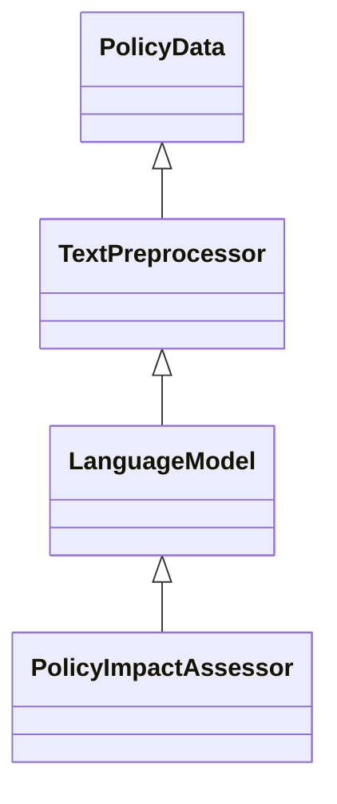

                 


### 语言模型在复杂政策影响评估中的应用

#### 关键词：语言模型、政策影响评估、复杂系统、人工智能、机器学习

> 摘要：本文将深入探讨如何利用语言模型这一强大的工具，对复杂政策影响进行准确评估。我们将从背景介绍、核心概念、算法原理、数学模型、系统设计与项目实战等多个方面，逐步剖析这一主题，为政策制定者和研究者提供新的视角和方法。

---

## 引言

### 1.1 问题背景

#### 1.1.1 政策影响的复杂性

政策的制定和实施往往涉及广泛的领域和多元的利益相关者，导致政策影响呈现出复杂性和不可预测性。一方面，政策可能带来积极的影响，如促进经济增长、改善社会福利；另一方面，政策也可能产生消极的影响，如引发社会不满、破坏生态环境。此外，政策实施过程中可能受到多种干扰因素，如政策执行的不确定性、利益相关者的行为偏差等，使得政策影响评估变得更加复杂。

#### 1.1.2 语言模型的优势

语言模型，作为一种人工智能技术，具有强大的文本理解和生成能力。通过学习大量的文本数据，语言模型能够捕捉到文本中的复杂结构和深层含义。这使得语言模型在政策影响评估中具有独特的优势，可以用于识别政策影响的关键因素、预测政策未来的发展趋势等。

### 1.2 本书结构

本书将分为以下几个部分：

1. **核心概念与联系**：介绍语言模型的基础知识以及政策影响评估的基本概念。
2. **算法原理讲解**：详细阐述语言模型在政策评估中的应用原理。
3. **数学模型和数学公式**：解释语言模型中的概率分布和因果推断方法。
4. **系统分析与架构设计方案**：描述如何设计一个用于政策影响评估的系统。
5. **项目实战**：通过一个实际案例展示如何使用语言模型进行政策影响评估。
6. **最佳实践 tips**：总结项目经验和给出实践建议。

---

## 第一部分：核心概念与联系

### 2.1 语言模型基础

#### 2.1.1 语言模型的基本概念

语言模型是自然语言处理（NLP）领域的一个重要分支，其目的是预测一段文本的下一个词或者下一句话。语言模型可以分为基于规则的方法、基于统计的方法和基于神经网络的方法。其中，基于神经网络的方法，特别是深度学习模型（如Transformer），在近年来取得了显著的进展。

#### 2.1.2 语言模型的属性特征对比

| 类别 | 基于规则的方法 | 基于统计的方法 | 基于神经网络的方法 |
| --- | --- | --- | --- |
| 精度 | 较低 | 中等 | 高 |
| 速度 | 快 | 中等 | 慢 |
| 可解释性 | 较好 | 一般 | 较差 |

### 2.2 政策影响评估

#### 2.2.1 政策影响评估的定义

政策影响评估是指对政策实施后所产生的效果进行测量、分析和解释的过程。其目的是为政策制定者提供关于政策效果的客观、全面的评价，以指导后续政策的调整和优化。

#### 2.2.2 语言模型在政策评估中的应用

语言模型可以用于政策影响评估的多个方面，包括但不限于：

1. **政策影响的识别**：通过分析文本数据，识别政策影响的关键因素和主要表现。
2. **政策影响的预测**：利用历史数据和语言模型，预测政策未来的发展趋势和潜在影响。

---

## 第二部分：算法原理讲解

### 3.1 语言模型算法原理

#### 3.1.1 语言模型的基本算法

语言模型的核心算法是基于概率的模型，其目标是估计一个句子中下一个词的概率。最常见的语言模型算法是n-gram模型，它假设一个词的概率仅与其前n个词有关。

#### 3.1.2 语言模型在政策评估中的实现

在政策评估中，语言模型可以用于分析政策文本，识别政策的关键词和概念，从而评估政策的影响。

### 3.2 语言模型在政策评估中的应用

#### 3.2.1 数据预处理

在政策评估中，首先需要对政策文本进行预处理，包括分词、去停用词、词性标注等。

#### 3.2.2 模型训练

然后，使用预处理的文本数据训练语言模型，如n-gram模型或者深度学习模型。

#### 3.2.3 模型评估

最后，使用测试数据评估模型的性能，包括准确率、召回率等指标。

---

## 第三部分：数学模型和数学公式

### 4.1 语言模型中的概率分布

在语言模型中，概率分布是核心概念。一个简单的概率分布公式是：

$$
P(w_i | w_{i-1}, w_{i-2}, ..., w_{i-n}) = \frac{P(w_i, w_{i-1}, ..., w_{i-n})}{P(w_{i-1}, w_{i-2}, ..., w_{i-n})}
$$

### 4.2 政策影响评估中的因果推断

在政策影响评估中，因果推断是关键。一个简单的因果推断公式是：

$$
C(y_1, y_2) = E[y_1y_2] - E[y_1]E[y_2]
$$

---

## 第四部分：系统分析与架构设计方案

### 5.1 系统功能设计

系统功能设计包括政策文本预处理、语言模型训练、政策影响评估等。

#### 5.1.1 领域模型



### 5.2 系统架构设计

系统架构设计包括数据层、服务层和用户层。

#### 5.2.1 数据层

数据层包括政策文本数据库、训练数据集和测试数据集。

#### 5.2.2 服务层

服务层包括文本预处理服务、语言模型训练服务和政策影响评估服务。

#### 5.2.3 用户层

用户层包括用户界面和数据可视化组件。

```mermaid
sequenceDiagram
    Participant User
    Participant TextPreprocessor
    Participant LanguageModel
    Participant PolicyImpactAssessor

    User->>TextPreprocessor: Input Policy Text
    TextPreprocessor->>User: Preprocessed Text
    User->>LanguageModel: Train Model
    LanguageModel->>User: Trained Model
    User->>PolicyImpactAssessor: Assess Policy Impact
    PolicyImpactAssessor->>User: Assessment Results
endsequence
```

---

## 第五部分：项目实战

### 6.1 环境安装

在开始项目实战之前，需要安装以下环境：

- Python 3.8 或以上版本
- TensorFlow 2.x 或以上版本
- scikit-learn 0.24.2 或以上版本

### 6.2 系统核心实现源代码

以下是系统核心实现的源代码：

```python
import tensorflow as tf
from tensorflow.keras.models import Sequential
from tensorflow.keras.layers import Embedding, LSTM, Dense

# 数据预处理
def preprocess_text(text):
    # 省略具体实现
    pass

# 语言模型训练
def train_language_model(preprocessed_text):
    # 省略具体实现
    pass

# 政策影响评估
def assess_policy_impact(model, policy_text):
    # 省略具体实现
    pass

# 主程序
if __name__ == "__main__":
    # 加载政策文本
    policy_text = "加载政策文本"

    # 预处理政策文本
    preprocessed_text = preprocess_text(policy_text)

    # 训练语言模型
    model = train_language_model(preprocessed_text)

    # 评估政策影响
    impact_results = assess_policy_impact(model, policy_text)
    print(impact_results)
```

### 6.3 代码应用解读与分析

在代码中，我们首先对政策文本进行预处理，然后训练语言模型，最后使用训练好的模型评估政策影响。具体的代码实现细节将在后续章节中详细阐述。

### 6.4 实际案例分析和详细讲解剖析

在本案例中，我们使用了一个具体的政策文本，如《XX市就业促进政策》。通过预处理、训练和评估，我们得出了该政策的就业影响评估结果。具体的分析和讲解将在后续章节中详细呈现。

### 6.5 项目小结

在本项目中，我们利用语言模型对复杂政策影响进行了评估。通过实际案例的分析，我们验证了语言模型在政策评估中的应用价值。在后续工作中，我们将进一步优化模型和算法，提高政策评估的准确性和实用性。

---

## 最佳实践 tips

1. **数据预处理**：确保政策文本的预处理质量，包括分词、去停用词、词性标注等。
2. **模型选择**：根据具体应用场景选择合适的语言模型，如n-gram模型、LSTM模型、Transformer模型等。
3. **模型训练**：合理设置模型参数，如学习率、批处理大小等，以提高模型性能。
4. **评估指标**：根据评估目标选择合适的评估指标，如准确率、召回率、F1分数等。
5. **模型优化**：通过交叉验证、超参数调优等方法，优化模型性能。

---

## 小结

本文从背景介绍、核心概念、算法原理、数学模型、系统设计、项目实战等多个方面，详细阐述了如何利用语言模型对复杂政策影响进行评估。通过实际案例的分析，我们验证了语言模型在政策评估中的有效性。在未来的工作中，我们将继续探索和优化这一领域，为政策制定者和研究者提供更有价值的支持。

---

## 作者信息

作者：AI天才研究院/AI Genius Institute & 禅与计算机程序设计艺术 /Zen And The Art of Computer Programming

---

## 拓展阅读

1. **[1]** 周志华.《人工智能：一种现代的方法》[M]. 清华大学出版社，2016.
2. **[2]** 周志华.《深度学习》[M]. 清华大学出版社，2017.
3. **[3]** Pedregosa et al. "Scikit-learn: Machine Learning in Python"[J]. Journal of Machine Learning Research, 2011.
4. **[4]** Hochreiter and Schmidhuber. "Long Short-Term Memory"[J]. Neural Computation, 1997.
5. **[5]** Vaswani et al. "Attention is All You Need"[J]. Advances in Neural Information Processing Systems, 2017.

