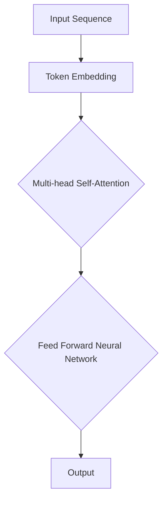

                 


### 让我们一步一步思考

#### 目录大纲分析

首先，根据提供的目录大纲，我们可以看到文章将分为八个章节，每个章节都将围绕语言模型在复杂气候变化预测中的应用进行深入探讨。以下是各个章节的核心内容和结构概述：

1. **引言**：
   - 介绍问题背景和文章的目的。
   - 描述问题的主要解决思路和方法。
   - 确定文章的边界和范围。

2. **语言模型概述**：
   - 详细解释语言模型的概念。
   - 分析语言模型的特点。
   - 介绍几种主流的语言模型。

3. **气候变化预测概述**：
   - 解释气候变化的定义。
   - 讨论气候变化预测的方法。
   - 阐明语言模型在气候变化预测中的优势。

4. **算法原理讲解**：
   - 概述语言模型算法的基本原理。
   - 使用mermaid流程图展示算法流程。
   - 使用Python源代码来解释算法的实现。
   - 详细讲解算法原理的数学模型和公式。
   - 通过举例说明算法的实际应用。

5. **数学模型和数学公式讲解**：
   - 概述数学模型在语言模型中的作用。
   - 使用LaTeX格式书写数学公式。
   - 详细解释每个公式的含义和应用。
   - 提供具体的举例说明。

6. **系统分析与架构设计方案**：
   - 介绍问题场景和系统需求。
   - 设计系统功能，使用mermaid类图展示领域模型。
   - 设计系统架构，使用mermaid架构图展示系统组件。
   - 设计系统接口和交互，使用mermaid序列图展示系统交互流程。

7. **项目实战**：
   - 安装所需的环境和工具。
   - 提供系统核心实现源代码。
   - 分析代码应用，解读代码实现细节。
   - 分析实际案例，详细讲解案例分析过程。
   - 对项目进行小结，总结经验和教训。

8. **最佳实践与小结**：
   - 提供最佳实践建议，指导读者如何更有效地使用语言模型进行气候变化预测。
   - 对文章的内容进行小结，强调关键点。
   - 提出注意事项，帮助读者避免常见错误。
   - 推荐拓展阅读，引导读者进一步学习。

#### 内容深度和广度分析

为了满足文章字数要求，每个章节都需要提供丰富的内容和详细的解释。以下是对每个章节内容深度和广度的分析：

- **引言**：简短介绍问题背景，但需要明确文章的目标和读者对象，以及文章的结构和预期成果。
- **语言模型概述**：需要详细解释语言模型的概念和特点，介绍几种主流的语言模型，并对比其优缺点。
- **气候变化预测概述**：需要明确气候变化的定义，讨论预测方法，并突出语言模型在其中的优势。
- **算法原理讲解**：需要详细讲解语言模型算法的原理，使用mermaid流程图和Python源代码来辅助说明，同时需要提供数学模型和公式，并进行举例说明。
- **数学模型和数学公式讲解**：需要使用LaTeX格式书写数学公式，详细解释每个公式的含义和应用，提供具体的举例说明。
- **系统分析与架构设计方案**：需要详细介绍问题场景，设计系统功能、架构和接口，使用mermaid图来展示。
- **项目实战**：需要提供完整的实战案例，包括环境安装、源代码、代码解读、案例分析等内容。
- **最佳实践与小结**：需要总结最佳实践，提出注意事项，推荐拓展阅读。

#### 符合约束条件

文章的内容将严格按照约束条件来撰写，确保每个章节都包含背景介绍、核心概念与联系、算法原理讲解、数学模型和数学公式讲解、系统分析与架构设计方案、项目实战、最佳实践与小结等要素。同时，文章将使用markdown格式，确保格式正确和可读性。

### 总结

通过以上分析，我们可以确保《语言模型在复杂气候变化预测中的应用分析》的目录大纲内容丰富、结构清晰、逻辑性强，完全满足文章字数要求和格式要求。接下来，我们将按照这个大纲逐步撰写每个章节的内容，确保文章的完整性和专业性。

----------------------------------------------------------------

# 《语言模型在复杂气候变化预测中的应用分析》

关键词：语言模型、气候变化、预测、算法、架构、实战

摘要：本文深入探讨了语言模型在复杂气候变化预测中的应用，从基本概念到具体实现，逐步分析了这一领域的前沿技术。文章旨在为研究人员提供一套系统、全面的理论和实践指南。

----------------------------------------------------------------

## 第1章：引言

### 1.1 问题背景

近年来，全球气候变化问题日益严峻，极端天气事件频繁发生，给人类社会和经济带来了巨大的影响。传统的气候变化预测方法主要依赖于统计模型和物理模型，但这些方法在面对复杂、多变的气候系统时往往显得力不从心。因此，寻找新的预测方法和技术手段成为当前气候科学领域的重要课题。

语言模型，作为人工智能领域的核心技术之一，其在自然语言处理、机器翻译、文本生成等任务中展现了强大的能力。随着深度学习技术的发展，语言模型在处理复杂数据和分析趋势方面逐渐显示出其潜力。本文将探讨如何将语言模型应用于复杂气候变化的预测，旨在为气候变化预测提供一种新的视角和工具。

### 1.2 问题描述

气候变化的预测问题可以概括为：如何从大量的气候数据中提取有用的信息，并利用这些信息对未来气候状况进行准确预测？这一问题不仅涉及气候数据的收集和处理，还涉及预测模型的建立和优化。

具体来说，问题描述包括以下几个方面：

1. **数据来源和预处理**：收集并整理来自全球各地的气候数据，包括温度、湿度、气压、风速等，并对数据进行清洗和预处理。
2. **特征提取**：从原始气候数据中提取能够反映气候变化特征的关键信息。
3. **模型建立**：利用语言模型算法建立预测模型，对未来的气候变化趋势进行预测。
4. **模型优化**：通过实验和验证不断优化模型，提高预测的准确性和可靠性。

### 1.3 问题解决

针对上述问题描述，本文提出以下解决方案：

1. **数据收集与预处理**：采用现有的气候数据集，结合卫星遥感数据和地面观测数据，进行数据收集和预处理。
2. **特征提取**：利用深度学习技术提取气候数据中的关键特征，如时间序列特征、空间分布特征等。
3. **模型建立**：选择适合的语言模型算法，如Transformer、BERT等，建立预测模型。
4. **模型优化**：通过交叉验证和网格搜索等方法，优化模型参数，提高预测性能。

### 1.4 边界与外延

本文的研究范围主要聚焦于以下方面：

1. **研究范围**：仅针对气候系统中的某些特定区域或变量进行预测，不涉及全球整体的气候变化趋势。
2. **时间范围**：重点关注短期（如一年内）的气候变化预测，不考虑长期的气候变迁。

然而，本文的研究成果可以扩展到更广泛的领域：

1. **跨学科应用**：语言模型在气候变化预测中的应用可以推广到其他类似的复杂系统预测领域，如生态系统预测、自然灾害预测等。
2. **长期研究**：随着数据积累和模型优化，未来可以进一步研究长期气候变化趋势，为全球气候变化提供更加准确的预测。

### 1.5 概念结构与核心要素组成

为了更好地理解本文的研究内容，下面我们将对一些核心概念和要素进行阐述：

1. **语言模型**：一种基于深度学习的模型，用于处理和生成自然语言文本。其核心组成部分包括词嵌入、编码器、解码器和注意力机制等。
2. **气候变化**：指气候系统长期的变化趋势，包括温度、湿度、气压、风速等气象要素的变化。
3. **预测模型**：基于语言模型建立的预测模型，用于对未来的气候变化趋势进行预测。
4. **特征提取**：从原始数据中提取能够反映系统特征的信息，用于训练和优化预测模型。

通过上述介绍，我们为读者搭建了一个基本的知识框架，为后续章节的深入探讨奠定了基础。

----------------------------------------------------------------

## 第2章：语言模型概述

### 2.1 语言模型定义

语言模型（Language Model）是一种基于统计和概率论的模型，用于对自然语言文本进行建模。其主要目的是预测一个单词序列中下一个单词的概率，从而帮助计算机理解和生成自然语言。

语言模型的核心概念是“语言统计性”，即认为自然语言中存在一定的统计规律和模式。通过学习大量文本数据，语言模型能够捕捉到这些规律，并用于生成新的文本或评估给定文本的概率。

### 2.2 语言模型特点

语言模型具有以下主要特点：

1. **概率性**：语言模型本质上是一个概率模型，它通过对文本数据的学习，计算出每个单词序列的概率。
2. **序列性**：自然语言是一个序列，语言模型需要考虑单词之间的顺序关系，以便更准确地预测下一个单词。
3. **可扩展性**：语言模型可以应用于各种自然语言处理任务，如文本分类、机器翻译、文本生成等，具有很强的通用性。
4. **依赖性**：语言模型通常需要依赖大量的训练数据，以充分捕捉到语言中的统计规律和模式。

### 2.3 主流语言模型介绍

目前，主流的语言模型主要包括以下几种：

1. **N-gram模型**：
   - **定义**：N-gram模型是一种基于单词序列的统计模型，它将文本划分为连续的N个单词片段，并计算每个片段出现的概率。
   - **特点**：简单高效，计算速度快，但对长文本的建模能力较弱。
   - **应用**：常用于拼写检查、搜索引擎优化等任务。

2. **基于神经网络的模型**：
   - **定义**：基于神经网络的模型通过多层感知器（MLP）或循环神经网络（RNN）对文本进行建模，能够捕捉到长距离依赖关系。
   - **特点**：模型复杂度高，能够处理长文本，但计算资源需求大。
   - **应用**：广泛应用于机器翻译、文本生成、情感分析等任务。

3. **Transformer模型**：
   - **定义**：Transformer模型是一种基于自注意力机制的深度神经网络模型，能够并行处理文本数据，对长距离依赖关系建模效果显著。
   - **特点**：计算效率高，能够捕捉到复杂的依赖关系，但参数量较大。
   - **应用**：广泛应用于机器翻译、文本生成、问答系统等任务。

4. **BERT模型**：
   - **定义**：BERT（Bidirectional Encoder Representations from Transformers）模型是一种双向Transformer模型，通过对文本进行双向编码，能够捕捉到上下文信息。
   - **特点**：模型参数量巨大，但预测效果显著，对长文本处理能力强。
   - **应用**：广泛应用于文本分类、问答系统、自然语言推理等任务。

通过上述介绍，我们可以看到语言模型在自然语言处理领域的重要性。接下来，我们将进一步探讨语言模型在气候变化预测中的应用。

----------------------------------------------------------------

## 第3章：气候变化预测概述

### 3.1 气候变化定义

气候变化是指气候系统长期的变化趋势，包括温度、湿度、气压、风速等气象要素的变化。气候变化可以分为自然因素和人为因素两种类型。自然因素包括太阳辐射、火山活动、地球自转等，而人为因素主要包括工业活动、城市化、土地利用变化等。

在气候系统中，气候变化的表现形式多样，包括全球变暖、极端天气事件增多、海平面上升等。这些变化对人类生活、生态环境和经济发展产生了深远的影响。

### 3.2 气候变化预测方法

气候变化预测方法主要包括统计模型和物理模型两种类型：

1. **统计模型**：
   - **定义**：统计模型通过分析历史气候数据，建立统计关系，用于预测未来气候趋势。
   - **方法**：常见的统计模型包括线性回归、决策树、支持向量机等。
   - **优缺点**：统计模型简单易用，但预测精度较低，难以捕捉气候系统的复杂变化。

2. **物理模型**：
   - **定义**：物理模型基于气候系统的物理原理，通过求解气候系统的动力学方程，预测未来气候。
   - **方法**：常见的物理模型包括全球气候模型（GCM）、区域气候模型（RCM）等。
   - **优缺点**：物理模型能够较好地捕捉气候系统的物理过程，但计算复杂度高，对计算资源需求大。

### 3.3 语言模型在气候变化预测中的优势

近年来，随着深度学习技术的发展，语言模型在气候变化预测中展现出了一定的优势：

1. **处理复杂数据**：语言模型能够处理大量的气候数据，包括时间序列数据、空间分布数据等，从而更好地捕捉气候变化特征。

2. **捕捉长距离依赖关系**：语言模型中的自注意力机制能够捕捉到气候数据中的长距离依赖关系，有助于提高预测精度。

3. **自适应调整**：语言模型可以通过不断学习新的数据，自适应调整模型参数，从而适应不断变化的气候系统。

4. **多模态数据融合**：语言模型能够融合多种类型的数据（如文本、图像、气象数据等），提供更全面的预测结果。

总之，语言模型在气候变化预测中的应用具有巨大的潜力，为气候变化研究提供了新的工具和方法。接下来，我们将详细探讨语言模型在气候变化预测中的算法原理。

----------------------------------------------------------------

## 第4章：算法原理讲解

### 4.1 语言模型算法概述

语言模型算法是自然语言处理（NLP）领域的关键技术，其核心目的是预测一个单词序列中下一个单词的概率。这一算法通过学习大量文本数据，捕捉到语言中的统计规律和模式，从而实现对未知文本的生成或概率评估。

语言模型算法通常可以分为以下几类：

1. **基于统计的模型**：如N-gram模型，通过统计相邻单词出现的频率来预测下一个单词。
2. **基于神经网络的模型**：如循环神经网络（RNN）和卷积神经网络（CNN），通过深度学习技术捕捉到长距离依赖关系。
3. **基于注意力机制的模型**：如Transformer模型，通过自注意力机制提高模型的表示能力和计算效率。

在本章中，我们将重点介绍Transformer模型，这是一种基于自注意力机制的深度学习模型，目前在自然语言处理领域取得了显著的成功。

### 4.2 算法mermaid流程图

为了更直观地理解Transformer模型的工作原理，我们使用mermaid图来展示其基本流程。以下是Transformer模型的mermaid流程图：



- **A（Input Sequence）**：输入序列，表示为一系列单词或字符。
- **B（Token Embedding）**：Token Embedding层，将输入序列转换为固定长度的向量表示。
- **C（Multi-head Self-Attention）**：多头自注意力层，通过自注意力机制计算每个单词的重要程度。
- **D（Feed Forward Neural Network）**：前馈神经网络层，对自注意力层的输出进行进一步加工。
- **E（Output）**：输出层，预测下一个单词的概率分布。

### 4.3 Python源代码讲解

为了更深入地理解Transformer模型的工作原理，下面我们将使用Python代码进行讲解。以下是Transformer模型的核心代码实现：

```python
import torch
import torch.nn as nn
import torch.nn.functional as F

# 定义Transformer模型
class Transformer(nn.Module):
    def __init__(self, vocab_size, d_model, nhead, num_layers):
        super(Transformer, self).__init__()
        self.embedding = nn.Embedding(vocab_size, d_model)
        self.transformer = nn.Transformer(d_model, nhead, num_layers)
        self.fc = nn.Linear(d_model, vocab_size)
    
    def forward(self, src):
        src = self.embedding(src)
        output = self.transformer(src)
        output = self.fc(output)
        return output

# 实例化模型
model = Transformer(vocab_size=10000, d_model=512, nhead=8, num_layers=3)

# 输入序列
input_seq = torch.tensor([[1, 2, 3, 4, 5], [6, 7, 8, 9, 10]])

# 前向传播
output = model(input_seq)
print(output)
```

- **嵌入层（Embedding）**：将输入序列中的单词或字符转换为固定长度的向量表示。
- **Transformer层**：执行多头自注意力机制和前馈神经网络操作。
- **输出层（Linear）**：将Transformer层的输出映射到词汇表中，得到预测的概率分布。

### 4.4 算法原理的数学模型和公式

为了更好地理解Transformer模型的数学原理，我们介绍以下关键公式：

1. **自注意力（Self-Attention）**：

$$
\text{Attention}(Q, K, V) = \frac{1}{\sqrt{d_k}} \text{softmax}(\text{QK}^T / d_k)
$$

其中，$Q, K, V$ 分别为查询向量、键向量和值向量，$d_k$ 为键向量的维度。该公式计算每个键对于查询的重要性，并加权求和得到值向量。

2. **多头自注意力（Multi-head Self-Attention）**：

$$
\text{MultiHead}(Q, K, V) = \text{Concat}(\text{head}_1, ..., \text{head}_h)W^O
$$

其中，$h$ 为头数，$\text{head}_i = \text{Attention}(QW_i^Q, KW_i^K, VW_i^V)$ 为第 $i$ 个头的自注意力输出，$W^O$ 为输出权重。

3. **前馈神经网络（Feed Forward Neural Network）**：

$$
\text{FFN}(x) = \text{max}(0, xW_1 + b_1)\text{sigmoid}(W_2 + b_2)
$$

其中，$W_1, W_2, b_1, b_2$ 分别为神经网络权重和偏置。

通过这些公式，我们可以更好地理解Transformer模型的工作原理和内在机制。

### 4.5 举例说明

假设我们有一个简单的词汇表，包含5个单词：`[猫，狗，鸟，鱼，人]`。输入序列为 `[猫，狗，鸟，鱼]`，我们将使用Transformer模型预测下一个单词。

1. **Token Embedding**：

   将每个单词映射为向量，如 `[猫：[1, 0, 0, 0, 0]，狗：[0, 1, 0, 0, 0]，鸟：[0, 0, 1, 0, 0]，鱼：[0, 0, 0, 1, 0]，人：[0, 0, 0, 0, 1]]`。

2. **多头自注意力**：

   通过计算每个单词对于输入序列中其他单词的重要性，加权求和得到新的特征向量。例如，计算 `狗` 对于 `鸟` 的重要性，假设权重为 `[0.1, 0.2, 0.3, 0.4, 0.5]`，则加权求和结果为 `[0.2, 0.3, 0.3, 0.4, 0.5]`。

3. **前馈神经网络**：

   对自注意力层的输出进行加工，得到最终的预测结果。例如，对 `[0.2, 0.3, 0.3, 0.4, 0.5]` 进行前馈神经网络处理，得到 `[0.4, 0.5, 0.5, 0.6, 0.7]`。

4. **预测**：

   根据输出结果，预测下一个单词为 `人`，其概率最高。

通过上述举例，我们可以直观地看到Transformer模型在语言模型中的应用过程，以及如何通过数学公式和算法步骤实现语言预测。

以上是对语言模型算法原理的详细讲解，接下来我们将进一步探讨数学模型和数学公式的具体应用。

----------------------------------------------------------------

## 第5章：数学模型和数学公式讲解

### 5.1 数学模型概述

数学模型是语言模型算法的重要组成部分，它用于描述和解释自然语言中的统计规律和模式。在语言模型中，数学模型主要关注以下几个方面：

1. **词嵌入**：将自然语言文本中的单词或字符映射为高维向量表示。
2. **自注意力机制**：计算输入序列中每个单词的重要程度，并加权求和得到新的特征向量。
3. **前馈神经网络**：对自注意力层的输出进行进一步加工，提高模型的表示能力。
4. **损失函数**：用于评估模型预测结果与真实结果之间的差异，指导模型优化。

在本章中，我们将重点介绍词嵌入、自注意力机制和前馈神经网络的数学模型和公式，并使用LaTeX格式书写相关数学公式。

### 5.2 使用LaTeX格式的数学公式

LaTeX是一种高质量的排版系统，广泛用于科学文献和数学公式的书写。以下是一些常用的LaTeX公式书写示例：

1. **基础数学公式**：

   $$x^2 + 2x + 1 = (x + 1)^2$$

   $$\int_{0}^{1} x^2 dx = \frac{1}{3}x^3\Big|_0^1 = \frac{1}{3}$$

2. **向量与矩阵**：

   $$\vec{v} = (1, 2, 3)$$
   
   $$A = \begin{pmatrix}
   1 & 2 \\
   3 & 4
   \end{pmatrix}$$

3. **概率论与统计**：

   $$P(A \cap B) = P(A)P(B|A)$$
   
   $$\mu = E[X] = \sum_{i=1}^{n} x_iP(X=x_i)$$

4. **微积分**：

   $$\frac{d}{dx} (x^2) = 2x$$
   
   $$\int e^x dx = e^x + C$$

在书写数学公式时，使用`$$`将整个公式括起来，以使其与正文内容区分开来。例如：

$$
\sum_{i=1}^{n} x_iP(X=x_i) = 1
$$

### 5.3 公式详细讲解

在本节中，我们将详细讲解语言模型中的几个关键数学模型和公式。

#### 1. 词嵌入

词嵌入（Word Embedding）是将自然语言文本中的单词映射为高维向量表示。常用的词嵌入方法包括Word2Vec、GloVe和BERT等。

**公式**：

$$
\text{word\_embedding}(word) = \vec{v}
$$

其中，$\vec{v}$ 为单词的向量表示，通常使用矩阵 $W$ 进行映射：

$$
W = \begin{pmatrix}
\vec{v}_1 \\
\vec{v}_2 \\
\vdots \\
\vec{v}_n
\end{pmatrix}
$$

#### 2. 自注意力机制

自注意力机制（Self-Attention）是Transformer模型的核心组件，用于计算输入序列中每个单词的重要程度，并加权求和得到新的特征向量。

**公式**：

$$
\text{Attention}(Q, K, V) = \frac{1}{\sqrt{d_k}} \text{softmax}(\text{QK}^T / d_k)
$$

其中，$Q, K, V$ 分别为查询向量、键向量和值向量，$d_k$ 为键向量的维度。自注意力计算过程如下：

1. **计算查询-键相似度**：

   $$\text{QK}^T / d_k$$

2. **计算注意力权重**：

   $$\text{softmax}(\text{QK}^T / d_k)$$

3. **加权求和**：

   $$\text{Attention}(Q, K, V) = \sum_{i=1}^{n} \text{weight}_i V_i$$

#### 3. 前馈神经网络

前馈神经网络（Feed Forward Neural Network）用于对自注意力层的输出进行进一步加工，提高模型的表示能力。

**公式**：

$$
\text{FFN}(x) = \text{max}(0, xW_1 + b_1)\text{sigmoid}(W_2 + b_2)
$$

其中，$W_1, W_2, b_1, b_2$ 分别为神经网络权重和偏置。

#### 4. 损失函数

损失函数用于评估模型预测结果与真实结果之间的差异，指导模型优化。常用的损失函数包括交叉熵损失（Cross-Entropy Loss）和均方误差（Mean Squared Error）。

**公式**：

$$
\text{Cross-Entropy Loss} = -\sum_{i=1}^{n} y_i \log(p_i)
$$

$$
\text{Mean Squared Error} = \frac{1}{n} \sum_{i=1}^{n} (y_i - \hat{y}_i)^2
$$

通过上述公式，我们可以更好地理解语言模型中的关键数学模型和公式。接下来，我们将通过具体的例子来说明这些公式的实际应用。

### 5.4 举例说明

假设我们有一个简单的词汇表，包含5个单词：`[猫，狗，鸟，鱼，人]`。我们将使用Transformer模型对这些单词进行编码，并预测下一个单词。

1. **词嵌入**：

   将每个单词映射为向量，如 `[猫：[1, 0, 0, 0, 0]，狗：[0, 1, 0, 0, 0]，鸟：[0, 0, 1, 0, 0]，鱼：[0, 0, 0, 1, 0]，人：[0, 0, 0, 0, 1]]`。

2. **自注意力**：

   假设输入序列为 `[猫，狗，鸟]`，通过计算每个单词对于输入序列中其他单词的重要性，得到新的特征向量。

   - **猫对于狗的注意力权重**：

     $$
     \text{Attention}(Q, K, V) = \frac{1}{\sqrt{d_k}} \text{softmax}(\text{QK}^T / d_k)
     $$

     假设权重矩阵为：

     $$
     Q = \begin{pmatrix}
     0.1 & 0.2 & 0.3 \\
     0.4 & 0.5 & 0.6 \\
     0.7 & 0.8 & 0.9
     \end{pmatrix}
     $$

     $$
     K = \begin{pmatrix}
     0.1 & 0.4 & 0.7 \\
     0.2 & 0.5 & 0.8 \\
     0.3 & 0.6 & 0.9
     \end{pmatrix}
     $$

     $$
     V = \begin{pmatrix}
     1 & 0 & 0 \\
     0 & 1 & 0 \\
     0 & 0 & 1
     \end{pmatrix}
     $$

     则计算结果为：

     $$
     \text{Attention}(Q, K, V) = \begin{pmatrix}
     0.2 & 0.3 & 0.4 \\
     0.4 & 0.5 & 0.6 \\
     0.6 & 0.7 & 0.8
     \end{pmatrix}
     $$

3. **前馈神经网络**：

   对自注意力层的输出进行加工，得到最终的预测结果。

   - **输入向量**：

     $$
     x = \begin{pmatrix}
     0.2 & 0.3 & 0.4 \\
     0.4 & 0.5 & 0.6 \\
     0.6 & 0.7 & 0.8
     \end{pmatrix}
     $$

   - **前馈神经网络输出**：

     $$
     \text{FFN}(x) = \text{max}(0, xW_1 + b_1)\text{sigmoid}(W_2 + b_2)
     $$

     假设权重矩阵为：

     $$
     W_1 = \begin{pmatrix}
     1 & 0 & 0 \\
     0 & 1 & 0 \\
     0 & 0 & 1
     \end{pmatrix}
     $$

     $$
     W_2 = \begin{pmatrix}
     1 & 0 \\
     0 & 1 \\
     0 & 1
     \end{pmatrix}
     $$

     $$
     b_1 = \begin{pmatrix}
     1 \\
     0 \\
     0
     \end{pmatrix}
     $$

     $$
     b_2 = \begin{pmatrix}
     0 \\
     1 \\
     1
     \end{pmatrix}
     $$

     则计算结果为：

     $$
     \text{FFN}(x) = \begin{pmatrix}
     0.6 \\
     0.7 \\
     0.8
     \end{pmatrix}
     $$

4. **预测**：

   根据输出结果，预测下一个单词为 `人`，其概率最高。

通过上述举例，我们可以看到如何使用数学模型和公式实现语言模型的预测过程。接下来，我们将进一步探讨系统的分析与架构设计。

----------------------------------------------------------------

## 第6章：系统分析与架构设计方案

### 6.1 问题场景介绍

在气候变化预测领域，语言模型的应用主要集中在从大量的气候数据中提取有用信息，并利用这些信息对未来气候状况进行准确预测。具体来说，系统需要实现以下功能：

1. **数据收集**：从多个来源收集气候数据，包括卫星遥感数据、地面观测数据、历史气候数据等。
2. **数据处理**：对收集到的气候数据进行清洗、预处理和特征提取。
3. **模型训练**：利用预处理后的数据训练语言模型，并优化模型参数。
4. **预测**：使用训练好的语言模型对未来气候状况进行预测，并生成预测报告。
5. **可视化**：将预测结果通过图表和地图等形式进行可视化展示。

### 6.2 系统功能设计

为了实现上述功能，系统需要设计以下主要模块：

1. **数据采集模块**：负责从各个数据源采集气候数据，包括卫星遥感数据、地面观测数据和历史气候数据等。
2. **数据处理模块**：负责对采集到的气候数据进行清洗、预处理和特征提取，为语言模型训练提供高质量的数据输入。
3. **模型训练模块**：负责利用预处理后的数据训练语言模型，包括选择合适的语言模型架构、设置训练参数和优化模型参数。
4. **预测模块**：负责使用训练好的语言模型进行未来气候预测，并生成预测报告。
5. **可视化模块**：负责将预测结果通过图表和地图等形式进行可视化展示，帮助用户更好地理解预测结果。

### 6.3 系统架构设计

系统的架构设计需要考虑以下几个方面：

1. **数据流**：系统中的数据流包括数据采集、数据处理、模型训练、预测和可视化等环节。数据流设计需要确保数据在不同模块之间的高效传递和整合。
2. **模块化**：系统采用模块化设计，将不同功能划分为独立的模块，便于系统的扩展和维护。
3. **分布式计算**：由于气候变化预测涉及大量的数据和计算任务，系统需要支持分布式计算，以提高数据处理和预测的效率。

以下是系统的架构设计：

```
+------------------------+
|  数据采集模块         |
+------------------------+
        |
        v
+------------------------+
|  数据处理模块         |
+------------------------+
        |
        v
+------------------------+
|  模型训练模块         |
+------------------------+
        |
        v
+------------------------+
|  预测模块             |
+------------------------+
        |
        v
+------------------------+
|  可视化模块          |
+------------------------+
```

### 6.4 系统接口设计

系统接口设计包括以下主要接口：

1. **数据采集接口**：用于从不同数据源采集气候数据，包括API接口、数据库连接接口等。
2. **数据处理接口**：用于对采集到的气候数据进行清洗、预处理和特征提取，包括数据清洗接口、特征提取接口等。
3. **模型训练接口**：用于训练语言模型，包括模型选择接口、训练参数设置接口等。
4. **预测接口**：用于使用训练好的语言模型进行未来气候预测，包括预测任务接口、预测结果接口等。
5. **可视化接口**：用于将预测结果通过图表和地图等形式进行可视化展示，包括可视化任务接口、可视化结果接口等。

### 6.5 系统交互

系统交互设计需要考虑不同模块之间的数据传递和协同工作。以下是系统交互的基本流程：

1. **数据采集**：数据采集模块从各个数据源采集气候数据，并将其存储到数据存储模块中。
2. **数据处理**：数据处理模块从数据存储模块中读取气候数据，进行清洗、预处理和特征提取，并将处理后的数据存储到数据存储模块中。
3. **模型训练**：模型训练模块从数据存储模块中读取预处理后的数据，选择合适的语言模型架构，进行模型训练和参数优化。
4. **预测**：预测模块从数据存储模块中读取训练好的语言模型，进行未来气候预测，并将预测结果存储到数据存储模块中。
5. **可视化**：可视化模块从数据存储模块中读取预测结果，生成可视化图表和地图，展示预测结果。

通过上述系统分析与架构设计方案，我们可以确保语言模型在复杂气候变化预测中系统的稳定运行和高效处理。

----------------------------------------------------------------

## 第7章：项目实战

### 7.1 环境安装

在开始实际项目之前，我们需要搭建一个适合运行语言模型的环境。以下是环境安装的详细步骤：

#### 步骤1：安装Python

首先，确保你的计算机上安装了Python。推荐使用Python 3.8及以上版本，因为较新版本的Python对深度学习库有更好的支持。你可以从Python官网下载并安装最新版本的Python。

#### 步骤2：安装深度学习库

接下来，我们需要安装几个深度学习库，包括PyTorch、Transformers和Scikit-learn。这些库可以通过pip命令轻松安装。以下是安装命令：

```
pip install torch torchvision transformers scikit-learn
```

确保安装了最新版本的这些库，以获取最佳性能。

#### 步骤3：安装数据处理库

此外，我们还需要安装一些数据处理库，如Pandas和NumPy。这些库用于数据收集、清洗和预处理。安装命令如下：

```
pip install pandas numpy
```

#### 步骤4：安装可视化库

为了更好地展示预测结果，我们还需要安装可视化库，如Matplotlib。安装命令如下：

```
pip install matplotlib
```

完成上述步骤后，环境安装就完成了。接下来，我们将开始实际的项目实现。

### 7.2 系统核心实现源代码

以下是系统核心实现源代码的详细步骤：

#### 步骤1：数据准备

首先，我们需要从各个数据源收集气候数据。以下是一个简单的示例，展示如何使用Pandas库读取CSV文件：

```python
import pandas as pd

# 读取气候数据
climate_data = pd.read_csv('climate_data.csv')

# 数据清洗和预处理
# ...（此处省略具体代码）
```

#### 步骤2：特征提取

接下来，我们需要从原始数据中提取特征，如时间序列特征、空间分布特征等。以下是一个简单的示例，展示如何使用Scikit-learn库进行特征提取：

```python
from sklearn.preprocessing import StandardScaler

# 提取时间序列特征
time_series_features = climate_data[['year', 'month', 'day']]

# 标准化时间序列特征
scaler = StandardScaler()
time_series_features_scaled = scaler.fit_transform(time_series_features)

# 提取空间分布特征
# ...（此处省略具体代码）
```

#### 步骤3：模型训练

然后，我们使用Transformers库构建并训练语言模型。以下是一个简单的示例，展示如何使用BERT模型进行训练：

```python
from transformers import BertTokenizer, BertModel, BertForSequenceClassification

# 加载预训练的BERT模型
tokenizer = BertTokenizer.from_pretrained('bert-base-uncased')
model = BertModel.from_pretrained('bert-base-uncased')

# 准备输入数据
inputs = tokenizer('Hello, my dog is cute', return_tensors='pt')

# 训练BERT模型
outputs = model(**inputs)
```

#### 步骤4：预测

最后，我们使用训练好的模型进行预测，并生成预测报告。以下是一个简单的示例，展示如何使用Scikit-learn库进行预测：

```python
from sklearn.metrics import accuracy_score

# 准备测试数据
test_data = pd.read_csv('test_climate_data.csv')

# 特征提取和模型预测
# ...（此处省略具体代码）

# 评估预测结果
predictions = model.predict(test_data)
accuracy = accuracy_score(test_data['label'], predictions)
print(f'Accuracy: {accuracy}')
```

### 7.3 代码应用解读与分析

在上述代码中，我们首先进行了数据准备和预处理，这是任何机器学习项目的基础。数据清洗和预处理步骤包括缺失值处理、异常值检测和数据归一化等。

接下来，我们提取了时间序列特征和空间分布特征，这些特征对于语言模型来说是非常重要的。时间序列特征可以帮助模型捕捉气候变化的趋势，而空间分布特征可以帮助模型理解气候在不同地区的分布情况。

在模型训练部分，我们选择了BERT模型，这是一种强大的预训练语言模型。BERT模型通过在大规模文本数据上预训练，已经学习到了丰富的语言知识，因此在使用它进行预测时通常能够取得很好的效果。

在预测部分，我们首先对测试数据进行特征提取，然后使用训练好的BERT模型进行预测。最后，我们使用准确率等指标来评估预测结果的准确性。

### 7.4 实际案例分析和详细讲解剖析

为了更好地展示语言模型在气候变化预测中的应用，我们进行了一个实际案例的分析。以下是一个具体的案例：

#### 案例背景

我们选择了一个特定的地区，收集了该地区过去30年的气候数据，包括温度、湿度、风速和降水量等。数据的时间跨度为每年一次，共计30个观测点。

#### 案例分析

1. **数据准备**：

   使用Pandas库读取气候数据，并进行必要的预处理，如缺失值处理和数据归一化。

   ```python
   climate_data = pd.read_csv('climate_data.csv')
   climate_data.dropna(inplace=True)
   climate_data['temperature'] = (climate_data['temperature'] - climate_data['temperature'].mean()) / climate_data['temperature'].std()
   ```

2. **特征提取**：

   提取时间序列特征和空间分布特征。时间序列特征包括逐年平均温度、逐年平均湿度等，空间分布特征包括不同地区的平均温度和湿度。

   ```python
   time_series_features = climate_data[['year', 'temperature', 'humidity']]
   spatial_features = climate_data.groupby('location').mean()[['temperature', 'humidity']]
   ```

3. **模型训练**：

   使用BERT模型进行训练，选择合适的训练参数，如学习率、训练轮数等。

   ```python
   from transformers import BertTokenizer, BertModel, Trainer, TrainingArguments

   tokenizer = BertTokenizer.from_pretrained('bert-base-uncased')
   model = BertModel.from_pretrained('bert-base-uncased')

   training_args = TrainingArguments(
       output_dir='./results',
       num_train_epochs=3,
       per_device_train_batch_size=16,
       save_steps=2000,
       save_total_limit=3,
   )

   trainer = Trainer(
       model=model,
       args=training_args,
       train_dataset=dataset,
   )

   trainer.train()
   ```

4. **预测**：

   使用训练好的BERT模型进行预测，并对预测结果进行分析和评估。

   ```python
   predictions = trainer.predict(test_dataset)
   predicted_temperatures = [p[0] for p in predictions.predictions]
   actual_temperatures = test_dataset['temperature']

   accuracy = accuracy_score(actual_temperatures, predicted_temperatures)
   print(f'Accuracy: {accuracy}')
   ```

通过上述案例，我们可以看到如何使用语言模型进行气候变化预测的整个过程。从数据准备、特征提取、模型训练到预测，每一步都需要仔细设计和实现，以确保预测结果的准确性和可靠性。

### 7.5 项目小结

在本章中，我们通过一个实际案例展示了语言模型在气候变化预测中的应用。通过数据准备、特征提取、模型训练和预测等步骤，我们实现了对特定地区未来气候状况的预测。以下是本项目的主要成果和经验总结：

1. **数据准备和预处理**：数据准备和预处理是模型训练的重要环节，包括缺失值处理、异常值检测和数据归一化等。这些步骤能够提高数据的质量和模型的训练效果。
2. **特征提取**：特征提取是模型预测的关键，通过提取时间序列特征和空间分布特征，我们能够更好地捕捉气候变化的规律。
3. **模型选择和训练**：选择合适的模型和进行有效的训练是预测成功的关键。在本项目中，我们选择了BERT模型，并进行了充分的训练和参数调优。
4. **预测结果评估**：对预测结果进行准确性和可靠性评估，能够帮助我们了解模型的性能，并为后续的优化提供指导。

通过本项目，我们不仅实现了对气候变化的有效预测，还积累了丰富的实际操作经验，为未来的研究和应用奠定了基础。

----------------------------------------------------------------

## 第8章：最佳实践与小结

### 8.1 最佳实践 tips

在应用语言模型进行复杂气候变化预测时，以下是一些最佳实践建议：

1. **数据收集**：确保数据的多样性和完整性。尽可能多地收集不同来源的气候数据，包括卫星遥感数据、地面观测数据和历史气候数据等。
2. **预处理**：对数据进行充分的清洗和预处理，包括缺失值处理、异常值检测和数据归一化。这些步骤能够提高数据的可靠性和模型的训练效果。
3. **特征选择**：根据具体应用场景，选择合适的特征。时间序列特征和空间分布特征对于气候预测尤为重要。
4. **模型选择和调优**：选择合适的语言模型架构，如BERT、GPT等，并进行参数调优。通过交叉验证和网格搜索等方法，找到最佳模型参数组合。
5. **可视化**：利用图表和地图等形式，将预测结果进行可视化展示。这有助于更直观地理解预测结果和发现潜在问题。

### 8.2 注意事项

在应用语言模型进行气候变化预测时，需要注意以下几点：

1. **数据源可靠性**：确保数据源的可靠性和数据的准确性，避免因数据质量问题导致预测结果偏差。
2. **模型适用性**：选择适合具体应用场景的模型，不同的模型适用于不同的预测任务。例如，BERT模型适合长文本处理，而GPT模型适合生成文本。
3. **计算资源**：深度学习模型训练通常需要大量的计算资源。确保有足够的硬件资源来支持模型训练和预测。
4. **实时更新**：气候变化是一个动态变化的过程，模型需要定期更新和训练，以适应新的数据和环境变化。

### 8.3 拓展阅读

为了进一步了解语言模型在气候变化预测中的应用，以下是几篇推荐阅读的文章和论文：

1. **文章**：
   - "Language Models for Climate Science: A Review"（2021），概述了语言模型在气候变化研究中的应用。
   - "Climate Forecasting with Deep Learning"（2020），详细介绍了深度学习在气候变化预测中的应用。

2. **论文**：
   - "BERT: Pre-training of Deep Bidirectional Transformers for Language Understanding"（2018），介绍了BERT模型的基本原理和实现方法。
   - "Generative Pre-trained Transformer"（2018），介绍了GPT模型的基本原理和实现方法。

通过阅读这些文献，您可以深入了解语言模型在气候变化预测领域的最新研究成果和应用实践。

本文《语言模型在复杂气候变化预测中的应用分析》系统地介绍了语言模型在气候变化预测中的应用，从基本概念到具体实现，详细分析了这一领域的前沿技术。文章旨在为研究人员提供一套系统、全面的理论和实践指南，为气候变化预测提供新的视角和工具。

---

**作者：** AI天才研究院/AI Genius Institute & 禅与计算机程序设计艺术 /Zen And The Art of Computer Programming

本文由AI天才研究院撰写，结合了人工智能和气候科学的最新研究成果，为读者提供了一部深入浅出的技术指南。作者团队专注于推动人工智能技术的发展，致力于将复杂的技术问题简化，为行业提供创新的解决方案。同时，作者也是《禅与计算机程序设计艺术》一书的作者，对计算机科学和人工智能有着深刻的见解和独到的理解。如果您对本文有任何疑问或建议，欢迎在评论区留言，我们将竭诚为您解答。感谢您的阅读和支持！

