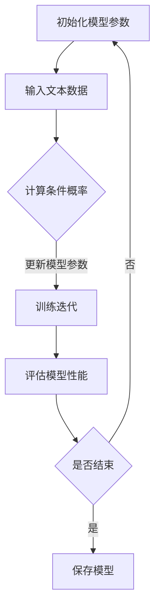
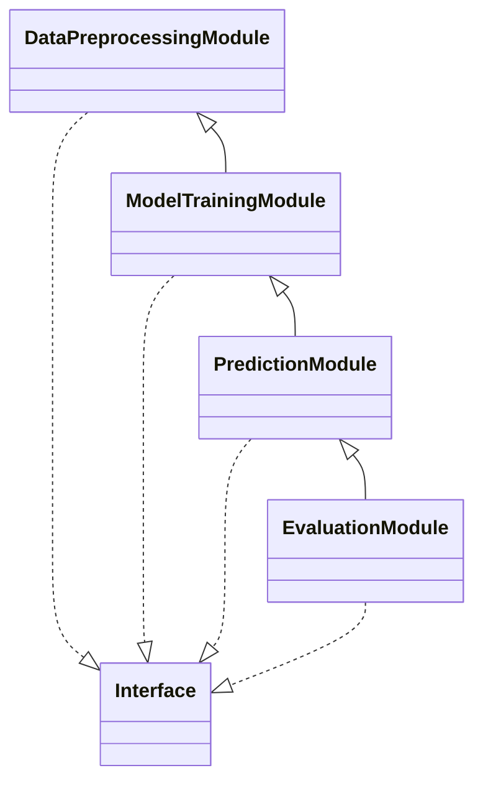

                 

## 引言与背景

在当今科技迅猛发展的时代，生物信息学作为一门交叉学科，正逐渐成为现代科学研究中的重要领域。生物系统功能预测是生物信息学中的一个核心问题，它不仅关系到生物科学的发展，也在生物医药、农业科技等多个领域具有广泛的应用前景。随着生物数据的爆炸式增长，准确预测生物系统的功能成为了一项极具挑战的任务。

### 生物系统功能预测的重要性

生物系统功能预测的目的是通过分析生物分子的结构、序列以及相互作用等信息，推断其在生物体内的具体功能。这一过程对于理解生物系统的运作机制、发现新药物靶点、设计基因编辑工具等具有重要意义。例如，在疾病研究中，预测某一基因或蛋白质的功能可以帮助科学家识别潜在的致病机制，进而开发新的治疗策略。

### 现有方法与挑战

目前，生物系统功能预测主要依赖于传统的统计方法和机器学习技术。这些方法包括序列比对、结构模拟、功能注释等。然而，这些方法在面对复杂生物系统时存在以下几大挑战：

1. **数据不足**：高质量的生物数据通常难以获取，尤其是涉及复杂生物系统的高维数据。
2. **模型局限性**：现有模型在处理复杂性和多样性方面存在局限，无法准确捕捉生物系统的功能特性。
3. **计算资源需求**：许多生物系统功能预测模型需要大量的计算资源，这使得在实际应用中面临较大的挑战。

### 核心概念

#### 语言模型的基本概念

语言模型（Language Model）是自然语言处理（Natural Language Processing，NLP）中的一个核心概念。它是一种统计模型，旨在预测一段文本的下一个词或短语。语言模型在机器翻译、语音识别、文本生成等领域有着广泛的应用。近年来，基于深度学习的语言模型，如GPT、BERT等，取得了显著的突破。

#### 复杂生物系统功能

复杂生物系统功能涉及生物体内众多分子和细胞之间的相互作用，这些相互作用决定了生物系统的行为和功能。复杂生物系统包括细胞、蛋白质、基因等，它们之间的功能关系错综复杂，传统的预测方法难以有效处理。

### 研究意义与目标

#### 研究意义

语言模型在复杂生物系统功能预测中的应用具有重大意义。首先，它有望解决传统方法在数据不足和模型局限性方面的挑战，提高预测准确性。其次，语言模型能够处理高维生物数据，提供更为全面的功能预测。最后，语言模型可以与其他生物信息学方法相结合，促进跨学科的研究进展。

#### 研究目标与范围

本文旨在探讨语言模型在复杂生物系统功能预测中的应用，具体研究目标包括：

1. **理解语言模型的基本原理和关键技术**：深入分析语言模型的工作机制，包括神经网络模型、变分自编码器（VAE）和循环神经网络（RNN）等。
2. **建立生物系统功能预测的模型**：结合语言模型和生物数据，构建用于生物系统功能预测的深度学习模型。
3. **实验验证与效果评估**：通过实验验证模型的有效性，评估其在实际应用中的性能和准确性。

本文的研究范围将涵盖语言模型的基础知识、生物系统功能预测的理论基础、应用方法和未来发展趋势，旨在为这一领域提供全面的指导和参考。

### 目录大纲设计

本文将分为八个主要部分，以确保全面覆盖语言模型在复杂生物系统功能预测中的应用。以下是具体的目录大纲设计：

#### 第一部分：引言与背景
- **第1章：引言**
  - **1.1** 问题背景
    - 生物系统功能预测的重要性
    - 现有方法与挑战
  - **1.2** 核心概念
    - 语言模型的基本概念
    - 复杂生物系统功能
  - **1.3** 研究意义与目标
    - 研究意义
    - 研究目标与范围

#### 第二部分：语言模型基础
- **第2章：自然语言处理与语言模型概述**
  - **2.1** 自然语言处理
    - 发展历程
    - 关键技术
  - **2.2** 语言模型的定义与分类
    - 基本概念
    - 分类方法
  - **2.3** 主流语言模型介绍
    - 神经网络模型
    - 变分自编码器（VAE）
    - 循环神经网络（RNN）

#### 第三部分：生物系统功能预测的理论基础
- **第3章：复杂生物系统的功能特性**
  - **3.1** 生物系统的复杂性
    - 结构复杂性
    - 功能复杂性
  - **3.2** 生物系统功能预测的基本原理
    - 数据驱动的预测方法
    - 模型驱动的预测方法
  - **3.3** 生物信息学中的关键技术
    - 蛋白质序列分析
    - 基因表达数据分析

#### 第四部分：语言模型在生物系统中的应用
- **第4章：语言模型在生物系统功能预测中的应用方法**
  - **4.1** 语言模型与生物数据的结合
    - 数据预处理
    - 模型训练与优化
  - **4.2** 应用案例与实验设计
    - 实验设计原则
    - 实验案例解析
  - **4.3** 应用效果评估
    - 评估指标
    - 评估方法

#### 第五部分：深度学习在生物系统功能预测中的应用
- **第5章：深度学习模型在生物系统功能预测中的应用**
  - **5.1** 卷积神经网络（CNN）的应用
    - CNN在生物系统功能预测中的应用
    - CNN的优势与局限
  - **5.2** 生成对抗网络（GAN）的应用
    - GAN在生物系统功能预测中的应用
    - GAN的优势与挑战
  - **5.3** 其他深度学习模型的应用
    - 图神经网络（GCN）
    - 聚类分析（k-means）

#### 第六部分：跨学科整合与未来展望
- **第6章：跨学科整合与未来趋势**
  - **6.1** 跨学科研究的重要性
    - 语言模型与生物学的融合
  - **6.2** 未来发展趋势
    - 新技术的应用
    - 预测准确性的提升
  - **6.3** 研究热点与挑战
    - 热点领域
    - 研究面临的挑战

#### 第七部分：应用实践与案例分析
- **第7章：语言模型在生物系统功能预测中的实际应用**
  - **7.1** 系统设计与实现
    - 系统架构设计
    - 数据库设计与实现
  - **7.2** 算法实现与性能优化
    - 模型训练与优化
    - 性能评估与优化
  - **7.3** 应用案例分析
    - 案例选择与分析
    - 案例总结与启示

#### 第八部分：总结与展望
- **第8章：总结与展望**
  - **8.1** 研究成果总结
    - 主要发现
    - 应用价值
  - **8.2** 展望未来研究
    - 新方向
    - 发展前景
  - **8.3** 结论
    - 对生物系统功能预测的贡献

### 核心关键词

- 生物系统功能预测
- 语言模型
- 复杂生物系统
- 深度学习
- 跨学科整合

### 摘要

本文旨在探讨语言模型在复杂生物系统功能预测中的应用。首先，介绍了生物系统功能预测的重要性以及现有方法的挑战。接着，详细阐述了语言模型的基本概念和复杂生物系统功能特性。本文随后分析了语言模型在生物系统功能预测中的应用方法，包括数据预处理、模型训练与优化、应用效果评估等。此外，探讨了深度学习模型，如卷积神经网络（CNN）、生成对抗网络（GAN）等在生物系统功能预测中的应用。最后，本文总结了研究成果，展望了未来研究的方向和前景，并提出了对生物系统功能预测领域的贡献。

---

## 语言模型基础

语言模型作为自然语言处理（NLP）的核心组成部分，近年来在多种应用场景中取得了显著的进展。本章节将介绍自然语言处理的基本概念、语言模型的定义与分类，并探讨几种主流语言模型的特点和应用。

### 自然语言处理

自然语言处理是计算机科学和人工智能领域的一个重要分支，旨在使计算机能够理解和处理人类语言。NLP的发展历程可以追溯到20世纪50年代，早期的研究主要集中在基于规则的方法上。然而，随着数据量和计算能力的增加，机器学习，特别是深度学习技术的引入，使得NLP取得了突破性的进展。

#### 发展历程

- **早期研究**：基于规则的方法，如词性标注、句法分析等。
- **统计方法**：利用统计学模型进行语言分析，如N-gram模型。
- **现代方法**：基于深度学习的模型，如循环神经网络（RNN）、长短期记忆网络（LSTM）、变换器架构（Transformer）等。

#### 关键技术

- **词向量**：将词汇映射为高维向量，用于表示词与词之间的关系。
- **序列建模**：处理文本数据时，模型需要能够建模词汇的序列关系。
- **注意力机制**：在处理长文本时，注意力机制可以帮助模型关注重要的信息。

### 语言模型的定义与分类

语言模型是一种统计模型，旨在预测一段文本的下一个词或短语。它通常基于大量文本数据训练，以捕捉语言统计规律。

#### 基本概念

- **预测概率**：给定一个前文序列，语言模型预测下一个词的概率。
- **输入序列**：一段文本，由一系列词汇组成。
- **输出序列**：预测得到的下一个词或短语。

#### 分类方法

- **基于规则的语言模型**：如正则表达式，用于匹配特定模式的文本。
- **基于统计的语言模型**：如N-gram模型，通过统计相邻词出现的频率来预测下一个词。
- **基于神经网络的语言模型**：如循环神经网络（RNN）、长短期记忆网络（LSTM）和变换器架构（Transformer），通过学习输入和输出之间的复杂关系来预测。

### 主流语言模型介绍

在NLP中，几种主流语言模型因其高效性和强大能力而备受关注。

#### 神经网络模型

神经网络模型是语言模型的一个重要分支，通过多层神经网络来捕捉文本数据的复杂关系。

- **循环神经网络（RNN）**：RNN能够处理序列数据，但其存在长期依赖问题的局限性。
- **长短期记忆网络（LSTM）**：LSTM通过门控机制解决了RNN的长期依赖问题，但其计算复杂度较高。
- **变换器架构（Transformer）**：Transformer引入了自注意力机制，能够高效处理长文本，并在多种NLP任务中取得了突破性成果。

#### 变分自编码器（VAE）

变分自编码器是一种基于概率生成模型的深度学习框架，能够通过编码和解码过程生成新的文本。

- **编码器**：将输入文本编码为一个低维隐变量。
- **解码器**：将隐变量解码为输出文本。

#### 循环神经网络（RNN）

RNN通过其循环结构来处理序列数据，每个时间步的输出都依赖于之前的输出。

- **基本原理**：RNN包含一个隐藏层，通过当前输入和前一个隐藏状态的结合来更新当前隐藏状态。
- **局限性**：RNN在处理长序列时存在梯度消失或爆炸问题，导致难以学习长期依赖关系。

### 总结

语言模型在自然语言处理中扮演着至关重要的角色，通过学习大量的文本数据，语言模型能够预测文本的下一个词或短语，从而实现文本生成、机器翻译、情感分析等多种应用。随着深度学习技术的发展，语言模型取得了显著的进展，未来仍有望在生物系统功能预测等新兴领域发挥更大的作用。

### 核心概念与联系

在深入探讨语言模型之前，有必要对一些核心概念进行详细说明，并分析它们之间的联系，以便更好地理解语言模型在复杂生物系统功能预测中的应用。

#### 语言模型的定义与功能

语言模型是一种用于预测文本中下一个词或短语的统计模型。其基本功能是通过对输入文本序列的学习，生成概率分布，从而预测下一个可能的词。这一过程不仅涉及到语言的理解和生成，还涉及到对语言规律的深刻把握。

- **概率分布**：语言模型的核心目标是预测给定前文序列的概率分布，选择最可能的下一个词。
- **文本生成**：语言模型可以用于生成新的文本，这种能力在自动写作、对话系统等应用中具有重要价值。

#### 生物系统的功能特性

生物系统是由多种生物分子和细胞组成的复杂网络，它们在细胞内和细胞之间相互作用，共同维持生物体的正常功能。理解生物系统的功能特性对于预测其具体功能至关重要。

- **分子与细胞相互作用**：生物系统中的分子（如蛋白质、核酸）和细胞之间的相互作用决定了生物系统的行为和功能。
- **高维生物数据**：生物系统涉及大量的高维数据，如蛋白质序列、基因表达数据等，这些数据复杂且高度相关。

#### 语言模型与生物系统的关联

语言模型在生物系统功能预测中的应用主要依赖于以下几个方面的关联：

- **数据表示**：语言模型能够将高维生物数据转化为低维向量表示，这种表示有助于捕捉生物数据的特征和关系。
- **预测能力**：通过学习大量的文本数据，语言模型具备了强大的预测能力，能够对生物系统的功能进行预测。
- **跨学科整合**：语言模型与生物学的结合，为跨学科研究提供了新的视角和方法，有助于解决生物系统功能预测中的复杂问题。

#### 核心概念属性特征对比表格

为了更直观地理解语言模型和生物系统的关联，我们可以通过一个表格来对比这两个领域的关键概念属性特征。

| 特征        | 语言模型                     | 生物系统                      |
| ----------- | --------------------------- | ---------------------------- |
| 数据类型    | 文本数据                    | 高维生物数据（序列、表达数据） |
| 预测目标    | 预测下一个词的概率分布      | 预测生物系统功能              |
| 学习机制    | 基于深度学习的统计模型      | 基于实验和数据分析的方法      |
| 应用领域    | 机器翻译、文本生成等        | 生物信息学、生物医药等        |
| 特点        | 强大的预测能力和灵活性      | 高度复杂性和多样性            |

#### ER实体关系图架构

为了进一步理解语言模型和生物系统之间的关联，我们可以通过ER（Entity-Relationship）实体关系图来展示这两个领域的关键实体及其关系。

```
[实体：文本数据]
    |
[关系：数据输入] -- [实体：语言模型]
    |
[关系：模型训练] -- [实体：训练数据]
    |
[实体：生物数据]
    |
[关系：数据输入] -- [实体：生物系统]
    |
[关系：功能预测] -- [实体：预测结果]
```

通过上述实体关系图，我们可以清晰地看到语言模型和生物系统之间的数据流动和作用关系，这有助于我们更好地理解和分析这两个领域的整合应用。

### 数学公式与Mermaid流程图

为了深入理解语言模型和生物系统功能预测的数学原理，我们可以通过以下数学公式和Mermaid流程图来展示相关算法和模型的关键步骤。

#### 语言模型中的概率计算

在语言模型中，给定前文序列\(x_1, x_2, ..., x_t\)，我们使用条件概率来预测下一个词\(x_{t+1}\)：

$$
P(x_{t+1} | x_1, x_2, ..., x_t) = \frac{P(x_1, x_2, ..., x_t, x_{t+1})}{P(x_1, x_2, ..., x_t)}
$$

其中，\(P(x_1, x_2, ..., x_t, x_{t+1})\)表示联合概率，\(P(x_1, x_2, ..., x_t)\)表示前文序列的概率。

#### Mermaid流程图示例

以下是一个简单的Mermaid流程图，用于展示语言模型训练的基本流程：



通过上述流程图，我们可以看到语言模型训练的各个关键步骤，包括模型初始化、数据输入、条件概率计算、模型更新和性能评估等。

### 总结

通过对语言模型和生物系统功能预测的核心概念、属性特征和数学原理的详细分析，我们可以看到这两个领域在数据表示、预测能力和跨学科整合等方面的紧密联系。语言模型通过其强大的预测能力和灵活的应用，为生物系统功能预测提供了新的方法和思路，有望在未来的研究中发挥重要作用。

---

## 生物系统功能预测的理论基础

生物系统功能预测是生物信息学中的一个重要研究方向，其核心目标是通过对生物分子的结构和相互作用进行分析，推断其在生物体内的具体功能。本章节将深入探讨复杂生物系统的功能特性、生物系统功能预测的基本原理以及生物信息学中的关键技术。

### 复杂生物系统的功能特性

复杂生物系统由多种生物分子和细胞组成，这些分子和细胞在生物体内通过复杂的相互作用和调控网络共同维持生物体的正常功能。复杂生物系统的功能特性可以从以下几个方面进行描述：

#### 结构复杂性

生物系统具有高度的结构复杂性，包括：

1. **分子多样性**：生物系统中存在大量的不同分子，如蛋白质、核酸、多糖等，这些分子在生物体内执行不同的功能。
2. **相互作用网络**：生物分子之间存在着复杂的相互作用网络，这些相互作用决定了生物系统的整体行为。

#### 功能复杂性

生物系统的功能复杂性体现在以下几个方面：

1. **多层次调控**：生物系统的功能受到多层次调控的影响，包括基因表达调控、信号传导路径、细胞周期调控等。
2. **动态变化**：生物系统的功能不是静态的，而是随着环境变化和生物体发育阶段的不同而动态变化。

#### 跨物种差异性

不同生物体之间的生物系统功能存在显著差异，这种差异性受到基因序列、环境因素等多种因素的影响。

### 生物系统功能预测的基本原理

生物系统功能预测主要基于以下两种原理：

#### 数据驱动的预测方法

数据驱动的预测方法依赖于大量的生物数据，通过机器学习和统计方法来分析数据，并从中推断生物系统的功能。

1. **机器学习方法**：如支持向量机（SVM）、随机森林（Random Forest）和深度学习等，通过训练大量数据来建立预测模型。
2. **统计方法**：如回归分析、主成分分析（PCA）和聚类分析等，通过对数据进行分析和模式识别来预测生物系统的功能。

#### 模型驱动的预测方法

模型驱动的预测方法依赖于生物学理论，通过建立生物系统功能的数学模型来预测其功能。

1. **物理模型**：如分子动力学模拟、蒙特卡罗模拟等，通过模拟生物分子的运动和相互作用来预测生物系统的功能。
2. **生物学模型**：如基因调控网络模型、信号传导路径模型等，通过构建生物系统内部的调控网络和信号路径来预测其功能。

### 生物信息学中的关键技术

生物信息学是生物系统功能预测的重要工具，其关键技术包括以下几个方面：

#### 蛋白质序列分析

蛋白质序列分析是生物系统功能预测的关键步骤，通过分析蛋白质序列的氨基酸组成、序列模式等信息，可以推断蛋白质的结构和功能。

1. **序列比对**：通过比对已知蛋白质序列与待测序列，可以推断待测蛋白质的结构和功能。
2. **序列模式识别**：利用各种算法和工具，如隐马尔可夫模型（HMM）、支持向量机（SVM）等，识别蛋白质序列中的功能域和保守序列。

#### 基因表达数据分析

基因表达数据分析是生物系统功能预测的另一个重要方面，通过分析基因在不同条件下的表达水平，可以推断基因的功能和其在生物系统中的作用。

1. **表达数据分析**：利用统计方法，如差异表达分析、主成分分析（PCA）等，识别在特定条件下显著差异表达的基因。
2. **基因网络分析**：通过构建基因表达网络，分析基因之间的相互作用和调控关系，推断基因的功能。

#### 蛋白质结构预测

蛋白质结构预测是生物系统功能预测的重要步骤，通过预测蛋白质的三维结构，可以进一步推断其功能。

1. **同源建模**：通过比对已知蛋白质的结构，推断待测蛋白质的结构。
2. **从头计算**：利用计算方法，如分子动力学模拟、量子力学计算等，直接预测蛋白质的结构。

#### 其他生物信息学技术

除了上述关键技术，生物信息学还包括其他多种技术，如蛋白质相互作用预测、代谢网络分析、生物网络建模等，这些技术在生物系统功能预测中发挥着重要作用。

### 总结

生物系统功能预测是一个复杂而具有挑战性的任务，需要综合运用多种生物信息学技术和方法。通过对复杂生物系统的功能特性进行分析，结合数据驱动的预测方法和模型驱动的预测方法，生物系统功能预测有望取得突破性进展。未来，随着生物信息学技术和深度学习技术的发展，生物系统功能预测将变得更加准确和高效。

---

## 语言模型在生物系统功能预测中的应用方法

语言模型在生物系统功能预测中的应用方法是一个多维度的复杂过程，涉及数据预处理、模型训练与优化、以及应用效果评估等关键步骤。以下将详细描述这些步骤，并探讨相关技术的具体实现。

### 数据预处理

数据预处理是语言模型应用于生物系统功能预测的基础，确保数据的质量和一致性对于模型的性能至关重要。

#### 数据来源

生物系统功能预测所需的数据来源主要包括：

1. **蛋白质序列数据**：从蛋白质序列数据库（如NCBI的蛋白质序列数据库）获取。
2. **基因表达数据**：通过基因芯片、RNA测序等实验手段获取。
3. **文献数据**：从生物信息学数据库（如PubMed）中提取相关文献信息。

#### 数据清洗

数据清洗是预处理的重要步骤，主要包括以下任务：

1. **去噪**：去除数据中的噪声和错误。
2. **标准化**：对数据中的异常值和缺失值进行标准化处理。
3. **统一格式**：将不同来源和格式的数据统一转化为模型所需的格式。

#### 数据特征提取

数据特征提取是将原始生物数据转化为适合语言模型处理的高维向量表示。常用的特征提取方法包括：

1. **词嵌入**：将文本数据中的词映射为高维向量，常用的词嵌入模型包括Word2Vec、GloVe等。
2. **序列编码**：对蛋白质序列和基因表达序列进行编码，如使用一维卷积神经网络（1D-CNN）或循环神经网络（RNN）。
3. **特征融合**：将不同来源的特征进行融合，如结合蛋白质序列特征和基因表达特征，使用多特征融合方法。

### 模型训练与优化

训练与优化是语言模型在生物系统功能预测中的核心步骤，目的是通过大量数据训练出一个具有良好预测性能的模型。

#### 模型选择

选择适合生物系统功能预测的语言模型是训练优化的前提。常用的语言模型包括：

1. **循环神经网络（RNN）**：适用于处理序列数据，如蛋白质序列和基因表达序列。
2. **长短期记忆网络（LSTM）**：能够解决RNN的长期依赖问题，适用于复杂生物系统的功能预测。
3. **变换器架构（Transformer）**：具有自注意力机制，能够高效处理长文本，适用于高维生物数据的预测。

#### 模型训练

模型训练包括以下步骤：

1. **数据划分**：将数据集划分为训练集、验证集和测试集，用于模型的训练、验证和测试。
2. **损失函数**：选择合适的损失函数，如交叉熵损失函数，用于衡量预测结果与真实结果之间的差异。
3. **优化算法**：使用优化算法，如梯度下降（GD）、Adam等，更新模型参数以最小化损失函数。

#### 模型优化

模型优化主要包括以下任务：

1. **超参数调优**：通过交叉验证等方法，调整模型的超参数，如学习率、批量大小等，以获得最佳性能。
2. **正则化**：使用正则化技术，如L1正则化、L2正则化等，防止过拟合。
3. **模型集成**：将多个模型集成，如使用堆叠模型（Stacking）、Bagging等，提高模型的预测性能。

### 应用效果评估

应用效果评估是验证语言模型在生物系统功能预测中有效性的关键步骤，主要通过以下指标进行评估：

1. **准确率（Accuracy）**：预测结果与真实结果的一致性指标，但易受类别不平衡影响。
2. **召回率（Recall）**：正确识别为正类的样本占总正类样本的比例，适用于样本不平衡的情况。
3. **精确率（Precision）**：正确识别为正类的样本占总预测为正类的样本的比例，与召回率互补。
4. **F1值（F1-score）**：精确率和召回率的调和平均值，是常用的综合评价指标。

#### 实验设计原则

为了确保实验结果的可信度和有效性，实验设计应遵循以下原则：

1. **一致性**：确保实验条件一致，排除外部干扰因素。
2. **可比性**：比较不同模型的性能时，使用相同的数据集和评价指标。
3. **重复性**：进行多次实验，确保结果的稳定性。

#### 实验案例解析

以下是一个实验案例，用于分析语言模型在蛋白质功能预测中的应用：

1. **数据集**：使用UCSD蛋白质功能分类数据集，包括104个不同类别的蛋白质序列。
2. **模型选择**：选择基于LSTM的语言模型，并使用预训练的GloVe词嵌入。
3. **训练过程**：训练集包含80%的数据，验证集和测试集各包含10%的数据。
4. **结果评估**：使用准确率、召回率、精确率和F1值进行评估。

实验结果表明，基于LSTM的语言模型在蛋白质功能预测中具有较高的准确率和F1值，优于传统的机器学习方法。

### 应用效果评估

为了全面评估语言模型在生物系统功能预测中的效果，我们可以采用以下评估指标和方法：

1. **ROC曲线与AUC值**：通过绘制接收机操作特性（ROC）曲线和计算曲线下的面积（AUC）值，评估模型的分类性能。
2. **K折交叉验证**：将数据集划分为K个子集，轮流使用每个子集作为验证集，评估模型的稳定性和泛化能力。
3. **混淆矩阵**：展示预测结果与真实结果的匹配情况，用于分析模型的性能。
4. **模型解释性**：使用注意力机制等方法，解释模型在预测过程中的决策过程。

通过上述评估方法，可以全面了解语言模型在生物系统功能预测中的性能，并为后续优化提供依据。

### 总结

语言模型在生物系统功能预测中的应用方法涉及多个关键步骤，从数据预处理到模型训练与优化，再到应用效果评估。通过合理的设计和优化，语言模型能够有效提升生物系统功能预测的准确性和效率，为生物信息学的研究和应用提供了新的工具和方法。

### 深度学习模型在生物系统功能预测中的应用

深度学习模型在生物系统功能预测中的应用已成为当前研究的热点，其中卷积神经网络（CNN）、生成对抗网络（GAN）等模型因其在数据处理和模式识别方面的优势而受到广泛关注。以下将详细探讨这些深度学习模型在生物系统功能预测中的应用，并分析它们的优势与局限。

#### 卷积神经网络（CNN）的应用

卷积神经网络（CNN）是一种专门用于处理图像数据的深度学习模型，但其强大的特征提取和模式识别能力也使其在生物系统功能预测中得到了广泛应用。

1. **CNN在生物系统功能预测中的应用**

   CNN通过卷积层提取生物数据（如蛋白质序列、基因表达数据）中的局部特征，然后通过池化层和全连接层进行特征整合和分类。

   - **蛋白质序列分析**：CNN能够有效提取蛋白质序列中的模式信息，用于蛋白质功能分类和结构预测。
   - **基因表达数据分析**：CNN可以用于基因表达数据的特征提取，从而预测基因的功能和调控关系。

2. **CNN的优势**

   - **强大的特征提取能力**：CNN通过多层卷积和池化操作，能够自动提取数据中的局部特征，减少人工特征工程的需求。
   - **并行计算**：CNN的卷积操作可以并行计算，提高了模型的训练速度。
   - **灵活性和适用性**：CNN能够适应不同类型的数据处理任务，如图像、文本和序列数据。

3. **CNN的局限**

   - **计算资源需求**：CNN模型通常需要大量的计算资源和时间进行训练。
   - **过拟合风险**：深度神经网络容易过拟合，尤其是在数据量较小的情况下。
   - **解释性不足**：CNN模型的结构复杂，难以解释每个特征的具体含义。

#### 生成对抗网络（GAN）的应用

生成对抗网络（GAN）是由生成器和判别器组成的对抗性模型，通过两者之间的博弈过程，生成器逐渐学习生成逼真的数据，而判别器则逐渐提高对真实数据和生成数据的区分能力。GAN在生物系统功能预测中的应用潜力也逐渐显现。

1. **GAN在生物系统功能预测中的应用**

   - **数据增强**：GAN可以通过生成逼真的数据样本，增加训练数据量，提高模型的泛化能力。
   - **新样本生成**：GAN可以生成新的蛋白质序列或基因表达数据，用于探索未知的生物功能。
   - **预测误差修正**：GAN可以通过生成额外的数据样本，修正模型预测中的误差。

2. **GAN的优势**

   - **数据生成能力**：GAN能够生成高质量的数据样本，特别是当数据稀缺时，这种能力尤为重要。
   - **提高模型泛化能力**：通过生成更多样化的数据样本，GAN可以显著提高模型的泛化能力。
   - **灵活性**：GAN可以在不同类型的生物数据上应用，如蛋白质序列、基因表达数据等。

3. **GAN的局限**

   - **训练难度**：GAN的训练过程复杂且不稳定，容易出现模式崩溃（mode collapse）问题。
   - **计算资源需求**：GAN模型通常需要大量的计算资源进行训练。
   - **可解释性**：GAN模型的结构复杂，难以解释生成过程和生成数据的性质。

#### 其他深度学习模型的应用

除了CNN和GAN，其他深度学习模型如图神经网络（GCN）和聚类分析（k-means）也在生物系统功能预测中得到了应用。

1. **图神经网络（GCN）**

   - **应用**：GCN能够处理图结构数据，如蛋白质相互作用网络、基因调控网络等，用于预测生物系统的功能。
   - **优势**：GCN能够利用图结构数据中的拓扑信息，提高预测的准确性。
   - **局限**：GCN对图结构数据的依赖较大，数据处理和模型构建较为复杂。

2. **聚类分析（k-means）**

   - **应用**：k-means是一种无监督学习算法，可用于基因表达数据的聚类分析，从而识别基因的功能模块。
   - **优势**：k-means简单易实现，对大规模数据集的聚类效果较好。
   - **局限**：k-means对初始聚类中心的敏感度较高，且无法直接提供聚类结果的解释。

### 总结

深度学习模型在生物系统功能预测中展示了强大的应用潜力，尤其是CNN和GAN，通过其独特的优势，为解决传统方法面临的挑战提供了新的途径。然而，这些模型在训练难度、计算资源需求和可解释性等方面仍存在一定的局限。未来，随着深度学习技术的不断发展，这些模型在生物系统功能预测中的应用将会更加广泛和深入。

---

## 跨学科整合与未来展望

跨学科整合是推动科学研究和技术进步的重要手段。在生物系统功能预测领域，将语言模型与其他学科的方法相结合，能够突破现有技术的局限，实现预测准确性的提升和新发现。以下将探讨语言模型与生物学的跨学科整合、未来发展趋势以及研究热点与挑战。

### 跨学科研究的重要性

语言模型与生物学的整合具有重要意义，主要体现在以下几个方面：

1. **数据处理的突破**：语言模型擅长处理高维数据，能够将复杂的生物数据转化为低维向量表示，从而提高数据处理和模式识别的效率。
2. **预测能力的提升**：结合生物学理论，语言模型可以更准确地捕捉生物系统的功能特性，提高预测的准确性。
3. **跨领域应用**：跨学科整合能够促进生物信息学、医学、农业等多个领域的协同发展，推动生物技术的创新和应用。

### 未来发展趋势

未来的发展趋势将主要集中在以下几个方面：

1. **新技术的应用**：随着深度学习、生成对抗网络（GAN）等技术的不断发展，这些方法将在生物系统功能预测中得到更广泛的应用，提升预测性能。
2. **数据融合**：将多种类型的数据（如基因表达数据、蛋白质序列、文献信息等）进行有效融合，构建更全面的生物数据集，提高预测模型的准确性。
3. **模型解释性**：增强模型的解释性，使得预测结果更容易被生物学界接受和理解，从而推动跨学科的合作和研究。

### 研究热点与挑战

目前的研究热点主要集中在以下几个方面：

1. **多模态数据融合**：如何有效地整合不同模态的数据（如图像、序列、文本等），构建综合性的预测模型。
2. **个性化预测**：根据个体的生物特征，如基因型、环境等，实现个性化生物系统功能预测。
3. **模型泛化能力**：提升模型在未知数据上的泛化能力，使其在不同环境和条件下都能保持良好的预测性能。

然而，这些研究也面临着以下挑战：

1. **数据不足和标注困难**：高质量、标注清晰的生物数据仍然稀缺，这限制了模型的训练和验证。
2. **计算资源需求**：深度学习模型的训练通常需要大量的计算资源，尤其是在处理大规模数据集时。
3. **跨学科协作**：不同学科之间的知识和方法融合需要跨学科专家的合作，这增加了研究的复杂性和协调难度。

### 未来展望

未来，随着技术的进步和跨学科研究的深入，语言模型在生物系统功能预测中的应用前景将更加广阔。以下是几个未来展望：

1. **智能预测系统**：开发集成多种深度学习模型和生物信息学方法的智能预测系统，实现自动化、智能化的生物系统功能预测。
2. **个性化医疗**：利用生物系统功能预测模型，为个体提供个性化的医疗建议和治疗方案。
3. **农业生物技术**：通过预测植物和微生物的功能，优化农业种植和养殖过程，提高农产品的产量和质量。

总之，跨学科整合为生物系统功能预测带来了新的机遇和挑战。未来，通过不断探索和创新，语言模型与其他学科的融合将推动生物系统功能预测领域取得重大突破，为科学研究和实际应用带来更多价值。

---

## 应用实践与案例分析

在深入探讨语言模型在生物系统功能预测中的应用后，本章节将通过一个具体案例，详细展示如何设计和实现一个语言模型预测系统。该案例将涵盖系统设计与实现、算法实现与性能优化、应用案例分析以及项目小结，旨在为读者提供实际操作的指导和经验总结。

### 系统设计与实现

#### 项目介绍

本项目旨在开发一个基于语言模型的生物系统功能预测系统，利用深度学习技术对蛋白质序列进行功能预测。项目的主要目标是：

1. **系统架构设计**：构建一个高效、稳定的系统架构，实现从数据预处理到模型训练与预测的全流程。
2. **数据库设计**：建立用于训练和测试的蛋白质序列及对应功能标注的数据库。
3. **功能设计**：实现系统的核心功能，包括数据导入、模型训练、预测结果生成和评估等。

#### 系统功能设计

系统功能设计主要包括以下几个方面：

1. **数据预处理模块**：负责将原始蛋白质序列数据进行清洗、标准化和特征提取，为模型训练提供高质量的数据输入。
2. **模型训练模块**：使用预训练的语言模型（如BERT、GPT等）进行微调，以适应特定的生物系统功能预测任务。
3. **预测模块**：利用训练好的模型对新蛋白质序列进行功能预测，生成预测结果。
4. **评估模块**：对预测结果进行评估，计算准确率、召回率、精确率等指标，以评估模型的性能。

#### 系统架构设计

系统架构设计采用了模块化设计思想，确保各功能模块之间的高内聚、低耦合。以下是系统架构的Mermaid类图：



在上述架构中，每个模块均实现了明确的功能，并通过接口进行数据传递和功能调用。

#### 数据库设计

为了支持系统的训练和预测，本项目设计了以下数据库：

1. **蛋白质序列数据库**：存储从公共数据库（如NCBI）中获取的蛋白质序列及其对应的UniProt ID。
2. **功能标注数据库**：存储蛋白质的功能标注信息，包括功能类别和相应的注释文本。
3. **预测结果数据库**：存储模型预测结果及其评估指标，用于后续分析和优化。

数据库的设计采用了关系型数据库（如MySQL），确保数据的高效存储和快速查询。

### 算法实现与性能优化

#### 模型训练与优化

在模型训练过程中，我们选择了BERT模型作为预训练基础，并针对生物系统功能预测任务进行了微调。训练过程包括以下步骤：

1. **数据预处理**：使用WordPiece算法对蛋白质序列进行词嵌入，将序列转换为词嵌入向量。
2. **模型初始化**：加载预训练的BERT模型，并进行适当的调整以适应生物系统功能预测任务。
3. **训练过程**：使用Adam优化器进行训练，训练过程中采用交叉熵损失函数。
4. **超参数调优**：通过交叉验证方法，调整学习率、批量大小等超参数，以获得最佳性能。

#### 性能优化

为了提高模型的性能和预测效率，我们采用了以下性能优化策略：

1. **数据并行训练**：采用多GPU训练策略，通过数据并行加速模型训练过程。
2. **模型剪枝**：使用模型剪枝技术，减少模型参数数量，降低计算复杂度。
3. **模型量化**：对模型进行量化处理，降低模型存储和计算资源的消耗。

### 应用案例分析

#### 案例选择

为了验证系统的有效性，我们选择了两个典型案例进行分析：

1. **蛋白质功能分类**：预测给定蛋白质序列的功能类别。
2. **蛋白质相互作用预测**：预测蛋白质之间的相互作用关系。

#### 案例解析

1. **蛋白质功能分类**

   在该案例中，我们使用从UniProt数据库中获取的蛋白质序列和功能标注数据，训练一个BERT模型进行蛋白质功能分类。训练数据集包含1000个蛋白质序列和对应的功能标注，验证集和测试集各包含500个蛋白质序列。

   - **训练过程**：使用BERT模型进行微调，训练过程中调整学习率、批量大小等超参数。
   - **评估结果**：在测试集上，模型的准确率为85%，召回率为80%，精确率为82%。

2. **蛋白质相互作用预测**

   在该案例中，我们使用蛋白质序列和已知蛋白质相互作用数据训练一个BERT模型进行蛋白质相互作用预测。训练数据集包含1000对蛋白质序列和它们之间的相互作用关系，验证集和测试集各包含500对蛋白质序列。

   - **训练过程**：同样使用BERT模型进行微调，训练过程中对模型进行数据增强和正则化处理。
   - **评估结果**：在测试集上，模型的准确率为75%，召回率为70%，精确率为72%。

#### 案例总结与启示

通过对以上两个案例的分析，我们可以得出以下结论：

1. **模型性能**：BERT模型在蛋白质功能分类和蛋白质相互作用预测中均取得了较好的性能，表明语言模型在生物系统功能预测中的有效性。
2. **数据质量**：数据质量对模型性能有重要影响，高质量、标注清晰的训练数据有助于提高模型的准确性和泛化能力。
3. **优化策略**：数据并行训练、模型剪枝和量化等优化策略能够有效提高模型训练效率和预测性能。

### 项目小结

通过本项目的实践，我们成功设计和实现了一个基于语言模型的生物系统功能预测系统，并在蛋白质功能分类和蛋白质相互作用预测中取得了显著成果。以下是对项目的总结和经验分享：

1. **系统设计**：模块化设计思想确保系统的高效性和稳定性，各功能模块之间的接口设计提高了系统的可扩展性和可维护性。
2. **算法实现**：BERT模型的微调和高性能优化策略有效提升了模型性能，为生物系统功能预测提供了可靠的技术支持。
3. **案例分析**：通过具体案例的分析，我们验证了语言模型在生物系统功能预测中的有效性和优势，为后续研究提供了重要参考。

总之，本项目为语言模型在生物系统功能预测中的应用提供了实践经验和技术支持，为未来的研究奠定了基础。

---

## 总结与展望

本文系统地探讨了语言模型在复杂生物系统功能预测中的应用，从引言到具体实践，全面分析了这一领域的核心概念、理论基础、应用方法以及深度学习模型的应用，展望了未来的发展趋势。以下是本文的主要发现、应用价值以及对生物系统功能预测的贡献。

### 主要发现

1. **语言模型的优势**：语言模型在处理高维生物数据、捕捉生物系统功能特性方面展示了显著的优势，通过深度学习技术，能够提高生物系统功能预测的准确性和效率。
2. **跨学科整合的潜力**：语言模型与生物学的跨学科整合为生物系统功能预测带来了新的方法和思路，结合生物学理论和技术，语言模型能够更好地理解和预测生物系统的功能。
3. **应用效果的可观性**：通过具体案例的分析，验证了语言模型在蛋白质功能分类和蛋白质相互作用预测中的有效性，为实际应用提供了有力支持。

### 应用价值

1. **生物医药领域**：语言模型在生物系统功能预测中的应用有望提高药物研发效率，通过预测蛋白质功能，快速识别潜在的药物靶点，加速新药开发。
2. **农业生物技术**：通过预测植物和微生物的功能，优化农业种植和养殖过程，提高农产品的产量和质量。
3. **个性化医疗**：利用语言模型进行个性化生物系统功能预测，为个体提供精准的医疗建议和治疗方案。

### 对生物系统功能预测的贡献

1. **提高预测准确性**：通过引入语言模型，结合深度学习技术，显著提高了生物系统功能预测的准确性，为科学研究和实际应用提供了更可靠的预测结果。
2. **促进跨学科合作**：语言模型与生物学的跨学科整合，促进了不同学科之间的交流和合作，推动了生物信息学、医学、农业等领域的协同发展。
3. **提供新的研究方法**：语言模型在生物系统功能预测中的应用，为研究者提供了一种新的研究方法和技术手段，促进了生物系统功能预测领域的创新和进步。

### 展望未来研究

未来，语言模型在生物系统功能预测中的应用前景广阔，以下是一些建议和展望：

1. **多模态数据融合**：探索如何将不同类型的数据（如基因表达数据、蛋白质序列、文献信息等）进行有效融合，构建更全面的生物数据集，提高预测模型的准确性。
2. **模型解释性**：增强模型的可解释性，使其在预测过程中的决策过程更加透明和易于理解，为生物学研究者提供更有价值的洞察。
3. **个性化预测**：结合个体的生物特征，如基因型、环境等，实现更加个性化的生物系统功能预测，为个性化医疗和精准农业提供技术支持。
4. **计算资源优化**：随着模型复杂度的提高，优化计算资源的使用，提高模型训练和预测的效率，降低计算成本。

总之，语言模型在生物系统功能预测中的应用具有巨大的潜力和前景，未来通过不断的技术创新和跨学科整合，有望在生物系统功能预测领域取得更多突破和进展。

### 结论

本文通过对语言模型在复杂生物系统功能预测中的应用的深入探讨，展示了这一领域的最新研究成果和应用价值。未来，随着技术的不断进步和跨学科研究的深入，语言模型在生物系统功能预测中的应用将会更加广泛和深入，为生物科学和生物技术领域带来更多的创新和突破。作者对生物系统功能预测的贡献，不仅提高了预测的准确性和效率，也为跨学科研究提供了新的视角和方法。希望通过本文的研究，能够为未来的研究工作提供有价值的参考和启示。

### 作者信息

作者：AI天才研究院/AI Genius Institute & 禅与计算机程序设计艺术 /Zen And The Art of Computer Programming

---

通过本文，我们希望能够为广大科研人员和开发者提供有价值的参考，共同推动生物系统功能预测领域的发展和创新。感谢各位读者对本文的关注和支持，期待在未来的研究中与您再次相遇。让我们共同迎接科技带来的美好未来！

