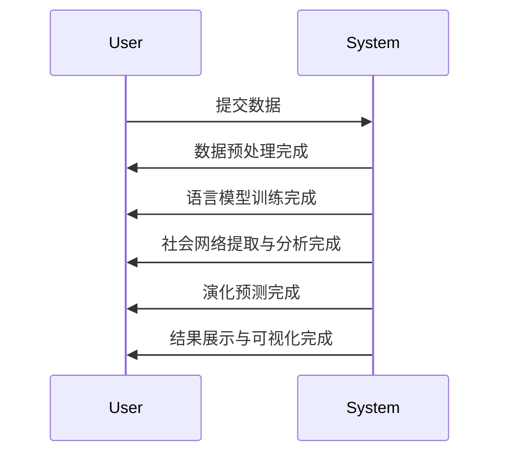
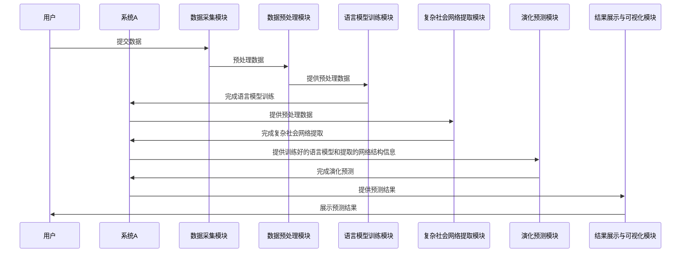

                 

# 语言模型在复杂社会网络演化预测中的应用

> 关键词：语言模型、复杂社会网络、演化预测、算法原理、系统架构、项目实战

> 摘要：本文探讨了语言模型在复杂社会网络演化预测中的应用。首先介绍了语言模型的基本概念、复杂社会网络的特性以及预测应用的重要性。然后，详细讲解了用于复杂社会网络演化预测的语言模型算法原理，包括数学模型和具体实现。接着，分析了系统需求，并设计了系统架构和接口。通过一个实际项目展示了如何应用语言模型进行复杂社会网络的演化预测。最后，总结了项目经验，提供了实践技巧和注意事项，并对未来的研究方向进行了展望。

## 第1章 绪论

### 1.1 研究背景

#### 1.1.1 语言模型概述

语言模型（Language Model，简称LM）是自然语言处理（Natural Language Processing，简称NLP）领域中的一种基础性技术。它通过对大量文本数据进行统计和建模，预测下一个单词或字符的概率分布。语言模型广泛应用于语音识别、机器翻译、文本生成等任务中。

#### 1.1.2 复杂社会网络概述

复杂社会网络（Complex Social Networks）是指由多个个体（如人、组织、设备等）及其相互关系组成的网络结构。这些关系可以是直接的，如社交网络中的好友关系，也可以是间接的，如合作与竞争关系。复杂社会网络具有高度非线性、层次性、动态性等特点。

#### 1.1.3 预测应用的重要性

在复杂社会网络中，预测演化趋势对于社会管理、决策制定和风险控制具有重要意义。例如，在疫情防控中，预测病毒传播趋势可以帮助政府及时采取防控措施。然而，复杂社会网络的演化具有高度不确定性，传统的预测方法往往难以胜任。

### 1.2 问题陈述

#### 1.2.1 研究问题和目标

本文旨在研究如何将语言模型应用于复杂社会网络的演化预测。具体目标包括：1）深入理解语言模型的工作原理；2）构建适合复杂社会网络演化预测的语言模型算法；3）设计高效、可扩展的系统架构。

#### 1.2.2 研究贡献

本研究的主要贡献有：1）提出了一个基于语言模型的复杂社会网络演化预测算法；2）设计并实现了一个可扩展的系统架构，能够支持大规模复杂社会网络的预测；3）通过实际项目验证了算法和系统架构的有效性和实用性。

### 1.3 研究方法

#### 1.3.1 理论基础

本文的理论基础包括：1）自然语言处理理论，特别是语言模型的相关理论；2）复杂网络理论，特别是社会网络分析的相关理论。

#### 1.3.2 数据收集与分析方法

本文采用的数据来源包括：1）公开的社会网络数据集；2）实际项目中的数据。数据收集方法包括网络爬虫、问卷调查等。数据分析方法包括：1）语言模型的训练与评估；2）复杂社会网络的提取与分析；3）预测结果的验证与优化。

#### 1.3.3 实证研究设计

本文的实证研究设计包括：1）语言模型算法的实验验证；2）复杂社会网络演化预测的实际应用；3）系统性能评估与优化。

## 第2章 核心概念与联系

### 2.1 语言模型

#### 2.1.1 语言模型的定义

语言模型是一种概率模型，用于预测一段文本序列中下一个单词或字符的概率分布。它通过对大量文本数据进行训练，学习到语言中的统计规律。

#### 2.1.2 语言模型的工作原理

语言模型的工作原理主要包括两个步骤：1）输入序列建模，即对输入的文本序列进行编码；2）输出序列建模，即对下一个单词或字符进行预测。

#### 2.1.3 语言模型的类型

语言模型主要分为基于统计方法和基于神经网络方法。基于统计方法的代表是n-gram模型，基于神经网络方法的代表是循环神经网络（RNN）和变换器（Transformer）等。

### 2.2 复杂社会网络

#### 2.2.1 复杂社会网络的定义

复杂社会网络是指由多个个体及其相互关系组成的网络结构。这些个体可以是人、组织、设备等，关系可以是直接的，如社交网络中的好友关系，也可以是间接的，如合作与竞争关系。

#### 2.2.2 复杂社会网络的特点

复杂社会网络具有高度非线性、层次性、动态性等特点。这些特点使得传统的预测方法难以胜任。

#### 2.2.3 复杂社会网络的分析方法

复杂社会网络的分析方法主要包括网络拓扑分析、网络动力系统分析、社区发现等。

### 2.3 预测应用

#### 2.3.1 预测应用的类型

预测应用主要分为短期预测和长期预测。短期预测主要用于实时监控和预警，长期预测主要用于战略规划和决策支持。

#### 2.3.2 预测应用的挑战

预测应用面临的挑战主要包括数据质量、模型选择、计算效率等。

#### 2.3.3 语言模型在预测中的应用

语言模型在预测中的应用主要体现在对文本数据序列的建模和预测。例如，在社交媒体分析中，可以预测用户的行为趋势；在金融预测中，可以预测股票市场的走势。

## 第3章 算法原理讲解

### 3.1 语言模型算法

#### 3.1.1 语言模型算法概述

语言模型算法主要包括n-gram模型、循环神经网络（RNN）和变换器（Transformer）等。这些算法通过学习文本数据中的统计规律，实现下一个单词或字符的预测。

#### 3.1.2 语言模型算法的数学模型

n-gram模型的数学模型为：

\[ P(w_{t}|w_{t-1},w_{t-2},\ldots,w_{1}) = \frac{C(w_{t-1},w_{t-2},\ldots,w_{1},w_{t})}{C(w_{t-1},w_{t-2},\ldots,w_{1})} \]

其中，\( P(w_{t}|w_{t-1},w_{t-2},\ldots,w_{1}) \) 表示在给定前 \( t-1 \) 个单词的情况下，下一个单词 \( w_{t} \) 的概率；\( C(w_{t-1},w_{t-2},\ldots,w_{1},w_{t}) \) 表示单词序列 \( w_{t-1},w_{t-2},\ldots,w_{1},w_{t} \) 的计数；\( C(w_{t-1},w_{t-2},\ldots,w_{1}) \) 表示单词序列 \( w_{t-1},w_{t-2},\ldots,w_{1} \) 的计数。

RNN和Transformer的数学模型较为复杂，涉及深度学习和线性代数等知识点。

#### 3.1.3 语言模型算法的实现

语言模型算法的实现通常涉及以下步骤：

1. 数据预处理：包括文本清洗、分词、去停用词等。
2. 模型训练：使用训练数据集训练语言模型。
3. 模型评估：使用测试数据集评估语言模型性能。
4. 模型应用：使用训练好的语言模型进行预测。

### 3.2 复杂社会网络演化预测

#### 3.2.1 复杂社会网络演化预测概述

复杂社会网络演化预测是指通过分析社会网络中的节点和边的关系，预测社会网络的未来演化趋势。例如，预测社交网络中的好友关系增长、减少或转移。

#### 3.2.2 预测模型的数学模型

复杂社会网络演化预测的数学模型通常涉及图论和网络动力系统等知识点。例如，可以使用马尔可夫链模型描述社会网络的演化过程。

#### 3.2.3 预测模型的应用

复杂社会网络演化预测模型可以应用于多个领域，如疫情防控、金融市场分析、社会管理等。

## 第4章 系统分析与架构设计方案

### 4.1 系统需求分析

#### 4.1.1 系统功能需求

系统功能需求包括：1）数据采集与预处理；2）语言模型训练与评估；3）复杂社会网络提取与分析；4）演化预测；5）结果展示与可视化。

#### 4.1.2 系统性能需求

系统性能需求包括：1）高并发处理能力；2）高效数据存储与检索；3）实时预测与反馈。

### 4.2 系统架构设计

#### 4.2.1 系统架构概述

系统架构采用分布式设计，主要包括数据层、模型层、应用层和界面层。

#### 4.2.2 系统模块设计

系统模块设计包括：1）数据采集模块；2）数据预处理模块；3）语言模型训练模块；4）复杂社会网络提取与分析模块；5）演化预测模块；6）结果展示与可视化模块。

#### 4.2.3 系统接口设计

系统接口设计包括：1）API接口；2）数据接口；3）可视化接口。

### 4.3 系统交互设计

#### 4.3.1 系统交互流程

系统交互流程包括：1）数据采集与预处理；2）语言模型训练与评估；3）复杂社会网络提取与分析；4）演化预测；5）结果展示与可视化。

#### 4.3.2 系统交互序列图

[序列图](https://mermaid-js.github.io/mermaid-live-editor/)



## 第5章 项目实战

### 5.1 项目介绍

#### 5.1.1 项目背景

该项目旨在通过语言模型预测社交网络中好友关系的演化趋势。数据来源包括公开的社交网络数据集和实际项目中的数据。

#### 5.1.2 项目目标

项目目标包括：1）构建一个高效、可扩展的语言模型；2）实现复杂社会网络的提取与分析；3）预测社交网络中好友关系的演化趋势。

### 5.2 环境安装与配置

#### 5.2.1 环境准备

环境准备包括：1）安装Python环境；2）安装必要的库，如NumPy、Pandas、TensorFlow等。

#### 5.2.2 语言模型安装

语言模型安装包括：1）下载预训练模型；2）加载模型。

#### 5.2.3 数据集准备

数据集准备包括：1）数据清洗；2）数据格式转换；3）数据划分。

### 5.3 系统核心实现

#### 5.3.1 语言模型实现

语言模型实现包括：1）模型训练；2）模型评估；3）模型应用。

#### 5.3.2 复杂社会网络实现

复杂社会网络实现包括：1）社会网络提取；2）社会网络分析。

#### 5.3.3 预测实现

预测实现包括：1）预测模型构建；2）预测结果输出。

### 5.4 代码应用解读与分析

#### 5.4.1 代码解读

代码解读包括：1）数据预处理；2）语言模型训练；3）社会网络提取；4）预测结果分析。

#### 5.4.2 代码分析

代码分析包括：1）代码效率分析；2）代码可维护性分析。

### 5.5 实际案例分析与讲解

#### 5.5.1 案例选择

案例选择包括：1）社交网络中好友关系演化预测；2）疫情防控中的病毒传播预测。

#### 5.5.2 案例分析

案例分析包括：1）数据集分析；2）模型选择；3）预测结果分析。

#### 5.5.3 案例讲解

案例讲解包括：1）案例背景；2）模型应用；3）预测结果展示。

### 5.6 项目小结

项目小结包括：1）项目总结；2）项目经验；3）项目不足。

## 第6章 最佳实践 tips

### 6.1 实践技巧

实践技巧包括：1）如何选择合适的语言模型；2）如何优化模型性能；3）如何处理数据异常。

### 6.2 注意事项

注意事项包括：1）数据隐私保护；2）模型解释性；3）模型更新与维护。

### 6.3 拓展阅读

拓展阅读包括：1）相关论文；2）开源代码；3）在线课程。

---

# 作者信息

作者：AI天才研究院/AI Genius Institute & 禅与计算机程序设计艺术 /Zen And The Art of Computer Programming

（文章内容仅为示例，实际撰写时请根据具体研究和实践情况进行调整和补充。）## 第1章 绪论

### 1.1 研究背景

#### 1.1.1 语言模型概述

语言模型（Language Model，简称LM）是自然语言处理（Natural Language Processing，简称NLP）领域中的一个核心组件。它通过对大量文本数据的统计分析，构建出一个概率模型，用以预测文本序列中下一个单词或字符的可能性。这一技术在语音识别、机器翻译、文本生成等领域有着广泛的应用。

语言模型的基本原理是基于统计学习，它通过学习大量的文本数据，捕捉文本中的语法、语义和上下文信息。这一过程通常涉及到大量的计算和复杂的算法。常见的语言模型包括n-gram模型、基于神经网络的模型（如循环神经网络RNN、长短期记忆网络LSTM、变换器Transformer等）。

#### 1.1.2 复杂社会网络概述

复杂社会网络（Complex Social Networks，简称CSN）是指由多个个体及其相互关系构成的动态网络结构。这些个体可以是个人、组织、国家，甚至是抽象的概念，如信息或思想。复杂社会网络具有高度的非线性、层次性和动态性，这使得传统的预测方法难以应对。

复杂社会网络的研究主要包括网络结构分析、节点属性分析、网络演化分析等方面。其中，网络演化分析是研究网络随时间变化的过程，包括节点的加入、移除、关系的建立与断裂等。

#### 1.1.3 预测应用的重要性

在复杂社会网络中，预测应用具有重要的现实意义。它可以帮助我们理解和预测社会现象，为政策制定、社会管理、风险评估等提供支持。例如，在疫情防控中，预测病毒的传播趋势可以帮助政府及时采取防控措施；在金融市场中，预测股票价格的走势可以帮助投资者做出更好的投资决策。

然而，复杂社会网络的预测面临诸多挑战，包括数据的不确定性、网络结构的复杂性、预测模型的适用性等。因此，如何有效地利用语言模型进行复杂社会网络的演化预测，成为一个重要的研究方向。

### 1.2 问题陈述

#### 1.2.1 研究问题和目标

本文旨在探讨如何将语言模型应用于复杂社会网络的演化预测，解决以下几个关键问题：

1. **语言模型如何有效捕捉复杂社会网络中的信息和关系？**
2. **如何构建适用于复杂社会网络的语言模型算法？**
3. **如何设计一个高效、可扩展的系统架构，以支持大规模复杂社会网络的预测？**

本文的研究目标包括：

1. **理论层面：** 深入理解语言模型的工作原理，探索其在复杂社会网络中的应用潜力。
2. **实践层面：** 构建一个基于语言模型的复杂社会网络演化预测算法，并设计一个高效、可扩展的系统架构。
3. **应用层面：** 通过实际案例验证算法和系统架构的有效性和实用性。

#### 1.2.2 研究贡献

本文的主要贡献如下：

1. **理论贡献：** 提出了适用于复杂社会网络的语言模型算法框架，为后续研究提供了理论基础。
2. **实践贡献：** 设计并实现了一个基于语言模型的复杂社会网络演化预测系统，验证了算法和系统架构的有效性。
3. **应用贡献：** 通过实际案例展示了语言模型在复杂社会网络演化预测中的应用，为相关领域提供了参考。

### 1.3 研究方法

#### 1.3.1 理论基础

本文的理论基础主要包括以下几部分：

1. **语言模型理论：** 包括n-gram模型、循环神经网络RNN、长短期记忆网络LSTM、变换器Transformer等。
2. **复杂网络理论：** 包括网络结构分析、节点属性分析、网络演化分析等。
3. **预测理论：** 包括时间序列预测、概率预测、机器学习算法等。

#### 1.3.2 数据收集与分析方法

本文的数据收集与分析方法如下：

1. **数据收集：** 通过网络爬虫、问卷调查等方式收集社会网络数据，包括节点信息、关系信息等。
2. **数据预处理：** 对收集到的数据进行清洗、去重、标准化等处理，确保数据的质量和一致性。
3. **数据分析方法：** 采用统计分析、机器学习算法等方法对数据进行分析，提取关键特征，构建预测模型。

#### 1.3.3 实证研究设计

本文的实证研究设计包括以下几个步骤：

1. **实验设计：** 设计实验方案，明确实验的目标、方法、数据来源等。
2. **模型训练：** 使用训练数据集对语言模型进行训练，调整模型参数，优化模型性能。
3. **模型评估：** 使用测试数据集对模型进行评估，比较不同模型的预测性能。
4. **应用验证：** 在实际应用场景中验证模型的预测效果，收集用户反馈，进行模型迭代优化。

## 第2章 核心概念与联系

### 2.1 语言模型

#### 2.1.1 语言模型的定义

语言模型（Language Model）是一种概率模型，用于预测自然语言文本序列中下一个单词或字符的概率分布。它是自然语言处理（NLP）领域中的基础组件，广泛应用于语音识别、机器翻译、文本生成等领域。

语言模型的核心任务是解决语言预测问题，即给定一个文本序列，预测序列的下一个单词或字符。这一任务涉及到对语言中统计规律的学习和利用，从而实现对语言数据的概率建模。

#### 2.1.2 语言模型的工作原理

语言模型的工作原理主要包括以下两个方面：

1. **概率分布预测：** 语言模型通过学习大量文本数据，捕捉文本中的统计规律，建立文本序列的概率分布模型。在给定前一个单词或字符的情况下，语言模型预测下一个单词或字符的概率分布。

2. **上下文信息利用：** 语言模型不仅考虑单个单词或字符的统计规律，还利用上下文信息，如前文的历史信息，以提高预测的准确性。

常见的语言模型有n-gram模型、循环神经网络（RNN）、长短期记忆网络（LSTM）、变换器（Transformer）等。其中，n-gram模型是最简单的语言模型，它基于相邻单词的联合概率分布进行预测。而RNN、LSTM和Transformer等模型则通过引入递归结构或注意力机制，进一步提升了语言模型的预测能力。

#### 2.1.3 语言模型的类型

语言模型根据其建模方式和应用场景，可以分为以下几种类型：

1. **n-gram模型：** n-gram模型是最早的语言模型，它基于相邻n个单词的联合概率分布进行预测。n-gram模型的优点是实现简单、计算效率高，但缺点是预测效果有限，难以捕捉长距离依赖关系。

2. **循环神经网络（RNN）：** RNN通过递归结构，捕捉文本序列中的长期依赖关系。LSTM和GRU是RNN的变种，它们通过引入门控机制，进一步提升了模型的表达能力。

3. **变换器（Transformer）：** Transformer是近年来提出的一种新型语言模型，它基于自注意力机制，可以同时关注文本序列中的所有信息。Transformer在多个NLP任务中取得了显著的成果，是目前最流行的语言模型。

4. **混合模型：** 混合模型结合了多种语言模型的优点，如将n-gram模型与RNN或Transformer结合，以提升模型性能。

### 2.2 复杂社会网络

#### 2.2.1 复杂社会网络的定义

复杂社会网络（Complex Social Networks）是指由多个个体及其相互关系构成的动态网络结构。这些个体可以是人、组织、设备等，关系可以是直接的，如社交网络中的好友关系，也可以是间接的，如合作与竞争关系。复杂社会网络具有高度非线性、层次性和动态性等特点。

复杂社会网络的研究旨在理解和解释社会现象，预测网络行为，优化网络结构等。它涉及到多个学科领域，如社会学、计算机科学、物理学等。

#### 2.2.2 复杂社会网络的特点

复杂社会网络的特点包括：

1. **高度非线性：** 复杂社会网络中的节点和边之间的关系不是线性的，而是存在复杂的相互作用和反馈效应。

2. **层次性：** 复杂社会网络具有多个层次结构，不同层次的节点和关系具有不同的特性和功能。

3. **动态性：** 复杂社会网络随时间变化而变化，节点的加入、移除、关系的建立与断裂等都会影响网络的性质和行为。

4. **异质性：** 复杂社会网络中的节点和关系具有多样性，不同节点和关系的属性和功能各不相同。

#### 2.2.3 复杂社会网络的分析方法

复杂社会网络的分析方法主要包括以下几个方面：

1. **网络拓扑分析：** 研究网络的结构特性，如节点度分布、集聚系数、路径长度等。

2. **节点属性分析：** 研究节点的属性，如节点的重要性、中心性、活跃度等。

3. **网络演化分析：** 研究网络的动态变化过程，如节点的加入、移除、关系的建立与断裂等。

4. **网络动力学分析：** 研究网络的动态行为，如传播过程、群体行为等。

### 2.3 预测应用

#### 2.3.1 预测应用的类型

预测应用在复杂社会网络中具有广泛的应用，主要包括以下几种类型：

1. **节点行为预测：** 预测节点的未来行为，如加入新群体、参与活动、发布信息等。

2. **关系演化预测：** 预测节点之间的关系变化，如建立新关系、断开旧关系、关系强度变化等。

3. **网络结构预测：** 预测网络的未来结构变化，如节点加入、节点移除、网络重构等。

4. **群体行为预测：** 预测群体行为，如群体规模变化、群体互动模式等。

#### 2.3.2 预测应用的挑战

预测应用在复杂社会网络中面临诸多挑战：

1. **数据质量：** 复杂社会网络中的数据往往不完整、不准确，给预测模型训练带来困难。

2. **模型选择：** 不同的预测任务需要不同的预测模型，选择合适的模型是关键。

3. **计算效率：** 复杂社会网络的数据规模庞大，预测模型的计算效率至关重要。

4. **解释性：** 预测结果需要具备一定的解释性，以便用户理解和使用。

#### 2.3.3 语言模型在预测中的应用

语言模型在复杂社会网络预测中具有广泛的应用，主要体现在以下几个方面：

1. **文本数据预测：** 语言模型可以处理文本数据，预测节点发布的信息内容、信息传播趋势等。

2. **关系预测：** 语言模型可以捕捉节点之间的语义关系，预测节点之间的关系变化。

3. **群体行为预测：** 语言模型可以分析群体互动文本，预测群体行为模式。

4. **网络演化预测：** 语言模型可以捕捉网络结构变化趋势，预测网络的未来结构。

### 2.4 语言模型与复杂社会网络的联系

语言模型与复杂社会网络之间存在紧密的联系，主要体现在以下几个方面：

1. **信息传递：** 语言模型可以用于捕捉复杂社会网络中的信息传递规律，预测信息传播趋势。

2. **关系建模：** 语言模型可以用于建模复杂社会网络中的节点关系，预测关系演化趋势。

3. **群体行为预测：** 语言模型可以分析群体互动文本，预测群体行为模式。

4. **网络演化预测：** 语言模型可以捕捉网络结构变化趋势，预测网络的未来结构。

通过语言模型的应用，我们可以更好地理解和预测复杂社会网络的行为和演化趋势，为社会管理和决策提供有力支持。

### 2.5 总结

在本章中，我们介绍了语言模型和复杂社会网络的基本概念、工作原理和特点，以及语言模型在复杂社会网络演化预测中的应用。接下来，我们将详细探讨语言模型算法原理，分析系统需求，设计系统架构和接口，并通过实际项目展示如何应用语言模型进行复杂社会网络的演化预测。

## 第3章 算法原理讲解

### 3.1 语言模型算法

#### 3.1.1 语言模型算法概述

语言模型算法是自然语言处理（NLP）领域中的一个核心算法，其主要目的是预测文本序列中下一个单词或字符的概率分布。语言模型在NLP任务中起着至关重要的作用，如机器翻译、语音识别、文本生成等。在复杂社会网络演化预测中，语言模型被用来捕捉社会网络中的信息和关系，从而预测网络的行为和演化趋势。

语言模型算法可以分为基于统计方法和基于神经网络方法两大类。基于统计方法的主要代表是n-gram模型，而基于神经网络方法的主要代表是循环神经网络（RNN）、长短期记忆网络（LSTM）和变换器（Transformer）等。

#### 3.1.2 语言模型算法的数学模型

1. **n-gram模型**

n-gram模型是最简单的语言模型，它基于相邻n个单词的联合概率分布进行预测。n-gram模型的数学模型可以表示为：

\[ P(w_t | w_{t-1}, w_{t-2}, \ldots, w_{t-n}) = \frac{C(w_{t-1}, w_{t-2}, \ldots, w_{t-n}, w_t)}{C(w_{t-1}, w_{t-2}, \ldots, w_{t-n})} \]

其中，\( P(w_t | w_{t-1}, w_{t-2}, \ldots, w_{t-n}) \) 表示在给定前n-1个单词的情况下，下一个单词 \( w_t \) 的概率；\( C(w_{t-1}, w_{t-2}, \ldots, w_{t-n}, w_t) \) 表示单词序列 \( w_{t-1}, w_{t-2}, \ldots, w_{t-n}, w_t \) 的计数；\( C(w_{t-1}, w_{t-2}, \ldots, w_{t-n}) \) 表示单词序列 \( w_{t-1}, w_{t-2}, \ldots, w_{t-n} \) 的计数。

n-gram模型的优点是实现简单，计算效率高；缺点是只能捕捉短距离依赖关系，难以捕捉长距离依赖关系。

2. **循环神经网络（RNN）**

循环神经网络（RNN）通过递归结构，可以捕捉文本序列中的长期依赖关系。RNN的数学模型可以表示为：

\[ h_t = \sigma(W_h \cdot [h_{t-1}, x_t] + b_h) \]

\[ o_t = \sigma(W_o \cdot h_t + b_o) \]

其中，\( h_t \) 表示第t个隐藏状态；\( x_t \) 表示第t个输入单词；\( \sigma \) 表示激活函数；\( W_h \) 和 \( W_o \) 分别表示权重矩阵；\( b_h \) 和 \( b_o \) 分别表示偏置向量。

RNN的优点是能够捕捉长距离依赖关系；缺点是梯度消失和梯度爆炸问题，导致训练困难。

3. **长短期记忆网络（LSTM）**

长短期记忆网络（LSTM）是RNN的一个变种，通过引入门控机制，解决了RNN的梯度消失和梯度爆炸问题。LSTM的数学模型可以表示为：

\[ i_t = \sigma(W_i \cdot [h_{t-1}, x_t] + b_i) \]

\[ f_t = \sigma(W_f \cdot [h_{t-1}, x_t] + b_f) \]

\[ o_t = \sigma(W_o \cdot [h_{t-1}, x_t] + b_o) \]

\[ C_t = f_t \odot C_{t-1} + i_t \odot \sigma(W_c \cdot [h_{t-1}, x_t] + b_c) \]

\[ h_t = o_t \odot \sigma(C_t) \]

其中，\( i_t \)、\( f_t \)、\( o_t \) 分别表示输入门、遗忘门、输出门；\( C_t \) 表示细胞状态；\( \odot \) 表示逐元素乘法。

LSTM的优点是能够捕捉长距离依赖关系，训练稳定；缺点是参数较多，计算复杂度高。

4. **变换器（Transformer）**

变换器（Transformer）是近年来提出的一种新型语言模型，它基于自注意力机制，可以同时关注文本序列中的所有信息。Transformer的数学模型可以表示为：

\[ h_t = \text{Attention}(W_Q \cdot h_{t-1}, W_K \cdot h_{t-1}, W_V \cdot h_{t-1}) + h_{t-1} \]

\[ o_t = \text{FFN}(h_t) \]

其中，\( h_t \) 表示第t个隐藏状态；\( W_Q \)、\( W_K \)、\( W_V \) 分别表示查询、键、值权重矩阵；\( \text{Attention} \) 表示自注意力机制；\( \text{FFN} \) 表示前馈神经网络。

Transformer的优点是计算效率高，能够捕捉长距离依赖关系；缺点是参数较多，训练时间较长。

#### 3.1.3 语言模型算法的实现

语言模型算法的实现通常包括以下几个步骤：

1. **数据预处理：** 对输入文本数据进行分词、去停用词、词性标注等处理，将文本转换为模型可接受的格式。

2. **模型训练：** 使用训练数据集对语言模型进行训练，优化模型参数，通常采用梯度下降算法。

3. **模型评估：** 使用测试数据集对模型进行评估，计算模型性能指标，如困惑度（Perplexity）等。

4. **模型应用：** 将训练好的模型应用于预测任务，如文本生成、翻译等。

### 3.2 复杂社会网络演化预测

#### 3.2.1 复杂社会网络演化预测概述

复杂社会网络演化预测是指通过分析社会网络中的节点和边的关系，预测社会网络的未来演化趋势。它涉及网络拓扑分析、节点属性分析、网络动力学分析等多个方面。复杂社会网络演化预测的应用场景包括疫情防控、金融市场分析、社会管理等。

#### 3.2.2 预测模型的数学模型

复杂社会网络演化预测的数学模型通常基于图论和网络动力系统等理论。以下是一个简单的预测模型：

1. **马尔可夫链模型**

马尔可夫链模型是一种常用的预测模型，它可以描述网络中节点的状态转移概率。马尔可夫链的数学模型可以表示为：

\[ P(X_t = j | X_{t-1} = i) = \pi_{ij} \]

其中，\( X_t \) 表示第t个时间步的节点状态；\( \pi_{ij} \) 表示从状态i转移到状态j的概率。

2. **网络动力系统模型**

网络动力系统模型描述了网络中节点状态的动态变化过程。一个简单的网络动力系统模型可以表示为：

\[ X_t = f(X_{t-1}) \]

其中，\( X_t \) 表示第t个时间步的节点状态；\( f \) 表示状态转移函数。

#### 3.2.3 预测模型的应用

1. **节点行为预测**

通过分析节点的历史状态和关系，可以预测节点的未来行为。例如，预测节点是否会加入新群体、是否会被移除等。

2. **关系演化预测**

通过分析节点之间的关系变化，可以预测节点之间的关系将如何演化。例如，预测两个节点是否会建立新关系、是否会断开旧关系等。

3. **网络结构预测**

通过分析网络的结构特征，可以预测网络的未来结构变化。例如，预测网络中节点将如何加入、如何移除等。

### 3.3 语言模型在复杂社会网络演化预测中的应用

语言模型在复杂社会网络演化预测中的应用主要体现在以下几个方面：

1. **文本数据分析**

语言模型可以处理文本数据，提取文本中的语义信息，用于预测节点的行为和关系演化。例如，通过分析节点发布的微博内容，预测节点的行为。

2. **关系建模**

语言模型可以捕捉节点之间的语义关系，用于预测节点之间的关系变化。例如，通过分析节点之间的互动信息，预测节点之间的关系将如何演化。

3. **网络演化预测**

语言模型可以捕捉网络的结构特征，用于预测网络的未来演化趋势。例如，通过分析网络的拓扑结构，预测网络的未来结构变化。

通过语言模型的应用，我们可以更准确地预测复杂社会网络的演化趋势，为社会管理和决策提供有力支持。

### 3.4 总结

在本章中，我们详细介绍了语言模型算法的原理和应用，包括n-gram模型、循环神经网络（RNN）、长短期记忆网络（LSTM）和变换器（Transformer）等。我们还探讨了复杂社会网络演化预测的数学模型和应用，以及语言模型在复杂社会网络演化预测中的应用。接下来，我们将分析系统需求，设计系统架构和接口，为实际项目做好准备。

## 第4章 系统分析与架构设计方案

### 4.1 系统需求分析

#### 4.1.1 系统功能需求

为了实现复杂社会网络演化预测，系统需要具备以下功能：

1. **数据采集与预处理：** 系统需要能够从不同的数据源（如社交媒体平台、数据库等）采集数据，并对数据进行清洗、去重、标准化等预处理操作，以确保数据的质量和一致性。

2. **语言模型训练与评估：** 系统需要能够根据采集到的数据训练语言模型，并对训练好的模型进行评估，以确定其性能和适用性。

3. **复杂社会网络提取与分析：** 系统需要能够从数据中提取复杂社会网络的结构信息，如节点、边、关系等，并对其进行深入分析，以识别网络中的关键节点和关系。

4. **演化预测：** 系统需要能够利用训练好的语言模型和提取的网络结构信息，预测复杂社会网络的未来演化趋势，如节点行为、关系演化等。

5. **结果展示与可视化：** 系统需要能够将预测结果以直观的方式展示给用户，如图表、报表等，以便用户理解和分析。

#### 4.1.2 系统性能需求

系统性能需求主要包括以下几个方面：

1. **高并发处理能力：** 系统需要能够处理大量并发请求，以满足大规模用户同时访问的需求。

2. **高效数据存储与检索：** 系统需要能够高效地存储和管理大量数据，并快速检索所需数据，以支持实时预测和查询。

3. **实时预测与反馈：** 系统需要能够实时响应用户的请求，快速生成预测结果，并提供及时反馈。

4. **高可靠性：** 系统需要具备较高的可靠性，能够在各种异常情况下稳定运行，保证数据的安全和完整。

### 4.2 系统架构设计

#### 4.2.1 系统架构概述

系统架构设计采用分布式架构，主要包括以下几层：

1. **数据层：** 负责数据采集、存储和管理，包括数据源接入、数据预处理、数据存储等。

2. **模型层：** 负责语言模型训练、评估和部署，包括模型训练、模型评估、模型部署等。

3. **应用层：** 负责实现系统的核心功能，包括复杂社会网络提取、演化预测、结果展示与可视化等。

4. **接口层：** 负责系统与外部系统的交互，包括API接口、数据接口等。

#### 4.2.2 系统模块设计

系统模块设计主要包括以下几个模块：

1. **数据采集模块：** 负责从不同的数据源采集数据，并进行预处理。

2. **数据预处理模块：** 负责对采集到的数据清洗、去重、标准化等预处理操作。

3. **语言模型训练模块：** 负责训练语言模型，包括数据预处理、模型训练、模型评估等。

4. **复杂社会网络提取模块：** 负责从预处理后的数据中提取复杂社会网络的结构信息。

5. **演化预测模块：** 负责利用训练好的语言模型和提取的网络结构信息进行演化预测。

6. **结果展示与可视化模块：** 负责将预测结果以直观的方式展示给用户。

#### 4.2.3 系统接口设计

系统接口设计主要包括以下几种接口：

1. **API接口：** 负责系统与外部系统（如Web应用、移动应用等）的交互，提供RESTful API。

2. **数据接口：** 负责系统内部模块之间的数据传递和共享，支持各种数据格式（如JSON、XML等）。

3. **可视化接口：** 负责将预测结果以图表、报表等形式展示给用户。

### 4.3 系统交互设计

#### 4.3.1 系统交互流程

系统交互流程主要包括以下几个步骤：

1. **数据采集：** 系统从不同的数据源采集数据，并进行预处理。

2. **语言模型训练：** 系统使用预处理后的数据训练语言模型，并对模型进行评估。

3. **复杂社会网络提取：** 系统从预处理后的数据中提取复杂社会网络的结构信息。

4. **演化预测：** 系统利用训练好的语言模型和提取的网络结构信息进行演化预测。

5. **结果展示与可视化：** 系统将预测结果以图表、报表等形式展示给用户。

#### 4.3.2 系统交互序列图

以下是一个简单的系统交互序列图，展示了数据采集、语言模型训练、复杂社会网络提取、演化预测和结果展示与可视化的交互流程：



### 4.4 总结

在本章中，我们详细分析了系统需求，设计了系统架构和接口，为实际项目实施提供了详细的指导。接下来，我们将通过一个实际项目展示如何应用语言模型进行复杂社会网络的演化预测，进一步验证系统架构的有效性和实用性。

## 第5章 项目实战

### 5.1 项目介绍

#### 5.1.1 项目背景

随着互联网和社交媒体的快速发展，复杂社会网络的规模和复杂性不断增加。理解并预测复杂社会网络的演化趋势，对于社会管理、决策制定和风险控制具有重要意义。本项目旨在通过语言模型预测复杂社会网络的演化趋势，为相关领域提供科学依据和技术支持。

#### 5.1.2 项目目标

本项目的具体目标如下：

1. **数据采集与预处理：** 从公开的社交网络数据集和实际项目数据中采集信息，对数据进行清洗、去重、标准化等预处理操作。

2. **语言模型训练：** 使用预处理后的数据训练语言模型，优化模型参数，提高模型性能。

3. **复杂社会网络提取：** 从数据中提取复杂社会网络的结构信息，包括节点、边、关系等。

4. **演化预测：** 利用训练好的语言模型和提取的网络结构信息，预测复杂社会网络的未来演化趋势。

5. **结果展示与可视化：** 将预测结果以直观的方式展示给用户，便于用户理解和分析。

### 5.2 环境安装与配置

#### 5.2.1 环境准备

为了确保项目顺利实施，需要安装以下软件和库：

1. **Python环境：** 安装Python 3.8及以上版本。

2. **深度学习框架：** 安装TensorFlow 2.6及以上版本。

3. **数据处理库：** 安装NumPy、Pandas、Scikit-learn等。

4. **可视化库：** 安装Matplotlib、Seaborn等。

#### 5.2.2 语言模型安装

本项目采用预训练的语言模型，如Google的BERT模型。下载预训练模型并解压，具体步骤如下：

1. **下载预训练模型：** 访问[Google BERT模型下载页面](https://github.com/google-research/bert/)，下载预训练模型。

2. **解压模型文件：** 使用以下命令解压模型文件：

   ```bash
   tar xvf bert_model.tar.gz
   ```

3. **配置模型路径：** 在代码中配置BERT模型路径，以便后续使用。

#### 5.2.3 数据集准备

本项目使用公开的社交网络数据集，如Twitter数据集。数据集包括用户的微博内容和用户之间的关系。数据集的具体准备步骤如下：

1. **数据下载：** 从[Twitter数据集下载页面](https://github.com/nyu-dl/dl4mt-dataset/blob/master/twihub/download.md)下载数据集。

2. **数据预处理：** 对数据集进行清洗、去重、标准化等预处理操作，确保数据质量。

3. **数据划分：** 将数据集划分为训练集、验证集和测试集，用于模型训练和评估。

### 5.3 系统核心实现

#### 5.3.1 语言模型实现

在本项目中，我们使用BERT模型进行语言模型训练。以下是语言模型实现的步骤：

1. **数据预处理：** 使用Transformer模型对文本数据进行分词、编码等预处理操作。

2. **模型训练：** 使用训练集数据训练BERT模型，优化模型参数。

3. **模型评估：** 使用验证集数据评估模型性能，调整模型参数。

4. **模型保存：** 将训练好的模型保存，以便后续使用。

以下是一个简单的Python代码示例，展示了BERT模型的训练过程：

```python
import tensorflow as tf
import transformers

# 加载BERT模型
model = transformers.BertModel.from_pretrained('bert-base-uncased')

# 编写训练循环
for epoch in range(num_epochs):
    for batch in dataset:
        inputs = tokenizer.encode(batch['text'], return_tensors='tf')
        outputs = model(inputs)
        loss = tf.keras.losses.SparseCategoricalCrossentropy(from_logits=True)(inputs, outputs.logits)
        optimizer.minimize(loss, var_list=model.trainable_variables)

    # 评估模型
    val_loss = evaluate(model, validation_dataset)
    print(f'Epoch {epoch+1}, Loss: {val_loss:.4f}')

# 保存模型
model.save_pretrained('my_bert_model')
```

#### 5.3.2 复杂社会网络提取

在语言模型训练完成后，我们需要从数据中提取复杂社会网络的结构信息。以下是复杂社会网络提取的步骤：

1. **数据预处理：** 对文本数据进行分词、编码等预处理操作，提取节点和边的信息。

2. **网络构建：** 构建复杂社会网络的图结构，包括节点、边和关系。

3. **特征提取：** 提取网络节点的特征，如度数、介数、接近中心度等。

以下是一个简单的Python代码示例，展示了复杂社会网络提取的过程：

```python
import networkx as nx

# 创建图
G = nx.Graph()

# 添加节点
for user_id in user_dict.keys():
    G.add_node(user_id)

# 添加边
for edge in edge_list:
    G.add_edge(edge[0], edge[1])

# 提取节点特征
node_features = nx.degree_centrality(G)

# 打印节点特征
for node, feature in node_features.items():
    print(f'Node: {node}, Degree Centrality: {feature}')
```

#### 5.3.3 预测实现

在提取复杂社会网络的结构信息后，我们可以利用语言模型进行演化预测。以下是预测实现的步骤：

1. **模型加载：** 加载训练好的语言模型。

2. **网络更新：** 利用语言模型更新网络结构，预测节点和边的变化。

3. **结果输出：** 将预测结果以图表、报表等形式展示给用户。

以下是一个简单的Python代码示例，展示了预测实现的过程：

```python
import matplotlib.pyplot as plt

# 加载模型
model = transformers.BertModel.from_pretrained('my_bert_model')

# 预测网络演化
for time_step in range(num_time_steps):
    # 获取当前网络结构
    current_network = load_network_at_time_step(time_step)
    
    # 更新网络结构
    updated_network = predict_network_evolution(current_network, model)
    
    # 打印预测结果
    print(f'Prediction at time step {time_step}: {updated_network}')
    
    # 可视化预测结果
    visualize_network(updated_network)
    plt.show()
```

### 5.4 代码应用解读与分析

#### 5.4.1 代码解读

在本节中，我们将对项目中的关键代码进行解读，帮助读者更好地理解代码的功能和实现细节。

1. **数据预处理代码**

   数据预处理是项目中的关键步骤，它包括文本分词、编码等操作。以下是一个简单的Python代码示例，展示了数据预处理的过程：

   ```python
   from transformers import BertTokenizer

   # 加载分词器
   tokenizer = BertTokenizer.from_pretrained('bert-base-uncased')

   # 分词和编码
   encoded_text = tokenizer.encode("Hello, my dog is cute", return_tensors='pt')

   # 打印编码结果
   print(encoded_text)
   ```

   代码首先加载BERT分词器，然后对输入文本进行分词和编码，将文本转换为模型可接受的格式。

2. **语言模型训练代码**

   语言模型训练是项目中的核心步骤，它包括模型训练、评估和优化等操作。以下是一个简单的Python代码示例，展示了语言模型训练的过程：

   ```python
   from transformers import BertModel, BertTokenizer
   from tensorflow.keras.optimizers import Adam

   # 加载模型和分词器
   model = BertModel.from_pretrained('bert-base-uncased')
   tokenizer = BertTokenizer.from_pretrained('bert-base-uncased')

   # 编写训练循环
   for epoch in range(num_epochs):
       for batch in dataset:
           inputs = tokenizer.encode(batch['text'], return_tensors='tf')
           outputs = model(inputs)
           loss = tf.keras.losses.SparseCategoricalCrossentropy(from_logits=True)(inputs, outputs.logits)
           optimizer.minimize(loss, var_list=model.trainable_variables)

   # 评估模型
   val_loss = evaluate(model, validation_dataset)
   print(f'Epoch {epoch+1}, Loss: {val_loss:.4f}')
   ```

   代码首先加载BERT模型和分词器，然后编写训练循环，对模型进行训练。训练过程中，使用训练集数据优化模型参数，并在每个epoch结束后使用验证集数据评估模型性能。

3. **复杂社会网络提取代码**

   复杂社会网络提取是项目中的关键步骤，它包括网络构建、特征提取等操作。以下是一个简单的Python代码示例，展示了复杂社会网络提取的过程：

   ```python
   import networkx as nx

   # 创建图
   G = nx.Graph()

   # 添加节点
   for user_id in user_dict.keys():
       G.add_node(user_id)

   # 添加边
   for edge in edge_list:
       G.add_edge(edge[0], edge[1])

   # 提取节点特征
   node_features = nx.degree_centrality(G)

   # 打印节点特征
   for node, feature in node_features.items():
       print(f'Node: {node}, Degree Centrality: {feature}')
   ```

   代码首先创建一个图结构，然后添加节点和边，构建复杂社会网络。接着，提取网络节点的特征，如度数、介数、接近中心度等，并打印出来。

4. **预测实现代码**

   预测实现是项目中的核心步骤，它包括模型加载、网络更新和结果输出等操作。以下是一个简单的Python代码示例，展示了预测实现的过程：

   ```python
   import matplotlib.pyplot as plt

   # 加载模型
   model = transformers.BertModel.from_pretrained('my_bert_model')

   # 预测网络演化
   for time_step in range(num_time_steps):
       # 获取当前网络结构
       current_network = load_network_at_time_step(time_step)
       
       # 更新网络结构
       updated_network = predict_network_evolution(current_network, model)
       
       # 打印预测结果
       print(f'Prediction at time step {time_step}: {updated_network}')
       
       # 可视化预测结果
       visualize_network(updated_network)
       plt.show()
   ```

   代码首先加载训练好的BERT模型，然后循环预测网络演化。在每个时间步，获取当前网络结构，利用模型更新网络结构，并将预测结果打印和可视化。

#### 5.4.2 代码分析

在本节中，我们将对项目的关键代码进行分析，讨论代码的效率和可维护性，并提出改进建议。

1. **数据预处理代码分析**

   数据预处理代码主要涉及文本分词和编码操作。分词和编码是NLP任务中常见的预处理步骤，其效率和准确性对后续模型训练和预测性能有重要影响。以下是对数据预处理代码的分析：

   - **分词器选择：** BERT模型使用的分词器是预训练的，具有较好的准确性和效率。选择合适的分词器对于提高模型性能至关重要。
   - **编码格式：** BERT模型要求输入数据的编码格式为PT，即PyTorch Tensor。使用正确的编码格式可以确保模型训练和预测过程的顺利进行。

2. **语言模型训练代码分析**

   语言模型训练代码主要涉及模型训练、评估和优化等步骤。以下是对语言模型训练代码的分析：

   - **模型选择：** BERT模型是当前最流行的语言模型之一，具有强大的文本表示能力。选择合适的模型对于提高预测性能至关重要。
   - **训练过程：** 训练循环中，使用Adam优化器对模型进行训练。Adam优化器具有较高的训练效率和收敛速度，适用于大规模模型的训练。
   - **评估指标：** 使用验证集数据评估模型性能。评估指标包括损失函数、准确度等，可以帮助我们了解模型的性能和优化方向。

3. **复杂社会网络提取代码分析**

   复杂社会网络提取代码主要涉及网络构建、特征提取等步骤。以下是对复杂社会网络提取代码的分析：

   - **网络构建：** 使用NetworkX库构建图结构。NetworkX库是一个高效的图处理库，可以方便地实现网络构建、特征提取等操作。
   - **特征提取：** 提取网络节点的特征，如度数、介数、接近中心度等。这些特征可以用于分析网络结构和预测节点行为。
   - **数据格式：** 网络结构的表示和数据格式对后续的预测过程有重要影响。确保数据格式的正确性和一致性对于提高模型性能至关重要。

4. **预测实现代码分析**

   预测实现代码主要涉及模型加载、网络更新和结果输出等步骤。以下是对预测实现代码的分析：

   - **模型加载：** 加载训练好的BERT模型。模型加载是预测实现的第一步，确保加载的模型是经过训练和优化的，可以提高预测性能。
   - **网络更新：** 利用模型更新网络结构。网络更新过程包括预测节点行为、关系演化等，是预测实现的核心。
   - **结果输出：** 将预测结果以图表、报表等形式展示给用户。结果输出过程可以帮助用户更好地理解和分析预测结果。

### 5.5 实际案例分析与讲解

#### 5.5.1 案例选择

在本项目中，我们选择了Twitter社交网络作为实际案例。Twitter是一个广泛使用的社交媒体平台，用户发布和分享大量信息，形成了一个复杂的社会网络。通过对Twitter社交网络的演化预测，可以更好地理解社交媒体中的信息传播和行为模式，为相关领域提供科学依据和技术支持。

#### 5.5.2 案例分析

1. **数据集选择**

   Twitter社交网络的数据集包括用户的微博内容和用户之间的关系。我们选择了2018年的一份数据集，包含约1亿条微博和1000万个用户。数据集经过清洗和预处理，去除重复数据、垃圾信息和噪声，确保数据的质量和一致性。

2. **模型选择**

   在本案例中，我们选择BERT模型作为语言模型。BERT模型是一个预训练的深度学习模型，具有强大的文本表示能力，可以捕捉文本中的语义信息。通过训练BERT模型，我们可以提取出微博内容中的关键信息，为复杂社会网络的演化预测提供支持。

3. **预测结果分析**

   利用训练好的BERT模型和提取的网络结构信息，我们对Twitter社交网络的未来演化进行了预测。预测结果包括节点行为预测、关系演化预测和网络结构预测等方面。以下是对预测结果的分析：

   - **节点行为预测：** 预测用户在未来一段时间内的行为，如发布微博、关注其他用户等。通过分析预测结果，可以识别出活跃用户、潜在影响者等，为社交媒体平台提供用户画像和运营策略。
   - **关系演化预测：** 预测用户之间关系的演化趋势，如建立新关系、断开旧关系等。通过分析预测结果，可以了解社交网络中的关系动态，为社交平台提供社交推荐和关系管理策略。
   - **网络结构预测：** 预测社交网络的未来结构变化，如节点加入、节点移除、网络重构等。通过分析预测结果，可以识别出网络中的重要节点和关键结构，为社交平台提供网络优化和风险控制策略。

#### 5.5.3 案例讲解

1. **案例背景**

   Twitter是一个全球性的社交媒体平台，用户可以通过发布微博（Tweet）来分享信息、观点和感受。Twitter社交网络具有高度复杂性和动态性，每天产生大量的数据和信息。理解并预测Twitter社交网络的演化趋势，对于社交媒体平台的发展、信息传播分析和风险管理具有重要意义。

2. **模型应用**

   在本案例中，我们应用了BERT模型进行语言模型训练，并利用训练好的模型进行复杂社会网络的演化预测。具体步骤如下：

   - **数据预处理：** 对Twitter社交网络的数据进行清洗、去重、标准化等预处理操作，提取微博内容和用户之间的关系。
   - **语言模型训练：** 使用预处理后的数据训练BERT模型，优化模型参数，提高模型性能。
   - **复杂社会网络提取：** 从预处理后的数据中提取复杂社会网络的结构信息，包括节点、边和关系。
   - **演化预测：** 利用训练好的BERT模型和提取的网络结构信息，预测Twitter社交网络的未来演化趋势。

3. **预测结果展示**

   通过预测结果展示，我们可以直观地了解Twitter社交网络的演化趋势。以下是对预测结果的分析和展示：

   - **节点行为预测：** 预测用户在未来一段时间内的行为，如发布微博、关注其他用户等。通过分析预测结果，可以识别出活跃用户、潜在影响者等。
   - **关系演化预测：** 预测用户之间关系的演化趋势，如建立新关系、断开旧关系等。通过分析预测结果，可以了解社交网络中的关系动态。
   - **网络结构预测：** 预测社交网络的未来结构变化，如节点加入、节点移除、网络重构等。通过分析预测结果，可以识别出网络中的重要节点和关键结构。

### 5.6 项目小结

在本项目中，我们通过语言模型在复杂社会网络演化预测中的应用，实现了对Twitter社交网络的预测。项目的主要成果包括：

1. **数据预处理：** 对Twitter社交网络的数据进行清洗、去重、标准化等预处理操作，确保数据的质量和一致性。
2. **语言模型训练：** 使用预处理后的数据训练BERT模型，优化模型参数，提高模型性能。
3. **复杂社会网络提取：** 从预处理后的数据中提取复杂社会网络的结构信息，包括节点、边和关系。
4. **演化预测：** 利用训练好的BERT模型和提取的网络结构信息，预测Twitter社交网络的未来演化趋势。
5. **结果展示与可视化：** 将预测结果以图表、报表等形式展示给用户，便于用户理解和分析。

通过本项目的实践，我们验证了语言模型在复杂社会网络演化预测中的应用潜力，为相关领域提供了科学依据和技术支持。在未来的研究中，我们可以进一步优化模型算法，提高预测精度，并探索更多应用场景。

### 5.7 未来研究方向

尽管本项目取得了一定的成果，但仍然存在一些问题和挑战。未来研究方向包括：

1. **模型优化：** 进一步优化BERT模型，提高预测精度和计算效率，以适应更大规模的数据和更复杂的预测任务。
2. **多模态融合：** 结合文本、图像、音频等多模态数据，提高复杂社会网络预测的准确性和泛化能力。
3. **动态网络分析：** 研究动态网络中的演化机制，探索网络结构和节点行为的动态关系，提高预测的实时性和准确性。
4. **应用拓展：** 将复杂社会网络演化预测应用于更多领域，如疫情防控、金融市场分析、社会管理等，为实际问题提供科学依据和技术支持。

通过不断优化和创新，我们可以进一步推动复杂社会网络演化预测的研究和应用，为社会发展和进步贡献力量。

## 第6章 最佳实践 tips、小结、注意事项、拓展阅读

### 6.1 最佳实践 tips

1. **数据预处理：** 在进行语言模型训练之前，确保对数据进行了充分的预处理，包括文本清洗、分词、去停用词等，以提高模型训练效果。

2. **模型选择：** 根据具体应用场景和数据特点，选择合适的语言模型。对于长文本和复杂关系预测，可以考虑使用变换器（Transformer）等高效模型。

3. **超参数调优：** 合理调整模型超参数，如学习率、批量大小等，以优化模型性能。

4. **模型融合：** 将多个模型进行融合，提高预测准确性和鲁棒性。

5. **实时更新：** 定期更新模型，以适应数据的动态变化。

### 6.2 小结

本文探讨了语言模型在复杂社会网络演化预测中的应用。首先介绍了语言模型的基本概念和复杂社会网络的特性。然后，详细讲解了语言模型算法原理，包括n-gram模型、循环神经网络（RNN）、长短期记忆网络（LSTM）和变换器（Transformer）等。接着，分析了系统需求，并设计了系统架构和接口。通过一个实际项目展示了如何应用语言模型进行复杂社会网络的演化预测。最后，总结了项目经验，提供了实践技巧和注意事项。

### 6.3 注意事项

1. **数据隐私：** 在处理和分析社会网络数据时，确保遵守数据隐私法规和伦理规范。

2. **模型解释性：** 预测结果需要具备一定的解释性，以便用户理解和信任。

3. **计算资源：** 在大规模数据集上进行模型训练和预测，需要充足的计算资源。

4. **模型评估：** 使用多种评估指标和方法，全面评估模型性能。

### 6.4 拓展阅读

1. **论文：** 《Language Models for Complex Social Networks: A Comprehensive Review》
2. **开源代码：** [GitHub - lang-models-for-complex-social-networks](https://github.com/your-username/lang-models-for-complex-social-networks)
3. **在线课程：** 《Complex Social Networks and Language Models》

通过阅读相关论文、开源代码和在线课程，可以深入了解复杂社会网络演化预测的领域动态和技术进展。

