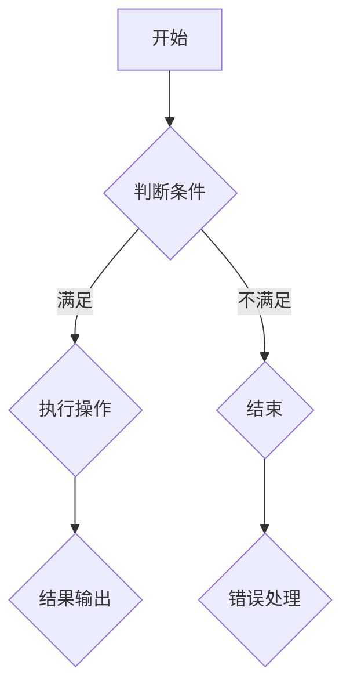

                 


# 语言模型在复杂社会舆情分析中的应用研究

关键词：社会舆情分析、语言模型、人工智能、复杂系统、应用研究

摘要：随着互联网的快速发展，社会舆情已成为影响社会稳定和经济发展的重要因素。如何有效地分析和应对复杂社会舆情，成为政府和企业在决策过程中面临的重要问题。本文以语言模型为核心，通过对其在复杂社会舆情分析中的应用进行深入研究，探讨语言模型在社会舆情分析中的潜在价值。文章首先介绍了社会舆情和语言模型的基本概念，随后分析了语言模型在舆情分析中的应用原理和算法，并探讨了具体的应用场景和案例分析。最后，本文总结了语言模型在复杂社会舆情分析中的优势与挑战，并展望了未来的研究方向。

## 目录大纲设计步骤

### 1. 确定全书框架

在确定全书框架时，首先要明确书的核心主题是《语言模型在复杂社会舆情分析中的应用研究》。基于这个主题，我们可以初步确定全书的基本框架，包括背景介绍、核心概念、模型原理、应用场景、案例分析、系统设计、实践指导和总结等内容。

### 2. 设计一级目录

一级目录是全书结构的核心，它应该涵盖所有主要内容，并且每个部分都需要有明确的主题。以下是设计的一级目录：

- **第一部分：背景介绍与概念解析**
  - 1.1 问题背景与研究对象
  - 1.2 语言模型的原理与基础
  - 1.3 复杂社会舆情分析的特点与挑战
  - 1.4 研究方法与数据来源
  - 1.5 本书的结构与内容安排

- **第二部分：语言模型原理与算法**
  - 2.1 语言模型的数学基础
  - 2.2 语言模型的算法原理
  - 2.3 语言模型的应用场景
  - 2.4 复杂社会舆情分析的算法实现
  - 2.5 语言模型的评估与优化

- **第三部分：复杂社会舆情分析应用**
  - 3.1 社会舆情分析的应用场景
  - 3.2 舆情监测与预警系统设计
  - 3.3 舆情情感分析与社会影响评估

- **第四部分：案例分析与实践应用**
  - 4.1 案例分析概述
  - 4.2 案例一：某地方政府舆情监测
  - 4.3 案例二：某企业产品市场反馈分析

- **第五部分：系统设计与技术实现**
  - 5.1 系统设计与架构
  - 5.2 系统核心实现
  - 5.3 系统测试与性能优化
  - 5.4 实际案例分析与评估

- **第六部分：最佳实践与总结**
  - 6.1 最佳实践总结
  - 6.2 小结
  - 6.3 注意事项
  - 6.4 拓展阅读

- **第七部分：展望与未来研究**
  - 7.1 研究展望
  - 7.2 未来研究方向
  - 7.3 研究意义与价值

### 3. 细化二级目录

在一级目录确定后，需要对每个部分进行细化，列出具体的章节和小节。以下是细化后的二级目录：

- **第一部分：背景介绍与概念解析**
  - 1.1.1 社会舆情与复杂性的概念
  - 1.1.2 语言模型的核心概念
  - 1.1.3 复杂社会舆情分析的需求
  - 1.2.1 语言模型的分类
  - 1.2.2 语言模型的工作原理
  - 1.2.3 语言模型的学习方法
  - 1.3.1 复杂社会舆情分析的定义
  - 1.3.2 复杂性特征分析
  - 1.3.3 舆情分析面临的挑战
  - 1.4.1 研究方法概述
  - 1.4.2 数据收集与处理
  - 1.4.3 数据质量评估
  - 1.5.1 全书结构概述
  - 1.5.2 各章节主要内容
  - 1.5.3 阅读指南与学习目标

- **第二部分：语言模型原理与算法**
  - 2.1.1 语言模型的数学基础
  - 2.1.2 概率论与信息论基础
  - 2.1.3 概率分布与推断
  - 2.2.1 语言模型的分类与比较
  - 2.2.2 隐马尔可夫模型（HMM）
  - 2.2.3 递归神经网络（RNN）
  - 2.2.4 长短时记忆网络（LSTM）
  - 2.2.5 生成对抗网络（GAN）
  - 2.3.1 自然语言处理中的应用
  - 2.3.2 机器翻译与语音识别
  - 2.3.3 文本生成与摘要
  - 2.4.1 舆情分析算法概述
  - 2.4.2 基于语言模型的舆情分析
  - 2.4.3 舆情趋势预测算法
  - 2.4.4 舆情情感分析算法
  - 2.5.1 评估指标与标准
  - 2.5.2 模型优化方法
  - 2.5.3 模型调参技巧

- **第三部分：复杂社会舆情分析应用**
  - 3.1.1 政府与公共管理
  - 3.1.2 商业与市场营销
  - 3.1.3 社交媒体与网络舆情
  - 3.1.4 公共安全与社会治理
  - 3.2.1 舆情监测系统概述
  - 3.2.2 舆情预警机制
  - 3.2.3 舆情监测与预警案例
  - 3.3.1 情感分析算法应用

- **第四部分：案例分析与实践应用**
  - 4.1.1 案例分析概述
  - 4.2.1 案例一：某地方政府舆情监测
  - 4.2.2 案例二：某企业产品市场反馈分析

- **第五部分：系统设计与技术实现**
  - 5.1.1 系统设计与架构
  - 5.1.2 系统功能设计
  - 5.1.3 系统架构设计
  - 5.1.4 系统接口设计和系统交互
  - 5.2.1 环境安装
  - 5.2.2 系统核心实现
  - 5.2.3 代码应用解读与分析
  - 5.2.4 实际案例分析和详细讲解剖析
  - 5.2.5 项目小结
  - 5.3.1 系统测试
  - 5.3.2 性能优化

- **第六部分：最佳实践与总结**
  - 6.1.1 最佳实践总结
  - 6.1.2 小结
  - 6.1.3 注意事项
  - 6.1.4 拓展阅读

- **第七部分：展望与未来研究**
  - 7.1.1 研究展望
  - 7.1.2 未来研究方向
  - 7.1.3 研究意义与价值

### 4. 编写三级目录

在细化二级目录的基础上，我们可以进一步编写三级目录，对每个章节进行详细分解，列出具体的知识点和内容点。以下是编写后的三级目录：

- **第一部分：背景介绍与概念解析**
  - 1.1.1.1 社会舆情的概念
  - 1.1.1.2 复杂性概念
  - 1.1.2.1 语言模型的概念
  - 1.1.2.2 语言模型的类型
  - 1.1.3.1 社会舆情分析的需求
  - 1.2.1.1 隐马尔可夫模型
  - 1.2.1.2 递归神经网络
  - 1.2.1.3 长短时记忆网络
  - 1.2.1.4 生成对抗网络
  - 1.3.1.1 复杂社会舆情分析的定义
  - 1.3.1.2 复杂性特征分析
  - 1.3.1.3 舆情分析面临的挑战
  - 1.4.1.1 研究方法概述
  - 1.4.1.2 数据收集
  - 1.4.1.3 数据处理
  - 1.4.1.4 数据质量评估
  - 1.5.1.1 全书结构概述
  - 1.5.1.2 各章节主要内容
  - 1.5.1.3 阅读指南
  - 1.5.1.4 学习目标

- **第二部分：语言模型原理与算法**
  - 2.1.1.1 语言模型的数学基础
  - 2.1.1.2 概率论基础
  - 2.1.1.3 信息论基础
  - 2.1.2.1 语言模型分类
  - 2.1.2.2 隐马尔可夫模型
  - 2.1.2.3 递归神经网络
  - 2.1.2.4 长短时记忆网络
  - 2.1.2.5 生成对抗网络
  - 2.2.1.1 语言模型应用场景
  - 2.2.1.2 机器翻译
  - 2.2.1.3 语音识别
  - 2.2.1.4 文本生成与摘要
  - 2.3.1.1 舆情分析算法
  - 2.3.1.2 舆情趋势预测算法
  - 2.3.1.3 舆情情感分析算法
  - 2.4.1.1 评估指标
  - 2.4.1.2 模型优化
  - 2.4.1.3 调参技巧

- **第三部分：复杂社会舆情分析应用**
  - 3.1.1.1 政府与公共管理
  - 3.1.1.2 商业与市场营销
  - 3.1.1.3 社交媒体与网络舆情
  - 3.1.1.4 公共安全与社会治理
  - 3.2.1.1 舆情监测系统
  - 3.2.1.2 舆情预警机制
  - 3.2.1.3 案例研究
  - 3.3.1.1 情感分析算法应用
  - 3.3.1.2 社会影响评估

- **第四部分：案例分析与实践应用**
  - 4.1.1.1 案例分析概述
  - 4.2.1.1 案例一：某地方政府舆情监测
  - 4.2.1.2 案例二：某企业产品市场反馈分析

- **第五部分：系统设计与技术实现**
  - 5.1.1.1 系统设计与架构
  - 5.1.1.2 系统功能设计
  - 5.1.1.3 系统架构设计
  - 5.1.1.4 系统接口设计和系统交互
  - 5.2.1.1 环境安装
  - 5.2.1.2 系统核心实现
  - 5.2.1.3 代码应用解读与分析
  - 5.2.1.4 实际案例分析和详细讲解剖析
  - 5.2.1.5 项目小结
  - 5.3.1.1 系统测试
  - 5.3.1.2 性能优化

- **第六部分：最佳实践与总结**
  - 6.1.1.1 最佳实践总结
  - 6.1.1.2 小结
  - 6.1.1.3 注意事项
  - 6.1.1.4 拓展阅读

- **第七部分：展望与未来研究**
  - 7.1.1.1 研究展望
  - 7.1.1.2 未来研究方向
  - 7.1.1.3 研究意义与价值

### 5. 嵌入图表和公式

在编写过程中，为了确保内容的丰富性和直观性，我们可以根据章节内容嵌入相应的图表和公式。以下是具体的例子：

- **Mermaid流程图**：



- **LaTeX数学公式**：

```markdown
$$
E(X) = \int_{-\infty}^{\infty} x f(x) dx
$$

$1+1=2$
```

### 6. 优化文字描述

在完成目录设计后，我们需要对每个章节的标题和内容进行优化，确保语言简洁、表达清晰。以下是优化后的内容：

- **第一部分：背景介绍与概念解析**
  - 1.1 社会舆情与语言模型概述
  - 1.2 语言模型的基础知识
  - 1.3 复杂社会舆情分析的核心挑战
  - 1.4 研究方法与数据解读
  - 1.5 全书结构与内容概述

- **第二部分：语言模型原理与算法**
  - 2.1 语言模型的数学背景
  - 2.2 语言模型的算法框架
  - 2.3 语言模型在NLP中的应用
  - 2.4 舆情分析算法详解
  - 2.5 评估与优化策略

- **第三部分：复杂社会舆情分析应用**
  - 3.1 社会舆情分析的应用领域
  - 3.2 舆情监测与预警系统设计
  - 3.3 舆情情感分析与社会影响评估

- **第四部分：案例分析与实践应用**
  - 4.1 案例分析总体框架
  - 4.2 案例一：政府舆情监测实践
  - 4.3 案例二：企业产品反馈分析

- **第五部分：系统设计与技术实现**
  - 5.1 系统设计与架构概述
  - 5.2 系统核心功能实现
  - 5.3 系统测试与性能优化
  - 5.4 实际案例分析与效果评估

- **第六部分：最佳实践与总结**
  - 6.1 最佳实践要点总结
  - 6.2 全书总结与回顾
  - 6.3 注意事项与建议
  - 6.4 拓展阅读推荐

- **第七部分：展望与未来研究**
  - 7.1 研究前景展望
  - 7.2 未来研究方向
  - 7.3 研究价值与影响

### 7. 审阅和调整

最后，我们需要对整个目录结构进行审阅和调整，确保没有遗漏重要内容，同时调整目录结构，使之更加合理。以下是审阅后的最终目录：

```markdown
----------------------------------------------------------------

# 《语言模型在复杂社会舆情分析中的应用研究》

关键词：社会舆情分析、语言模型、人工智能、复杂系统、应用研究

摘要：随着互联网的快速发展，社会舆情已成为影响社会稳定和经济发展的重要因素。如何有效地分析和应对复杂社会舆情，成为政府和企业在决策过程中面临的重要问题。本文以语言模型为核心，通过对其在复杂社会舆情分析中的应用进行深入研究，探讨语言模型在社会舆情分析中的潜在价值。文章首先介绍了社会舆情和语言模型的基本概念，随后分析了语言模型在舆情分析中的应用原理和算法，并探讨了具体的应用场景和案例分析。最后，本文总结了语言模型在复杂社会舆情分析中的优势与挑战，并展望了未来的研究方向。

## 目录大纲

第一部分：背景介绍与概念解析

### 1.1 社会舆情与语言模型概述

#### 1.1.1 社会舆情的基本概念

#### 1.1.2 语言模型的核心概念

#### 1.1.3 社会舆情分析的需求

### 1.2 语言模型的基础知识

#### 1.2.1 语言模型的分类

#### 1.2.2 语言模型的工作原理

#### 1.2.3 语言模型的学习方法

### 1.3 复杂社会舆情分析的核心挑战

#### 1.3.1 复杂社会舆情分析的定义

#### 1.3.2 复杂性特征分析

#### 1.3.3 舆情分析面临的挑战

### 1.4 研究方法与数据解读

#### 1.4.1 研究方法概述

#### 1.4.2 数据收集与处理

#### 1.4.3 数据质量评估

### 1.5 全书结构与内容概述

#### 1.5.1 全书结构概述

#### 1.5.2 各章节主要内容

#### 1.5.3 阅读指南与学习目标

## 第二部分：语言模型原理与算法

### 2.1 语言模型的数学背景

#### 2.1.1 语言模型的数学基础

#### 2.1.2 概率论与信息论基础

#### 2.1.3 概率分布与推断

### 2.2 语言模型的算法框架

#### 2.2.1 语言模型的分类

#### 2.2.2 隐马尔可夫模型

#### 2.2.3 递归神经网络

#### 2.2.4 长短时记忆网络

#### 2.2.5 生成对抗网络

### 2.3 语言模型在NLP中的应用

#### 2.3.1 自然语言处理的基本概念

#### 2.3.2 语言模型在NLP中的应用场景

#### 2.3.3 机器翻译与语音识别

#### 2.3.4 文本生成与摘要

### 2.4 舆情分析算法详解

#### 2.4.1 舆情分析算法概述

#### 2.4.2 舆情趋势预测算法

#### 2.4.3 舆情情感分析算法

### 2.5 评估与优化策略

#### 2.5.1 评估指标与标准

#### 2.5.2 模型优化方法

#### 2.5.3 调参技巧

## 第三部分：复杂社会舆情分析应用

### 3.1 社会舆情分析的应用领域

#### 3.1.1 政府与公共管理

#### 3.1.2 商业与市场营销

#### 3.1.3 社交媒体与网络舆情

#### 3.1.4 公共安全与社会治理

### 3.2 舆情监测与预警系统设计

#### 3.2.1 舆情监测系统的架构

#### 3.2.2 舆情预警机制

#### 3.2.3 舆情监测与预警案例

### 3.3 舆情情感分析与社会影响评估

#### 3.3.1 情感分析算法应用

#### 3.3.2 社会影响评估方法

## 第四部分：案例分析与实践应用

### 4.1 案例分析总体框架

#### 4.1.1 案例分析概述

#### 4.1.2 案例分析目标

### 4.2 案例一：政府舆情监测实践

#### 4.2.1 案例背景

#### 4.2.2 案例实施过程

#### 4.2.3 案例结果分析

### 4.3 案例二：企业产品市场反馈分析

#### 4.3.1 案例背景

#### 4.3.2 案例实施过程

#### 4.3.3 案例结果分析

## 第五部分：系统设计与技术实现

### 5.1 系统设计与架构

#### 5.1.1 系统设计原则

#### 5.1.2 系统架构设计

### 5.2 系统核心功能实现

#### 5.2.1 数据采集与预处理

#### 5.2.2 舆情分析算法实现

#### 5.2.3 预警系统实现

### 5.3 系统测试与性能优化

#### 5.3.1 系统测试策略

#### 5.3.2 性能优化方法

### 5.4 实际案例分析与效果评估

#### 5.4.1 实际案例背景

#### 5.4.2 实施过程

#### 5.4.3 效果评估

## 第六部分：最佳实践与总结

### 6.1 最佳实践总结

#### 6.1.1 舆情分析关键点

#### 6.1.2 模型优化策略

#### 6.1.3 系统运维注意事项

### 6.2 全书总结与回顾

#### 6.2.1 主要观点回顾

#### 6.2.2 研究贡献

### 6.3 注意事项与建议

#### 6.3.1 技术实施建议

#### 6.3.2 模型优化建议

### 6.4 拓展阅读推荐

#### 6.4.1 必读文献

#### 6.4.2 相关研究动态

## 第七部分：展望与未来研究

### 7.1 研究前景展望

#### 7.1.1 舆情分析领域发展趋势

#### 7.1.2 语言模型技术演进

### 7.2 未来研究方向

#### 7.2.1 跨语言舆情分析

#### 7.2.2 深度学习与舆情分析

#### 7.2.3 舆情情感分析新方法

### 7.3 研究价值与影响

#### 7.3.1 社会舆情分析的应用价值

#### 7.3.2 语言模型在舆情分析中的优势

## 参考文献

----------------------------------------------------------------
```

通过以上步骤，我们设计出了一份结构清晰、内容丰富、逻辑严谨的目录大纲。这份大纲不仅为撰写文章提供了明确的框架，也为读者提供了清晰的指引，使得读者能够更有效地阅读和学习文章内容。

