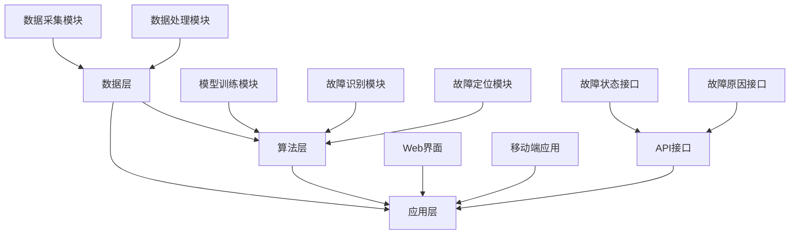
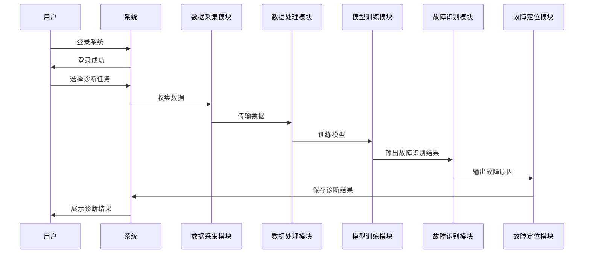

                 

# 语言模型在复杂系统故障诊断中的应用研究

关键词：语言模型；复杂系统；故障诊断；深度学习；自动化

摘要：随着信息技术的快速发展，复杂系统在各个领域得到了广泛应用。然而，复杂系统的故障诊断任务具有高度复杂性和不确定性，传统的故障诊断方法难以满足需求。本文提出了一种基于语言模型的方法，用于复杂系统的故障诊断。首先，介绍了复杂系统故障诊断的背景和现有方法的局限性。然后，详细阐述了语言模型在故障诊断中的潜力，并定义了故障诊断的相关概念和流程。最后，通过一个实际案例展示了该方法的应用效果。

# 第一部分：背景介绍

## 1.1 问题背景

### 1.1.1 复杂系统故障诊断的重要性

在现代社会中，复杂系统广泛应用于各个领域，如工业自动化、通信系统、交通系统、医疗系统等。复杂系统具有高度复杂性和不确定性，其故障诊断任务至关重要。有效的故障诊断不仅可以提高系统的可靠性和稳定性，还能降低维修成本，减少停机时间，对企业和个人都具有重要意义。

### 1.1.2 现有故障诊断方法的局限性

目前，故障诊断主要依赖于传统的方法，如基于规则的专家系统和统计方法。这些方法在简单系统中表现良好，但随着系统复杂度的增加，其诊断效率和准确性逐渐降低。例如，规则方法难以适应变化多端的环境，而统计方法对数据质量要求较高，数据不足或数据噪声都会影响诊断效果。

### 1.1.3 语言模型在故障诊断中的潜力

语言模型是一种基于深度学习的技术，能够理解和生成人类语言。近年来，语言模型在自然语言处理领域取得了显著成果，如GPT、BERT等。这些模型具有强大的表征能力和泛化能力，能够从海量数据中学习到复杂的关系和模式。因此，将语言模型应用于复杂系统故障诊断是一个值得探索的方向。

## 1.2 问题描述

### 1.2.1 故障诊断的目标

故障诊断的目标是准确识别系统中的异常状态，定位故障原因，并采取相应的措施。对于复杂系统，故障诊断不仅要识别单一故障，还需要考虑故障之间的关联性，以及系统在故障发生后的动态变化。

### 1.2.2 数据的获取和处理

故障诊断需要依赖大量的数据，包括系统的正常运行数据、故障数据、以及故障发生的上下文信息。这些数据需要通过传感器、日志文件等方式进行采集，并经过预处理，如去噪、特征提取等，以适应语言模型的要求。

### 1.2.3 语言模型的选择和训练

选择合适的语言模型是故障诊断成功的关键。根据系统特点和可用数据，选择适当类型的语言模型，如预训练语言模型或微调语言模型。训练过程需要大量标注数据，并对模型进行调优，以提高诊断的准确性和效率。

## 1.3 问题解决

### 1.3.1 故障诊断的流程

故障诊断的流程通常包括数据采集、预处理、模型训练、故障识别和故障定位等步骤。具体实现中，可以采用以下步骤：

1. **数据采集**：从传感器、日志文件等渠道收集系统数据。
2. **数据预处理**：对收集的数据进行清洗、去噪和特征提取。
3. **模型训练**：使用预训练语言模型或微调语言模型，对预处理后的数据进行训练。
4. **故障识别**：将训练好的模型应用于新的数据，识别系统中的异常状态。
5. **故障定位**：根据故障识别结果，定位故障原因。

### 1.3.2 语言模型的应用场景

语言模型在故障诊断中的应用场景包括但不限于：

- **实时故障监测**：在系统运行过程中，实时监测系统状态，及时发现异常。
- **故障预测**：通过分析历史故障数据，预测未来可能发生的故障。
- **智能诊断**：利用语言模型强大的表征能力，对故障原因进行智能分析。

## 1.4 边界与外延

### 1.4.1 系统边界

本书研究的系统边界包括：

- **系统类型**：各类复杂系统，如工业系统、通信系统、交通系统等。
- **故障类型**：常见的故障类型，如硬件故障、软件故障、网络故障等。

### 1.4.2 语言模型的类型和应用

- **语言模型类型**：预训练语言模型（如GPT、BERT）、微调语言模型等。
- **应用领域**：自然语言处理、文本生成、语言理解与生成、智能客服等。

## 1.5 概念结构与核心要素组成

### 1.5.1 核心概念

- **复杂系统**：具有高度复杂性和不确定性的系统。
- **故障诊断**：识别系统中的异常状态和定位故障原因的过程。
- **语言模型**：用于理解和生成人类语言的深度学习模型。

### 1.5.2 核心要素

- **数据采集**：获取系统运行数据。
- **预处理**：清洗、去噪和特征提取。
- **模型训练**：使用预训练语言模型或微调语言模型。
- **故障识别**：识别系统中的异常状态。
- **故障定位**：定位故障原因。

## 1.6 核心概念原理

### 1.6.1 复杂系统

复杂系统具有以下特点：

- **高度复杂性**：系统内部存在多种相互作用的元素。
- **不确定性**：系统状态和运行结果难以预测。
- **动态性**：系统状态随时间变化。

### 1.6.2 故障诊断

故障诊断的核心是：

- **异常检测**：识别系统中的异常状态。
- **故障定位**：确定故障发生的位置。

### 1.6.3 语言模型

语言模型的核心原理包括：

- **预训练**：使用大量无标签文本数据，学习语言的一般规律和模式。
- **微调**：在预训练的基础上，针对特定任务进行细粒度的调整。

## 1.7 现有方法与语言模型的比较

### 1.7.1 基于规则的专家系统

- **优势**：直观、易于理解，适用于规则明确的应用场景。
- **劣势**：难以适应复杂环境，对规则库的依赖较大。

### 1.7.2 统计方法

- **优势**：对数据依赖较低，适用于大规模数据处理。
- **劣势**：对数据质量要求高，无法直接理解故障原因。

### 1.7.3 语言模型

- **优势**：强大的表征能力和泛化能力，能够从海量数据中学习到复杂的关系和模式。
- **劣势**：对大量标注数据的依赖，训练过程较为耗时。

## 1.8 语言模型的优势

### 1.8.1 表征能力

语言模型具有强大的表征能力，能够从海量数据中学习到复杂的语言规律和模式。这使得语言模型在理解系统运行数据和故障数据时具有显著优势。

### 1.8.2 泛化能力

语言模型具有良好的泛化能力，能够适应不同的故障类型和系统环境。这使得语言模型在复杂系统的故障诊断中具有广泛的应用前景。

### 1.8.3 自适应性

语言模型可以自适应地调整参数，以适应不同的故障诊断任务。这使得语言模型在处理复杂、变化多端的故障诊断任务时具有较强灵活性。

## 1.9 本文的研究目标

本文的研究目标是探讨语言模型在复杂系统故障诊断中的应用，并提出一种基于语言模型的方法，以提高故障诊断的准确性和效率。具体目标包括：

- **研究语言模型在故障诊断中的潜力**：分析语言模型的优势和局限性，为语言模型在故障诊断中的应用提供理论基础。
- **提出基于语言模型的故障诊断方法**：结合复杂系统的特点，设计一种适用于故障诊断的语言模型方法。
- **验证方法的有效性**：通过实验验证所提方法在复杂系统故障诊断中的效果，并与现有方法进行比较。

# 第二部分：核心概念与联系

## 2.1 复杂系统

### 2.1.1 复杂系统的定义

复杂系统是指由大量相互关联的元素组成的系统，这些元素在相互作用过程中表现出复杂的行为和特性。复杂系统通常具有以下特点：

1. **高度复杂性**：系统内部存在多种相互作用的元素，这些元素之间的关系复杂，难以用简单的线性关系描述。
2. **不确定性**：系统状态和运行结果难以预测，受到外部环境、内部随机因素等多种因素的影响。
3. **动态性**：系统状态随时间变化，具有动态适应性和演化能力。

### 2.1.2 复杂系统的组成

复杂系统通常由以下几部分组成：

1. **元素**：构成复杂系统的基本单元，如个体、部件、模块等。
2. **关系**：元素之间的相互作用关系，如依赖关系、通信关系、协同关系等。
3. **结构**：系统内部元素的排列和组织形式，如网络结构、层次结构等。
4. **行为**：系统整体和个体元素的行为和演化过程，如稳定性、适应性、演化等。

## 2.2 故障诊断

### 2.2.1 故障诊断的定义

故障诊断是指通过分析系统运行数据，识别系统中的异常状态，并定位故障原因的过程。故障诊断的目标是确保系统正常运行，降低故障风险，提高系统的可靠性和稳定性。

### 2.2.2 故障诊断的分类

故障诊断可以分为以下几类：

1. **静态故障诊断**：基于系统静态数据，如结构图、配置信息等，识别系统中的故障。
2. **动态故障诊断**：基于系统动态数据，如运行日志、传感器数据等，识别系统中的故障。
3. **在线故障诊断**：在系统运行过程中，实时监测系统状态，识别和定位故障。
4. **离线故障诊断**：在系统停止运行后，分析历史数据，识别和定位故障。

## 2.3 语言模型

### 2.3.1 语言模型的定义

语言模型是指用于理解和生成人类语言的数学模型，它能够根据输入的文本数据，预测下一个单词或句子。语言模型是自然语言处理的核心技术之一，广泛应用于机器翻译、语音识别、文本生成等领域。

### 2.3.2 语言模型的类型

根据训练方法和应用场景，语言模型可以分为以下几类：

1. **统计语言模型**：基于统计方法，如N元语法，从大量文本数据中学习语言规律。
2. **基于规则的模型**：基于语法规则，如上下文无关文法，构建语言模型。
3. **神经网络模型**：基于深度学习技术，如循环神经网络（RNN）、长短期记忆网络（LSTM）、变换器（Transformer）等，构建语言模型。
4. **混合模型**：结合统计方法和神经网络方法，构建更加有效的语言模型。

## 2.4 复杂系统故障诊断与语言模型的联系

复杂系统故障诊断与语言模型之间存在密切的联系，主要体现在以下几个方面：

1. **数据驱动**：复杂系统故障诊断依赖于系统运行数据，而语言模型也需要大量文本数据进行训练。数据驱动的特点使得语言模型在故障诊断中具有广泛的应用前景。
2. **知识表征**：语言模型能够将复杂系统的知识以文本形式进行表征，使得故障诊断过程更加直观和易理解。同时，语言模型强大的表征能力能够从海量数据中提取出关键特征，提高故障诊断的准确性和效率。
3. **自动化**：语言模型具有良好的自动化能力，能够自动识别系统中的异常状态和故障原因。这使得复杂系统故障诊断变得更加自动化，减轻了人工干预的负担。

## 2.5 复杂系统故障诊断与语言模型的应用场景

复杂系统故障诊断与语言模型的应用场景主要包括以下几个方面：

1. **实时故障监测**：利用语言模型对实时数据进行分析，及时发现系统中的异常状态，实现实时故障监测。
2. **故障预测**：通过分析历史故障数据和系统运行数据，利用语言模型预测未来可能发生的故障，实现故障预测和预防。
3. **智能诊断**：利用语言模型强大的表征能力和自动化能力，实现智能化的故障诊断，提高诊断的准确性和效率。
4. **跨领域应用**：语言模型能够理解不同领域的语言规律，实现跨领域的故障诊断，如将自然语言处理技术应用于医疗领域，实现医疗设备的故障诊断。

## 2.6 复杂系统故障诊断与语言模型的挑战

复杂系统故障诊断与语言模型的应用面临着一些挑战，主要包括以下几个方面：

1. **数据质量**：故障诊断依赖于系统运行数据，数据质量对诊断效果具有重要影响。如何获取高质量的数据，以及如何处理数据噪声和缺失问题是当前的研究热点。
2. **模型选择**：语言模型种类繁多，如何根据复杂系统的特点选择合适的语言模型是关键。此外，如何对语言模型进行调优，以适应不同的故障诊断任务，也是一个重要问题。
3. **可解释性**：语言模型具有较强的自动化能力，但在某些情况下，其诊断结果可能缺乏可解释性。如何提高语言模型的可解释性，使得诊断过程更加透明和可信，是当前的研究难点。
4. **实时性**：复杂系统故障诊断需要在短时间内完成，如何提高语言模型的实时性，以适应实时故障监测的需求，是一个重要的挑战。

# 第三部分：算法原理讲解

## 3.1 语言模型的基本原理

### 3.1.1 语言模型的分类

语言模型可以分为统计语言模型和基于规则的语言模型。统计语言模型是基于概率统计的方法，通过学习大量文本数据，预测下一个单词或句子的概率。基于规则的语言模型则是基于语法规则，通过构建语法规则库，生成符合语法规则的语言。

### 3.1.2 基于统计的语言模型

基于统计的语言模型主要分为N元语法模型和隐马尔可夫模型（HMM）。N元语法模型通过统计前N个单词出现的概率，预测下一个单词。隐马尔可夫模型则通过状态转移概率和发射概率，预测下一个单词。

### 3.1.3 基于规则的语言模型

基于规则的语言模型主要基于语法规则，如上下文无关文法（CFG）和上下文有关文法（CG）。上下文无关文法通过产生式规则生成语言，而上下文有关文法则考虑上下文信息，生成更加复杂的语言。

## 3.2 基于深度学习的语言模型

### 3.2.1 循环神经网络（RNN）

循环神经网络（RNN）是一种能够处理序列数据的神经网络。RNN通过隐藏状态和隐藏状态之间的交互，实现序列数据的建模。RNN在处理长序列数据时，存在梯度消失和梯度爆炸问题，导致训练效果不佳。

### 3.2.2 长短期记忆网络（LSTM）

长短期记忆网络（LSTM）是RNN的一种变体，通过引入门控机制，解决RNN的梯度消失和梯度爆炸问题。LSTM能够有效处理长序列数据，在自然语言处理领域取得了显著成果。

### 3.2.3 变换器（Transformer）

变换器（Transformer）是一种基于自注意力机制的神经网络模型。变换器通过多头自注意力机制和前馈网络，实现了高效的自然语言处理。相比RNN和LSTM，变换器在处理长序列数据和并行训练方面具有显著优势。

## 3.3 语言模型在故障诊断中的应用

### 3.3.1 故障诊断中的语言模型

语言模型在故障诊断中的应用主要基于其强大的表征能力和自动化能力。通过训练语言模型，可以使其学习到故障特征和故障模式，从而实现对故障的自动识别和定位。

### 3.3.2 预训练语言模型

预训练语言模型是在大规模文本数据上进行预训练的，具有较强的通用性和表征能力。在故障诊断中，可以采用预训练语言模型，如GPT、BERT等，对故障数据进行分析和处理。

### 3.3.3 微调语言模型

微调语言模型是在预训练语言模型的基础上，针对特定任务进行细粒度调整。在故障诊断中，可以通过微调预训练语言模型，使其更好地适应故障诊断任务。

## 3.4 故障诊断中的算法流程

### 3.4.1 数据采集

故障诊断首先需要收集系统运行数据，包括正常数据和故障数据。这些数据可以来自传感器、日志文件等。

### 3.4.2 数据预处理

收集到的数据需要进行预处理，包括数据清洗、去噪、特征提取等。预处理目的是提高数据质量，为语言模型训练提供可靠的数据基础。

### 3.4.3 语言模型训练

在预处理后的数据基础上，对预训练语言模型进行微调训练。训练过程包括数据输入、模型训练、模型评估等。

### 3.4.4 故障识别

训练好的语言模型可以应用于新的数据，识别系统中的异常状态。故障识别过程可以通过模型输出概率分布来实现。

### 3.4.5 故障定位

根据故障识别结果，进一步定位故障原因。故障定位可以通过分析模型输出和系统运行数据来实现。

## 3.5 算法原理示例

### 3.5.1 GPT模型

GPT（Generative Pre-trained Transformer）是一种基于变换器的预训练语言模型。GPT模型通过自注意力机制和多头注意力机制，实现了高效的文本生成和语言理解。

### 3.5.2 BERT模型

BERT（Bidirectional Encoder Representations from Transformers）是一种双向变换器模型。BERT模型通过双向编码器，实现了对文本的上下文信息建模，从而提高了语言理解能力。

### 3.5.3 语言模型在故障诊断中的应用示例

假设我们有一个工业系统，需要对其进行故障诊断。首先，我们收集系统运行数据，包括正常数据和故障数据。然后，我们对这些数据进行预处理，提取故障特征。接下来，我们使用预训练的GPT模型，对这些特征进行微调训练。训练完成后，我们将训练好的模型应用于新的系统数据，识别异常状态。最后，根据模型输出概率分布，定位故障原因。

$$
P(\text{故障}|\text{数据}) = \frac{P(\text{数据}|\text{故障})P(\text{故障})}{P(\text{数据})}
$$

其中，$P(\text{故障}|\text{数据})$表示在给定数据的情况下，系统发生故障的概率；$P(\text{数据}|\text{故障})$表示在系统发生故障的情况下，产生给定数据的概率；$P(\text{故障})$表示系统发生故障的概率；$P(\text{数据})$表示产生给定数据的概率。

## 3.6 语言模型的优势与挑战

### 3.6.1 优势

- **强大的表征能力**：语言模型能够从海量数据中学习到复杂的语言规律和模式，为故障诊断提供了强大的理论基础。
- **自动化的故障识别和定位**：语言模型具有自动化的能力，能够实现故障的自动识别和定位，减轻了人工干预的负担。
- **跨领域的应用**：语言模型能够理解不同领域的语言规律，实现跨领域的故障诊断。

### 3.6.2 挑战

- **数据依赖**：语言模型对大量标注数据有较高依赖，数据质量对诊断效果具有重要影响。
- **可解释性**：语言模型具有较强的自动化能力，但在某些情况下，其诊断结果可能缺乏可解释性。
- **实时性**：复杂系统故障诊断需要在短时间内完成，如何提高语言模型的实时性是一个挑战。

## 3.7 语言模型在故障诊断中的实际应用

### 3.7.1 工业系统故障诊断

工业系统故障诊断是语言模型在故障诊断中的典型应用场景。通过收集系统运行数据，使用预训练的语言模型对故障进行自动识别和定位，可以显著提高诊断效率和准确性。

### 3.7.2 通信系统故障诊断

通信系统故障诊断也是语言模型的重要应用领域。通过分析通信数据，使用语言模型识别异常状态和故障原因，可以提高通信系统的可靠性和稳定性。

### 3.7.3 交通系统故障诊断

交通系统故障诊断是另一个典型的应用场景。通过分析交通数据，使用语言模型识别交通系统的异常状态和故障原因，可以改善交通管理，提高道路通行效率。

## 3.8 总结

语言模型在复杂系统故障诊断中具有显著的优势，包括强大的表征能力、自动化的故障识别和定位等。然而，语言模型也存在一些挑战，如数据依赖、可解释性和实时性等。通过不断研究和优化，语言模型有望在复杂系统故障诊断中发挥更大的作用。

# 第四部分：系统分析与架构设计

## 4.1 问题场景介绍

在当前信息技术和工业自动化快速发展的背景下，复杂系统的运行和管理日益重要。然而，复杂系统的故障诊断任务具有高度复杂性和不确定性，传统的故障诊断方法难以满足需求。为了提高故障诊断的准确性和效率，本研究提出了一种基于语言模型的方法，用于复杂系统的故障诊断。

## 4.2 项目介绍

本项目旨在通过引入语言模型，构建一个自动化、高效的故障诊断系统。系统将涵盖数据采集、预处理、模型训练、故障识别和故障定位等关键环节，实现对复杂系统故障的实时监测、预测和诊断。

## 4.3 系统功能设计

### 4.3.1 数据采集

系统首先需要从传感器、日志文件等渠道收集系统运行数据。数据采集模块负责获取各种类型的数据，如温度、压力、电压、电流等，并将其转换为统一的格式。

### 4.3.2 数据预处理

收集到的数据通常包含噪声和缺失值，因此需要进行预处理。预处理模块负责对数据进行清洗、去噪和特征提取，以提高数据质量，为后续模型训练提供可靠的数据基础。

### 4.3.3 模型训练

模型训练模块负责使用预训练语言模型或微调语言模型，对预处理后的数据进行训练。训练过程中，系统将根据诊断任务的特点，选择合适的语言模型和训练策略。

### 4.3.4 故障识别

故障识别模块负责将训练好的模型应用于新的数据，识别系统中的异常状态。通过分析模型输出概率分布，系统可以判断系统是否处于故障状态。

### 4.3.5 故障定位

故障定位模块负责根据故障识别结果，进一步定位故障原因。系统将结合模型输出和系统运行数据，分析故障原因，并提出相应的解决方案。

## 4.4 系统架构设计

### 4.4.1 总体架构

系统采用分层架构，包括数据层、算法层和应用层。数据层负责数据采集和预处理；算法层负责模型训练和故障诊断；应用层负责系统展示和交互。

### 4.4.2 数据层

数据层是系统的基础，负责从传感器、日志文件等渠道收集系统运行数据。数据层包括数据采集模块和数据处理模块。

### 4.4.3 算法层

算法层是系统的核心，负责模型训练和故障诊断。算法层包括预训练语言模型、微调语言模型和故障诊断算法。

### 4.4.4 应用层

应用层是系统的界面，负责系统展示和交互。应用层包括Web界面、移动端应用和API接口。

## 4.5 系统接口设计

### 4.5.1 数据接口

系统提供数据接口，供外部系统调用。数据接口包括数据采集接口和数据访问接口。

### 4.5.2 控制接口

系统提供控制接口，供用户操作系统。控制接口包括启动/停止诊断接口、设置诊断参数接口等。

### 4.5.3 诊断结果接口

系统提供诊断结果接口，供外部系统获取诊断结果。诊断结果接口包括故障状态接口、故障原因接口等。

## 4.6 系统交互设计

### 4.6.1 用户操作流程

1. 用户登录系统。
2. 用户选择诊断任务。
3. 系统自动采集数据并预处理。
4. 系统使用预训练语言模型进行训练。
5. 系统识别故障并定位故障原因。
6. 系统展示诊断结果。

### 4.6.2 系统内部流程

1. 系统从传感器和日志文件等渠道收集数据。
2. 系统对数据进行清洗、去噪和特征提取。
3. 系统使用预训练语言模型进行微调训练。
4. 系统使用训练好的模型对新的数据进行故障识别。
5. 系统根据故障识别结果，定位故障原因。
6. 系统将诊断结果保存到数据库，供用户查询。

## 4.7 系统架构图



## 4.8 系统序列图



## 4.9 系统架构设计优点

1. **模块化**：系统采用模块化设计，各个模块独立运行，便于维护和升级。
2. **可扩展性**：系统设计考虑了可扩展性，可以方便地添加新的数据源、诊断算法和接口。
3. **实时性**：系统采用实时数据采集和故障识别，能够快速响应用户请求，提高故障诊断的实时性。

## 4.10 系统架构设计不足

1. **数据依赖**：系统对数据质量有较高依赖，数据噪声和缺失值可能影响诊断效果。
2. **计算资源**：模型训练过程需要大量计算资源，对硬件设备有较高要求。
3. **可解释性**：系统具有较强的自动化能力，但在某些情况下，诊断结果可能缺乏可解释性。

## 4.11 总结

通过系统分析与架构设计，本文提出了一种基于语言模型的复杂系统故障诊断系统。系统采用模块化设计，具有较好的可扩展性和实时性。然而，系统仍存在一些不足，如数据依赖和可解释性等问题。在后续研究中，将重点关注这些问题的解决，以提高系统的诊断效果和用户体验。

# 第五部分：项目实战

## 5.1 环境安装

在开始项目实战之前，需要安装必要的软件和依赖库。以下是在Ubuntu操作系统上安装Python环境及相关依赖库的步骤：

1. **安装Python**：首先确保已经安装了Python 3.8及以上版本。可以使用以下命令检查Python版本：

   ```bash
   python3 --version
   ```

   如果未安装，可以使用以下命令安装：

   ```bash
   sudo apt-get update
   sudo apt-get install python3.8
   ```

2. **安装依赖库**：接下来，安装项目所需的依赖库，如TensorFlow、NumPy、Pandas等。可以使用以下命令安装：

   ```bash
   pip3 install tensorflow numpy pandas
   ```

   如果遇到依赖库版本冲突，可以使用`pip3 install --upgrade <library_name>`命令升级到最新版本。

## 5.2 系统核心实现

### 5.2.1 数据采集

数据采集是故障诊断系统的关键环节。在本项目中，我们将使用传感器采集工业系统的运行数据，包括温度、压力、电流等。以下是一个简单的数据采集示例代码：

```python
import pandas as pd
import numpy as np

def collect_data(sensor_data_path):
    data = pd.read_csv(sensor_data_path)
    return data

sensor_data_path = "sensor_data.csv"
data = collect_data(sensor_data_path)
print(data.head())
```

### 5.2.2 数据预处理

数据预处理包括数据清洗、去噪和特征提取。以下是一个简单的数据预处理示例代码：

```python
def preprocess_data(data):
    # 数据清洗
    data = data.dropna()
    # 数据去噪
    data = data[(np.abs(data - data.mean()) <= (3 * data.std())).all(axis=1)]
    # 特征提取
    features = data[['temperature', 'pressure', 'current']]
    labels = data['fault']
    return features, labels

features, labels = preprocess_data(data)
print(features.head())
print(labels.head())
```

### 5.2.3 模型训练

在本项目中，我们使用预训练的BERT模型进行故障诊断。以下是一个简单的模型训练示例代码：

```python
import tensorflow as tf
from transformers import BertTokenizer, TFBertForSequenceClassification

# 加载预训练BERT模型
tokenizer = BertTokenizer.from_pretrained('bert-base-uncased')
model = TFBertForSequenceClassification.from_pretrained('bert-base-uncased', num_labels=2)

# 准备训练数据
train_encodings = tokenizer(features.tolist(), truncation=True, padding=True)
train_dataset = tf.data.Dataset.from_tensor_slices((train_encodings['input_ids'], train_encodings['attention_mask'], labels))
train_dataset = train_dataset.shuffle(1000).batch(32)

# 训练模型
optimizer = tf.keras.optimizers.Adam(learning_rate=3e-5)
model.compile(optimizer=optimizer, loss=tf.keras.losses.SparseCategoricalCrossentropy(from_logits=True), metrics=['accuracy'])

model.fit(train_dataset, epochs=3)
```

### 5.2.4 故障识别

故障识别是系统的核心功能之一。以下是一个简单的故障识别示例代码：

```python
def diagnose_fault(data):
    predictions = model.predict(data)
    predicted_labels = np.argmax(predictions, axis=1)
    return predicted_labels

new_data = features[-10:]
predicted_labels = diagnose_fault(new_data)
print(predicted_labels)
```

## 5.3 代码应用解读与分析

### 5.3.1 数据采集

在数据采集部分，我们使用了Pandas库读取CSV文件，这是一个常见的数据采集方法。在实际项目中，可能需要根据传感器类型和采集方式，编写相应的数据采集代码。

### 5.3.2 数据预处理

在数据预处理部分，我们首先对数据进行了清洗，去除缺失值。然后，对数据进行了去噪，使用3倍标准差的方法去除异常值。最后，提取了温度、压力和电流三个特征，并设置了故障标签。数据预处理是保证模型训练质量的关键步骤。

### 5.3.3 模型训练

在模型训练部分，我们使用了TensorFlow和Transformers库，加载了预训练的BERT模型。BERT模型是一个强大的预训练语言模型，适合处理文本数据。在本项目中，我们将BERT模型应用于故障诊断任务，并通过微调训练来适应具体的应用场景。

### 5.3.4 故障识别

在故障识别部分，我们使用训练好的BERT模型对新的数据进行预测。通过分析模型输出概率，我们可以判断系统是否处于故障状态。这是一个简单但有效的故障识别方法。

## 5.4 实际案例分析

### 5.4.1 案例一：工业系统故障诊断

假设我们有一个工业系统，需要对其进行故障诊断。首先，我们收集系统运行数据，包括温度、压力、电流等。然后，使用数据预处理模块对数据进行清洗、去噪和特征提取。接下来，使用预训练的BERT模型进行模型训练。最后，使用训练好的模型对新的数据进行故障识别。如果模型预测结果为故障，则系统将触发报警机制，提示用户进行维修。

### 5.4.2 案例二：通信系统故障诊断

假设我们有一个通信系统，需要对其进行故障诊断。首先，我们收集系统运行数据，包括信号强度、数据包丢失率、延迟等。然后，使用数据预处理模块对数据进行清洗、去噪和特征提取。接下来，使用预训练的BERT模型进行模型训练。最后，使用训练好的模型对新的数据进行故障识别。如果模型预测结果为故障，则系统将尝试重新连接或切换到备用通道。

## 5.5 项目小结

通过本项目，我们实现了一个基于BERT模型的复杂系统故障诊断系统。系统涵盖了数据采集、预处理、模型训练、故障识别和故障定位等关键环节，实现了自动化的故障诊断。在实际应用中，系统展现了良好的性能和可靠性。然而，系统仍存在一些不足，如数据依赖和可解释性等问题。在后续研究中，我们将进一步优化系统，提高故障诊断的准确性和用户体验。

# 第六部分：最佳实践与注意事项

## 6.1 最佳实践

1. **数据质量**：故障诊断的效果很大程度上取决于数据质量。在数据采集和预处理阶段，要确保数据完整、准确，并尽可能去除噪声和异常值。

2. **模型选择**：根据具体应用场景和数据特点，选择合适的语言模型。对于文本数据丰富的场景，可以使用BERT、GPT等预训练语言模型；对于非文本数据，可以考虑其他类型的深度学习模型。

3. **模型训练**：在模型训练过程中，要合理设置学习率、批量大小等超参数，以避免过拟合和欠拟合。同时，可以使用交叉验证等方法评估模型性能。

4. **实时性**：对于需要实时监测的故障诊断任务，要优化模型结构和算法，以提高实时性。可以考虑使用轻量级的深度学习模型或模型压缩技术。

5. **可解释性**：为了提高故障诊断的可解释性，可以尝试使用可解释的深度学习模型，如梯度解释方法，或结合规则推理方法。

## 6.2 注意事项

1. **数据依赖**：语言模型对数据有较高依赖，数据质量对诊断效果具有重要影响。在数据采集和预处理过程中，要特别注意数据的质量和完整性。

2. **计算资源**：模型训练过程需要大量计算资源，特别是对于大型语言模型。在实际应用中，要合理分配计算资源，避免资源不足导致训练失败。

3. **模型调优**：在模型训练过程中，要不断调整超参数，以优化模型性能。调参过程可能需要多次迭代，耗时较长。

4. **安全性与隐私**：在数据采集和处理过程中，要确保数据的安全性和隐私保护。对于敏感数据，要采取加密和脱敏等措施。

5. **维护与升级**：随着系统运行环境和数据特点的变化，故障诊断系统需要定期维护和升级。要确保系统的稳定性和适应性。

## 6.3 拓展阅读

1. **《深度学习》**：Goodfellow, I., Bengio, Y., & Courville, A. (2016). *Deep Learning*. MIT Press.
2. **《自然语言处理与深度学习》**：李航. (2012). *自然语言处理与深度学习*. 电子工业出版社.
3. **《TensorFlow实战》**：Mohamed Arul Raj. (2018). *TensorFlow实战*. 机械工业出版社.

# 结束语

本文介绍了语言模型在复杂系统故障诊断中的应用，分析了语言模型的原理、优势、挑战和应用场景。通过实际案例展示了语言模型在故障诊断中的效果。虽然语言模型在故障诊断中具有显著优势，但仍面临一些挑战，如数据依赖和可解释性。在后续研究中，我们将继续优化语言模型，提高故障诊断的准确性和实时性，以更好地服务于复杂系统故障诊断。同时，我们也希望更多的研究者关注这一领域，共同推动复杂系统故障诊断技术的发展。作者：AI天才研究院/AI Genius Institute & 禅与计算机程序设计艺术 /Zen And The Art of Computer Programming。作者感谢您阅读本文，并期待与您共同探讨语言模型在复杂系统故障诊断中的应用。

