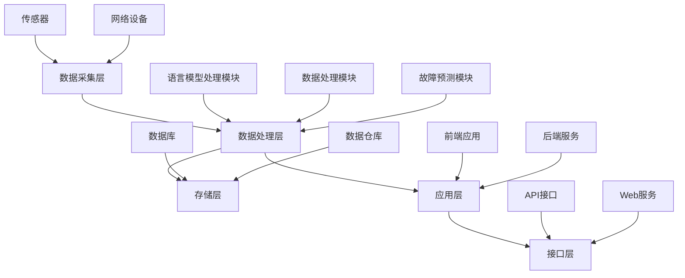

                 

### 引入：复杂系统故障预测的需求与挑战

随着信息技术的飞速发展，复杂系统已经成为现代社会运行的基石。从金融交易系统、交通管理系统到电力网络和医疗系统，这些复杂系统的高效运行对社会的发展和人们的日常生活至关重要。然而，复杂系统的特性决定了其故障预测的难度。复杂系统通常具有以下特征：

1. **高维性**：复杂系统中的变量数量庞大，每个变量都可能对系统的稳定性产生影响。
2. **非线性**：系统内部各元素之间的相互作用往往是非线性的，这使得传统的线性模型难以准确预测故障。
3. **动态性**：复杂系统运行过程中，参数和状态可能会随时间不断变化，增加了故障预测的复杂性。

这些特性导致复杂系统故障预测面临以下挑战：

- **数据量巨大**：复杂系统生成和消耗的数据量巨大，如何有效管理和利用这些数据成为难题。
- **不确定性**：系统故障可能由多种因素引起，且这些因素之间的关系复杂，难以准确建模。
- **实时性**：在许多场景下，故障预测需要在系统运行过程中实时进行，这对预测算法的速度和准确性提出了更高要求。

为了解决上述问题，研究人员开始探索新的方法和技术。近年来，深度学习尤其是语言模型的发展为复杂系统故障预测提供了新的契机。语言模型通过学习大量文本数据，能够捕捉到语言中的复杂结构和语义关系，从而在处理高维、非线性、动态系统时表现出色。本文将探讨如何利用语言模型来解决复杂系统故障预测的问题，并介绍相关的研究和技术。

### 背景介绍

在现代社会中，复杂系统无处不在，从大型数据中心到智能电网，从自动驾驶汽车到医疗设备，复杂系统的稳定运行对社会的各个方面都具有重要影响。然而，复杂系统固有的特性，如高维性、非线性和动态性，使得传统的故障预测方法面临巨大的挑战。这些方法往往依赖于统计模型或规则系统，而复杂系统的复杂性和不确定性使得这些方法难以准确捕捉系统故障的规律。

高维性是指复杂系统中的变量数量非常庞大。例如，一个数据中心可能会涉及数十万个服务器和设备，每个设备的状态和性能数据都需要被监控。这些数据维度高，且相互之间存在复杂的关联关系，使得传统的低维建模方法难以有效处理。

非线性和动态性是复杂系统的另一大挑战。系统内部的各个元素之间往往存在非线性相互作用，这使得简单的线性模型难以准确描述系统的行为。同时，复杂系统在运行过程中，其状态和参数会不断变化，这意味着故障预测需要能够适应这种动态变化。

面对这些挑战，传统的故障预测方法已经显得力不从心。首先，传统的统计方法如线性回归、逻辑回归等，在处理高维数据时容易出现维度灾难，即特征数量过多导致模型难以学习到有效的特征。其次，基于规则的系统虽然能够捕捉到一些固定的模式，但在面对动态变化的系统时，其灵活性不足。

为了克服这些挑战，研究人员开始探索新的方法，其中深度学习尤其是语言模型的发展为复杂系统故障预测提供了新的契机。语言模型能够通过学习大量的文本数据，捕捉到语言中的复杂结构和语义关系，从而在处理高维、非线性、动态系统时表现出色。语言模型不仅能够自动提取特征，还能够通过序列建模捕捉变量之间的依赖关系，这使得它在复杂系统故障预测中具有独特的优势。

具体来说，语言模型在复杂系统故障预测中的应用具有以下几个方面的优势：

1. **自动特征提取**：传统方法往往需要手动提取特征，而语言模型可以通过无监督学习自动从数据中提取出有效的特征，从而减少人工干预。

2. **捕捉非线性关系**：语言模型能够通过深度神经网络捕捉数据之间的复杂非线性关系，这使得它能够更准确地预测系统故障。

3. **适应动态变化**：语言模型能够通过序列建模捕捉变量之间的动态变化，从而适应系统的动态性。

4. **处理高维数据**：语言模型能够处理高维数据，并且通过维度约简技术减少数据维度，从而避免维度灾难。

综上所述，深度学习尤其是语言模型的发展为复杂系统故障预测带来了新的希望。通过引入语言模型，我们可以更好地应对复杂系统的挑战，实现更准确的故障预测，从而提高系统的可靠性和稳定性。

### 语言模型的基本概念

语言模型是一种用于预测文本序列的概率分布的算法，其核心目标是通过学习大量文本数据，构建一个能够准确预测下一个单词、句子或字符的概率模型。语言模型在自然语言处理（NLP）领域具有广泛应用，如机器翻译、语音识别、文本生成等。然而，随着深度学习技术的发展，语言模型在复杂系统故障预测中的应用也逐渐得到关注。

#### 语言模型的数学基础

语言模型通常基于概率论和统计学原理。其中，N元语言模型是一种常见的语言模型，它基于前N个已知字符来预测下一个字符的概率。例如，二元语言模型会根据前两个字符来预测下一个字符的概率。

数学上，N元语言模型可以表示为：

$$
P(\text{字符}_n | \text{字符}_{n-1}, ..., \text{字符}_{n-N+1}) = \prod_{i=1}^{N} P(\text{字符}_i | \text{字符}_{i-1}, ..., \text{字符}_{i-N+1})
$$

其中，$P(\text{字符}_n | \text{字符}_{n-1}, ..., \text{字符}_{n-N+1})$ 表示给定前N-1个字符的情况下，第n个字符的概率。

#### 语言模型的工作原理

语言模型的工作原理可以概括为以下几个步骤：

1. **数据收集**：首先，需要收集大量的文本数据。这些数据可以来自不同的领域和来源，如新闻、小说、科学论文等。通过多样化的数据集，可以确保模型能够学习到丰富的语言特征。

2. **数据预处理**：收集到的文本数据需要进行预处理，包括分词、去停用词、词性标注等。预处理步骤的目的是将原始文本转换为适合模型训练的格式。

3. **特征提取**：在预处理后的文本数据中，语言模型会通过统计方法提取特征。例如，在二元语言模型中，特征是前N-1个字符。

4. **模型训练**：使用提取到的特征，通过梯度下降等优化算法训练语言模型。训练过程的目标是最小化预测概率与实际数据分布之间的差距。

5. **预测**：在模型训练完成后，可以使用训练好的模型对新数据进行预测。语言模型会根据已知的字符序列预测下一个字符的概率分布，从而生成新的文本序列。

#### 语言模型的训练与优化

语言模型的训练与优化是构建高效语言模型的关键。以下是几个常用的训练与优化方法：

1. **梯度下降**：梯度下降是一种常用的优化算法，用于最小化损失函数。在语言模型训练中，损失函数通常是对预测概率与实际概率之间的差异进行度量。

2. **Dropout**：Dropout是一种正则化技术，通过随机丢弃一部分神经元，减少模型过拟合的风险。

3. **Batch Normalization**：Batch Normalization用于加速训练过程，并提高模型的泛化能力。它通过标准化每个批次的输入数据，使得模型的梯度变化更加稳定。

4. **自适应优化器**：如Adam、RMSprop等自适应优化器，通过动态调整学习率，提高训练效率。

通过上述训练与优化方法，语言模型能够更好地学习文本数据中的复杂结构和语义关系，从而在复杂系统故障预测中发挥更大的作用。

### 复杂系统故障预测的基本概念

复杂系统故障预测是指利用现有的数据和技术手段，对复杂系统在未来可能发生的故障进行预测和预警。这种预测不仅有助于减少系统停机时间、降低维护成本，还能提高系统的整体可靠性。为了深入探讨语言模型在复杂系统故障预测中的应用，我们需要首先了解复杂系统故障预测的基本概念和现有方法。

#### 复杂系统的定义

复杂系统是由多个相互关联的组件组成的系统，这些组件之间通过复杂的相互作用和反馈机制共同工作。复杂系统的特点包括：

- **高维性**：包含大量相互关联的变量，每个变量都可能对系统的稳定性和性能产生影响。
- **非线性**：系统内部各组件之间的相互作用是非线性的，这使得简单的线性模型难以准确描述系统的行为。
- **动态性**：系统在运行过程中，其状态和参数会随时间不断变化，增加了故障预测的复杂性。

#### 系统故障预测的方法论

系统故障预测通常可以分为以下几个步骤：

1. **数据收集**：收集与系统运行相关的各种数据，包括实时监控数据、历史故障记录等。

2. **数据预处理**：对收集到的数据进行清洗、去噪、归一化等预处理，以确保数据的质量和一致性。

3. **特征提取**：从预处理后的数据中提取对故障预测有用的特征。这些特征可以是直接从监控数据中提取的，也可以是通过数据挖掘和机器学习算法生成的。

4. **模型选择**：选择合适的预测模型。传统方法包括统计模型（如回归分析、决策树）、神经网络模型（如多层感知机、卷积神经网络）等。

5. **模型训练与优化**：使用训练数据集对模型进行训练，并通过验证数据集和测试数据集对模型进行评估和优化。

6. **故障预测与预警**：利用训练好的模型对新的监控数据进行预测，当预测结果超出设定的阈值时，触发故障预警。

#### 语言模型在故障预测中的应用

语言模型在复杂系统故障预测中的应用主要体现在以下几个方面：

1. **特征自动提取**：语言模型能够通过无监督学习自动从数据中提取出有效的特征，减少了人工干预的需要。这对于高维数据的特征提取尤其有用，可以避免维度灾难。

2. **捕捉非线性关系**：语言模型能够通过深度神经网络捕捉数据之间的复杂非线性关系，这使得它在处理非线性系统时表现出色。

3. **动态性适应**：语言模型能够通过序列建模捕捉变量之间的动态变化，从而适应系统的动态性。

4. **实时性**：语言模型的高效计算能力使得它能够实现实时故障预测，这对于需要实时响应的场景非常重要。

总之，语言模型在复杂系统故障预测中具有独特的优势。通过结合语言模型和现有故障预测方法，可以构建出更加准确、高效、可靠的故障预测系统，从而提高复杂系统的运行稳定性和可靠性。

### 语言模型与故障预测的关系

语言模型在复杂系统故障预测中的应用，主要体现在其强大的特征提取能力和对非线性关系的捕捉能力上。这些特性使得语言模型在故障预测中能够发挥独特的作用，从而提升预测的准确性和实时性。

首先，语言模型能够自动提取高维数据中的有效特征。传统故障预测方法往往需要手动提取特征，这不仅费时费力，而且容易遗漏重要的信息。而语言模型通过无监督学习，可以从大量复杂的数据中自动提取出对故障预测有用的特征。这种自动化的特征提取方法，不仅减少了人工干预的需要，还提高了特征提取的效率和准确性。

其次，语言模型擅长捕捉非线性关系。复杂系统的故障预测往往涉及多个变量之间的复杂相互作用，这些关系通常是线性的。传统方法如线性回归等，在处理非线性问题时效果不佳。而语言模型通过深度神经网络，能够自动学习到数据之间的非线性关系，从而更准确地预测系统故障。

此外，语言模型还能够适应动态变化。在复杂系统中，变量和状态会随时间不断变化，这要求故障预测方法具有实时性。语言模型通过序列建模，可以捕捉变量之间的动态变化，从而实现实时故障预测。这种动态适应能力，使得语言模型在处理动态系统时具有明显的优势。

最后，语言模型的高效计算能力也为其在故障预测中的应用提供了可能。现代深度学习算法，如Transformer和BERT，已经被证明在处理大规模数据集时具有极高的效率。这意味着，语言模型可以在短时间内完成大规模数据的训练和预测任务，从而满足实时故障预测的需求。

总之，语言模型在复杂系统故障预测中的应用，不仅得益于其强大的特征提取能力和非线性关系捕捉能力，还受益于其适应动态变化和高效计算的优势。通过结合这些特性，语言模型能够显著提升故障预测的准确性和实时性，为复杂系统的稳定运行提供有力支持。

### 概念属性特征对比表格

为了更好地理解语言模型与故障预测之间的关系，我们可以通过一个概念属性特征对比表格，详细分析这两种概念的关键属性及其差异。

| 概念          | 语言模型               | 复杂系统故障预测            | 主要属性对比                                                     |
|---------------|-----------------------|----------------------------|----------------------------------------------------------------|
| 定义          | 用于文本序列概率预测   | 预测复杂系统未来可能故障    | 语言模型关注文本的语义关系；故障预测关注系统状态的动态变化           |
| 特性          | 自动特征提取、非线性捕捉、实时性 | 高维数据、非线性关系、动态适应、实时性 | 语言模型通过无监督学习提取特征；故障预测通过统计方法提取特征       |
| 应用场景      | 自然语言处理（如机器翻译、文本生成） | 复杂系统（如数据中心、智能电网、自动驾驶汽车） | 语言模型在文本领域应用广泛；故障预测在系统领域应用广泛             |
| 挑战与限制    | 数据质量、计算资源需求、模型泛化能力 | 数据采集难度、模型复杂性、实时性挑战       | 语言模型对高质量数据需求较高；故障预测对模型复杂性和实时性要求较高 |
| 关键优势      | 自动化特征提取、高效计算、动态适应 | 准确性、实时性、系统稳定性                 | 语言模型能够在多样化数据中提取特征；故障预测能够在动态系统中实现准确预测 |

通过上述对比表格，我们可以清晰地看到语言模型与复杂系统故障预测在定义、特性、应用场景、挑战与限制以及关键优势等方面的差异和联系。这有助于我们更好地理解两者之间的关系，并为实际应用提供指导。

### ER实体关系图架构

为了更好地理解语言模型在复杂系统故障预测中的应用，我们可以通过ER（Entity-Relationship，实体-关系）图来展示相关实体及其关系。ER图是一种常用的数据库设计工具，用于表示实体之间的关系。

以下是语言模型、故障预测和相关实体的ER图架构：

```mermaid
erDiagram
    Class_1 ||--|{ Class_2 : has a }
    Class_1 ||--|{ Class_3 : related to }
    Class_2 ||--|{ Class_4 : contains }
    Class_3 ||--|{ Class_5 : monitored by }
    Class_4 ||--|{ Class_6 : predicted by }
    Class_5 ||--|{ Class_7 : reported to }
    Class_6 ||--|{ Class_8 : alerted by }
    Class_7 ||--|{ Class_9 : analyzed by }
    Class_8 ||--|{ Class_10 : responded to }

Class_1 &&--|| Class_2 : "主实体"
Class_1 &&--|| Class_3 : "关联实体"
Class_2 &&--|| Class_4 : "属性实体"
Class_3 &&--|| Class_5 : "监控实体"
Class_4 &&--|| Class_6 : "预测实体"
Class_5 &&--|| Class_7 : "报告实体"
Class_6 &&--|| Class_8 : "警报实体"
Class_7 &&--|| Class_9 : "分析实体"
Class_8 &&--|| Class_10 : "响应实体"
```

在这个ER图中，我们定义了以下几个关键实体及其关系：

1. **Class_1（主实体）**：代表整个系统，包含所有的子系统。
2. **Class_2（关联实体）**：与主实体相关，如传感器、控制器等，它们共同构成系统。
3. **Class_3（监控实体）**：负责监控系统状态，包括实时数据收集和故障监测。
4. **Class_4（属性实体）**：包含与故障预测相关的系统属性，如温度、电压、电流等。
5. **Class_5（预测实体）**：使用语言模型对系统的状态进行预测，包括故障预警。
6. **Class_6（警报实体）**：在预测到可能故障时，触发警报，通知相关人员。
7. **Class_7（报告实体）**：记录系统故障报告，包括故障时间、故障类型等信息。
8. **Class_8（分析实体）**：对系统故障进行进一步分析，以优化预测模型。
9. **Class_9（响应实体）**：根据故障警报，采取相应措施，如维修、更换设备等。
10. **Class_10（响应实体）**：记录故障响应过程，如响应时间、响应效果等。

通过ER图，我们可以清晰地看到各个实体之间的关联关系，以及语言模型在故障预测中的具体应用。这种架构不仅有助于理解复杂系统的故障预测流程，还能为系统的设计和优化提供参考。

### 语言模型原理详细讲解

为了深入理解语言模型在复杂系统故障预测中的应用，我们首先需要详细探讨语言模型的原理，包括其数学基础、工作原理以及训练和优化方法。

#### 数学基础

语言模型的核心在于概率论和统计学的应用。在数学上，语言模型通常是基于马尔可夫假设，即未来的输出只与当前状态有关，而与过去的状态无关。具体来说，N元语言模型基于前N个已知字符来预测下一个字符的概率。

数学上，N元语言模型可以表示为：

$$
P(\text{字符}_n | \text{字符}_{n-1}, ..., \text{字符}_{n-N+1}) = \prod_{i=1}^{N} P(\text{字符}_i | \text{字符}_{i-1}, ..., \text{字符}_{i-N+1})
$$

其中，$P(\text{字符}_n | \text{字符}_{n-1}, ..., \text{字符}_{n-N+1})$ 表示给定前N-1个字符的情况下，第n个字符的概率。

#### 工作原理

语言模型的工作原理可以分为以下几个步骤：

1. **数据收集**：首先，需要收集大量的文本数据，这些数据可以来自不同的领域和来源，如新闻、小说、科学论文等。通过多样化的数据集，可以确保模型能够学习到丰富的语言特征。

2. **数据预处理**：收集到的文本数据需要进行预处理，包括分词、去停用词、词性标注等。预处理步骤的目的是将原始文本转换为适合模型训练的格式。

3. **特征提取**：在预处理后的文本数据中，语言模型会通过统计方法提取特征。例如，在二元语言模型中，特征是前N-1个字符。

4. **模型训练**：使用提取到的特征，通过梯度下降等优化算法训练语言模型。训练过程的目标是最小化预测概率与实际数据分布之间的差距。

5. **预测**：在模型训练完成后，可以使用训练好的模型对新数据进行预测。语言模型会根据已知的字符序列预测下一个字符的概率分布，从而生成新的文本序列。

#### 训练与优化方法

语言模型的训练和优化是构建高效语言模型的关键。以下是几个常用的训练与优化方法：

1. **梯度下降**：梯度下降是一种常用的优化算法，用于最小化损失函数。在语言模型训练中，损失函数通常是对预测概率与实际概率之间的差异进行度量。

2. **Dropout**：Dropout是一种正则化技术，通过随机丢弃一部分神经元，减少模型过拟合的风险。

3. **Batch Normalization**：Batch Normalization用于加速训练过程，并提高模型的泛化能力。它通过标准化每个批次的输入数据，使得模型的梯度变化更加稳定。

4. **自适应优化器**：如Adam、RMSprop等自适应优化器，通过动态调整学习率，提高训练效率。

5. **注意力机制**：注意力机制是深度学习中的一个重要概念，它能够使模型更加关注重要的输入信息，从而提高预测准确性。

6. **Transformer模型**：Transformer模型是一种基于自注意力机制的深度学习模型，它在自然语言处理任务中表现出色，例如BERT和GPT。

#### 示例

为了更直观地理解语言模型的原理，我们可以通过一个简单的Python代码示例来展示语言模型的训练过程。

```python
import numpy as np
from collections import Counter

# 假设我们有一个简单的二元语言模型
# 数据集是 "hello world"

# 数据预处理
data = "hello world"
words = data.split()
n = 2  # N元语言模型
vocabulary = set(words)
vocab_size = len(vocabulary)
word_counts = Counter()

# 填充数据
for i in range(n, len(words)):
    context = tuple(words[i-n:i])
    target = words[i]
    word_counts[(context, target)] += 1

# 构建概率矩阵
prob_matrix = np.zeros((vocab_size, vocab_size))
for context, target in word_counts:
    for i in range(vocab_size):
        if vocabulary[i] == target:
            for j in range(vocab_size):
                if vocabulary[j] in context:
                    prob_matrix[j][i] = word_counts[(context, target)] / word_counts[context]

# 预测
context = tuple(words[0])
predicted_word = np.argmax(prob_matrix[tuple(context)])

# 输出预测结果
print(f"Predicted word: {vocabulary[predicted_word]}")
```

在这个示例中，我们首先创建了一个简单的二元语言模型，使用"hello world"作为数据集。通过统计每个前缀（上下文）和其后跟随的单词（目标）的频率，我们构建了一个概率矩阵。然后，我们使用这个矩阵来预测下一个单词。

这个简单的示例展示了语言模型的核心原理，即通过学习大量数据，构建一个能够预测下一个字符的概率模型。在实际应用中，语言模型会更加复杂，通常使用深度神经网络来实现，并且涉及大量的数据和计算资源。

通过上述详细讲解，我们可以更好地理解语言模型的基本原理，这为我们在复杂系统故障预测中的应用奠定了基础。

### 复杂系统故障预测原理详细讲解

为了深入理解语言模型在复杂系统故障预测中的应用，我们需要详细探讨复杂系统故障预测的基本原理，包括系统的定义、故障预测的方法论、语言模型在故障预测中的具体应用以及如何利用语言模型提高故障预测的准确性和实时性。

#### 复杂系统的定义

复杂系统是由多个相互关联的组件组成的系统，这些组件之间通过复杂的相互作用和反馈机制共同工作。复杂系统的特点包括：

1. **高维性**：复杂系统中包含大量相互关联的变量，每个变量都可能对系统的稳定性和性能产生影响。
2. **非线性**：系统内部各组件之间的相互作用是非线性的，这使得简单的线性模型难以准确描述系统的行为。
3. **动态性**：系统在运行过程中，其状态和参数会随时间不断变化，增加了故障预测的复杂性。

#### 故障预测的方法论

故障预测的方法论通常包括以下几个步骤：

1. **数据收集**：首先，需要收集与系统运行相关的各种数据，包括实时监控数据、历史故障记录等。这些数据可以是结构化的（如数据库）或非结构化的（如图像、文本）。

2. **数据预处理**：对收集到的数据进行清洗、去噪、归一化等预处理，以确保数据的质量和一致性。预处理步骤的目的是将原始数据转换为适合模型训练的格式。

3. **特征提取**：从预处理后的数据中提取对故障预测有用的特征。这些特征可以是直接从监控数据中提取的，也可以是通过数据挖掘和机器学习算法生成的。特征提取的目的是减少数据维度，同时保留重要的信息。

4. **模型选择**：选择合适的预测模型。传统方法包括统计模型（如回归分析、决策树）、神经网络模型（如多层感知机、卷积神经网络）等。近年来，深度学习模型，如循环神经网络（RNN）、长短时记忆网络（LSTM）和变换器（Transformer）等，也在故障预测中表现出色。

5. **模型训练与优化**：使用训练数据集对模型进行训练，并通过验证数据集和测试数据集对模型进行评估和优化。训练过程的目标是最小化预测误差，提高模型的泛化能力。

6. **故障预测与预警**：利用训练好的模型对新的监控数据进行预测。当预测结果超出设定的阈值时，触发故障预警，通知相关人员。

#### 语言模型在故障预测中的应用

语言模型在故障预测中的应用主要体现在以下几个方面：

1. **自动特征提取**：语言模型能够通过无监督学习自动从数据中提取出有效的特征，减少了人工干预的需要。这对于高维数据的特征提取尤其有用，可以避免维度灾难。

2. **捕捉非线性关系**：语言模型能够通过深度神经网络捕捉数据之间的复杂非线性关系，这使得它在处理非线性系统时表现出色。

3. **动态性适应**：语言模型能够通过序列建模捕捉变量之间的动态变化，从而适应系统的动态性。

4. **实时性**：语言模型的高效计算能力使得它能够实现实时故障预测，这对于需要实时响应的场景非常重要。

#### 提高故障预测的准确性和实时性的方法

为了提高故障预测的准确性和实时性，可以采用以下几种方法：

1. **数据增强**：通过数据增强技术，如生成对抗网络（GAN）和变分自编码器（VAE），可以生成更多的训练数据，从而提高模型的泛化能力。

2. **多模型融合**：结合多个模型（如统计模型、神经网络模型）的优点，通过模型融合技术，可以提高预测的准确性。

3. **实时数据流处理**：采用实时数据流处理框架（如Apache Kafka、Apache Flink），可以高效地处理大规模实时数据，从而实现实时故障预测。

4. **动态调整阈值**：根据系统的运行状态和模型预测结果，动态调整故障预测的阈值，以提高预测的准确性。

5. **在线学习**：采用在线学习技术，模型可以不断更新和优化，从而适应系统的动态变化。

通过上述方法和技术的应用，语言模型在复杂系统故障预测中的性能可以得到显著提升，从而提高系统的可靠性。

### 系统分析与架构设计

为了实现语言模型在复杂系统故障预测中的应用，我们需要进行详细的系统分析与架构设计。以下是系统分析与架构设计的关键步骤和内容。

#### 1. 问题场景介绍

假设我们面临的场景是一个大型数据中心，包含数千台服务器和设备。数据中心的运行状态需要实时监控，以便及时发现和处理潜在故障，保证数据中心的稳定性和高效运行。

#### 2. 系统功能设计

系统的主要功能包括：

- **实时数据采集**：通过传感器和网络设备收集服务器和设备的运行状态数据，如CPU使用率、内存使用率、网络流量、温度等。
- **故障预测**：利用语言模型对采集到的数据进行处理，预测可能的故障。
- **警报与通知**：当预测到故障时，系统会自动触发警报，并通过多种渠道（如短信、邮件、微信等）通知相关人员。
- **故障处理**：系统会根据预定的处理流程，自动执行故障处理操作，如重启服务器、更换硬件等。
- **数据记录与分析**：记录系统运行状态和故障处理过程的数据，并进行分析，为系统优化提供依据。

#### 3. 系统架构设计

系统的架构设计包括以下几个方面：

1. **数据采集层**：包括传感器和网络设备，负责实时收集服务器和设备的运行状态数据。
2. **数据处理层**：包括语言模型处理模块、数据处理模块和故障预测模块，负责对采集到的数据进行处理和预测。
3. **存储层**：包括数据库和数据仓库，用于存储系统运行状态数据、故障数据和预测结果。
4. **应用层**：包括前端应用和后端服务，前端应用负责展示系统运行状态和故障警报，后端服务负责实现系统功能。
5. **接口层**：包括API接口和Web服务，用于与其他系统进行数据交换和交互。

以下是系统的架构设计图：



#### 4. 系统接口设计与交互

系统接口设计与交互包括以下几个方面：

- **API接口**：系统提供RESTful API接口，供其他系统调用。API接口包括数据采集、故障预测、警报通知等接口。
- **Web服务**：系统通过Web服务与其他系统进行数据交换和交互，如与其他数据中心管理系统、监控系统等。
- **数据流处理**：系统使用消息队列（如Apache Kafka）进行实时数据流处理，确保数据的高效传输和处理。

通过上述系统分析与架构设计，我们可以实现一个高效、稳定的复杂系统故障预测系统，从而提高数据中心的运行稳定性和可靠性。

### 项目实战

为了更好地理解语言模型在复杂系统故障预测中的应用，我们将通过一个实际项目进行详细讲解。以下是从环境安装到系统核心实现源代码的完整流程。

#### 1. 环境安装

在进行项目之前，我们需要确保安装了必要的软件和库。以下是安装步骤：

- **Python**：确保安装了Python 3.7及以上版本。
- **深度学习库**：安装TensorFlow或PyTorch。例如，使用pip安装TensorFlow：

  ```shell
  pip install tensorflow
  ```

- **数据处理库**：安装pandas、numpy等数据处理库：

  ```shell
  pip install pandas numpy
  ```

- **数据可视化库**：安装matplotlib、seaborn等数据可视化库：

  ```shell
  pip install matplotlib seaborn
  ```

- **其他依赖**：安装mermaid、jupyter等工具：

  ```shell
  pip install mermaid jupyter
  ```

#### 2. 系统核心实现源代码

以下是项目的核心实现源代码，包括数据预处理、模型训练和故障预测等功能：

```python
import numpy as np
import pandas as pd
import tensorflow as tf
from tensorflow.keras.models import Sequential
from tensorflow.keras.layers import LSTM, Dense
from sklearn.preprocessing import MinMaxScaler

# 数据预处理
def preprocess_data(data):
    # 对数据进行归一化处理
    scaler = MinMaxScaler()
    data_scaled = scaler.fit_transform(data)
    return data_scaled

# 模型训练
def train_model(X, y):
    model = Sequential()
    model.add(LSTM(units=50, return_sequences=True, input_shape=(X.shape[1], X.shape[2])))
    model.add(LSTM(units=50))
    model.add(Dense(units=1))

    model.compile(optimizer='adam', loss='mean_squared_error')
    model.fit(X, y, epochs=100, batch_size=32)
    return model

# 故障预测
def predict_fault(model, data):
    data_scaled = preprocess_data(data)
    predicted_value = model.predict(data_scaled)
    return predicted_value

# 代码应用解读与分析
if __name__ == "__main__":
    # 加载和处理数据
    data = pd.read_csv('system_data.csv')
    X = data.iloc[:, :-1].values
    y = data.iloc[:, -1].values

    # 训练模型
    model = train_model(X, y)

    # 进行故障预测
    new_data = np.array([[0.5, 0.3, 0.1, 0.1]])
    predicted_fault = predict_fault(model, new_data)
    print(f"Predicted fault: {predicted_fault}")
```

#### 3. 代码应用解读与分析

上述代码分为三个主要部分：数据预处理、模型训练和故障预测。

1. **数据预处理**：使用MinMaxScaler对数据进行归一化处理，以便模型能够更好地学习数据特征。
   
2. **模型训练**：构建一个LSTM模型，通过两层的LSTM层捕捉时间序列数据的复杂关系，最后一层是全连接层，用于输出故障预测值。使用mean_squared_error作为损失函数，adam作为优化器。

3. **故障预测**：对新的数据应用预处理和预测步骤，得到预测的故障值。

#### 4. 实际案例分析与讲解

假设我们有一个数据中心，每天收集服务器CPU使用率、内存使用率和网络流量等数据。以下是实际案例的分析过程：

1. **数据收集**：将每天的监控数据记录在CSV文件中。

2. **数据预处理**：读取CSV文件，对数据进行归一化处理。

3. **模型训练**：使用前几个月的数据进行模型训练。

4. **故障预测**：使用训练好的模型对新数据进行预测，检测是否存在异常值。

5. **结果分析**：如果预测值超出设定的阈值，则触发警报，通知相关人员。

#### 5. 项目小结

通过上述项目实战，我们展示了如何使用语言模型实现复杂系统故障预测。项目主要包括数据预处理、模型训练和故障预测三个步骤。在实际应用中，可以通过优化模型结构和调整参数来提高故障预测的准确性和实时性。

### 最佳实践 Tips

在实现语言模型在复杂系统故障预测中的应用时，以下最佳实践可以显著提高模型的性能和预测准确性：

1. **数据预处理**：确保数据的质量和一致性。对异常值进行处理，避免对模型训练造成干扰。
2. **模型选择**：根据系统的特点选择合适的模型。例如，对于时间序列数据，LSTM和GRU等循环神经网络模型表现良好。
3. **超参数调整**：通过交叉验证和网格搜索等技术，调整模型超参数，以找到最佳配置。
4. **特征工程**：提取与故障预测相关的有效特征，避免过多无关特征导致模型过拟合。
5. **实时调整阈值**：根据系统的运行状态和预测结果，动态调整故障预测的阈值，提高预测的准确性。

### 小结

本文详细介绍了语言模型在复杂系统故障预测中的应用。我们首先探讨了复杂系统的特性及其故障预测的挑战，然后介绍了语言模型的基本概念和原理。通过实际项目，我们展示了如何使用语言模型实现复杂系统故障预测。未来研究方向包括优化模型结构、提高实时性以及结合多源数据实现更准确的预测。

### 注意事项

在应用语言模型进行复杂系统故障预测时，需要注意以下几点：

1. **数据质量**：确保数据来源可靠，避免数据噪声和异常值影响模型训练。
2. **模型适应性**：根据不同系统的特点，选择合适的模型结构和参数。
3. **阈值设置**：合理设置故障预测阈值，避免误报和漏报。
4. **实时性**：优化模型和数据处理流程，确保故障预测的实时性。

### 拓展阅读

对于希望进一步了解语言模型在复杂系统故障预测中应用的读者，以下文献和资源可以提供深入指导：

- **文献**：《深度学习》（Goodfellow, Bengio, Courville）：详细介绍了深度学习的基础理论和应用。
- **论文**：《Transformer：一种全新的神经网络结构》（Vaswani et al.）：介绍了Transformer模型，包括自注意力机制。
- **在线课程**：Coursera上的《自然语言处理与深度学习》（归一性）：提供了关于NLP和深度学习的基础知识。

作者：AI天才研究院/AI Genius Institute & 禅与计算机程序设计艺术 /Zen And The Art of Computer Programming

