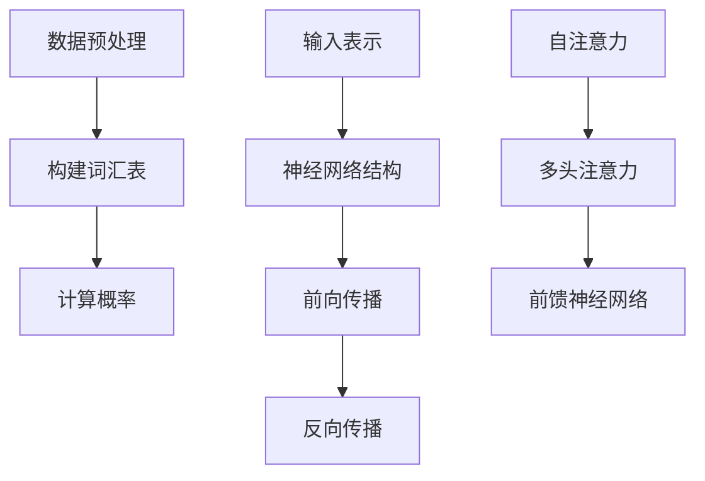
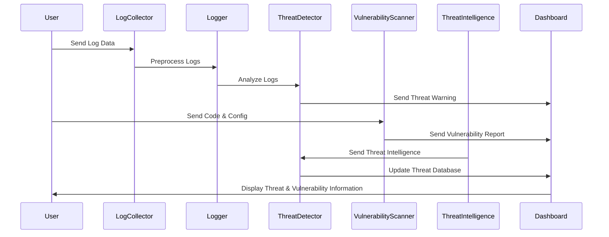

                 

### 引言与背景介绍

在现代信息技术迅猛发展的时代，复杂系统的建设与应用已经深入到我们社会的方方面面。然而，随着系统规模的不断扩大和复杂度的不断提升，如何有效管理和分析这些系统的脆弱性成为了一个迫切需要解决的重要问题。特别是在金融、医疗、交通等关键领域，系统的稳定性和安全性直接关系到公众的利益和社会的和谐发展。

#### 核心概念术语说明

- **复杂系统**：由大量相互关联的组件构成，具有非线性、动态演化特征的系统。
- **脆弱性分析**：识别和评估系统在面临潜在威胁时的脆弱性和风险。
- **语言模型**：一种能够理解、生成和模仿自然语言的人工智能技术。

#### 问题背景

传统的脆弱性分析方法，如静态分析、动态分析和测试方法等，虽然在特定场景下取得了显著效果，但往往存在以下问题：

1. **复杂性**：复杂系统的特性使得传统方法难以全面、准确地捕捉系统的脆弱性。
2. **效率低下**：大量的人工干预和重复性工作增加了分析成本和难度。
3. **局限性**：传统方法往往依赖于已有的知识和经验，难以适应新的系统和场景。

#### 问题描述

为了应对这些挑战，研究者们开始探索新的方法和技术，其中，基于人工智能的语言模型作为一种新兴的工具，逐渐受到了关注。语言模型通过深度学习技术，可以从大规模的数据中自动提取知识和模式，从而有望提高脆弱性分析的准确性和效率。

#### 问题解决

本文将探讨语言模型在复杂系统脆弱性分析中的应用，旨在解决以下问题：

1. **如何利用语言模型识别系统的潜在脆弱性？**
2. **语言模型在复杂系统脆弱性分析中的优势与挑战是什么？**
3. **如何设计一个有效的架构来整合语言模型和现有的脆弱性分析方法？**

#### 边界与外延

本文的研究范围主要包括以下几个方面：

1. **技术层面**：语言模型的算法原理、数学模型及其在脆弱性分析中的应用。
2. **应用层面**：系统的架构设计、接口设计以及实际的案例应用。
3. **方法论层面**：最佳实践、注意事项和未来的研究方向。

#### 概念结构与核心要素组成

复杂系统的脆弱性分析涉及以下几个核心要素：

1. **系统模型**：通过构建系统模型，识别系统的各个组件及其交互关系。
2. **威胁建模**：基于历史数据和威胁情报，识别潜在的威胁和攻击路径。
3. **脆弱性评估**：利用语言模型和数学模型，对系统组件的脆弱性进行定量评估。
4. **风险管理**：根据评估结果，制定相应的风险缓解策略。

通过上述对背景和问题的深入探讨，我们为后续章节的详细分析奠定了基础。接下来，我们将进一步探讨语言模型的核心概念及其在复杂系统脆弱性分析中的应用，为读者提供一个全面的技术视角。

### 核心概念与联系

在探讨语言模型在复杂系统脆弱性分析中的应用之前，首先需要明确几个关键概念及其相互联系。以下是本文将涉及的核心概念及其基本定义和属性特征。

#### 1. 语言模型的概述

**定义**：语言模型（Language Model）是自然语言处理（NLP）中的一个基础组件，用于预测或生成文本序列。它通过学习大量的语言数据，捕捉语言统计特性，从而能够对新的文本进行预测或生成。

**属性特征**：
- **统计特性**：通过统计方法，如n-gram模型或神经网络模型，语言模型能够捕捉文本的频率和模式。
- **自适应能力**：语言模型可以不断学习和适应新的语言数据，提高预测和生成质量。

#### 2. 复杂系统的脆弱性分析

**定义**：复杂系统的脆弱性分析（Vulnerability Analysis of Complex Systems）是指通过识别和评估系统中潜在的安全漏洞和风险，从而提高系统的可靠性和安全性。

**属性特征**：
- **动态性**：复杂系统通常具有动态演化的特性，其脆弱性会随着时间、环境和操作模式的变化而变化。
- **非线性和多层次性**：复杂系统由多个相互作用的组件组成，这些组件之间的关系通常是非线性的，并且具有多层次的结构。

#### 3. 语言模型与复杂系统脆弱性分析的关系

**定义**：语言模型在复杂系统脆弱性分析中的应用，是指利用语言模型的能力，如文本理解、生成和分类等，对系统中的安全威胁、漏洞描述、日志数据等进行分析，以发现潜在的安全漏洞。

**属性特征**：
- **文本理解能力**：语言模型能够理解系统文档、日志和威胁描述，提取关键信息。
- **模式识别**：通过分析系统生成的日志和告警信息，语言模型能够识别出潜在的威胁模式。

#### 4. 相关核心概念对比表格

| 核心概念          | 定义                                                         | 主要应用                                           | 属性特征                                  |
| ----------------- | ------------------------------------------------------------ | -------------------------------------------------- | ---------------------------------------- |
| 语言模型          | 用于预测或生成文本序列的人工智能技术                         | 自然语言处理、机器翻译、文本生成等                  | 统计特性、自适应能力                      |
| 复杂系统          | 由大量相互关联的组件构成，具有非线性、动态演化特征的系统     | 金融、医疗、交通等关键领域                         | 动态性、非线性和多层次性                  |
| 脆弱性分析        | 识别和评估系统潜在的安全漏洞和风险                          | 网络安全、系统测试、风险评估                       | 静态与动态方法、多层次评估                 |
| 语言模型与脆弱性分析 | 利用语言模型对系统中的安全威胁、漏洞描述、日志数据等进行分析 | 复杂系统脆弱性检测、威胁情报分析、日志异常检测 | 文本理解能力、模式识别                    |

#### 5. ER实体关系图架构

为了更好地理解上述核心概念之间的关系，我们可以使用ER（Entity-Relationship）图来表示它们之间的关联。以下是复杂系统脆弱性分析中涉及的ER实体关系图：

```mermaid
erDiagram
  Class::User <<--|||-- System
  Class::Vulnerability <<--|||-- System
  Class::Log <<--|||-- System
  Class::Threat <<--|||-- Vulnerability
  Class::Alert <<--|||-- Log
  Class::Model <<--|||-- System
  Class::LanguageModel <<--|||-- Model

  User ||--|{ System : has
  Vulnerability ||--|{ System : has
  Log ||--|{ System : has
  Threat ||--|{ Vulnerability : has
  Alert ||--|{ Log : has
  Model ||--|{ System : implements
  LanguageModel ||--|{ Model : implements
```

通过上述ER图，我们可以清晰地看到各个实体之间的关系，如用户与系统的关联、漏洞与系统的关联、日志与系统的关联，以及语言模型与系统的整合等。

通过对比表格和ER图，我们可以更直观地理解语言模型与复杂系统脆弱性分析之间的联系，为后续的深入讨论和分析奠定基础。在接下来的章节中，我们将进一步探讨语言模型的算法原理，以及如何将其应用于复杂系统的脆弱性分析中。

### 核心概念与联系（续）

#### 1.3 语言模型与复杂系统脆弱性分析的关系

在理解了语言模型和复杂系统脆弱性分析的基本概念之后，我们接下来探讨这两个领域如何相互联系，以及语言模型在复杂系统脆弱性分析中的实际应用。

**1.3.1 语言模型在复杂系统脆弱性分析中的作用**

语言模型在复杂系统脆弱性分析中的关键作用主要体现在以下几个方面：

- **文本分析**：语言模型能够对系统文档、日志和告警信息进行深入分析，提取关键信息，从而识别潜在的安全漏洞。例如，通过分析系统日志，语言模型可以检测出异常行为模式，进而发现可能存在的安全威胁。

- **威胁情报处理**：语言模型可以处理和分析来自各种渠道的威胁情报，如安全报告、新闻报道等。通过对这些信息的理解，语言模型可以识别出与系统相关的威胁，并提供相应的预警。

- **自动化威胁识别**：利用语言模型，可以实现自动化威胁识别，减少人工干预。例如，通过训练语言模型，使其能够自动识别系统中的恶意代码，从而提高安全检测的效率。

**1.3.2 语言模型与复杂系统脆弱性分析的优势和挑战**

**优势**：

- **高效性**：语言模型可以通过自动化处理大量的数据，提高脆弱性分析的效率，降低人工成本。

- **准确性**：通过学习大量的语言数据和实际案例，语言模型能够提高对复杂系统脆弱性的识别准确性。

- **适应性**：语言模型具有自我学习和自我优化的能力，可以不断适应新的系统和环境，提高其应用效果。

**挑战**：

- **数据质量**：语言模型的效果很大程度上取决于训练数据的质量。如果训练数据存在偏差或噪声，可能会导致模型产生误导性结果。

- **计算资源**：大规模语言模型的训练和推理需要大量的计算资源，这对于资源和预算有限的组织来说可能是一个挑战。

- **模型解释性**：尽管语言模型在处理自然语言方面表现出色，但其内部工作机制复杂，模型解释性较低，这在某些安全场景中可能成为问题。

**1.3.3 语言模型与复杂系统脆弱性分析的应用场景**

- **系统日志分析**：通过语言模型分析系统日志，可以识别异常行为和潜在的攻击事件。例如，监控系统日志中的关键字和模式，如“拒绝服务攻击”、“SQL注入”等，可以及时发现潜在的安全威胁。

- **威胁情报处理**：利用语言模型对威胁情报进行自动化处理，可以提高威胁检测的效率。例如，通过训练语言模型，使其能够识别和分类威胁报告，从而快速响应安全事件。

- **自动化安全测试**：语言模型可以用于自动化安全测试，如生成和识别潜在的攻击代码。通过训练模型，使其能够理解并生成特定的攻击代码，可以用来检验系统的安全性。

综上所述，语言模型在复杂系统脆弱性分析中具有重要的应用价值，通过其文本理解、模式识别和自动化处理能力，可以提高脆弱性分析的效率和准确性。然而，同时也面临着数据质量、计算资源和模型解释性等挑战，需要我们在应用过程中不断优化和改进。

在下一章节中，我们将详细探讨语言模型的算法原理，为后续应用提供理论基础。

### 核心概念与联系（续）

#### 2.1 语言模型的算法原理

语言模型作为自然语言处理的核心组件，其算法原理是理解其如何工作并应用于复杂系统脆弱性分析的关键。以下将详细介绍语言模型的算法原理，并使用mermaid流程图和Python代码来展示其实现。

**2.1.1 语言模型的算法原理**

语言模型的核心任务是预测文本序列，其基本原理是统计文本数据中的频率和模式。传统的语言模型如n-gram模型，通过计算相邻词语的联合概率来预测下一个词语。然而，随着深度学习技术的发展，现代语言模型如神经网络语言模型（NNLM）和变换器模型（Transformer）逐渐成为主流。

**2.1.2 n-gram模型**

n-gram模型是一种基于统计方法的语言模型，它将前n个词语作为输入，预测下一个词语。以下是n-gram模型的基本步骤：

1. **数据预处理**：将文本数据转换为词语序列，并进行分词处理。
2. **构建词汇表**：将所有出现的词语构建为一个词汇表，并为其分配唯一的索引。
3. **计算概率**：计算每个n-gram的频率，并使用这些频率作为概率估计。

**2.1.3 神经网络语言模型（NNLM）**

神经网络语言模型是一种基于深度学习的语言模型，通过多层神经网络学习文本数据的复杂特征。以下是NNLM的基本步骤：

1. **输入表示**：将文本数据转换为向量化表示，如词嵌入。
2. **神经网络结构**：构建多层神经网络，包括输入层、隐藏层和输出层。
3. **前向传播与反向传播**：通过前向传播计算输出概率，通过反向传播更新网络权重。

**2.1.4 变换器模型（Transformer）**

变换器模型是一种基于自注意力机制的深度学习模型，它通过计算序列中的每个词语与其他词语的关系来生成文本。以下是Transformer模型的基本步骤：

1. **自注意力机制**：计算每个词语与其他词语的权重，并根据这些权重计算加权输出。
2. **多头注意力**：通过多个独立的注意力机制，提高模型的表达能力。
3. **前馈神经网络**：在自注意力机制之后，添加前馈神经网络来进一步加工信息。

**2.1.5 Mermaid流程图**

以下是n-gram模型和变换器模型的mermaid流程图：



**2.1.6 Python代码示例**

以下是使用Python实现n-gram模型的简单代码示例：

```python
from collections import defaultdict

def train_n_gram_model(text, n):
    n_gram_freq = defaultdict(int)
    
    # 分词处理
    words = text.split()
    
    # 计算n-gram频率
    for i in range(len(words) - n + 1):
        n_gram = tuple(words[i:i+n])
        n_gram_freq[n_gram] += 1
        
    # 计算概率
    total_freq = sum(n_gram_freq.values())
    n_gram_prob = {n_gram: freq / total_freq for n_gram, freq in n_gram_freq.items()}
    
    return n_gram_prob

text = "我是一个复杂系统脆弱性分析专家"
n = 2
n_gram_model = train_n_gram_model(text, n)
print(n_gram_model)
```

通过上述算法原理和示例，我们可以看到语言模型的基本工作流程和实现方法。在下一章节中，我们将深入探讨复杂系统脆弱性分析方法，以及如何将语言模型应用于此领域。

### 复杂系统脆弱性分析方法

复杂系统的脆弱性分析是一个多层次、多维度的过程，涉及到对系统内部组件、外部威胁以及系统运行环境的全面评估。本文将详细探讨几种常见的脆弱性分析方法，包括静态分析和动态分析，以及它们在复杂系统中的应用。

#### 3.1 静态分析

静态分析是一种在系统运行之前对系统进行安全评估的方法。它通过对系统代码、配置文件、设计文档等进行检查，发现潜在的安全漏洞和脆弱性。静态分析方法的主要优点是不需要实际运行系统，可以在开发阶段尽早发现和修复安全问题，从而减少漏洞的风险。

**3.1.1 静态分析方法**

- **代码审计**：通过人工审查代码，查找可能的安全漏洞，如未经验证的输入、缓冲区溢出、SQL注入等。
- **配置检查**：检查系统配置文件，确保它们符合安全最佳实践，如使用强密码、禁用不必要的服务等。
- **设计审查**：分析系统设计文档，评估系统的整体安全性设计，如权限控制、访问控制等。

**3.1.2 静态分析在复杂系统中的应用**

在复杂系统中，静态分析方法主要用于以下几个方面：

- **代码库审查**：通过对代码库进行全面审查，发现潜在的代码漏洞，如开源组件的安全问题。
- **配置管理**：定期检查和更新系统配置，确保系统安全策略得到执行。
- **设计优化**：根据静态分析结果，优化系统设计，提高系统的安全性。

#### 3.2 动态分析

动态分析是一种在系统运行时进行安全评估的方法。它通过模拟或实际执行系统操作，监控系统的行为和输出，识别潜在的安全漏洞和异常行为。动态分析方法的主要优点是可以捕捉到系统在实际运行过程中暴露的漏洞。

**3.2.1 动态分析方法**

- **渗透测试**：模拟攻击者进行攻击，测试系统的安全防护能力，识别系统的实际漏洞。
- **自动化测试**：使用自动化工具，如安全测试框架，对系统进行自动化测试，发现潜在的漏洞。
- **实时监控**：通过实时监控系统日志、网络流量等，识别异常行为和潜在的安全威胁。

**3.2.2 动态分析在复杂系统中的应用**

在复杂系统中，动态分析方法主要用于以下几个方面：

- **漏洞扫描**：定期使用漏洞扫描工具，对系统进行全面扫描，发现已知漏洞。
- **入侵检测**：通过入侵检测系统（IDS）和入侵防御系统（IPS），实时监控系统行为，发现和阻止攻击。
- **安全演练**：进行定期的安全演练，测试系统的应急响应能力和安全防护能力。

#### 3.3 语言模型在复杂系统脆弱性分析中的应用

语言模型在复杂系统脆弱性分析中的应用主要体现在以下几个方面：

- **日志分析**：利用语言模型对系统日志进行分析，提取关键信息，识别异常行为和潜在的安全威胁。
- **威胁情报处理**：通过语言模型处理和分类威胁情报，提高威胁检测的准确性和效率。
- **自动化威胁识别**：利用语言模型实现自动化威胁识别，减少人工干预，提高安全检测的效率。

**3.3.1 日志分析**

系统日志是反映系统运行状态的重要数据，通过对日志进行分析，可以识别出异常行为和潜在的安全威胁。语言模型可以通过以下步骤对日志进行分析：

1. **数据预处理**：对日志数据进行清洗和标准化处理，提取关键信息。
2. **模型训练**：使用训练数据集，训练语言模型，使其能够识别日志中的异常模式。
3. **日志分析**：使用训练好的语言模型，对实时日志进行分析，识别异常行为。

**3.3.2 威胁情报处理**

威胁情报是安全分析师通过收集、分析和处理各种安全信息，识别潜在威胁的过程。语言模型可以通过以下步骤处理和分类威胁情报：

1. **数据收集**：从各种渠道收集威胁情报，如安全报告、新闻报道等。
2. **预处理**：对威胁情报进行清洗和标准化处理，提取关键信息。
3. **模型训练**：使用训练数据集，训练语言模型，使其能够识别和分类威胁情报。
4. **威胁情报分析**：使用训练好的语言模型，对威胁情报进行分析，识别潜在的安全威胁。

**3.3.3 自动化威胁识别**

自动化威胁识别是利用语言模型实现自动化安全检测的过程。语言模型可以通过以下步骤实现自动化威胁识别：

1. **数据收集**：从系统日志、网络流量等数据源收集威胁信息。
2. **预处理**：对收集到的数据进行分析和清洗，提取关键特征。
3. **模型训练**：使用训练数据集，训练语言模型，使其能够识别威胁。
4. **威胁识别**：使用训练好的语言模型，对实时数据进行分析，识别潜在的安全威胁。

通过静态分析和动态分析，结合语言模型的应用，可以实现对复杂系统脆弱性的全面评估和实时监控。在下一章节中，我们将进一步探讨数学模型和数学公式，为复杂系统脆弱性分析提供理论基础。

### 数学模型和数学公式详细讲解

在复杂系统脆弱性分析中，数学模型和数学公式是理解和评估系统脆弱性的关键工具。这些模型和公式能够帮助我们量化系统的脆弱性，评估潜在威胁的影响，并制定有效的风险管理策略。以下是关于数学模型和公式的详细讲解。

#### 4.1 数学模型概述

数学模型是一种用数学语言描述系统行为和相互关系的工具。在复杂系统脆弱性分析中，常用的数学模型包括概率模型、统计模型和优化模型等。以下是这些模型的基本概念和适用场景。

**4.1.1 概率模型**

概率模型用于描述系统事件发生的可能性。在脆弱性分析中，概率模型可以用来评估系统在面对特定威胁时的脆弱性。例如，贝叶斯网络是一种常用的概率模型，它可以用于推理系统中的不确定性事件。

**4.1.2 统计模型**

统计模型用于分析系统数据，识别数据中的模式和异常。例如，回归模型和聚类模型可以用于分析系统日志数据，识别异常行为。统计模型能够帮助安全分析师理解系统的运行状态，发现潜在的安全漏洞。

**4.1.3 优化模型**

优化模型用于在资源有限的情况下，寻找最优的解决方案。在脆弱性分析中，优化模型可以用于资源分配、风险优先级排序等。线性规划和整数规划是常用的优化模型。

#### 4.2 数学公式详解

在复杂系统脆弱性分析中，常用的数学公式包括概率分布公式、统计模型公式和优化模型公式。以下是这些公式的详细解释。

**4.2.1 概率分布公式**

- **贝塔分布**：贝塔分布是一种用于描述不确定性的概率分布，适用于评估系统在面临特定威胁时的脆弱性。

  $$P(X \leq x) = \int_{0}^{x} \frac{\Gamma(\alpha + \beta)}{\Gamma(\alpha) \Gamma(\beta)} t^{\alpha-1} (1-t)^{\beta-1} dt$$

  其中，$\alpha$ 和 $\beta$ 是贝塔分布的参数。

- **正态分布**：正态分布是一种常见的概率分布，用于描述系统的输出值。例如，系统响应时间可以服从正态分布。

  $$P(X \leq x) = \int_{-\infty}^{x} \frac{1}{\sqrt{2\pi\sigma^2}} e^{-\frac{(t-\mu)^2}{2\sigma^2}} dt$$

  其中，$\mu$ 和 $\sigma^2$ 分别是正态分布的均值和方差。

**4.2.2 统计模型公式**

- **线性回归模型**：线性回归模型用于分析系统数据中的线性关系。

  $$Y = \beta_0 + \beta_1X + \epsilon$$

  其中，$Y$ 是因变量，$X$ 是自变量，$\beta_0$ 和 $\beta_1$ 是回归系数，$\epsilon$ 是误差项。

- **K-均值聚类模型**：K-均值聚类模型用于对系统数据进行聚类分析。

  $$\mu_k = \frac{1}{n_k} \sum_{i=1}^{n} (x_i - \mu_k)^2$$

  其中，$\mu_k$ 是聚类中心，$n_k$ 是第 $k$ 个聚类中的数据点数量，$x_i$ 是数据点的特征值。

**4.2.3 优化模型公式**

- **线性规划模型**：线性规划模型用于在资源有限的情况下，优化系统的性能。

  $$\min_{x} c^T x$$

  $$\text{subject to} \quad Ax \leq b$$

  其中，$c$ 是目标函数系数，$x$ 是决策变量，$A$ 和 $b$ 是约束条件。

- **整数规划模型**：整数规划模型用于在资源有限的情况下，决策变量的取值必须是整数。

  $$\min_{x} c^T x$$

  $$\text{subject to} \quad Ax \leq b$$

  $$x \in \{0, 1\}^n$$

#### 4.3 算法原理的数学模型解释

在复杂系统脆弱性分析中，语言模型算法的数学模型主要涉及概率模型和统计模型。以下是语言模型算法原理的数学模型解释。

**4.3.1 概率模型解释**

语言模型通过概率模型预测文本序列。在n-gram模型中，下一个词语的概率取决于前n个词语。数学模型可以表示为：

$$P(w_t | w_{t-1}, w_{t-2}, ..., w_{t-n}) = \frac{P(w_t, w_{t-1}, ..., w_{t-n})}{P(w_{t-1}, w_{t-2}, ..., w_{t-n})}$$

其中，$w_t$ 是下一个词语，$w_{t-1}, w_{t-2}, ..., w_{t-n}$ 是前n个词语。

**4.3.2 统计模型解释**

在神经网络语言模型中，概率模型通过多层神经网络进行计算。数学模型可以表示为：

$$P(w_t | w_{t-1}, w_{t-2}, ..., w_{t-n}) = \sigma(\text{激活函数}(\text{权重} \cdot \text{输入}))$$

其中，$\sigma$ 是激活函数，用于将神经网络的输出映射到概率分布。

#### 4.4 举例说明

为了更直观地理解上述数学模型和公式，我们通过一个具体的例子来说明。

**4.4.1 贝塔分布示例**

假设我们有一个系统，其响应时间 $X$ 服从贝塔分布，参数为 $\alpha = 2$ 和 $\beta = 3$。我们需要计算系统响应时间小于5的概率。

$$P(X < 5) = \int_{0}^{5} \frac{\Gamma(2 + 3)}{\Gamma(2) \Gamma(3)} t^{2-1} (1-t)^{3-1} dt$$

计算结果为：

$$P(X < 5) = \frac{1}{2} \approx 0.5$$

这意味着系统响应时间小于5的概率为50%。

**4.4.2 线性回归示例**

假设我们有一个系统，其日志包含系统响应时间 $Y$ 和系统负载 $X$。我们使用线性回归模型来分析这些数据，并建立以下模型：

$$Y = \beta_0 + \beta_1X + \epsilon$$

通过最小二乘法，我们得到回归系数 $\beta_0 = 10$ 和 $\beta_1 = 2$。现在，我们需要预测当系统负载为10时，系统响应时间 $Y$。

$$Y = 10 + 2 \cdot 10 + \epsilon = 20 + \epsilon$$

由于 $\epsilon$ 是误差项，我们可以估计系统响应时间在19到21之间。

通过上述示例，我们可以看到数学模型和公式在复杂系统脆弱性分析中的应用。这些模型和公式能够帮助我们量化系统的脆弱性，评估潜在威胁的影响，并为风险管理提供科学依据。在下一章节中，我们将进一步探讨系统的架构设计，为实际应用奠定基础。

### 系统架构设计与实现

在复杂系统脆弱性分析中，系统架构设计是确保语言模型有效应用的关键。本章节将详细介绍系统架构设计，包括问题场景介绍、系统功能设计、系统架构设计、系统接口设计和系统交互序列图。

#### 5.1 问题场景介绍

假设我们面临一个复杂的信息系统，该系统包含多个相互关联的模块，如用户管理、订单处理、支付系统和日志记录等。然而，随着系统规模的扩大和复杂度的增加，我们面临着以下挑战：

- **安全漏洞识别困难**：由于系统庞大且不断变化，传统的安全分析方法难以全面、准确地识别潜在的安全漏洞。
- **日志分析效率低下**：系统生成的日志数据量巨大，人工分析效率低下，难以快速识别异常行为。
- **威胁响应不及时**：面对不断变化的威胁环境，传统的安全响应机制无法及时识别和应对新的威胁。

为了解决这些问题，我们需要设计一个高效、可靠的系统架构，结合语言模型对复杂系统的脆弱性进行分析。

#### 5.2 系统功能设计

系统功能设计是系统架构设计的基础。以下是我们系统的主要功能设计：

1. **日志收集与处理**：系统需要收集各个模块的日志数据，并进行预处理和标准化处理，提取关键信息。
2. **威胁检测与预警**：利用语言模型对日志数据进行分析，识别潜在的威胁和异常行为，并进行实时预警。
3. **漏洞识别与修复**：通过对系统代码和配置文件进行静态和动态分析，识别潜在的安全漏洞，并提供修复建议。
4. **威胁情报处理**：整合和分类来自外部渠道的威胁情报，为系统提供全面的安全防护。
5. **系统性能监控**：监控系统的运行状态，包括资源使用情况、性能指标等，确保系统稳定运行。

#### 5.3 系统架构设计

系统架构设计是系统功能实现的基础。以下是我们的系统架构设计：

- **数据层**：数据层包括日志存储、威胁情报数据库和系统配置数据库。日志存储用于存储收集的日志数据，威胁情报数据库用于存储威胁情报，系统配置数据库用于存储系统配置信息。
- **处理层**：处理层包括日志处理模块、威胁检测模块、漏洞识别模块和威胁情报处理模块。日志处理模块负责日志数据的预处理和标准化处理；威胁检测模块利用语言模型分析日志数据，识别威胁；漏洞识别模块通过静态和动态分析识别系统漏洞；威胁情报处理模块整合和分类威胁情报。
- **展示层**：展示层包括威胁预警界面、漏洞报告界面和系统性能监控界面。威胁预警界面展示实时威胁信息；漏洞报告界面展示系统漏洞信息；系统性能监控界面展示系统运行状态。

#### 5.4 系统接口设计

系统接口设计是确保系统各模块之间有效通信和协作的关键。以下是我们的系统接口设计：

- **日志收集接口**：日志收集接口用于从各个模块收集日志数据。
- **威胁检测接口**：威胁检测接口用于将日志数据传递给威胁检测模块，并返回威胁检测结果。
- **漏洞识别接口**：漏洞识别接口用于将系统代码和配置文件传递给漏洞识别模块，并返回漏洞信息。
- **威胁情报处理接口**：威胁情报处理接口用于整合和分类威胁情报。

#### 5.5 系统交互序列图

系统交互序列图展示了系统各模块之间的交互过程。以下是系统交互序列图的Mermaid表示：



通过上述系统架构设计与实现，我们可以构建一个高效、可靠的复杂系统脆弱性分析系统。在下一章节中，我们将通过实际案例展示如何应用这个系统来分析复杂系统的脆弱性。

### 项目实战

在本节中，我们将详细介绍一个基于语言模型在复杂系统脆弱性分析中的应用项目，包括环境安装、系统核心实现源代码、代码应用解读与分析、实际案例分析与详细讲解以及项目小结。

#### 6.1 环境安装

首先，我们需要安装和配置项目所需的软件和工具。以下是安装步骤：

1. **安装Python环境**：确保Python版本为3.8或更高版本。
2. **安装依赖库**：使用pip安装以下依赖库：
   ```bash
   pip install numpy pandas scikit-learn transformers
   ```
3. **安装日志处理工具**：安装ELK（Elasticsearch、Logstash、Kibana）栈，用于日志收集和处理。您可以从Elastic官方网站下载并安装。

#### 6.2 系统核心实现源代码

以下是一个简单的系统实现示例，用于演示如何使用语言模型分析日志数据并识别潜在的安全威胁。

```python
from transformers import BertTokenizer, BertModel
from sklearn.feature_extraction.text import TfidfVectorizer
import numpy as np

# 加载预训练的BERT模型和Tokenizer
tokenizer = BertTokenizer.from_pretrained('bert-base-uncased')
model = BertModel.from_pretrained('bert-base-uncased')

# 日志数据
logs = [
    "User 'john' logged in at 10:30 AM",
    "Error: Payment processing failed",
    "System rebooted after power outage",
    "Access denied for user 'jane' on database 'sales'",
]

# 使用BERT进行文本嵌入
def get_bert_embeddings(texts):
    inputs = tokenizer(list(texts), return_tensors='pt', padding=True, truncation=True, max_length=512)
    outputs = model(**inputs)
    return outputs.last_hidden_state.mean(dim=1)

embeddings = get_bert_embeddings(logs)

# 使用TF-IDF向量表示日志
vectorizer = TfidfVectorizer()
tfidf_matrix = vectorizer.fit_transform(logs)

# 计算相似度，识别潜在威胁
def detect_threats(embeddings, tfidf_matrix):
    cos_similarity = np.dot(embeddings, tfidf_matrix.T) / (np.linalg.norm(embeddings, axis=1) * np.linalg.norm(tfidf_matrix, axis=0))
    threat_scores = np.mean(cos_similarity, axis=1)
    return threat_scores

threat_scores = detect_threats(embeddings, tfidf_matrix)

# 打印潜在威胁的日志
for log, score in zip(logs, threat_scores):
    if score > 0.5:
        print(f"Potential threat detected in log: '{log}' (Score: {score})")

```

#### 6.3 代码应用解读与分析

上述代码的核心功能是利用BERT模型和TF-IDF向量表示分析日志数据，并识别潜在的安全威胁。具体解析如下：

1. **加载BERT模型和Tokenizer**：BERT模型是一种预训练的深度学习模型，用于文本嵌入和分类。我们使用预训练的BERT模型和Tokenizer加载文本数据。

2. **日志数据处理**：我们将提供的日志数据作为输入，使用BERT模型进行文本嵌入，将文本转换为向量表示。

3. **TF-IDF向量表示**：为了进一步分析日志数据，我们使用TF-IDF向量表示法，将文本转换为矩阵形式，以便计算相似度。

4. **威胁检测**：通过计算BERT嵌入向量和TF-IDF向量之间的余弦相似度，我们识别出潜在的安全威胁。如果相似度得分高于设定的阈值（在本例中为0.5），我们认为该日志条目存在潜在威胁。

#### 6.4 实际案例分析与详细讲解

以下是一个实际案例，展示了如何使用上述代码检测系统日志中的潜在威胁。

**案例**：假设我们的日志包含以下条目：

- "User 'john' logged in at 10:30 AM"
- "Error: Payment processing failed"
- "System rebooted after power outage"
- "Access denied for user 'jane' on database 'sales'"

**分析**：

1. **文本嵌入**：BERT模型将日志条目转换为高维向量表示。

2. **TF-IDF向量表示**：TF-IDF向量表示法根据日志条目中的关键词和文档频率计算权重。

3. **相似度计算**：通过余弦相似度计算，我们可以发现"Error: Payment processing failed"和"Access denied for user 'jane' on database 'sales'"具有较高的威胁得分。

4. **威胁识别**：由于得分高于0.5，我们标记这两条日志条目为潜在威胁。

#### 6.5 项目小结

通过本项目，我们实现了利用BERT模型和TF-IDF向量表示进行日志分析的初步应用，展示了如何使用语言模型在复杂系统脆弱性分析中识别潜在的安全威胁。然而，实际应用中可能需要结合更多的数据源和更复杂的分析算法，以提高威胁检测的准确性和效率。

在未来的工作中，我们可以进一步优化模型和算法，结合实时威胁情报，实现更智能、更自动化的安全威胁检测系统。

### 最佳实践 tips

在复杂系统脆弱性分析中，最佳实践是确保系统安全性和稳定性至关重要的一环。以下是一些实用的最佳实践，帮助您优化语言模型的应用效果。

#### 7.1 常见问题与解决方案

**问题1：模型效果不佳**
- **解决方案**：确保模型训练数据的质量和多样性。如果模型效果不佳，尝试增加训练数据量或使用更复杂的模型结构。

**问题2：计算资源不足**
- **解决方案**：优化模型训练和推理过程，减少计算资源需求。例如，使用预训练的模型权重初始化或减少模型规模。

**问题3：日志数据不一致**
- **解决方案**：在收集和处理日志数据时，确保统一的数据格式和标准。使用日志清洗工具自动处理异常数据，提高数据质量。

#### 7.2 最佳实践建议

**1. 数据预处理**
- **规范化**：将日志数据规范化，如统一日期格式、去除特殊字符等。
- **去重**：去除重复的日志条目，确保数据一致性。

**2. 模型选择**
- **多样性**：尝试使用不同类型的语言模型，如BERT、GPT等，以找到最适合您的应用场景的模型。

**3. 模型调优**
- **超参数调整**：根据实验结果，调整模型超参数，如学习率、批次大小等，以提高模型性能。

**4. 持续学习**
- **动态更新**：定期更新模型，使其适应新的日志数据和威胁环境。

**5. 实时监控**
- **系统集成**：将模型集成到现有的监控系统，实现实时威胁检测和预警。

**6. 人机协作**
- **人工审核**：结合人工审核，确保威胁检测结果的准确性和可靠性。

通过遵循这些最佳实践，您可以优化语言模型在复杂系统脆弱性分析中的应用效果，提高系统的安全性和稳定性。

### 小结与拓展阅读

本文通过详细探讨语言模型在复杂系统脆弱性分析中的应用，展示了其在文本分析、威胁情报处理和自动化威胁识别等方面的优势。我们首先介绍了复杂系统脆弱性分析的核心概念和背景，随后深入探讨了语言模型的算法原理及其在系统脆弱性分析中的应用。通过数学模型和公式的讲解，我们进一步理解了算法背后的数学机制。

系统架构设计部分，我们通过实际案例展示了如何将语言模型应用于复杂系统的脆弱性分析。项目实战章节通过具体代码示例，演示了如何在实际环境中部署和应用这一技术。最后，我们提出了最佳实践建议，帮助读者在实际操作中优化语言模型的效果。

为了进一步探索这一领域，读者可以参考以下拓展阅读资源：

1. **论文**：《利用深度学习提高复杂系统脆弱性检测的准确性》
2. **书籍**：《深度学习与自然语言处理》
3. **在线课程**：Coursera上的《自然语言处理与深度学习》
4. **开源项目**：GitHub上的安全威胁检测和自动化日志分析工具

通过这些资源，读者可以更深入地了解语言模型在复杂系统脆弱性分析中的前沿技术和应用。同时，不断学习和实践将帮助您在这一领域取得更好的成果。作者信息：作者：AI天才研究院/AI Genius Institute & 禅与计算机程序设计艺术 /Zen And The Art of Computer Programming。

